# P48：Talk Jon Crall - Developing With Doctests - Using Xdoctest As A Backend - 程序员百科书 - BV1rW4y1v7YG

你好蟒蛇，我叫约翰•克劳，今天我在这里讨论开发与医生测试，我要谈谈什么是医生测试，你为什么要关心他们，以及如何更好地利用它们，我先简单介绍一下，我叫约翰•克劳，你可以在网上找到我。我有电脑视觉的博士学位，我现在在一家叫 Kitware的公司工作，除了数学，一些我也感兴趣的东西，Python编程语言中的测试驱动设计，在我们讨论 x博士测试之前，我们谈谈医生的检查。

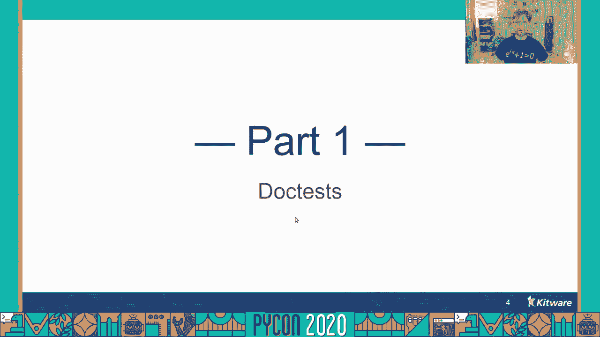

所以什么是医生测试，如果你熟悉蟒蛇，你可能知道如何写一个函数，你可能也知道 如果你把一个字符串直接放在一个函数后面，这是一个文件字符串 在一个文件字符串，你可以把任何你想要的文档，所以一个真正有用的。要做的是演示如何使用您编写的函数，所以你可以在这里输入一些代码，如果你在代码前缀三个人字形在一个空间里 那就是一个文档测试，我在这个例子中突出显示了 doc测试，你可以看到我们创建了一些演示输入。

我们展示了如何将这些输入传递给函数本身，我们断言输出看起来是合理的，如果您能提取此代码 并在您的连续集成套件中进行测试，你不仅可以增加你的保险，但要更有信心你写的代码是正确的。
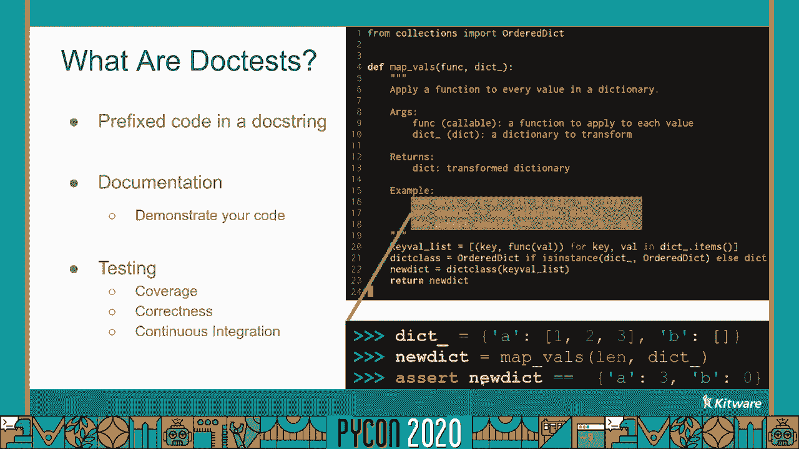

那么医生测试还能做什么，如何将 doc测试作为示例进行开发，每当我读一节课，在我编写任何功能之前，我喜欢创建一个名为demo的类方法，我可能会称之为演示数据或随机，视情况而定。但基本的想法是我想创建一个输入的例子 我感兴趣的操作，然后我打开蟒蛇，创建这些输入的实例，我开始和他们一起玩，当我和他们一起玩的时候，我最终集中在我感兴趣的功能上，但那不是。

这不是我在蟒蛇身上做的唯一事情，我也一直在写支票，以确保事情进展顺利，正如我所期望的那样，所以与其退出 IPython让所有的支票白白浪费，为什么不把这些也复制到源文件中呢？

有什么比把它们放在医生测试里更好的地方呢，这意味着作为开发周期的自然副产品，你不仅写了你感兴趣的功能，但对它的测试也是如此，而这个关键的测试是与代码耦合的，这意味着如果您必须重构您的模块。测试总是伴随着它，另外，当你开发doc测试时，你在任何地方都有进入点，在那里你有医生考试，doc测试总是允许您创建所需的输入，因此，您可以一行行地遍历一段代码，而无需任何其他先决条件。

如果您有一个长时间运行的代码堆栈可能会出错，那么这是非常有用的，可能是在具有 doc测试 而不是重新运行代码的函数中，也许您可以使用它中的演示输入来重现该错误，也许可以修复它。而不必重新运行那个长时间运行的堆栈太多次，这样现在我们就知道什么是文档测试了，以及如何开发文档测试，让我们具体谈谈如何编写 doc测试，最重要的是，如何首先运行它们来编写一个文档测试，你只是有一个功能。

写一个函数的测试，您在您的测试前加，三个人字形和一个空间，然后简单地将这个文本块插入到函数 doc字符串中，除了一些小的例外，这基本上就是编写 doc测试所需要做的一切，现在要做一个医生测试。这有点棘手，要想知道为什么会这样。

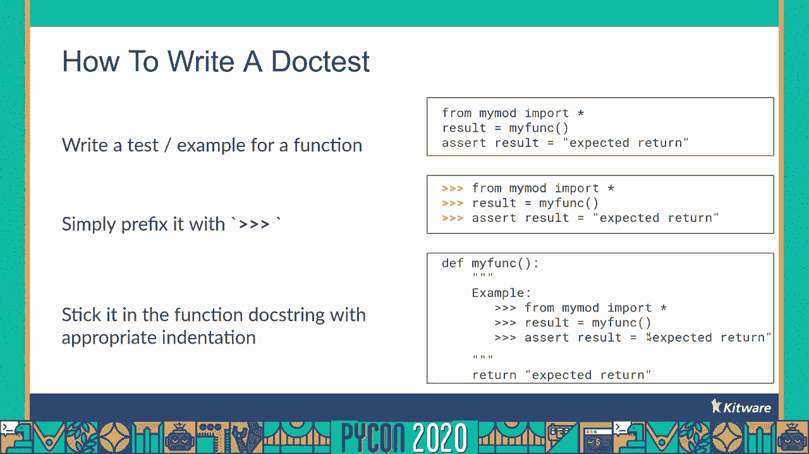

我想谈谈几个案例研究，作为第一个案例研究，我想谈谈这个函数段，这个功能的概念是，我们要接收一段文字，我们要去掉所有多余的线和空格，然后我们返回输出，为了测试这个，让我们创建一些输入文本，我们用三个引号。这意味着文本将充满额外的新行和空格，我们可能不想要，让我们通过一段来传递这篇文章，得到输出，然后我们可以断言 在原始文本中有一个新的行字符，但是输出文本中没有新的行字符，似乎是一个合理的测试。

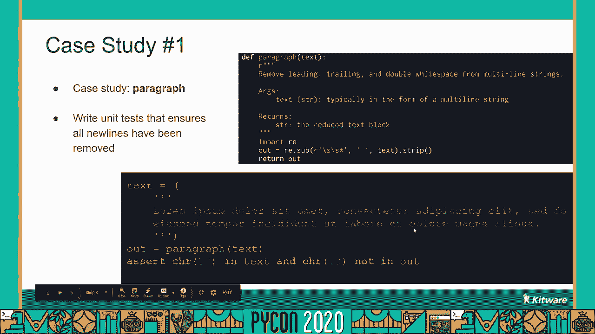

所以让我们把它创建为一个文档测试，我们会做一个文件，说话点，我把函数放进文件里，然后我会把 doc测试插入到 doc字符串中，我将以适当的三个chevron作为前缀。让我们使用内置的python doc测试模块来运行这个，是啊，Python实际上附带了一个 doc测试模块来运行这个测试模块的主块，我们可以用蟒蛇，意思是运行模块的主模块，作为一个论点。

我们会给它一个文件，我们想在这个文件中运行文档测试，它会运行文件中所有的文档测试，所以我们开始吧，让我们看看我们得到了什么错误，发生了什么 我们我们我觉得测试看起来很合理，这里面似乎没有任何语法错误。怎么回事，我们有一个语法错误，在很好地解析时，文件有一个意想不到的结尾，实际情况是，没有帮助，doc测试无法处理多行语句，我们可以解决这个问题，方法是在多行语句之后取所有额外的行。

并将前三个人字形替换为圆点圆点，如果我们重新进行医生测试，带有这个新编辑测试的模块，我们看到它起作用了，我们必须告诉python如何解析它自己的代码，这有点烦人，但我们到了那里。所以这次我们再来看另一个案例，让我们看看函数，都一样，我们的想法是引入一个可迭代的，我们要确定迭代中的所有项是否都是相同的，我们将使用狗测试的一个功能 我还没有说过，如果您执行一个函数，它返回一个值。

你可以在下一行，给出您期望得到的值的字符串 表示形式，我把它叫做"欲擒故纵"，你通过调用这个函数得到了一些东西，你想要的东西是在这里传递一根绳子，所以如果我们把所有的事情都放在一个上面，一个一个。我们期望在一个空列表中都能实现，我们也期望得到真正的一和零，他们绝对不一样，如此虚伪，让我们确保它在间隔内工作，我们可以创建一个没有相同元素的区间，我们可以把第一个弹出来。

然后检查 以确保它对其余的人有效，一个一个应该是一样的，如此真实等等，所以让我们做这个医生测试，把它放在talk dot py文件中，让我们使用内置的python运行doc测试，DOC测试模块。
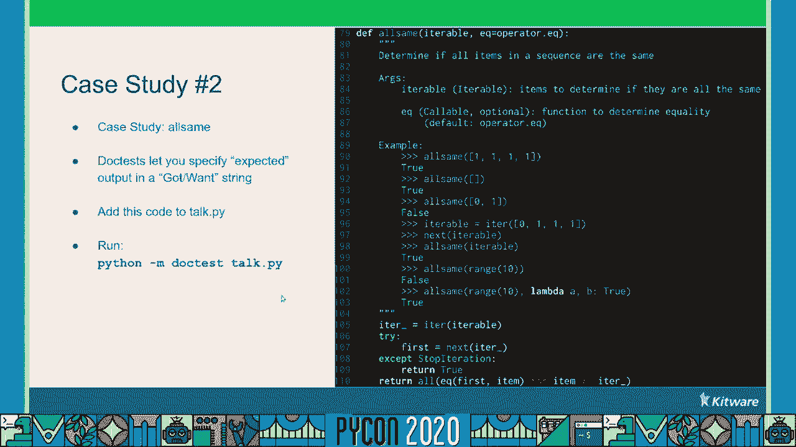

没有多行语句，所以这似乎又是正确的错误。
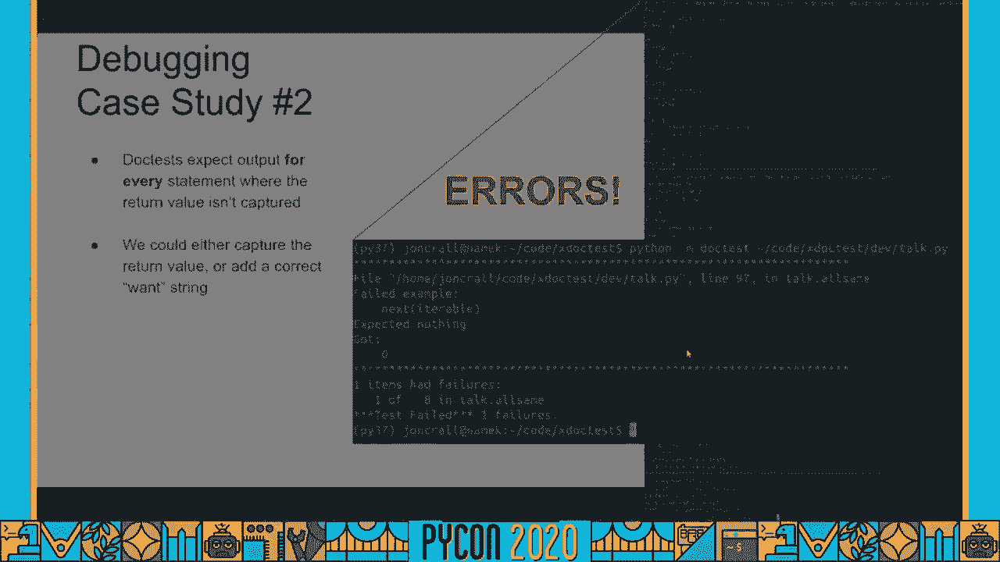

好吧，发生了什么事，让我们看看我们在下一个可迭代行失败了，我们没有期待什么，但我们一无所获，如果你还记得，我们弹出那个可迭代的第一个元素，因为我们想测试一下，迭代，我们没有给它期望的东西。因为我们没有给它任何东西，我们发现了一些东西，内置的 doc测试模块会出错，因为它迫使你为任何你想要的东西输入价值，所以好吧，我们可以解决这个问题，我们可以解决这个问题。

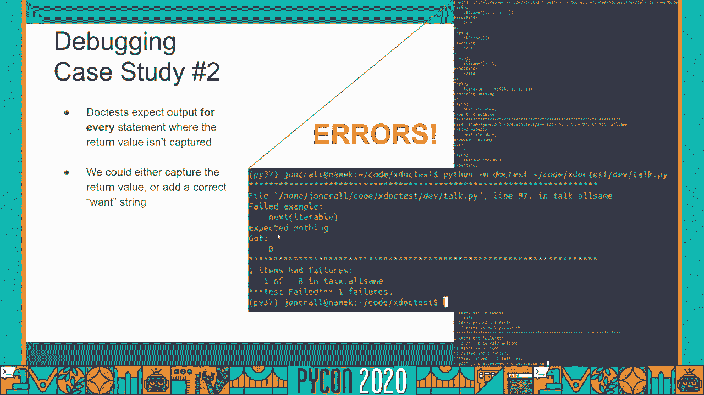

实际上使用了另一个我还没说过的 doc测试特性，然而，通过在这一行的末尾添加带有 doc的冒号和省略号的注释来指示旁路，我们启用了 doc测试的省略号特性，这意味着如果我们给它一个点，点，点。与这份声明中的任何内容相匹配，这将有效地防止我们，防止我们需要关心这里发生了什么，因为为了测试的目的，我们不这样做，如果我们再重播一次，这将很好地工作，至少我认为这行得通，事实证明，它实际上不是。

但让我们跳过前面。
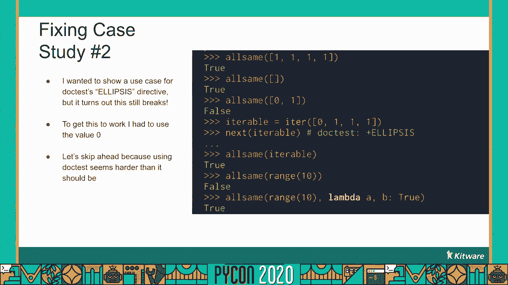

因为运行医生测试似乎比它需要的更难。
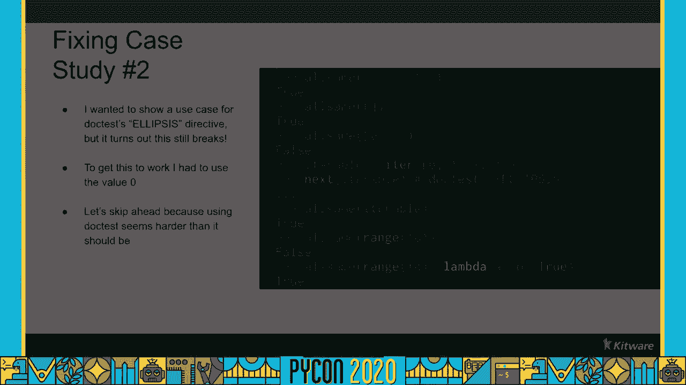

所以我想提出一个问题，为什么不是到处都有医生测试，它们看起来真的很有用，但正如我们所见，它们运行起来有点棘手，你确实经常在野外看到它们，但问题是很多时候，应该提供的代码，如何使用模块的示例。已经不管用了，因为代码写出来后就变了，因为人们不在他们的连续集成服务器上运行他们的文档测试，他们没有捕捉到这些错误，这是有道理的，因为运行医生测试，正如我们所看到的，是棘手的，所以如果你能帮我。

如果有办法减少运行文档测试的麻烦，这就引出了我今天要讲的内容，X doc测试，所以 x测试基本上是一个向后兼容的模块，关键的特点是它有更多的宽容，有长长的绳子，它使用静态解析解析您的 doc测试。与内置在其中的动态解析不同，它有一个增强的跑步者，输出消息稍微好一点，它有一个清洁的 cli，但是到目前为止 x doc测试最重要的特点是，它有更简单的 doc测试语法。

而不用在代码前面加上人字形或圆点，取决于它是否是多行语句，点测试有一个规则，在所有东西前面放三个人字形，然后就完蛋了，所以这怎么可能，为什么内置的 python测试模块有这样的语法限制。但是 x测试并不能很好地理解这一点，我们需要快速旁听一下左边的形式语言，我有一套叫做乔姆斯基等级制度的东西，哪种等级，语言的复杂性，它们的表现力，关于他们的问题是多么容易，所以在最底层我们有规则语言。

哪一个是最没有表现力的，但最容易问的问题是，上图，我们有上下文无关的语言，在那上面仍然是概念上下文敏感的，在最上面，我们有可回收的，递归的无数语言，相当于图灵机，因此我们的朋友艾伦·图灵。乔姆斯基的等级制度是，呃，自动机理论中的前语言，所以在右边我有一个更完整的版本，你可以查阅维基百科，如果你有兴趣的话，但为了我们谈话的目的，我们真的需要理解常规语言和上下文无关语言。

所以这就是现在的理论，我们去练功吧，在我们的谈话中，蟒蛇在乔姆斯基的等级制度中处于什么位置，我们现在要把 python归类为无上下文语言，如果你上网，您很快就会发现 python并不是没有上下文的。但这主要是由于压痕，呃，范围界定，如果你把这个抽象出来，你就会得到一种上下文无关的语言，所以它现在已经足够接近我们的目的了，Python有两个我感兴趣的模块，这里我们有正则表达式模块 它解析正则语言。

我们有一个分析 python上下文无关语言的 asmodule，因此，doc测试模块的问题在于，它试图使用正则表达式划分doc测试，现在 doc测试只是 python代码，所以python太复杂了。不能用正则表达式来解析，你不能从数学上做到这一点，所以在 x测试中，我把第一个模块，带有 asst或抽象语法树模块的正则表达式模块，这就是我如何提取哪些行属于 x文档测试中的哪些语句，本质上。

doc测试是python代码，我们需要这样对待他们。
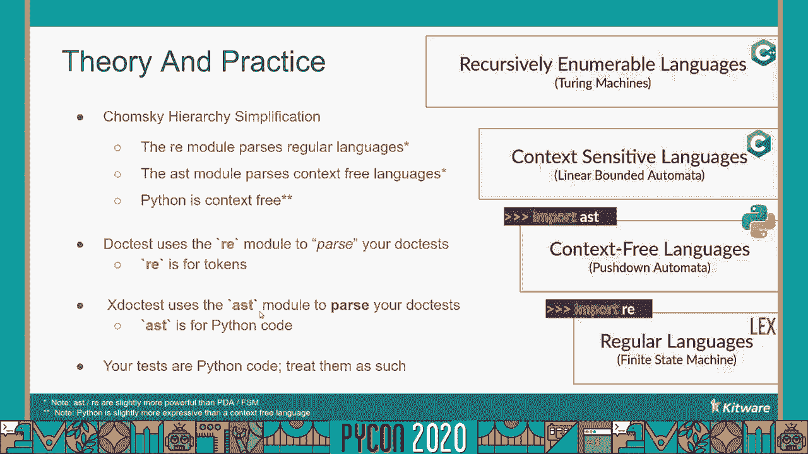

现在我们对 x测试有点熟悉了，让我们回顾一下我们的案例研究，让我们重新运行段落文档测试，与其使用 doc测试模块，我们将使用 python dash m x测试，我们会通过的。另外还有 talk py文件，x test允许您指定要运行的doc测试的函数的名称。

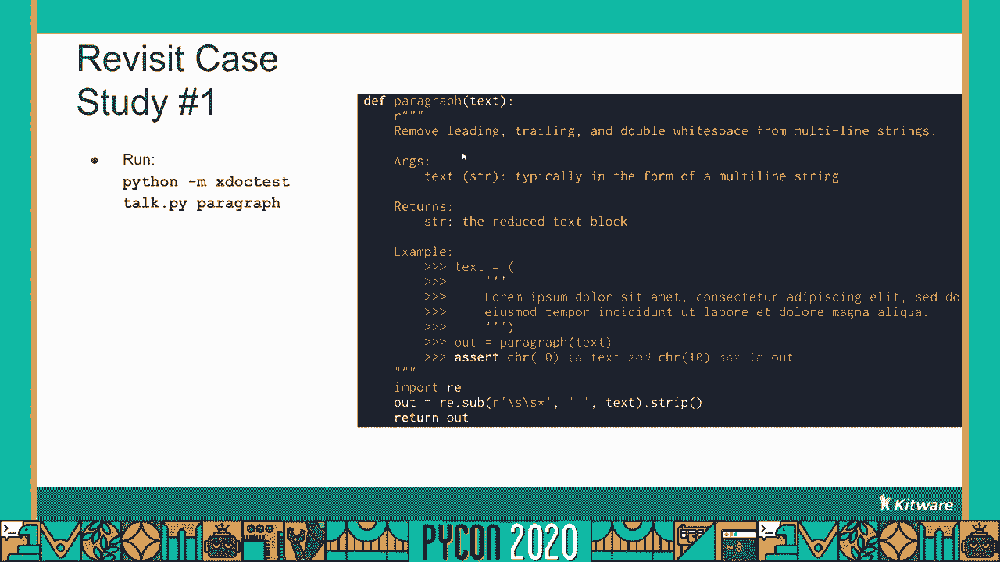

所以我们运行这个，它的工作，没问题，X测试能够处理压痕和前缀，不管语句是多行还是单行，多行字符串有时有那些人字形前缀是有点烦人的，你可以根据需要把课文写出来，X doc测试也可以处理这种情况。因为它像解析代码一样解析doc测试，它不需要知道哪一行属于哪个语句，所以你可以省略多行语句中的人字形，但你不必，所以现在让我们重温第二个案例研究，如果你还记得上次这个下一个可迭代的行 给我们带来了问题。

因为它返回的东西，我们没有告诉它 我们期待着什么，让我们在talk dot py文件上运行python dash m x test，让我们再次测试这个函数，这个也行，建立了 X点测试，以至于默认情况下。如果，你不给它任何检查，它假设您不关心检查该值，如果你提供一个需求，它仍然会失败，你得到的东西是不同的，但如果你不在乎，它也不在乎了，X测试灵活。

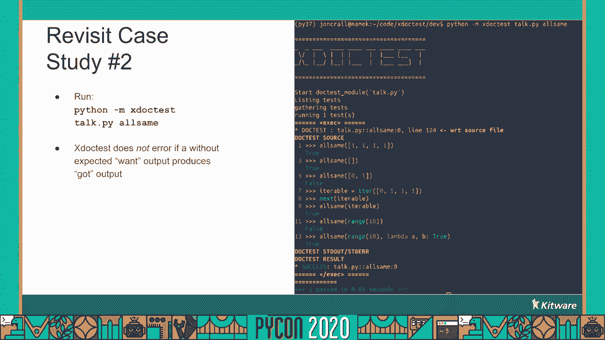

使用原始内置的 doc测试模块运行 x doc测试也更容易，你只能给它一个文件路径，它将运行它能在文件 x中找到的所有文档测试，另一方面，您可以向它传递模块名称或模块路径。或者您可以传递一个特定的函数或类来运行，更确切地说，如果函数或类中有多个 doc测试，您可以使用这个冒号索引语法来指定，要运行的 DOC测试。

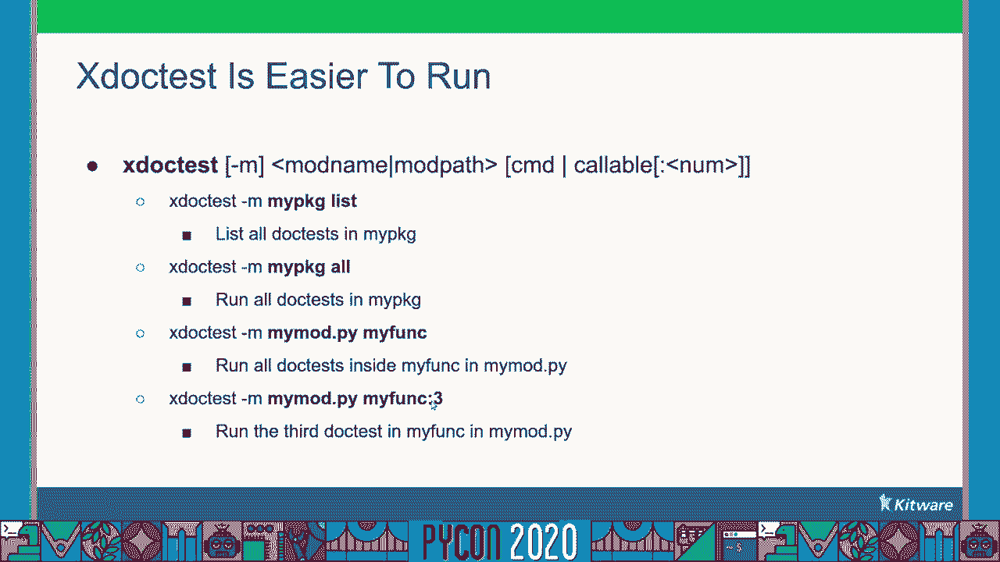

任何失败的文档测试都将列在底部，他们不仅会被列入名单，但是它们会以这样一种方式列出，它给你一个命令，你可以用它来重新执行，失败的 doc测试和可能的调试。x doc测试不仅提供与 dog测试本身有关的故障 发生的行号，但是文件里的文档测试，最后，我们用颜料给输出上色，让所有的东西都更容易阅读。

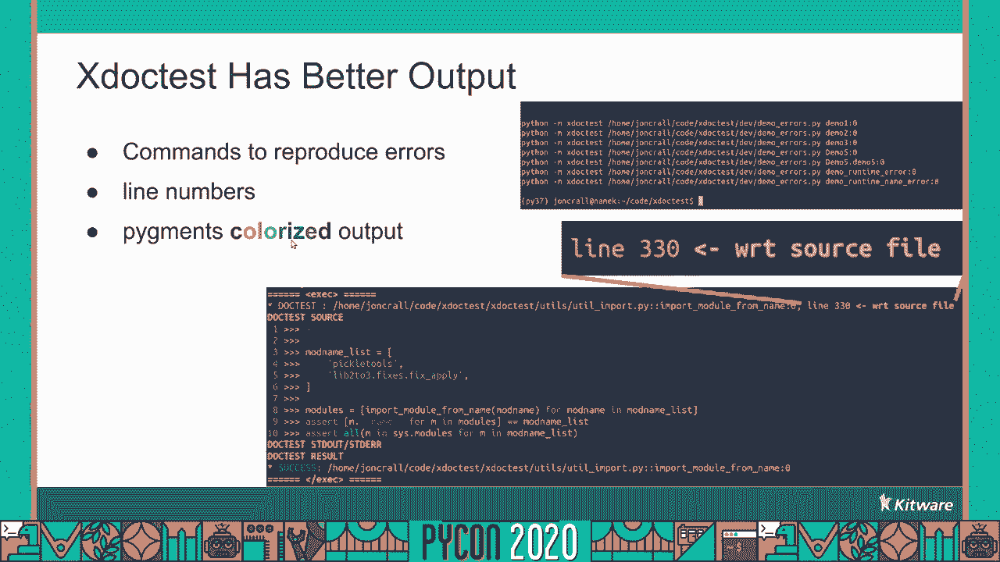

思维测试有更好的指示，我们讨论了一些存在于内置 doc测试模块中的指令，尤其是椭圆指令，但也有一堆，更多他们中的一些人，我发现没有其他人有用，实际上 x测试并没有实现这些，如果你想要这些，4。你可以给我发个求职信，我多半也会接受，但在野外我还没见过它们经常被使用，更有趣的是，x doc测试 有一些新的指令，即，跳过它的作用是本质上跳过了你所需要的线，将基于命令行参数有条件地跳过正在执行的行。

在这种情况下，这一行将不会运行，除非命令行上存在破折号 显示，您还可以设定一个模块是否存在 并且是可移植的，在本例中，我们检查numpy模块是否存在，或者你可以调节操作系统，您可以查看文档。了解更多可能使用条件的示例。

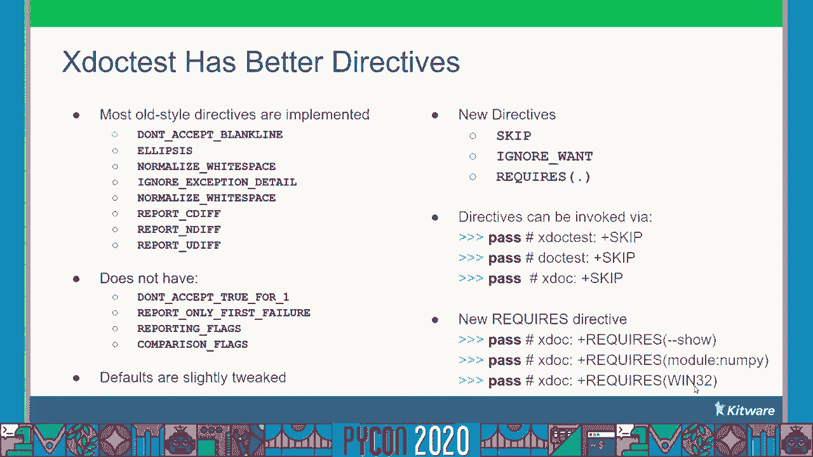

让我们看看这些指令的一个例子，我没有提到的是在最初的 doc测试模块中，指令只能在行中应用，本质上，你只能把它们放在一行代码后面，它们只适用于 x doc测试中的特定行代码，如果你有一个指令。这是线上唯一的声明，这就有点不同了，然后这个指令适用于这条线以下的一切，否则它在同一条线上，它就像以前一样工作，在本例中，我们有一个内联指令，其次是多，行指令后跟另一个多行指令。

注意这里的减号而不是加号，减号使指令失效，然而，加号使它能够，所以如果我们真的用 x doc测试来运行这个 doc测试。
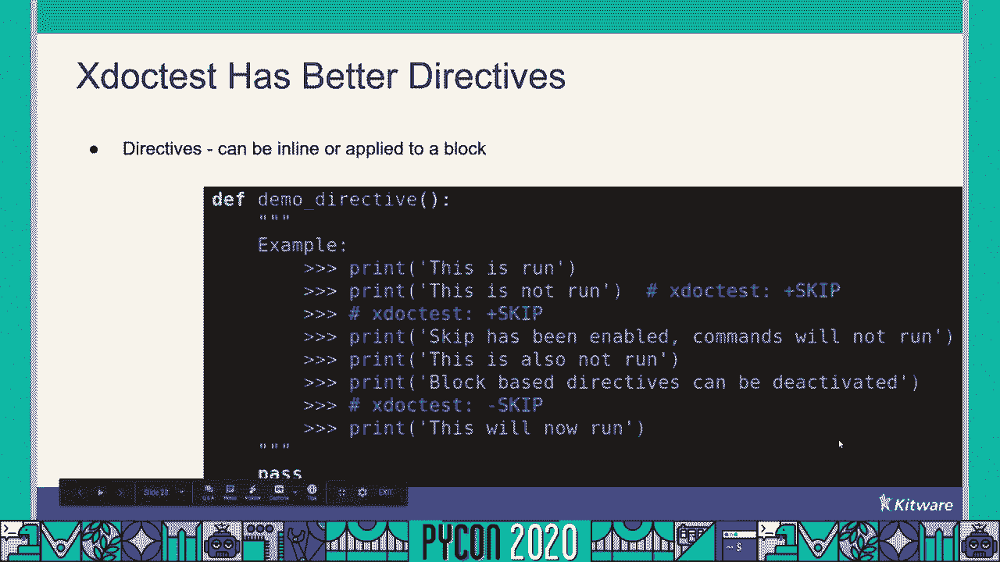

我们看到 x doc测试打印出 doc测试的源代码，我们可以看到我们得到的输出，我们看到，这是运行，因为这是第一行，还没有应用指令，那么下一行就不运行了，接下来的三行也是，因为我们启用了跳过指令。但是如果我们取消了跳跃指令，最后一条线确实存在，装有圆周率测试插头的 X测试船，PI测试实际上附带一个默认内置的 doc测试插件，这将告诉它禁用其内置的doc测试插件，并启用x doc测试插件。

这将把您所有的狗测试添加到您的测试套件中，那么当你的医生测试有效时 会发生什么，如果你用 x测试转轮代替圆周率 测试转轮，所发生的是，它告诉你它找到了多少个测试，以及有多少个测试将运行它。然后向您展示将要运行的测试的源代码，然后它显示输出，最后它会告诉你通过了多少测试，呃相对于有多少测试，在更有用的情况下，当 doc测试失败时会发生什么，我刚才说过了，但让我们看看细节，又来了。

X测试打印，要运行多少个测试，它打印源代码和输出以及结果是什么，但最后它会告诉你哪些测试失败了，它告诉您一个命令行，您可以将它放入您的shell中，以重现该测试。
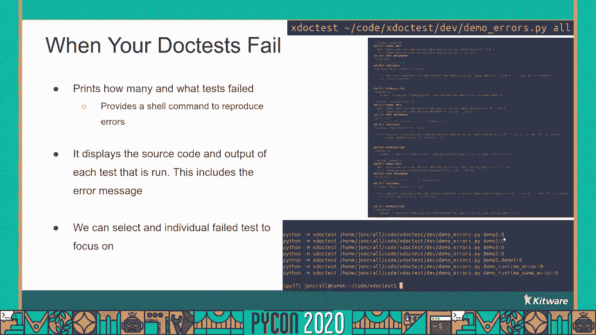

我们呃，在这里复制其中一个失败的测试，我要重现演示 三。

你可以看到它只是运行了一个再次失败的测试，打印出这是失败的测试，我们可以调试这个，呃，尝试修复它，我们看到doc测试源是print demo 5，然后我们传递给它一个demo 3的字符串。所以我们得到了演示五，所以我们希望能得到第三个演示，但我们得到了演示 5，然后它给了我们一点在字符串的表示上的差异，因此我们的点测试失败了，所以我们可以去解决这个问题，希望我们的医生测试能奏效。

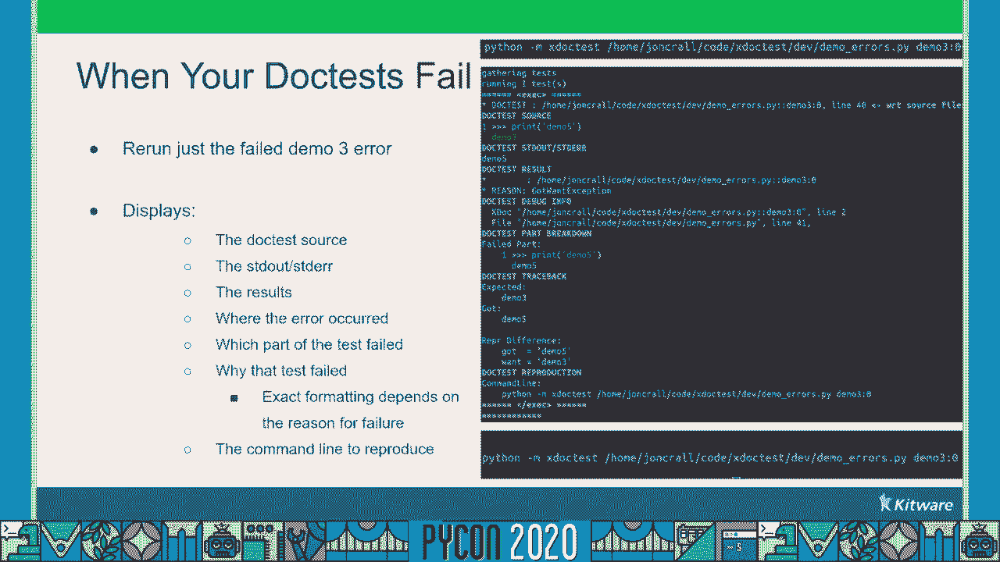

这就是x doc测试的基本概述，它提供了一种更简单的方法来运行你的doc测试，我没有检查它能做的一切，有一些杂七杂八的功能和一些其他的东西，我还没有谈到，一个其他的功能我很快就会提到。有一个零弧线 跑步者的精神是到处都有入口点，我经常发现自己滥用 x doc测试来运行 实际上没有 doc测试的函数，只要函数没有参数，你没有理由不能直接运行源代码，所以 x博士测试有能力。

如果显式指定函数，它将运行任何没有任何参数或任何不能自省的参数的函数，称为 u带，我想强调的是 在写你的腰带时，我已经能够使用x stock测试在代码库上实现100%的测试覆盖率。这就证明了 doc测试是多么有用，所以 x测试并不完美，有一些局限性，一是比原版稍微慢一点，呃，模块，但那主要是因为，使用抽象语法树而不是正则表达式，这很难避免，但即使这样。

可能还有一些事情可以做得更有效率一点，一点都不慢，但是它比内置的测试模块要慢，另一个限制是，它不是百分之百向后兼容的，大部分都在那里，但我们有一些指令没有执行，同时我对这些指令的一些默认值进行了调整。使其本质上更加宽容，使文档测试更有可能在没有，呃，给程序员带来太多麻烦，所以让我们结束，我们已经讨论过文档测试 以及如何使用它们，使用原始的 doc测试模块以及 x doc测试，两者有些不同。

原始的 doc测试模块内置到标准库中，它使用正则表达式解析 python代码，它有一个限制性的语法，输出是一种简洁和硬，阅读，它一次只能运行一个文件，但它背后有巨大的惯性，因为它是标准库的一部分。另一方面，我们要做 x医生测试，它是一个外部pip可安装模块，使用抽象语法树来正确解析python代码，它有一个更宽松的语法，有更好的指令，颜色可以说更可读的输出，它基本上是向后兼容的。

它在很多地方都运行得很好，嗯，它可以运行单个函数或整个模块，呃，两点七加上圆周率，但它只有三颗四星，呃，尽管有三个，每月4000次下载，所以如果你想为 x测试做贡献，你可以在github dot。com上找到，斜杠空气 x试验，我在右边显示了自述文件的图像，捐款的主要领域再次是，牧师可以再快一点，以及外部文件可以做得更好，不可怕，在过去的几个月里 我做了很多工作。

但它可以使用一些与项目联系不那么紧密的眼睛，另一个贡献可能是执行那些我还没有做的其他指令，如果你想建立在 x股票测试的基础上，我写了很多有用的静态分析工具，我认为有很多很酷的重构工具可以建立在，呃。这些公用事业，结束，我们学过医生考试，他们是什么，为什么他们很棒，我们已经讨论了内置的 doc测试模块及其优点和缺点，以及新的x点测试模块，它对内置的限制进行了改进，以及一些很酷的东西。

如果你不记得这次谈话的其他内容，请记住乔姆斯基说的话，正则表达式用于令牌，抽象语法树是用于 python代码的，不要使用正则表达式 试图解析 python代码，从数学上讲这是不可能的，我回答问题。但在这种形式下做这件事有点困难，走吧，呃，评论中的问题，我会尽我所能解决他们，原来如此，就这样结束了，你可以 pip安装 x测试。

