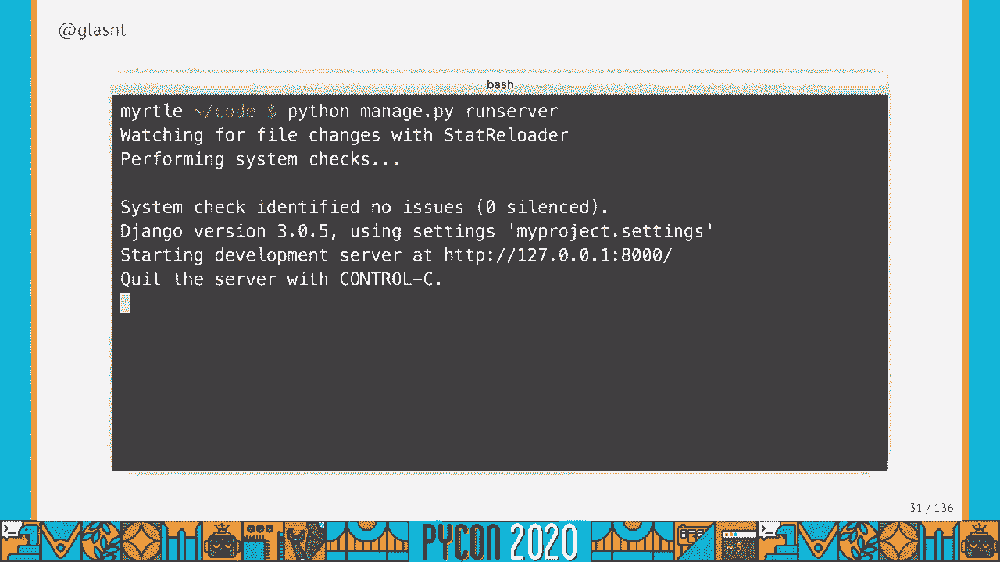
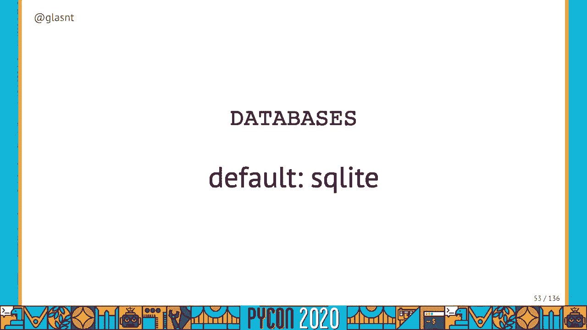
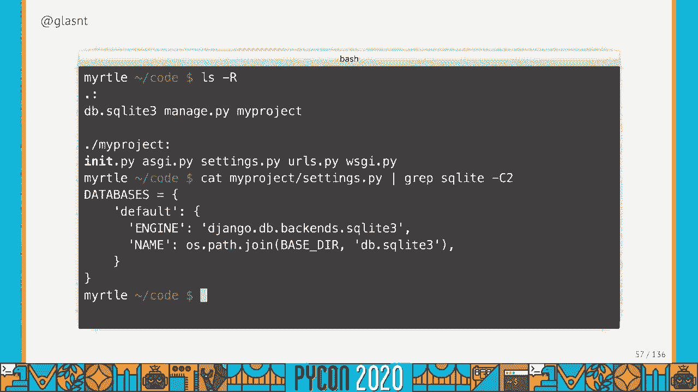
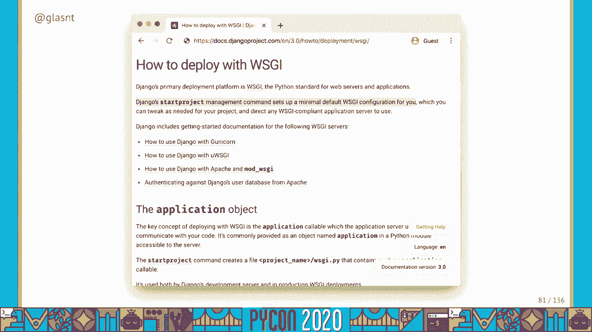
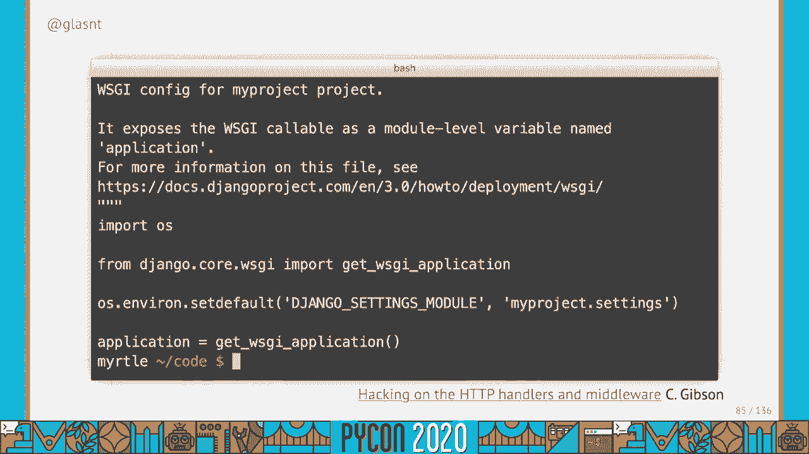
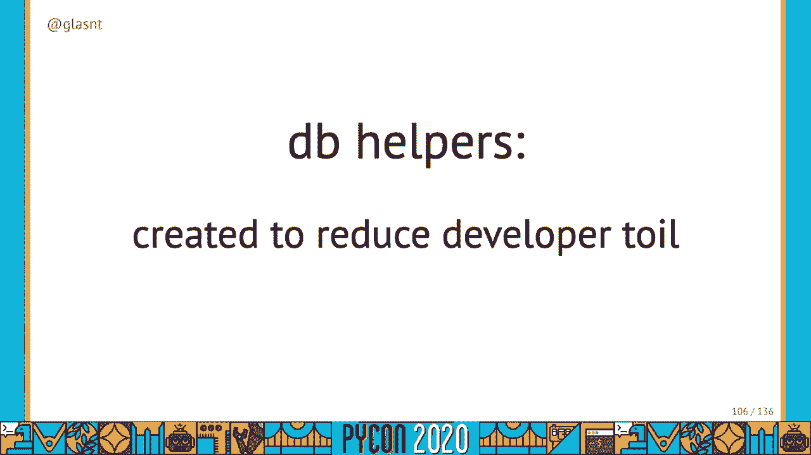
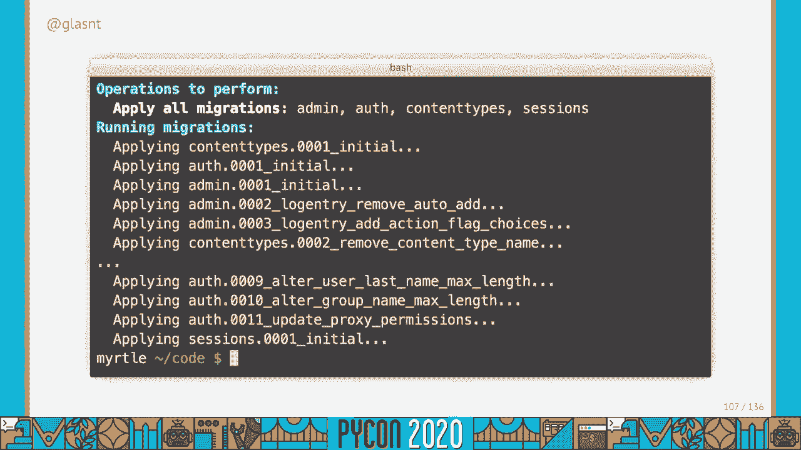

# P50：Talk Katie McLaughlin - What is deployment, anyway - 程序员百科书 - BV1rW4y1v7YG

我是凯蒂，这就是部署，这不是在讨论部署应用程序的唯一真正方法，1。这次谈话各抒己见，但主要是对部署世界的回顾，就像20年一样，这次演讲将深入讨论部署的复杂性，本质上很好地回答了这个问题，部署到底是什么。更具体地说，什么是django部署，我们今天旅程中的一些有趣的地方，与其他网络框架相比，在部署上，一路走来，这篇演讲和代码示例是专门针对 django三点零的，点五和蟒蛇 三点八点二，对不起。

这个谈话可能有点过时了，但希望你还能学到一些东西，我们今天也要坚持基本的姜戈，没有额外功能，没有异步，无任务管理，没有其他帮手，只是任何从盒子里出来的东西和库存标准，Django，这次谈话应该是有用的。到第一次健身，如何部署你的 django女孩教程项目，如果你想重温一下姜戈的故事，让我们看看姜戈从盒子里出来的样子。

所以让我们打开一个新的终端，安装pip，决哥现在，但我还不能做很多事情，我可以创建一个模板，为我的模板运行 django admin start项目，我把它叫做我的项目，我要把它安装到当前目录。现在我得到了一大堆模板文件，尤其是托管的 pi文件会非常有用，我们会经常使用这个文件来运行本地的网络服务器，我需要在服务器上运行 python托管点π，它将为我启动一个本地网络服务器。

但是有一个巨大的红色错误信息，谈论未应用的迁移，有一个有用的建议，我应该运行什么来修复这个问题，虽然，所以让我们停止我们的Web服务器，运行python托管的dot pi migrate，喂。一大堆成功的产出，它好像帮我完成了所有的迁徙，它有没有改变我本地的文件系统，让我们看看，喂，现在那里有一个数据库文件，这应该是有用的，所以让我们再运行一次 ning的运行服务器。

我不再收到一条巨大的红色错误信息。

有人建议我去这个网址，嘿，安装工作成功，恭喜你，我现在让 django在一个模板项目中本地运行，我可以导航到管理员，我可以开始开发我的 django应用程序了，让我们的应用程序在本地工作真的很简单。Python管理的 prun服务器做所有事情，它主要用作本地 Web服务器，对当地的发展非常有用，文档描述了运行服务器的功能，As启动本地机器上的轻量级开发 Web服务器，好的，不过，几个大写的段落。

请勿在生产设置中使用此服务器，不要，我不能告诉你多少次 我见过这个运行在生产中，但是文件上说，不要，它没有经过任何安全审计或性能测试，这就是它将如何保持，我们的业务是制作 Web框架，不是网络服务器。Django的业务是制作 Web框架，不是网络服务器，Django是一个非常稳定的可用于生产的 Web框架，它非常擅长成为一个网络框架，事实上，它提供任何本地Web服务器功能都是惊人的。

但它明确地指出了这一点，你不能用它来生产，我们需要用其他东西替换本地 Web服务器，文档提出了几个术语，我们真的应该描述，尤其是什么是生产，好吧，生产是一个活的环境，为什么叫生产。我问过几个蟒蛇从业者这个问题，他们中的许多人在这个问题上有十多年的经验，至少在思考中 我能找到的最好的是20世纪50年代的一篇论文，它将生产计算机和计算机软件比作本地网络意义上的生产线，然而。

把它想象成一部更戏剧化的作品，你有所有的后端东西，与声音的灯光一起工作，以呈现用户看到的表演，什么是网络服务器，谢天谢地，这个名字更贴切一点，Web服务器为网站提供服务，有本地的Web服务器。比如运行服务器，但也有生产级的网络服务器，Web服务器是当您进入网站时进行响应的服务，进入你的浏览器，并处理像http之类的东西，礼宾，摇晃，内容类型和运行的服务器是本地 Web服务器。

所以它为我们当地的网站提供服务，但它同时也是一个静态服务器，什么是静态的，然后静态静态资产媒体，这是指我们网站上不动的部分，相对于动态部分，资产可能是图片，录像，用户上传内容。它是我们可以存储在本地磁盘上的东西，并根据需要提供，当我们看文件的时候，我们可以看到，如果启用了调试功能，就会在开发中提供静态文件，如果我们设置了静态文件，好的，但是静态文件的文档也说它不适合生产使用。

这是当地发展的又一个帮手，所以我们以后需要找一些其他的东西来服务我们的静态，我们现在拥有的第三个主要元素是数据库。

我们之前看到的，有一个文件是自动为我们生成的，创建该文件是因为我们的设置文件中有一个默认配置，它定义了 sql光，三个将是我们默认的数据库引擎。

这意味着我们将使用 SQL光，SQL lite，根据文件是一个极好的开发替代方案，SQL light恰好作为本地文件来存储数据库，但我们还是需要找到其他东西来生产，Django在开发中的易用性。使它非常容易开始和发展，但对于所有这些帮手，它们都不能在生产环境中使用，Django不提供 Web服务器或数据库，生产准备就绪，它对静态文件没有任何作用，所以你得提供你自己的，如果你不熟悉生产级产品。

您最终会感到困惑，或者更糟糕地依赖于在生产中使用开发系统，你不该这么做，然而，现在是一个重要的时刻，在这里提到一些其他的东西，你可以在网上找到很多教程，以下是如何将 python部署到生产中。给你一个带有 hello world的应用点圆周率文件，无数据库，无静电，没有复杂性，这让他们很容易说，把这个代码复制到某个地方，它会运行，很容易，但这是因为一个简单的事实。

Django是一个有状态的应用程序，它有数据库要求和静态资产要求，开箱即用，烧瓶默认不作为样品，因此，它是如此容易部署，是的，您可以将烧瓶应用程序连接到无数其他支持服务，但默认情况下，你不必。所以简单的你好 世界起作用了，有状态应用程序，但是很复杂，这就是为什么我今天选择了姜戈作为我的背景，如果我选择了烧瓶，这将是一个闪电般的谈话，任何时候你关心坚持，您为部署增加了复杂性，有趣的是。

文件中也提到了这一点，回到关于在生产中提供静态文件的页面，它提到这个奇妙的小宝石，每个生产设置都会有一点不同，每个生产设置都会有一点不同，我不知道是谁把这个加到文件里的。但在这一点上 它已经存在了大约十年，这是很重要的一点，这取决于我在几乎所有其他部署谈话中听到的台词，当我试图告诉你一个真正的部署方法时，这取决于那是正确的，但我不会用这句话来代替，我要用这张照片。

我是萨敏，我不是你的系统管理员，曾经是管理员，我是操作工程师，我做过父亲，我做过自动化工程师，我干这行快十年了，在这一点上，我为网络主机供应商工作，对于平台作为一种服务，现在对于作为服务的基础设施。每一次部署都不同 又独特 又美丽又复杂，部署任何有状态应用程序，你需要三样东西，您将需要一个地方来运行您的 Web框架，然后你需要考虑你的状态，你需要连接到你的数据库，您可能需要提供静态文件。

部署 django应用程序，你需要运行一个网络框架，连接到数据库 并提供静态文件，这些要求要求您连接到状态，它还要求您需要一个地方来运行您的 Web服务器，为了符合威士忌的兼容性。migrate命令和 collect静态命令，本演讲的其余部分将描述这些助手是如何工作的，以及他们如何帮助我们，在部署我们的应用程序时，如我所说，姜戈和威士忌兼容。

Whisky代表 Web服务器网关接口，它是网络服务器的 python标准，但就像威士忌，威士忌是 python应用程序的标准接口，与网络服务器对话，它是一个网络服务器网关接口。这是在2003年提出的一个标准，作为佩普三三三三，作为提示，将 Web服务器和 Python Web框架之间的接口标准化，它允许我们选择任何网络服务器，我们希望它能理解威士忌。

并将其与我们的姜戈应用程序一起使用，根据文档启动项目本身为您做了一个最小的威士忌配置。

要获取可以运行 python应用程序的可调用项。

卡尔顿·吉布森做了一个关于这四条线的完整的演讲，在威士忌网络服务器上部署一个 django应用程序，你需要一个威士忌网络服务器，两个最常见的威士忌网络服务器是微型威士忌，独角兽。每个服务器都有自己的专用对话，那么，如何部署一个威士忌酒网络服务器呢？好吧，会有很多选择可供选择，在很多方面你都可以做到这一点，我有个更好的问题，您需要多少自定义基础设施，因为，就像我们之前看到的。

每一个生产设置都有点不同，但是有很多选择可以适用于80%的情况，如果你有一个标准的 django应用程序，如果你对增加的复杂性或专业系统没有任何强烈的意见，这些系统有80%的时间为你工作，重要的是。你想自己做多少基础设施管理，如果你是一个 django开发者，您不想把时间花在管理基础架构上，我的意思是它肯定是超级有趣的 能够设置你自己的物理服务器，你自己的网络，您自己的 Web服务器。

你自己多余的能量，你自己的一切，但当你只想在网上申请时，为什么不付钱给别人帮你做呢，再说一遍，我们的设置中没有任何定制的东西，我们对任何事情都没有强烈的意见，所以为什么不让别人帮我们做呢。作为系统管理员，您需要担心什么？我以前拿工资是为了担心，你是开发商，有点担心，是好的，不过，谢天谢地你，可以花钱找人把它拿走，这就是我们所知的托管，因为你花钱托管是为了替你管理。

有两种主要类型的托管提供商，将平台作为服务，或基础设施作为服务，这些通常被缩短到通过和 ias，因为语言冗长而可怕，我们是技术专家，需要到处保存信件，是的，本列表并非详尽无遗。在部署 django应用程序的范围内，这是两个主要的选择，还有其他人，您可以像在服务器上运行应用程序那样详细，你在自己定制的硬件上 自己编译的，我之前提到的情景，或者你可以试着把姜戈挤进一个小方块里。

把它当作一种服务，但这是两个极端，这些都不是标准案例，如果你想这样做，它们是绝对有效的，但我说的是百分之八十的病例，我提到的两个选项是作为服务的平台和作为服务的基础设施，以平台为服务。这些是你的一般主持，处理 django和主要网络事物的平台，这些系统你担心你的 django应用程序和你的数据，他们会担心网络服务器，操作系统，硬件，仓库，网络和其他一切，通常情况下。

你无法选择为你管理的任何事情，如果你需要一个选择，您经常需要降低一定的复杂性级别，并将基础结构用作服务，您担心的这些系统是要使用哪个网络服务器，您想使用哪种操作系统。通常您必须从容器或虚拟机的角度来考虑它，提供者管理硬件，仓库，网络，等等给你，这在很大程度上是一种概括，关于这件事还有很多其他的说法，我肯定我提到这个是有原因的，你想担心什么，如果你没有意见。

选择平台作为服务，如果你有一点意见，选择基础设施作为服务，数据库呢，姜戈为我们提供了两个管理指挥助手，哦，当然有一个动态的网络管理门户是相当酷的，也是，但这些命令只是选择。Python托管的 dot pi make migrations，python管理的点 pi迁移已经明确创建，减少开发人员的辛劳，他们自动化了将 django模型迁移到 sql的整个系统。

对于您想要的任何数据库，这些是我们之前必须运行的命令，为了创建我们的主要数据库结构，一开始，他们处理的是管理方面的事情，内容类型，认证，这些是管理员工作所需要的东西。

那么您选择哪个数据库呢？我是说，Django lists，一堆兼容的数据库，一大堆第三方也很有用，并非所有的数据库都是以相同的方式创建的，你想担心什么，如果你的公司里已经有了一个数据库专家。如果你有一个首选数据库，使用他们知道的数据库，就用那个，否则，只需使用 Postgres，我知道对不对，我其实是在告诉你一个可靠的观点，但这不是没有理由的，文件支持 我在这里。

Django是一个数据库不可知论的 Web框架，但是 Postgres有许多其他数据库不共享的特性，Django支持其他数据库 具有，功能的广度，只受到社区贡献的限制，在录制的时候。波斯特格雷斯对社区的贡献最大，如果希望首选数据库得到更多支持，通过在 django中支持它的功能来提供帮助，或者在Postgres和maria db的情况下，他们自己为数据库做出贡献，它们是开源项目。

他们的力量取决于他们的贡献，既然你已经选择了我让你选择的数据库，现在，你得主持它，这里有几个选择，您可以设置自己的容器或虚拟机，从 ubuntu安装 postgres，必须处理你的缓存和复制品。所有这些或者你想担心什么，你是蟒蛇开发者吗，还是你是数据库管理员，托管数据库是一种专门的服务，许多云场所都有，数据库是一个东西，许多编程网络框架和网络语言和格式在移动，所有其他无数的事情。

数据库是一种共享商品，这意味着有一个稳定的，稳健，在受管理的数据库环境中 适合您的通用解决方案，你得担心你的姜戈模特，Django担心这些迁移的产生和应用，然后您的托管提供商将处理存储，备份。持久性和维护，好主意，你的网络服务器和你的数据库位置最近，这样他们就可以在网络上尽快地互相交谈，因为你知道光的传播速度，但是诚实地管理数据库是一个非常好的主意，即使它们是唯一会让你花钱的东西。

因为说到底，你的网站代码会在你的笔记本电脑上有一份副本，在 Github上，在你的源代码控制系统上，但你的用户数据可能是你生产中唯一的副本，所以确保它被正确地储存是个好主意，它被备份了。你的数据库需要维护，你的托管服务提供商可以处理类似于零的事情，停机时间，磁盘扩展，其他的一切，因为，作为一个曾经得到报酬的人，他不得不在工作时间之外手动完成这项工作，我很感激我可以付钱给别人来担心。

对我来说，对于托管在，比如谷歌云或其他云提供商，您的托管数据库最终可能成为您唯一的成本，什么，用于计算和存储的自由层，像你管理的数据库有成本，但为了内心的平静付出代价是值得的，好的。这可能不是你唯一的成本，您可能需要为自定义域和其他非免费的东西付费，但我们今天不会去探索这种复杂性，所以这就是数据库所涵盖的，最后是静态文件，这里的助手是由收集静态管理的，谢天谢地，在以前的派克。

你在这里有四个主要的选择 是简单的资产，云存储，媒体上传，以及更复杂的资产汇编，如果您之前碰巧选择了一个基础设施作为服务提供者，它们通常有某种云存储，这又是超级有用的。如果你想让所有的东西都在物理上接近，如果你选择一个平台作为服务，也许您想使用简单的资产管理来代替，如果你要使用云存储，它允许您与大多数云提供商本地集成，在你的 djangle应用程序中。

云计算领域 云存储已是老生常谈，AW，存储媒体对象是大多数云提供商提供的基础服务，像数据库一样，对象存储是许多语言和框架共享的基础基础设施服务之一，因此，健壮的通用解决方案已经存在。在你不能创造自己的地方 利用这些，原来如此，我们知道如何连接数据库，所以我们知道如何处理静态文件，为了回答我们的问题，Django部署正在复制您的代码，在某个地方更新数据库，如果你需要，更新静态。

如果你需要，然后运行网络服务器，我知道这看起来不是很多，但考虑到我刚刚花了多少分钟 详细地描述了这一切，希望你现在能更好地理解，但不知道该怎么做，因为这里没有一个答案，尽管我已经描述了你需要考虑的事情。我还没告诉你怎么做，因为你的部署方式，你建立生产的方式必须为你工作，因为你得维护它，如果我告诉你一个解决方案，你可能不喜欢，或者上天禁止你不明白，这意味着你将无法维持它，我不能为你那么做。

关于这个话题有太多的东西，我今天甚至不能指望涵盖，每样东西都列在这里，它们是他们自己会议价值的材料，但希望我能帮上忙，你看，就在部署的帷幕后面向你展示 是的，很复杂，但这并不像你想的那么复杂。这次谈话充满了我自己的观点，但我相信你们都有自己的看法，可悲的是，这个活动没有真正的走廊轨道，但我的电子邮件和推特手柄列在这张幻灯片上，我很想和你聊聊这些事 情。

