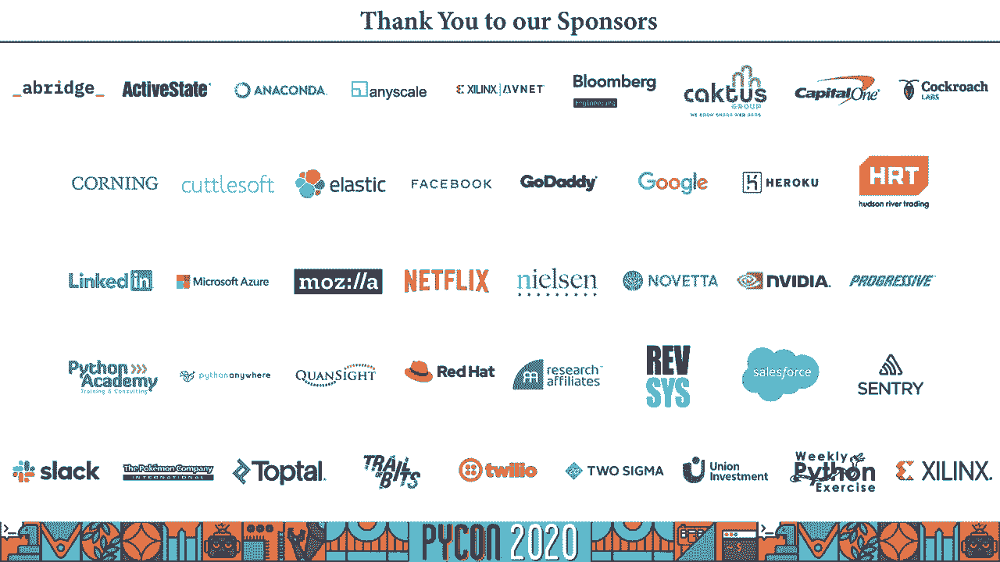

# P51：Talk Kim-Adeline Miguel - Decoding bias and narrative in competitive video games - 程序员百科书 - BV1rW4y1v7YG

你好，各位，我是金，我是林恩·米格尔，我是 vs代码的 python扩展的软件工程师，今天我要讲的是守望先锋和蟒蛇，所以这是一个解码，偏见、叙事和带有视频分析的竞技视频游戏播出。所以在这次演讲中 我将讨论一些假设和假设，向视频游戏锦标赛的观众展示了什么，我会用第一人称射击守望先锋作为例子，所以首先是一些法律术语，这些都不属于我，所以股票的轮廓，它将如何构建。所以首先我将从演讲背后的动机开始，比如我怎么会有人一开始就想出这个主意，然后描述，我将描述我是如何建立视频分析系统的，我所使用的，我做的选择，除了用蟒蛇啊，什么进展顺利，什么本可以更好。然后我会做一些数字运算，把数字运算的结果，我最初的假设，最后我总结一下，构建这个项目的收获，所以首先为什么股票，我们今天为什么在这里，所以有一件事需要记住，它会说这是因为我可以，嗯，但不仅仅是这样。

如我所说，我负责 vs代码的 python扩展，但我是做前端开发的，我更喜欢用 javascript或 TypeScript，所以我决定做一个副业，学习如何更好地使用蟒蛇，我想应该是关于我喜欢的东西。所以我喜欢玩守望先锋，我喜欢看人们玩"守望先锋"游戏，尤其是职业选手，因为他们知道自己在做什么，所以我想这周围会有一些东西，这样我就不会陷得太深，但挑战媒体向你展示的一切是很好的，就像你经常摄入的东西。所以这是在屏幕之外的思考，跳出框框思考，我决定挑战这些假设，使用假设驱动的验证，所以陈述一些假设，收集数据并使用数据来验证或否定那些最初的假设，嗯，但在我们，开始，我将简要介绍一下电子竞技和守望先锋。所以第一电子竞技有多种拼写，如你所见，所以根据维基百科，它是体育竞赛的一种形式，使用电子游戏，所以如果你把前五名，二十九年最受欢迎的电子游戏，把观看的小时数加起来，你最后得一分，十亿小时的观看。

你花了很多时间盯着别人看，玩电脑，所以这些时间可以在像 twitch或 youtube游戏这样的网络平台上，还带着啊，北美的 espn abc等传统电视频道，韩国的 OJN，有时频道。无论是线上还是传统，也可以算出来，独家广播交易，嗯，那么时间是如何，这和传统运动有什么联系，有很多合作伙伴，就像，传统运动队的老板并不少见，在电子竞技组织投资或拥有股份，然后还有代言交易，就像，呃。普通运动员喜欢广告或赞助内容，或者只是简单地把一些东西搬来搬去，使品牌面对，屏幕面向，那个，相机对不对啊，电子竞技中也有联盟和特许经营系统，如果你想在顶级联赛中竞争，你得买一个价值几百万美元的地方。原来是虚拟运动，但这个行业真的很赚钱，所以电子竞技很棒，既然这次演讲的重点是守望电子竞技，先说什么是"守望先锋"，所以守望先锋，根据其网站，这是一个丰富多彩的团队为基础的射击游戏。

由不同演员阵容的强大英雄主演，周游世界，在加速六六战斗中建立团队和竞争目标，你可以在 PC任天堂 Xbox One的 Switch PlayStation上播放，但在这里我们要把重点放在电脑游戏上。这就是对它的描述，但是当你进入一个游戏时，所以这是一个以不久的将来为背景的第一人称射击游戏，在虚构的地球上，这意味着你要去的大部分地区的地图，尽管某些特征和结构，而且里面的一些装饰会被高度虚构，有时候。所以这是两个六人小组在不同的地图上争夺目标，通常是进攻者和防守者的变体，尽管有一张地图是山中之王，在那里你必须抓住一个点，然后在一定的时间内保持这个点，嗯，正因为如此，每个地图上都有多个回合。人们在那里交换，嗯，交换角色，如进攻或防守，现在，对你来说意味着什么，在你的队伍里，有呃，三个角色，坦克损坏和支助，你有三个两个角色叫英雄，你可以从，呃，只是你需要，呃，每个团队每个角色需要有两个英雄。

所以两辆坦克要损坏并支持英雄，因为守望先锋要迎合不同的观众，呃，有很多不同类型的英雄有不同的能力，其中一些英雄，呃，陈规定型观念，例如，有一个身披盔甲的大个子保护你吸收伤害，如果你想破坏。你可以成为一个坏机器人忍者，或者你也可以是一个字面上的天使来拯救和倾听你的队友，他们也有不那么陈词滥调的英雄，所以你可以有一个强壮的粉红色头发的女士来吸收伤害，一个冬天的女人带着一个小机器人来处理伤害。或者你也可以是一个生活在电网之外的机器人，去治愈和支持你的队友，原来是守望先锋，现在电子竞技中的守望先锋，进入守望先锋联盟，所以守望先锋联盟，也被缩写为 OW L 是一个以城市为基础的特许经营联盟。所以队名是拼音，就像波士顿起义或温哥华泰坦，比赛在 youtube上直播，周末玩游戏，所以你可以在网上看，两支球队之间的每场比赛都是由多个地图组成的，所以现在的风力条件是第一支赢得三张地图的球队，记住。

每张地图都有多轮，每支球队最多有12名球员，但是呃，但是嗯，因为一次只有六个人可以玩，各队可以在地图之间交换球员，不是在两轮之间，所以你每个周末都有比赛，所以你可以喜欢。和你的朋友一起参加一个手表派对 或者不喜欢，和他们坐在一起 看，比赛就像传统的运动一样，每次都欢呼，呃，屏幕上发生了一些动作，在传统体育中，摄像机跟着球，因为那是行动发生的地方，通常这里没有球。有十二个人跑来跑去 试图保护一个区域，有时这个区域也会移动，那么这里的行动是什么，谁决定是什么，这就是整个项目背后的问题，为了回答这个问题，我提出了一系列假设，我们会先回答这个问题，即使是团队游戏。人们想看星星，因为他们想认同他们，看那些拍大戏的人，所以人们宁愿看着受损的英雄，你想做机器人忍者，所以这是因为角色偏见，然后对于团队假设，人们想为处于劣势的球队加油吗，还是他们想为胜率较高的球队加油。

人们也宁愿看赢得比赛的球队，还是两边更平衡，是吗？但是这些假设，这些是他们，观众想要什么，或者制片人认为观众想要什么，或者制片人想要观众想要什么，就像有，这里有很多层次要展开，我就把这个留给你。让我们开始在 python中构建这个系统，当然，所以首先，原来这是游戏直播截图，你可以看到这是第一人称视角，这里有很多数据是可读的，在屏幕上是可见的，嗯，但我们要关注的是底角的东西。以扮演英雄的玩家的名字，我们将利用这些数据，嗯，判断我们的假设是否有效，所以我们要做的过程，所以在广播中，播放的游戏视频，我们要从这段视频中提取帧，然后我们要把这些框架剪裁到。只保留与玩家名称相关的区域，然后我们将把这些图像发送到光学字符识别系统，会把我们送回，此图像中包含的玩家名称，然后我们要把数据存储在某个地方，可能是在某种数据库里，然后从他们那里计算统计数据。

如果你更喜欢建筑图表，这是架构图幻灯片，它只是陈述了这些要点中的内容，所以你有视频，你把它分成几帧，然后你裁剪框架，只保留相关的区域，然后你把这些图像发送到光学字符识别系统。然后返回一个你存储在某个地方的名字列表，然后你做一些数字魔术 得到图表和数据，所以这就是理论，所以在实践中，首先这仍然是为了让我学习蟒蛇，所以在挑选包裹的时候，我想要的东西有最小的设置，这样我就不必。呃，摆弄环境变量或其他晦涩的设置，所以较小的设置，那就更好了，我想要一些有可靠文档的东西，这样我们就不必在互联网上搜索每一个问题，我本来打算，我还想要一些相对流行的东西，所以如果我在网上搜索答案。我不是唯一一个有这种问题的人，然后这个过程从拼接视频和提取帧开始，为此我使用了 FMM挂钩，这是一个基于命令行的实用工具，用于处理视频和音频文件，它基本上是一个非常先进的工具。

但对初学者来说也很容易接近，而且它也被很好地使用，即使它是基于命令行的，它还有一个蟒蛇绑定，嗯，这样您就可以直接在 python代码中使用它，无需产生一个过程，所以 pip安装 fm python。你可以走了，一旦你把视频拼接成帧，然后是该收割该地区的时候了，那么为什么我一开始就在这片土地上收割呢，我不想把整个屏幕都送进光学字符识别系统，就像你看到的，那里有很多数据，和。所以我不仅想把所有能阅读的东西的噪音降到最低，同时也是为了最大限度地减少传输的数据量，所以对于种植面积来说，我用枕头，是蟒蛇影像库的叉子，嗯，事情就是这样，呃，在图像处理方面的参考，到目前为止。FFmpeg和枕头什么都不是，这里没什么好说的，没什么特别的，非常常用，大量的文档，没问题，然后我们继续讨论玩家的名字，光学字符识别系统中的人，所以，因为我的作物审美领域，它总是相同的矩形被切割，然而。

游戏的一个细节是，下杆在游戏中随着玩家的运动而反弹，所以如果玩家跳下去，或者玩家蹲下，然后它就会上下弹跳，所以这就是为什么你可以在这些样本中看到，它并不总是在同一个地方。然后是团队特定的颜色被应用到名字上，所以玩家可以，观众可以认同团队，所以有很多不同类型的图像必须放置在，所以首先我想尝试在当地做，使用 tesseract ocr包，然而，它并不真的工作得那么好。它不能读出那种字体，还有那些颜色，我不喜欢这个颜色，不同的颜色，所以在我第二次尝试的时候，我使用了天蓝色的计算机视觉服务，嗯，首先他们有一个网页，你可以在那里尝试，它起作用了，所以我想是的。我们就这么做吧，把它和蟒蛇一起用，所以你可以直接拨打 rest api电话，或者你可以用他们的包装，所以你做 pip安装的时候，其他的我不记得了，你只需要使用这些类和方法，他们让你直接打电话。

呃对于那些担心，有一个免费的层，你不必把你所有的信息都交给他们，也不是你的信用卡，免费电话是每分钟20次，每月最多接到5000个电话，所以啊，确保不要越过这些限制，否则你就得呆上一段时间。也就是你的电话会被拒绝，我绝对没有到那里，呃，所以这个蔚蓝的计算机视觉服务图书馆，所以他们有两种类型的光学字符识别呼叫，所以他们有鼻子叫声，这就是他们所说的读取 api 它可以读取打印的和手写的文本。它们有同步的呼叫，是一个只支持打印文本的 ocr系统，例如，一个 pdf什么的，我第一次尝试同步呼叫，但没有成功，它也无法处理这些图像，结果发现在他们的测试网站上有很好的结果，他们使用异步 api。所以我不得不这么做，所以基本上每个图像，我不得不打开它，序列化数据，把它送到服务机构，然后拉出结果的 url作为响应，当它被标记的时候，当响应被标记为可用时，那我就得取回结果，嗯，当测试这个时。

我也看到了我需要至少720便士的视频，否则，文本的质量不足以让它阅读任何东西，我也可以发送完整的高清视频，但话说回来，大量数据发送不多，报酬，还记得我说过状态栏是弹跳的吗，是啊，这也意味着，嗯。有时它会在不该剪的地方剪东西，把我所有的画面都发到蔚蓝，我还得做一些后期处理消毒，因为有时候系统不理解，我想要的名字，或者我刚刚，向它发送了名字的截断版本，我不得不手动修理，嗯。这将会进入什么本可以更好的，呃幻灯片，现在我们已经通过了玩家的名字，我们得把它们存放在某个地方，所以我知道数据库，数据库的选择可能非常固执己见，所以在这里，我只是要参考我的包裹挑选指南。我想要一些尽可能小的设置，有很好的文档，如果流行的话，他们会很好的，但首先也是最重要的是最少的设置和文档，所以我在那里找到了，它是一个面向文档的轻量级数据库，为你的幸福而优化，他们是这么说的。

所以我用它是因为它没有外部依赖性，我可以做 pip安装，我想我是安装，小分贝，然后它是一个面向文档的，所以它存储文档 而不是角色，就像在关系数据库里，它们被存储为字典。这意味着我只需要编写 json文件，所以用小分贝，所以我存储数据的方式，所以首先我有一个包含团队信息的静态日期表，所以这个不会动，这就像我所有工作的参考点，当我分析每个游戏的地图时。我每场比赛都有一个数据库，在这个数据库里 每张地图都有一张表，对于每一张表，我都会为每一帧写上条目，你看这边，因为这是一个地图表的例子，所以这应该是地图3伏尔斯卡亚嗯，与温哥华泰坦队比赛。我不记得休假在哪里，但你看地图 一张桌子，然后有多少条目就有多少帧，上面有玩家的名字和帧号，因为框架没有按顺序分析，所以现在我们把数据，这是一个很好的时间来做一些事情，所以一开始我在策划。

使用 plotley绘制数据，所以羽流是蒙特利尔的基地，所以支持你当地的生意，因为我在加拿大，它是一个基于浏览器的图形库，所以基本上我会创造一个情节，嗯，做阴谋，它会在我的浏览器中打开图表。这就是基于浏览器的图形库的意思，呃加上圆周率，是他们的蟒蛇版，是他们的 javascript库的包装器，所以如果你是个写 javascript的人，你可能想直接使用 javascript。所以那时我想做一个单一的情节，但后来我想，如果我可以把两个图在一页右边，并添加一些文字，也许这就是达什的用武之地，冲刺也是由制造洛伊的人制造的，它结合了一个罗蒂，反应组件和烧瓶 Web服务器。所以你可以构建像 python这样的网络应用，使用 response组件添加文本 并注释您制作的图，可以看到截图，这是当我开始我的代码启动仪表板，它基本上会启动一个冲刺，对不起，启动烧瓶应用程序。

所以我还是知道怎么用，这是我做的图表的一个例子，例如这里，比赛地点是费城，融合与地形地图二，你看，我有一些团队，这可能是圆形的，但是，费城有一个51，55分，17%，与亚特兰蒂斯相比的屏幕时间。四十四分，百分之八十二，然后你就有了每一卷的屏幕时间，损坏的坦克和支助，在图表上你可以看到角色分布，比如损坏的坦克和支架，在右边的图表上 在右边，你有团队分布，像费城或者亚特兰大。对于一个在她所有的幻灯片上使用风格的人来说，我本可以做更好的图表，但我很高兴它起作用了，请不要对我评头论足，但至少有图表，所以还有什么比这更好的呢，所以第一个嗯，改进的领域将是一些动态的球员区裁剪。或者至少对玩家区域进行一些动态解析，因为它在弹跳，你还可以看到类似的字符识别系统的限制，因为只是因为种植不可靠，然后它的输出也不总是可靠的，所以我可以去幻想，可能会有机器学习系统。

就能知道该在哪个区域种植，或者我也可以有庄稼，就像整个底部，在屏幕上留下一个象限，只是做了一些额外的分析，嗯哪件，什么文本，玩家名字和健康栏的比较，或者它们就像一个玩家号码，呃。然后我的包因为我想要一个最小的设置和文档，我本可以做一些更好的选择，还有其他选择，我一点也不担心表现，所以如果是，如果是大规模的行动，那我可能得重访，包裹，我曾经建立这个系统，嗯，但因为它不是。它只是随着我的发现而去，呃也是最后一个，但并非最不重要的是，呃，真的，这些图表本可以看起来更好一点，可能通过利用其他包或阅读文档，离规划图书馆稍远一点，去寻找，一张更适合我所描绘的图表，所以这就是系统。现在是揭晓结果的时候了，在这个系统中购买所有这些游戏的发现，所以作为一个数据集，我从第10周开始就在监视联盟比赛，所以从四月的周末开始，第十一届和第十二届，所以有十场比赛，剧透警报。

我还把比赛的比分放在这张幻灯片上，所以如果你没看过，呃，请闭上眼睛，有点晚了，但请闭上眼睛，这里是我在数据集中使用的十个游戏，我还在比赛开始前写下了积分榜，所以就像，参加这些比赛的每支球队的得分。所以他们赢了 他们输了，呃，有些球队在这个周末打了两场比赛，所以有些排名可能在中途改变了，但我在这个项目中没有考虑到这一点，所以现在在积分榜上，我可以计算出每队的胜率。所以他们赢得的比赛数量超过了他们的比赛总数，所以根据这个数据集，我们可以试着验证 我们对那些没有，记住他们是什么，不想回到视频中 看到这里的幻灯片，所以这里是我们的假设和假设，所以首先呃，人们宁愿呃。注意，玩家在受损英雄上能够识别明星玩家，然后人们想为总胜率较低的球队加油吗，或，还是他们想为即将获胜的球队加油，就像那种随波逐流的粉丝，然后人们想为赢得比赛的球队加油吗。

或者他们更愿意看到更平衡的屏幕时间，到了大揭秘的时候了，所以首先，呃，轧辊分布，所以他们有超过10场比赛，平均屏幕百分比严重偏向受损玩家，你可以看到有很多像你这样的游戏只有四个。9%的屏幕时间在受损英雄身上，但是游戏有80%的屏幕时间是用来，呃，平均来说坦克，超过四分之一的屏幕时间支持和往常一样，啊，没有那么多特色，有一些地图，嗯，屏幕时间没有支持，这太可悲了。所以现在我们已经看到了一个角色的结果，让我们看看每个人的结果，呃，对于团队来说，所以团队之间在屏幕上的平均时差，是9。71%，然而，这并不能真正涵盖所有的数据，因为根据游戏的不同。两个团队之间可能有将近30%的屏幕时差，或者更平衡的游戏，只有零点三%的差异，所以就这样了，呃，十场比赛中有八场，哪里，所以获胜的队伍，赢得比赛的球队在屏幕上的整体表现更高，呃，所占百分比。

然后只有七场比赛，获胜的队伍在大多数地图上的屏幕百分比都更高，例如，屏幕百分比较高的团队可能会有更高的百分比，所有的地图，但不是以地图为基础，只有一半，只有一半的比赛胜率较高的球队。所以就像赢了输了更好，呃分数，呃在屏幕上的整体时间更高，所有这些数字意味着什么，好吧，每个人都想扮演受伤的英雄吗，可能是因为受损的英雄在很大程度上获得了最多的屏幕时间，那么人们有多喜欢失败者的故事。如果是五五分账的话，我会让你决定如何解释它，我们的第三个假设，人们想为球队赢得比赛而欢呼吗？即使他们不想，这就是制作人在十场比赛中有八场表现出来的，无论如何，我们可以在数据分析中使用其他元素。首先屏幕上的其他元素，当解析这些视频时，所以还有其他，呃，可读元素，比如队名，不同的是高层的地位和百分比，但也像地图上的数字，地图就像胜利的进步，嗯那个，我们不可能读到，就像。

在光学字符识别系统中也进行了解析，嗯，但也有其他，我们本可以用相机拍摄的照片，就像这个项目，我只用第一人称视角，但你可以在这张截图中看到，不是第一人称视角，但它仍然有很多红队的成员，亚特兰大。所以这可以算作啊，费城的，对不起，这也可以算作亚特兰大银幕时间，但因为它有点微妙，我没有分析这种数据，所以也有其他类型的数据不是很容易，嗯，在屏幕上易于阅读，例如，每张地图的结果。就像我没有考虑哪个队赢了或输了，每张地图，只考虑每场比赛的最终结果，然后又完全丢弃了音轨，就像脚轮一样，有时候，嗯，强调一个球员而不是另一个球员，这也可以算作屏幕时间，最后一个，但更重要的是样本量。就像只有十场比赛，就像我只和他一起工作一样，十场比赛，你可以看到积分榜上并不是所有的球队都打了同样多的比赛，所以这也在一定程度上扭曲了结果，我们快到了，呃太久了，没有给每个人读总结。

我将从这条推文截图开始，这是非常准确的，我为什么要做这个项目，所以我从一些假设开始，然后我遵循科学的方法得出了一些结论，我在这次演讲中概述的，嗯，但除此之外，我们很抱歉，另外在这次谈话中，呃。我们用巨蟒做了一个视频分析系统，呃，把视频作为输入和输出，可读的数字，你可以用来，呃，变魔术，其实也没那么糟，我觉得没那么糟，呃，视频分析和假设驱动发展，就像，我们有一些假设。我们设法确认了它们或使它们无效，成功了，但这也意味着，呃，数据可以同时告诉你任何事情和任何事情，就像你可以解释这些结果，随便你，呃，所以我们只触及了从这段录像中提取的东西的表面，就像呃，如我所说。你可以从这些视频中提取出其他类型的数据，你现在可以走了，不管我做的第一件事是不是蟒蛇，可以在单独的谈话中讨论，一个名字马上解开 那个半圆形，和其他最佳蟒蛇做法，但至少这是一个很好的起点，嗯。

使用 python并执行视频分析，所以我希望这能激励你做一些有趣的事情 或一些与视频游戏相关的事情，如果你有，如果你想看蟒蛇的密码，由 javascript脚本开发者编写。以下是 github repo的链接，嗯，你也可以，在推特上给我发信息，如果你有任何问题，关注，思想，想打个招呼，啊啊，谢谢。
