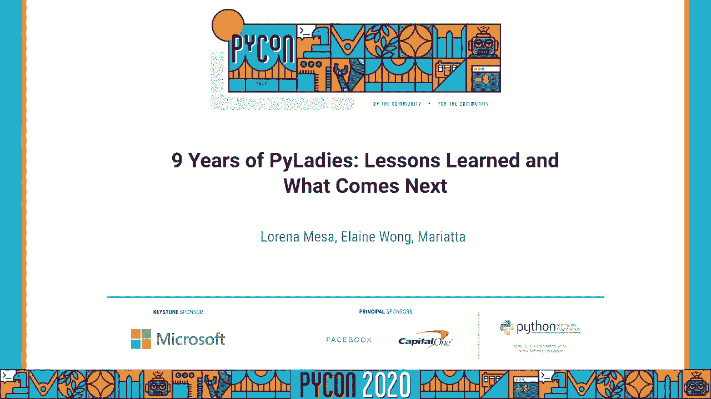
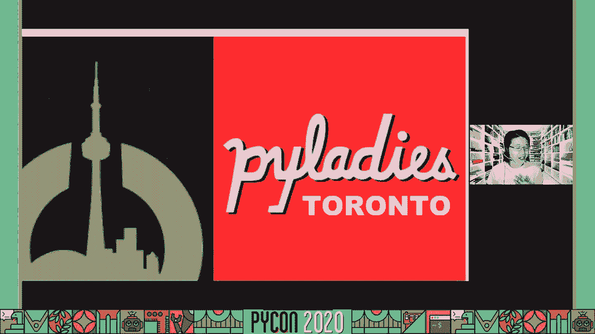
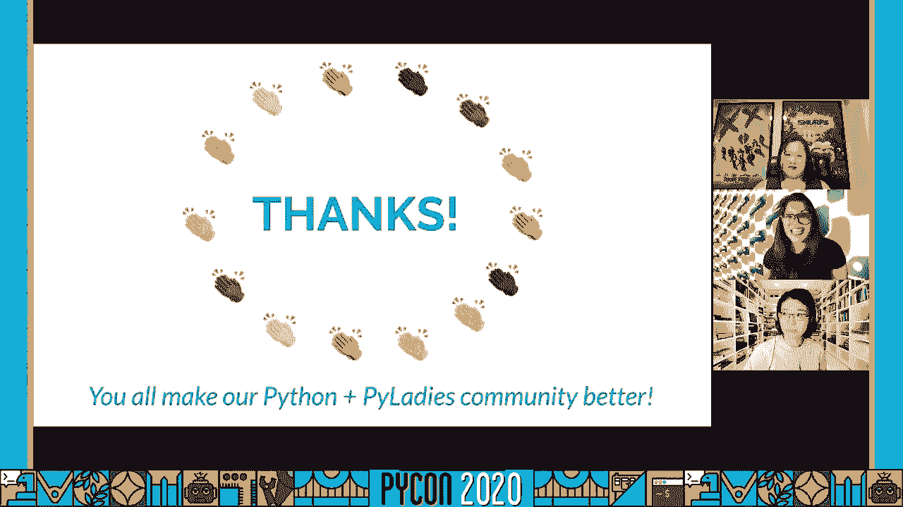
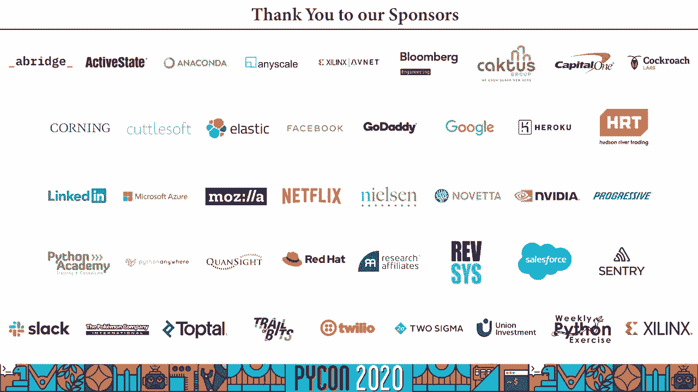

# P52：Talk Lorena Mesa, Elaine Wong, Mariatta - 9 Years of PyLadies Lessons Learned an - 程序员百科书 - BV1rW4y1v7YG

嗨，各位，呃，我叫德拉梅，与劳拉和玛丽埃塔一起，我们是来介绍，虚拟，呃，妇女的经验教训，接下来会发生什么，我们要去下一张幻灯片，所以，这是我们所有的联系方式，我们来自世界各地的各个试点分会。我来自伟大的多伦多，在加拿大，桩里的玛丽，温哥华，洛雷娜在芝加哥机场，从起源故事开始，就像我们是怎么开始的，所以对我来说，这一切都是从我决定从学校毕业开始的，我是加拿大公共广播公司的资深记者。cbc和 yep，是的，谁知道一旦你从新闻学院毕业，你变成了一只小独角兽，戴着可爱的小耳机和麦克风，所以作为一名记者，我一直在努力提高我的技能，看看下一件大事是什么，当我2010年毕业的时候。有一种叫做计算机辅助报告的东西，从那里我发现了一种神奇的语言 叫做蟒蛇，他很擅长解析语言 帮助我，收集一些数据，并在此基础上再接再厉，就像我想变得超级强大的调查技能，我就说哇哦，太神奇了，但我们。

我上过松鸦学校，就像没有人真正知道什么是编程，那我该去哪，在那里我想认识更多的蟒蛇用户，好吧，将 python输入到，多伦多小姐们，所以大约20个，那是大约213，所以，是的，是很久以前的事了。我还记得去多伦多参加一个蟒蛇用户组，我 肯定，你们中的一些人也进入了当地的这样的用户群，对我来说，这是难以置信的恐吓，嗯，在任何一个特定的聚会上，这就像一个有八十个仙女经验的房间，主要是男性。UM开发人员，大家都想聚在一起聊天，对蟒蛇的语言或多或少有点书呆子，我发现导航有点困难，尤其是你知道作为一个不是来自传统编程或干细胞背景的人，最重要的是，对编程来说是新的，对科技界来说是新的。现在在所有这些人的空间里，我真的很难不关闭，这么多经验丰富的开发人员，我不知道人们是否愿意，你认识一个新手，比如我自己，你知道在我20多岁的时候，我就像个女的，在80个人的房间里，它变得有点像，呃。

我不确定 我不觉得，我没有归属感。

即使人们，是非常欢迎和非常好的，我不得不开始问，像我这样的人在哪里，因为，我们是来帮忙的，很难不去，你知道吗，会自动开始思考，哦，你只是在帮我，因为你想和我约会，还是你在这里 只是因为你关心，那个。我想学这种编程语言，你能回答我的一些问题，所以为了开始寻找像我这样的人，让我们回到最开始，回到皮戈九年前的起点，所以我不是唯一一个，显然有一个非常相似的问题，回到2011年，蟒蛇队有一场比赛。亚特兰大21点11分，有很多，克莉丝汀，钟，杰西卡，斯坦顿，凯瑟琳，Jamal，桑迪，斯特朗和索菲亚，感觉就像他们，他们在很久以前也有一个非常相似的问题，就像他们都想更多地了解蟒蛇一样。他们想让一群人聚在一起，尤其是女人 让这一切继续下去，因为他们也有一个非常相似的问题，他们也要去参加这些会议，人们都很好，但他们想找到的是那些有激情的人 和那些碰巧是女人的人。

所以奥黛丽在2011年写了一笔赠款，并聚焦这三个领域，教育，会议和外联，然后，当然，安全理事会很好地批准了，批准了，因为它与蟒蛇的性别代表性有关，因此蟒蛇社区看到了一个集中和有组织的项目的必要性。解决这种不平等，他们说嘿，太好了，让我们这样的 psf，并向第一批试验小组提供了一些赠款，驾驶真正的飞行，这是第一次见面，psf后来成为 pi女士的财政赞助商，因此。高级女士成为了python软件基金会中的一个实体，所以第一章就是洛杉矶，如果我们去下一张幻灯片，它现在开始生长，这是所有最新章节的当前地图，但想象回到2011年，一章后来发展成两章，第二章在墨尔本。然后是 dc，然后是旧金山，从2011年的路上开始，所以它开始受到欢迎，显然有必要，嗯，在和奥黛丽谈话的时候，关于洛杉矶圆周率小姐的起源，她说这对她来说是多么令人兴奋，为了让团队找到志同道合的人。

像他们这样的人 能够在会说话的蟒蛇上互相发呆，你能想象一群七位女士，吃着美味的食物，喝着美味的饮料，只是说嘿，你觉得这个 janof文件，在接下来的幻灯片中，它变得非常特别。因此我们开始攀登圆周率 女士们，所以林恩在这里，伟大志愿者奖，她们这群了不起的女人，为非常非常开始奠定基础，以至于他们甚至制定了一份任务说明，上面写着我们是国际 抱歉，下次吧，我们是国际会员组织。重点是帮助更多的妇女变得活跃起来，Python开源社区的参与者和领导者，我们的任务是推广，通过外联教育和促进多样化的蟒蛇社区，教育，会议，活动和社交聚会，佩特还旨在为妇女提供一个友好的支持网络。通往更大的蟒蛇世界的桥梁，任何对蟒蛇感兴趣的人都被鼓励参与，从那里得到了多么好的使命声明，从那里开始有一个三人组211，在这九个人的努力下，通过一个由公共科学基金会资助的项目，发起了一场全球运动，今天。

它是一个国际导师组织，专注于帮助他们变得更加活跃，领导人，在，Python，这个任务是否仍然反映了当今圆周率女士的需求，在我们评估之前，如果这三个教育支柱，晋升，外联工作取得了成功。我们需要反思什么奏效了，什么改变了，所以让我们开始吧，我把这个交给万豪酒店，在那里我们将庆祝胜利，因为我们已经走了很长的路，呃，你想结婚吗？是的，我只是在想如何让自己，抱歉，那几个小时，是啊，谢谢。我们可以把它切下来，嗯是的，在过去的九年里，已经成长了，我们现在在世界各地有90多个分会，遍布许多国家，这些章节中的每一个都在运行，但在这个社区里为妇女提供了社区，帮助他们发展事业。我们的社区帮助培养了新一代的女性演讲者和开源贡献者，以及影响，如果我们看看9年前蟒蛇说话者的性别多样性 历史，说蟒蛇的人中只有1%是女性，到二十六，40%的演讲者是女性，这个数字或多或少地保留了下来。

一 致，我们已经问过了，嗯，我们的社区成员，关于这对他们意味着什么 的成员和盟友，以下是一些答案，来自迈阿密的马德琳坎博斯说，支助，知识共享，斐绍韩满说，但讨厌是唯一让我感到舒服的平台。回答别人的编程问题，真的很难克服被严厉评判的恐惧，当你认为自己是女性时，一个人的能力水平，它在很大程度上帮助我克服了这个障碍，我们有，蟒蛇套装的创造者，我的心再见，女士们。非常感谢你们 让蟒蛇社区变得更加多样化，不仅仅是将军，我把自己想象成一个女权主义者和盟友，但你做了艰苦的工作，让它坚持下去，女士们，如果你还记得五年前在蟒蛇，那时蟒蛇已经存在了二十多年，但到那时。在所有的 Python语言峰会上都没有女性 Python核心开发者，当年，没有女性与会者，一点都没有，我当时在场，嗯，那年我参加了蟒蛇节，你们中的一些人知道这是五年前的演讲，这激励我开始为蟒蛇做贡献。

最终成为 Python核心开发者，当我相信当女性可以看到其他女性参与开源的时候，当他们看到自己被代表的时候，他们也受到了启发，在过去的五年里，我们已经取得了进展，我很荣幸地与大家分享。今年的标题语言峰会有7名女性参加，比以前好多了，他们都积极参加了讨论，其中三人发表演讲和闪电演讲，虽然有很多东西一直在向上移动针头，例如将妇女和其他边缘化社区纳入可见空间。喜欢 python或进入 python用户组，我们仍然看到在开源社区中进入积极领导角色的斗争，然后我会把这个交给洛雷娜，很好非常感谢你，搭建舞台，我知道我们社区所做的努力，真正进行了一次非常深入的交谈。是个很难的话题，所以房间里没有更多的女人，尤其是当涉及到核心时，Python开发并不容易，当我们坐在那里，我们非常批判性地思考我们的成功和成功是什么，有什么东西没有，作为蟒蛇软件基金会的官方机构。

模型的问题，然而，我们在圆周率女士身上看到的是 它虽然非常有益，一些也有问题的事情，存在于一个地方的草根运动，可能没有同样的资源来帮助他们的分会，就像说的那样，芝加哥对。也许世界上其他地方的高级女子分会，它们不在北美，所以看看想要成为草根领导的双重性，这样我们当地的分会就可以决定什么对他们有效，最能反映当地社区的需求，其中一个，我们不得不考虑的事情是好的，你知道吗。老实说，其他人是怎么做到的，其他团体怎么样，呃，其他群体是如何建立的，下一张幻灯片中，这些社区对他们意味着什么，请，其中一个地方，我可以和卡拉一起参加，作为巴西飞行员的荣誉成员，他们每年都有。大概有两个六章 上次我在全国各地查了一下，巴西就是最好的例子，展示基层社区方法是如何实际发挥作用的，实际上是成功的，皮拉迪巴西创始人黛博拉·阿塞韦多，在二十九巴西试点大会上强调，本组织得以发展壮大。

然而，当他们能够成长并得到更多的章节，对他们来说，继续成为瓶颈的事情之一是维持成员，成员和保留成员，同时也致力于更广泛的集体倡议，尤其是那些被强调的问题 导致了，例如，瓶颈和获得资金的机会，你知道没有。无法获得这些简单的东西 比如买票的钱，才能去巴西蟒蛇，这些官方事件发生的地方，你知道吗，桩，您无法真正超越用户组中的本地对话，如果你所在的地区有一个用户组，所以这个获得资金的想法，那是一个巨大的。在意大利香肠中强调了这一点，巴西议会，还有一件事，也是，大会的号召实际上只是想说，你知道吗，我们是怎么开始的，如果没有一个强大的社区，你可以靠在什么样的，什么样的内容，你应该写，什么样的内容。你不应该只是写和谈论，但你知道实际创建内容所需的小时数，也是个问题，又来了，当我们可能，当，虽然，强调拥有非常强大的地方分会，允许你控制你把什么样的内容放在这个世界上，本质上，每次。

所以这个主题希望有一种社区感，这不仅仅与你的物理位置有关，但实际上更多的是一种全球对话，向雷德利传达信息的全球社区，我想，作为一名飞行员 组织者 引起了我的共鸣，四岁以上，四年半，下一张幻灯片，请。所以当我们考虑重建未来时，这真的是一个很难的问题，它有很多细微差别，我开玩笑说 有时候我的答案是，我们如何建设未来，我就像，我不知道这很复杂，看情况，所以撇开笑话不谈，这个主题，虽然。我一直看到的是这种紧张，想成为当地第一模特的双重性，同时也建立了一个全球品牌和全球品牌，我认为本地和全球之间的紧张关系，我觉得这确实说明了，呃，派所经历的一些斗争，全球身份是什么，那个全球品牌是什么。我们需要考虑的是 在我们的本地分会中效果很好，却限制了我们，真正建立这个更大的倡议，所以当我们考虑到未来的建筑时，真的，我觉得我们应该从一个简单的问题开始，这是什么 是桩 正在建设下一个幻灯片，请。

随着时间的推移，我问过很多人这个问题，就像伊莲在开头提到的，我曾经求助过的人之一，当我有很多问题，对试点模式演变的思考 是早期的一些，是早期帮助过我们的人，帮助扩大规模，导致今天的局面，尤其是。也就是说，呃，车道根，谁是喜欢，这里展示的是谁，呃，向我们兜售研讨会的议程，我们在蟒蛇我们举行了二一九，我们把我们的未来命名为，又是一件，我一次又一次地和人们进行这种对话。你知道我们怎么才能更好地让人们，就像连网站，或者我们如何更好地获得资金之类的东西，但实际上，我认为是另一件事点燃了火，让对话继续下去，当我们在纽约市飞行员组织者拉沙马谢克，写了一篇评论。看一些多样性建设的停滞，不仅仅是蟒蛇，但总的来说，在开源方面，在看那篇文章，我们讨论了很多关于会议规划的主题，关于建立全球性的运动，仔细想想，不仅仅是多样性，不仅是为了在桌子上找到一个座位。

但也是关于它的，真的是我们在投资自己，真的是，也不是，我们想留住人，基本上，这不仅仅是在桌子上找到一个座位，它确保人们，嗯，它是为了确保，人们实际上能够把他们真实的自我，分享他们的话，他们正在被听到。它们正被纳入对话中，解释，是这样解释的，在邀请多样性参加派对之前，我觉得这是个很好的比喻，因为当我们看到堆女人的时候，我们在蟒蛇空间里做了这么多伟大的工作，关于在餐桌上创造空间。但在思考接下来会发生什么时，这些是，这些是更难回答的问题，这就是这个研讨会的目的，所以这次研讨会的目的，我们的未来，我们组织的方式是，我们，我们基本上做得和做得一样好，有技术头脑的人做的。我们想把这个工作室作为一个复古的地方，所以做一个复古堆决定了我们目前的挑战是什么，然后试图快速开火，开始提出这些解决方案的答案，在场的人，我们实际上是被邀请的，因为我们想从不同的角度。

实际上这些不同观点的广度，我们要确保的是，在这个研讨会的另一边是我们的对话，实际上，然后开始把它与我们可以发布的具体目标联系起来，开始把社区带到更大的社区，所以我们可以得到更多的反馈。我认为让这次研讨会如此成功的原因之一，我真的又想到了一种很好的方式，它点燃火焰的那一刻，我们能够让非常多的人聚集在一起，在这张照片里有这个对话，我们在研讨会结束后发了一条推特，我想这只是对一些，呃。我们在这次谈话中强调的很好的观点，所以我们有一个来自印度的组织者，我们有蟒蛇软件基金会主任玛琳，他能和我们交谈，她所做的一些工作，嗯，在非洲更广阔的空间里 围绕女性和编程，嗯，如我们所见。我们三个在那里，所以我们在北美有一小部分人，以及来自拉丁美洲的人们，从欧洲来的，让人们聚在一起谈论一些事情，令人惊讶的是 当你真的让人们，一起聊聊，事情开始得有多快，可以开始移动，所以其中一件事，呃。

从这个工作室，我是故意的，确保全世界的人都在谈论，女士们也在确保我们真的有，下一步我们要做什么，因为我们都知道，把大问题变得更大，然后增加300步，你不会得到任何地方，你知道吗，我们需要一些有形的东西。我们可以努力，最重要的是我们都在说，我们知道会有帮助的是，所以9月15日20日19日，在 Github上，然后我们在皮康的下一张幻灯片上写了一个车间的情况，请，有思想的科技团体，你知道吗。哪些模式已被证明有效，什么样的模型符合这一点，与我们的核心价值观再次，核心价值观真正强调有强大的地方领导，而不是试图创造一些东西，过程如此繁重，以至于很难做任何事情，我们真正受到启发的一个团体是，呃。我们的女士们，就像圆周率女士，艺术女士，是一个有很多强大的地方分会的团体，他们是一个非常基层的组织，不一定有带薪员工在上面工作，又来了，有很多志愿者在管理这个社区，这对我们来说是一个很好的开始。

所以我们在这里看到的是我们提出的这个请求 评论模型，是我们真正想做的事情之一，我们真的想确保我们做到了，我们要确保，有一群，呃，权力所在地，我们的工作，呃，我们当时称之为全球领导团队。这个组织将成为 python软件基金会的代言人，他们实际上是在回答，就像，你好，我的章节，你知道吗，在芝加哥获得资金，所以他们实际上是那些会谈论，越大越好，更大的图片项目，然后我们有一个平衡的旁边。如你所见 这个项目小组列表，所以这里的项目团队，从金融资源到实际工作，比如技术、营销和行为准则，所有这些都是命中注定的，嗯，像开源项目一样管理的项目团队，所以允许人们，你知道吗，有时人们想参与堆积物。但不是作为一个演讲者，不是作为活动主持人，也许他们不想组织，但他们想帮助一些具体的事情，因为他们的热情又回到了志愿者的想法上，让人们有能力在他们热爱的事情上工作，这就是这些项目团队的初衷。

这就是这些项目团队应该关注的，所以这个全球领导模式，实际上是让一群人驾驶这艘船，让我们继续前进，同时也让更多的时刻和方式为桩女提供有意义的订婚，这就是为什么我们想出这个模型 下一张幻灯片，请，酷。我们举办了二十一九工作坊，我们成立了一些项目小组，我们实际上有一个对话 与我们的，在我们的社区周围，我们要怎么做，你知道吗，我们应该，我们知道接下来会发生什么，我们得选择我们的全球，我们现在所说的全球。全球理事会，我们实际上已经做了这么多的工作，想着我们如何再次，非常强调希望有一个全球性的，全球代表性，我们怎么能让世界各地的人，作为圆周率女士的一部分来参加这个活动，我们做的一件事，我们写了一篇关于。呃，这个全球理事会将是什么，呃，我们实际上，我们做了很多很好的工作 把它翻译出来，所以在蟒蛇的翻译列表中，在枕头之间，社区成员和我们找到能帮助我们做一些翻译的人，很快就完成了，我真的印象深刻，谢谢。

Python，嗯，但是，我们实际上能够用六种语言发出这种叫声，六是，六六加英语，加英语，所以七是我的错，但是我们用阿拉伯语，中文，嗯，尤其是普通话，法文，葡萄牙人，俄文和西班牙文，所以我们要做的是。试图用他们舒适的语言与人见面，用他们选择的语言，嗯，为了宣传这一点，我们所做的另一件事是我们加入了全球理事会，a区域要求，我们基本上不希望，就像所有九个从美国来的人，这并不能真正帮助我们。得到我们真正想要的全球品牌，所以我们把一个，呃，我们提出了一个要求，说不，呃，否，不超过三个，百分之三的董事会成员可以居住在同一个国家，所以，例如，如果我们要找四个来自美国的人，不，那不会飞的。因为我们有九个座位，对于居住在美国的人来说，我们最多是三个，嗯，关于多样性的其他事情，我们肯定知道我们可以再次迭代，对语言接触的思考，显然还有很多其他的东西可以进入这个对话，但首先，我们要看看。

并允许全球理事会团队的最初队列重复，政策，他们认为继续让我们负责是很好的，另一件事我们制定的唯一的另一件事也超出了区域要求，我们会同时拥有，然后我们有一些座位，人们可以在那里真正申请他们。我们在这里思考的想法 显然是我们所理解的，当谈到竞选时，有时名字识别是一件事，如果你，你知道吗，做到这一点，这是很好的，我们的社区里有很多非常令人兴奋的人，但不幸的是，随着知名度的提高。你知道这可能会偏向那些，你知道已经存在很长时间了，也许你又知道了，我们想考虑的另一件事是让飞行员，在职业生涯的不同阶段，也能成为这个群体的一员，因为它们同样棒，又来了，就像允许不同的方法来做到这一点。关于如何，我们的试播章节，绝大多数人都答应了，这就是我们下一张幻灯片要做的，请，所以说这一切，呃，这是一个，这是令人敬畏的一年，虽然我们真的希望围绕这个做更多的内容，我们肯定在努力在场。

尽我们所能回答问题，为了人们，所以请留意一些机会，pillady的 twitter和 pillady的网站，鼓声，请下一张幻灯片，我在这里宣布，我们已经开通了网站，所以驾驶那辆巨无霸，把幻灯片放进去。这个地方可能有点难读懂，但如果你去那里，或再次提名，提名，意思是，你真的想申请成为董事会成员，就像玛丽安娜提到的，我们确实有一个试点注册，会员表格，这些人将是有机会投票的人。所以如果你想知道如何在网站上投票，你可以了解一下，具体地说，谁可以和谁一起投票，我们在这里登记了我们的会员，如你所见，我们又有了所有语言的版本，我们将对议会成员进行公开呼吁，从5月6日开始。而这个时间线，完全一样，作为董事会的时间表，请，这只会导致，我想我们所有人都会说，我相信我能代表我们三个，当我说，当我们说，非常感谢，所有帮助过我们的人，不管你和我们每月开一次会，不管了，呃。

你回应我的，你知道吗，我知道我喜欢一直给人们发很多信息，或者你帮我们翻译，我们都在一起，让蟒蛇和试点社区变得更好，所以我们只想发自内心地说，谢谢，下一张幻灯片，请。

如果你想和我们保持联系，我们有几个地方，所以你可以和我们一起休息，这个休息对任何人都开放，但我们确实有一个烟斗派，女士们的行为守则，当你注册时，你会被提示，但你可以去放松皮里科姆。你可以再次加入我们的游戏，我们有这个，呃，我们有一个临时的全球小组，每月开会一次，如果你看看全球组织回购，每月都有一期，任何人都可以在上面添加东西，所以你知道，如果你有问题。就像如果有什么话题或者你想说的，呃，带给那个团体，你可以把它扔在那里，在推特上与我们保持联系，记住你可以注册成为海盗队的成员，所以我们注册登记的那一点，这些幻灯片的小链接。您可以使用它来返回并查看所有这些资源和下一张幻灯片，请，这就是我们的谈话，这是我们所有的联系方式，如果你想联系我们，很简单，这是我们在皮康的名字。

