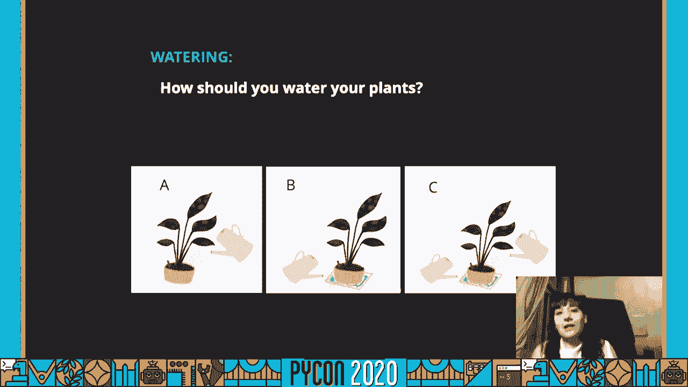
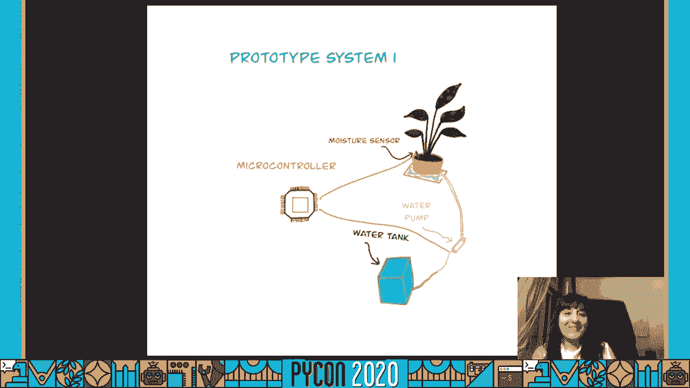
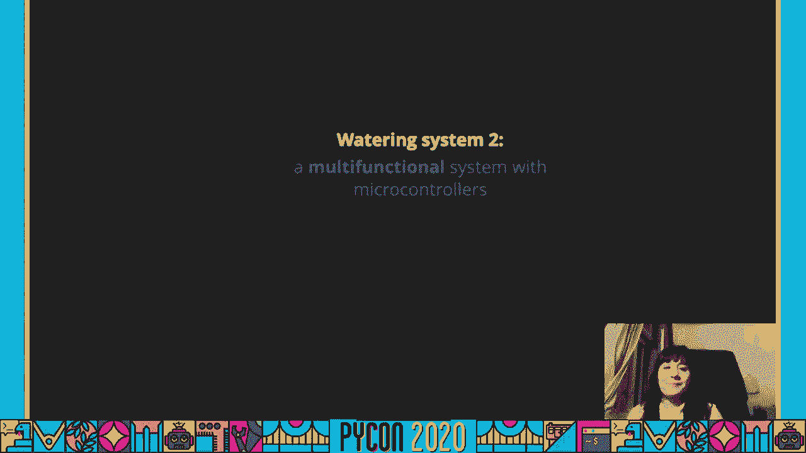
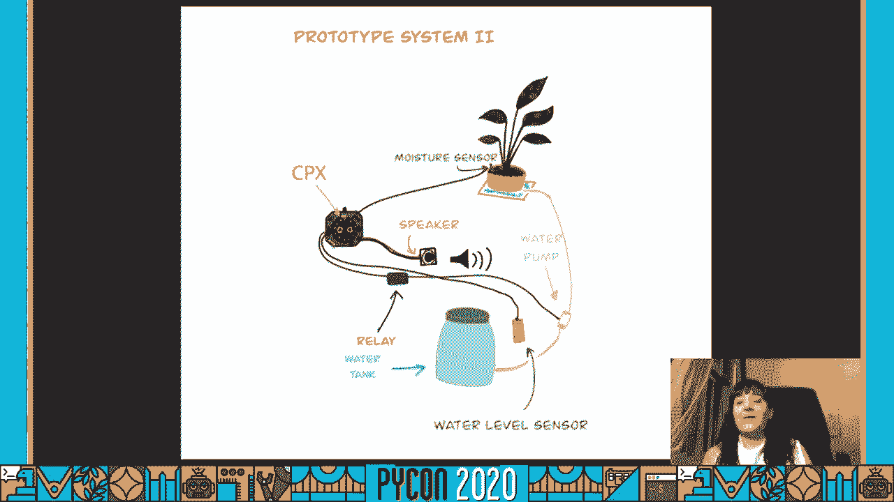
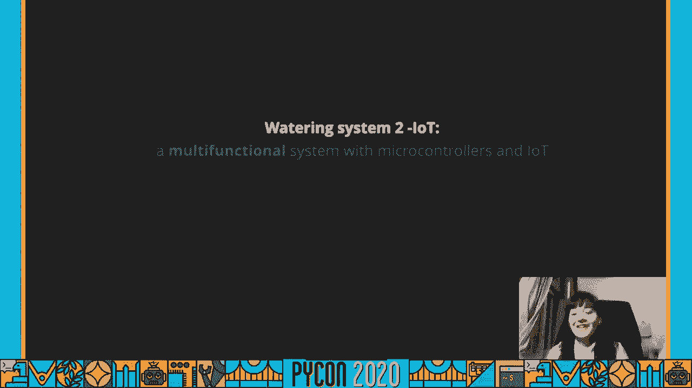
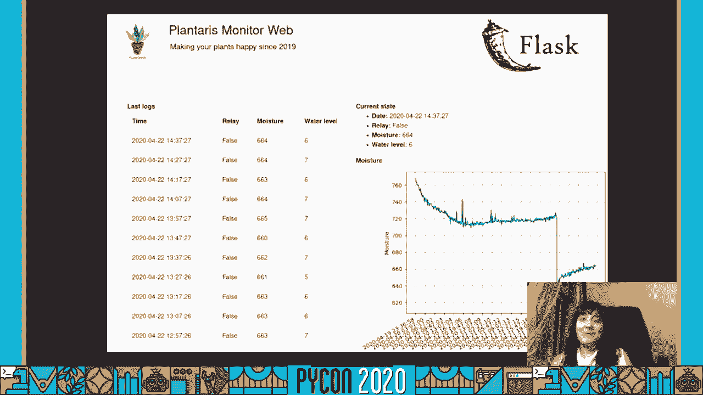
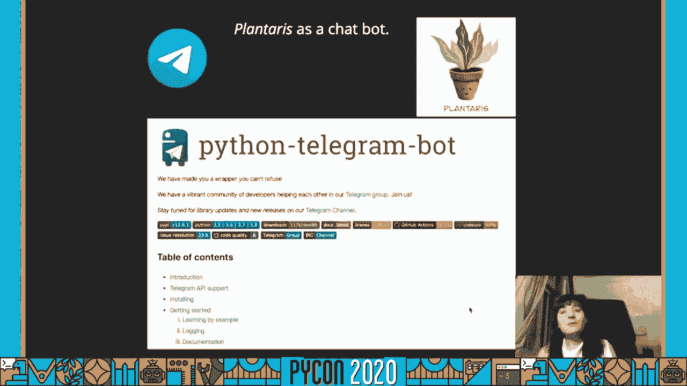

# P55：Talk Maria Jose Molina-Contreras - How to build an intelligent “indoor garden” - 程序员百科书 - BV1rW4y1v7YG

 Hello everyone， today we would like to talk about how to build an intelligent indoor garden。

 But before jumping into the talk， a few words about me。

 I have a long name but just called me Mariam。 I did the PhD in plant molecular biology and。

 for years ago I moved to Berlin with a large full of dreams and planning to start a new life。

 It was a hard moment but thanks to the support from the Berlin Python community。

 I was able to keep up。 This allowed me to find a new professional path as a data scientist and。

 not only that， I also started to use Python for doing a experiment at home。

 This talk is an example of that。 I wanted to thanks to the Python community for each support。

 and for believing in me。 So keep in mind that sharing is caring so let's all share our knowledge。

 and support more people to include more and more people to this beautiful community。

 The project that I will talk about is one that held my friends' plans。 Because of my。

 background in plant and my knowledge in Python， I decided to start playing with a whole new， topic。

 microcontrollers。 The world was clear， built the simplest and functional plant。

 water in the system so people without a software or hardware background could be able to reproduce。

 it at home。 Of course， I wanted to also motivate new people to jump into Python。

 While doing biological experiments， I never had the chance to program any hardware so you have no。

 knowledge at all。 But luckily a friend of mine went to the Python 2018 and got a microcontroller。

 and he gave me， gave it to me and told me， "You are gonna love these， check these microcontroller。"。

 And I remember that I answered to that like， "But I don't know how to use it， can I break it？

 What do you， what I need to install？ I need to solder something。"， And he told me。

 "Just connect it to your laptop。 It has Python inside and take a look to the keynote。"。

 I was so impressed and whole simple things were。 And the keynote by Nina was so cool that。

 I started to think new project ideas are right away。 And it wasn't that moment to say， "Okay。

 it's clear。 I know that I need to develop this watering system。"。

 And now I have the key and hope to do it。 But what is the most important when you are starting a project？

 No， it's a joke。 I started to look in the project in the right way。 But also， I started to draw the。

 project image for fun。 And I ended up with planteries because I thought that it was so kind。

 you know， funny， but at the same time cute and it's kind of the image of this project。 Well。

 let's just stop talking about the logo。 Let's go and review some important concepts。

 before to start building the watering system。 Honestly， sometimes it's hard to keep our plants。

 happy and the watering is key here。 But it's not the only one。 First thing。

 choose your plants based on your environmental condition is key to have success。 Not really。

 All the plants are from outdoors。 But if the idea is created in door garden。

 you need to have a mine hours of light。 Consider at synthetic light， take care of the temperature。

 the relative humidity and the orientation of your house。

 But it's not the only factor that we need to have a mine。 We also consider the moisture sensor。

 We need to know who is our plant soil and how to measure the moisture of the soil。

 There are many types of sensors， but I just try two of them。 A resistive and a capacitive。

 I try a resistive even knowing that they have corrosion problems because it was for shorter。

 water exposition。 But if you need to leave it all the time， use a capacitive。 For that reason。

 you're going to see that in some moments I use the first one and in other moments。

 I use the second option。 To get a creative reading out of your soil moisture sensor。

 it is recommended that you first calibrate it for the particular type of soil that you plan to monitor。

 Because different types of soil can affect the sensor。 So your sensor may be more or less sensitive。

 depending on the type of soil that you use。 And of course， the first thing to do before I start。

 the project is take。 For example， in this case I took three glasses with water， with soil。

 pretty wet and also dry soil。 And I went measuring the balliose from one to another。

 always from dry， to wet。 And then you need to do experiments and take numbers to define what is dry and what is wet。

 in numbers parameters。 It's only thing now。 Who showed you what are your plan？ Well。

 if I ask you which is the correct method， A， B or C， the answer is the， penalty。

 the species and the state of development。 Not all the plants like the same water method。

 And maybe you are wondering but why？ Well， an important factor is the root distribution。

 Applying with superficial growth prefer a method A。 Applying with deep growth， A， B， C are fine。

 The method A can produce an additional soil loss in minerals。 The method B sometimes is not enough。

 for the plant receive， if the plant receives a lot of dietitin。 Alternatively。

 the two methods could be a great idea that it's the case C to have a good， mineral watering balance。

 But let's start considering the method A and or B for our watering system。 After this consideration。

 we can go to the sign or prototype that is good at it。 After half all this。

 things clear and the final， I designed my first prototype。 That was that。

 Here you can see the initial idea that I have in mind。 I thought， okay， I have my plan with a。

 moisture sensor connected to the microcontroller and also a water pump that somehow can activate。

 and activate the water。 It looked really simple so I started to read about how to do this。

 And I started to buy some components but in some cases were a lot of components。

 Here are all the elements。 I use it for the first system。 The microcontroller I got from the。

 pike cone is at the bottom left。 It's not very F。 The moisture sensor is a flower shape with。

 device that you see in C。 The water pump is a white sink in the middle。

 That needed the sternal batteries in this case is five balls so that you can see in layer E。

 The blue thing on the top is a relay in simple words that it's a signal on off。 Sweet。

 So I was able to connect that to control when I was watering。

 And of course some cables took on the different parts。

 The microcontroller that I use it is called circuit playground express and it's developed by other。

 fruit。 This microcontroller has a huge potential for different kind of project because has， motion。

 temperature， light， sound sensor and much more。 The Python version that runs inside is called。

 circuit python which is a form from micro python and it's really simple to use。

 Totally beginner friendly。 There are many libraries and drivers for sensors and you can connect it。

 with a USB cable and then you are able to start a Python console to interact with it。

 It was amazing。 Here you can see how everything was connected at the end。

 Many cables I know and it's not safe to， have the palm next to the relay。

 I know also that but never mind。 It was just to show you。

 in a picture but please don't do it at home。 Let's be safe。 Try。 Try。 Don't do it。

 Well let's see how the system works in a video。 [Music]， And what about the code？

 Well I skipped the imports here but I just wanted to show you how to interact， with the devices。

 Since I was sending signals to the relay I had a digital output connection。

 and the moisture sensor is an analog input since I needed to read a number from it。

 The main lobe was really simple。 You get the sensor value and if that's less than the。

 tri-value you define it， you just enable the relay and water the plan for a few seconds。 Easy right？

 You can find the code in gift cap account in case that you want to play around。

 After I finished this project or this approach I gave a couple of tools and many people was。

 interested and started to give me feedback and asked me for new functionalities。

 So I decided to build a bigger system with many more features。

 Since the liquid plate down expressed didn't have many ports， I found another device that。

 does stand there connections so I had the option to add more things。 As you can see here I included。

 in my system， my speaker and also water level sensor。 Here are the components， the all and the new。

 components。 In layer D the green circuit that is under the circuit plate ground is called。

 Cricate and include many extra ports to connect more things to your liquid plate ground。

 I also bought a speaker and I put it inside the box。 I don't saw up， you can see the red。

 water level sensor which is layer B。 And of course we have also the old components like the relay。

 the batteries， the water pump， and the moisture sensor in good letter C。

 As you can see for this project I used the capacity one。 Attention the water level is low。

 please fill the water container。 Attention the water level is low， please fill the water container。

 Here it's the code， with a layer a bit longer but still simple enough to。

 for everyone that wants to try。 I wrote a Python class to keep all the functionalities of the system。

 so the first thing I do is to create an object called plantaris。 The main loop had some steps so。

 on the right you can see the implementation of the functions。 First you can see that the method。

 water level okay does something similar that we did in the system one just check the value。

 and return true or false。 When the level is not okay we play a message there。 I am just opening a。

 WAF file and play it through the speaker。 So that's all you need to have a voice notification if the。

 water level is slow。 The second condition we have is to check if the moisture value is okay。

 This is the same code from the system one。 I check if the moisture level is okay and if not I would。

 turn out my plan。 Here watering our plant is just opening the relay for a few seconds and then close。

 it。 If you are thinking there is a mistake because for opening I wrote false that it's because the。

 relay has two states always close or always open since I don't want to have the water pump。

 the water pumping all time。 I use it the always close gate so that needs to be true to remain。

 always closed。 That is why writing false means that the relay will be open。

 Here of course here is not the the full code you can find the code in the GitHub account。

 As I was generating a lot of data I decided to do something about it and I thought。

 I should connect my system to internet。 So I started to look for components that。

 could help me with that and I noticed a new system by Adafruit called Pyportal so I went to the store。

 and got it to start playing with。 It's a really interesting component with that allows you to have。

 I/Ot and also has a screen。 It's super cool but even though I did my best I had many issues with。

 connecting components to the device probably because of my little experience but I spent a lot。

 of time reading about GST connectors。 I too see pores and even Wi-Fi microchips。

 I am still figuring out the boldities of those things but that's a story for another talk or for。

 other moments。 But still I think that it's a really interesting component or gadget and please if。

 you have a experience with Pyportal let's be in touch because I want to include it in my system。

 But as I had some things， some difficulties and I wanted to improve my system too with I/Ot including。

 I/Ot I found another path。 I was very lucky because when I was looking for options， with I/Ot。

 Py Ladies from Berlin and Hamburg decided to organize a workshop after the PyCon。

 D on the same topic and guess what I got？ Raspberry Pi！ It was awesome。 The base system of my Pi。

 is， lifespan and I connect to it via SSH so I was able to install Python but then I thought。

 that I could install many other things so what I got if I leave a web server running on the Pi。

 So I didn't have to worry more about the limited storage space on the system since I had the。

 SD card of my Pi so I start to check how they connect their Raspberry Pi and the microcontrollers。

 and I found a Pi serial。 To be completely honest with you I started to try different code。

 phone around and I ended up having a way to get all the pins from the microcontroller to a CSV。

 Wow and that's all。

 At some point I did some flash tutorials。 I had some experience setting up a simple web application。

 so if you consider the time currently working with data it was an easy decision to build a monitor。

 system。 You can see on the image that I am displaying the logs on a table and on the right you can see。

 the moisture data over time plus the last report of the device on a small table on top。

 As you can see the decrease on the plot means that the plan was worth it。 It was amazing。

 Okay that was nice but when I started to read about how to access my Raspberry Pi from outside my home。

 things got really complicated。 I asked many people and even though I managed to do it with a service。

 called no no API I didn't feel safe since protecting the site or the server was too difficult so I thought。

 how else I can access it through internet without setting up something to complicate it。

 Oh sorry I have a message。 Oh let's see it's plant eyes。 Okay the data looks good。

 Let's see what happened at home。 Okay one looks good。 Telegram。

 I was using Telegram for a long time and I knew that in theory it was。

 easy to set up a bot and I had some friends that had one so I went online and the tutorial was really。

 simple。 You talk to the bot father， telegram， tell him that you want a new bot and that's all。

 He gives you a token and of course Python helped me again since there is a model to add functionality。

 to your bot in Python as you can see in the slides and that was the story hope plundary。

 was also a bot。 There are many many crazy ideas on topics that I want to start researching but of。

 course one thing at a time。 At the moment I'm trying to understand where the pipertal boards。

 since I am starting having a screen will improve the system a lot but also I am thinking if I should。

 buy a screen for the Raspberry Pi and try to enter it into my system but it's something that I need。

 to think with time。 Also I am still in a couple of nearby of datum so I don't believe a cloud service。

 will improve my current situation but in some case I have reviewed a couple in case I need a better。

 infrastructure。 I try google cloud storage and other fruit I/O。 Let's see what happened in the。

 future but at the moment I think that I don't need it。

 Because of the quarantine I was unable to build， the shell infrastructure that I designed but believe me that it will be prepared soon。

 Currently I am working in an efficient watering system using a parallel system with all。

 the relays and moisture sensors。 You can see on the right parallel system that this is still a prototype。

 but this is coming soon。 I already have two or three tokens so keep an eye。 I will try to。

 communicate all the new things on the trigger。 Believe me I am prepared so I have many sensors。

 and I haven't had the time to even try them。 Hopefully you come by a couple of components。

 get the gold and start playing with it but the most important thing is let's make our plants happy。

 Thanks for watching my talk。 I hope now you are motivated to start automating more systems。

 at home with your plants and if you have more some questions or comments let me know。

 Check my gift card if you want to see the code the components and implementation details。

 Thank you so much。 Thank you。 (buzzing)。

 [buzzer beeps]。