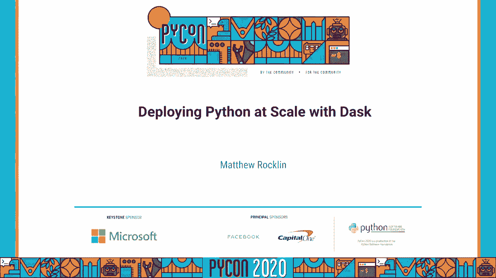
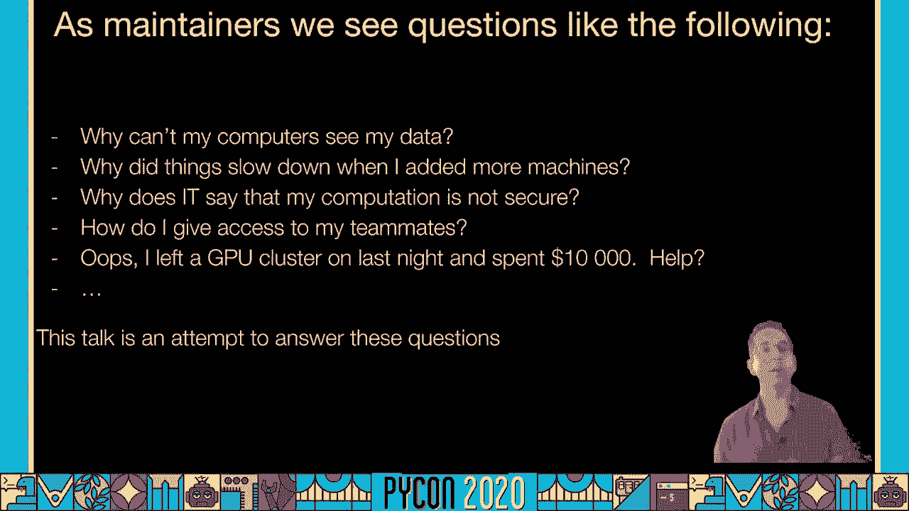
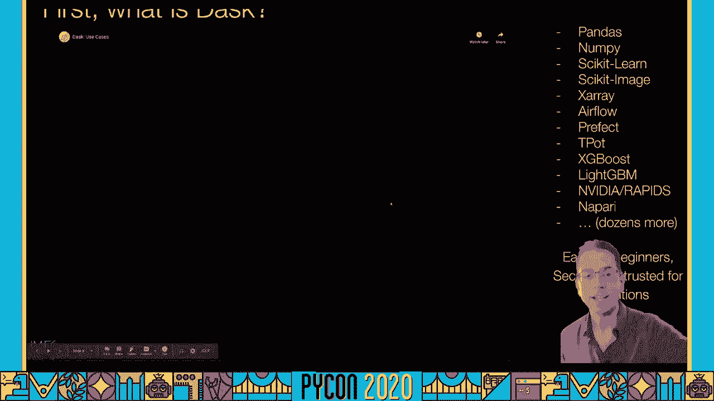
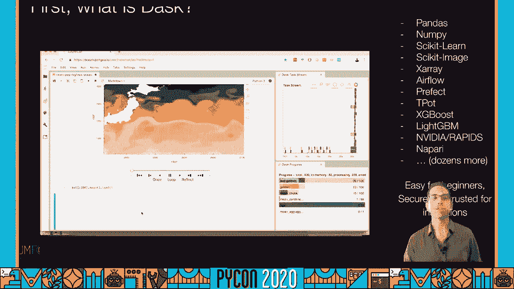
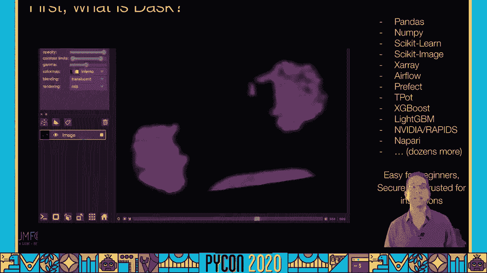
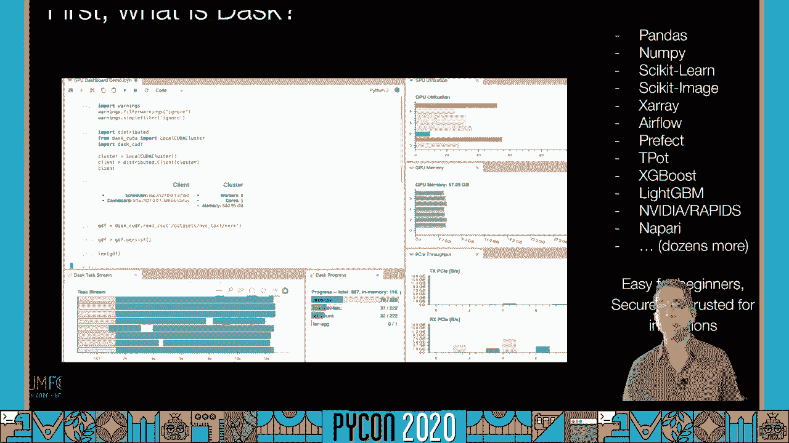
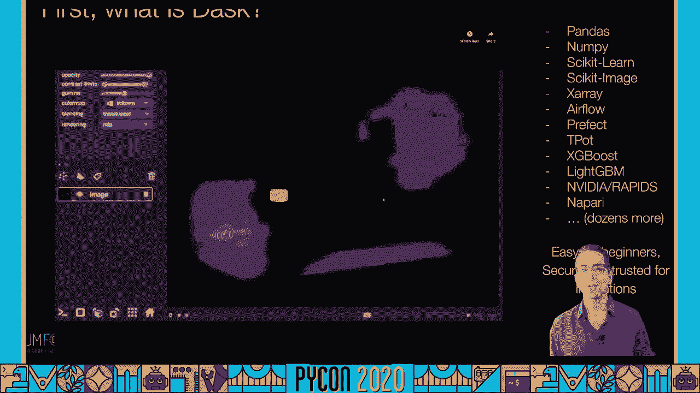
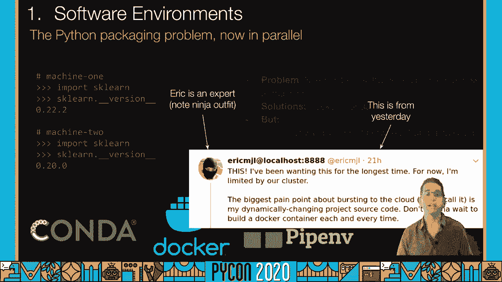
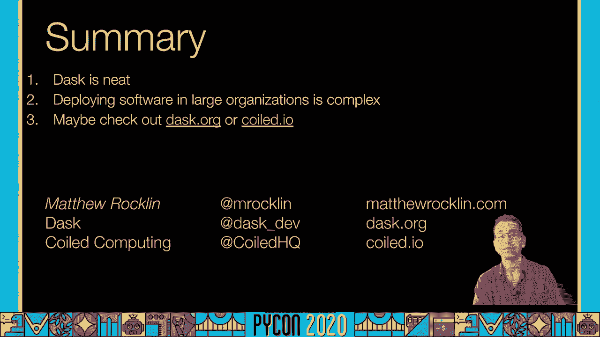
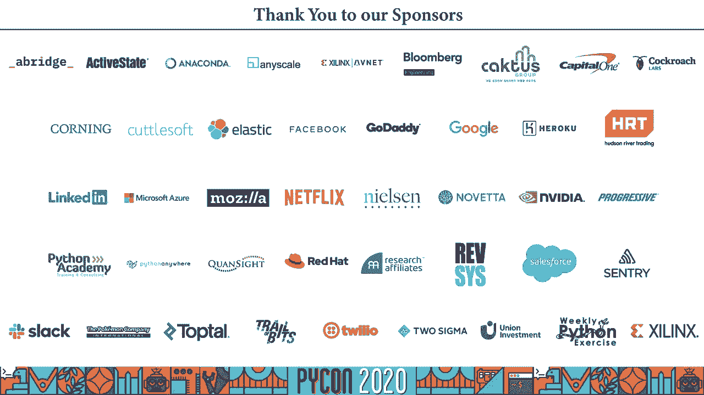

# P59：Talk Matthew Rocklin - Deploying Python at Scale with Dask - 程序员百科书 - BV1rW4y1v7YG

各位，我叫马修•洛克林，我是 dask的核心维护者，今天我们将讨论如何在分布式硬件上部署 dask，我做了很多有趣的演讲，关于如何在许多不同的上下文中使用面罩，这不会是一个有趣的谈话。

这可能是一个非常无聊的，谈论所有可能出错的事情，在更多的企业或机构环境中，所以这真的是针对人们，他们试图在大型架构上部署 dask，在关心安全的组织内部，治理，认证费用，诸如此类的事情，你可能会更开心。

如果你不再看这个视频，还有数百个其他视频 更令人兴奋的是使用面罩，比这个更有趣，如果你想省钱或安全，在一个有进取心的数据科学世界里，请继续这样做，作为一个dask维护者，我从Github开始我的一天。

我得到的问题如下，为什么我的电脑，看我的数据，在那里，我可以访问它，为什么我的其他工人看不到，为什么事情会慢下来，当我增加更多的机器，为什么网络会让事情变慢，为什么它不让我运行我的计算。

最后是我的最爱之一，呃，我其实是在一堆电脑上离开的，我花了一万元帮忙，我上周才做过这个，不是一万，但它是，你知道吗，20台机器运行几天，这是一个非常普遍的问题，尤其是在云端。

所以这次演讲是为了回答这些问题，我们每天都在问题跟踪器上得到这些，我们想整理一份名单，所以人们可以理解为什么，如果不解决 他们，弄清楚如何在数据科学和它之间建立同理心。

所以如果我们能开始用一种共享的语言来谈论这些。

所以在那之前让我们先进入，什么是面罩，它有什么作用，这将是谈话中唯一有趣的部分。

我保证，所以我给一群dask用户发了一封电子邮件，向他们要小片段，他们如何使用染料，我得到了一些小片段，这里，我们正在分析库伯奈特上的大量 csv文件，在云和暗柄上，在木星的笔记本上，但现在在规模上。

dask也经常不与表格数据一起使用，但这里有多维图像数据，这显示了日本沿海的洋流，同样的木星经历。

但现在在网格化的数据上，两个三维空间的 das也被用在木星笔记本之外，这是在和我一起工作，生物医学图像，或者是由面罩驱动的，它的目标是指向并点击，实验室工作台 科学家，不是数据科学家。

所以 dask实际上被嵌入了很多其他的应用中，嗯，那种用破折号来撒一点平行度，比如这里的数据着色器，水蟒的项目，或者这个来自牛津大学的基因组学追踪者，它在研究疟疾，携带蚊子，dask是完全实时的。

全流媒体，它集成到实时系统中，工作流管理系统，如级长，工作流程管理器或气流，das也被像 nvidia这样的公司使用，因为他们正在建造新的 gpu数据科学平台 rapids。

所以 dask实际上是一个基础设施。

是蟒蛇特有的，让其他 python维护者为其现有项目添加并行性，因为那个面罩到处都是，它经常被部署在许多不同类型的机构中，这就是我们今天再次面临挑战的地方，达斯克谈话，如果你想了解更多。

我建议从那里开始。

当我们做这些演讲的时候，我们保证你有这么多数据，你让一个数据科学小组去做，你从中获利，像我这样的数据科学图书馆的作者，学校的维护人员经常会说，当你做这些演讲的时候，其实故事还有很多。

如果你真的想在一个组织环境中安全地做这件事，所以你可以自己做这件事，在学术环境中，也许只有你，你可以使用这些机器，但如果你想邀请队友，如果你真的关心预算，如果你在政府实验室工作，例如。

你会想做更多的事情，至少你不会安全地这样做，你就是这么做的，所以从根本上说，这里的问题是您的集群不是一台笔记本电脑，我们试着让它看起来像一台笔记本电脑，试着模仿同样的经历，但是还有很多其他的建筑问题。

所以你可以拿在手里的笔记本电脑，你身体上拥有它，没有其他人访问它，一切都是自成一体的，但当你切换到集群时，有些事情会改变，例如，一个大的，你有一个单一的硬盘在一个集群的笔记本电脑。

您的数据可能存在于其他一些，数据中心里的其他遥远的机器，另外在你的硬盘上，你可能有数百个硬盘，所有这些都需要有相同版本的蟒蛇，相同版本的达斯克，现在协调软件环境在笔记本电脑上变得非常重要。

你有全局共享内存，所有的 CPU核心都在同一个过程中工作，在相同的数据上使用线程，这对于编写快速的算法非常方便，如果不考虑集群上的通信，你所有的 cpu核心都由复杂的电线网络连接，那很有挑战性。

因为这些电线要慢几个数量级，所以你需要开始考虑沟通成本，因为他们可能不安全，其他人可能会走进那个房间，所有的机器都是，他们可以监听同样的电线，所以你也可以和其他人分享这些机器。

所以现在安全突然成了本地机器的一个大问题，当事情崩溃的时候，我们有很多可用来诊断的工具，就像在集群上的 linux实用工具顶部一样，我们得开始收集所有的诊断数据，所有那些通常不集中的日志。

现在所有这些事情都有工具了，对吧，你可以用普罗米修斯做原木，软件环境码头工人，etc，但我们需要开始考虑把这些技术加入我们的嗯，我们的工作流程，你知道吗，同样，认证和安全是件大事。

我们不能就这么走到那些机器前，逐一登录，那真的很烦人，所以这里有很多解决方案，或者另一个像达斯克这样的项目，触发数据库，张流闪烁，我们需要大量的工具来支持这些库。

所以我想把它分为环境和数据管理的三个不同类别，或者假装你的星团，对数据科学家来说，它看起来像一台笔记本电脑，安全和合规，或者我想说的是，不要被起诉和成本管理，不要破产，所以在接下来的演讲中。

我们会仔细研究这些分类，在我们这么做之前，虽然我想先假装，我们要手动操作，这样我们就能知道我们要做什么，这些工具帮助我们自动化，所以设置面罩其实很容易，DASK是一个集中管理的分布式系统。

所以有一群工人是点对点的，正在工作的 python进程网络，然后在彼此之间传输数据，有一个集中的调度器，比如工地的工头或者运动队的教练，调度人员正在告诉所有工人该怎么做，确保如果一个工人生病了。

其他人可以代替那份工作，然后是，客户就是我们和机器坐在一起的地方，我们的木星笔记本或者我们的巨蟒程序，所以如果我想设置 dask，你可能已经安装了 dask，你可以试试这个，现在它出现了水蟒的默认。

或者你可以 pip安装 dask，你要安装面罩，在一台机器上运行 dask调度程序，所以你可以走到一台机器前，你可以登录你的 pip安装 dask distributed，运行任务调度程序 命令。

打开机器上的插座 开始监听连接，然后我们会走到其他几台机器前，我们将 pip安装 dash分布式，我们将运行 dask工人的指挥点，将该工作程序发送到调度程序正在运行的地址，调度人员会互相交谈。

调度员会通知工人 他们的同伴在哪里，好让他们发现彼此，好吧，当我们想工作的时候，我们不想为自己驾驭所有这些机器，我们将启动一个你知道的木星过程或蟒蛇过程，或者运行一些自动脚本。

我们将导入 dask客户机并连接到相同的调度程序地址，这让我们可以接触到所有这些机器，我们就可以运行 dask代码，它看起来很像普通的蟒蛇代码，并在规模上操作，所以这很好，如果你家里有一堆机器。

你现在就可以这么做，你可能会有一个相当好的时间，我们现在可以做我们真正的工作了，我们很多人，这实际上不是我们通常想做的，我们通常考虑做统计学或数据科学，或者你知道，治癌，今天很多人都在想，IT问题。

它真的让我们慢下来，所以一旦我们解决了这些问题，我们可以回去做我们的本职工作，现在让我们回顾一下我们之前讨论过的所有组件，所有的阻碍，所以首先是环境管理，我们如何假设所有这些计算机实际上是一台计算机。

所以第一个问题，这个，我们遇到的最常见的问题是统一的软件环境，我们需要确保我们运行的是相同版本的蟒蛇，同样版本的达斯克，以及你想使用的所有库的相同版本，在所有的机器上都涂上了染料，例如。

在一台工人机器上和另一台机器上，我们很擅长告诉人们这是怎么回事，并提醒人们注意这一点，但是您需要一些机制来以统一的方式传达软件更改，整个集群，这对数据科学尤其重要，原因有二，一。

不同的数据科学家想要不同类型的软件环境，千变万化，然后两个，这些环境会迅速变化，常常一天好几次，这与典型的数据工程工作负载完全不同，或者你知道，环境变化相对缓慢的工作负载，数据科学家也不太熟悉。

码头工人当然是他们制作的工作流程的一部分，它无法访问更新图像，尤其是在更封闭的公司环境中，有一条来自艾瑞克·马的推文，一位著名的数据科学家，我觉得现在在诺华，他说破云最大的痛点，他动态变化的项目源代码。

他不想等码头集装箱，每次都是对的，所以这是一个非常普遍的要求，所以首先要注意两件事，这条推特发生在昨天，这种事经常发生，第二艾瑞克是个忍者，埃里克实际上是资深的，他不是新手，训练不是问题。

或者告诉他码头工人的存在，他知道码头工人的存在，如果他愿意，他可以把整个演讲，但它和数据科学之间有一种不匹配，当你开始在机构硬件上扩展数据科学时，这真的很常见。

推动资源共享，嗯，十年前，如果是你做的，你会给你的同事发邮件说 嘿，我想，以任何人的身份使用星系团，有人会说不，接下来的一个小时我要用它，你得手动协调，当您与生产工作负载共享这个集群时。

这将变得更加困难，如今这种情况更常见，还和几个同事分享了一个，但有一千名同事，幸运的是，这个软件有很好的解决方案，像哈杜普纱线这样的解决方案，HBC，像 slurm这样的作业调度程序，PBS或 LSF。

更近一些的系统 比如库伯内特斯，使用更现代的机器，在云端上也很常见，这些绝对可以解决这个问题，它们被设计成在许多不同的用户之间共享和分割集群，一些挑战，尽管这些集群通常是为生产而配置的。

不是为了数据科学的工作量，他们通常没有一千人的认证，呃，为他们配置的，它们的设计通常不允许人们为一百台机器而爆发，把机器拿走，你当然可以用像库伯内特这样的系统来做到这一点，但它确实需要一点配置。

这在现在并不常见，至少在我们看来，第三个要点，第三主要，呃，模仿笔记本电脑体验的头痛是数据访问，因此，数据科学家有很多使用笔记本电脑上的文件运行的经验，对，我们都这样做了几十年，我们从网上下载了文件。

我们已经打开了，我们使用了文件浏览器，我们用了终端，我们使用了很多系统来管理文件，当我们切换到，云，或者我们改用分布式系统，对，因为笔记本电脑的体验，单一硬盘的体验现在已经改变了。

我们的数据可能在亚马逊的3，例如，这是需要一点改变的事情，所以我们总是需要使用某种共享文件系统，是hpc机器上的一个网络文件系统吗？或者云对象存储，比如3个 gcs或 azure blob文件存储。

好的，所以继续前进，让我们从数据科学家的阵痛中走出来，为了 IT专业人士的痛苦，所以这一切都是为了确保正确的人可以访问他们的数据，错误的人不能，这是一个真正的平衡，让每个人都变得容易。

同时确保以成熟的方式处理安全问题，回到我们之前的问题，一个非常常见的情况是，所有的东西都适用于本地计算机上的共享数据，但是当你要执行非分布式硬件时，你的一台机器没有正确的凭据，所以也许你有一些。

你笔记本电脑里的一些 aws证书文件，当你在库伯尼特旋转机器时，那些库伯尼特豆荚，他们不知道你是谁，库贝内特斯现在没有正确地扮演你，理想情况下，你有一个系统可以在保险箱里移动这些凭据，安全通道。

如果你不这样做，或者如果这个系统处理数据很痛苦，科学家们会自己做，他们会绕过这个系统，这真的很危险，因为他们把这些凭据清楚地发送出去，或者他们把文件留在这些机器上，所以如果你想支持数据科学家。

易于使用的地方，转化为安全，做得很好 可能有点棘手，但绝对有可能，只是需要一点点的关心和一些与组织其他部分的沟通，它通常不能自己解决这个问题，如果他们不听从数据科学家的要求，和一个网络安全。

这是一个有趣的，所以像 dask或 spark这样的系统，张量流，弗林克，etc，在数百台计算机上运行 通过网络发送的任意用户代码，从安全角度看，这是一场噩梦，原因如下，让我们看这个例子。

我们让爱丽丝在一台机器上启动了一个 dask调度程序，然后鲍勃通过他的蟒蛇工艺连接到同一台机器上，他碰巧知道爱丽丝启动调度程序的地点，就像我们在最后一节看到的，你在证书上正确地传递它。

鲍勃现在可以扮演埃利斯了，他可以查看她的数据，他可以编辑她的数据，他可以改变她的资历，这是一个可怕的地狱，标准的解决方案是使用标准的安全网络协议，例如 tls或 ssl，这很简单，任何系统如 dask。

太成熟了，会有安全无处不在，嗯，话虽如此，您仍然需要将其集成到您的关闭系统中，你的证书很简单，要做的事，但每个组织都需要付出一点努力，最后我们要看的第三类是成本，这是一个，这是一个很大的话题，呃。

我们要做的是，在可扩展的数据科学中，我们给数据科学家尽可能多的权力，即使他们没有大量的技术专长来旋转大型系统，这个可访问性问题令人惊 讶，我们允许你知道，影响他们的未来，太棒了。

但是让这些强大的系统广泛使用 确实会带来很大的财务成本，尤其是在云端，所以我想从三个方面来考虑，避免优化或避免跟踪优化，所以数据科学家的工作量很有趣 因为它们经常是非常紧张的。

通常我们会加载大量的数据集，我们租了一千台机器 五分钟，然后我们制作一些情节，然后我们花一个小时盯着那个地块，在那一小时里，希望我们已经把这些机器还给了，希望我们不会为那些细胞付钱，机器。

当我们在做那些无聊的工作时，在循环中的人，互动探索的过程，我们不需要机器的地方，我们只是需要时间盯着一个情节，然后我们做一些小的调整，我们再做一次计算，因此，缺乏一致性的突发可能会付出非常大的代价。

如果这些机器不归还，我们找到的最佳解决方案是自适应缩放，所以像 dask这样的系统可以查看你的工作量，为你灵活地分配机器，更重要的是，当你不做那些有效的事情时，把它们还给你。

在默认情况下安装 这个是成本的救命稻草，还有像自动空转之类的东西，时间要求和强制使用限制，如果您的资源管理器支持它们，这些都是伟大的想法 往往不是默认的，通常需要一些机制来执行它们。

我们今天认为这是相当临时的，没有真正的标准解决方案来执行它，好的，下一个重点是追踪，所以即使你打开自适应缩放，数据科学将找到绕过它的方法，尤其是如果这种规模不迅速发生，如果你有很长的 q倍，例如。

或者你不能很快得到很多机器，数据科学家通常会抓住这些机器，每隔一段时间你就会和一个工人打成一片，只是为了让它活着，所以你真的想追踪一下，典型的今天，这是用像普罗米修斯或专有云工具这样的系统完成的。

你只想看看，你知道吗，对于每个给定的用户，对于任何给定的群体，对于每一个给定的工作量，他们有效地使用他们的机器吗，如果他们租的是 GPU，这些GPU真的被使用了吗？最后花了这么多钱。

因为每个人都过渡到了云计算，这件事变得越来越大，嗯，但是当我们从云端租机器的时候，关于优化开关的简介，从业绩和时间到金钱，如果你的机构，你知道数百万美元的云每月建设，你知道10%的变化。

10%的优化可以是你的工资，这是为自己辩护的一个很好的方式，不幸的是，分布式分析器很少见，达斯克很不错，我敢说 即使在一台机器上，dask profiler是 python语言中最好的一种。

所以我建议使用它，并不时地检查这些东西，这又是一个省钱的好方法，尤其是当你在大规模经营的时候，原来如此，这些都是我们见过的错误的事情，当你部署数据科学计算系统时，就像机构环境中的达斯克，不管是公司。

政府组织，科学研究实验室，etc，对于所有这些问题，有很多很好的解决办法，我们刚才说的每一个问题，有一个解决方法，但通常你需要把这些，这些都在一起，这最终有点挑战性，所以对于我们讨论过的所有问题。

有解决办法对吧，这里有一些解决每个人的方法，其中一个问题，达斯克有一些东西可以与所有这些系统集成，其中至少有许多适合任何资源管理人员，例如，库贝内特斯，纱线，作业队列，作业排队系统。

DASK具有良好的数据访问集成功能，dask维护人员实际上在 python生态系统中维护这些库，它们不仅仅是用来晒衣服的，我们只是为了安全和合规而维护它们，暗色通道是一项伟大的工程，那是，你知道吗。

处处安全，集成了许多不同的关闭系统，如kerberos，成本管理，我们有很好的侧写，但这些往往又会被其他类型的系统处理，就像普罗米修斯，Datadog或各种专有的云工具系统，达什在这里做得很好。

但其他系统也会有解决这些问题的方法，它还将与这些技术集成，所有这些平台都需要不同种类的工具的支持，你也可以买一个有管理的解决方案，警告我为一家销售这种管理解决方案的公司工作。

所以我要打开我的盈利销售应用程序，就一会儿，希望你不介意，许多开源项目背后都有公司为您销售托管解决方案，对所有这些问题都会有固执己见的解决方案，对，他们会给你这些可爱的绿色标记，让你放心，帮你渡过难关。

如果你在乎达斯克，你可以看看线圈计算，几个面罩维护员，我离开了，我们现在经营这家公司 是为了帮助解决这些问题，我们做了很多其他的事情来看看我们，卷起你说的话，我要把我的利润帽子摘下来。

管理解决方案并不总是理想的，所以你不应该相信任何东西，我说过 你总是相信别人的意见，他们通常很亲密，但不是你想要的，像 confluence这样的系统在设计时考虑到了特定的工作负载。

你的工作量可能会有点不同，他们要花钱，他们总是在赚钱，通常情况下，如果你使用的是，比如 aws管理的 sagemaker服务，或者如果你使用数据砖之类的东西，可能会达到百分之百，从价格上来说，嗯。

他们还试图把你锁在正确的，他们都想给你一些特征，锁定你的数据，他们都想把你当成顾客，所以动机并不总是一致的，话虽如此，他们仍然比维持一个新的 it团队要好，如果你刚开始，他们通常是显而易见的。

你应该经常做这样的事，即使你是一个更先进的组织，通常节省成本的方法是，是值得的，总之，感谢收听三大要点，一抹就干净了，你应该去看看，DASK，寻找其他，问例子或去 dask例子页面的例子 点破折号。

Dot org，有很多好玩的东西，你会找到适合你的东西，部署软件和大型组织的第二个要点是复杂的，嗯，绝对不适合胆小的人，第三，你可能想看看das org或coil，IO。

再次感谢，我叫马修，来自盘绕和达斯维护者的洛克林。

