# P6：Easy Data Processing With Azure Fun -Tania Allard - Sponsor Workshop Microsoft - 程序员百科书 - BV1rW4y1v7YG

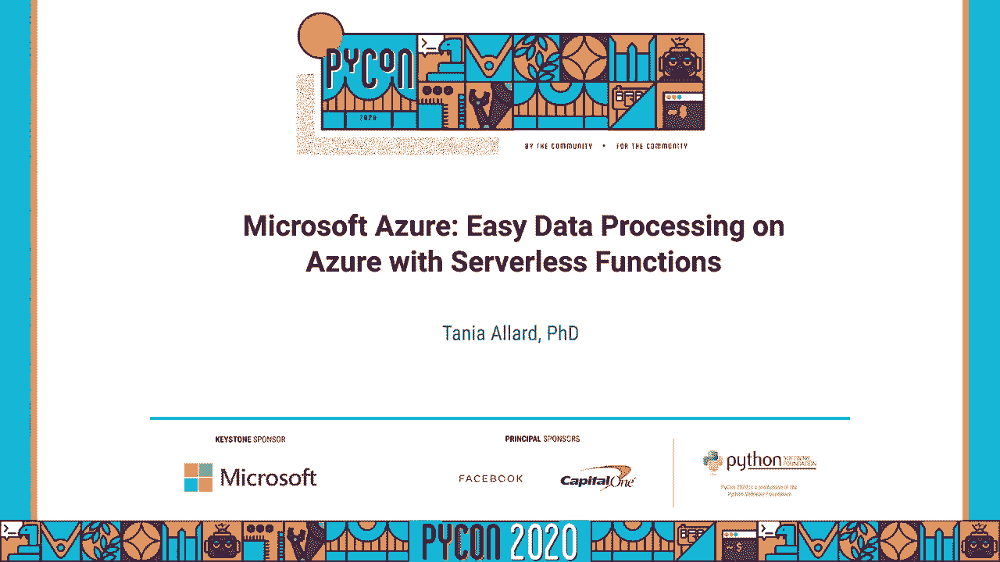

你好，各位，我是谭雅，Lad和我现在是微软的开发者倡导者，我将作为在线蟒蛇20活动的一部分展示，我们的赞助工作坊，它是用 python函数处理数据，我希望你喜欢这个教程。
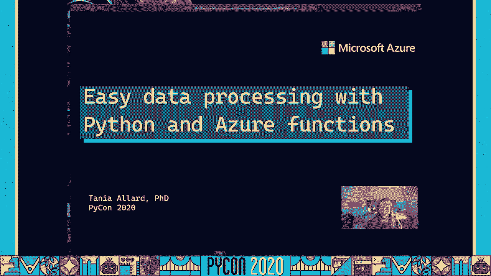

我们将使用大量的资源，你可以在这张幻灯片上找到所有的链接，我们有一个循序渐进的教程，你可以随时在家里跟进，即使在这段视频之后，或者当你想修改材料的时候，还有我将在整个演示中使用的幻灯片。让我们从无服务器计算开始，因为所有的研讨会都将围绕着无服务器计算或一个纯函数，也就是微软，提供一个确定的无服务器名称 可能有点误导，所以一个常见的问题我问我被问，当我谈到无服务器时。是不是根本就没有服务器，这是否意味着我不需要无服务器，有服务器，唯一的区别是，在这种情况下，你不负责管理或维护，这意味着你不需要组装任何硬件，也不需要更新或更新软件。因为所有这些都是由您的云提供商管理和处理的，所以在这种情况下，你的云提供商将是微软，例如，但许多其他云提供商都有无服务器选项，这意味着通过阻塞整个基础设施，您不必照顾服务器、配置或更新。

您可以更多地关注代码，而不是基础架构，使您拥有更高效、更顺畅的工作流程，那么，我们为什么要很好地使用无服务器的主要优势，即您已经有了托管基础设施，所以开发者和你的团队，所以我们可以把这部分描述为。是有管理的服务，但也可以帮助你节省很多钱，因为只有当你使用传统的基础设施时，你才会为你使用的东西付费，意思是你的办公室或家里都有一台服务器，你总是为那个服务器付钱，即使你不用计算时间，所以它运行2，4。7，与Serverless的不同之处在于，您只为所使用的内容付费，或者当您的函数或无服务器应用程序被调用或执行时，因此，从长远来看，这可以导致大量的储蓄和金钱，它也是高度可扩展的。所以如果你有一个用户或一个客户试图访问你的应用程序，第二天你就有了一万个顾客，因为你的应用在网上疯传，而这些应用程序对于扩展来说是非常愚蠢的，因为它们是按需的，他们也是这样管理的，在本教程中。

我们将介绍，使用 microsoft azure函数，它是我们的无服务器平台，正如我已经提到的，它是一个管理的无服务器，意味着我们可以提供，我们提供所有的基础设施，所有的硬件和软件，它已经为你准备好了。你可以带着你自己的应用程序，在这张幻灯片的底部有一个链接，你可以访问，所以，简而言之，Microsoft的函数作为我们的托管服务处理，软件，监控你所有的应用程序，缩放，不管是扩大规模还是缩小规模。以及硬件，以及主机管理 这意味着你的应用程序可以在不同的主机上运行，这也是由保证函数来处理的，在这种情况下 你作为开发者，只对应用程序代码负责，确保它是正确的，这是一个非常好的实践。您正在指定正确的依赖项，和运行时环境，同时决定你要集成的服务和你的功能，不管是数据库，任何种类的存储，就像爱情储藏室，ml，电子邮件提供商，到目前为止，我已经说过，我在服务器上工作过很多次。

您可能想知道为什么微软的 sufunctions叫做 function，或者为什么我们称应用程序函数，因为无服务器计算也被称为函数，作为一种服务，这可能是一个代码片段，或者你为特定任务开发的一点。为了特定的目的，这些都是要在云上部署和执行的，所以这个自成一体的代码片段，所谓的功能，这就是为什么确定函数很酷的原因，比如无服务器函数的一些重要特性 首先是它们的事件触发。这意味着你的函数将处于空闲状态，当它们不是一个允许你省钱的调用时，因为你没有执行或运行服务器 2 4 7，因此，您可以决定哪种事件将触发函数的执行，它可以是特定端点或 url的 h值。或者您希望每当有人将文件放入您存储帐户中的某个目录时 执行您的函数，或者你想让你的功能在每周一早上八点运行，函数的第二个特征是您可以将服务耦合在一起，它们由许多不同的服务组成，这些服务集成在一个平台中。

以及运行时环境，在处理无服务器体系结构时，需要注意的另一个重要问题是，您的函数是无状态和短命的，以及你以后会遇到的其他无服务器的功能，通常有时间限制，所以它们通常不会持续很长时间，长期运行的行动。如果你期望你的功能需要很长时间来处理或做任何你期望它们做的事情，您可能希望看到持久的扩展或持久的函数，另一件重要的事情是非常无状态的 意思是如果你要创建一个资源或者一个输出，当函数执行时。它们通常会消失，所以如果你想保存什么，假设，输出可以是绘图、图形或图表，您必须连接一个存储帐户，以便将输出发送到，最后，无服务器的函数也是异步的，意思是他们会发送一个请求，假设。是 hdp的要求还是你的，所以它处理一个特定的管道，但它们并不等待响应，它们只是在收到触发器时执行，鉴于这些特点，对于作为服务的功能，有一些特别好的用例，这方面的一个例子是图像和视频处理。

我之前提到过 你可以触发你的功能，所以每当有人把文件放入你的存储帐户，出事了，一个很好的例子是 如果你掉了一个图像或视频，也许你想用枕头之类的库做一些处理，它们对物联网应用也很好，当你在使用物联网时。你通常有很多传感器，这意味着你有很多数据，你可能会变得相当复杂，具有允许您处理这些数据的异步函数，而且数据很有帮助，在同一条线上，它们非常适合数据管道，这正是我们在本教程中将要讨论的场景。我们要建造一条起动机管道，会让你看到，以及如何开始构建用于此目的的保证函数，假设你想从变性手术应用程序接口收集数据，可能您想监视某个特定主题或正在开发的工具中的一些问题，或者你公司正在开发的工具。一旦你从 api收集了数据，这需要储存起来，以备以后争吵和报告，只是一般以后用，而且因为你更容易得到所有这些问题的自动报告，可能是人们在科技中更常用的标签，你还想在收件箱里收到一份每日文摘，对于本教程。

你得先安装蟒蛇三点装置，支持的短函数版本是三点六，三点七和三点八，我们还将使用 vs代码，它是一个开源的集成 ed，你可以在 VS代码市场上访问和安装它，我们还将使用 python vs code扩展。以及函数与代码扩展，安装距离延长线，这将允许您充分利用这些代码以及 python语言，优化你的工作流程，最后你需要一个堆栈交换，API应用程序，钥匙。
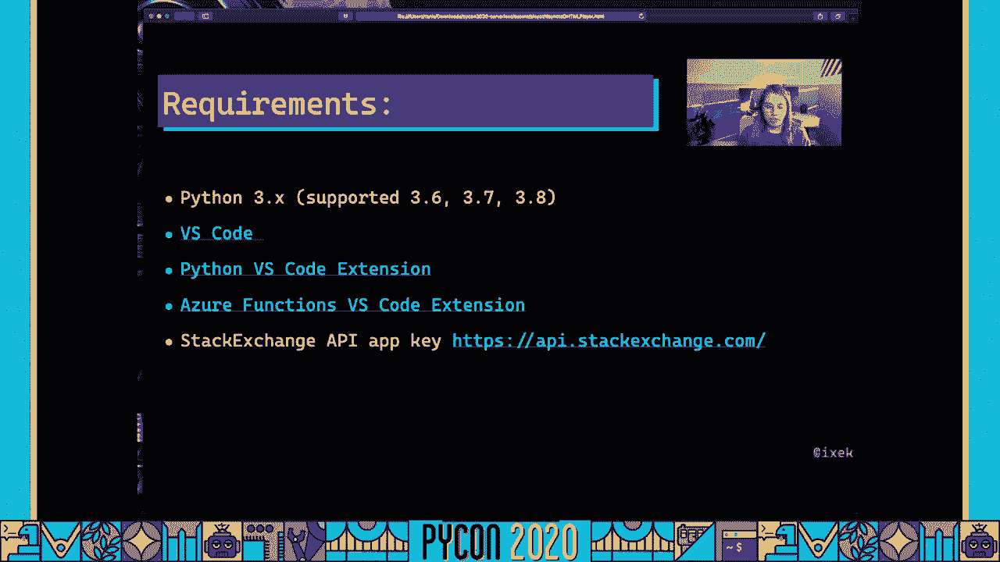

所有这些要求，以及所有这些详细的结构，让你遵循教程，可以在本教程中找到，本网站，又名蟒蛇小姐 二十，二十个蔚蓝功能，如果你去安装，它将指导您如何安装本教程所需的所有需求和依赖项。
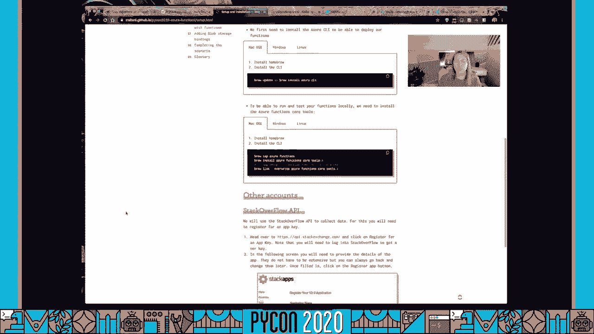

一定要在自己的时间查看，我们开始吧，因为我们希望我们的功能每两个，四小时或每天，我们将使用计时器功能，或者我们将使用调度函数，假设我们需要一个定时器，这只不过是一个克隆表达式，当触发发生时。每天以每米9的速度运行，或者是每米9就会触发你的功能，它将从精确交换应用程序接口收集数据。
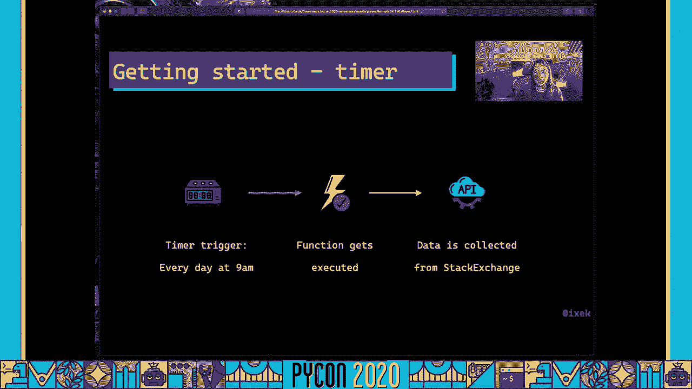

我们开始吧，如果你没有一个可靠的帐户，确保访问 保证微软，你今天拿到你的新帐户，你可以得到12个月的免费服务，以及价值200美元的信用，不用担心，链接到这个在阿卡点，多特·派森女士二十岁保险功能。
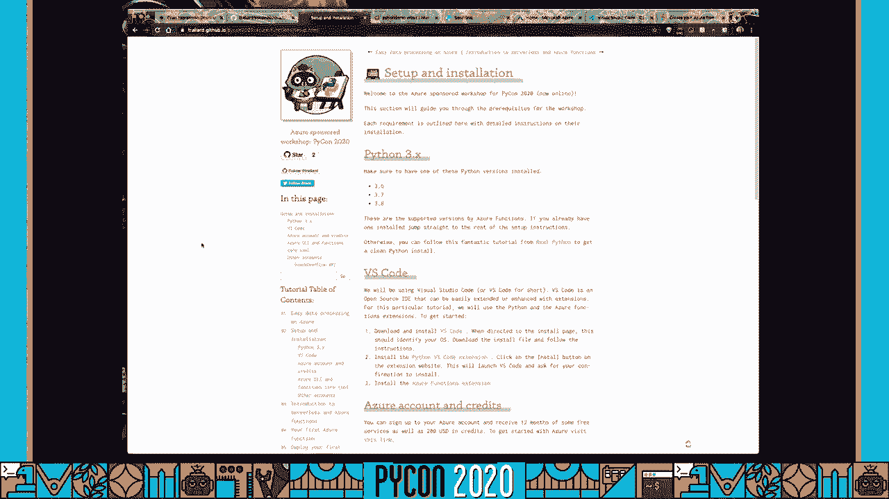

我们首先要创建一个目录，在那里可以存储应用程序的所有文件和脚本，我要去一个文件夹 在那里 我通常看到演示，但它可以是你电脑里的任何东西，我们将从创建一个文件夹开始。在那里我们可以存储这个项目的所有脚本和文件，为此我将使用指令，使德里浮游生物20，换到那个目录，因为我的电脑里已经安装了 vs代码，我可以直接从命令行启动它，因为我在目录中找到了我执行的 vs代码。它已经为我创造了一个工作空间，这是一个，这是你第一次打开它时的样子，这是一个侧边栏，在这里您可以看到您安装的所有扩展，我们会在这里看到我们要处理的所有文件，你也可以使用。我们将从点击 sure functions图标开始，再等扩容启动，在确定vs代码识别python解释器之前，您应该有一个类似于此的函数部分，第一部分是登录 shif，当你点击这里时，你还没有登录。

你会看到一个眼睛说登录引座员，一旦你做到了，你可以点击，创建新项目，在这种情况下是蟒蛇20，这就是我刚才做的目录，我要用蟒蛇的语言，取决于您在计算机中安装的解释器。您将能够选择您喜欢的创建虚拟环境的对象，在这种情况下，我要选三点七，我们要从一个计时器开始，我要给我的函数命名。
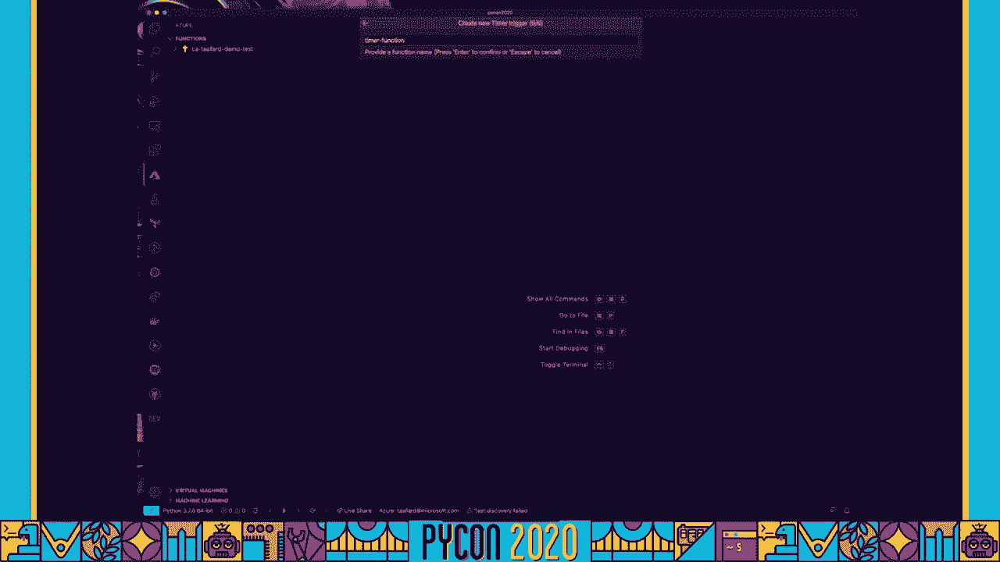

如果你不是很熟悉常见的慢性奇怪，我添加了一个链接到今天的慢性表达描述符，你在哪里写你的慢性扩展，然后用通俗的术语或简单的英语来描述它。
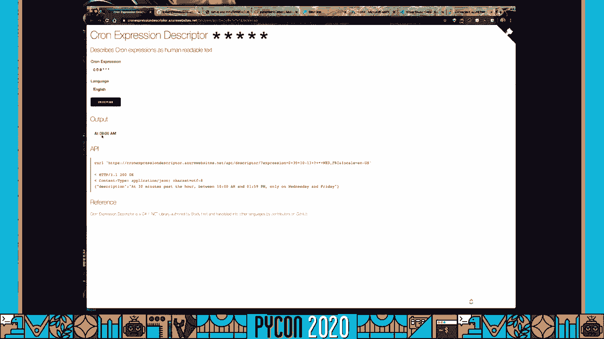

所以我要把它粘贴到，VS代码和当前，马上，你会看到，它开始创建虚拟环境以及你的项目，我将为这个工作区选择使用虚拟环境，我们可以去编辑到探索者，你会注意到一系列刚刚创建的文件，本地设置，杰森。或者一些键和变量，以便您能够在本地执行和调试您的函数，以及任何其他扩展，在我们的文件中还有一个与 get忽略非常相似的 funk，这是为了告诉我们在部署函数时避免部署哪些文件。一个标准的 get ignore jill注意到在底部的本地设置和 json文件都被排除在外，这是给你的，这是为了防止你不小心把你的任何秘密或 api键推到版本控制。现在让我们检查检查功能 json文件，邓德尔普，目前我们有一个捆绑，是触发，它是由"触发"这个词表示的，它朝着，这是时间表，如果你想换水壶，它不是每天九点运行，你希望它每次都能运行，每天午夜时分。

你可以在这里更改时间表，现在让我们检查杜宁的邓皮文件，你会注意到它从生成一个 uc时间 拇指开始，这是因为在默认情况下保证函数有一个 uc时区，因此，如果你在不同的时区工作或操作，请确保调整这个。同时你的时间和我们在 json文件中得到的匹配，它的名字是氯化物，作为主函数的参数，而且是定时器要求的类型，现在你有了一个基本功能，您应该能够在本地执行，并直接从vs代码中调试它。我们会按下键盘上的 f5键，你会看到一个新的菜单 在你的 vs代码的顶部条，因为我们使用的是带有定时器触发器的保证函数，我们需要创建一个存储帐户，我将为此目的创建一个新的存储帐户。我也要创建一个新的资源组，这叫蟒蛇 二十二十演示，资源组允许您将所有的资源和服务都放在同一个数据中心，当我们创建一个短函数时，你将会在这里看到星图的展示，这可能需要一段时间，所以要有耐心，一旦手术完成。

您将看到保险函数的输出，它将初始化主机以及初始化您的所有功能，因为我们用的是计时器，它会告诉你我们使用的慢性表达是什么，接下来5次出现的计时器函数，我们可以看到它将从明天开始 每天9点运行，然而。我们再来看看短函数的扩展，扩大一个本地项目是蟒蛇二十，二十，并扩大职能，如果我们右击，我们现在可以执行一个函数了，这将触发函数的执行，如果一切顺利，你是，您将看到这个输出来停止本地调试器和本地实例。你可以点击断开按钮，在调试函数菜单上，下一步是部署第一个函数，您可以使用 vs代码中的 sher函数扩展来完成此操作，如果您已经关闭此功能，请单击扩展名上的显示，然后点击部署功能。我们将在一年内创建一个新的功能，我给它起的名字和我给我的资源小组起的名字一样，我要选蟒蛇3号，美国中部七区，它将创建我的存储帐户和我需要的一切，你可以的，您可以从这个状态栏直接跟踪部署的进展。

您可以展开输出窗口 以查看您的位置，也是，这将部署类似 python版本源目录的信息，还要担心构建内容部署在哪里，您可以看到输出或设置。
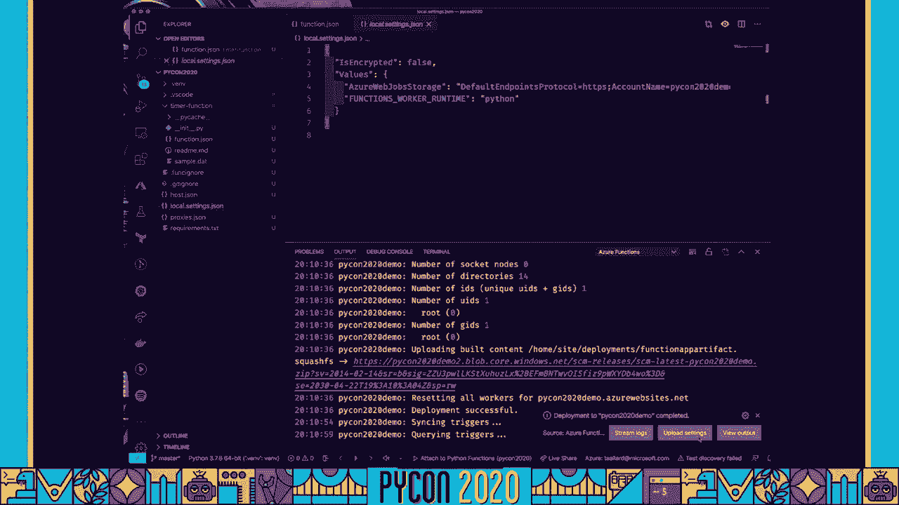

以及河流记录，注意你的功能，既然你已经部署了你的安抚功能，您可以到我们的门户来监视该功能 并触发其他执行，如果你去微软门户，向它保证，COM，默认情况下，它会把你带到你的主页。或者你可以看到你最近创建的所有资源，以及其他不同的导航，快速启动，我们要点击功能应用程序，在左手边的边栏上，如果这里关闭了，你可以点击这个双箭头来展开它，我要点击蟒蛇20 20演示。这是我刚刚创建的一个函数，如果你想走，如果你去配置，您将能够看到它已经有一定数量的环境变量，函数将访问这些变量，因为我们已经创建了一个安全的网络作业存储，它已经被添加，所以您不需要创建一个新的密钥。让我们再次点击这里 蟒蛇20 20演示，然后在功能上，它将显示我们目前拥有的 dunder init文件，就像我们在本地电脑里做的一样，我们可以触发这个函数的执行，你会看到你的请求的状态。

但如果你去 monitory，您可以看到它是什么时候被执行的，以及在所有调用中执行的结果，并不是说你第一次部署你的函数 并试图执行它，可能会有一点延迟，这就是所谓的冷启动。这意味着你必须首先初始化一个房子，在那里你的功能将离开，并将从，您可以在这里看到您的函数的状态，意思是它在运行，你也可以在这里阻止它，如果你想，如果你再去监视器，你可以看到实时指标。它会连接到你的应用上，它将为您提供大量的引用或度量，这些引用或度量与您创建的请求相对应，cpu的使用，和其他和其他的东西。
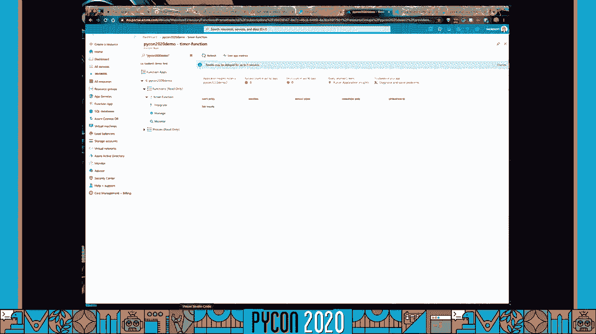

让我们回到 VS代码，在我们的此刻，我们的功能不是做任何令人兴奋的事情，我们要做的是连接到麻袋交换应用程序接口，为此目的，我要创建一个新的文件和一个新的目录，内部定时器功能。我准备创建一个新文件夹 叫做 utils，我要把我所有的帮手，我的帮助，伟大的剧本，我还会创建一个堆栈点，我准备把，我把所有能让我进入的方法，堆栈溢出或堆栈更改，Exchange api。所有这些内容都是本教程的辛迪加存储库，我还将修改我的主函数，以便它从util部分调用方法，我在这里输入我的方法，我也在收集变量，我还修改了我的域函数，使它以iso格式收集时间戳，收集变量创建。为堆栈交换创建一个对象，收集问题，因为我需要，因为我需要储存我的，我开始在某个地方更换 api密钥，我还将在目录的顶部根目录下创建一个点 m文件，我要在目录的顶部根目录下创建一个 dot m文件。

我要把客户身份保密 还有我的堆栈交换 api应用的密钥，确保替换该函数中的值，确保替换 m文件中的值，既然我们的函数已经被修改了，我还想确保我所有的文件都是可识别的，所以我把这个主文件叫做主函数。我将直接改变功能，名字也是，我在用 python m收集环境变量，以及要求，现在我们准备在本地执行，首先会安装我们添加的所有需求，初始化主机，展示舞台，我们再一次按 f5，调试我们的功能。现在我们已经更新了我们的函数文件，我们的要求，我们所有的剧本，我们就可以执行了，所以再来一次确保扩展函数，现在点击执行函数，你会说我为搜索词收集了13个新问题，如果我们回到剧本。我们可以说主要功能是寻找，所有最后的问题都有 python和 consure函数，但我们可以把它改成你想要的任何东西，我们要重新部署我们的功能，我们将选择我们已经创建的应用程序。

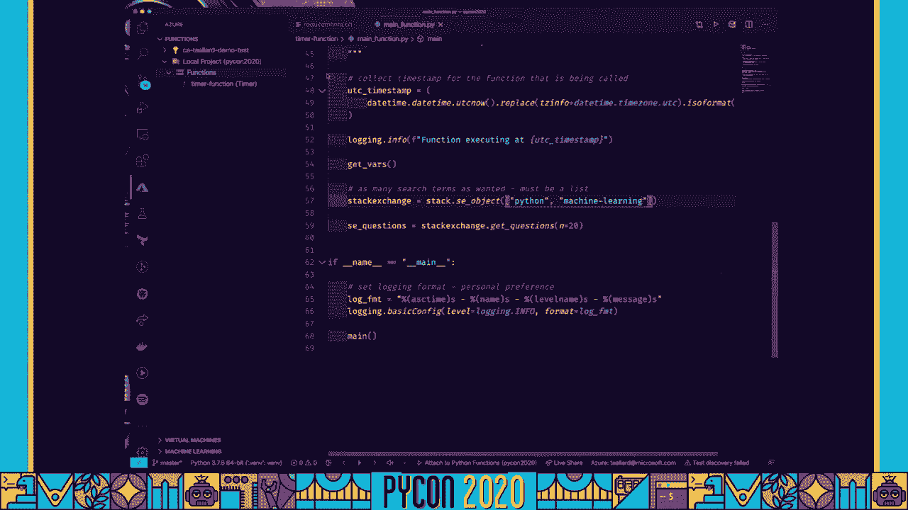

我们要推翻那个应用程序，一旦部署完成，我要回到我的天蓝色传送门去参加我的活动，点击计时器功能，然后我会去配置选项卡，在这里，我将能够添加键，阅读我之前创建的环境变量，一旦创建了环境变量。你应该可以在这里看到他们，以及您的网站存储之一，并点击，保存，更新，我会注意到我的蔚蓝功能应用程序正在更新，再一次，我们可以直接从传送门触发它，而不是等到第二天九点，我们可以去看监视器。它有时需要一点时间来确保它运行。
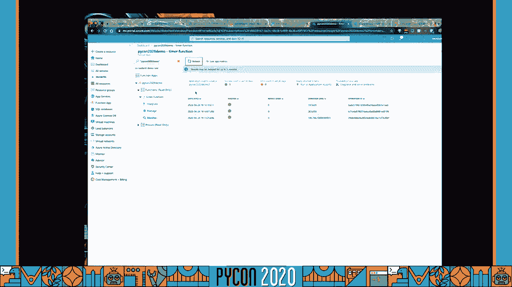

到目前为止，我们已经实现了一个简单的计时器功能，我们有触发装置，我们得到执行的函数，我们正在收集数据，我将介绍触发器和绕组的概念，我在本教程的开头提到，当您的函数被使用时，但它不在使用中，它被闲置了。意思是它处于休眠状态，每当在这种情况下出现新的触发器时，它是一种慢性表达，然后你的功能状态变成活动的，这就是导火索，如他所说，有很多，很多不同类型的触发器，要记住的重要一点是 函数可以有一个。只有一种触发装置，每次只有一个扳机，现在让我们假设我们有空闲函数，我们又有导火索了，所以我们的功能变成了活性状态，有时你想保存我们函数的输出，在这种情况下，对于我们正在收集的证券交易所数据。我们想把它放在我们的安全存储库里，这就是所谓的约束，绑定可以有两个方向，输出绑定或输出绑定或在绑定中，这意味着眼睛将是我们的应用程序正在消费的东西，我们已经检查了触发器的概念，一些绑定我们要扩展函数。

我们已经有了一个触发器，我们有这个功能，我们收集了，部分管道，我们现在要添加一个外绑定。
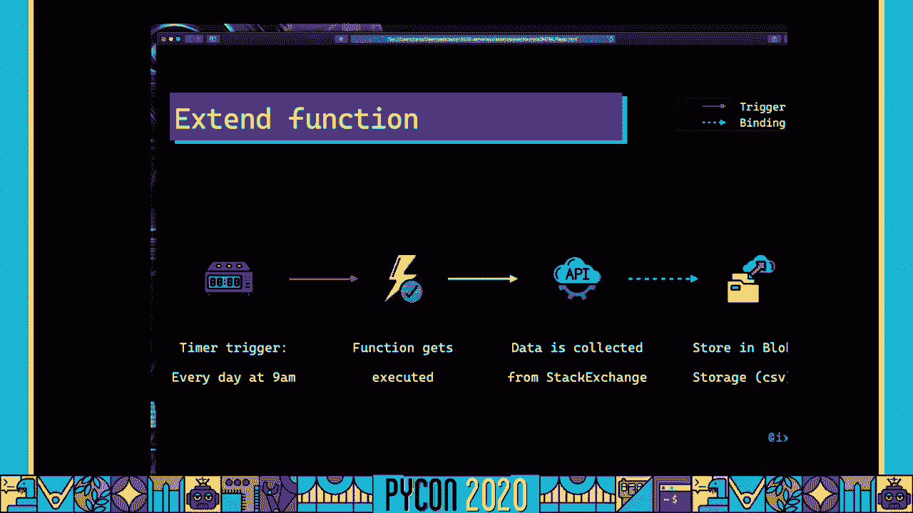

所以我们的 csv文件被存储在一个 blob存储中，让我们回到 vs代码，我将关闭这些文件，我将返回到短函数扩展，如果我是对的，点击计时器功能，您将看到您可以添加一个外部绑定。我要选择出去的方向 因为我们要发送数据，在这里您可以看到您可以选择的所有绑定类型，我将选择斑点存储，我把这个叫做输出点，现在您通常希望您的函数只监视您的 blog中的一条路径，在本例中。我将从教程中复制并粘贴这个表达式，我将创建一个叫做函数块的块容器，我想根据收集的日期和时间来识别所有的文件，它将会有扩展 csv，我将选择一个已经在本地设置中的安全工作存储。您将看到您的函数 json文件已经被修改了，所以这增加了触发器的输出部分，你的束缚，对不起，以及连接，我也修改了主函数，所以不仅打电话，所以它只能从堆栈交换调用 api，但我也要写这一切。

将所有问题保存到文件中，并将其作为csv保存到输出，这和我给我的斑点装订取的名字是一样的，我们在主函数中定义这些绑定的方式，我们已经在功能时间请求中设置了计时器。但是我们要添加输出块 现在是时候放克字节了，因为它会被咬，我们还想传递函数的上下文，这是非常重要的，这样我们就可以看到并跟踪我们将在哪里保存我们所有的东西，这是我们的 e函数，再一次。我要按 f5在本地运行，等待主机初始化我的函数，初始化，我会从树函数中触发它，延期。
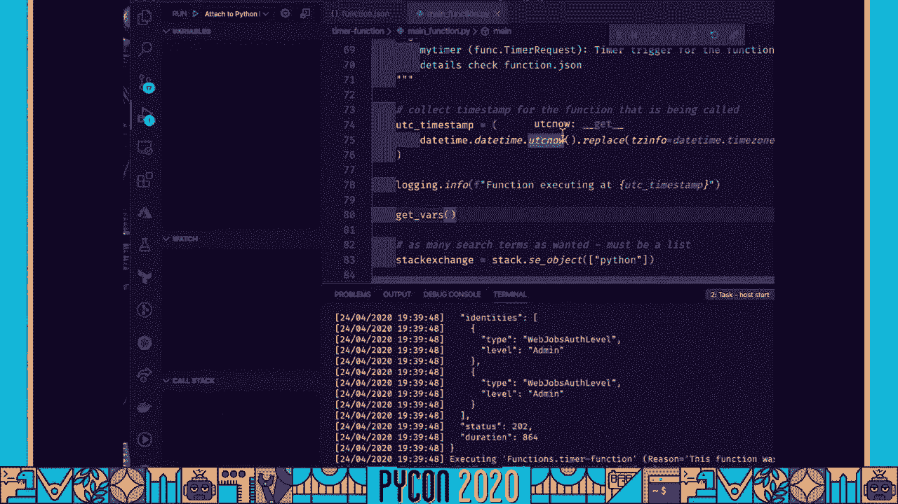

你可以看到它是成功的，所以现在我们要回到我们的传送门，然后单击资源组，或者我们可以点击存储帐户，我要点击蟒蛇20 20演示，有一个我用于此函数的存储帐户，再装在集装箱里，有一个功能块容器。就是我用来做这个函数的容器，你会注意到一个新的csv文件，它对应于我刚刚在本地触发的运行。

再一次，我要断开连接到我的应用程序或我的功能，并部署论坛与代码。
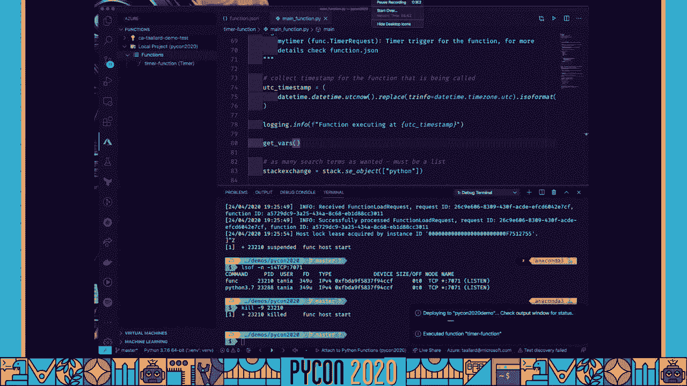

一旦部署完成，我可以去短门，去参加我的活动，检查桶，再一次，您可以直接从门户触发您的函数，如果我看了一个存储帐户，然后去我的容器，函数 blob应该有一个新的 blob存储，更新功能可能需要一段时间。为了解决寒冷的开始，请记住，任何时候你可以监控你的电话状态。
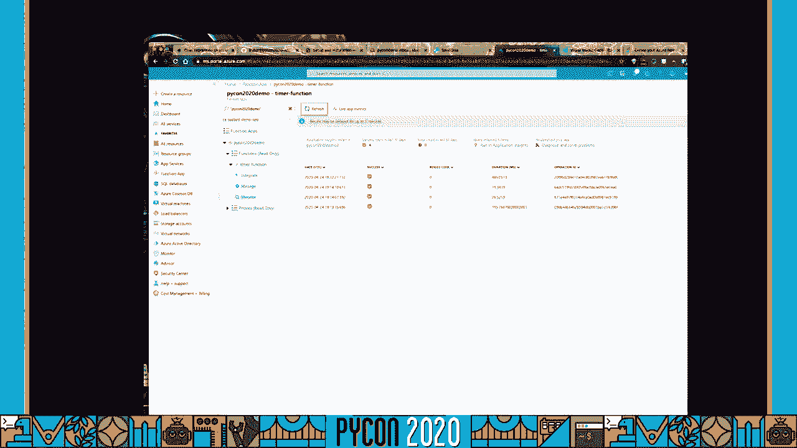

太棒了，现在我们创建了一个函数 从堆栈中收集数据，exchange api处理数据，然后储存在一个确定的斑点星，每天九点都会发生这种事，所以我们要完成这个场景，在这种情况下。因为我们希望这个已经被添加到大量存储中的文件成为我们的触发器，我们要创建一个新的函数，每当它检测到添加到我们之前创建的路径上的新功能时，它就会被激活，那是功能团，斜线，不管 csv文件是什么。当这个函数被执行时，它将检索数据或 csv文件，做一些操作和数据，创造一些云，我们主要感兴趣的是识别哪些是在过去的两小时内最常用的攻击，以及那些有答案和没有答案的问题，我们要添加两个绑定。其中一个绑定将把我的摘要发送到我设置的电子邮件地址，另一个装订会把情节保存到一个固定的地方。

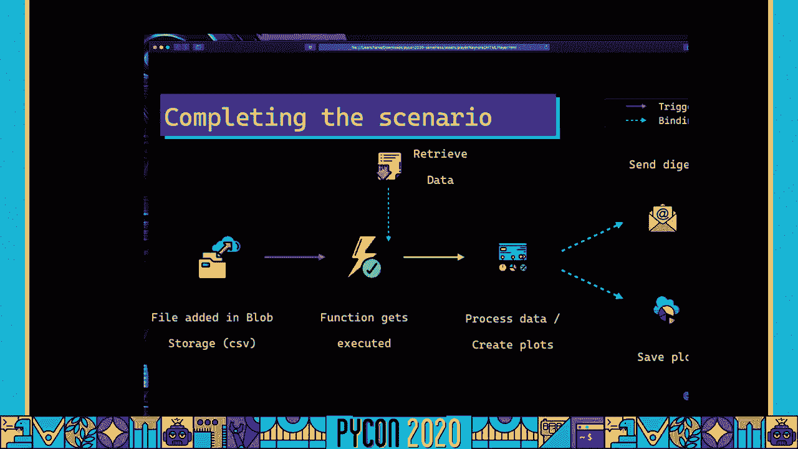

走吧，就像我们以前一样，我们要创建一个新的函数，在这种情况下，与其创建一个新的项目，我们要创建一个函数，我们将使用固定斑点存储器，我要把它叫做我的博客，我将选择一个存储计数。因为我想跟踪前一个函数中的一个文件，我将提供与函数 blob相同的路径，名称的占位符，和 csv，如果我们去，如果我们回到编辑那里，你会看到我们有计时器功能和我的斑点，我们只有一组本地设置。在追逐马匹的同时，在博客里，我们又有了一个文件，但与之前的定时器不同的是，参数是我的斑点，函数是一个输入字符串，为了一致性，我要重新命名这个，这就是对数函数，然后我也要重新命名，这是块操纵。我要创建一个 util文件夹，在里面打雷，持续存在的文件，为了简单起见，我从回购协议上复制了一些模板，因为我将会通过 sendgrid发送一封电子邮件。

我还添加了使用 ginger模板的基础电子邮件模板，请随意使用您自己的电子邮件模板，我还修改了一个块操作的主要功能，再来一次，我在收集一些变量，我正在进入上下文。我在处理脚本中的 u文件中添加了发送电子邮件的方法，我还创建了所有收集数据的方法，从 blob存储呈现中提取数据，电子邮件模板，编码的图像将成为，创建电子邮件，把数据清理干净，当你有时间的时候。你可以的，您可以花一些时间来研究这些方法，它在做什么，我不是，我也会更新我的需求文件，以确保我需要的所有图书馆都在，现在我们要创建两个绑定，一个发送电子邮件，然后另一个将情节存储到爱情存储中。先从我们熟悉的那个开始，所以我们要选出，我要叫它，我去选一个，我就叫它苹果球，在这种情况下，我要用这个文件名，所以这和我们保存 csv文件的路径是一样的，但是在一个叫做数字的子目录中。

下一步是创建第二个绑定，这将是真正的电子邮件，所以我要为这个案子选择，发送 gre，我把它命名为桑迪·梅尔，我要创造一个新的地方 令人不安。因为我们需要创建一个 API密钥 这样我们就可以使用该服务发送电子邮件，我们把它叫做和应用字符串一样的网格 api键，以及两个地址和地址，这就是函数 json文件现在的样子。在我们能够调试我们的功能之前，幸运的是，我们得回到传送门。
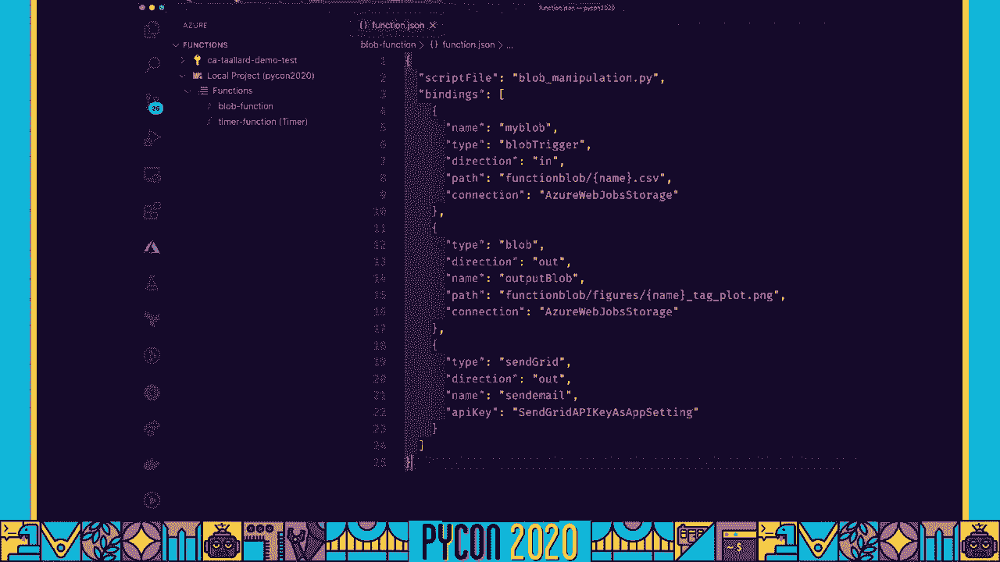

我要回到我的传送门，这样我就可以创建一个发送级应用程序，可以单击"创建资源"，在搜索栏里，点击 sendgrid，点击创建，因为你已经是顾客了，你会得到一个免费的计划。在那里你可以免费发送两万五千封电子邮件，我要选择我的订阅，python tw20 source group演示，默认情况下是相同的区域，我会提供所有这些细节，哪里的名字，密码和定价层将被定义。我现在要完成剩下的，论坛座无虚席后，你需要点击创建，你就可以利用你的资源，从你的资源主页，你应该能看到你的桑格账户。

你要看到的最上面的酒吧，一个管理按钮点击那里。

它会带你到你的圣杯，仪表板，我们需要创建一个 API密钥，所以我们来看看 api keys，你会看到我已经有一个了，所以我要点击创建 api，我要让你给它起个名字，例如，杜米，在这种情况下。我将提供完全的访问，是，然后单击"创建"并查看，确保保存您的 api密钥，因为在那之后，你就看不到了，把它放在安全的地方。
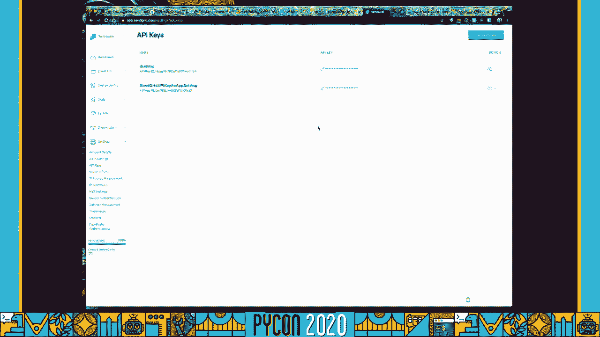

我们将添加另外两个环境病毒，一个给接收者，一个给发送者和发送者，确保使用与创建发送帐户相同的电子邮件，在接收端，它可以是任何电子邮件帐户，也在您的本地设置中，杰森说，确保添加您的 api密钥，保密。这样其他人就可以访问它，我们都应该准备好在当地执行我们的任务，按 f5，你会再次看到输出，在本地环境中出售的所有需求，这可能需要一段时间，如果我们执行定时器功能，我们会得到和以前一样的产量。您还会注意到，因为我们创建了一个新的blob存储文件，已处理了 python块触发函数，如果我们回到我们确定的入口，然后检查我们的块容器。
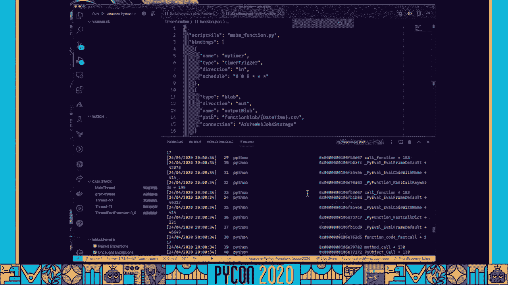

我们已经准备好部署新的，我们的新功能，再次进入我的功能应用，点击 python twenty twenty demo，这将是我的沙子 贪婪 api密钥，点击保存，回到 vs代码，我要去断开功能。
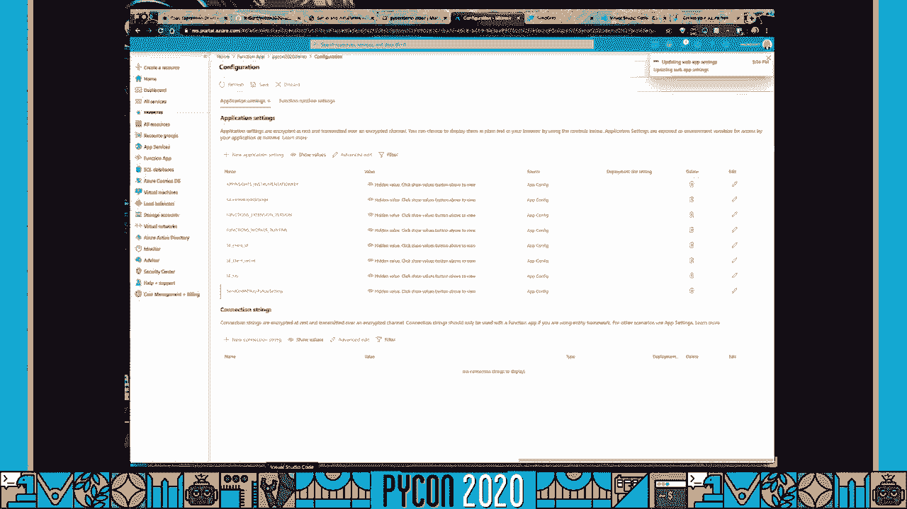

直接部署功能，去选蟒蛇 二十，二十，演示，这样做的好处是，因为我们已经创建了一个保证函数项目，它不仅要部署定时器功能或者，但是它将部署这个 python的所有本地项目，二十二十，一旦您的功能被部署。
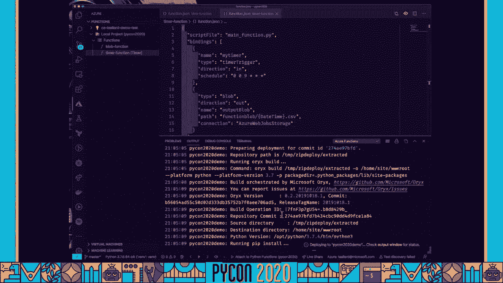

或者一旦项目部署完毕，你应该可以在这里看到你的两个功能，我们都可以使用定时器功能，在这里被处决，就像我们做的那样，当我们用本地电脑做的时候，这将触发斑点，块操作功能，我们可以使用定时器功能，从这里开始。就像我们在当地做的那样，这将从堆栈中收集数据，Exchange api，对不起和斑点，当 csv最终把它设置在我们的引座员熔岩库时，块操作函数将被执行，电子邮件实际上泄露了。或者使用 ginger模板来呈现这个 html，这个 html电子邮件，当我们创建最流行的拖船的半情节时，我们有一系列没有答案的问题，在堆栈交换中带有答案的问题。

我们现在已经完成了我们的方案，恭喜你，希望您再次喜欢本教程，以下是资源，一步一步的教程，它有一个非常详细的说明，说明如何做每一步来完成教程，这是幻灯片。
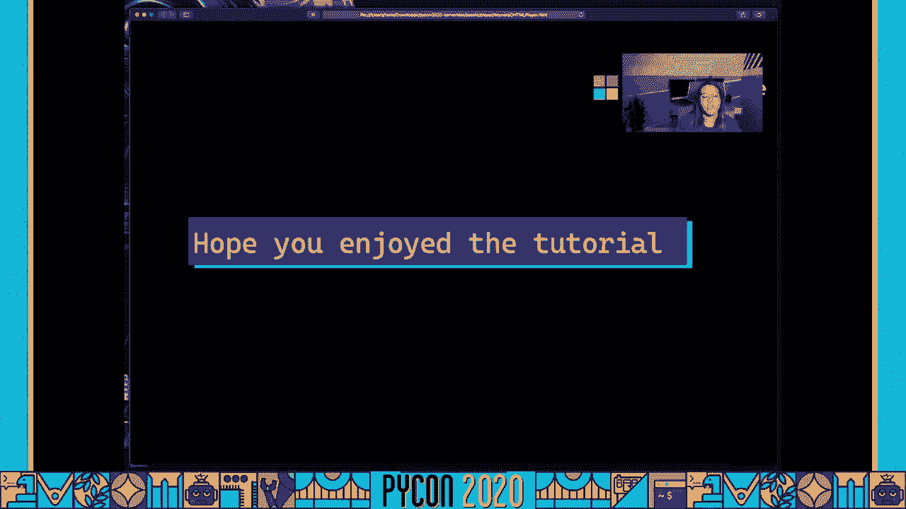

