# P61：Talk Nina Zakharenko - Goodbye Print, Hello Debugger! - 程序员百科书 - BV1rW4y1v7YG

你好，虚拟蟒蛇，我叫妮娜，我将讨论如何在 python中进行调试，无论您使用的是 print pdb还是 ide中的调试器，你会从这次演讲中学到一些新的东西，我将介绍在 python中使用调试器的好处。

给你看几种不同的类型，甚至和你分享一些我自己的技巧和诀窍，这次演讲的幻灯片已经准备好了，各地资源丰富，所以请随时下载幻灯片来跟随链接，在尼娜可以买到，两条蟒蛇二十，我叫妮娜。

Zaanko和我在微软担任 python开发者倡导者，专注于使 azure和 vs代码更好地用于各地的 python开发人员，我写软件已经十多年了，像 Meetup这样的公司，如果你想保持联系。

请在安娜尼的推特上关注我，最近，我还每周两次在 twitch上实时编码，我的 twitch用户名是 nj a io，我，将介绍为什么应该使用调试器，断点和其他调试器基本原理，我将讨论我的工作流工具。

比如pdb db和ides，新的断点内置在蟒蛇三七，然后是演示，小贴士，技巧和一些关于何时使用的指导，多么迅速的声明，这是我的方式，有许多可用于调试的工具和工作流，我将向你展示我使用的工作流程。

但这并不意味着它适合你，所以选择最适合你的，我将向你展示一个小的演示应用程序。

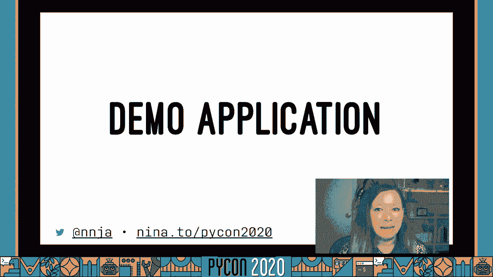

这是一个非常简单的烧瓶应用程序，没有数据存储，它使用 github搜索 api来寻找基于语言的明星库，得到的 api数据是 json。

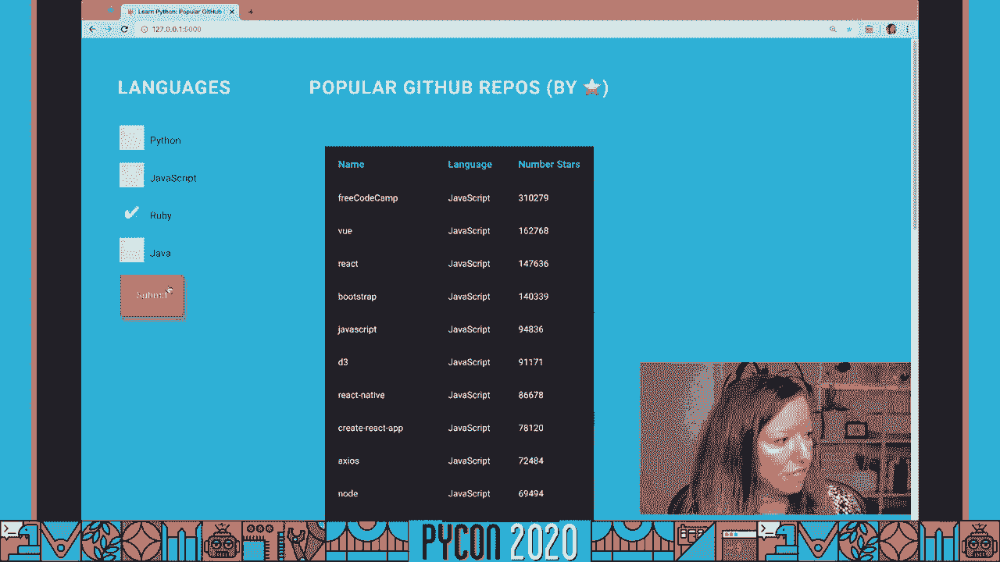

这是相当标准的东西，现在，这就是这个应用程序的主要代码，我们调用 github api，我们得到了回应，他的反应是，然后我们用它做一些事情，假设我们的代码中有一个错误，我们怎么用打印来调试这个呢？

可能数据看起来不像，我们希望它能。

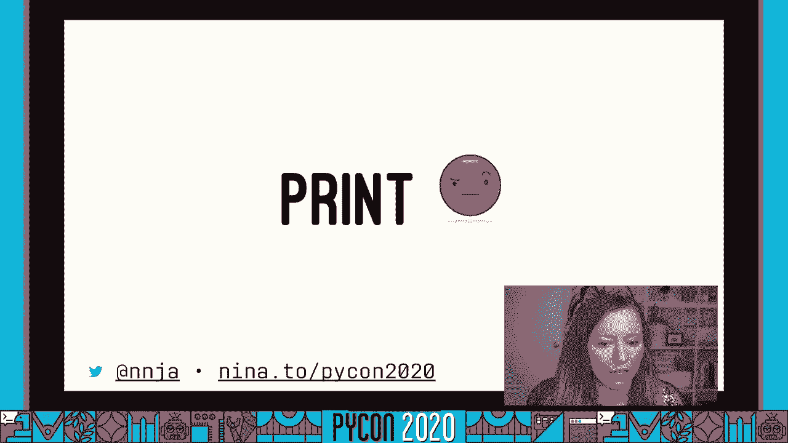

所以我们会在这里用大多数明星的方法来进行我们的报告，也许我们可以从打印项目开始。

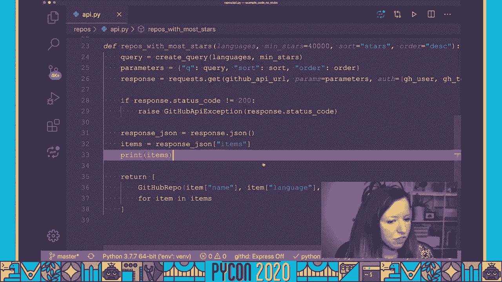

让我们在这里提交一些东西，然后去我们运行的服务器，我们会看到它把所有这些东西打印出来。

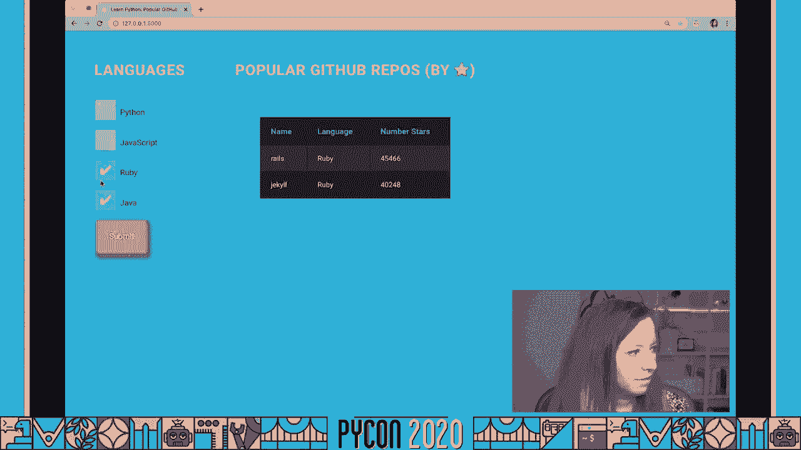

好的，所以现在，如果我想从中得到更有用的东西，我可能会查看返回的api键，并继续修改我的print语句，直到它返回一些有用的东西，太乏味了，你已经用了指纹，尽管你可能想知道，好吧，使用调试器有什么意义。

嗯好吧，打印的问题是打印没有给我们很多上下文，如果你混淆了代码中的指纹，您熟悉调整打印内容的过程，因为你搞错了，也许您正在处理大型嵌套数据结构，所以你要调整或者重新运行你的代码，你在调整格式，你又来了。

太乏味了，有时错误就在打印语句中，所以让我们看看调试可能是什么样子。

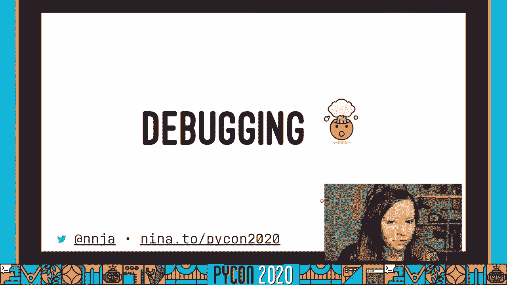

回到我们的代码，我要去掉这个指纹 因为我用的是蟒蛇37，我可以在这里添加一个断点方法并保存，我们可以确认我们的服务器已经重新加载了新代码。

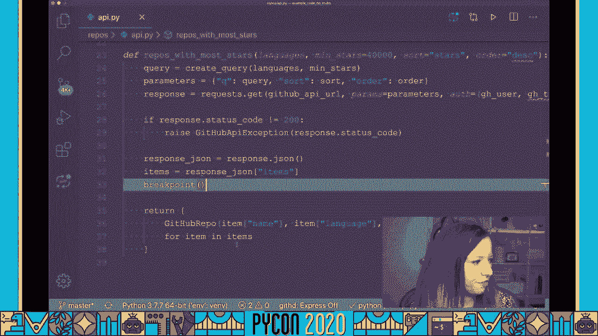

而不是一直回到，我们的网站并点击它以获得数据，我把它卷曲在背景里，这基本上和翻页是一样的，现在我们将看到我们处于一个活跃的提示，我们在这里看到一个箭头，说明我们在哪一行代码上。

然后我们可以开始在这里输入，现在我可以在这里交互我的代码，所以我可以看看从应用程序接口返回的物品，我可以去买一个，如果我想用这个工作，你知道我可以从里面拿到钥匙，例如，我可以在这里打印或漂亮的打印。

这已经比我们整个长长的打印声明好看得多了，真正有用的是交互命令，所以这只是一个，行提示，你会注意到 当我按输入它，只是继续，如果你想要的东西看起来更接近蟒蛇 提示，您可以在这里键入交互。

我们将采用互动模式，然后我们可以开始写多行代码，假设我想要一个有代表性的样品，我不想和他们30个人一起工作，因为这是最大的数据集，所以我可以说，嗯，我们来看三个项目，然后我可以打印出项目。

一旦我完成了互动模式，这就很容易了，我可以按 ctrl键退出，我们会看到我们回到了我们的 pdb控制台，然后我就可以开始输入命令了，它将继续介入，跨过代码的下一行，一旦我完成了我的调试器，我可以按c。

它将继续，直到下一个断点被击中，这比印刷要好一点，对，并添加调试器语句，在蟒蛇37里 这不是很困难吗，您可以简单地使用断点，我将介绍如何对早期版本的 python使用调试。

但是调试允许我们轻松地探索运行程序的状态，我们可以编写新的代码片段，我们可以尽情地试验，您甚至可以保存这些片段，并将它们添加回您的代码库，这是我一直使用的工作流程。

我觉得那些开始使用 python的人 害怕使用调试器，因为它似乎有太多的开销 使用打印是如此熟悉，但我真的想告诉你，没什么好怕的，您可以立即开始使用调试器，您不必清理散落在代码上的打印语句。

使用调试器检查多个对象的状态，你真的在使用一个为工作而设计的工具，调试器会将您放入执行点，它不仅能让你看到你要检查的东西的字符串表示，但实际上允许你称之为，检查给定给函数的参数。

检查作用域中的其他值和变量，更多的时候，我放弃了使用打印来调试我的生产力，因为程序员增加了，你的也可以，让我们介绍一下调试器的基本原理，最重要的是断点，断点是调试的基础，你可以把断点当作陷阱。

所以想象一下你在走着，一行一行地执行代码，然后你被什么东西绊倒了 你需要停下来，这是一个断点，它阻止了程序的执行，现在有不同类型的调试器，您在前面看到了命令行的一个快速演示，这是个很好的选择。

它是便携的，您不需要安装任何其他东西或配置任何其他东西，但我倾向于使用ipdb，它可以通过pip安装，它提供语法高亮显示和更好的选项卡 完成，这就是我几分钟后将要演示的，但还有更多的选择。

所以如果你用蟒蛇37，您可以只使用断点，这样做有一些好处，就像我说的我更喜欢rp db和使用python 3-7的断点，我可以设置一个环境变量，调试器要使用的断点方法。

所以在这种情况下 我想用 i db，换掉它超级容易，我以后可以换，如果我喜欢，我以后可以换，我认为这本身就是升级的一个重要原因，现在，另一个很好的优势是，可以将 python断点设置为零。

这将允许您轻松地跳过执行中的任何断点，例如，可能想在生产中做到这一点，我稍后会讲到为什么这很重要，如果你用的是一种少于3 7的蟒蛇，添加断点还有其他方法，您可以将它们直接添加到代码中，嗯，导入pdb。

然后在代码行上设置pdb点设置下划线跟踪，你想在哪里设置你的断点，您还可以交互式地设置它们，因此，您可以将pdb作为一个模块运行，并输入dash m标志。你希望你的断点在哪里，我不打算讨论这种方法。

因为我不怎么用它，但在第一选项中 你的断点，在第二个选项中更难禁用，如果代码在断点附近移动，行号可能会改变，所以你知道，我更喜欢第一种方法，但每个人都有自己的，你有选择。

我真的认为你应该在使用这个工具的时候 更多地了解它，有l表示列表，l表示长列表，它会打印出被击中的断点周围的代码，有 n去下一条线，It"第二步，例如，如果有一个方法被调用，你可以进去。

否则就只能去下一条线了，见继续，直到下一个断点，或者直到程序完成，最后是他的求助，您还可以提供一个可选的命令。

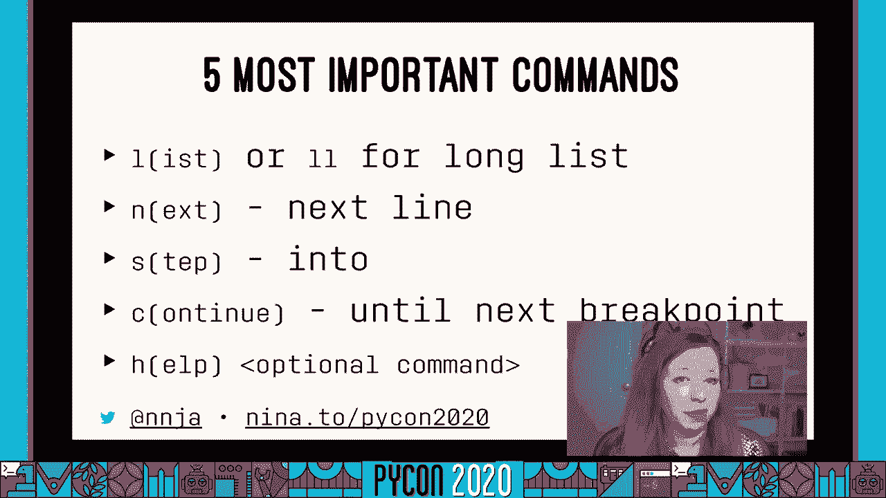

其实很简单，如果你忘了调试器是如何工作的，好吧，让我们来看看 ipdb的调试，这次我要做的第一件事就是将我的 python断点环境变量设置为 ipdb，我已经安装好了，凭一点什么，现在。

我要稍微修改一下代码 把断点从这里移到右边，在我们在这个方法的顶部创建查询之前。

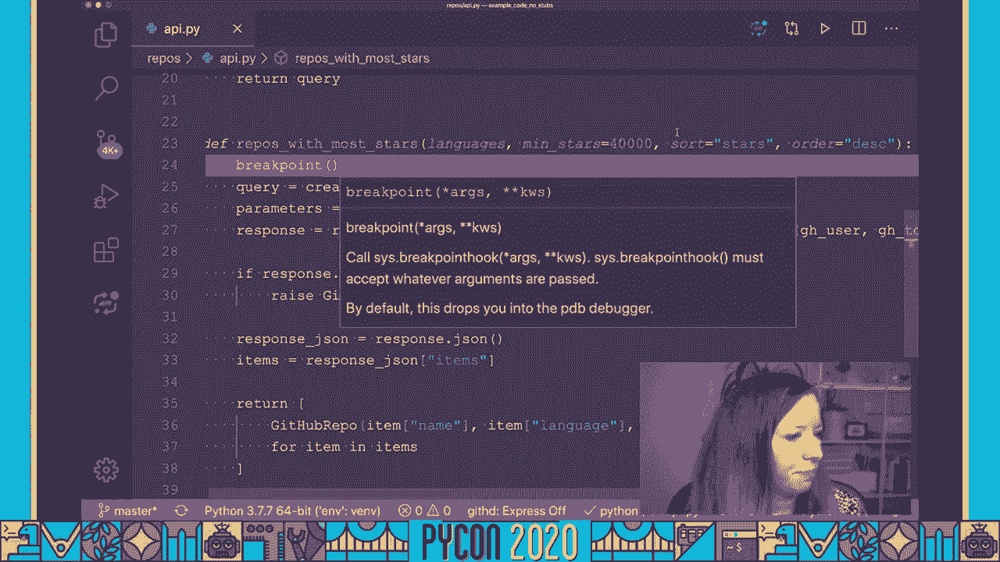

我们继续运行我们的服务器，然后我会用卷曲敲击我的服务器来触发调试器，现在所有这些调试器命令都有了长格式版本，但我会用短的，不用担心，你不需要记住它们，我将提供一个有用的备忘单，所以 s的意思是进入。

所以我将进入创建查询方法，这将允许我使用一个来查看传递到这个方法中的弧线，然后我可以用 n作为下一个开始逐行，现在你要记住的是，我们现在在18号线，您认为在这个步骤中定义了查询吗？

所以如果我试图检查查询，有用吗？我还是一直这么做，但简短的回答是否定的，这是因为直到第19行才定义查询，所以我们需要等到行被执行，然后跨过这条线，现在我们来看看，我可以用艺术跳跃的方法回到这个方法。

这并不是特别，对于这样一个简短的方法很有用，但是当你有复杂的代码和大量的返回点时是有用的，然后我会继续打，因为我们从查询方法返回，我们将回到我们的报告中，用大多数明星的方法。

所以现在我可以按 n键进入下一行 或者进入继续，让我向你们展示另一个很棒的 iptv功能，假设我拿了我的东西，我不记得哪个 API键，嗯，恒星的数量，或者我很抱歉，假设我不记得是哪一个。

所以有了 ipdb，我可以在这里开始打字，因为我知道钥匙上有星星这个词，然后我可以按这里的标签，它将遍历字典中的所有键，让我完成选项卡，在这种情况下，在存储库中担任主角的恒星或人数被称为观星者，伯 爵。

我想那是来自 Github应用程序接口的奇怪的人造物品，也许他们很久以前就被称为观星者，但现在我节省了很多时间，好吧，ipdb非常棒，我是你的粉丝，如果您需要一些命令行调试的指导方针，我有一个备忘单。

可以在尼娜2python 20和其他幻灯片一起使用，还有其他有用的命令，例如，在那之前你可以跑，直到当前行代码大于下一行代码，这真的很有帮助，让你打破了一个循环。

但实际上你可以从我展示给你的基本命令开始，然后在你需要的时候加上其他的，对于那些正在关注，是的，我的备忘单和我的头发很配，如果你对 cli不满意 或者你更喜欢图形化工具，有很多可用的。

今天我将向你们展示 VS代码，因为这是我用来给我的每日编辑的，但也有普分贝，它是一个图形化的 cli调试器，有很多的ide是可用的，很多其他的选择，现在我更喜欢与代码，这是我用来给我的每日编辑的。

这就是我今天要向你们展示的 只有几个安装步骤，只需下载 vs代码，然后 vs代码就变得很简单了，我喜欢，力量在于定制，因此，为了获得最佳体验，您需要安装vs代码的python扩展，然后创建调试器配置。

请注意，这些都是幻灯片中的链接。

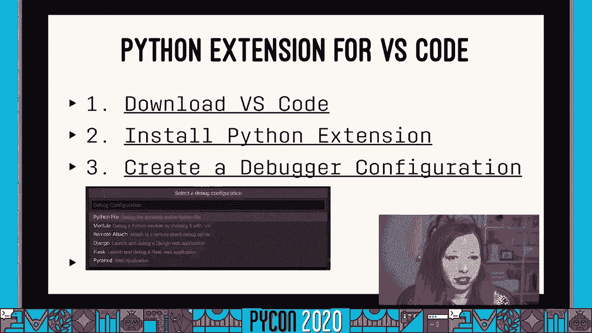

如果你现在需要更多的指导，视觉断点符合我们之前讨论过的很多概念，这就是图标的样子，小戏还在继续，下一个是跳过的箭，向下的箭头是向上的，向上的箭头，是上去，这是在执行堆栈中。

我们有一个选项重置 然后停止调试器。

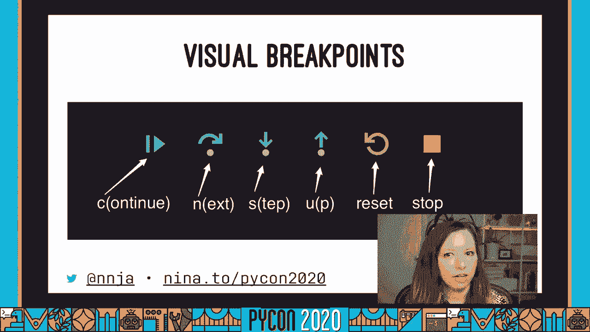

所以让我们来看看 IDE的调试。

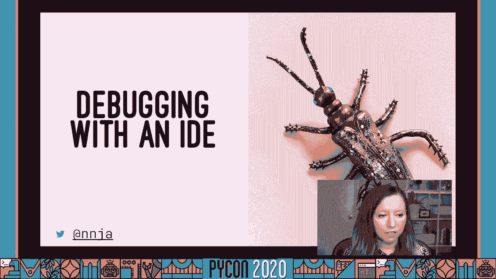

所以我要去移除那个断点，取而代之的是我要点击我感兴趣的行号的左边，我们会在这里看到一个小红点，一旦我点击它，准备好了，那是我的断点，这叫阴沟，当我去调试选项卡，它有个很有用的小错误。

我已经建立了调试器档案，但如果你是第一次运行分机，你必须这么做，已经预先配置好了 用于烧瓶和姜戈 以及你可能需要的任何其他设置，所以我要继续按下这个运行按钮，它会在后台启动我们的服务器，现在。

当调试器运行时，您就会注意到，这里的条变了颜色，现在红色表示调试器处于活动状态，这个调试器中有很多好东西，但让我们继续通过访问我们的网站来开始我们的断点。

yes代码的一个很好的特性是你可以命令点击这里 然后开始，现在，我们的断点被击中了，我们会看到这个黄色箭头指示，开始了，在ide中进行调试的一大特点是，您可以只需将鼠标移到，嗯。

你可以在这里鼠标移动这些变量，它会告诉你，价值是如此的简单，您可以更详细地检查您的变量，在这痛苦的左边，您还可以添加手表，所以这只是一个值得关注的表达式，永远是可见的，如果我走到这里。

我们会看到我的物品现在的长度是30，嗯，我还可以看到设置的断点，就在这里检查检查，在 vs代码中进行调试的一个非常好的选项 是一个叫做条件断点的东西，所以你可以右击这个断点 然后编辑它，你可以说，呃。

你可以在这里输入一个表达式，所以这个表达，断点只会在断点，当表达式求值为真时，在这种情况下，假设我只关心击中断点，当语言，只有蟒蛇被选为语言，所以我要去打，进去吧。

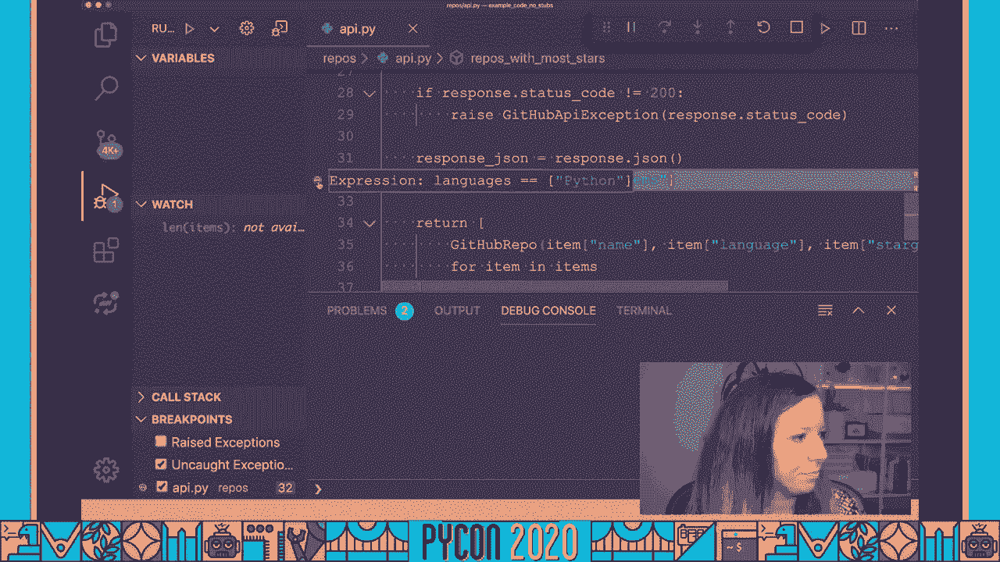

我们试试这个，如果我选择 javascript并提交，我们应该看到我们的服务器，如果我只选择蟒蛇。

我们会看到我们的断点现在被击中了，所以这个非常非常有用，另一个对代码有用的技巧是跳转到游标，假设我不想，我想用一套不同于 web服务器返回的语言来访问我的 github api，可能有虫子。

我不一定想通过这个场景来让我再次达到这个断点，我可以去我感兴趣的线，我可以跳转到光标，同时向前和向后工作，所以当我跳过这里的光标时，我的密码是，现在你可以把它看作是倒带，我可以打开调试控制台。

如果你的字体不是超大的，就像我的一样，接下来让我们来看看我们的语言，只是蟒蛇，但假设我想把它改成两条蟒蛇，在调用这个方法之前，我已经更改了这个变量，当我跳过去看我的参数时，我们会看到语言现在已经改变了。

我可以继续运行我的代码，好厉害，超级有用，我，关于烧瓶的调试 我还想告诉你一件事，让我们来看看我们的模板，对于那些使用过模板的人，你知道有多难。

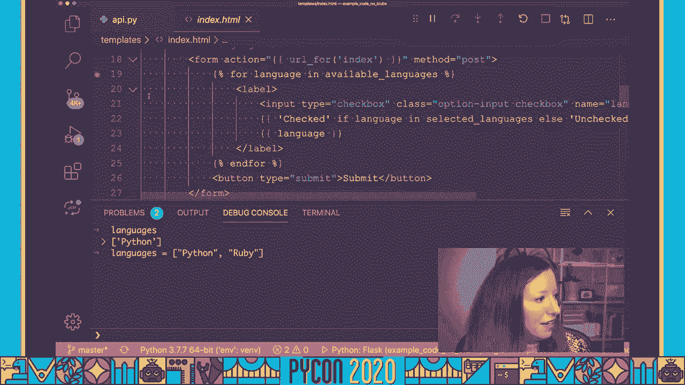

我们可以在模板中添加断点，让我们回到这里，检查api pi中的断点，然后提交我们的表格。

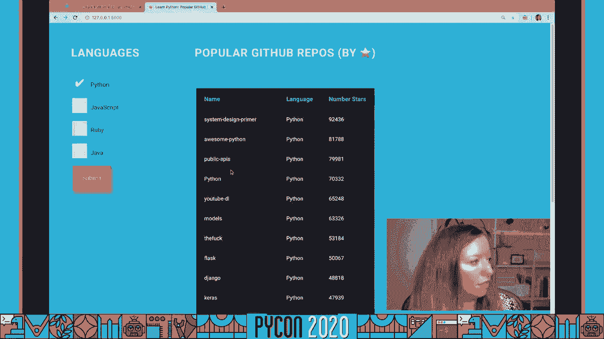

就像以前一样，我可以在这些变量上盘旋，所以这是非常，非常，非常有用，好的，所以有很多选择，你怎么知道，什么时候要用什么工具好清楚，我很少使用标准库的 pdb，我觉得功能太有限了，但很高兴知道。

如果您在一台不能安装其他依赖项的机器上工作，例如，这是一个很好的工具，在你的工具箱里，但我个人的偏好是，我对小程序和脚本使用 cli调试，有时我只想从命令行开始工作，我不一定想做很多点击。

我去做 idb调试，当我处理复杂的代码或者大的代码库时，所以一旦我的代码变得很复杂，或者如果我需要潜入并调试模板，这是个很好的工具，但选择最适合你的策略，这里有一些技巧和窍门 我想和你分享。

一个非常简单的，我花了很长时间才弄明白，嗯，你只要按，输入以重新运行调试器中的下一个命令，我花了很多时间不必要地打字，如果你的，调试器陷入循环，您可以使用until命令继续运行调试器，直到行超过当前行。

我们都知道考试有多重要，如果你不明白为什么一个测试会失败，您可以继续在单元测试中抛出一个断点，所以我一直都这么做，它是，真的很方便，但我最喜欢的戏法之一，我最喜欢的黑客，我刚才给你展示了互动。

这让我可以跳上蟒蛇翻译，但是所有的这些，在我的断点上 所有可用的上下文，在那个翻译里是可以找到的，现在这是一个技巧，允许您通过创建一个名为pdb rc文件的文件来使用IPython作为交互模式repl。

它是一个点配置文件，你可以在 nina two pdb rc下载我的，所以你不仅得到了一个漂亮的i python shell，带有语法高亮显示和制表符完成，如果你这么做，但你也会得到花哨的东西。

比如在 IPython中使用魔术方法进行多行粘贴，我不打算掩盖，我给你演示一下，但我不会说太多，但是你可以用你的 pdb做得很花哨，RC Ned，但艾尔德已经在网上发布了他的，他有一些非常有用的别名。

比如nl，可以转到下一行，打印附近的行作为上下文，不过，让我给你们展示一下，让我们继续启动我们的服务器，然后用卷曲打它，现在我们回到了我们的 iptv，您之前看到的提示是，有一个内置的交互命令。

它将把我放入一个交互式的python终端，但这是这里的标准终端，有点笨重，离开这里，我们用我们新的互动，这将把我转储到一个功能齐全的 IPython调试器，哪个更好，但我仍然可以访问所有相同的变量。

所以在三个项目上循环，我们将看到我们有语法高亮显示，而且它更容易导航，我们甚至有括号匹配，你知道超级有用，所以这可能是我最喜欢的黑客之一，然后你可以按 ctrl d退出交互 i模式。

我还想给你看些很棒的东西，是 vs代码的一个特性，在木星的笔记本上进行调试，去年秋天正式上映，现在它是木星笔记本支持套件的一部分，我认为这对于数据来说是令人兴奋的，观众中的科学家。

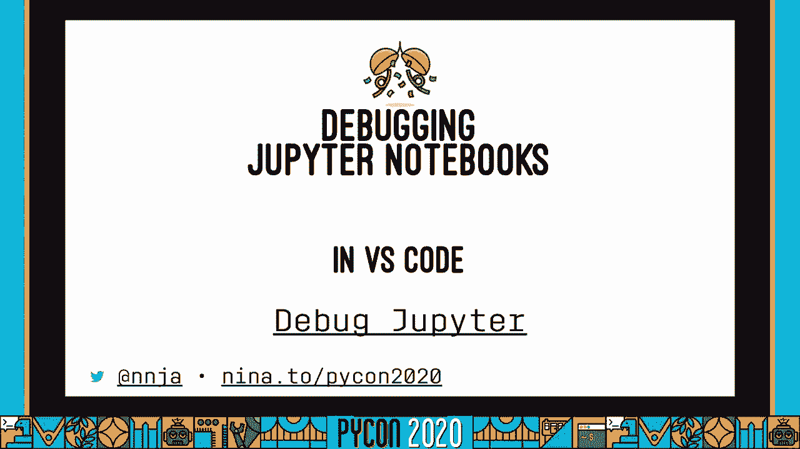

所以让我们来看看它是什么样子，我们在这里打开一个笔记本，并继续运行它，只是嗯，它将启动木星服务器，并在这里显示一个非常简单的图表，好了我们开始吧，如果我想调试这个。

我可以在这里设置一个断点 然后点击调试单元，我们会看到就像之前一样，这是我们的行刑路线，我们可以走过去，就像以前一样，我可以滑过这些变量来查看它们，所以我想这将使与木星笔记本的工作变得容易得多。

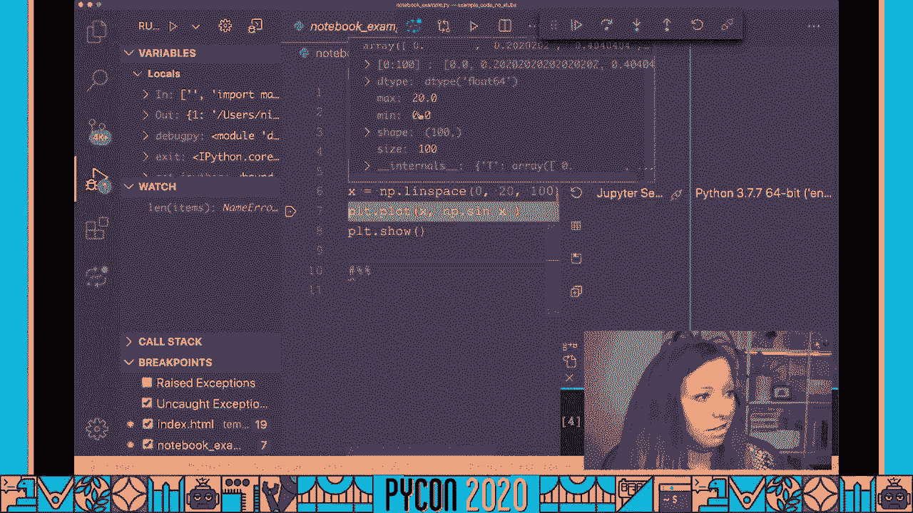

现在有一些你需要注意的问题，实在不想在生产代码中留下断点，它可以帮助你的整个跑步计划，让你的老板对你很生气，你不想为此负责，所以如果你用 python 3 7和断点，我喜欢，我刚才给你看的。

有一个环境变量可以用来防止这种情况，但实际上，最好不要提交带有断点的代码，这里有一个小贴士 你可以很容易地处理这个问题 通过预先提交钩子，预提交钩子，预防犯罪，为了得到这场比赛，某些条件，听起来很难。

但值得庆幸的是，有一个图书馆可以为你做到这一点，在预先提交网站上，是用蟒蛇写的，您只需pip安装预破折号提交，它附带一个调试语句，可以启用的预提交钩子，它做了一件聪明的事 情。

所以不只是检查文件中的关键字，它实际上使用 asmodule来检查导入，检查调试语句，还要检查新的 python三七断点方法调用，随着蟒蛇语言的发展和进化，这将更容易在未来证明。

因为你可以设置其他预提交钩子，例如，运行一个linter，检查尾随空格，检查未使用的进口，etc，所以这是一个非常有用的工具，好吧，现在结束了。

您应该对如何在 python中进行调试有一个非常基本的了解，以及所有可用的工具，从标准库中的pdb到ide中的图形调试，请记住，在自己的软件中使用调试器是提高生产率的一种方式。

因为修复漏洞是一个一个一个确认的过程，你所相信的关于代码的事情 实际上是真的，当你发现一个假设不是，你找到了一个线索，调试器是一个非常好的工具，可以让你做到这一点，所以我希望我给了你信心 让你告别印刷。

向调试器问好，非常感谢大家，请继续，在尼娜二号下载幻灯片，蟒蛇二十，我连接了一些额外的资源，最后，你可以在nnjia的twitter上关注我，或者在nnjia的twitch上关注我。

IO和请查看 python在微软在 nino 2是 pycon 20 20。

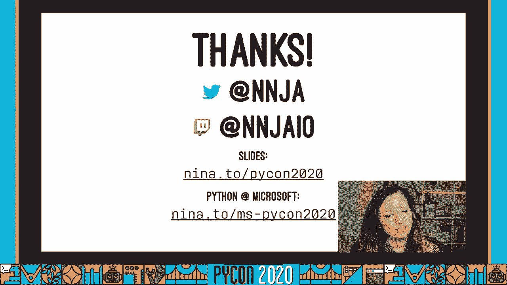

