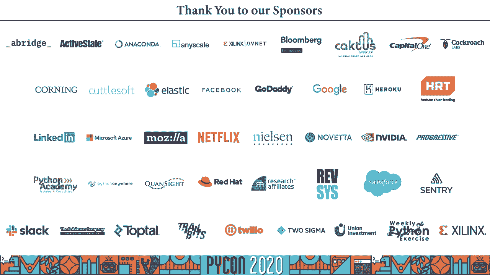

# P63：Talk Rebeca Sarai - Privacy-preserving methods Building secure projects - 程序员百科书 - BV1rW4y1v7YG

喂，各位，呃，在这种情况下 我希望你们都没事，呃，我叫丽贝卡，我今天要讲一点隐私，保存关于如何构建安全项目的方法，我叫丽贝卡，我来自巴西，是一个靠近海洋的地方，呃，我毕业于奥库大学计算机工程师。

我很自豪能成为那里的学生，呃维塔碟子，我们是来自巴西的专家团队 我们总部设在巴西，我们帮助客户开发产品，从后端到前端 以及设计和结构，你需要的一切，呃好吧，我今天要讲一点隐私安全，我很羡慕很多人。

别担心这个，我希望我会我是那种人，但幸运的是，我不是，我很关心这个话题，很多大公司，他们真的很喜欢测试 他们能用我们的数据做什么，我只是带来，对你来说只是几个滥用私人的循环，由大公司，我最喜欢的是这个。

他们能够喜欢，挺有意思的，我们现在有政府，他们正试图规范，嗯，以确保人们喜欢有更多的隐私在一段时间内使用，比如应用程序和系统，但我不知道你怎么想，但我不知道这样做有什么好处，呃，我们有，我带来了。

我给你们举两个例子 一个人只是用一个应用程序来跟踪，就像他骑着自行车，使他成为一起抢劫案的嫌疑人，这是我家乡的一个例子，呃他们用的是，像手机一样监控社交隔离，我不知道你是怎么想的。

你可能觉得政府有权对公民这样做，但这不是我们作为一个社会需要进行的辩论，以及所有这些的后果，就像，辩论和讨论是第一，呃，科学家，他们没有足够的数据来建立新的模型，因为基本上所有最重要的。

数据掌握在大公司手中，我觉得最糟糕的是我们没有安全感，我们认为我们一直被监视着，就像我们不能做任何事情来解决，所有的生活都在向你展示，我们可以做一些事情，我会告诉你一些情况，当我们可以伤害用户的隐私。

但我会告诉你，如何保护用户的隐私，你要展示给你看，我将向你们展示一些简单的例子，然后我们要去更复杂的情况下，所以我想从一个非常简单的情况开始，所以你有一群人有很多问题，你想问他们。

你想把这个结果放到数据库里，然后就像从这个中得到统计数据一样，我真的需要一些敏感的问题，假设我是个运动员 我会问我的问题，比如你有没有用过违禁药物来提高成绩，我们有两个选择，我们有一个清洁没有使用药物。

假设这些人回答了这个问 题，老实说，我们会有一个数据库，我们就能在这个数据集上像你一样，但这有个问题，有点，很多人从我的数据集中得到统计数据，这并不意味着我在保护隐私，只是不允许他们得到个人的名字。

不代表我有专业，呃，这就像你可以看到有两个问题，我可以确定，什么是，呃，如果简使用或没有使用非法药物，这就是为什么统计数据不安全，我们只是通过问不同的问题来模拟攻击的名称，是所谓的法国攻击。

我们可以做更多类型的攻击 试图找到个人，呃，识别用户的信息，所以我们必须小心当允许人们做，让我们继续这个情况，我还是想做这个，我仍然想这样做，呃，保护骑手，我该怎么做呢？呃，我们仍然有同样的。

我们还有两个选择，区别在于，呃，现在我只想，一些更大的收集时间，所以我会给用户一个硬币，我说抛硬币吧，让我看看结果，如果有硬币，所以你要回答，所以是的，你用过这个仪器，硬币还是会说，这将使变得干净。

运动员还是答案，我想在某些情况下，所以我们就像，呃，研究中的人是对现在的一种似是而非的否认，但如果他们使用或没有使用这个，这项技术的想法被称为，呃，随机化是一种技术，我们在60年代使用它。

这个想法是人们不能回答呃问题，老实说没有呃，就像，而不是像，会产生某种偏见，所以他们发展了这个机制 让人们相信，提供给，你知道吗，抛硬币，而且效果很好，如果你有很多例子，它仍然可以让你把潜在的统计数据。

所以你可以得到名字，你可以得到他们使用一个的用户百分比，我们没有用的东西，以及所有其他信息，您想要的统计信息，呃，收集，但让我们把这种囊性问题放在一边，你不太在乎那个，你只需要收集和发布数据。

因为这对你很重要，因为你有搭档，你必须和你的伴侣分享这些信息，或者你有第三个身体提供你的服务，你只想知道结果，或者你想分享一些研究的例子，就像应用程序是，你做的第一件事就是，删除姓名和移动社会安全号码。

但是有些事情，你需要采取的其他措施，有一些属性叫做准标识符，它们本身并不独特，很多人可能有，但这个想法是当你把这些属性放在一起，他们可以提供足够的信息来识别这里的人，例如，我们有百分之八十七的美国人。

人口可以唯一地识别，按邮政编码、性别和出生日期分列，所以有了这些信息，呃，我们可以在数据库里找到一个人，当我们加入数据库时，这变得更加棘手，所以我们可以得到这些信息，我们可以得到一个人生活的所有信息。

也就是说，我觉得有点，你知道吗，呃，一种解决方式，在这里，我们有积极的火作为亚洲国家，你会感觉到他们想隐藏这个属性，我们不想让人们知道其他人的工资，我们要做的是，我们喜欢把好奇的火和国家分成一般的群体。

所以我们要让人们融入群体，一组不止一个人，所以你不能直接指向数据库里的人，这样做的技术被称为天牛，这个想法是你可以创建至少有同性恋的团体，共享相同的准标识符，所以你不能只看桌子就指向一个人。

我们可以通过泛化来做到这一点，我们只需要找出一个属性，我们喜欢改变很多信息，或者我们可以通过压制信息来做到这一点，当我们删除我们认为链接了太多信息的信息时，但问题是，呃，我们可以喜欢的链接攻击，呃。

未来可能会出现一些其他数据，然后砰的一声，呃，你有一座私人桥梁，网飞的订户有这样的问题，你可以看到这就像一个隐形眼镜，他们编造了什么，谢谢，为什么，我不记得确切的日子了，但我最近有一个非常相似的例子池。

你知道，我只想说一点点，呃，在巴西，我们有个大公司叫 vivo，他们刚刚发布了一组数据，匿名的，他们把这些数据卖给，就像政府，数据集里的一切都公开了，后来一些记者发现。

比如数据集中的两个或三个人 通过将公开的数据与，音乐会之类的数据，呃，有一个链接，在这里你可以确切地看到他们是如何做到的，但这个想法是 即使你把那个放在那里，你可以就像，呃，在某个时候。

可能会出现一些其他的数据，人们也许能够在数据之间建立联系，这就是为什么，呃，你在释放时必须非常小心，呃，对正典有一些改进，即使是为了喜欢，防止这些类型的攻击，但他们都不是，完美。

我想指出的是 你总是在私人船只之间进行权衡，呃，可用性工具，呃侵犯隐私，您不能限制数据并保持有用，所以这就像一个风险，呃，站在你的肩膀上，当您发布数据集时，呃，这个人，呃，我还有一些应用的例子。

他们使用佳能，一个例子是，他们达成了协议，我把链接留在这里，所以你可以检查它是如何发生的，又是如何落实的，我还有个秘密计划，你以后可以查一下，呃，另一个我想说的情况，你不在乎公布数据，你有一个数据集。

但我想概括一下，你怎么能这么做，有时候很重要，你想知道你是否应该推出产品 b，或者你想知道，你的客户是什么样的，在最单调的飞行中，数据集上的一般音乐会，私底下该怎么做，因为你还记得我们讨论过。

所以我们不能让人们做很多统计，统计数据，因为我们仍然可以获取私人信息，这个想法就像，我们该怎么办，很多人都在谈论隐私的定义，有很多人说了很多不同的话，但有一个定义我觉得很适合，或者我们现在的情况是。

隐私几乎是数据持有者和数据主体之间的协议，我们几乎做到了，数据的所有者不会因为允许数据被使用而受到影响，关键的部分是 无论其他研究，数据科学或信息来源可用，所以这很关键。

因为在你还记得之前 我们担心的是，人们能够把信息和这个定义联系起来，似乎这并不重要，因为我们会有一些东西来保护你免受其他可能出现的信息的影响，呃，在数据库上下文中，这意味着什么，你使用数据集的想法。

如果你从数据集中删除一个人，呃，你对职业的质疑 结果不会改变，这样，个人隐私就得到了充分的保护，所以攻击者不可能知道，他在对数据集进行查询，你的数据还是我们的数据，所以这给了你。

这给了你一种似是而非的否认你在数据库中的存在，也是，呃，技术的名称，呃，国家，这就是所谓的财务焦点，是一种技术 是对隐私的正式定义，我很快就会给你看方程式，和，它是你可以在数据库上了解教义和潜在的信息。

如果不了解数据库中个人的行为，它通过呃，在查询中添加某种噪音 以防止财务攻击，所以增加噪音是一种随机性，或者像一个随机的，呃机制是这里最关键的部分，我给你看配方，呃，把这个埋在这里。

我们的想法是在左边有一个术语，术语只是意味着我们有一个数据集，我们有一个协议在数据集中进行查询，我们只有私人的结果，右边的词，我也有一个数据集，但只有一个不同，我有另一个协议 这个系列给了我隐私。

把这两个术语，他们的区别在于抹去国家的力量，这是一个非常小的数字，所以当你对两个数据集进行查询时，他们几乎是一样的，这个变量在这里真的很痛苦，因为它允许我们调整一个项目需要的产品数量。

所以我们有一个方法来衡量我们在自由活动时的进步规律，我们有办法定义隐私预算，这真的很酷，像许多项目一样，所以我可能，找到上面的一个集合，我做了太多的隐私，对我来说，允许人们在，关于这件事的情况。

关于这个技术的另一个有趣的事情是 我们有很多实现，它们非常惊人，我建议你帮你查查，一个漂亮的，呃，应用技术是用户最多的，Mo i是由苹果公司开发的，显然我们有一张微笑和哭泣的脸，作为最常用的表情符号。

呃，而且第二名很难，这些技巧就像你最好的朋友，当你有正常的申请时，它们将帮助您确保用户的隐私，但我想提醒你，如果您使用的数据来自，就像欧洲公民受到一些规定的约束，你还需要遵守一些规定。

所以你得喜欢加密数据，呃做所有的保险箱，请你这么做，呃还需要看一下规定，技术会帮助你，但你还是要喜欢，为了遵守规定 更进一步，我想说的另一种情况是 如果你想建立一个预测，我们谈了一点。

就像常规的商业模式，但我们有新的商业模式，你怎么能这么做，我向你保证，呃，一个应用实例，只是我们喜欢，改变心情是当你，哦，你在键盘上键入一些东西，它试图预测你在哪里打字，这是一个英国应用程序的例子。

就像在手机上一样，然后我们几乎每天都用手机 他们得到了，我们的生活都在里面，所以我们怎么能，当然这次会议的产品，呃，所以我的想法是我把一个大公司，你想，就这样，呃，像沙子一样放，呃。

你要做的就是建立一个模型，然后你和许多客户分享这个模型，你的客户，他们会用这个模型，他们会与这个模型互动，他们会改变，在本地定制这个模型，在某种程度上，他们会有一个新的模式，当你有喜欢。

不同人的好模型会把这些模型发送到服务器，然后服务器会吃掉这些模型，而不会看到客户的信息，您生成一个新模型并发回给用户，呃，手机，他们可以喜欢，协作建立预测模型，同时将训练数据保存在设备上。

所以你永远不会把客户的数据发送到云上，这是由两人从一个错误的，他们说了很多话 他们说这给了你愤怒的模型，更低的延迟和很多好的东西，有一些工具可以在按钮上做到这一点，它们都是神奇的工具，我已经测试过了。

嗯，一些，我离开了你，呃，这里有一些实现的链接，所以你可以检查，只是一个简单的例子，你怎么能把所学的东西拼写出来，然后像打电话给客户一样说出来呢？然后是急性，再把结果反馈给你，呃，好的，有问题。

如果你愿意，是啊，你可能已经看到问题了，你仍然可以通过模型之间的差异来推断私人信息，所以服务知道就像模型被发送给你一样，他知道你收到的模型，所以你还是可以喜欢，呃，推断一些私人行为。

用户和获取私人信息的类型，所以这个技术本身并不能保证你的隐私，但这对你来说是个很好的开始，它应该与其他技术一起使用，以确保正确，但是您仍然希望用用户的数据更新您的模型，用户数据可能和许多用户一样。

对于您的业务模型来说，拥有数据仍然是一个重要的部分，很多人的数据，这对医院来说是至关重要的生命，因为在法律上他们不能，呃，把信息交给所有的医院 或者给情报人员做同样的事情，但他们怎么会喜欢公司。

如果不分享私人信息，这是一个临界点，我们能做到这一点的方法，我们创建了一个协议 允许用户隐藏私人信息，通常是以一种神秘的方式，你可以对许多数据来源进行计算，而不透露单个结果。

我有一个例子来说明这将如何工作，呃，假设我的系统里有六个人，我想知道平均值，这个人的体型，所以我没有一个可信的第三方来提供所有的信息，然后这个身体将返回给我的结果，却没有他们的方式，我做的就是。

我会让第一个拿到这个薪水的人，只是在一个很大的数字，在这种情况下，我是在对工资进行加密，再传给第二个人，然后这个人会加上他自己的抱歉，他们会经过一个小人，每个人都会把面积加起来，到初始值。

到前一个人传递的值，最后的数字会回到第一个人，这个人就会像数字一样，把她刚开始的那个大数字去掉，然后他们会在这种情况下平均执行操作，然后我们会告诉大家 结果，这种方法的优点是每个人都知道平均值。

但是没有人能分辨出，上一个人的故事是什么，或者下一个，或者类似的东西，因此邻居技术被称为安全莫帕蒂计算，当你有多个主人，当你有很多人，呃，共建模型，允许个人分享模型的控制权，不需要一个值得信赖的机构。

任何一方都不知道任何其他问题，这 很关键，参与挖掘的人唯一能推断出的，是你从输出中推断出来的，通常与其他技术一起使用，去处理，呃，呃，从手机，还有一些神奇的工具可以让你做到这一点，我走了，呃。

这里的一些例子，这里有个小种植园，在这种情况下 我想说的最后一件事是，有时你不能，你没有房主，你是数据的拥有者，但是你不能下载你的数据，呃，在你的机器上，或者你可以在云中处理，因为不安全。

或者因为你只要签个合同 就可以让其他人处理数据，你怎么能在遵守法律的情况下这样做，你还是照章办事，但你还是得到了你需要的结果，呃，有一种技术允许执行某些类型的计算，关于密文，所以我们加密了数据。

您无法获得加密格式的结果，而这个结果只能和秘密小组的主人一起解密，对用户有好处，因为它给了我安全感，如果我把文件交给第三方，这也是为什么我们要进行一些处理和步骤部分，第三部分不会知道我发给他的信息。

因为它是加密的第三方发送的结果，我不会像，嗯，上面的部分不会明白 结果，因为它们也会被加密 而且只能用秘密密钥制作，你就能破解它，呃，这种模式也有利于第三方，因为假设你有一个预测模型，这就像惊人的顶级。

很有创意，你想保护你的数据，所以你会加密你的模型，你就可以，其他人将能够训练和使用你的模型的结果，却看不到内心，呃，模型的行为，或偷取模特的秘制酱料，技术的名字叫做同态加密。

当一个模特只有一个主人的时候是很好的，因为这个想法是数据不仅是加密的，并允许对加密数据进行计算，这是最关键的部分 因为你可以得到加密的结果，唯一的你，秘密钥匙的主人能够，呃，解密技术，人们也说对了吗。

但对量子计算机来说是安全的，我们有几个开放的，源实现，我认为这将是像技术将喜欢，给我们隐私或对内部数据的私人处理，呃，在未来，我可以说在未来，因为我们离，差不多是因为，数据，这种处理在面试中效果最好。

刚开始还是很慢，所以有一些缩放问题，如果你这样做，一个较小的数据可能是可以的，但是如果你有大量的数据，你可能很难使用这种技术，呃，我们今天讨论的内容，呃只能设法发布数据集，但是小心这个，呃，差异隐私。

如果你做聚合，呃，对隐私数据的分析，进一步，就像，利用科学数据，允许您对加密数据进行操作，这种技术可能就像他们未来解决隐私问题的方式，但还没有，呃，还有一些其他的事情 我有时间谈论，但我鼓励你喜欢。

搜索这个，看看，结束这一切，我想留给你们一些，第一种是，如果你生活在欧洲公民的数据中，请，呃，找个律师看看你是否遵守，或者为什么你需要遵守的法律上的小事，呃，请记住，数据不能完全匿名，并将继续有用。

你总是需要考虑隐私和可用性之间的权衡，呃，清除结束，大数据集不受保护，所以记住呃做呃，统计数据也不安全，因为你可以调整问题来获取私人信息 并记住链接攻击，呃，这就是人们可以发布数据集的时候。

与其他信息连接，另一个信息公开，你只要从这段视频中推断出信息，所以拜托，呃，检查，检查这个当你释放它，这很重要，仅此而已，呃，谢谢，如果你有任何问题，请，我可能呃，意见和反馈，请寄给我，那就是。

