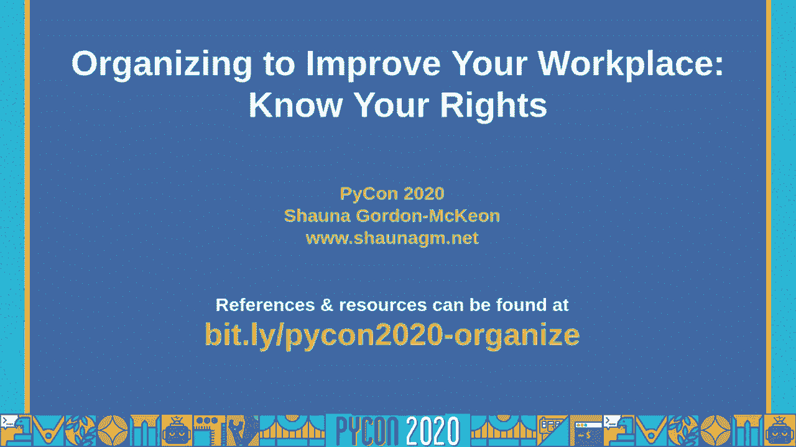
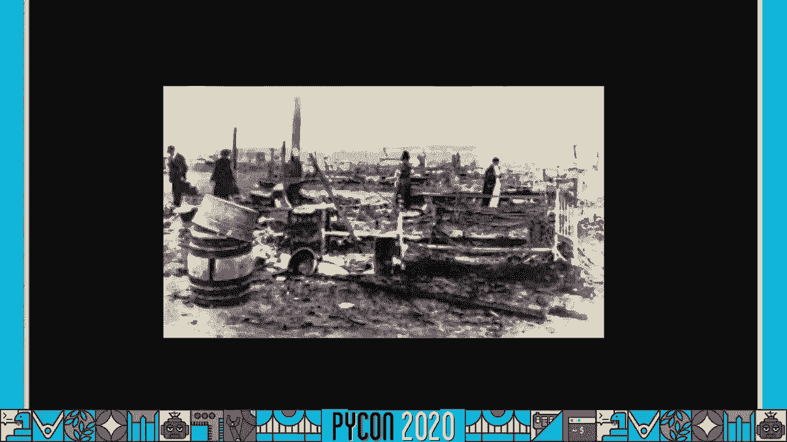
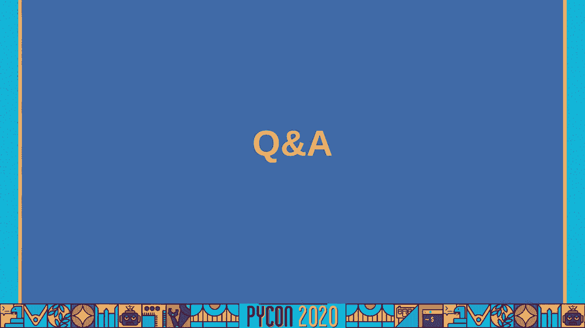
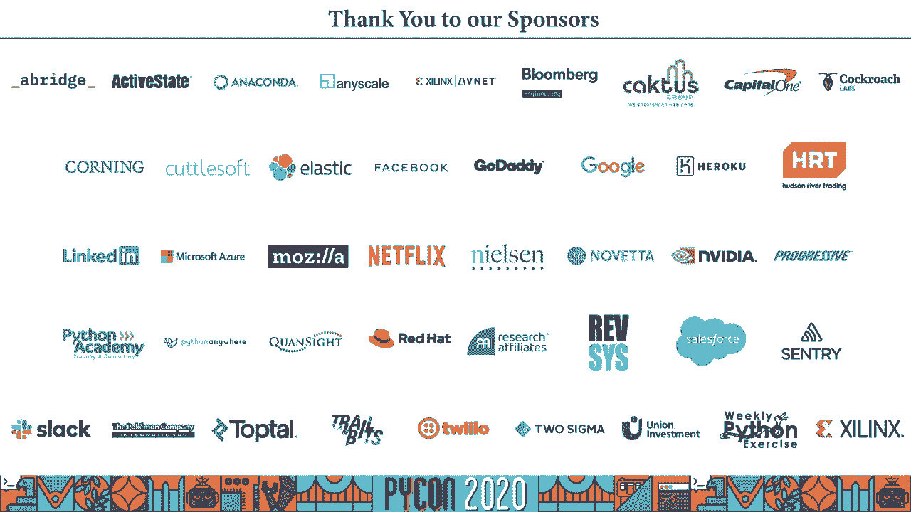

# P67：Talk Shauna Gordon-McKeon - Organizing To Improve Your Workplace Know Your Right - 程序员百科书 - BV1rW4y1v7YG

大家好 谢谢你们来听我的蟒蛇演讲，我们这里挤满了人，只有我和我的猫，我叫肖恩•戈登•麦基恩，我加入蟒蛇社团已经有十年了，这将是我的第8条蟒蛇，我想我是一个，我是个程序员，项目经理，社区管理者。

今天我将和你们讨论如何组织你们的工作场所，所以我提交这个演讲是为了给你一个机会 让你了解什么权利，作为工人保护你们，在组织我们的工作场所时，你有什么可用的工具，但在我开始之前，我想谈谈，为什么。

为什么科技工作者会组织，为什么科技工作者需要一个工会，我们还不够好吗，你可能以前听过这种情绪，也许你自己也这么想，这是个有效的问题，我不知道你，但对我来说，其中一个跃入脑海的画面是三角衬衫工厂。

是一家衬衫工厂，回到二十世纪早期，把他们的工人锁在工厂里，这在正常的一天已经够糟糕的了，但有一天发生火灾，数百人死亡，他们无法走出大楼，他们中的一些人从更高的楼层跳下来死了。

也许我想到了许多矿难和矿难，或是煤矿企业让工人接触的黑肺，当然这不仅仅是过去的问题，他们可能会因为任何组织而面临暴力报复，所以你可能在想，与此相比，技术工人很容易。

难道我们不喜欢我们的雇主 几乎从不杀我们，我们是不是应该闭嘴 心存感激，对此我有三个回应，第一，仅仅因为一个更大的伤害存在于世界上 或存在于其他时间点。

并不意味着一个给定的问题仍然是真实的、有害的和值得解决的，第二次，正是工人和劳工活动家在这些战斗中战斗，有时甚至献出了自己的生命，这给了我们今天所拥有的权利和先例，我们通过行使这些权利来纪念他们。

遵循这些传统，不是通过忽视他们，第三，呃，当我们积极主动地处理较小的伤害时，我们要防止它们升级为更大的伤害，我们也建立关系、技能和力量来解决未来出现的任何更大的伤害，但这都是抽象的。

适用于现代社会任何相对富裕的工人，所以我想谈谈为什么科技工作者特别想组织，所以尽管大家都说科技工作者过得很好，我们的工作场所经常会出现一些问题，因此，就像在许多其他行业一样。

白人男性和其他人之间存在薪酬差距，有色人种和女人做什么，例如，一份报告发现，在60%的情况下，女性在科技行业的相同公司担任相同角色的薪酬较低，一份报告发现，硅谷60%的科技界女性经历过性骚扰。

三分之二的骚扰来自他们的上级，三分之一的人报告说害怕自己的人身安全，担心他们的人身安全，因工作相关情况，有色人种，特别是黑人，拉丁裔和土著人在科技领域的代表性仍然严重不足，从事科技工作的有色人种 面临。

以及被保安搭讪，他们不相信自己在工作的地方工作，我在演讲的最后加入了一些链接 来了解更多关于这类事情的信息，所以不同的公司会有很大的不同，但是许多水龙头工人被迫工作很长时间，一项调查发现。

超过一半的科技工作者每周工作超过40小时，近五分之一的人每周工作60小时或更长时间，我觉得加班这件事特别让人难过，除其他外，每天工作10小时，170年后的今天，我们还在为之奋斗。

科技工作者被问到的另一个问题是 科技工作者，那个，另一个问题是，科技工作者被要求签署保密协议，但这实际上是通过商业秘密法来保护的，因此，想法实际上被用来阻止员工与公司讨论问题，公司外部，因此。

一项调查发现，15%的科技工作者对ndaas感到沉默，他们与特斯拉的工人签约，英特尔和亚马逊，作为最有可能感到沉默的人，另一个问题是，许多科技工作者在被雇佣时被迫签署强制仲裁协议。

当你签署这些协议的时 候，你基本上是在法庭上签署了你起诉的权利，相反，你必须提交仲裁，是一家私人的第三方公 司，而且比法院更有可能做出有利于雇主的裁决，许多其他问题，大多数科技公司要求员工签署仲裁协议。

尽管谷歌的工作人员成功地迫使谷歌停止这样做，太棒了，我们会更详细地讨论这个问题，后来，在谈话中，例如，截至三月二十九，谷歌雇佣了，与12万2千名全职员工相比，而且这些工人经常被错误地分类。

这让我特别恼火，令我难堪，不管你怎么说 这对我来说是个问题，因为我和客户一起工作，他们会给我钱来实现某些目标，但我决定如何达到目标，我的工作时间是几点？当我工作的时候，我做什么费用是多少，这就是结局。

嗯，相反，通常是谷歌，他们不必给他们加班费，以及其他各种各样的事情，通常这种虐待弥漫在工作场所，这不仅仅是一个技术问题，他们得到了多少报酬，这是他们在基本层面上受到对待的一部分，例如，我，你知道吗。

他们的洗手间休息时间在脸书被监控，他们有成千上万的内容管理员，他们一直在开发创伤后应激障碍，因为他们在暴露期间缺乏支持，对这个不幸的人，他们在缓和，当然，像其他工人一样，他们被要求签署保密协议。

以阻止他们向更广泛的世界分享他们工作场所的条件，简而言之，我们的雇主做他们认为可以逃脱惩罚的事情，他们会对我们做得更糟，更糟，以及他们如何对待其他类型的员工，全职。

亚马逊的软件开发人员受到的待遇与仓库工人的待遇非常不同，仓库工人的工资大约是每小时15美元，他们的洗手间休息时间被监控，在科技行业拥有更多工人的领域，如游戏行业，员工受到的待遇更差，因为公司知道。

如果一名员工因受到的待遇而辞职，找一个人代替他们的位置会更容易，游戏行业以其嘎吱嘎吱的文化而闻名，工人们经常被推到每周工作50-70小时甚至100小时，经常没有加班费，现在我们的技术供不应求。

但不会永远这样，然后我们面临的问题会变得更糟，虽然我们的工作场所有很多问题，他们并不是我们决定组织这项工作的唯一原因，我们确实对我们周围的世界有影响，我们对这种影响负有一定责任，我们不能说，哦。

这是老板的决定，那不是我的错，因为是我们的劳动和努力 使老板的决定成为现实，执行它的人，所以当他们决定做一些伤害别人的事情时，为了利益，这也是我们的责任，但我们不是无助，责任的另一面是权力。

就像蜘蛛侠想提醒我们的那样，我们有能力改变一切，在这方面我们有一些很好的榜样，美国教师开创了，是那些率先使用为共同利益而组织的人之一，例如，他们不仅赢得了加薪之类的东西，他们还要求加薪。

所有学生都有一个保证的休息时间，老师要求每所学校都有一名护士，以及专门为帮助无家可归或面临无家可归风险的学生而雇佣的工作人员，不仅仅是教师 为他们的社区奉献自己，就在几周前。

通用电气公司的工人们开始组织起来，让公司利用他们的偶像工厂来创造，科技工作者能做出什么样的改变，如果我们为了共同的利益而组织，科技行业有太多的问题 我不能，不可能把它们都列在这里，但我只想再过一遍。

就像一些大的，或者那些对我来说很突出的，嗯，许多科技公司采用的商业模式要求他们积极侵犯用户的隐私，甚至不是他们用户的人，但是谁和他们的用户互动，他们在有限或未经同意的情况下收集数据。

有时他们会把它提供给第三方 脸书 显然是这里的大牌，但他们并不是唯一一家这样做的公司，一些公司正在积极致力于将监视和监测工具应用于受压迫的社区，我认为说亚马逊直接贡献了，当然，像帕兰提尔这样的公司。

他们直接与移民和海关执法局和加拿大边境保护局等机构合作，追踪移民，驱逐移民，分离他们的家人，只是一个，你知道吗，提醒已经有多起移民死亡和移民和海关执法局拘留，大型社交媒体平台长期以来一直存在仇恨问题。

在最坏的情况下，他们犹豫是否要解决的言论和错误信息，超过50万人被迫逃离家园，这是，你知道吗，这是最糟糕的情况之一，可能是社交媒体被用来煽动暴力和仇恨的最糟糕的情况，但这并不是唯一一个。

它会一直是个问题，除非我们做点什么，社交媒体平台也助长了错误信息的上升，两者都没有解决他们平台上传播的错误信息，同时也让新闻业失去了收入，这样就更难从可信的来源产生新闻，脸书在这方面尤其有错。

因为它吞噬了新闻业收入的很大一部分，除了向报纸媒体撒谎 说他们通过视频在脸书的影响力，最后我会失职，这在很大程度上是科技公司的一个问题，这些公司的工人与我们签约或雇佣了必要的工人，所以亚马逊。

这些工人生病了，快死了，而付钱给他们的公司却未能保护他们免受病毒的侵害，有时当他们处于危险之中时，他们甚至不交流，我敦促科技工作者站出来 用我们的资源支持他们，我们的钱和我们的声音都知道。

尽管这种升级确实有一些风险，呃，亚马逊的两名科技工作者，为了发推特，亚马逊，需要做更多的工作来保护他们，好的，所以希望现在我已经说服你 标签工人应该组织，所以让我们换个话题。

谈谈什么工具和传统是如何存在的，哪些法律法规为我们保驾护航，让我首先澄清一下，你们组织的权利不仅限于成立工会，组织工会只是一种被称为受保护的协调一致的活动。

保护性协同活动是指两名或两名以上雇员为改善其雇用条款和条件而进行的任何活动，所以这是我们所有人都有的权利，不管州法律围绕组织，不管你和你的雇主签了什么。

如果你和一个或多个同事讨论或采取行动改善你的工作场所，你的老板不能因此解雇你，当然他们可以假装因为其他原因解雇你，嗯，所以你可能见过克里斯·斯莫斯最近的案例，要求亚马逊保护免受 COVID十九暴露。

所以亚马逊声称他们解雇了斯莫斯，因为他违反了社交距离准则，以及他是否做了，我，所以他们必须想出其他的借口，就像，不管他们怎么说，还有别的原因，嗯，所以对于那些不记得，回到2018年。

谷歌处理性骚扰案件的方式，以及其他一些不满，真的很刺激，但你不需要有两万人参与一项协调一致的活动，你只需要另一个人，这里的一个附带说明是，告密并不总是一项协调一致的活动，因为告密可以由个人单独行动。

但尽管如此，如果你是告密者，你受到单独法律的保护，任何泄露信息的个人，他们有理由相信，违法违规，或对健康和公共安全构成重大危险的人 免受报复，但假设你确实想组建一个工会，你会怎么做呢。

组成一个联盟是什么样子的，真正的第一步是接触工会，一个现有的工会或组织者，他们可以给你建议如何经历这个过程，但第一步是和你的同事交谈，所以如果你想重聚，有可能你的工作场所或你的工作对世界的影响让你烦恼。

你去和你的同事谈谈，看看是否有什么事情困扰着他们，你们似乎都有什么共同的不满，不是每个人都有同样的不满，但你想把注意力集中在那些已经达成共识的事情上，所有人都担心，所有人都关心，在这个阶段。

大多数人都试图对雇主保密，当你开始和另一个人说话时，你的活动就受到法律保护，通常不值得冒险 让你的雇主提前得到通风报信，因为他们会主动阻止你，他们发现得越早 得到的预警就越多，第二步是建立一个组委会。

当你和工人谈话时，其他工人，有些人会有兴趣和你一起成立一个工会，你们可以一起创建一个组委会，这种参与水平只是支持工会的一个好迹象，但这也有助于你的组委会更好地代表整个工人，而不是你知道，像这样的小点击。

并不真正对所有的工人负责，那个，下一步是获得大多数人的支持，一旦你有了一个强大的组委会，是时候上市了，在这个阶段，雇主可能会开始反对工会的努力，如果他们之前没有发现你的工作，所以他们可能会做一些事情。

比如举行俘虏观众会议，这时，工人们被迫坐下来听老板谈论为什么工会对他们来说很糟糕，他们可能会得到特别喜欢公开反对工会的主管或高级管理层，这可能是也可能不是广受欢迎的人的实际意见。

他们可能是迫于压力才这么做的，他们经常雇佣破坏工会的公司来实施这些策略，雇主每年在避免工会方面花费约三亿四千万美元，嗯，所以他们会战斗，嗯，他们可能会做其他事情 比如非法报复，我们很快就会开始报复。

因此，因为雇主反对工会的努力可能会，说服你的一些同事投票反对工会，不管是通过真正改变他们的想法，或者只是通过吓唬他们，嗯，但因为反工会的努力 会剥夺一些支持，在你进入下一步之前。

你实际上想获得更多的多数支持，所以许多工会会建议获得大约60%或65%的支持，但一旦你到了那里，所以当你为你的工会争取支持的时候，你要分发一种叫做工会授权卡的东西，当员工在卡片上签名时，他们会发出信号。

表示他们有兴趣由一个工会代表，一旦有足够多的人在这些卡片上签名，它们将被提交给相关的政府机构，你的雇主永远不应该看到这些卡片，也不知道是谁签的，在这一点上，如果是这样的话，他们会做一些叫做查卡的事情。

就在那时我达成了共识，第三方检查每一张授权卡，确保它是真实的签名，还有那个，签名的人真的想要一个工会，如果大多数工人卡都是通过这个过程认证的，那么联盟就被承认了，你还有个工会耶，在大多数情况下。

要么在工作现场，要么通过邮件，如果工会赢得多数席位，然后雇主被法律强迫承认他们，最后一步是谈判合同，但为了让合同得以通过 工会成员，他们都必须通过多数票批准，通过无记名投票，没有人不是工会。

雇主不会知道个别成员如何投票批准合同，如果工会成员不批准合同，如果没有多数人的支持，工会与雇主重回谈判桌，这种重复的次数是必要的，直到有一份大多数工人签署的合同，所以，工会从不强迫其成员签订合同。

成员国必须批准，当工人组织起来时，最大的担忧之一是雇主的报复，法律上不允许雇主因我们参与一致活动而对我们进行报复，协调一致的活动，不管是组织工会还是分发请愿书，或者只是和同事一起喝咖啡。

抱怨你有多讨厌开放式办公室的平面图，但法律上不允许这样做，但实际上并没有这么做，嗯，Kickstarter向 Kickstarter的主要组织者开火，曼联和谷歌已经解雇了，降级。

所以谷歌和 Kickstarter以及其他公司可能一直在打赌，可能是在打赌 他们可以逃脱非法报复，因此，公司可能是对的，他们可以逃脱这些非法行为，然而，所有的，不是迷失，我们可以做一些事情来防止报复。

其中一些可以追溯到 nlrb存在之前，在这些其他保护措施存在之前，我们可以把它捐给一个基金来帮助保护那些在经济上挣扎的人，在遭到报复后，我们可以建立一个网络来帮助人们在新的地方被雇佣。

有些人经常因为他们的声誉受损而受到报复，他们会有负面的业绩评价，否则就会被禁止晋升，所以我们可以小心地把这些人抬走，给他们新的机会，帮助他们在社区中保持形象，只是一般地给他们提供情感，社会，法律，财务。

后勤支助，嗯，不过我们能做的最重要的事情是在217中建立人数上的力量，九个州的老师走出教室，所以这些老师中的任何一个都可能被解雇，但你知道他们不是因为，开火，两万名教师，因此。

科技工作者的平均工资如此之高的原因是因为对我们所做工作的需求比有能力提供工作的人更大，不是因为我们所做的对社会如此重要，并不是因为我们的老板真的喜欢我们，希望我们快乐，因为他们需要我们。

这意味着我们有能力，我们可以通过更多的人聚集在一起来防止报复，我最近联系了一个朋友 参加一个团结行动，他很犹豫 因为他说我一直认为自己更像是一个高管 而不是一个工人，我想花一点时间来解释，呃。

因为我不认为不寻常的科技有一种非常特殊的文化，许多有特定自我形象的人被这种文化所吸引，我认为自己是这些人中的一员，一个自主工作，有控制力的人，我做的事情的方向，我想知道为什么我们看到工会，AS。

比有工会的公司限制更多，我们对决定有真正的发言权，我们投票批准与雇主的谈判协议，我们没有任何发言权，我们只是，你知道吗，他们说什么就什么，是不是因为传统公司形式的权力结构对我们来说太正常了。

对我们来说太普遍了，所以它们变得看不见了，其他朋友对我说 看，我只想工作，我不想把政治牵扯进来，这实际上让我想起了你们中那些不知道的人的单一责任原则，这就是代码库的每个部分。

每个模块或类都应该负责单个功能，它的所有逻辑都应该封装在该类中，这样班级就不用担心其他班级正在做的任何事情，你知道在它自己的空间里发生了什么，这是一个诱人的想法，你可以把它应用到人们身上。

但人们不是这样工作的，坦率地说，软件很少像这样工作，你知道多少个这样的项目，实际上成功地将功能封装在单个类中，大多数人没有，大多数都充满了漏洞百出的抽象。

一个漏洞百出的抽象是当你认为你已经把所有杂乱的东西隐藏在一个漂亮的抽象干净的界面后面，但你继续在现实世界中使用它，所有的并发症都会漏出来，所以你可能认为作为一个员工，我唯一的责任就是来做我的工作。

写代码或写文档，或固定部署或其他什么，但这种抽象会泄露你的工作，可能会侵犯某人的隐私，这是你的责任，也是，或者更确切地说，这是我们的责任，因为我们一起构建这些工具，所以我们有责任走到一起。

解决他们的问题，所以让我们谈谈一些成功，就在二十二十，Kickstarter明显比 glitch更不情愿，他们解雇了两名参与组织，但他们没有成功阻止他们的结合，工人们投票赞成成立工会，所以恭喜你。

Kickstarter on your union，耶小故障，另一方面，自愿承认其结合，当超过90%的员工表示他们想要一个，所以小故障偶尔也会有一个联盟，恭喜故障的工作人员，去年秋天赢得了另一场胜利。

呃，当 hcl技术公司的工人，恭喜 hcl员工，在工会努力之外，也有组织上的成功，一个名为amazonians united的组织向amazon施压，最终让所有amazon员工获得带薪休假，显然。

光靠这一点不足以保护工人，呃，斗争还在继续，但它表明，如果工人们走到一起，可以赢得什么收益，想象一下，如果我们以科技工作者的身份加入他们，我们都能取得什么成就，我在演讲开始时提到的另一个胜利。

许多科技公司在雇佣他们的员工时 强迫他们同意禁止仲裁，一个名为谷歌人的组织呼吁结束强制仲裁，推动谷歌结束强制仲裁，在承受了巨大的压力之后，然后谷歌人打上了痛斥的烙印，就像不一样，这还不够。

最终谷歌屈服了，同意结束一切，因为这是为谷歌雇佣的人准备的，但它目前并不涵盖那些与谷歌喜欢的公司签订合同的人，所以不是每个人都被覆盖了，所以还有很长的路要走，但这是一个巨大的胜利，禁止强制仲裁。

全国范围内的合同，这将是一个巨大的胜利，但这也是一件值得兴奋的事情，科技工作者真的在推动，所以这些只是去年的一些成功，每天都有更多的事情发生，你可以成为其中的一部分，所以。

所以我想和大家分享的最后一件事是一份资源和组织清单，供你们调查，所以首先是工会，有很多不同的工会，我将列举出与科技工作者合作最积极的公司，但这并不意味着你不应该接触其他人，工会站在你这边。

即使你不确定你是否真的想组织它，你不确定你想做什么样的组织，也许你不确定你是否想做组织工作，但仍然伸出援手，很明显，他们认为工会是一个很好的策略，但他们不会强迫你，不管怎么样，呃。

在科技界最活跃的工会之一是 CWA，美国的通讯工作者，他们有一种叫做代码倡议的东西，组织数字雇员的运动，他们帮助小故障组成了他们的联盟，他们一直在帮助科技和游戏行业的工人，参与其中的伟人向他们伸出援手。

另一个在技术领域工作的工会，是钢铁工人联合会，所以他们是，工人们很遗憾，他们是 hcl组织工人的工会，还有专业员工的办公室，帮助了他们的联盟，一个不是工会的组织，我强烈建议看看是同事，org。

它们是一个数字平台，或是拥有数字平台的群体，帮助员工互相联系，他们用训练有素的组织者来支持这一点，他们可以告诉你你的选择，支持你和你的同事，当你决定下一步要做什么的时候，还有一些科技工作者组织。

你可以加入或接触，有一个，技术工人联盟，这是一个非正式组织 在全球有大约15个活跃的分会，其中大部分都在美国，我帮助组织了tc的dc local，所以如果你在车管所，请联系我们，嗯，有呃。

游戏工作者团结起来，这是为游戏行业的工人准备的，我不太了解他们，因为我不是游戏工作者，但我见过很多参与其中的人，他们很棒，所以你应该加入，如果你是一个游戏标记，还有一些群体是个别公司特有的，嗯这里。

我要放一张幻灯片，这是一张幻灯片，这是我能找到的所有组织的列表，但我可能错过了一些，所以如果你在一家科技公司工作，我建议明确地寻找这样的组，在你的公司里，我终于有了一个完整的会谈清单。

以及关于技术组织和一般组织的文章，你可能想看看，我把它们都放幻灯片上了，就这样，不是更广泛意义上的它，但我的演讲就到这里，我希望你觉得这对你有帮助，如果你有任何问题，你想和我说过的一些人或组织有联系。

请随时联系我，我喜欢蟒蛇社区的一个地方 是我们互相支持的方式，我喜欢来蟒蛇，看到西班牙语的音轨和会议徽章上的代词丝带 以及会谈的实时记录，新来者的聚会，我喜欢去蟒蛇，关于心理健康、抑郁和焦虑的讲座。

在我们的社区谈论种族和经济不平等，重视各种工作和贡献的重要性，正是本着蟒蛇的精神 我写了这篇演讲，我看到互相支持，解决我们工作场所的问题，作为相互支持的另一种方式。

因为健康的社区和健康的工作场所 帮助我们作为个人蓬勃发展，当我们作为个体蓬勃发展时，我们可以回馈我们的社区，我们不必陷入恐惧和无助的无休止循环，冷漠自私，我们可以成为更好的东西的一部分，我想我们会。

我差点忘了录下最后一段，所以我想，与其做问答，因为我们不能做问答，因为这不是现场，我只是在录这个谈话，我做了一个反向问答，在那里我问问题，所以我去找了几个参与组织技术的人，我问了他们一些问题。

他们找到了一些有趣的答案，所以我希望你喜欢，好的，所以首先，我是克拉丽莎，红葡萄酒，我帮助组织了踢球者联队，我在 Kickstarter参与工会努力的方式，是每个人，呃卷入了，这是与同事的简单对话。

泰勒·摩尔，Kickstarter联队的早期组织者之一，有一天打电话给我，我在旧金山，他在纽约，我们开始谈论我们在众筹经历的事情，我们都在那里呆了好几年了，我们谈论了最近的事件，嗯。

有那么一刻 我们的团队，对管理层的决定提出质疑，我们赢了 我们，我们为我们社区的价值观而战，我们赢了，但管理层对一些在集体行动中最直言不讳的人进行了报复，所以我们在电话里讨论了 如果我们有一个可以防止。

管理层采取的那种行动，以及我们的同事有多少知识和精力来帮助Kickstarter，加强社区和平台，所以我想我可能告诉泰勒，我需要考虑一下，但我确实记得第二天给他发短信，我加入，所以这就是为什么我得到了。

有人来找我，我们就工作条件进行了交谈，最后我决定相信我的同事，嗯是的，所以这就是我如何参与，嗯，我最终加入了外联工作，所以呃，在工会的努力中，我们有不同的工作小组，就像一个交流工作组。

当时还有一个外联工作组，我参与了几个不同的小组，嗯，外联，很简单，我们会在街区里走走 或者去喝咖啡，我会和我的同事谈论他们在众筹的经历，到目前为止 他们的经验，也许在其他公司，我们只是了解对方。

而且通常，一个同事会有一个关于如何改进 Kickstarter的想法，或者改善我们的工作条件，呃，最终，工会的想法会出现在这些对话中，当工会的想法被提起时 人们的反应很有趣，有些人，呃。

一开始有些人听到工会的想法，感觉就像一个联盟，会和他们的经理建立关系，他们不是，他们没有准备好 我喜欢我同事的一点，他们相信，呃，管理和领导，我们每天都和很多领导一起工作，是个很小的公司。

可能有一百个人，嗯，但当涉及到承认这些关系中固有的权力不平衡时，嗯，有些人只是不想接受我们的经理对我们的职业和生活有多大的权力，嗯，这是很难组织周围，因为你绝对不想表现得，你知道吗。

指责一个和你的同事关系很好的经理，如果这对他们没有帮助，明白建筑工人的力量会帮助他们，这真的只是把他们从工会的努力中推开，所以我们花了很多时间向我们的同事解释，在是，你可以享受你和经理的关系，嗯。

但我们有合同和保护措施是非常重要的，如果有什么变化，你应该明白，你工作的地方，所以这需要和人们进行相当多的交谈，有些人从来没有来过，呃有些人做了，这真的很令人兴奋，其他一些人对工会能做什么感到困惑。

多好的联盟啊，嗯，加入工会的劳动力的限度是什么，有人认为你知道，我们为什么要组织，厨房里有免费的鳄梨，我们有一个令人惊叹的屋顶花园，在周围交谈，好吧，当你站出来反对经理做出的决定时 会发生什么。

你知道我们以前见过，那个，嗯，有报复，当你经历性骚扰时 会发生什么，公司管理不善，我们以前见过，嗯，更多的是在谈论，作为Kickstarter中的一个社区，我们希望为哪些未知数做好准备，所以哦。

你知道吗，我想我忽略了什么，在接近别人的过程中 最难的部分是什么，因此，与同事接触和谈论工会最困难的部分之一是，当你组织工会的时候 你必须非常小心，以确保你，你与对方建立信任，嗯，你得先了解他们。

你知道他们的问题是什么 他们感兴趣的是什么，你必须确保他们不会跑去找管理层 在管理层之前 你刚才说的一切，你还必须确保你建立了加入工会的想法，同时树立在工作场所拥有权力和代理权的理念。

这不仅仅是反击管理层，这是关于与管理层合作，以权力结构更健康的方式创造一个更好的工作环境，所以这件事，嗯，这有点难解释，嗯是的，但让我们看看，哦，天啊，所以我我绝对加入了工会的努力，出于团结。

我是众筹的一员，设计和技术外联小组，在Kickstarter中的那个团队通常是相当安全的。就像，呃，组织改组或改组，嗯或裁员，通常情况下，通过Kickstarter的历史。

这个团队在所有这些变化中都是完好无损的，所以我确实觉得我在一个地方，我比其他员工更安全，以及其他历史上，嗯治疗少了一点，呃不太重要，嗯，所以我我想，我可以，我有可能把我的一点力量借给集体。

我们一起会更强大，这也是我决定成为工会公众形象的原因之一，因为我以为我，嗯是的，更安全，嗯，但事实并非如此，嗯嗯，但是是的，所以嗯，我看看，是啊。

所以我希望建立联盟 基本上结束其他球队在众筹的权力和决策能力，他们通常没有能力，嗯，对管理决策的抵制，这是我加入时唯一的想法，你知道吗，如果我可以，如果我能让别人更轻松一点，那为什么不呢，嗯然后嗯。

在组织后不久，当我在进行外联对话时，我发现在工资透明度交换中，我比我的男性同行少赚了10%，我开始意识到一个利用我旁边的人的系统 可能也在利用我，我在智力层面上知道，但我以前没有这种发自内心的感觉。

直到我的肠子里，所以我对联盟的希望从啊，支持其他处于不公平境地的人，也支持，我也在为自己辩护，我认为组织的一个重要部分是认识到它，是的，你在为你身边的人而战，但你也在为自己而战，这很重要。

我们不应该回避，嗯，说出来，嗯，是啊，呃，我看看，嗯，恐惧，当涉及到组织时，我们有很多恐惧，很多人害怕以任何方式公开内部，或与工会的努力有关，因为他们知道管理层很有可能会报复，我们还担心这会。

嗯让我们倒退了，如果我们不能组织，或者如果管理层决定解雇或驱逐工会中的许多人，我们担心，嗯，我们会，你知道不能参加投票，或者如果我们投票失败了，我们还得再等一年才能组织起来，在科技领域要等一年。

那一年有很多营业额，所以争分夺秒是一个大问题 对人们来说是一个巨大的恐惧，嗯，我们应该有的最大的恐惧之一是我们一开始没有的，我们真的没想到 Kickstarter的管理层会像他们一样反对工会。

我们认为如果我们把承认工会的想法带到众筹的领导层，他们会很兴奋能参与其中，嗯，这是道德技术的前沿，他们会很高兴为公众利益而生活，公司重视并支持我们作为合作伙伴，令人惊讶的是，他们什么都做了，预订，呃。

反对联盟，所以这是一个很大的惊喜，我们应该比以前更害怕这一点，嗯，这是事后诸葛亮的很大一部分，嗯是的，所以即使你的公司，嗯，你知道吗，显示您同意的价值观，而且是，有前瞻性的思考和关心他们的社区。

他们所服务的社区，这并不一定意味着他们能够打破他们的动机，保持不公平工作条件的结构，哦天哪，我认为我们本可以利用这种支持，嗯，所以我们得到了，呃，各种各样的人，所以过去建立工会的人，他们可能是，嗯。

技术组织工作，嗯，你知道吗，在其他方面，但有一件事我们可以用更多的接种来保护我们的核心组织者，我们作为组织者 在为我们的同事接种疫苗方面做得很好，但我不认为我们做得很好，所以当管理层来找我们时。

我们是防弹的，部分，因为我们没想到管理层会以如此明目张胆的方式来对付我们，你知道吗，我，我已经超过了我所有的指标，泰勒也超过了他们给他的绩效改进计划后给他的指标，嗯，但他没有，我不认为他应该，嗯和啊。

是的，如果我们在开始时有更多的指导，如何创建一个文件线索，加强了我们的工作，在最后对我们有帮助，甚至可能防止我们像被解雇那样被解雇，嗯是的，所以这可能是件好事，呃。

我们本可以使用的积极主动的支持是如何合法地保护自己，当你成为，越来越明显的工会人物，嗯，我很幸运，我是说，在思维过程中，我很幸运，有很多关于我工作的文件，以及管理层是如何针对我的，请不要评判我。

但我有这么多文件的原因是因为我，我很认真地试图从人力资源部和我的经理那里得到帮助，我就说嘿，我认为反馈是不合适的，我想这是针对，我想这是报复，我其实是在磨刀，嗯，你知道吗，他们用来除掉我们的机器。

原来如此，是啊，所以理解也就像，如果能有，嗯，外部人力资源支持，可能是我们工会的，我想，嗯，奥帕，你做到了，它在那里做了很多工作来支持我们，帮助我们应对发生在我们身上的事情，如果能知道，你知道吗。

管理层必须知道你是工会的一员，你必须证明你受到的待遇与其他人不同，你必须证明在管理层发现你是工会的一员后 有负面后果，证明你的案子的核心部分，如果能在一开始就知道 我们决定把自己放在那里。

所以这种支持可能会有所帮助，但我们真的没想到 Kickstarter会做这种事，所以，嗯，是啊，所以事后诸葛亮改变了，因为我们开始组织得很好，嗯，在我们认为管理层通过泄密意识到组织努力后的两周。

我们认为大约两周后，我们得到了一个所有的手和一些我们要求了很长时间的东西，他们也不会更换它，我们中的几个人给所有的人都发了电子邮件，要求更换它，每次都被拒绝。

这可能是在管理层发现员工们在谈论成立工会后的六个月零两周内发生的，他们有一个全体员工，其中一部分员工致力于财务透明度，我们是如何升职的，我们如何嗯，拥有，呃，呃，无论如何，所以是的，因此，很明显。

管理层在发现我们作为一个团体组织后，立即试图改善我们的工作场所，我们没有意识到的是，这是破坏联邦的更大战略的一部分，为了嗯，到工会破产，嗯，我们嗯，我们原本以为，天啊。

有什么伟大的证据表明 成立工会和作为一个集体行事 可以在我们的工作场所做出积极的改变，但我们我们可能应该把这看作是破坏联邦的更阴险的行为，所以嗯，哦，投票是如此激动人心，呃，泰勒，我参加了，呃。

在投票中，嗯，我们直接走进了 Kickstarter，HQ，投我们的票，太神奇了，嗯，我们的组织者伙伴们实际上蜂拥而至，所以我们有一群同事走进了 Kickstarter的墙壁，因为它相当，呃，神经紧张。

至少对我来说，泰勒看起来很好，嗯嗯，和，几乎每个人都投票，这是，这是非常呃，投票率很高，你们要开个会，你就说嘿，我们是一个团队，让我们一起建立这个联盟，就这样发生了，嗯，几周前或者几个月前，啊，嗯。

但是，嗯，所以每个人都聚集在一起开会，谈论他们在合同中想要什么，以及他们开始与，是啊，所以这就是现在发生的事情，它是，很不寻常的是，到，嗯，在系统中持续了这么长时间，所以我们只是在等着听发生了什么，嗯。

同时等着看众筹的情况 看他们会赢得什么样的合同，嗯是的。

