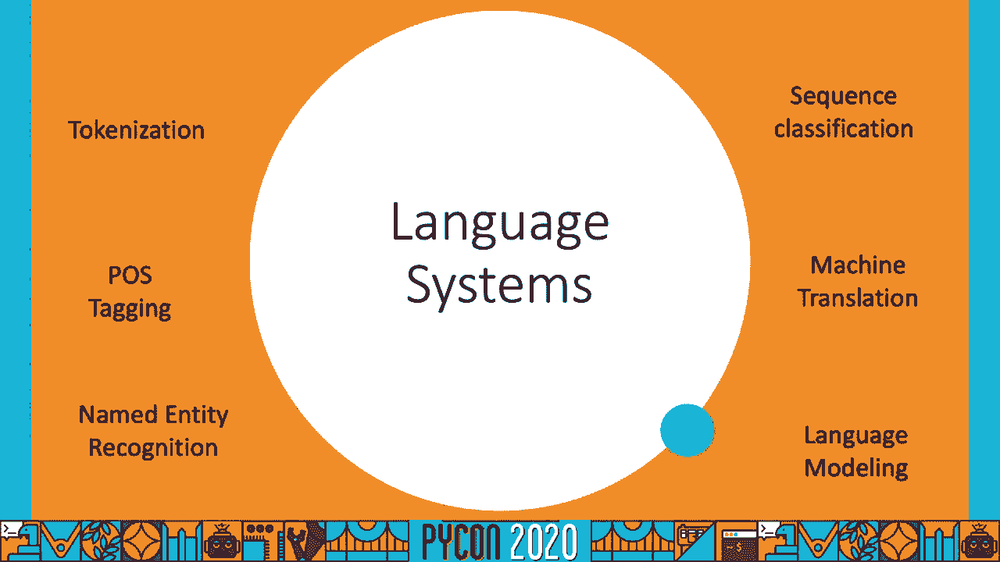
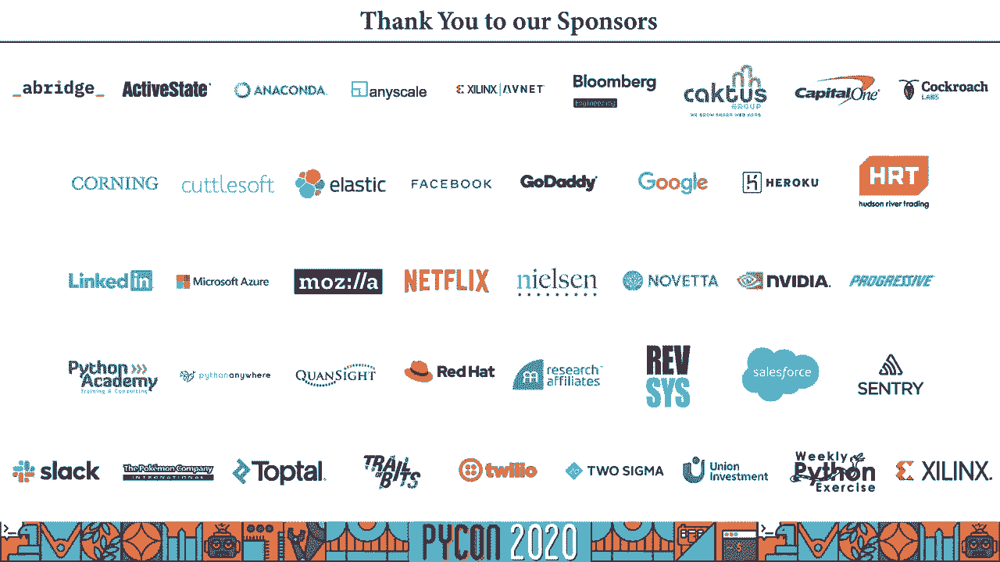

# P68：Talk Shreya Khurana - How multilingual is your NLP model - 程序员百科书 - BV1rW4y1v7YG

 Hello everyone and welcome to PyCon 2020。 This is my talk on how multilingual is your。

 NLP model。 First of all， I would just like to say that I would have very much liked to。

 meet you guys in person and Pittsburgh not only because I would have enjoyed it more but。

 because you would have been a way better audience than my laundry bag and you clearly。

 right in front of me。 Alright， so first a little bit about myself。 I work as a data scientist。

 at GoDaddy。 I've been working there since July last year。 Before that I did my master's。

 and statistics from the University of Illinois at Obama-Champaign。 I work with unstructured。

 language data and deep learning models。 Before that I also worked on patient hierarchical， modeling。

 If you're ever interested you can just give me a shout out。 I'll be giving out。

 my LinkedIn contact and my GitHub as well at the end。 Now this presentation has a couple。

 of notebooks so if you want to follow them you can just go to my GitHub link right here。

 and you can find everything you need to install and run the notebooks over there。 Alright。

 so here's how this talk is going to go。 I will be introducing what multilingual data， is。

 The challenges we see with code switch data and transliteration。 What frameworks we。

 have available for language identification and how do we go about combating those challenges。

 Then we will be moving to the deep learning model which is BERT and we'll be looking at。

 a few examples of how BERT Multilingual performs on code switch transliterated data。 We'll also。

 be looking at how we can evaluate the BERT Multilingual model。 So why do we even care。

 about multilingual data？ So right now on this earth we are about 7 billion people speaking。

 6800 languages and in 93 countries。 That is a huge statistic。 Around 1。6 billion people。

 speak Mandarin and 500 million people each speak English， Spanish and Hindi which is my。

 native language as well。 So you see with this huge statistic there is a need to actually。

 evolve our natural language system so we can incorporate all of the customers， all of the。

 people across the world and remove language barriers。

 Alright so whenever we work with language systems we have a few tasks associated with them。 The。

 first and most basic is the tokenization where what we're trying to do is let's say。

 we have an input sentence we're trying to break it down into words that are already present。

 in our vocabulary。 P。O。S。 tagging means that you have to assign all of those words a certain。

 tags like noun， adjective， adverb， so on。 Named entity recognition where what you're trying。

 to do is figure out which words in your input sequence are named entities like locations。

 names of persons and so on。 Language modeling。 This is by far the most interesting job according。

 to me in a language system。 So what you're trying to do is you have an input sentence。

 you basically try to predict what is the probability of that sentence， what is the probability。

 of that corpus， what is the probability that this word will occur next given the first， few words。

 Machine translation is as the name suggests it's translating from one language。

 to the other and right now with the boom of neural networks being used in NLP there's。

 a huge research going on in this area。 Sequence classification could be something like sentiment。

 analysis where what you're trying to do is you have an input sequence and you're just trying。

 to assign it to one or the other class。 Now let's see some of the examples of this new。

 sort of language data that we're seeing。 So which means that you're trying to mix between。

 syntax or grammar of one language with the other and this often happens when we have multilingual。

 speakers and they sometimes miss elements of multiple languages together and you see。

 a variety of phonology syntax mixing up。 So like here on the right side you see this example。

 where the first two words are of English and the rest of the sentence is in Malay and you。

 can often see them in conversations。 This is an example in Spanglish so it's a mixture。

 of English the first few words and the rest ending is of Spanish。 Okay so out of the liberty。

 of actually going to my own Facebook timeline and finding out examples of code switched and。

 translated data。 So this first example here is code switched because the first few words。

 in the first example are in the translated text which means it's Hindi but it's actually。

 converted to the English alphabet and the last three words let me celebrate you will be able。

 to recognize they are English。 This example is unique because the first few words are。

 in the Hindi they've not great script which means it's in the native script。 The last of。

 the few words are in English and there's also a couple of words which are in transliterated。

 English text。 This is the example of a tweet where you will be able to recognize the first。

 four words when your mom says they are in English but the rest of the words are in transliterated。

 English。 So these examples are pretty common if you look at YouTube comments or comments。

 on Amazon tweets or on Facebook and this is because whenever multilingual speak they tend。

 to mix languages and grammar of different types together。 So as part of this Facebook。

 initiative of actually breaking down barriers and allowing everyone to engage in their own。

 content in their own language what they did was they started working with transliterated。

 text and translating it into either the native script or the English script。 So the official。

 definition of transliteration is that you convert words written in one alphabet to another。

 alphabet and that often happens because you don't have support for different scripts either。

 in your keyboard or if you're working on a phone so basically it's just easier to work。

 with a single set of alphabet。 So on the left hand side of the screenshot you would be able。

 to recognize there are different scripts， there are words in English that you wouldn't。

 be able to recognize probably there are words in Spanish and so what Facebook did was they。

 basically translated everything to English and so if you are a speaker who does not speak。

 Spanish or other languages that are shown in the text then you would be able to recognize。

 the screenshot on the right and read stuff in English。 Alright， now we switch over to a。

 language identification。 Now language identification is a very hard problem because there are certain。

 vocabularies in many languages which are shared and the first framework we're going。

 to be covering right now is CLD3。 Now CLD3 was this Chrome extension that was released by。

 Google and if you ever use Chrome you know that it detects language right。 So how it。

 was built was using N-grams。 So what they did was so let's say you have an input sequence。

 they would extract the unicroms and they would calculate the probability of each。

 Instagram so a unigram in this case is just a simple character。 Then they would go to。

 buy grams and they would look at pairs of characters and what is the probability that。

 they're seeing them in the input sequence and similarly for trigrams。 Then basically。

 they would embed all of these unigram probabilities in an embedding layer， feed that to a hidden。

 layer of certain neurons and basically feed that to a softmax layer。 During the inference。

 they would do something like extract these N-grams from the input text， calculate the。

 probability then they would just go through this one forward pass of the whole neural network。

 So let's see CLD3 in practice。 It supports these set of languages that are shown here。

 and it also supports the encircled ones which are the transliterated ones。 So you can see。

 that it supports Chinese transliterated Russian， Bulgarian， Greek which is EL， JA which is。

 Japanese， H。I which is Hindi and the Latin prefix suffix just means that it's transliterated。

 So CLD3 has this function called get language where if you just give it the input sentence。

 or just a sequence of characters it would recognize what language it's in。 So it gives。

 the probability with which it's predicting that language then it will also give the proportion。

 of the text that it thinks it's in that language。 So over here in the first example we see we。

 give it a mixture of French which is the Jürburgr， the first three words and we give。

 it a URL but it's unable to recognize that French part of the sentence and that is because。

 it gets confused to the URL which is in English。 Now CLD3 also has this another function where。

 you can get more than one language as prediction and that is just get frequent languages。 So。

 I try to do this。 I try to give it the same input sequence and what I would have expected。

 was that it would be able to recognize that some proportion of it is in French some proportion。

 of it is in English but it was unable to do that。 Okay let's look at some other examples。

 Now this input text right here in this example is of Russian transliterated。 Now as you can。

 see it's able to recognize it periodically well and it has a really high probability。

 It says it's reliable and the proportion of text that is in Russian Latin is one which。

 is completely correct and that's because these are the languages that are supported。

 Oftentimes you will see that you will need to experiment with it to figure out how accurate。

 this is for your own language。 Now I give it a piece of Russian in its own native script。

 and it's able to recognize that with a pretty high probability as well。 Let's see how it。

 works on transliterated data。 So this is a piece of transliterated Hindi and as you can。

 see there are some prop amounts which is being depicted by the capitalization here and all。

 I wanted to see was whether it was able to predict because it does seem to be trained。

 on Hindi transliterated data but here it's predicting finish and that's because it might。

 have some common vocabulary with the Finnish language。 I give it another example over here。

 which is just Hindi for how are you？ I'm good it's a pretty common phrase again this is。

 transliterated as you can see but it does not predict Hindi transliteration over here it predicts。

 that it's Gaelic。 Let's see how it does on code switch data right code switch data if you remember。

 is just mixing two languages together in the single sequence。 So this is Spanish and English。

 so as cool kids are calling it these days it's like Spanglish now but when you feed it to。

 CLD3 it does not predict it to be Spanish or English it predicts to be Maori。

 And I give it some other phrases also this is again Spanglish this is Frankly which is French。

 English it's not able to predict it really well again right it predicts something like。

 Catalan which is a western romance language which was derived from Latin and it says the proportion is one。

 Now in the last slides you saw that CLD3 has its own challenges right it's not able to predict all。

 languages with the very high probability。 We move over to a different framework which is， LANGID。

 Now LANGID was the standalone LANGID with that identification tool it's pre-trained over。

 97 languages and it can be deployed as a web service but basically at its pace it's just a。

 naive base classifier with a multinomial event model and what it does is it just looks at a mixture。

 of byte and grams。 Let's look at it in practice so right now what I did was you have you just load。

 the model over here you normalize the probabilities which means that you have the score and it will。

 just normalize the probabilities for all the different languages。

 So I set the language to be a particular， set over here this is one very useful advantage of using this module that you can actually set it to。

 be a particular language set。 So if you're sure that your training set only has about four languages。

 you can give that to the identifier here and it will predict one of these four languages。

 So let's see now that we've said our languages about Russian English Italian and Slovakian。

 we see that this is the piece of transliterated Russian that we gave it earlier also in CLD3。

 it predicts it to be a slow vakian with a probability of 0。67。

 Another example is of this Hindi transliteration where I give it a set of Hindi and English。

 but because it does not support transliterated text at all it just predicts it as English because。

 it sees English characters over here。 Another identification framework we have is Langdetect。

 However one thing that you should know about Langdetect is that it is。

 undeterministic which means that if you try and run it on a text which is either too short or。

 too ambiguous you might get different results every time。 Again it's based on a night based。

 classifier and works with character based engrams。 However it supports only about 49 languages and。

 those also with about 99。8% precision。 It does not support any of the transliterated languages though。

 and how it works is that basically it consists of computing features based on the language。

 So like if you look at the accented E you can only see it in Spanish， Italian but not so much in。

 English right and it will look at features like how often the words that are starting with Z。

 are used in German versus how often they're used in English and then it will compute the。

 probability of those features given the input sequence。

 In Python you can just import it as Langdetect and this has it has a function which is detect。

 Langs。 Again you can just go through the notebooks at your own pace， play with it， give it more。

 examples， get a feel of how it's performing on your preferred language。

 Now over here as you can see again because it does not support transliterated data it just。

 predicts it as low wakian。 If you run it again because it's non-deterministic it will give you。

 four different languages with four different probabilities like over here is predicting。

 slow wakian， albanian， huern， hung， gary， and but none of them is Russian。

 So in the past few slides we saw how all of these frameworks have their own limitations right。

 We gave them texts with Romanized scripts in a different language but they had difficulty。

 recognizing them。 If you have a very small text length that means you're just giving very。

 less information to the model or any of these models that these frameworks have been trained on。

 There are often borrowed words from different languages that you can see in any languages。

 vocabulary right and that is why certain frameworks get confused between predicting either of them。

 There are very different transliteration schemes so like how I write in Hindi transliterated is very。

 different from my friend who lives in a different part of India and who writes in a different。

 English script。 There are overlapping vocabulary items， certain。

 vocabularies of different languages they have the same words but with different meanings which。

 often confuses these models as well。 And as you can see with limited data which means that with。

 all of these code switched language examples and with these translated examples there's very little。

 data to actually train your own model right。 So if you want your model to be able to recognize this。

 you have to have something giving you as a very high probability that it is in fact a piece of。

 transliterated text or or if it's in fact a piece of code switched text but the reason that these。

 frameworks are not giving it is because they've been trained on very small data for these certain。

 special cases。 So how do we go about solving this？

 One of the approaches is that you actually augment。

 your datasets with the dataset that you build yourself。 So often you will see that there is not。

 enough data that is available in your language。 For example within the ISO that in transliterated。

 text I did not have a particular parallel corpus to work with。 So if I wanted to detect something。

 as it was transliterated or if it was English there wasn't any model that was trained on a very。

 large piece of data to actually give me this with a very high probability。 Often you will see。

 these off the shelf models also which are trained on multiple languages right but if they are trained。

 on multiple languages just like we'll see with bird you see that they have vocabularies spanning。

 a lot other languages that what you want to be working with right and that just brings a noise。

 from other languages to your model。 So how do we do this？ So the first thing is that you have to。

 identify one data source or multiple data sources in the language in any language that can be translated。

 to yours either by rules or by machine translation。 And then you use this machine generated data to。

 augment。 For example right now let's say I was working with Hindi and I wanted to get much more。

 data and transliterated form right。 So I have this dump of Hindi Wikipedia articles which is。

 available readily online and I built my own transliterator and this transliterator is based on rules so I。

 define certain rules。 I give it to my transliterator class。

 It just basically converts all of this dump， of Hindi Wikipedia articles into a new data set。

 And once I have this new data set I can basically。

 augment it with very small data set that I already had。

 So this data set right here this data set is， the addition that we are providing to our base data set to actually help it give more confidence。

 to recognize that it's actually transliterated or not。 Okay so let's look at how we go about。

 solving this small example。 Now this is a very simple transliterator in which what I've done is。

 I've just defined my mappings of my Hindi alphabet to my English alphabet and basically I just。

 see it in a piece of text which might be in Hindi。

 So if I have an article or Wikipedia article basically， I just read all sentences。

 I use these mappings to convert them into English alphabet。 I define certain。

 other very simple rules as to what character can come before the other and then I just converted。

 to the English alphabet。 So like right here I just convert this one single sentence which is from。

 a Hindi Wikipedia page for Python and it just converts it to English alphabet。 If you're familiar。

 with Hindi alphabet you will see that this is not a very good transliteration and that's because。

 we're working with a very simple example right here and I just wanted to show that you can actually。

 just build more sophisticated， more complex transliterated cases based on your own custom task。

 Now we can either build our own transliterated systems or we can actually look at certain other。

 examples that might exist in the literature already。 So for example we， I was working with。

 the Indic languages and I found the Sealycrate library which is the CS and LI and what it does is。

 it already has a pre-trained neural machine translation model that converts the Roman to Hindi。

 and basically it would give you something like this。 So if you give it a piece of text it would。

 convert it to the Hindi script and basically if the probability of that conversion is really high。

 it would assign it a Hindi tag。 So what I get with this is I get language identification that is not。

 only sent tense right but that is token right。 So that really helps in examples which might。

 have code switch data。 Now this is only for Indic languages but there are tons of other open source。

 libraries that are available for other languages as well。 Okay。

 now that we've looked at all of these， language identification frameworks and the challenges associated with them。

 how do we go about solving， them。 Let's move on to certain off the shelf models that are readily available right。

 So we have this， really state-of-the-art model called the transformer and the transformer was actually very famous not。

 because of what it brought to the table which was state-of-the-art at that time but because it。

 led to so much of research being happening in the neural language community which meant that。

 there were so many models， so many research papers being published after this。 Now the。

 transformer was introduced in Attention is All You Need。 This was the paper by。

 Waspani and others and basically it has a stack of encoders。 So this right here is an encoder。

 Each encoder has two layers which is the multi-head attention and of normal feed forward layer。

 We'll talk about multi-head attention in the coming slide and it had a stack of six encoders。

 and similarly a stack of 60 coders and each decoder had about three layers。

 So again one was multi-head， attention， again a multi-head attention and then a feed forward neural network layer。

 Okay so we've been talking about multi-head attention right。 Multi-headed attention was this。

 concept introduced by this paper which is why it was becoming very famous。

 So attention was actually， not introduced in this paper。

 Attention was introduced way back in 2014 and attention is when you're。

 actually trying to figure out which word in the given sequence places how much of attention on。

 the other words in the sequence and this could basically just mean that how many weights or how。

 much of weight are you giving on each of these words in the sequence。 Now multi-headed attention。

 meant that you're not even looking at just one sort of weights but you're looking at two different。

 sets of weights or three different sets of weights。

 In the paper they're using eight different matrices。

 which means that they're looking at eight different attention heads。 So as your sentence gets more。

 complicated it needs to figure out different relations between the given word and the other。

 words in the sequence。 So like right now if I'm given no other context of all of these words before。

 this word it I might just want to figure out what it is referring to。 So let's say if I'm。

 not given any of this and I just have this sentence which is it was too tired。 My question might be。

 who is it？ Who does it refer to right？ Who isn't too tired？ Is it the street？ Is it the animal？

 And basically to answer this question is where attention is required。

 So this was just one question that I'm answering but what if the other question that I'm answering。

 is that why didn't the animal cross the street then the answer becomes because it was too tired。

 So then that places a different sort of weight on different words and basically this is the。

 problem that this model is trying to solve it's basically trying to see how you can answer。

 various questions that are coming how you can assign different weights to different clauses。

 based on just a single given word。 Now what was bird？ Now bird again state of the art soda。

 everything now that you will see in this NLP community is that it beats soda right。 But bird。

 again was a transformer at its base and when it was built literally every other model on that was just。

 based on bird。 So like we have Robert we have Disturb but we have two of bird we have Senti， bird。

 I mean most of the models that we see right now or most of the natural language。

 community that you see right now is working on bird working on its representations trying to。

 improve it trying to make it faster and so on。 So what is it？ Why is it special？

 And bird is special because of the way it uses pre-training and fine-duning。 Now bird at its。

 pre-training stage what it did was it had all of this corpus and basically it trained on this unlabeled。

 data。 It made two tasks。 The first task was about the next sentence prediction so if you have a corpus。

 it would create a task that would have if one sentence is the next sentence of the previous one。

 a 50% of the time and then they would create just a random sentence after another sentence。

 and then that would be labeled as false。 Another task that they use was the mass language model。

 which will be coming in the coming slides。 And at the fine-tuning stage what it did was。

 once you have all of these weights that have been trained on these two tasks you basically just。

 fine-tune this neural network for your particular task which could be sequence classification。

 which could be question answering which is what you see in reading comprehension。 You could see。

 if one sentence is a paraphrase of the other and so on。 So bird multilingual actually had this。

 one pre-processing technique which is the wordpiece processing and the reason it has been proven so。

 useful for multilingual systems is that you can actually share vocabulary across various languages。

 So like the bird vocabulary for this multilingual model is about 120，000 and it tokenizes on the。

 basis of how likely our character sequences to be seen together。

 So in this what piece pre-processing， what we do is we basically start from the character level and for all of our languages which is。

 104 languages that the bird has been trained on we look at which characters are much more likely。

 to be seen together than others and this is how we form these subboards。 So subboards are something。

 in between a character and a word。 So in this example I'm using the hugging face transformers。

 and tokenizers library。 If you've ever worked with NLP you must be aware of this but if you're。

 hearing about this for the first time definitely go check this out。 This library actually makes。

 it very easy for us to train and evaluate transformers and it's a really good library for beginners。

 So I just load the bird multilingual model and I load the equivalent tokenizer。 Then in line 5。

 I basically tokenize the Spanish query and if you look at the pieces that we return。

 we're getting in return you will be seeing that you don't get the same words as are separated by。

 white space right and that is because those are subboards and those are the word pieces。

 So if you see a hash hash in the beginning of the subboard that's because that means that it was。

 supposed to be appended to the previous one。 So as you can see Ola has been divided into two subboards。

 Kiara has been divided into two subboards and so on。

 In the next example in line 6 I tokenize a Hindi， query where you see that the first word has been tokenized into three parts and in the last example。

 if you're an office fan here is B。 It's Battlestar Collectica。

 So if you look at beats it has been again， divided into two subboards which is B and TS and again the hash is in between the beginning they。

 just mean that the word has to be appended to the previous one。

 So let us look at some statistics of， languages and how the bird actually leverages so many languages in just a single vocabulary right。

 So let's look at the right-hand side graph first。 The right-hand side graph actually gives you fertility。

 and fertility is a term that has been borrowed from statistical machine translation which。

 and what it means is that what is the average number of bird word pieces corresponding to a。

 single real token。 So in the last example we saw that Ola was actually divided up into two word。

 pieces right。 So if you're looking at the fertility of that word it just means it's two。 But for a。

 particular language what we do is we calculate the average number of word pieces that each word。

 in that language is divided into。 So on the left-hand side of this graph where you see fertility versus。

 the language you see that there are certain languages like Portuguese， Hebrew， English which。

 have a fertility of around one which means that they are retaining their own original vocabulary。

 So that means that most of the words in English actually have or have been divided into just one。

 word which means that yeah it's just the original one。 On the right-hand side of these。

 graph you see that there are Tamil， Telugu， Armenian， Greek， these languages right。

 And that just means， that these languages are broken up into more than two word pieces。

 So an average word if you take， in these languages it is more likely to be broken up into more number of word pieces。

 So in the left， inside of the graph the left graph if you see you are plotting frequency with respect to length in。

 characters。 So this means that how many word pieces we see of how much length。 So again it's a very。

 common graph because as the number of characters increases you see that the frequency decreases。

 and that's very common because you're likely to break it down into smaller and smaller word pieces。

 which actually have a much more likelihood of being seen。 So over here we talk about the。

 PERT mass language model。 Now the special thing about this is that it was bidirectional which means。

 that if you're looking to predict a word you basically look at the context from left to right。

 as well as from right to left。 So in PERT what the authors did was they masked 15% of all the word。

 piece tokens at random and they replaced this every 15 per every word of the 15% with a 80%。

 probability that it would be a mask with a 10% probability that it would be a random token。

 and with a 10% probability that it would just remain the same original token。 And the way they。

 would evaluate this language model is by just predicting how accurate your masked words are。

 So here we define a function just to predict a given word in a given piece of sequence。

 So here again I'm using the transformers library and you just load the model which is PERT for。

 masked LM and you load the multilingual one because we're going to be looking at certain multilingual。

 examples and in this function what we're doing is we take a piece of text we tokenize it then this is。

 the second argument which is the word that you want to predict and you basically just give it a。

 mask over here and you feed it to the model it predicts you take the art max of probability。

 and then you see which one is the most likely word that is being predicted by the model。

 you also look at certain other predictions just to see if your desired prediction isn't the top K。

 All right now that we've actually defined our function to predict the。

 masked word let's actually do that for a couple of examples。 Here the first example I give it a。

 code switched piece of text where the first few words are in English the last few words are in。

 Spanish which just means live and let live。 So basically what I want to do is I want to predict。

 this masked word Tejar。 Now the model is actually able to predict a lot of the words that make。

 sense so if you look at a couple of them solo means just which means live and just live。

 live and live well Tambian also live and also live so all of them make sense and it's able to。

 recognize the context of what we're talking about even though there's mixed language。

 In this other example I give it the same piece of text but I want to predict we will know。

 Now the good thing to notice over here is that if you look in the list of predicted tokens。

 you will be able to see that you have Viva which means live and again it's able to recognize the。

 context I think that's mainly because of another VV in this sentence。

 Now I also try to do this for a Hindi example because I'm much more familiar with Hindi。

 and basically what I saw was that when you give it a piece of text which is very small。

 it's able to predict this word which is the actual word and it's top one accuracy is very high but。

 all of these other sentence predictions did not make sense at all given the input sequence。

 So now let's look at another code switched example and this is a slightly longer example in which we。

 have Hindi script as well as English interspersed in the middle。

 So the first few words and the boxed words you can see are in Hindi script。

 The remaining words are in English and you see these phrases that occur together a lot right like。

 Hindi blogs， Hindi bloggers， popular Hindi blogs and so on。 So here's what I did。

 I gave it this piece of text and asked it to predict the word blog。

 Now in the predicted list of tokens you can see that it's actually recognizing this word as the。

 first candidate itself and that is good。 In the other predictions you can see that it's giving you。

 the capitalized blog， publisher， forum which means that it's actually able to recognize。

 the context of the given word and that's because it's appearing in multiple phrases right。

 So you see in different phrases it's occurring as best Hindi blogs， popular Hindi bloggers。

 popular Hindi blogs again。 So the reason that it's able to recognize publisher。

 blog or forum is because it's reading all of them time and again and because it's pie directional。

 So you will often see this。 So if you give but a very long piece of text which has。

 too much of contextual information it will be able to recognize the word pretty nicely。

 Irrespective of whether you have inter switched language in the middle。

 Now another place where you see a lot of translated text is the lyrics。

 So I'm a huge polywood fan and anytime I don't know the lyrics of a Bollywood song I'll just go to。

 Google and search it out。 The results will usually be in the English alphabet though which is why。

 we get a lot of translation。 So now I give birth this huge piece of text which is lyrics of a song。

 or popular song in Bollywood and I ask it to predict this word which is MEIN。

 Now if you notice the next word to MEIN is HAI and it appears in another context again the next word。

 is HAI and again the next word is HAI。 Now if you look at the list of predicted tokens you will。

 see that it is able to recognize that the targeted word was MEIN and if you look at some of the。

 tokens over there most of them are just appendings and if you look at one token which is HAI。

 Now that appears a lot in the text right in fact that is the next word to our mast word。

 and the reason it's able to or it's giving us this prediction is because it's seeing that this。

 word occurs a lot in the same context。 So if you give birth a lot of information it will look at。

 the right context it will look at the left context and it will be able to recognize the mast word。

 given that the same word appears multiple times。 Okay so now that we've looked at how the mast language model performs let's look at how we can。

 evaluate certain tasks that we perform with birth right。

 So let's say you have this multilingual piece， and you are trying to give POS tags to every word piece。

 The first thing that you want to do is you， want to organize it because that is how birth works you have to organize it into word pieces。

 and the way you can assign them tags is by giving the first word piece of the associated word a tag。

 So which means that if you are looking at this sentence and Jim is one word hence and is another。

 word hence and is divided into hen and son word pieces you would basically give a tag to the。

 first word piece hen and you would leave out the last word piece。 Similarly if over here。

 if you are giving it a word piece of puppet and an ear you would leave out the last word piece。

 and then just assign a tag to the first one。 Now there are various ways to do this you can either。

 use the birth representations as input to another neural network or you can fine tune birth completely。

 For generation or evaluation metrics actually look pretty similar to what they would do a normal。

 neural machine translation model。 If you are looking at the mass language model you would want to see。

 with how much prediction or how much accuracy the birth model is actually predicting。 So you could。

 look at the top 10 accuracy or top 3 accuracy top 5 accuracy according to you。 Now a lot of the。

 metrics in your machine translation like beam surgeon blues core are pretty useful for multilingual。

 generation and that is because the multilingual generation and bird is based on word pieces。

 So in word pieces what we have is a common vocabulary across languages which means that you。

 actually don't have to switch every time if you have a multilingual piece of data and figure out。

 a language model for different languages。 You basically have this word pieces and you will just see which。

 word piece is predicted after the other。 So in beam search what we do is we look at each time step。

 and the few best candidates at that point we evaluate all paths that are arising from them。

 So let's say at time step one we figured out that these are the 30 best candidates we would evaluate。

 30 best candidates at each again time step for all of them and then at the end we calculate the best。

 possible candidate for our translation。 You could do this for transliteration you could do this for。

 code switch piece of data anything。 Now another way to actually evaluate how good your generation is。

 is through the blues core and blues core is pretty widely used if you've ever worked with。

 your machine translation you know about this but the main idea behind blues core is that you look at。

 n grams so up to 1 gram 2 gram 3 gram 4 grams in the candidate sequence that you have and you。

 compare it to the reference sequence and you figure out how similar they are。

 And now just to summarize what we've done till now if you want to make your model your NLP model。

 more multilingual here's what you need to decide you need to decide if it's even required if what。

 you're catering to actually needs a lot of languages which languages those are do you have enough data。

 for them if not you need to add data and this you can do by just converting with a rule based。

 transliterator like i mentioned or if you have any neural machine models that are already trained。

 you choose the multilingual pre-trained model that you want to utilize and then you find。

 you according to task let's say you want to do a classification task you do a softmax layer on top。

 of per and if you want to regeneration task you customize accordingly and voila you have your。

 multilingual model and with that we reached the end of the presentation so in this talk we've seen。

 transliterated and code switch data and how they are extremely different grammars to monolingual。

 corpus's or normal languages that we've seen because they mix a variety of them we've seen some challenges。

 that are associated with language identification with these kind of cases we've seen how we can。

 actually augment datasets by building on our own and we can do that by either using a rule based。

 system or by using machine translation from a specific data source we've seen how multilingual。

 board performs how it does on transliterated data on code switch data given enough length。

 and given enough context and in the last we've seen that we can make an inletive presentation。

 without having a word cloud all right and with that we reached the end of this presentation。

 if you have any questions feel free to leave them in the comment section below or you can find me on。

 linkedin use it this keyword code and also available on github or feel free to go through the notebooks。

 and ask any questions that you have and i just like to thank bycon and the python software。

 foundation for organizing this thank you， thank you， [BLANK_AUDIO]。

 you。