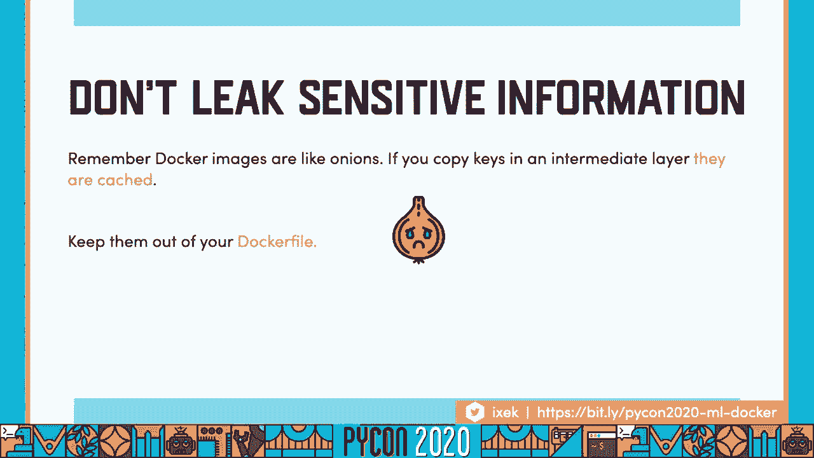
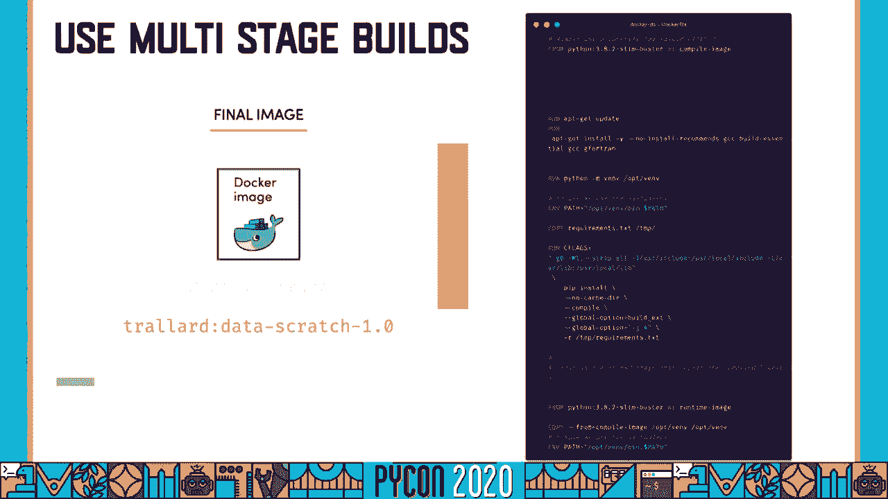
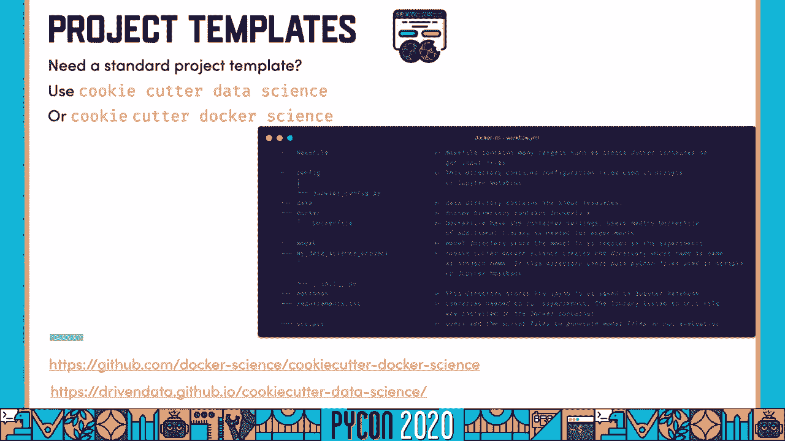
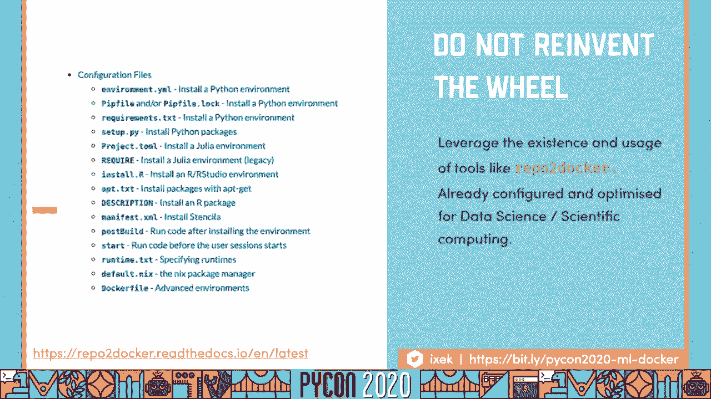
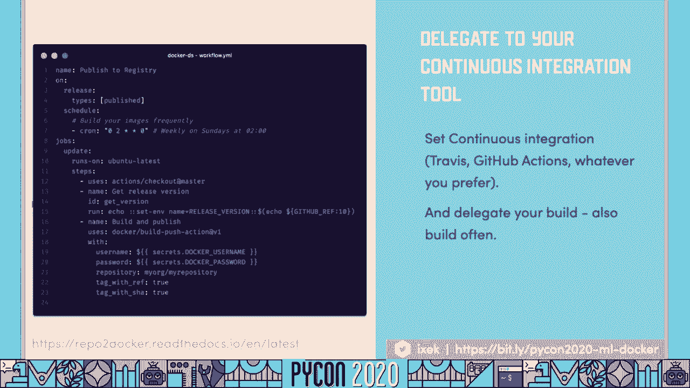
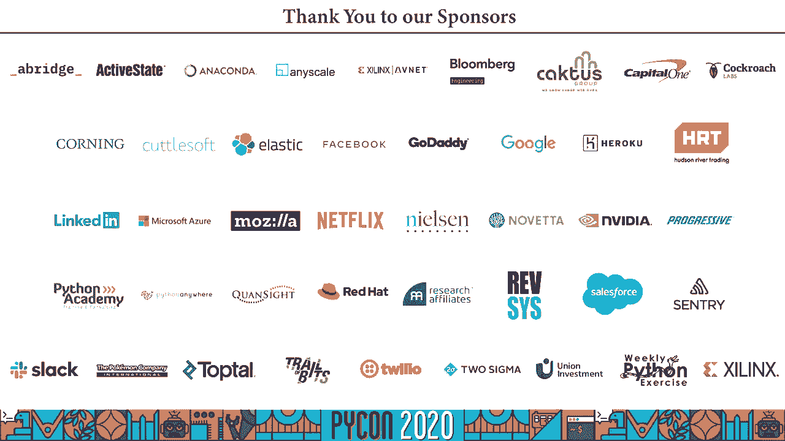

# P70：Talk Tania Allard - Docker and Python making them play nicely and securely for D - 程序员百科书 - BV1rW4y1v7YG

你好，各位，我是坦尼娅小伙子，这是我在网上为蟒蛇20做的演示，我要说的是码头工人和蟒蛇，以及我们如何让他们在数据上玩得很好 很安全，科学与机器学习，我是微软的开发者倡导者。我的职责是帮助其他开发人员和专业人士，研究人员和学者把我们的工作做得更好，这可以通过创建新的应用程序 或为它们开发内容来实现，与我们的工程团队合作，你可以在推特上找到我，在支票或支票上，我的网站上写着。

此外，你也可以在这个网站上访问这些幻灯片，所有的灯都可以连接到，所以你想什么时候看就什么时候看，所以让我们从你今天所学的开始，首先我们要了解为什么你想用足球，它们的优点和一些码头的特点是什么？呃。使用数据科学和机器学习时的问题，我也会给你一些关于安全和性能的建议，当你处理码头工人和集装箱时，关于如何不重新发明轮子的一些小贴士，但是自动化，最后我会给你一些实用的建议。

如何在您的数据科学项目中使用 docker，所以让我们从白色码头工人开始，为什么你要用足球，对于数据科学来说，或者更有可能是你在开发你的应用程序 或者你的模型，或者你的科研项目，你当地的电脑，因此。您可能熟悉创建应用程序的这类开发，不管是什么，我只想概括一下，你想把这个卖给别人，不管是客户还是点击，你遇到过多少次这样的问题，上面说模块不存在，这可能是你最小的问题，如果人们使用不同的运行时。

也许有人还在用蟒蛇，你用 python 3开发了整个算法和整个模型，或者你在 bindu上开发应用程序，有人在这里说红帽子或者用 dbn或窗户，人们如何知道他们需要什么依赖关系 或者他们需要什么环境。或配置文件，说你对此不明确，这就是医生发挥作用的地方，Docker是一个工具，允许您创建，部署，并使用容器运行应用程序或项目，在整个展示过程中，我要用那个小地衣来代表一个容器。

但是集装箱对你有什么帮助呢，最明显的答案是 他们为你提供了解决问题的方法，如何让你的软件模型或者应用程序，从一个计算环境转移到另一个计算环境，这可以从你的笔记本电脑到你的测试，阶段或生产环境。也可以是你的笔记本电脑和别人的笔记本电脑，所以，在这个世界里，你使用容器来做你的开发或数据科学世界，这是您的工作流程在开发应用程序时的样子，但在本例中，您还添加了库，所有的依赖关系，运行时环境。

以及它工作所需的配置文件，所以你建造你的容器，你的申请，所有这些额外的资产，所以如果有人想安装这个或者运行整个机器，其实是可行的，所以我可以想象你们中熟悉虚拟机的人，可能会觉得它看起来或听起来有点眼熟。码头工人集装箱的工作方式是您将有您的基础设施，可能是个服务器，或云，或者你的电脑，以及你的主机操作系统，坐在上面，你会有码头工人，然后你可以有很多不同的应用程序，它们是集装箱式的，在这个场景的设置中。

每个应用程序都被封装，所以码头工人和集装箱在应用程序级别上工作，每个应用程序都作为一个独立的进程运行，整个操作系统和基础设施都被提取出来，所以没关系，如果不管你是在 ubuntu还是红帽子上开发的。有人在用窗户，立式机械，另一方面，也将从基础设施开始，它将让虚拟机监控程序坐在上面，因此，您的虚拟机管理程序将位于物理服务器的顶部，我们会有两个完全不同的操作系统在上面运行，所以障碍物在硬件层面起作用。

意味着你不仅起草了，但是整个操作系统，二进制文件，依赖性，所有在你的基础结构上工作的东西，当你深入码头工人的世界，您可能还会使用或听到单词图像容器，这些术语在开始时似乎有点令人困惑。所以让我们开始揭穿一个图像是一个档案，所有运行应用程序所需的数据，作为存档 它需要有一个标签，它可以是最新的，也可以是混凝土拖船，无论是语义版本控制或日历版本控制，还是提交的引用。

如果您使用版本控制来决定标记将是什么样子，当你从存储库中提取图像时，可能是码头工人中心或者你的私人仓库，如果要使用 docker命令运行，docker映像实际上创建了一个容器。在那里你可以做你的开发工作，你所有的工作都会放在这个隔离的容器里，那么在使用数据时，有哪些常见的痛点，科学，机器学习和码头工人在一起，首先，我们倾向于使用复杂的设置或依赖关系，这只是因为蟒蛇的天性。

一些软件包和一些库，我们也高度依赖数据和数据库，数据科学和机器学习项目的一个共同特征也被完成，它们往往是非常快速发展的项 目，在研究和开发阶段，我们倾向于做一个非常快速和迭代的过程。当你在黑暗中越陷越深，你会发现这其实很复杂，这可能需要相当多的时间来扩展和学习 你需要的关于它的一切，另外一个常见的问题是容器对我们的数据是否足够安全，或者我们的模型或者算法。

当您使用医疗保健数据时会发生什么，或者它可以使一个旧的数据或金融，或任何其他类型的数据，可以帮助轻松地识别个人，所以让我们深入到场景中，数据科学和机器学习码头工人的提示和最佳实践。其中一些是针对我们的用例的，其他一些一般适用，所以如果你不是一个数据科学家或机器学习者，而是一个软件工程师或者一个 devops步行，你还可以学习和应用一些技巧，好的，还有。

所以我们已经知道了一些主要的问题，或者我们在使用码头工人时可能会遇到的一些复杂问题，或者只是在数据科学领域工作，那么如何为数据科学项目创建容器呢，不同的行动。我提到的第一件事就是我们可以有非常复杂的设置，以及附属设施和装置，在我们的蟒蛇社区里，很多人都在公开讨论这个问题，因为这不是问题，对我们的数据科学或科学计算生态系统完全无知。

克服这种情况的诀窍是找到一个强大的，可复制的工作方式，您可能会尝试所有的新工具，并有一个非常复杂的环境，但有时只是选择正确的工具，坚持最佳做法，它可以让你走很长的路，当我们研究数据科学和机器学习时。并不是每一个可交付的产品都是上涨的，我们发展一项运动 并不是所有的事情都是，机器学习工作流可以产品化，因为不是所有的东西都是建模的，不是所有的东西都能送到，作为可以通过端点或 url访问的模型。

或者是在智能手机上，我们严重依赖数据 数据，是我们最宝贵的资产之一，它还将有轮子和编译包的混合物，很多蟒蛇，科学的生态系统包实际上依赖于编制二进制文件，当你处理敏感数据的时候。我们还需要确保我们有正确的安全访问级别，数据和软件，我们还将有一个混合的利益相关者，数 据 科学家，软件工程师，机器学习工程师，如果你正在开发一个在后端使用机器学习的应用程序，你还需要有人照顾前端。

和更卑鄙的发展，所以这增加了项目的复杂性，每个利益相关者都有不同的要求和需求，如果您从未使用过码头工人图像，让我们深入了解基础知识，这将帮助您更好地理解工作流程，如果你以前用过码头工人。这是要去作为一个复习，我们和码头工人一起工作的方式，创建容器和图像，是通过码头工人文件指定所有的指令和要求，在右手边，你的例子不是很好，一个不好的例子，以及如何将文件，但它应该足够简单。

让你明白我们如何构建它，我们通常从基本图像开始，假设我们的积木，当你使用乐高积木时，你需要一个坚实的基础，然后你就会有一套说明，这就是你安装所有软件包的地方，你所有的依赖，编译二进制文件。和更多的文件 从您的本地开发环境到您的容器，最后你有了一个内奸，这可以是运行交互式应用程序，就像朱庇特实验室，或者执行一个脚本，或者只是访问命令行，你要注意的是。

码头工人文件中包含的每个指令都创建了一个层，所以对你来说最接近的类比就是，想象一个洋葱，你的基本形象将是核心，每次你用这个命令运行一个指令，它会产生洛杉矶，把之前的几层包裹起来，所以一切都是自成一体的。你得到的指示越多，你的洋葱或容器越大，以及层数，所以你必须非常聪明地创造这些层，在构建容器时，一个关键的部分是选择最好的基于图像，你会在很多地方读到，alpine linux是最好的估计，因为它很轻。

和你可以是一个集装箱 是相当 意大利，所以我想先提醒你一下，如果你要从头开始构建所有的图像，确保使用官方蟒蛇图像，你可以在这些链接中找到它们，现在就可以找到不同的版本和标记。回到 alpine linux的问题上来，这是一个非常轻量级的基础图像，也就是说，您必须花费大量时间构建库和依赖项，它不值得如此复杂，如果你在找一条蟒蛇，我建议你用超薄克星，它基于 dvn。

同时它也有长期的支持，所以很有可能会有持续的安全更新，在接下来的几年里，如果你要找蟒蛇 三点七分，我建议选择苗条的伸展或苗条的海报，苗条的图像有完整的分布，但他们只删除不必要的文件，如手册页。从零开始创建码头工人图像可能需要很长时间，所以，如果你发现你将需要康达朱庇特书，总的来说科学巨蟒生态系统，这在数据科学和机器学习中更有可能发生，Jupyter码头工人堆栈的使用，木星群落。

已经在制作这些容器和图像上付出了很多努力，它们都是从 ubuntu基础图像开始的，它们一层一层地叠在一起，所以如果你只需要木星而不是书，你想自己卖掉你的依赖关系，你可以从那里建造。如果您需要更复杂的设置与科学蟒蛇程序，以及在为你做某事时的张力流，你也可以用脊椎火花，或者一个不大的数据科学 也包含我们的，我想还有其他一些社区网站允许你使用朱莉娅。

您也可以使用这些作为空间图像来构建您的码头工人图像，所以二话不说，让我们进入一些最佳实践 为您开始，首先要知道你在期待什么，这是不言而喻的，一定要确保你用的是一个具体的标签。所以直接从总是使用一个特定的标签，例如，基础笔记本三点零三，避免使用最新的，因为很有可能，当创建下一个推送或创建下一个图像时，这会改变你的步伐，用标签提供上下文，这很重要，您可以添加重要信息。

比如谁是维护者，这是一个安全环境，这意味着要用于生产，以及许多其他人，有时我们可能觉得需要有非常复杂的运行语句，但是易读性是非常重要的，确保拆分运行片段 并对它们进行排序，也更喜欢复制而不是命令。复制以添加文件，当他们完成的时候，配置文件，或者别的什么，你会看到在 add命令中也存在，但复制更简单，它也非常明确，码头工人也很擅长使用高速缓存，这意味着。

如果您有一个依赖项或一些在您的层中没有改变的东西，然后，它保留该层，以加快构建速度，而不需要下载依赖项，或汇编它们，或者只是安装它们，在飞行中，因为每条指令都会产生一层。每当这些指令中包含的任何文件被修改时，后续几层还要建，所以当你重组你的码头工人文件的时候 要非常小心，作用域的单独说明，确保您实际上是在最大限度地使用缓存，并且只安装必要的补丁，有时我们会觉得有必要。

我不知道额外的包裹，以防我们最后需要它，但这会让你的形象大打折扣，同时也增加了潜在的风险，潜在的安全性以及图像和图像大小，同时明确忽略文件，如果您熟悉用于版本控制的 git，你可以创建一个模拟文件。不仅可以帮你避免携带不必要的文件，比如你的押韵或者数据，总是试图避免添加数据，尤其是当我们从事数据科学时，我们不想对容器中的数据进行硬编码，但我们可能想访问数据库甚至硬盘上的数据。

也要确保永远不要泄露秘密，在我们的码头工人中 显式地标记带有秘密的文件，忽略，将确保它们不在您的层内，我已经告诉过你 不要把数据加到你的码头工人档案里，所以有两种方法，或者有多种方式连接到这个是。你可以访问数据库，并确保您的容器能够访问您的数据库 通过，如果你在本地有你的数据，或，例如，在云虚拟环境中，您可以使用绑定挂载到目录，或者只需指定您的数据或文件所在的目录，把它们装到容器里。

这样你就不能，你可以运行你的容器，你可以启动你的容器，做你的开发工作和进步，或者更改将直接保存在本地文件中，也有一个大罪犯在那里，您还需要确保您是作为非根用户运行的。您可能在访问文件或更改文件权限时遇到问题，当我们谈到安全问题时，我会更深入地讨论这个问题，到目前为止，我只给了你一些好的做法，如何开始建造你的码头 工人集装箱，这些会让你走很远的路。

使用码头工人和集装箱的主要问题之一 依赖于安全性，我之前提到过，当运行容器时，您必须使用并使用您的标志，这主要是为了最大限度地减少特权，我们称之为受宠，最少特权，用户。这对于最大限度地减少或防止攻击是非常重要的，默认情况下第一次作为非根用户运行 docker运行他的路由，这是因为您通常需要更新内核中的库，所以当你需要做鞋底的时候，因为你是根用户。

还要确保将用户的功能最小化，例如在你的码头工人文件上，例如，在幻灯片上的这个足球文件例子中，你是，您显式地创建了一个名为 joan的用户，如果您使用的是 jupyter堆栈容器中的任何一个，你不用担心。因为来自木星的人们已经花了很多时间，确保你不是作为一个有特权的选择者竞选，然 而，如果你要延长你的码头集装箱，你需要确保你还添加了一个无特权的高利贷，改变路线给你，做任何系统更新，然后返回到非特权用户。

处理敏感信息时要非常小心，有时很容易拥有与密码或键对应的环境变量，或 api代币，保护你的集装箱的第一个入口是，将包含这些密钥的文件添加到 docker中，忽略，所以他们不能进去。别把这些都写进你的码头工人档案里，您可以设置运行时环境，然后由标志或其他上下文提供，有时我们可以感觉到 如果我们把这些文件复制到一个层内的容器中，再删除，因为我们在此基础上，这种情况不会持续下去。

但因为洋葱组织里的洋葱和它们的容器，即使是我们在前几层中移动和删除的东西也会被缓存，这样人们就可以访问它们。

一个非常强大的方法来保护你的码头 集装箱和你的秘密，秘密是用多级建造，如果你在中间层获取和管理机密，该图层或该图像被丢弃，然后它们就不会在最后的图像中持续存在，另一个优势是，非常重要和有帮助。尤其是在科学巨蟒生态系统中，不是所有的依赖关系都会像车轮一样产生影响，您可能需要一个编译器，不管是 gcc还是 g retrain编译器，所以，有那些编译器是非常有帮助的，在初始图像中编译二进制文件。

然后只需在编译包中的编译活页夹上安装或复制，总的来说，当您使用多阶段构建时，它帮助你创建更小的图像，因为你可以处理掉所有不必要和不需要的文件，然后保持什么，你真的在，你只有一个文件，作为一个例子。我们从蟒蛇3开始，点，八，第二点，我们称之为引人注目的形象，因为那是我们进行系统更新的地方，安装编译器，创建虚拟环境，把我们的依赖关系，所以当我们做码头工人的时候，建立我们的形象，并提供一个背景。

一旦完成，码头工人将开始构建编译图像，它将转移到运行时映像，在这个运行时映像中，我们要做的是只复制虚拟环境，或者您只能复制一些编译包，这边，你要摆脱编译器，以及其他你不需要的辅助文件。最终的图像是运行时图像，当你调用命令码头工人构建时，你提供的唐是什么。

最后一部分，这次演讲的最后一部分是关于自动化的，到目前为止，我给了你很多建议，还有很多提升业绩的方法，减少图像，确保您的图像是安全的，但这一切都可能是非常，非常令人生畏。尤其是如果你只为你的个人用途建造容器，为了重现性，使用码头工人集装箱的主要优点之一是残疾，当我们在做机器学习研究和科学计算的时候，我们非常关心这个问题，我们通常想和别人分享我们的资产。

或者我们想把我们的数据代码和文件，这样人们就可以验证我们的研究和发现，所以我们能做的最好的事情之一就是。

每当我谈到可复制性，或者当我谈到可复制性的时候，在机器学习和科学计算的背景下，我一直推荐的东西，这样每个人都有一个标准模板，到处都是，所有的东西都生活在一个特定的空间里，你总是知道你在期待什么。从你的文件夹结构来看，哪些文件应该是，对于目录和命名有明确的约定，如果您正在为数据科学项目寻找好的项目模板，尝试使用曲奇切割器进行数据科学，如果你对它的码头工人版本感兴趣，使用饼干切割机 码头工人科学。

当你使用这些包时，它将为您创建一个健壮的模板，开始你的数据科学项目，从你看到的图像，曲奇切割机的布局，码头工人，科学，所以我们有木星的结构，我们有一份码头工人的文件，我们有我们的目录。对于我们的模型和需求以及其他脚本，所以这是我的默认，使你能够以类似的方式使用 jupyter笔记本，木星计划的对接舱，它们都是在木星不允许的情况下启用的。

所以每当你运行你的码头工人容器 使用任何他们的图像，你能做的第一件事就是进入终端，敬你的木星。

所以你有一个可靠的众所周知的环境，第二步是不推倒重来，有时候，我们可能觉得有必要从头开始，在社区已经在开发的非常好的软件包中，我最喜欢的包裹之一是报告码头工人，在那里它需要一个存储库，它可以是本地的。也可以是整个url的，主要的优点是它已经被配置和优化了，数据科学和科学计算，常见的工作流程是，您将拥有一个配置文件，明确描述项目所依赖的需求，一旦你有了 jigq 命令木星把它放到码头上。

并提供一个路径，它可以是一个本地目录，也可以是对应于存储库的 url，或者是野渡里的渡渡鸟，然后它将使用一些木星标记，码头工人基地，构建您的码头工人集装箱，那个，最妙的是。你甚至不用写一份码头工人的文件，你不必花很多时间完善你的码头工人文件，学会如何去做，所以如果你在寻找一种可靠的方法来制造码头工人集装箱，Docker是您用来管理依赖项和环境的工具，不管是内容，PIP。

即使你在我们或朱利亚工作，您可以使用它来创建一个容器和奖励积分，因为这些容器的格式和用来装订的容器是一样的，所以如果你想以可复制和互动的方式分享你的资产，其他人的开销最小。活页夹和报告码头工人是你的工具 去。

最后委托到目前为止 您的持续集成，我提到过你创造了，您可以创建您的图像并标记它们，有很多实例需要创建一个新的码头工人映像，或新版本，可能你创建了一个你的包或你的模型或你的应用程序的版本，因此。您可以在版本控制系统中创建一个标记，你想拍到一个随行的码头工人的照片，确保一切都是最新的，但一个非常好的做法也是经常或经常重建您的图像，如果你广泛使用 docker进行研究和开发，测试和生产。

大概每周一次，这是个好主意，为了确保陪审团得到所有的安全更新，如果你用手做这件事，可能会很麻烦，所以最好的方法是使用持续集成，不管你已经在使用什么工具，特拉维斯是否，Github行动，或者别的什么。委托您的构建，这样你就可以带她离开大楼，把你的图像，把更多的精力放在你的代码上，我在这里为 Github操作的工作流添加了一个示例，为了我，我有两个引爆器，一个是每当我创造一个新的拖船。

我还指定我的形象每周都要打造，在星期天，凌晨两点，但你可以选择一天中的任何时间，因为 github行动允许你保守你所有的秘密，你所有的钥匙都是秘密，你不用担心你的码头工人，要公开的用户名或密码。因为它还与您的版本控制系统进行了原生集成，你可以直接标记，你说的是阿里，例如，标签，因为它能很好地与 Github操作直接集成，你的版本控制系统，你可以直接把你的码头工人图像。

或者使用 Github中的 a或任何其他引用的类型，所以你可以使用即将到来的早午餐的细节等等。

所以在这个工作流程或相同的工作流程中，你会希望你的代码在信息和控制，这包括，例如，规范文件期间的所有脚本，不管是内容井，环境或演示文件，或文件要求，或者任何这样的人，然后将触发器指定为标记。还有一个迅雷扳机，所以每当这两个事件中的任何一个，不管是星期天两点，M，或者你创造了一个时间，这将触发你的持续整合，这将建立你的形象，然后它会把你的图像推到存储库，所以你不用担心你的代码。

你的动作已经不同步了，所以你不必担心你的图像会不同步，所以总结一下，让我为你提供与码头工人和数据科学合作的顶级技巧，首先经常重建图像，确保你是，如果你要用你的集装箱，你一直在重建它。这确保了你得到的安全更新，而且它的东西也不会坏，永远不要穿直筒衣服，最小化特权，你的特权越低，越多越好，同时跟踪您正在使用的所有端口，你如何把它们绑在你的容器上，我不想用 alpine linux。

选择 buster stretch或 jupiter stack，总是知道你在期待什么，画出你的版本，一切，描绘你的形象，使用，并使用提交标识符标记您的图像加分点，如果您正在使用 pip工具，康达诗歌。或者 pip amp来管理您的环境和依赖，利用旧的缓存，这会显著影响图像的性能和安全性，有时候，我们觉得我们必须为我们所有的项目重用相同的 docker文件，最终你会意识到你最终会得到一个超级大的图像。

有很多不需要用到的依赖关系，因此，确保每个项目使用一个码头工人文件，你可以有一个基本的图像，例如，把低音笔记本从木星堆栈中分离出来，从那里建造，使用多阶段构建，如果您选择从头开始创建自己的容器。如果需要编译代码或需要缩小图像大小，请考虑这一点，这可能是个不错的选择，还要确保你的图像是可识别的，你可以识别是否要去测试，测试，生产或研究与开发，访问数据库时要小心，使用环境变量和场变量并不能，威尔。

如果你不需要复杂的设置，或非常特定的包或配置，使用报告给码头工人，或者使用木星生态系统堆栈 让你开始，你不必指望从头开始做每件事，你也不需要手动操作，如果您已经在使用github，请尝试自动化。尝试探索 Github的动作，如果你用的是 gitlab，它还有一个令人难以置信的 ci和 cd集成，试着利用他们，最后用钢瓶，我以前没有深入到这个问题上，不过，当我和你在一起的时候。

当你建立你的码头工人文件，所以您可以尽早发现错误，取决于您使用的编辑器，外面有一些很好的地方，VS代码具有出色的码头工人扩展，它可以帮助图像检查，建筑物，林 婷。添加对 docker文件和语法突出显示的支持，如果你遵循这些顶级提示，我可以保证你的工作流程，你的图像将与机器学习一起工作得更好，Python，和数据科学，我相信你可以从很多这些中受益。

并使用你需要的任何东西，明智地自动化，也明智地重用，我希望你喜欢这次谈话，非常感谢大家的关注，如果你需要联系或有任何问题，你可以的，这些是你可以联系我的方式。
