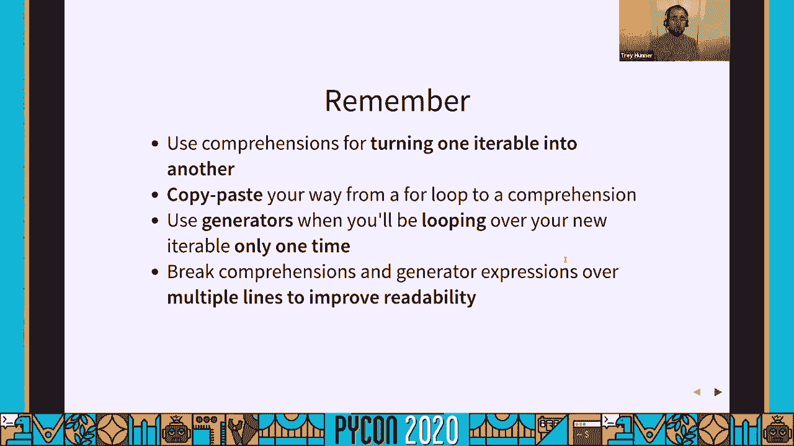
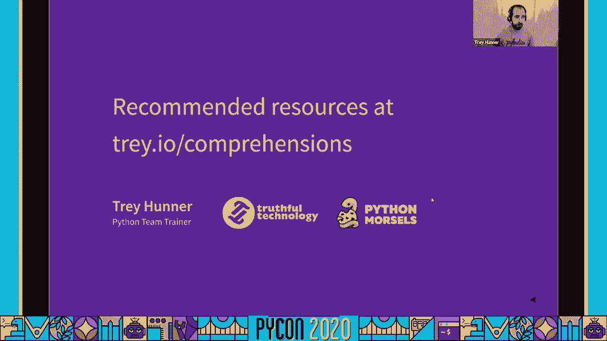

# P72：Talk Trey Hunner - Comprehensible Comprehensions - 程序员百科书 - BV1rW4y1v7YG

你好，我想分享我对蟒蛇特写的喜爱，这经常被新的蟒蛇程序员误解，所以我要在这里开始我的屏幕分享，好吧，我叫托盘，我经营一个蟒蛇技能建设服务，那叫蟒蛇点心，我每周做一次蟒蛇训练，我也为团队做现场训练。

帮助人们提高他们的蟒蛇技能，如果你有兴趣提高自己的蟒蛇技能，看看蟒蛇食物，如果你想让我远程教你的团队蟒蛇，现在欢迎你给我发邮件，所以我们先来谈谈之前的一些假设，我们实际上在这个谈话中潜入。

我假设你已经知道如何循环，蟒蛇工作，在语法方面，您已经熟悉了python基础知识，我也假设你还不是，我说的是这里，理解和生成器表达式，我真的希望在这次谈话结束的时候，尽管你会是列表理解的粉丝。

或者您至少可以考虑在代码中更多地使用它们，所以列表理解是解决问题的特殊工具，我们已经有一个工具来解决，那是为了循环，问题是把一个列表变成另一个列表，或者更笼统地说，呃，将旧的迭代器转化为新的迭代器。

通常是一个列表，但并不总是，但是列表理解的全部目的是要么修改元素，当您建立新的列表或筛选出一些元素时，或者有时两者兼而有之，稍后我们将看到这些例子，但首先让我们来谈谈蟒蛇的循环，所以蟒蛇是用来圈圈的。

允许我们遍历所有，当我们循环时，对每个项目都做一些事情，呃，我们可以把，如果其中的陈述，我们可以把打印电话，我们可以把任何我们想要的代码放在里面，蟒蛇的一个循环，对于循环来说。

一个非常常见的事情是把一个列表变成另一个列表，将旧列表转换为新列表 在其他编程语言中很常见，但它在蟒蛇身上尤其常见，呃，为什么这在蟒蛇中如此普遍，把旧清单变成新清单，其实有两个原因，我至少能想到两个。

如果我们想修改名单，我们在蟒蛇身上盘旋，Python，有点，呃，使我们竭尽全力去做这件事，如果我们想改变我们原来的列表，让它有正方形，我们需要索引，哪种蟒蛇是为了循环而没有的。

也就是说我们要么自己去找索引，使用枚举函数，有点尴尬，它也没有真正实现我们所期待的，因为我们要做的不仅仅是正方形，所有，我们的人数，但只有这些奇数的平方，所以我们用奇数平方，如果我们真的想去掉偶数元素。

同时保持我们列表中的奇数元素 并将它们平方，这样做的结果，这将是非常非常尴尬的代码，我们实际上可能不得不求助于一段时间循环，因为对于循环来说，如果我们在循环时试图移除物品，我们最后会不小心跳过项目。

所以在 python中不会看到这样的代码，这是一个很好的理由，我们不会经常修改旧的列表，我们经常在旧的清单上列出新的清单，所以这是一个很好的理由，嗯，还有一个很好很好的理由。

尽管我们不倾向于在循环列表时修改列表，至少除非我们，当然，python中的变量是指针，这意味着当你给一个变量赋值时，Python不会复制任何东西，它只是将变量指向您已经指向的对象，用不同的变量。

所以如果我们通过去掉数字3来改变我们的新列表，呃，我们也会改变我们的旧名单，因为这两个变量，新的和旧的，指向蟒蛇中完全相同的物体，他们指着引擎盖下完全相同的名单，变量是桶，但在蟒蛇身上。

这种世界的心理模式很快就崩溃了，Python的变量是对对象的引用，所以当我们修改一个列表，其他指向相同列表的变量也会改变，所以我们并没有改变我们得到的名单，我们倾向于复制名单。

我们把旧的单子复制到新的单子上，这是复制旧名单的一种方法，一个新的列表，把最后一个项目砍掉，我们这样做是因为突变，列出清单可能是个坏主意，如果有人指着那个名单，我们会让他们不高兴的，好吧。

把旧清单变成新清单，在蟒蛇身上 这是一件很常见的事情，实在是家常便饭，因为蟒蛇促使我们这么做，因为这样做通常是个好主意，这是如此普遍的事情，python核心开发人员实际上添加了一个特殊的语法。

只是为了把一个列表变成另一个列表，啊，而不是这个，这是我们在做这件事之前的循环，这种语法称为列表理解，这个列表理解与我们开始使用的 for循环理解是等价的，呃，这种理解是非常信息密集的。

尽管我们浓缩了 for循环中的四行代码，在理解中变成一行代码，所以让我们分解理解中的 for循环，看看这两个是如何比较的，我在这里强调了，这个循环中的五件事，变量名以绿色突出显示，新列表的变量名。

方括号以深红色突出显示，至少它们是这样出现在我的屏幕上的，循环逻辑是紫色的，我们过滤的条件是鲜红色的，呃还有我们实际上要附加的东西，新的名单是蓝色的，这里有同样的东西，呃在这里好吧，这是，我刚才说的是。

变量名是绿色的，方括号，循环，过滤器和我们附加在那里的东西，同样的东西出现在理解中，所有这些组成部分也都存在于理解中，只是我们没有重复变量名，我们其实不用打字，附录，列表的理解实际上是如此相似。

以至于你可以经常复制，把你的方法从 for循环粘贴到理解中，所以如果我们从这样的 for循环开始，我们可以复制方括号，呃，接下来我们复制附件，这是理解中的第一件事，呃，在那之后，理解的下一件事是四个。

在那之后 我们要把，如果在那里，这是你能理解的最后一件事，通过复制粘贴 从这个循环到这个理解，我们只是建立了一些等价的东西，所以这个铜工程师相当于我们开始时的循环，我们实际上不需要输入任何新的东西。

所以我像之前一样强调了五件事，但这是通用代码，这一次它是一种蓝图，只要您能找出如何以这种格式构造您的代码，你总是可以复制粘贴你的方式，从这个特殊的循环到这个理解。

我们已经看到了如何从 for循环中构建理解，呃，人们抱怨的最大的事情之一，当他们第一次了解这些东西的可读性时，所以我们来谈谈，呃，列表理解，他们把完全可读的东西，编码一个我们都明白的循环。

它们使它的可读性降低，我听到这种抱怨的主要原因，我不太同意，列表理解比 lops要紧凑得多，所以让我们来谈谈这种理解，如你所见，它们通常写在一行代码上，这就是使理解难以理解的原因。

这种理解减少了不必要的信息，但它的空白也比循环少得多，蟒蛇迫使我们缩进或循环，它迫使我们使用，空白，Python，并不强迫我们在我们的理解中添加任何空间，我们选择了这里，不理解，有三个部分，手术。

循环和条件，没有理由，这三个部分都必须用 python写在一行代码上，每当你有空位，托架，大括号和圆括号，呃，可以插入换行符 将一行代码分解成多行代码，在多行上中断理解可以使它们更具可读性，事实上。

我认为，在多行上分解理解几乎总是可读性的提高。使用一行代码来理解，正因为如此，我建议你从写下你所有的理解开始，在多条线路上，只有在使代码更易读的情况下，才可以将它们组合成一行，拥抱白色空间。

白色空间是你的朋友，不管是蟒蛇的压痕还是空间，你有策略地把断线放在你的列表中，理解，注意这个多行列表 会议，它实际上并没有为我们节省任何代码行，事实上，我们从 for循环中的四行代码变成了五行代码。

这个理解列表的理解并不是为了保存代码行，代码行不是衡量可读性的标准，典型的，列表理解是为了使代码更具描述性和可读性，当有人读到一个循环，如果你看看 python中的 for循环，很明显你在绕圈。

但这可能并不明显 为什么我们要循环，我们要做的是在每个循环中，当有人看到蟒蛇代码中的理解时，只要他们明白这种理解是什么，这个构造的作用是什么，很明显，一个新的名单正在创建，我们在翻阅一份旧名单。

我们正在做一个新的列表，这是一个特定的理解目的，当我们使用列表理解，我们对代码的意图做了更具体的说明，我们不只是在循环，我们在旧的名单上做了一个新的名单，所以我忽略了一些重要的细节，在理解的世界里。

我想看看其他一些方法，1。你可以事先列出你所了解的情况，我们继续讨论一些与理解相关的话题，所以这段时间我一直在向你展示一个列表 理解，有条件的，这些列表理解过滤掉不符合某个条件的项。

您也可以在没有这个的情况下编写列表理解，如果这里的陈述，我们根本没有过滤我们的名单，它在最后有相同数量的项目，我们只是在将每个项目添加到新列表中时 对其进行更改，所以我们的 for循环没有 如果。

我们的列表理解没有任何条件，注意你仍然可以复制，把你的方法从 for循环粘贴到理解，你只是没有一个如果，列表理解可用于筛选映射，这就是我所说的这种改变操作，或者我们之前看到的是映射和过滤。

我们只是把旧的价值观映射到新的价值观上，您也可以在这里的理解中添加多个循环，我们找到了一份名单，把它压扁成一个单一的列表，在理解中加入多个四个子句 可能会变得有点复杂，不过，要小心使用这个。

如果你要这么做，一定要确保你在多行中分解你的理解，也注意复制粘贴您的方式进入这些，行的顺序很重要，行中项目的矩阵必须排在第二位，四人组的顺序很重要，呃，理解不仅仅局限于列表。

在 python中也有设定的理解，列表理解 建立新的列表，集合理解 通过向集合中添加项来建立新的集合，就像我们会把项目附加到列表的末尾一样，也有字典理解，呃，列表理解生成新的列表，集合的理解。

集合形成新的集合，词典理解造就新词典，他们看起来有点不一样，尽管它们有点像一种既定的理解，只不过里面有个结肠，因为我们得说键值冒号，因为我们有键值和字典，与列表理解不同。

我几乎总是在多行中打破我对词典的理解，所以我真的不喜欢看到冒号在同一条线上，因为那四个条款，那只是个人喜好，虽然，许多其他编程语言在数组上都有映射和筛选方法，相当于我们在 python中的列表。

我们在蟒蛇里没有这个，但我们有地图和过滤功能，我想谈谈这些与理解的比较，因为你会看到这两个在 javascript中有时会用到，数组有一个过滤方法，他们有一个地图方法，几乎完成了。

与 python中的理解相同的任务，在红宝石阵列中，有一个选择方法和一个映射方法，在蟒蛇身上做同样的事情，这可能看起来像这个过滤器，这个带有 lambda函数的映射方法。

但是这在python列表中不起作用，因为它没有筛选方法，他们在蟒蛇身上没有地图方法，代替 python中的 map和 filter 方法，我们有一个顶级过滤功能和一个顶级映射功能。

我们有内置的过滤功能和内置的地图功能，我们需要把它们转换成列表来查看结果，综合是更干净的替代方案，这就是我们通常在 python中进行映射和筛选的方法，所以我们没有地图和过滤器，或者更确切地说。

我们有地图和过滤器，但是我们没有其他语言的映射和过滤器，相反，我们倾向于使用理解，我们已经看到了列表集和字典理解的语法，让我们看一些理解的例子，不同类型的理解，我很快就会看完这些。

但是你以后可以自己看这些幻灯片，列表理解最简单的用途之一是创建一个新的列表，从节点列表，同时对每个元素进行细微的修改，所以在这里，我们只是把一个列表中的一大堆单词小写，现在他们在一个新的名单上。

他们都很低调，在这个例子中，我们在做一些更复杂的事情，我们在检查每个单词是否是字谜，我们在检查这是不是其他单词的字谜，注意我们调用了一个函数，因为字谜更多的是描述性的，如果我们把对比线。

排序后的单词一等于，等于，把第二个词直接归类到我们的理解中，所以我们，我们用所有这些理解来过滤我们的话，只有字谜的单词，这不是一个理解，这里没有理解，这是一个循环，里面有另一个循环。

我们正在建立一个名单，内部 for循环看起来有点像理解材料，尽管我们可以把空行列表，新的或者更确切地说一个新的行列表，添加和复制粘贴我们的方式进入列表 理解，我把这个放在这里的一条线上。

我把这个放在一条线上的原因是，我们可以停在这里，但我们可以走得更远，我们可以把这个，然后我又说，像是复制粘贴的秘方，从一个循环变成一个理解，所以我们可以再次把整个事情复制粘贴到一个理解中。

我们拿到了空名单，四和我们附加的东西，所以我们先从附加的东西开始，我们会坚持四个，我们现在有了理解中的理解，这不是两个四的理解，这是理解中的理解，我真的这个有用，但是在您的代码中确实要谨慎地这样做。

内部的理解，理解并不总是提高代码的可读性，我认为，尽管在本例中 它实际上提高了代码的可读性，因为它很好，我觉得更有描述性，它看起来像一个列表，我们开始的时候，看起来有很多循环在进行，我们的结局。

看上去我们最后得到的东西，我们代码的形状类似于列表列表，列表理解，列清单，集合理解，做布景，字典理解，制作字典，只不过它们不叫生成器理解，它们叫做生成器表达式，他们为什么这么叫。

我不太清楚你说的这些条件中的任何一个，人们会知道你在说什么，从技术上讲，它们被称为生成器表达式，所以你可能想知道发电机是什么，这不是什么，如果你是蟒蛇的新手，你可能非常熟悉。

我不打算深入讨论发电机是什么，因为这是个很复杂的话题，我确实有另一个演讲，我可以推荐，在本演讲结束时，我将在资源中的链接中推荐，我来告诉你一些关于发电机的事情，所以发电机是唯一的用途，懒惰。

可迭代表达式和生成器 表达式是生成生成器的简写，我只想让你记住一件事，在演讲结束时的性别表达，也就是说，如果你在写一个列表理解，你只需要重复一遍你的清单，您应该使用生成器表达式 而不是列表理解。

所以我再说一遍，在我向你展示了生成器表达式的实际工作原理之后，呃，如果你写了一个列表理解，把方括号换成圆括号，就像这里，您创建了一个生成器表达式。

生成器表达式 生成生成器的方式与列表理解生成列表的方式相同，发电机很奇怪，尽管发电机不知道里面有多少元素，所以它们没有长度，你不能索引生成器，就像你可以用一个列表或一个元组，说真的。

你唯一能做的就是把发电机绕在上面，如果你在发电机上循环不止一次，如果我们在这里循环第二次，我们什么也得不到，是空的，第二次发电机是单一的，使用迭代器，零，直到10亿之前，这可能需要很长时间。

它可能会填满我电脑的内存，但这台发电机在这一点上实际上没有做任何工作，所以在我们开始检查发电机之前 什么工作都没有做，我们可以手动循环使用这个内置的下一个功能，生成器在运行时计算项，所以在这一点上。

只有前三项实际上是在这10亿长度中计算出来的，发电机是惰性的，他们只在给你之前立即计算值，所以你可以像列表一样循环生成器，但他们懒洋洋地在自己内部计算自己的价值，生成器是懒惰的，它们也是一次性使用的。

你唯一能做的就是把发电机绕在上面，但只有一次，因为当你第二次绕过发电机，是空的，发电机只能一次性使用，呃，一旦你完全控制了发电机，我们说它筋疲力尽，所以生成器是懒惰的，他们的唯一用途是懒惰，一次性迭代。

为了安全起见，你应该尽快接通发电机，连变量都不要做，理想的储存方式，立刻把它们绕过去，你越早找到发电机，就越不可能意外地绕了它两次，特定语法在 python中非常常见。

将生成器表达式传递给另一个 python实际上允许的函数，允许我们删除生成器表达式周围多余的圆括号，这可能是在蟒蛇中使用发电机最常见的方法，或者至少生成表达式，你创造了它，你马上把它翻过来，好吧。

所以你，我敢肯定 如果你以前没见过发电机，你可能还不清楚他们到底是什么，但我希望你，你至少要明白 在你创造了他们之后，你应该立即把它们循环起来，我想重新，强调我之前提到的关于生成器表达式的规则。

如果你在列一个清单，你只需要重复一遍你的清单，您应该使用生成器表达式，这避免了建立一个新的列表，只是绕一圈，再把它扔掉，如果您使用列表理解来建立列表，你只有一次机会，使用生成器表达式代替。

所以你不会浪费任何资源 建立一个临时列表，只有当你真正开始使用更多的内存时，这才是真正重要的，但这是一个很好的规则，我们来看几个例子，当您可能在这里的代码中使用生成器表达式时，我们正在浏览一系列单词。

稍微改变一下，我们在查字典，然后我们在最后用空间把它们连接在一起，在我们建立了他们的名单之后，我们可以把循环部分变成列表理解，我们已经看到，我们可以通过复制粘贴的方式进入其中，但是一旦我们这样做了。

我们可以更进一步，因为字符串上的 join方法接受任何可迭代的，它只在上面盘旋一次，所以我们可以把列表理解，直接进入联合通话，去掉那些方括号，瞧，我们做了一个生成器表达式。

因此生成器表达式直接传递到字符串联接方法中，这是一个例子，呃，有一点不太明显，它甚至与生成器表达式有关，我们在数字上循环，我们在总结他们的平方，这看起来不像是一个列表 理解现在，因为根本没有名单。

我们可以列个清单，我们可以列一张方格表，然后使用 python中的内和函数，这似乎有点傻，因为我们正在建立一个完整的列表 只是为了循环一次，但这让我们可以复制粘贴，很抱歉，我说我们在做一个列表。

我们在这里绕圈，但我们可以复制粘贴，从这个循环中进入列表理解的方法，因为它，你知道就像一个列表理解，附录的空列表，一旦我们做到了，我们可以去掉那些方括号，我们又做了一个生成器表达式。

我们把数字的平方直接传递给求和函数，我发现这个生成器表达式比我们开始时更有描述性，看上去我们实际上在做的，我们在总结，这些数字的平方，好吧，所以我们研究了理解，我们研究了性别表达。

我们还看到了如何将你的循环复制粘贴到理解中，但是你到底应该在什么时候使用理解，有没有一个不合适的时间使用理解，使用它是个坏主意吗，所以列表理解只适用于将一个列表转换为另一个列表，不要使用理解。

除了列清单，理解只能用于特定的，但是在 python中很常见 把一个列表变成另一个列表，呃，这里我们调用打印函数，呃，在理解中，我们最后打印了所有这些数字，但我们也创建了一个非值列表，好吧。

我们把这些东西打印出来，我们实际上并不关心非价值，我们关心的是打印的副作用，不要在理解中调用打印，事实上，不要在理解中加入任何副作用，即使你在列一个新的名单，理解只能用于把一个列表变成另一个列表。

不适合打印 for循环很适合在这里打印，我们正在浏览一个元组列表，并用它们制作一本字典，这实际上看起来是一个很好的理解用途，把这个循环起来，把它变成一个理解，但是塔架实际上。

最近会告诉你 这是一个不必要的理解，你知道抱怨，因为这不是获取元组列表的最佳方法，或者任何可迭代的元组 并将其转化为 python的字典，最简单的方法是 dict构造函数，迪克被做成蟒蛇。

它是专门为这个精确的任务而设计的，把元组列表之类的东西变成字典，呃，同样，我们在这里得到了一个列表理解，这是在文件中的行上循环，并将它们放入一个新的列表中，呃，每当你看到这样写的列表。

在一些没有做任何修改的东西中，它没有做任何过滤，这应该是一个危险的信号，列表构造函数做了完全相同的事情，就像解构主义者一样，在我们拿起文件之前，把它放进列表里，它会为我们做循环，把档案里的台词告诉我们。

如果我们能找到线索，我们可以把它交给名单，我想说列表构造函数通常是最惯用的方法，建立新名单的最蟒蛇方法，而不是列表理解，但特别是在档案上，实际上有一个读行方法，有些人可能会更喜欢这个。

我个人更喜欢列表构造函数，因为很明显我们在最后得到了一份名单，尽管读台词不一定能和我说话，它没说你能从中得到一份名单，呃，就像有些呃，在 for循环中做事情的更简单的方法，例如使用理解。

有时也有更简单的方法来使用理解，例如，列表构造函数，dict构造函数，好吧，所以我在这里回顾了一下我们刚刚经历的一切，我希望这些幻灯片可以作为某种备忘单，我要快速浏览一遍，但你可以稍后再看。

所以这是一个for循环，循环在一个项目列表上，执行一个操作 并将这些项固定到一个新列表中，每当你用这种格式写了一个 for循环，你可以用复制粘贴的方式理解，这个循环相当于这个理解。

这个 for循环做的事情和以前一样，只是我们要检查一个条件来过滤列表中的项目，每当你有一个循环这样写，你可以复制粘贴到这个列表中，理解，理解相当于那个循环，这是一个检查条件 并建立，键值对字典。

这个循环相当于这个理解，你几乎可以用复制粘贴的方式进入这个，只不过这些方括号会变成冒号，在理解中有，如你所见，这是一个嵌套的for循环，它建立一个新的列表，我们把一个列表压缩成一个列表。

每当你有这种格式的代码，你可以在一个新的理解中复制粘贴，这个理解有两个，里面有四个条款，请注意，两个四个子句的顺序与它们在循环中的顺序相同，如果你没有过滤或改变你理解中的任何东西，而不是用理解。

考虑使用列表构造函数，我觉得这个更有可读性，很明显我们在做什么，我们复制了一份名单，列出一个新的清单，这个简单的例子，现在是使用列表构造函数的时候了，如果你在列一个清单，你马上就把它绕了过去。

您还应该考虑将副本粘贴到生成器表达式中，只要你只是绕着它转，它是如此的基因表达，它们看起来很像列表理解，但他们很懒，他们很懒，这意味着，他们不做任何工作，直到你开始循环他们，你只能绕过它们。

一旦它们是一次性使用间隔，所以我们在这里得到的好处是不用创建一个不必要的列表，立刻把它扔掉，我要你记住，您可以使用列表理解在区间上循环，同时建立一个新的列表，您可以使用集合和字典理解来转换旧区间。

变成一套新的或新的字典，如果你的 for循环是用正确的格式写的，你也可以复制粘贴你的方式 从一个 for循环到一个理解，所以你对循环已经很熟悉了，使用 for循环编写代码，然后用复制粘贴的方式进入理解。

如果你发现自己做了一个新的清单 只是为了循环它，一旦您应该考虑使用生成器表达式 而不是列表理解，另外，请记住在多行代码中打破你的理解，提高代码的可读性。

空白是你的朋友，呃，我给你的最后一件事是资源页面，在那里我整理了其他的谈话，文章，教程，以及我在理解上找到的其他东西，生成器和相关主题 您也可以在该页面上找到我的联系方式。

