# P79：Tutorial Husni Almoubayyed - Effective Data Visualization - 程序员百科书 - BV1rW4y1v7YG

感谢你加入我的这篇关于有效数据可视化的教程，我叫胡斯尼 穆巴伊德，我是卡内基梅隆大学的博士生 研究宇宙学，我的大部分工作都是用 python编程，数据可视化已经成为我特别感兴趣的东西。所以我真的很兴奋有这个机会展示这个教程，在本教程中，我假设您熟悉标准 python语法，以及基本的 python编程，用 python或其他类似的语言进行基本绘图，在本教程之后。你可以期望扩展你对可能发生的事情的知识，当谈到蟒蛇的可视化时，并有一些实际经验可视化不同行业的不同类型的数据，您还可以期望建立基本技能和可视化高维数据，通过统计可视化研究数据。创建交互式图表和自信地设计图表，有效地传达您的结果。

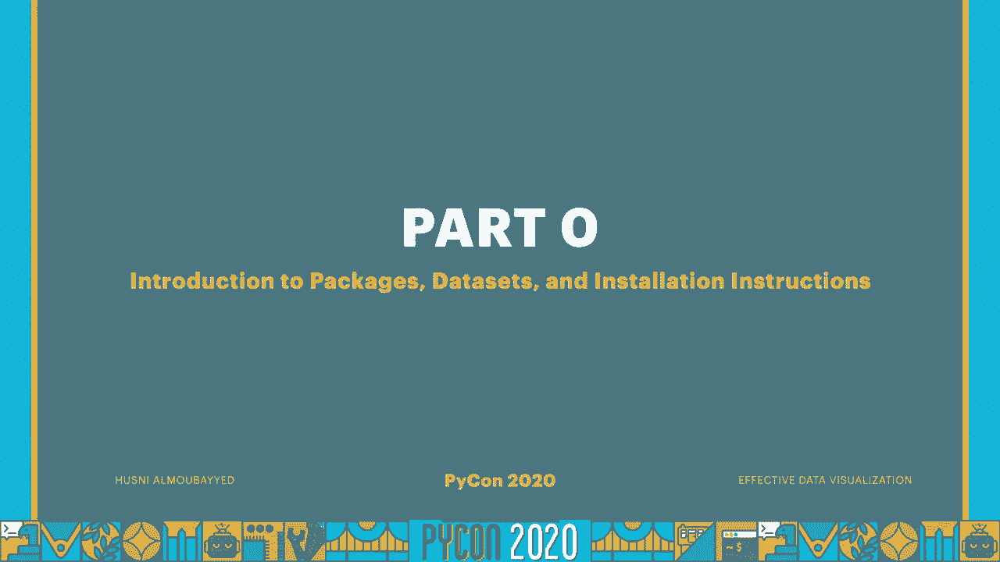

在我们开始之前，我们将在本教程中使用，它可以做很多事情，而且范围很广，不过，这可能有点难处理，有时海运是建立在matplotlib之上的，这样做更容易，代表刑罚数据，它是一个有用的库。可以处理表格数据或时间序列数据，Numpy是世界上最大的蟒蛇图书馆之一，几乎可以帮助我们对数值数据做任何我们能想到的事情，易于使用的 api，接下来，让我们看看一些数据集。这里列出的前六个将很容易地从 c one或 scikit learn导入，这是一组关于钻石的数据，关于50年代航班的数据集，显示每月乘客人数，三种鸢尾花的特性数据集，它是由四个不同的数据集组成的数据集。所有的平均值和标准差都是一样的，但它们看起来都截然不同，最后一组手写数字，我们还将使用股票市场的财务数据，我们稍后会看到，最后一组数据显示，美国每个县都有19例确诊病例，你可以运行这个手机。

假设你安装了 pip和 jupiter，如果您没有 pip安装说明 可在此链接获得，然后你可以运行皮普，安装笔记本 安装木星，另一种选择是安装水蟒分发器，伴随着皮普和木星，如果你对此有意见。你可以去这个小链接，这将是一个连接到共同实验室的链接，这个笔记本的 google collab托管版本，它可以在云中运行，你就不用担心，最后我想把这些，我打开的每个笔记本顶部都有一些进口货。所以我会在这里解释，第一个将同时导入 numpy和 matplotlib，这里的第二个单元格将首先导入海运，把它的风格设置成一个黑暗的网格，这些设置会影响到每一个，呃。我们用 c或 matplotli绘制的每一个图，它会设置它，它的上下文到笔记本上，并将其字体大小增加50%，最后它将设置我们使用的颜色，一组色盲友好的颜色，最后第三个细胞。

这里的第一个命令是改变 matplotlib的后端，变成更高分辨率的选项，所以在我的苹果上，它会把它固定在视网膜上，然后这个最后的命令基本上会改变每一个情节的数字，我们让它比标准格式大一点，地段。所以现在我们准备开始。
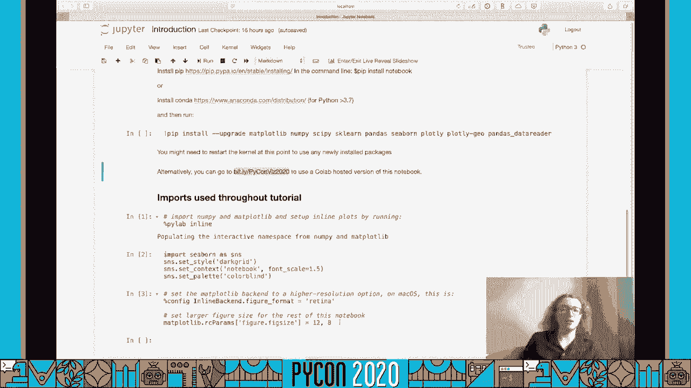

因此本教程分为五章，这五章基本上是人们将数据集可视化的主要原因，一开始，二是密度估计，或者本质上更多地了解生成数据的过程，三是可视化高维数据，套，降维，四是与数据交互，最后五个是通过密谋来交流。
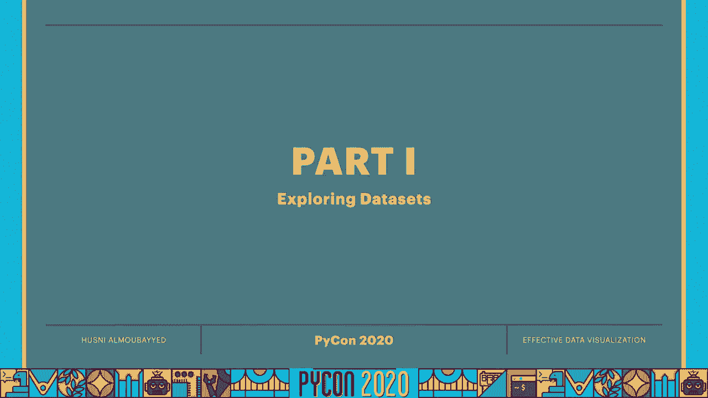

人们将数据可视化的原因 首先是为了探索数据集，当然可以，每当我看到一个新的数据集，我做的第一件事就是把它画出来 看看它看起来像什么，所以这是我们今天的第一个话题，数据探索，所以我们先看看安康的数据集。这个数据集由四个不同的数据集组成，每一个都有相同的前两个时刻，但它们看起来完全不同，还有呃，这就是我们今天要看到的，所以我们首先从海运装载，然后我在这里做什么，我在让西博恩为我描述，每一个数据集。对于 seaborn的描述 意味着它返回一些关于该数据集的简单统计信息，让我们看看这看起来像什么，好吧，所以你可以看到每一个数据集，我们有11个数据点，平均标准差和所有的基本数据基本相同。不一定是四分位数，但最初的两个时刻，平均值和标准差肯定是一样的，所以真的，我们在这里能做的最简单的事情是一个散点图，因为这些和 COM数据集都是二维的，有 x和 y，所以让我们看看。

如果我们能绘制出第一批数据集的 x坐标和 y坐标，在一个分散的地块上，所以我们要告诉希博恩 x是标记为 x的那个，y就是标记为 y的那个，然后数据将来自，数据集是第一个数据集。让我们看看当我们把它画出来的时候是什么样子，好吧，所以11个数据点以 x和 y的形式增加，所以看看这个，它看起来像是 x和 y之间的正相关，所以，我们要做的第一件事就是，使其符合线性回归模型。我们可以简单地用线性回归模型图，还有一些海上的阴谋，不要遵循 matplotlib图形大小设置，对于那些我们可以添加一个高度参数，我们加一个8的高度，这就是它在线性回归模型中的样子。阴影区域是这个匹配的标准差，所以这适用于第一个数据集，为什么我们不把第二个数据集，线性回归模型，第二个数据集显然与第一个数据集有很大不同，线性模型是行不通的，它实际上看起来是二次方的。

西摩让我们可以很容易地进行二次拟合，通过使用顺序参数，所以如果我们用一个二阶线性回归模型，嗯，我们看到这实际上非常适合它，有趣的是 第一个和第二个数据集，即使一个是线性的，第二个是完全二次曲线。它们有相同的平均值 相同的标准差，嗯，所以策划很重要，因为要知道这两个数据集，在没有绘制它们的情况下真的是不同的，只看统计数据，嗯，所以让我们在第三个数据集中再做一次，好吧，所以这个数据集显然是线性的。有一个异常值，让我们回到1的顺序，哪一个是默认的，所以我们不需要输入，让我们看看这看起来怎么样，所以这种作品，但它很大程度上受到这个离群值的影响，这对于由最小二乘误差度量拟合的线性回归模型是正常的。这就是这里发生的事情，那又怎样，如果我们想要一些不受离群值严重影响的拟合，我们可以加上，我们可以用健壮的，呃，这里的论点，并将其设置为真的，这将给我们一个强大的，嗯，我也会把置信区间设为零。

否则计算置信区间可能要花很多时间，所以让我们看看这看起来如何如此完美，它忽略了离群值，在这一点上 我们真正想让它做的是，并对线性数据进行线性回归模型拟合，好吧，所以现在让我们看一个不同的数据集。这是虹膜数据集，我们可以用和装车完全一样的方式装车，呃和 com的数据集只是说虹膜 而不是和 com um，好了，把它装起来，再让我们看看，我们可以说虹膜圆点头，这将向我们展示虹膜数据集的前五行，好吧。原来是这样的，这里有四个维度 是简单的长度，简单宽度，花瓣长度和花瓣宽度，有三个物种在这里并不明显，但虹膜花总共有三种，和，假设，我们想做一个踏板宽度和花瓣长度的散点图，我们来做点散射图。然后 x是花瓣的长度，y代表踏板的宽度，嗯和嗯，一个非常有用的论点是色相，这将用不同颜色的三维颜色给它们着色，依照第三维度，在这种情况下，我们将使用物种来给它们着色，代表三个不同物种的三种不同颜色。

然后我们会说数据应该来自虹膜数据集，让我们看看这看起来怎么样，所以我们可以画出踏板的长度和踏板的长度，尝试将三个线性模型拟合到三个不同的物种，就像我们上面所做的那样。
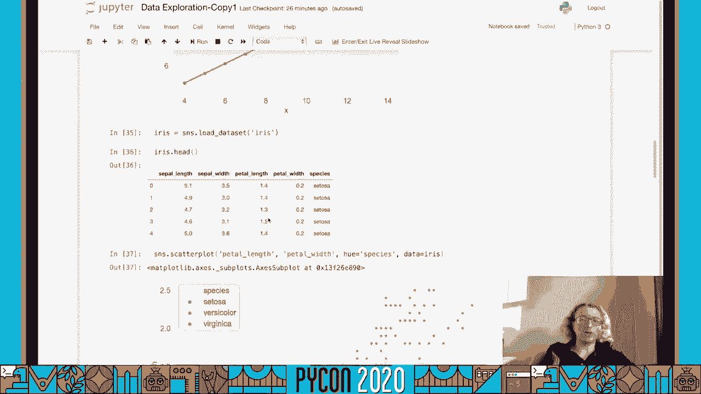

但试着把三个不同的模型拟合在同一个情节上。

好吧，所以我们可以再次使用航海图，基本上我们可以继续复制这些论点，让我们添加一个高参数8，看看这看起来如何，对，现在一个分散的地块可以帮助，但是什么，如果你想知道。关于 x轴和 y轴的边缘分布的更多信息，以及一个散点图，我们可以用赛伯恩的联合图，把这些参数复制到，除了胡，看看这个是什么样子，好吧，所以现在，我们有花瓣长度和花瓣宽度的直方图，以及散落的地块。我们不必坚持直方图，实际上本教程的第二部分将更多地讨论直方图，但它也会讨论核密度 估计，你可以使用核密度估计在一个联合图，通过将联合图的类型指定为 kd，这会给我们一些看起来更好的东西。尝试估计 x和 y以及关节分布，好吧，所以这个很有用，但是我们真的要对四维数据集的每两个维度都这样做吗，如果我们有更多的东西，嗯，我们一定要重复这个过程吗？

西摩实际上有一个非常有用的绘图函数 叫做配对图，那就是得到一个情节，每人两对，每一个二维组合在一起，作为一个联合图，并返回到这里，我们只是想给它一般的虹膜数据集，只需指定高度。让我们也把色调添加到颜色中，每个物种都有不同的颜色，所以在这里我们要说的是，让我们看看这看起来像什么，可能需要一段时间，从那以后，它在同一时间策划了很多不同的阴谋，所以我们有四乘四的图。每个图显示两个维度相对于另一个维度，在对角线上 这些尺寸的分布，所以，例如，这是简单的长度分布，这个是踏板的宽度和踏板的长度等等，所以这对于观察所有的维度对是非常有用的，彼此密谋。我们还应该注意到这是对称的，所以这个情节和这个情节是一样的，唯一的例外是这辆车的踏板宽度，在 x上的花瓣长度，而这辆车在 x上有花瓣宽 在 y上有踏板长，好吧。

所以我们现在讨论了很多关于绘制数值数据的问题，但是这条海上航线的分类数据呢，也给了我们一个简单的标图函数 叫做范畴图的猫图，在这里假设我们想要 y轴上的一些数字，所以像踏板宽度。然后在 x轴上有一个明确的东西，例如物种，我们知道他们只有三个人，我们必须明确我们想要什么样的分类图，这么说吧 我们想要一分，明确的情节，所以只是一个点，以及标准差，然后数据将来自虹膜数据集。让我们看看这看起来怎么样，和预期的一样，我们在三个不同物种的踏板宽度中心都有点，然后我们有一个小棍子对应于标准差，让我们指定一个高度参数，把它做得更大更清楚一点，好吧，所以它看起来像这样，嗯一分。分门别类的情节信息不多，更有信息的东西叫做小提琴情节，和，这将向我们展示花瓣宽度的分布，对于同一地块上的三个物种中的每一个，所以我们可以看到塞奥萨在本季度的表现更加集中，而弗吉尼亚是。

一点二也许和两点七，好吧，第一个是说让我们加载航班数据集，然后绘制出乘客数量作为函数的线性模型，把它们按月分开，嗯，所以每个月都用不同的颜色绘制，以及每个月的线性模型。然后画出钻石的价格作为不同颜色胡萝卜的函数，等级和不同颜色，数据集里有很多数据点，所以一定要利用这里的绘图特征，我给你一些建议，试着想办法改变标记的大小，把它的透明度或阿尔法变成一半或更少的东西。然后试着在 x值上添加一些抖动，否则很多钻石的 x值都是一样的，同样的胡萝卜，所以现在还不太清楚，所以会有很多点在一起，接下来的事情就不太清楚了，最后是第三个，运动是说，再次从海上装载泰坦尼克号数据集。再做一个框图，为不同乘客支付的票价，在 y轴上的泰坦尼克号上，然后是两个不同的类别，一个人是活了下来还是没有活下来，在 x轴上。

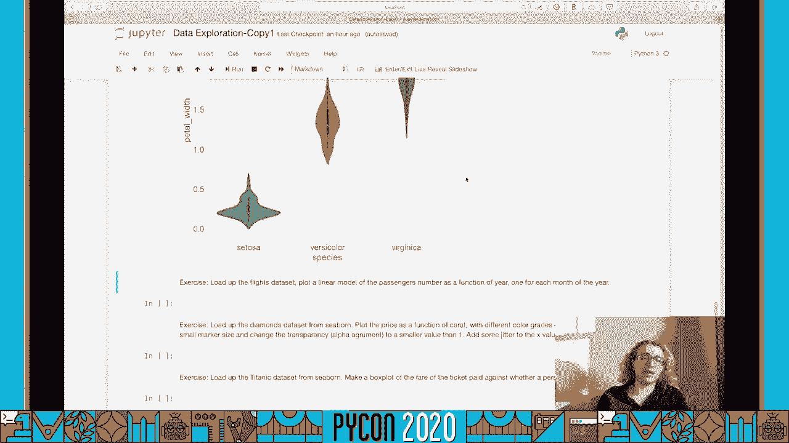

好吧，所以呃，所以第一个装载飞行数据集的人，把它装上去，就像我们对艾瑞丝和安斯科姆做的那样，再看前面的五行，看看它是什么样子，所以它有三根柱子，年月和乘客 我们想在 x轴上画出年份，是的。乘客人数作为年度函数，如果你是月，每个月都要分别着色，也可以每月单独安装，然后我们在这里回归到假，如果我们运行它，它不会显示线性拟合，所以让我们把它移除，但是如果你想要一个没有线性拟合的 lm图。这将是跳过这种回归拟合的方法，让我们运行它，看看我们得到了什么，好吧，所以这些看起来确实很线性，所以我们有一个线性回归，适合一年中不同月份的乘客人数，作为一年的函数，好吧，呃，让我们看看这看起来如何。现在我们把价格绘制成胡萝卜的函数，然后呃，让我们在这个地块上有一个相当大的尺寸，因为有很多数据点，我们用的记号笔是一个点，然后我们在 x方向增加一些抖动，在 x方向加上一些随机噪声，呃。

只是为了不让所有的东西都排成一列，然后在这里散布关键字，是，我们基本上是在告诉海博恩把这个论点，到 matplotlib中的基函数，我们要求它通过一个三点的阿尔法，这将使点数据点更加透明。然后在这里我们把我们的情节限制在0到4之间的胡萝卜，两个价格在二十两万美元之间，运行这个，我们得到了一个阴谋，好像是这样，好吧，所以我们可以看到，例如，绿色的东西比呃便宜，粉红色的东西。如果我们看这里 我们看到绿色是 j，而粉色代表的是无色钻石，而 j对应于一点黄色的钻石，所以这真的很有意义，好吧，最后的数据集就是泰坦尼克号，所以让我们把它装起来，看看它是什么样子。我们基本上有很多关于泰坦尼克号乘客的信息，他们是否幸存下来，关于他们的不同信息，但我们只想看看它们是否在 x轴上存活，所以我们在这里用了一个猫的情节，就像我们用小提琴和点情节一样。

但在这里我们用盒子做实物，这就是我们想要的一个盒子情节，呃，我们想要 y轴上的公平页，以及它们是否存活在 x轴上，让我们看看这看起来像什么，所以现在我们可以看到一些关于这个的信息，一些观察结果可能是。那个，为幸存乘客支付的平均价格，比那些没能活下来的人要高，显然这个问题有更多的维度，这可能是也可能不是一个很好的生存预测，但是在一个数据集中 将不同的东西可视化总是很重要的，如我们所见。最后让我们讨论不适合投射的数据，x和 y坐标，其中一个例子就是角数据啊，我们需要极坐标之类的东西来投射它，或者地图数据，我们需要像商场范围内的投影这样的东西来投射它，在我们开始之前。我们先熟悉一下抖音的剧情，所以抖音情节就是情节，我们的计划基本上是用箭头，所以我们不仅仅是在绘制数据点，但我们也在绘制数据，但它也有方向，我们可以通过做 plt来调出抖音上的帮助，抖音带两个问号。

我们得到了这样的东西，也就是说抖音可以用 x和 y来定义箭头的位置，也定义了 x和 y方向的箭头方向，所以让我们看看这意味着什么，假设我们想要，嗯，然后你就是1，v就是1。最后我们要使用 matplotlisubplot，并在上面添加抖音情节，这个头部长度和头部访问长度基本上隐藏了箭头，我们以后会用到的，但让我们把它们拿出来看看 这看起来怎么样，呃，就像现在这样。因为 u和 v是一样的，它指向x轴和y轴之间的4。5度，如果我们把这两个参数加起来，箭头就不会出现，现在假设我们要使用极坐标，代替 x和 y坐标，我们可以简单地将极性等于真参数添加到 add子图中。但这将变得比那复杂得多，因为这里的 x和 y不再是 x和 y，它们实际上是西塔，角度和 r，半径，是二维的两个极坐标，现在我们假设角度从0到2π，所以三百三百六十度，我们的半径会从0到1。

这些是用来计算坐标变化的方程，从 x和 y到 r和θ，所以现在 u是θ的余弦，然后 v是θ的正弦，这些项都是零，但我把它们留在这里是为了完整，所以让我们看看现在是什么样子，好吧，所以这里有个螺旋。我们得到这个的原因是，这就是发生在这里的事情，我们的半径是一致的，从0到1的位置，但角度也从0变成了2，PI，所以它的温度是360度，所以现在，如果说，但也要全部指向中心。现在你可以注意到所有这些棍子都指向中心，所以我们唯一需要做的就是，而不是让半径从零到一的线性间隔，呃，我们就这样吧，看看这看起来怎么样，所以我们用它得到了径向棒，但是让所有的棍子从一个半径开始。所以当我说水平的时候，我是说水平的，呃都指向左边或右边，嗯，好像这是一个 x维，您可以使用 add子图中的参数投影来完成此操作，同时保持所有的木棍水平，但要确保这些木棍横跨整个空间。

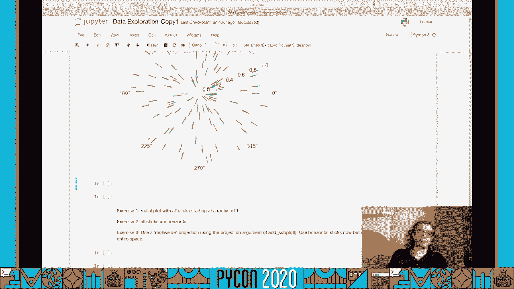

但现在所有的木棍都是从1的半径开始，所以我们可以把 r改为1 然后再运行一次，这就是我们想要的，所以让我们先把它改回来，现在要做的是，我们把u设为1，v设为0，它起作用的原因是记住你是什么。嗯控制 x方向，它控制着 y的方向，最后我们要用黑白投影，所以不是极性等于真，假设，预测，让我们看看这看起来像什么，所以这种作品，但所有的数据都是，这是两毛五，所以我们能做些什么呢。所以我们注意到θ是从零开始的，但这里的角度是负180度，所以一个修复的方法，把零点变成负圆周率，我们真的不需要这个了，半径从0到1，但实际上应该是从负1到1，既然也想去下半部分，所以让我们假设负1对1。看看结果如何，所以这就是我们所有的数据探索，第二部分是密度估计。

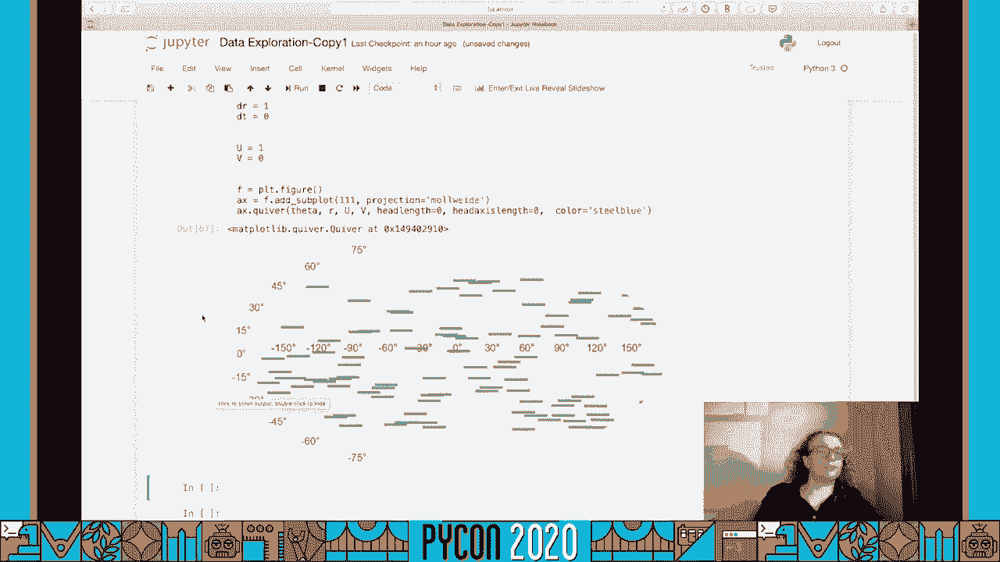

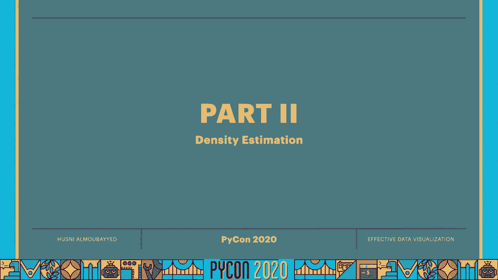

好吧，现在让我们继续讨论密度估计，所以在很多情况下，你绘制东西，试图估计产生数据的分布，我们将更具体地讨论非参量密度估计，我们将讨论一些如何做到，参数密度估计，最简单的方法就是，把数据的直方图。所以我们先从这个开始，现在让我们使用虹膜数据集，作为提醒，它看起来像这样，尤其是现在让我们看看这个样本长度，正如我提到的，我们能做的最简单的事情就是取数据的直方图。我们可以很容易地使用 matplotlib来做到这一点，我们得到了这样的东西，重要的是要注意垃圾箱的数量真的会有所不同，当谈到直方图时，所以让我们再做一次。使用 matlab中的子图绘制成彼此相邻的直方图，一个只有五个垃圾箱，一个有五百个垃圾箱，让我们看看这看起来像什么，所以我要在这里画出我们数据的直方图，然后说五个箱子，然后我还要把直方图标准化。

密度到真，然后我会在这里做同样的事情，但现在垃圾箱将达到500个密度 将是真实的，让我们看看这看起来像什么，所以也许500人太多了，无法想象，我们先做一百个，好吧。所以你可以看到这两个直方图看起来很不一样，让我们更深入地了解直方图的含义，所以这个直方图，例如，是说，周围，10%的续集长度在7。1到7。9之间，三点左右，8%的续集长度在5。8到6。5之间。然而我们可以看到续集的长度分布在右手边有很多变化，所以让我们进一步研究直方图的数量，以及这如何影响密度估计的准确性，所以基本上会有一个偏差和方差的权衡，我的想法是，嗯，如果你有这样的直方图。在上面加一个数据点，在只有一个垃圾箱的极端例子中，看起来不会有太大不同，例如，如果我们加上萼片长度，对直方图没有任何影响，右手边的直方图，如果我们在某个地方加上一个样本，就会对这个直方图产生影响。

这意味着左边的直方图有很低的方差，右边的直方图有很高的方差，但也有我们必须调查的偏见，所以左边的直方图与任何数据点都不匹配，所以它与数据的真实形状并不匹配，很有偏见，而右边的直方图有很低的偏差。因为它指定了每个数据点的密度，所以它基本上是零偏差 但方差非常大，而左边的直方图有很高的偏差 但方差很低，如果我们算算，然后我们得到这个错误的期望值，方差之和，平方偏差与数据点的数量成反比。这是有道理的，如果你有比直方图更多的数据点，你的直方图就会更准确，但它会放大到负三分之二的次方，哪一个，是一个具有多个数据点的缓慢缩放，所以这就提出了一个问题 我们能做得更好吗，答案是肯定的。我们可以在核密度估计方面做得更好一点，所以用核密度估计代替仅仅绘制直方图，我们要把每个数据点变成一个内核，内核类似于高斯函数或者盒子，或者类似的东西，嗯，它必须满足一些条件，也就是说，它是积极的，确定。

它是对称的，然后它总结为一个，这意味着我们可以用它作为概率分布，所以，让我们看看当前数据集的核密度估计量是什么样子的，我们可以用海运点阵图，然后我们输入数据看看，所以这可能比我们在这里看到的要好一点。作为一种预测产生数据的分布的方法，它可能更有效，但是我们在选择内核的宽度时也会遇到类似的问题，例如，选择标准差，高斯核的情况下的高斯，现在使用海运，我们可以指定内核的带宽，你总是可以尝试不同的东西。看看什么看起来更合理，作为估价师，真正的密度，但我们仍然有相同的偏差 方差权衡，唯一的区别是核密度估计量的预期误差，因为我们选择了合理的带宽，小于直方图的预期误差，不幸的是。我们真的不可能比核密度估计器做得更好，因为它是提供给我们一个极大极小误差的估计量，尝试做一个核密度估计，现在尝试绘制二维 kde图，所以无论是花瓣的长度还是花瓣的宽度，呃。

让我们先看看这些在散点图上是什么样子。

呃，使用 cone kde图，就像我们以前一样，但现在传递新的数据，它看起来像这样，这告诉我们这里和这里的点是顶点，在花瓣长度和花瓣宽度的接合密度上，最后一件事，一个很好的海运功能 就是这个图它的作用。让我们，让我们做一个花瓣长度分布的图，它真正的作用是做一个直方图，上面覆盖着一个 kde图。
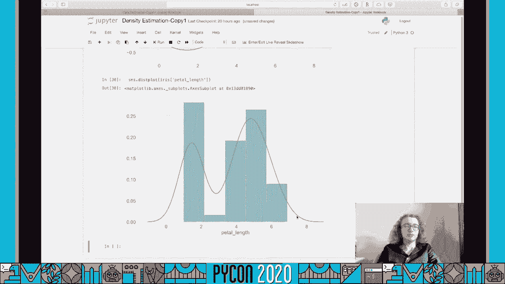

所以你马上就能把两者都画在同一个情节上。
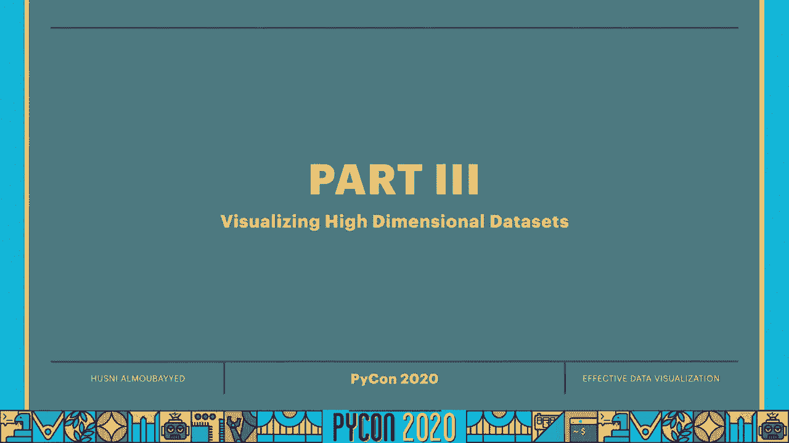

好吧，让我们来谈谈高维数据集的可视化，减少高维数据集的维数，所以这部分我们需要这些进口货，我会在他们上来的时候谈论他们，但让我们先进口它们，其中之一就是输入的负载数字，我们基本上是在加载一组手写数字。你可以把这个数据集当作一个字典，所以利用关键图像和关键数据，让我们看看我们得到了什么，所以我们得到了一个8乘8的图像，然后是一千七百九十七个样本，这些数据基本上就是这些展开的图像，所以8乘8到64。然后我们有64个像素，1797个样本，所以首先你要熟悉数据集，我们画一张照片，它看起来像什么，所以我们可以使用 matplotlim shaw函数，让我们把第一张图像绘制出来，看看它看起来像什么。如你所见 这是个手写的零，然后你可以看其他图像 只是为了熟悉它们，这是一个五，显然这是一个三等等，接下来的问题是，我们需要64个不同的维度，只是为了编码一个事实，这是一个三个的图像。

我们能不能用少于六十四维的，我们将讨论两个，减少数据集维数的两种不同方法，第一个是主成分分析，或 pca和浆糊，PCA，它的基本作用是，它将数据点投射到轴上，使方差最大化，嗯，为了理解这意味着什么。我们呃，使用一些非常简单的数据集，让我们创建一个，假设它是二维的，x轴是由0到9之间的点组成的线性组合，假设从0到9有10个，那么 y也是一样的，所以从零到九十分，如果我们用散点图来绘制，就会变成这样。所以对角线上有10个点，在 x和 y中都是从零到九，所以问题是，你真的需要二维来理解所有这些点吗，我们能不能用一维，所以这些点可以投射在这个对角线上，从对角线可以看出，把二维数据集的维数减少到一维。就像其他灵媒一样，使用它的方法 首先是初始化它，然后我们将使用一个组件，意思是我们想把它缩小到一个维度，然后我们要通过做 pca拟合变换来拟合这个 pca，然后给它我们的数据集。

它是一个由 x和 y组成的数字数组，然后我们要把这个转换到，让你看看这个应该是什么样子，如果我们运行这个得到组件，所以，我们就能绘制出，为了确认组件应该有十个数据点，然后策划这个。我们用 Matplot的嘴唇，分散地块，然后我们要画出 x轴上的分量，只有 y轴上的零点，看看这看起来像什么，不出所料，我们基本上把这些数据点投射到对角线上，为了确认两个数据点之间的距离，二的平方根。哪一个是距离，两个数据点之间的对角线距离，所以我们得到了我们所期望的，我们能够将数据集的维数从2减少到1，要了解更多关于pca的信息，就像超出本教程范围的一点，您可以查看这些资源。或者从pca中获得一些很酷的可视化效果，更多的了解它，就像我现在用 pca一样，把这个假数据集的维数从两个减少到一个，试着用它来减少数字的维数，从六十四到二的数据集。

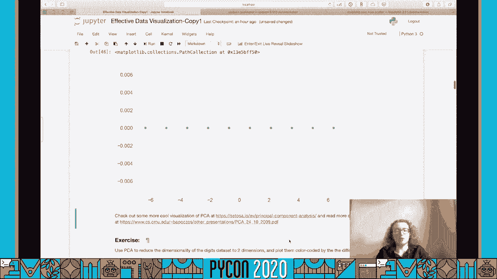

好吧，欢迎回来，所以为了解决这个问题，让我们像刚才那样处理假数据集，所以初始化一个有两个组件的 pc类，然后我们的组件将再次成为一个合适的转换，现在我们要用数字θ，我们再来一次。使用剪贴画散点图来绘制组件，所以 x分量会，我们可以把它们取出来，每行的第一列，然后，y分量，然后基本上得到不同类别的颜色编码，我们用 c表示颜色，然后这是目标数字，所以这基本上是告诉你，哦。这个图像实际上是一个零，或者这个图像实际上是一个人的，因为会有很多人，把每个人的能见度降低到一半，如果你愿意，你可以玩这个，稍后我们会讨论颜色，不过，我们还是用彩色地图吧。所以让我们从 matplotlib得到一个彩色地图，这个，我在问马特普勒夫，我想要十个，我们稍后会在本教程的交流部分讨论颜色，所以让我们看看这看起来怎么样，我们加一个色条，基本上哪些数据点是，哪个数字。

好吧，所以在这里我们可以分离一些数据点，例如，大部分的零都在这里，大部分都在这里，四人组的大部分都在这里，以此类推，所以我们可以把它们分开，把很多信息编码成二维 而不是64，好吧。现在我们来谈谈 pca的失败，基本上在什么情况下会失败，所以一般来说 如果你有一个非线性的数据集，因为这是一个线性的方 法，其中一个经典的非线性数据集是，是一个三维瑞士卷。所以让我们试着用 pca来减少3的维数，二维瑞士卷成二维，所以在这里我们要做一个瑞士卷，制作我们之前进口的瑞士卷套路，然后我们把瑞士卷分成五组，这基本上可以帮助我们更容易地想象它。然后我们基本上可以知道我们的 pca是否成功，所以如果瑞士卷基本上展开，我们看到了不同颜色的条纹，呃，集群，让我们看看如果发生这种情况，你不必太在意，因为集群尤其超出了本教程的范围。

所以我们继续在这里做集群，然后我们要用马特思嘴唇，把这个三维的瑞士卷绘制成三维的，我们首先要初始化一个图形对象，然后我们会问马特·波利布，把这个数字变成一个三维的，我们基本上只是决定从哪个角度。我们基本上想从，我们基本上是在二维屏幕上看到三维的东西，你可以试试这个看看它是如何影响图形的，但我发现这个角度很适合这个瑞士卷，所以诀窍是，如果你想要拼图板或者海运什么的。基本上是用不同的颜色绘制不同的数据集，您只需迭代绘制这些数据集，所以在这里我们迭代绘制数据点，与特定的标签相匹配，这些标签基本上就是那些，然后我们说我们需要 x分量 然后 y分量，然后是 z分量。如果我们运行，我们得到了瑞士卷，现在，我们看看，我们实际上可以把瑞士卷的维数减少到二维，使用主成分分析，就像我们之前做的一样，我们将使用两个组件，我们要把这个和 x数据点匹配起来，一次又一次。

x数据点是从瑞士卷中创建的，然后再画出每个星系团的 x和 y分量，利用海上散布图，如你所见，这不是真的有用，很多点看起来都很相似 这里所有的橙色点，红点看起来和 pca相似，但事实上，它们非常独特。红色的在这里 橙色的在这里，最先进的方法之一就是，维数约简可以处理非线性数据集，Is t distribution，随机邻居嵌入还是迪士尼，所以在没有太多细节的情况下，呃。我们可以说迪斯尼试图构建一个低维嵌入，与高维数据集的差异最小，差值是根据将相似的数据点保持在一起的概率分布计算的，从另一个角度来看，迪斯尼试图保护当地的，但不一定是低维空间中的数据集的整体结构。更多关于迪斯尼的信息，您可以查看这篇原始论文，所以让我们先进口迪斯尼，然后在这里我们初始化一个迪斯尼对象，然后把它与瑞士卷数据点进行匹配，这里需要注意的一点是，迪士尼的超参数实际上发挥了巨大的作用。

所以，一定要寻找适用于特定数据集的超参数，然后在这里我们只是策划呃，迪斯尼的投影二维组件，嗯，就像我们以前一样，当我们这样做的时候，我们得到了这样的东西，所以在这里，很明显。迪斯尼在区分不同的集群方面做得很好，尝试对数字数据集再次执行此操作，看看你能不能得到比 pca更好的结果。
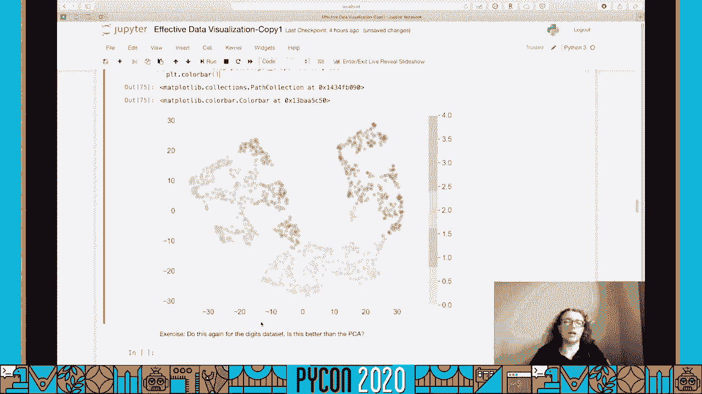

好吧，就像我们之前所做的那样，我们基本上要在这里使用相同的代码，唯一不同的是 现在，我们正在把它与数字数据集进行匹配，我们用的是10种颜色 而不是5种颜色，让我们运行这些，看看我们得到了什么。可能需要更长的时间，因为数字数据集显然比瑞士卷大得多，好吧，如你所见，迪斯尼在这里做得比 pca好得多，所以你可以看到，例如，所有的零都在这里，可能会有一些例外，呃，到处都是，但是呃。它在将每个数字分隔成自己的集群方面工作得很好，呃，不用担心，如果这看起来和你屏幕上的不一样，嗯，实际上每次你在迪斯尼重播，它会看起来不一样，因为这是一个随机的方法，只是检查一下，是的。所以你可以看到它看起来又不一样了，但它是，呃，同样成功。

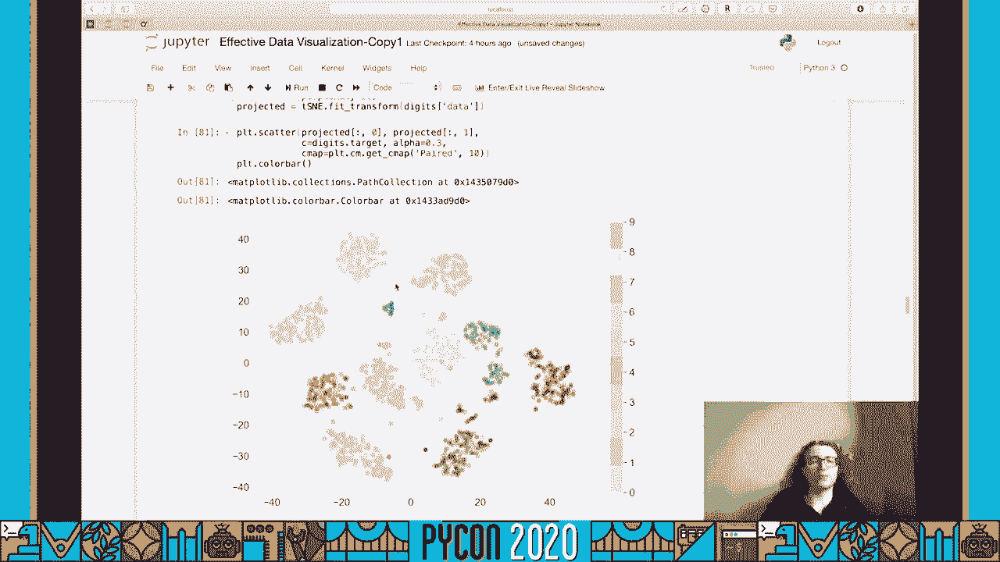

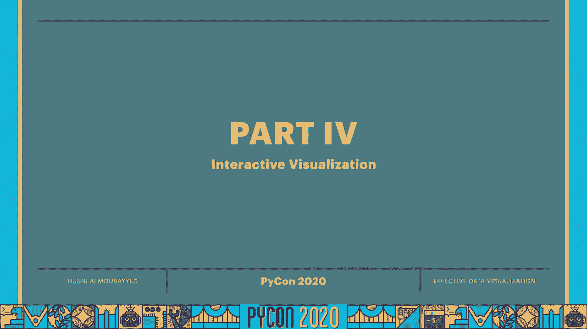

所以有时候仅仅把事情安排好是不够的，你真的想，只是，呃，与数据互动，了解更多信息，我们现在要讲的是交互式可视化，主要是通过普特利图书馆，我们还将使用股票市场的财务数据，股票市场价格。它真正的工作方式是通过调用它的数据阅读器，然后我们将指定股票行情，对于特定的股票或 etf，在这种情况下，我们将使用间谍为标准和政策，资金的五百兑换率，然后我们将指定我们要使用的数据提供者。在这种情况下，让我们用雅虎来做雅虎财务，最后它需要一个开始和结束的时间，我们可以使用 python的日间库来创建开始和结束时间，以数据阅读器喜欢的格式，我们从二十八开始 一直到二十八开始。然后我们可以在这里再次使用这些，最后我们要重新设置这个数据帧上的索引，使日期不是索引，这一点很快就会显现出来，所以让我们继续看看数据帧是什么样子的，我们把日期作为一栏，当天的高价，低价，开幕式，收盘价。

当天的成交量，忽略调整后的收盘价，大多数图实际上都在这个图对象模块中，所以我们在这里调用一个日期在 x轴上的散点图，然后是 y轴的收盘价，然后我们把这些数据输入到这个戈达数字中。它会向我们展示屏幕上的情节，所以让我们看看这看起来像，好吧，所以应该是这样的，最酷的是现在我们可以与数据交互，我们可以悬停查看某一天的实际价格，然后我们可以点击和拖动缩放到一个特定的时期，然后双击返回。如果您想与数据交互，这将非常有用，所以这是一种图表，另一种常见的图表和金融是烛台图表，在这个数据的前90天，你可以在围棋模块里找到烛台图表。
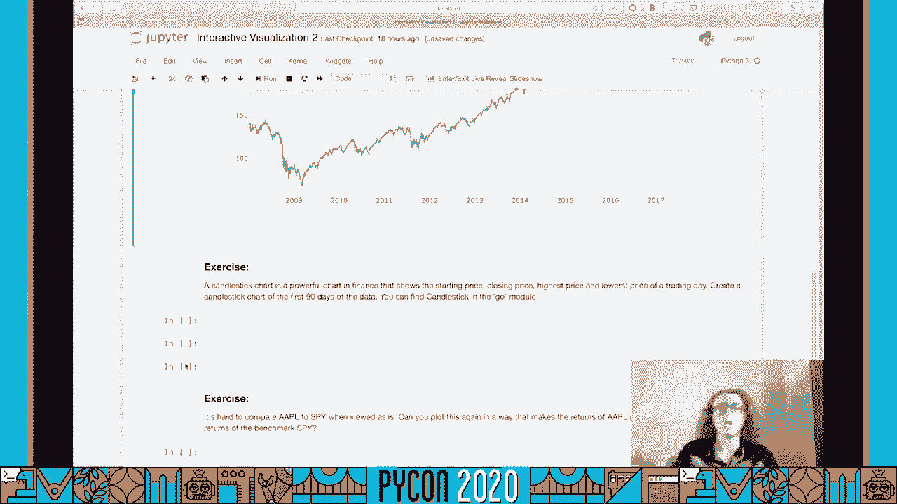

好吧，为了解决这个问题，我们要回到这个牢房，我们把它复制粘贴，在这里我们要把它变成一个烛台图表，然后让我们看看烛台实际上需要什么，我们所拥有的，所以我们还是会有，交易日，但现在不是我们为什么有开盘价。我们有很高的价格，以及收盘价，这些都是我们可以输入到烛台图表中的东西，让我们看看这将是我们的数据帧点打开，这将是我们的数据帧 点嗨，同样，我们的数据帧也很低，最后我们的数据框架结束了。让我们看看我们能得到什么，好吧，所以我忽略了一件事，我们只想利用前90天，把前90个交易日，这只需要一片 在最初的90天里，好吧，所以这个看起来更好，所以这种电荷会让你看到，嗯，去看看，我们来看一小段。所以你可以看到市场在这里开张，嗯，当天市场的最低点在这里，然后最高点在这里，然后它就在这里关闭了，嗯，所以你知道它的收盘价比开盘价高，如果，如果其中一根是绿色的，相反的是 如果其中一根棍子是红色的。

你也可以在悬停的时候读到这些信息，所以双击放大，好吧，如果我们想策划不止一件事，并添加一些格式化到这些图，所以让我们回去再粘贴一次，我们在这里有什么，看看我们可以在此基础上建立什么。所以这个数据变量不一定是一个单一的跟踪，可能不止这些，我们再找一个数据框，现在让我们看看苹果的股票，我们可以再次使用数据阅读器 现在的报价将是苹果，但其他一切都会保持不变。现在我们将数据添加到一个列表中，把它添加到列表中，所以我们再一次得到了一个散点图，但现在 y将是苹果股票的收盘价，对啊，最后让我们添加一些布局，因此，我们不只是在这里输入数据，而是可以输入数据和布局。但我们得把它变成字典，所以基本上，策略语法的工作方式是，我们必须为数据和布局定义一个字典，嗯，所以这个布局会是什么，所以布局也将成为一本字典，在那里我们可以定义一些东西，比如标题，这将是，假设。

只是雅虎财务数据，呃，是啊，让我们暂时看看它是什么样子，所以这实际上是间谍数据，这是苹果股票的数据，嗯，上面写着1号痕迹 1号和0号痕迹，因为我们真的没有定义哪个是哪个。所以在这里我们可以添加那个散点图的名字，我们给它起个名字，在这里我们要把它命名为苹果，好吧，所以现在，不出所料，这就是所谓的间谍，这个叫做苹果，所以悬停在东西上，放大和缩小是很酷的。但是我们还能用交互式可视化做什么呢，所以我们可以做的一件事是我们可以添加交互式的东西 比如按钮，所以让我们看看我们如何做到这一点，所以我们再复制一次，到这里来，所以现在。唯一的区别是我们要在布局中添加另一个东西，这将被称为更新菜单，因为我们要定义按钮来更新我们的情节，在这一点上，您可能会对策略语法有一种感觉，所以这是一个字典列表，这些字典将成为，按钮本身就是一个列表。

所以我们可以为一个按钮定义的东西，像这个按钮的标签，假设我们有一个间谍按钮，假设我们想在按下那个按钮时更新一些东西，所以我想说方法就是更新，假设当我们按下那个按钮，我们只是想让间谍数据真的出现。我们不想再在屏幕上看到苹果的数据了，所以我们可以这样做，我们可以在这里定义参数，这又是一个字典列表，我在这里混合了我是如何定义列表和字典的，这只是个人喜好，你可以用任何一个拼出 dict作为函数。或者您可以使用字典语法，所以我们要做的是，我们要改变能见度，所以我们要说，嗯，当我们按下这个按钮，我们希望第一个痕迹是可见的，第二是看不见，我们就可以，给这个按钮一个标题，假设这个头衔只是间谍。我看到这里多了一个等号，所以让我们摆脱它，现在我们已经定义了第一个按钮，让我们继续定义，呃，再按两个按钮，一个让苹果数据可见的地方，在那里它将使两者再次可见，所以我们基本上就是把这个代码复制两次。

为这两个按钮再做两个字典，所以第二本字典叫做苹果，这将使这个错误，第二条线索是真的，这些痕迹的顺序就是顺序，你把它们放在列表和数据列表中，所以我们把这个叫做苹果，我们要把这两个都做出来，这里也是。随便啦，好吧，所以我们定义了这三个按钮，我们现在只需要定义，开始时哪个按钮处于活动状态，所以要做到这一点，我们要使用主动式 然后我们要，我们只需要用活动等于负1，所以一开始这些按钮都不会被激活，最后。为了使语法工作，我们只是要把这个变成一个列表，再把这个变成一个列表，嗯，然后让我们运行，看看会发生什么，好吧，所以我们做了，我们得到了，呃，这三个按钮，所以如果我们继续监视，我们只是去获取间谍数据。然后标题会更新为间谍，如果我们做苹果，然后我们会得到苹果的数据，然后再一次为两者，我们两个都要，好吧，很难比较现金和现金的回报，500个苹果库存，所以你能想出一个办法，在那里你可以把这两个都画出来。

让回报更有可比性。
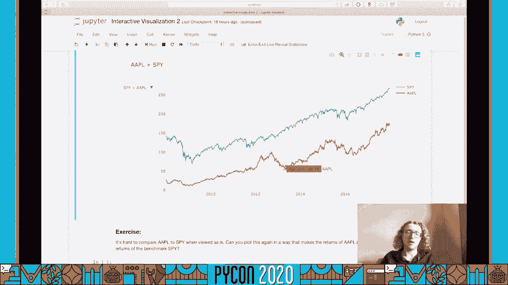

好吧，所以一个简单的方法就是，我们把这些复制下来 贴在这里，一个简单的方法就是，而不是仅仅在 y轴上绘制股票的绝对值，我要把它画出来 然后除以这里的第一个值，除以第一天的收盘价。然后除以苹果第一天的收盘价，现在它的辨识度更高了，苹果的收益会是二十八到二十八之间的六倍，而纸币和纸币500的收益是两倍好吧，所以我们也可以使用 Plotley来查看地理数据或地图数据。我想大多数人心中的地图，在这一点上是 COVID十九地图，所以让我们看看其中一个，所以有一个链接可以下载这些数据，设置在本教程提供的笔记本顶部，然后让我们看看这些数据实际上是什么样子的，所以。菲普斯是一个五位数的代码，它映射到美国的每个县，所以，如果你给洛蒂一个 FIPS，那是零一零三，它会自动知道你说的是阿拉斯加的鲍德温县，这些往往是按字母顺序排列的，在每一天我们都有数据表明。

确诊 COVID病例19例，我们可以做的一种情节是我们可以，为每个县的确诊病例做一个图，并将其作为一个强度图，所以这里我们不再使用图对象了，我们用的是，绘图表图形工厂，我们正在绘制脉络膜图。药瓶的价值将从这些县拿走，菲普斯，然后的值，让我们只拿，呃，4月9日20 作为这里的价值，如果我们不做这个旋转，让我们看看如果我们不旋转 会发生什么。所以我们有一张4月9日 COVID 19和确诊病例的强度图，这就是为什么纺纱很重要，所以不是有范围，我们对每一个不同的人都有一个传说，呃这里的号码，所以为了解决这个问题。我们可以在这里使用这个旋转的端点参数，所以我在这里做什么，我挑了一堆颜色，这些都是蓝色的，你一会儿就会看到的，但基本上我选择这些颜色，然后我在做这些颜色的对数缩放，所以我们有一个对数标度的强度图。

所以让我们看看我们现在运行它时会得到什么，如你所见 我们有原木比例的箱子，所以我们有九个垃圾箱，在10例到10万例之间，这些数字来自这里，所以这是10比1是10，10比5是10万。所以 Ploti可以为你制作更多类型的图表，还有不同的地图，可以动画的地图，所以这些都超出了今天教程的范围，但请随时在普洛特利网站上查看它们，斜纹蟒。
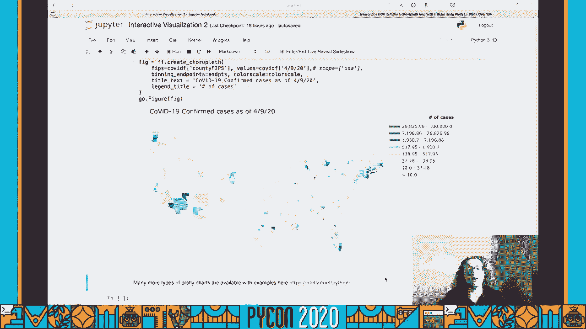

所以最有可能的是 如果你发表的是，你的目标是让它们成为传递信息的一种方式，你对你的情节所做的一些选择 可以帮助你做到这一点，但做出错误的选择，会让你冒着制造误导而不是交流的阴谋的风险。这部分教程的目的是帮助你，意识到这些选择，以及如何做出好的选择，首先我们要广泛地讨论颜色，因为我觉得这是最容易让人误入歧途的方法，在很长一段时间里，一种叫做喷气机的彩色地图 是许多绘图工具的标准，因此。它现在被用于许多科学出版物和其他方面，我将首先向你展示 为什么这是一张糟糕的彩色地图，然后呃，看看如何为您的特定问题选择更有效的彩色地图，所以首先，让我们看看喷气式飞机是什么样子的，呃。所以在这里我只是创造一个形象，二维图像，从0到100，把同样的东西排成十行，然后我们，使用橙色热图来显示，再叫西博恩给我们喷气彩图，这样就能把每个正方形缩放成正确的大小，所以我想让你看看。

这张照片实际上是什么样子的，把它打印出来，但让我们打印两行，看看它看起来如何，所以第一排是从零到九十九，再重复十次，然后让我们把这个图像绘制出来，我们可以看到这张彩虹色的地图。它的主要问题是它在感知上并不一致，它有两个峰值和亮度，所以你可以看到这里和这里，嗯它，它在两者之间变得非常明亮，它不那么明亮，然后在边缘也不那么正确，所以有时候当你看这样的热图时，嗯在。你知道在灰度或类似的东西，或者如果你只是快速看一下，你可能会觉得这里的数据点和这里的数据点实际上比，说，数据点在中间，数据点在黑暗的流感中，原因是亮度急剧变化，然后在另一个边缘回到不太明亮的地方。所以为了进一步调查，我准备用，来自 jake van der pl博客的代码片段，所以让我们定义一下，然后让我们看看航班，这方面的数据集，所以我从海上装载了这个飞行数据集，然后我想要一张乘客人数的热图。

呃，作为月份和年份的函数，所以让我们看看这看起来像，让我们首先绘制我们的热图，好吧，所以这个情节试图传达的是在夏季的几个月里，到了晚年，乘客也更多了，但当我第一次看到这个。我首先注意到的是中间这条明亮的条纹，这不是你想传达的，你不想跟别人说，中间这条明亮的条纹很特别，你想表达的是，这个情节实际上是从左向右逐渐变化的，也逐渐从上到中 从下到中，所以让我们绘制一个灰度版本。使用上面的代码段，看看它是如何显示的，好吧，所以正如我们之前提到的，当我们用灰度绘制它的时 候，很明显中间这条明亮的条纹是最明显的，在这个情节里，所以我们怎么才能做出，或者选择更适合这种情况的彩色地图。呃，这个问题基本上都有答案，三种主要类型的彩色地图更有效，假设，在传达信息的时候，第一个是我们注意到的，这张彩色地图的问题是，它至少是，问题是它在感知上并不一致，彩色地图感知新标准。

和 matplotlib和海运，其他的叫做维迪斯，把这个计划好，我们看到这样的东西，最后嗯，传达正确的东西，也就是事情越来越多，它们在1960年的夏季达到顶峰，然后你知道，这是选项之一。其中之一就是使用单一颜色，但使用它所有不同的色调，所以让我们看看这个紫色看起来怎么样，所以如果我们说我们想要一张紫色的地图，海运给了我们这样的东西，再次传达了，正确的事情，说你不想要蓝色那样的紫色。它对流感也有同样的作用，有一件事需要注意，这些彩色地图的名字是你可能要查阅的东西，在这个底部有两个链接，主要是在这里，基本上是通过所有可用的彩色地图，你可以从，好吧。所以第二种民谣彩色地图是发散的彩色地图，如果你真的想让一些东西在中间达到顶峰呢，例如，最常见的一种，例如气候数据，假设我们说的是天气，我们想要凉爽的颜色来显示寒冷的天气，然后用暖色来表示炎热的天气。

所以我得到这些数据的方法是通过输入谷歌匹兹堡气候，然后我把它放进字典里，定义了从一月到十二月的月份，然后这些是平均高点和平均低点，所以让我们看看这看起来像什么，这是这个数据帧的前五行，所以让我们继续。看看这看起来像在c警告，好吧，所以在这里我们把我们的彩色地图的中心放在0，所以任何高于零的东西，这是以摄氏度为单位的，所以关于零度的一切都在冰点以上，这将是温暖的颜色，零度以下的东西都是较冷的颜色。如你所见，我们可以很容易地交流，在夏天，高点真的很热，而在冬天，低点是相当冷的，嗯，假设我们不想把它集中在0，我们可以选择把它集中在其他事情上，更常见的是，嗯，可以选择它的中心在平均温度。所以这里我们平均了高点和低点，把这两个平均值加起来，所以找出每个人的平均值，嗯，每栏，然后得到整个数据集的平均值，让我们看看这看起来像什么，对，嗯，所以现在它以平均值为中心，在10摄氏度左右。

它再次表明，一切都更热，比这更热的东西都会是红色的，比这更低的地方都是蓝色的，所以需要注意的是 即使在这里，这不是一个感知上一致的彩色地图，中间确实有一个峰，这不是我们可以说的关于喷气机。第三个有效的彩色地图选择是当我们处理分类数据时，我们真的不想要渐进的变化，我们希望不同类型的数据有颜色，而且颜色非常不同，因此我们可以使用分类彩色地图，和。其中一个例子可能是我们已经在维数约简部分看到的东西，所以我只是重复那个例子，在这里和我们使用配对彩色地图的地方，它看起来像这样，所以它对多种颜色使用每种颜色的两种色调，这是一个例子，每一个，呃。每种颜色与下一种颜色基本不同，所以有几个实际的例子，所以我住在匹兹堡 我经常看国家气象局，他们的情节真的很有趣，很有见地，但是有时候它们真的很难读懂，所以我这里有几个例子，我只是要去，我拍了几张截图。

我把它们放在这里 看着它们，所以首先看这个，我们可以看到这里的色条有点混乱，部分原因是这个图形中有很多颜色根本没有使用，这里和周围都是紫色，在色条上为两个非常不同的值重复。另一件需要注意的事情是这个色条不是，呃制服，所以我们可以看到从零下5到5，十到十五，那是十个，以此类推，但是我们有375到75，里面有40度，然后我们有115到140，然后8减80减55。这些都与其他的价值观不一致，我们真的不需要走那么远，因为这是看着寒风凛冽的冬天，我们真的不需要去140，所以如果我们有彩色地图，也许在这里和这里之间会更合理，然后在其他的日子里，呃，我们有这样的情节。我想说这个情节非常完美，现在，在这个连胜中，然后周围的天气变凉了，然后周围更冷，所以这个色条非常合适，别再谈论颜色了，让我们谈谈我们必须注意的其他几个选择，当我们在制作情节和出版情节时。

接下来我们要讨论的是标记，所以如果你想突出显示两种类型的数据，如果你有两种类型的数据，你试图突出显示它们，然后确保你用不同的颜色或不同的形状来绘制它们，让我们看看形状 假设我们有两个数据集，从负2。5到2。5，它是二维的，在 x和 y上都有100个点，另一个是正态分布，只有5个样本，和，我们看看能不能从上百个样本中挑出这五个，所以首先，呃，让我们看看 如果我们有100个这样的正方形。剩下的就是圆圈，让我们看看我们是否能区分，所以你可以看到很难区分它们，3。我实在是找不到这五个数据点，也许这是一个，呃，但除此之外真的很难找到，嗯，所以很明显改变颜色是我们可以做的一件事。但您也应该注意选择和标记形状，你所做的，所以如果我们把这个变成一个加分项，例如，然后就很容易挑出这五个数据点，即使我们对两个数据集使用相同的颜色，所以我想说，试着玩标记形状。

只是为了确保你的阴谋传达了你想要的，在这种情况下，这五个数据点来自一个不同的数据集，作为其余的数据点，这是虹膜数据集的另一个例子，所以我们之前就计划好了，但让我们再看一遍。所以我们绘制了三种不同颜色的鸢尾花，呃，我们在绘制花瓣的长度和宽度，对于这三个物种来说，可能不会，甚至注意到，但这三个标记实际上是不同的形状，它们的方向也不同，所以重要的是要注意，如果你想区分这三者。你也许应该使用三种不同的标记形状，看起来比这三种更不同，所以基本上，这是一个选择三种不同标记形状的糟糕例子，突出三个不同的东西，一个例外是 如果你真的对这些形状的方向感兴趣，那么这可能是需要考虑的事情。那么这可能是一个很好的标记选择，最后提醒大家 虽然我们有二维屏幕，我们要在二维屏幕上绘制图形，我们可以做出选择，基本上允许我们使用两个以上的维度，例如，颜色可以代表尺寸，大小可以代表尺寸。

尤其是对于数值数据，呃，所以我们可以让尺寸随着一个数字维的增加而增加，形状可能是另一个维度，然后你也可以做一个三维图 从某个角度来看，就像我们做的瑞士卷，所以关于交流的最后一些想法是，利用塞瓦的能力。为整本笔记本设置调色板，所以我们用笔记本做了这个，我们选择了色盲友好的调色板，在笔记本的开头，您还可以使用这两个链接，你基本上知道你所有的选择，当涉及到彩色地图和调色板时，熟悉你所有的选择。这可能是我最喜欢的资源之一，当涉及到试图使数据可视化时，传达正确的信息，所以一定要看看它，看看它是否对你有帮助，这都是为了交流。
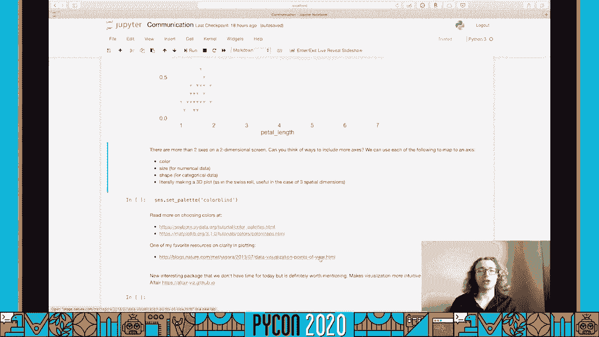

本教程到此结束，感谢收看，我真的希望能见到你本人，在蟒蛇二十一点，你可以在屏幕上找到各种方式与我联系，如有任何问题，请与我们联络，建议或任何你想讨论的东西。

