# P81：Tutorial Keith Galli - Natural Language Processing (NLP) in Python - From Zero t - 程序员百科书 - BV1rW4y1v7YG

喂，你好吗？各位欢迎来到我的蟒蛇，2020自然语言处理教程，但这个在线演示是下一个最好的事情，所以我很兴奋能在开始之前，我们实际上跳转到本教程的内容，我觉得把舞台布置好。过去的两年对自然语言处理来说是非常令人兴奋的，我想说从20点18分开始，许多真正有影响力的作品被出版，似乎每一篇新论文都比上一篇更有影响力，性能基准就像，左右破碎。

我认为这个新闻标题可以很好地捕捉到这一时期，我记得在1919年偶然发现，那就是新的人工智能假文本生成器可能太危险了，不能发布。
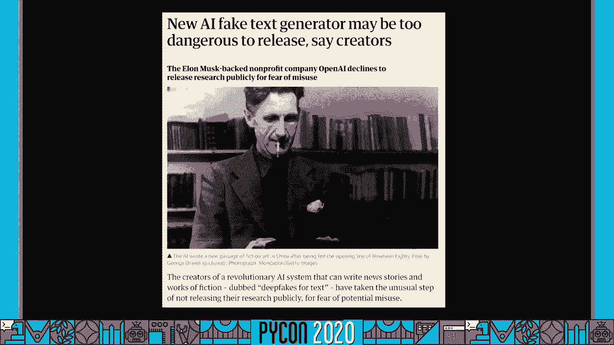

创作者说，这发生在 openai建立 openai gpt两种语言模型的时候，他们害怕人们会产生各种各样的虚假新闻故事，并恶意使用他们的模型，他们一开始没有公布所有的参数，他们最终释放了这些参数。但我认为这样的标题抓住了一个重要的，自然语言处理中的一个转折点，这是我们第一次建造这些模型，它捕捉到了我们以前无法捕捉到的语言语义，我们第一次真的做了一些疯狂的事情，同时又可怕又强大 让人印象深刻。

所以出于这个原因，我真的很兴奋能和大家分享这个教程，激动人心的时刻，在本教程中我们将介绍，我们将从基础知识和一些更传统的 nlp模型开始，一直到最先进的语言模型 比如 openai gpt 2。所以本教程将从基础知识开始，它将从 nlp的基本原理开始，我们将主要研究如何将文本转换成数字矢量，可能最简单的方法就是所谓的"单词袋"，所以我会是我们看到的第一个模特。

然后我们跳入与之相关的 python代码，接下来我们要看的是一个稍微不同的变化，我们如何将文本转换为数字向量，这将是一个词向量的方法，我们还将看到如何使用 python代码来实现使用单词向量的模型。在我们了解了 nlp的基本原理之后，所以我们会通过雷格，X在 python中的基本模式匹配将经历词干和柠檬理化，我们会做一些基本的拼写校正，语言标记的一些基本部分。

在结束本教程之前 我们会对我提到的最先进的模型做一个高水平的介绍，所以这个 openai gpt两个模型和更一般的变压器，在变压器的架构中，一个是布尔，所以我们将介绍并看看这些是如何产生的。我将向您展示如何使用 python代码来处理这些代码 并构建更强大的模型，关于我的一点，我叫基思•加利，我现在在一家叫"时髦科技"的公司工作，我们是一家小型软件初创公司，生产聊天机器人和其他会话。

人工智能作为解决方案 为广泛的企业客户 在豪华，我研究了一段时间聊天机器人的意图识别模型，所以实际上聊天机器人是如何接收文本和处理，自动理解顾客的要求，除此之外，我的爱好之一一直是教书。最终这就是我今天做这个演讲的原因，在那里我发布了各种各样的蟒蛇内容，尤其是很多数据科学教程，嗯，我很想和每个人联系，所以请随时联系我，你知道吗。

LinkedIn Instagram Twitter，如果你找到基思·加利，一句话你可能会找到我，我们要讨论的第一个模型叫做单词袋模型，有时也被称为单词袋模型，给你一点这种方法背后的直觉，我是说。无论什么时候 我们在做数据科学相关的任务，我们喜欢用数值向量，显然我们对文本的问题是 它不是一个数字矢量，所以这个袋装单词的方法是最简单的，判刑的方式，你知道文本的片断，并把它转换成一个数字表示。

假设我们有四句话，我喜欢这本书，这是一本伟大的书，很合身，我喜欢这双鞋，它们来自两种不同类型的类别，在零售店，图书部，或许服装部，我们试图建立一个模型，把他们区分开来，好吧，我们可以用这个词袋做什么。它基本上是说，把我们在所有话语中看到的所有话语，把每一个单独的词，每个独特的词，所以这就给了我们，我看了这本书，这是很合身的鞋子，把所有这些话，然后根据什么词，哪一个句子，在所有这些独特的词汇中。

我们创建一个矢量，其中一个，一个代表这个句子有这个词，零代表它没有，这就是二进制单词袋模型的基本方法。
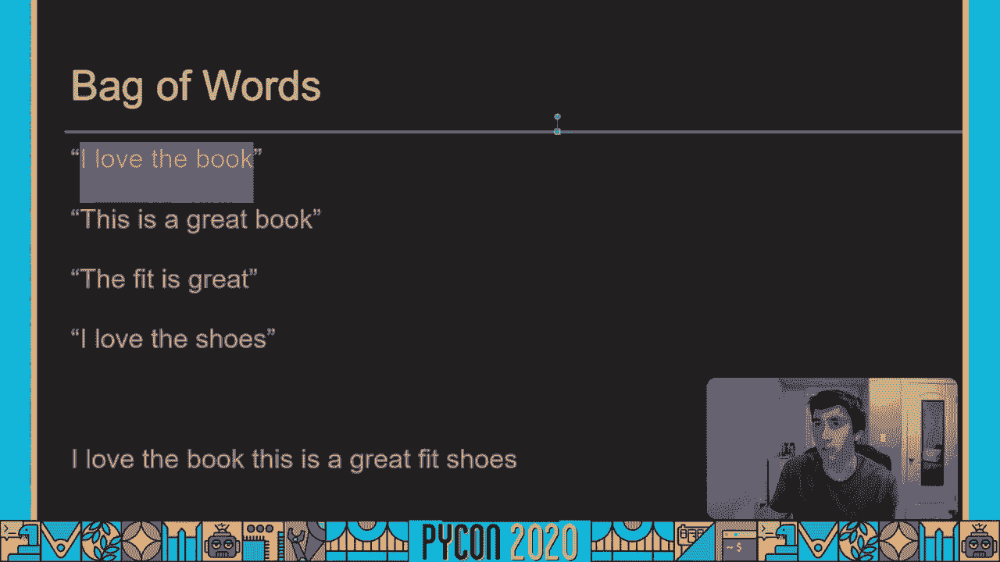

那么在代码中它是什么样子的呢？好吧，我想每当我们制造一袋，词模，对不起，我们将从计数向量机开始，所以当它说计数矢量发生器，这可以是我们刚才提到的1和0的二进制单词袋，也可能是。

如果你想象一下这些短语中的一个，我提到过，我喜欢这本书，这本书很棒，如果这就像一句话，可能是计数器，也可以说这本书出现了两次，所以这将是一个艰难的，在整个句子中对一个词的直接计数。
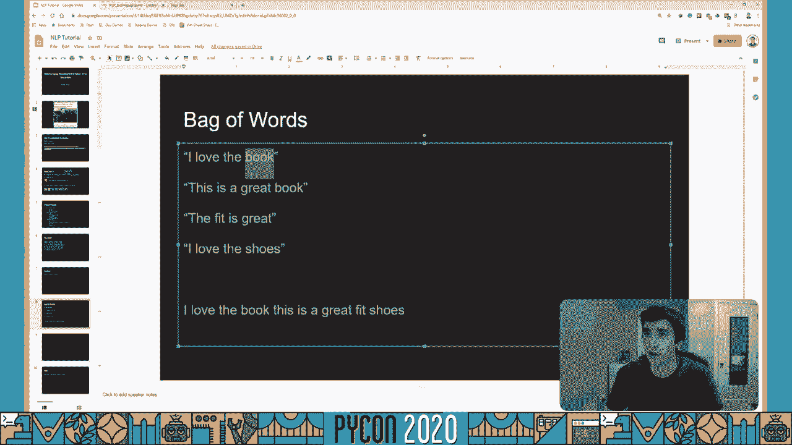

这个词在一个句子中出现了多少次，但我通常倾向于使用二元方法。
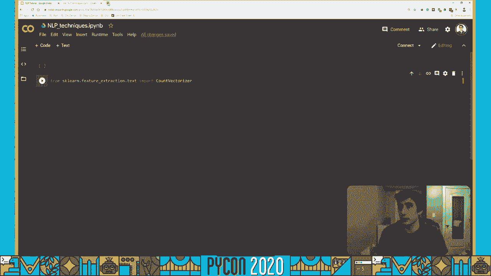

如果你不知道如何找到这样的东西，如果你知道单词袋模型，但你不知道去哪里找，你就会得到科学工具，你应该能找到一些例子 使用袋的单词，基本上这就是我刚才给你们看的计数向量，它告诉我们如何利用它。所以当我们做这个的时候，我们可能会引用几次。

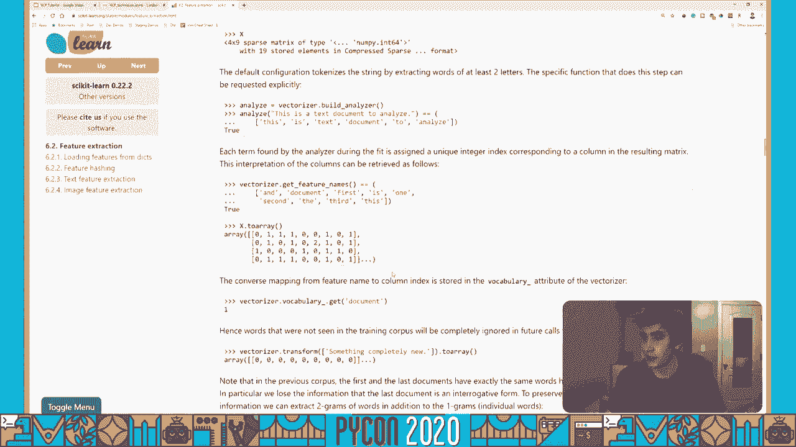

所以我们有计数向量机，嗯，在这上面我将很快找到一些训练用语，所以我要叫这班火车，X，我要说的是，让我们用我们的例子，我喜欢这本书，这是第一个，我喜欢这本书，这是一本伟大的书，是第二个。最后两个是合适的很好，和，好吧，这就是我们可以想象的四个训练话语，所以我们可能要做的第一件事就是利用我们的猫向量化器把它转换成一个矢量表示。

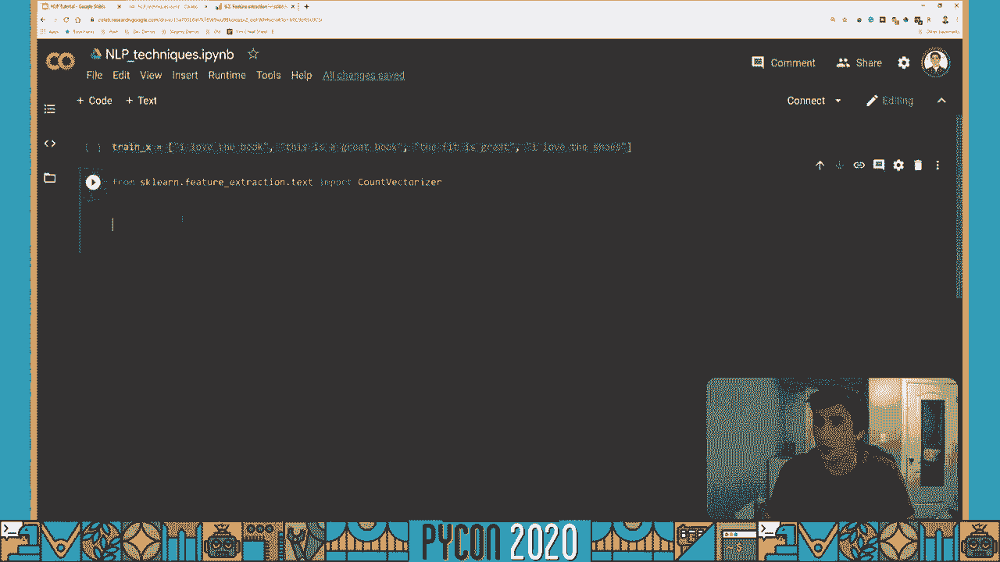

所以我再一次提到，你知道我知道我在做什么，但我有时会忘记语法，所以这就是为什么我总是引用这样的文档，所以看起来我们想用矢量拟合变换，所以向量机等于计数向量机，然后在我们的句子中进行变换。
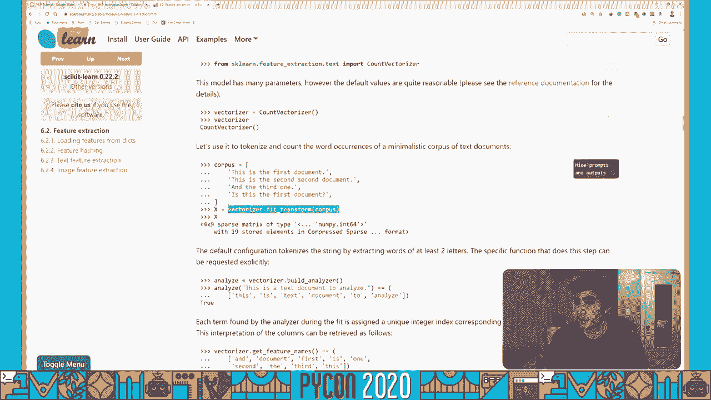

所以我们可以做到这一点，所以我们可以说，向量机等于计数向量机，矢量化器，然后我们可以说我们的向量是，当这个合适的时候，转换适合我们训练话语的词典，所以基本上这是第一步，它在寻找所有独特的词。所以它知道如何让这些向量，然后它就开始了，根据我们刚刚安装的向量来转换我们传递的话语，所以现在我们得到了向量，所以我可以做像打印向量为零，它将是，嗯，我喜欢这本书，如果这个运行，列车 x没有定义。

我也要用这个手机，我正在用 google collab来运行这个，好的，看起来不错，我可能只做点向量，我想是的。
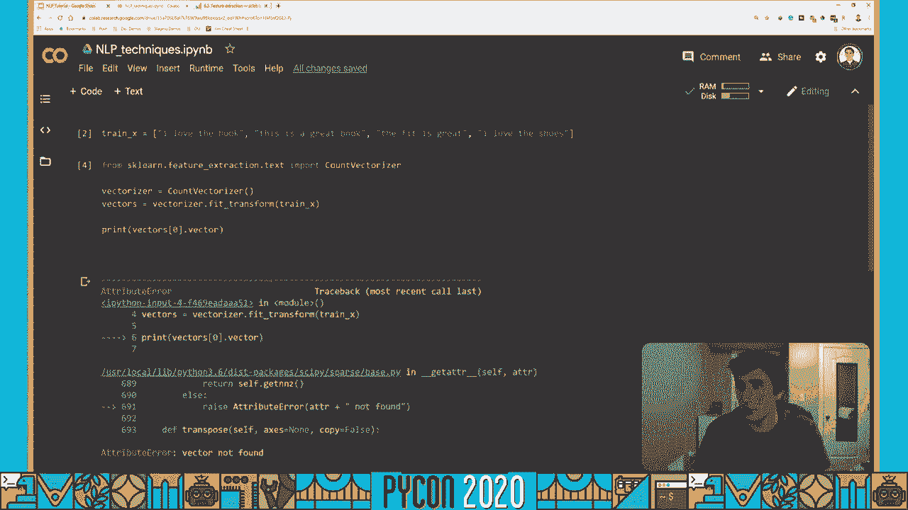

让我们看看，我把这个打印出来，很快的，哦，我想我们可以做两个数组来看看它实际上是什么样子，我们也可以让向量机得到看起来很有用的特性名称。
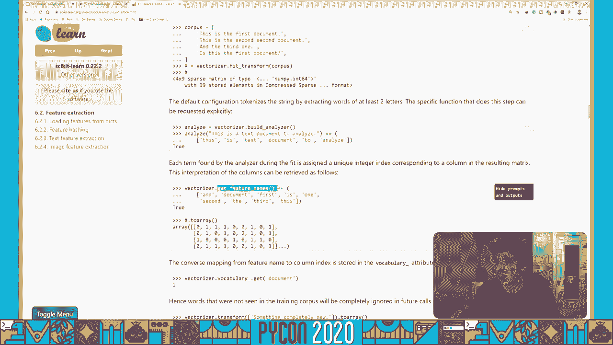

所以我要打印一些东西出来，我们会打印出矢量发生器，获取特性名称，我也会打印出来，假设，让我们看看会发生什么，好的，酷，所以这本词典或书中的不同单词，伟大的是爱情鞋，唯一需要注意的是。它看起来真的被剥去了，所以这可能只是，你知道吗，一个字的话语是它，它剥去，实现计数向量器的部分方法，但如果我们看一下这里的向量，让我们看第一句话，但我喜欢这本书，所以我们有一个在这里的书，对。

我们在这里有一个爱的权利，因此倒数第二，所以我们在那里有一个，我想它剥去了，我也是，所以我们看不出，但是我们得到了一个矢量表示，而不是一个单词的表达，在这个矢量发生器不计数的地方。需要注意的一点是 我认为默认情况下，如果我做了这个，我喜欢那本书，伯爵，矢量化器是非二进制的，所以实际上重要的是你输入了多少次，所以如果你愿意 你可以，我认为二进制在这里等于真，现在它又切换回1和0。

好的，所以这就是单词袋的基础，只是看到它，并做出一个非常有趣的例子来做这件事，让我们建立一个快速模型，实际上将这些归类为与服装有关的，这些是前两个与书有关的，所以我要叫它火车，所以这将是第一个人的书。第二个人的书，每当我有一个重复的字符串 像这样，我喜欢让它成为自己的变量，只是为了确保我不是真的喜欢拼错，所以我们要快速地做一个类别，把书标记为类别之一，这将是弦乐书，服装作为另一个类别。

你马上就会明白我为什么要这么做，所以现在当我想，我是按顺序做的 所以我有四件事，我要给他们四个标签，所以我们有分类书籍，我们有分类书，最后两个是关于服装的，所以这些是分类服装，好吧，我再重复一遍。再运行一次，我想，现在我们要建立一个简单的分类器来隐藏这个指纹，所以你可以看到一切，真实，我建立了一个简单的分类器来分类这些是否是书，图书类别，这是衣服，我们可以把它用在新的话语上。

那么我们如何才能做到这一点呢？再一次，一个好的经典文本分类模型通常是一个线性的 svm，所以这就是我们要用到的，然后我们可以用下面的方法定义我们的 svm，我要说的是，分类器 svm等于 svm。带有线性内核的 SVC，因为我想用线性的 svm，因为它是，根据我的背景知识，我知道这是一个很好的文本分类模型，经常，再加上那个 svm，我们要在训练器上做一个匹配，哪一个是对的，这些是向量。

因为我们不能只是通过文本，我把这列火车叫做 x向量，向量，然后我们的y标记，就像火车一样，所以这应该适用于我们这里的四句话，我们得到了一个错误，我没有重播这个，所以，酷，最后让我们做有趣的部分。用这个预测新的话语，我把这条短信叫做，x=向量器，所以在我们需要根据我们的训练话语改编词典和转换之前，现在我们已经有了一个矢量发生器，我们可以用变换代替拟合 变换，所以我要说的是，我喜欢这本书。

所以根据我们现在掌握的情况，因为我们说了单词书，你认为这会被归类为，图书类别，所以我们可以做分类器，在我们的测试中，看看会发生什么，好书很酷，我们试试，我喜欢这双鞋，或许我们可以说，鞋子没问题，哇哦。上面说衣服，很明显我们只训练了四句话，所以它将是如此强大，但是，所以是的，它只会是如此强大，但是当我们添加了越来越多的话语，我们的字典会在这个向量拟合变换中增长得越来越多，我们得到了一个更强大的模型。

所以我们输入到一袋单词模型中的训练话语越多，往往它做得越好，我想其中一个警告是，您可能构建了如此大的字典，以至于很难处理，就像那个模特，所以你可以在这里加入另一个技术。当然斯卡拉尔给了你一些能力来做到这一点 也许你只需要把出现的前1000个单词，所以这就像是另一个选择，另一件关于单词袋的事情是现在，我们采用的是一种单位元方法，我们只是把每个词单独拿出来，嗯。

但你也可以用双曲线法，它被称为，这本书都有自己独特的话语，所以让我们试着做的非常快，只是看看，让我们看看我们有多少恩格拉姆范围，这可能会帮助我们，所以我要输入 n克范围，因为它可能会给我更多的信息，哦。所以我会说1和1和2得到，我觉得一个词和两个词，所以我们可以把这些东西再打印出来，看看是不是这样，是啊，所以现在你看我们也得到了两个词，所以我们刚刚抓住了你，嗯，还有传记。

关于这些传记 需要注意的一点是，你可能想在一行中使用两个词的一个原因是，假设我们在谈论，如果事情是积极的还是消极的，好吧，如果我说什么是伟大的，这是非常积极的，但如果我用双字母，伟大之前的词不是，呃。你知道不是很好，那就完全不同了，所以这是一个办法，你知道刻字是很重要的，作为你，你知道吗，语言取决于他们的联系，所以你知道添加额外的单词，这有时会有所帮 助，也可能是有害的。

如果你有太多的单词在这里的铭文范围内，你可能会有很多像随机的，杂项，就像三个单词短语在你的整个集合中只出现一次，它实际上可能会使分类器偏离一点，所以我现在就坚持，这是决赛，在我们进入下一个模型之前。我想说的最后一件事是，这个限制是，如果我们有一个词不在我们的交易话语中，我们不知道如何处理，所以如果我说这样的话，我很喜欢这个和我们很相似的故事，你知道书和书，但对于我们的模型 我们从未见过。

所以我们可能不知道如何处理，所以让我们看看当我们运行这个时会发生什么，问题是，是啊，它把它归类为服装，即使对我们来说很明显，那个故事和那本书很有关系，说实话我觉得，即使我们输入书籍之类的东西。它不知道书和书是一样的，因为它已经在这里看到了单词书，但从来没见过书，所以这就像相当愚蠢的，如果它没有看到一个字，是的，再次，上面说衣服，尽管对我们来说很明显，那本书和书是一样的，它在训练的东西上很棒。

但如果它没有看到一个字，然后它就惨败了，你知道这不是很好，在人类的语言里，你知道我们可以用很多不同的方式说不同的话，这就引出了单词向量的话题 单词向量是将文本转化为数字向量的另一种方法。单词向量的大目标是将文本转换为，一个数字向量，它捕获了向量空间中的一些语义意义，你要把这段文本映射到，我的意思是想象一下你有红色这个词，蓝色和黄色，这是三种不同类型的颜色，我们要做的是在我们的。

我们想象你有这么大的向量空间，我们希望相似的单词被映射到向量空间的相似点，好红，蓝色和黄色都是颜色，应该映射到类似的地方，有很多不同的方法来训练一个载体 最终做到这一点，其中一个流行的方法是。叫做单词 vec和单词效果有两种方式，一般有两种流行的，就像最受欢迎的，我想训练这个词的方法，一种叫做连续的单词袋，一种叫做跳格，这两种方法的不同细节并不超级重要，但重要的是要在更高的层次上理解。

它们是如何工作的，所以想象一下我们回到我们的例子，在书籍和服装相关的推特上进行分类，所以想象一下我们说的三个短语，我多年来读过的最好的书，我们有很棒的故事和人物，我们在书中没有人物的发展。这是三个与书有关的短语，我们可以很容易地通过阅读这些来判断这一点，但是我们怎么训练一个模特，"vec"这个词的含义是什么？做连续的单词袋和跳过的克接近，他们在看一个文本窗口，所以有时候窗户可能是。

你知道吗，五个代币长，所以我读过的最好的书，所以这将是我们的上下文窗口，基本上我们要做的是，我们会选择性地在上下文窗口中查看不同的标记，在这个令牌的基础上 利用周围的令牌。找出每个标记的上下文 然后开始研究每个标记的含义，因此，如果我们读了足够多的文本，我们就可以把它翻译成这个例子，我们可以开始看到单词之间的关系，例如，在这里，随着时间的推移，我们可能会发展出一种关系。

那就是书经常看起来很接近阅读，所以现在我们可以把书联系起来，读到向量空间的一个类似的点，在很大程度上，它最终将通过某种神经网络架构来训练，所以考虑到我们的神经网络架构，你知道吗，伟大的故事和人物。我们可以开始把故事和人物联系在一起，嗯，你知道我们会一起看到这些，所以我们就知道这些是相关的，应该是相似的，最后一个例子，在书中没有人物的发展，好吧，也许我们把发展和性格联系起来，你知道吗。

也可能了解到文字和书籍是相关的，我们可以开始建立更大的关系，就像还好，我们在这里见过书上的人物，我们知道这些可能与，好的，我们从这里上去，故事和人物经常在一起，所以我猜那个故事和书可能也有关系。这是一个非常有趣的例子，说明了正在发生的事情，成千上万的类似句子被输入到这些类型的模型中，我们最终建立了这些单词向量，所以说是一回事，让我们开始跳入一些python代码，向您展示它是什么样子的。

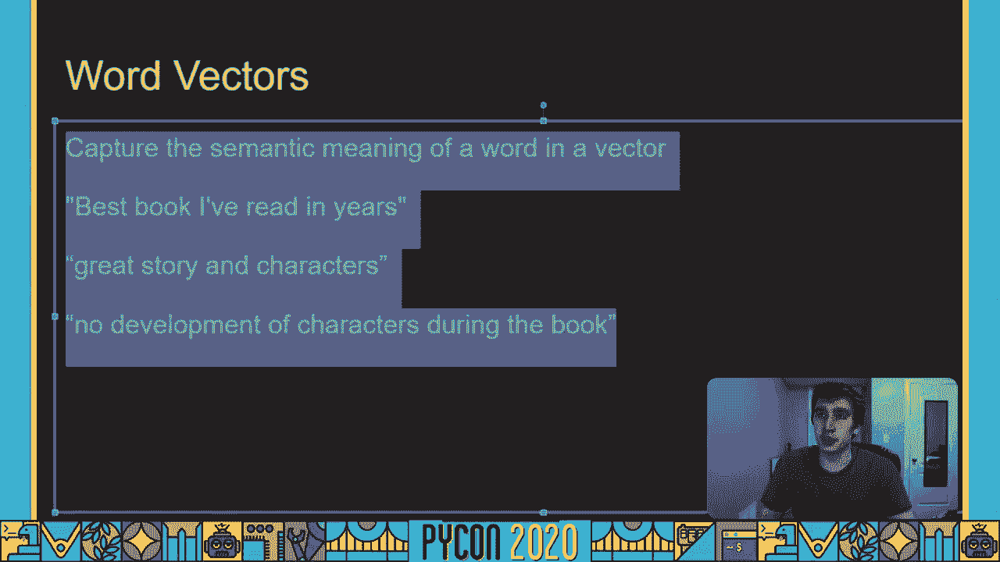

我觉得最好的地方，嗯，在 python中轻松使用单词向量。
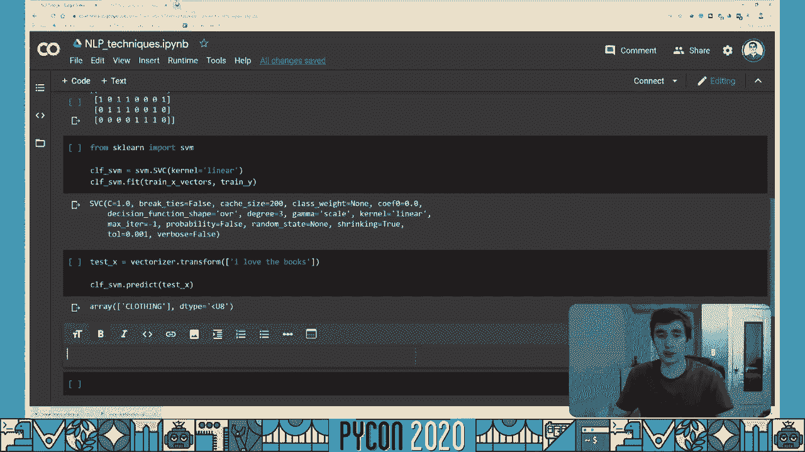

可能是利用史派西图书馆。

所以每当我想记住如何做这样的事情，你知道我会用谷歌搜索，找到一些关于我如何使用空间的信息，以及他们提供的向量这个词，如你所见，我们可能要下载一些文字向量模型，因为我们不会从零开始训练。我们将使用已经训练过的东西，然后我们就可以像这样，好像是，是啊，你可以从这里看过去，也许你可以看看实际的文档，但是空间是一个很好的开始，让我们开始实施这个，在我们使用史派西图书馆之前。

我们需要使用史派西图书馆，我们需要下载这种语言，这些火车矢量，我之前已经做过了，所以我要把我的谷歌合作文件放到最上面，这可能也适用于木星笔记本或你正在使用的任何东西，或您的浏览器。如果您可能需要在这里安装 pip，但我要插入一个代码单元，我想把这个写在上面，我想发布一些我在这里需要的东西的安装。

因为默认情况下我使用的谷歌公司不会有 spacey语言模型或者 spacey单词向量模型，我们需要的嵌入，所以我们要把它们安装在这里，我可以做 pip安装 spacey，所以我想空间已经安装好了。但有时你需要最新版本，我想这将帮助我们做到这一点，我们要做的是 python dash m spacey下载，我们要下载中等大小的嵌入，但正如我们所看到的 我走过的这个码头，还有一个大模型。

但这可能需要一点时间来下载，但是如果你想尝试一些更强大的单词向量，也许试试那个大型号，好的，所以我要运行这个，好的，所以我们下载了它，一个简短的提示是有时，如果你在使用google collab。你这样做，在更改之前，您可能必须重新启动运行时，就像，想象一下 你已经引进了史派西，我觉得史派西不会认出这个模特，除非重新启动运行时，所以我这么做是为了加倍确定，所以输入史派西，这是我们的第一步，好的。

好像是，它，呃，适当进口，现在我们要做的是把它装进去，我们会打电话给国家石油公司，我刚刚下载的那个词嵌入模型，中等大小的网，所以让我们看看这是否有效，希望它能做到，我们只需要把这个装进去一次。然后它就会留在记忆中。

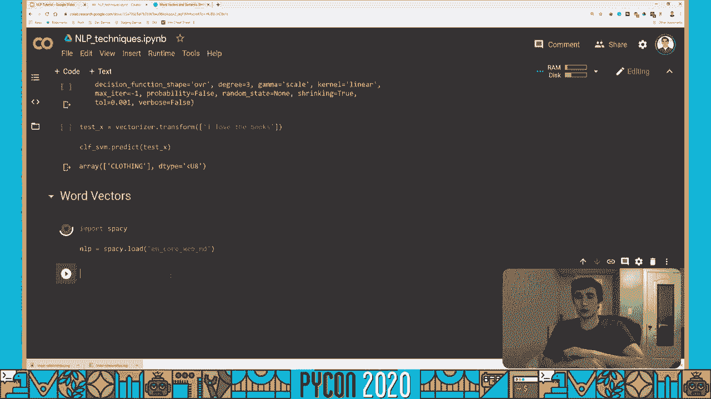

如果你不记得怎么做，字面上，只要做一个谷歌搜索，字向量，史派西，我在看的文章是真实的文档，你也许能在这里找到医生，这将给我们，是啊，你看这个，这给了我们一些很好的例子。这使得它比试图从记忆中找出它要容易得多，我想我可以做点值得到我的向量。

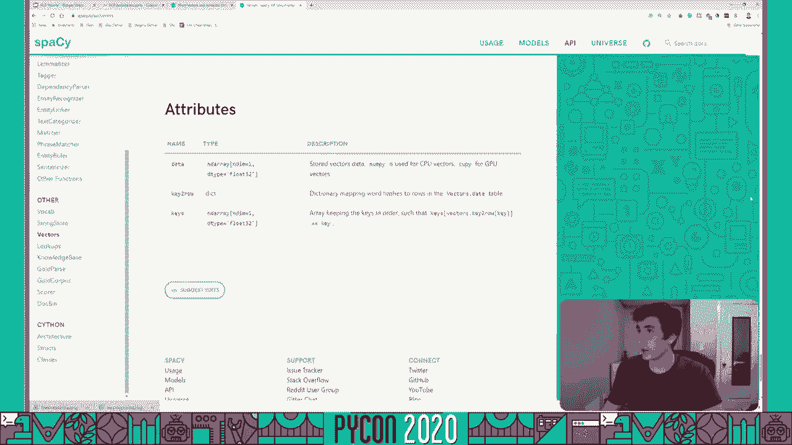

好的，所以我们现在要做的是，基本上我们需要发短信 这样我们就可以，如果我们想使用上面的相同文本，所以我要重新运行这个手机，所以现在我们有了所有这些例子，我们以前在我们的单词袋模型中使用过的。所以这就是所谓的火车 x，现在我要说我们的文件是平等的，基本上我们需要转换。

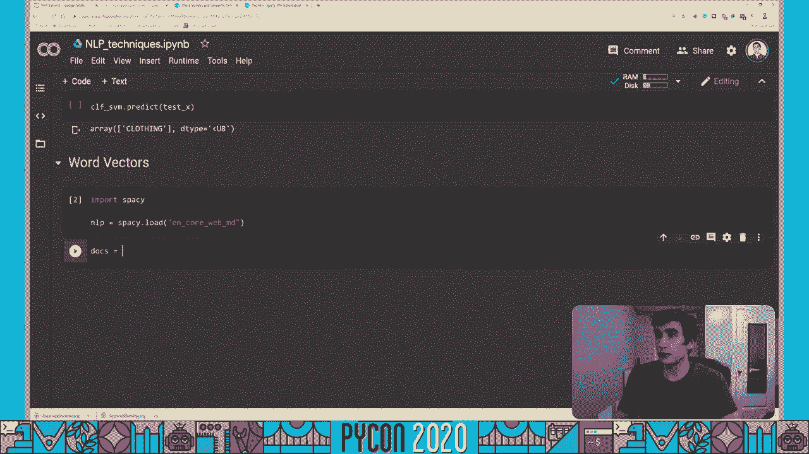

如果我能看到这里的初始化，再抬头看看，字向量，史派西例子，3。我只是想举个例子，看看我是怎么做的，零，一，看来我已经点击了下一个，否，这个就在这里，我们试试这个，好的，看这个，是的，好了，真好。它向我们展示了如何让它变得更大一点，所以你可以看到它向我们展示了如何得到这个矢量，如果我们通过码头和码头，然后我们得到，vector向量，矢量，我想在这里找到它，好的，开始了，是啊，实值意义表示。

默认值为令牌向量的平均值，所以基本上如果我们把我们的短语，再做点向量，它将把所有单独的单词单词嵌入 并将它们平均在一起，所以我想这就是我们最终想要的。

如果我们想围绕这个建立一个模型，注意到这些词向量通常是，他们有，你知道吗，一个维度，一个几百个，所以他们，它们很大，但它们必须是为了捕捉我们需要的信息，好的，所以在我们的火车上，文档将是文本对文本的。我们刚刚定义的 x，现在这个文档列表中的每一个项目都是一个嗯字向量，我们在上面定义的句子的表示，所以我喜欢这本书，这是一本伟大的书，很合身，我喜欢这双鞋，就像你在这里看到的那样。

把火车斧头打印出来 也许对我有帮助，所以我能记住，好的，所以这就是我们最终要转化的，所以现在，如果我把文件打印出来，你就会明白，我想它保持了，如果我把文件打印出来，点向量，哎呀，如果我打印出来，假设。会看到的，这就是单词嵌入表示，嵌入每个单词的平均单词，我喜欢这本书，所以这很酷，我们很容易就做到了 用史派西做了几行代码，现在我们有了这个，好的，所以现在我们有了这个，让我们建立同样的模型。

我们为文字背面建立的模型，史派西模型模型，所以我们可以再次定义一个分类器，我会这样定义，所以我们要定义一个分类器，我要给它起一个稍微不同的名字，我只是说svm，最后给出单词向量的wv，只是为了区分这些。我们希望它不再适合火车向量，但我们要适应，呃，我们将定义一个单词向量，我将调用train x word向量，只是为了与其他的word向量分离一点，这将是，所以我们只是把所有这些作为一个列表。

所以现在我们要把它传递到我们的适合度，而 y的标签和上面的一样，书籍，书籍类别，服装，服装，所以让我们看看这里会发生什么，我们要再来一次，再来一次，SVM未定义，好的。我需要从 scikit重新导入 svm，酷，我想我还需要再强调一件事，我想我们很好，好的，所以我们有了我们的模型，如果我们现在，新颖的话语，所以要做到这一点，我们可以通过一个短语，我喜欢这本书怎么样。

我们在这里再做一次，然后我们要抓住这个矢量，接下来会发生什么，试图在一个地方做得太多，所以与其那样做，我要说的是，测试文档将等于，在这里做了很多事情，对不起，我觉得这很简单，但当我现场直播时，有时很难。所以测试结果等于，等于，单词列表，这么说吧，我喜欢这本书，测试文档，现在是测试的 nlp表示，对于测试 x中的文本，最后向量这个词是，酷，所以现在我们可以预测测试，对不起，我想把它简化得太多了，结果是。

如此接近，呃，我怎么会在这里得到双倍的东西，好的，2。我喜欢这本书，我是说从这里开始，所以承认书籍，但现在让我们试着找出单词向量的力量，让我们输入一些像我喜欢这个故事。我们希望这个故事和书有一个相似的词向量表示，所以当我们做这个平均值的时 候，当我们做这个 nlp文本，把所有这些词嵌入在一起，实际上得到了平均嵌入量的矢量值，我们又得到了一个图书分类，我们去看看。

我喜欢这个故事，也买书，现在让我们尝试测试一些与服装相关的东西，所以我喜欢这双鞋，所以如果这是对语义的正确捕捉，你应该说我喜欢这顶帽子，希望那是他的衣服，好酷啊，我喜欢这些帽子，那也应该是衣服。我喜欢这些书，尽管我们还没见过书，它现在知道书和书更相关，因为它在类似的上下文窗口中看到，是的，我们可以用这个做很多很酷的事情，你知道吗，这些耳环，已经有了四个训练例子。

因为有这么多的力量烘焙在空间词嵌入，一般的嵌入词，即使只是用这个中等大小的模型，我们已经可以正确地预测很多事情，只要知道，你知道吗，语义空间，我认为这个词向量很酷，这个概念很酷。我们可以用这样的语言做很多事情，所以这让我很兴奋，嗯，我想在我结束这一小段之前，呃，单词向量有一些缺点，它们不是万能的，我想你会看到的一件事是，它对我们来说很好，因为我们只有两个类别，我们只有书和衣服。

但如果我们想单独使用单词向量，我们可能会看到这个，嗯，如果我们说使用十个不同的类别，而不是这些短语像四个词，它们就像50个字，当我们试图捕捉整个句子的嵌入时，我们平均在一起大约50个字，单个字向量。所有这些词的实际含义可能会在平均过程中丢失，所以有时它们并不像在这种情况下使用一袋单词那样精确，因为事情会混合在一起，vec单词嵌入标准单词的另一个缺点，这和我们担心的情况有点不同，但是想象一下 我们。

我们试图为单词检查找到某种含义，所以我去银行开了张支票，所以会有支票，在这种情况下会有特定的意义，但如果我也有一个词嵌入，另一句话是让我看看，检查，让我检查一下，这和写一张支票有很大的不同。但是单词向量对这两者来说是一样的，所以你确实得到了有多重含义的词，你确实有点乱，因为它们的意思都是试图，在训练过程中被捕获，最终，这些意义的一部分可能会丢失，字向量很酷，呃相当强大。

但他们并不能解决所有的问题，最终留下了很大的改进空间，最终是，最近发展了很多，正如我在本教程开头提到的。
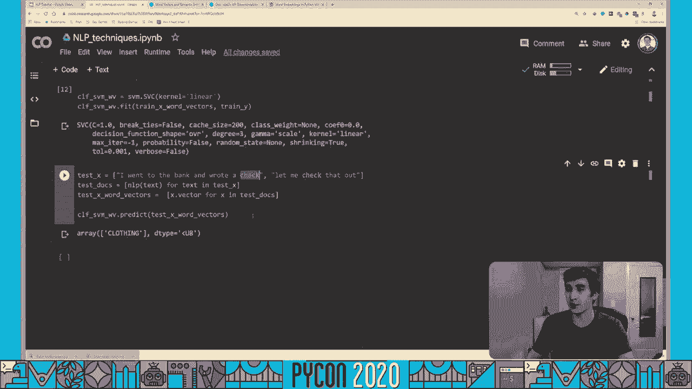

好了，在本教程的下一节中，我们要做一个快速火力概述 一系列不同的核糖核酸技术，所以我们要研究的第一个技术是使用雷格 x的，所以 reg x reg是字符串的模式匹配，它们不是蟒蛇特有的概念。但我们绝对可以在蟒蛇身上有效地利用它们，所以真的很快，我想先简单介绍一下雷格·克斯的蟒蛇，基本上你对它们的看法是，你可以有各种不同类型的电话号码，比如一二三一二三一二三四是一个有效的数字，你知道吗。

也许是一组不同的数字，格式相同，也可以是另一个有效的电话号码，宝贝，你想用不同的方式写，也许你真的喜欢加一个破折号，呃，括号1-2，三冲刺，一二三冲刺，一二三四，这是三种不同的电话号码写法。但它们都是技术上有效的方法，所以我们可以使用抹布的一个方法是模式匹配，比如弄清楚某样东西是不是电话号码，在这种情况下，我们可以看到它有三个数字，后面跟着某种标点符号，或者没有标点符号，后面还有三位数。

后面是四个数字，基本上我们可以定义一个抹布 x，同样的，就像上一个一样，你可以在reg x中定义它可以有一个加一或者任意的加数，因此允许我们，这些不同类型的模式 并有效地将其添加到我们正在编写的代码中。所以你知道，电话号码写电话号码是一回事，它还可能有一个密码检查器，如果你登录一个网站，他们说，哦，你需要一个符号，一个角色，一个大写字母，你的密码里有个号码，它必须是+10，十位数或以上。

reg x可以帮助人们在后端实现该站点，确保您的密码符合这些规范，所以我认为最简单的方法是直接从一个例子开始，所以我要说，例如我们要匹配一个以字母 a和 b开头的字符串，它们可以在弦的中间。它可以有任意数量的字符，它有多少角色并不重要，只要没有空白，所以我们不希望在我们试图匹配的东西上有任何空白，然后它需要以字母 cd结尾，所以每当我在做雷格斧头的时候。

我通常会开始看一个类似reg x的备忘单，以提醒自己我们可以用reg x做什么。
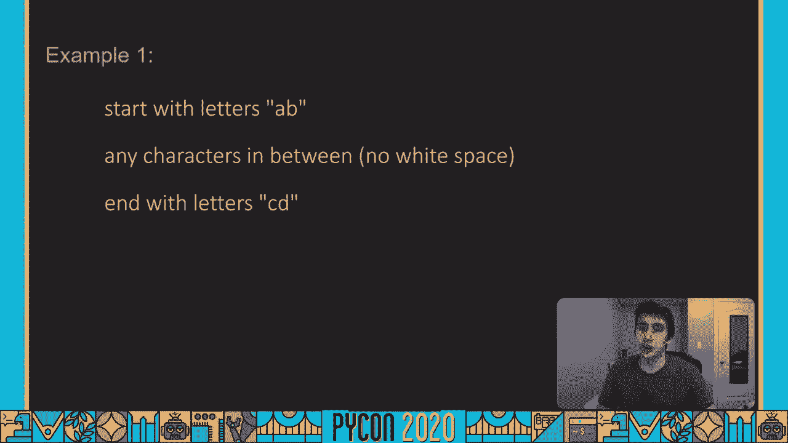

所以我将在 Github页面中链接这个教程，但是像这样的页面有各种各样有用的花絮，所以最终我们要做的是，所以确切地说，这将是一个团体，后面跟着任意数量的字符，所以如果你看到了，有一个特殊的点或时期。这是任何字符，除了新的行，所以也许我们可以利用这一点，然后是这些量词，所以如果我们能有零个或者更多一个或者更多，0或者1 我们可以用这些量词，还有一些其他的东西，就像单词边界是有用的。

但是让我们试着为这个例子写一个 reg x，我刚说了，所以我要去雷克斯1 0 1网站，它实际上有你可以测试的味道，所以我点击了蟒蛇，所以我说的是它需要是一个 b开始，后面跟着任意数量的字符，哪个时期。不管有多少人，所以它可以是星，这意味着一个可以是零或更多，其次是 cd，所以这就像基本的实现，因为我们可以看到 如果我做了一个 b c d，它符合，如果我做了，所有这些，然后是x什么的。

因为它不会以 b开头 也不会以 cd结尾，继续，我说过不能有任何空白，所以现在我们需要修复我们的抹布，以禁止白色空间，回到我们的备忘单，我们看到有一个打结的角色，不是 b或 c，所以我们可以利用这一点。同时，空白，这个字符类，所以我们可以继续，斜杠向前 斜杠 s来做空格 我们要在这个括号里做，我们不会留白的，所以让我们回到这里，所以不是点星星，我们要做括号，Not slash s close托架。

然后一个或多个，所以现在我们看到这个是有效的，但这个现在不是了，因为中间有空白，如果我去掉那个空白，现在是比赛了，太酷了，呃，这里需要注意的一点是，我可以做一些像，a b c d xx，这仍然说明。匹配，或者至少是说这条线是匹配的，嗯，如果我们想确保这只是一个，这个开始，这个结束，我们可以用一些更特殊的角色，所以这是一根绳子的末端，这是一根绳子的开始，嗯，这是在没有括号的情况下使用的。

意思是绳子的开始。
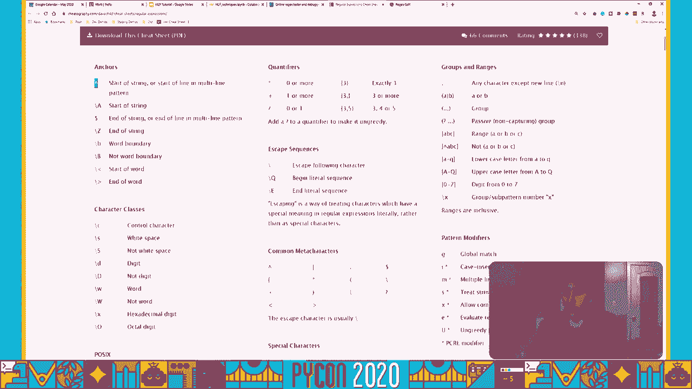

但如果在这里使用，意思是不，嗯。
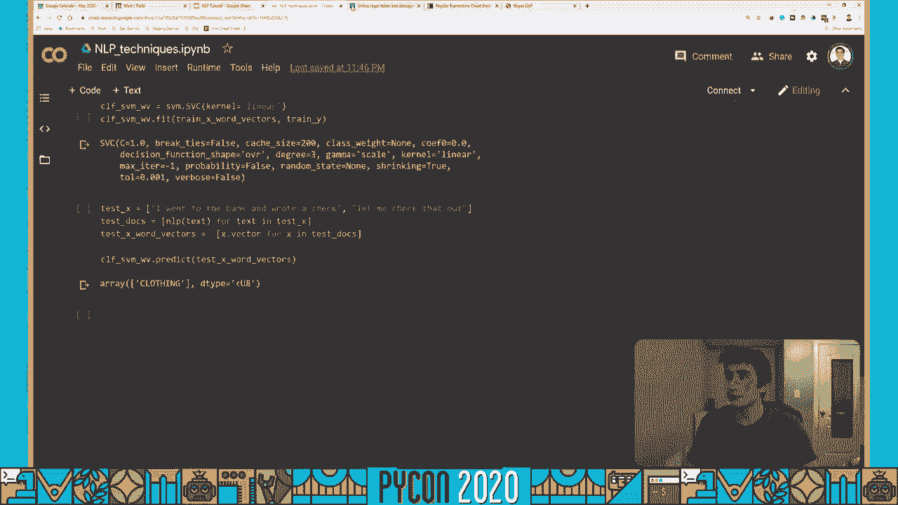

所以我们可以添加它，所以字符串的开始，然后是字符串的结束，所以这个完全不匹配，所以这在代码中看起来像什么。
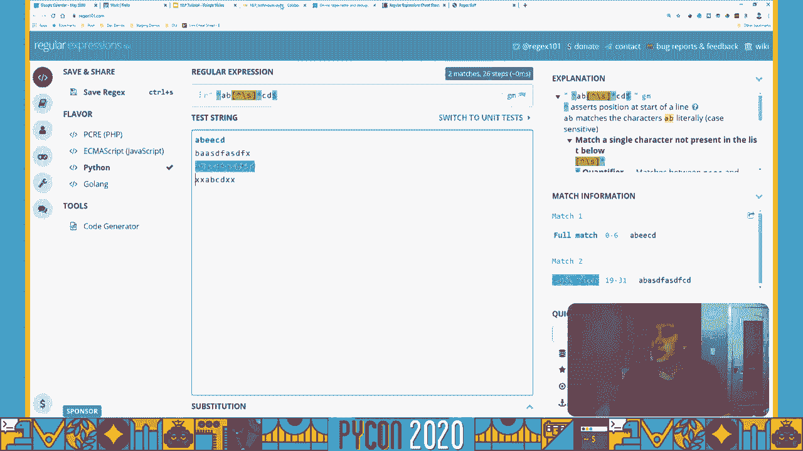

好吧，我们可以很快进入我们的谷歌对话文件，我们可以导入正则表达式库，只是，我们可以从正则表达式开始，我们可以定义为我们想要的任何东西，所以如果我们定义的是我刚才描述的，会是，然后是光盘。紧随其后的是行尾，现在我们编译它来让 python知道这是一个真正的正则表达式，当我们在 python中定义正则表达式时，在它前面用 r，只是为了帮助我们强调并帮助我们现在，然后我们想做的是。

如果我们想看看一些东西，我们可以在这里说，比如测试或短语，一个b空间cd，所以只有第一和第三应该匹配，所以如果我们想确认，如果有匹配的，我们能做的，我们会用到两个主要的函数，当我们检查匹配的时候。我们要做一个正则表达式匹配，首先我们要传递正则表达式，然后我们要传递一个短语，我们想看看它是否匹配，如果匹配的话，我把这当作是有条件的，所以如果正则表达式匹配，我就会得到它。

在名为 matches的列表中添加短语，所以我们得找到匹配列表，好好跑，如你所见，正如我们所料，第一场和第三场比赛，现在这里有些有趣的东西，假设我们取消了这个要求，这恰好是这一行的第一件也是最后一件事。现在他在前面加上了 aaa之类的东西，然后是 ccc 如果我们想检查雷克斯是否在轮胎上，所以我们把它放在绳子里，但这不是开始，不是全部，这里面有些地方不匹配，如果我们重新运行这个代码。

你会看到这个正则表达式匹配函数在这里不再为真，所以当我们在文本中搜索正则表达式时，我们可能要使用的另一个主要的东西是重新搜索，正如你现在所看到的，它仍然与这两个匹配，很快，把这个应用到我们的玩具例子中。假设我们想创建一个正则表达式来匹配阅读的故事和书籍，或许我们制定了某种严格的规则，我们制定了一些严格的编码规则 来确定某些东西是否属于图书类别，所以，如你所见 这个正则表达式，这是或的标志。

它计算那些快速的新的，如果我们想让我们的记录，更复杂的是，我可以尝试欺骗这一点，并说像历史一样，而不是阅读，我可以说，呃我，汽车踩踏上山，我不知道这是否有意义，但你可以看到里德在里面，但它。它实际上并不是指阅读这个词，会注意到仍然匹配那些东西，所以有一件事很有用，那就是这个词的边界字符在reg x中，所以向前，斜杠 b表示它需要，现在看看当我再次运行这个时会发生什么，没有匹配。

所以它现在知道这个故事必须是自己的，使用斜杠b格式还有一个好处，那就是你可以在结尾有一个句号之类的东西，它知道这是一个词的边界，所以这就像一个方法，我们可能会把它应用到我们一直在研究的例子中。但是抹布的用例太多了，下一个是 X，我们将快速地研究蟒蛇的词干和片状化，这是两种规范文本的技术，我的意思是在我们的第一个例子中，我们看到了一个例子或一个问题，当我们用单词书训练模型时，它不知道书的单词。

尽管对我们来说这很简单，嗯，因此，根茎和分层可以做的一个例子是把书，把它简化成一种更规范的书，它可以做很多不同的事情，所以想象一下，这些技巧可以帮助你把阅读变成读书，去写故事。这里是有一点不同的地方 词干遵循一个算法，并不能保证给你一个真正的真正的英语单词，所以它可能会把它简化为故事，然而，对于文学化来说，它需要故事，它实际上是在用字典，确保输出中的所有东西都是一个实际的词。

所以这将输出故事在那里，那么我们在蟒蛇中如何使用它，好吧，我觉得图书馆，呃，对你来说最简单，我做了什么，最容易访问词干 etization的库可能是 NLTK库，所以我们将使用 NLTK库，好的。所以首先我们需要导入 NLTK，nlt NLTK代表一个自然语言工具箱，我不知道我想做太多的进口，我们还需要导入一对或者下载一对，嗯，NLTK的东西，这应该是开箱即用的，我相信只要你做了，你得到下载。

所以我们得到了停止词，WordNet和，我想停止词是为了我的下一个例子，我不知道我们是否需要它来进行止血和结扎，现在让我们从口吃开始，所以口吃，我建议导入两种不同的东西。我可能会推荐导入 tokenize库，它基本上可以把一个句子分解成单独的单词，以及真正的口吃，我们将在这个例子中使用波特结巴，所以我要做关键的 NLTK梗，我们会引进搬运工口吃。

现在让我们开始初始化口吃，现在我们可以输入一个测试短语，所以读书会说，首先我们需要标记一下，因为如果我们只是想阻止，但只要试着，我做口吃梗，这就是你要做的一切来阻止这个短语，它不知道如何处理这个。因为这个算法只需要一个词，所以我们要把它标记为，所以我们可以说几句话，我们短语的等词标记，现在我们可以做的词干词，我们要做一个循环，所以字里行间，我们要阻止这个词，单词的结点 词干。

我们会把它附加到词干上，现在我们可以做一个词干空格的连接 作为最后的事情，所以我们从读书开始，口吃让我们开始阅读这本书，立刻就可以看出这对，就像我们之前做的那个文字袋模型，哪里。如果你没有很多训练的例子，如果你确实阻止了你有的训练例子，并阻止了任何你没有接受过训练的短语，这可能有助于提高准确性，这里有几个例子可以看，所以，如果我做了，我说故事有点奇怪，看看怎么样嗯。

把它茎到故事里，所以它不能保证有一个字，有时你会得到，两个不一定相似的词的碰撞，所以有一些缺点，但这是一个很好的快速技巧，我想我只是想检查的东西与整个标记，需要注意的一点是，你可能也想去掉你的标点符号。或者分开处理，如果你想回一个有意义的短语，因为正如你所看到的，呃，至少我是这么定义的，你得有点狡猾，因为当你把这个标记为，我把单词打印出来，它把标点符号当作自己的词，好吧，转向拉莫纳化。

word网络解码器，所以这是使用这个叫做 wordnet的语料库来帮助，嗯，把这些词简化成更简单的形式，嗯，和上一个很相似，我们可以做，莱蒂泽，等于 word net，和前面的例子一样。我们需要标记我们使用的任何短语，天啊，我不是故意复制手机的，不删除这个，我只是想复制这个部分，所以读书，让我们看看会发生什么，如果我们，嗯，这个我也抄，否，不是牢房，只是那件，很简单，而不是茎。

它被压扁了，那是两安培，印刷层压，或，我想我们可以，我们会再次加入，卷曲词的点连接，好吧，如果你读了这本书，好的，嗯，它把它变成了，读这本书，这里有一个，在 NLTK中使用 lamidizer有点棘手。对这些词的期望，它期望说话的部分，默认情况下，它，嗯，默认情况下每个标记都是名词，所以这就是为什么我把书变成了一本书，但不是为了阅读而阅读，如果我说这些是，所有，嗯，动词，会看到它是读这本书。

我想这很有趣，呃，还把书做成书，嗯，他的书是的，我想就像，如果你把书当作动词，你喜欢他预订它，呃，这将是一本有意义的书，所以我想书上有一个动词，但是是的，唯一需要注意的是你，你试图有效地利用这一点。有时你得做一些语言标记，我相信我会在教程中讲到，嗯，然后利用这个词尾来表达，真正减少所有的文字，但减少你所有的名词短语或动词 也可能是有帮助的，所以这就是类型化，接下来我们继续。

当我们还在看 NLTK的时候，停止言语，基本上停止词是一组最常见的英语单词，有时我们可能想把这些从我们的短语中删除，因为它们不会给我们的句子增加太多的意义，所以几个停止词的例子可能是这个，他它。这些他们，这些类型的东西，所以我们可以很容易地在NLTK中做到这一点，所以我们开始了，好的，所以我们将继续使用 NLTK，我们已经进口了，我们要做的是，嗯，其实，也许只是为了帮助，会有帮助的。

如果我复制了这个，一个浆糊和那个，然后我们还将有副本在实际的停止词，所以我们要输入停止词，开始了，所以我们的车站，我要说的是，嗯，我不想做 停止的话，因为否则我就会覆盖这个停止词的输入。所以我只会说停止的话，等于停止词，点字，然后我们就有了想要英语的热情，我想如果不学英语的话，所以让我们，打印停止词和，我想是，哦，我想我想你必须指定英语，因为我不知道那是什么意思，嗯酷，我是说，我自己。

我们和，我很好奇，一共有多少，所以停止词的长度，一百七十九，所以我们可能要抽出179个单词，这只是给了我们一个很好的简单的界面来做这件事，所以我们可以做的是我们可以有一个短语，就像以前一样，所以。停止词的删除，从这句话开始，现在我们将把它标记为，就像我们以前那样，所以我们的言语就等于言语，短语的标记，然后用语言表达，我想我们的，剥离短语，我叫它等于，嗯，然后我们可以把它附加到剥离短语中。

如果我能做到这一点 在这个理解，也是，所以不管你喜欢什么词，然后我们可以做连接的，或者我们可以把这个作为一个列表，因为我想它可能不完全有意义 作为条状射线，嗯，我们无论如何都要加入他们，加入剥离短语。好了，这里的例子句子演示移除，停止言语，所以是一个，我们都被删除 作为停止词，如何帮助我们回到上面的单词向量模型，嗯，如果我们说我去银行开了张支票，你知道吗，我们可能会被这些停止词的实际含义所困扰。

当我们把这些词向量平均在一起时，所以去掉停顿词可能会让我们更精确一点，在这样的事情中捕捉意义，这只是一个例子，还有其他一些例子，下一步删除停止词是有帮助的，我们要做一个快速射击的快速射击。我将快速浏览另一个名为文本斑点的库，它可以让你用语言快速访问各种不同的小事情，它建立在 NLTK库的基础上，它提供了一个很好的界面 可以做很多不同的事情，所以我只想说各种其他的技术，我们会研究拼写校正。

语音标记的一部分，所以当你想使用这个教科书库时，我建议你看一下。
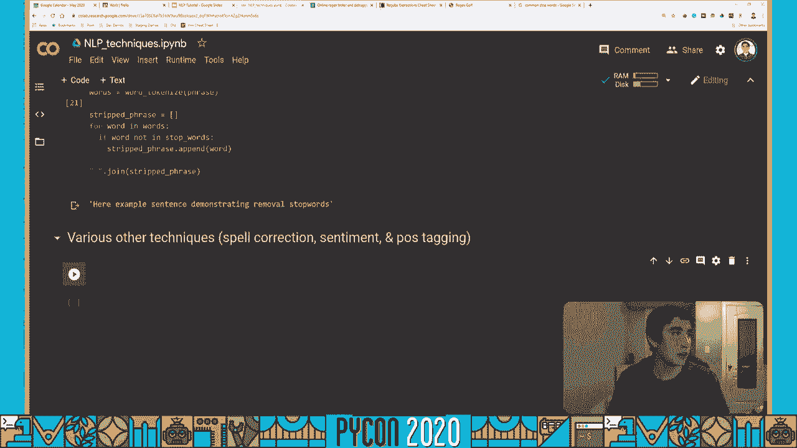

参考和我会确保我链接这在资源 txt我提到将在我的 github，但这是一个非常简单的寻呼机，有各种各样的好东西，你可以这样做，从文本 blob导入，文字博客将是我们的第一行，如你所见。只是在这里取一个短语，B标签，我们已经做了部分语音标记，你可以做一些名词短语，言语点缀着感情，嗯，做所有这些事情，就像一条线，就像一个小点什么的，所以我首先想看的是，咒语正确，哪里是正确的。

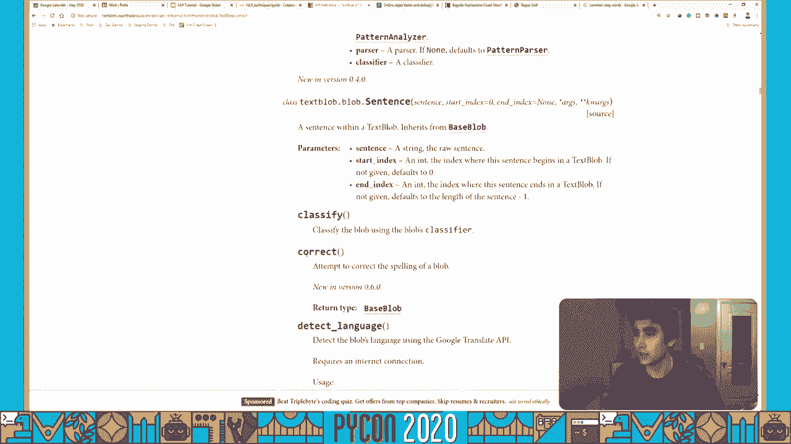

开始了，让我们来看看文本斑点的代码。
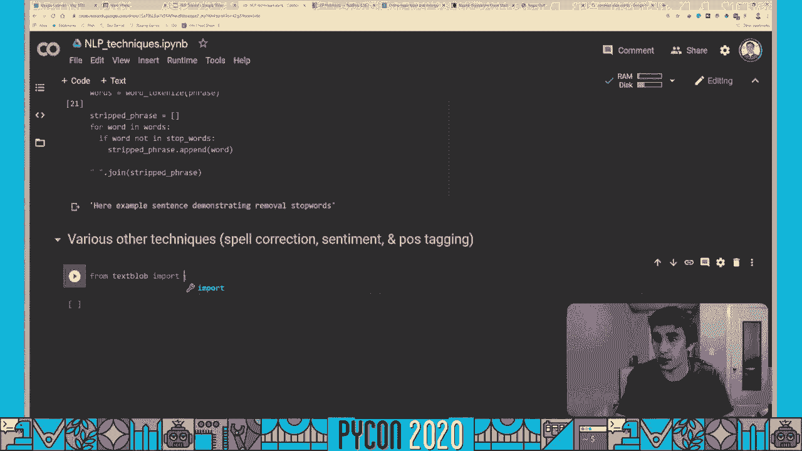

好的，所以每当我们用文本斑点做任何事情时，我们要从烘焙开始，基本上是烘焙我们的短语，文本 blob对象。
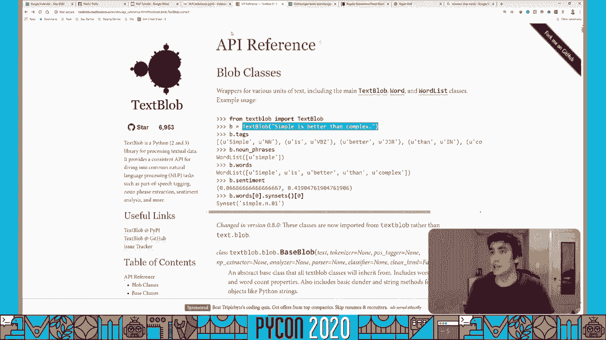

可以说任何它是平等的，这是一个例子，接下来我们要做的是，我们甚至可以把它围起来，或者我就说一句，一个文本斑点短语，或者把它转换成文字块 然后短语，好的，现在用电视短语，我们已经可以做各种各样的好事了。所以我提到的第一件事是拼写正确，所以你所要做的就是正确的电视短语来纠正那个咒语，呃，这是一个例子，如果我说这是一个例子，用两个是看，它仍然是，这是一个例子，如果我在这里用两只眼睛，可能还会觉得看那个。

它很快就纠正了这一点，当我提到本教程最初的目标是，你知道吗，获取推文并进行处理，你可以想象很多推文拼写错误，所以能够进入，你知道我们可以很容易地把这两行代码，实际上即使是一行代码。如果我们真的想变得花哨，嗯，对一个短语进行拼写纠正，这很有帮助，那么我们还能用文字博客做什么呢？好吧，我提到你可以做一些演讲，标记，我要回到我们的阅读例子，所以我看了那本书，所以很明显我们没有拼写错误。

但我们可以做的一件事就是，我只需要做点标就可以了，好的，我们说什么，看起来您缺少了该特性所需的一些数据，好的，所以我要把这个加到我的，嗯，google collab文件，就像我之前下载了一些东西。我会的，酷，搞定了，现在我们应该可以做一些语音标记列表，对象不可调用，可能只是标签，它可能已经被烤熟了，你看那个啊，所以我们有我，是个名词，我们读到，哪个是动词，我们有，它代表什么，然后是一本书。

是另一个名词。
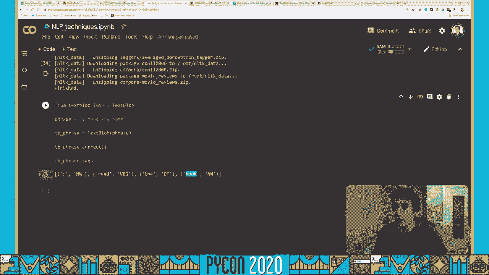

嗯，如果你抬头看，就像语言标记的一部分，你可能会发现不同的信息，所以我会把这个链接到我的 github上，我发现这个页面是一个有用的资源 来了解你所看到的不同的东西，所以我们确实看到了，好的。就像 dt是，这些东西到底是什么意思，嗯，像副词一样的副词，我们可以看看这个帮我们找到，所以这是终结者，dt现在被称为单数，现在被称为复数，所以是的，这里有很多有用的信息，所以我会把这个链接到。

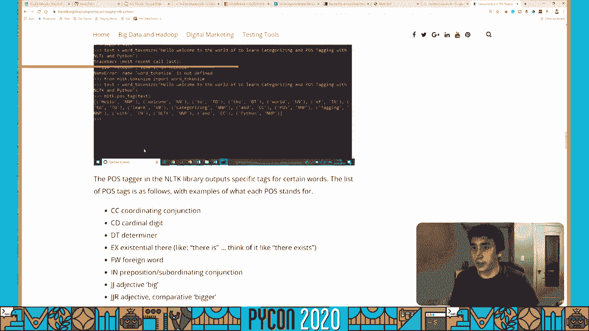

如果你想知道更多关于这里的标签，另一件很酷的事情是，我们可以做感情，可能要做这样的感情。
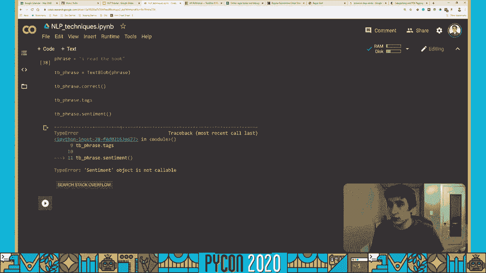

我看看，回到参考文献，是啊，只是感情问题，好的，嗯。
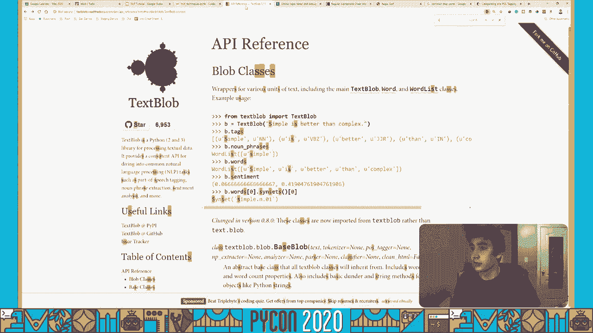

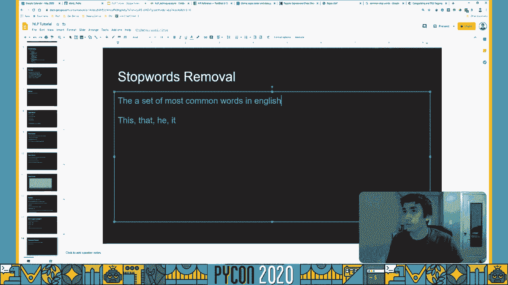

极性零点八，所以这里的高数字意味着正，太糟糕了，在那里我们看到有负面情绪，因为这是一个，你知道吗，极性中的负值，嗯，这本书是另一个例子，这本书很可怕，另一个反面例子，所以你可以看看情感的细节，但是是的。在 text blob的这个 api引用中。

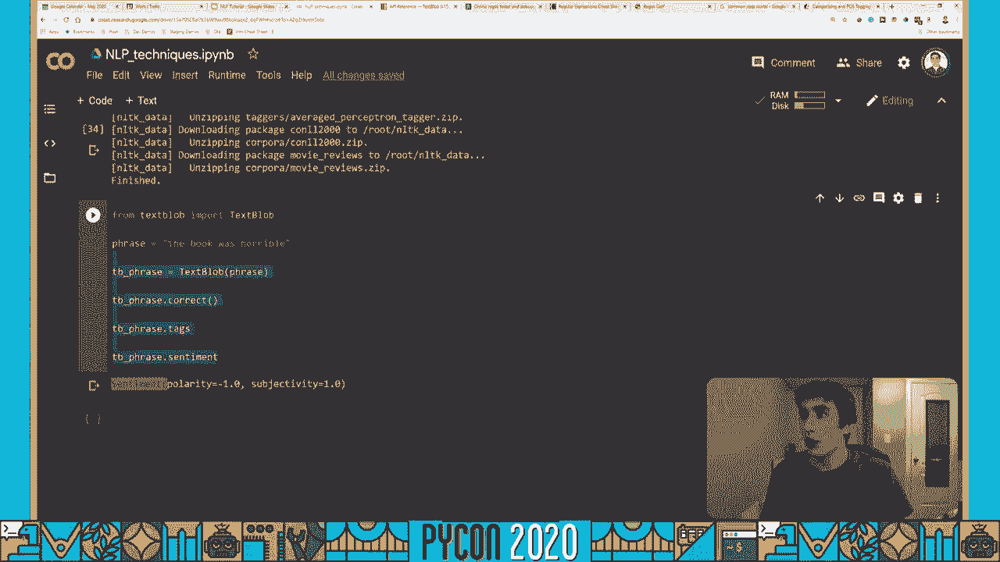

有各种各样的，你能做的简单的事情，所以这是另一种可以利用的资源，我想说明的是 本教程的主要目的之一是向你展示你可以使用的所有不同的东西。
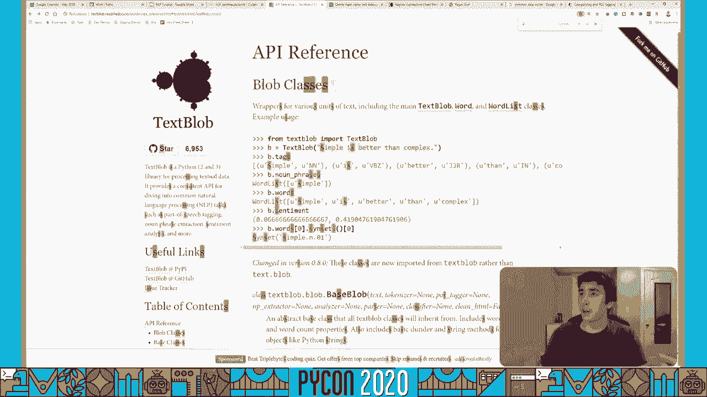

所以你可以建立在这些知识的基础上，并在你认为合适的时候应用它，和你自己正在做的事情。
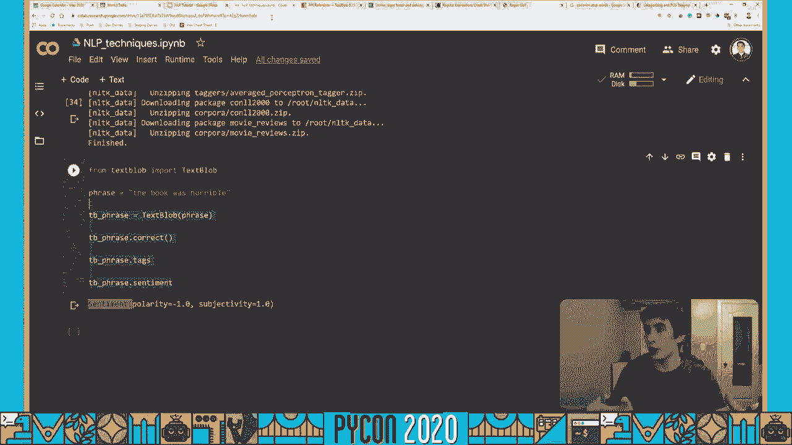

因此，走向自然语言处理的最先进的模型，我想从递归神经网络开始，如果你还记得单词向量，我们对他们的一个问题是他们有点一成不变，一旦你训练了你的单词向量，不管你用什么方式 在一个更大的短语中使用一个词。你训练的那个矢量，所以我们没有上下文相关的词向量，当我们使用预置训练的预置时，一组预先训练好的字向量，所以即时递归神经网络可以帮助我们解决这个问题，这里我有一个递归神经网络的图。

所以递归神经网络如何与语言一起工作，我们会一次一个地向网络输入文字，所以我们会，就像你知道的，单词检查，进入我们的网络，所以网络会处理并产生一个基于它的隐藏状态，把这个隐藏的状态带到下一个，嗯。你知道吗，递归神经网络的层，所以也许下一个词已经出来了，所以现在我们有了结帐，全部输入同一个网络，基本上我们想做多少就做多少，我们总是把最后一次输入的输出反馈到网络中，所以我们看了这本书，你知道吗。

我们把这个放进去 然后在书的结尾创造一些东西，我们会得到某种最终的隐藏状态，我们可以利用这种隐藏状态，所以这样做的好处是，如果我们有另一个短语，那就是，给我写张支票，好吧。支票在这里的用法是在句子的开头，周围没有别的词，嗯，你会得到一种不同的嵌入方式，当它说，写张支票给我，根据上下文给我写一个，你知道吗，嵌入，这最后一个隐藏的状态让我更多地与银行联系在一起，而不是结账。

这本书会更多地与，更多表示检查的隐藏状态，如，你看，这就像一个小玩具的例子，但这最终是我们的目标之一，类似于递归神经网络的东西，但是递归神经网络，你知道吗，一段时间。这是一种建立各种最先进的语言模型的方法，但它确实有一些缺点，最终被，就像开放的，我在视频开始时介绍了两个模型，以及其他一些类型的模型，那么这些缺点是什么呢，好吧，首先我要说的是。

长依赖关系并不总是与递归神经网络很好地工作，所以想象一下你有这样的句子，比如我今天需要去银行，这样我就可以存款了，我希望在我们吃东西的时候 它没有关闭，我们会把这些话输入到网络上，像往常一样。这种隐藏的状态会从这些词的每一个中产生一些影响，当我们关门的时候，像银行这样的词是相当遥远的，所以在最终的输出中嵌入隐藏的状态，网络可能不清楚 我们所说的披露的是银行，因为在这句话里太遥远了。

所以这是递归神经网络的一个缺点，另一个缺点是更多的是在性能方面的东西，因为我们每次只给它们一个辅币，这种顺序性使得有时很难瘫痪 rn和语言模型的训练和使用，你知道我们不能有效地利用现代的 GPU。所以这让我们注意到，一份大报纸出来了，引起了人们的注意，这就是你所需要的，在自然语言处理领域掀起了一股新的浪潮，那么注意力和注意力有什么区别呢？好吧，基本上你可以用一个短语来喂养。

当你遍历这个短语中的标记时，你基本上可以，弄清楚什么需要注意，所以如果你想通过这个句子，我要去银行开支票，好吧，你知道对不对，当我们说到，当我们到了单词检查的时候，假设我们把这些都放进去。所有这些都是同时输入的，使用这些位置编码，所以不必一个接一个，如果你说到一个词，就像检查好，我们可以，它可能会像相关项目一样 从右边和银行里长出来检查，我要走了，可能要出发了，如果你向前看。

银行可能会被触发，就像一个重要的指标一样，呃，etc，所以基本上我们是基于我们看到的单词，我们的网络学会了注意其他词，并找出什么是最重要的，如果我们看到的是某种标志，把它提高到一个高水平。我们能想到的网络，学会提问，关于它看到的短语，这些不是你知道的，他们不是真的在问，你知道人类的问题，但是进入了这些关注网络，他们基本上是在看每一个令牌，这句话还有什么重要的，这是一个超级强大的技术。

而且，与传统的RNN相比，这种关注可以在更长的依赖范围内工作，所以这在 nlp的世界里引起了各种各样令人印象深刻的事情，嗯，所以视频的开头，我提到了开放，AI gpt两种架构，嗯，有一件事要注意。这就是它向前的本质，所以基本上这个训练的任务是语言建模，所以说点什么，后面的词是什么，那就是，为什么它真的很擅长像故事一样自动完成，当我输入一个短语，它可以利用它受过训练的事实。

在预测下一个词应该是什么的基础上，它已经看到了，嗯，所以让我们打开一个 gpt，GPT，还有这个埃尔莫网络也在这里列出，我只想记下这个，我不太了解爱尔摩网络。但需要注意的一点是 它使用了 LSTM 它是它的核心，LSTM是一种递归神经网络，它应该能更好地处理更长的依赖关系，但还是和，实际上我写的标题是这样的，作为变压器架构。

但严格来说 艾伦并不是一个变形金刚，它只是另一个强大的语言模型，嗯，最后我们要关注的是，它是一种双向变压器结构，因为它是双向的，它，呃真的捕捉到了很多，嗯，关于语言的令人印象深刻的事情。即使像 opa bt模型，所以我们要看看如何使用蟒蛇并与伯特模型互动。

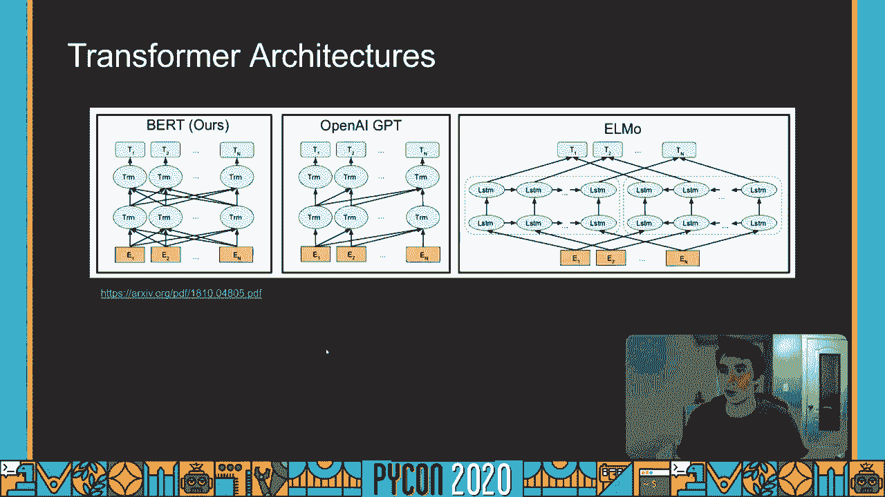

很快的，好的，所以要做到这一点，我们又要用史派西了。
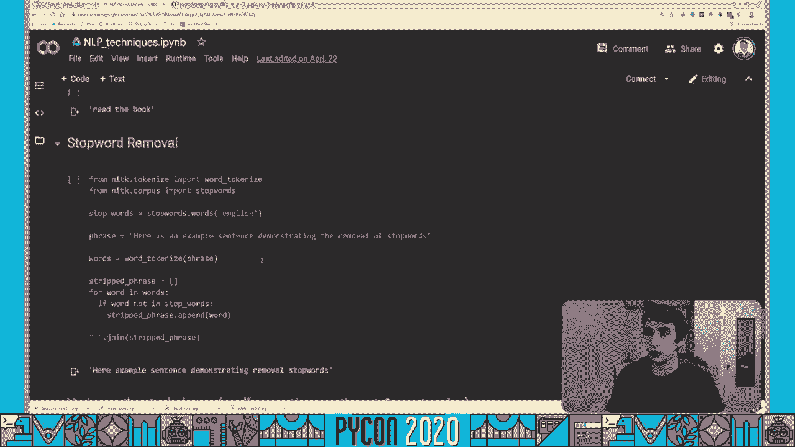

所以我会把这篇文章链接到我的 Github页面上，呃，但基本上史派西为我们提供了一个与变形金刚互动的简单方法，如果你按照这个链接，基本上它会给你所有你需要的台词 很快就能起床和运行。所以让我们利用史派西，很快的，所以我们首先要做的两件事是，安装 spacey变压器和 python dash m spacey，下载这个模型。

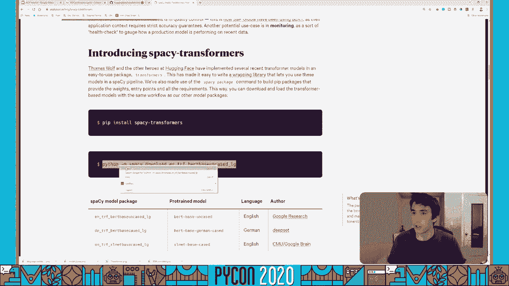

我想做一个标题，不是电报标题，嗯，所以我们想下载这个大模型，我们还想做一个斯派西变压器的安装，这些解释是什么意思，我很确定只有这个牢房，在 google collab中只能运行一次。所以我们不会意外地再次下载模型，下载并花了一点时间，但成功地冷却了好吧，现在我们实际上是如何，既然我们已经下载了，我们可以回到那篇文章，看看我们如何实际使用它，看上去很简单，你可以。

如果你用的是 gpu，你可以利用这些代码行，你会注意到一些细节，我要去，只是我会复制这个在真实的，快点，我想我所需要的，会是，我现在不打算用这个，我不打算用我的电脑，别以为我们现在需要麻木。所以我认为你需要引进史派西和火炬，它应该是好的，然后我们把这个大的伯特模型，当我们使用变压器时 需要注意的一点是，我们不打算训练它，当我们使用像伯特模型，我们可能不会从零开始训练它，嗯。

伯特模型本身是超级超大质量的，它需要多天，就像一些最强大的张量处理单元机器来训练这个模型，所以这不是你想做的事情，你知道在家里，但幸运的是他们开源了这些模型，我们可以有效地利用它们，嗯。有一件事需要注意，即使你，你，你正在加载这个模型，已经预先训练过了，其中一个很好的特点是，像这样的模型的一个好的特点是它们可以被微调。

所以你可以在你的特定任务中微调它们 通过这样做得到一些令人印象深刻的结果，好的，所以运行这个看看它是否正确加载，如果你用的是 google collab，您可能需要重新启动运行时。有时它不知道这个模型在哪里，除非你那样做，好的，酷，我们拿到了，嗯，现在它就像它就像如果我们使用史派西，现在我们已经装载了这个伯特模型 作为我们的 nlp引擎，基本上我们可以做完全相同的事情。

就像我们在教程的那个部分做的词向量一样，所以我们开始了，所以基本上我想我要做的就是找到另一套训练用语和测试用语，就像我们在这里做的那样，我很快就会把这个复制下来，因为我觉得没必要写。因为我想稍微改变一下这个例子，所以我们将看到伯特和变形金刚的力量，好的，所以这次我定义了另一个类别类，但这次不是书和衣服的区别，我们的两个类别是与图书有关的项目和与银行有关的项目和。

我们很快就能看完这些，好的，酷，所以让我们围绕这个建立我们的模型，这是完全相同的代码，基本上我们以前用的，我们现在需要，所有的改变是我们有这个模型作为我们的 nlp引擎。相对于我们之前使用的向量 这个词，好的，所以我只是在这里复制一些代码，这是耶，我说过了，这和我们之前使用的代码完全一样，所以我们可以在这里的火车上训练它，所以我要运行这个细胞，很快的。

所以我们要训练我们的模特，我们可以预测新的话语，所以我就从一个玩具的例子开始，说书，好的，所以说这里的书，那是，呃，我们所期望的，我想在这里注意一件事，尽管是我们的训练用语之一，是借书，所以这个例子。我刚刚走过，你可以说，看看这本书，但如果你写的是更多与银行相关的术语，你可能会说我需要写一张支票，所以我要输入，你知道我需要写一张支票，你知道在我们的交易中。

检查单词检查只出现在我们培训用语的书籍类别中，后面这三个是关于银行业的，需要在银行存一笔钱，余额查询，节余，省钱，没有提到单词检查，因此，一个真正的测试这个伯特模型的力量是，哦，它知道吗。当我们说我要开支票的时候，我们说的是银行业，别说这个词，我们已经在其他类别中看到了，让我们来看看真相的模式，我需要准备检查，利用伯特模型的力量，就像一些小的训练例子，我们看到，是跟银行有关的，呃。

你也知道，也许你说过，看看这个故事，你又知道了，它知道这个上下文中的检查是，是关于书的，所以这真的很令人印象深刻，因为我们训练了这么大的模型，利用它真的是非常非常强大的东西，你可以继续玩这个。
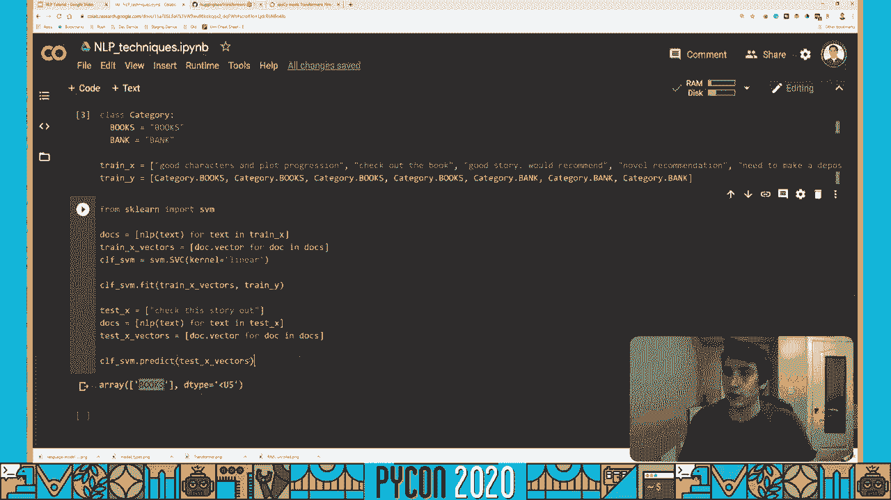

呃，我建议你调查一件事，就像我提到的，是你能用像伯特这样训练有素的模特做的一件好事，这里是你可以微调它到一个特定的任务，这里有一些他们在 spacey中使用的代码来告诉你，你要好好调音，NLP，嗯。你知道吗，向特定的，你知道吗，可能是分类任务，所以这真的很有用，呃，接下来我想说的是，史派西提供给伯特的这个界面真的很不错，但绝对有空间，如果你想建一个像伯特这样的模型。

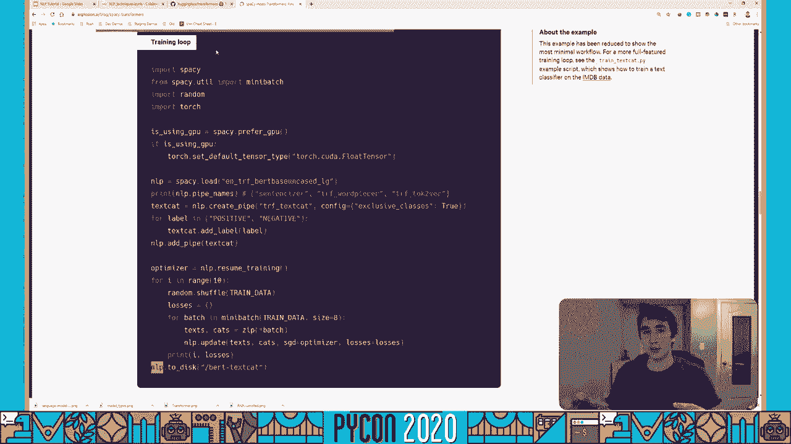

你不能这么做，所以如果你想，这些类型的模型，我建议你退房，拥抱脸，变压器，嗯吉瑟布，回购，在这一点上，他们几乎有所有最受欢迎的不同，呃，最近在自然语言处理领域出现的模型，他们有那些用手电筒写的模型。你可以用它环顾四周，就像伯特，这个模拟伯特文件，你会看到这里定义了一个完整的 pi火炬模型，所以如果你想建立在伯特的基础上，把它调得特别好 或者你可以用这张拥抱的脸，图书馆，所以这就是。

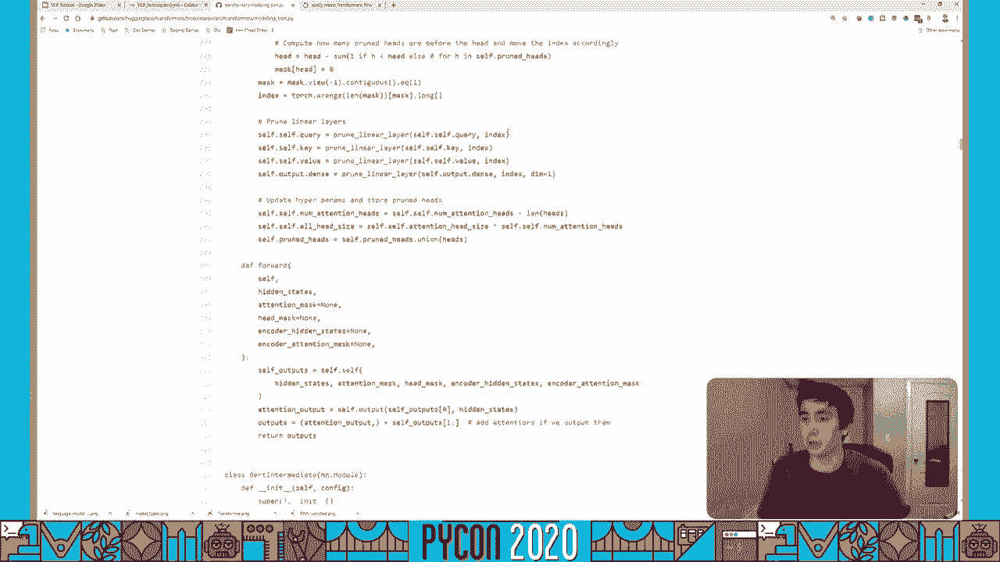

呃，我们要谈的是，嗯，以及代码如何轻松地与之接口，有一件事我想指出的是 我只能告诉你这么多关于伯特的真实的内部运作，这个教程我更关注的是快速跟上速度 并在 python中使用它。但我会在github repo资源上列出，你可以去了解更多关于这些类型的东西，好吧，这就总结了我们在教程中要做的大部分事情，继续提高你的 nlp技能，所以如果你去我的 github页面。

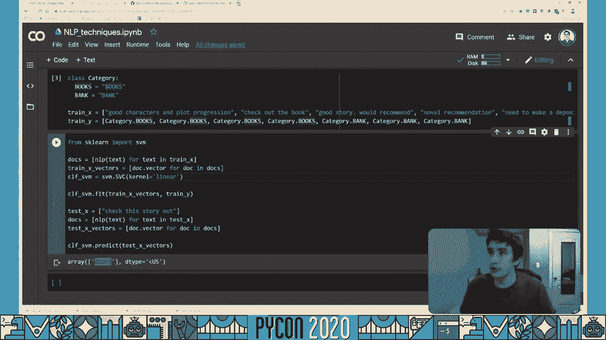

Github dot com，斜线基思，厨房，斜纹蟒，二十二十，还有一组不同类别的亚马逊数据，每个都是相同的类别，这个任务的目标是基本上使用这些训练数据 并构建最好的分类器。你可以在这里对评论进行适当的分类，在，那个，你可以从更大的角度来考虑这个问题，假设你是负责，社交媒体，就像大型零售店的分析，你会让人们一直在推特上谈论你所有不同的产品，你想建立一个模型。

像这样的模型会非常有用，所以这个任务的训练和测试数据，我还提供了这个 nlp运动笔记本，在这种情况下，我很快就走了过去，起床使用这些数据，你也知道，把它作为训练数据加载进去，作为测试数据加载。基于训练数据建立模型，默认情况下，但我还要加上，当你看到这个视频的时候，我在这里见过几个模特，但是这个单词模型可以帮助你开始使用这些数据，然后基本上基于这个模型，根据您在测试集上的表现来评估性能。

所以你可以从盒子里看到，测试中65%的单词被分类，如果你想把它分解一点，更多，我仔细计算了每个类别的分数，正如你所看到的 它在汽车方面做得很糟糕，在美容和书籍方面做得很好，呃，你可以利用这些数据。如你所见，适合并玩弄 构建不同类型的分类器，周围的分类模型。

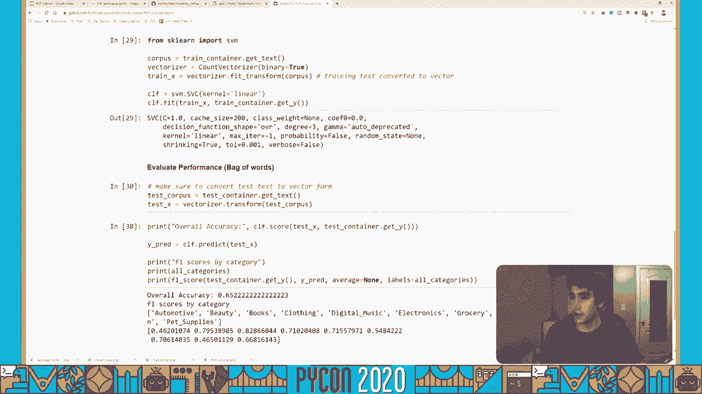

这两个建议，我有，呃，我觉得很有趣的是，伯特模型在这项任务中的作用，我也认为这将是非常有趣的。
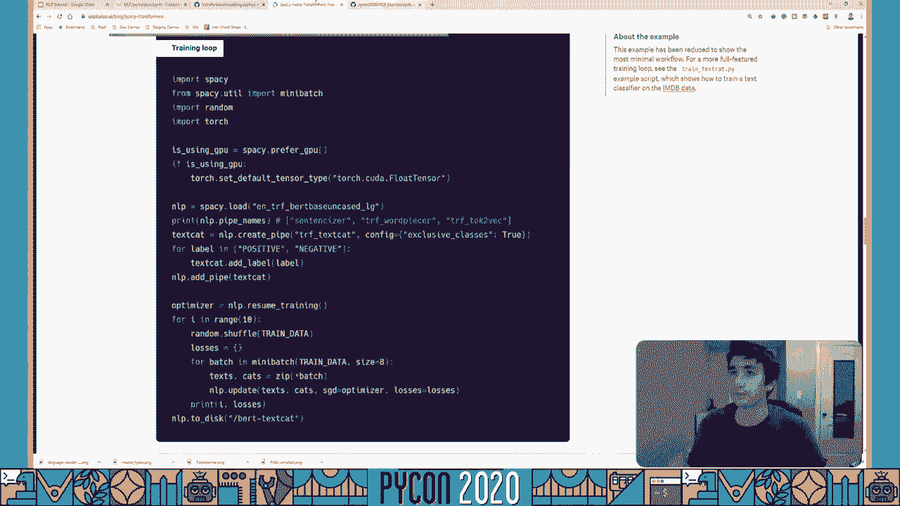

拿着文字袋模特，但也要利用我们提到的一些其他技术，就像讽刺文字和，你知道吗，做一些语言标记，看看你能不能利用这一点，为了让它变得更重要，所有真正有趣的技术来尝试建立更强大的模型，A我在这里还想说什么？

我很快就猜到了 我实际上并没有向你展示数据是什么样子的，但如果我真的点击了这些文件中的一个，也许像美丽这样的东西更容易看到，并链接我的来源，在那里我刮取了所有这些数据，已经有人为我做了很多苦差事。我想给他们荣誉，但是是的，基本上你有这篇评论文章，总是说，呃，这里的类别，这就是美，就像优秀的顶级有机洗发水，我们希望我们的模型能学到什么，洗过的洗发水，这里需要注意的一点是，这不是完美的数据。

你会得到一些非常好的评论，嗯谢谢，他们不给我们太多信息，所以我们不可能百分百完成任务，我们怎么能去掉这些，词的类型，而不是把它们作为训练信息和测试信息，好吧，我们将在这里结束本教程。希望你对 python的一些不同的 nlp技术有一些有趣的了解，我们在这段视频中涵盖了很多，希望我在本教程中的目标是让你们看到这些技巧，并把它们记在心里，这样你就可以把它们建立在你的知识基础上。

并将它们应用到不同的领域，所以这真的就像看到你能做的一切，然后把它从那里拿走，然后去，也只是临走前的一个提醒，如果你有任何问题，请随时与我联系，你知道吗。LinkedIn Instagram Twitter，你可以用一个词搜索基思·加利，你可能会找到我，如果你想找到更多的教程，斜杠 kgm，非常感谢，派康请我，这很有趣，即使不是当面，这不是我所期望的。

但我很高兴能经历这个过程，呃，希望如此，好吧，大家保重。
