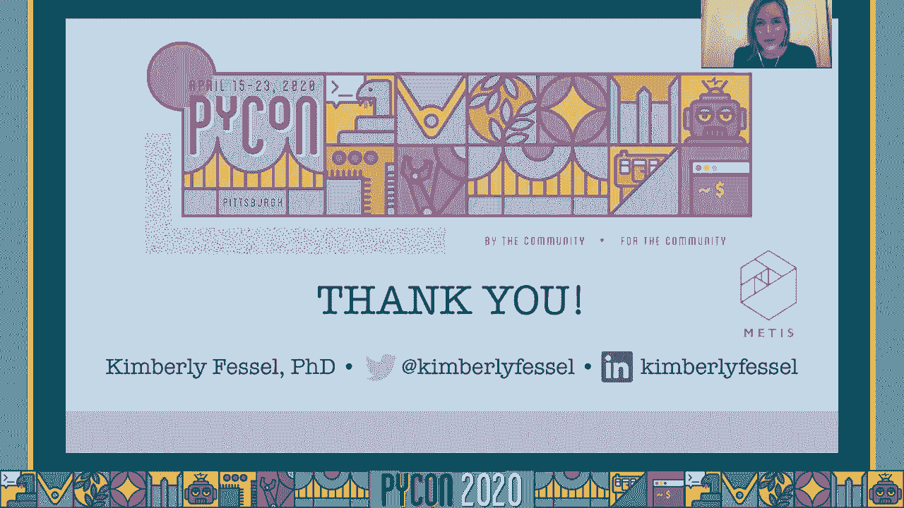

# P82：Tutorial Kimberly Fessel - It's Officially Legal so Let's Scrape the Web - 程序员百科书 - BV1rW4y1v7YG

 Hello， and welcome to this PyCon 2020 tutorial。

 It's officially legal， so let's scrape the web。 My name is Kimberly Fessel。 and I'll be guiding you through this tutorial。 I'm an instructor and senior data scientist at Metas Data Science Bootcamp。 and my previous， background was in natural language processing as well as applied mathematics。 So before we get started with learning about web scraping， I want to start off by giving。

 you a bit of a motivation about why you might want to learn this process。 So let's say that you've got an idea for learning more about what makes popular music popular。 and do you realize that Wikipedia has this really cool article that has a list of all。 of the most popular songs from 2019？ So Old Town Road and Sunflower。

 these were all great hits last year。 And you realize that you can actually gather a lot of information about each of these songs。 if you follow the links， and then look over here in this sidebar。 We see we have the release date。 and we have the genre， the length， the songwriters， all， kinds of information about this song。 So maybe we start up an Excel spreadsheet， and we start copying and pasting all this really。

 useful information。 And then we go back to our list and visit the next song。 Same information here。 we have release date and length and et cetera， so we start just， filling in that Excel sheet。 So copy， paste into the Excel sheet， copy， paste。 And we continue on， here's the third song。 same sort of information here， too。 All these web pages you kind of notice are structured pretty similarly。

 And you just keep cruising along， but eventually you realize this is going to take some time。 If you scroll down， it turns out that there are a hundred different songs on this web， page。 So that would mean that you'd need to visit a hundred different pages for all these different。 songs to extract this information。 And that's just 2019 alone。

 you might start expanding your analysis to include 2018 and， 2017。 So my point is here that while there is a lot of useful information on the internet。 if your goal here is just a copy and paste all of that into an Excel sheet， it's going。 to take you quite a bit of time。 So one way that we can work kind of smarter and not harder here is to learn about web scraping。

 What is web scraping？ It's basically the idea that we want to collect data from websites and we want to take that。 data and parse it into a meaningful format。 And hopefully this whole process will be in an automated way so that we're not stuck doing。 a lot of manual work and copying and pasting。 And it turns out that yes。 you can do web scraping with Python， you can write a script and。

 have it collect all of this information for you。 And that's exactly what we're going to learn today。 So I think the motivation for web scraping is pretty clear at this point， but just to be。 super explicit。 There's two main reasons that I can think of you'd want to learn web scraping。 The first is definitely to save time。 There's a lot of great useful information out on the internet。

 but having someone manually， copy and paste that information just isn't an effective use of time。 The other reason why you might want to learn web scraping is it's really empowering。 It turns out that if you know about how to web scrape， you will have access to a lot。 more data sources。 So instead of just relying on someone else to put together a nice CSV file or maybe even。

 an API to collect data from， now you actually are empowered to gather data from whatever。 website you want。 So I hope you do realize that this tool。 this process of web scraping is super empowering， and really can help you leverage all of your cool data analyses。 Take all of that to the next level because you do now have access to a lot more data。

 So just to give you kind of an overview of how web scraping is going to work， we're going。 to dive into each of these components in a lot more detail， but just kind of in broad， strokes。 We have some kind of web page that we're interested in some of its data。 The data that lives on this web page， and in fact the whole web page here is entirely。

 powered by HTML。 There's actually two other components to a lot of web pages， HTML。 CSS and JavaScript。 We're going to be pulling the HTML code and then making use of the structure of HTML to。 be able to find specific pieces of data that we want。 We don't want the entire web page in all of its text。

 We really just wanted the length of the song and songwriters， etc。 So that's the process of web scraping。 And we're going to use two Python open source tools to help us do this。 The first one is called requests。 Request is the package you use when you want to request information from the internet。 It will allow you to extract that HTML code that is powering this web page。

 The other package is called beautiful soup。 A beautiful soup is the tool we're going to use to make to understand the structure of。 the HTML and to parse through that HTML string in order to extract the information we want。 So with those two tools， we'll be able to learn a great deal about web scraping。 So one question that might kind of be coming up in your mind is， is this even legal？

 And up until really recently， this was kind of a murky question。 I do also want to preface this section with， I am not a lawyer。 This is not legal advice。 But I do want to tell you about some recent legal activities that kind of elucidate and。 get at this question。 Okay。 So why was this a murky question up until pretty recently？ Well。

 it's because of something called the Computer Fraud and Abuse Act。 This was a law that was passed in 1986 as an anti-hacking law。 So at the time。 hacking was kind of on the rise， unfortunately。 And we needed a law to say that people cannot access the internet from their computer in。 an unauthorized way， or they can't access it in a way that exceeds their access authorization。

 So that's what the law says， and it's super ambiguous， and because of its ambiguity， people。 were not really sure if this applied to web scraping or not。 But recently。 as recent as the fall of 2019， the Ninth Circuit Court of Appeals ruled in。 favor of high QLabs versus LinkedIn。 So this was a lawsuit in which high QLabs was web scraping LinkedIn in order to provide。

 a product to their clients。 So what the Ninth Circuit ruled is that web scraping of publicly available data does not。 violate the CFAA。 So this is a really recent ruling。 and I do expect to see more legal rulings in favor against， et cetera in this space。 But that is kind of what's going on right now in the legal climate， which hints the name。

 of this tutorial。 All right， so let's take a look at some of the learning objectives for today。 The first thing we're going to learn how to do is just decipher basic HTML。 So if you don't have a lot of experience with HTML， I'm going to walk you through just the。 basics of how it goes。 Then we're going to learn how to retrieve information from the internet。

 how to parse， that web data， and finally， the very last thing we'll learn how to do is gather and prepare。 that data systematically in a data pipeline。 So we're going to be able to scale up what we learned as far as how to parse through really。 simple web pages， we'll be moving on to the internet， and then finally talking about how。 you could make a broad-scale pipeline to scrape lots and lots of information and conduct an。

 analysis。 So the tutorial breaks down roughly into these three parts。 The first one being that HTML basics， this section will probably be about 20 minutes。 Then we'll move on to some scraping basics。 Once we know a little bit about HTML。 I'll start walking you through kind of just what's， the very basics of web scraping。

 And this section will be about 40 minutes。 Finally we'll have the scraping pipeline section。 This one's definitely the most lengthy section of the tutorial。 It'll be anywhere from an hour to an hour and a half， somewhere around in there。 And that's where we're really going to scale up and start looking at how to scrape actual。

 websites and how to scrape multiple pages and combine all of that information。 So a lot of good stuff in that section。 But for now， let's start at the beginning。 Let's go back to the HTML basics。 I will say if you are really well-versed in HTML and you already know how to read this。 code， you can skip ahead in the video a bit。 Like I said。

 it's going to be about 20 minutes to walk through these basics。 Okay。 So if you don't know this already， HTML code is what powers the web pages you see in your， browser。 So here's some example of HTML code。 This is what it looks like。 And the cool thing is if I have this HTML file living somewhere on my computer and I open， it up。

 my computer will load that into my browser and it will look like this。 So take a second to kind of digest， you know， what part of the code is controlling what。 part of the browser？ You'll see that very first thing I have。 Welcome to PyCon 2020。 It's a large font kind of header。 Then I have some text in blue and then finally a last paragraph about learning HTML。

 So you can see how the code is directly relating to the browser。 But let's walk through even more in detail about what each piece of this code does。 So this was one of those example paragraphs that I showed you just on the previous page。 And really this paragraph breaks down into three main parts。 The first part we have is this， the P。

 which is a tag。 Okay， so HTML code is comprised of lots and lots of different tags。 And this is just one example。 P means paragraph， a paragraph of text。 So tags are enclosed by angular brackets。 And you will see the letter P at the beginning and close by angular brackets and then a slash。 P at the end。 That's what lets HTML know that this section is done。

 We have to enclose that with a backslash and the same tag。 Okay。 living inside the first set of angular brackets will be our attributes。 So this paragraph just has one attribute， the ID。 It's labeled as the HTML paragraph。 And there's lots and lots of different types of attributes you can have。

 You can actually have multiple attributes with one tag。 This will be things that will use pretty regularly in web scraping to find the information we're。 looking for。 The final component of this tag， we have the inner HTML text。 So this is the part that actually renders in your browser and you would actually see this。

 text once the browser has loaded the code。 But first we will learn about HTML。 So you'll find that text inside those angular brackets。 And that's really the main structure of the type of code you're going to see in HTML。 The general HTML element structure starts with a tag name， then has various attributes， maybe one。

 maybe two， maybe three。 Between those two excessive angular brackets。 we have the inner HTML text and that's what， appears when we load our browser。 I want to give you some sense of what are the common tags that you will encounter。 So here's a list。 And feel free to pause this video if you want to look over this list in more detail。

 Here's some example tags that you're likely to see。 These that start with H， H1， H2， etc。 are all going to be headers。 And the main thing that these are conveying are really font size and kind of structure。 of the page。 So you can imagine you might have one main header and then various subsection headers。 The P tags， like we've been discussing， stand for paragraph and that's just going to be。

 paragraphs of text。 A tags， which are also really common， those stand for anchor。 And that's going to be where you see different links on your web page。 So if I want to link to another web page， I would use an A tag for that。 Div and span are basically just ways to section off your web page。

 So div stands for division and span for span。 These are just sections that you can kind of break up what your web page kind of have。 little containers for different sections of your web page。 IMG is for images and then LI stands for list item。 So anytime you might see bulleted lists or numbered lists， those will be tagged with this， LI。

 As far as attributes， by the way， this isn't an extensive list of tags。 These are just ones that you might commonly see。 Again for attributes， these are just some of them。 But ones that you're really common to see are things like ID。 ID is a unique identifier。 You should only have one element on the entire web page that is tagged with that ID string。

 So before I had that HTML paragraph， that should be the only tag on my whole web page。 that has that tag， excuse me， that attribute。 The class attribute， on the other hand。 can apply to multiple different tags。 Class attributes are typically used for styling。 But again。 we can exploit these tags when we're looking for things on our web page code。

 Style would be if we want any extra styling。 Most styling these days happens in the form of CSS files。 which we won't be talking about， too much in this tutorial。 But if you ever need some extra styling。 for example， the blue color， the blue font that， I was using before。 you might see these style attributes。 Href is going to be when we want to link to something else。

 so hyperlink reference。 And then SRC would be for a source file， like an image source file。 So there you have it。 Now you can kind of understand what the basis for this code is and then how it renders in。 the browser。 So you basically just have various tags， their attributes， their text。 And you can kind of see how by using those different things， those different elements。

 I can render what happens in my browser。 This is an example of a tag， the H1。 Here we have a style attribute。 And this welcome to PyCon 2020 is actually our inner HTML text。 which appears in our， browser。 So I want to tell you about one other thing。 This is a little bit more complicated， but I think we'll see a nice clear example of what。

 I mean by this。 So the DOM， the document object model。 HTML code is written in such a way that you can start imagining that HTML code in a tree-like。 structure。 So the DOM basically is defining each HTML element as an object。 And each of those objects live in this sort of tree-like structure。

 If we understand about that tree structure， what we can do is basically leverage the structure。 that the HTML page has in order to find information we want。 So we might move up a level or move down or move sideways to find other information once。 we can locate something along our page。 Let's actually put that into a visual to understand this a little bit more clearly。

 Let's say I have some example HTML code like this over on the left。 And if I rendered that in my browser， you can see over on the right what that would look， like。 By the way， HTML is often going to have what's called a head。 The head actually has a lot of various metadata， various pieces that aren't necessarily going。

 to show up on the web page， but can control other things about our web page。 So this one that lives under the head， the title， is actually the title that you see in。 the browser tab。 So we see HTML DOM example。 And that is the title of this page。 The next component after the head is the body。 So now this is where all of that content is going to live that actually gets rendered。

 in the browser。 So you can see I have a division which contains an H3 tag。 Then I have another division called tools div and it has a paragraph and an anchor。 If I represented this in the structure of a tree， the HTML DOM， what I mean is basically。 this HTML has two children， the head and the body。

 Because the HTML is actually wrapping around those two elements。 If I look in the body。 I find that it has two div children。 So now that I've drilled down to the body。 I can also see that it has two children。 One of those divs has two more children。 So you can start thinking about it like a little tree structure and to be more specific。

 this tree structure。 So you see just what I said， the HTML is the root element。 It has two children。 the head and the body。 The body， for example， has two div children。 And one of those div children has two more children， the P and the anchor tag。 So thinking about it in this tree structure is going to be really useful when we want to。

 find information that is not labeled with a class or an ID on a webpage。 Let's keep this in the back of your mind that it's possible to traverse this tree up or。 down or sideways in order to get to the next element that might be something that we do。 want to extract。 Okay。 Thank you， got the HTML stuff。 Let's have a quiz。 All right。

 It is a tutorial after all。 Let's do a quiz first。 Okay。 So how about this？ I'll actually just。 this is going to be the same code。 I'll just put it over on the left hand side there。 Okay。 First question， how many elements do we have inside the HTML body？ Did you get three？ I see three。 The H1 tag， the P tag and the A tag。 We have three different elements。

 three different tags that live inside the body。 What is the inner HTML of the header tag？

 And that's going to be welcome to your HTML quiz。 Third question。 what attributes does the paragraph have？ Did you get class and style？ Yep。 So we see two different attributes there for the paragraph tag。 The class is small paragraph and the style has that font size。 Okay。 Final question。

 thinking about the DOM， what is the parent element of the anchor tag？

 So the anchor tag actually lives within the body element。 So its parent is the body。 Okay。 All right。 So hopefully that was a nice crash course。 If you hadn't seen a lot of HTML before it。 now you're starting to get familiar with the， fact that we have tags。 attributes and the inner text that actually appears in our browser。

 So I hope you feel a little bit more comfortable about deciphering basic HTML。 We're going to do a lot more of this in the upcoming sections。 But just to review kind of what we've learned so far。 We learned how HTML code actually renders in the browser。

 And what we write in an HTML code tells the browser how to display the various different。 text elements。 We talked about some common HTML tags that you're likely to encounter。 as well as some， common attributes。 We talked about how those elements will contain inner HTML text。 And by the way， typically the inner HTML text is what you want to extract from your web， page。

 If I was looking for the running time for one of those songs， that would be text that。 I'm trying to pull from one of these tag elements。 And we talked about that document object model。 I think this will become more clear when we start doing some of our web scraping examples。 But just kind of keep it in the back of your mind。

 There's this tree structure we can visit the parents or the children of various tags once。 we find them。 Okay， with that in mind， let's move on to our second section of this tutorial。 the scraping， basics。 So for the next two sections of this tutorial。 I'm going to switch away from slides and actually， work with some code。

 And this code is available to you via Google Colab。 So go ahead and open up another tab if you'd like to interact with this code and type in。 this link bit。ly/picon2020_scrapingbasics。 Okay， so once you've entered that link into your browser。 you should be taken to a page， that looks like this。 Scraping basics and it has our tutorial name。

 So at this point， you have a couple of different options。 As long as you're signed in under Google。 you can continue to use Google Colab and interact， with the code right here。 So if you are going to sign in with Google and I recommend that's kind of the most preferred。 way to do this is that you will be signed in under Google， you can make a copy of this。

 notebook just by saying save a copy and drive。 If you do that。 you'll be taken to a second tab where Google Colab has created for you， a copy。 You should now say copy of。 And this copy is yours to keep。 You can make any kind of changes you'd like to this text。 You can add notes。 You can add code。

 You can do whatever you want to do this copy。 And this will persist in your Google drive。 If for some reason you don't want to use a Google account to access this code， you do。 have the option of viewing this content on my GitHub page via Google， excuse me， a Jupyter。 notebook。 So you can click this link which will take you to GitHub to the Jupyter notebook that。

 contains this exact same content and you can download that to your computer， et cetera。 So if you want to work with this content locally， you can totally do that。 One word of caution。 the reason why that's not the preferred method is because you'll。 need to install a couple of different libraries。 For example。

 beautiful soup is one you'd have to install yourself。 So to avoid that。 we're going to use Google Colab。 If you don't want to use a Google account。 that's your second option is to look at this， Jupyter notebook。 The third option is just to follow along with this tutorial and not worry so much about， the coding。

 If you just want to see what is web scraping， you're just curious， you can continue following。 along without coding yourself。 That's totally fine too。 But I definitely do think that web scraping is one of those tasks that you're not going。 to necessarily learn super well until you try it out yourself。 So I would encourage you to。

 at some point， attempt to do some web scraping coding with， your own fingers on the keys。 All right。 So I'm going to continue on with this copy of the notebook。 So for the folks that are using the Google Colab version， you'll have a copy as well。 For those of you that have not used Google Colab yet， I just wanted to provide a brief。

 introduction to what this is。 Google Colab is really， really similar to a Jupyter notebook。 Really the idea is going to be that Colab will execute our Python code on the fly。 Because we'll be submitting code and immediately seeing the feedback from that code， it really。 allows us to understand， you know， do I have any errors or is this code getting exactly。

 what I want it to get。 And that's one of the really nice things about having Jupyter notebook or Google Colab is。 that instant feedback。 Jupyter does persist across the cells。 so you'll see various cells throughout the notebook。 and just know that if you define a variable in one cell， the next cell will also know what。

 that variables value is。 The thing to remember about when you are executing these cells。 the way to like actually have， that Python code be evaluated is by pressing shift and then enter or you can press the。 play button。 Let me show you what that looks like quickly。 So here's our first cell of code。 I could either be clicked into the cell and hit shift enter or I can press this play button。

 And one final thing about Google Colab， the text that you see here is actually with something。 called Markdown。 You can learn more about Markdown if you'd like。 But basically the really nice thing here about Google Colab or Jupyter notebook， it allows。 me to add notes for you with text as well as Python code so I can describe exactly what。

 the next code is going to be doing。 So that's Google Colab。 Let's also talk briefly about what beautiful soup is because it becomes so integral to this。 entire tutorial。 Let's spend some time talking about it。 It's a beautiful soup is an open source Python library and it's only job really is to extract。

 data from HTML files。 So you can use it to understand the structure of HTML by working with a parser。 I won't talk too much about the various different parsers and the different options you have。 but if you want to learn more about that you can click on this link。 We'll just be using the default LXML parser。 Also I wanted to mention that the beautiful soup documentation is awesome。

 So you should definitely check it out if there's ever anything custom that you want to do if。 you want to go beyond what I show you today。 This documentation is a great reference to have。 One other point that I definitely want to make clear at this at this juncture。 Beautiful soup does not actually gather information from the web。

 We're going to use another package called requests for that。 What beautiful soup does is takes HTML string text and learns about its structure。 It parses through that structure in order to know where the various tags live and what。 the DOM looks like。 It knows about all that structure but basically it's just taking HTML string and learning its。

 structure。 We're going to use a separate library to actually extract the HTML code from the web pages。 So even to hammer home that point a little bit further everything in this notebook is。 going to be HTML that we have locally。 We're not going to gather any HTML from the web yet。 We'll do that in the next section。 So let's get started。

 The first HTML that I want to parse with beautiful soup is this。 And it's a really simple HTML file that I created myself。 I've even called it simple HTML。 And notice that I have these three quotations up here and here。 That just means that this is a long string。 It's just a string。

 It just so happens to have the structure of an HTML page where we have a head and a body。 and various different tag elements。 So let's go ahead and execute this cell。 Click into the cell and then hit shift enter。 Okay。 So now Google Colab knows about this variable simple HTML。

 One quick review before you move on to the fun beautiful soup part of this lecture。 What tags do we see on this HTML page？ So I definitely at least see there's a div tag in H1。 ul which actually stands for unordered， list and then various different list items。 You might have seen this br and we're thinking is that a tag？ What is that？

 Br stands for break as in line break。 Okay。 So actually a tag or an element is just formatting。 Okay。 What about what attributes do you guys see？ All right。 Looks like we have this style attribute right here。 And that's some extra styling going on in the header。

 And the final question is what's the inner HTML text of the header？

 Hopefully you can find that we only have one header tag here。 So the inner HTML text of this header tag is today's learning objectives。 All right。 So I actually want to show you what this HTML would look like if we rendered it in the browser。 And by that I just mean open this HTML file somewhere and let the browser create the page。

 We can actually do that in Python by using this display。 This is what that page would look like if I opened it as a browser tab。 I have today's learning objectives and then I just have the four different learning objectives。 that we talked about earlier。 So what if I actually wanted to scrape this page and extract each of those learning objectives。

 and maybe save it in a Python list？ We can use beautiful soup to accomplish that。 So first off we have to import beautiful soup。 We're going to give it an alias BS。 So I'll be referring to beautiful soup as BS throughout the rest of this document。 Once we've imported that， all we really have to do is wrap the simple HTML string in this。

 BS command and we're going to save the output of that soup。 So if I printed soup out for you。 it doesn't look super impressive， does it？ It kind of looks like beautiful soup didn't do anything。 It just looks like the same thing as what the HTML was。 But don't worry。 beautiful soup has actually learned a lot more at this point。 So if I check the type of soup。

 it is no longer a string。 Now it is a beautiful soup object。 And that just means that beautiful soup knows about the structure of the HTML and I can find。 various elements if I'd like。 Speaking of that， let's try to find something by the tag。 Now that I had this beautiful soup object called soup， I'm going to use my first command。

 called find。 So I just take the beautiful soup object dot find and then I'm asking it to look for an。 H1 tag to see if it can find it。 Indeed there was an H1 tag on my page that was today's learning objectives。 And you'll notice that soup is actually giving me the full tag。 It would have the tag。 the attributes and the inner HTML。 All of that would come back because it's giving me the full element tag。

 So if I actually check the type of this， this is a beautiful soup element tag。 What I often want to know is not this full tag， the H1 and etc。 I'm really usually just trying to grab some text off of a web page。 So I can do that by now instead of just requesting the H1 tag， then I'll use this property dot。

 text。 So I just want the inner HTML text from this tag。 Okay。 And now that the result of dot text is indeed a string， which is something that maybe we。 would store and then later do some analyses on。 So that's pretty cool。 I already know how to find information from an HTML file。

 We can look for the header text if we'd like。 What happens if we start looking for those list items？

 So you remember we had header， we had an unordered list and then we had various different list。 items。 What if I tried to do the same thing for the list items？ So it did find a list item。 but it only found one of them。 So this is the first really word of caution that I'm giving you here。 Beautiful soup will only return the first matching element if you're using the command， find。

 It only returns one thing if it finds something that matches what you've asked for。 So instead of just using find， oftentimes what's useful is to use find all。 Here our original goal was to actually gather all of today's learning objectives and put。 those into a list。 So we can do that with a command called find all。

 Now instead of just saying find， I'm saying find underscore all。 And what this will do is actually match all of the different tags that are list items。 And you'll see that I have these square brackets surrounding this match set。 And this is actually a result set。 You can think of this as a list。 It's pretty similar。

 You can actually loop over this result set if you'd like。 You could refer to the result set by its index numbers。 You could do similar things to what you can do with a list。 So find all is going to give you back a result set with all of the elements on the entire。

 page that match whatever you're asking soup to find。 Another word of caution。 you cannot just apply dot text to a result set。 So if I tried to find all of the list items and then just do dot text。 this is going to， give me an error。 And what's happening here is that I'm trying to extract the text of each element。 but I'm， applying it to the full result set。 And that's just not going to work。

 Instead we actually need to look for the dot text property of each element individually。 So one way to do that， we could actually loop over the result set and just print out for。 every item I find in the result set， print out the item dot text。 So grab the text string。 Okay。 That totally works。 Each of these are now strings and they are those learning objectives that we were trying。

 to find from the beginning。 Or I could use a nice list comprehension。 So here I'm， again。 I'm applying dot text to every single item in the results that find， all。 And now I've done exactly what I wanted to do。 I saved all the learning objectives in a Python list。 Each of those learning objectives being strings。 Awesome。

 So before we move to our first set of exercises， I just want to be very clear by saying， you， know。 the two most common mistakes that I see when people are trying to do web scraping。 is using find when you really want to find all。 Remember find only gives you one item。 If you want everything that matches your criteria， you have to use find all。

 The other really common thing I see people doing is applying dot text to a result set。 And you have to do that element wise either with a loop or with a list comprehension or。 something like that。 So keep those two things in mind。 And let's go ahead and try to tackle our first exercises。

 Just make the screen a little bit bigger for you so you can read it。 Alright。 so let's try some new HTML。 So this is a new string for you workshop HTML。 And it's just some new HTML text。 And you're going to try to complete the next couple of exercises。 By the way， if I render this in my browser， it would look like this。

 So I have the things that we're going to do today on our agenda and a couple of tools。 that we're going to be learning about。 So first question for you is to find the header。 Parse through the workshop HTML with beautiful soup and extract the header and save it as。 a variable。 Make sure that you only save the header text and check that with the type。

 Check the type of your variable to make sure that you have a string。 The second exercise that you can do is to now find all the different paragraphs in the。 workshop HTML and print out whatever text you find。 And then finally， as a bonus。 this one is a little bit more challenging。 Create a list of all of today's agenda items。

 Make sure that you only store the text of the agenda items。 See if you can figure out a clever way to do that。 So I'm going to be proceeding by showing you the solutions。 Go ahead and hit pause。 If you are following along and coding， go ahead and hit pause and work on these exercises。

 Come back when you have a solution。 So here we go。 For the first exercise。 the first thing we wanted to do is actually just parse this HTML， by using beautiful soup。 So let's call this something like maybe workshop soup， something like that。 And all we have to do is take beautiful soup and apply it to our workshop HTML。 All right。

 So that will do it。 Now workshop soup is a beautiful soup object。 All right。 We can now use workshop soup to find the header。 So let's try to do that workshop soup。 The way that I do that， there's only one H1 tag on this page。 So I can just use find and I'm looking for H1。 You'll see that this pulls back a beautiful soup tag。

 So really what I want to do is only extract the text。 So I need to do also dot text。 And let's save that as workshop header。 All right。 And then finally。 the last question was to make sure that we do have a string here。 Go ahead and do type of workshop header。 And it is a string indeed。 By the way。

 the solutions are also all provided at the bottom of the notebook。 So you have those as well。 All right。 Find the paragraph。 Okay。 Let's look for all the different paragraphs in this workshop HTML。 So since the question's phrase is all the paragraphs， I'm guessing there's not going to。 be just one。 Let's try to find all。 So workshop soup。 And now instead of just doing find。

 I'm going to do find all and look for those paragraphs。 Yep。 So there are two different paragraphs in this HTML。 If I want to only print out the text of each of these paragraphs， I actually have to apply。 dot text to each item individually。 So let's actually loop over this。

 Let's say for P in workshop soup， dot find all P。 Now I'm just going to print out E dot text。 Great。 So in that way， we just printed out the actual text， which is a string for each of these paragraph。 elements。 The final exercise is a little bit more tricky， and I'll show you why。 It turns out the agenda items are tagged as li list items。 But if we try to do workshop soup。

 dot find all， li， you might have tried this， it turns， out that there are not only agenda items。 but also the tools that we're going to use today。 So I'll show you a better way to do this coming up。 But for now， one thing that you could do to kind of hack your way through this question。 is actually just slice this result set。 I said this behaves a lot like a list， and it sure does。

 You can slice。 We actually only want the first three of these。 That's my agenda items。 So if I wanted to print out， it stores me store the text for this。 Let's write agenda items。 And let's use a list comprehension。 Oops。 Oh， li。 And remember。 we're slicing that down to just the first three。 Great。 All right。 So again。

 I'll show you a better way to do that in just a sec。 But if you recognize that you only want to do the first three and use the slice， that。 works just fine。 All right， let's move on to a bit more complicated example。 And really。 the next example goes right along with the problem that we encountered in the。

 agenda and these agenda items。 A lot of times you can't just rely on the tag names alone。 So there's going to be lots of list items。 There's going to be lots of paragraphs and anchors and all of these things。 You're going to have to be able to drill down very specifically and look for information。 that you want from the web page。 So we have to have more tools than just looking for tags alone。

 So we're going to use this little bit more complicated file。 And the reason why I have this not just typed out as text is because I want you to actually。 look at this file。 So when you execute this command right here。 this will pull a file from my GitHub called， piconinfo。html。 So if you got piconinfo。html saved。

 that means everything worked out。 And what it's done right now。 if you are using the Google Colab version， this is saved， that file within Google Colab。 you need to actually also download that to your computer。 So this next cell is just downloading that file so that you can have access to it。 So for me。

 it's just popped up right over here。 It should be downloaded to wherever downloads appear on your computer。 I'm going to just go ahead and click on this so you can see it。 So this is the file。 It's a little bit more complicated than the test examples we've seen before。 And it's just a little fake what's happening at picon today。

 This tutorial was scheduled for April 15th。 So here are some other tutorials that were going to be happening on the same day。 as well， as some tutorials that were going to be happening on April 16th。 So you can see there's various just different links to these tutorials。 You can actually click on these and you'll be taken to the picon webpage。

 And so this is like starting to really simulate an actual webpage that you might see and you。 might want to gather data from。 So that's the idea。 Let's go back over to our Colab notebook。 And what we're going to do now is just read in that HTML file。 Basically that's just saying now I have access to the HTML string。 And if I were to print that out。

 it looks really similar to what we were using before。 There's just a little bit more fancy styling going on。 But it is still an HTML string file。 We have the head， we have the body， and various different tags on here。 So we can parse this with beautiful soup。 And so again just wrapping that HTML with beautiful soup and saving the output as picon。

 soup。 So what if I wanted to gather all of the links for tutorial events that are happening today？

 The first thing I might notice， let's go back up here。 So here are a selection of today's events。 And you'll see that I have the various titles of those tutorials。 They're actually inside an anchor tag。 So I have the A here and an A here。 So this is actually inner HTML text of anchor tags。

 So my first strategy might just be to find all of the A tags。 Let's see what happens。 Let's try that。 Whoa。 All right， so this is what I mean by a lot of times the tag alone will not be enough。 to help you delineate the information that you actually want。 So it turns out that there's a ton of links on this page。

 There's things about going to the Python software foundation， et cetera。 There's tomorrow's events。 not just today's。 So we have to be a lot more specific about the types of anchor tags we would like to。 retrieve。 So one thing you can do is actually find things by attribute。 Let me go back up to the actual code and show you。

 If we were to look at this code a little bit longer， you'll see that all of today's events。 are actually contained within this division。 And its ID is today。 So we can leverage this。 We can look for this division about today and then look for the anchor tags within this， division。 Okay。 So if I have an ID that is unique to some element on my page， now instead of saying find and。

 then a tag name， I'll say find where ID is equal to today。 Great。 And so the return of this kind of operation， the return of this find is still a beautiful。 soup element tag。 But now it's just the whole div tag rather than an individual P or header。 So what we can do is we can continue searching now within this beautiful soup element。

 So this is one of the really powerful things about beautiful soup。 It doesn't have to be that you have the perfect strategy for extracting each individual thing。 you want from the webpage directly。 You can actually extract larger chunks of your HTML code and then continue to drill down。 to the elements that you actually want。 So what we're going to do is actually take this today div and now look for a tags within。

 today div。 So you'll see instead of querying the full soup， I'm looking at today div only and then。 I'm doing find all of the anchor tags。 Okay。 So it's going to be really powerful to just drill down deeper into only the information。 you want。 And by the way， you can really use pretty much any attribute that you like。 Here is if you wanted to find something by class instead of ID， all you have to do here。

 is just do class underscore。 There are two items that have the class is equal to events。 It's actually today's and tomorrow's are both considered events on this webpage。 So you'll see you have two divs that satisfy this query。 And finally。 if you have like multiple attributes that you want to match on， you could pass。

 that with a little dictionary。 So this is saying find all of the elements in my Python soup where class is equal to events。 and ID is equal to tomorrow。 So I'm just passing that as a dictionary with the attribute name as the key and the attribute。 value as the value。 Okay。 So that actually only match one element。 but it's still in a result set because we use， to find all。 Just keep those kind of things in mind。

 So that can be really helpful if you're looking for specific things on a webpage。 The other thing you might be interested in and this happens pretty frequently is that。 you might want to extract an attribute value itself。 So if I were to look through， so remember。 if I query today div and look for all of the， anger tags。

 I'm going to get all of today's or a selection of today's tutorials that we're， going to happen。 And that has the full a tag。 If I wanted to extract just the inner HTML text， I would say link。text and that would just， give me the name of the tutorial。 But it's pretty common that we， you know。 oftentimes we want the text， but sometimes we， also want things like， what is this link to？

 What is the hyperlink that this text is associated with？ So you can do that pretty easily as well。 Let's just find the very first instance of one of the tutorial anchor tags。 All right。 If I now take this result and look for the Href attribute， what comes out of this is the。 link itself。 Okay。 So I'm basically querying this anchor tag and looking for this attribute and you just。

 use square brackets with the attribute name right inside。 That will return you whatever value has been assigned to that attribute。 And just， you know。 for clarity here， the type of that， this is actually a string now。 Google Collabs just being very clever and recognizing that that's a link。

 You could actually click on this， but that is a string。 All right。 So the way that I could gather up all of the different links for today's events， it's really。 similar to what I do when I gather the text， except for now instead of doing link。text， I'm。 doing link Href。 Okay。 I'm referencing that attribute。 And I can put that in the list comprehension。

 And there I have all of today's links。 All right。 So we saw some really cool stuff。 We saw how you can， you know， find a larger division or something like that and then drill。 down into， you know， very specific anchor tags or paragraphs that you're interested in。 We also saw how you could extract attribute values。

 So let's do a couple of exercises to make sure that the concepts are solidified。 I want you to try to create a list of tuples for tomorrow's events。 The first element in your tuples should be the event title and the second element in。 your tuple will be the event link。 And you're going to have a list for everything that's happening according to this webpage。

 tomorrow， the selection of tutorials for tomorrow。 So number five， finding the event headers。 So go back through， check out the code and figure out a strategy for extracting the header。 text for today's and tomorrow's events。 And there it's giving you the hint that you should reference the events class。 So I'm going to walk through the solution。 Be sure to hit pause if you'd like to participate。 Okay。

 So for this first one， what I'm really trying to do is extract not only the text， but also。 the link。 So let's build this up。 Let's kind of work through it。 So I have， it's called PyCon soup。 I believe。 If I want to look for tomorrow's events， the nice thing is that that is contained within。 that tomorrow div。 So I could do something like find ID equals tomorrow。 Let's just look at that。

 That is the division that has all of the information about what's happening tomorrow。 So really what I have to do now is query the result of this and now look for each of those。 anchor tags。 Okay。 So I could definitely save this result as something like tomorrow div or something like。 that。 I could totally save it。 Or I can actually just chain methods together。

 We'll talk more about this in the next section as well。 But I can just take this result and immediately now look for the anchor tags by doing this。 So whatever comes out of this first bit is now just typed right into the next command。 So now I'm finding all of the anchor tags。 That gives me a result set with three different events that are listed for tomorrow。

 And finally I want to come up with tuples for the event titles and the links。 So this can just definitely be a list comprehension。 Let's call it tomorrow tuples。 And I'm going to be building up a list comprehension from this。 Let's say for link in PyCon soup。 And so for each of these links， the first element of this tuple is going to be link。text。

 And the second element is going to be link href。 And let's just check and make sure that we did that correctly。 Cool。 All right。 Finding the event headers。 So it turns out that there are， let's go back and look。 I believe there are two different headers contained in this file。 There we go。 All right。 Oh， yes。 So there's an h2 right here and then another h2 here。 Okay。

 So I want to extract the divs that have the events class and then drill down into these， h2 headers。 I actually think I probably could do this without the events class， but let's just follow。 the directions。 All right。 All right。 So let's go ahead and drill down into those two divs that have the events class。 What I would do is say， hey， PyCon soup。 I want you to find all of the tags that satisfy the following。

 The class has to be equal to events。 All right。 So that gives me two different tags。 Now I'm going to be looking through each of these and finding the h2。 Okay。 Let's actually。 Let's do this。 See， event days。 Let's call it that。 All right。 So now what I actually have to do is cycle through each of those event days and look for， the h2。

 Okay。 Let's try that。 Okay。 So I'm looking for， for each of the event days。 So for each day。 Let's do it like this for day and event days。 That'll work。 For those。 I'm actually going to apply this dot find h2。 Okay。 Let's make sure that worked。 All right。 Great。 So what I did here is just for each of those elements that I've had in my results set。

 Now I'm doing a find on each of those individually and I'm looking for my h2 tag。 Finally。 I do want just the text for that。 So I really could have， let's just call this headers。 And we can just do the dot text since this is a find。 Great。 So those are strings and kind of like keeping all of this in mind， the find alls， the finds。

 doing the dot text。 I think you guys are off to a really great start at this point。 These are a lot of the core building blocks of what happens in web scraping。 So that was the end of the basic web scraping。 Let's head back to the deck and recap what we learned。 That was the scraping basics part of this tutorial。

 So the main things that you learned in that is how to parse HTML。 So we took a look at a lot of example HTML files and then finally we had kind of one。 more involved example。 But you did learn things certainly got experience looking at beautiful soup。 And you learned how to locate elements with find and with find all。

 Find really just giving you back the first match for whatever tags or attributes you're。 putting in there， whatever first element matches that， that's what you'll get with find。 Whereas find all will give you all of the different elements that match your query。 We learned how to find things by either tag or attribute or both。 That works too。

 We learned how to retrieve attribute links。 And this turns out to be really。 really important for things like web scraping pipelines， and for larger data science projects。 Sometimes what we'll do is actually scrape links so that we can then go follow those links。 and scrape those links。 So it turns out to be really important to kind of have all of these levers in play to be。

 able to get links so that we can follow links， etc。 So that was your scraping basics。 Now we're going to move on to the final portion of this tutorial which is a scraping pipeline。 section。 Next one is going to be a different Google Colab notebook and you can access that Google。 Colab notebook here。 Go ahead and again open another tab and type in this bit。

ly/picon2020_scraping_wicky。 Okay， so following that link should bring you to this webpage。 And so you'll see this is slightly different than the other notebook because we have this。 Wikipedia icon right here。 So you should be seeing a notebook that has that icon。 But similarly to what we did last time， if you are going to follow along with this Google。

 Colab notebook， you can just create a save a copy in your drive。 And that'll bring you up another tab that is your copy that is yours to keep。 If you are not signed into Google and you don't want to do that， you can just follow。 this link here。 Again， it'll take you to my GitHub page and you can download the Jupyter notebook。

 And if you are following the third option of just following along with the video， no problem。 That's totally fine too。 Okay， so for this section， this is going to be a bit more involved。 This section is this is kind of the meat and the bones of what we're going to be talking。 about for this tutorial。 I actually want to start off with by investigating a webpage。 All right。

 so so far we've just parsed through some test HTML。 Now we're actually going to be retrieving information from the internet and parsing。 through HTML that we find on real web pages。 So let's go ahead and open up an actual webpage is the one that we're going to be parsing。 And it is going to be the Wikipedia page for the state of Pennsylvania。

 So go ahead and click on this link。 And that'll bring you to this wiki page for Pennsylvania。 So it turns out that you can investigate and inspect all of the HTML that is powering， this page。 So what I want you to do is go to somewhere in the middle of the page。 You're not on a link or anything， just somewhere in the middle there。

 And right click and you should see this option to inspect。 So if you're not using Chrome。 you'll probably see something like inspect element。 If you are using something like Safari。 you might have to actually update your system， preferences to allow you to see this。 You basically just have to enable developer commands to be shown up in your browsing。

 So if you're using Safari， definitely take a pause here and go check out how you could， do that。 Because what you'll want to do is either inspect or inspect element， click on that。 And what will pop up over here in the sidebar or maybe in the bottom bar if you're using。 Firefox or something like that？ Now you can actually see all of the HTML that powers this page。

 And wow， already the highlighting。 Even more than that。 you can actually figure out what piece of HTML goes with what piece， of the page。 So if you just kind of scroll through this HTML， your browser will highlight what part。 of the page is being controlled by that code。 So for example， let's say this right here。

 this H1 tag is the very top heading and it， has the word Pennsylvania， the name of the article。 So have fun with this。 Play around。 Look around here a little bit。 This is what we're going to be requesting using the package called requests。 And then we're actually going to be parsing this HTML with beautiful soup。 Okay。

 let's go back over to the code。 So it's pretty amazing。 All the things that we've learned so far with these really basic sort of fake web pages。 that I just made up are now going to be applied to actual web pages。 We'll actually be able to pull that HTML code into this Google Colab notebook and actually。

 look for various bits of information。 So we are going to be scraping Wikipedia for this tutorial。 I do want to preface this with if you are going to do a large scale project with Wikipedia。 like really large scale， you probably just want to download this information。 You probably do not want to actually scrape Wikipedia。 This is really just for educational purposes。

 And you can follow this link I have for you here to learn more about how you can just。 download this information。 You don't actually have to scrape it。 But for us， we're just learning。 So we're just going to take advantage of the really nice structure that Wikipedia has。 And we're going to be scraping just a couple of pages here。 Okay。

 So I've been saying all along that beautiful soup does not actually retrieve information。 from the internet。 For that， we actually have to use another package called requests。 So let's go ahead and import this package。 Request is pretty simple in nature。 There's really only one command we need from requests to get the things that we'd like。

 So all we have to do is whatever page we're interested in retrieving the HTML from， we'll。 save that in some variable。 So here is the URL that links us to that Pennsylvania web page。 Once we have that， we're just going to say requests。get and then the URL。 So what comes back from that will store in this variable called response。

 So response actually gives us a couple of different things。 Let's first look at what response。status code gives us。 So response。status code basically tells you if your request was successful or not。 These are the various codes that you'll sometimes see if you launch a page that doesn't exist。 You might get a 404。 This is the same set of codes。 But a 200 is actually successful codes。

 That means our request went through and we were able to retrieve the HTML。 If you want to know more about those codes， you can follow this link。 But the part that we actually probably want to know about a little bit more is what was。 the HTML that we got back by using requests。 And that's going to be stored under this text property。

 So let me just print out what the first 200 characters of text is going to be。 Cool。 Is it starting to look a little bit like the HTML code that we've been studying this whole， time？

 Yeah。 We have HTML here and then we have a head。 Eventually we would see a body and various different tags on the page。 So this is a string。 This is our HTML string that creates the Pennsylvania webpage。 Let's go ahead and save this HTML into this variable called page。 And just to reiterate。 now that we've requested this information， what we got back from 。text， is just a string。

 So it's a really， really long string， but it is just a string。 All right。 So now that we have that HTML string loaded into Google Colab， the natural thing would。 be to go ahead and parse it with beautiful soup。 So that's just kind of the workflow。 You'll see a webpage that you're interested in， some kind of great information that you'd。

 like to collect。 You will use requests to pull that HTML code into your Jupyter notebook or your Google。 Colab or your Python script。 Then you'll use beautiful soup to make sense of that HTML and to learn the structure about。 where all the tags are and， you know， what the DOM looks like and what kind of attributes， we see。 those kinds of things。 So let's go ahead and we do have to re-import beautiful soup。

 Remember we were on a separate notebook the last time we used it。 But we're going to do the same thing。 We're going to parse this HTML string with beautiful soup and we'll save it under soup。 So commands that we learned in the previous section still work， even though we got this。 HTML from the internet。 If I do something like soup。findh1。

 that's going to be that header that we're just inspecting， on the webpage。 Pennsylvania。 that big name of the article that appears at the top of the page。 And if I want to just look at this inner HTML text， it's still the same thing， just。text。 Great。 So this is kind of the game you're going to be playing。 You'll find some information on a webpage。

 You will click it to inspect what that code looks like。 You'll try to figure out a strategy of how you could extract that one piece of text or。 that one link from the HTML。 And then you'll use beautiful soup to find that information。 Let's try an example together and then I'll have you do an example on your own。 Okay， so as a class。

 as a tutorial class here， let's try to find the disambiguation link。 So Wikipedia often has these links in the upper part of the page that says， if this isn't。 the Pennsylvania you are looking for， go check this list of other possible Pennsylvanias。 So let's go back over to the Pennsylvania tab。 There we go。

 And you'll see the disambiguation link is right here， Pennsylvania。 If I wanted to collect that link， the text there and that link， what I'm going to do here。 is come up with a strategy。 What do I need to look for with beautiful soup in order to collect that link？

 And the way I can do this is just right click on， let's actually do it over top and then。 right click here， over the thing that I actually want to know about。 And then I will inspect just this one element。 This is a really nice tip。 Instead of scrolling through all of that HTML， it's a lengthy page。

 By right clicking exactly the part that you want to know about and then clicking inspect。 that should take you to exactly the portion of code that produces what you see in the， browser。 So we can see this is an anchor tag， which we might expect since it is a link。 And we're looking through this to see， is there anything unique about this disambiguation。

 link that we might exploit with beautiful soup？ And by that I mean there's going to be tons of anchor tags throughout this whole page。 Is there anything special about this one particular anchor tag that I might look for？ So what I see。 we definitely have an Href， great， all the anchor tags are going to have， the Href， fine。 And we have this class right here， class， Mw-disambig。

 So that's something that might be specific to this one link。 If I go back to beautiful soup and look for the class， Mw/disambig， perhaps I can pull。 out this disambiguation link。 Let's try it。 Okay， so we're trying to extract a link。 First off。 let's just try the naive approach， maybe it'll work。 Soup。find， right？ Might as well try it。

 see what happens。 So find is just going to return us one element。 but perhaps this is the first or only element， on the page that has that class。 So we're finding something by class and it's Mw-disambig。 Let's just see what happens。 Awesome。 So that is the exact element we were looking for。 And if I want to extract just the link。

 all I have to do now is do soup。find， class_equals， Mw-disambig。 And now I'm just looking for the link， so I can reference this as in I want the Href attribute。 And there we go。 So one interesting thing， and I think this is a good spot to bring this up。 oftentimes， websites instead of having， if the website is linking to something internal， instead。

 of having the full en。wicapedia。org/wickey/bobaba， they'll just have the part kind of like a。 path within their own site。 So they won't have the first part about Wikipedia。org because that's implied since it is on the， same website。 So we'll do something special whenever we try to follow these links with requests。

 We'll have to tack on a little bit extra in the beginning to make sure that we're actually。 following a true URL， but more on that later。 Okay， for now， this is exactly what we wanted。 All right。 So your exercise， your first exercise for this notebook is to extract the latitude and。 longitude for Pennsylvania。 So if you look in this upper right-hand corner of the Pennsylvania page。

 you'll see that， we have a set of coordinates。 And what you're going to try to do is actually come up with a strategy for extracting those。 coordinates with beautiful soup。 So go ahead and pause here if you'd like。 I'm about to go through the solution。 Okay， so as the hint says here。 right-click on the coordinates directly and then select， inspect or inspect element。

 So let's go back over to the webpage。 Now I'm interested in collecting the lat long for Pennsylvania。 So I'm going to right-click directly here， click inspect， and that will take me to the。 exact piece of HTML code that produces this latitude and longitude。 Great。 And so this one you can see is actually a span， a little bit different tag than we've seen， so far。

 But the unique thing about this span is that it has been tagged with this class equals。 geo dash deck。 So let's try to look for class equals geo dash deck and see if we find this latitude and。 longitude。 Okay。 So soup dot find。 And we're looking for a class again。 Geo dash deck。 So it turns out the text for this is living right here。 And we can just now do dot text。 Great。

 By the way， one more thing that I do want to mention。 You can actually mix strategies。 So if you're looking for a certain class and a certain tag or something like that or certain。 attributes and a tag， you can do both with the same query。 So for this example。 I'm looking for a span that has the class geo dash deck。 If I want to be very specific。

 I can do that。 And this also totally works。 Sometimes you possibly could have a class that applies to multiple kinds of tags。 So this is one way to be a little bit more specific。 Okay。 Cool。 So now we're going to dive in a little bit further。 What else can we do with beautiful soup？

 What are the tricks of the trade here？ We definitely already learned about find and find all。 We've been using those a lot。 But one thing I really want to bring up again is how you can chain methods together。 So you can take the results of a find， then find all， then maybe cycle through all of。 those and do another find。 I mean， you can keep going as long as you like with these。

 The results of find and find all are still going to be beautiful soup objects and they。 are still queryable。 So let's try one example of that。 There is a big table。 Let me show you on the page。 There is this huge table that's on the side。 This is the first table that's included in this webpage is all this Pennsylvania information。

 We have state， Commonwealth of Pennsylvania。 We have nicknames and mottos and all kinds of different stuff。 So you can see how this table， this one table might be really ripe for web scraping because。 this table is actually going to repeat on other states pages and we might be able to。 exploit the structure of this webpage and collect information about Pennsylvania through。

 just this one table。 So let's go back and try to try to look for something within the table。 So just to show you， if I just try to find a table， there are multiple tables on this。 page but that one happens to be the very first one。 So using a find， we'll bring back。 this is quite long actually， we'll bring back the full， here we go。

 the table that we were just looking at。 By the way， this predify。 you might want to use this sometimes。 If you are looking at a lot of HTML code。 it basically just does nice indentations so， that you'll see one tag on each line。 So that's helpful too。 Alright so we know that that is the very first table that one big column on the right。

 By the way， this is a table， table element but it is still a beautiful soup element tag。 It is a gigantic one but yes， it is still a table tag that wraps around all of this。 Okay。 so it turns out that tables are often composed of things like headers， data elements， and rows。 So when you start seeing these like TH that's table header， TD， table data， TR， table row。

 So you can see these patterns show up a lot， a lot of times you'll want to collect things。 from tables。 So I did what I mentioned that here。 If we try to extract the very first TH element within this main table。 what we find is Pennsylvania。 So if you remember from that big table， the very top of it。 it said Pennsylvania and that's， what we're extracting here。

 So I'm basically just querying only that table， only looking for the first TH element and then。 returning the text， the data element， the first TH element we have here a TV is actually going。 to be the next line which said state。 So I certainly could save the elements I'm finding。 I could save them in variables and then continue working with them。

 But you can definitely also just chain commands together if that's more your style。 So what's happening here is I'm going to look through the entire webpage， the entire soup。 I'll find the first table。 I'll take that result and pipe it into this next command which is looking for the table。 header of that one particular table。 Okay， and then pulling the text which should say Pennsylvania。

 Okay， so this is also totally valid。 You can either save each step as its own Python variable or you can just continue piping information。 to the next， find or find all。 Also as I mentioned。 so there's going to be multiple different table rows in that table。 So let's take this first main table and find all of the table rows。

 And I'm going to be looping over those and just printing out the text。 I'm actually just going to take the first 10 because those are pretty big table。 So now you start seeing we're gathering all the different information from the Pennsylvania， table。 We already have the nicknames， the anthem， these kinds of things。

 This is where really pulling out data that's interesting to you can be a strategy here。 It's definitely what we're trying to do。 All right， here's just one， you know， crazy example。 You could really chain as many of these together as you want。 This is saying， okay。 the whole web page， whole web page， I want to find the first division， that has the ID content。

 which only me one。 Then within that content， I'm going to look for the body content。 Then I'm going to look for the Mw-content-text and I'm going to look for a div that has an。 attribute called role and its attribute value should be note。 Go ahead and give me the text of all of that。 Okay， we're back to the disambiguation link。

 So sometimes there are better strategies than others， right？

 So there are often multiple ways to do web scraping or multiple ways to find the information。 you want。 So I would definitely say some strategies are better than others。 Okay。 so that's chaining methods together， chaining those different commands together。 Let's also talk about something that we're going to have to go back to the HTML DOM that。

 we were talking about before。 Instead of locating something by attribute， you know。 name or by tag or by something like， that， sometimes the information you want to find is not really tagged with anything。 It doesn't have attributes。 It doesn't have， you know， any， you know， unique identifiers， right？

 There's nothing really special about that piece of the HTML code。 If you ever come across that。 there's a couple of things that you can do to still find the， information you want。 It just might take a different strategy。 So let's try this。 So I just showed you how the very first table in the Pennsylvania Wikipedia page is that， you know。

 big， long thing on the right。 And we can find all of the table data。 Let me actually show you again what that's going to look like。 Here's the first 10 of those。 So lots of different table data elements here。 If I actually just look at the 10th one here。 what I would find is this date。 This is actually the date that Pennsylvania was admitted to the union。

 So one strategy for finding different information that you're interested in。 If I wanted to extract this， I can basically find all of the table data and count over。 what's my index number， right？ And I realized， okay， it's index number nine， bring back the date。 Totally fine。 But what happens if someone edits that Wikipedia page and pushes everything down by one element。

 right？ Strategies like this where you're locating information by index number， you know， can。 be fine in the short term。 But if you're building code， you know。 that I use today and I use in a month or two or， three。 this can really kind of have issues because if something gets edited and gets pushed， off。

 even by one， you know， I would get totally different information if I was looking at something。 in the eighth position。 Yeah， this is not the date and neither is whatever is in the 10th position。 right？ That's the capital， right？ So locating stuff by index number does work。 Sometimes that's what you'll just need to do。 But there are other strategies。

 What you can do instead is actually locate information by text。 So let me go back to the webpage。 actually， and show you what we're doing here。 Scroll down a little bit。 Here's our date。 December 12， 1787。 If I look to the left of this date。 I see that the date is labeled as admitted to union， to the union。

 So maybe what I can do is just search through the page and look for this phrase admitted。 to the union and then collect the date because it is beside of this text。 So that's going to be the strategy here that we're going to try to apply。 Look for the text and then look for the date that should live beside the text。

 So a word of caution on the sort of text matching approach。 If you are using this soup。find text equals， that has to be an exact match。 We can't just use admitted。 We get nothing back。 It didn't match anything on our webpage。 We have to actually provide the full admitted to the union。 And now it has matched and it tells us， yes， I did find this exact phrase as one of the。

 text elements on the webpage。 So having this exact match is kind of a deal breaker sometimes or it is a source of stress。 because what can happen with that one？ It wasn't so bad。 It just says admitted to the union。 no problem。 Sometimes there are non-printing characters。 things that you can't see but are in the HTML， code。

 like weird spacing or maybe there's a bullet or something like that。 So every once in a while。 even this sort of really specific exactly what you see on the， webpage doesn't always work。 So if it turns out that this was not the exact phrase that's used in the code， this would。 have returned nothing。 So you might try to use regular expressions instead。

 So if you're not super well versed with regular expressions， no problem。 You don't have to know too much about them for this tutorial。 But I would definitely recommend getting more familiar with them。 In web scraping。 regular expressions turn out to be really， really handy， really useful。

 Especially just really basic red jacks。 For example here。 I'm just compiling down this really simple pattern which is the word， admitted。 And I can match on this red jacks pattern which is called admitted red jacks。 Okay。 There we go。 great。 So if you are using red jacks like this， you don't necessarily have to have the full text。

 to match。 It will just match that red jacks pattern and then give you back this admitted to the union。 So sometimes this is a little bit easier to do is to work with red jacks。 Especially if you just can compile down one or two words that you do see in there that。 should work too。 So this may not look too exciting。 We have this admitted to the union。

 Is it a string？ I mean， it just matched some text on my page。 What is this useful for？

 If I actually save this as this admitted variable and I check the type， this is not actually。 just a string。 It is still a beautiful soup element。 It is an element called a navigable string。 And what that means is beautiful soup still knows what this string lives next to and how。 the string is positioned in the DOM。 So what we are actually going to do。

 remember that admitted to the union was in the table。 and just next to it was the date that we actually care about。 So let's try to use this navigable string to just look for what is the next thing that。 you come across。 It is our date。 Okay？ So this is a really cool strategy。

 Sometimes you can find a piece of text that is just next to the thing you are trying to， pull out。 And if you can find an navigable string like this， you can just look to the next element。 and there will be your data。 And of course， this is still a TV tag。 So if we want just the date string， we could do dot text。 Okay。 Cool。

 So there is lots more you can do about position。 It doesn't have to just be the next element in the code。 You could do things like look for the parent element。 So remember the HTML DOM。 you could look to see of this navigable string， where did this， guy come from？ Who is its parent？

 That works too。 And you'll see admitted to the union is the text of this tag。 Okay。 And we can continue chaining these on just to show you one more example。 We could say。 what's the parent of the parent？ Etc。 Okay。 So keep these in mind。 you can look for parents the next level up。 You could look for children the next level down。

 You could look for siblings as in we both share a parent or the previous sibling as in， you know。 we share a parent and you were performing in the code， etc。 Okay。 So a couple of exercises for you。 You're going to be using similar strategies of text matching to try to find the capital。 of Pennsylvania。 So try not to use just the index position number or anything like that。

 Try to use this text matching approach to find a capital。 Then you're going to try to print out the text of the first three references at the very。 bottom of the page。 So come up with a strategy， inspect those references and see if you can figure out a。 strategy to extract those references and then print them out。

 As an added bonus and this is admittedly a little bit more difficult， try to also print。 out those external links。 So anything that those references link to， print that out as well。 Okay。 So let's try the solutions here。 So if we look at the Pennsylvania webpage。 here we have a capital right here。 So the first thing I might try。

 I'm trying to find Harrisburg as the capital of Pennsylvania。 There we go。 So what I'm going to do is say， okay， soup， find me text that looks like capital。 Might as well try it。 This might work。 You never know。 We'll try something。 try the most basic thing and then if it doesn't work you can kind of， make it more complicated。

 Awesome。 So it matched capital， which is an addable string。 And let's just check and see if that capital is the next thing。 Are we so lucky？ Yes， we are。 The next thing right after the capital is actually Harrisburg， which is what we want， it。 So if we want to extract just the text， we could do dot text。 Great。 As far as the references。

 we are going to have to scroll to the bottom of the page。 So pardon my scroll。 This is never easy here。 Let's try to use this guy。 No。 All right。 I'm just going for it。 Okay。 we're getting there。 There we go。 There we go。 Okay。 So here are those references。 So what I was getting at is can you just print out the text from these references？

 So let's try to inspect this and see what we've got。 Okay。 So you might have tried something with the citations that might work。 We have reference text。 What else do you have？ What I'm looking for is maybe we have an overarching container。 There we go。 Okay。 Now this ordered list that has class references。 Let's try it。 Let's see if that works。

 And within that， we are looking for， leave it is called site。 Yes。 This site text might do it for us。 Okay。 Let's try that。 So I'm looking for class references and then I'm going to be looking for site tags within。 whatever I find。 Okay。 All right。 Let's try to find class references。 Did that work？ Oh boy。

 Yes it did。 All right。 Great。 So that looks good。 That looks like it pulled back all those list items that are citations。 Right。 Now let's try to find all of the site tags。 I'll just pull right out。 How many did I want？

 Three I think。 All right。 Let's try that。 Great。 Looking like I did find the references。 And now if I want to actually print out the text， since I just want to print that out。 let's actually just loop over this result set。 So let's go back over here for reference in all of these。 Print the reference。 That text。 Great。 So something along these lines。 Oh this is the right thing。

 Yes it is。 Perfect。 Symbols of Pennsylvania， elevation， et cetera。 So that'll work。 That'll do it。 Okay。 Great。 For an added bonus， can you also print out all of the external links from these three。 references？ I think for this one I'm actually going to save this the first three， since I'm only。 looking for links from the first three。 Let's actually save this as ref three or something like that。

 All righty。 And then what I'm going to be doing。 So I need to loop through this result set。 Let's now just go for reference in ref three。 Since we are just looking to print these out。 let's now try to say for reference。find all， of the a text。 Or link in。 Great。 Now we'll try to print out the link。text。 Let's see what happens。 Oh did I want the。

 No I wanted the links。 Not the text。 Great。 Let's try href。 Awesome。 Okay。 So it looks like I have some external links and some internal links。 So if I want to be super specific about this， let's see if there's anything。 I think these external links are going to have a class。 It's called external。

 Let's make that modification。 So within this find all of the a tags， I'm actually also。 I'm only looking for those that have class equal to external。 Awesome。 So I think that did it。 We got all the links that link externally。 One thing that I did take advantage of there that I want you to be aware of。 Notice that this link that I found has external space text。

 But yet I only provided external as the class I was looking for。 Whenever you see a space like that。 it means that this tag belongs to multiple classes。 So the space is signifying that I have a couple different classes。 So I really。 For this one I was just looking for the external class because I thought maybe that link to。

 external links。 So you can take advantage of that。 You don't have to provide this full external space text。 You can just use external。 Okay。 All right。 So we're really starting to heat things up here。 Now we have methods for grabbing HTML from the web。 We know how to parse through it。 We know how to inspect。 What's all this for？ All right。 Ultimately。

 what all this web scraping is for is， you know， for data preparation。 We want to be able to take this data and now do something with it。 We want to either maybe aggregate the data and learn something about some kind of trend。 Maybe we want to visualize the data or it might serve as fuel for our machine learning， methods。

 Maybe we're going to apply a model to it。 But ultimately I need to somehow make this data ready for analysis。 So there's a couple of things I have to do to take care of that。 The first one。 unfortunately enough， is a data cleaning issue。 So right now everything I'm pulling from， you know。 dot text or with the H-ref or any of， those things， they're all just a bunch of strings。 All right。

 Remember the HTML itself is a string。 So everything I'm extracting are also strings。 So I need to convert my numerical data into numbers， my date time values and the date time。 values and do things like that。 So this is a really common part of web scraping， again。 for better or for worse。 You do have to spend some time doing data cleaning。

 So we're going to do that。 And then where web scraping really starts to be beneficial is if you can collect and store。 data from multiple different web pages。 So in our case， we've just been looking at Pennsylvania。 but what if we could collect， and store the same information for all 50 states？

 Now we're starting to talk about real analyses that we can do。 Maybe I have a map of where the latitude and longitude is for every single state。 That's probably somewhere else。 But， you know， I can start visualizing trends that I find。 Because。 you know， state admittance and area have anything to do with each other。 You know。

 there's all kinds of different things that you could analyze once you have the information。 for all of those 50 states。 Okay。 So we're going to do both of these things。 The second thing I was talking to you about， about looking at multiple pages， we'll do in。 the next section。 For now， we are going to work on this data cleaning issue converting those strings into numbers。

 or date times。 So， if you remember in the last section。 we were gathering up what the date admitted was， for Pennsylvania。 So we use that by looking for that navigable string that we saved as admitted。 We look to the next element and then extracted the text。 So there's that。

 In order to have Python recognize this as a date time， I have to do a couple of things。 First off。 I don't really want these parentheses。 Those are really just there telling me that Pennsylvania was the second state admitted。 to the Union。 But I really don't want that if I'm trying to convert this to a date time。 So the first thing I'm going to do is split up this string by space。 And by the way。

 all of the data cleaning things I'm going to do for this particular case might。 be different for your particular case。 So you're going to have to develop your own strategy depending on what kind of data you。 are looking at。 I just wanted to show you an example of what this process might be like。 Okay。 So we're going to split this on the spaces， which I'll do here。

 And we're going to leave off the last element。 So I don't want those parentheses。 Second。 I'm just going to leave off the last element。 Now I'm going to rejoin this date back up and put those spaces back in。 Great。 This is still a string。 So I want to now convert this to a date time。 There's a package that's pretty good for this， this date util that dot parser。

 And really that's this job is to parse strings and try to turn them into dates。 So we're going to use this。 And really this package is really good because all I have to do now is parse the string and。 it will try to auto detect what that date is。 And I did a good job。 Now it's converted it into a Python date time。 And the real benefit of having this in a Python date time is that now we can do all kinds。

 of different analyses on this。 We could sort these by which state came first and which one was last。 something like that。 This is a date time object。 And we can also， it also has its own properties。 For example， if we just wanted to extract the year， all we have to do now is just say， dot year。 And that will come out as an integer。 So converting strings into dates is a really common task that you might need to do for。

 web scraping。 We also find that oftentimes what we need to do is take our strings and convert them。 into numbers。 If I have something like dollar values or next up， I think population and area。 something， like this， oftentimes I'll need to convert those strings into integers。 And unfortunately oftentimes it's not as easy as just saying int around the string。

 Sometimes you'll have to like clean up the string a little bit。 So let's see an example of that。 Looking back over， actually we're going to go back over to the Pennsylvania web page。 And go back up to the top again， pardon the scroll。 I'll try to go quickly to not hurt your eyes。 Alrighty。 Here we go。 Okay， cool。 What I'm trying to do right now is look for the population of Pennsylvania。

 How many people live there？ Oh， here we go。 Okay， it's right here。 Total population。 12 million people。 So if I use the same trick I used before。 what I'd be looking for is the word total。 And here's one of those examples。 If I can't just look for the word total， this bullet actually shows up in the inner HTML。

 text of this element。 So just looking for the word total would not work here。 We're actually going to use one of those regex patterns to see if we can find a total somewhere。 Okay。 So we compiled that。 Okay， so here's what I mean。 We have the bullet。 We have some spacing characters。 Let's try our strategy。 Let's just go to the next element here。

 So the next element after total was an area。 And if I look back over at the web page。 you'll see what error we made。 Yes， total does lead to the population。 but the total also leads to the area because it's， under the total category there。 Okay。 So let's just save that for now。 That might be useful later。 I'm going to save that as area text。

 But let's now look for population。 So let's preface this by saying this is one of the most complicated examples that I'm going。 to show you， but just to show you all the really cool things that you could do。 Let's inspect this population and see if we can come up with a different strategy。 Okay。 So the population lives in this TD and it's not labeled。

 There's no nice labels like a class or an ID for a fixed point。 It lives next to this total。 but there's another total that happens earlier up on the page。 We could find all of the examples of total and then go to the second one or something， like that。 But let's try something else。 If we go up， let's see， maybe not there。 How about here？

 If we actually go above， so here's the table data， the next parent of that is going to be。 this table row。 The parent of that one， actually it's not a parent。 It looks like it is the previous sibling or something like that， is eventually going。 to lead us to the population somewhere in here。 Okay。

 So we're going to use the relationships between population and the actual population value。 to pull this population value。 We're going to have to use the structure of the HTML to achieve this。 Okay。 It turns out if we take population， move up to its parent， that'll get us up here to this。 header， then we have to go one more level up to the parent of the parent， then we look。

 for the next sibling。 And now within that sibling， okay， this is the one we wanted。 the total with the population， number。 All we have to do now is find this TV tag and extract its text。 That's the text we're looking for。 Okay。 So if that seemed convoluted， I do not blame you。 I think that that was the most complicated example I have on here。

 But sometimes you do have to be really creative with your strategy。 If I can find population。 move two levels up， then move to the next sibling of that element。 then find the next table data and finally the text。 So sometimes your strategy has to be really creative here。 Just to show you an example of that。

 Okay。 All right。 But finally， this population is still a string， right？

 To convert this to an integer， we actually have to get rid of those commas and then convert。 it to an integer。 So I'm going to take the population text。 I'm going to replace all the commas with nothing and then wrap all of that in integer。 All right。 Awesome。 So now population is an integer and we can do some data analysis with this。

 If we collected all the populations from all the states， now we'd have maybe a cool data。 story to tell。 So oftentimes there's going to be tasks that you have to perform so often in web scraping。 that it's just easier to write a little function to help you repeat those tasks。 So I've written two little functions here。 The first one to convert date strings into dates and the second one to convert number。

 strings into numbers。 I'm using a little bit of regex and if you're not familiar with that。 don't worry about， it too much。 I'm basically just matching alphanumeric characters and spaces and commas for the dates and I'm。 matching digits， commas and dollar signs for the numbers。 That'll help me kind of weed out extraneous characters that I don't want。

 Then I can replace things like dollar signs and commas with nothing and convert to integer。 or use that date utility parser to convert my date strings。 Yes。 All right， so let's save that。 Great。 And we can actually test and see if these functions are doing what we want them to do。 Remember that area text that I saved earlier which has how large Pennsylvania is。

 If I just want to extract the square miles， it has a lot of different information here。 but I just want to pull out the first little bit about the square miles。 Let's try my two-inch function。 And it turns out because of the way I've written the regular expression。 I'm only matching， digits and commas so it stops after this first little bit and I'm able to convert that。

 to an integer。 Okay。 So that was the portion of the data cleaning for Web scraping。 I certainly think that that's one of the things that you have to struggle through。 It's a part of Web scraping。 You do have to do a fair amount of cleaning and converting the data you retrieve from。 the internet into a meaningful way。 The other thing that you should definitely spend time thinking about before you scale up。

 to a larger Web scraping process is how are you going to store the data？

 I'm actually going to put all the information I've found so far into a little dictionary。 And hopefully it'll eventually be clear why I'm doing this。 But for now。 I'm going to create this Pennsylvania dictionary and it just contains everything， I've found so far。 I have the state name。 I have the population， the date that Pennsylvania was admitted to the Union as well as the square。

 miles。 So speaking of why would I want to put information in a dictionary like this？ Well。 if you ever work with the library called pandas， which a lot of folks do， you can take。 dictionaries like this， put them into lists， and then wrap those into a pandas data frame。 Great。 And so now everything you know about pandas， if you do know about pandas， you can apply。

 to this information about Pennsylvania。 So you can imagine how if you scale up to more and more states。 you're going to have more， and more information here to play with in this pandas data frame。 pandas also has this really nice functionality that if you want to save something to a CSV。 it's very simple。 You just take the data frame， do dot to CSV， excuse me。 And then you provide。

 what do I want to name this file？ This one just contains information about Pennsylvania。 So Penn State information dot CSV。 If I was working in Jupiter notebook。 that would have saved directly to whatever directory， I was working out of。 Since I am in Google Colab， you'll see that that file has been saved within Google Colab。

 and I can extract that file and download it by using this files dot download。 Okay。 So that actually does go straight to my computer。 Okay。 All right。 A couple more exercises。 Let's try some of these things。 Go back to the page for Pennsylvania。 develop a strategy for extracting the median household， income for the state of Pennsylvania。

 So it's going to be a text string from that string converted to an integer。 For part two of this question， can you update the state DF that contains the information。 about Pennsylvania to now also include the median household income for people that live。 in Pennsylvania？ Okay。 So here are the solutions。 Hit pause if you'd like to try those out yourself。

 Let's actually go back to the page and see if we can come up with a strategy for extracting。 the median household income。 Okay。 That's right here， median household income。 and then we have a dollar figure。 So I think oftentimes， you know， we could definitely。 let's go ahead and inspect it。 Oftentimes， especially if you've got a huge table like this， yeah。

 these aren't tagged， super well。 We do see this median household income over here。 So maybe we can try that text matching approach as well。 Okay。 Let's try that。 Soop。find。 Next。 All right。 So we found it median household income by doing the text matching definitely worked here。 So let's see。 The way that this has usually been working is if we can find this string。

 the next element， should have our data。 But it doesn't。 So unfortunately with this one。 the next element is this division that doesn't really have， anything in it。 But if you stick with it and now actually try the next element， ah， there is our dollar。 figure that we were looking for。 Okay。 So sometimes you do you have to just be persistent with it。

 If it wasn't in that next， maybe the next one。 All right。 So we really just want the text from this。 Let's write this。 Okay。 But we have this dollar sign and also this weird number four。 So if we want to convert this to an integer， let's see if our two int will work。 And it does awesome。 So let's actually call this one MHI text so that we can be very explicit for our future。

 cell。 And this one is the MHI， the actual integer itself。 Great。 Okay。 So we have the mean household income， which is what we wanted。 Let's update the state DF to include this as well。 So there are a couple different strategies here。 I'm going to take the hint， which says add the median household income to the dictionary。

 and then recreate state DF。 So we have the Pennsylvania dictionary。 And the way that you can add information to the dictionary is now just give this a key。 and provide the value。 Now I'm going to recreate the state data frame。 Okay。 And the median household income now has its own column。 All right。 So we are almost there。

 We're almost to the point where we can start collecting all kinds of information about all。 kinds of different states。 Let's talk a little bit about what the next considerations will be in your pipeline。 So for this next step， I'm going to try to collect the name， the data admitted， the population。 the area and the median household income for lots and lots of different states in the， U。S。

 Because I'm trying to find the same information on lots of different pages， what I'm going。 to do is actually save these as functions。 And by the way， before we get started with that。 let me just show you one other page here。 Let's see。 I think I have。 Let's actually see and make sure that this strategy is going to work。 Okay。

 So here's why this is going to be a good strategy for us。 If I go to another page of a state within the United States， I see the same setup。 The page looks almost the same。 It just has different information filled in for this state。 So the state name is still setting up here， the admitted to the union。

 It's labeled exactly the same as it was on the Pennsylvania page。 The capital。 everything looks really， really similar， the total area， you know， all of these。 various things that I'm looking for。 Okay。 So our strategy is going to be try the same functions that we just had for Pennsylvania。 but with a different URL， okay， with a different state's URL。

 And hopefully the functions that we're creating are generic enough that we'll go ahead and。 be able to extract information for all 50 states in a really methodical sort of way。 So the first step is to actually go ahead and here， literally just putting all of the。 different information together。 I'm creating a function that really matches what we did in the previous steps for Pennsylvania。

 but I'm just writing them as functions so they can continue using them for other states as， well。 So the first function gets the name of the state。 I did have to add in a tiny bit of red jacks here。 There are a couple of states that are just kind of have slightly different patterns， so。 that's why you see this red jacks here。 I have my admitted to the union strategy and I'm converting that to a date。

 I can get the population， which involved that weird like parent， parent， net sibling kind， of thing。 And I have the area as well as the income， which we just did。 Because I now have these as functions。 what I can do is just apply them to a different， state's table from their beautiful soup。 Okay。 So let's try， for example， New York state， the page for New York。

 So what I'm going to do is now just request the information from the Wikipedia page for。 the state of New York。 And I'll parse that with beautiful soup here。 So NY soup refers to the beautiful soup object that was created by parsing the HTML from。 the New York state webpage。 Okay。 New York state follows the same idea as Pennsylvania。

 The very first table on the page refers to that right column。 So we'll save it as NY table。 And the way I've set up these functions， you're welcome to set up your functions in a different。 way。 That is kind of the video web scraping。 People will have different approaches and different ideas here。 But the way I set up my functions， I need to pass that table now into this get named function。

 Let's see if it works。 Nice。 And I can get the population for the state of New York。 This should actually be an integer。 Okay。 So because I'm trying to scale this up， and this is where。 you know， again， you have， to be really creative， get really make good use of writing functions。 I'm actually going， to write a function that will take in the state's URL。

 So if I know the URL to the Wikipedia page， I'll pass that into this function。 Then I will parse that URL with this function。 I will request the HTML using requests。 I will use beautiful soup to parse the page。 And then I will find the very first table on that page。 Now that I have the table， I'll create a blank dictionary and just fill that in with all。

 of the different information that I want。 Finally， I'll be returning that dictionary as state info。 So because I've written everything in this really nice way where I'm using functions。 to gather all of my information， all I have to do now is say get state info， pass in the。 New York URL and out pops all of the information I wanted for New York。

 So that's where you're headed。 As you start scaling up。 as you start doing larger web scraping projects， you're going。 to be writing functions to gather information from lots of different pages in a systematic， way。 The only issue now， the final thing before we really have the full pipeline to this function。

 the only extra thing I have to do is supply a link。 So before。 I just told you what the link was for New York State。 And it might be simple。 It might be， you know。 road_island。 Maybe that's all I need to add to this link and I'm done。 For the example of New York State， if I just went to the New York page， that's not going。

 to give me exactly what I want。 I have to know that I need to visit this New York underscore and then state。 So how would I know what that link was and how would I be able to traverse all of these。 different pages in this systematic way？ Luckily enough。 some of the best web scraping projects are really born from having lists， of links。 Okay。

 So this is what I was just talking about。 The fact that the New York URL does not just follow the normal naming convention about New。 underscore York。 We actually also have this little bit about state。 Instead of just guessing these links， what we're actually going to do is collect these。 links from a different page and then follow each link to grab the information。

 So let's actually check out this other Wikipedia page。 This Wikipedia page is a list of states and territories in the United States。 And if I scroll down this page a little bit， I'll eventually come to a table that has all。 of the 50 United States。 And the cool thing is here， if I click on one of these links。

 I am taken to the page all， about that state。 And here's the information I'm trying to gather from that right table。 So if I can scrape this page and gather up all of these state links， then I'll be able。 to visit each link and turn and gather up all my information。 Let's go back over to the code。 That's exactly what we're going to be doing in the next section。

 Here's my URL that links to that states and territories of the US。 I'm still using requests to get the HTML and I'm still using 。txt to just extract the HTML， string。 Then I'm using beautiful soup to parse through that page。 I won't go through in detail how I got to the next bit of code， but it's the exact same。

 thing we've been doing。 I did a right click， inspect。 that I developed a strategy that would help me be able to find， all of those different links。 This one's actually the second table on the page， which is why I have this index。 And then I did a find all for the row headers。 That's going to be each of those states。 Okay。 Yes。

 this is going to be all of the different states。 So if I look for， let's just try this first one。 make sure this is good。 Yep。 If I just look at the very first state row and I extract the anchor tag。 you have to look， at it this a little bit more to find it。 There's a couple things going on here。 Ah， here we are。 It's at the end。 This is the anchor tag I want to extract。

 It has the word Alabama and it has the link to Alabama's webpage within Wikipedia。 So I can find the link that I'm trying to follow。 And once I have that。 now I can use requests and beautiful suits to go grab my information， about Alabama。 So I'm going to do this。 I'm going to grab all these different state links for every row in that table。

 which is， going to give me 50 different links that all point to the different states。 Let's just show you those first five links that I gathered。 Pretty much what you'd expect here。 But eventually， you know， the Washington page or the New York page are not as simple as just， this。 as this pattern。 Okay。 But I can't just put this pattern into requests。

 If I am going to eventually scrape each of these web pages， what I have to do is append， to this。 to this little stub link。 I have to append en。wicapedia。org to each of these stubs。 So my base URL for this specific website is the Wikipedia link。 And I will just create。 I'll just add to each of these stub links， I'll add the full Wikipedia， so that when I use request。

 it knows exactly where to go。 So I'm just doing that with a list comprehension here。 And now you see that I have a full URL and I could use requests to actually pull the HTML。 for each of these pages。 And just to be sure that we did this properly for everything。 I'll show you the bottom five。 And yes， for example， Washington does not just point to the state。

 There's lots of things I have to do with Washington。 All right。 And to be sure that we've got everything， we do have 50 different links in that list。 So the nice thing is now I have all of these lists in， excuse me， all of these links in， a list。 And if I'm going to look for information about each state， all I have to do is cycle。

 through this link list and visit each page。 This is what I mean by a full web scraping pipeline is that you'll be visiting each link。 to collect information。 One final note that I definitely want to bring up because unfortunately it does happen。 often with web scraping。 What can happen is， let's say I get to one of these pages and it just so happens that。 someone forgot to write in the population of Arizona or something like that。

 What if there is a missing value on one of these pages？

 If I've written everything in these sort of generic functions and I'm trying to visit。 every single link， if I'm missing a value， if I go with my current setup， if I'm missing。 some value that I'm looking for， that could kill my entire pipeline。 Python would stop。 throw an error， and everything I had scraped so far would be lost。

 So I really want to try to avoid that situation if possible， and I would highly encourage you。 to somehow adjust your code to prepare yourself for this possibility that something might be。 missing from one of these pages。 So we're going to use try and accept pairs in order to try to protect us from this heart。 break。 If you haven't seen try except before I wanted to demo that just quickly。 For example。

 here's this really generic sort of basic function that just squares a number。 So if I plugged in three， I would get nine back。 But what happens if I try to square the word high with the way that this is written。 it， will throw me an error because that's not an allowed， I can't multiply high by high。 If I wanted to make this function a little bit more robust to the possibility that someone。

 submits a string， of course I could assert in the beginning that I have a number， something。 like that， or maybe I could put this try and accept statement。 So what this function will do is try to complete the square like I asked it to。 But if it has a type error， which is what would happen if I submitted a string， if that。

 kind of error happens， it should return no can do。 Okay。 so I'm trying something if it doesn't work and I see this type of error， you should。 print something out。 So with this robust version of my square function。 now if I try to square the word high， we will hit that accept because we have a type error and Python will print out no can。

 do。 Okay， all right， we'll return it， right？ Okay， so in web scraping。 the way that we'll use try and accept to protect ourselves from， errors is basically like this。 I'll have some kind of scraping function， I'll be passing in some kind of page， I will。 try to perform some parsing， some scraping and try to return that scraped value。

 If I ever have some kind of problem， instead of just completely shutting down， I will ask。 my scraper to return a value of none， as in that was missing from this page or I couldn't， find it。 So I'm going to rewrite my scraper that I had before， the one that was collecting the。 different information from the New York page。 I'm going to rewrite that function so that in case some information is missing from my。

 state page， instead of just completely shutting down， I just want Python to return none。 And for that one value。 Okay。 So here's my more robust scraper for these state pages。 I'm still going to put in the state URL。 I'm actually even going to be even more cautious。 If I some， for some reason， can't find a main table on the page， I actually want Python。

 and then I do want it to tell me that it could not parse a table for that page and return， none。 I can't find any of that information you're looking for。 The entire dictionary is null and void if I can't find that table。 But otherwise。 it's going to try to parse the state page and find the main table。 Okay。

 if it gets through that process and it did find the main table， I'll still initialize。 my blank state in vote dictionary。 Then I'm going to try every single function that gathers the state。 the date admitted population， et cetera。 For all of those functions。 I am going to try that function。 And if it doesn't work， if I can't find it， if something happens。

 just put none in place， of the state info value。 Okay， remember state info is my dictionary。 Value will be whatever value I'm looking for at that moment。 All right， so let's add that。 And now when I use this more robust scraper on my New York page， it still is going to。 return me the same information that I had before because it passed all of my checks and it。

 was able to find all five of these different values。 If there was any one value missing。 only that value would get none。 And so I'd still be able to collect some data and this scraper wouldn't completely fail。 It would just give me none back。 Okay。 Let's try our robust scraper on some nonsensical pages。 just to see what it would do。 What are this Wikipedia page for the Python conference？ Funny enough。

 a lot of these Wikipedia pages do have tables on them。 So if this page does have a table。 it passes our first check。 It creates that blank state info dictionary。 but it can't find any of the other values， so， they all come back as none。 If I gave it a completely nonsensical website， this is not a real website， at least I hope， not。net。

 Now we are going to say， hey， I can't even find a table on this webpage。 This is nonsensical。 so can't do it。 All right， so we've protected ourselves from a couple of different types of errors。 And that's something you do want to try to add to your web scraping。 As you scale up。 as you develop your skills， eventually being able to address the possibility。

 of having missing values is going to be really critical to not losing a whole bunch of work。 All right。 One other thing， as you scale up， you will want to add pauses to your web scrapers。 So this is the point where I tell you， please do be a responsible web scraper。 Anytime you are requesting information， requesting that HTML， you are hitting the server of whoever。

 is hosting that webpage。 So if I'm hitting Wikipedia and asking it for thousands of different pages of information。 that is me using Wikipedia's resources。 So to be responsible in this。 because a robot like this web scraper could hit that server， many， many， many times。 sometimes we'll add artificial pauses to our web scrapers。

 Just to make sure we don't overload anyone's servers and that we are web scraping responsibly。 So if you do want to add artificial pauses where you're just slowing your scraper down。 a little bit， that you can do with the time library。 So import time， then we're going to do time。sleep2。 That says I would like you to sleep for two seconds。 Now it's not going to compute anything。

 it just slept for two seconds and then returned。 So if I had some kind of calculation here。 I have A， then I'm going to pause for five， seconds， then I'm going to compute B equals A plus one。 So let's see what that feels like。 Pauseing for five seconds， we're waiting。 we're waiting artificially long， and then we， get returned B equals six。

 So it just adds artificial pauses so that you don't overwhelm anyone's server。 Sites will have what they're allowed usage or they're allowed scraping is typically on。 their web page。 There's often going to be this file called robots。txt。 I'm going to talk about that in a little bit in my conclusion。 But from Wikipedia's robots file。

 paying attention to Wikipedia's rules， they request。 that people only ask for one request per second。 So one page request per second per computer that is asking for information。 So we're actually going to add a one second pause。 Every single time we try to request information about a state。

 And because I do have to add this artificial pause and I don't want this tutorial to take。 artificially long， I'm only going to collect information for ten states for now。 But as you'll see what comes up next， you could easily do this for all 50 states using。 your own home internet IP。 By the way， if you don't respect a site's limits。

 you can get your IP blocked from that， site。 And it's not a fun thing。 It means that you wouldn't be able to access Wikipedia or whatever site you're scraping。 So please do try to be as responsible as possible and follow those guidelines that are recommended。 by the site。 Try to figure out what the site's rules are before you start scraping information。

 Okay。 Okay。 So I'm going to eventually scrape information from all of these different state pages。 But just to reiterate， what I'm trying to do is get one dictionary of values for each， state。 Then I'll put those dictionaries into a list like this and I'll use pandas to convert that。 list to a data frame。 So you can see I'm starting to build out all of this nice information that I can eventually。

 extract to a CSV。 And after the information is in a CSV format。 I can use any tool that I know about to analyze， it。 I could analyze it in Excel or with Tableau or anything like that。 Okay。 So this is my goal。 trying to get the state information in a data frame like this so that， I can extract a CSV。

 This is our full data pipeline。 Okay。 And this should be true for pretty much any kind of web scraping project you're taking。 on。 You will somehow want to gather a list of links to visit。 For us。 it's going to be the links of each state and we already did that。 Okay。 Now， for each state link。 we're going to gather the information about that state as a dictionary。

 We will append that state dictionary to a list and eventually we'll convert that list of dictionaries。 into a data frame so that we can save that data frame to a CSV or we can directly save。 it as an Excel file if we'd like。 So let's see that in action。 We already have our list of links。 Okay。 We did that before。 Now I'm going to say， all right。

 I'm actually going to create this blank list that will house， all of my dictionaries。 Then for every link that I have in my state URLs， well， at least for the first 10 because。 I don't want to， I don't want this part to take too long。 For those first 10 states。 get the state info with my robust scraper。 That's the one that has those tries and accepts。

 I'm passing the link in there。 This state info will now be a dictionary。 I will append that dictionary to my list and then I will make sure to pause for at least。 one second before I go scrape the information for the next state。 Let's try it。 Should take at least 10 seconds， right？ Because I have those 10 artificial pauses in there。 Okay。

 Now my state info list contains all of those different dictionaries and I was able to。 scrape that information for the first 10 states that are alphabetically listed in that table。 I'm going to convert this list of dictionaries into a data frame。 And I'll now save this to a CSV。 The only thing extra I'm doing here is just removing the indices。 So this is zero through nine。

 I'm just going to leave that off。 You can keep it if you'd like and you can download that。 Yeah。 if you get a warning， do you want to download this file？ Really？ Yeah。 you can say really I do want this file。 And now if I actually open this up。 Let's see。 I'm going to have to。 Great。 So you should be seeing my Excel file。 If I open up that CSV。

 now I'm right back into an Excel file and I can do any kind of。 analysis that I know how to do with Excel or what have you。 Great。 So， yeah。 so that's really the pipeline。 That's the idea。 We'll visit lots of different pages。 We'll grab that information if we'd like and store it in some kind of flat file or， you， know。

 we could just continue on。 Continue on analyzing this data frame。 If we know about pandas。 we can keep rolling， keep the party going right here in Google， Colab。 start analyzing this data frame。 One thing to do。 So if you are doing this at home and you do collect everything for all 50 states。 you'll， find that there is one missing value。 So the try and accepts did do something here。

 Kansas' date admitted is missing。 So visit the page and try to figure out why this happened and how could you fix the issue。 that our scraper had as a bonus？ One final thing I wanted to tell you about before we wrap with this section。 So our strategy was to find a page that just had all the links that we want to visit， scrape。 that page and then visit each link systematically。

 But sometimes you'll find that the pages you want to visit to scrape are named systematically。 Okay。 Let me show you what that looks like。 Does everybody remember our Billboard Hot 100 singles from the very beginning of the。 tutorial？ I was showing you how we have the most popular 100 songs from 2019 according to Billboard。 If I wanted to。 Let's show you that real quick to refresh remember。

 If I wanted to gather the top song from 2019 and every year since 2010， how could I do， that？ Well。 it turns out that instead of looking for another list of all the Billboard charts， etc。 all I really have to do is change this last number。 Instead of 2019。 I could look up 2010 or 2011 or etc。 So sometimes the pages you want to visit have a specific pattern and we can exploit that。

 I'm going to collect the top hits in this list and I'll be ranging from 2010 up to 2019。 So the page I'm trying to scrape looks exactly the same except for the final year is changing。 as I do this scraping。 I won't go through all the different how I am finding that top song。 You're welcome to take a look at this code on your own time。

 I just wanted to show you that you can visit each of these links systematically by just。 taking advantage of that pattern。 And now that I'm done in top hits， I have the top。 the year I have the song name and， the page that links to that song。 So I gathered all of that by just using this code right here， this scraping code。 Okay。

 so that's another strategy。 If you can't find a list of all the links you want。 maybe you can just exploit the URL， and change it with some kind of pattern。 And that's just going to be a for loop over all the different years they want to collect。 Okay。 so that wraps up our scraping pipeline。 If I were going to give this tutorial at PyCon。

 the plan was to have all of the attendees， work on a mini project for roughly 30 minutes or so。 So for the mini projects that I had planned， the idea was to be able to have you create。 your own scraping project。 Follow the pipeline steps that we did for the states。 but collect information from other， pages on Wikipedia。

 So I'll show you what the mini project ideas are in just a second。 But a couple of tips before you start any web scraping project。 Start small and scale up。 Make sure that your code works on just one page。 Make sure that you're grabbing all the information you want。 Then start requesting information for more links。 And you might even try， you know。

 if it works on one page， now let's try 10。 Did it work on all 10 of those？

 Is there some other issue you forgot to account for？ So start small。 then scale up because you don't want to be hitting someone's server too often。 especially if you're hitting it so often that you might get blocked。 The second tip is to think through the data storage before you scale up。 So for us。

 we use the list of dictionaries that might not be the route that you want to， take。 Maybe you want to print everything out to a CSV with a CSU writer。 That's fine too。 Safeguard against missing values。 It is so heartbreaking to be on the 999th page out of 1000 and you hit an error and lose。 all of the data you've had so far。 So that includes using the try and accepts that I talked to you about。

 as well as doing， things like every once in a while， write your data to a file。 So if I'm trying to scrape a thousand pages， maybe every 50 pages， I write that information。 to a file and then I keep scraping。 That way I've collected whatever information I've collected up to a certain point does get。 saved and I don't lose everything。 So that's another strategy you might add。 And then of course。

 tip number four I think is the most important one。 Please do pause for at least one second when we're scraping Wikipedia。 Other websites will have different rules。 So try to figure those rules out before you begin scraping。 Otherwise you can get blocked from sites。 Okay， so let's look at these many project ideas。

 This file is also hosted on my GitHub。 And here we go。 So it's a markdown file。 It basically walks you through the directions。 The idea behind these directions is just let's try to scrape information from other Wikipedia。 pages and allow you to develop your own strategies for data collection and data storage。 Then once you have some data， go ahead and use any tool that you know how to use to conduct。

 some kind of analysis。 So maybe you do know more about pandas and you can continue working with your data frame。 there。 Or you know about Excel or Tableau。 Work with the data that you've collected。 This is your prize。 Okay。 So I have some project ideas and you're welcome to come up with your own to practice your。 web scraping skills。 But here are a couple of different ideas of things that you could try。

 I'll just walk you through the first one， but you're welcome to take a look at any of。 these eight ideas。 The first one is saying starting from this list of tea drinking countries。 what factors， if any， about a country correlate with its annual tea consumption per capita。 So let's look at this list。 If I look at this Wikipedia page。

 what I see are the various countries ranked in order。 of those that drink the most tea per capita down to number 50， which drinks less tea per， capita。 So the idea here is that you will collect the pages for each of these countries and then。 visit those to collect more information about the country。

 Maybe it's latitude longitude or you know， it's area or any of these kind of things that。 you think might be useful。 And you're going to try to see if any of the things that you can collect about that country。 correlate with its tea consumption per capita per year。 So a simple exercise， you know， fun。 just simple analysis， but getting the actual data， for this project is a full， you know。

 web scraping process。 So the idea behind these many projects is really to just to get you practicing your。 web scraping。 I said it at the， you know， a little while ago， but I will definitely reiterate it。 The way that you're really going to learn web scraping is by trying a project like this。 trying to develop strategies of how can I collect the information I want and then save。

 it so that I can use it in a downstream analysis。 So if you do happen to dedicate some time to one of these many projects and if you get。 any kind of results at all， I would love to know about that。 You can， you know。 let us know on Twitter or LinkedIn， contact me hashtag， type on 2020， any of those kind of things。 I would love to know if you do actually put some time toward one of these many projects。 Okay。

 so that was it for our scraping pipeline。 So in the scraping pipeline section。 you learned how to retrieve and prepare data。 We learned quite a few different steps that can help the web scraping pipeline for your。 own web scraping projects。 You learned about that library called requests。 This is the library that we use to request HTML code from web pages。

 You learned how to chain commands together。 So sometimes the most effective strategy is to look for larger elements and then drill。 down further。 And you can do that by chaining find and find commands one after another。 You learned how to locate information by position。 So that included locating information by text by looking for nearby text and then using。

 the DOM to traverse to other elements by using 。next or 。parent or that child， etc。 You learned quite a bit about the data cleaning and storage process。 And so this may not be the most glamorous part about web scraping， but definitely is。 essential if you do want to take those strings and then do some meaningful analysis。

 And we talked about how you could systematically visit multiple web pages。 So we had two different ways to do this and it's really going to depend on your unique， case。 Either you'll find a page that has a list of links that you can collect and then visit。 each of those links or maybe the links that you want to visit have some kind of systematic。

 way that the pages are named。 And finally we talked about how you could do a full web scraping pipeline for a mini project。 So congratulations。 That's all three second sections of this tutorial from HTML basics to scraping basics and finally。 to the scraping pipeline。 I just want to wrap with a few final thoughts so that you can continue on in your web scraping。 journey。 The first thought and maybe this is the most important thing。

 please do be responsible when， you are web scraping。 So I talked about you could consult this file called robots。txt。 So where do you find this file？

 For the various websites that you're going to be web scraping， if you visit the websites， address。 forward slash robots。txt， you should see a file like this。 So this is the one from Wikipedia。 Wikipedia is robots。txt file is quite long。 But what you can see here is that they have various rules for various different robots。 scrapers。 So you'll see user agent。 That means this rule applies to a specific type of scraper。

 Eventually if you kind of scroll down relatively far on this robots。txt file， you'll see user。 agent star。 This means that whatever comes next applies to you。 So you are any other kind of user agent that wasn't mentioned explicitly by name。 So there's a couple of places that Wikipedia would like you to not scrape。

 So you should do your best to avoid those things。 So you can check this robots。txt file for any site that you'd like to scrape to see what， their rules are for scrapers。 The other thing that you should definitely do is add regular pauses to your scraper。 Python and requests in beautiful soup， they all work really quickly， but sometimes too， quickly。

 So especially requests you don't necessarily want to be requesting lots and lots of HTML。 code from one particular website。 You could overwhelm that website's servers and you just want to avoid that kind of irresponsibility。 So add regular pauses as you are scraping through。 And that might look like those systematic two second pauses or one second pauses per， request。

 Or if you want to make your requests look a little bit more human-like， you could add。 some kind of random component to that pause。 So the second recommendation about making the random pause is more about trying not to get。 detected as being a robot。 So that is one strategy is to make your requests look a little bit more human-like with some。 kind of random pausing。 And definitely try to avoid losing work。 It's really。

 really sad when you've gotten through 900 pages and then on that next page。 you have some kind of error。 So you should always assume that your connection is going to fail。 You should always assume that there might be some kind of missing data on that next web， page。 So having to try and accept will definitely help with missing information。

 And also I would recommend saving data frequently。 So maybe after every 50th page or so you could either write what data you have so far to a。 CSV or you can use something called a pickle。 I won't go into the full details about this but basically the idea is that you can serialize。 any kind of Python object and save it to a file。 So that later you can reload that object in Python and continue to work with it。

 So here's some example code。 It's just with a library called pickle and you can basically save a Python object to a。 file and then later load that information。 So this is a good strategy。 If you do have let's say a list of dictionaries， if you say that is a pickle and then reload， it。 it will still appear as a list of dictionaries within Python。

 So let's review what did you learn today quite a bit actually。 We started all the way at the beginning by deciphering a basic HTML so you've come quite。 a long way。 We talked about how to retrieve information from the internet with requests and how to。 parse that data with beautiful soup。 Finally， we took a pretty long look at how you could build out a web scraping pipeline。

 and how to gather data and prepare it in a systematic way。 Where do you go from here？

 We'll certainly working on those mini projects would be a good idea。 But I want to tell you about one more thing。 So sometimes when you are scraping with requests and beautiful soup。 you'll find that the， information you thought you saw on the web page is not there。 And sometimes information is what's called dynamically loaded or dynamically generated。

 This basically means that the website needs to pull from some kind of database before。 it can fill in various values。 And if that's the case。 if it's using JavaScript and using some kind of dynamic element， then。 just using the basic request followed with beautiful soup will not allow you to access。

 that information。 So you need an extra tool to address this。 The tool that most people use to get around to this sort of dynamic generation of content。 is called Selenium。 I certainly won't go into the Selenium details at this time。 but if you want a quick demo， on what that would look like。

 you could still use Python code except for now we're actually。 going to use something called Selenium。 Here I'm doing a YouTube query but really it could be anything with a dynamic component。 I'm using Selenium to actually control my browser。 So there I launched the window。 I can do things like scrolling within the window。 And I can do things like editing text in certain input fields。

 Now we're going to search for web scraping。 We can even do things like clicking on various buttons like here I'm going to filter down。 to this week's videos。 And eventually once you've loaded the content that you actually want。 then you could parse， the page source of that driver with beautiful soup。 And you could actually get the information that has been loaded into that page。

 It's just a matter of you would need to use Selenium to first load that content and then。 parse the page with beautiful soup。 So that's something to look into if you do continue with your web scraping journey。 Of course working on the many projects， I do think like practicing your web scraping。 will go a long way into understanding this sort of content。

 There's a lot of interesting things that can happen depending on what page you're scraping。 and you really won't know that until you try it out yourself。 Eventually， as the skill is honed。 you can fuel larger projects with scraped data。 So I just wanted to give you a couple of examples of projects that meta students have done using。 scraped data。 Here's one on obtaining insights from NBA data。

 And you'll see within this blog that one of our students wrote， he says that the box。 scores I obtain were scraped from basketballreference。com。 Here's one where someone scraped information from SF gate。com or the SCC's submission system。 So the thing that all of these have in common is that web scraping is just part of the whole。

 analysis。 Once you have that data， you're able to do things like machine learning or visualizations。 or et cetera。 So I hope that you do find all of this information super empowering because this is where you。 can head is to be really large-scale， really cool projects。 So thank you so much for joining me today。 I would definitely be happy to chat further if you have any further questions。

 Definitely reach out。 Happy to answer those。 I'm also happy to connect。 Just let me know that you saw this PyCon 2020 tutorial。 And thanks so much for stopping in。

 [BLANK_AUDIO]。
