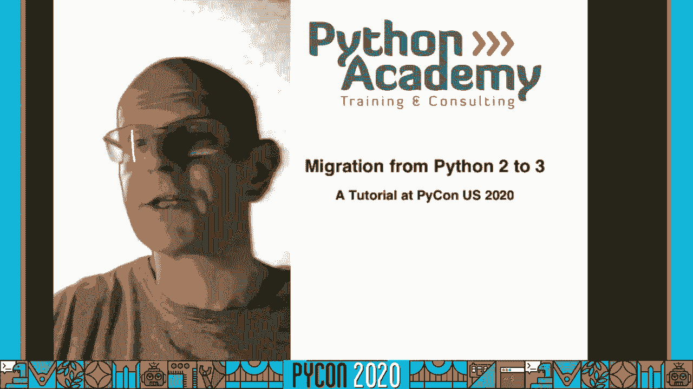
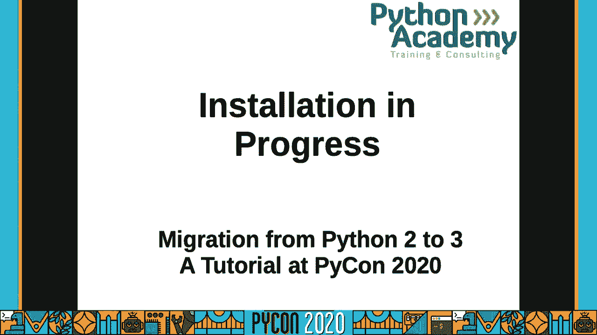
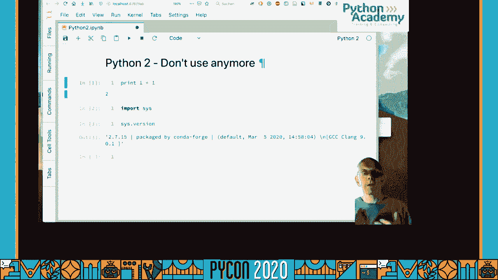
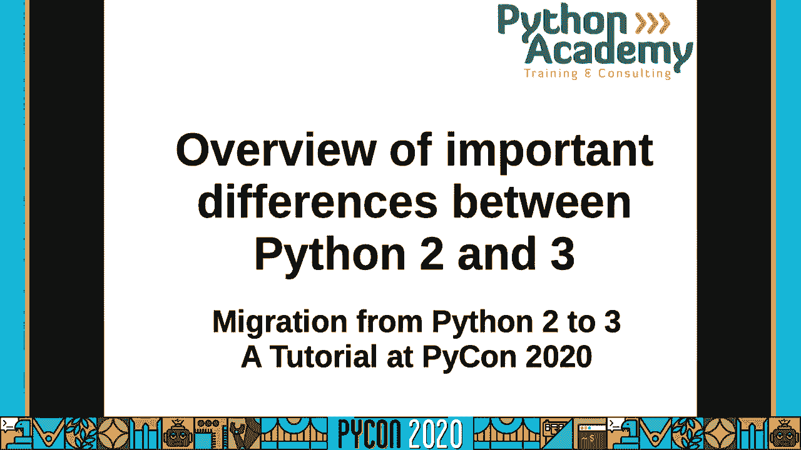
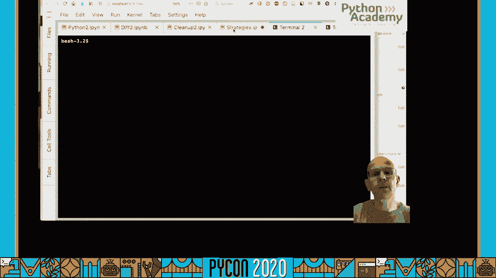
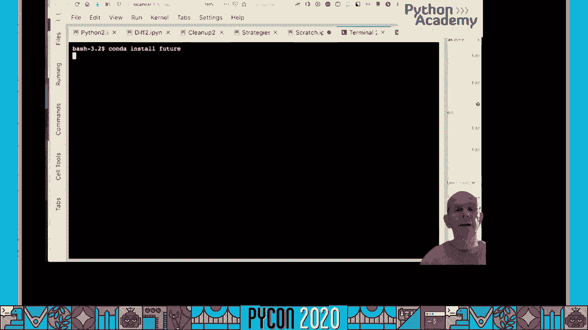
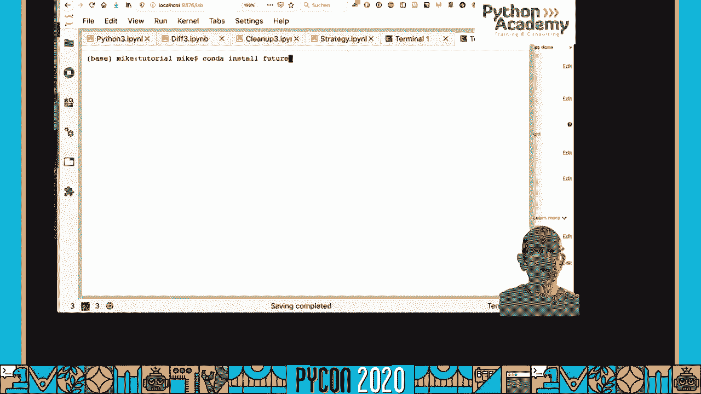
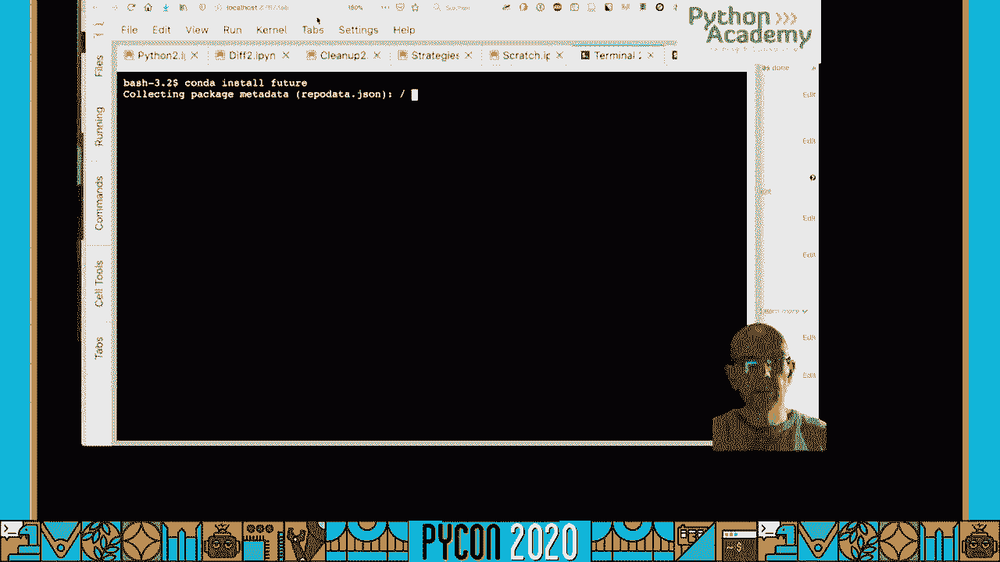
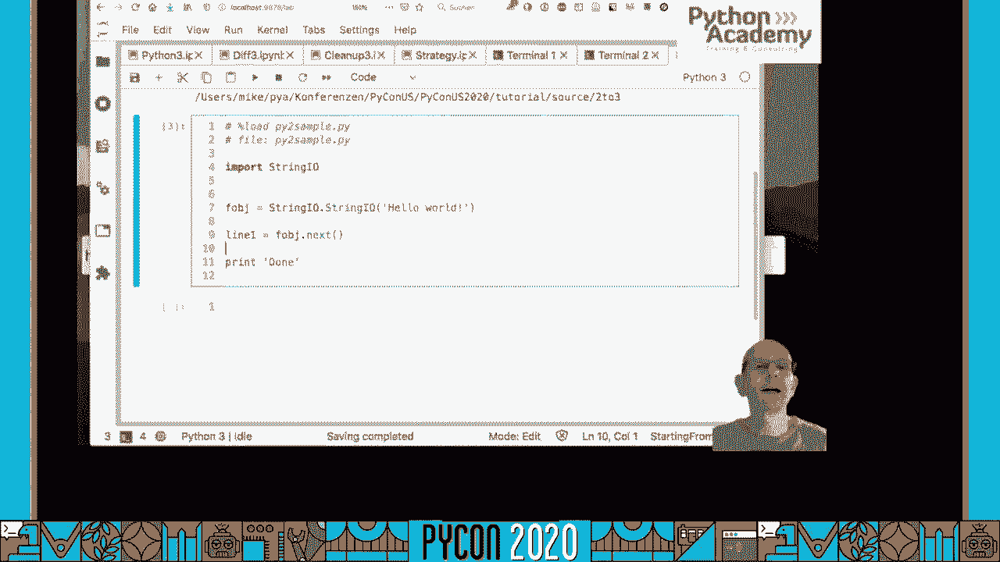
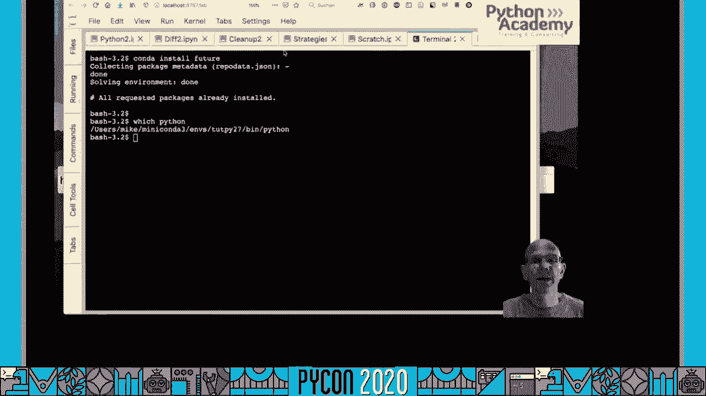

# P85：Tutorial Mike Müller - Migration from Python 2 to 3 - 程序员百科书 - BV1rW4y1v7YG

 [silence]。

 A can。 It is a tutorial migration from Python 2 to Python 3。 A few words about myself。

 I have been a Python user since 1999， starting with Python version 1。52。

 I have been using Python ever since on a daily basis。 I gave my first Python training in 2006。

 and I have been doing Python training in a full-time basis since 2010。

 I worked for Python Academy doing Python training。 Let's get started and download the material。

 Please go to this link and download the material。 Once you have downloaded the material。

 you will find two folders。 One is a source code and one is a PDF。

 Let's have a quick look in the PDF。 Once you open the PDF， you will find the table of content。

 I will go through the table of content so you can see what they are doing。

 I will give you a short overview over this tutorial。

 The first part is an overview of the differences between Python 2 and Python 3。 Quite a few of them。

 I picked the most important ones。 I think it is important to understand what the difference between these two Python versions are。

 We have different parts。 The first one would be cleaning up your Python 2。

7 code to make it better with Python 3。 The next part is an overview of converting strategies。

 There are different ways to convert from Python 2 to Python 3。

 Then we go through some of them in more detail。 For smaller projects。

 you might be fine to write your own layer。 You can also start from scratch。

 Then there are two different ways to start from Python 2。 You might have a Python 3 project。

 All of this will be interactive examples。 We will look at some example Python code。

 Now we would like to set up some development environments。 Since we work with Python 2 and Python 3。

 we need to have both versions installed。 If you have to set up on your machine already。

 then it is okay。 You can skip forward。 Otherwise， you can try the same setup。 I do use Conda。

 You can also use pip and pip and the same way。 I use Conda to create environments。

 Then I set up these environments， install Python 2。7 and Python 3。8。

 These are the two versions I am going to use here。 The most recent version currently is Python 3。8。

 We want to migrate from Python 2。7。 Theoretically， you could do something Python 2。6。

 but they would strongly augment the port。 Everything from Python 2。6 to 7。

 If you still have this very old Python 2。6 code。 I use Conda。

 Conda allows to create environments which are very similar to virtual amps。

 You can create this pip on the end。 Since I like Conda better， I do this one。

 but if you have all the way， creating these environments， it is totally fine。

 I create this environment with Conda。 Create minus name。 Put the tutorial to 7。

 I say Python equals to 7。 Then I would like to install some software and I can already install Jupit or Lab。

 I use Jupit or Notebooks here to do the work。 I use Jupit or Lab。 You don't have to do this。

 but you can follow this。 These things can be done in different environments， in the file。

 whatever you would like to。 Jupit or Lab is a good teaching tool。 In the end。

 I can give you all these notebooks and also in HTML or PDF version。 If you prefer。

 you don't need to install Jupit or Lab， or you can still read through what I did here。

 That takes a while， so I have to check what's out there and then it needs to install the Python version and the required software。

 Later on， we will install more software， but we do this step by step。 We don't need too much。

 we need only two tools， I think， and the whole tutorial。

 I will show you and give you all these links and of course you can also install them in this pit。

 It's not required to use Kanda for these purposes。

 Okay， now I've installed our first environment。 Let's do the same thing with our second environment。

 so we use Python 3。8 and do the same thing with Python 3。8。 Of course， we call this 3。8。

 so we have second environment。 Okay， now we have two environments and I would like to activate them and you can see the command here to activate the environment and I make two new terminals。

 I activate 27， which gives me now the 2。7 tutorial terminal and I do the same thing for 3。8。

 Now I have two environments and if I check the Python versions， I do have 3。

8 here and I do have 27 here。 The next step is starting Jupyter or Lab and I will give you a short introduction to Jupyter。

 I type Jupyter like the planet and space and Lab and I have to specify a port because I have all those Jupyter running。

 You don't necessarily have to specify this port but you can just make up some number and then you start Jupyter。

 Lab takes it a little bit so then it starts to serve on the background and it will open a new tab in the browser。

 You see now in the browser is the open Jupyter。Lab and localhost and you can drop this Jupyter。

 This is now Python 2 version。 They have a bunch of other things installed you might not see。

 They see here on the left hand side this is the handout and the source from the zip file。

 You can look in the link and then you have a Python 2 launch sources。

 This is our notebook in Python 2 and if I double click on this I get a Python 2 notebook which is an untitled notebook which is not a very good name。

 I get everything a bit bigger and I can also turn off the left hand side here and the first thing I do I rename the notebook and call this Python 2 and then we run Python 2。

 You will see that we run Python 2 print without parentheses which is the first thing works which wouldn't work in Python 2。

 You can also check the version internally here and then you see you get the Python version 2 7 15 for March。

 So very latest Python version here。 Good。 This is Python 2。 Now we do the same thing for Python 3。

 Same procedure and then I'm going to show you a few basics about Jupyter。Lab。

 If you know there's a writing you can again skip ahead to the next section。

 So I go back to my console and I go to the Python 3 and type exactly the same command。

 And I use a different port。 And then again it will start a new tab in my browser and I get a second notebook which looks exactly the same and we can do a Python 3。

 So there's something small error messages that doesn't matter and I get another one and then I call this Python 3。

 It's important that you rename it otherwise you might end up in the wrong notebook。

 And then there's a question I want this kernel， Python 3 and then usually give a start with something like this。

 And I do this and I start a notebook and I do rename the notebook to Python 3。

 If you're interested in the notebook you can discover some of these menus up here。

 You can look at them with a pretty self-explanatory。 They have a lot of options。

 We don't need all of them。 Now you can turn off the sidebar which gives us a bit more space and you can make it bigger。

 And just a few words about this Jupyter lab if you don't know how this works。

 So we have a cell in the cell as a Python code cell。

 When I press Shift enter or click on this error up there you see then the executed cell。

 You can write a full Python program in a cell。 So if you like you can define a function here and then this function will be available later。

 So it takes a little bit and then it takes a little bit of a react and then you can use the function here and calculate something。

 In addition to this one you can also use Markdown。 So you can change the type of the cell。

 So you can do this via this menu or also with a keyboard shortcut which is SKM for Markdown。

 And you can turn to Markdown and then you can write Markdown。

 I hope probably you're familiar with Markdown。 So Markdown is a lightweight Markup language that's what's called Markdown。

 And I can write a header， force order and a header， second order。 And I can write a bullet list。

 This is a space。 You have to put a space and you see you get syntax highlighting and I can do something like this。

 So you get some basic syntax highlighting and formatting and then you can write text。

 That's pretty much all those features we're going to use here。 That's what we're doing。

 Otherwise we switch back and forth between these notebooks。 You can also start a terminal。

 So if you like then you have the terminal with a Python version that's also possible。

 And about all of the links in there is a lot of help。

 So if you go to help you find a little help about Python and other packages。 So yes。

 you can see here that a lot of scientific packages because JupyterLab is used for scientific purposes。

 But you can still use it even if you don't do any scientific computing。

 JupyterLab is a very nice to test something to play something。

 And that's most of what we're going to do here。 We want to play with something and therefore the rock is JupyterLab。

 So we're going to play with exactly the same in this notebook here。 So you can do this。

 If you would like to insert a cell I can press escape A for insert a buff escape A escape A。

 Then you have a new cell and then I'll say escape one to have a header markdown cell and I can just write something here。

 So you can write something up here and now we have a Python 2 and a Python 3 environment。

 Now you would like to look at the differences between Python 2 and Python 3。

 I will go through them step by step and show you all the major differences between these two versions。

 For this you should make new notebooks。 So I'm making new notebook in Python 3 and one in Python 2 so I can switch back and forth between these two versions。

 So I may be new notebook and rename this difference in straight。

 And I do the same thing in Python 2 so you have a notebook is a difference。

 So now we can look at the difference。 So first thing that is different is the print function。 So。

 print function is the first thing。 The simplest one most of you will know about it。

 But yet we can start with it and we can see how it works。

 So print here is a statement so I have to say one plus one and I get to an effort with the same thing in Python 3。

 So I go now to my Python 3。 And do the print function if I try the same thing print one plus one。

 I do get a syntax error and it helps me。 I need to add some parentheses to get print so I can do the print function。

 And I say one plus one which gives me to this works。

 The print is interesting now print is a function。 And this gives you a little bit more possibilities because now you see a print 123 and it puts a space but the print function provides an option argument is called set neck can change this separator to set。

 So you can put a separate to something else。 And now you see instead of space I do get a comma and a space。

 This does not work in Python 2。 So go back to Python 2 the print function。

 So you can put the parentheses but that's not the same to people that you can do this because this parentheses just groups so that Python just kind of removed the parentheses。

 So if you want to try something like this。 You get a 2 plus so that's unfortunate because it still works。

 Yeah， but the result is obviously different because now you create a 2 plus and then you feed the 2 plus print statement。

 But now we have one of them from future imports。 So Python has this from future import。

 And this is not necessary connecting with Python 2 and Python 3。 This exists earlier so in Python 2。

5 you can say import context managers or something like this so you can import a feature that comes with the next version of Python。

 Now the version to some degree。 And now if I do this print。

 Now I do the same thing as just copy my line and I do get my print looking exactly the same。

 And I can now also use my set here。 And it works。 Now my print function。

 If you look at this is now the print function。 It might look a bit different in Python。

 Three so in Python 3 for a type print。 Exactly the same so it's exactly the same now we have a print function。

 So there are a bunch of features you can actually from future import。

 And this is probably the easiest thing you can do。

 So if you still have to do something in Python 2 from future import that ever makes sense here and use a new version and then you don't have to do anything in Python 3。

 You can use pass from future important Python 3 I copy this line。

 There is nothing that prevents you writing this is that does have any effect it doesn't change anything because you are in the future already。

 So from future import doesn't change anything so it's pretty safe to do it because it's just like a note。

 No， it doesn't do anything。 But this is the first thing so you have this future。 So it's important。

 Next thing iterators。 In Python 3 you will get iterators at many places。 For instance。

 when you zip something。 So if I zip this two strings together。 It's a zip function。

 I do get a zip object which is not too useful that's why I called it。

 Then if I use next on it then you will see it provides next because it's neutral Rachel。

 So I do the same thing in Python 2 so I go back to my Python 2 version and I write my same photo。

 And I look at iterators in Python 2 and you can see this one gives you back a list。

 So this is always ego that gives you back a list in Python 2。

 In Python 3 it is an iterator which is a lazy thing。

 If you want to achieve the same thing you have to convert it to a list。

 So you have to materialize it to actually create this tuple。

 Otherwise you get an iterator which can be very beneficial。

 If you work with bigger structures then you might not need to create this in the immediate structure。

 If you might like to find a fit to the dict like if you would like to create a dict。

 Then you don't have to create a list before you create a dict。 You can create a dict。

 You might be faster and also you might save the immediate memory。 You don't have to allocate it。

 The same thing goes for other commands。 A zip or functions。 The zip function map。

 same thing map gives you a neutral writer。 If you still use map you can use this term by instance map is not really necessary。

 If you have a list of things that you want to do in the same way you want to create a list。

 There is a bunch of these things here that give you iterators。 This would be one thing。

 You will get iterators in many places。 You will see some programs that check at lists like this or the place to convert your zip。

 to a list which prevents you from saving the memory but makes you compatible with Python。

 2 and Python 3 because now you can index into this list and you cannot do this in the。

 neutral writer。 The next thing is range。 In Python 3 looks a bit different than range in Python 2。

 First of all you can use range with a very big number because range generates a range object。

 If I do this in Python 2 range generates a list right away。

 It is materialized so it is very similar to a new writer but somehow similar to the behavior。

 This one creates a list immediately and that is it。 In Python 3 it generates a range object。

 You can do a bunch of things with this range object because it is also lazy so I can give it the name range。

 I can now do something with it。 I can convert it to a list。

 If you do not believe me that is not a iterator， I can convert it again and again。

 If you do not believe me that is not an iterator， if you try next， then I do get an exception here。

 It is not an iterator so it says explicitly it is not an iterator。

 It does not work but you can convert it again and again and again。

 You can do a bunch of more things here。 You can take one because range objects theoretically you can do something like this。

 Don't do this in Python 2 because I try to create a list of the size which is not really healthy。

 Because it is used up all your memory or you get a memory error。

 Otherwise your computer might get a bit slower。 This range object can also be sliced so you can slice here and you can see here now it can run。

 Slice inside range and it can get parts of the range。

 This does not work with X range so in Python 2 you do have something called X range。

 X range is very similar because it does not create the list。

 If I call this thing X10 for my X range then I can convert this one to a list and can do this again。

 This regardless is the same but you cannot do this fancy slicing thing so if you try this one。

 then it does not like you and tells you you cannot slice it。

 The difference X range was kind of in the media in Python 2 and in Python 3。

 Often people say X range got renamed to range which is partially true so it is very similar but you see slicing and all those nice advanced features。

 It does not work with X range but it works with CIR。

 This is a size wise if you try to make a very big one and you say X power of fun。

 Then you can overflow error so it does not work with big ints or long in Python 2 and it only works with normal ints。

 So in Python 3 the distinction is gone you will see this in one minute therefore you have this。

 The difference。 Okay next topic dictionary。 So if I have a dictionary here。

 If I have a dictionary I can say keys and keys is a list。

 If I say k is keys then keys looks like this and if I do change my dictionary。

 And my dictionary changes but my keys since it is a list which is decoupled does not change the states。

 This is different if you go to Python 3。 This will be different。

 I copy this header so we have the same header here so you can follow along in both versions。

 But dictionary keys so I can copy my dictionary from this。

 If you can see this we have this D and if I say k equals keys so the command is the same。

 Then I do get k keys。 And now I modify my dictionary exactly the same way as we did before。

 And now you can see the picture has changed and the keys reflect this。

 The keys reflect this we do have now key views that are connected to the dictionary and they don't have the data。

 They just get the keys directly from the dictionary and if the dictionary gets modified the key here it is different also。

 And the same is true for values and items。 They also give you lists in Python 2 and new objects in Python 3 so that's exactly the same thing。

 I don't need to show this one。 There are new things in Python 3。6。

 A dictionary is guaranteed order so they do have an order so you can show this。

 So if I have the dictionary and I delete the key A。 I need the dictionary key A。

 Now my dictionary doesn't have A。 Now I insert A again and you see now A is at the end。

 It's not only shown at the end actually if it's right over it will come out last。

 If you do the same thing in Python 2 so we do the same thing here。 So I delete。

 First I write no order。 No order。 So if I delete A from my dictionary of course it's gone。

 That's not different here so it's gone。 But if I put it back and you look at this again you see now it's not at the end it's the beginning。

 It's different。 A dictionary implementation has changed in Python 3。

6 and it's guaranteed that the instruction order is preserved in Python 3。7。

 So that's a different thing so you have to be careful。

 A lot of people assume some kind of order in Python 2 and if they assume this order it kind of always came out this way but it was not guaranteed。

 So you assume something your assumptions kind of shaky。 It's not given。 You always not guaranteed。

 And then you might have a problem and you have to be very careful because as you can see here now if you iterate over the keys they come out in a different order。

 If you do something like this。 Good。 One of the most important things I would say are comparisons。

 Comparison but you can compare。 You can compare things and then you see。 I can。

 I try to compare something like this and it doesn't work and I do get。 An error message。

 If I do the same thing in Python 2。 Yeah， so I try to。 Try to compare。

 I just copy my code from the other notebook and it works。

 So this gives you a true and if I do it the other way around。

 And that's something I still remember when I saw it was Python 1 5。

 They talked about this already to be in the problem and all the books。

 This time it's just a handful of books。 They had this prominently somewhere else that okay that's a problem to be careful。

 You can compare these things that might be a trap。

 You might compare something that's not supposed to be compared。 So the next one would be。

 The integers。 So in Python 2 you have two integers you have。 The integer。 It and you do have a type。

 Long you get along。 So if you make an integer very big then。 You get along。 So this max。

 In there's a max in here in Python。 In Python 2。 And if I multiply this by 2 I do get along you see it was a trailing out。

 So just know the difference between ins and long say of get control automatically。

 But you get a string representation with the L you have to data types。

 In Python 3 you don't have this it's gone which makes your life much easier。

 So if we go here so you can say。 Interse and you have type。

 One yeah it's ined and if you now try to put an L。

 It tells you it's not going to work it's in that syntax and you can have a very very big number。

 And this is a very big number and still in it。 So that's only one integer which makes your life easier。

 This was kind of a regular process in Python that the difference is between longs and in small and small。

 And therefore just get rid of。 The next thing is mathematical the decision so if you do this。

 You can divide。 Methematically so I'm a Python 3 now and if I say one divided by two。 I do get zero。

 Five。 Yeah， so I can I divide to integers I do get。 A float。

 If I don't want this I can do something called flow division and you do get zero。

 You have to be careful it's flow division。 And therefore it doesn't go that's good down。 Yeah。

 so this one if you want to calculate an index you don't want to float result。

 Therefore you can do something like this and it will calculate。

 The integer cutting off this decimal fraction there。 But going down。

 So here's a bit different in Python to。 So if you have to divide something like this if I divide one by two I do get a zero。

 I do get a zero but I can force it I can say one。 This always works so if I do this。

 I can force it if this one works already you do get。

 If you want to force it you can do something like this if you like。

 If you use one integer there but it still get a zero you don't get a 0。

5 you would need to convert both of them first to。 I'm sorry。

 My name is may of course you do get the 0。5 is one of them is a float。

 That would work so you can do something like this。

 But again there is a future in port and if you use a future in port here。

 By the way this for future in ports can only be used in top of the file。

 In the notebook here I can do this in the middle of the notebook。 Which is a bit strange because。

 And it changes the state and if you're actually the cell before it will be different but it's nice to show the effect。

 So I can say from future in port the decision and and works and change the behavior。

 You see now it is the same thing one divided by two and that it is your five and one。

 Here I do get this and of course this also。 This you。

 The negative number so it has exactly the same behavior so from future in port the decision will solve it。

 So you can import it and if you do this。 In Python to seven anyway then you don't have any problems in those surprises when you move to Python straight。

 Okay。 The next one。 Strings。 Strings is a big topic。

 And there's probably the biggest change at least in terms of implications you can have and you move your program。

 When you have a string in Python。 To。 You see you have a gives a type string but this is a type string。

 A bit string sorry and if you want to have the Unicode you have the use the you in front of it to make。

 Make Unicode string。 Yeah。 To make it work。 Make it a unicorn string so you have to add the you。

 You can actually add the beat to make it a by string which is the same。

 So if you look at this type here。 You do have a string type whereas if you look at this type you do have a Unicode type。

 Yeah。 So Unicode get into that got introduced in Python later and then get there for if you want to have a little Unicode you have to put you and you can you can you can type。

 If you're the same thing in Python three it's different。 So I go back to my Python three here。

 So type string。 Type the type of string。 It's a string so it's be careful and say string but it's a different string because this is Unicode default。

 So if I put you in front of it which is possible though in Python zero zero you was gone and then I think it's a straight street you came back because it makes it much easier to at least put the you and now you get a Unicode string but it's called string because it's a default type。

 Whereas if you use the beam or byte string then you do get byte straight。

 Now there's no Unicode type more because anymore because now you have this。

 Unicode as a default there's no other string just to be careful。

 You have to be careful you have to really really careful then you work here that you do take care of the strict networks you can always put you and be in front of it。

 You can do this in Python two and Python three and to some degree that's also your problems。

 So you have to be careful post those built in functions many functions except sometimes only strings not Unicode or something like this you have to be careful what works or doesn't work you might do some encoding。

 So it depends on libraries use and how they are they think about these strings。

 So these are the biggest difference and there's can be a lot of work if you use a lot of Unicode invites can be a lot of work converting the program from two to three。

 So one is a encoding source code encoding。 So the source the default source code encoding in。

 Python three is UTFA。 So if you don't say anything you do get a few days you can still in the beginning of the file do something like this。

 You can write coding。 Yeah。 And then you say UTF-8。 Yeah。

 something like this and you would probably。 So this is actually the same so the fault is UTF-8 and you do get。

 It is recommended unless you have a very strong reason to use something else I would recommend using this one。

 Yeah， it's different。 Here it's ASCII。 Yeah， ASCII and you do have to。 Specify UTF-8。

 So if you put you to a fade anyway it doesn't matter you have to。 A。

 Another one in this direction is bytes。 The bytes in string chains bytes also changed。

 So you have the bytes data type。 Bites we are still in Python two here。 So if I say bytes。

 I do get this spot it looks exactly like a string because bytes are strings。

 If I do the same thing in Python three so again back to Python three and I try to do bytes。

 I do get bytes。 As you can see here it looks very different。

 You do get bytes representation of bytes and you have to be careful。 What you're doing。

 The next thing is pageability and actually now we probably could go to source。

 This is source directory because I do have some of these labels as files。

 A source you don't have to。 You might not have to type everything here。

 I'm just not sure if I have it。 I don't have anything here。 I have some files。

 The next topic is pageability。 Let's look in the ability。

 For this one you write a small example here。 I have a class X。

 I do write an inherit from object so I can copy this over to Python two。

 If I have a class that doesn't do anything。 I do have something like this equal。 I return true。

 Then I try to hash this thing。 If I want to hash this one I do get a narrow。

 I have to also define a hash。 Special method hash is to underscore。 I just make up hash here。

 I use the ID here as a hash。 I can do the same thing and try to hash it。

 That's what you have to do here。 If I do the same thing and try to hash it。 If I do hash it。

 This works。 It gives you some value in Python。 If you want to use your own objects as key and dictionary you might need to change something。

 If you have a hash。 If you add things that are different。 There are a bunch of things changed here。

 X is a statement。 You have to write X。 Now A is defined。 There is something you can do here。

 In Python 3 it changes。 If I have this here。 I try to use X。

 I do get a narrow message and it tells me already we have to add parentheses because it became。

 a function。 It's a built-in function but not a keyword anymore。 It's a key word。 It should be bold。

 If I do something like this。 If I do something like this。 If I do something like this。

 If I do something like this。 If I do something like this。 If I do something like this。

 If I do something like this。 If I do something like this。

 If I do this in Python 2 it's a meta class。 You might not use meta classes yourself but you might use libraries。

 You might see some problems here。 multi-class。 The meta-class syntax is different and I define a meta-class。

 This is the same。 So the meta-class inherits from type mode from object。 This makes a meta-class。

 So the meta-class， is to class what the class is to mean since so exactly the same thing。

 the only one level higher。 So when I just overwrite this representation。

 so when I type the class I will see something different。

 So I have my representation and here I do get the class another self。

 You can name it whatever you like but it makes a little sense to call this class。

 And I write something。 That's a new meta class and now I would like to apply this class and I'm in Python 2 still。

 So I still need an inheritance object。 We come to this。

 So we have to inherit an inheritance object at this place。

 And then I can look at A and if you look at A here I do get this representation。

 That's how A looks like。 Now I'll make a class B， call it B。

 And now I'll provide the meta class and to provide the meta class I have to do something like this。

 Now if I look at B， equal sign is missing。 And if I look at B。

 it looks different because now I overwrite the representation。

 Now this is a sign that the meta class works。 So if you don't understand that the meta class doesn't matter too much。

 you might not use them yourself but if any library is with meta classes。

 then you see the difference here。 So now let's move this to our Python 3。

 So I can actually copy the whole thing。 As a book， the way I wanted it。

 I thought I can export all the cells。 Yeah， let's do it step by step。 So we do it step by step。

 So we have the meta class。 This is the same syntax。 So we do it step by step。 That's too defined。

 So this is the same syntax or nothing changed that's works。

 You can still copy this code directly here。 So you wouldn't need object but it doesn't work or it's the same thing。

 And now if I do this one here with a meta class and I try something like this。 That's no effect。

 There's no effect as you can see here。 There's no effect whatsoever looks the same because you have to do something different。

 So let's call this scene。 And I have to say meta class。

 And I put my meta and I can get rid of this line of the put it， put it pass。 And if you see now。

 you get the meta class。 So the syntax changes。 And that's a bit tricky because it's really hard to do something there so we'll run it later on but it makes it makes it easier。

 So you're going to have to go in and have to change this syntax and it makes it more difficult to write a single source code which is something you can do。

 Good。 Good。 Next one。 This is a nice one。 This is a nice super。 Yeah。 So if I'm in Python to。

 I have a class。 Parent。 Parent。 Just an object and doesn't do anything just just has a method。

 So I have a method。 And of course I run it inherit the super otherwise it doesn't make too much sense。

 And I say， self。 Or something else return。 So this is a parent。 And now I have a child。

 Which inherits from parent。 And I do override。 I do override this method。 Same signature。

 And now I call super。 And when I call super， I always have to provide the current class and have to provide self。

 Theoretic you can write whatever you like but the only thing that really makes sense is this haven't seen anything else。

 So， and now I'm。 Do this and I just say return。 So it doesn't do anything useful here。

 But you have to write the syntax to actually get。 Now it works you see you have to write the syntax。

 You do have to write the syntax。 So again， you can copy this one to Python three。

 And in Python three this works it still works it hasn't changed in this regard。

 So you can still use it。 But it makes your life easier。 So I have to do this。 And I copy over my。

 And now I make a child instance。 And I call。 My method。

 But you don't have to make it so complicated in Python three。

 You can just keep super empty and it fills in exactly this。

 That's nice if you later change the class name maybe you don't have to change it here。

 You don't have to change it here also。 And now I call this child to just to show the difference。

 So if I make a child to instance。 Still box。 Okay， if I try this in Python。

 In Python two it doesn't work out of the box if I try this one。

 Of course it makes a class but later on it does。 Give me a problem。 Yeah， so I do get this arrow。

 You see super takes at least one argument and so on。 And I'm going to use this。 Strange error。 But。

 You will see later on the other way to actually kind of backport this one to Python two。

 It is there's no from future import here you cannot say in future import super。 It's not there but。

 You will see that some libraries that can happen。 This makes it much much easier。

 Why do not put the other all the same so I would make it easier。 Okay。

 one more thing that's you might not know the rounding。 Rounding is different。

 So if I round something。 Yeah。 If I round。 I do get a three and if I if I round。 Three point five。

 I do get a four。 Yeah， and if I round。 Four point five。 I do get a five。 So the other rounds up。

 In Python three， this changed。 And it changed to what's called no change round。 So if I round here。

 If I round here。 Two point five， you see now the rounds down and also gives me an integer by the way。

 And here round。 Three point five rounds up to the next even number it always runs to the next even number。

 So it ends to five。 Then it rounds to even number and therefore this rounding changed a bit。 Yeah。

 so four five rounds to four。 So if you have to be careful， if you do rounding。

 So first the round says even number and as you can see here。 This one gives you always a float here。

 It gives you an integer minute rounds。 So the rounding changed a bit。 And the step of it。

 you might have noticed it。 Yeah， until you have something you don't expect。

 So you have to be careful。 Then you use round that you might get a different result。 Good。

 One more thing is scoping of exceptions。 So if I have an exception。

 if I do something stupid like this， as they try， one divided by zero。 Except zero division error。

 As I can say pass。 Now I can access L later。 This rocks and I do get the instance。

 If I do the same thing here。 If I do the same thing in Python three you will see a difference。

 You will see a difference。 If I try to access L here。 It gives me an exception。

 I can access it only here because it is only alive in this indentation。

 So inside the exception clause if you are outside errors not there。

 So that's something the exception doesn't slip out anymore。

 And you have to be careful if you want to do something。 These are important differences。

 There are a few more things I would like to show you。 There are some new syntax。

 So let's look at some new syntax which you don't have in Python two in which you can actually not read back in one way or the other。

 New syntax。 But new syntax to be have here。 The first thing is key word only arguments。

 You can have key word only arguments。 And let's give you an example。

 I cannot join in Python two because there is no such thing。 If I have this one I define a function。

 I define a function。 Or the function is missing。 Yeah。 Function。 I define a function。

 And this function takes a A。 Then there is a star and then there is a B。 And this function is a B。

 Now I can call this function。 This function A is one and B is two。 No problem。 This works。

 I can also call it with A as a position argument。 Let's see works。

 But if I want to call this one with just two position arguments。

 It doesn't allow me because we have the key word。 The start has a new meaning here。

 Actually it's starting from the start。 You have to supply。 Key word arguments。 Key word arguments。

 And this B can only supply this key word argument if not you can。 It makes a lot of sense。

 It makes your life easier。 You can enforce key word arguments。 Then you write a function。

 There is a new key word in Python 3。 And that's called non-local。 Now I have a function。 Auto。

 And I define x equals one。 And I have a function。 You know。 And I say x equals ten。

 And I call the inner and the outer。 And I return x。 Obviously if you call outer now。 You get one。

 You can change this behavior by now。 I have my outer two here。

 And now I use this non-local key word and I make x a non-local。 And I do call my outer two。

 And you see now I get back a ten。 Now this inner function can modify the x from the outer function。

 It's a little bit like global。 So it looks like global but it's different。

 Of course it doesn't actually go to the global scope。 It only goes to the next outer scope。

 It stays inside the def。 So it doesn't go to the global scope。

 And usually this inner function is not going to move up a way。

 Whereas functions in a module might move somewhere else。

 And then you might use your global and it might have a problem。

 So that's why something is something you can do here。

 Another nice feature we have here is design packing。 So you can unpack iterabits。

 So if you have a list。 If I have a list L， it looks like this。

 Now I can unpack something in different ways。 So I could unpack and say start middle。

 And you see I use a star again。 There's another useful the star。

 And I unpack my list and now it's the start。 The end is the end in the middle。

 It's everything but left in the middle。 And this works for all kinds of sequences。

 Not only lists of course。 So you can have different combinations here。

 You can also just have a start and rest if you like。 So if you do the same thing。

 And I copy this and you just call this rest。 And then you can collect all the rest right there。

 Yeah， the start is still start。 And the rest contains the rest。

 So that's to go or generate iterabits。 Unpacking not only lists or to put many others and you can have any kind of combinations。

 Good。 Another one。 Two faults。 Two and fours made it to actually none。 True。

 And false on a Python keywords are not only buildings。 Yeah。

 So you can see this easily if I try true here or false。 Then it's a keyword。

 And if I do if I try something。 Try something stupid like this。 It gives me an error message。

 Now I can go back to here。 Python two。 And here I can actually。 I can actually say。 True zero。

 And it works now true zero。 This is certainly not recommended。 Yeah。 And therefore they changed it。

 You can still do this。 Don't do it。 Don't do it。 You write the whole program。

 But it's possible to do it。 And you can even choose a bit and you can even overwrite the bit in true。

 So if you look in the built in true。 It's still true。 If we now say it's true equal to true。

 Then it gives you false because now zero。 So that will make a lot of sense。 Yeah。

 Now they have two different trolls。 Yeah。 Yeah。 Don't do it。

 In Python straight you cannot do this anymore。 That's gone。 Another one are list comprehension。

 Which makes makes Python。 Three a bit more consistent。 So if I have。 And this compare。

 So if I create a new list， I must say X。 For X in。 Range。 Ten。 Yeah。 So making new list。

 And you write X also works。 So if for X and X in range ten。

 Then the X leaks in the last X is right here。 If I do this。 Here。 Now try to access X。

 X is not defined。 Unless they would have defined it before。 But it wouldn't be behind them。

 So X is not defined where X doesn't leak out anymore of this。 Scope of the list comprehension。

 So this X is confined to the list comprehension scope。 Which makes things much more useful。

 Because you don't create a X。 By accident。 Just using。 And。 Is comprehension。

 So another thing that Python three。 Is。 So I have to。 The ins in module has changed。

 And we have some strange name to build ins。 So instead of built in。 So when I make this here to。

 And here have to。 Okay。 So here it's called。 Yeah。 Actually。

 but still there but the module has changed。 So it's called。 In Python two it's called built in。

 They have to be careful。 There might be some small changes。 There's a few more things。 And you have。

 In Python three， seven， you have a sink。 You do have。 And you have a sink。

 And you don't do any asynchronous programming here so we don't go into any more detail。

 How this works。 But these are two new keywords that。 Are here。 In Python three， seven。

 so you have to be。 Careful。 And you have to be able to do something。

 And you have to be able to do something。 And you have to be able to do something。

 And you have to be able to do something。 And you have to be able to do something。

 And you have to be able to do something。 And you have to be able to do something。

 And you have to be able to do something。 And you have to be able to do something。

 And you have to be able to do something。 And you have to be able to do something。

 And you have to be able to do something。 And you have to be able to do something。

 And you have to be able to do something。 And you have to be able to do something。

 And you have to be able to do something。 And you have to be able to do something。

 And you have to be able to do something。 And you have to be able to do something。

 And you have to be able to do something。 And you have to be able to do something。

 And you have to be able to do something。 And you have to be able to do something。

 And you have to be able to do something。 And you have to be able to do something。

 And you have to be able to do something。 And you have to be able to do something。

 And you have to be able to do something。 And you have to be able to do something。

 And you have to be able to do something。 And you have to be able to do something。

 And you have to be able to do something。 And you have to be able to do something。

 And you have to be able to do something。 And you have to be able to do something。

 And you have to be able to do something。 And you have to be able to do something。

 And you have to be able to do something。 And you have to be able to do something。

 And you have to be able to do something。 And you have to be able to do something。

 And you have to be able to do something。 And you have to be able to do something。

 And you have to be able to do something。 And you have to be able to do something。

 And you have to be able to do something。 And you have to be able to do something。

 And you have to be able to do something。 And you have to be able to do something。

 And you have to be able to do something。 And you have to be able to do something。

 And you have to be able to do something。 And you have to be able to do something。

 And you have to be able to do something。 And you have to be able to do something。

 And you have to be able to do something。 And you have to be able to do something。

 And you have to be able to do something。 And you have to be able to do something。

 And you have to be able to do something。 And you have to be able to do something。

 And you have to be able to do something。 And you have to be able to do something。

 And you have to be able to do something。 And you have to be able to do something。

 And you have to be able to do something。 And you have to be able to do something。

 And you have to be able to do something。 And you have to be able to do something。

 And you have to be able to do something。 And you have to be able to do something。

 And you have to be able to do something。 And you have to be able to do something。

 And you have to be able to do something。 And you have to be able to do something。

 And you have to be able to do something。 And you have to be able to do something。

 And you have to be able to do something。 And you have to be able to do something。

 And you have to be able to do something。 And you have to be able to do something。

 And you have to be able to do something。 And you have to be able to do something。

 And you have to be able to do something。 And you have to be able to do something。

 And you have to be able to do something。 And you have to be able to do something。

 And you have to be able to do something。 And you have to be able to do something。

 And you have to be able to do something。 And you have to be able to do something。

 And you have to be able to do something。 And you have to be able to do something。

 And you have to be able to do something。 And you have to be able to do something。

 And you have to be able to do something。 And you have to be able to do something。

 And you have to be able to do something。 And you have to be able to do something。

 And you have to be able to do something。 And you have to be able to do something。

 And you have to be able to do something。 And you have to be able to do something。

 And you have to be able to do something。 And you have to be able to do something。

 And you have to be able to do something。 And you have to be able to do something。

 And you have to be able to do something。 And you have to be able to do something。

 And you have to be able to do something。 And you have to be able to do something。

 And you have to be able to do something。 And you have to be able to do something。

 And you have to be able to do something。 And you have to be able to do something。

 And you have to be able to do something。 And you have to be able to do something。

 And you have to be able to do something。 And you have to be able to do something。

 And you have to be able to do something。 And you have to be able to do something。

 And you have to be able to do something。 And you have to be able to do something。

 And you have to be able to do something。 And you have to be able to do something。

 And you have to be able to do something。 And you have to be able to do something。

 And you have to be able to do something。 And you have to be able to do something。

 And you have to be able to do something。 And you have to be able to do something。

 And you have to be able to do something。 And you have to be able to do something。

 And you have to be able to do something。 And you have to be able to do something。

 And you have to be able to do something。 And you have to be able to do something。

 And you have to be able to do something。 And you have to be able to do something。

 And you have to be able to do something。 And you have to be able to do something。

 And you have to be able to do something。 And you have to be able to do something。

 And you have to be able to do something。 And you have to be able to do something。

 And you have to be able to do something。 And you have to be able to do something。

 And you have to be able to do something。 And you have to be able to do something。

 And you have to be able to do something。 And you have to be able to do something。

 And you have to be able to do something。 And you have to be able to do something。

 And you have to be able to do something。 And you have to be able to do something。

 And you have to be able to do something。 And you have to be able to do something。

 And you have to be able to do something。 And you have to be able to do something。

 And you can see some of the things that are very obvious。 You can exception。 It's very easy to fix。

 Some of the things still work。 But the result is different。 And that's way harder。

 So you have to be really careful。 But this key thing with the dictionary here can be a problem。

 If you get an exception， then you need to fix it。 Otherwise your problem doesn't run。

 It runs through with them。 And stately coming out。 You need to really check them。 Okay。

 That's an exercise。 And you have to be able to do something。

 And you have to be able to do something。 And you have to be able to do something。

 And you have to be able to do something。 And you have to be able to do something。

 And you have to be able to do something。 And you have to be able to do something。

 And you have to be able to do something。 And you have to be able to do something。

 And you have to be able to do something。 And you have to be able to do something。

 And you have to be able to do something。 And you have to be able to do something。

 And you have to be able to do something。 And you have to be able to do something。

 And you have to be able to do something。 And you have to be able to do something。

 And you have to be able to do something。 And you have to be able to do something。

 And you have to be able to do something。 And you have to be able to do something。

 And you have to be able to do something。 And you have to be able to do something。

 And you have to be able to do something。 And you have to be able to do something。

 And you have to be able to do something。 And you have to be able to do something。

 And you have to be able to do something。 And you have to be able to do something。

 And you have to be able to do something。 And you have to be able to do something。

 And you have to be able to do something。 And you have to be able to do something。

 And you have to be able to do something。 And you have to be able to do something。

 And you have to be able to do something。 And you have to be able to do something。

 And you have to be able to do something。 And you have to be able to do something。

 And you have to be able to do something。 And you have to be able to do something。

 And you have to be able to do something。 And you have to be able to do something。

 And you have to be able to do something。 And you have to be able to do something。

 And you have to be able to do something。 And you have to be able to do something。

 And you have to be able to do something。 And you have to be able to do something。

 And you have to be able to do something。 Okay。 The first thing I would like to point out is no classic classes。

 So Python 2 has something called classic classes。 They're very old。 They're very old。

 And they should not be used。 So if you define a class， classic。

 that would be a classic class in Python。 So we don't need to do anything。

 And this would be what's called a new style class。 Where you inherit from objects。

 So you inherit from object makes a new style class。

 And now if you look at the type of these classes， it's a class object rather type of this new style class。

 It's a type。 So don't use old style classes because when you have them， few things won't work。

 The scriptals won't work。 Proper Stephen broke。 Metaclasses won't work in other things。 In Python 3。

 there's no such thing as classic classes。 There's only a class。

 And it doesn't matter if you inherit from object or not。 So this one， let's call it class A。

 And this would be class B， which inherits from object actually。

 So I have an object and you will see there's no difference。

 See if you look at the type of both classes。 And then you can see the type of the class B。

 And there's no difference。 So take home messages， don't use class class anymore。

 Use new style classes。 They've been around for literally decades。 Another thing， no back ticks。

 So Python 2 has something called back ticks。 So with back ticks you could do something like this。

 If I define A here， I could get the value of A with back ticks。 So if I do this。

 you see back ticks and they don't exist anymore。 Back to back to three。 No back ticks。 That's right。

 So one means don't use back ticks here。 That means there are no back ticks。

 So if I try to do the same thing and try to use back ticks， it doesn't work。

 So that's a feature that doesn't exist anymore。 So don't use it。 Okay。 The next。

 don't use old operators。 In one of the old operators you should not use。 It's not equal operator。

 which looks like this。 So here you can do something like this。 This works。

 But better if this does exist。 This also works in Python 3。 There's no such thing anymore。

 So you cannot use it。 Therefore better remove it in Python。 So if I try to do something like this。

 I get an error message， because this one works。 Simple thing， such a code changes。

 makes a code more modern。 It works better。 The next one is exceptions。 So in Python 2。

 you can write an exception like this， which looks useful， but maybe it's not。 One divided by zero。

 And then I have an accept。 And I do accept， of course， a zero division error。

 But they also accept something else， like a variable。 At least I attend to。 So now if I print。

 This class here。 Then you will see the value error looks very strange。

 And in fact the value error is not what you think。 So I have overrode value error here。

 which is not a good idea， because actually what you actually wanted is this。

 You wanted to have this。 Now this is an old syntax that you have an instance of this error。

 You see now if I print now instead of this value you see that's what you wanted。

 And this is an old syntax you can do。 Don't do this。 Use this syntax。

 Use a S syntax which needs to be exactly the same。 And it is more modern。

 So now I killed my value error， which is not good if you don't have any exception here anymore。

 It can be very misleading if I want to use value error。 Therefore I just delete value error。

 And then value error is back。 And now we get a built-in value error because I believe my total value error。

 If I copy exactly this one to Python 3， you see it's different。 Yeah， it seems that syntax。

 It's in the syntax you have to use the S and then use the S and then it works as expected。

 So and you can do this in Python 2 already。 Do it。 Next one is no leading theorem numbers。

 So no leading theorem numbers。 In Python 2 you can do something like this。

 You can use leading theorem。 You see it's turned red already because my syntax I left and show something wrong。

 It still works。 If I do the same thing in Python 3， so again something back to Python 3。

 And then the same thing in Python 3， then I tried to write this。 It doesn't work。

 I get syntax errors。 The solution would be using zero， okay， so seven。 This would be an octal seven。

 So if you want to write octal numbers for some reason， then use this syntax。

 And this syntax already works here。 So you don't lose anything in use it。

 It looks much better and it works in Python。 The next one is open。

 The next one is open text files in text mode。 Open text files in text mode。

 So I do have a file which is called whom。 So there's a file called in love。 And now I try to open。

 So I do it nicely with nothing。 Now you can use with open。 I try to open this file。

 And I try to read and print its content。 So I just print the whole file content。

 So I read the whole thing。 You see and I try this and it doesn't look nice。

 If you do this in command line， you get an error message。

 So it doesn't look nice because I didn't specify the encoding。 It just read it as it is。

 And it's not new to F8 encoded as the minute book assumes it gets a new to F8 encoded string。

 So I need to specify the encoding。 So if I try to do this， I can open this here。

 And say encoding is less than one。 I know that's one because I made a little one。 And if I do this。

 I get an error message and tells me book。 There is no shouting as encoding from my opening。

 So I can specify encoding。 I can specify the coding by reading。 But you can say import。 Import IO。

 So there's an IO module。 And now I swap out the built in IO。 And it does not work。

 So I can print my name。 And you see it works。 And this is now very similar to doing the same thing in Python 3。

 So if I copy this， I can actually do both of them in Python 3。

 And I write an empty lazy to type the whole thing as I copy the header also。

 So you know it's the same topic。 And I can actually import IO。 And it works。

 It works the same thing。 But I can also just use this one。 And drop IO because it's not an open。

 That's exactly the same。 So this works here in Python 3。 And you can still use IO open。

 Of course in Python 2 you could just say that from IO import open and override the built in open。

 But you have to be careful that you have to be open。 You have to make it consistent。

 So that's a good thing to do it right away。 So next topic。 Use next。

 So use the built in function next instead of the method。 So if I have an iterator。 Yeah。

 In Python 2 I can say iterator。next。 And it works。 But I can also use it in function next。

 And then it also works。 So in Python 3 there's no just thing as a。

 Next method on the iterator therefore wouldn't work。 So if I try to do the same thing here。

 So I have to make it more time。 Try the same thing here in Python 3。 So I make my iterator。

 And I try to say next。 Then it doesn't like me and tells me no there's no job thing。

 And then if I say next I。 It works。 It works here。 And it works in both。 Okay。

 These are the most important changes。 Other changes that you have to be aware of。

 I would like to make it aware。 So reduce still exists。 Reduce here。 So you can use a bit in reduce。

 This doesn't exist in Python 3。 Go back to Python 3。 Just to make it consistent now。 Other changes。

 There's no job thing as。 As reduce if I try to reduce it tells me no there's no job thing。

 I can import from fun tools。 Import。 Reduce。 And then you have it。 And now you can use reduce。

 I move to fun tools。 Another thing is you could use apply。

 If I have a function then you can use apply。 For instance。 I have a function。 Get sums。

 The arguments。 I have my arcs。 I can put my arcs in the list。 And now I could say apply。

 And I put my function。 Instead of spelling out my arguments I just give it as a two-poo。

 And then it would work in the ads or these numbers。 I can use my style syntax。 I can say my sum。

 And I use this style here。 And I give my arcs。 And this works。 This works in Python。

 So we also took just to show。 So Python 3。 I was not just saying apply if I try but you can use the style syntax。

 And I can use the arcs first。 Specify the arcs first。 And now it works。 So that's the way to do it。

 Another thing is the raw input。 You do have raw input and Python。

 So I can create a prompt which will be translated to window here。

 And you see whatever I type into raw input。 So I type 1 plus 1 which will be written back as the string。

 1 plus 1。 As opposed to input。 Input。 If I do input。

 I look the same superficially but if I say 1 plus 1， it will evaluate my expression。 And I get back。

 That's not nice。 So if you use input， then you potentially execute code somebody type in your program。

 You really don't want to do this。 Therefore， they change to the Python 3 input。

 If I ask for input and I type 1 plus 1， then it gives me the string。

 And if I want to have the same effect， I have to write a value around it explicitly and。

 do something like this。 And there's no raw input anymore。 It's gone。

 So you need to change your program。 Of course you can rename these things。

 You can rename or name raw input input and then you can do this。

 Another thing is you have a reload module。 It's not too much recommended to use it but you can reload things at runtime。

 This one doesn't exist。 It's passing 2。 This one doesn't exist in Python 3。 If I try reload here。

 reload， then it doesn't exist。 But you can say from import lib， import reload and there you have。

 Now it's the same reload。 If there's a bunch of these things， they changed。

 There are some ways to work around it but you have to be a part of it。 Next is an exercise。

 So please go to the directory for the exercises which will be， the extra exercises。

 And there you'll find a file called old style。 It looks like this。 And make this file more modern。

 So if everything stays Python 3， but please make this file more modern。

 please make this file more modern。 And keep it in。 Everything stays Python 2。 Of course。

 make it modern Python 2。 And make it modern Python 3。 Okay。

 Let's have a look at some steps we can do here。 Some solutions。 We have our exercise。

 You can look through the code。 It's not very interesting code but I put a few things in here。

 And you see what I did。 I can go through and I can look at some of these things。

 So you can say from future import print function。 And when you do this， you get an exception。

 And then you have to change all the prints with parentheses and then， rock those print。

 That's the first thing。 Another thing you can do， you can replace this。

 And all the equal times is a new and equal time。 So you just go there and replace it here。

 This position。 That's something you can do。 The next thing you can do to make it more modern is from future。

 import divisitions。 So you don't need to divide by the float。 You see up here。

 I convert to a float and divide by 3。 You can do away with a float if you have some future import。

 And then you have this possibility just to do the divisitions without it。 Also the next one。

 do this divisitions here。 So you can have this floor。 Then you don't have to rely on it。

 It works and it's more explicit to do this。 So that's nicer。 We'll do it。

 It doesn't change the thing yet but makes it more future proof。 You can use list range。

 You see here because I rely that range gives me a back list because I index it in there。

 So if you put list around， it doesn't change the thing but it makes it future proof for later on。

 The next one， you can convert the octal number to this。

 It works and makes it future proof for Python 3。 So there's a different way of writing this。

 You can also use this exception。 You see the exception up here。

 It uses this old comma version which is kind of problematic because of one broken Python 3。

 So use a S to make it more explicit。 Use a modern version。

 This is S here and then a wood broken Python 3。 Then you can also use IOPEN。 IOPEN。

 And then you have to use a Unicode string。 You might even consider encoding if you like but if you do this here。

 you import this as open and over-rided。 Then you need to specify the Unicode string here。

 This position was otherwise。 It doesn't work。 You have the Unicode to put a U here which also would work in Python string。

 So these are a few things you can do here。 There's one more you see。

 So use a next here and you can now also improve the next。 So let's do another step and do the next。

 So you can use next instead of using this one。 So here you can replace the dot next。

 So that's why you can go slowly through。 Whenever you see something like this。

 you can replace it and make it more modern。 If you have to still broken Python 2。

 you use a new way of doing things。 That's it。 Okay， not good。 Really the next。

 So this would work now because now it's doing the next。

 There's a bunch of things you can do and you can slowly go through the code and see if there's anything else you can do here。

 So here， yeah， so that's okay。 And we have the decision。 We have this one。 We have our next。

 You can use the width syntax。 So this would be another one。 Here， this is old。

 You might inherit old code like this， but you could also use width open to open and close。

 which is always a good thing。 So that's what I'm going to do here now。 So I say with open。 Yeah。

 we use the width open thing and I just copy the code and get another time。

 So you can see step by step， how this goes and it just do here with open。

 And then we even save this one line and it's going。 So step by step， you can improve the code。

 make it more modern and this makes it easier later on to move to Python 3。 Good。 Nothing changed。

 Works in Python 2。 Make those things modern。 This is something if you have a little bit spare time go through and do it。

 Makes your life easier later on and also makes the Python code better without changing anything in Python 2 and then you're ready to go into Python 3。

 So， I'm going to go into the Python 3。 Our next topic are converting strategies。

 So we'll have different strategies for conversion。 You can do everything on your own。

 So you can roll your own kind of small library。 That might be useful for loading something for sure。

 If you have only a small project， it might be okay。

 You don't have any dependencies and you have full control of the process。

 Of course you have also full responsibility and you can do it quite a bit。 If it gets bigger。

 it can be a lot of work and of course you might miss quite a few things that you don't know and it's very easy to make mistakes。

 Another strategy would be using external libraries。

 The two most prominent ones are six in the future。

 So six has been around for quite a while and backward compatible with Python 2。5。

 The thing is you have to modify your code and you have to put special function calls in there and it makes your pricing to code compatible with Python 3。

 So you have the single source thing but you have to modify the code。 Another tool is Future。

 You'll find it at Python Future or and we actually can look at this a little bit more。

 This is the interesting tool that allows you pretty much programming Python 3 style in Python 2。

 So you can have Python 3 code more or less in Python 2 running。

 Of course you cannot use all the latest features but a lot of things can be done and that's really much better。

 And using this tool they are different options。 You can start from scratch。

 You develop a new library and you want to modify C2 and C3 at the same time。 That can be something。

 Or you have a Python 2 library and you want to move to Python 3 which is probably the most common case。

 Or you have a Python 3 library that you would like to backport to make a block with your old Python 2 code if you needed。

 All those 3 things can be done and you look at some examples。

 So the first thing is writing your small own como tibilator。

 Small projects avoid dependencies and these are the things that you can do and we will use some of these things。

 So you get rid of all these old things we just did it。 Move， make your Python 2 new layer model。

 Use all the future imports and you should have tests in place。

 You can really find buildings such as range。 You can install backports。

 They are live backport libraries。 You can look at some of them and then you can many fix strings and bytes and use more than input out。

 So a lot of things you can do。 And this is what we just did use all the model tools。

 The next thing I would like to show you is something about， absolute imports。

 And therefore you make a notebook。 We un-pise the tool here。 And I make a notebook。

 And we call it strategies。 There are a bunch of things I would like to show you and strategies with a notebook。

 So the first thing I would like to show you is absolute imports。 That's an interesting topic。

 For this one I made a small example library。 If you go to source you will find the package。

 So I'm looking at the package。 So this is very simple package。

 And you see we have several files in there。 It's not a really important name but it's in the package so it should be a different OS。

 And now let's have a look at how this works。 First we open some of these files and see how they look like。

 And I go inside my package and I load these files and see how these files look like。

 I load this file。 And then I have this file use。 This uses OS。

 It imports OS and from this library it tries to import OS as my OS。

 And then it prints out what OS is and what my OS is。

 And the third library which is use absolute and you look at this one。

 Use OS absolute and see here I import from future import absolute。

 Okay let's go to terminal and do this from the terminal because we want to do some import。

 So it's easier you don't want to import things again and again and again。

 So you probably do this from a terminal。 If you only import once you don't actually have to be a terminal。

 You can do this from here only if you want to import several times。 So I go up one directory again。

 I go up one directory and now I say from my package import use OS。

 And you see when I do this I get this use OS and then I can say use OS dot use。

 And when I do this then you see OS and my OS is the same package。

 Because when I imported my OS package takes precedence over the built-in library OS package。

 But if I do the same thing and I import this absolute import。 Now use the same thing。

 I'll do the same thing and call this function from this one。

 Now you see my OS is still this my package OS but OS is the built-in and Python to seven。

 Build in some library OS。 So we should use this from future import absolute import。

 This makes your code nicer and then those absolute imports work and it works the same in Python 3。

 That's no difference。 That's always absolutely important on those no such all inputs。

 So absolute imports is a good thing to do and then you do it yourself and you should do this for sure。

 You have to be careful。 Unicode literals you can do something like this。

 And say from future import Unicode literals。 And this makes if I do this here that should be fine。

 Now all the literals are typed are actually just that types and text。

 And now the text is a Unicode not string anymore。 And normally it would be a str。

 You pass into by now it's Unicode and everything you type becomes Unicode without you。

 The can cause problems if you handle things to some libraries that expect strings and not Unicode then you might get an error message。

 So you have to be careful and if you want to have your strings you have to put a D in front of it and it should work。

 Because it's not a little anymore but by the way you want to put a B-pad just put you if you want Unicode one。

 So this is something you have to be careful maybe not a good idea to do this so you might have problems。

 Then you should version testing。 You should do some version testing。

 So if you test for the version you can get version or you can get version info so you use version info。

 And then you have major and you should check major less than three。

 That's something you want to check。 Then this would also drop for Python 4 later on just in case Python 4 will come sooner or later。

 Then you don't have to do changes。 If you still do version checks。

 I don't know how long it takes to help this inside but it's a recommended way。 So do make。

 You can also override build ins you have to be careful how to do it but it's possible。

 I do have a small script that lets you do this so you override build ins。 So if you look here。

 And there's two ways of doing it。 You can do it explicitly first。 So you can do something like this。

 I have import a bunch of things like from it all tools。

 I put it all tools and then I go and check if the major version is less than three。

 I replace the name space here。 You see and I replace filter with input with raw input。

 You can use it。 Now I have this new explicit。 You import your script。

 The only thing you need to do is import your script。 You do the future imports。

 You import your script。 And then you say override build ins you hand in the global namespace。

 This will change the global namespace。 When you do this and you execute it you will see。

 Now the zip is equal to the changes x range and the open is i。 That's something you can do。

 You have to call this here and hand in the global namespace。 You can also do it implicitly。

 So override it。 You can now take advantage of the fact of this。 I define this all which is a list。

 I fill this list only if my version is less than three。

 I just define all these things and import these things。

 I export all these things I would like to export here in my name space。 It's easy to use it。

 You just have to import it and now you have to do a star import。 You have to use star import。

 You have to use star import everything that's in all and then it will replace。 It's pretty hefty。

 You're changing quite a bit of build ins。 You overwrite them in your global namespace here。

 You have to be comfortable with this but at least you can do something。

 In addition there's a bunch of standard library back ports。

 The last thing I would like to show you is back ports。 There's a bunch of back ports。

 For instance there's a font tool back ports where you can have a new cache。

 In Python 3 we do have a new cache。 I don't have it here。 In Python 3 I make a new notebook。

 Not to follow this notebook here。 In Python I can say from font tools。

 In Python 3 I can use a new cache。 In Python 2 this does not work。

 If you try to do this it does not work but you can actually install back ports。

 If you do this then it will work。 Take the tool， hit or something else and install the back ports package。

 Then you will get the back ports font tools that are a new cache。

 So there's a bunch of these back ports。 You can search the Python package for them and you will find back ports for a bunch of these new libraries。

 Next is the exercise。 If you could use a PDF you will find the exercise。

 The exercise is to convert the Python files manually。

 The old style of them from Python 2 to Python 3 and using this compatibility layer。

 You can use this layer and convert the manually from Python 2 to Python 3。

 Let's look at the exercises。 If you need to import this override explicit over our buildings。

 You have to do the future import because I cannot put it there。

 You have to put it in the module and then you set it。 There's one more thing。

 If you run it you will see you have to fix a print。

 Once you do it then you get a program that is compatible with work。

 You can run it in Python 2 and run it in Python 3。 You should work with both of these ones。

 No problem。 You can work with both of those。 You can use the program to open both of those。

 This would be easy。 You have to do it in every file。 The old looks the same。

 If you do the same thing， load old style explicit。 You see I have to do exactly the same。

 In addition， I have to make this for Unicode。 In addition， I have to make this for Unicode。

 The rest is the same。 Copy this stuff on the top of the file。 Set the global and delegate。 Implicit。

 similar， not very difficult。 If you work here， manual， implicit。

 If you look at this copy and top fix a print。 Now it's a bit less。

 You just have to do the import here。 You can do this。 You don't need to do it on the other one。

 Then you should be able to run it。 Once you get it， you have the same。 Same output。 Okay。

 Old implicit is also old style implicit。 Same thing。 You have to copy this on top。

 Do the same steps。 Then you have to make this for Unicode。 If you run your own or your own。

 you can do something like this。 I don't recommend it。

 It's more like an exercise to see what's possible。

 You should use a library and that's what we're going to do next。 Next。

 we want to start from scratch。 I make a new file。 You can use a new notebook and rename it。

 This is something you want to develop a new library and make it work with Python 2 and Python 3 for some reason because you still have to hold Python projects。

 You want to support this library。 Then you can do this。

 I wouldn't recommend it too much but you can do it here。 I just show you what you need to do there。

 Let's go to the PDF and go through。 We don't have to do much here。 You might need this。

 You can use future。 We will look at future in a minute。

 Then you just need to add this code in the beginning。 You can install future。

 Once you install future， you add this code in the beginning and then that's pretty much it。

 You can write Python 3 code and you don't use any new Python 3 syntax。 That's something you can do。

 You should create two environments。 We did this already and now we need to install future。

 I'll show you how to install future。 Of course， we installed it in both Python 2 and Python 3。

 We can make it work here。 We can do a terminal in Python 2 and then install future。

 This is the future。

 In the mean bind， I can do the same thing in Python 3。

 I also go to the terminal and I can store a new terminal。 Maybe it's just a bit so crowded。

 Maybe the terminal。 Yeah， I'll install future。 It takes a bit and then it's a future。

 Of course， you can also store this as pip。 That would be a problem。

 It takes a bit and once you install it， you can use the future library。 Yeah。

 Okay， now we have installed future and then you can actually use future and apply it。

 These are here。 You just have to import this one。 Then you keep programming。

 Then you should be able to develop a library that's Python 2 and Python 3。

 If you take care of a few things。 We don't want to focus on this one。

 We want to focus actually starting from Python 2 and migrating to Python 3。

 That's what the title of the tutorial is。 So， book。 And then we start in the fun story。 So。

 it's falling from two。 So， now I have a few examples of this source code。 And then we have very。

 very easy one。 And we would like to control this one to two。 So， I load this file。 I load this file。

 So， it's very， very easy file。 So， we only do it with a very easy example。 So。

 that's not a real world。 It's artificial small example， but we learn how to use it。

 We learn how to use it。 So， you have a file that uses string I/O， makes a string I/O object。

 and this is next here and prints are done。 That's all。 That's what it's doing。

 But that's a Python 2 file。 Actually， it's not going to work。 I'm in Python 3， I guess here。

 So， that's not really good。 Therefore， I have to go here and make a new notebook here。

 And do the same thing here to show you that it works。 So， I can rename it and save it directly。 So。

 I go to the source and I load this file。 I go to the source and load this file。

 And I can execute here because it's Python 2。 It runs and you see it prints done。 Now。

 I would like to convert it and I can convert it in the console。 So， I go to the console。

 I just add here。 It doesn't really matter which one。 So， I go to the console and I。

 I go to the same directory。 Source， 3。 And now， I would like to use feature rights to translate this file from Python to the Python。

 3。 So， if you type "future rights"， you get the help but it's surprised。

 You see that it has a lot of options。 This is a program that comes with future and has a lot of options。

 And I use future rights。 Now， there's a bunch of options to convert。 So。

 I use the option list fixes。 Of course， I want to see something。 I use the list one list fixes。

 I want to see the fixes。 I want to specify a new output directory because I don't want to override my file。

 I want to reuse it。 You can use no backups。 Otherwise， it makes a file。bak。 Generates a backup file。

 It would be other strategy if you move it a different directory。 That should be fine。 So。

 I don't have to do this。 And also， I say write the modified file back。

 I do all these as you modified。 So， I use L and W。 And I specify an output。 And now。

 I would like to move it into directory stage one。 So， stage one。 This directory， they're ready。

 And I want to move my file by center。 So， and if I do this， it tells me what it's doing。 Yeah。

 so I have， I use the list option， which gives me a long output here。 And you see now。

 it tells me what it did。 So， it lists all over。 I know， it's not the L， sorry。

 You don't want to list it。 It's a one。 You want to have stage one changes。 Stage one changes。 No。

 the list changes。 So， stage one because I'm different stages。 Now， I have a stage one change。

 And you see， it's going to hit。 So， let's look at this one and a two。 Yeah， so， stage two。

 People with stage one modernized Python only。 Yeah， no comment with this Python three。

 This would be make a still Python two， develop Python two。 But you get the word of all the features。

 And then you can have stage two。 And then stage two actually gets you new Python three。

 and you can also do both stages。 So， we did stage one first。 So， I run stage one。 I run stage one。

 And you see it。 It tells you what it did。 So， it shows you a diff。 And if you look in the file。

 you'll see the diff。 So， it changed the next， the dot next to the next。 So。

 one of these things we did manually。 So， it's good to do it manually。 First。

 you know what it's doing。 We did manually。 So， it moved the method dot next to the built-in function next。

 The rest state the same。 No。 It also added the print function here。

 And it saved from future import print function。 So， if you look at the file。 Yeah。

 You see now it looks like this and this is added here。 So， I had a comment in there。 So。

 the comment should be in top。 But it doesn't look because the， the， the， the， the， the， the。

 from future import has to be the very top thing anyway。 So。

 you put it in top and then the rest is changing。 So， this is something you can do。

 And this might be helpful。 If you do this， it should still run in Python 27。

 And then you can convert a code step by step to Python 27。 This is too weak to do it by hand。 Good。

 Now， you did step one， stage one。 Now we can do the same thing for stage two。 So， we use again。

 future rice。 Future rice， stage two。 The same options。 So， if you don't want to back up。

 so you don't know right because we， specify an output， an output directory， which is a stage two。

 And we take the one from stage one。 And we convert it to stage two。

 And it's doing it and tells us what it did。 You see it does now a few more things。

 It removes string IO and imports the future standard library。 And makes a new standard library。 So。

 some of every names。 It imports the build in next。 It was an access different。

 It has a small changes。 So， they've actually haven't talked about it。

 There are some changes to next also。 And it imports IO。

 And because it's used now a string IO instead of IO。 The name of the module is different。

 It has not capitalized string IO， but IO。 And it's there。 And now it works。 And this now。

 if you run this code， it should work with Python two。 And Python three， like。 You can try this。 So。

 if you go here。 And I go to converted stage two。 And actually I try to run。 I can run it。

 I can load it。 Just see if it's loaded。 It also should work when you load this thing。 And。 Yeah， so。

 as you said， cool。 So， if it's now loaded and if I run this， it should now work in Python three。

 And it does。 And if it is the same thing， it still runs in Python two。 And the。

 Everything is now pretty much the same as in Python three。 And it's not the same thing。

 And it's not the same thing。 And it's not the same thing。 And it's not the same thing。

 And it's not the same thing。 And it's not the same thing。 And it's not the same thing。

 And it's not the same thing。 And it's not the same thing。 And it's not the same thing。

 And it's not the same thing。 And it's not the same thing。 And it's not the same thing。

 And it's not the same thing。 And it's not the same thing。 And it's not the same thing。

 And it's not the same thing。 And it's not the same thing。 And it's not the same thing。

 And it's not the same thing。 And it's not the same thing。 And it's not the same thing。

 And it's not the same thing。 And it's not the same thing。 And it's not the same thing。

 And it's not the same thing。 And it's not the same thing。 And it's not the same thing。

 And it's not the same thing。 And it's not the same thing。 And it's not the same thing。

 And it's not the same thing。 And it's not the same thing。 And it's not the same thing。

 And it's not the same thing。 And it's not the same thing。 And it's not the same thing。

 And it's not the same thing。 And it's not the same thing。 And it's not the same thing。

 And it's not the same thing。 And it's not the same thing。 And it's not the same thing。

 And it's not the same thing。 And it's not the same thing。 And it's not the same thing。

 And it's not the same thing。 And it's not the same thing。 And it's not the same thing。

 And it's not the same thing。 And it's not the same thing。 And it's not the same thing。

 And it's not the same thing。 And it's not the same thing。 And it's not the same thing。

 And it's not the same thing。 And it's not the same thing。 And it's not the same thing。

 And it's not the same thing。 And it's not the same thing。 And it's not the same thing。

 And it's not the same thing。 And it's not the same thing。 And it's not the same thing。

 And it's not the same thing。 And it's not the same thing。 And it's not the same thing。

 And it's not the same thing。 And it's not the same thing。 And it's not the same thing。

 And it's not the same thing。 And it's not the same thing。 And it's not the same thing。

 And it's not the same thing。 And it's not the same thing。 And it's not the same thing。

 And it's not the same thing。 And it's not the same thing。 And it's not the same thing。

 And it's not the same thing。 And it's not the same thing。 And it's not the same thing。

 And it's not the same thing。 And it's not the same thing。 And it's not the same thing。

 And it's not the same thing。 And it's not the same thing。 And it's not the same thing。

 And it's not the same thing。 And it's not the same thing。 And it's not the same thing。

 And it's not the same thing。 And it's not the same thing。 And it's not the same thing。

 And it's not the same thing。 And it's not the same thing。 And it's not the same thing。

 And it's not the same thing。 And it's not the same thing。 And it's not the same thing。

 And it's not the same thing。 And it's not the same thing。 And it's not the same thing。

 And it's not the same thing。 And it's not the same thing。 And it's not the same thing。

 And it's not the same thing。 And it's not the same thing。 And it's not the same thing。

 And it's not the same thing。 And it's not the same thing。 And it's not the same thing。

 And it's not the same thing。 And it's not the same thing。 And it's not the same thing。

 And it's not the same thing。 And it's not the same thing。 And it's not the same thing。

 And it's not the same thing。 And it's not the same thing。 And it's not the same thing。

 And it's not the same thing。 And it's not the same thing。 And it's not the same thing。

 And it's not the same thing。 And it's not the same thing。 And it's not the same thing。

 And it's not the same thing。 And it's not the same thing。 And it's not the same thing。

 And it's not the same thing。 And it's not the same thing。 And it's not the same thing。

 And it's not the same thing。 And it's not the same thing。 And it's not the same thing。

 And it's not the same thing。 And it's not the same thing。 And it's not the same thing。

 And it's not the same thing。 And it's not the same thing。 And it's not the same thing。

 And it's not the same thing。 And it's not the same thing。 And it's not the same thing。

 And it's not the same thing。 And it's not the same thing。 And it's not the same thing。

 And it's not the same thing。 And it's not the same thing。 And it's not the same thing。

 And it's not the same thing。 And it's not the same thing。 And it's not the same thing。

 And it's not the same thing。 And it's not the same thing。 And it's not the same thing。

 And it's not the same thing。 And it's not the same thing。 And it's not the same thing。

 And it's not the same thing。 And it's not the same thing。 And it's not the same thing。

 And it's not the same thing。 And it's not the same thing。 And you specify what's fixed in one fixes。

 Fix next。 So this will only fix next。 And then I specify my true sample。 File。

 And then just fixes this own thing。 Yeah。 So it doesn't need to be modified。 By。

 Probably I'm in the wrong directory。 Yeah， so I have to check。 Add the price sample。

 I must have fixed it in place。 It tells me it doesn't need nothing to be modified。

 Because it's obviously modified already。 Yeah。 Yeah。 There's a modified already。

 This is a modified file。 I must have over it in this modified file。 At this place。

 But we still have。 We still have it。 We still have this original file。 And now I can save this one。

 And save this file。 And I can save this one。 So I have to save this。 So 12。 Okay。

 I have this now a safe cell 12 in the new file。 And then if I do this same thing with this file。

 That's what happens if you。 Yeah， I do pie。 It looks like this。 Okay。 And now I can use future rice。

 And I use my pie too。 And then it tells you what it did。 And then。 Yeah。

 It tells you it has to change only the next。 It doesn't leave the other things alone。

 So you can go fix by fix if you like。 And there's many fixes。 You can go through all these fixes。

 That's possible。 Or you can fix stage one， stage two。 And then stage one is just。

 All the things to make pricing to seven more modern。 And then。

 Stage two actually make it prices free。 Compose。 Good。 Of course if you do this。

 you see it's still important to have tests in place。

 You should have your source could cover this test。

 Otherwise you might see it in between some problems。 And those tools are not perfect。

 You have to have core environments。 I did this contact here that you can work with Python tool and Python three。

 and test things。 Of course。 You can go through control of things that you can。

 We do undo things later on。 And you can go fix by steps or go stage by。

 So these are the strategies you can apply。 And what works for you。

 If you want to do all files in one or just one file at a time。 They're different ways of doing it。

 Okay。 Let's do an exercise。 So。 If you go to the PDF， you will find an exercise。 And。

 So use use rise and convert。 Is files manual and old style step by step。

 So we use two stages approaches。 Apply stage on first and then the next one。

 Then also apply both stages and check if it works。 And if there's any needs。

 just we need to edit later by hand。 It's anything missing。 Okay。 Let's have a look at the solutions。

 So solutions are very easy。 You have to use future rights and you just need to use the。

 These commands。 So the future rights command for。 Stage one would be minus one switch to your eyes command for stage two is minus two。

 And future is proposed stage is zero。 So if you do this and you just apply it。 To those files， then。

 It works in your specify。 Specify the data。 So if I do this， I just。

 Goes this here and it goes to the terminal。 And。 I need to go to the。 Direct rate。

 And then just copy the files over and you can apply。 Yeah， so。 I have my。 File here。

 And it just need to futureize my。 After good exercise first， correct。

 So in exercises you have exercises files and you can do this directly。 Yeah。 And you might want to。

 Create this。 Directory first， so if you try this one。 Yeah。 It created a directory， obviously。

 So now you can go inside to directory and you can have your memory。 And it creates it。

 Now it created the value file in stage one。 As you can see here by applying this command。

 And you see what it's did。 Yeah， it changed it。 It changed the print。 And it did print from future。

 And now of course you can do the same thing。 For stage two。 So this menu for the open。

 You can also do this。 Yeah， stage two。 And apply it to。

 And then you go and then you have your stage。 Stage two， and of course you have to say。

 Specify stage one。 And you did take the bond。 And you can do it to stage two。 And the addition。

 Now convert your keys to a list for instance。 And there's a bunch of other effects。

 You can do the same thing。 For this old。 Style file。 Yeah。

 and then it's controlling it to stage one。 And it will tell you what it did。

 So the print is mounting。 And also it does a next。 And it gets rid of the。

 Unequal sign here and there's also doing the。 Change of。 The option number。 So everything we did。

 By hand before。 It was doing it for you and even more because it knows more about it。

 And has more fixes。 It has more fixes than we have here。

 And because there's a lot of small corner case things。

 You might not think about it and that it changed。 That's the way to go。 Use futurize apply。

 It's always good to know what you're doing。 That's why it's really helpful to have a basic understanding of the main changes。

 And there are more than 50 different fixes。 So read up on the fixes。 But they actually need。 Okay。

 so we moved our code from Python to to Pisces three。

 There's yet another way you have Pisces three code and you might want to make the city of Pisces three library available。

 Pison to we can。 Actually start from Pisces three。 That's that's going to work。

 So I made a new notebook and we say from starting from Pisces three。

 That's maybe not that common but not。 Impossible。 That's why I show you how to do it。

 Starting from three。 So we have a very simple。 Very simple file。

 There's into file and this is simply fine。 You would like to convert。 Oh， it's kept me in this。

 So we should。 We go to this source directory again and then we have a file。 Which is very。

 very simple。 It is a。 Pi three。 Yeah。 So actually that's that's one。

 I started this so the Pisces three sample looks like this。 And this is just very。

 very simple file and Pisces three。 And now I want to show you there's another tool called pasteurize and this pasteurize file。

 It's actually doing something with this file。 It's converting it in a way that it also runs the same in Pisces three。

 So let's have a look how this works。 What you need to do。 So I。 Miss pasteurize。 First。

 I go to the terminal。 Yeah， I do this is a terminal and I go up one directory and I copy my。

 Pi three sample start。 It was a good in place to。 Pi three sample。 Oh， good。 So I now I can use。

 The pasteurize command。 Which is adding all kinds of stuff and I use write。

 So it writes it directly in there and I say， Pisces three sample。 Dot D。Y。

 And now it tells you what it's doing。 So it adds a bunch of stuff。

 it runs a lot of from future import statements。 It imports a bit in sip and it ports the range。

 the sound library and so on。 It seems quite a bit， but you don't have to do it yourself。

 And now when you run the program， it does exactly the same in Pisces two as in Pisces three。 Yeah。

 so pasteurize is adding all the things。 You can do it yourself。

 but this one will only add the needed changes。 Yeah， so it only imports it if you need it。

 if you don't need simply one important。 Yeah， and so kind of things。 So this one can be useful。

 Maybe not the common case， the common case is moving from two to three。

 But here you can also move from three to two if you need to。 So this concludes this tutorial。

 I hope you learned something。 So we covered quite a few things here。

 So we looked at the look that although all these features or many features that change from two to three。

 we spent a little bit of time doing it by hand， which I think is good。

 And we saw our few tools out there， future seems like the best。

 There's my opinion and you can apply it and you still need to know what you're doing。

 And those tools are pretty good to help you converting your Pisces two to Pisces three。

 So I hope you don't have to convert too much and you will have the luck to work with Pisces three entirely in the future。

 I hope you learned something in the tutorial and wish you all the best with your Pisces in Dallas。

 [BLANK_AUDIO]， [BLANK_AUDIO]， [BLANK_AUDIO]。

