# P86：Tutorial Santiago Basulto - Python Concurrency from beginner to pro - 程序员百科书 - BV1rW4y1v7YG

 Welcome to our Python concurrency tutorial。

 My name is Santiago and even though I love to be in the same room with all of you， sharing。 this tutorial in the same room in Pittsburgh， it's great to try it out in this format。

 so I'm very happy we can do it in this way。 I have adapted this tutorial from the regular。 version that I have prepared that had a ton of stops in the middle， checking out exercises。

 to this online version。 We have separated the exercises in a second chunk， so we're going。 to do all the lessons in this recording and then you will have the time to check out the。

 assignments and the projects。 So as I told you， my name is Santiago and from Argentina。 I work for remotor。com。 I actually， co-funded remotor。

com some time ago and it was by acquire by I&E。 We do courses， so we。 are used to recording lights and all that。 We do online courses， we do data science courses。

 networking courses， cloud computing courses， check us out， I&E。com。 And right now I'm。 working in my personal time in this library， which is Parlil。 The objective is to provide。

 high level， high level interface for concurrent code， even higher level and concurrent and， futures。 which is the library we're going to see in this tutorial， of course。

 So let's dive straight into the content of this tutorial。 In the first section， we're。 going to do a little bit more of a conceptual understanding of how computer works， computer。

 architecture， what's the role of each one of the pieces we have in our computer and also。 the role of the operating system。 And then we're going to get right into coding， we're going。

 to see multi-threading， multi-processing， we're going to see a thread synchronization。 we're going to see problems with deadlock， the guild， multi-processing concurrent and， futures。

 and finally an interaction to Parlil， the library that I'm working on。 But again。 it's important first to understand why we need to do concurrency， what we need to write。

 concurrent programs。 Let me start first telling you what this tutorial is not about， okay。 because it's important for me to set the expectations and you know what we're going to be talking。

 about and what it's going to be out of this scope。 So the first thing is we're not talking。 about a Cinco or all these other alternative libraries。 It's a different model。 It's also。

 useful to create concurrent code， Cinco， but it's not this subject of these two tutorials。 A little bit more classic， we're going to do multi-threading， multi-processing and that's， it。

 Again， Cinco is a potential substitute for everything we're doing in this tutorial。 but it's not in this scope。 We will not be doing low level programming， thread programming。

 even though I mentioned something like the fork process or the fork process， spawner process。 we will not be doing low level programming。 This is multi-threading， multi-programming。

 multi-processing is not a replacement for distributed architectures， all right。 So if you have a。 website， for example， and whenever you get a request， you need to do a couple of things。

 concurrently， usually that's better place in a job queue， a typical task queue。 You know。 you can use RabbitMQ or this provided service like SQS。 If you're using Django， you can check。

 out Celery， but this is not about that and you should not confuse it。 It's important to。 understand the need that you have and what's the right tool to solve that problem。 This is。

 not about pipeline clustering or distributive computing。 That's better suited for something。 like Dask or Spark， which you have multiple computers processing something in Parlo， okay。

 This is not。 This is just one computer， multi-threading， multi-processing。 And even in the same computer， you can do GPU parallelism。 There's not about that。

 You can check that out in rapids。io。 It's， a very interesting library on top of CUDA。 which is NVIDIA， but it has a Python API to work with， data frames。

 They have like a synonym for each of the important data science libraries， like， painters。 They have data frames， scikit-learn。 They have Q&ML。 So it's interesting， but there's。

 not about that either。 It's interesting to understand where you're sitting at。 There is this very。 interesting model， very simple， which is you can do， you can have a task that needs to be performed。

 or can be performed in just one core in a single thread， single process code， just any script。 95% of the tasks you have will probably fall in this category of just one core。 And that's great。

 There is then one step moving forward one step。 It's two to eight cores。 We could say today two。 to 16， 32 cores， something that fits in your computer。 You have this intensive task。

 but you put your computer to run。 It takes 30 minutes an hour， two hours， and it's done。 And it's。 possible to do it in your own computer。 So that's the second step。 And then you have the other step。

 when you have more than this threshold of CPUs， which is， in this case， it says nine plus can be。 16 plus 32 plus again。 It doesn't fit a large computer， a large commercial。

 a commercially available， computer。 And that's when you need distributed processing。 But in this tutorial， we're gonna， be focusing in point number two， two to a two to 16。

 two to 32 cores， whatever you can do in your own， computer。 Why do we need concurrent programming？

 What's the usage of it？ Well， the idea of the， evolution of CPUs and computing， it's interesting。 This chart， which is great。 The source is included in， this light。

 shows how the CPUs have progressed throughout the time。 And what you will see is that。 the frequency of CPUs right here， it's has tail， right？ So that's just all flat in this number of。

 of megahertz is just staying there and it's not moving。 CPUs are not getting faster。 We have kind。 of sort of reached the maximum level in terms of frequency because of a number of reasons， because。

 hitting the overhead because of power consumption， because they don't fit in the tiny place we have。 to put them。 So we have reached some sort of a limit in there。

 But what we haven't reached the limit of， yet is the number of cores。 So number of logical cores。 you see that it's going up very fast。 So in that， in this past 20 years。

 it has evolved from single core machines to 100 cores， for， examples， perfectly possible。 When I started doing computing related things， everything was one core。 It。

 was crazy to think about two cores。 A dual core was a crazy theoretical thing that we knew had。 existed。 Nobody had one。 In today's world， it's not crazy to get a 64 logical core computer or CPU。

 right？ It's completely possible。 So we're getting into this second order of magnitude and that will。 probably keep increasing。 I don't know what's the limit。 At some point we will hit an asymptote。

 right？ We will hit some sort of limit， but so far it's still increasing。 So the objective is， with。 concurrent programming， is to make use of all these cores whenever it's possible。 All right， so。

 we want all these， we want to take advantage of all these cores。 The speed isn't going up。 We have。 the same speed。 So we have to distribute our work into multiple cores as many cores as possible for。

 that to work。 That's objective。 That's why we need concurrent to write concurrent programs。 And。 usually the tasks will be different for each one of you。 I think games are a very good example of。

 a multi core architecture in which you have multiple things happening at the same time。 You have the， character running。 You have a rain happening。 You have bullets being fired by enemies。

 You have， multiple things happening at the same time， right？

 And you can take advantage of all these cores to， provide a smoother experience。 Let's start with computer architecture。 This is the basics。 0。1， basics。

 Let's go back into the basics computer architecture。 And this is the von Neumann architecture。 It's just very plain old， very standard architectures。 All our computers today are using these。

 architectures based on a CPU memory unit。 In this case， it's RAM and IO， everything which is within。 IO。 And it's again， it's the simplest model we can have。 And basically， what we have is that。

 given the operations we have in our code or the instructions we have in our code， they're usually。 going to fall if you want in each one of these categories。 Some operations will be CPU， they will。

 be performed by the CPU。 Some other operations will store something in memory。 Some other operations， will connect to IO。 It's important to relate this to the access time of all these resources。

 So， for example， accessing something the CPU is a lot faster than accessing something in memory or even。 IO。 And I want you to keep an eye on this because this is going to be very important later。 So， for。

 example， this is a very interesting comparison in human relative times。 If one CPU cycle is one。 second， accessing memory memory， which we know it's fast， accessing memory takes four minutes。

 That's， how slower， how much slower is memory compared to CPU。 Accessing your hard drive。 even if it's a， solid state drive， it's going to take 1。5 to four days。 That's how slow it is。

 Hard drive access all， hard drive plate mechanical drive， it's going to take one to nine months。 Accessing requests， network， requests can take five years to 11 years， again。

 relative times compared to a CPU cycle。 So， this， is important。 It's going to be very important when we know what parts of our code we have to make。

 run concurrently。 In that case， we're going to decide if our code is IO heavy， it makes a ton of。 network requests， we will know when to parallelize that。 Or the same thing if our code is CPU heavy。

 it makes a ton of CPU computation， CPU bound。 This is going to be important later， trust me。 We're。 going to jump now to the operating system and the role of the operating system。

 It's very interesting， to learn about the history of operating systems and how they evolved。 It's very， I personally love it。 I have write a couple of books and it's very interesting to understand the process that humanity took to。

 understand how much we needed an operating system and why。 But basically。 an operating system is just a， program。 It's just someone sat and wrote an operating system。

 It's a program。 But what we have understood， with time is that computers are a very precious resource that we can just execute random programs on。 top having direct access to CPU memory and IO。 It's very common for me to download an application from。

 the internet and run it on my computer。 But in my computer also。 I have a ton of privilege information。 And without the operating system。

 let's imagine for a second that there is no operating systems and。 each program you download can just access anything， any resource they want。 It's very hard to trust。

 those programs。 So that's why we have created operating systems。 We have created a layer that sits on， top of our hardware。 Right。 So on the right。

 we have all our hardware like our precious resources。 And we have put a layer in between any random code you can think of， you can execute on those。

 resources。 So the operating system is the guardian of those resources。 Any。 any operation you want to， perform is actually going through the operating system and the operating system is going to have。

 control over that。 What memory you can write or what memory you can read， where you can write or。 read files， et cetera。 That's all part of the protective nature of the operating system。

 And of course， the operating system have many more usages like paging。 paginating algorithms and handling disk， drives and all those things。 In our， in our， in this case。

 it's important to understand the， protective nature of the operating system。 In order to run your code， the operating system will use， the concept of a process。 Remember。

 you can't just execute your code directly。 You have to hand over。 your code and say to the operating system， hey， I want to run this piece of code。 Can you do it for。

 me？ And the operating system is going to put that in what we call a process。 So these are code。 And the operating system is going to put it in these right here in these container， which is the。

 whole process that will contain a separate number of things。 It's going to have your code。 It's going， to have a reference。 It's actually going to load your code in memory。

 It's going to have a reference， there。 It's going to allocate run or memory。 It's going to say these process has these many， bytes allocated of memory to use。

 It's going to have all the local variables， file scripts， file scripts， sorry。 all the things we need to access。 So for example， here， when it started with X equals one。

 we incremented it， the operating system is keeping track， done memory。 We open a file。 we asked the operating system to ask the file for us。 And we have a。

 reference to that final descriptor。 So the operating system is creating this abstraction。 the process。 So our code can interact with the system through this process interaction。

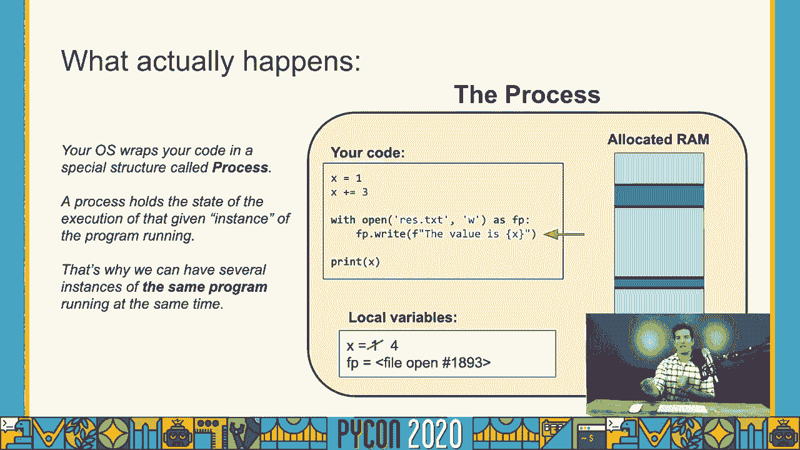

 So whenever we execute code， in this case， whenever you do Python， your command， what。 it's actually happening is that the operating system is creating a new process。 And it's injecting。

 that you're coding there， and it's executing that。 So you can actually run the same program you have， written， the same dot pi file。

 you can execute it in multiple， you can execute it multiple times。
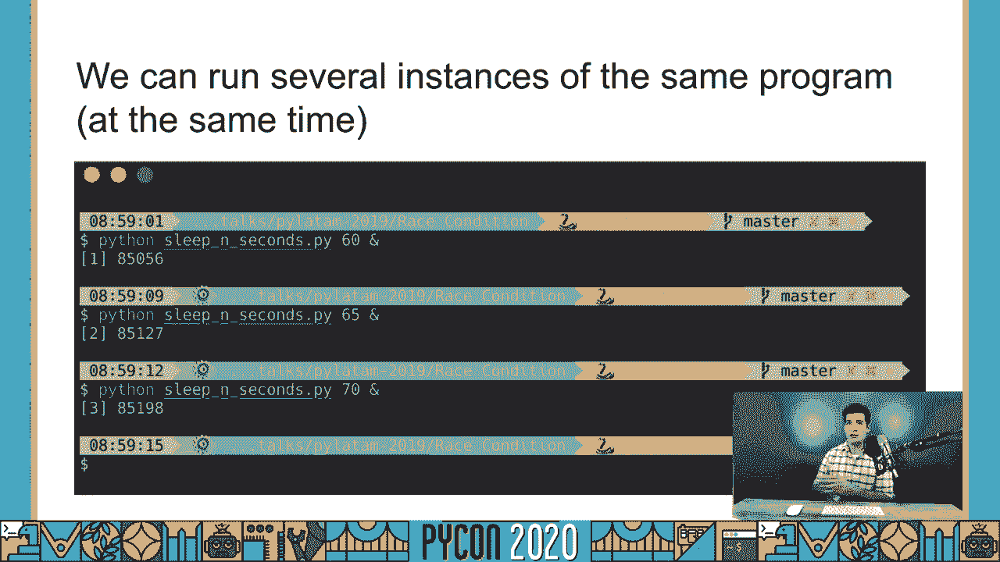

 You have multiple processes running concurrently in the same computer。 That's what we can see right。 here。 So that's those are all the processes that I have in my computer running after running。

 after restarting all those processes。 And again， there are all different instances。 of those processes。 You can see right there， process ID， that means that there is a different。

 instance of each one of these processes。 They're all executing the same code， but they are all。
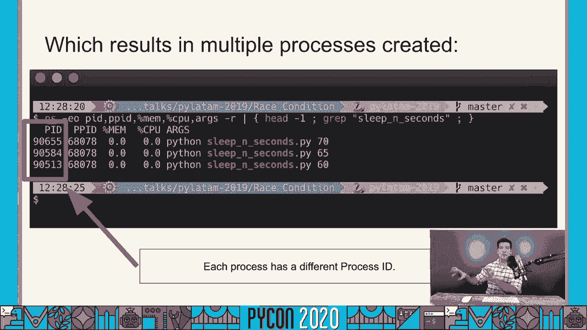

 different processes。 So what about process concurrency？ And this is the very interesting part about。 learning about operating system history。 At the beginning， let me just go with the slides， but。

 let's say we have only one CPU。 I'm gonna take you back。 I'm not that old， but I'm from an era。 where there was only one CPU。 Let's say you have only one CPU in your computer。 That's not what。

 happens today， but let's assume it's what you have。 We have only one CPU in your computer。 One CPU is one worker， just one worker。 How many processes can you run in one CPU at the same time？

 That's the question。 Of course， you can run only one task at a time。 There's only one worker。 you can run only one task。 But even when I was a child and I had a one core computer， I still had。

 interesting smooth enough experience。 I could play， I could play Doom， for example， the first。 version of Doom， and I had only one core。 So I fire a bullet， I move， my enemy dies， I get fired at。

 So how is that experience happening with only one CPU？

 If the CPU can have process one thing at a time， I fire a bullet。 And how is the CPU just keeping track of the bullet and everything else is frozen？ I can't move。

 my enemy can't move。 Because of what we're going to call time slicing or。 the scalar of the operating system。 So even with one CPU， let's keep these high policies here。

 we're working with a computer that has only one CPU。 Even if there are multiple processes。 being executed at the same time， the operating system is going to scalar them in and out， right？

 And it's going to give them a little bit of CPU time to each one of them。 Just one CPU。 the operating system is going to claim the CPU， it's going to give it a sign sometime to process one。

 it's going to reclaim it， it's going to sign sometime to process two， it's going to reclaim。 it's going to sign sometime to process three。 So it will give you the impression that there are。

 things happening at the same time when in reality， everything is happening not at the same time。 sadly。 So in our example of a game， a simple shooter in a one CPU， in a one core era。

 basically you fire a bullet， the bullet travels for a piece of a second。 then the CPU is transferred， to a character， then the CPU is transferred to the enemy and everything is there。

 It's a very， very fast context switching for each one of the， in this case they are not processed。 but yeah， between the processes， there is a very fast context switching。

 which gives you the impression that， things are being run in parallel。 And this is the difference between concurrency and parallelism。

 Concurrency is handling multiple tasks at the same time， not at the same time， literally。 that would be parallel， but starting multiple things and have to manage things that potentially。

 can't run at the same time， parallelism is actually when two things run at the same time。 In a one CPU computer， you can't have parallelism， you can have concurrency。

 you can't have parallelism。 That's basically the difference with parallelism。 So this is what parallelism couldn't look like。 Right， so if we go back to this slide。

 there are no two moments in time when there are two， tasks being executed at the same time。 There's always the OS， right， it's changing， switching， the main CPU， the CPU not main。

 the only CPU time from process to process。 And this。 introduces complexity because the operating system is also a program by itself。

 So whenever the moment， that the operating system is switching， the context of a process。 the operating system itself， it also needs some time to run。 So that's interesting。

 So this is a parallel system。 We have this is another hypothesis。 We have two cores now。 we have two CPUs， and each CPU is one of these blue lines。 And basically what it's happening。

 is that now in these moments in time， we have actual parallelism because one core is taking care。 of this task and the other core is taking care of the other task。

 So now this is actually parallelism。 You will see also that at some points the CPU is idle。 This is very common。 I don't， it's very common。 So again， what we're saying here is that the CPU。

 the operating system is the one deciding when， each one of the processes will run。 It has full authority to which CPU， which process is going to， be run at a given time。

 And that's a very important thing is moving back and forth the process that， can't run。 The operating systems， and again， history of operating systems are kind of a neural， net。

 but operating systems realized that there were different type of tasks。 And there were multiple。 time slicing algorithms created in order to understand when an operating system should grant。

 access to the CPU to a process or not， when it should schedule it in or out， right？ Take it out。 take it in。 And basically， there was one big realization that was related to the nature of the。

 task that was being run。 Remember our access times， if a process is， is CPU is I/O heavy。 you want to give it a ton of CPU whenever it needs it。 So whenever the CPU needs。

 whenever the process， needs to run an I/O task， you want to give that process to CPU。 because you know， it's not going， to take long， it's just going to fire up the request。 For example。

 it's going to say， you give this， the process time， it's going to say， Oh， thank you。 Now I need to read a file。 Just that's it。 You take， out the CPU， you assign it to another process。

 and then start reading the file。 And that's going to， take a lot of time。 We saw it already。 You have four days now to read that piece of the file， for the process。 So different processes。

 given their nature， if they are I/O bound or CPU bound。 the operating system is going to treat them differently。

 It's going to give them more priority or not。 And and what might be counterintuitive， usually。 I/O bound， I/O heavy processes should get more， priority in their CPU allocation。 Again。

 this is going to be important later。 So how are we going to make our code concurrent or even parallel。 ideally？ We were talking about， multiple processes。 So I could tell you， you know。

 you have a problem， you need to process a large， file。 It has， I don't know， a billion rows。 And you need to process that。 When you process that， you write your code， it says， for lining lines。

 blah， blah。 So you'd realize that it's sequential， it's very slow。 And you know。 you should make that program concurrent。 I could give you an answer， right now。

 just write your program。 So you can receive a parameter right here。 And just create。

 multiple processes， instantiate multiple processes at the same time process file from one from line。 zero to 100 million。 I don't know， run program from 100 million to 200 million rows。

 So you instantiate， 10 times the same process with different pieces。 And you're done。 Right？

 That's a good answer。 It's， going to get the job done。 Of course。 that you want to run everything concurrently in your program。

 You wanted to create one program that can spread its work across multiple threats or processes。 That's。

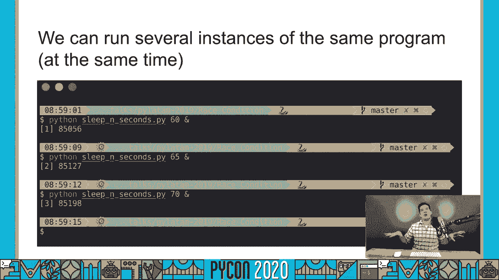

 what we want to do。 So the first part of， we could say intra program concurrency is going to be。 working with threats。 And that's what we're going to talk about right now。 The objective， again， is。

 going to make is going to is going to be turning a sequential code into a potentially parallel code。 So let's see an example。 Let's say we have to pull data from three different websites。 So it's。

 slow website， and it takes two seconds for each one of those requests。 In a traditional code。 these are traditional code。 We make everything sequential。 It's going to take two seconds to get。

 the first website， two seconds， two more seconds to get the second one， two more seconds to get。 the third one。 In total， it's going to be at least six seconds。

 if it can be even more if you have to， combine it。 At least six seconds to process the sequential program。 And this is a visual representation。

 First website， second website， third website， and at the end of processing。 So you can't。 the key part here is that you're not， you don't start fetching the second website until you haven't。

 finished the first website。 This is the idea of multi-threading。 It's going to be instantiating。 or start everything at once， right？ So everything can hopefully run in parallel， and then reach a。

 common point to synchronize everything back。 This is the idea of multi-threading。 So if we can do that， if we can spin multiple threads， and they all run concurrently or in parallel。

 we're going to， first wait for all of them to finish。 It's going to be around two seconds。 and then we can do the， combination at the end。 Our code has going to look like， it's ideal。

 it's going to look something like， this。 It's not the reality， it's just pseudocode。 But we're going to see the obstruction of a thread， to understand it a little bit better。

 The threading module is what we're going to be using。 And I'm。 going to just give you a very quick introduction first。 We're going to be saying some code。 It's。

 in a Jupyter notebook。 We're going to do a very simple introduction， and then we're going to dig。 into the more important parts， threads， synchronization， and all that。

 What I want you to remember is， we are working in an intra programming setup。 We're creating our own code， our program， it's going to be using multiple threads。

 and we're going to make that hopefully concurrent。 So， let's just jump directly into our code。 and let's start working with threads。 It's finally time to， see some actual Python code。

 We've done the whole conceptual introduction to about computer， architectures， operating systems。 processes， threats conceptually。 But now it's time to talk about， real code， creating threats。

 get them to run， etc。 So a couple of important nodes here， we are。 going to be using the thread class。 This is our major， the major class we're going to be using。

 throughout these first couple of lessons， in which we're going to create threads， we're going to。 instantiate them， and we're going to start them， we're going to get them running。

 and we're going to， analyze them， check out their status， etc。 But everything is going to happen in this thread class。

 And this thread class is contained in the threading module。 So this is a very important thing。 because we also have a underscore thread module in Python three。

 But this is a very low level module， that you should not be using。 We don't use it。 I have never used it。 The threading module is one， that is using underneath the underscore thread。

 and it's providing us with a much high level， interface。 right for us to create and manipulate threats。 So the thread class， again， this is a major， class。

 most important one we're going to be using to create and start the threads。 When you create it。 you're going to pass a target。 This target is the function that it's going to be run in a separate。

 thread， right？ So the remember that when you have your main process， your main process。 you're going to be creating a separate thread that it's going to run by its own。

 This thread needs some sort of callable， needs some action to perform。 So we're going to say。 which action we wanted to do or to run based on this target。 So we're going to first instantiate。

 the thread。 There's going to basically create these the container of the thread。 Let's say this is the， thread。 And we're going to be passing the target。 So in this case。

 we're going to be saying target， equals simple workers。 So it knows， right。 that it has to run the function simple worker。 Let's say。

 the function simple worker decode a simple simple worker is defined here。 And then we're going to。 start the thread。 The moment we start the thread， it's when actually the thread is starting and it's。

 performing its job。 It depends what your function is about the target function， what it's doing。 And， that is going to say if the thread finishes automatically finish at some point or it runs。

 forever， it's very common to have threads that have a while true here。 So basically。 we want to have， a background a background worker that is checking on some status as long as our application is alive。

 In that case， you might see here one true， we're going to keep running this thread forever。 It's。 going to be in the background， it's going to be do some computation。

 some checking in the background。 But again， the important part here is we have our whole process。 these are Python process。 And we're， going to create a few threads， let's say。

 as soon as we're creating several of the threads， instantiating them， just creating instance， T one。 T two， T three equals thread on a target。 We're going to pass the target， right。

 that it's going to point to a function， in this case， simple worker， right， that's the target。 The thread is there， it's stale， it hasn't started running。

 it's going to start running when we actually evoke the start method。 In that moment， the thread is。 going to start its performance。 So let's actually do the code here， I'm going to define the simple。

 worker function， I'm going to instantiate the thread。 Remember， nothing is happening。 What you。 can expect here， what's going to happen is that when we start the thread， when we actually start。

 the thread， we're going to see a hello printed out， it's going to slip for two seconds， and we're。 going to see a hello printed out。 So I'm going to start the thread， we see the hello。

 we're going to， wait， and now you see the world。 But the important part here is that I can。 I still have a full control， while these thread is running。 So let me put this thing to。

 for example， five seconds， I'm going to， redefine the function。 I'm going to instantiate the thread。 I'm going to do here a simple computation， two plus two， and I'm going to start the thread。

 and I'm going to， I can keep working on my computations。 that the thread is running in the background。 And in this case， it is slipping， right？

 But at some point， there you go， it returned back， it run that final function that it had。 And that in this， in this， particular moment， the thread is dead， we say we're gonna see about the。

 yeah， is a live method， the thread died， right？ It just completed its work， and it's now stopped。 So a usual common thing to do， is to create several threads altogether。 So in this case。

 we have all these threads here， I'm going to， put a semicolon here， so we don't see any output。 And I start all the threads and the threads start， slipping for some time。

 we're actually generating some random values， slipping for that time， and working again。 everything is happening on the background。 I still have full control in the main。

 thread to do whatever I want。 So let's do that again， I can keep running this thing。 and the thread is， outputting the result。 So let's talk in more detail about thread stage。

 As I told you， when we， create the thread， it's there， it's stale， we could say， is it alive？ No。 it's not alive， yet。 It's there ready， but it's not alive。 The moment that I started thread。

 now the thread is， alive， and you're gonna see the alive method is true。 Something important is that remember， we， when we start the thread， the main thread。

 when we start the worker thread to put it away， the main thread still has full control。 What happens if you want to pause and wait for the， thread to stop or to finish？ So actually。

 let's say you have these process， right？ And you're， aggregating data or whatever。 and you started all these threads， right， they are all working with， data。

 but you need to stop and unpause until all of them finish。 And once once all of them are， finished。 now you can process the data。 In that case， you do want the main thread to block。 You do。

 want the main thread to wait until that given thread or several threads， they all finish。 And to do that， we have the join method。 So I'm gonna instantiate the same thread again。

 I'm gonna start it。 I'm gonna， jump directly join。 And as you can see here。 my main thread now is paused。 It has just stopped。 We are。

 waiting for the for the thread we started to finish。 The join method， again， is what's gonna。 pause the main thread and wait until that thread or that given set of threads。

 they all have finished。 Once the thread has finished， multiple methods will raise a runtime error。 In this case， the thread has already been stopped or it has actually finished already。

 So it can't be started， again。 You have to create a new instance of the thread if you want to start the same task again。 Let's talk about thread identity。 And this can be very helpful for debugging to understand better。

 your code or to organize your code in a better way。 Thread identity means that we can set a name。 for our thread。 Right， we can， in this case， the thread， the name is set automatically。 But if I。

 show you again， the constructor of name of the thread， you're gonna see that names equals。 in this case， by default is known。 So the thread class。

 a threading module is gonna give it a random name， not random。 but a sequential name thread something。 And each thread will be assigned a unique identifier。

 a unique ID， we are gonna say just identity in the event in this case。 So I'm gonna say。 in this case， the event parameter or attribute is known。 But once I start the thread。

 we're gonna see that now it， has been set up to a given value。 Now that the thread has started。 at that point， it has this ID， which is just numeric for us to identify that particular thread。

 No two threads are gonna have， the same ID， right？ That's an important thing。 We can set up our own custom name when we're starting， the thread。

 And we can actually consult that information from the main thread， we can check what's。 the threads name in that particular case or ID。 Something interesting is that we can also check。

 these values from within the thread。 So here is an important conceptual thing。 And let me go back。 again to our drawing board。 If I have this is my remember the outside box is my process Python process。

 The inside box is the Python thread， which is gonna run a given function simple worker in this case。 We can create several of these threads， right？ So I'm gonna define all these threads。 Let's say we。

 have three threads， and they are all pointing， they're all gonna be executing the same function。 right？ The way we define a function is by just by defining the function is gonna be running in the thread is。

 by just defining a simple function， right？ I'm not saying anything crazy here， just basics， right？

 It's just a regular Python function。 But what I want to say here is that we're not making this。 function prepare to know which thread it's gonna be running。

 The same function has to be defined in a， way that it's useful for all the threads we create。 One。 two， three， 1000 threads， they can all run， the same Python code in the form of that function。

 So what I mean by this is that the function， if we， need to use the name of the thread。 and if we need to use the ID of the thread， we have to make it。

 generic enough that each thread running here， potentially in parallel， right， or concurrently。 to be more precise， they are all executing the same code， but they're all gonna have different， IDs。

 And that is what we're gonna achieve with these two very useful functions， current thread。 and thread and get dent， which are generic dynamic methods that are gonna give you the。

 the particular， let me stop this thing， that are gonna give you the particular。 value of the thread itself。 In this case， gonna give you the whole thread， current thread。

 the function， current thread， it's gonna give you the whole thread by itself， in which you can then。 ask for the name， as we're doing here t。name。 And you also can get the identity， the ID that was。

 generated。 And in that case， just get ident， it's gonna be the number we have。 So let's actually。 use the same code to create three different threads， three different threads。

 each one with a custom， that we're providing， and we're gonna start all of them。 And now we are waiting for them to finish。 So， bubbles， blossom， buttercup， they all finished。

 And when they started， they had， internally， each one， of them， they had their own IDs。 So so far。 we've worked with very simple functions， they are not， receiving any parameters。

 we're just starting there， and they are running。 And this is not， of course， realistic。 usually a function receives parameters。 It's very simple to pass parameters to the thread。

 class to pass arguments， we could say， it's a little bit more difficult to work with dynamic。 situations， like， for example， keyword arguments， or， yeah， different type of parameters。

 we need to， create dynamically based on the use case。 And that's why one of the reasons that I have created the， parallel library。

 but we're gonna talk more about that later。 For now， I'm gonna show you， show you。 how simple it is to pass a few arguments to a given function。 In this case， we have defined。

 the simple worker function again， which receives now a time to slip。 So far， we've always defined。 this case randomly how much the function was slipping。 In this case。

 we're gonna pass that value as a， parameter。 The way we're gonna do that is， as usual。 we create an instance of the thread class， we pass a target， we pass the name of the of the thread。

 and we're gonna pass a set of arguments。 And in these arguments class， our sorry。 not class parameter， we're gonna pass all the values are， gonna serve as arguments for the function。

 In this case， it has to be a topple。 And as we have only， where is the only one parameter。 I have to put this comma right here。 So I don't want you to get， confused about that。

 But here's basically a list of all the different parameters you want to pass， to your function。 So in this case， I am running it again。 And you know here， for example， bubbles。

 right here is slipping for three seconds， blossom here， here is slipping for 1。5 seconds。 A different alternative way of creating and instantiating a thread and running it， etc。

 is not by providing a target function by itself， but creating a subclass of thread。 and defining the behavior of the thread in the run method。 So this is also very common。 And if you。

 have a good architecture， a good design based on object-oriented programming in your code。 these could potentially organize your code a little bit better。 For example， if you have this。

 background thread we've talking about， instead of defining a function separately in a different module。 on the thread in a different module， you can just put the thread， you can give it a very。

 obvious name， what's the purpose of the thread， and get it to run without defining any external。 functions。 Usually the function we use for a thread， usually， I'm going to say 80% of the time。

 it's a very particular function that is not used anywhere else。 So it doesn't make sense to define。 the function in a global scope if it's going to be just used by a thread。 That's why again。

 you can define the same functionality within the run method。 The run method receives nothing。 just self， the only parameter。 We usually pass all the parameters in the constructor of the， class。

 the initialization method of the class。 And you hear you have to be careful not to step over。 the parameters of threads。 So you can usually， if you're passing a variable number of arguments。

 etc。 how to pass it all here。 The good news about defining your own classes that you can do。 pretty much whatever you want in the need method， and that means that any short comments you have。

 with arguments can be fixed if you want with a custom class。 Particularly， I prefer to create。 subclasses， because again， it organizes my code better。 I prefer to have this thread that has this。

 particular functionality and everything is encapsulated in the run method。 During this tutorial。 and I， have to be completely honest with you， I am not going to be doing two classes。

 but I will use a lot， more the target one， because it's easier to see the function define separately。 So just for the， clarity of this tutorial， I'm not going to be using subclasses so often。

 But let's see how it works。 I'm just going to instantiate the class。 There you go。 T now is an instance of my thread， and I have， passed an only parameter， the number。

 the time to slip。 I'm defining or I'm setting that parameter as， an instance attribute。 And now in the run method， I can use that parameter right in the run method。 So， I do t dot start。

 t dot start is running the run method。 And here I can access all the attributes， that I need。 The name attribute， for example， it's interesting。 Remember that the name attribute is。

 set even before the thread starts。 So I can just use it directly。 Not the same as with the identity。 ID of the thread， which needs to be consulted in kind of a real time， I don't know， in an live。

 dynamic manner。 So let's talk about something very， very important conceptually。 And it's this。 property we have discussed a little bit already about threats using or having the having access。

 to shared data。 All right。 So using our previous conceptual analysis picture of our processes and。 threads， we said this is our whole process， the yellow box。 And it has some code to run， and it has。

 defined a few local variables。 Again， this is the whole process。 The whole process will then。 instantiate a few threads。 And those threads will start。 In that moment， all the threads within a。

 process have access to every defined variables in that given process by itself。 So in this case。 we have time to slip was defined outside of the function。 And it's of course defined in the main。

 process。 When I create my threads， and I'm gonna start only the first one。 So you can check it。 so you can see it。 You see that here is sleeping for two seconds， because it's what we have just。

 defined。 So let's re-insensate them and run them all again。 And you see that all of them， all our。 threads are running by two seconds。 Let's change this thing。 I'm gonna put three seconds， 1。5。

 shorter。 And we define and start all of them。 And you see that they're all starting by 1。5 seconds。 This is interesting， but you because you can change the behavior of your threads by altering the state。

 of a global variable。 So let's say we have an exit， exit underscore threads equals false。 Right。 So here inside， we could do something like while not exit threads。

 we're gonna keep doing a background， process。 All right， just run。 When we want all the threads to stop， we can signal that by changing， this variable。

 In the main process， you'd say， you say， exit threads equals true。 And now the next time。 this thing runs， it's gonna find that variable changed。 We can modify the state or the work of a。

 thread by modifying these global variables。 That's an important thing。 This actually will introduce。 of course， the problem of rice conditions and stepping over shared data。 We're gonna talk about。

 Mark about that in our following lesson。 So this was a very quick introduction to how Python threads。 work。 I don't want you to memorize everything。 We're gonna be doing a lot of work。 So it's gonna be。

 very familiar by the end of this tutorial， how threads work， how to create them， how to instantiate。 how to start them， etc。 So I want to finish this part。

 just our first approach to threads with a real， example of our threads and the way they run and all that。 To do that， we're gonna be using a， web server that I have included in this repository that is basically gonna give us。

 prices of Bitcoin。 So I'm gonna be instantiated here。 I'm gonna， if you check the structure of。

 your repo， you're gonna see crypto examples right here。 And this is a flask application that I can。
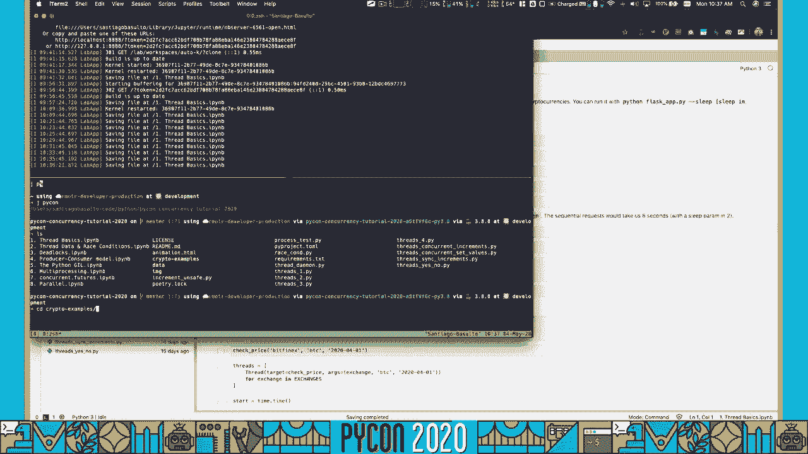

 show you real quickly。 It's crypto examples， flask hack， this one right here。 And what this。 application is gonna be doing is returning prices from different cryptocurrencies and exchanges and。

 all that。 The reality is that we could have consulted a real service by doing this tutorial。 but to be honest， I don't want to hit an external service by doing our tutorial because potentially。

 you can be loading， overloading a server just for the sake of the education。 So it took the time。 to recreate the application for only for this tutorial。 So let's start the app。 And we're gonna put。

 we're gonna put slip， no， no slip。 There you go。 And it's running in this URL。 There you go。
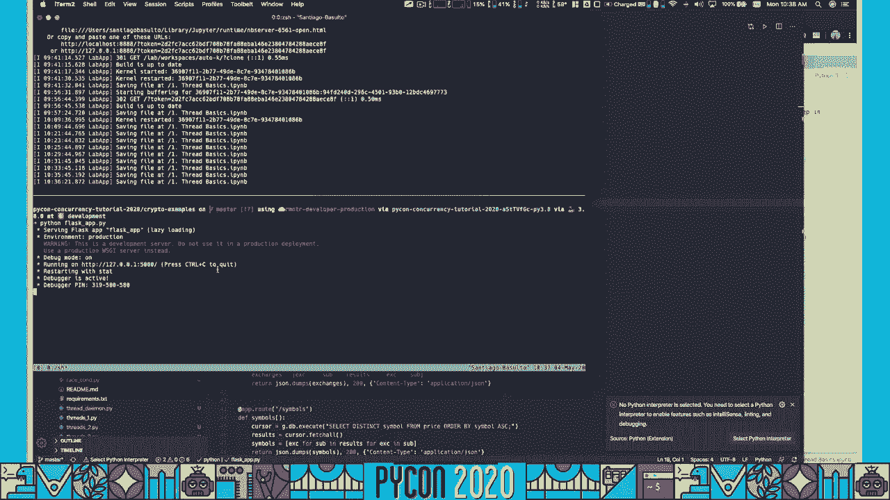

 And it's a very simple app。 And what we're gonna have is all the exchanges that are part of our app。 they are all here， all the symbols or all the currencies we support。 And then we can consult。

 prices of given dates。 Let's see if there is a price here。 I don't know。 There is a price here。 So for Vith Finex， BDC， this is the price of that given date。 The way I have created。

 this simple app， aside from the code， is by getting information from where is。 I think it's right here， in this notebook from CryptoWatch API。

 You can follow all these notebooks if you want to see the， process that I follow to create the app。 But basically， I downloaded the information from this， public API。

 and I download them all in CSV files。 And then I instantiated SQLite database。 So the。 flask app is rating the price from the database。 So that method price is actually performing this。

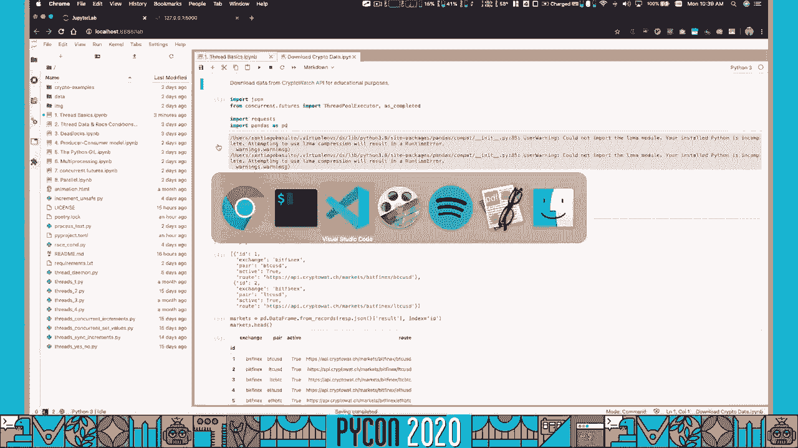

 query。 You are gonna get the price for a given exchange， given symbol， and a given date。 We。 perform that query， and we return the results。 If any， if there are no results， we will just return。

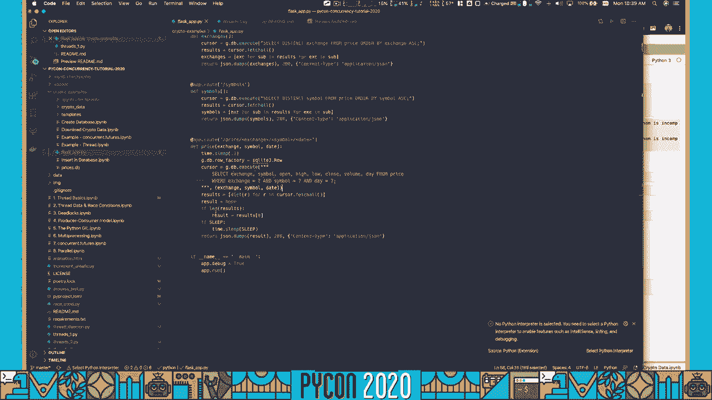

 none。 So that's again， a quick introduction of how our app works。 So it's running， we can sit。 we can sit right here。 And what we're gonna do is we're gonna instantiate by base URL， we're gonna。

 use the requests， math module that it's used to perform HTTP requests。 I'm sure you're all familiar。 with it。 And we're gonna perform a simple query here to see what's the price。 Actually。

 let's let's follow the same price here。 We're gonna see bitfennox， bdc。 but we're gonna change the date。 And we're gonna get the same price potentially。 Oh， let's see。

 close 7247， close 7247。5。 So it's the， same price price， sorry， again， for both of them。 So now。 why are we using this app？ We're gonna be， using it throughout the entire tutorial。

 What I what we want to do here， is we want to check。 prices of a few different cryptocurrencies on a few different exchanges。 But to make things more。

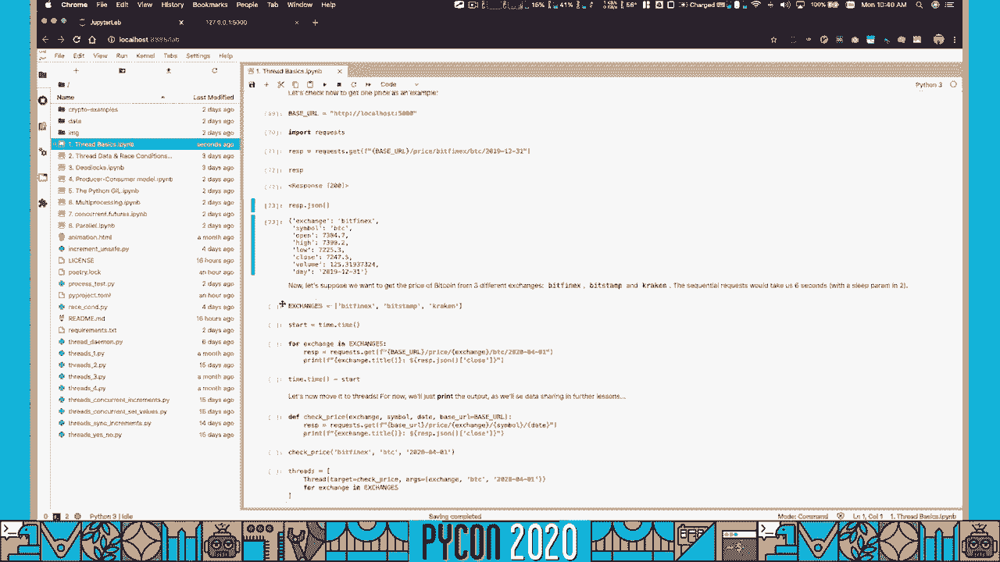

 interesting， what I'm gonna do is gonna restart the server by providing a sleep parameter。 And this。
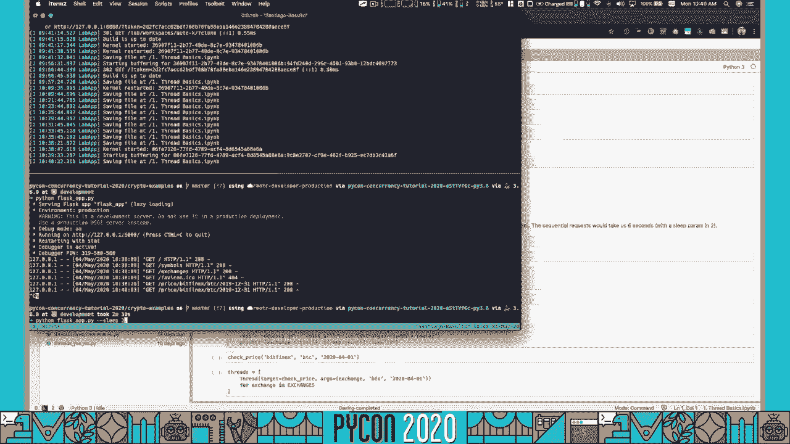

 is an artificial time for the server to sleep。 So we check right here， if sleep， we're gonna。 sleep each after each request is gonna be delayed for this given number of seconds。 And this， which。

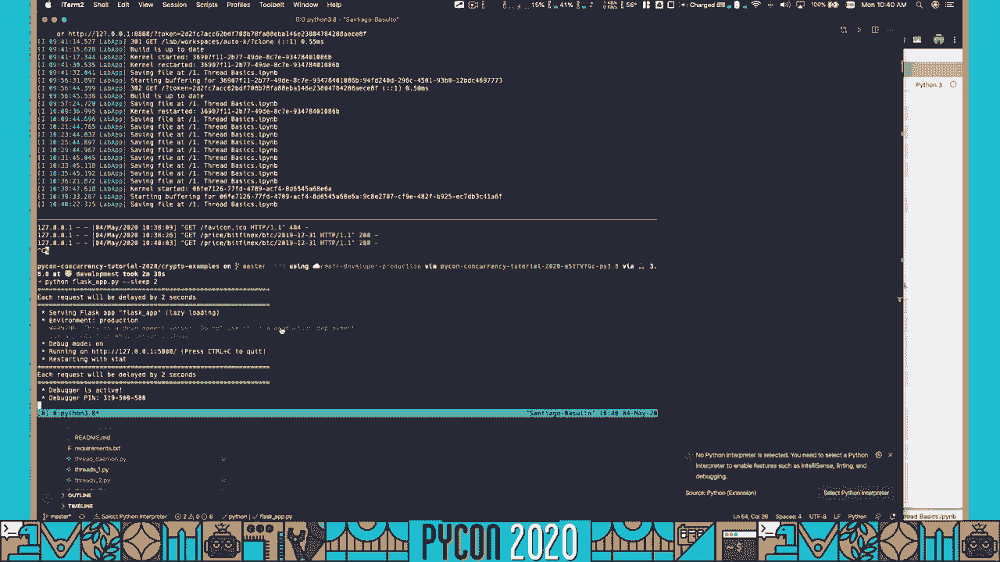

 is informed right here， will help us simulate the process of a slow server。 And that's why we need。 threats。 If you remember from our conceptual explanation， we said， let's say we want to consult。

 three prices， we want to consult， what do we have here， we're gonna check always for bdc。 And we have bitfennox， bf， we have bitstump， stamp。 And we have Kraken。 These three exchanges。

 If each request is delayed by two seconds， right， two seconds， because we have artificially slow。 down the server， if we make this sequentially， in that means no threats at all， just as you know it。

 you're gonna， you can do a for loop， you can do a less comprehension， whatever， the total time that。 is gonna take you to run all these things is gonna be six seconds。

 or at least six seconds around six， seconds， right， because you're gonna make this request。 slip for two seconds， slip， make this， request， slip for two seconds， make this request。

 slip for two seconds， and finally， the process， is gonna be done。 If we run all these tasks of getting the price concurrently， that means an， kind of imperlil， right。

 I'm using these two interchangeably until we see the concept of the， girl and all that。 but if we run all these concurrently， and we say these are all running， hopefully。

 let's say they're all running imperlil， that means that the whole process is gonna be。 finished in about two seconds， and that's the idea of using threats。 So let's try it out now。

 I'm gonna， uh， instantiate the threats with the exchange is gonna use， we're gonna use these three。 exchanges， and we're gonna measure how much time it takes us to do the whole request。

 So for each one， of the exchanges， we're gonna be， this is sequential， the sequential process。 by the way， we first ask， for bitfonex， then forbid some and then for cracking。

 this is taking us say 6。84 seconds， all right， this， is sequential， we check a price first。 we sleep， it just， you know， blocks， we then check the other， one， then check the other one。

 this is sequential one that takes 6 seconds。 But now let's do it concurrently。 we're gonna define a function which is check price that receives a exchange symbol date， and a base。

 URL we were gonna use from the default one， it's just gonna check that price。 So now I can start one， thread per each exchange that I have set。 So they have three exchanges。

 they're gonna be creating， three threats。 And what I'm gonna do is I'm gonna start the time。 start the threats， start counting， and now we see that all the prices， bitfonex， Kraken。

 and bitstump， they have all finished in about 2。35， seconds。 And this is what we are expecting from threats， we're expecting sequent， not sequential。

 sorry concurrent， close to parallel execution to speed things up。 Now a few things here， we can't。 we can't be sure which one is finishing first， to be honest， in this case Kraken finished first。

 if we run this thing， maybe another one can finish first。 Not everything is so linear in。 in the work， you have to do in real life， in this case where artificial is living for two seconds。

 in real life， this request may be slower than this request， so you don't know how it's gonna end up。 And you， also see that in this case these two things were written in the same line。

 that's because there is， some， there are some issues， right。 some shared state or side effects that are affecting that。

 we're gonna see more about that in our next lesson。 But again， the idea here is that we're。 spitting things up by concurrently running the three threats to console the prices of those。

 three exchanges。 So this is wonderful， right， let's say we have。 let's say let's follow this example and， say we wanna get。

 we wanna get prices for all the 10x exchanges we have in our system， the three， symbols， BTC。 LTC ether， ether， and we wanna get all the past 30 days。 In total， we're gonna be making。

 900 requests。 Can we start 900 threats following this pattern creating one thread per work？ Can we。 create all those 900 threads？ The answer is usually no， we cannot， because threads will。

 if we go back， again to this picture， they will consume resources in the process。 So we don't wanna clog the entire， process with a ton of threats working concurrently。

 So we're gonna see how we can fix this with multiple， ways。 Mainly。 we're gonna use the producer consumer model， we're gonna follow this exact example。

 in which we will create a pool of threats， let's say 10， and they're gonna take care of running all。 the requests。 But again， what I'm saying here is be careful， right。

 the summary of this is be careful， how many threats you're gonna create。 it depends a lot on the system you're using， and we're gonna talk， more about that。

 There's a formula that the Python module uses to calculate how many threats is optimal。 but that is it。 Finally， as a summary， remember， threading is the module we're using， do not use。

 threads， underscore threads， sorry， because it's a very low level module you don't wanna get。 messed up in there。 So let's move forward with thread data and read and raise conditions。

 Let's talk now about what are the implications of having shared data in our threads。 In our previous， in our previous notebook， we saw how multiple threads can access given local variables or actually。

 global variables in a process， right， they're actually local to the main threads。 The notation。 is confusing， but basically， threads can access shared data。 This is interesting， because we saw。

 we could control the behavior of threads by just all by mutating different variables that are set in。 the global scope of the process that can be convenient。 But it will also introduce a few problems。

 That's， what we're gonna talk about right now。 The first problem we're gonna see is the issue with raise。 conditions in which， conceptually speaking， and this is very conceptual。

 raise condition is gonna be， and I have here linked to the wiki PD article， but basically。 a raise condition is problematic condition， something we don't wanna have in a program in which the。

 outcome of the program will depend on the way that or the order that some instructions are。 executed。 And that's something we don't want。 Let's say today， our program outputs five， because。

 I don't know， thread one run runs before runs thread two， and tomorrow， it outputs seven。 because thread two run first， and thread one run later。 So we don't want to have just sort of。

 random behavior in our programs， because one thread bit the other and run first， right？ We want。 a third-term and stick approach。 We want things we are sure about。 We don't want our program to。

 run successfully today， because thread one won in the raise competition， and tomorrow， it fails。 transferring money incorrectly， or， I don't know， granting access to a user that hasn't paid。

 because another thread run first， right？ We want our programs to be deterministic。 So。 I'm gonna show you the problem of raise conditions with this example。 We have a global。

 counter-varval that it sets zero， and we're gonna define this function increment in which。 we're gonna run in threads。 We're gonna create 10 different threads， and we're gonna make them run。

 a given number of iterations。 We're gonna pass， we're gonna say each thread to run a thousand times。 So， right， we're gonna create just to follow， we're gonna create， we have a global counter-varval。

 starting in zero， and we're gonna instantiate 10 different threads。 10 here， we're gonna do 10。 different threads right there。 These are 10 threads。 And each thread is gonna run 1000 iterations。

 here of this code。 1000， we're passing that as a parameter， but in this case， we have to find 1000。 1000 repetitions of that given iteration， incrementing the counter by one， right？ So， they're all。

 incrementing the share counter by one。 Right， that's what they are all doing。 Um。 what could be the expected output of this？ Let's say， forget about threads for a second。

 let's say you run this thing sequentially。 You run first the first thread here， you run 1000。 iterations， so the output is gonna be 1000 or sorry， not the output。 The value of counter。

 after these first thread runs is 1000。 Then you run the second thread， and this one increments。 all the counter by 10 by 1000 again， sorry， because you have 2000 here， and then this finishes。

 and we have another thread 1000 iterations， now it's 3000， right？ So the output at the end of this。 thing is gonna be equals to the number of threats we have， we're gonna say number of threats times。

 the number of iterations。 In our example， we have 10 threads， 10 times 1000 iterations。 So our result is gonna be 10，000。 That's gonna be the result。

 the final result that we are expecting， in a correctly executed but slow， it doesn't matter。 but correctly executed program， we're gonna have， 10，000 is gonna be the output。

 What we're gonna see in the wrong behavior in the problematic。 race condition behavior is that these threats will be stepping into onto each other。

 and they will be， mutating data here and there， and the output will be different than 10，000。 That's of course， problematic， we don't want that to happen。 So let me clear up all this thing。

 and we're gonna run， the example， we're gonna find the increment function， iterations， variable。 we're gonna， instantiate the threads and we're gonna start them all to run。 They all finished。

 this was very fast， we're slipping them for just a few milliseconds。 And now， well， it all worked。 Now， sorry， the threads fail。 So this is interesting。 In the first example。

 not something that usually， doesn't happen， and I was actually thinking about trying to replicate it。 In the first example， it worked， you know， and that's the problem with race conditions。

 And this is a great thing that， happened。 You might run your code， I need my run correctly。 like the first example， it worked， but then you try it in production and it breaks。

 The worst thing is it doesn't break。 In this case， I am making it break on purpose。 The problems that you have an incorrect result， which if you're， confident about the code。

 because you run it locally and it worked or the tests are passing， in production。 you will trust this value of counter。 Although， again， it's a faulty one。 So let's do， it again。

 Let's try creating the threads and see how they work。 Well， it seems like it keeps， failing now。 And check the results， the counter variable， it's always different， it's completely， random。

 just whatever 32，000。 In this case， it's 47，000。 It's just， oh， I'm not changing the counter。 There you go。 So I thought， a thousand and seven hundred sixty， 60， 60， yes。 So again。

 another value， and resetting the counter and it always changes the value。 It's completely random。 It's completely， random。 You don't know what the value it's going to be。 Right。

 This is the result of a race condition。 And why does this thing happen？ Well。 it happens because if you look into the details of， this operation， counter plus equals one。

 what you're going to see is that internally， there is no way of performing this operation in just one step。 In reality， what we do， if we have a， value z， the C， sorry， that it's zero。

 and we want to increment C， what we do is we create an。 artillery variable with the value or the code equals C plus one。 So that is now one。

 And then we set， the value here， we do see is equals to oops。 That's the usual process that computers are， going to follow。 So that again， that's like two。

 three operations at least。 The fine ox， created some risk gave this result and then set it back again to see。 In this moment， if you have， if you have parts of these being run by different threats。

 they might be stepping， onto each other's data。 Let's say we have counter equals zero。 This is a whole， the whole counter。 And we have these two threads that are starting concurrently。

 Three， this is T one。 And they start， with this operation， create ox and counter。 That's going to be the same for them。 Ox is going to be。

 equals to C plus one for them for both of them is going to be the same equal C plus one for both。 them。 But these two run at the same moment， exactly the same moment in parallel。

 That means that C for， T one， it's going to be zero。 So it's going to be zero plus one。 But it's also going to be， here zero for number four three threads or a number two。

 So in this moment， the result of A， is going to be equals for the same for both of them。 It's going to be one here。 That's going to be， one here。

 Then it doesn't matter which one wins setting back the value here。 But basically。 we run two operations and they both got the same value。 Right？ At the end is going to be just one。

 What we want here， I'm going to clear this thing up。 We won't see。 What we want is that these two。 threads， if when A reads the value C zero plus one， we want the first thread， which is C plus one。

 We want it to wait until A equals one until this one puts the value here。 And now this can go and read， it。 We want the threads to be isolated and we don't want them to collide at the moment of reading or。

 writing data。 And we are going to achieve that with what we call thread synchronization。 This is a very big deal in computing。 It's a very big deal。

 It's going to happen in operating systems， database systems。 If you want to read more about it。 there are tons of books， read anything about them， about it。

 You can get any operating system textbook and it's going to。 talk about there's going to be a chapter about synchronization。 I guarantee it。 So it's a very。

 big deal in computing。 And the way synchronization works， basically。 but in a very conceptual manner， is by signaling states， signaling that I am in this moment。

 I am accessing to counter。 So please stay away by signaling that I have just finished updating counters。 So now you can write， it， etc。 just by creating signals and informing that someone is currently using something and。

 that something that shared resource is currently busy。 It's already being used。 And a very good。 example is this recording light。 This is from our own studios in reality。

 I took this photo in which， as a human， if I want to use the recording studio。 which is a shared resource， there are several， instructors and we all use the same recording studio。

 If I want to use it， the share resource， and then approach and I reach the door and I see that the light has been turned on。 I will not use the resource。 I will not use the recording studio because that means that someone。

 else is using this studio。 I will work。 I will wait， sorry， for the light to go off and then。 I will step into the studio because I know that someone has just finished using that resource and。

 now I can get in。 Potentially， there are going to be multiple instructors waiting outside。 And the question is which one is going to reach the studio and turn the light on first。 That's。

 another issue with synchronization。 Conceptually speaking， synchronization is protecting shared。 resources by providing these signals， by providing these hints。

 saying someone has already used these， resources。 And the big deal about it is that synchronization is usually cooperative。 It's not that the light has a physical power that it's stopping me from getting into the studio。

 If I'm a bad instructor， if I'm a bad thread， I can open the door anyways and interrupt the。 instructor in the middle of his or her recording session。 And that's catastrophic。 They're going to。

 be losing two hours of recording because I stepped into it in the middle of it。 For example。 if they're， in a live webinar， I'm completely destroying their work。

 But I'm stopping and waiting outside， because I am a cooperative instructor。 I decide to stay outside， but nothing is stopping me from， actually walking in。

 And the same thing is going to happen with our threats。 Our threats will use。 synchronization methods， but they're all cooperative。 That's cooperative。

 That's because we have decided， to write the code in that way in the best of our intentions。 We're writing the code to use， synchronization。 But if you have a malicious piece of code or a sloppy programmer。

 someone， forgot to use that synchronization mechanism。 then nothing will prevent the shared data to be corrected。 So let's start now in particular。

 We're going to see our first synchronization mechanism， which is a lock。 It's a very simple。 it's probably one of the oldest sort of synchronization， primitives that we use。

 And there are multiple synchronization mechanisms like Glocks， semaphores， there are multiple ones。 In this case， we're going to be using lock。 Again， it's one of the simplest， ones。

 Usually a mutual inclusion lock。 It's also called mutex， has several names。 Basically。 a lock works as a real lock。 There is this shared resource and there is an open， we're going to。

 I'm going to try drawing a lock。 It's an open lock。 Someone uses the resource。 So they just shut down， they close the lock。 When they are ready。

 when they're finished using the lock， they're going to open。 the lock and now it's going to be available for someone else to go and take it for someone else to。

 go and use it。 So the way it works is by we create one instance of the lock。 the lock will be shared。 We're all using the same lock。

 And the thread that is going to work on that lock will try first， acquiring the lock。 This is basically， I want to use these resource， these resources， what we're。

 doing right here in between。 So I want to use this resource。 I'm going to acquire the lock。 So now。 I owned this lock。 So nobody else， by using by doing this， I will be guaranteed that nobody else。

 no other thread will be able to acquire the lock。 So the operation acquire on a lock is atomic。 If I get a true output out of this， that means that I am the sole owner of the lock。

 Then I can do and work with any， I can do whatever I want。 Usually once you acquire the lock。 you're， going to perform some operations on that shared resource you have。

 So let's say it's a counter， variable， the moment to increase the valid counter is in that particular moment when you have。 acquired the lock。 Any work that is not potentially。

 it's not going to suffer from a raised condition， potentially， is going to stay out of the lock。 Because the lock operation can potentially slow， you down。 If the resource is busy。

 you will not be able to acquire the lock and you will not be， able to do that work。 So usually anything that is not dealing with shared data that's going to stay， outside of the lock。

 Once you acquire the lock， again， you do whatever you want。 hopefully it's just going to be related to shared data， shared resources。 And then once you're done。

 you release the lock。 You say， I am done， whoever wants to do this work， now they can acquire the。 lock。 So let's see how that works。 I acquired the lock， I did something and then the lock finished。

 There you go， sorry， the lock finished。 The I slept for 10 seconds。 So that means that I'm going to be， sharing or sorry， I will have the lock acquired in this thread。

 I will keep it busy for 10 seconds。 And then I am releasing it。 So what happens if I try to acquire the lock while this thread has， locked acquired？ Well。

 it's going to block。 So let me show you that。 t。start started acquiring the， lock。 The lock is acquired。 Is the lock locked？ Yes， it's locked。 What happens if I try acquiring it？

 I'm going to run the code again。 I'm going to increase the time here。 So you can see very clearly。 what's going to happen。 I'm going to start the thread again。 It's locked。

 And now we'll try acquiring， it。 And as you can see， the process is has just stopped。 It's waiting to acquire the lock。 The acquire， operation is going to block until the thread。

 whatever， whatever thread actually successfully acquires， the lock。 Okay。 Now the main thread has a lock and we can use a drawing to simplify this。 So we have， this thread。

 We have， let's put a share lock right here。 And we're going to have this is open。 Let's。 say this is open。 And what happened here was that in this line， start the thread acquired the lock。

 Right。 So in this case， is this one is the let's put t as the owner of the lock。 So when the main thread， our main code in the process tries to access the lock again here。

 it tries to lock and it's locked。 So it's just waiting there。 It's waiting。 It's waiting until the lock is released。 Once the there you go， I'm going to clean this up。

 Once the thread here releases the lock， it's empty。 Now the main thread can take ownership of that lock。 So now the lock is owned by this main thread。

 But now I have this thread finished。 It's done。 I have created a new thread here。 I'm going to put it， here。 Again， this is done。 When it if I run it again。

 and it goes here in this line， it tries to acquire， the lock， that thread is going to block forever。 at least until I release it。 So that's what we're， going to do。 I'm going to start the thread。

 It has it's trying to acquire the lock。 It's， slept there。 Just stop there。 This is blocking。 The thread is waiting。 And what I can do， the thread is waiting there。 It's waiting。 It's waiting。

 It's waiting。 It's waiting。 What I can do， is from the main thread， I can say， well。 now release the lock。 Just release it。 And I'm going to do that。 I'm going to release the lock。

 Immediately， the lock acquire said right here， lock acquire。 And then it finished sleeping and all that because I didn't pass any time。 But the idea is。

 that the thread was stopped and waiting。 It was blocked because I the main thread had the locked。 acquired。 The moment I released it， that other thread was able to run it。 So using all this。

 that might be confusing， we're going to use a real example。 And we're going to fix our counter。 Remember， after 1000 operations， 10 different threats， we're waiting， we're expecting to have， 10。

000 out in the final result in the final counter。 So the way we're going to do that is for each。 iteration before we modify this shared data， this important shared data。

 we're going to acquire lock。 So at that moment， we know that nobody else will update that counter。 We will have sole ownership， of that counter。 We're going to update it。

 And then we will immediately release the lock。 So anybody。 else waiting to get and get the dog will be able to do it。 So I will initially。

 I initialize counter， initialize increment or define increment。 I define a lock。 Remember that a lock is a share resource， to we all have to use the same lock。

 If we are using different locks， doesn't make any sense。 And， I'm going to create all the threads。 And now I'm going to start all the threads。 And they're working。

 I'm going to show in and wait until they finished， they'll finish pretty quickly。 And let's see。 the result of counter。 Counter is 10，000 as expected。 Let's do the whole thing again。 10，000。

 I can do this 1000 times and I can guarantee you now that these will work。 because no two threats will be modifying counter at the same moment。 Now。

 let's go back again to the problems that we could potentially face with threats and， colonization。 The first one is the issue with， and we say that this was a， corporate task that we were running。

 I wrote this code and I was thoughtful enough to put a lock， before access encounter。 But again。 that will require that me understanding the problem。

 me being careful enough to include the lock or my co-worker also being。 awake at the moment of co-reviewing to let me see that I'm forgetting a lock， etc。 So there are。

 multiple things that can go wrong。 Now， four listed problems right here。 The first thing is you might， forget to use locks at all。

 If you're just in a hurry and you're modifying some global variables。 you might not realize that you might be stepping into a raised condition。 So not understanding。

 raised conditions correctly， not understanding shared data correctly。 Just might be an issue of。 lack of experience。 When you're starting to write your first concurrent programs， you will lack。

 that experience。 So that's a problem by itself。 The second problem is that you might forget to。 acquire the lock。 If I remove this line， and I haven't tried this， just go ahead and do it。

 if I remove this line， I will not execute the code。 If I remove this line and nobody actually。 acquires the lock， it's like， you know， having an open lock is like having no lock at all。

 So the problems will arise anyway。 In this case， we are required to acquire the lock at the moment。 needed。 And on top of that， the lock is kind of a philosophical word we have in our code。

 but it's not protecting counter。 Nothing is protecting counter。 I could have modified counter。 before the lock。 And you know， they asked me， hey， did you use the lock？ Yes， I did use it。

 But nobody is saying where I used it。 And this is a pretty dumb example。 Sorry， it's just like。 five lines of code。 But in a more complicated program in which you have a ton of shared data。

 multiple locks， all scattered around， this is going to be a problem。 You might put the lock。 acquire in the wrong place， or you might forget it to put it at all。 Then it's the problem of your。

 critical section， again， doing something that the lock is protecting or not。 And finally。 what happens is a big deal。 What happens if you forget to release a lock？ If I forget to release。

 the lock， all the other threats will be blocked forever。 If I have a bug in my program and I'm not。 releasing the log lock， sorry， all the other programs or threats， sorry。

 they will all be blocked forever。 Let's actually see a problem with that。 I'm going to create a new lock， and I'm going to define this， function right here。

 going to start it。 And what is going to happen here is that I'm going to pause， faulty。 I'm going to say an error when in the sleep parameter。 So what is going to happen here is that。

 this code is going to run， it's going to acquire the lock。 I have a release。 So let's let me let's say， I submit a pull request， you review this code。

 and you see the lock here release， and you see here， the choir and everything makes sense。 And you say， Hey， the code this code runs perfectly。 But， there is a problem。

 What happens if this sleep parameter is invalid， as it's going to be here？

 The moment that these code runs is going to raise an exception。 And the thread is going to be。 stopped altogether。 So that means that we will never reach this section， and that will never。

 release the lock。 So now let's run it。 It blew up an exception。 The lock was acquired。 So now this。 lock is still in this acquisition process state that nobody else can acquire。 Just it's going to。

 hang there forever。 My code is now hanging forever。 I'm going to interrupt this artificially。 There is， no way of doing this in your code live。 But again。

 these things locked can't do anything about it。 So the way we can fix this is by passing a timeout in the acquisition process。 So let's say I want， to acquire the lock， but I say， I'm only wanting to wait here for two seconds。

 Because if the lock， hasn't hasn't been released in two seconds， that is potentially a problem。 You can put whatever， value you want here， or you can even go ask us to the point to say。

 I want to acquire the block， the lock， I do not want a block。 So now the result is false。 If the lock was not acquired， and true， if you have successfully acquired the lock。

 So this will not block。 We can release the lock and now all works。 So this is a very common problem。 You， breathe the code。 There is an acquire call and there is a release code call。

 But anything in between， anything in between before the release， if something fails。 the lock will be acquired forever。 It will， be acquired forever because the exception will prevent this line to run。

 So that's a very common， pattern in programming in general。 When accessing accessing databases。 when accessing files， when accessing， networks， when accessing these important costly resources。

 And there is a way in Python to， overcome those difficulties with the usage of context managers。 So the with statement is a context， manager in Python。

 And what it's going to do is going to run basically this pattern right here。 It。 will acquire the lock。 It will try running this critical section。 And if anything fails， it doesn't。

 matter if it fails。 It will always release the lock， regardless of the condition。 If it works。 or if it doesn't， if it blows up because of an exception or if it doesn't blow up， it will always。

 release the locks。 That's a pattern that the with statement is following。 So we're going to do that。 I'm going to instantiate the lock。 I'm going to start it。 The lock was acquired。 Lock was acquired。

 And now we're going to run the example with the problem， if the one that blows up， the code blew up。 So that means that at this moment， it stopped。 But as we are using the context， manager。

 we will see that the code is not locked。 And we can acquire the lock immediately。 Again。 this is the pattern that we are using right here。 So finally。

 to fix the code with the with statement， with the context manager。 the only thing we're doing is before our increment encounter， we're just， using lock with lock。

 we are ensuring that we will acquire the lock in this point。 We do whatever we， want to do。 And then right here， the lock has been released。 And this should all work as expected。 There you go。

 10，000。 Everything is working。 So even though we started our lesson using， acquire and release。 this is actually not recommended。 Where I recommend the way to acquire and release a。

 lock is with the with statement is a lot shorter。 And you will never forget to release a lock。 It's a， lot simpler， just to say with lock and use the context manager。 As a summary of this lesson。

 or this notebook， we've talked about shared data。 We talked about raised conditions and the problems。 with them。 And we've also talked about threats synchronization。 There are multiple mechanisms。

 there are multiple tools that have been built to improve with the to synchronize multiple threats。 All these tools， they are manual tools to put it in a way。 They're all cooperative。 And。

 there is no free lunch， we could say。 There is it's not that by using the tools， you will ensure。 forever that all your code will be cracked。 That's not reality。 And sadly， it can also go wrong。

 even if you use those synchronization mechanisms。 And that's why to be honest， we will try to stay。 away from synchronization as much as possible。 Once we reach this point right here， it's going to。

 make a little bit more sense。 But first， we're going to see another issue with threats synchronization。 Which is the big deal of getting into a deadlock。 As promised， we're going to now talk about。

 deadlocks。 And you should be scared because a pretty， pretty scary thing happening in real life。 And we should avoid it。 We're going to start first by understanding when deadlocks will happen。

 The first thing we're going to do is we're going to simulate another raised condition。 So I'm going。 to just run this thing right here。 Let's explain what happens。 There are two accounts。

 each one of them with $1，000。 And we're going to start two threats， which what they will do is move。 money around。 They will take $10 out of this account and put it here。

 So now this one is going to be， $990。 And this is going to be $1，000。 And it's going to take。 I don't know， $500 out of this。 It's， going to be $409。 It's going to be $1，510。

 And here it's going to move money around。 There can't， be money created。 All the money we move from here， we place it here。 And all the money we move from， here。

 we place it here。 It's a way a regular transaction works。 So the threat is starting with。 a from account and a to account。 And we say move from a1 to a2 for the first threat。 And we say。

 move from a2 to a1 for the second threat。 When they're moving money around， what happens is at some。 point a raised condition arises and they find incorrect balances。 I am not preventing negative。

 numbers， but again， an incorrect balance happens。 Basically， the total money in these accounts。 they has to be $2，000。 So we're going to take an approach to fix those that issue， that raised。

 condition with locks。 Basically， we're going to create two locks， one for each account。 So we're going to say lock from and lock to from and to as a count。 So a1 to a2。 And the lock for。

 a1 is going to be a log from and the look for a2 is going to be locked to。 And the code in order to。 run the code， what it's going to do is it's going to first acquire the first lock。

 then acquire the second lock。 And it's going to move money around。 It's going to create the sum。 check the sum， everything。 And then it's going to move forward。 If at any moment it finds the。

 incorrect behavior or condition of money being created， basically， it's going to stop。 We will find that potentially this will work to put it in a way， run it。 And seems like there is no。

 money created until we reach the iteration limit， at least。 We run for a million times。 at least until that moment everything seems to work。 We can do a second test and see if everything。

 works。 It's waiting for a million operations。 There you go。 It finished the iteration and。 the sum is still $2，000。 There was no money created or lost。 The state is the same。

 Everything seems， to be correct。 If I check the logs， they're both unlocked。 This again seems to be working， but there is a potential very dangerous situation that it's waiting for us。

 And I'm going to show you， that right now。 The only thing that I'm going to do。 I'm going to reset the accounts， is I am going to change the way the logs are passed。 Log one。

 log two， I was passing before from on two。 So I was using the same log for each account。 I'm going to change that。 I'm going to say log one， log two， log two， log one。 And。

 I'm going to start those threats and we're going to see that this will never end。 I can sit here。 for a thousand hours and this will never end。 I'm going to interrupt this for now。 And I'm going to。

 check the balance of the accounts。 Seems that they are still balanced， but， both logs are locked。 They're both acquired。 The issue that we have just faced， and again， I can try running this again。

 It's going to block forever。 The issue that we have just faced is what。 we know as a dead lock in which two resources are locking， right？ Share resources and no lock can。

 move forward because the other locked has the resource that they need。 There is a。 when I was in regular， software engineering school more than 10 years ago。

 in our operating system class， we were using this， very popular book。 It's a very good book about operating systems， very conceptual， very low level。

 You need to write it if you're not terribly interested about it。 It had this quote that says。 "Perhaps the best illustration of a dead lock can be drawn from a low pass by Kansas， legislature。

" Sorry， that worked。 It's not good for me。 "Early in the 20th century， it said， in part。 when two trains approach each other at a crossing， both shall come to a full stop。

 and neither shall start up again until the other has gone。" So， there are two threats approaching。 an intersection。 They both have to go to a full stop。

 and no train can move until the other has left。 But if no train can move。 that means they're going to be sitting there waiting there forever。

 So this is a good explanation of what's happening right here in our code。 The first。 threat acquires the first lock。 It's good。 Remember， for a second， I'm going to actually copy the。

 code。 I'm going to paste it。 Do we have it again？ Here。 There。 So， remember what's happening。 The first， when it tries to acquire the first lock， it succeeds， acquires the first lock。

 threat to try and acquire the second lock， it succeeds， but then threat once needs both locks。 in order to proceed。 So， when it goes to get the second lock， it was already owned by threat， to。

 so it can't， and it sits and waits。 But when threat to goes to this place and to。 block one and tries to acquire the first lock， it was firstly acquired by threat one。

 so it sits and， waits。 So they both have a share resource， and they're waiting for the other one。 and no threat can， move because they both are blocking something that the other threat needs。

 So this is a very， bad situation。 It's very common in computer science to talk about deadlocks。 also about， starvation and a few others we're going to talk about deadlocks mainly。

 The issue again with， deadlock is when share resources， they are acquired by one。 by one threat in this case， and the other one needs it， but that other one。

 the needs that the lock is also waiting for some， other piece， and it's a very common problem。 The usual procedures to prevent locks or deadlocks， sorry。

 is ideally not to synchronize code at all。 We're going to again see more about that here。 but not to synchronize code at all。 And if you need to use locks manually， never lock on something。

 forever。 Okay， so remember that your acquire method had a timeout， never lock on something， forever。 Always give it a chance to clean up， roll everything back and start over。 So in this， case。

 what we're going to do is we're going to thread one is going to acquire the first lock。 thread two is going to acquire the second lock， thread one is going to try acquiring this lock。

 It's going to just give it up， I don't know， one second chance。 If at that time， one second。 it hasn't been able to acquire the lock， it's going to release this lock， it's going to go back。

 release this lock and start the whole thing again。 That's not fast， to be honest。 we're introducing a， ton of inefficiencies， but it's going to prevent the deadlock。

 No thread will sit waiting forever， on the lock if they see that after some time it hasn't progressed。 If they haven't been able to， acquire all the locks they need， they will just stop。

 roll everything back， release everything， and move back again。 So that's what we're going to do here。 We're going to define a very tiny， timeout。

 We're going to wait only for this amount of time。 What the code follows， these we're going to。 do the regular thing we did before， we're going to define this locked variable and that the thread。

 will try to acquire both locks。 So this one and this one， second one。 And it fit with a given timeout， if they were able to block to lock everything。

 the value will be locked。 In other case， if they， were not able to lock everything。 they will release the lock that was acquired and everything is going。

 to start again because locked is going to be kept as false。 So again， it will try acquired the lock。 Let's say the first one was acquired correctly。 So this is here， this is true。 The second one was。

 it's going to wait， it's going to block for 0。001 seconds。 And then it returns false。 It said。 it said， I didn't， I wasn't able to acquire this lock in this amount of time。 So then if。

 we're all the locks acquire， no true and false。 One of them was not acquire。 So locked。 So this is not， the code it gets in this branch。 And is rest one acquire？ Yes， it's acquire。

 So it really is it。 Is rest two acquire？ No。 So there is no need of releasing it。 And then it goes back again， to the beginning。 Lock this false and it keeps moving the process。

 So we're going to try acquiring， the lock kind of forever。 We could potentially give it a number maximum of iterations。 But in this case。

 we're going to wait forever until we can acquire the lock。 And I'm going to run this code。 It's going， to take some time。 But as you can see， we have reached the iteration limit。

 So that means that， we never deadlocked。 And everything is working correctly。 So again。 the process is we need to acquire， the locks with a given timeout。 We should never block forever。

 Like， why the lock would have given， timeout。 And then if everything happened。 we do whatever we need。 We have now both locks。 In other， case。

 we're going to move forward and try to do the same thing again and again and again until we。 actually lock the resources。 So what's the summary of these。

 let's say first three lessons altogether， is that this is a very funny image from a Mozilla developer。 What we've just learned is that it's very， hard to write correct concurrent code using synchronization techniques。

 It's very hard。 There's， always a bug in there。 There's always a deadlocked can arise。 There's always an unfortunate race， condition can arise。 It's very。

 very hard to write synchronized correctly synchronized code， either deadlocks， starvation。 race conditions， any of these things can arise。 And it's very hard。

 to debug the code and understand when you're doing something correctly or when you're not。 Okay。 so that's kind of the summary of this whole lesson。 You are watching this tutorial because you。

 want to use multi threaded code， probably concurrent code。 I just want to warn you that it's not going， to be simple to keep that correct。

 You have to do a thousand tests。 You have to make sure。 that to have a ton of ice on top of that code， reviewing it correctly。

 Because if you hit a deadlock， in production， that's the worst thing can happen。 Your whole system will be blocked forever until you， go and manually stop it。

 So something we don't want to do。 Moving forward， we're going to see a more。 real life approach to work with a multi threaded code that is going to solve multiple of the issues。

 we're going to be faced in these first three lessons。 We have pointed out two major issues when working。

 with concurrent code with working with multiple threads when writing multi threaded programs。 The first one was that if we had too many tasks to perform， right， like in our example， we wanted。

 check for 900 prices in our cryptocurrency price server。 These were too many tasks to assign each。 one to a separate thread。 We couldn't create 900 threads。 That was the first issue we pointed out。

 The second one， it's of course the most complicated one to deal with。 which is shared data and synchronization。 We said that writing synchronized code is very hard。

 It's error prone。 It's hard to debug。 There， is always an issue there。 Deadlocks can happen。 Corrupted data can happen。 There are multiple， things going on when writing synchronized code。

 What we're going to see now is a partial solution， to many of these problems。 both handling a large number of tasks。 And also， we will see a technique。

 that will allow us not to synchronize code if possible。 And this is the producing consumer model。 in multi threaded code。 Producing consumer is a very generic denomination for multiple models。

 In this case， apply to multi threaded codes means that we're going to have two main groups of threads。 One group of threads， or usually just one thread， will be the ones producing work to do。

 creating tasks。 Putting them in a work queue and then consumers' threads， other threads。 will pull from this queue， in order to see what tasks are pending to perform。

 So we have some producers， some， threads that are creating the tasks that need to be done and workers that are pulling those tasks。 and actually performing the work。 The important part here is that all this is synchronized in this。

 queue， which is in Python， it's thread safe。 That means that we don't need to synchronize it。 because there will be no memory corruption， there will be no raised conditions when。

 putting objects or getting objects from this big queue。 So what we're going to do， and this is why。 we're solving these two issues is first， we can create a given number of consumer threats。

 We have 900 prices to check。 So our queue will have 900 tasks。 And then let's say we have 10。 threads or 30 threads， whatever， let's say we have 10 threads。

 then there will be 90 prices to check， per thread。 There will be always constantly 10 threads running， and they will pull prices， do the work。

 And once they are finished， they're going to put another price and do the work。 and that's going to keep repeating until there is no more work to do。 That is usually the process。

 So we've shared the issue with too many tasks。 And again， as this collection， the queue is thread。 safe， we have also solved the issue of synchronization。

 We will not need to manually synchronize our code。 So the queue that we're talking about is actually from the queue module， it's a thread safe queue。

 And it's a passive very simple API， we're going to instantiate a queue， we can check if it's empty。 we can put objects with a put method， and we can check if it's empty again， it's not empty， of。

 course， the size of the queue， and we can get objects out of the queue。 A few important things。 I don't know how familiar you are with with data structures。 In this case， the queue is first in。

 first out， a B C is the way we put the objects， a B C is the way we got out the objects。 You can。 create a last in first out of Q2 if you want， usually call us TAC， it depends。 I don't want to get。

 too deep into the data structures， the idea is that you're putting on one side， you're getting。 from the other side， and again， in this case， the order is respected。 An important thing is that as。

 this is a thread safe queue， you might， there are a few things that are not synchronized to put in。 a way， they're not problematic， but for example， checking if a queue is empty or the size of the queue。

 might be a stale result from time to time， because there might be another object pulling from the。 queue， but that doesn't matter， usually it's not a problem at all。 But again， put。

 it's going to put， objects in the queue， tasks in our case， it's going to be a task queue for us。 and get is going to get， the object from the queue。 The queue is now empty。

 whenever you get an object， the object is removed， it's not that you're reading from the queue。 you're actually getting the object out of the queue in， order to process it， and that's good。

 because that means that no two threads will see the same task。 Once one thread gets the object。 the other threads will never repeat the same task。

 The important thing about the queue is that it's prepared to work in a threaded environment。 in this case， the queue is empty， it's like brand new。 If I try to get from the queue。

 the queue will block， because it's waiting， right， the queue is。 this is a blocking operation in which， we are practically saying， hey。

 I am ready to process a new task， give me a task to process， and as a queue is empty。 we will keep blocking until a producer thread， on the other end， puts， an object。

 and immediately after they put the object， this method will unblock， and it will。 and we will receive the task to perform， so that's why the get method is made to be blocking， you。

 have to be aware of that， because you could potentially block forever。 To prevent that。 if necessary， you can pass either blockfalls， or you can say， timeout， right， a given time。

 and this is very similar， to the lock， wire interface， right。 in which the wire API of the method that we said， that we could。

 prevent blocking altogether or pass the timeout。 The important part here is that if you don't get。 an object out， the method will raise an empty exception， a queue that empty exceptions。

 so we have to， catch that。 A queue can also have a max size， right。 so we can say how many resources we're going to， create。 And in this case。

 if you want to put another object， you have to wait for someone to consume。 the one that was created first， okay， so you can always be sure that the maximum size of the queue。

 will always be one。 There will be no more than one element in that given queue， and of course。 these methods will also raise an exception， in this case， the full exception， queue。full exception。

 The usual process then， and this is kind of a product， a protocol， an algorithm， is for the worker。 threads， they will try getting an object out of the queue。 If the queue is empty， right， they will。

 pretty much just break out of the code， we should put here something like return statement。 If the work， if a task was successfully pulled from the queue。

 that means that there is still work to do， so we get， here the worker does， performs the task。 and finally notifies the queue， saying that that given task， is now done。

 And this is an important property of the queue object， because these will let you also。 process failures。 Let's say that you get the object， and you can also put it back again if it。

 hasn't been finished， for example， if there is an error， etc。 So this works as a sort of counter。 how many tasks have been put， how many have been processed， and then you can just get all of them。

 to a zero state， and that means that the queue， they work to do is empty。 So here。 important part is， again， we will ask to get a task， we will not log， or we could include a timeout。

 but if this， method raises an exception， that means again。 that all the work is done because the queue has been empty。 This is valid only for 19% of the cases。

 Sometimes you have producers creating tasks in the queue and。 consumers pulling tasks at the same time。 With the model of waiting for the queue to get empty。

 that means that all the work has been placed in the queue， and now you're waiting to finish。 once the queue is empty， you can assume that there is no work work to do。 But if producers are。

 injecting elements in the queue constantly， both of them are producing and consuming， producing。 and consuming， that might not be the case。 An empty queue might not mean that there is no。

 work work to do， but maybe it means that producing producers are not producing tasks， fast enough。 So the consumers have to block， and then you can either say， here， blocking equal through。

 which is the default， that means wait forever， or put a timeout。 If there。 are no more tasks created in， I don't know， 10 seconds， that means we can give up， and we can just。

 finish， because there is no more work to do。 So let's see， with all these theory， let's see a real。 example， we're gonna be pulling those， nose， I have the server stopped， we're gonna start。

 We will not make it slip， so it's fast enough。 You see it's working。 And again， the objective。 is to get these 900 requests as we said in our first lesson， but we're gonna do it in this。

 consumer producer consumer mode。 So these are all our exchanges， and we're gonna do it for all。 these dates， and I've just randomly selected 30 days， 31 days， days， sorry， in March。

 And we're gonna do it for all the assembles， BDC， Ether， and LTC。 And in total， we're gonna have， 1。023 different requests。 Remember， we'll have 31 days， not 30。 The method， the function we're。

 working with， check price is very simple。 It receives exchange， symbol， date， and a base URL。 Let's get a build， the request， and return the response。 That's everything that it's doing。 So。

 let's say we randomly select exchange， symbol， and date。 So in this case， we're gonna get light。 coin from bitstamp on this date。 And let's check the price， and let's see what it gets。 There we go。

 This is the output of this function。 Some， we don't have prices for all the exchanges in all the。 currencies in all the dates。 So these might potentially be none， just want you to be aware of that。

 So what we're gonna do now， very important， is we're gonna initialize a queue。 We're gonna put all。 the tasks that we need our threats to complete。 And again， in this case， are in these particular。

 examples， where in this field or this category in which we know upfront all the work we need。 so we can initialize that queue， we can put all the work in there just once， and there will be no。

 producer threats， just aside from the main thread。 It's not that producers are constantly putting tasks。

 we can initialize the queue saying we want you to complete all these work， put everything in there。 and the consumer threats will take care of that。 So at that particular moment， we can say moment。

 zero of time， I'm gonna introduce all these， and I put all the objects in the task。 The tasks have these form， it's just a plain old dictionary， and we say we want you to get。

 the price from Prolonix， light coin on this particular date。 What it's， it's just a dictionary。 that represents a pending task， right？ Task that put for all of them。 We have 1。

023 elements in our queue。 That what we're gonna do is we're gonna define a very simple class price result。 and what we're， gonna have is a dictionary with exchange， date， and symbol， right。

 so we can keep track of all our， prices。 An important note here is that I know。 because I have read about it， I don't， don't， the property search。

 that putting an object in a dictionary in a multi-threaded environment is。 thread safe because of the current CPython implementation。

 but that doesn't mean that dictionary is a， thread safe collection。 I am choosing it just because of simplicity。 In theory， to make things， thread safe。

 we should use a thread safe collection， which could be also a resulting queue， sorry， in a。 following example， we're gonna actually have two queues， one with the tasks to perform。

 and one with， the results or the tasks that are already done。 We're gonna use two queues because again， they are， thread safe。 In this case。

 I'm just using a simple dictionary for the sake of the explanation。 And this is the code for our worker。 What it's gonna do， it's gonna try getting a task to perform。

 and in this case， we're gonna do a block false， okay， this is important。 because we know that all the， work has been pre-produced upfront。 So all the workers。

 they can be sure that if they get no， element from the queue， if it's empty。 then there is nothing else to do， they can just exit， they can， just return。

 But if there is a task to perform， the thread will make the request check， check the。 price for that given exchange symbol and date， and it will put the price in that given dictionary。

 Something else that I know is that there will be no two threads writing the same information。 because I have not repeated exchanges， symbols or dates。 Again， that's why I can use a dictionary。

 Once I put the price， I will not， I'm gonna notify the queue， the task queue。 that the given task has， been done， and I will move forward a while through。

 I will keep repeating until the queue is empty。 So we initialize also the results class。 Now。 how many threads are gonna start？ Are we gonna start？

 All these threads that are working here in the background， they're pulling from the queue。 et cetera。 How many can we start？ Well， there are different recommendations。 It's something that。

 needs a ton of tuning in order to understand what's the the optimum number of threads in a system。 in the concurrent dot futures package that we're gonna see， seven in the seven notebook。

 In this package， the recommended or actually the default number of。 threads for a pool that we're gonna talk you about later is either 32 or OS。CPU count， plus four。

 sorry。 So it's the minimum of these two things。 I don't know what's the。 I don't know if this is actually times four， we should check it out。 They talk about， oh no。

 it's plus four。 Okay， so it's either CPU count plus four。 So whatever number， it's best for you。 there is this good recommendation here is just about what we prefer。 In this case。

 I'm just gonna set 32， so all the tasks are finishing faster。 It also depends on how much。 memory your computer has。 It depends on the nature of the operations。

 If they are CPU bound or IO bound， something we're gonna talk about all send them up。 multiple processing one in the gear one。 But for now 32 is a good number。

 So I'm gonna create all the threads。 I have just created 32， threads。 Again， the。 what the worker receives is the queue， so it can get a new work to do a new task。

 to perform and the results。 So it can publish if you want the results when they are ready。 I'm gonna start all the threads and now I'm gonna block on the queue。 Okay， I'm gonna set and wait。

 until the queue is empty， basically。 I'm gonna wait until all the tasks have been clear from the。 queue。 And that's why we need to publish that with that task done notification。

 The worker is saying， to the queue， hey， I have just finished doing this thing。 And once the queue gets back to zero， we know that all the work has been done。

 The task is zero and all the threads have exit， right？ QSMT， my work here is on， exiting QSMT。 my work here is on exiting。 And all the different threads， we started， the 32。

 they have all finished。 So that's it。 We're gonna check all the prices we have。 There's just a few random prices you can check there。 There you go。 There are some again that are。

 non， there are more， more decimals， just there you go。 So for example， for MXBT on these days。 either we don't have a price。 Again， we have failed all the prices that we needed with our producer。

 consumer model。 So again， the important summary of this part is this is a completely different。 mental model on in the way we will design a multi threaded system。

 It's still a multi threaded system， but we didn't need any manual synchronization。 That's great。 because the queue is thread safe。 And also， we're putting a large number of tasks in this queue and we're creating this pool of。

 consumer threats are working and we're making sure we're not overloading the system。 This is a number， you can always tune the max worker one， you can tune， I don't know where it is。

 you can tune the， number of workers that you're gonna create。 And you can always keep a report。 right？ Given these， number of workers， this was the load on the system CPU memory all that。

 And this was how much time it， took， etc。 You can keep tuning and perfecting the number of workers。 Moving forward， we're gonna see， the girl just a very interesting thing and see Python。

 And you have probably heard about it already。 I am sorry。 but you will not like what we're gonna see in this lesson。 It's not pretty at all。 It's。

 actually one of the major issues with Python， which is the girl。 Let's get started。 I'm gonna try to， to make a good introduction here。 So just follow me。

 follow the tail of when we're gonna hit the， girl， what is the girl， what's the problem with it。 etc。 So again， this is just a story for now， follow my lead。

 We're gonna try computing prime numbers or actually checking if a number is prime。 and we will try to see a multithared approach for that。 So the first thing we're gonna do is define。

 the function is prime。 Given a number， it's gonna tell you if it's prime or not。 Pretty simple so far。 I have a list of numbers here。 Just the file is you this file。

 you can check it out。 List of， let's say， large numbers， I don't know if they're large。 but it's gonna take some time to， compute if one of these numbers is prime or not around 0。

6 seconds。 Let's say there is some， issues here with timing， even a mineral book， etc。 So let's say it takes 0。5 seconds， half a second， to compute if a number is prime or not。

 If we have 10 of these numbers， we could expect the whole， check， right。 to check if all the 10 numbers are prime， it should take around five seconds。

 So make this make a sequential approach， right， as a not multithreaded sequential approach。 in which we check if all the numbers are prime or not， and we are gonna expect that it actually。

 took four seconds， it's even faster， four seconds to run this thing sequentially。 one number after the， other。 We immediately see that this is a task that we could parallelize。

 There are 10 different， there are 10 different thread numbers。 Sorry， so let's assume。 let's say we have four different， numbers， we have 10 actually。

 And my computer has actually 16 cores， this is literally what I have， right here in this computer。 but you know， it's pretty common for our computer to have eight， 16， 32 cores。

 But let's say we have four numbers， I have four cores， what basically I can do is， put each CPU。 right， to work on each number， and they all work in parallel， right， and the final。

 result is computed in parallel， and how much time this is gonna take if each one of these takes。 half a second， right， half a second， and I have 10 of these numbers， it's gonna take half a second。

 because they will all run in parallel。 Actually， let's say one of them takes 0。6 seconds。 then it's gonna take 0。6 seconds， these ones will be way finished by the time this one is done。 So。

 if I can run all these tasks in parallel， that means that the total time is gonna be just the。 time of the slowest task， using multiple threads again， in this question approach， of course。

 that's， not the case， because we're checking one number， and then the next number。 and the next number。 So， the total time it is some of all the different individual elapsed times for each one of those。

 numbers。 So let's actually write our multi threaded code， and we're gonna see right here， this is。 the way we're gonna run it， it's gonna be gonna create a function check prime worker。

 which is gonna， put the value in a results list only if the value is prime。 Remember。 a list might not be considered， threats， threats at collection in CPAINT， and we know it is。

 So this is just for education and purposes。 We're gonna create 10 threads， okay。 one for each number， each number is gonna have its own thread， each number is a task， we could say。

 So there's gonna be 10 different threads running this task。 and hopefully they are gonna all running parallel， I have 16 cores。

 I have a pretty low footprint in， terms of resources in this computer。 I'm not using anything aside from this notebook in this browser。

 So this should just go very fast if things go in parallel。 So let's see the results。 how much time does it take？ Oh， the final result is 4。2 seconds for the multi threaded approach。

 So it seems like all the threads were running concurrently， but they will not running in parallel。 Okay， the problem here is that we have just faced the global interpreter lock， Python's global。

 interpreter lock。 So let me show you first why we have this issue， and then I'm gonna tell you what。 the gill is。 Or actually let me tell first， let me explain a little bit better the issue and in。

 the same time we're gonna understand in a better way what the gill is。 So what is the gill or what。 issue are we having？ Let's assume again， we had four three numbers to process， three numbers to。

 process， there we go。 So three， eight， and seven， we need to check if these three numbers are prime。 In the sequential approach again， we did first three， then eight， and then we did seven。 The total。

 time of our program was the sum of individual times to check each one of these。 That sequential。 we know that。 In a multi threaded approach， right， we have three threads starting three， thread one。

 we have thread two， and we have three， and we're expecting all these threats， to run in parallel。 right， let's just all run at the same time， right。 And let's say， let's say。

 this one right here takes 0。5 second， this one takes 0。6 seconds， and this one takes 0。5 seconds。 So this is， actually the total time when we process all the threats， we said it was 0。6 seconds。

 That was the， expected outcome， right， we were hopefully waiting for everything to be processing。 part of。 So each CPU was assigned a number， and everything's going to finish very fast。

 But that is not what happened。 The final time was 4。21 seconds。 What actually happened was that。 we have this three thread starting。 And given the gill， the issue with the gill is that in C Python。

 no two threads can run at the same time。 So what happened here was that one thread started。 started processing， and then before it was finished。

 it was transferred the ownership to another thread， and then this thread， and then that thread。 So at any given period of time， if you get a window of， time。

 there's only one thread effectively running。 Even if you have a thousand different cores in C。 Python， there's only one thread running at the time。 Okay。

 and this is exactly what's happening here。 And that makes things even slower。 because a thread might be paused in the middle of it。 When we were， doing our sequential approach。

 giving each number， it's our full attention of the CPU， check if this number is prime。 check if this number is prime， and then that one， it was faster。

 because each process took care or each piece of code took care of finishing before moving to the。 next one。 In this case， you might be partially done。 And admittedly。

 the CPU is actually transferred， to this other thread。 And all the values you have loaded in the CPU are suddenly clear out， all the cache， everything。

 everything is loaded for this thread。 And then half of the way half of， the work is done。 This thread now is removed， and it goes back to you。 So you have to load everything。

 back in the CPU and start over。 So this is why it's even slower to do it in this way。 And the question is， why does Python do this？ I mean， why can't we have threats that run in。

 parallel？ It's kind of dumb。 We're saying we want to do Python threading， to speed things up。 to run things in parallel。 But the reality， the reality is that in C Python， the major。

 Python implementation out there， what you're probably using， you can't run two threats at the。 same time。 There is no part of listen。 And the reason for this is a little bit more advanced。 They。

 have actually linked to these talk right here from Larry Hastings。 That is very good。 It explains。 why there is a gill in the first place。 And it explains the importance of the gill。 But basically。

 the gill is Python's global interpreter lock。 It's a lock。 What we have just seen in our previous。 lessons， it's a lock。 It's helping Python prevent multiple threats to corrupt shared data。 Remember。

 all your threats are running in the same process， and they are all sharing the same Python interpreter。 Multiple threats can't run in the same， at the same time， in the same process， because they can。

 potentially corrupt data。 That's the reason why we have a gill。 The gill is basically。 so we were using as users， as coders， we were using locks to share to protect our shared data。

 our variables， we wanted to protect them。 So we created our own locks。 Well， I want you to know。 that Python， the Python interpreter also has important shared data。 It's going to be seen by。

 multiple threats。 And the Python interpreter also wants to protect that data。 So that's why。 the interpreter created its own lock， right， not the interpreter coders， C Python core developers。

 introduce the lock in there。 So we will， two threads will not corrupt that data。 So I recommend。 you， I recommend you to check out these talk right here。 It's very good。 It explains why we have a。

 kill。 It actually sets the case for why， thankfully， we have a gill。 because that may see Python development， development a lot faster back in the day。

 which meant more popularity。 But again， aside from my， personal opinion。 I think there's a very good talk。 And it's going to explain why we have the gill。

 So what's going on？ I mean， it's like， I'm telling you about concurrency， you're sitting watching。 this tutorial about Python concurrency， how can we make our programs faster， and all that。 And。

 suddenly， I'm telling you， you cannot run two things at the same time。 Well， there is light at。 the end of the tunnel， there is a final， there is a final， there is final hope to all these。

 And it's， in resort in the resort of IO bound tasks。 What we did before。 and let me replay this thing， and change colors here， gonna there。 What we did today was。

 we had two threats， let's keep it to two， threats， for simplicity， T one and T two。 And what we said was that no two threats could run at the， same time， right？ That was the statement。

 So this one here， this one here， they're alternating， they're， both running concurrently。 like they are both started at the same time。 But they're not， they're not。

 running literally at the same time in parallel， they are switching， you know， execution time。 back and forth。 So this is what we mean by concurrency。 Ideally， what we wanted to do is have real。

 parallelism， having two things being processed at the same time。 Again， that's not what happens。 The code that the， yeah， the code that is being run here at some point is interrupted， and it's。

 shifted。 I mean， the， the context is shifted to the second thread。 These code was interrupted by the， interpreter， it said， Hey， live now， now you can't。

 you can't run here anymore。 Now share the process。 share some part of the CPU with that other thread right there。 The CPU， the operating system。

 actually， the Python interpreter kicks you out of the CPU time and gives the window， the context。 to run to another thread。 This happened because this thread， I'm going to say something in my。

 same silly， why was the thread interrupted？ The thread was interrupted because it was running。 This is dumb， right？ It's like， why did I fall？ I fall because I was walking。 So if I'm not。

 walking， I will not fall。 If the thread is not running， it can't be interrupted。 And follow me。 here。 It's a pretty dumb thing when I'm saying it's going to make sense in a， in a second。 What is。

 happening here is that as this is a CPU bound task， checking if something is prime， the， these task。 the nature of the task needs CPU， it needs as much CPU as it can get。 CPU， CPU， CPU。

 CPU finishes with， the answer if something is prime or not。 So as this task is so CPU hungry。 the interpreter at any， point decides to stop it and shifts the context to another thread。

 But that's again because this， is a CPU bound task。 It's a CPU hungry task。 There are other tasks。 like for example， IO tasks that they are short， more short lived bursts of work。 Like for example。

 if we want to， get a price from this server， right， we want to get a price from this server。 And then we want to， do some computation。 This task is going to be a little bit more like do some processing。

 get the， price from the， you get the price from， from the server， wait until it's done。 and then do a little， bit more processing。 This part right here for algorithm is spent waiting for a result to come。

 from the internet。 So when we are waiting， and let's introduce here， I'm going to change the。 color again。 So it makes a little bit more sense。 Let's put a bloom。 There you go。 Actually， this。

 bloom here， we're going to have our network。 Network right there， use black for the rest。 So what is happening here is in this sort of do some processing， and then get results and wait。

 and then do more processing is that we do a little bit of processing。 Then we request some。 information from the network， the network processes and returns。 And then we can keep up the work。

 This period of time here， here， we can't do anything but wait。 And do you remember from our。 conceptual lessons， when I show you the time that in relative terms， how much time or how much。

 slower a network connection was compared to a CPU task， network is very， very slow。 Network。 IO waiting for a file to be a read and read networking， anything that is IO is very slow。

 So the result here is that we're going to complete out of these here three steps。 Step one， do some。 processing。 Step two， get prizes from the network and wait。 Step three， do more processing。

 In these， scheme， we're going to do the initial process。 And before we asked。 we make the actually not before， but as we make the network request， what we're going to do is we。

 this thread is going to inform， the Python interpreter saying， hey。 I'm going to sit here and wait for some time。 So you can switch， the context to another thread。

 I am done。 So the Python interpreter will now run。 It will do this， thing， get the request。 So here is going to be that here， we're going to have， going to have this， interaction here。

 And then here。 And then here， sorry， my drawing is right。 But basically， we have。 sped everything up， because the threads are cooperatively waiting for something。

 and they can inform the， interpreter that they will not be doing any processing soon。 So the interpreter can be a shift， to some other thread。

 So this is sort of a cooperative multitasking in which the thread informs， says， I am doing。 I am waiting for a network response。 I don't need the CPU， move it to some other thread。

 and just check back with me to see if I have the result， and I will need the CPU then。 So that's why， when we run， when we run these things in parallel， as we did before。

 the total time to check how， many exchanges， three exchanges is practically the same as checking one exchange。 Checking the， price of one exchange takes 0。8 seconds， checking three of them is just 0。84。

 probably just a rounding， issue。 So if I write again， every very fast， well。 it was actually a lot faster。 I don't know why。 But basically， again。

 the the gill is going to be a problem， and this is kind of the summary of the， whole talk。 The gill is going to be a problem if and only if you are running CPU bound tasks。 So。

 this is the moment when you have to start inspecting your code， rationalizing it， writing it， and。 understanding what type of code you are running。 If you have a CPU bound code， thanks to our CPU。

 processing computing， then threads are not going to be such a good idea。 And do you know what is a。 good idea in that case that can be multi processing。 Multi processing is a solution for our gill。

 problems。 We will be able to overcome the limitation of the gill with multi processing。 But as we have， seen in several occasions during this tutorial， there is no free lunch。

 So we're going to win a， little bit of a from some place with a gill。 But we're going to loosen another。 So let's actually， talk about it conceptually first。

 What we did so far was creating multiple threats。 We were doing， multi threaded programming。 Our Python process， our Python process was creating several threats， planning several threats。

 and they were doing work concurrently。 Right， we said， it's impossible for。 the Python to see Python interpreter to run multi threaded portal code。 That was what we were doing。

 before。 In this lesson， we're gonna see a way to create multiple processes to run at the same time。 All right， so we want to compute three prime numbers， instead of creating three threats。

 we are going to create three processes。 And each one of these processes will take care。 of a different threat。 The gill was something was created within the Python process to protect。

 shared data in the process。 So it was only affecting threats。 The gill will not affect multiple processes。 We will be able to run multiple processes in parallel。

 So this is kind of good news。 What's the， bad news？ Well。 that processes are a lot more expensive than threats。 Creating a process。

 means setting up this whole machinery in the operating system， including allocating run。 memory allocating， sharing file descriptors， initializing the code stacks， keeps all those。

 things we saw in the introduction that are very， very expensive before we can actually set up。 the process work。 So it has to be justified if you want to create multiple processes here。 Again。

 by creating multiple processes， we'll overcome the gill。 There will be no gill limitations。 and we will be actually able to run actual parallel code。 If we have multiple cores in our machine。

 we will see that code is being run in parallel。 That's a good thing。 Again， the counterpart is that。 a process is a lot heavier than creating a threat。 So let's put it in action。 We're going to create。

 processes or what one important thing。 The multiprocessing module is the one we're going to be using。 There is also a process module。 You shouldn't confuse that one。 It's a multiprocessing one。

 It's very common to import it as MP。 And that's what you're seeing right here。 Don't worry too。 much about it。 This is just a detailed implementation in Mac OS。

 We have to default back to the fork， mechanism to keep the code simple。 In other case。 we'll have to duplicate file descriptors and， memory and a ton of things。

 Let me show you the process API。 And let me show you how it works。 Basically， to create a process。 we're going to follow pretty much the same API as we did with a， threat。

 We're going to create an instance of a process that was， again， instantiated from the。 multiprocessing module。 And at any moment， we can't start the process， and we can check until the。

 process is done。 In this case， the process was right there。 It was done。 Once the process has finished， it's important to close it。 Because remember。

 it has a ton of resources associated， so it's important， to close it。 A couple of interesting things here。 The first one is that we are creating the process。 And we are。

 let me change the color here。 We're going to go back into our red。 There we go。 We are creating the process here， and we're passing some piece of code。

 This piece of code seems to be shared。 If these processes are actually completely， separated units。 how is it possible that these first processes， as its target。

 gets a reference to the code defined in here？ If they're independent， isolated。 Also。 what happens is that these processes are running here， doing some work， and it's printing。

 but the output is shown here in my main process。 The concept here， which is a little bit more。 advanced， but basically by using the fork method that we used at the top， what is happening is that。

 the operating system is duplicating the process。 There is this concept of process parents and。 children。 It's a low level characteristic of pthreads and some libraries for threading or low。

 level。 But basically， we are creating a copy of the thread， and it inherits all the code it was。 defined。 So in this case， it was say hello， and also file the scriptors。io， I'm going to put here。

 These are all inherited and kind of duplicated in the second。io process。 So that's why the second。 process， it's completely independent and isolated， but has copies of pretty much everything we have。

 right here。 That's why it can run in the way it runs。 Once it finishes， we kill the process。 we free up the resources， and we move forward。 So let's actually do the prime example。

 The find this function is prime when I read all our numbers。 and then we're going to using processes， we're going to define this very simple function that given a number。

 it's going to print if it's， prime or not。 So we're going to create 10 processes。 one for each one of the numbers。 This is， again， you can see it has 10 different tasks。

 And the processes are going to take care， we're going to， create one process per task。 we're going to start them all at the same time， we're going to keep the， time track of the time。

 we're going to start them， we're going to wait until they are all finished。 and we're going to see how much time it took。 Let me do that very quickly。 Everything finished in。

 0。76 seconds。 So these feels parallel。 Remember that checking for one prime number， or our number。 if it's prime or not， was about five seconds， running 10 of them was 0。76 seconds， which is pretty。

 good。 All right， so now these actually feels parallel。 So I'm going to close all the processes。 and free up all the resources that we had。 Now， what you're seeing right here is that I'm printing。

 the result， because there is no shared data。 In our previous example。 I was creating a dictionary or a， list that was shared data。

 And I was passing that results collection to the worker， the worker could。 compute the outcome and write in that sharp piece of data。 Right？ So if I go back here。

 the sharp piece， of data was here， and all threads were putting the results in there。 With processes， we can't do that， sadly。 We can't， because there is no shared memory。 I mean。

 there is the variables on the state， is not shared。 A process is a completely new independent unit。 Thankfully， there are a few， ways to do that。 One of them is with queues。

 So as we use the queue method， the queue module， sorry。 we also have a the multi processing module has a few queues that we can use that are very similar。

 and it's part in the queues we have already used。 And the good news about this is that even though。 our two processes are completely independent， this queue section will be kind of shared so both can read。

 and write from here。 They can't， again， I can't change a variable here or I can't change or read a。 variable here。 This is the independent place of each process。 But we can create this， this shared。

 queue that can be read from a read into these two， these two process。 So the way we're going to do。 that is we're going to create two queues。 So in our previous example， we created just one queue。

 and then we were we were using a dictionary to keep track of the results。 But something we can't。 do here， so we're going to create two queues， one for work to do and work for work done。

 And we're going to prime the queue， the work to do queue by putting all the different tasks we want。 to perform in this case， all the numbers that we want to check if they're prime or not。 We're。

 going to find how many workers we're going to have。 So max equals five， just randomly I decided the。 number。 And this is the code that we're going to run。 The the queue， it's going to do， sorry， the。

 pros are going to do a task you dot get no wait。 This is a synonym for get block equals false。 And。 it's also present in the other queue class。 I didn't use it before because it wasn't that explicit。

 Once we get the number， if we get a number， we're going to check if the number is prime。 and then we're going to put the result in the results queue， result queue dot put。

 this number and this result。 These can potentially raise an exception， which is q dot empty。 which means that these here， these q is empty and there are no more results。 In that case。

 the process will just just finished。 Everything is in this while true， as usual。 So creating the。 process pull， right， creating all the processes， I'm going to put them all to work and we're going。

 to wait until they're over。 There you go。 They all finished。 And in work done。 we have all the results， for all the data。 So you see how how these q right， right here。

 acts as this buffer that we can read， from here and we can write here， we can put things here。 they can be read here from this process， and we can inter exchange information between these two processes in a safe manner。

 There is also the concept of a pipe， which is more of like process one， it's going to be something。 like P one， and then we're going to have like a tube of pipe， right， the name， right， and we're。

 going to have another process。 And they will be sending messages between them。 So sending message。 and sending message here and there。 The standard pipe is bi directional， but you can create one。

 that can just have one direction。 It's perfectly possible。 And the way it's going to work is a pipe。 will have two methods， which is receive and send。 Okay。

 we're going to create a pipe which gives you， two connections， connection on the left side。 connection on the right side， if you want， left side， and right side。 In this case。

 I've named them a main， because my main process and worker。 And。 what we're going to do is define this function that it's going to receive a number to check if。

 it's prime or not， and a pipe connection。 And once it checks for that， it sends a message， right。 send a message message here saying， Hey， this number， and this is a result， it's prime or not。

 I create all the processes， and I start all the processes。 And then I can start receiving all the。 values from this given message。 Actually， they were already all published， right， they were。

 all published， I got them immediately。 But basically， I do connection dot receive for a message。 And I， know that I'm waiting for 10 different messages。 Pipes are to be honest， not。

 I'm not usually， I don't find myself using them so often to be honest， if they are an interesting。 tool to know and know it that it's there。 But I found that they are usually more error prone。

 I prefer to use cues。 And finally， the multi processing module has the pull， the pull， sorry。 the pull multi processing pool that basically will let you create multiple processes and send。

 them work to do with a very high level interface without having to deal with the low level。 nuances of shared data。 In this case， we're going to create a pool of four workers， four， processes。

 we know that there are four workers created here， and I get a reference in pool。 And。 then I can do an apply sync， okay， just run this thing for me。 And I'm going to wait for the result。

 So here it's going to be the result that get to get the result。 Let me just do that two times。 and we get these two， if they are done or not， I am， I am kind of making these synchronous。 But。

 if you could make， we can do something like R one。 And let's do here。 Actually， let's get this。 R two。 And we can do here， four prime is going to be R one， R two， that's you， and one and two， two。

 one， and one， two。 And now it's a lot faster because I'm not doing it。 Synchronous again。 we should have in the original one， basically， I am creating， let's put it。

 these way to see if it's more clear。 Whatever it's more clear。 I'm creating the two numbers。 and then I'm immediately firing them。 It's like， this is not blocking。 It's just， you know。

 forwarding everything to the pool saying， hey， I need you to run this thing。 Just get started with。 it。 At any point， I can actually put something like time。slip here to print， waiting， or slipping。

 and now print getting results。 Slipping， getting results， and we immediately get the resources。 were the results， sorry， not resource， the results were provided by the pool。 So again， it's like。

 you fire and forget， you get a reference to a result。 And once you want to check the result。 you just do our one， our one that gets。 So this is amazing， because we're not dealing with queues。

 with pipes， with anything。 There is nothing low level have to deal with。 which is fire all the tasks， and they are， as they are completed， we're going to get our results。

 There is another important method in the pool， which is the map method， which is going to basically。 map multiple collection， right， with a given callable function。

 And this looks a lot like the regular， map method in the standard library， or a list comprehension。 So we do that， but then I get very， quickly， we can process all the values we had before。

 So what's the summary？ Usually， we're going to be， using multi threading。 It's a lot， it's a lot。 I don't know， faster， but lightweight to use multiple， threats。

 you can't just fire up 1000 processes， because you're going to completely kill your computer。 Threats are lightweight， so we're going to prefer them。 Usually， in our work。

 I don't know about you， aside from scientific computing， data science， and all that。 usual tasks are， in my experience， they're usually IO bound， usually。

 most of the time I find myself creating work fixing problems， in real life that depend a lot on IO。 writing files， writing files， writing from network， writing to， a network， etc。 So in that case。

 when threats make a lot of sense， IO tasks， remember， they are well， suited for threats。 But if your task is CPU bound， it needs a ton of computing power， then multi threading。

 will not help you on the contrary， it will make things slower for you。 So that's why you can resort。 back to multi processing。 But remember， creating processes is more expensive。 So you have to always。

 keep that in mind and be conscious of the profiling process of understanding what's the optimal。 number of processes you can create without crushing your entire system。

 So in this is so far all the， conceptual things we had to see， we talked about threats。 we talked about the producer-consuming， model， we talked about the race conditions， synchronization。

 we talked about multi processing， and why it's important， the parallelism with the Python Gill。 And now I'm going to show you two， libraries that are high level。

 and they are going to let us create a multi threaded or multi processing， code in a very clean way。 All right， and that's going to be the first one concurrent of futures。

 and then the library that I have created， which is part of。 To finish this tutorial， we're going to。 see two high level libraries are going to help us or packages that are going to help us create。

 more abstract， multi threaded or concurrent code， we could say。 And the idea here， high level。 abstract data is not to get into the internals of creating threats， creating processes。

 synchronizing， them， etc。 Have it worked as high level as possible。 That's， I think。 the objective of， these libraries。 And the advantages are clear， right？ We if we don't。

 if we don't have to write， synchronization code， there is zero chance we actually create a bug in synchronization or a。 deadlock。 If we don't have to create threats and processes manually， there is zero chance we forget。

 to close a process， for example， and clove our computer with unused resources。 So as high level。 as possible， the first one is concurrent of futures。 And this one is a Python built in this part of。

 the Sunday library。 So there is nothing you need to install just use it。 And it has these very neat。 interface， which is the executor， which will be either thread based or pool based， you can create。

 either a thread base executor or a pool base executor， and sorry process based executor。 And。 basically， they both have the same API。 There are subclasses。 So any executor， whatever it is。

 you can submit tasks。 And this is similar to the apply a saying that we saw in the multi processing。 pool， apply a sync or submit in this case， it's gonna sub drawn individual tasks， or you also have。

 high level methods as the map one。 So let's actually say it in practice， right。 we have this check price， function that， as usual， it's gonna check for a price return result。

 we're gonna， instantiate a thread pool executor and run it as a context manager。 In this case。 I have 10， worker workers completely overkill doesn't matter。

 And we're gonna submit a task to perform in this， case， check price for these values， these options。 And the result is gonna be a future。 Okay， so this。

 is the major change in the concurrent that futures library， it introduced the concept of a future。 In， this case， the future is an object， we can actually check the interface right here。

 it's an object， that represents some given computation that might be happening at this very same moment。 And it has， all these different methods， I try to cancel it， check if it's running or not。

 check if it's done or， not。 And more importantly， try to get the result out of it。 So in this case。 once we have the future， handle， we can do future dot result。

 and we can get the result of the computation。 In this case， this is the price。 The same thing happens here。 If by the time you ask for the result， the task is， not done。

 you're gonna block right for until it's actually done。 If your timeout parameter was done。 if your timeout is of course gonna blow up。 There is also a very useful。

 not I don't know very useful， it's an interesting method， might be useful to you。 which is an add done callback， so it's gonna， basically be invoked whenever you finish a result。

 What else？ Moving forward， this is again the， interface of the result。 check if the result the future is done or not， etc。 There is also a map， method。

 And the map method is interesting because it has a similar API as the， actually the same API。 as the built-in standard library map method， it receives a callable and a list of things to do。

 So in this case， I am passing these parameters exchange BDC and the and the date for all these。 exchanges。 And we have all the results available right there， right？

 This is again what we're passing， for each one of them。 The。 this advantage of map is that you have zero flexibility in terms of， the parameters you have。

 you can pass up there， let's go map。 You can always only pass a list of。 intervals that will be arguments past the function so that we can always only pass that。 There's no。

 support for main arguments， there is no support for variable length arguments， etc。 It's just very。 strict。 So we can combine the submit method， this is a very common pattern， and a function level。

 a module level， sorry function， which is as completed to do exactly this code。 And let me walk。 with you through this code。 We're going to submit， we have a list of exchanges， so we're going to。

 create a dict comprehension。 And for each exchange， we're going to submit a job， right， or task to。 perform， that is check price， this exchange， this symbol， this date， and the value。

 it's going to be， the exchange that we actually used。 So we're going to have a mapping。 a dictionary that is， futures to exchanges。 So we can then use the ask completed function of these futures。

 we're going， to get for each future assets completed， it doesn't matter the order。 the first one that finishes is， result is results here， it's a。

 it's a blocking synchronous function， which it's gonna pretty much。 return futures as they are completed。 And you can get the exchange given the futures dictionary that。

 we used。 So this is involved with the immutable nature of the future， that can be used as a key。 and it can be used to reference it。 And we can pretty much do this parameter， this pattern， sorry。

 we submit， and we use it as a key of a dictionary。 The ask completed function again is returning。 values as they are finished。 So probably if I run this several times， I'm going to get different。

 orders。 So cracking first bit， fin X， bit stump， bit， fin X。 bit some crock and it's going to change， the order。

 because just going to return them as they are completed。 Again， the， the one that is。 done first going to be returned here， and it's just sequential ordering in there。 I'm using a。

 producer consumer pattern is pretty much the same thing。 So let's move forward with all what we know， already， we're going to prime the queue。

 we have all the tasks in the queue。 And here the worker is。 going to receive as usual a task queue and a result queue， two different queues， it's going to try。

 getting something from the queue if it's， if there is anything else， the Q7 is going to return。 in order it is going to check the price and put the result in the queue。

 The way we do it is just we， submit a bunch of these jobs for these futures。 and then we just sit and wait until the queue is， the word to do Q is empty。 Basically。

 all the tasks are done。 This will finish eventually。 There you go。 And we can see that the work done queue has all the results。 We can pass them all into a results。

 dictionary and use it。 So a couple of important takeaways here。 The first one is that we can。 completely change the behavior of these code by just changing the name here and saying。

 process pool executor here， process pool executor。 If you change just this thing here， you go from。 multi threading to multi processing in a completely abstract way。 Of course， that in this case。

 we're， using， we are using multi threading queues， you should change to MP queues。 But again。 changing the code for multi threaded to multi processing is as simple as changing this thing。

 And the second important thing is， as you're saying。 we're always using this thing as a context manager， the with syntax， because basically。

 the all the resources used by those threats or those processes。 will be freed up once the work is done。 Okay， so those two are very neat features of this current。

 package。 What I can say here is， if you have to， and this is a very important summary of the whole。 tutorial， if you can start， if you're gonna do something that needs either multi threading or。

 multi processing， I will recommend you first to try using the concurrent dot futures library。 It's built in， it's bulletproof， it's been around for a long time。 It's on its very high level。

 Okay， you don't need to manually synchronize anything。 So try to get it done with concurrent dot futures， first。 If that doesn't work。

 then you can move to low level threading or multi processing。 But first， I think the first。 the main， the main reason he has to be， I will try to do this thing with， multi processing first。

 So let's move to the second second library， which is a library that I have， created。 So it's a parallel， it's available on GitHub， you can install it very quickly with just。

 beep install Python portal。 And what I tried doing in this library was improving the map methods and。 there are a few others that I have not showcased in here， but the seeing map， a few methods with。

 more flexibility。 In this case， the function parallel dot map， I didn't define the function。 The parallel dot map is receives a function and receives a list of。

 intervals and potentially extras to pass。 And what it does， it runs everything in a multi threaded。 environment by default， except if you change here the executor to be multi processing instead of。

 multi threaded。 So you can change very quickly the executor you are using with a simple keyword。 argument。 I've also put a ton of emphasis on good error handling。 So basically， you can pass name。

 parameters or optional arguments for this。 I'm gonna， on purpose， I'm gonna break this execution。 I'm gonna change the base URL and this will not work， just gonna break。 So every， every other。

 parameter here is gonna receive base URL equals this。 This one right here will define， will resume。 base equals base URL equals eight port 8000。 And this is gonna break。 If I run dot。

 I'm gonna see it just breaks。 But we have included a parameter which is silent， silent， sorry。 So you can， we can keep errors silenced， get the result of the execution。

 And we will see here that bits dump， the variable bits dump here， is a fail task。 So we have this。 fail task abstraction， which will let us understand why the code failed。

 what were the parameters and， why it failed。 This is the idea of the fail task。 So if you're interested in high level， parallel computing， just check out the library。 Again。

 my recommendation， we can use this as a whole， summary is try to use concurrent dot futures first。 And this is it。 We've reached the end of that， URL。

 Please keep an eye on the updates for exercises and projects that people be posting。 It's gonna be。 important to practice what we've seen。 And as a quick summary， we can do kind of a dirty checklist。

 on all we've learned and how we can place it or how we can organize it in our mind。 I want you to have， the main purpose of this to understand when to use each tool and how to use each tool and what。

 it means to use a given tool。 The easiest thing is to say， let's just use multi threading always。 But we know that's not the answer。 If our task is CPU bound， that's not gonna work。 And we know how。

 many and even if we decide threats， we're gonna say。 let's use the threading module and create threats， by ourselves。

 And then we start with all the synchronization issues we saw that can raise conditions， deadlocks。 etc。 So again， the most important thing is to understand the concepts。 And hopefully for。

 you to understand when to use the right tool for the job。 First。 do you need to write multi threaded， and multiprocessing code at all？

 Maybe you don't have a multi threading problem。 You have to use a job。 cube as we saw at the beginning， or you have to use something like a big data architecture like。

 a task or a spark。 So first of all， do you need multi threading？ Do you need multiprocessing？

 Then if you want to move forward， then realizing if it's a CPU bound task， multiprocessing， or if。 usually the case， an I/O bound task， in that case， you're gonna have to use multi threading。

 Once you have the finite all define all that， you need to run concurrent to write concurrent code。 You need to use， for example， multi threaded， let's say， then starting backward or downwards， right？

 The levels of abstractions of the libraries you have。 Can you use a very high level library。 that completely abstracts you away from the fact you're creating multiple threads， abstracting you。

 away from synchronization， deadlocks and all that？ If that's available， that's great。 Actually。 it's available。 It's concurrent。futures actually would say， I recommend you to use concurrent。

futures， as much as possible， because it's built in， it's in the standard library， it's bulletproof。 it's just a lot of eyes are set on that library， and it's proven to work fantastically。 So if you。

 can start there， high level concurrent。futures， then you start saying， my problem is getting more。 complicated。 Can I switch to a different library like parallel？ Can I use something that it's。

 high level， but it's a little bit more powerful。 And if I can't， then start going down to the。 threading package， but always being conscious of the issues， the doors you're open and the。

 issues you might face。 So again， the most important thing about multi threading。 multi processing and， concurrent programming is understanding when you need to create concurrent software and what problems。

 that will evolve。 So thank you very much。 It's been a wonderful experience， and let's get in touch。 in Twitter， any other medium， it's actually mainly Twitter。 Hopefully， we'll see you in the next。

 Python。

 All right。