# P87：Tutorial Sebastian Witowski - Modern Python Developer's Toolkit - 程序员百科书 - BV1rW4y1v7YG

 Hi， welcome to Modern Python Developers Toolkit Workshop。

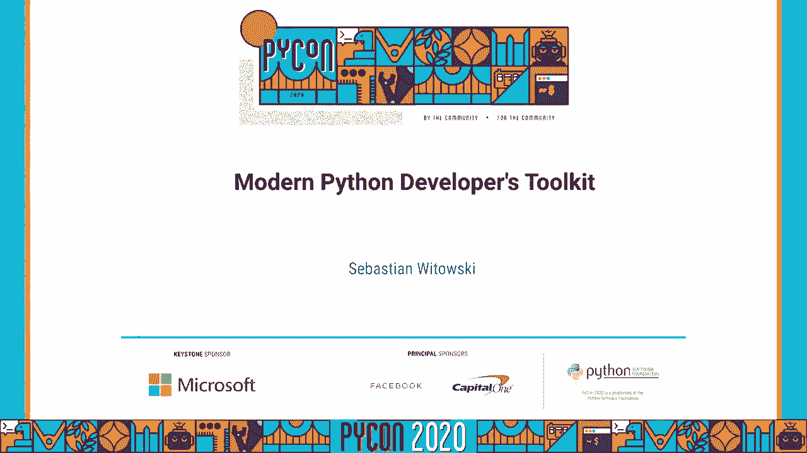

 Today， I'm going to teach you how to configure your Python development nicely， how to set。 up your code editor， how to manage different Python versions and Python dependencies。 And hopefully at the end of this tutorial， you will feel comfortable writing Python， projects。 So first of all， if you go to this URL， you can find the materials for this tutorial。

 During the workshop， I will be doing a lot of live calling， live sharing of some stuff。 but you can find on this website all the things that I will be talking about nicely。 describe with all the details。 So who am I？ My name is Sebastian and I write Python code for leaving。 I also teach others how to write Python。 And while talking with other people。

 I noticed that there is a huge gap between knowing how。 to write Python code and actually being able to write Python project。 Even though you know Python。 when you sit down to write your first Python website or Python， package。 you sometimes don't really know where to start。 Like how do you update Python version on your computer or how do you install dependencies。

 so that they don't mess up with other dependencies that you have installed before。 So that's why I decided to make this workshop。 If you already know how to write Python。 but you're not comfortable writing Python projects。 or you feel that the tools on your computer could be tweaked a bit more， this is what we。

 are going to talk about today。 So at the beginning。 I'm going to show you how to set up your code editor。 Then we are going to talk about how to manage different Python versions and Python dependencies。 Then we're going to have a short exercise。 Then we'll talk about the project structure and how to use a tool called cookie cutter。

 Next we're going to talk about the code style， how to use a different REPL and how to write。 tests and documentation， which tools you might want to use。 Finally。 we are going to do a mini project。 So we are going to take everything that I showed you before and we are going to build。 a small to do application。 At the end， I'm going to show you how to take your application and deploy it with Docker。

 To follow this tutorial， you should have Visual Studio Code Editor installed。 If you don't have it installed yet， don't worry， I'm going to show you how to get it。 You will also need to have Docker。 So if you go to this URL， you can get a Docker installation file。 I don't think Docker desktop will work if you're using Windows Home Edition， but if you。

 search for Docker Windows Home， you will find some tutorials how to install it。 And then finally。 you should have Python 3。6 or higher version。 Again， if you don't have it， don't worry。 I'm going to show you some tools that will， let you easily switch Python versions。 And of course。 you should know the basics of Python。 If you don't know what a context manager or decorator is。

 it's perfectly fine。 You just need to know the basics syntax。 And as for the operating system。 as you can see， I'm using a Mac OS。 So everything that I showed you will work on the latest version of Mac OS。 Also on Linux， since it's quite similar， you should be able to follow it。 As for Windows。 I try to install all the tools that I talk about。 And sometimes Windows works slightly different。

 So if you're checking this documentation， look for the small Windows icon to see some。 hints of what do you have to do different if you're using Windows。 Let's talk about code editors。 I'm going to show you how to install and set up VS Code。 Since code editors are essential tools of every programmer， some people are very sensitive。

 about it。 If you don't like VS Code and you're not really interested in learning how to set it up。 feel， free to skip this section。 But if you're a beginner and you don't really know where to start or which editor to choose。 VS Code is a very good choice。 I'm using it since over a year and I'm very happy with it。 I've decided to use VS Code in this tutorial mostly because of its popularity。

 So if you check the Stack Overflow Developer Survey， this is a survey that every year Stack。 Overflow does and it checks what kind of technology people are using。 So if you check the results from 2017， you'll see that Visual Studio Code was somehow popular。 but it was not the most popular tool。 If we switch to 2018。

 you can see that Visual Studio Code is on the first place but also。 the Visual Studio or Node++ have almost the same results。 But if you check the results from last year， you'll see basically almost every other programmer。 is using Visual Studio Code。 There are other code editors like VIM or EMACs that are faster than VS Code and offer you。

 a much higher level of configurability。 So if you spend enough time。 you can really make them look and do whatever you want。 But the thing here is you have to spend time to configure them。 While if you install VS Code。 it's pretty usable since the beginning。 So in my opinion。

 VS Code strikes a really nice balance between productivity and being， beginner-friendly。 You just install it and then if you open a Python file， it's gonna tell you like， "Hey， look。 there is this Python extension that you might want to use。"， So we installed that。 Then you may be open a Markdown file and it's gonna suggest you another extension。 As you go。

 you will be probably installing more and more tools but you'll be pretty productive。
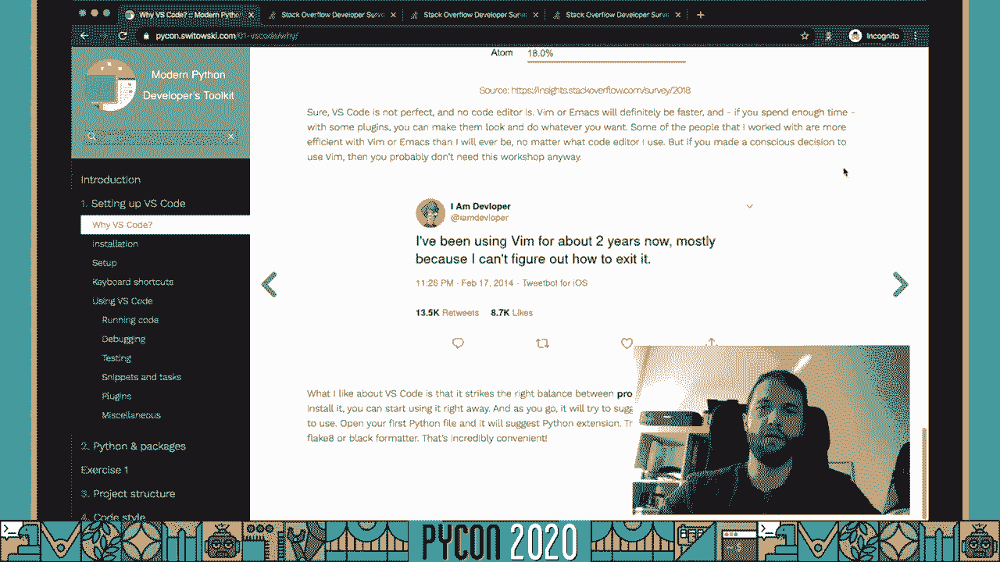

 since the beginning。 So if you haven't done it yet， let's install Visual Studio Code together。 I will be using a fresh installation of macOS Catalina so you can follow along。 So if you open a browser and search for VS Code， you can go here and you'll see a link。 to the "upload installation for your operating system。"， And since this is a clean installation。

 we're gonna see a lot of pop-ups。 Once it's done， open VS Code。 And that's pretty much it。 The first thing you want to do in VS Code is to install Python extension。 VS Code doesn't have extensions for programming languages by default。 So without a Python extension。 we won't even have syntax highlighting， not to mention any。

 other functions that a proper IDE would have。 So when you open VS Code。 you're gonna have this welcome page。 Here you can click "Python" and it's going to show you a small pop-up。 We say "okay"。 It's gonna install Python extension for you。 If you don't have this welcome window。 you can also go to the extensions and search。 Well， now it's gone。

 but you would normally go to the extensions tab and search for Python。 And here。 now it's already installed。 If it was not installed yet， you'll see a green button like that。 So now with the Python extension installed， we have access to a set of new tools。 We have Intel-ESense， so the code completion and syntax checking or code navigation。

 So if you want to go to a definition of a function， now we have it。 We also have access to linting and formatting tools。 So if you open a Python file。 VS Code will offer you to install， for example， a linter。 that will check your code if there are some errors。 We also have some debuggers that we can enable。

 for example， for Django or for Flask applications。 And we can also detect Python environments and automatically enable virtual environments。 that we'll talk about later。 So let's try to open a Python file。 I have an example "Hello World"。 And if you open a Python file， you're gonna probably have the suggestion that a linter。

 is not installed。 So while Visual Studio Code will suggest "pilint"。 I would suggest a slightly different one。 I'm gonna install Flake 8。 So once you click it。 you get another pop-up。 And since I'm using a brand new Mac installation。 it doesn't have pip install。 Normally when you install Python on your computer。

 it's gonna install pip as well。 But I haven't actually installed Python on this Mac installation yet。 So I just have the Python that came with MacBook and no other dependencies like pip。 If you are in the same situation as me and you don't have pip installed， later in this。 tutorial I'm going to show you a tool that you can use to easily install new Python versions。

 But in the meantime， I'm going to go and install Python version from the Python website。 just so I can add linter to Visual Studio Code。 Now that I have installed another version of Python。 I will have to tell visuals to， your code to actually use it。 So to do that。 we can either click Python version here and we'll see a list of different， Python versions。

 So the one that I'm currently using is a terribly outdated Python that comes with Mac。 And I want to use the Python 3。7 or they have just installed。 So I just click that and you can see that the version has changed here。 And again。 we get this pop-up。 That linter is not installed。 In case you don't get this pop-up and you don't know how to install a linter。

 you could close， this file and reopen it。 But a much better way is to open the command palette and select。 set for a command called， linter。 Here we can click Python select linter。 Here we choose flake 8 and then we get the pop-up。 So visual studio code is going to install flake 8 package on your computer。

 This is not the perfect solution because it's not separating it from other dependencies。 on your computer。 So later on， I'm going to show you a better way how to do this。 But now just for the illustration purpose， let's go with that。 In case you're wondering what's this linter tool that we have just installed， it's a tool。

 that will help you find some bugs in your code。 For example。 if you have imported a module or a function and you're not using， linter， is going to complain。 If you try to use a variable that is undefined or if you put a breakpoint statement outside。 of a loop， linter is going to complain。 So for example。

 if in our simple hello world we forget the closing quotation mark， we're， going to have an error。 You can hover and see that this is a syntax error。 However。 since Python is not a statically typed language， linter is not going to detect。 all the problems of your code。 If you try， for example， to add a string to an int。

 linter is not going to detect it， but if you run your program， it's going to fail。 One final step that I suggest you to do is to add code command to your terminal。 So that way。 if you are in a terminal and you type code in the name of a file or a folder。 you will automatically open it in the VS code。 So to do that， you need to open the command palette。

 search for shell command， install， code command in path and just run it。 It's going to ask you for a password and we have information that it will successful。 We use the shortcut to open the command palette and VS code has a few more shortcuts that you。 will be using quite often。 So let's take a look at some of them。

 So you already know the command palette and this basically gives you a list of all the。 commands that are available in VS code。 Next we have go to file so we can quickly open any file in the project that we are currently。 working on。 So if I type blueprint， I can go to blueprints。 Next we have go to symbol。 So symbols are all the functions， methods， variables， modules in a current file。 If we press colon。

 VS code is going to group them together。 So we're going to have classes at the top。 then we're going to have methods and at the， end we're going to have variables if we get there。 Yeah。 Another useful shortcut is control space。 So if you're typing some code。 you will get this auto completion。 But if for some reason it disappears and you want to get it back。

 one way is to actually， delete the code and hope it's going to appear again。 But much better way is to use a shortcut to trigger auto completion。 So by default it should be control space but it seems that it's not working。 So if we open the keyboard shortcuts and we search for suggest， we can see that apart。

 from the control space， there is also option escape that can trigger this。 So let's try with this one。 So we have our self and then， yep， it's working。 If you want to go to a definition of a function， you can press F12 and this is going to open。 a new file with the definition。 If you don't have F12 on your keyboard。

 you can also press command and then just click， the function name。 If you don't want to open a new file， you can press option and then F12 and this is going。 to open a small window with the definition of a function in the current file。 And finally。 if you are in the definition and you want to see all the places where this， function is used。

 you can just press shift and F12 and this is going to show you a list。 of all the places where this function is currently being used。 If you want to learn more about the shortcuts that VS Code has to offer， you can go to the。
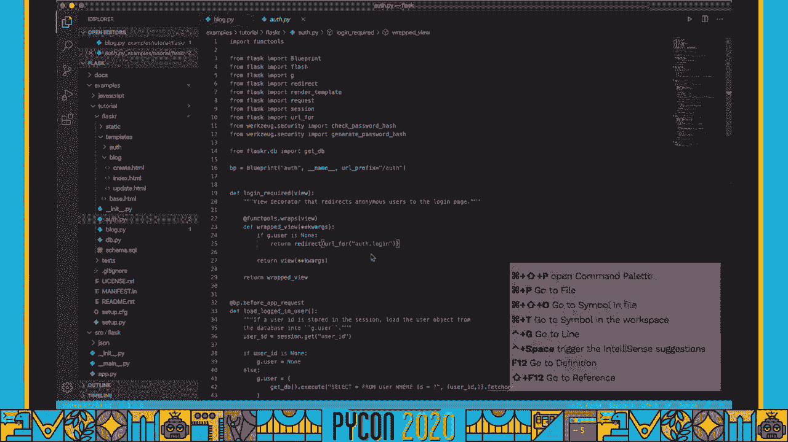

 keyboard shortcuts section of the documentation and then there is a list of printable shortcuts。 that you can download。 And of course， VS Code has even more shortcuts that are shown on this list。 So if you open VS Code and you go to keyboard shortcuts， you will see that almost every action。 in VS Code has a keyboard shortcut that you can assign to it。 Finally。

 if you are migrating to VS Code from a different code editor， then you have some。 plugins that will change the keyboard bindings to those from your previous code editor。 So that way。 you don't have to retrain your muscle memory from the first day and you can。 slowly get used to the new keyboard bindings。

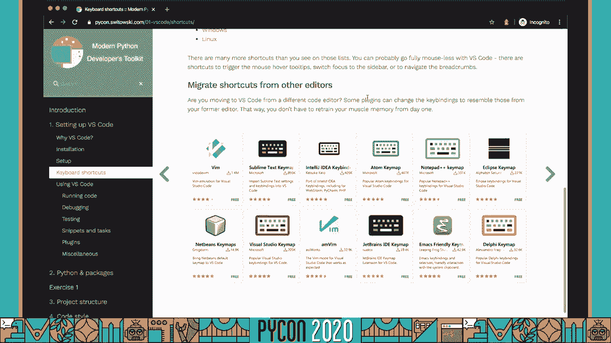

 Let's talk about using VS Code。 VS Code is pretty easy to use。 You press letter A to type A。 You press letter S to type S。 You press letter D。 I'm just， kidding。 If you have a file and it's a standalone file like a script or a module so it doesn't require。 a web server like a flask or Django application， you can run it directly in the terminal that。

 comes with VS Code。 All you have to do is to search for run Python file in terminal and run this command。 As you can see， we have the output here。 Also， you can just press the green arrow and it's also going to run the whole file in。 the terminal。 If you want to run just a part of your code in the terminal。 you can select it and search， for command run selection in Python terminal。

 This will open a Python REPL and run just one line of your code。 You can also just select the code and press shift entered for the same effect。 Things get a bit more complicated if you want to run a web application。 Of course。 you can always run it from a terminal but maybe you don't like to switch between。

 VS Code and the terminal。 So let's say you have a very simple flask web application in a file called uppy。 Just make sure you have flask installed using pip and then switch to the building terminal。 Remember you can trigger it with the command tilde and run Python or actually Python 3， in my case。 minus M flask run。 This will start a development server for your flask application。 Okay。

 so that was a pretty terrible tip。 You could do the same thing from the terminal。 And since VS Code has plenty of buttons， surely one of them can be used to start a server for， us。 If you open a debug panel， it's this one with the bug and the play button， you can click。 the create a launch JSON file。 Next， you have to select flask from this list since this is a flask application。

 We press enter and we get a launch JSON。 Let's stop the server and let's actually use this launch file to run our flask application。 As you can see now in the run panel， we have this small green arrow for a Python flask， application。 If we press it， VS Code does a lot of stuff and it complains that it can't find up file。 To fix that problem， I had to take my app and move it to the same folder where the launch。

 dot JSON is。 So if we go to the run panel right now and we try to run flask again， we can see that。 this time it's starting the development server correctly。 One nice thing about starting your flask server from VS Code like that is that it actually。 starts it in a debugger mode。 So what does it mean？ Well， let's say we have some more code。

 If you hover over the numbers on the left side of your editor， you will see a red dot。 You can click it and you will put a breakpoint on that line。 If you start a server right now and you open the website in the browser， then if the code。 execution gets to that breakpoint， your interface will display a lot of new information。

 This little border indicates where the code execution has stopped。 So you can see we have stopped at this breakpoint。 Here we have only one。 but if we would put more than the code execution would stop at， each of them。 On the left side。 you can see a list of current variables。 We only have local variables。

 but if we had some global ones， they will also be displayed， here。 Underneath you had a watch section。 You can add some expressions here and VS code will print their values。 It's useful if you know in which variable you have a bug and you want to see how this。 variable is changing over time。 And underneath you have a call stack and a list of active breakpoints。

 At the top of the main window， you can see the toolbar for the debugging。 It has the typical buttons for the debugger， so you can continue the execution。 You can step over the next function。 You can step inside or outside of a function。 You can restart the whole debugging session and you can stop the debugger。 Finally。

 at the bottom you have a debug console。 You can use it to execute any Python code。 Let's stop the debugger。 VS code has a nice interface for running your tests。 By default。 it's not visible， although the Python extension might sometimes ask you if。 you want to configure it。 If it doesn't， this is how you enable it。

 Open the command palette and run Python configure test。 It's going to ask you which test framework you want to choose and I'm going to choose。 by test and then select where do you keep your tests。 In my case， this is the root directory。 As you can see， PyTest was not installed yet， so VS code is going to install it。 At the same time。

 it's asking me if I want to install it。 No， because it's already there。 Now you can see we have this magic potion icon。 If we click it。 we're going to get the sidebar for the tests。 At the beginning， there is not much here。 Let's see what kind of buttons we have。 We have one to rerun all tests， debug tests， discover tests。

 show test output， and then， collapse all。 We are interested in this discover test。 So if you click it， VS code is going to go through all the files and try to find tests。 In case of PyTest， it will look inside every file starting with test and then it's going。 to search for every function that starts with tests and it's going to assume those are the， tests。

 Now， as you can see， we have three tests here and we have question marks because VS code。 hasn't run those tests yet。 If we try to run them， it's going to take some time and as you can see。 two of them are， passing and one is failing。 You can hover over the name of the test and you will see that there is a problem with our。 subtraction。 So what we can do is we can put a breakpoint here and then we can debug this test。

 In this case， it's not really helping us that much because we don't have variables or anything。 that we could investigate。 But at least we know where the problem is。 So we stop the debugging and if we fix our test， we can rerun it and yeah， we have all。 the tests passing。 If you want to run a single test。

 you can do this from the sidebar or you can press， the run test above the test function。 Let's talk about snippets。 Once you have the Python extension installed。 if you start typing in a Python file， you will， see two tips with some suggestions。 It's just a way that the autocompletion tells you like， "Hey， I see that you're trying to。

 type a function。 I can put a skeleton of this function to make it faster。"。 If by accident you dismiss this tool tip， you can get it back by pressing the control。 space or in my case， option escape and you get it back。 Every snippet has some places in the code that you can switch between using the tau key。

 Once you go through all the positions， you just end up at the end of the code。 So let's say we want to write a function and I don't know why I get the class。 Ah， here we go。 And that's it。 You can write your own snippets。 So if you feel that there is some piece of code that you keep typing over and over and。 you want to save yourself a few keystrokes， you can go to the command palette。

 And select configure user snippets。 Here you will see all the snippets for a given programming language。 So if we set for Python， you will see a file where you can define snippets that will be。 used in Python files。 Right now there are no snippets。 There is only an example how to create a snippet。 For some reason in every file。

 the example is the same and it's for JavaScript。 But let me show you how to quickly create a snippet。 Let's say we want to create a snippet that will put a breakpoint in our code and we are。 not using the latest version of Python。 So we can't really just write breakpoint。 So what we want to have is a snippet that will be triggered with， let's say， debug statement。

 and it will turn it into an import PDB and PDB set trace。 So how can you get this？ Well。 first let's get rid of this。 Let's uncomment the example。 First we define the name of the snippet。 This name will be displayed in this autocomplete suggestion。 So let's name our snippet debugger snippet。 Oh， maybe breakpoint。 Yep， can't type。

 Next we need to define the prefix that will trigger our snippet。 We want our snippet to be triggered when we type debugger。 So we can type debugger but maybe we don't always remember that it's a debugger。 Sometimes we just type in PDB and we also want the snippet to be triggered on this。

 So prefix can accept a list of different values。 So let's add PDB。 Next there is body of the snippet。 The stroller sign and the number defines where the cursor will jump if you press tab。 In our case， we don't really have a place where we want to put a cursor。 So let's just put our PDB statements here。 Put PDB， PDB set， trace。

 And finally we have a description。 This is optional but this will be displayed also in the autocompletion。 So let's put something here。 Put a PDB breakpoint。 Okay， let's save it and let's test our snippet。 So if I type debug， you can see in the first place we have our debugger snippet。
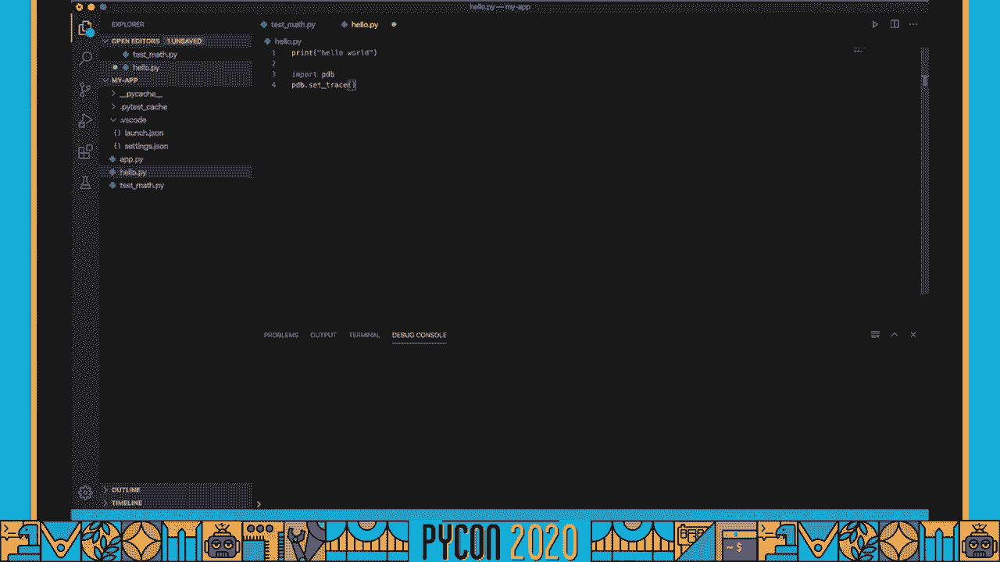

 The snippet that we just use is very basic but you can write pretty advanced snippets。 You can。 for example， use special variables。 You can find a whole list here like name of the file。 line number， but also current date。 You can do some regex transformations or you can even assign key bindings to a snippet。 Final feature that I want to show you are the tasks。

 If you have some common files with tasks for different programming languages like make， files。 ground， gulp， aunt， jc rake or ms build files in your project， VS code can detect。

 comments from those files。 So for example here I have packaged JSON with some scripts and if I select run task。 I can， say show all tasks and here you can see I have the list of my tasks。 Also in the sidebar I can also find them here。 You can press this arrow to run this task。 Well this advice doesn't really apply to Python because there are no task files for Python。

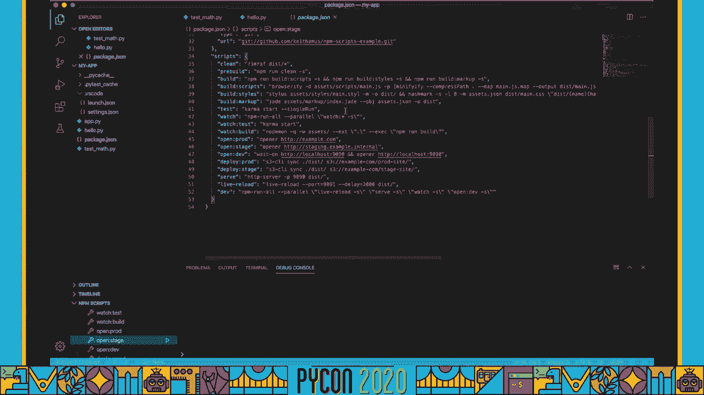

 If you want to define some tasks， for example you can run tasks with some predefined settings。 You can create a tasks。json file and define your Python tasks inside of it。 You can find more information in this documentation。 We are almost done with this short introduction to VS code but I would also like to show you。

 some of the plugins that I am using。 Some of them are pretty obvious。 some of them are not so maybe you will find them useful。 First plugin is for Python programming language。 This is probably the only plugin that you will have to install if you want to write Python。 code。 If you are programming in another programming language you will also find extensions for them。

 for C++， for Rust， for Go。 If you are working with Django or Flask or any other framework you probably want to install。 a plugin for that framework。 For example if you install plugin for Django it is going to add a bunch of snippets that。 will make your life easier。 And not only that but it will also provide syntax highlighting for framework specific。 files。 For example if you have template files in Django。combine， HTML and Django text then it。

 will give you a proper syntax highlighting for those。 Next we have Intelli code。 So if you install Python plugin you will get the code completion。 But if you install Intelli code you will get a slightly smarter auto completion。 So as you can see Intelli code tries to predict what function you actually need and it will。

 put this function on the top of the list with a star。 So here is an example from the documentation where someone is using TensorFlow and the Intelli。 code is pretty successfully predicting what will be the next function that is needed in。 this situation。 Next there is Emmet and it is technically not an extension because it is already integrated。

 with VS code。 But if you are writing a lot of HTML and CSS I strongly recommend you take a look at how。 Emmet works。 If you learn the basics of Emmet you can very quickly write a lot of HTML code with a simple。 shortcuts。 Next there is AutoDoc string。 It is not very popular plugin but I like it because it makes writing documentation for my。 functions much faster。 So if you write a function and then below you put three double quotes and you press enter。

 it will automatically generate a skeleton of the documentation。 And if you annotate the arguments in the function it will also detect the types correctly and。 move them to the body of the documentation。 Next extension that I like a lot is the bookmarks。 It lets you bookmark a location in your code so you can easily switch between the existing。

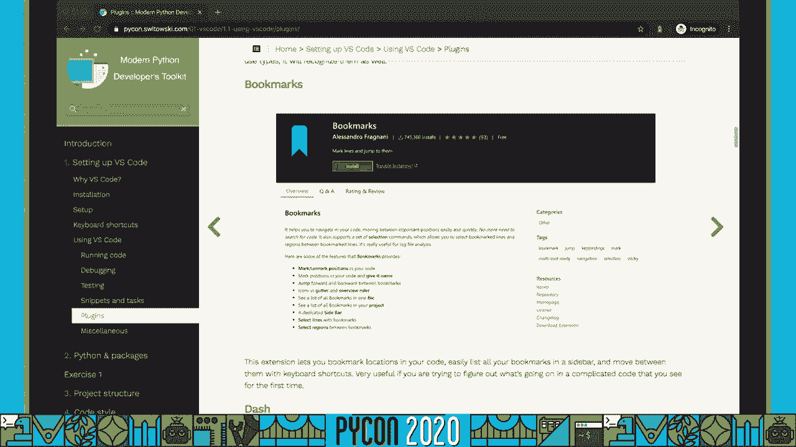

 bookmarks。 I find it very useful when I'm working with either a new project so I'm trying to figure。 out what's going on or large files where I need to jump between different places in。 the same file to see definitions of different functions。 So for example if I put a bookmark here and I go somewhere else in the code I can use a。

 keyboard shortcut to automatically go back to this bookmark。 And it also supports bookmarks in a different file。 So if I put bookmark in here and maybe also here I can use a command bookmark list from。 all files and I can see the list of my bookmarks here。

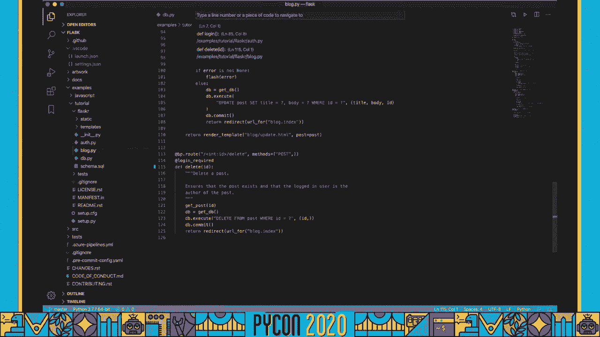

 Next extension is dash。 I don't use it that often but it's very useful if you're working somewhere where you don't。 have access to the internet。 Dash extension is a wrapper around a tool that lets you save documentation offline。 So you can for example save documentation for Python or Django and if you're working somewhere。 where you don't have access to the internet you can use it instead。 Next extension is error lens。

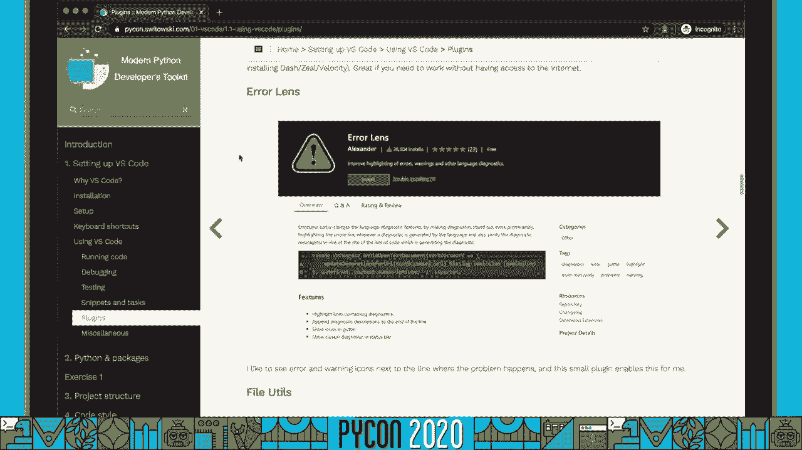

 If you have some errors in the Python code you will see a curly line but with error lens。
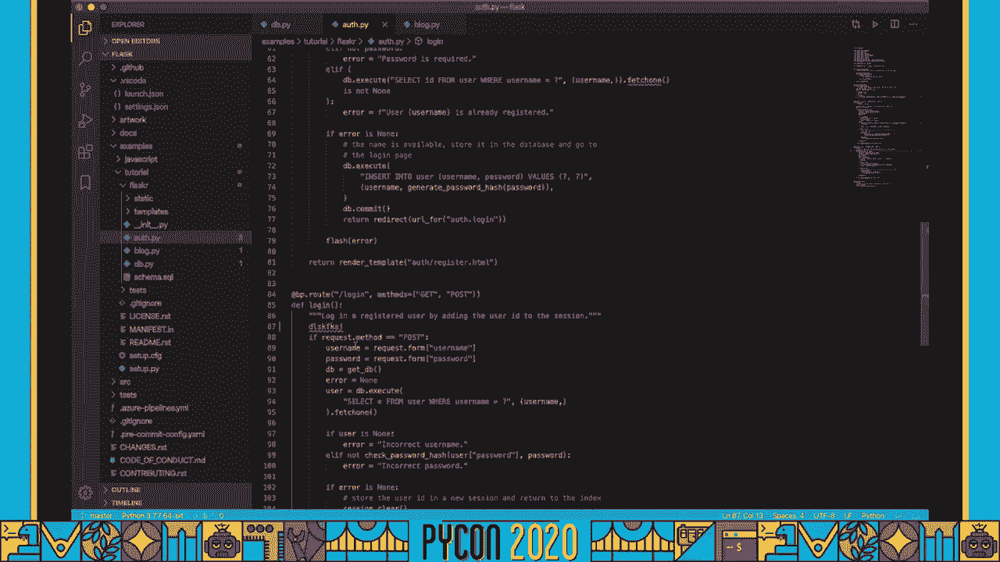

 you will also see small icon in the gutter that indicates that there is an error on this。
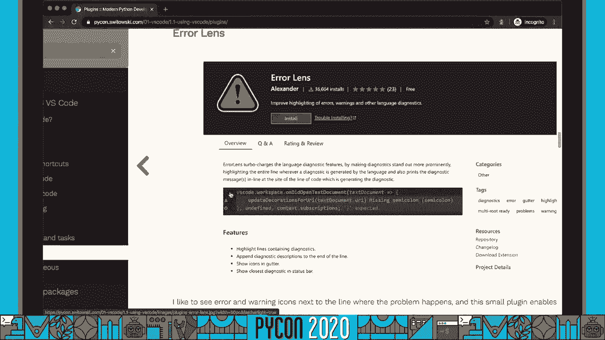

 line。 So I really like it because I can quickly see where are some errors by just scanning the。 gutters。 And you can also configure it。 By default it's going to display you an error message next to the place in the code where。 the error happened but as I said I like to change it and display an icon in the gutter。
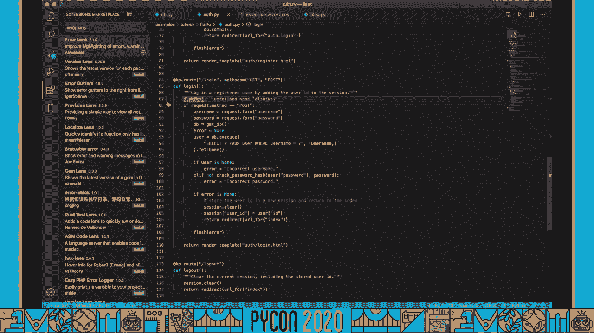

 Next extension is file utils。 It adds a few new commands related to the files like rename。 move or duplicate。
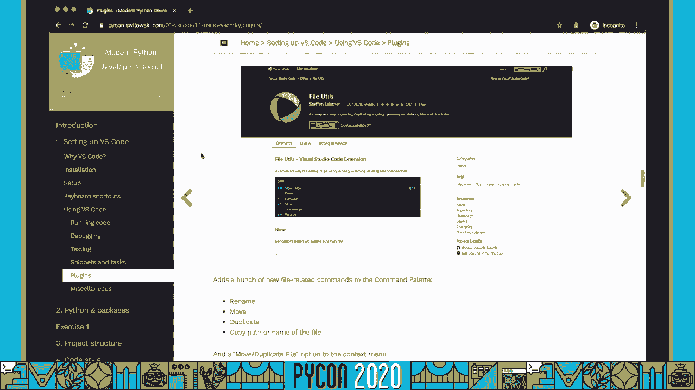

 So if you try to let's say duplicate a file or move it you don't see an option here but。
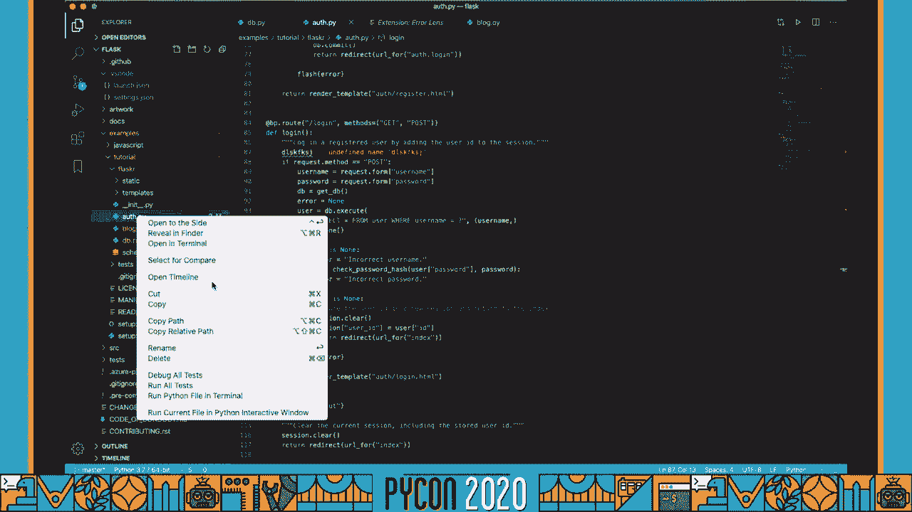

 if you install file utils you will see those options popping up in the sidebar。
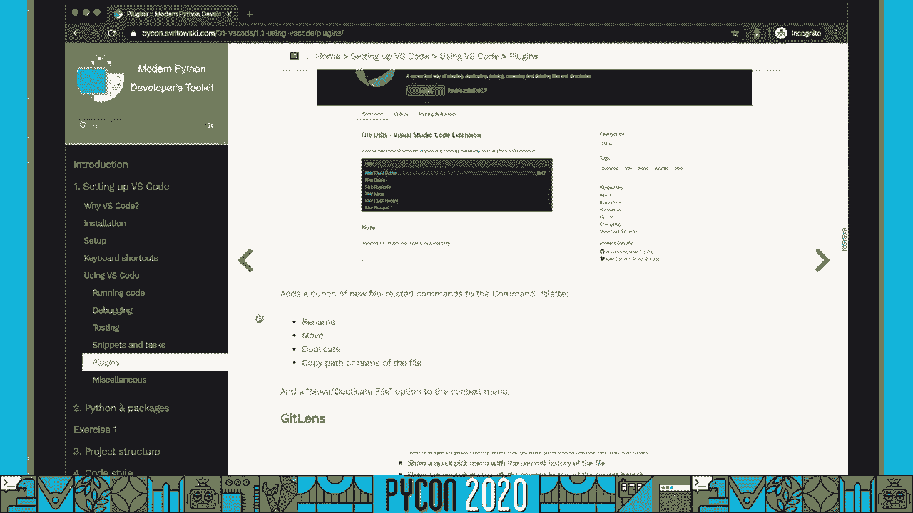

 Next extension is get lens。 Get lens is a massive extension with a lot of additional functionality related to git。 So once you install it you can see line level annotations of who changed that line。 You can see file level annotations。 You can also see the git status in the status bar and you can toggle the git blame view。 You also get a new sidebar with a lot of information related to git。

 So for example if your branch is behind or ahead of a given remote you can see branches。 contributors， incoming activity， stashes， tags and there is a lot of features here。
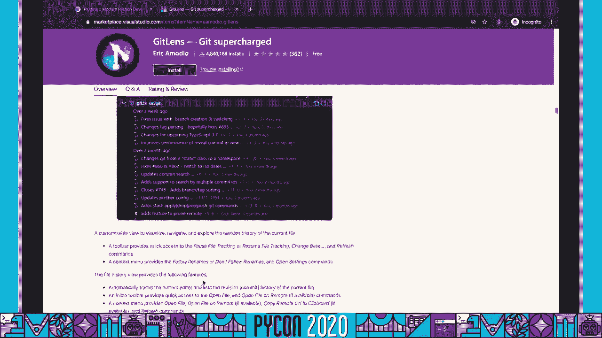

 I don't think I'm even using like 10 or 20 percent of it。 Next there is jumpy or metago。 Those are two very similar extensions。
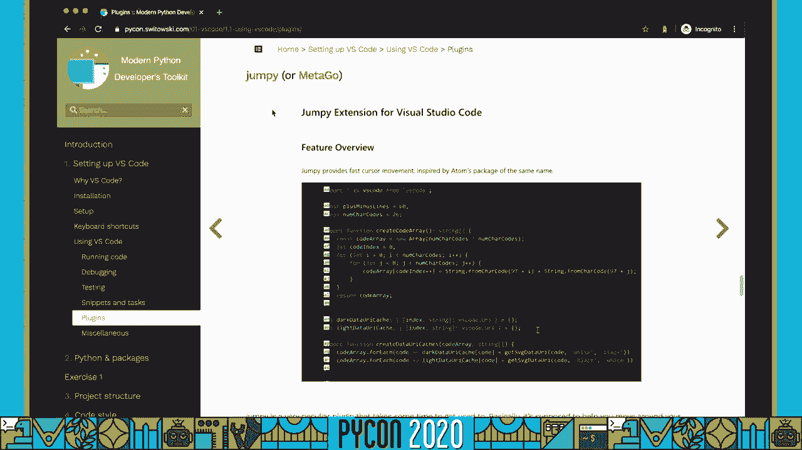

 And what they do is that they help you quickly move around the code。 So let's see an example。 If I'm here in my code and I want to get let's say here I can either use my mouse or use。 the arrow key a couple of times but if you don't like using mouse this is not very convenient。 So what jumpy does is that it defines a keyboard shortcut that I can press and then it will。

 assign a two-letter shortcut to get to any place in my current screen。 So if I want to get to my password I need to press letter I and O and I get there。 If I want to move somewhere else I can press JF and I get here。 So once you get used to jumpy it's really fast way to move around your code。

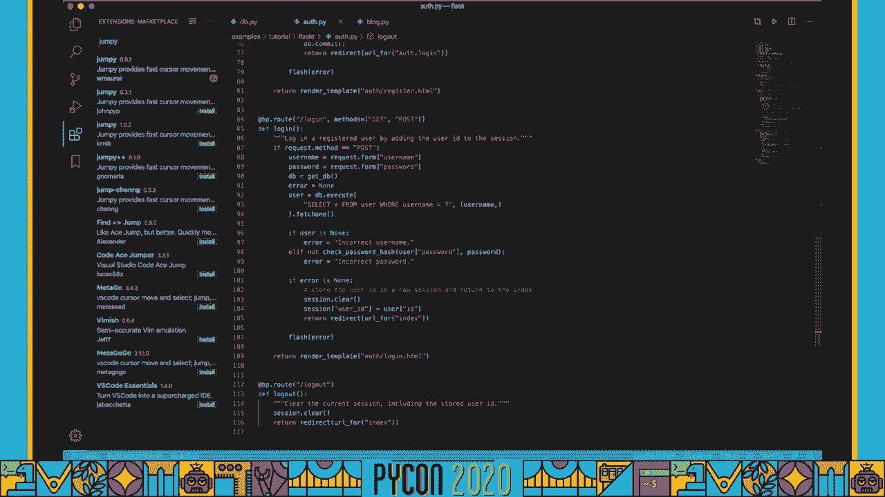

 Next is paste an indent。 So if you find that VS code is not doing a very good job when you paste some code you。
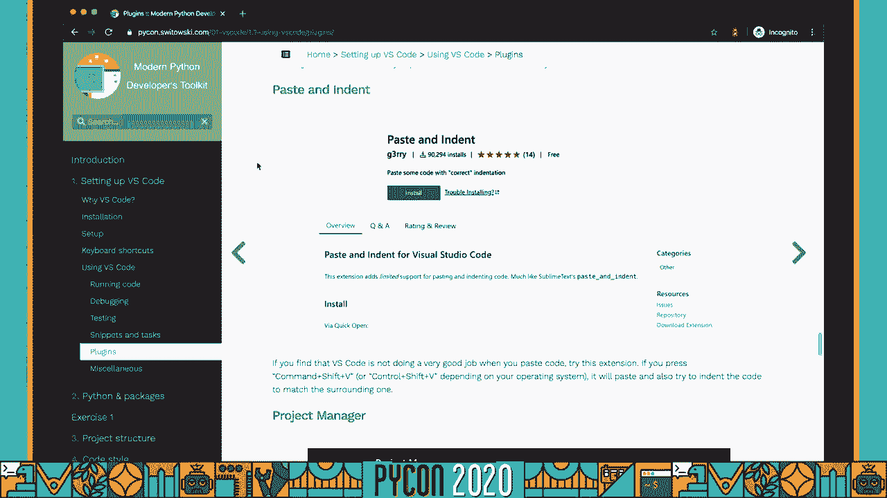

 can try this extension。 It's very useful for Python。 Let's see an example。 Let's say I want to take this piece of code and paste it here。 So as you can see by default it's not doing very good job。 And if I actually copy it like that then it's even worse。 So I have to go here and indent this。

 go here and then that。 So if you don't like to indent lines by hand you can use this extension。 What it does it's going to give you a command called paste an indent action。 So you have to open your keyboard shortcuts， go to user shortcuts and then you have to assign。 this action to some keyboard shortcut。 I'm using command shift P and even though VS code is complaining that it can't recognize。

 this command it's because paste an indent is a very old extension and it hasn't been updated。 since like three years。 So even though we get this warning don't worry it's going to work。 If we go back here let's delete that。 So let's try again。 We copy this， we go here and we paste it。 So as you can see it's better it's still not perfect because we have to indent this line。

 But at least we get this nice behavior that the pasted text gets selected。 So by default you're not going to get it， you have to go to the preference settings。 You have to go to user settings and you need to add this line。 So just make sure that after pasting the code this extension will also select it so we can。

 press tab to indent it or shift tab to unindent it。
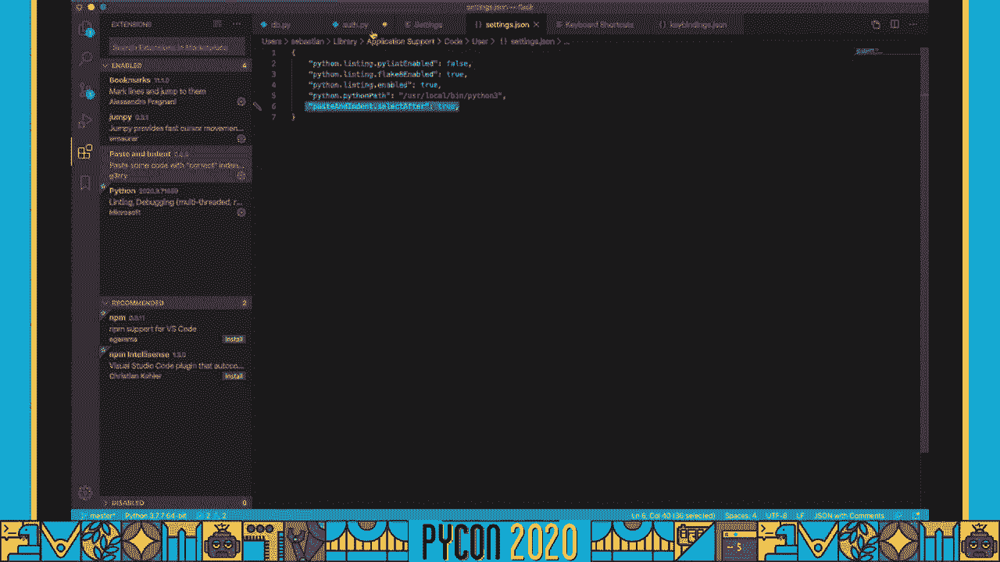

 So it's a really nice and useful extension。 If you're working on more than one project on your computer then you probably already。 know the concept of workspaces in VS code。 It's a way of grouping together some files or folders so you can easily switch between。

 them。 But with workspaces you have to store their configuration somewhere and sometimes you。 don't really know in which folder you saved your workspace configuration。 So what I like about the project manager extension is that it takes this hassle away。 Basically it just creates a one file that stores the paths to your different folders。

 and then it gives you a nice sidebar that you can use to switch between the projects。 Quick and simple text selection is a small utility that lets you assign keyboard shortcuts。 for different type of selections。 So if you want to select all the text inside a single quote。 double quote， parenthesis， angle brackets， curly brackets， you can do this with a shortcut。

 I really like it because VS code doesn't support these different selections out of the box。 Settings thing is an extension that you really want to have。 It lets you synchronize settings of your VS code between different computers。 So how it works is that you connect it to a private GitHub guest and then you export your， settings。

 Then if you lose your computer or you switch to another computer you can just download。 the settings back。 I think in one of the upcoming version of VS code the settings synchronization will become。 built in。 To do highlight is another small tool that highlights that to do or fix me comments in。 my code so I can easily spot them。 And finally there is spell right。

 It's strange but VS code doesn't have a built in spell checkers so if you want to check。 the spelling of your code or more important if you want to check the spelling of your。 comments this is the extension that you want to have。 The final part of the VS code section is a bug of miscellaneous tips and tricks that。

 I picked up along the way。 So you can take a look and maybe you'll find something useful there as well。 If you're using Docker there is a Docker extension that you will probably really like。 It lets you start and stop containers， connect to a running container with a shell or attach。 VS code to a running container。 It's very useful。 If you're working with some colleagues and you want to share your screen or even better。

 let them modify the code in your VS code。 Check out the live sharing extension and then there are some tips and tricks。
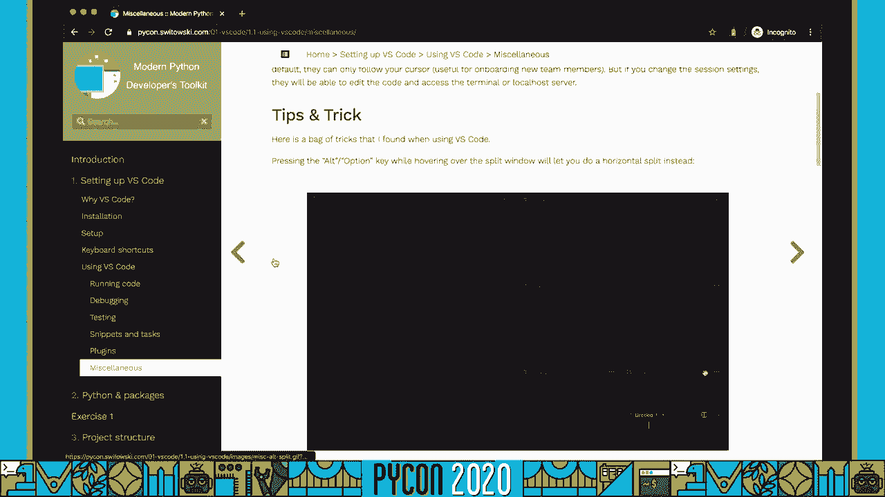

 You can use the out key to change the way how you split the windows。 If you have the outline sidebar you can select the follow cursor so you always see functions。 corresponding to what you see in the main screen。 And for troubleshooting if you need to restart VS code you don't actually have to close it。 and then go to applications and open it again。 There is a command to reload the window that basically restarts the VS code for you。

 If you find that show symbols or go to definition stops working then you can try to change the。 auto completion engine。 By default VS code is using IntelliSense but if you install Python extension you will also。 get jedi which is another engine and sometimes switching engines will fix the show symbols。 or go to definition for me。 And finally if you're working with Django or Flask and you want to put a break point in。

 your templates VS code can get confused if the HTML file that you're editing is really。 a Django template or not and maybe you won't be able to put a breakpoint there。 If you find this problem annoying you can change the setting for breakpoints and allow。 breakpoints everywhere so that way you can put breakpoints in any file。

 Now that we have VS code configure let's talk about how to manage Python and Python packages。 on your computer。 In this part we are going to see how to install different versions of Python and how to easily。 switch between them but also how to isolate dependencies for your project and why do you。 care about isolating them。 Sooner or later you'll need to install a different version of Python on your computer。

 Probably sooner than later。 For example if you're using a MacBook then you'll have Python to install by default and。 you might be thinking well that's an outdated version so why don't I just update to Python， 3。 And this is a terrible idea because you have some software on your computer that relies。 on this old version of Python so if you change it you'll probably break some stuff on your。

 computer。 And even if by chance you have Python 3 installed globally on your computer it's probably not。 the latest version and you shouldn't rely on a system wide Python。 This gets even more complicated if you're working on multiple Python projects and you。 want to have different Python 3 versions installed at the same time。

 For example if you're writing a Python library then you probably need to test it in at least。 a few recent versions of Python so let's say Python 3。6， 7， 8 and maybe 3。9 and you need。 to have an easy way to switch between those versions。 You can install each of them with separate prefix but that's a bit cumbersome and there's。

 actually much easier way to handle this problem。 In this part of the tutorial I'm going to show you how to use Pyenv to install multiple。 versions of Python and how you can easily switch between them。 The easiest way to install Pyenv is to use Pyenv installer script。 It will install not only Pyenv but a few additional plugins like Pyenv doctor to verify。

 that the installation is fine。 Pyenv virtual environment which is really nice because it's a plugin to manage virtual。 environments that we'll be talking about next and a few more。 So if we go to Pyenv installer you can see that the recommended version is to run this。 core command。 If you don't trust running scripts from the internet which in general you shouldn't trust。

 them， you can also use homebrew or simply clone the repository as explained in the installation。 section。 But I'm going to choose the easy way。 I open the terminal， paste it here， run it。 At the end of the installation you will see some instructions on how to add some code。 to your bash RC file or if you're using Z shell or fish it's going to be slightly different。

 But it's important to pay attention to this message。 So let's copy those lines and add it to our bash RC file。 And finally we have to restart the terminal。 To check that everything worked fine I'm just going to run pyenv command。 And it doesn't work because I'm using Z shell not bash so let's modify the Z shell RC file。

 And one more try。 Great， if you see a list of commands here it means that the pyenv was successfully installed。 Once you have installed pyenv make sure to check the dependencies section on github。 For my coas it mentions a few packages that are optional but recommended。 So if you notice that you have some problems using pyenv make sure to install them。

 You also have a list of dependencies for other operating systems。 And if you want to use pyenv on windows check out the pyenv win package。 It doesn't have all the features of pyenv but it has the essential ones so you will be。 able to install different versions of pyenv and switch between them without a hassle。

 So if you are on my coas Mojave then there is this github issue that explains that you。 have to add additional SDK headers。 If you run version of both Mojave like Catalina then you don't need this step。 Let's try to install a new version of Python using pyenv。 To see the list of available versions we need to run pyenv install -list。

 Here we can see all the versions that pyenv can install for us。 At the top you have the standard Python versions， then you have anaconda， mini-konda， you even。 have pipy and some other stuff like stackless。 So let's try to install the most up-to-date version of Python so 3。8。2。 When we talked about the dependencies I showed you that for my coas some dependencies are。

 optional and here since we didn't have open SSL pyenv is installing it for us。 Done。 That took around 10 minutes so I'm really happy that I didn't try to do live coding and I。 can just fast forward it。 So now if we do pyenv versions we can see that we have the system version of Python and。 the 3。8。2 that we just installed。 Let's add another version。 If you don't have open SSL。

 readline or Z-lib dependencies pyenv will download them for each。 new version of Python that you try to install。 So normally I would install those dependencies using homebrew。 If we check installed version you can see we have two different Python versions installed。 If I try to run any Python command you can see that I'm still using the built-in Python， version。

 So if we want to switch which version of Python we are using we need to use pyenv global， command。 If you just run pyenv global it's gonna tell you which Python you are using。 If you run pyenv global with a version number you will switch your Python to this version。 So now if I try to run Python command you can see that it has not changed。

 So if this happens to you you need to run pyenv rehash。 I forgot to mention this but you need to run pyenv rehash after you install a new Python。 version so pyenv will set up everything for you。 So let's try to run Python command again。 And voila now we are using the latest version of Python。

 If I want to switch to a different version all I have to do is run pyenv global and the。 different version。 And that's it every Python version is nicely isolated from each other and you don't have。 to worry that you will mess up something if you try to install another one。 So now we know how we can change the global Python version on our computer but another。

 cool feature of pyenv is that you can set a Python version for a specific directory and。 all its subdirectories。 It's a useful feature if you're working on a project that requires a different Python。 version。 For example you have some legacy code that is still using Python 2 and you only want to。 use Python 2 if you are in the specific directory。

 So instead of switching the global version back and forth all you have to do is to run。 pyenv local and this will create a Python version file。 Pyenv will always look for this file in the current directory and if it can find it then。 it's going to use it to determine which version of Python you want to use。

 So let's see this in action。 As you can see I'm using Python 3。8 globally and let's say I have a project that requires， an older version of Python。 So if I want to use Python 3。7 only in this folder all I have to do is to run pyenv local。 and a Python version。 This will create Python version file and inside of it you can see which version of Python。

 we want to use。 So if we run Python version command you can see that we are using Python 3。7 and if we， go outside of this directory you can see that globally we are still using Python 3。8。 So this is a really nice feature of pyenv especially if you're working on different projects。
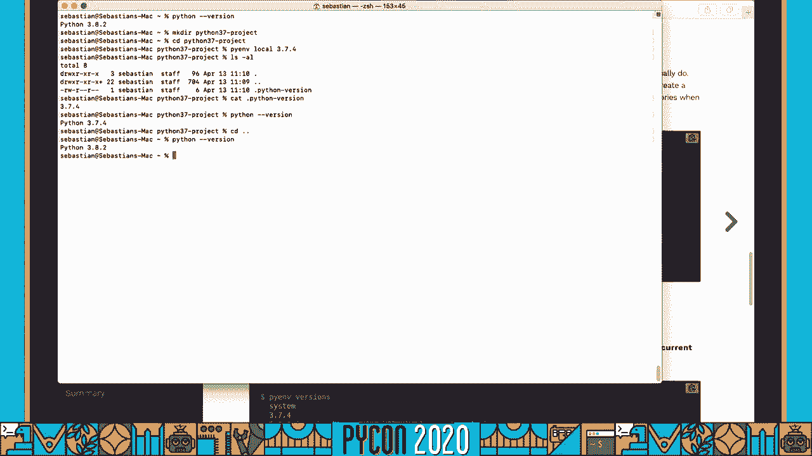

 that require different Python versions。 And the final feature of pyenv that I want to show you is how you can change Python version。 for only a specific terminal session。 So for example if you want to test something in let's say Python 2 you don't have to change。

 the local or global Python version。 All you have to do is to run pyenv shell command and provide it with the version number。
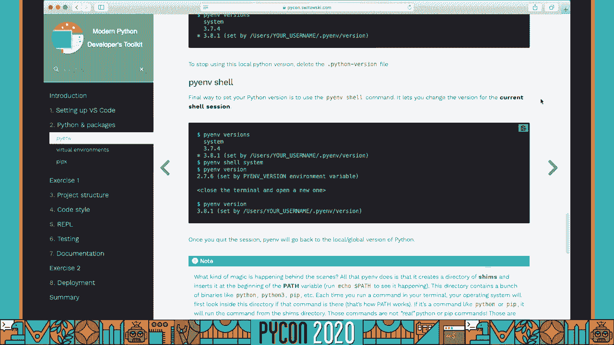

 So let's say I'm globally using Python 3。8 but for some reason I want to test something。 in Python 2。 On my computer I still have Python to install as a system Python so I can use that。 This command starts another shell session in our terminal so if I run Python version。 you can see that I'm using Python 2。 And we even have the warning Python 2。7 is not recommended。

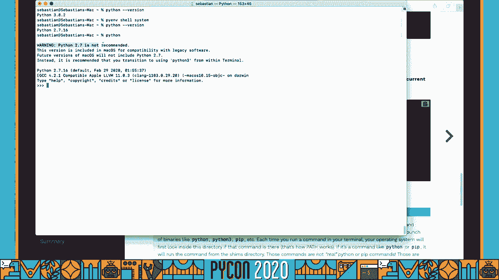

 If you're wondering how does Python works and how does it install different Python versions。 without messing up anything on your computer all it does is it creates a directory of shims。 and puts some binary files like Python， peep， Python 3。0 and then it inserts this directory。 at the beginning of your path variable。 So each time you run command like Python or peep your computer instead of using the system。

 wide commands will pick up the binaries from this shim directory。 And those binaries are not even real Python commands those are just pine scripts that。 will determine what's the current version of Python that you want to use and call binaries。 from this version of Python。

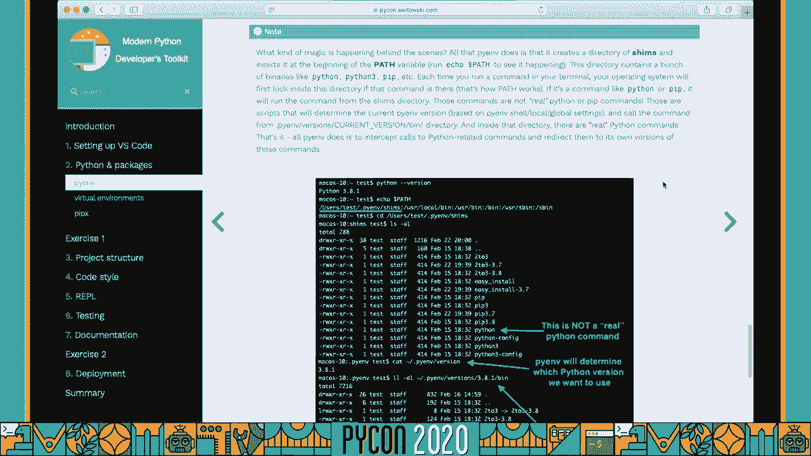

 And this whole idea of creating a shim directory and adding it at the beginning of the path。 variable is not new。 If you're using other programming languages then you probably already know ErbN。 NodeN， or GoN that do exactly the same thing but for different programming languages。 If you're programming in multiple languages check out the ASDFVM。

 This is a one tool to manage different versions of different programming languages。
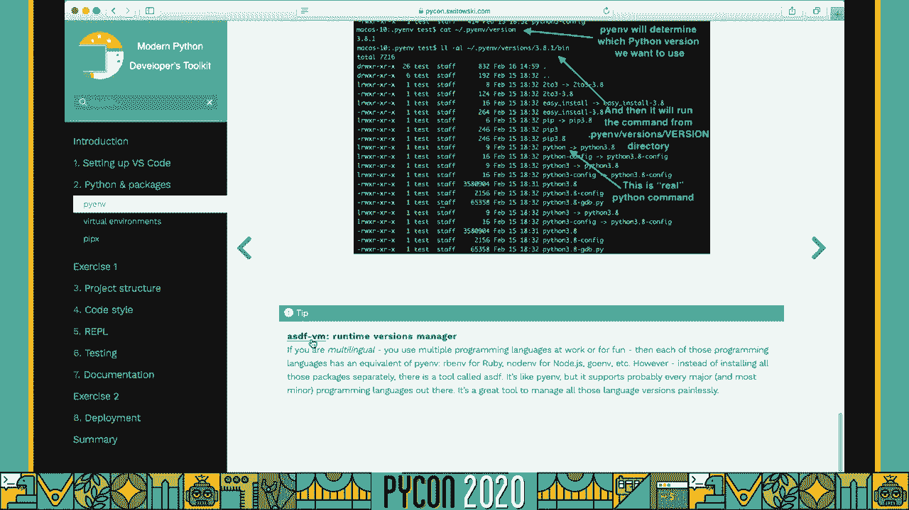

 So if you use it you don't have to install separately pi nth， node nth， ErbNth。 With pi nth we solved one problem how we can easily switch between different versions of， Python。 But even if you're using the same version of Python all the time you'll have another problem。 managing Python dependencies。 So Python has one big problem you cannot have multiple versions of the same package installed。

 at the same time on your computer。 Since every package goes to the same directory you can't have Django 2 and let's say Django。 3 installed at the same time。 Each time you run peep installed Django people check if Django is already installed on your。 computer。 If not it's going to install the latest version。 You can also specify which version you want to have。

 So for example if you want to have Django version 2 you will do peep install Django。 equal equal 2 and then peep will first check if you have this version of Django on your， computer。
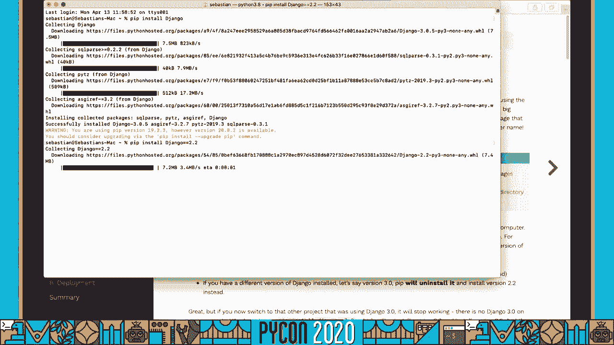

 If you don't have it it's okay peep is going to install it。 If you have a different version of Django let's say version 3 peep will first uninstall。
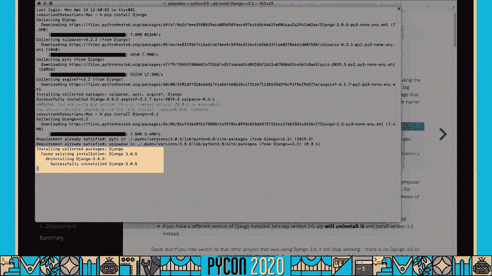

 it and then install version 2 instead。 Great so now you have version 2 but if you switch to another project that is using version。 3 it will stop working。 There is no longer Django 3 on your computer。 So you can run peep install Django equal equal 3 which will uninstall version 2 of Django。 So now each time you switch a project you will be uninstalling some dependencies and installing。

 different versions and the more projects you have the more annoying this thing can be。 To solve this problem we can use virtual environments。 A virtual environment will prepend a folder with some binaries to your path variable。 So each time you run Python command you will automatically use Python and packages from。

 this folder and if you run peep install you will install packages not globally but inside。 this virtual environment。 With virtual environments the main idea is that you should use separate virtual and for。 each of your Python project。 So that way you won't mix the penances。 If you are using Python 3。3 or above then you don't have to install anything to use virtual， enf。

 There is already a built-in module called venv that we can use to create virtual environments。 To create a new virtual environment run Python minus mvenv and then specify the name of the。 virtual environment。 This will create a directory named in the same way as you named your virtual environment。 and inside this directory you can see there is a bunch of folders and files。

 The only one that we are actually interested in is inside the bin folder and it's called， activate。 When we run it this will activate this virtual environment。 You can see that now we have the name of the virtual environment displayed in the terminal。 So it's a good way to see if we are currently using a virtual environment or not。

 Right now we are inside an isolated environment。 If we install some packages with peep they won't be installed globally they will be installed。 in this folder。 Let's try it。 Let's say we want to install flask。 And if we do peep phrase to see the list of installed packages you can see that we have。 flask and its dependencies here。 To stop using this virtual environment we just have to run the activate command。

 Now we are not using any virtual environment so if we try to list the peep packages you。 see that there are no global peep packages。 If we try to run flask we will get a message that flask is not installed。 Let's say we have another project where we are using a different version of flask。 So let's create another virtual environment。 And now let's install previous version of flask。

 As you can see here we are using a different flask version。 And that's pretty much all you need to know about virtual environments。 Each time you start a new project create a new environment， use peep to install packages。 inside of it。 And when you stop working on this project or you want to switch to a different one just。

 deactivate the environment。 Apart from the built in vnth module there are some other tools that will make using virtual。 environments slightly easier。 For example if you install pyenv using this pyenv installer then you also have installed。 the pyenv virtualenv plugin。 So you can use it to create and manage a virtual environment。 The main advantage here is that you don't have to remember in which folder you created。

 which virtual environment pyenv virtualenv will take care of it for you。 To create a new virtual environment run pyenv virtualenv then specify the python version。 and the name of the environment。 You can see that no new folder was created。 This is because pyenv is storing virtual environments in a separate directory。

 To see the list of available virtual environments run pyenv virtualenv command。 To activate one of them run pyenv activate and the name of the environment。 And to deactivate it just run pyenv deactivate。 Apart from pyenv virtualenv there is also virtualenv wrapper which is quite old but still。 very popular virtual environment management tool。 It has a very similar set of functionality but it's mostly using different commands。

 And since virtualenv wrapper doesn't work with the fish shell I found that there is a。 tool called virtual fish that you can use instead。 It has the same set of functionality as virtual and wrapper but the commands are even shorter。 You may have heard about penv and if you're already using it I'm not going to suggest。

 you to change it but if you're looking to start using virtual environments I would not。 recommend using penv。 There are some issues with the maintenance of this project and since there are many good。 alternatives I suggest that you take a look at some other project。 One of those projects can be poetry which is a whole new way to manage Python projects。

 You can use it to generate a scaffolding for your project to manage dependencies， prepare。 it to be published on PPI etc。 So if you're looking for one comprehensive way to manage your Python projects you can。 check it out。 And finally if you come from data science part of Python community then you are probably。 familiar with anaconda。 It makes installing new Python versions and packages much easier。

 It automatically creates virtual environments and installs all dependencies inside of it。 When you use conda you don't have to worry about the missing dependencies they will usually。 be bundled together with the packages。 The main difference between pip and anaconda is that anaconda doesn't install packages。 directly from PPI。 It installs binaries which means that someone first has to build this binary and publish。

 it to anaconda repository。 Most of the time that won't be a problem。 If you stick to popular packages most of them are already available but if you want to install。 a new package or a package that you just created then well you can't。 If you're using windows anaconda can make your life much easier so if you're having problems。

 using pip it's fine to use anaconda but I still suggest you to learn how to manage your dependencies。 with virtual environments and pip。 Even though it's more difficult than using conda that's what most Python developers are。 doing and it will give you much more flexibility in the long run。 So we solved the problem of separating dependencies between different projects。

 However sometimes there might be a situation where you want to use the same tool in all。 of your projects。 For example if you want to use black a code formatter or flake8 a linker you don't want。 to go to every virtual environment and install it there because it's a lot of work。 But you shouldn't also install it globally because the more packages you install globally。

 the bigger the chance that some of their dependencies will conflict with each other and you will。 again end up in this situation that one package is uninstalling others。 To solve this problem you can install pipx。 pipx installs pip packages in separate environments but at the same time those packages act as。 if they are installed globally so you don't have to activate the virtual environment to， run them。

 We can install pipx with pip or bro if you're on mac。 After the installation make sure that the path variable is updated by running pipx and。 sure path command。 Now we can list all the packages by doing pipx list and install a new one by doing pipx。 install in a package name。 Let's check the list of pipx packages again here you can see we have black and it's exposing。

 two commands black and black D and this is the location where pipx is creating its virtual。 environments。 So now if we do pip freeze you can see that black is not installed globally but if we。 try to run it it works。 You can also use pipx run command to run a command from pip package in a temporary virtual。 environment that will be deleted after the command exits。

 So let's say we want to run flake 8 just once we don't really want to install it and。 as you can see even though we run flake 8 it has not been installed。 If you follow the first part of the workshop where we were setting up VS code you remember。 how we installed flake 8。 By default VS code was installing flake 8 globally and I told you that it's not a good。

 idea to do this。 So I'm going to show you how to configure VS code to use flake 8 from pipx。 So first let's install flake 8 using pipx。 Now we need to get the path to the flake 8 binary。 So let's go here and as you can see flake 8 is here。 So let's copy this path。
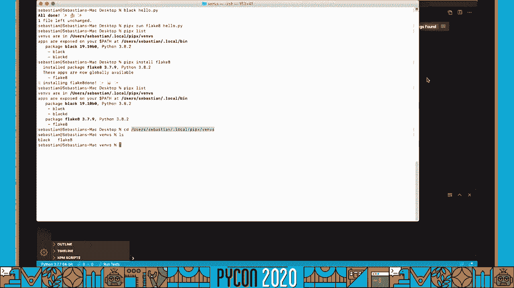

 Let's go to VS code。 Open the settings that you can find here and search for flake 8。 You will see that there is path to flake 8 and by default it's just flake 8 binary。 What you need to do is to replace this value with the full path to the flake 8 from the， pipx。 So now let's save it and we can run it and the path is invalid。

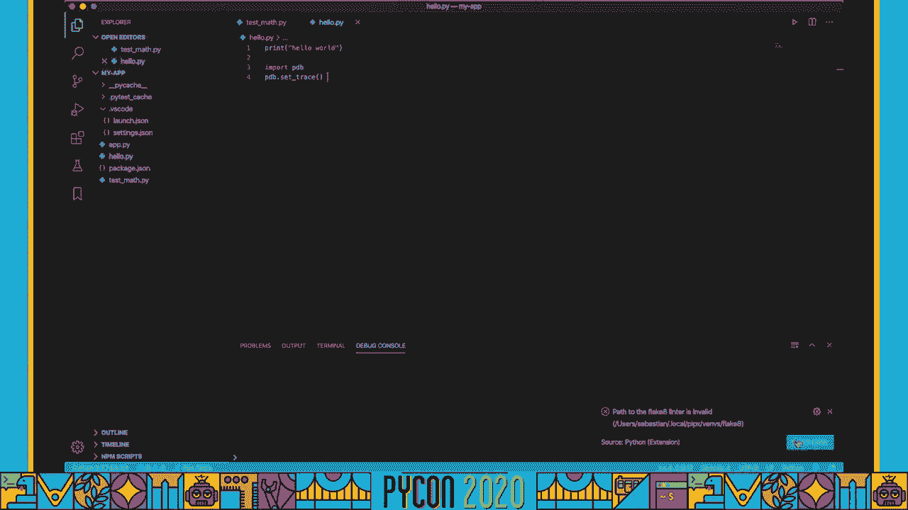

 Well let's see what happened。 Ok so I know what's the problem。 This is not really a binary it's a folder so yeah we can go inside and then there is。 bin folder and there we have the binary。 So we have to use this full path instead。
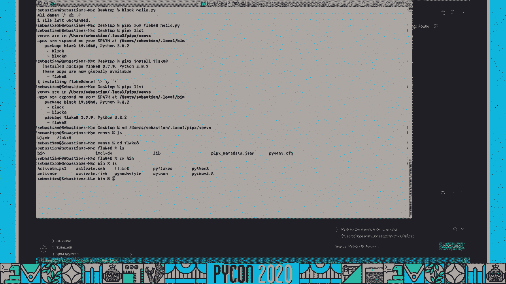

 Save it， we close the settings and yay we have an inter。
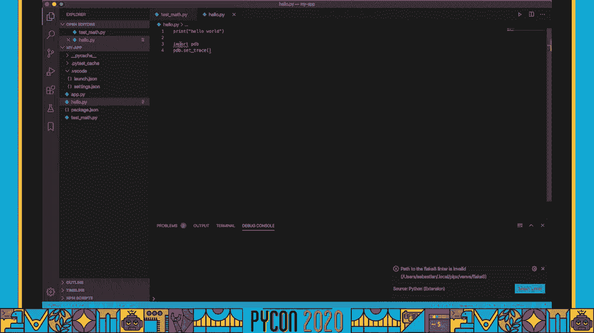

 We can see it complaining so everything is fine。 We covered a lot of ground here so if some of those tools are new for you I have prepared。 a short exercise that you can use to practice using them。 Open exercise one and follow the instructions there。 If you already know pipx and you are already using visual environments you can skip this。

 exercise but if one of those tools are new for you I suggest that you follow them and。 if you have any questions take notes and you can ask your questions during the interactive。 session at PyCon。 I hope the exercise wasn't too difficult and you're not to board。 Let's switch gears and talk about something else than tools。

 A very common question that I hear is how to properly structure a python project and I。 don't have one correct answer for this。 Python doesn't enforce any structure so as long as you know what you're doing you can。 organize your project however you like。 From the tools and frameworks that I know only Django will try to put some scaffolding。 for you but you can always ignore it and move stuff around。

 When you first think about the structure of your project it might not sound complicated。 and usually it won't be。 But if you're not careful you'll probably hit one of the two common problems。 First the file that you try to import is not on the import path and this usually manifests。 through a module not found error or you are going to hit some circular import errors usually。

 resulting in import error。 If you have never encountered these problems then probably me just talking about them is。 going to be boring for you。 So I suggest that you read the rest of this chapter on your own and if you ever have some。 problems with the circular import errors or module not found errors I try to describe。 the possible solutions and also linked to some explanations on stack overflow。

 In the meantime I would like to show you how we can structure our projects to avoid those。 problems and I would like to show you a tool that can help us with that。 Every Python project is different but quite often they share some common elements。 Writing a website in Django is no longer an exciting adventure into the world of web frameworks。

 It's more likely a mundane creating the same HTML templates connecting them to URLs and。 writing some views that are extracting information from the database。 And since thousands of developers rolled a Django or Flask application or published a。 Python package before you some people came up with an idea to extract common parts of。

 those applications and create a reusable scaffolding and that's how the cookie cutter。 project was born。 With cookie cutter you can create templates and then use those templates to generate scaffolding。 for your projects。 For example if you're writing a lot of Django websites you might notice that each of them。 has a similar structure。 So you might sit down and extract the similar parts into a template。

 put some placeholders， for example a website name， author。 date or the license and then when you need to create。 another website you will use this template to generate most of the code。 In this workshop we won't be writing a cookie cutter template but we'll be using one。

 So how to use it？ If you go to the cookie cutter website you can see that down there there is a list of。 different popular cookie cutter templates。 For example if you want to create a Python package you can use cookie cutter pie package。 If you want to write a Flask website there are a few Flask skeletons。 The same for Django it's somewhere on this list。 Ah yeah。

 There are plenty of different Django templates even something for Pyramit and you even have。 templates for different languages。 There are templates for C。 C++ so let's say we want to write a Python package using the， cookie cutter pie package template。 First we need to install the cookie cutter。 Notice that I'm using pipx。

 Cookie cutter is a tool that I want to use across different projects so there is no point。 in storing it in the same virtual environment as my project。 I want it to be available globally on my computer。 Next we run cookie cutter command and we paste the URL to the github repository with the template。

 So in this case I want to use cookie cutter pie package。 Press enter and then cookie cutter is going to ask you a couple of questions。 The value in the brackets is the default value that is going to be used if you don't provide。 a different one。 Some of the questions are important some of them are not。

 For example here if you provide your full name it's going to be used mostly in the documentation。 or in the license files。 But later on you will see some questions that are actually quite important。 So let's fill in some information。 Here I don't want to change the default value so I'm just going to press enter。 Now we got to the point where the questions are actually important。

 Here we need to decide if we want to use pipest as our testing framework or if we want to。 use something else like maybe the built-in unit test。 I want to use pipest so I select yes。 Here we can choose if you want to do pipi deployment with travis。 I don't want to use it so I would know。 I have no idea what's pie up batch so I'm going to go with the default no。

 Here we can select a command line interface。 You can either use a popular click library the build in arc parse or you can choose to。 not use the command line interface。 Depending on your answer here cookie cutter will either add or remove some files that would。

 normally be a boilerplate for your CLI。 So let's say I want to use click so I select one。 I have no idea what's this author file so I'm going to say no and now I can select the， license。 Let's go with the default one。 If we look inside the current directory you can see that cookie cutter has created a directory。 for us。 If we go inside you will see that there are a lot of files。 Let's use three command。

 I can't use three。 The amount of files can be quite overwhelming especially if all you want to do is to create。 a very simple Python package but you can ignore most of them。 For example contributing will only contain some information for the contributors to your， project。 History is a place where you can store change log of your project。

 Some of the files that you should care about are for example the make file。 If you have never used make files before and you think they are scary you can ignore them。 for now but they can be a really good place to store your scripts。 For example here you can see we have some commands to clean up compiled files to link。

 our files to run tests to generate the documentation or the code coverage and finally to install。 our package。 Then there is docs directory and this is where the documentation for your package will live。 This cookie cutter template is using sphinx to manage documentation and I will talk more。 about sphinx later in the workshop so we can skip this folder for now。

 The my awesome python package directory is a place where the code of your python package， will live。 The name of this folder depends on what name you give to your package。 So as you can see cookie cutter is able to generate some files or folders in a dynamic。 way depending on what answers you provide。 Next we have requirements dev。txt file。

 This file contains a list of python packages that you will need for development。 As you can see we have flake 8 for linting， pite test for running tests so those are not。 the packages that the end user of your package will use。 The end user packages are listed in setup。py and in some other projects you might find them， in file called requirements。txt。 Setup。

py is probably the most complicated file in this whole directory。 It contains a bunch of settings that will let you publish your package on pite or install。 it with pip。 The good news is it's already set up for you so you don't really have to touch it and。 as you can see here we have the end user requirements of our package and in this case。

 it's just a click package for the command line interface。 There is also setup。cfg file that contains settings for various tools that you will be， using during development。 So as you can see there are settings for flake 8 for pite test。 This file is already pre-configured for you so you can also ignore it。

 If you want to start building a python package now all you have to do is go inside the my。 awesome python package， open the my awesome python package。py file and add some modules。 and functions here。 If you want to use a CLI you also want to modify the cli。py file。 As you can see there is already some code here that can help you start。

 And then when your package is ready you will see that inside the make file there is release。 command that will build and publish your package on pite。 One advantage of using cookie cutter is that those templates will often provide you with。 some additional tools that might help you with the development process。

 And the most popular cookie cutter templates are a collaborative effort of many python， programmers。 So they will usually contain tools that have been used and tested by many other developers。 Not some shiny new toys found yesterday on hacker news。 For example the pie package cookie cutter that we just used installed talks。

 That is a very useful tool to run tests under different python versions。 And since you are writing a python package you probably want to test it under at least。 a few recent python versions。 And it also installs things which is probably the most popular tool for writing documentation。 in python。 And again since you're writing a python package you probably want to document how to use it。

 Some templates will be more opinionated and they will install more tools。 Some of them will be more bare bone。 In the end it's up to you to decide which template you want to use and if you actually。 want to use all its features。 If you think that the template you found is too complicated just go to the cookie cutter。 website and search for another one。 For example if we want to build a flask website just search for flask and see what's there。

 Here you can see we have a flask template with bootstrap。 Let's see how it looks like。 Ok so as you can see we'll get a pretty basic bootstrap website with some registration and。 login forms and SQL alchemy。 If you feel like you don't actually need all this stuff all you have to do is go back and。 search for another flask template。 Maybe you want a very bare bone flask application and here you can see there is a flask minimal。

 template that might be more suitable for you。 So as I said it's worth checking out at least a few different templates comparing what they。 have to offer and if you don't understand how something works either check the documentation。 of the template if it's mentioned there or just remove that code。 Apart from deciding how to structure your project there are some other important decisions。

 that you have to make and I'm not talking about how to architecture your application。 whether to use a microservices or build a monolith which database is to use or how are。 you going to deploy and scale your application。 Now before we get to that there is something else that you need to sort out especially。 if you're working with other developers。 You have to decide on a cold style。

 Things like taps or spaces how many characters per line whether you should use absolute or。 relative import and honestly I have seen people fighting more about the cold style than the。 overall architecture of the project。 And I understand it I have my own preferred way of writing code but if you're working。 with others sometimes you have to compromise。 So that's why we have PEP8。

 It's a style guide for Python that documents how you should write your code and then we。 have PEP257 which is a style guide for the documentation。 Those two documents give us a very solid foundation on how to write and document our code and。 even if it's the first time you hear those two names if you're using the auto formatting。

 feature of your code editor then your code is probably already compatible with those rules。 But I think documents for example how many spaces you should use for the indentation。 how to indent the closing parenthesis or the bracket， what's the recommended line length。 or how to sort import statements。 And unless you have a very good excuse you should follow those rules。

 The most common exception nowadays is the line length。 Since our screens are getting bigger and bigger increasing the limit beyond the 79 characters。 makes a lot of sense。 But even with PEP8 there is still some room to argue。 Like how do you split functions that have multiple lines， how many spaces you should。

 use for the hanging parenthesis and stuff like that。 Discussions about those small details can waste a lot of time during the code reviews。 and to be honest there is no one perfect way how you should write your code。 So instead of focusing on those small details it's easier to use an automatic tool that。

 will fix those small problems for you and focus your code reviews on things that actually， matter。 So those tools is black。 Black will take your files and format them according to the PEP8 and PEP257 rules with。 some additional rules on top of that。 Black offers almost no customization。 The only setting that you should be able to change is the line length if you don't like。

 the default 88 characters。 There are some options like skip string normalization that stops black from turning your single quotes。 to double quotes but according to the documentation you should not use it。 Black is opinionated。 Some people like it that way， some people don't。 I work with people who would merge a pull request because they don't like the code formatting。 So black takes those silly discussions away and helps you focus on what actually matters。

 So if you ask me I'm going to stick with it and unless you like fighting with people。 about cold style you should probably also use black too。 Ok so let's finally see black in action。 First we need to install it。 I suggest that you use PEPX since you want to use black globally in all your projects。 Yeah seems like I already installed it before。 Yeah as you can see we have two commands。

 Black and black D。 I think this is to start a demon。 So now if we have a piece of code that is ugly and this code is ugly on purpose。 I promise you I don't write code like that。 It's ok to hire me。 Now if we run black on this file you will see that it was reformatted and we even get。

 some nice emojis。 So let's see how it looks after the reform I think。 As you can see the imports are nicely aligned。 All the redundant white spaces are removed。 The list is now on one line。 The dictionary has proper spacing between the key and the value。 So this code looks much nicer。 And if we try to run black again you'll see that this time there was nothing to change。

 And that's how you would use black。 You can run it on the folder with your project。 You can plug it to some continuous integration tool。 You can use tool like pre-commit to run it each time you create a new commit and get。
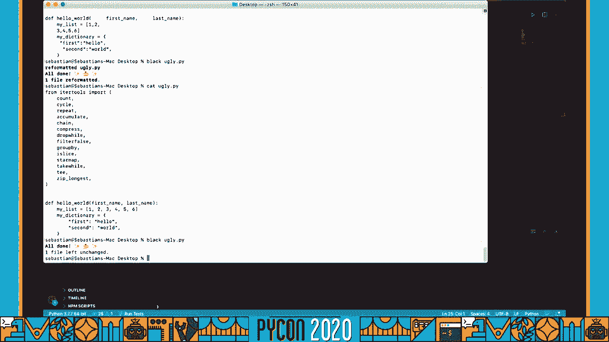

 Or you can just run it by hand as I just did。 Another set of tools that can help you write better Python code are static code analyzers。 One of the tools that I'm using all the time is called flake8。 Flake8 is a linter。 So unlike black it won't change your code but it will give you some hints about possible。 problems in your code。 And flake8 actually combines three different projects。

 PiFlex which gives you warnings about unused modules and defined variables and stuff like， that。 PiCult style which gives you warnings about pep8 violations and maccape which is disabled。 by default。 But if you enable it it will give you warnings about the psychlimatic complexity of your functions。 Which basically means how complicated your functions are。

 Flake8 integrates really nicely with VS code。
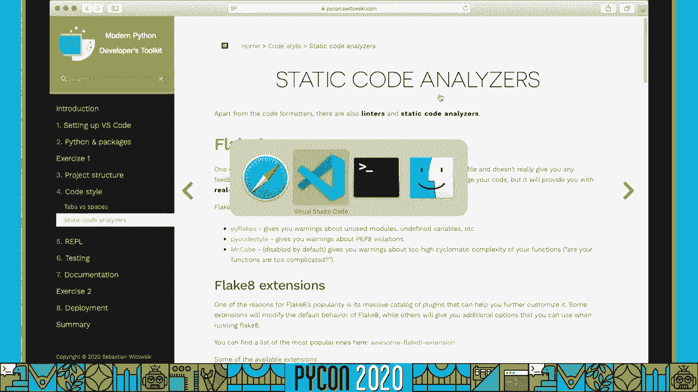

 So let's take a look。 As you can see this is our ugly。py file with a lot of ugly Python code。 And all the reds quickly underlines are errors reported by flake8。 So here on the first line we are importing a bunch of functions but we are not using， it。 Here it's complaining that we don't have two blank lines。

 Here that we are assigning a local variable my list and we are not using it。 Same with the dictionary。 Here it's missing some wispaces and stuff like that。 You can also see all the problems in the problem stop。 As you can see there is a lot of things here。 And if for some reason flake8 is not working for you and you want to enable it you can open。

 the comment palette。 Type select linker。 And then from the list here select flake8。 You can also experiment with other linters and I will talk about them in a few minutes。
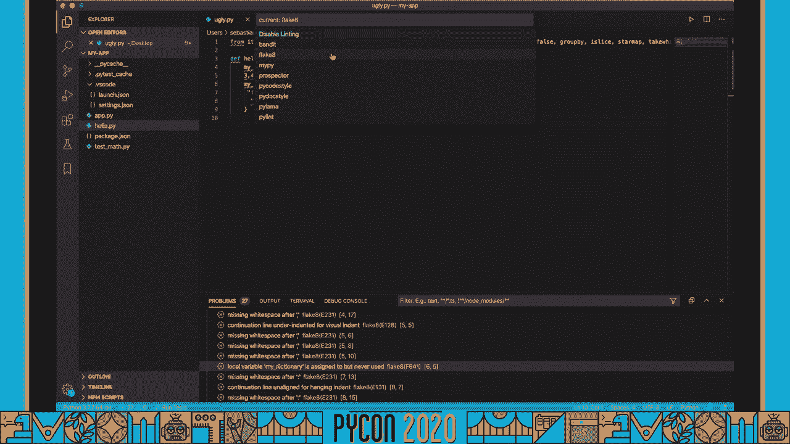

 One of the reasons why flake8 is so popular is because it has a massive catalog of plugins。 that you can use to customize it。 Some of them will modify the default behavior of flake8 and others will give you additional。 options that you can use while running flake8。 You can find the list of most popular plugins on the awesome flake8 extension website。 It's a github repository with a huge list of different extensions。

 I have listed here some that I found quite useful and even if you are using flake8 I suggest。 that you take a look at this list because when I was preparing it I found a lot of useful。 stuff that I wasn't aware of。 Some of those extensions will add additional checks for example to make sure that you are。 not overwriting the built-in variables and that you don't make some silly mistakes。

 Stuff like flake8 comprehensions will suggest you places where you can use lists， set or。 dictionary comprehensions over a for loop。 There is also flake8 dockstrings which will enforce pep257 and many more plugins like that。 If you are using a lot of flake8 plugins between multiple projects check out the flake hell。 or talks。 They will both let you install and configure all flake8 plugins by modifying one configuration。

 file so you don't have to go to each of your projects and manually do pip install flake8。 this extension and that extension。 It's a useful tool。 In case you haven't yet installed flake8 this is how you can do this。 I suggest that you use pipx so flake8 is available globally but it's still separated。

 from the other dependencies that you have and if you use pipx and you want to install flake8。 plugins to the same virtual environment where the flake8 lives you will have to use pipx。 inject function。 And if you want to run flake8 on your folder instead of using VS code just run this command。 Flake8 and black are the two tools that I'm using everywhere where I can but there are。

 some other static code analyzers。 Another popular linter is a pilot。 It has some overlap with flake8 but you can safely use both of them at the same time。 Just keep in mind that pilot is much more strict than flake8。 It will complain if you have too few public methods， too many local variables or classes。

 with no init method。 It's much easier to write code that will make flake8 happy than it is to write pilot。 compatible code。 So try running pilot on your existing project and see if you like it。 Next tool is Bandit。 Bandit is designed to find common security issues in your Python code。 If you run it out of the box it will give you plenty of false positives。

 For example it will complain about using assert statements in your pilot files。 But if you spend some time and configure it it will print some possibly useful information。 about insecure usage of some modules， possible SQL injection points， silently ignoring exceptions。 and stuff like that。 If you're a beginner Bandit can be a good tool that will help review your code。

 PyDoc style is a tool that will make sure that your documentation is written according。 to the PEP257 rules。 Just keep in mind that it will complain about missing documentation of every function or。 module that you didn't bother to write。 Then there's vulture that will help you find unused code and we make Python style guide。 which is another strict linter that combines flake 8， bunch of flake 8 extensions and some。

 custom rules on top of that。 It's very strict so it might be too much for your project but maybe you'll actually like。 it。 And finally there is prospector which is like flake 8 but instead of pie flake it's using。 pilint。 So it's a combination of pilint， pie code style and maccape。 And my final tip here is that you can automate most of those plugins by using the pre-commit， tool。

 So pre-commit lets you plug linters， formators and static code analyzers as git hooks and。 they will be automatically run when you create a commit。 Check out this link to see how to set up black and flake 8 as pre-commit hooks。 Another tool that you will use very often if you write Python code is the interactive Python。

 shell or the read evil print loop。 It's this type of shell that you get when you type Python in your command line interface。 and here you can execute some Python code。 It's nice to have the Python REPL so you can test your code interactively but the basic。

 Python REPL is well basic and in the long run it's not very convenient to use。 There are a few different ones。 The most popular one is IPython。 It's the same REPL that runs behind the Jupyter notebooks so even if you never used IPython。 directly you might be familiar with it。 We can install IPython using pip or pipx。 Again。

 I recommend pipx since this is a tool that you will share between all your projects。 The only difference for you now is that if you want to start an interactive session you。 just have to type IPython instead of Python。 Some of the best features of IPython are the tab completion。 If you press tab in a standard Python shell well it's gonna insert tab。

 If you press tab in IPython it's gonna show you a list of possible auto-completion items。 just like your code editor。 We also get syntax highlighting， better error messages。 If you start writing a function or a loop IPython will detect that and automatically indent。 the next line if you press enter and finally my favorite feature of IPython the dynamic。

 object introspection。 You can see the documentation of any object in Python by just appending a question mark to。 the end of this object。 And it works for any type of object。 Options， modules， building modules。 third party libraries， a variable that you just defined， anything。 And if the doc string is not enough you can append two question marks to see the complete。

 source code of this object。 I really like this feature because I no longer have to leave the terminal to search for the。 documentation。 IPython also comes with a bunch of magic functions。 Those are helper functions that start with one or two percentage signs and you can use。 them for example to quickly measure the execution time of some code， run a file， browse a history。

 of the previous IPython sessions， rerun some previous commands or open a code editor to。 edit some code before executing it。 And you can always write your own magic function if you want。 If you think IPython is interesting and you want to learn more， check out the IPython documentation。 for a good overview of different features。 If you prefer a more visual demonstration。

 I gave a presentation about IPython last year。 It's a 45 minute long fast paced talk where I go through most of its features。 Watching it on YouTube is probably better than seeing in life as you can always stop。 and test the feature if you find it interesting。 So I really recommend you that you start using IPython instead of the default Python。 REPL。 Even if you don't care about most of its features， the tap completion syntax highlighting and。

 automatic indentation alone will make your life much easier。 And if you don't like IPython there are some other Python REPLs out there。 They don't have as many features as IPython but they have different features。 So maybe you will prefer one of them。 We have BPython with syntax highlighting， auto-completion。

 automatic indentation and， features like rewind that lets you remove the last command that you executed。 And we also have PTPython with a similar set of features and a slightly more advanced。 interface with some menus， some emax key bindings and stuff like that。 Once you wrote some code you want to make sure that it works。

 And I don't mean if it works now because you just wrote it you clicked stuff around。 so you are sure that everything is fine。 But we need to make sure that it will still work after someone else changes some other。 piece of code。 So let's talk about writing tests。 Python comes with a unit test module that you can use for writing tests。 It's very basic in terms of features and at the same time it's overcomplicated in terms。

 of how many different assertions you have to remember。 So I suggest that you learn Pytest instead。 Pytest is probably the most popular Python library nowadays。 It's packed with features but at the same time it stays very beginner friendly。 You don't have to write classes that inherit from unit test test case。

 You just write functions that starts with test。 You don't have to memorize assert equal。 assert true， assert in。 All you have to do is to use assert something equals equals something else。 And that's pretty much it。 If you need something more advanced。 Pytest has a lot of additional features and a very， vast ecosystem of plugins。

 To start using Pytest， install it with pip。 The only with pipx。 different projects might use different Pytest configurations or different， Pytest plugins。 So you don't want to install a global version， you want to install Pytest in each of your， projects。 Once you install Pytest， create a tests directory in the root folder of your project。

 Create files starting with test_inside。folder and then write functions that starts with test_inside。
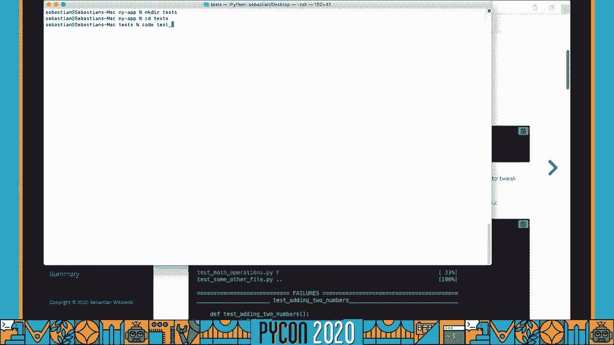

 those files。 If you follow this advice， Pytest will work out of the box for you。 Once you write some tests， go back to the terminal and run Pytest command。
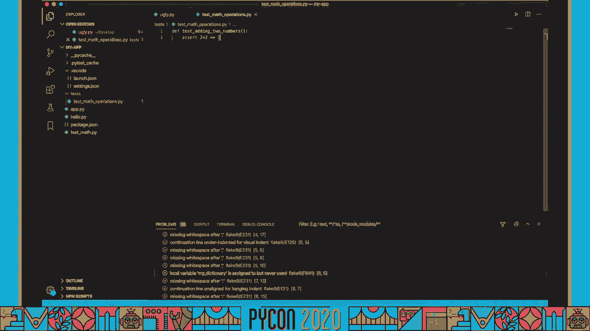

 Pytest will detect all the tests and run them for you。 As you can see here。 Pytest detected four tests。 Three of them in a file called TestMuff that I used when I was showing you how to run test。 in VS code and one more in the TestMuff operations file。 The last one has failed and you can see a trace bug and error message。

 So now you can go and fix this test。
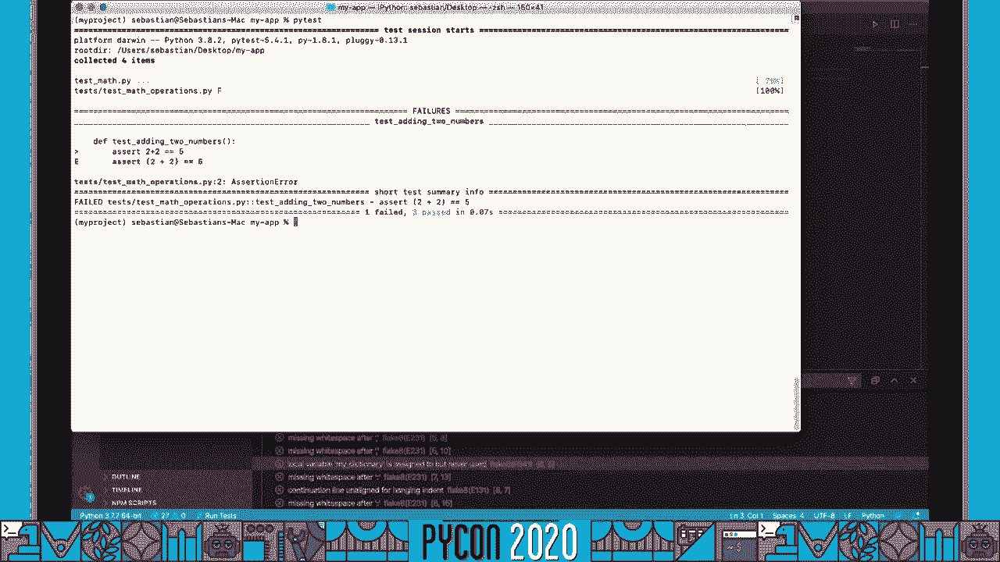

 So that's how you can use Pytest。 There are some other Pytest features or testing features in general that you'll probably need。 to use in your test， so let's talk about them。 First， fixtures。 Let's use an example。 Let's say you have an e-commerce website where you sell some stuff。 You want to make sure that everything works fine because you don't want to give your products。

 for free if there is a bug。 So you write some tests。 You check if a user can log in。 you add some products to the cart， you go through the checkout， process。 And for each test。 you need to create a user。 So instead of writing code that creates a new user inside of every test。 you decide to， extract this user creation to a separate function and then run this function at the beginning。

 of each test。 So actually this use case where you need a specific object to exist at the beginning。 of a test is such a common scenario that the idea of fixtures was born。 A fixture is a function that returns an object。 In our case， the user object。 but it can be anything。 It can be an item in your shop。 It can be a database connection。

 And then you can use this fixture in your test。 So to create a fixture in PyTest。 all you have to do is to write a function and then， decorate it with PyTest fixture command。 If you don't know what a decorator is， don't worry， just put this piece of code over a function。
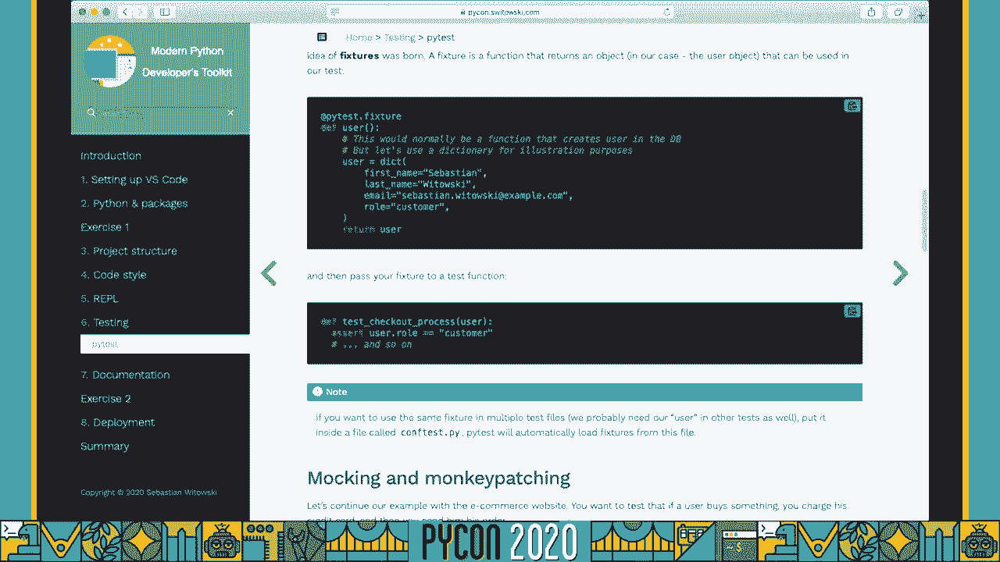

 and it will turn it into a fixture。
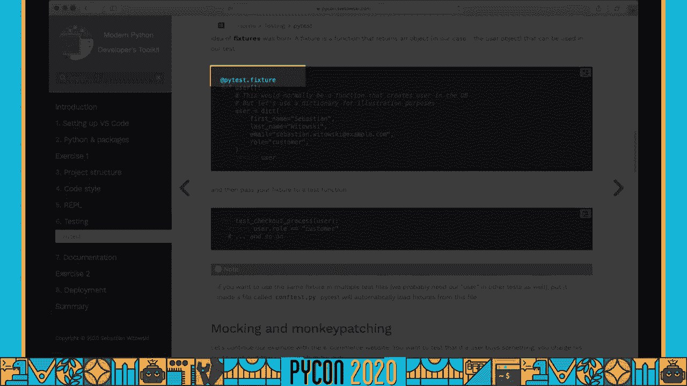

 And then to use a fixture in your function， you need to pass this fixture as an argument。 to your function。 And as a side note， if you want to have the same fixture in multiple files。 just put this， fixture inside a file called conftest。py。 PyTest will automatically load all the fixtures from this file in all your tests。

 Next concept is mocking and monkey patching。 So let's say that on your e-commerce website。 you want to test that if a user buys something， first you charge his credit card and if everything went fine。 you send him his order。 Well you can't charge a real credit card each time you run tests。 Okay。 technically you can if you're very rich， but let's assume we are not very rich and。

 we want to avoid losing money。 So that's why you need a mock。 a fake object that you can use in place of a real one。 So instead of sending credit card details to Stripe， which is a very popular payment processor。 you replace Stripe with a mock object。 This mock object should return a success message if you provide it with correct parameters。

 The whole point of mocking is that it's not your job to test if Stripe works fine。 All you need to do is to make sure that you send correct data to Stripe and then that you。 accept and process whatever information comes back from Stripe。 So let's say in our code we have a charge customer function that takes an amount of money。

 and sends it to the Stripe through Stripe API。 Back from the Stripe we get a response and the response has a status。 We check if the status is equal to success and then if it is we set the status of the。 current order to processing。 By the way， this is a completely dumby code that won't work with Stripe。 It's here just for the illustration purpose。 Then in our test payment function we need to pass the monkey patch function and then。

 we use this monkey patch function to replace the charge attribute of the Stripe object with。 something that just returns a dictionary with status equal success。 Then when the charge customer function is called and it gets to the point when it executes， Stripe。charge it won't execute a real function our mock will kick in and it will automatically。

 return the dictionary with the status equal success。 That way no information actually gets to Stripe and we can assert that if Stripe returns success。 the current order status is set to processing。 Alright I have a joke for you。 A tester walks into a bar。 He orders a beer， he orders zero beers， he orders 1 million beers。

 he orders a lizard， he orders -1 beers。 Then at first customer walks into a bar he asks where the bathroom is。 The bar bursts into flames killing everyone。 So there is an important lesson in this old and moderately funny joke and it's not about。 fire extinguisher or fire escapes。 You probably want to test your functions with a lot of different inputs and Pytest has a。 feature just for you。 You can parameterize your test。

 So you have to decide which part of your test can change。 In case of our e-commerce website that could be the number of orders and the size of a single。 order。 And then you write one test that accepts those changing parts as parameters and use Pytest。mark， parameterize decorator to pass different values to those parameters。

 If you look at this example Pytest will actually turn this test into four different tests。 In the first one the number of orders and the order size will be equal to 1。 Then in the second test the number of orders will be equal to 100 and the order size will。 be equal to 1。 Then device versa and then both of them will be equal to 50。

 Pytest parameterize can save you a lot of repetition when you write tests。 One of the things that we usually forget to keep up to date is documentation。 Mostly because we don't have a tool that tells us when it's outdated and no longer valid。 Pytest can solve part of this problem。 If you put some code examples in the documentation it can evaluate them and tell you if they no。

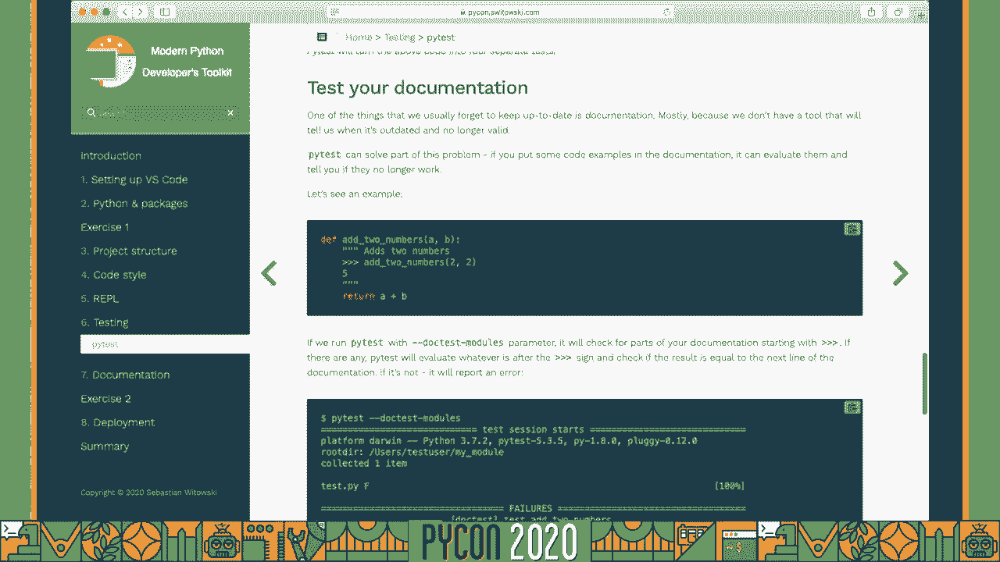

 longer work。 Let's see an example。 If we run Pytest with DocTest module's parameter it will check for parts of your documentation。
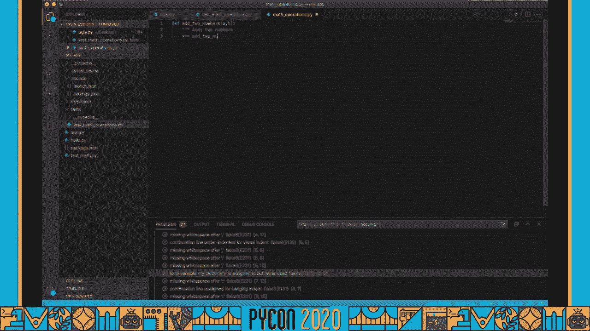

 startings with this symbol。 If there are any Pytest will evaluate this line and see if the result is equal to the。 next line of the documentation。 If it's not it will report an error。 Speaking of running Pytest with parameters there are a lot of cool parameters that you。 can pass to Pytest。 You can for example stop running tests after the first failure you can rerun only the failed。

 test from the previous run。 You can select a single test or a single file to run。 You can start a debugger when there is a failure or you can run tests in parallel。 You can mark tests so assign a label to a test and then only run tests with a specific， label。 You can split your test into for example unit tests that you will run every time and end。

 to end tests that you will run only on the continuous integration platform because they， are slow。 And you can also use one of the predefined marks。 For example you can tell Pytest to skip some tests if you know that they are broken and。 you don't have time to fix them today but use to want your CI to work。 You can tell Pytest that some tests are actually expected to fail。

 And you can skip some tests if a specific condition is true。 For example you might want to skip some tests if they are not supposed to work on windows。 The final piece of our "How to make a good Python project" puzzle is the documentation。 At some point you probably want to explain how to use your project or how someone can。

 contribute to it。 So you need to write a documentation。 One of the most popular tools for Python is called Sphinx。 It's easy to use and it comes with a lot of useful features out of the box。 You can generate documentation in various formats。 You can easily create hyperlinks between functions and modules。 You can automatically generate documentation of your APIs。 And similarly to what Pytest does it can also test the code examples in the documentation。 So to use Sphinx， install it with pip or pipx。 I'm gonna go with pip because maybe in another project I want to use something else。

 Once you have Sphinx installed， run Sphinx-quickstart command and pass the name of the folder。 where you want to keep your documentation。 A common name for this folder is "talks" so I'm gonna go with that。 Then Sphinx will ask you a few questions about your project and generate the documentation。 With Sphinx you will be using a restructured text to write documentation。

 It's very similar to Markdown but it has some custom syntax on top of it。 If you want to learn more here is a link to some instruction how to use restructured text。 For some reason you don't like restructured text and you want to use Markdown， there is。 an extension called "re-common-mark" that you can install。 However。

 I will go with "restructure text" here。 If we go to the docs directory you will see that we have a "make" file and "make"。 path。 Those are files that we will use to generate the documentation。 And then we have "build" and "source" folder because we chose a separate source and。 build directories in the first question that Sphinx asked us。

 Inside the build folder we will find the generated documentation。 Right now we don't have any。 Inside the source folder we will find the configuration file and index "rest" this is。
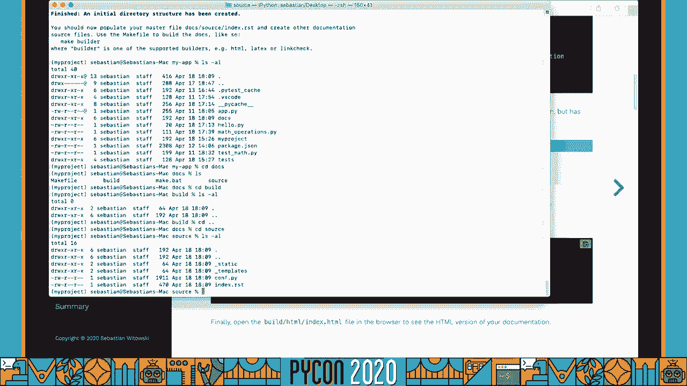

 the main page of your documentation。 As you can see there is not much going on here and VS Code is suggesting that it can。 help us with some extension to preview the "rest" files。
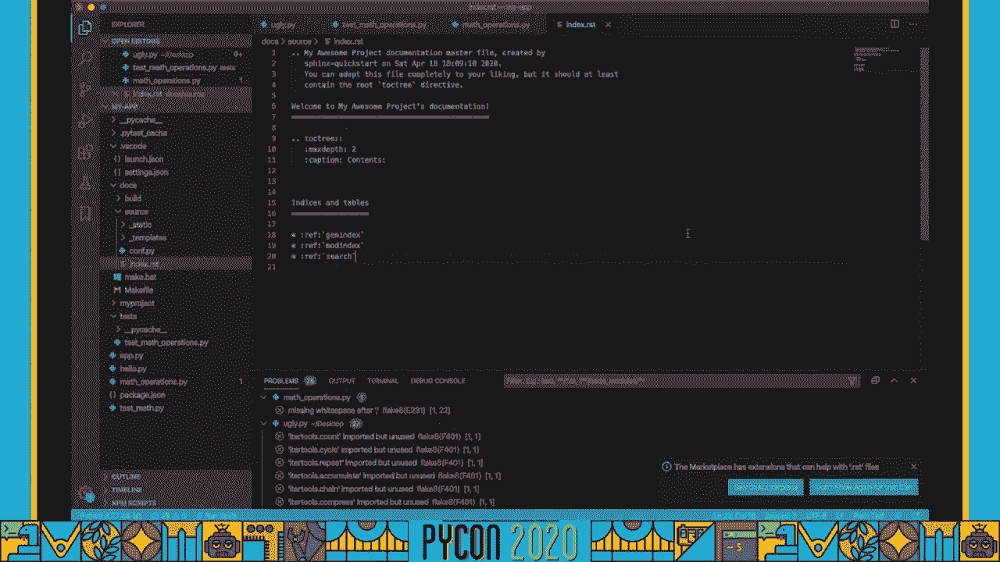

 Right now I'm going to dismiss it。 So to generate the documentation we have to go to the folder that contains our "make"。 file and run "make。html" command。 This should generate the HTML version of the documentation。 If we now go inside the build directory you will see that we have "html" folder and inside。 of it we have some pages。 Let's open the index "html" in the browser。

 Great so we have a skeleton of our documentation。 There is not much going on here so let's see how we can fill it up with some content。 You can add more files and folders to the source directory and then you can link them。
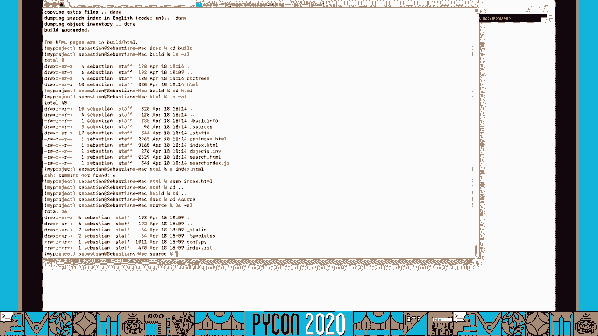

 under the "talk 3" section to create additional pages of your documentation。 Just make sure you are actually creating those three files that we are specifying here otherwise。 you are going to get some errors when building the documentation。
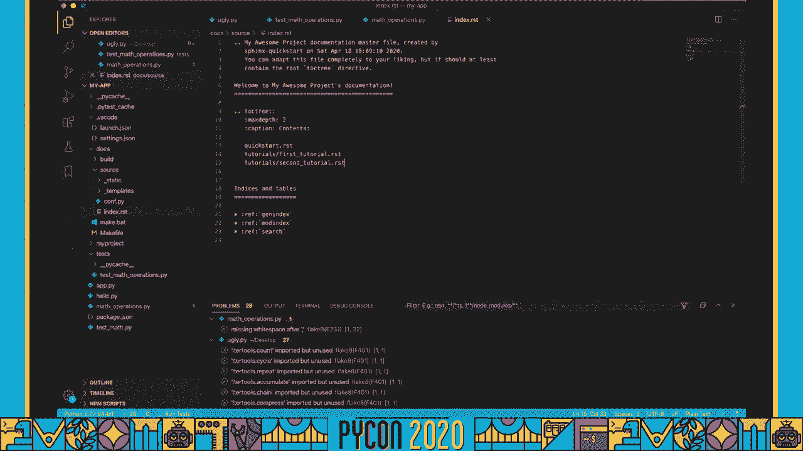

 If you are wondering what to actually put in your documentation I can highly recommend。 you this talk and this blog post。 If you use this framework for writing documentation you will have four main categories。 Tutorials that will explain a complete beginner how they can start using your application。 how to guides， so recipes how to solve a specific problem， explanations explaining how your project。

 actually works and reference which is like a Wikipedia page for your project。 One feature that I really like in Sphinx is that it can automatically generate the documentation。 for your API。 All you need to do is to add a plugin。

 So open the conf。py file that contains the configuration for your Sphinx documentation。 and then inside the extensions list add sphinx。ext。out。doc。 Next we need to create a file that will contain this API documentation。 So let's create a new file called api。rest。 Inside this file for every module that you want to document you need to add the following。

 code。 First the name of the module， let's say I want to document the math operations。 Okay this part is completely optional but I like to add it to have a nice headers for。 each of the modules。 And now the mandatory part。 Normally you should first provide the name of the package and then the name of the module。 Since here I don't really have a package and I have only one file so it's okay to skip。

 the name of the package。 But normally you would want to use packages to name space your modules so to easily separate。
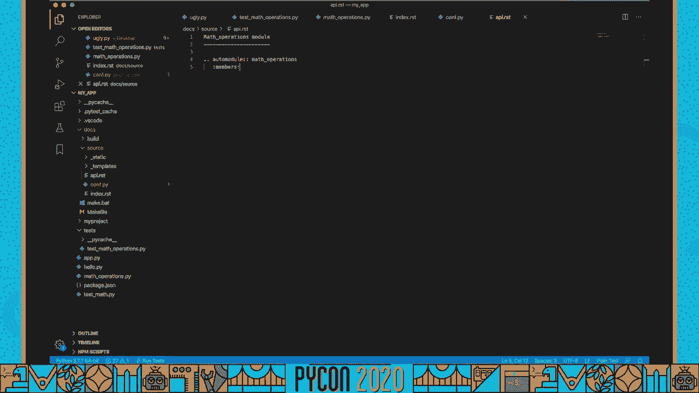

 them。 So let's try to build our documentation。

 And we get an error。 The problem here is that the math operations file is above in the directory structure comparing。
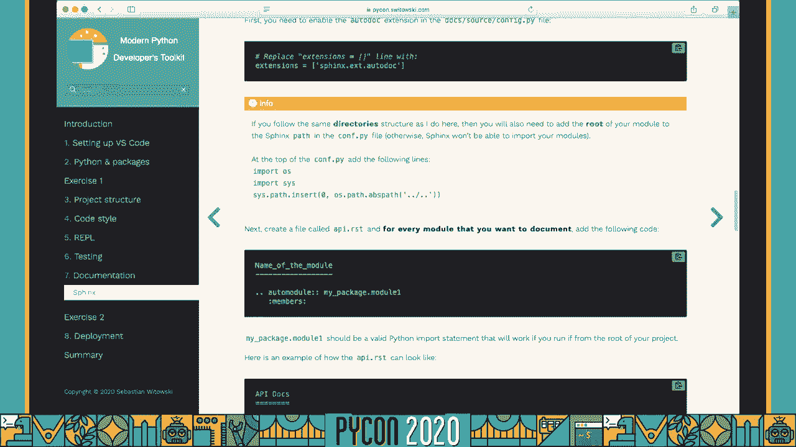

 to conf。py file。 So all we have to do is to modify the path inside the conf。py file。 So let's open it and at the top of the conf file you will see an explanation of this problem。 So uncomment those lines and change this into two directories above。
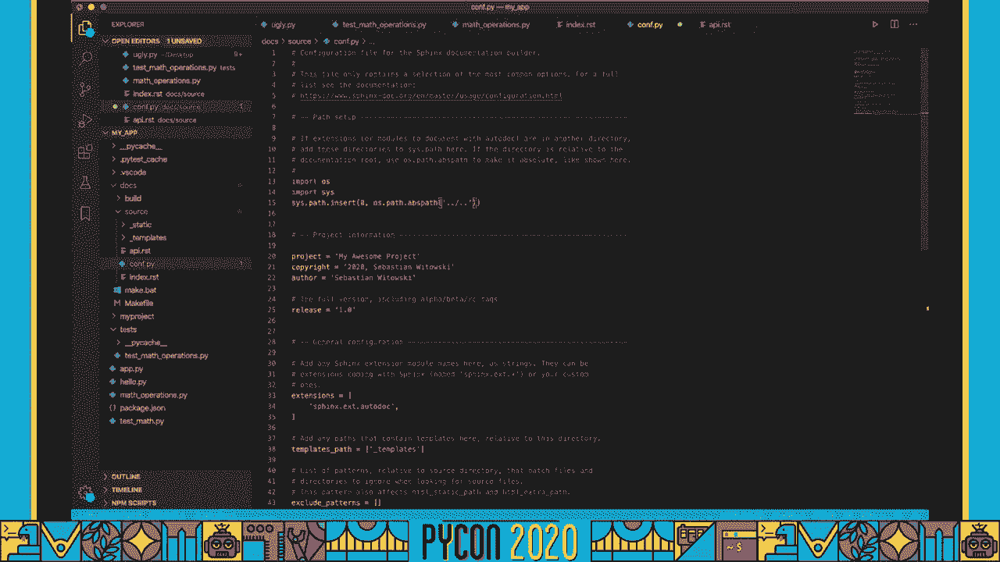

 That's because we have conf。py file inside the source directory。 Above we have the docs directory and the math operation is one directory above the docs。
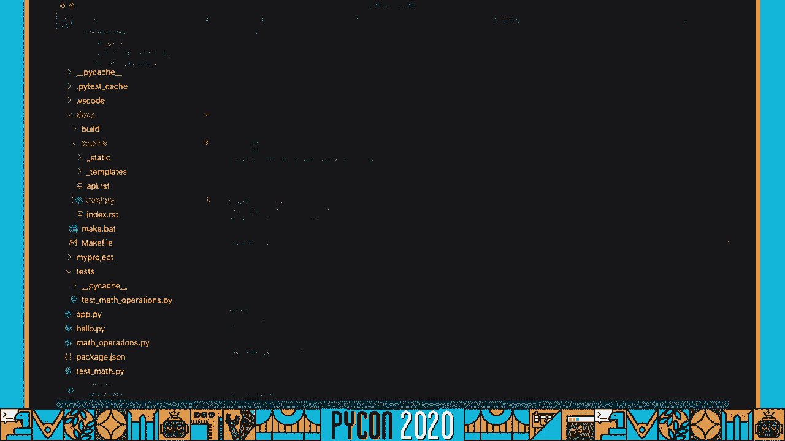

 That's why we have to go up to directories。 Once we save this file let's try to run make again。 And this time it's successful。 Let's open this file in the browser and here we have it。 If you're wondering how do we get those parameters and the return value that's because I modified。
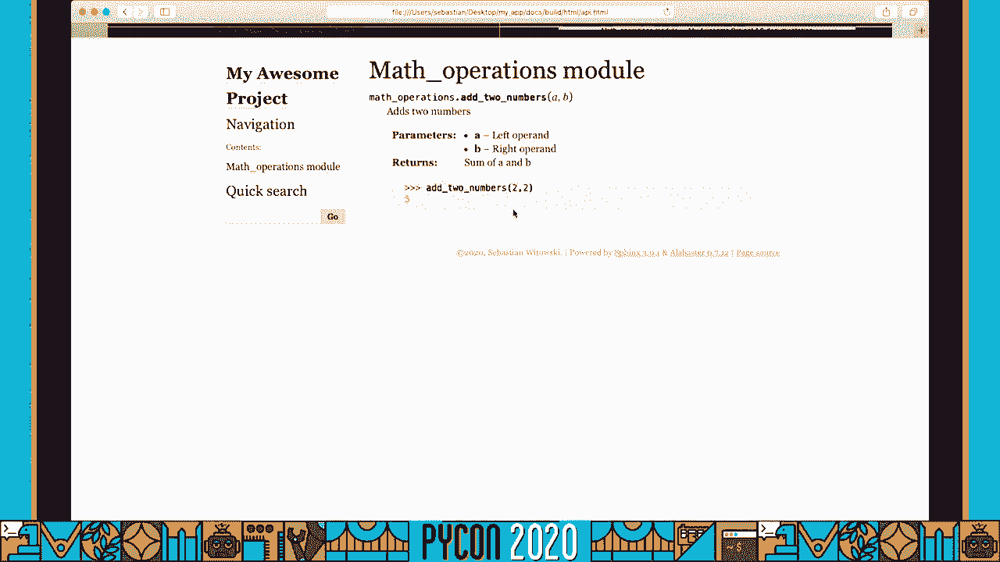

 the math operation and I added more stuff to the doc string。 If you go to the Sphinx documentation you can see how you can specify parameters and。
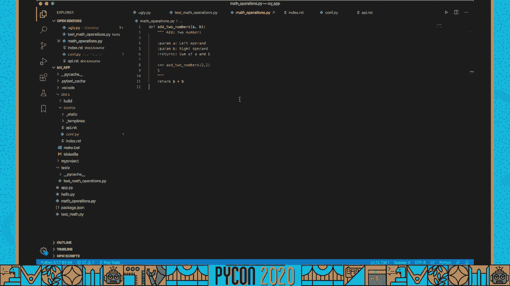

 return values of your functions。 One feature that I really like is to have a link from the documentation to the source。 code of the functions。 And with Sphinx we can enable it with just one plugin。
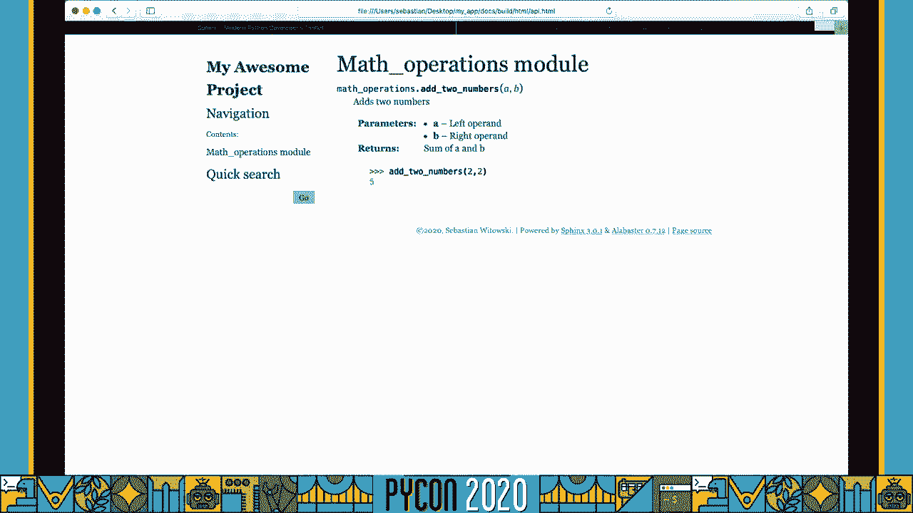

 So open the conf test and add Sphinx。ext view code to the list of our extensions。
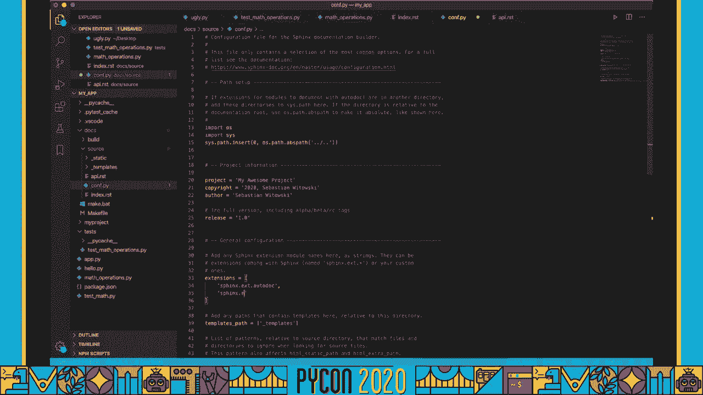

 Now build that documentation again and if we go to the browser you can see a link to the。 source of every function。 It's a really nice feature especially that we can get it by modifying just one line。 If you're building a REST API so for example you are using Django or Flask only for the。 backend of your application and then you have view or react in the front end。

 Check out the swagger UI and redog。 They will both let you easily generate interactive documentation for your applications。 When we talked about Pytest I show you how you can test your documentation。 But if you're not using Pytest you can also test your documentation from Sphinx directly。
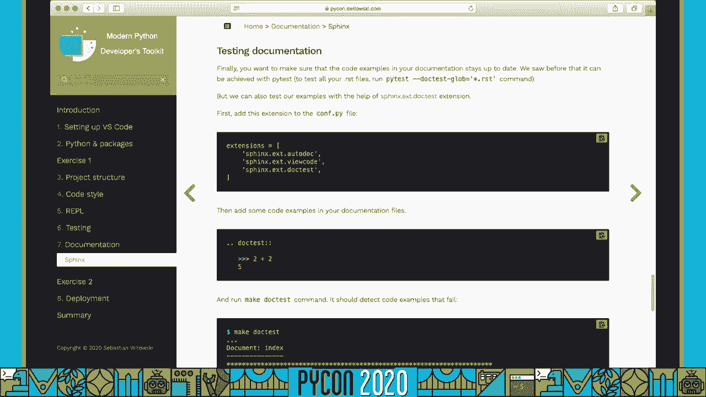

 First you need to enable the doc test extension to make sure that you actually have some test。
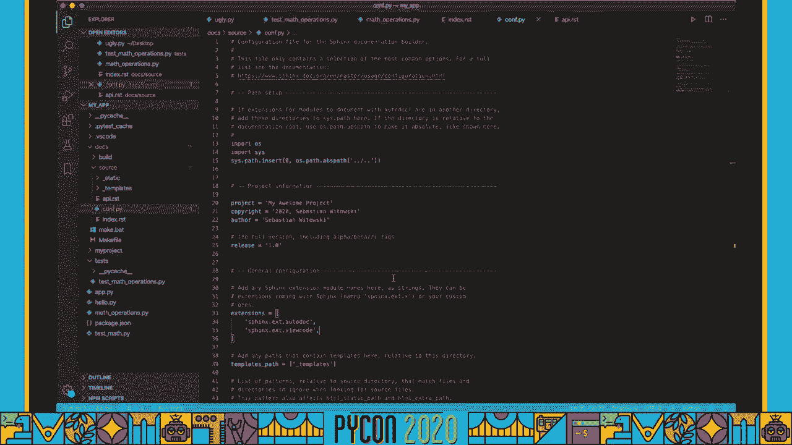

 in your documentation and then finally run make doc test command。
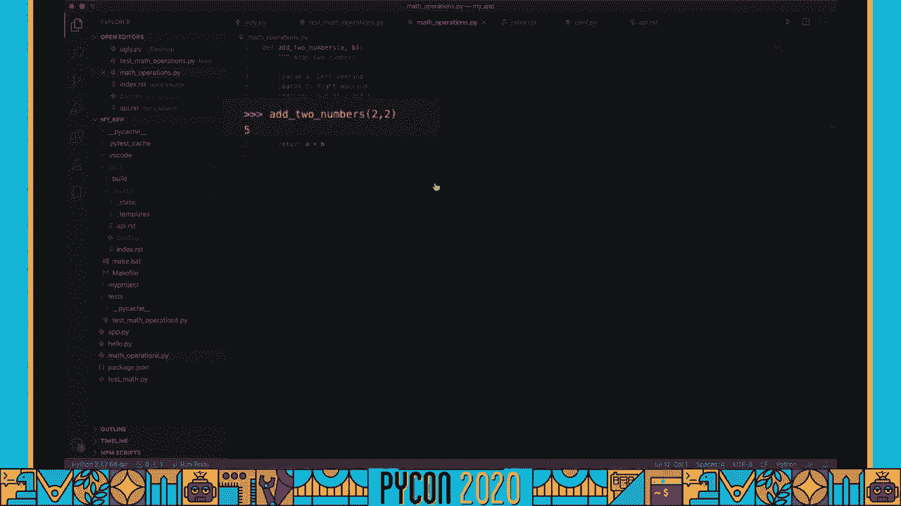

 As you can see the trace back is not as pretty as in Pytest。 You don't have green and red colors but you can see that our test has failed。 I would normally stick to Pytest to run all types of tests but maybe you like it that， way。 And final thing that I want to show you is read the docs。

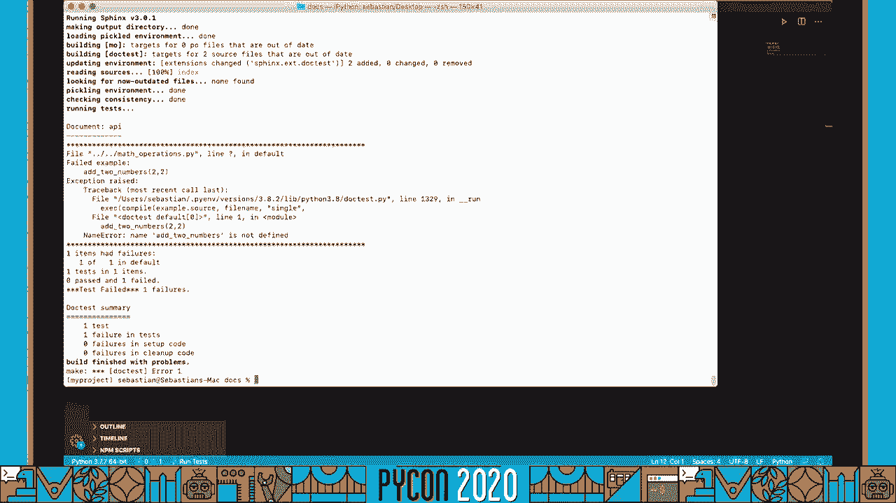

 If you're working on an open source project you can host your documentation for free online。 All you have to do is visit the read the docs website and create an account here。 Once you have an account you will have access to a dashboard where you can connect your。 code repository。 Read the docs will take your Sphinx documentation and put it online。

 Here is an example how it can look like。 So we've learned a lot and now I would like you to put all that new knowledge into action。 Let's write a small to do application where you can use all the tools and ideas that you。 have learned today。 Your to do application should implement the following features。 Show a list of tasks， add a new task， mark it as done and delete a task。

 Apart from just writing the code I would like you to also write some tests， document some。 of the functions and generate documentation with Sphinx。 I would also like you to install Flake 8 in Black and run your code through those tools。 As a bonus point you can configure your VS code to use Flake 8 in Black automatically。

 You can start this project from scratch but I would like you to practice using cookie cutter。 templates。 So I have created a template for you that you can use。 Let me show you how you can start。 And for this exercise I will no longer use a clean Mac OS installation。 I will use my normal work environment so you can see how I'm working。

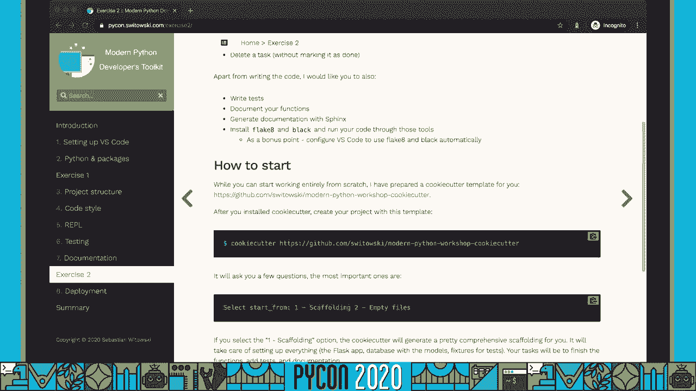

 So let's start our project。 Let's make a folder for our application。 Let's check if I have cookie cutter installed globally。 And yes it's version 1。7 so it should be fine。 So let's create a virtual environment。 I'm using virtual fish so I will be using different commands than I show you and something broke。

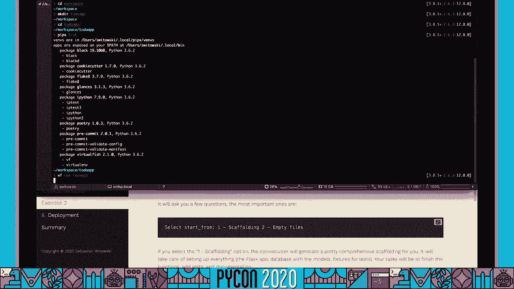

 Well that's interesting。
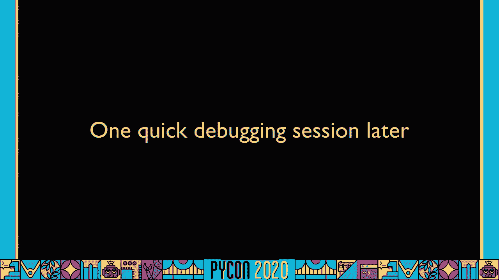

 So it turns out I messed up something when I was switching Python versions and virtual。 fish didn't like the 3。8 so I'm back to Python 3。6。2 and now it should work。 So that's the correct log that you should see not some scary shell errors。 Did I mention how happy I am this is not life-coding and I can actually go and fix some errors。

 and you don't have to stare at me running random commands for half an hour。 We should do this more often。 So we have a folder we have a virtual environment。 Let's run the cookie cutter。 Let me copy this。 I got this message because I already downloaded it。 Let's re-download it。 Cookie cutter is going to ask you a couple of questions。

 Some of them are less important。 Some of them are more。 That's my name so I'm gonna stick to it。 Give name， let's leave it as this。 The description stays the same。 Directory name。 Well let's stay with two。 So here is the important part。 I forgot to mention it so far but I will be using Flask in the simple web application。

 If you select option one， so scaffolding， cookie cutter will generate a pretty comprehensive。 scaffolding for your application。 It will take care of setting up everything。 The Flask app。 the database with the models， pictures for tests and your task will be just， to finish the function。 add tests and the documentation。 If you don't know Flask or if you haven't used it in a long time or if you don't know web。

 development in general， I suggest that you select this option。 It's gonna be easier for you to finish this tutorial but then you can just look around。 and see how I decided to implement it。 If you select option two， so empty files。 cookie cutter will generate files that are， mostly empty with a bunch of to do comments。

 The main reason why I'm generating those files is to enforce some structure。 A simple website in Flask can be written in a single file。 But one of the main points of this exercise is to learn how to split your project into。 separate pieces。 So let's go with option two。 And this option will generate the HTML scaffolding for you。

 I suggest you select the S。 This will generate a simple HTML website with some bootstrap styling。 If you choose now， you will have to write the HTML yourself and this exercise is not。 really about writing HTML。 But it's up to you。 And finally， you can select a license。 This is quite a common question in the cookie cutter templates。 I'm gonna go with one。

 So if we look inside the current folder， you will see that we have a to do folder created。 If we move there， you can see that we have a few files。
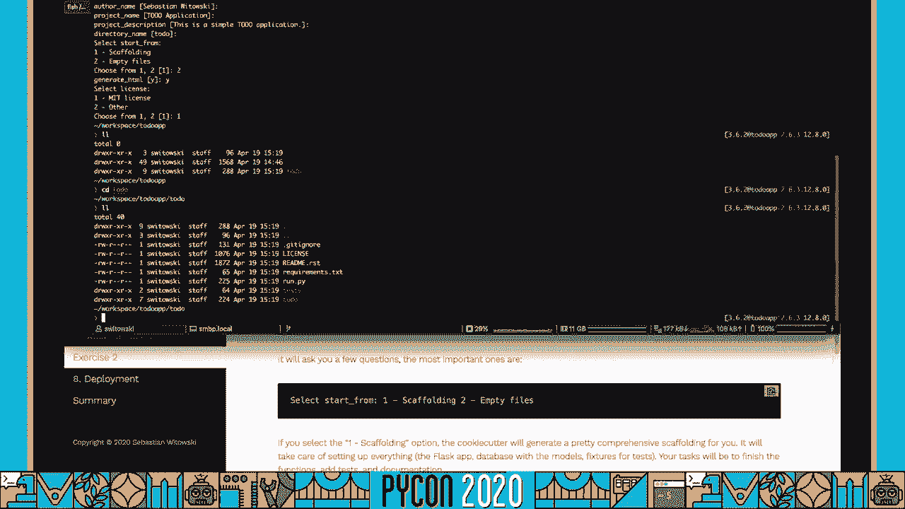

 Let's actually open VS Code here。 In the README file。 you will see all the steps that you need to do to run this application。 We already have a virtual environment， so you can skip the first two steps。 Then inside the requirements。txt， you will see some requirements。 We are using Flask。

 Flask SQL alchemy， Sphinx and Pytest。 So then back to README。 you can see that we have to install requirements first。

 So let's do that。

 And now we can finally try to run our application。 But first。 enable the development mode for auto reloading and more verbal errors。 Keep in mind that you don't want to do this in production。 But for development。 that's a recommended option。 And if we try to start the server， we gonna get an error because run p。

i。 is empty。
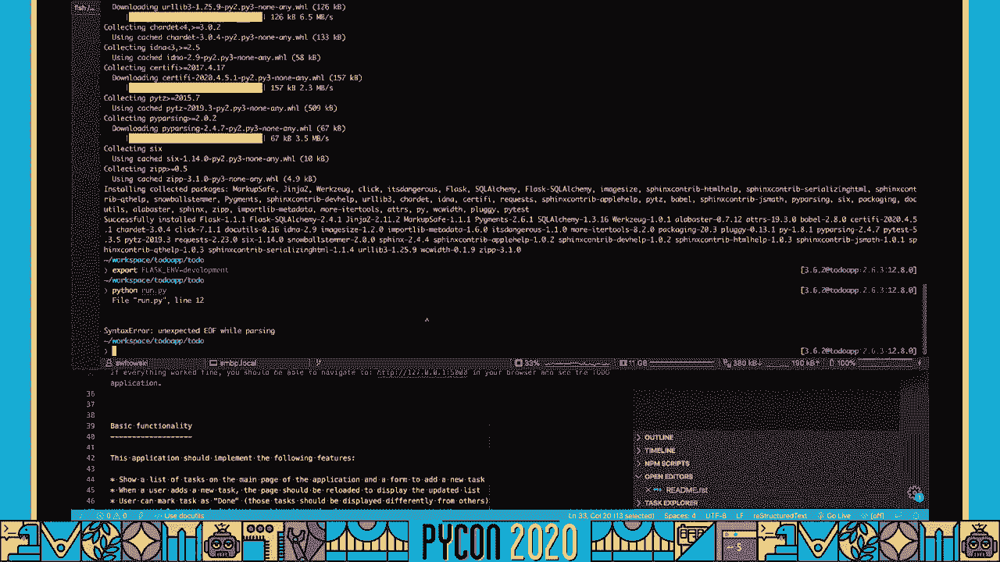

 So here is where you start。 You need to put some code here that will set up everything and run the web server。 And then checking some other files。 You can see that we have Views。 Here you should create some Views and connect them to URLs。 Then we have Models。 Here we should have a database model for our task。 It should contain at least the body。

 so the text of the task。 And Done， which is a Boolean value defining if the task is done or not。 Then we have an API。 So instead of listing， creating。 deleting and finishing tasks inside the View functions。 I would like you to write Views file that will call functions from the API。

 And functions from the API will call functions from the models。 In the templates we have the HTML page for our application。 There is a lot of code。 but most of it is just bootstrap styling。 You can see that our HTML template is expecting a task's list。 And then it will go through each task there and print a task。 This task should have two attributes。

 Done to specify if the task is finished or not。 And the body with the text of the task。 Finally。 we have some URLs that suggest you what URLs the Views should expect。 So we should use done slash task ID to mark task as done and delete to mark task as delete。 Also here we have a form to create a new task。 It will send a payload with the text to slash tasks URL。

 Then we have a test folder for our tests that's currently empty。 And we don't have a test for documentation， so we'll have to generate it with Sphinx。
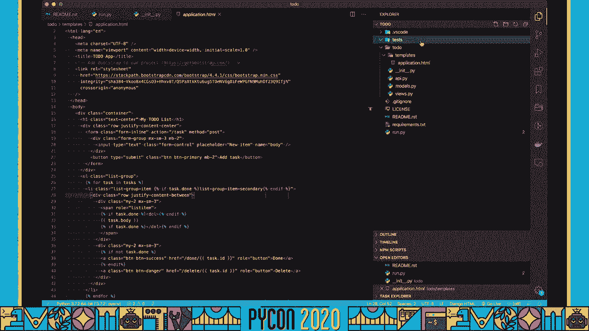

 Okay， so we can pause the video here and try to do this exercise。 If you're starting from scratch。 you can completely ignore my project structure and write it however， you want。 And if you decided to start with the scaffolding and you got stuck somewhere， don't worry。 In a moment， I will show you how to write this project， writing code to match what we。

 already have in the scaffolding。 So please pause the video， try to write it on your own。 If you get stuck and you want to take a look at the final solution， you can go to this， GitHub URL。
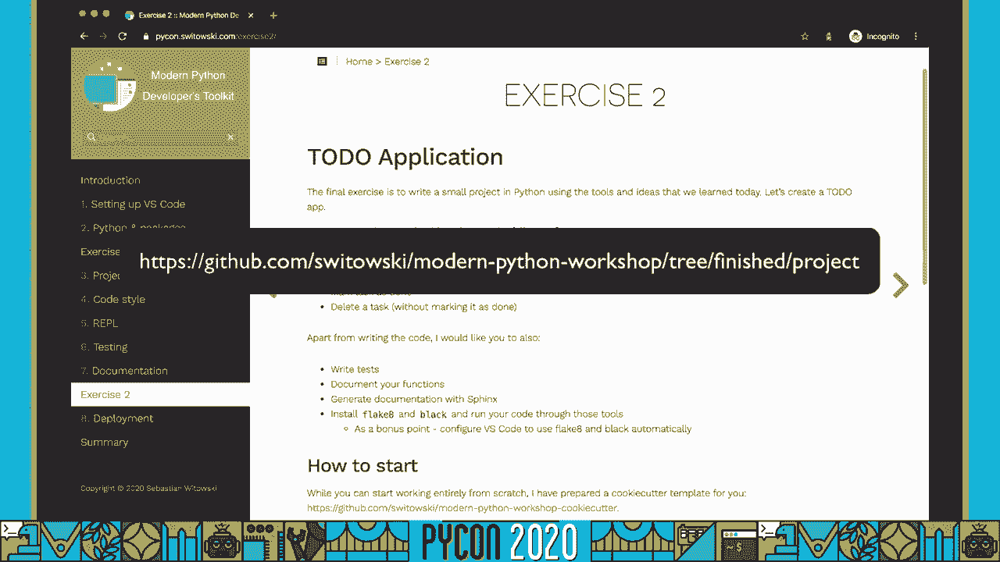

 And in a moment， I will show you how I will write this project。 So let's start with brand PY。
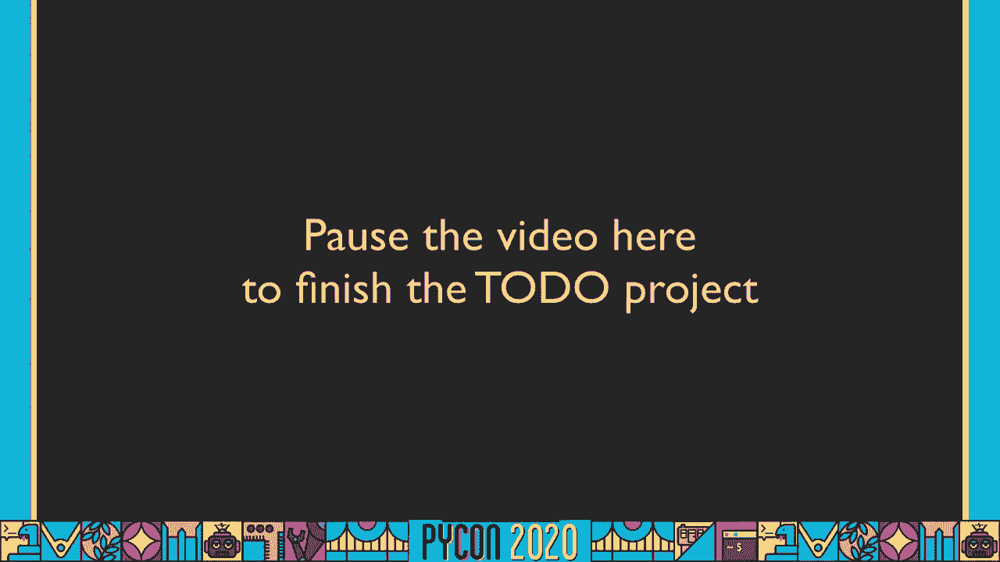

 Here I would import up from my project and simply run it。 So now we actually have to create this up somewhere。 If I go inside my to do directory。 I will use the inid。py file。 In many projects， you will see inid。py empty。 And this is because if there is a folder with the inid。py file， it means that it's a Python。

 package。 And nowadays you don't really have to create this inid。py file because we have implicit。 and explicit namespace packages。 But that's a different story。 Anyway， a nice thing about inid。py is that I can put some code here and then I will be。 able to import this code just like that from to do import some functions instead of doing。

 from to do dot name of the file。 So let's go here。 Let's import flask and let's set up the application。 You can see that my lint there is complaining that it cannot resolve flask。 That's because I'm using the wrong virtual environment。 So let's change that。 And as you can see。

 VS code can actually detect that we have a to do app virtual environment。 So let's use this one。 And now we no longer have this warning because flask is installed inside our virtual environment。 So let's try to run our flask application。 This time I'll actually do this from the VS code。 So let's create a launch。json file。 It's going to be flask path to the application。 In my case。

 this is run py。 And let's see。 That's a huge。
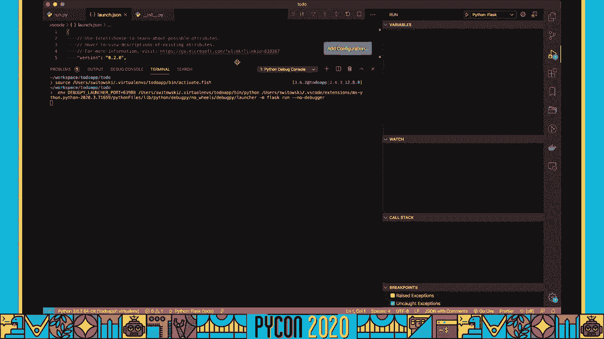

 I know。 Okay， seems to be working if we open it。 Okay， something is happening。 But we get 404。 That's because we don't actually have any URLs in our application。
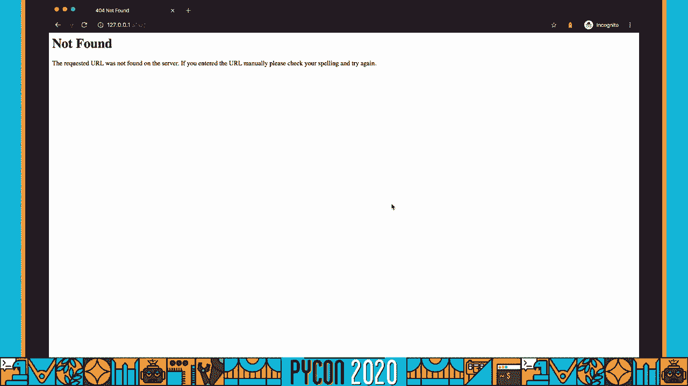

 So let's go back。 Let's stop our server。 No longer need this file。 I want to get some。 Let's actually hide everything because I want to get some real estate on the screen。 So let's go inside the views and let's actually implement home page。 On the main page of the application， we just want to display a list of tasks。

 So let's create a function called task list。 Now， since I don't have a database yet。 I'm just going to initialize a list of tasks as， an empty dictionary。 And now I need to render our application。html template。 We get an error that this name is not defined。 So let's see if we can solve it with the quick fix function from VS code。

 And yeah， that's correct。 This should go here。 This I can remove。 And now we actually need to plug this function to a URL。 And now we actually need to import our app。 This won't be working yet because our to do app doesn't know about the views。 So let's go to ini。py。 And after we initialize our app， we need to import the views。 Well， this looks super bad。

 But if we move our import here， we're going to get into circular import problems。 So it has to stay here。 And as you can see， like it will complain about that。 So we need to put a comment to disable this one error on the current line。 And also I need to tell i sort， which is a tool to sort your imports， that it should。

 leave this import where it is。 Otherwise， it's going to take it and move it to the top of the file。 And that's not good。 In a bigger flask project， you could solve this problem by using an extensions file。 Check out this stack overflow answer to see how you would use one。 But in case of this small project where you have three files， adding another file just。

 to solve this import problem sounds like a bit too much。
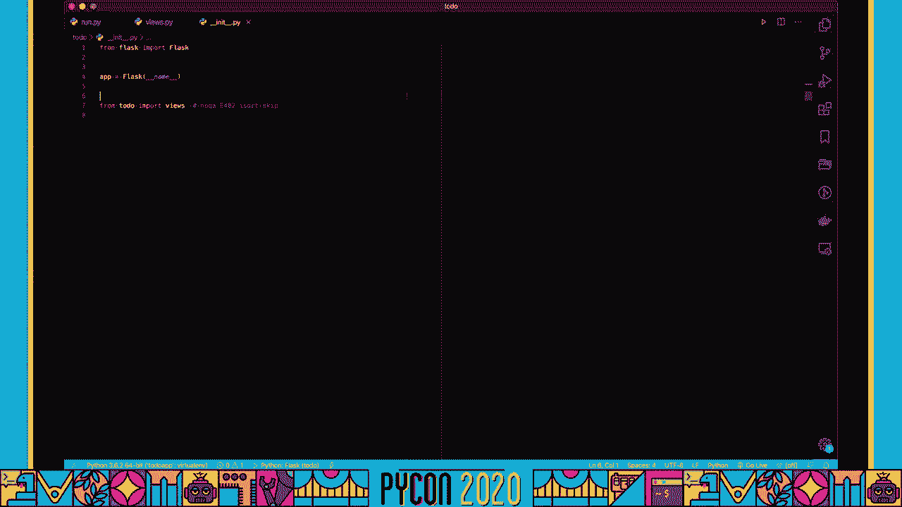

 And it's not always the best solution。 Okay， so let's start our server again。 And as you can see。 we have our beautiful but empty to do list。 We can put something and we get for a form not found because we are still missing some。 URLs。
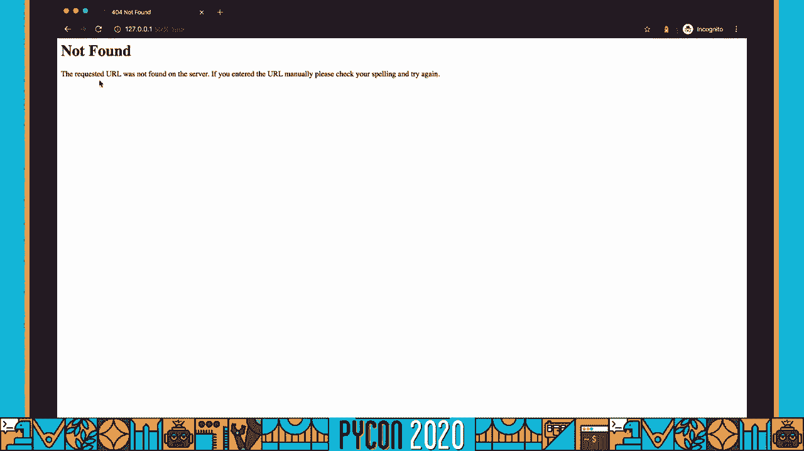

 So let's fix that now。 We want to be able to add tasks to our to do list。 And in order to do that。 we need to actually store them somewhere。 So let's add a database to our application。 Let's go to our init pui and let's set up a database。 I will be using SQLite as our database。 Normally I would suggest you to use a better database like Postgres even on your development。

 machine。 But for the purpose of the simple example， SQLite is perfectly fine。 So next let's go to our models and actually create some models for the database。 Here we are importing the db object from our init pui file。 So we have a table called task that has three columns。 I did to mark tasks as done or delete them。

 Body that contains the text of a task。 And done that is a Boolean field that specifies if the task is done or not。 Let's go to our views and write a function that will let us add new tasks。 So we'll get the body of the task from this part in the form。 And then after we create a task。 we want to redirect the user to the main page。 Well， this is incorrect。

 We want to redirect from flask。 So we also need to get the request from flask。 Nice thing about flask is that the request is global so we can import it wherever we want。 So here we could create a task directly in the database。 But I prefer to have a separate file for the public API of our application。 First。

 it's going to be easier to write the unit test for it。 And if we decide that we want to extract our API， for example to use it with REST API。 it's going to be much easier to do this。 So let's go to our API。py file and create a function to create a task there。 And that should be fine。

 Let's also create a function to list all the tasks。 Okay。 So that should be fine。 Now we go here and we actually want to use our newly created function。 And don't forget to import it。 And here we can actually call our function。 And that should be all。 We also need to add it out here。

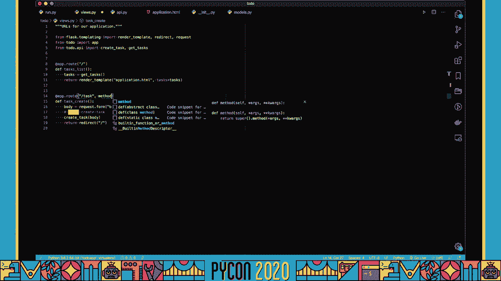

 Now let's run our server。 No， we can't。 We get another cannot import name redirect。 Okay。 That's because it's not in the templating module。 It's in Flask itself。 So we should be good now。 One more try。 Okay。 So it's working， but we get this weird error。 Well， it's not an error。 It's the deprecation warning。 And it even says that you can set a config variable to get rid of this message。

 So let's do that。 Restart server。
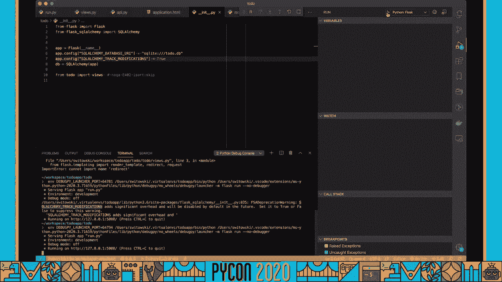

 And we are good。 Let's go to the root of our website。 Something is wrong。
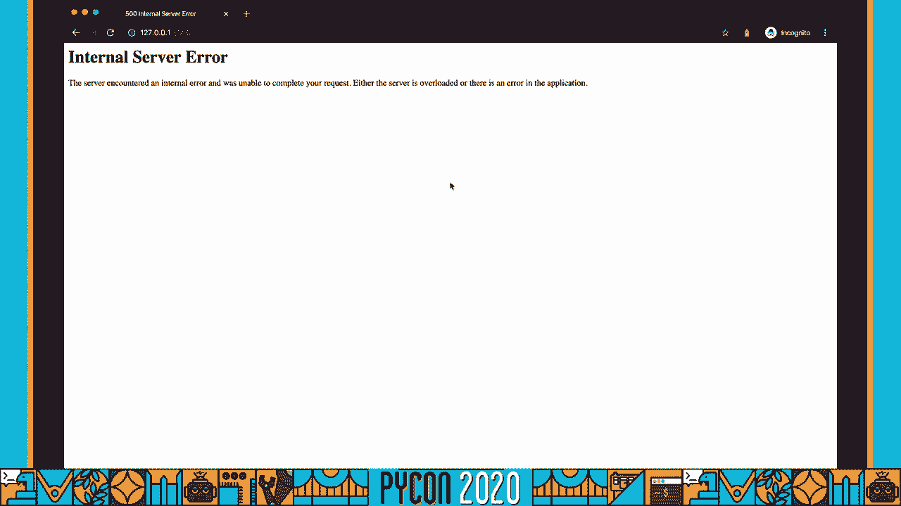

 Ah， yeah。 We forgot to actually create the database。 So to fix that， let's go to our random。py。 Let's import the database and then actually let's drop and recreate the tables。 This will actually drop the table and recreate it each time we restart the server。 For this application， it's perfectly fine。 But normally you would probably want to preserve the database between server restarts。

 So to do this， you could actually check if the database exists， if not created。 So let's run our server again。
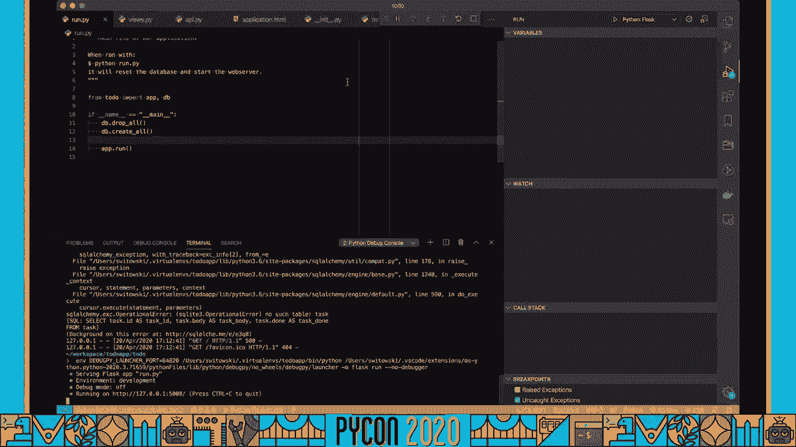

 It's refreshed。 Oh， come on， still something。
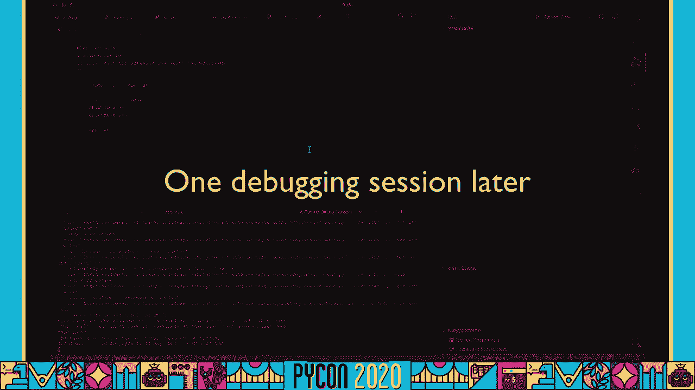

 It turns out that starting our application with the launch JSON file is not actually。 creating the database。 So instead we have to either go to our console and run it like that or just execute the run。 p。y file by pressing this button。
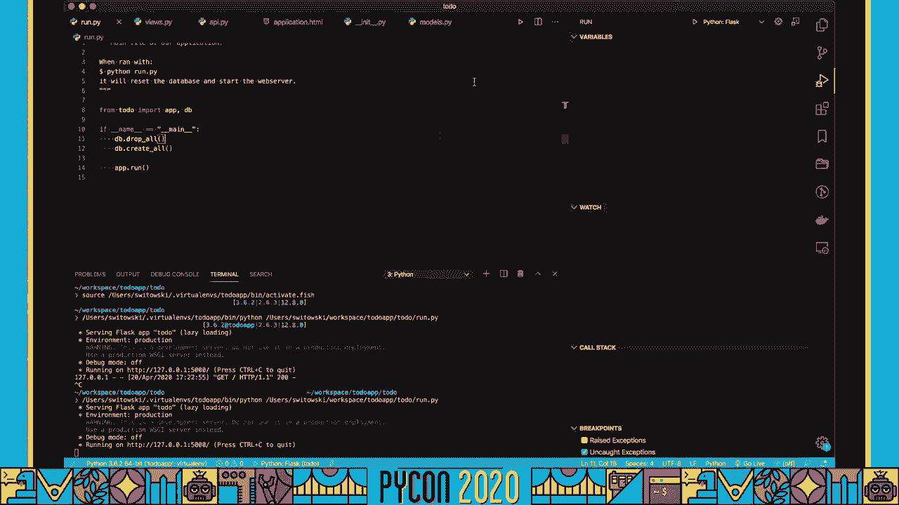

 When we go to to do folder， you will see that now we actually have the to do。db file。
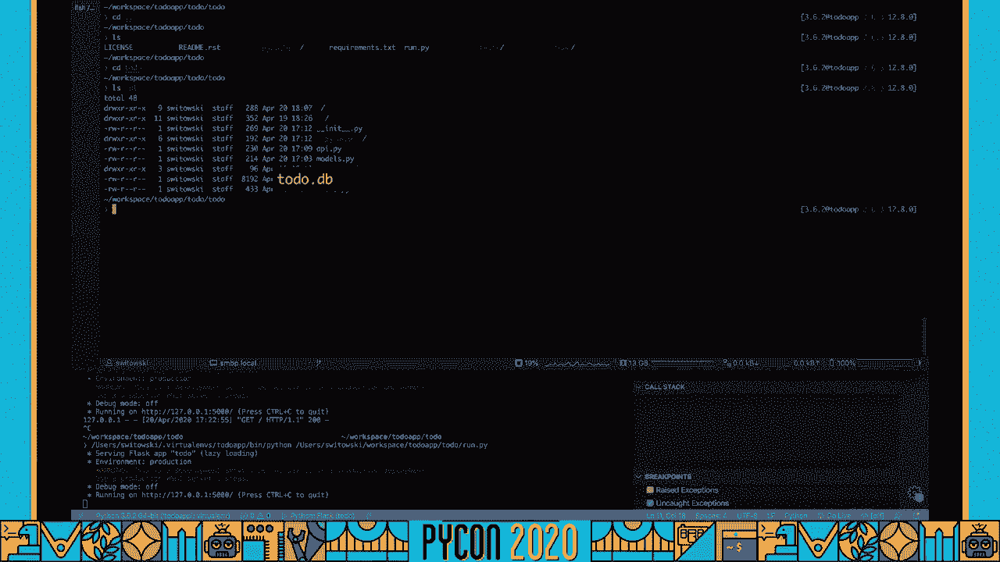

 And if we go to the browser， let's refresh。 We have our to do list and we can actually add tasks。 Perfect。 Now we need to add functions to mark tasks as done and to delete them。
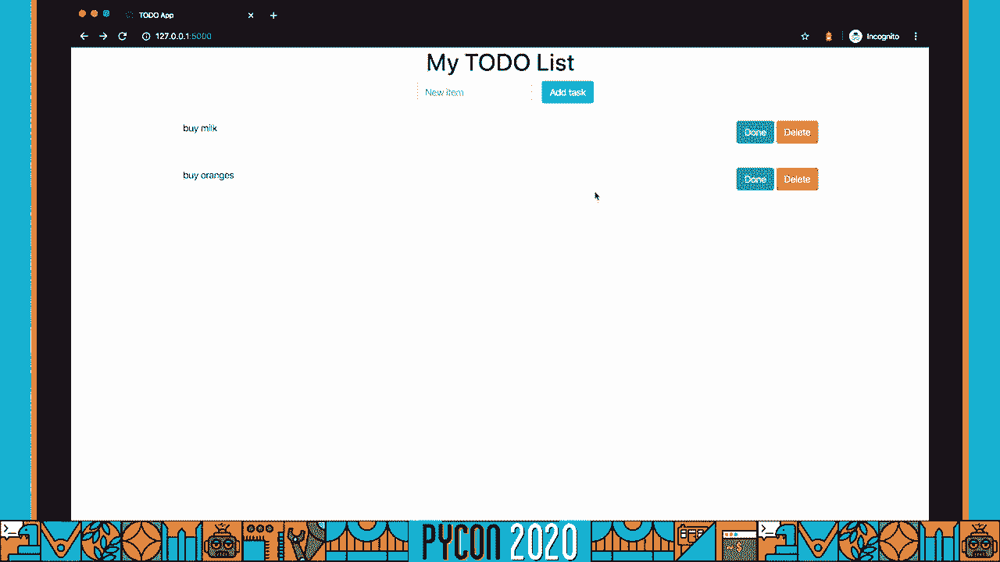

 But first， let's add some tests。 So let's stop the server。 Let's go to our tests directory and let's make a new file test up。py。 So we need two tests。 one for the list of tasks and another for creation of tasks。 [BLANK_AUDIO]， [BLANK_AUDIO]。 First of all， this。 Of course。 And that should be fine。

 The only problem here is that we don't have a database for tests。 We could use the same database as we are using for development， but， that's a terrible practice。 So let's learn how we can create a separate database for our tests。 So here we will create a fake app that will be used in our tests。 So we can actually go to our inid。

py。 I have too many tabs。 And we can copy this。 And let's make some modifications。 We don't want to use this database。 And to save ourselves the hassle of cleaning the database after all the tests。 let's use a database in memory。 If you have a huge test database。 you probably can't put it in the memory。 But since our database is tiny， we can get away with that。

 Also set the app configuration to testing。 Okay， we need to do some imports。 And this is a by test fixture， so we need a special decorator。 So this db。all is not actually needed since we are using a database in memory。 It's gonna be dropped anyway。 But with this simple fixture， you can actually use different types of database。

 So with this fixture， we can go back to our test， and。 we can make sure that it's using this test app。 Okay， so let's try to actually run our test。 Configure tests， by test tests。 Okay， and now we have a magic flask。 And also test discovery failed。 There was an error。 Yeah， okay， so that's the problem。 No module named to do。

 If you get an error like that， make sure that you have init。py file in your test directory。 And this should fix it， otherwise you could run your test with Python minus M pi test。
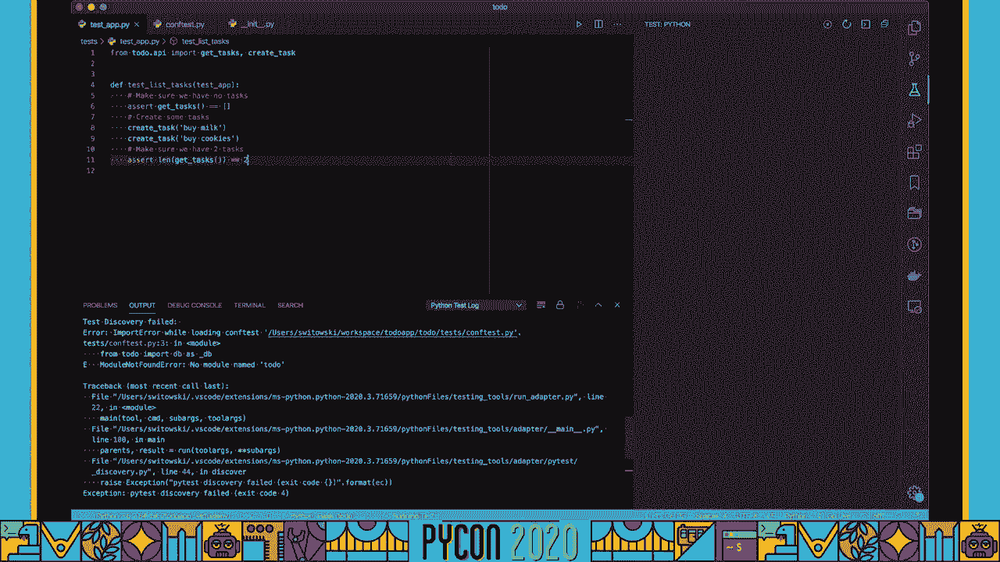

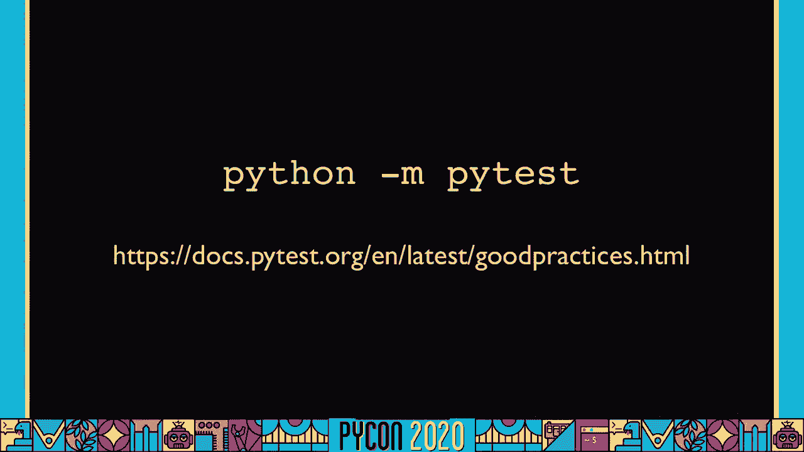

 Now we have it。 We have one test and it's green， so it's passing。 Next， let's test creating a task。 We also need to pass the test up。 Make sure we have one task。 Make sure it has a correct body and it's not done。 And this is not how you check for false。 This is how you check。 Two spaces here， and let's run this test。 Perfect。

 so now we have two tests and both are passing。 Let's move on to marking task as done and deleting it。 And just for a change， let's actually start by writing tests。 Let's start with finishing a task。 To finish a task， we actually have to have a task。 So let's create one。 Let's make sure that we have a task。 This is not actually necessary because we are already testing the get_tasks function before。

 but better saved and sorry。 Let's get our first task。 We need the idea of this task because we'll be finishing tasks based on their IDs。 Now let's call a function finish_task that we don't have yet。 And at the end。 we want to make sure that the done status of our get_milk task is true。

 Now we have to actually go and write the finish_task function。 So let's go to our API。 Okay。 so we have a function。 Let's run the test。 Oh， let's import it。 And let's run our test。 Perfect。 it's passing。 Now we have three tests。 So let's write a test for deleting tasks here。 But before we do that， let's make sure that in our test we are actually fetching the latest。

 version of the task here。 So let's run the get_task again。 That way we are sure that we are not using some cached version that it's not actually done。 And now back to the test delete。 We can actually copy most of the code from the previous task。 and we need to change finish to delete task。 And now make sure we have no tasks。 And again。

 we have to write the delete_task function。 Let's import it。 And let's run our test。 Perfect。 all the tests are passing。 Final step is to actually connect those API functions to the views。 So let's open views， and let's create a function to finish a task。 Let's call it task done。 We will have to accept task ID， and we can get this from the route。

 And now we just have to call finish function on our task。 And redirect back to the main page。 And this is undefined。 Great， so that's a route for finishing a task。 Now let's create another one for deleting the task。 It will look very similar。 so let's copy this code。 Let's import it。 That's it。 Let's start the server， go to the browser。

 and see if it's working。
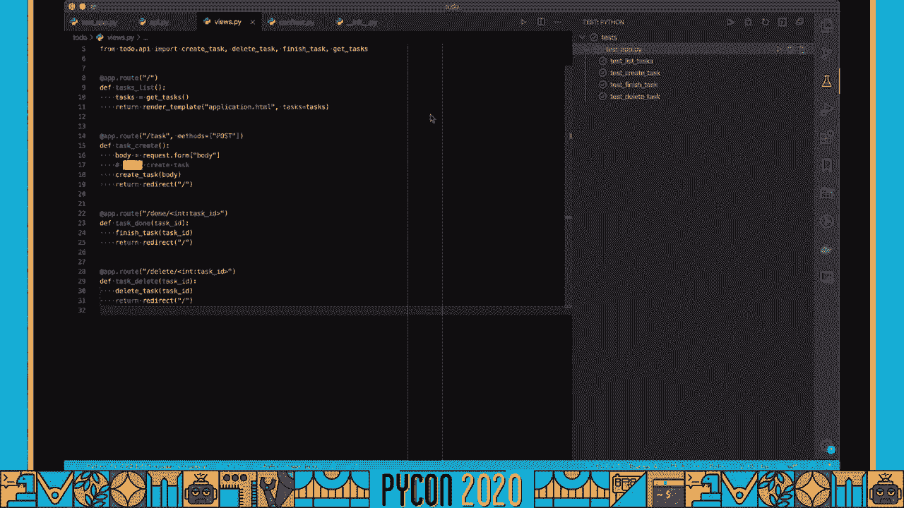

 Let's mark this one as done， and let's delete this task。 Perfect， if we refresh， it's working。 Great， so we have our simple to do application working。 The only missing part is the documentation。
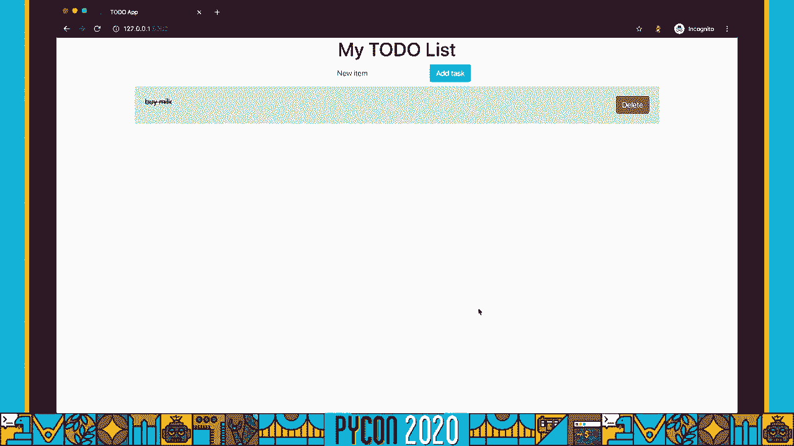

 Start the skeleton of our documentation， with SphinxQuickStart command。 And we're gonna use docs folder。 Let's go inside the docs。 And inside the source。 And let's modify the index RST。
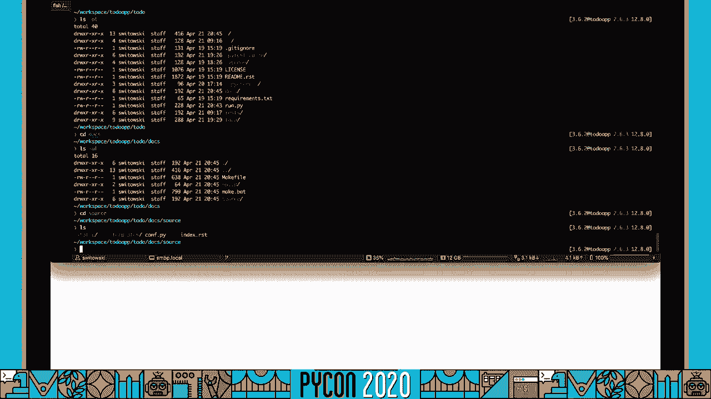

 First let's get rid of this。 And now instead of writing something here by hand。 I would actually be able to import whatever I already have， in the README file。 As you probably noticed， my README is not in the markdown format， but it's in the RST。 And thanks to that， I can actually import it here。 And I want this。

 And I want to have actually two pages。 One with the usage instructions， and one for the API。 And I don't need this。 So now we have to create the usage page。 Let's put a header。 And let's put some information on how you can use it to do up。 Okay。 you can add more information here， but let's say this is enough。 Next。

 we need to create an API file。 And here I want to have documentation for Views， Models， and the API。py file。 So let's call it API reference。 By the way。 those weird underscores is how you create headings in RST。 Let's copy this。 And we are good。 Now to make it actually work， we have to go to cont。py and include some extensions。 But first。

 make sure we have the correct system path。 It's the same trick that I showed you when we talked about Sphinx。 And we need to do this to make sure that Sphinx can import our to-do module。 Now let's go to extensions。 I want the Auto-Daw。 And I want to have links to the source code。 And if you want to test your documentation from Sphinx， you can also put the doc test here。

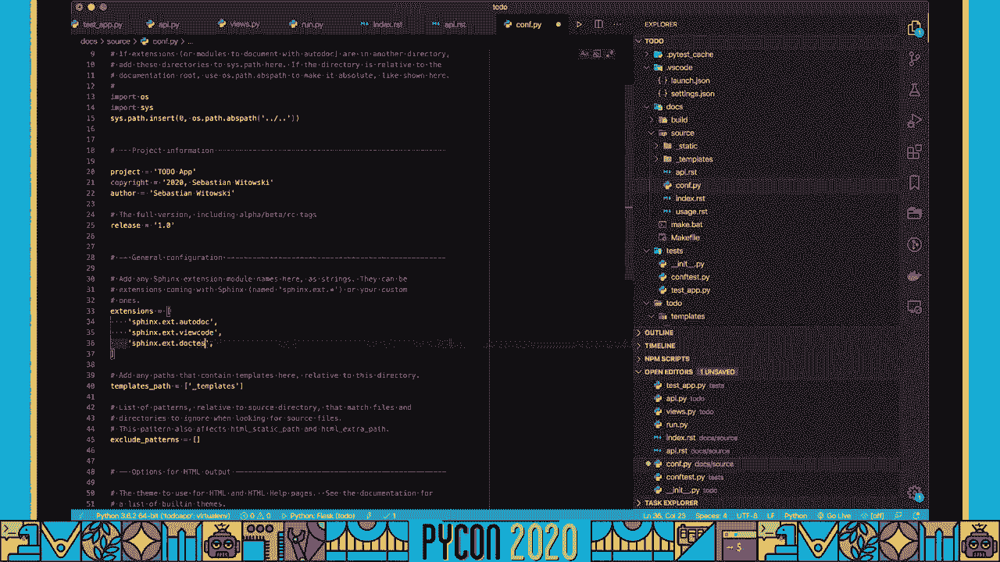

 Okay， we should be good。 Let's generate the HTML。 And let's open the documentation in the browser。
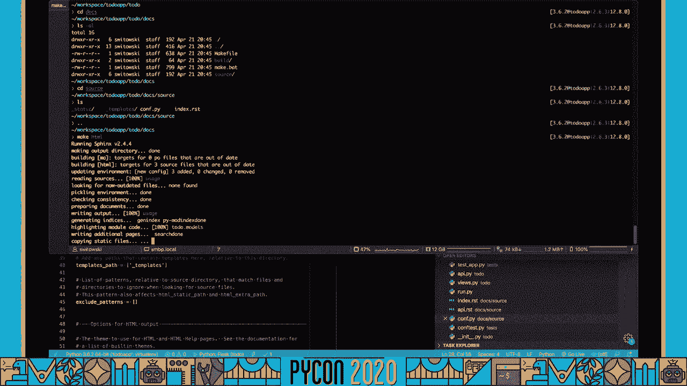

 Great， it's working。 So here you can see we have the ReadMe nicely included。 You can go to the usage that contains our simple instruction。 And then we can go to the API reference。 And since we did it in Boder to document our functions。 it's empty。 So let's fix that。

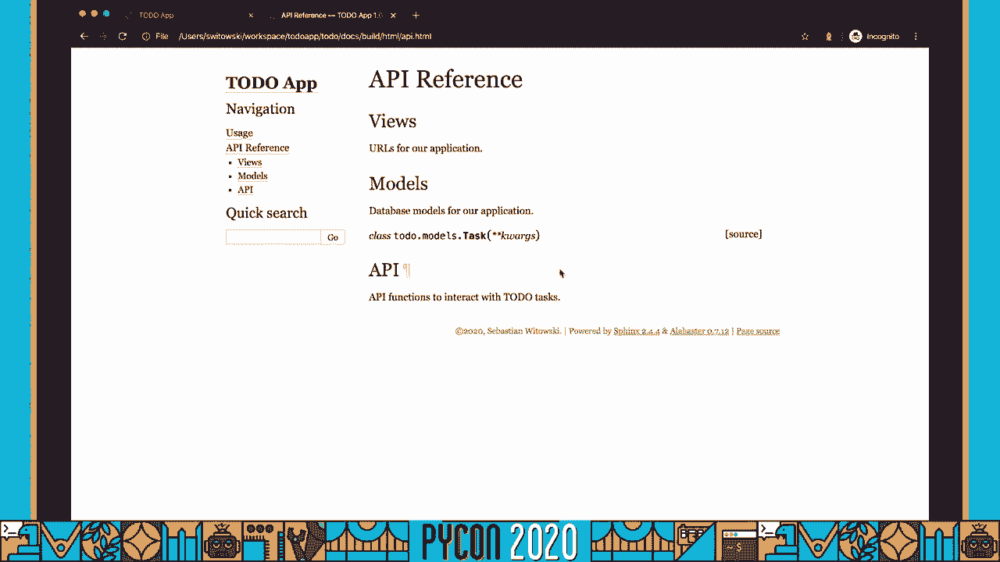

 Let's close some of the tabs。 And let's document some functions from the API。 So here we have a create task function。 We actually have to use the Sphinx format to document the parameters。 So let's get rid of this。 Let's document one more function， maybe finish task。 Let's regenerate the documentation。

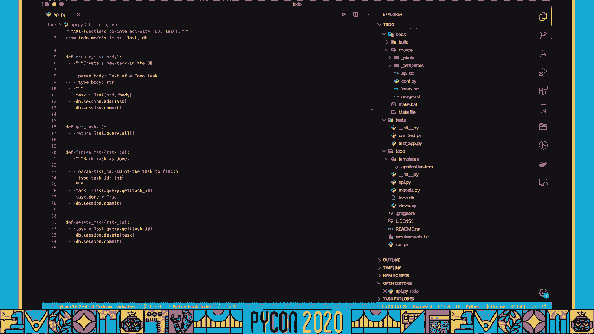

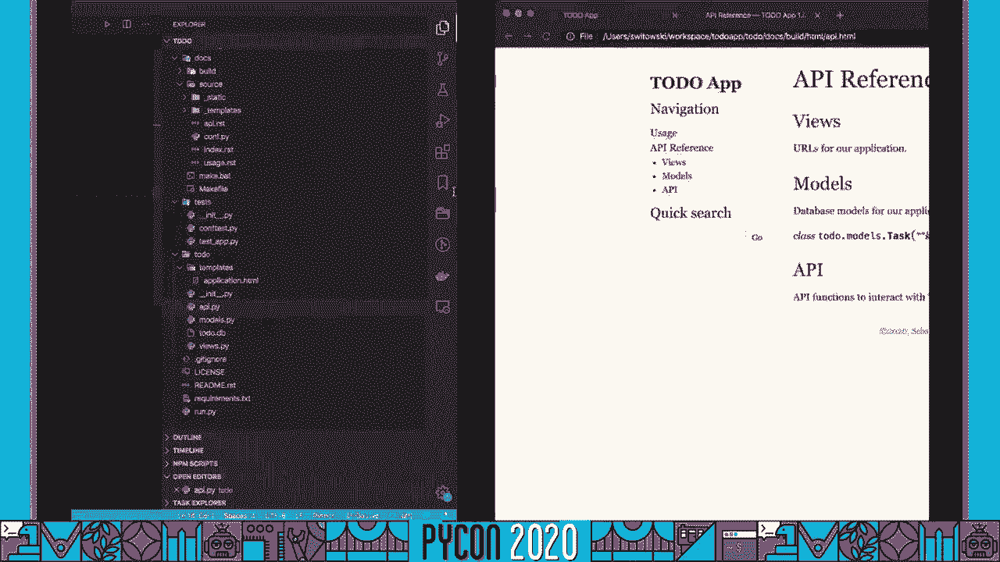

 And let's refresh。 Perfect， we have a much nicer documentation here。 If we click the source。 we can see the body of our functions。 And that's it。 Our simple to do application is done。 It's very basic， but it has some tests。
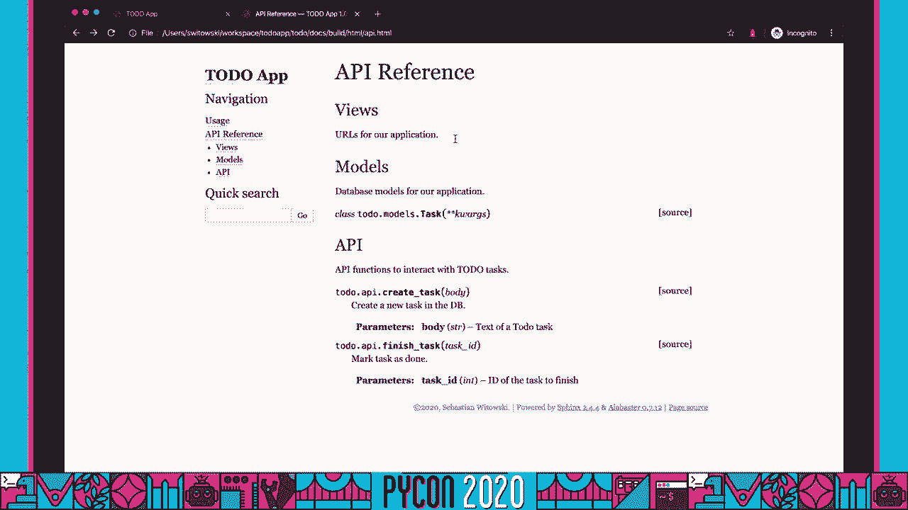

 It has some documentation。 I suggest that you write the rest of the documentation on your own。
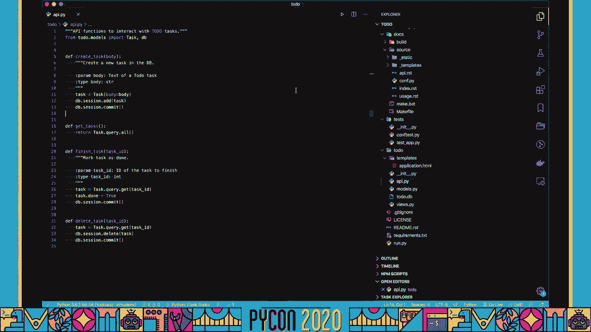

 To see the code for the final version， go to give up to this URL。 Make sure you're on the branch code finished。 And you can find all the code here。 Good job if you got so far。 I hope you learned something。 And I know that this workshop is already running a bit long。

 But I have one more topic to talk about。 And this topic is deployment。 There are many different ways how you can deploy your application。 And Docker is one of the popular ones nowadays。 If you don't know what Docker is。 then my short explanation is probably not going to help you match。 But in an nutshell。

 Docker is a tool for containerizing your application。 Which means that it can create a package called image with the code of your application。 All the dependencies。 So peep packages， but also packages that you install with AppGet。 And with the information on how to run your package。 Then you can send this image to a server。

 And if Docker is installed on that server， with just one command。 you can have your application up and running。 Docker takes away a lot of hassle with deployment。 but it's not an easy tool。 I will show you a very basic example。 But if you want to make sure that your application is secure。

 you should really learn about the advanced features of Docker。 At the beginning。 it can be frustrating because it's yet another tool that you have to learn how to use。 And if your application won't work， then you won't know if it's a problem with your code or if it's a problem with the Docker configuration。 But once you learn it， deploying your application will be much easier。 So in my opinion。

 Docker is worth investing time。 Especially since nowadays it's becoming an essential skill。 Even for software developers， not just for DevOps。 So to dockerize our application。 we need to create a Docker file。 Here's an example of a very basic Docker file that will work。 So let's take this code and use it to create a new Docker file in our to-do application。

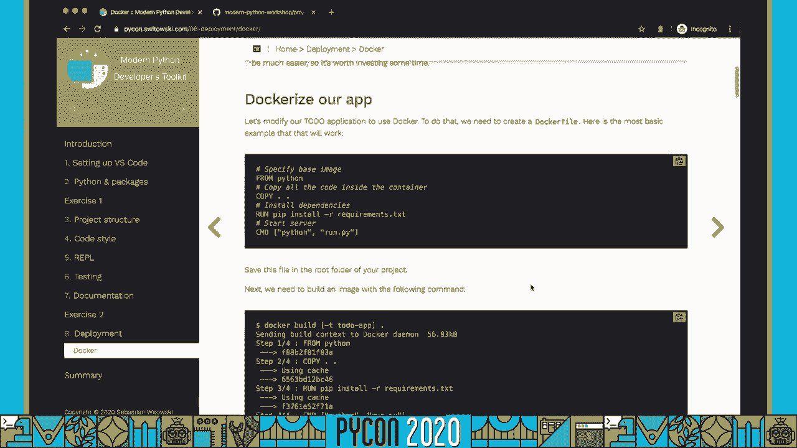

 Next， we need to run a command Docker build。
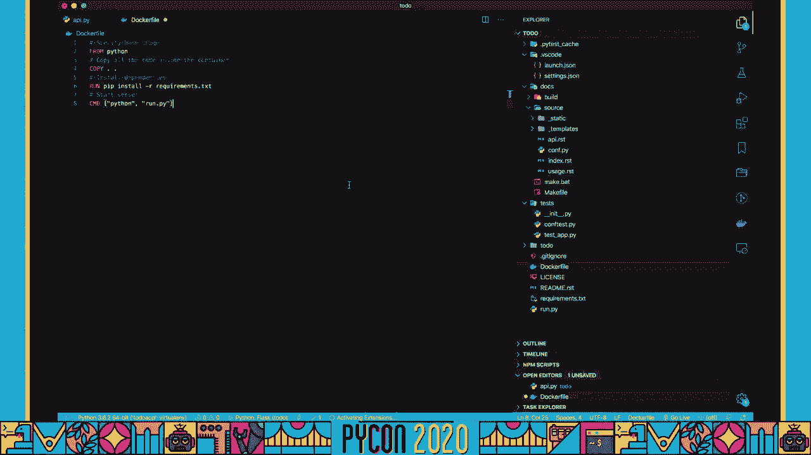

 And optionally we can specify a tag。 And using a tag is usually a good idea because otherwise Docker will assign a completely random name like this one。
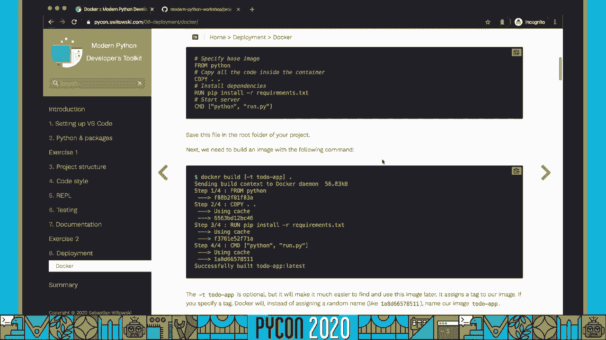

 So let's do this。 Make sure that you are in the same directory where the Docker file is。 and let's run the command。 And， once our image is built， we can start it。
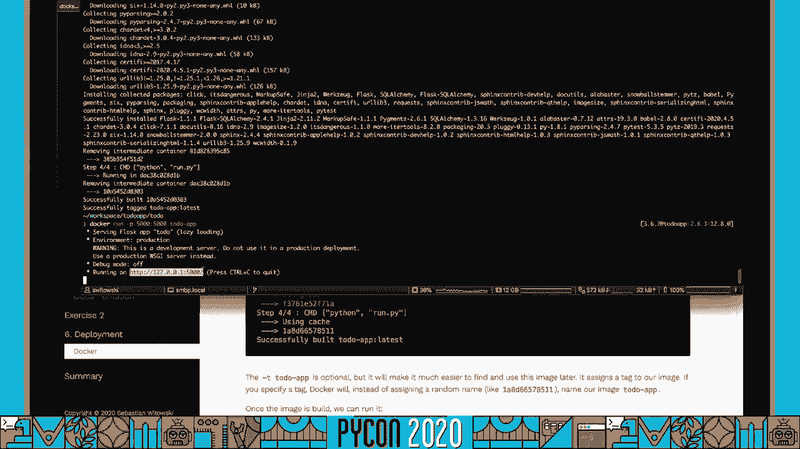

 And if we try to open the URL in the browser， it's not working。
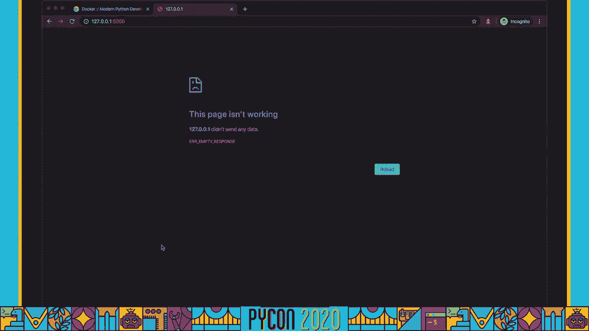

 Well， more debugging for me。 I forgot to make one change to the run。py file。 By default。 the app run command will bind the flask application to the local host。 And in Docker。 local host is not actually exposed， so we have to bind it to host 0。0。0。0。
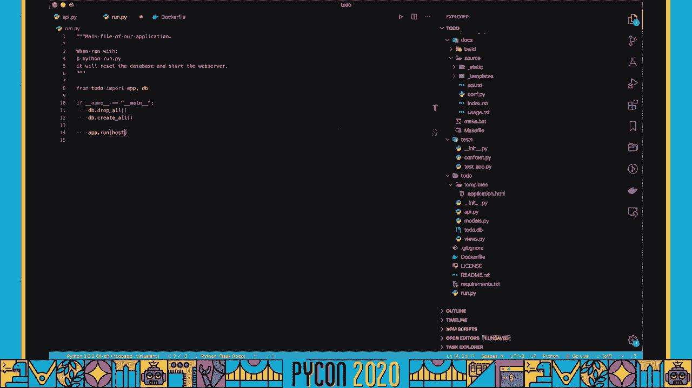

 And that should fix it。 So let's rebuild our Docker image。 As you can see。 it's reinstalling all the packages。 I will tell you in a moment why this is wrong and how we can fix it。 And finally it's done。 So let's start our server。
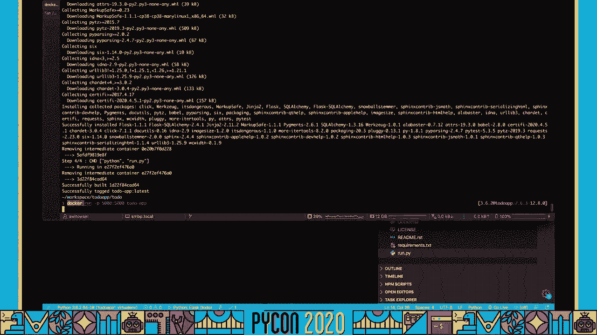

 One more try。 Perfect。 It's working。 And we can add tasks， so the database is there。 We can mark them as done。 And tell it them。
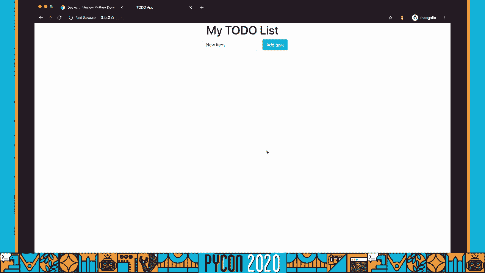

 Now that everything is working， let's talk about why our Docker file is wrong。 First of all。 our application is not ready to be sent to production。 We are still using the SQL Lite database。 And the debugger is enabled。 Well， those two things can be fixed with a proper database like PostgreSQL。 Docker Compose， and Environment Variables。 But even disregarding the problems with our flask application。

 the Docker file that we just， wrote is far from perfect。 Here are some problems。 On the first line we are specifying Python as our base image。 But we are not specifying a tag。 so Docker will pull the latest image。 And at the time of writing， this is 3。8。2。 But then later the latest tag is going to be 3。8。3， 3。9， and so on。

 And if a new version of Python introduces some breaking changes， you will only notice that。 after your application goes down。 So always specify a tag for the base image。 In the second step we copy everything from the current directory into the root of the container。 And this has a few problems。 The main issue is that we are not using caching。

 Docker will cache each step of the build stage。 And each command in the Docker file is a build step。 When you run the Docker build command， Docker will check if it needs to run this step or。 if it can reuse the cache。 For example， if you didn't change the base image。 Docker will use the cached one instead， of redownloading it。

 If you have a command to app get install some packages and you don't modify it at least。 Docker will reuse the cached layer instead of reinstalling all the packages。 And once Docker gets to a step where it can't use the cache， it will rerun this and every。 next command。 So it's very important to understand how caching works and how to take advantage of it。

 If you don't structure your Docker files properly， then the build time is going to take。 you minutes and you will be just waiting there。 In our case we copy all the files and then we run pip install。 Now each time we modify any file in our project， it will invalidate the cache and then the pip。 install will run again， even though we didn't actually add any new packages so it's not needed。

 We could instead copy only the requirements。txt file first， run pip and then copy the rest。 of the files。 This is a very common practice and that way pip install step will only be invalidated when。 the requirements。txt file changes。 So in general you want to put the lines that are installing something on the top of the。 Docker file and put the lines that can change as low in the Docker file as possible。

 If you're using the end of module and you have the end of directory inside the same。 folder as your project， you will notice that each time you try to build a Docker image。 it takes a couple of seconds to actually start。 This is because Docker is sending the current directory to the Docker daemon for the building。 purpose。 And the V and folder is actually quite big comparing to the rest of the files。

 There's a few dozens of megabytes and actually Docker doesn't need this folder at all。 So you could move it somewhere else or you could write a Docker ignore file。 And we are also copying all the files to the root of the container。 Normally it doesn't matter but if you ever need to start a bar session in the container。

 and move around there， it will be a mess to figure out which files belong to your project。 and which belong to the container。 So it's much better to copy your project into a separate directory。 And then we are also not specifying which version of PIP we want to use。 In our case。 it's probably not a big problem。 Python image will make sure that the PIP version it uses。

 it's bug free。 But if you install packages with apt-get， it's a good idea to pin package versions。 So try to always specify which version of software you want to use。 99% of the time you should be fine without pin versions of apt packages， but it might。 save you from 1% of weird bugs。 And it will also help you with cache busting。

 So here we have an example of how to improve our Docker file。 We pin the Python version。 we copy the requirements。txt， we set the work directory for /project， then we run PIP install。 then we copy the rest of the files。 At this stage， most of the time your caching will stop working。 but this is fine because， just copying files and running a Python command is gonna take you milliseconds。

 And finally we run Python run command。 So let's take this improved version of a Docker file。 let's rebuild our image and let's， send it to Docker Hub。
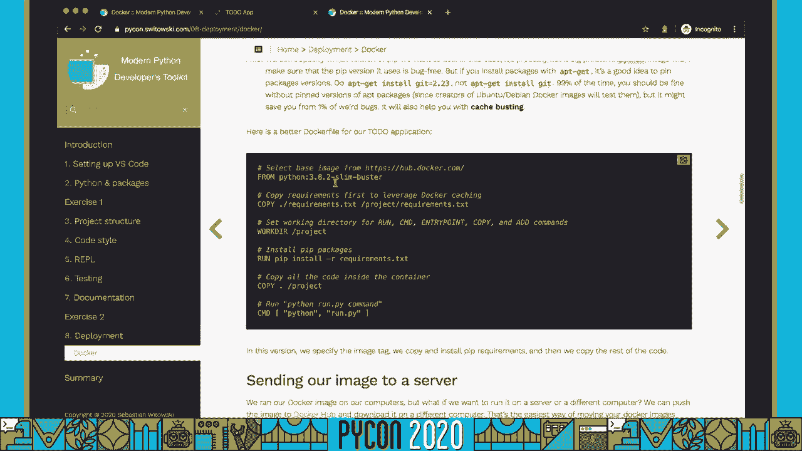

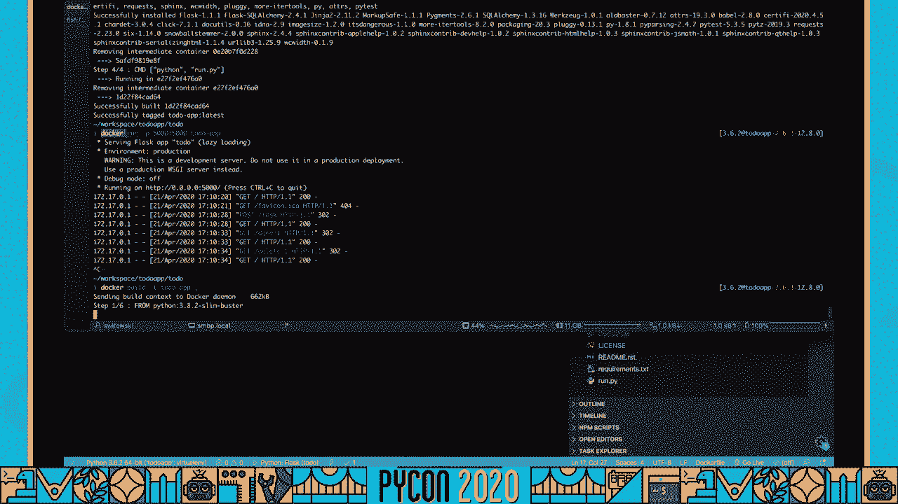

 To follow this last part and use Docker Hub， you first need to register。 Docker Hub is like GitHub but for Docker images。 So first go to this URL。 click sign up and then create an account。
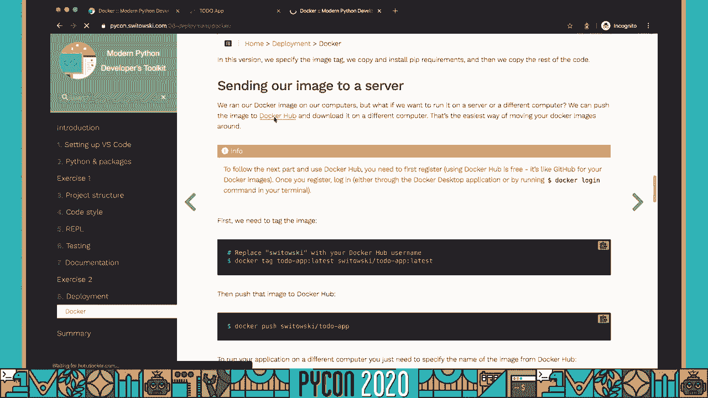

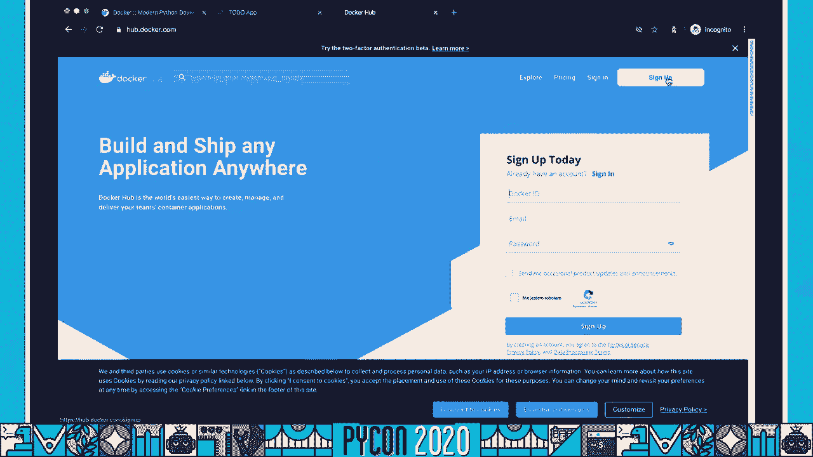

 Once you have an account， you'll have to log in by running Docker log in command in your。
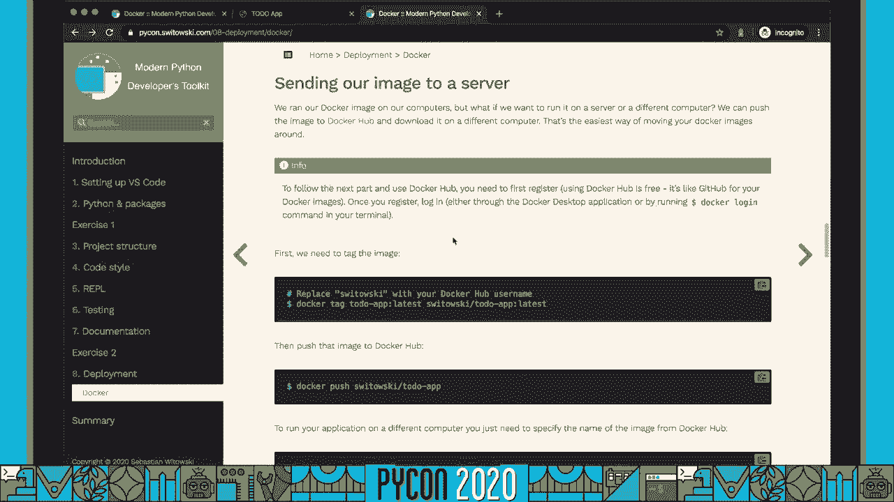

 terminal。 Our image has finished building。 Let's log in to Docker Hub。 Normally it would ask you for a password， since I was already logged in， I don't have to do。
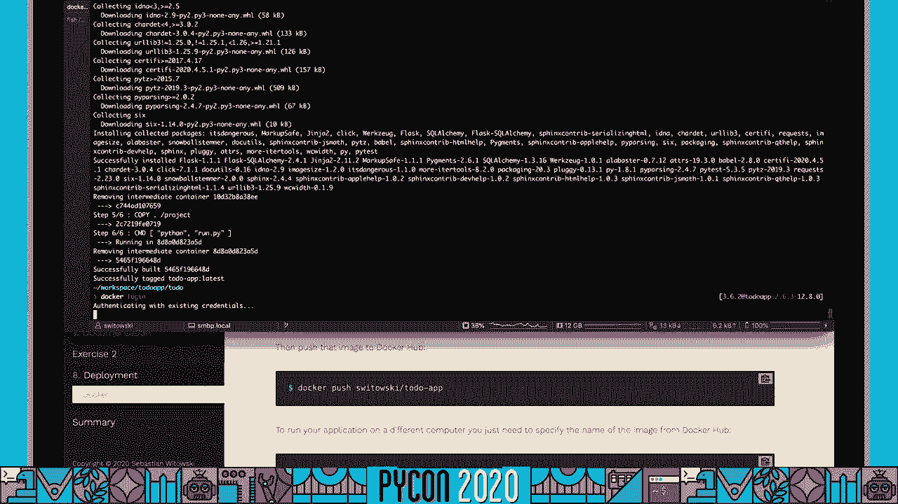

 this。 So first we need to tag our image。 Make sure you replace this part with your Docker Hub username。 Now we push this image to Docker Hub。
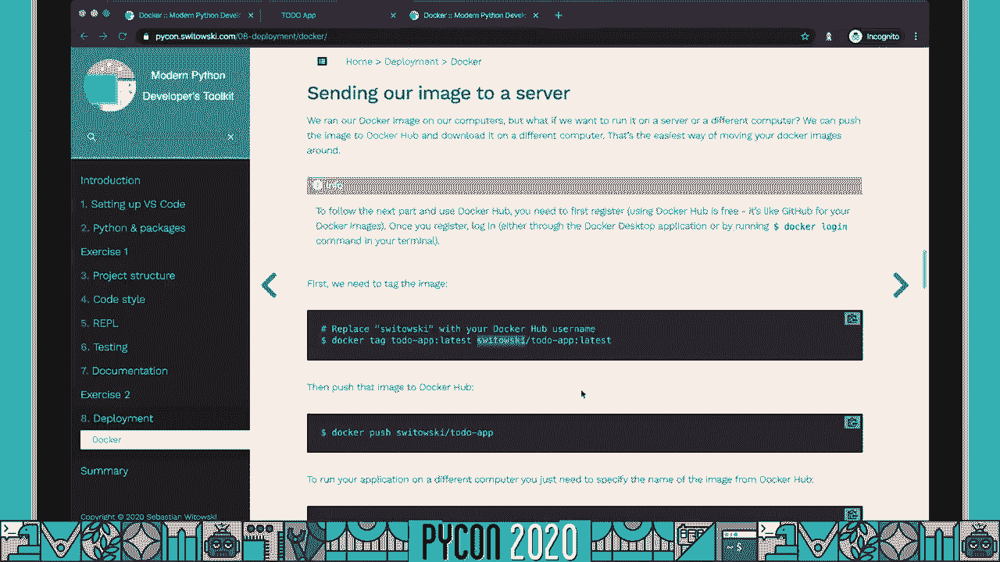

 This is going to take some time。
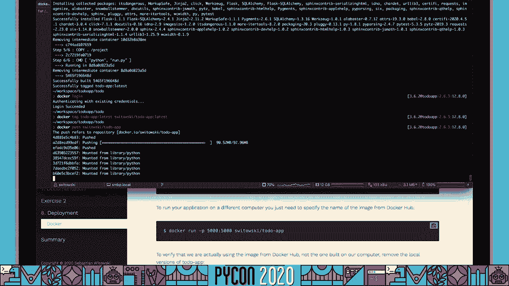

 And now to run your application on a different computer， all you have to do is to specify the。 name of the image from Docker Hub。 So first is your username from Docker Hub and then the name of the image。 If you're doing this step on your computer， you probably want to verify that you're actually。 using the image from Docker Hub， not the one that you build locally。

 So first run this command to list all images and then delete them。
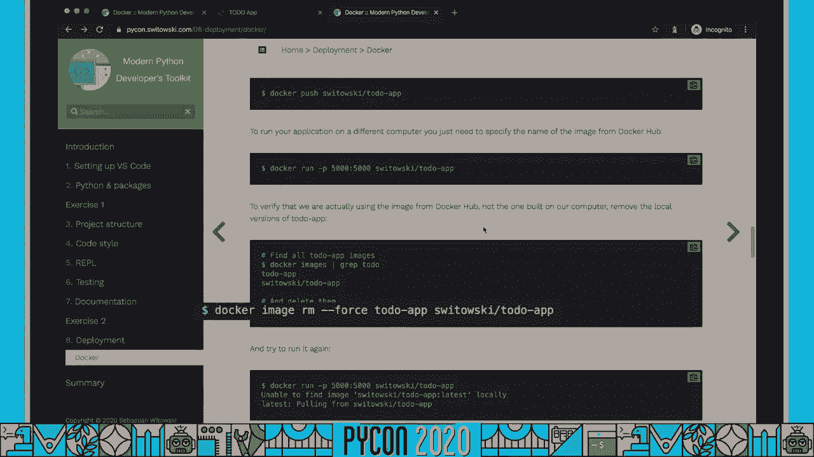

 Now if you do this Docker run command， you will see that it's unable to find image locally。 and it will pull it from Docker Hub。 If you want to test our image on a server。 we could create an AWS or Google Cloud Platform， account。 But that costs money and it takes time to set up。 For our simple application。

 we can use the free Play with Docker Playground。 It's not something that you can use for production。 but it's perfect way to test our to do app。 So let's go here。 You can log in with your Docker Hub credentials。 Once you log in。 you get the start button and this will create Playground session for you。

 It will be active for four hours。 After this time， everything inside this session is destroyed。 but you are free to start another， session。
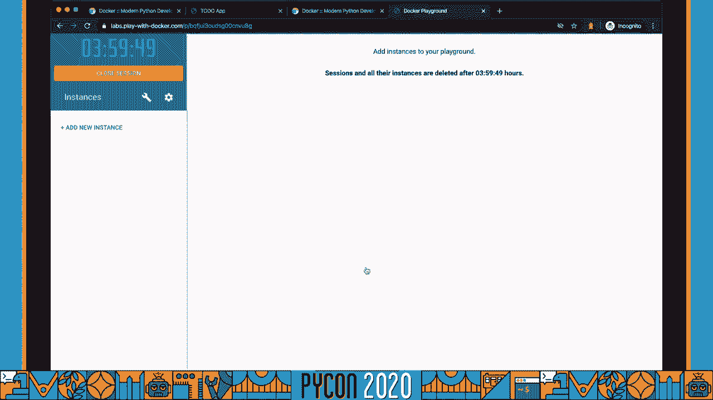

 So we add a new instance。 In the meantime， let's check if our image was pushed to。
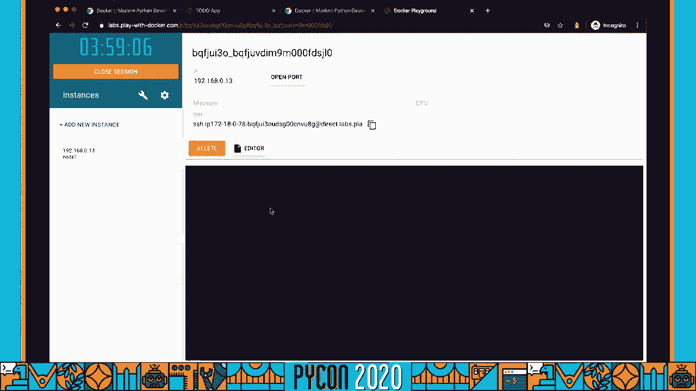

 Yeah。 So our image was pushed to Docker Hub。
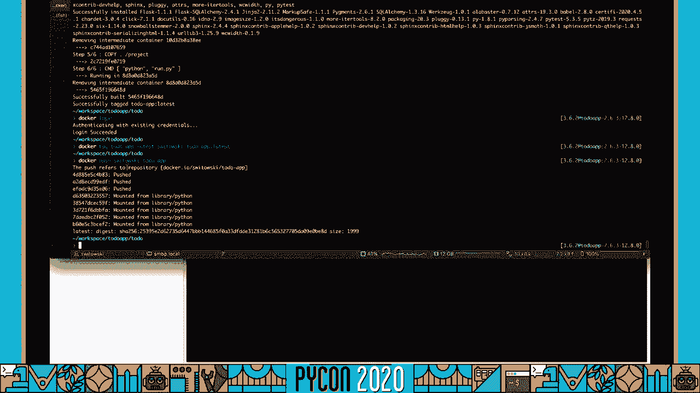

 So now we can actually run the same command that we were running on local host。 As you can see。 it's downloading the image。 And now you will see our app is running on port 5000。 And we actually have this button here that we can click。
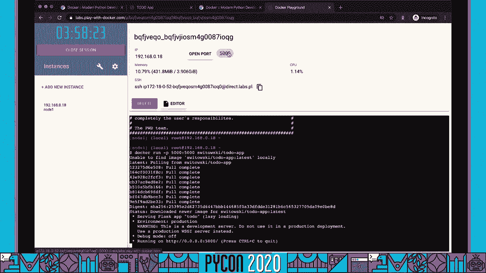

 Ta-da。 So that's your to do application running on a server somewhere。 You can actually take this link and send it to someone and they will be able to see your。 to do list， at least for the next four hours before the session gets destroyed。 Great。 So that was the last part。 There are still some more things that you have to keep in mind with Docker like image sizes。

 multi-stage builds， separate user for the app and things like Docker swarm。 And we only really scratched the surface with the Docker， but I wanted to show you the minimum。 amount of things that you need to know to actually deploy your applications somewhere。 And that concludes this tutorial。 Congratulations。 So we have reached the end of the tutorial。

 I hope you follow the long and you managed to set up everything nicely。 So I showed you how to set up VS code for writing Python。 We learned how to manage different versions of Python and its dependencies and how to structure。 a Python project。 We talked about testing and documentation。

 we built a small to do application and we deployed， it with Docker。 If you got lost somewhere on the way or if you have some questions that I didn't answer。 you can find me on LinkedIn， on Twitter and I also have a contact form on my website。 If you enjoyed this workshop and you would like to learn more， I have a two day long， version of it。

 The first day covers Python tools and best practices in more detail and on the second。 day we talk about deploying stuff。 I hope you enjoyed this tutorial and see you next year at Python or maybe one of the other。 Python conferences around the world。
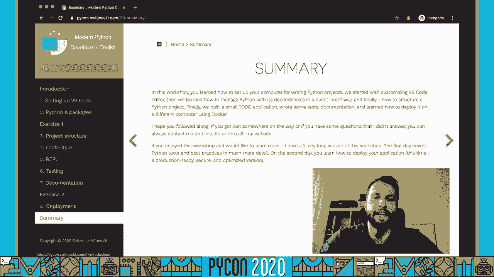

 Take care。 [BLANK_AUDIO]。
