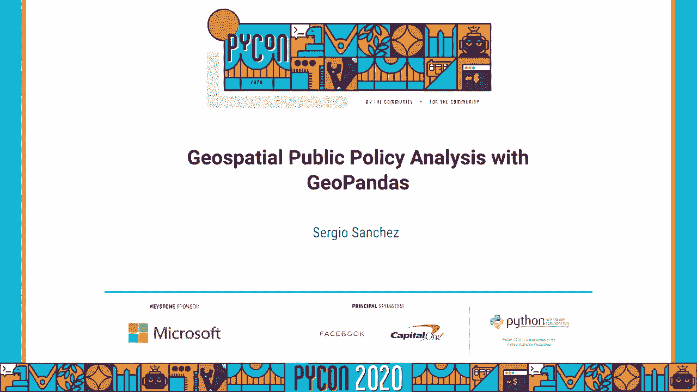
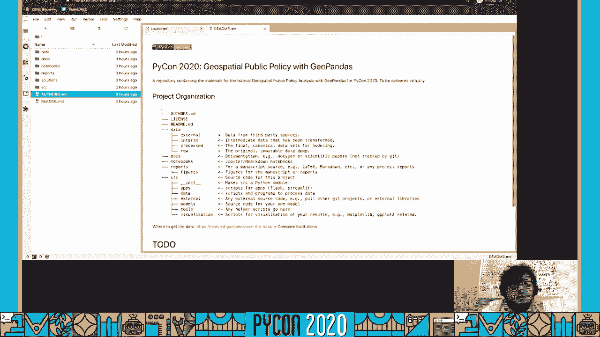
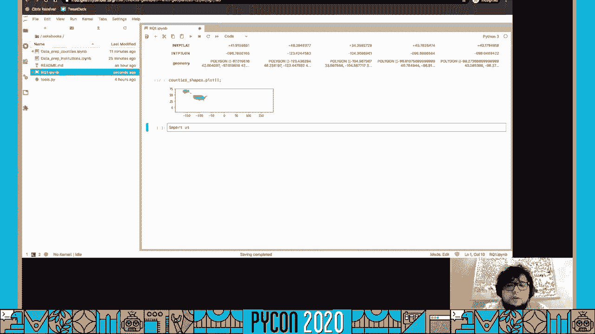
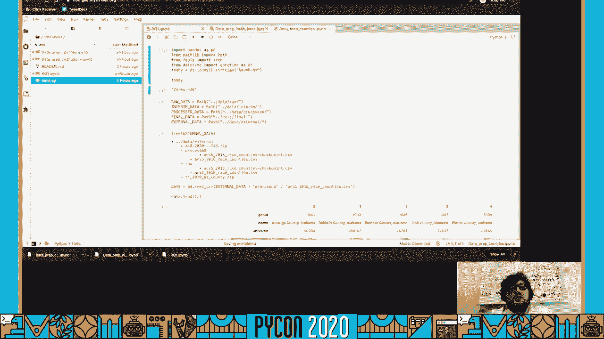
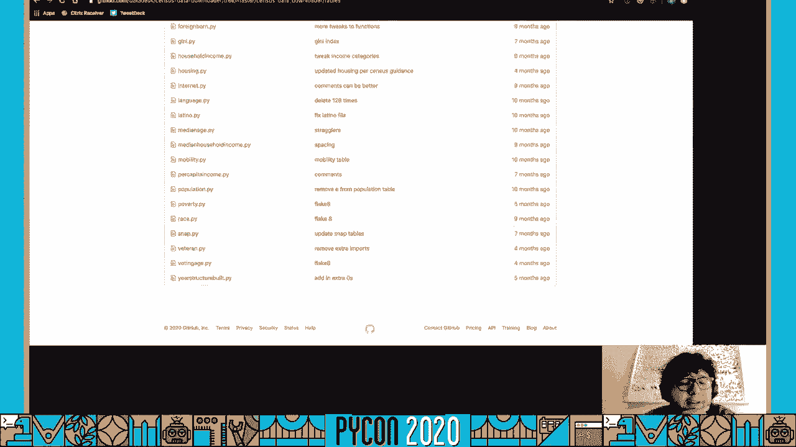
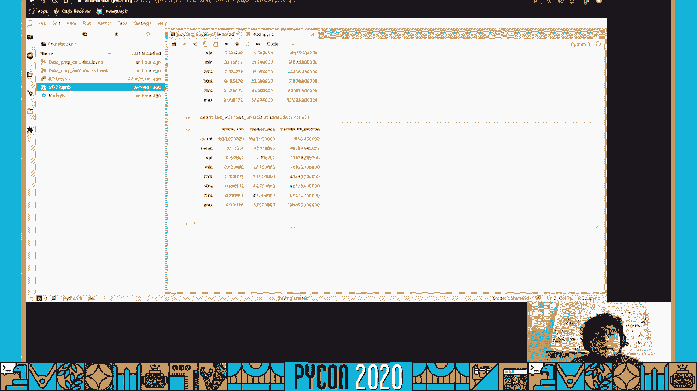
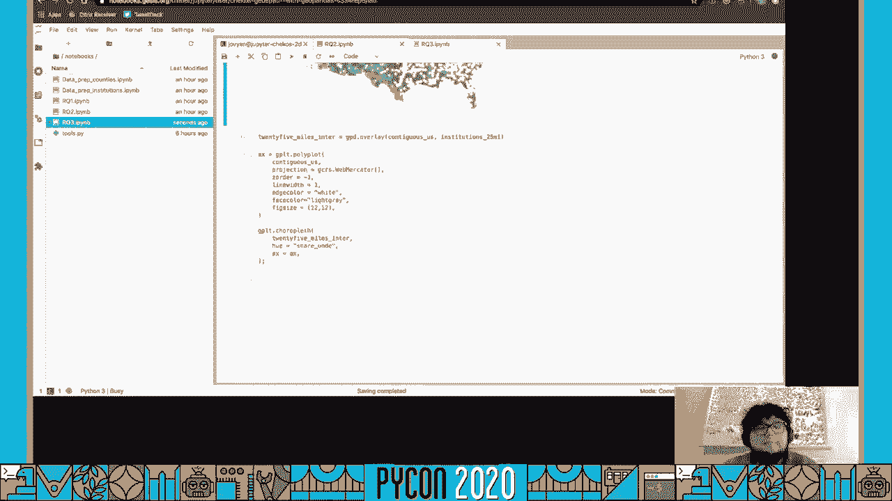
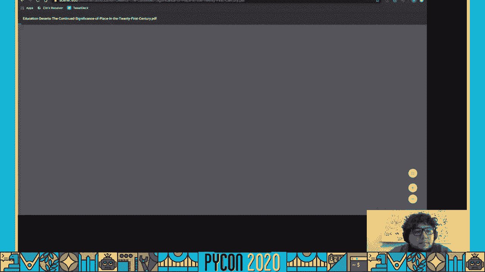

# P88：Tutorial Sergio Sanchez - Geospatial Public Policy Analysis with GeoPandas - 程序员百科书 - BV1rW4y1v7YG

 [BLANK_AUDIO]。

 Hi everyone， my name is Eshisant Savala。

 This is a tutorial for Geospatial Public Policy Analysis with GeoPenders。 I'm gonna have a quick presentation at the beginning， and。 then we're gonna go over some of the tools and the data sources that we'll be using。 for the tutorial。 Then I'm gonna show you how you can access the code and， how you can run the code。

 And then we will get started doing some Geospatial Public Policy Analysis。 All right。 so where my name is Eshisant Savala， like I mentioned。 I'm a research associate。 I was a research associate at the Higher Ed Center at PPIC。 the Public Policy Institute of California when it first admitted the talk。

 I was doing a lot of public policy analysis of California， higher education policy， obviously。 And it focused mostly on developmental education in the community college system， who transfers。 who doesn't transfer to a four year institution。 I was doing some migration policy to an economic mobility。 And now I am a data visualization analyst at Aluma。

 social enterprise in the healthcare and social services space。 I also have this personal project called Tacos Ettos， and， it's a place online。 it's a community online where you can share your best。 practices and kind of knowledge in the field of data analysis and visualization。

 in Spanish so that all this knowledge that we have， all these advancements in tech。 that we keep seeing every day happen， don't stay in the English speaking world only。 Well。 that's the goal， right？ So you can find me on github。com/checkos， C-H-E-K-O-S。 as you can see in the screen。 On Twitter， checkos。wh。 And if you're interested。

 you can follow Tacos Ettos too on github。com/tacos-the-tacos。 So what do I do？

 They were watching the theme of what I try to do in my professional life。 and everything that I do work related。 It's to facilitate knowledge transfer。 How can I get an idea from mine or my colleagues brains into yours？ The fastest way。 the easiest way。 So it's making complex topics easier to understand。

 And I think that's a great thing to do。 And it's fairly obvious how that plays out in a research institute。 right？ We would look at numbers， we would find trends。 we would explain those trends to the legislature， and hopefully they would make an informed decision。 And they would make a much more informed decision after that， right？

 In the data visualization world， it's still more or less how can I make this easy for you to understand。 right？ How can I make， how can I present complex information so that you get that？

 You understand that the fastest way possible。 And in general。 it's just making research more transparent or reducible and accessible。 which I hope this tutorial helps you do。 This has many implications。 but one of the main reasons that I do this is that。

 so that anyone who wants to do this can do it if they want to。 They don't need anything else if they have the will and they have access to a computer and Python。 They should be able to do what you're doing with Python， right？ So because of that。 we'll be using certain tools in this tutorial。 And hopefully you take some of these practices and implement them in your everyday work。

 So what will this tutorial cover？ It's essentially a step-by-step from start to finish。 How would a researcher go about answering a research question that entails some geospatial analysis？

 So we're going to be looking at how I organize my projects in general。 The workflow from start to finish data cleaning， then doing this and doing this and doing this。 And how do you use pandas and geo pandas for this type of analysis。 which is probably what most people are here for。 What can you do with geo pandas？

 Panda sounds awesome。 Adding geography to it。 That sounds cool。 What can we do with that？

 So we'll be going over that。 And more specifically， too。 we're going to learn how to manipulate geographies and shapes， shape files using geo pandas。 Who is this tutorial for？ Beginners will be using my binder。 so you don't even need to install anything。 There is some expectation of Python knowledge。

 I'm not going to teach you Python from scratch。 We'll be using Jupyter。 We'll be using pandas and geo pandas。 So if you have had some experience with it。 it's obviously going to be a big advantage。 But we're not going to be touching on complex or more advanced topics。 I don't think we even do-- we won't even write any functions。

 It's going to be very much scripting step by step。 First， you do this。 Then you do this。 So beginners， people just getting started should be able to follow。 If not。 I'll be happy to help you out。 And you can go on GitHub for the repository， submit an issue。 or reach out on Twitter。 And we'll set up a way to answer any questions that you have。

 If you want to learn a bit more about pandas before this tutorial， you can go to my other。 tutorial that I did last year at PyCon。 2019 is on GitHub under github。com/checkos/analyzingcensusdata。 It's a tutorial on analyzing census data with pandas。 That one goes more into detail step by step what can pandas do。 So it'll be very helpful。

 The link for YouTube is on it too。 And I'm sure you can just Google it。 So what tools will we be using？ We're going to be using JupyterLab for analysis。 This is where we're going to have all our Jupyter notebooks and the work。 And just everything is going to be in JupyterLab。 We're going to be using obviously geopandas and pandas to manipulate data。

 This helps you analyze data， geopandas plus the ability to manipulate geographies and。 to implement geographies in your data analysis。 We're going to be using geoplot which is if you've heard of seaborn which makes maplet。 visualizations kind of like pretty by default， that's what geoplot is for maps。 It's kind of seaborn for maps。 And we will be using command line interface。

 command line tool by the LA Times data desk。 It's called census data downloader。 And this is just going to be so that we can automate。 It just facilitates us getting the data into our computer。 And it's good practice。 It's a really cool tool。 The LA Times is doing some really cool things。

 You should check them out if you're interested in this type of stuff。 So what data sources we'll be using？ We're going to be using iPads which is from the National Center of Education Statistics。 is the integrated post secondary education data system。 Integrated。 I don't think anyone knows what iPads stands for but everyone in the education space， research。

 space knows iPads。 And we'll go on the browser and check explore more about it in a bit。 We're also going to be using American Community Survey data from the census。 That's the yearly survey。 The census conducts。 That's what the census data downloader tool is for。 And we're also going to be using Tiger shape files by the census。

 These are the "official" shape files that the census provides for us。 Next。 So what questions will we be answering？ Like I mentioned at the beginning。 we're going to be going step by step how would a， researcher go about answering a question that has a geospatial component？

 So what are those questions？ They have essentially three questions。 Two main questions plus the map。 The first main question， the first research question is how many higher education institutions。 are found in counties with majority underrepresented groups？ So these are groups。 these are black and Latino folks， Native Americans， places who have been。

 historically underrepresented in higher education。 So how many higher education institutions are there in these counties that are majority。 underrepresented？ Right？ And what are the characteristics of those institutions？

 Do they vary from institutions in more affluent or more on those other counties？

 Second main question， are there any counties that don't have any higher education institutions？

 These educational deserts， education deserts。 Do you find yourself in a county that doesn't have any higher education institutions？

 What if you wanted to go to a higher education institution， you'd have to leave。 Or maybe you don't even think about going to a higher education institution since there's。 none around you， you haven't seen one， et cetera， et cetera。 These are obviously assumptions。 but are there any education deserts here in the United， States？

 And what are some of the demographic characteristics of those counties？

 So if there's no higher education institutions in that county， how is this county different。 from other counties in the United States？ And what we're using county is an arbitrary geographical level。 We could go up to a state， but obviously every state has higher education institutions。 We could go down to a census tract， which is a very small unit。

 But then you lose some of the demographic data that goes with it because that's not publicly。 available at that granular level。 And then we're going to make some maps。 So what parts of the country are left out if you create a 10， a 25， 50-mile radius around。 higher education institutions？ There's some research here in California that shows that most people。

 the typical student， goes to a high one day go to college。 If it's a state school。 I think around 25 miles， if it's a UC because this was in California， it's 50 miles。 that's the average， the median distance between the college and the home， of the student。 And if it's a community college， they don't go further than 10 miles， mostly。

 So those are the questions we'll be using and we're going to be creating some maps along， the way。 And with that， let's get started on going over the tools and the data sources that I mentioned。 So this is the NCES website， it's nces。ed。gov/ipids。 This is what we're going to be using for our data。 As you can see。

 it's the primary source of information on US college and universities。 If we go here。 give me a second， sorry， we go join in。 What we're going to be using is， not joining， sorry， my bad。 use the data。 We're going to be using this tool。 This has already been downloaded for you and I cleaned it up a little bit because the variable。 title， the column names are horrible。 But as you can see。

 you can create groups and you can look up institutions by whether， they grant a degree。 what sector they found， what are the public or the private。 Are they in a specific state？

 And for each institution， you can find a lot of information。 You can find how many people go there。 full enrollment， how many people stay throughout， the year， what degrees。 how many degrees do they give out， what are the graduation rates， what's the average price。 sort of financial aid。 It's a lot of information， it's really interesting if you're interested in that type of information。

 We're also going to be using the census data。 We're using American Community Survey data through the Census Data Downloader tool。 But you can also go to data。census。gov and look up information。 They have tables for everyone and they have a lot of information。 So check it out if you're interested in census data。 Pretty cool if you ask me。

 We're going to be using Jipit or Lab， like I mentioned。 If you haven't heard about it。 it's a web based interactive development environment for， Jipit and notebooks。 You have code and data and rich text in the same file， which is pretty cool。 We're going to be using MyBinder to run our code。 So that you don't have to install anything。

 It's all going to be in your browser。 I'll show you this later。 You're going to have the GitHub repository and the link。 And all it does。 all this does is spin up an instance of Jipit or Lab on your browser。 with all the dependencies already installed。 We're going to be using Pandas obviously for data analysis。

 We're going to be using Geopandas for the geospatial analysis aspect of our research。 To make working with geospatial data and play them easier。 That's where we're looking for。 This Geopandas is what allows you to read in ship files and geometries into a data from。 like your wood with a regular CSV for example。 We're going to be using Geoplock for maps for geospatial data visualization。

 It's a high level geospatial planning library。 It's an extension of cartopi and map。lib which makes map easy like seaboard for geospatial。 It just makes everything a little bit easier。 Map， make it a little bit easier。 And like I mentioned。 we're going to be using the Census Data Downloader tool by the LA Times。

 What this does is it allows you to create， to run this from your terminal。 Census Data Downloader。 give me the median age for all the states or median age for counties， if you want to change that。 So， or for year 2010 or 2011 or 2018 median age states or counties or divisions etc。 etc。 And you can create some really cool maps with the data that I use that from here。

 They've used it for somewhere there。 Own data journalism。 It's a really great tool。 It's a really great tool。 But to use it， you're going to need a Census API key which is very easy to do。 You just go， you're going to click， you're going to go to the Census Data Downloader repository。 github。com/datadesk/censusdata。loader and in the read me， you're going to get to this， part。

 You're going to click on this link。 And you're going to request the key。 This one， this takes。 this takes like two minutes actually， it's really quick。 So you should get on that right now so we're going to use literally the video。 And while I have you here， I just want to take a second to remind you if you're in the。

 United States， please go out and if it's still 2020， please go out and fill out the census。 It's very important。 And it is going on right now。 You can go to census2020。gov and respond。 Even if you haven't gotten anything on the mail， even if you lost the letter on the mail。 you can answer this online。 And it's just， I can't emphasize this enough。 This is really。

 really important for everything here in the United States。 So please。 if you're in the United States， if you live here regardless of anything else。 if you're living in the United States， please go to 2020census。gov and answer it and fill。 out the census if you haven't already。 And with that， we're going to get to working on the code。

 All right。

 So let's get started with the tutorial， with the actual code。 You're going to want to go to github/github。com/checkos/chiospecial-public-policy-analysis-gopandas。 I know it's a long name， but I was trying to be as， you know， as far as possible。 You can also just go to github。com/checkos and it's going to be right there。 The second pinned item。

 So that's way faster。 And what you're going to want to do is we're going to click here。 We're going to be using MyBinder。 I'm going to add instructions for。 there will be instructions for how to run this locally。 If that's what you want。 And in the MyBinder folder， there's the environment file with all the dependencies。 So it would be。

 you can run this locally。 It's just for simplicity。 We're going to be using MyBinder to follow along on the tutorial。 And you're going to click on the badge。 It's going to take you to this page。 And if you click on the show， it's going to show up。 It's going to show you the logs。

 And because I already ran this once， they have a Docker image already built for this。 github repository。 So it'll be fine。 But if this is， if it doesn't say found built image。 it probably means that I just changed， something in the repository。 So they're creating the image。 That's going to take a little bit。 So you're just going to have to wait， but it will get。

 it will get there to you。 And from here， you just got to wait。 It usually takes less than a minute for large repositories or repositories with a lot of。 dependencies。 It takes a little bit longer。 From my experience。 So what you're going to see here is it takes you directly to JupyterLab。

 If you prefer the notebook environment， you can change this in the URL， the last part。 the LAB or you can just delete that for the classic Jupyter notebook view or in help。 You just click launch classic notebook。 I don't recommend it。 We're not going to be using that。 So this is the basic structure of the folder。 We have a authors MD， which we， a license。

 The root mu file， which is this and it will be updated to show the installation steps， et， cetera。 et cetera。 There's a data folder with four sub folders， external， interim， process and raw data。 And here's the definitions for each of those。 There's a docs folder where you can drop any documentation。 PDFs or any other type of documentation， that you use during your workflow。

 The notebooks folder where we're going to be working on。 Then there's a reports folder for whatever markdown or the manuscript if you're writing， a report。 Within that， there's a figures folder。 So if you want， if you produce any images。 which we will be doing with， we're going to， be creating some maps。

 they're going to go directly on figures。 And then there's a source folder for whenever。 whatever code you produce that you don't， want on your notebooks， any scripts。 any helpful code that you even get from somewhere else， or models that you create。 Anything that produces the visualization that you want to do。

 Anything that you want to extract from the notebook， you can just throw it on source。 with this so that it's in once organized space。 This is based on the cookie cutter template for data science。 which I changed a little。

 bit is based on the reproducible science cookie cutter by MKRAPP。 Essentially this。 I just changed it a tiny bit。 I don't have the opinion。 I don't have the config。 This is what I use for all my projects just so that it's standardized and I can， I know。 exactly where each， I know exactly where the notebooks are going to be。

 I know exactly where the scripts to， for data analysis。 I know where the scripts to create visualizations are going to go on。 So standardizing your workflow is very useful in the long run， especially if you keep， if。 you have an ID and then you want to try something and then you forget about it and in six months。

 you want to go back and look， I have that one ID。 Alrighty， so we're going to go on notebooks。 You might have noticed we have a solutions folder which is not here in the project organization。 This is for this repository。 For the tutorial， this is where I'm going to have the solutions。 the notebooks that we， create today。 And those are going to be。

 I'm going to add more explanations to everything that we do。 in step by step and links so that you can follow along and learn more about whatever we're， doing。 So you can check those out。 I recommend looking at them right away。 You want to try to do all this on your own and then we can check the solutions。 Alrighty。

 one last thing before we get started because my binder is an instance on the cloud， somewhere。 It will go to sleep， it will turn off after 15 minutes of an activity。 So you should be running something every 10 minutes， every 10 to 15 minutes at least。 so that your instance doesn't die。 And you might see me code for more than 15 minutes but you should pause for 15 minutes。

 at a time so you should pause the video every step and then write the code along or put it。 on the side and start running your code。 Okay， so we're going to go into notebooks folder and first things we're going to create a mark。 down file with the steps that we're going to be using。 So we're going to be doing it。 So the very first thing in every research project is data cleaning。 Getting the data。

 cleaning that data， getting ready for analysis is like 90% of the work。 that I used to do day to day as a researcher。 So let's write this down。 Instructions。 Step one。 data preparation。 We already acquired some data for you and so that is ready to go and then I'll show you。 in a bit。 So in the next step one， we're going to be preparing the institution data。

 These two institutions data then county level data from census and then we're going to keep。 it simple than data analysis， right？ And obviously this is quote unquote a living document。 We're going to go back and add any other steps that we want to do between the analysis。 Research question one， research questions two， research question three。 Let's take this。 We call it。

 We just got to call it read me so that one would throw that back and get it up is ready， to go。 Right？ It will show up as the default。 So because we're going to be working on data preparation。 we should explore what type of， data we have already。 If we go on the data folder and external。 you'll see that I have included two zip files。 This one is from iPads。

 This is the institution's data and TL is the tiger lines， those us census county shape， files。 I'm going to go on data。 I have already in the process file。 I have included a script on the on the GitHub repository on source data。 There's a data cleaning that pie that you have to worry about this， but it's essentially。

 going through that zip file and processing it a little bit。 It deletes an empty column that comes with with iPads。 A lot of the time you for some reason it always comes with a with an unnamed column and then。 the number varies depending on the number of columns， variables that you get。

 And then it's just cleaning up the names of the columns just a little bit because it's。 on you don't need to worry about that for this tutorial。 So I just included that for you。 And then the geo data cleaning as well is not even it's not really cleaning is just opening。 up that zip file and then creating essentially just extracting it。

 It's not it's not cleaning the data。 And those were already run for you when you open up your your when you go to my binder。 But if you're running this locally， you're going to have to run those yourself and you。 can do that by and by just on your terminal tapping Python and the script。 So on process file。 you see the process there for the institutions。 Kind of looks like this has some institutional names。

 the state they're in whether they're， public and at two or four years。 whether they're mostly they should all be degree granting。 but whether they're mostly bachelor's degree or not mostly bachelor's degree。 Their address。 Want you to lead it to whether I travel college or a historically black college or university。

 some some more statistics about this right world's board and in their first notebook and then。 geo data is just shape file， right？ And that one can be read onto geo pandas directly。 So on the notebooks， let's create our first notebook。 And first things first。 you should always rename it to whatever you're going to be calling， it。

 I'm going to call it data prep institutions。 And the first thing you're going to do is import pandas。 obviously， because that's what， we're going to be using for analysis。 We're going to be using pathlib for paths so that it works both on Windows and the next。 based systems。 You may have noticed that I included this little script is just it just has a function。

 called tree that displays the tree， the directory's tree。 I call it tools。py。 You might see other people use utils。 Pie is I just happen to do this because this is what how I learn。 I don't come from software development。 I'm come from social design。 So I don't have。 That's just how I learn。 So we're going to import that function so that we can use it。

 And then we're going to import this date time function because you might not for whoever。 doesn't have experience with version control。 If you're following this along。 you might have experience with GitHub and you might already。 know Git and you may know version control。 But a lot of people coming to tech from academia and from social sciences。

 we don't really， use version control for just generally。 And so our way of version control is just tagging a date at the end or adding like underscore。 final underscore final underscore final。 It's not the best way to do it。 but it's one way to do it at least to have at least some， sort of version control。

 So what we're going to do is use the today function so that it will create a day thing。 Today's string string F time。 And we're going to do a model。 We're going to use B which is letters。 Why？ And we're going to call it so to make sure that it worked。 Okay。 so today's the 24th of April 2020。 And then what we can do is just tag this at the end of any CSV file that we produce。

 Again， this is not the best way to do it。 You may already know version control if that's how you do it。 If you already know that you should do it that way。 But if you don't have any experience with version control， at least throw that in there。 to differentiate between same versions of the same file。 Okay。

 so we're going to create the paths for our data folder。 So we have raw data。 Path data。 Right。 And what this is doing is just saving us the so we don't have it's just make we're just。 doing this so that we don't have to explicitly type dot dot slash data slash raw slash whatever。 the file name is every time we have we want to call something we're going to get read something。

 from the raw data file。 And because it's path， live and then the path class will be it works both again on Windows。 and Linux based system。 So you don't have to worry about which way that the slash certain。 So we're going to do one for entering data。 I like to do this for all the data folders that we have。 So even if we're not going to use all of them right now process data。 And the final and the extra。

 Right。 No problem。 All right。 So excuse me， I'm reading my notes to make sure that we get we're going to use this tree。 function to see what we have on our external data for that you can do click tab for auto， complete。 And we see that we have the zip files that I just showed you right。 If we go to process。 You can see this again。 You can see that we have the process data from institutions。

 which is what we want here and， the shape files for our counties。 And this checkpoint was just created right now when we opened it and Jupiter lab。 Okay。 So we're going to read into a data frame using pandas pandas read。 If you do tab。 you can see all the options。 So a lot of options。 I love pandas。

 What we're going to be using is CSV because it's CSV file。 Now this is a cool thing about path。 And Patrick， we can do processed and then slash and then processed data that seals me。 And that just works data that had。 So here we have a data frame from we read， we read that。 We read that CSV file and we have a data frame so we can actually manipulate it and play around。

 with it in pandas。 Another way to do that， I'll just show you a real quick process data。 Another way to create these paths。 You can do join path。 Processed data that CSV and I'm just going to run so you see what happens。 And it just works。 And if you're running this in windows， it would， it would be showing you the other， slash。

 So you can do that join path or you can do the slash。 I like the slash。 It's just kind of cool。 Okay。 Now that we have our data frame， it's a little bit hard to read all the columns that we have。 It skips them。 These are really long names。 So one thing that I like to do is transpose it。 So data。 that that T and you're not actually transforming the data。 All you're doing is getting a transpose。

 a transpose view of it。 Right。 So instead of the columns。 go and left to right and the rows top to bottom， you switch， them around。 And this way we can read the names of the columns right here。 And it's just a little bit easier to read， especially for these really long ones， right？ Grad rate。

 bachelor degree， six years， native Hawaiian or other Pacific Island。 That one over here would have been。 This is it， right？ It's just a little harder to read。 So you'll see that we have the unit ID， the institution name， the state therein， the sector。 which includes whether they're public or private and whether they're two year or four year， or more。

 The institutional category， which we talked about a little bit， interstitial free address。 institution name alias。 So if they're known as something else， this is， this ratio is up。 Institution name， it seems that we have a duplicate column and pandas does this automatically。 We'll just add a that one to differentiate。 An attitude， latitude。

 some characteristics of the institution， whether they're a historically。 black college or university， a tribal college， the percent admitted， the percent admitted。 for women， the percent admitted for men， the percent of total enrollment that are American。 Indian or Alaska native， they're Hispanic， Latino， there's， there's a lot of statistics。

 that we have included for you to play around with。 We're going to choose what characteristics we want from this large data set。 And we're going to create a analytical data file， a subset from this master file so that。 we don't mess around with it。 This one's already prepared。 It's good to go。

 It works for what it exists for。 So what we want is to create a subset that's the working file for our process for a specific。 project， right？ So what we're going to do is create a list of variables of interest。 And I'm just going to call it VUI for variables of interest。 And we're going to create a list out of these columns， what we're interested in， right？

 So we want the institution name， the logic to and the latitude。 And this one。 I think we're going to just space your policy analysis。 We want the fifth state code。 which is where the state is and the value for the state is， then the sector。 which we'll talk about a little bit。 We want the total enrollment and we want the full time moment and the part time moment columns。

 right？ These are right here。 So this college has 150 people and 108 of them are full time and 42 of them are part。 time。 So this is for me， Nakoda College， in Montana。 So these are the columns that we want for this specific analysis for what we're going to。 be doing today。 You can choose to add， and this is why I included all these other variables。

 If you want to do some other analysis， if you want to see， for example， what's the graduation。 rate for men to get a bachelor's degree within six years？ You get this here， right？ So this school。 64% of men that are getting a bachelor's degree， get it within six years， right？ 64。 that means what？ 36% of men that come to this school don't get a bachelor's degree within six years。

 That might be the dropout or it takes them seven years， right？ Or it takes them eight or more years。 So we're going to run this。 Now we have this list of columns， we can grab that subset， we do data。 This how you will grab a subset and pass it a list of columns in the square brackets。 And now we have this。 Now we have a subset of this。 We could have done square bracket。

 square bracket again， institution， main sector。 We could have passed it directly， but it's easier。 You should take that out and make it a list itself。 And I chose to do it the long way， the long way。 Because maybe I don't want this anymore。 I just come to that， right？

 Or maybe I wanted another one and then I wanted it in this specific order so I could just drop。 it here。 So it's just easier to manipulate。 So now that we know that this is what we want。 we don't want only the first five， we're going， to create a copy of this data frame。 We're going to call it working the F so we're going to send something else。

 It's going to be the data data frame， but we're only going to grab the variables of interest。 And what we're going to do is make a copy。 And we do this because if we， if we don't do this。 if we just say， okay， it's a data frame， and these columns of the data frame and then we do something to the working data frame。 If we manipulate the data， we change it somehow。 We're going to get a warning from Panda saying that you are manipulating essentially kind。

 of a window into the other data frame。 And that's not what we want to take copy of a whole other data frame。 So we're copying that and you can always do that head just to check that everything is。 running smoothly in Panda。 So what we have here is the sector variable is essentially two variables。 right？ It's whether an institution is public or private and whether an institution is two years or。

 four year above。 So what we want is to split that into two columns。 And the way you do that is in the F first， this is how you would grab a column from Panda。 You do the square brackets like we just did for multiple variables。 What if you pass， if you don't。 if you don't pass a list， you pass at the name of a column， sector， it returns it as a Panda series。

 right？ And then you can tell， you can see that it's， it looks a little different than the data。 frame。 So what you want is， so these are all strings。 And we know that in Python。 you can split a string with the split method， right？ Split on the column。 So you get used to。 so you have these。 So what we want is to be able to apply this string methods to this series to each element。

 here。 And the way you do that in Panda is you use the string access。 So you got to do that SDR。 let's pandas know that you're going to do a string method on， a series。 What we're going to do is split， split on the comment and space， because we'll just take。 care of that right here。 And let's see what happens。 So now you have a list， a list， right？

 So it's splitting two elements， but it's still reaching a one series。 And instead of each row having a string， you have a list and that's not what we want in， pandas。 You can pass that and expand。 It's true。 Bam。 It creates。 Now you can see that the format change。 it creates a data frame with two columns， one， for each of those elements in that list。

 And what we want is just like we did this here with the square brackets， I say grab a series。 and you do it。 You want to grab a series。 You pass it's name out zero。 Now we get this one。 That's one。 We get the other。 And what we want to do is just be lazy and copy it， paste it。 What we're going to do is assign it to a series， another series。

 We can call it what we want to call it。 We're going to call it control。 So whether it's public or private， then the other one is going to be level。 Whether it's two years or four years。 And then run this。 Bam。 We're going to knit this so we're going to delete it。

 So we do working the F and again just check that everything's working。 And you see that we have two new columns。 Control and level。 And these are based on the sector column that we split。 Okay。 So now that we have this。 we don't really need the sector column。 And how would you drop a column is with the drop method。

 Drop column sector。 Let's run it。 You see now it dropped it。 And we have a pandas data frame with 3。751 rows， nine columns。 So this is returning a pandas data frame。 So if we save it to the same。 it's going to overwrite itself and it just deletes the， this， password data frame。 You could do also working with columns sector in place equals true。

 And that instead of returning a data frame as， if they're returning the data frame， it would。 just save on itself。 A while ago I saw a talk by Mark Garcia from pandas who was suggesting that maybe you shouldn't。 do that。 There's some internal stuff going on with the in place。 So ever since then I've just been doing it this way， just being explicit of overriding， itself。

 But it works with in place too。 If that's how you want to do it。 Okay。 And that was pretty much it for this。 We started with a master data set。 We grabbed the columns that we were interested in。 We dropped the columns that we didn't even want anymore， like sector。

 And now we have a analytical file， a working data frame that we're going to be using for。 the rest of our analysis。 So now that we have this， this do in markdown， and you can。 you can see that I didn't change， it over here。 I clicked escape so that I was selecting the cell and not inside the cell。 And then I clicked M that changes it to a markdown cell。

 And I'm just going to make checkpoint and now I'm saying checkpoint。 And the way we're going to do this is working to see a CSV。 We're still going to want to save it to process data。 And let's do it the other way。 And we're going to name it institutions data that CSV。

 And we don't it by default pandas do shift tab to see the options。 You see that pandas uses index as true by default。 So it would save a column that name it index and it would save it and it would save this， over here。 We don't want that。 So index equals false。 Let's see what else encoding says none。

 I like to encode use UTF-8 to make sure that we don't lose any special characters。 My last name hasn't an accent until down it and it always gets lost the viewer use UTF-8。 or if you use something else to mess。 And some of these colleges might have some special characters。 So it doesn't hurt to be explicit。 Are we going to run this？ For we got the first notebook done。

 So now we have in our data you see that it was last month or seconds ago because we。 just saved it and processed。 Now we have institutions there。 This is what we're going to be using in our other notebooks。 So we have the institution flow data。 Now we have county level data from census。 So how are we going to do that is using census data download。

 We don't have， I didn't include the data here。 It's not an external。 It's not an interim。 It's not a process data which is not anywhere else。 What we need to do is use the census data download tool which is already installed in。 your environment to acquire the data from the census。

 We can go to GitHub data desk census data downloader to see how one would do this。 So what's available？ A lot of these tables。 We have already installed it and if you run the installation instructions and you're running。 this locally。 It's in our dependencies file in the environment file so you should have it。 And the way it works is first you need to export and you don't have to but it's just。

 going to make things easier。 Your census API key。 This API key like I mentioned earlier in the video you can get from the census you've。 got to sign up。 Give them your email。 They're going to send you one right away。 And after that we can start using the census data downloader past the year you want to use。 what you're asking for and at what level of the other states count as we want county， data。

 And what we're going to be looking at is demographics。 Race of necessity。 So we're going to use race for here。 And the way we do this we go over here。 Next step。 Export census API key and pass your API key。 I already received mine。 We're going to get an email like this。 Let's say thank you for your interest。 Here's your API key。

 We're going to grab that command C。 I'm going to copy it。 And we're here。 I'm going to do export。 Census API key equals back。 So now it's right here。 So what we're going to do is we're going to do this。 And you saw that how I launched this you can click on this plus button over here。

 This how you would launch another notebook， a console， a Python console， create some other， files。 You can launch a terminal from the interpreter lab。 So the way this works is census data downloader year equals 2018， which is the latest。 Data。 Third。 It's going to be because we're at the top level directory is going to be on data。 External。

 And what we want is the race tables for race， ethnicity， demographics。 And we want it at the county level。 And it one states one on trains。 The county is what we're going to work in。 And we'll click enter。 Oh， it's not counting。 Oh yeah。 count T's。 Click enter。 This is going to take a little bit。 There you go。

 So this is downloading all these variables for each county， right？

 So the universe is all of the people in that county universe annotation， whether there's。 an annotation universe margin of error and the margin of error annotation。 The numbers for people who will identify as white people will identify as black American， Indian。 Alaska native Asian native Hawaiian Pacific Islander。 Similar to a more racist or Latino。 It's done。

 Okay， so we can go check in data。 This was an external and you'll see that it created a processed in a raw folder。 The raw folder is it has the names from the table。 It has this is from table B zero three zero zero two。 And all these home names。 they don't make sense to any human that this work out of the， census。 But if you go to processed。

 they made it easier for us to work with， right？ They created the white alone， black alone。 but Indian and American Indian and Alaska native， alone numbers。 So that was it。 Now we have used this command line tool to get data straight from the census。 So what we need to do now is process that data。 Prepare it。 So we're going to create a notebook。

 Let's call it it data prep。 Counting this。 And what we're going to do is we're going to put pandas as P。D。 and we do form pathway。 And if you， you may have noticed。 I'm already doing exactly the same thing as I did on the， other one。 So what you can do is trick that you can do and Jupiter lab。

 This is why I like Jupiter lab above the classic， uh， Jupiter notebook。 First。 you can grab this one， put it on the side and you have to another side， right？

 And what you can do is grab this， click shift， highlight these cells。 You can click copy or you can just click the key C copy。 You can go over here。 You can do paste。 And I took the lead one and you can just， I use X to cut it to the first one。 So now we have these cells that we just grabbed from the other one。

 So I don't have to write this first cell。 Okay。 I can run it。 Um， I already have these。 Run it。 But now we're looking at external data， right？ And you see that has that processed and that raw folders and within those。 it has the CSV， that it just created。 And we have the checkpoints because we opened them here in Jupiter lab。 So first things， we create a data， data frame， PD， read， CSV， external。

 I'm going to use the slash again。 This， uh， prefer it。 We're going to go into another folder process within it。 So we're going to do another slash。 We're going to do ACS five underscore 2018， raise counties CSV data that I had。 And like we did before， I'm just going to transpose your radar just so you can see it。 Uh。

 much more legible manner。 And we got the G O I D。 Got the name。 We got the universe for each of them。 The annotation， the universe， much of error。 And all these columns。 And just like in institutions， we have this is what would be a master file。 This is something that we just got。 This works for what exists for。

 but that's not exactly what we want for this project。 So we're going to create a subset from this for this project。 And this is going to be our working file and analytical file。 Do do do do do。 Okay。 So just like we did before， we're going to create a。 Therables of interest list。

 but you may have seen that。 What we're interested in is these slat underscore alone columns， right？

 We want universe and we want alone， alone。 So what we're going to do is instead of typing all those。 we can do a list comprehension。 This might be a little， a little advanced to beginners。 but these are really cool。 And I think it would be useful to go over it。 It's kind of simple in a sense。 And it's good practice。 So this is how we're going to do this。

 So we're going to create， we're going to grab column for column and data columns。 Actually。 this right now， if you click on a cell on the outside， and you click the key， B。 it creates a cell below the one you have。 So if we do this call for column and data columns。 it returns everything。 Right？ Because so we're saying， it's a list comprehension saying， okay。

 grab a call or this could be， this could be anything， right？ For each element in this other thing。 So grab the column for each column in the data columns。 And what we want to do is， okay。 we have all these。 This is not what we want。 What we want is the ones that don't say， M。O。E。 because we want the margin of error。 And the ones that don't say annotation because we don't need that。

 You may have noticed actually， at first we thought， okay， we can do just underscore alone。 And then just get rid of this， the one that says annotation and the one that says M。O。E。 But universities have underscore alone and name doesn't have it and GOD doesn't have， it。 So a better way to filter out the columns that we don't want is by， by not including them。

 in this list comprehension。 Instead of grabbing the ones that just say underscore alone。 let's just get rid of the， ones that we don't want。 So let's do an if statement。 So if M。O。E。 is not in call。 So we got rid of all the ones that don't have， if there's an M。O。E。 inside the call string， I want it。 Drop it。 So that's the first filter you get to do。

 And we don't want annotation either， right？ So and annotation not in call。 See， boom。 this is exactly what we wanted， right？ We have GOD， we have name， universe， all the white， black。 American， Indian， all that's， got native， Asian， Native Hawaiian， Pacific Islander， other to Latino。 all those that， are alone。 So we have those and we just have state county， Asian zone。

 all their home。 So this is the list comprehension， what we're going to do， command C。 and copy and paste， over here。 That's our list of variables of interest。 Just like we did the other one。 Now we're going to create a working data frame， working data。 You can be working， as you can call it， whatever you want， I call it working data or working。

 with the F， it depends。 And absolutely nothing is just complete or random。 They should be more standardized。 That copy， because we mentioned before it。 we want a copy of that data frame， we don't， want it to kind of like a window into it。 Run that。 let's make sure that it's working。 That hit， boom。 This is what we got。 This is what we wanted。

 Okay。 Now that we have created this subset， you can save it。 This is what we wanted。 I'm going to click ask the skip key。 I'm going to click the M key。 So it is now a markdown file。 I mean a markdown down cell。 That， let me just pound， not hashtag。 That's a good point。 We're going to save it。 Working data to CSV。 This one's going to be a processed slash count T's。

 That's CSV。 Again， we don't want the index。 False。 And encoding。 This one is kind of redundant。 I'm pretty sure these will find coding。 You can check in our process data。 Now we have the county CSV and the institution's data CSV。 All right。 So now we have these。 And we can start answering our research questions。 Awesome。 Let's go to the book。 Let me create。

 Let's call this research question one is where the fun starts。 We're going to use this。 I'm going to show you how to do it。 I'm going to call this and make this a markdown file。 Research question one。 How many higher education institutions are found in cities， counties， cities。 and majority， of the right， represented groups？ And then we have a sub-sub research question。

 What are the statistics of those institutions？ Right？ Do they vary？ Are they the same？

 What's going on？ Let's run this。 Okay。 So first we're going to do the same thing in port。 We're going to import GOPANDUS as PD。 This one I'm going to do from scratch instead of copying it from the other ones because we're。 going to import some new ones。 We're going to import GOPANDUS as GPD。 We're going to import GOPOT as GPT。 It's going to be confusing， so make sure that you type right。

 The GPD I usually do GDP because social science import GOPOT that's CRS。 S， G， CRS。 And this is the CRS and GIS is the coordinate reference of systems。

 And this is about projections。 This is what tells us and it tells people how to display the coordinates and the shape。 files onto a two-dimensional plane。 So you've seen the way that you have certain type of projections。 Alaska。 I mean， Greenland looks huge。 And then if you see it on the globe， it's not as big。 Those are different types of projections。 I'm not going to go too deep into this。

 but that's what it is。 And we're importing it because GOPLOT provides an easy way to change projections without。 you having to do all the math。 We're going to import MATPLOT LIBPIPLOT as POT because we're going to do anything with the。 figures， map titles， et cetera， et cetera。 And we're going to do pathlib and port path， date time。 import date time as DT。 And I recommend doing the as DT because it gets confusing when you import date time from。

 date time。 What you can do wherever it goes。 DT， we're using today。 That's the error of the time。 We're doing the day。 We're doing the mark of the time name with the letters， the two letters。 And doing only two over the year。 And we're running today to make sure that we got it。 Yay。 And if you're running this locally， of course， if you created the environment， it should， work。

 If you're running this on binder， it obviously is working。 If it doesn't run locally。 for some reason， I would just jump on my binder。 And if you're trying to run this locally and then you're running it and you're running。 to an issue now， I would just go on my binder and then run the first two， the data prep。 count is in the data prep solutions from-- I mean， data prep institutions from the solutions。

 folder so you can get up to speed。 Working with geographical data and installing geo-plod。 geo-pandas， they have a lot of dependencies， that sometimes don't play nice locally。 They've been getting a lot better。 Shout out to the people in Condaforge that have been making this really great。 It's just way easier to work with these from what I remember when it first started and from。

 what I hear of people that started waiting for me。 Okay。 so I opened up this one because I want to be lazy and copy just these paths so I don't。 have to write them。 I'm going to cut this one out。 And that's for my job。 We're going to do three on processed data because that's where we just saved everything。 Okay。

 so like we mentioned， you have the check once we can ignore those。 The geo data is here。 These are the shape files。 We have our county CSV that we just created on the Dataprep County notebook。 We have the institutions data， CSV from the data prep institutions notebook。 And what we want is to grab the shape files， the institution data files and then county level。

 data file read them all into data frames or geo data frames and play around with all， those。 So counties， institutions， shape files， counties and institutions are CSV files。 So the site works counties。 We're going to call it counties data because we also have the shape files for the council。 Counties data， PD read， CSV， processed data。 I do tab auto complete to make sure that I don't have any typos which usually happens。

 Process data， we're going to do counties that CSV。 We're going to do institutions data。 And county shapes。 This one's not going to be PD because it's not pandas is GPD。 And it's not read。 it's read file。 You can do read and then do tab to see what are the options。 You could read a CSV file post GIS。 But I do is read file for this。

 What's going on here in the geo data folder is going to be processed data that geo data。 because that's the set folder it's in and TL 2019 US county that shape that does the。 file that we want and geo panist is smart enough to know that when you point to that。 SHP file that it's in a folder with the DBF the CPG the PRJ。

 So you just get a point to that one and it's going to read it all。 And we're going to run this。 Yay。 So let's counties data。 This is a transpose。 So this is what we just did。 Institutions data。 Same。 That's why it's just it。 Now this look at counties shape。 Oh， my God。 I'm not a change this。 Doesn't really matter。 I could have just gone with county shapes but for consistency counties shapes that I'm。

 going to do T to transpose it from the end。 And you'll see that we have state FIBs code county FIBs code。 Oh， GAD name。 Let me refresh for each county area of land area of water。 And this is what geometry this is what geo panist brings into the pandas ecosystem。 It adds the ability to have a geometry series a geo series that can hold polygons multiple。

 line streams points and it just knows what to do with that。 So if we do， for example。 institutions data that plot。 It just pandas knows that you want to plot something right。 It doesn't know what。 So it just adds all the variables。 But if we do counties shapes plot。 this is geo pandas and most of your graphical data。 It's my take a while because it's big。 Oh。

 it knows that you're trying to build these to map these to illustrate your polygons， right？

 So what we want is you'll see that we have Alaska way。 Yeah， everything， right？

 For simplicity purposes， we're only going to focus on the lower 48。 Apologies to everyone outside that is just to make the math more concise for this workshop。 but you don't have to。 But this is what I'm going to do。 And also to illustrate this really cool package called us or us and you can find that on the。

 API。

 Pretty cool。 It's a package that it helps you work with us and us state metadata。 It has all the states territories， postal abbreviations， FIMP codes， capitals， use of， statehood。 time zones。 It's just really cool。 We're not going to go too deep into this。 It's very useful anytime we're working with census data， every time we're working with。

 geo graphical data in the US。 This is really useful。 So what we want is us state contiguous。 And this returns all the states the contiguous United States。 What we want is we're going to create this thing。 Let's grab the first one so you can see what it is。 So we have state Alabama， but this is not string。 This is a state class。

 So you can access it's actually state fibs。 State name。 Yeah。 State that abbreviation。 Yeah。 Okay。 So what we want is the fibs codes of the states and the contiguous United States。 So what we want。 we're going to grab the fibs for each of the states and the contiguous， United States。 And just like we did before， we can do that by starting on this comprehension。

 We're going to have grab state for state and us contiguous。 It returns all the states just like we did before。 But what we want is the fibs of each of those states， right？ For now。 Okay。 So contiguous fibs。 And what we want is great。 What's called the mask to the us。 Fips。

 which is what we're going to use to filter out the shapes that are not in。 So it's not in。 So grab that state of B is in contiguous fibs。 So this is saying。 grab the state F P column of the county shapes data frame and check， each of those elements。 If each of those element is in the list， contiguous fibs， and that's going to return true or false。

 For each of those elements， right？ True， so what we can do is use this to filter out all the falsees。 So when you pass pandas， a list of truths and falses attached with the index， it's going。 to tell you whether or not it tells pandas whether or not you want to see that in your， data。 You want to filter out any rows that don't match any of these conditions and this way。

 you create the mask。 So what we're going to do is overwrite these counties shapes。 So now it's only contiguous counties。 And we're going to want to do the same thing for the institution's data。 The institution's data is not using fibs code， it has fibs code here， but it's using state， names。 So what we want to create， we could do us has this mapping。 It has a capability to return。

 So we want name to fibs and it creates a dictionary that we can use to map and to appendices and。 create and transform state names into state fibs codes。 So we could do that and then reuse contiguous fibs。 And actually let's try that because it's a good practice。 Let's see。 We're going to use this。

 We're going to name it name to fibs map。 And the way you do that is institutions data。 we grab a series is the fibs state code and， we use map the new set of values。 And we pass it as dictionary into fibs map。 And what？

 It changes all those names into their corresponding fibs code。 And we can rewrite that same series。 call it instant to shins data。 Let's go back and get fibs state code。 It's the institutions。 And now if you look at institutions data， fibs code， we change it to this。 So we cannot use mask continuous fibs institutions because they have different indices， which。

 is what it's also important here in pandas。 You could not use the same mask because the mask。 this mask is not a list of values。 It's this truth and false is， but it's a pandas series。 And so it's attached to this to an index and the index is supporting。 So we're going to create a new mask continuous fibs。

 continuous fibs institutions equals institutions， data。 And then we can write the same text。 And then we can write the same text and the same message。 And then we can write the same message。 And then we can write the same message。 And then we can write the same message。 And then we can write the same message。 And then we can write the same message。

 And then we can write the same message。 And then we can write the same message。 And then we can write the same message。 And then we can write the same message。 And then we can write the same message。 And then we can write the same message。 And then we can write the same message。 And then we can write the same message。

 And then we can write the same message。 And then we can write the same message。 So we have our working data。 We have the shapes and the counties and the institutions。 But the question is how many institutions， higher education institutions are in the counties。 where there's a majority of underrepresented groups？

 So we need to find what's majority underrepresented groups。 And one way to do that is with this county's data。 That's how we're going to find out which counties are majority underrepresented。 So the way to do that is we're going to write， we're going to create a new column， counties。

 data share underrepresented。 And that's going to equal my local apprentice。 It's going to be a bunch of other columns。 These data， black alone plus counties data。 Latino alone plus counties data， American Indian， and Alaska Natives， counties data。 native Hawaiian。 And actually we can break it down a little bit。

 Just to make sure that if we run in this in apprentices， it's just going to work。 So you have to worry about the potential。 Okay。 So we have black Latino， American， Indian。 and Native Hawaiian。 And I mean you can include two or more races or other。 But these are the major groups of historically underrepresented people in higher education。

 So we're going to add all those up and we're going to divide it by counties data， a universe。 which is all the people in their county。 Let's see if this works。 I have counties data。 Let's see。 Let's do this， let's close it。 So we have created a share underrepresented。 And this is zero to one。 This is a percentage of people of underrepresented backgrounds or these four racial ethnic backgrounds。

 in that county。 So， why we're counting Alabama， 52% underrepresented in the higher education system。 historic under， a percent in the higher education system。 Baldwin County， Alabama， 15%。 And county。 11%。 So even around here， you already started seeing some variation， which is always interesting。 in the research context。 So now we have the column that we're going to use to see or to answer our question。

 So we're going to use just like we did the working files for the other， for our earlier， stuff。 We're going to create a subset of even a smaller subset of each of the data frames that we're。 working on。 Because now that we have this， we only want really GID to match the name。 maybe University， of Vermont， but it's mostly share underrepresented。 That's where we're after。

 So we're going to create subset count Ts data and it's going to be count Ts data。 And we're going to put our variables of interest， GID， one name。 And we want to share underrepresented。 That's one thing we want。 And we want to copy them。 We're going to do the same for our water shapes， so we don't want just everything we don't。

 care about。 For example， the area that's land and the area that's water for each county， right？

 It might be interesting that we have that。 It might be another question。 Are there less institutions？ Are there less higher education institutions and counties without water？

 We're going to do some counties with shapes。 We're going to put a subset of variables of interest。 GID， we also want the name and the， geometry。 And this is something that you may not have noticed right away。 but if you've been working， it with census data before， if you know FIBs codes and GID codes。 you would know that， it's five digits。 It's two digits for the state in Alabama。

 zero one and three digits for the county。 So it should be a total of five digits。 The problem here is that subset， counties， data， data types， that's why you check these。 Our GID is coded as an integer。 So the first zero is not。 it doesn't matter if you're working with actual numbers because， they're codes。

 So we need to change this first into a string and then add the zeros on the left。 And the way we do that is by using the Z-fill attribute， the Z-fill method on this string。 So subsets。 So how do you grab a series？ I call them from a geodata frame from a data frame。 square brackets。 We're going to grab GID。 So this is what we have。

 You can also see here that the text int 64。 So what we want is first transforming to a string。 So we're going to cast string as a type for generating。 We run it。 Now it's the type object。 which is how pandas calls anything that's not an integer or a， float or boolean。 I think in pandas 1。0 now you have a string detect， but that's not what we want。 So as type。

 I mean it doesn't matter， but not important。 So the way we apply string methods to a series。 just like we did earlier， is by the string， accessor。 We're going to do SDR and then we can actually call string methods onto it。 Z-fill and we're going to do five because we want five for it to fill up to five。

 Now you have this zero before， below before， which is important because in our county， shapes。 it actually， you can't see here， you can see counties shapes。 We do sample。 it will grab five random sample。 It's going to grab at least one， but you can specify five。 It's going to grab five random rows instead of instead of the first five that you do ahead。

 All perfect。 So here， gram county is 08049。 So GID here does have that zero at the beginning。 And for us to join the data onto the shape， we need them to match。 That's what we need to do all of this。 We need to add those zeros here。 Now that we know that this works， we're just going to overwrite that series。

 So we're going to do the set count t's data GID equals BAM。 Okay， the way to do this now。 because we're going to join them is we're going to do subset， county data， set index count t's。 We want the GID to be the index， right？ To make sure that these are unique and to make sure that one we join them。 we're just， going to join on the index to make sure that the data frames know that that's what we want。

 Subset county's data， set G to index。 And we can do just like the area。 Subset county's data equals that。 This is returning that same data frame。 So we're just going to overwrite it。 Are we going to do the same with subset county's shapes。 subset county's shapes， set index， geo-pand D。 BAM。 And let's join them。

 Now what we want is we have the statistics， we have the demographics and we want data frame。 the county's data data frame。 And we have the shapes onto another data frame。 And what we want is to be able to match those。 So we know this shape has these characteristics。 This county over here has X amount of X share of underrepresented people。 And that is the same。

 So when we create the maps， we can say， okay， this is the shape， color it based on this column。 on their share under represented attribute。 So we're going to join them by saying subset， counties。 shapes， join， we're going to join， the subset， counties data， see if this works。 Perfect。 And this is doing the matching automatically on the index。

 That's why we make sure that that we set the indexes indices to be geoid and not the， zero one。 which meant nothing。 The values didn't add any information to it。 Okay。 so now we have each of these has a name from the geo data frame and a name from the， county's data。 which we got from from the census， both from census， but this from the， census data downloader。

 And you can see， I included the name， we didn't have to include the name， but I included the。 name as a way for us to check and make sure that we didn't do something wrong right away。 So we see a gilmer， we have Gilmer County， Georgia， that we're so we're so county Georgia。 So it's it's it's a quick reality check on our data。

 We're going to call this working GDF for working geo data frame， right？

 And you don't need to do the copy because it's a brand new data frame。 All righty。 So now we have this let's see if let's see how we look in， let's do it。 I'm adding the semicolon because watch， if you don't do the semicolon， you get this。 Just kind of ugly。 This is one way to keep things a little bit cleaner。

 So this is the default illustration for for geo data frames。 And I think we can do column equals share under represented right？

 And we can start looking at how things how the country looks in terms of under represented， people。 historically under represented people in the and the higher education system in。 the United States seem to be around the south Texas here by the border。 And these areas over here。 which makes sense because this kind of looks how just a general。

 population distribution would look like。 These aren't those areas where there's more people in the United States。 But this is why we include it。 Geoplot， Geoplot makes things prettier by default。 So we're going to do is create a GPT， GOPlot and do a this what's called the core playoff。 And we're going to pass the C shift tab。 The DF is going to be working。 GDF。

 The projection is going to be G C R S and real geographers are going to hate me。 I went to NACES last year， the North American conference for information。 North American cardographic information society， their conference last year presented on how。 to make maps with Python。 And right before my presentation， I went to the poster session。

 And there was this little area where you could leave post-it notes for other people to see。 those tips， tricks， whatever you felt like sharing。 And these are anonymous。 And someone wrote。 "Do not use a web mercator or stop using web mercator。"。 And I had with my presentation that I was going to do later that day。

 All the examples I was using was web mercator。 It just works。 especially when you're looking at one country， the US， specifically， which， works。 So it's fine。 This one takes it a little bit longer。 But you'll see the difference。 So this is the default in Mapla Live。 It's already great， right？ You can still see the information。

 If you don't know Mapla Live， you might have to， maybe， Google， "Oh， how do I get， rid of the axes？

 How do I add a title？"， Blah， blah， blah。 But with GPLT Core Play， it just kind of works。 It's pretty nice。 Okay， well， this is working。 All this is going on。 Let's do-- let's start working on our institutions。 So we have a data frame with our institution's data， right here， and it has a longitude and。

 a lot of-- this is still a tabular data。 This is still from a CSV。 But a longitude and a latitude are characteristics of a geography， of a point。 There's the X and the Y。 What we want is to change this from a regular Pandas data frame into a geo data frame and。 create that geometry column。 And the difference is that instead of polygon。

 what we want is our points。 And these points are going to come from anish-tun-laritude。 So let's see how we do that。 We're going to do GPD， geo data frame。 We're going to pass it the institutions data。 We're going to do G on the tree equals GPD。 And we're going to call it the function point from X， X， Y。 That's what it's going。

 And we're going to pass it the series institutions data longitude and the institutions data added。 to--， Just check that。 That's what it is。 Oh， look。 GPLT， geo blood。 It worked。 Again。 it looks pretty much the same， but it's slightly nicer。 The default figure size is a little bit bigger。 There's no axes。 But the colors are the same。

 The lines are the same。 So I prefer to use GPLT because when things are slightly better to look at right from the。 top， it's just less cognitive work that I have to do。 I don't have to zoom in and I don't have to ignore the axes。 It just goes in。 It's pretty nice。 So let's try this。 We're creating a geo data frame from the institutions data and we're saying create the。

 geometry column from these points from the longitude and latitude。 Let's run this。 Good。 Also。 I'm checking that as a third。 It's points。 Now we have this and I have this geometry column and you can see that it's a point geometry。 So let's just work it。 Let's just save it as geo institutions。 Remember when I mentioned that there's CRS， the coordinate system。 So let's see。

 You'll notice that working GDF， CRS， the coordinate system for this one， it's set up。 It comes from the data。 That's one of those multiple files from the shape files。 This information comes from there and it tells you a lot about how to display this information。 this geographical information。 And if we do that for our geo institutions。

 it doesn't have anything because we just created， from the longitude latitude but we didn't specify the bounds。 we didn't specify what， if it's using degrees or if it's using meters， et cetera， et cetera。 But we do know that it's using degrees because we can see it here。 These are not like under native meters from whatever point。

 So what we can do is just copy that from the other one。 And now it just works。 This is going to save you some warnings later on and the process is just， you might as well， get it。 And from right now， what you can do is， let's do a GPLT， a point plot using geo institutions。 Okay。 so we can see these are all the institutions in the country。 Obviously。

 these are some houses and pallets a lot or more。 Maybe a way to combine this one with this one right here。 So we can see， our institutions are finding outcomes with majority under represented groups。 and why are characteristics out of those institutions。 So we can do first visually。 throw it on top of it and then say， oh， is the majority here。

 I would assume this is probably the most populated areas in the United States and the little。 centers here。 So I would expect that the institutions are mostly like right here。 but you can see here， that there's a log line on here too。 Right？

 But we don't want to go up between two maps。 So what we're going to do is create an XC。 We're going to do a GPLT core plot。 We're going to copy this one。 We're going to do it。 Except。 let's get the last one。 So what we're going to do is fix size equals natural equilibrium。 And we're going to save this to an axis。 So what we want is to create。

 first make me a map and then throw the other one on top， of it。 We don't want two maps on the top of each other。 We're going to do X with this。 And then on the point plot， we're going to specify that we want to add that same axis。 on that same chart。 What we're going to do is GPT， that point plot， as I do right now。

 institutions except we're， going to specify that it's on that same chart。 We're going to do Z and Z order， so specify that we want it on top of everything else。 We don't want to just cover everything， so we're going to make the circles a little bit。 transparent。 We're going to do 0。3。 We're going to do color red just to make it a little bit easier to read because this。

 is blue and blue。 We're going to make the size two。 And these。 all this comes from me having worked with map file before and constant Googling。 because we do shift tab。 You're going to get some of these arguments that you can pass。 but color and size and， alpha and Z order。 Those come from these keyword arguments。

 They pass to map logit behind the scenes， so you don't have to。 They're not going to show up right away and you're going to have to Google and you have。 to work with map logit before。 Two nullies。 We're going to see this。 Let's see if this works。 Let's see how fast this works because we notice that。 I don't know what's interesting。

 We notice that these took a bit。 This is kind of slow and see how long that takes。 And in the meantime， oh。 Oh， there you are。 My mistake， color。 Where did it look？ Three。 Did I say red？ It's red。 We run the brand。 That was faster though。 What do you notice？ There you go。 This doesn't answer the question directly。 We still don't know what this county is。

 Or this county here。 We started to see something。 We started to see that even though this made me this whole area is populated in the United。 States。 But the majority on the representative groups are around the whole south of the United。 States and the centers over here at the very top。 And here。 But the higher education institutions are equal to the distributor around this half of the。

 United States。 So even these are mostly white and Asian populations， mostly white。 And there's a lot of higher education institutions around here。 So we started to see some answers。 And we started to think we could start to use this as an inspiration to start thinking。 about the equity implications of where these institutions are。

 It's not like we can fix everything right away。 It's not like you can just create a university in six months。 Like， OK， we're just going to throw those universities in the south。 But visually。 you're starting to see something。 OK， now let's do what we want to know is just like we filter out the counties before with。 the-- that we're not。 And they continue as United States。 We can do the same thing。

 but we're going to-- the filter now is going to be that 50% threshold。 Did you-- does the county have 50% or more other represented groups？ Has its population。 So we're going to create a mask for pandas， mask。 And we're going to create a mask。 And we're going to create a mask。 And we're going to create a mask。

 And we're going to create a mask。 And we can do-- so that's the mask。 We can do a quick plot of working GDF。 You pass this mask by turning。 Oh， my god。 They're presented。 So these are the-- this is already including the bat mask。 So you see there's only 294 counties with majority on their work percent。 It's population。

 so we can do the plot。 And these are it。 Right？ And it makes sense。 You see the brighter colors here。 And the way pandas works and Python in general。 if you-- as the speed line， that's the negative。 Right？

 That turns true and false and it falls into true。 And you should get the opposite。 So now you're saying you're negating this。 So check for counties aware that the 100%-- that is not true if that the share of 100%。 people in that county is over 50%。 And that means we can do this。 representative of the value of the property and uses that property。 And what we can do is。

 these are the counties。 And we want to know is this institution in this county？ Yes or no？

 Let's find out the institutions that are found within this county。 And this is the first run of geospatial components into this。 We could do some string matching and see， okay， well。 what's a county this institution is and what's the state that we can create something like this and then try to match it on that。

 But， you know GIS， we can just check， is this point inside this area？

 That's how we do it in real life， like is this point in this map here。 is it inside or is it not inside？ So that's what we're going to do with G-opendas and what that's called is G-opendas。 Instead of join， we're going to do S-join。 It's a spatial join。 And we're going to check geo-institutions in the majority underrepresented。

 How we're going to do it？ We're going to do an inner join。 So only institutions that appear in both data sets in both data frames。 And the operation that you're going to be doing is check whether or not this point and this polygon intersect。 And let's run this。 So what this is doing is grab the information。

 do an inner join where they match， and how are you checking what's a match？

 Check if this point and this polygon intersect。 That means this polygon overlaps。 The point or this point is inside the polygon。 That's what the intersection is。 And， okay。 so we have this and we could just assume that in the data right。 But here's the cool thing about your friend is plot。 Okay。

 so now you have the institutions because the geometry is the points。 And now you're only checking for points that appear within those polygons that we have chosen to be only the polygons of the counties where it's a majority underrepresented students。

 And you can see this matches this more or less。 So now that we have that。 we can save that as institutions in majority of the represented。 We don't want the plot。 we want the data frame saved。 And what we could do is recreate this copy， paste。 and instead of this， we're going to do institutions in the majority of the represent。 Bam。

 let's see how that looks。 And these are just reality checks。 I want to look at the institutions in the counties where I said they're majority under represented。 Does it， if I plot them， do they show up in those counties？ And it looks like it does。 Cool， cool。 cool。 All right， but the real answer is not a map。 If this is a report that you're presenting。

 you're not looking， you can't just throw on a map and you're like， here it is。 I want to know the statistics。 What are these institutions like？ So we'll see。 Majority under represented shape。 It seems like the majority of the represent counties like we said is 294 counties out of。 3，107 in the contiguous United States。 It's all the institutions in the contiguous United States。

 that's 3，714。 But institutions in majority under represented， it's only 659。 So it's already like a fifth of the institutions。 So let's see。 let's do some pandas data analysis real quick。 We have。 we're going to graph these institutions in majority under represented。

 Let's see what information we have。 So we have the name， latitude， fit， total enrollment part time。 full time control level。 These are interesting。 Are they mostly private un-profits？

 Private for-profits？ Are they mostly public？ Are they mostly two year or four year？ Let's see。 Put back， put back， put back。 Let's look at institutions in majority under represented。 And these options show up if you click that by the way。 Let's look at sector。 Seven， four。 and value counts。 Oh， it's not sector。 We've got rid of that。 It's control。 Okay。

 So we have out of 659， 2057 of our public institutions， so that's nice。 So one thing to do here is like these are the counts， right？ So this tells us something。 It's mostly public， and then it's mostly private， not for profit。 One way to look at this， okay。 pass that normalize equals true。 That argument。 So we can see the shares。

 So 39% of the institutions in the majority under-profits。 in counties that are 50% or more under-represented groups， are in public institutions。 And 32% of them are not for profit， 29% are private for profit。 So that tells us something。 We see that still most of the public institutions， but how about in general？

 How about all the institutions？ How do the institutions that are in these counties compare to the total。 the rest of the institutions to the whole university institutions and the contiguous United States。 So let's do value counts， normalize equals true。 And you can see the differences now。 You can see that in the whole contiguous United States， 43% of the institutions are public。

 compared to 40， 239 in the counties where it's majority under-represented。 That's not too big of a deal。 I mean， 2%， still around 40%， right？ Private not for profit。 it goes from 38% to 32%。 So that's a bigger gap。 That's 6% points。 This is what's interesting。 In counties where the majority， there's a majority of under-represented groups。

 of historical under-represented groups， in higher education。 there are 29% of the institutions in those counties are private for profits。 as compared to only 19% of the institutions across the contiguous United States。 So that's a 10% difference。 So now we know something。 There's a system like that。

 So counties where there's a majority of under-represented groups。 And the language， right。 can get a little bit confusing。 So counties， where there's a majority of under-represented groups。 29% of higher education institutions are private for profits， whereas across the United States。 there's a number， a number， perhaps to 19%。 That's 20%。 That's the answer。

 That's one of the answers， right？ How many institutions I found in this？ We already answered this。 We have only 600。 There's a number of institutions in the United States。 There's a number of institutions in the United States。 There's a number of institutions in the United States。

 If this varies between the two and the four years。 Let's see。 institutions in the majority under a percentage。 Let's look at level-valued counts。 Normalizing those two。 And let's see this in for our changing institutions。 Now institutions in majority under-represented counties， counties 50% or more under-represented。

 Historical under-represented groups。 58% of those institutions are four years or above。 42% of them are two-year institutions， whereas in the United States and across the country。 64% of the institutions are four years or above。 And only 36% of them are two-year institutions。 So the institutions in the majority under-represented are more two-year。

 than across the United States。 [， ]， [， ]， So that's research question one。 We can also look at total enrollments。 We can look at part-time versus short part-time versus full-time。 and share。 And I leave that up to you。 You should pause the video right now and run through other statistics。 that you might find interesting and set them up over here。

 And once you've done with this one notebook， what I would recommend is go in bio， download。 which kind of goes away after you're done with it。 And I would do the same with the data prep notebook。 Download。 This one too。 Download。 And now you have them locally。 So if this， if you're my vendor and since dies。

 or you didn't run code for more than 10 minutes， it will die and then you have to refresh。 And it's going to spin up a brand new environment for you。 But if you download these。 you can drop them。 You can upload them here。 You can go up above and then just switch。 All right。 let's move on to research question number two。

 Everyone will get started with research question number two。

 You may notice the change of entire， I'm recording this on a different date。 And there's a perfect opportunity to show you how you would jump back into the workshop。 after doing steps one， two， three。 And then you want to jump all the intro stuff and go back to research question two or three。 right？ Which I assume you would do if you don't want to sit down and do the whole workshop in one sitting。

 If you want to， you know， if you do like the first part and then you don't want to sit down for two hours。 you step away and you only have 15 minutes worth of my binder to， for instance， to go away。 You just download your notebooks just like I did before。 You click on， go to the GitHub repository。 click on the budget again。 And you'll notice that you're not going to get a little bit of a break。

 And you'll notice that it should be that the images are already built。 So it shouldn't take too long。 But if it's not built， it's like a mission earlier。 It's going to build an image and then it's going to take a few more minutes。 And all you got to do really is upload the notebooks that you've already done。 So you go。

 we'll go to notebooks。 You can also go to solutions and then just run the data prep counties and the data prep institutions notebook。 and then research question one to do whatever you did， right？

 To kind of catch up to what you were doing。 What you can do here is click on this button to upload any notebooks that you have already。 What I'm going to do is drag and drop my notebooks into that area。 I have research question one。 I have data prep institutions and they have data prep counties。 And we'll start with this。 Since we already know what it is， we wrote this code earlier。

 So we know that it works and we know it perfectly so we can just run all cells and it's going。 to create our institutions data C is V。 Another way to do this is， and this is with counties。 Another way to do this is go over here and this button in the drop down menu run， run。 run all cells。 And if we do this right now， you'll notice that this is from our last session。

 this is， tree on external data and you'll notice that we have the zip file that's included。 The counties that the counties shape files。 But there's also this fold these two folders process then raw。 which is data that we got， to use since is data downloader tool。 So if I run this， run all cells。 I'm going to get an error。 You see， in external data， we only have those included files。

 The files that I included earlier， and this is going to give us an error because there's， no ACS 5。 2018， raised county C is V because that's the one we did。 We got using census data downloader。 What we're going to do is have to run it again。 We're going to change directory。 see the data external。 You can also do census data downloader data there。 There。

 and then provide data external。 But I just to save us the long command， I'm going to go straight。 Because this is a brand new instance， we still need to export our census API key。 We need to export it again。 Command C。 Okay， so that should work。 Now we do census data downloader。 specify year。 You might not have to because it defaults to the latest year， 2018。 Since is data。

 we asked for a race， counties， right？ Enter。 It takes a little bit and then it just downloads every single one。 Every table for every county， remember？ [Singing]， Come on。 Okay。 The Jupyter Lab interface also sometimes takes a little bit to catch up to what's actually in there。 It's not refreshing constantly。 You may notice when I uploaded the notebooks。

 you can drop it and you're not going to see it right away。 You can go over here and refresh it。 And it's going to appear。 The interface is not upload updated constantly。 Okay。 now that this is working， let's see if we can load it。 Perfect。 Checkpoint。 And the institutions data。 And we can run this。 Let's see if it's working。

 Everything's running smoothly。 Let's see if we can。 These two take a while。 Oh， that was just。 If we run everything， it should。 It should all work， right？

 The core plug from Jupblood is what takes a while。 The first time。 I don't remember exactly why。 I wonder if it's downloading anything。 Core unit system。 Okay， so we just did this。 I'm not going to go over this。 It's just rerunning all the code。 Because what I want to show you is we have a working GDF。 That's a geo data frame。

 This is something we didn't do at the end of the last section when we finish our Q1。 We have a working GDF that has。 。for it will make it。 Subset of county shapes。 Subset of county's data。 This is the contiguous United States。 It has the shape files and the data attached to those shapes。

 That is the state of the share under representing and the name of the G8。 This working GDF is what we really want for the rest of our analysis。 We're going to create an analytical file for the shapes。 We're going to save this geo data frame。 We don't have to load the shapes， load the county data， merge it， and apply。 。

do whatever else we need it to do。 This is just going to save us a couple steps。 It makes it more reproducible because then anything I do。 if I need to change the underlying data set， if I don't want to look at just the contiguous United States。 I just come over here and change it in the first RQ1。

 I want all the research questions to be about the same data。 I modify it in one。 and this one question is saving it。 All the following analyses are going to have the same data。 Instead of in each research question loading the data shape file， loading the data。 doing the merging work， and then having to update that in every single notebook。

 It seems like everything is working on another core plan。 See， this is way faster。 I think it is that it's downloading something。 I'm not sure。 Everything is looking good。 Okay。 so we're going to do just like we did in the other ones。 I'm going to do the research just to mark down。 And then checkpoint。 I just call them checkpoints。

 but it's just saving your data， right， that's the last step。 So what we have is the working GDF。 Let's see what data has。 It has a name， it has the geometry。 It has this just like a reality check。 This name comes from the census data download or data。 And the share under represented。 We also have geo institutions， which is essentially the same data set。

 but with a geometry attached to it。 It's an institution's data set， but a geometry attached to it。 So what we want to do is just save these as geo data。 So we want to save it as those shape files that we already did earlier in this question。 Especially because as you remember， we added the CRS to our geo institutions。 Right。

 So we are already attaching some extra metadata to it。 And I mean， we can again。 it's just saving us some steps。 So the way to do this is working GDF to is the tab。 [inaudible]。 [inaudible]， [inaudible]， But it's giving me a bunch of pandas data frame options。 Okay。 Just so I wait， I'm making a mistake right now。 Another lesson geo pandas saving files。 Gupandas。

org。 They have some pretty good box。 So it's because we do read file。 That's how you read something。 But then writing to file。 Yeah。 See， and it didn't come up。 And you can use different drivers。 So you can save it as a geo Jason or as a shapes file， which is really useful。 Especially if you're going to be working in the web and you're going to create a map with something like D3 or go to like data wrapper。

 You can upload your own geo Jason's。 And just have all this data test。 So first things we're going to do。 Process。 Data。 That's it。 Right。 So we have a geo data folder。 We have the county CSV， the institutions data and the process data。 What we want to do is using pathlib using this path。 We're going to process data。 Join path。

 We're going to create a a directory for this working geo data。 We can do processed。 Data。 And if we do。 We're going to do the same process。 Data that show you tab。 So it's a complete process。 Institutions。 That make their。 Run。 And I know how people hate。 That you go back to。 You go back up a cell and you're running the flow。

 Like who knows how to do something like that。 So we're just going to do it over here again just to show the difference between two。 Now you can see that we have another two folders。 Process geo data and process institutions。 And you can also check it over here。 Processed。 Right。 He created those。 Those directories。 So working GDF we're going to go to file。 We're going to do process data。 Processed。 Geo data。

 And we're going to name it。 I'm just going to continue this。 And we're going to do that shape。 Run。 I'm going to do the same for geo institutions。 To file。 Process。 Data。 Processed。 Institutions。 And the way I created the reason why I created these directors is because shape files are not。 one file。 And just to keep things neat。 When you're saved something to a SHP file it creates all these。

 complementary files that go with it。 And we could have all this here and then just have 15。 And it's like the same as where we have this。 We had like 15 shape files over here and then five of them。 Each group of five had the same name except just different ending。 That'd be too much。 Now that we have saved our data we can move on to research question two。

 And it's going to save us a lot of time because we already did most of the work of the data。 preparation over here。 We don't need to merge all this data and clean it up。 So we're going to go notebook。 First things first。 You've got a rename and you don't want to untitled number 17。

 And we're going to be a little bit lazy and just copy the first three cells。 Oh actually not the first one。 But we need this one。 And this one works。 So it's not research question two。 I mean our research question one is research question two。 Research question two are there any， so let me delete this。

 Are there any counties of chicken man mode so this one can be solved。 Don't have any higher institution higher education。 AKA education。 What are the。 Okay。 and then we're going to be importing geo pandas geo plot map plot live tools path。 live data and we're doing the same thing the same work right。

 And then we're setting up our paths to our data folders。 We're looking at process data and you'll see that night have these。 Right。 we have your folder with the processes geo data and the process institutions and now we can do。 You know what to call it counties。 Actually， that's going to get confused。

 It's called contiguous United States。 So it reminds us that is not all of the US。 We file。 And afterwards you can just go back to our Q one of them not drop Alaska and Hawaii and put Rico and all those other places because it's also important to keep them in your analysis。

 It's easy to just drop things because they're a little。 Oh， it doesn't fit in a map。 but the data works still important so you shouldn't include them。 GPD read file processed。 Type out a complete to make sure I don't do any tables。 Processed geo data。 And then come T us us that shape you're going to specify the shape。

 And then G minus already knows that it comes with the rest of the files。 And then geo institutions。 Consistency read file。 Processed。 Processed。 And the two shins。 See if works。 Okay， yeah。 And take us us a half。 Awesome。 All you'll notice that it。 It fixed column names for you。 That's fine。 We can change them and pandas allows you to have these big names and even special characters and spaces in between the columns。

 But when you throw it into shape file， it doesn't work like that。 So let's actually fix that right now。 We can do。 To us us columns and then we can pass a list of the new call。 We're going to do G ID and lowercase because it's just easier。 We can call it county name。 Just call it name。 Share。 Actually just for consistency。 Let's do this lowercase to。 Okay。

 geo institutions。 Let's see how that's looking。 An institution， latitude， fit state。 total enrollment， full time， part 10。 Total geometry。 Well。 good thing that you can still make sense of these。 This is something that you need to keep track of on your own。 This is 10 characters。 So any。

 any variables longer than 10 characters is not going to work。 Here is a G upon is going to cut off automatically。 This underscore one underscore two underscore three and it's going to be up to you to figure out what each of those mean。 So choose something to keep in mind。 This one， I mean， it's fine。 We don't need to fix many of this。

 We're not going to be looking at this right now。 Okay。 so we're looking at counties that don't have any institutions。 Right。 And the way we work。 we do that is by a。 I'm looking at my notes again。 Um， just like we did with， with the。 with our Q one， what we would check if。 There was this teachers inside a county。 Uh。

 to check if they were in the counties where there was a majority under a percent of minorities。 We're going to do the same now。 The other way we're going to see are there any counties？

 Is there any institution in this county regardless of。 of the county characteristics or the institution characteristics。 And then again。 it's a spatial joint。 GPD as joint for spatial。 And we're going to do。 To use us。 You do shift tab and it was going to show you the， the， the parameters。

 the arguments that you can pass。 The left D F is going to be contiguous us。 The right D F is going to be geo institutions。 See what else。 How is it is going to be in there because we just want something that shows up。 In both。 So we're checking for those that。 That have that where there's the row appears in both because the point appears in。

 Inside the。 The polygon， right。 And the operation we're going to do is。 In the last one we did intersect and let's look at。 Let's look at the definition。 They use geometric manipulations。 So they have。 Separations and overlay。 Margin data。 So what they have。 And here spatial joins。 There's three ways of to create this operation as intersects which we did within and contains。

 So if it intersects is the attributes will be joined if the boundary and interior of the object intersect。 Anyway， with the boundary and or interior of another object。 So if you have a polygon。 Here and a polygon here and they their boundaries touch。 That's that counts as an intersection their boundaries or if you have a point right at the border of a county。

 It would still count because it's intersection right if you do within。 The attributes will be joined in the objects boundary and interior intersect only。 With the interior of the other object。 Not its boundary on interior。 So if one object is within another object。 Contains is attributes will be joined if the object interior contains the boundary and interior of the other objects and their boundaries do not touch at all。

 So within is if you have a point。 Let's say you have a little polygon and you have a bigger polygon and the little polygon is right at the border and their boundaries touch。 We have the last little corner and they're sharing the lower right and the right sides of this little polygon。

 That's still within the bigger polygon right。 But it doesn't contain the little polygon doesn't contain the little polygon because their boundaries intersect。 It has to be 100% inside the polygons for it to contain。 This gets a little tricky。 This gets a little not tricky。 A little confusing with points because points are one dimensional objects。 So the way we're going to do is we're going to do。 Contains just。

 There shouldn't be any any institutions that are right at the border of a county。 But if there are we don't want to。 We don't want to look at those because then it gets worse。 But honestly pretty much any of these would work especially because。 It's about boundaries and points are one dimensional objects。 But let's do contains。

 It makes sense in your mind like does this county contain this institution or even within。 So if we run this。 So you have G。O。I。D。 the county named Lancaster。 In Nebraska。 It has this share of under a percent of minorities。 This is the geometry。 The index right。 So the index for this for the institution。 Which is actually not relevant。

 The institution name so my a therapy institute。 Union College Brian College of Provencionces。 And Purdue University global Lincoln。 And so these community college area。 So all of these are in Lancaster。 And you'll notice that so each of these institutions obviously has its own characteristics。 But this is all。 The same county and the same share under a percent right so we have。

 It's it's it's creating multiple roles for each county。 And that's fine because we may have multiple institutions in。 In one county that makes sense we're just going to call this working G。O。I。D。 And what we're going to do is drop the duplicates so we only want one row per county。

 And that we're not we're actually not necessarily interested in。 The institutions inside those counties and we're looking at the counties。 That have any institutions and then we're looking at those characteristics so we're going to working。 G。D。F。 drop the tab to see what we can drop。 Drop duplicates。 Shift tab is going to show us the。

 The options we're going to pass this this is what we're looking at subset。 It's a column label or sequence of labels。 To consider for identifying the book it's right so what we don't want to。 Look at this column to see if they are double。 So we could do county name。 But there might be a line cast or somewhere else in the United States right now there might be orange。

 I know orange is in Florida and in California orange county。 So we don't want to use just county name we want to use the full name。 And we can pass it just name。 See if this works。 And you see now it's only one nine castor。 And this is actually not that I'm going to。 That we can drop those later。

 And there's many ways to go around this week you can do。 Otherwise this is just one of the many ways that you can do this。 So we're going to save this we're going to overwrite G。D。F。 Is there on the book it counties and it's seen。 Quick send in to check G。D。F。 plot。

 If it shows every county in my view。 Oh， yeah。 So these are the counties that have institutions。 It's awesome。 Okay。 So let's see。 So what we want to do is create a counties with institutions。 Let's see working G。F。 Let's see what we have。 So we could be our this might as well be our counties with institutions。 But we don't we don't really need any of this right now。 So we're going to look at。

 We're going to create another chain of data frame。 Countings with institutions equals working G。D。F。 The list of five of variables that we care about county name name。 Yeah， share。 You are in geometry。 That's how we really need right now。 Right。 Let's see counties with institutions。 Just send it to checks。 Perfect。 So what we want now is。 The same this same thing， but。

 For counties without institutions and then we can do。 We can try to do it the special the spatial join way and see how。 I don't know change days to outer instead of inner or some weird join。 But that that that's unnecessarily complicated。 If you're ready。

 it's it's it seems like it's more people are a little bit more versed than pandas。 In regular data analysis tools that geo spatial data analysis tools。 We can use that to our advantage。 We can do we can make a list of these counties names。 this full names。 And these are going to be our kind institutions and we can just use that to filter out from the contiguous United States。

 Filter other countries with institutions and then we're going to end up with the counties without institutions。 right？ So let's see。 First list of counties with institutions and you don't have to name your variables or something this long。 When institutions equals it's going to be。 It's actually going to be counties with institutions name。 And that's going to return a series and what we want is kind of a list。 It's just the values， right？

 So we're going to create a list of。 It's an array。 Instead of a pandas series because the pandas series come with an index and that's an extra data that we don't need。 And the way we check for counties without institutions， we're going to create。 So we have this list of counties with institutions。 We're going to create a list。 One of two ways。

 We can use this to check that something is not in this list or check something that is in this list。 Let's try this。 Let's try the first one。 So we can do contiguous United States name。 This is in a list of counties with institutions。 And that's going to return us true or false for each of them。 And then we can see contiguous U。S。 head。 So we know that this county is not there。

 This county is not there。 Number three Lancaster County。 That's the first one。 And we know that it definitely is here。 What if we pass this just make it a negative just turn all forces into truth or truth into false。 And it's the other way， right？ So now this is a list of county of filter for counties without institutions。 We can just make this mask。 Counties without。 And then we can take use with mass counties without institutions。

 But now number three Lancaster County is not here。 So these are counties without institutions。 And we can save that as counties。 That way it's not a table I can do。 Now next space。 Institutions equals。 Copy。 And now we can just sanity check counties without institutions。 And then we can just make this map。 And then we can just make this map。

 And then we can just make this map。 And then we can just make this map。 And then we can just make this map。 We already saved it on to the shape files。 We don't need to do any of that anymore。 So this way to go way faster。 So now we have this。 But the only statistics that we have for this for each county is share of underrepresented minorities。

 And we could do is this counties with institutions grab share of underrepresented minorities and give me the mean。 Right。 So counties with institutions the share of underrepresented minorities is 22% on average counties without institutions share of underrepresented minorities。

 So in the counties without institutions the share of underrepresented minorities is actually 18。17%。 So it's lower。 So in counties where there are no institutions they tend to be less underrepresented minorities。 Yes。 That's interesting。 Because if you remember on our argue one。 On our maps it seems like the counties with an institutions。 Our maps。

 It seems like there's only a few colleges in the counties where there's a majority underrepresented minority。 And that you would think of like okay well there's obviously if there's no institutions there's probably more underrepresented minorities。 But that's not necessarily the same。 This is about majority underrepresented institutions majority underrepresented minority in a county。 And this is about like all counties。 So this is so this starts to give you more more details about the analysis。

 Right。 You start looking at it's more there's more。 It's more nuanced than just counties with when majority underrepresented groups are less likely to have institutions。 Well it's not it's not as simple。 Right。 So this is one way so we already got some statistics but now that we have this set up。 And we saw how easy was to to join data now that we have this GID ready to go。

 What we could do is just ask census data downloader for more data。 Right。 We can we don't have to keep it just in terms of share under percent minorities。 We can do census data downloader year。 What do we want？ Median age counties。 Oh， don't year 2018。 And actually we can go on census data downloader。 Under tables。 See what they have。 So they have。

 Mina has go income median age。 Race veteran status。

 For important。 That's interesting education。

 And so there's a lot of these and you should spend some time looking at what you are interested in in researching。 And we have it by county but you can definitely do by something else。 Right now you know how to do this maybe you want to do it by state。 So we have median age。 Let's do median household income too。 Okay。 Hit C。 Let's double check。

 Some seconds ago it was processed。 Okay。 Yeah。 Median age and median household income。 Awesome。 So now we have this。 You can put a letter note to yourself。 And now we can do。 And now we can do。 And H。 P。D。 read CSV just liquidated the other one is an external。 And processed。 And then it's in。 A C S five。 2018。 Probably because they're standard names that they can。 Median age。 Yeah。

 I'm just going to use the same cell for median household income。 P D。 Let's do all that。 Keep it。 Read CSV。 External data。 Processed。 A C S five。 2018 median household income。 Counties that CSV。 Awesome。 Okay。 So I accidentally click M here。 So I turned into a mark down cell。 Go back to code。 Median age。 Let's see how this looking。 Okay。 So it has median age。 By county。 G。I。D。

 Median age for males。 Median age for female。 And state and the county。 And median age。 It has median household income。 The margin of error。 Okay。 So from these we want let's just keep it to the median age。 Okay。 Median age。 It equals median age。 Let's just keep G。I。D。 name and median。 And this is supposed to be a list。

 So you need two square brackets。 And median household income。 That's the median household income。 And we need the G。I。D。 The name again。 And median。 And you'll notice that both of both have the same names。 And that's going to be an issue if we want to join the one。 So let's rename the columns。 G。I。D。

 name。 Median age。 Median household income。 Columns。 G。I。D。 name。 Median age income。 You can't median age。 Let's see how this is looking。 Awesome。 But you may remember that when we first get data from a census data， downloader。 let's check the D types。 See， remember that G。I。D。 is actually an integer。

 Not a five character string。 So we need to fix that G。I。D。 So we're going to do median age。 And I'm not going to go too much into D because we already picked this。 We can go to IQ one。 First。 do we ask for it to be type string？ We use the string accessor。 We do the Z-fell function on it。 And we're going to do median household income。 G。I。D。 Step string。 Step string。 Step string。 See。

 Five。 Oh， and this is because--， I think this is the warning that I'm trying to set up on a copy of a slice of a data frame。 Because we--， it thinks that this is a slice of itself instead of like copy。 That's fine。 Okay。 So next thing， we're going to set this G。I。D。 as the index like we did before。 Right？ Median age。 Set index。 G。I。D。 And we're just going to do it in place。 Equals true。 Same way the income。

 And now we have median age。 Perfect。 And our working file is this county's with institutions and counties with an analysis。 Countings。 Countings。 Let's set index。 G。I。D。 and place。 True。 Same with counties with that。 Set index。 G。I。D。 and place equals true。 Awesome。 And now we can do counties。 With institutions。 Join。 Median age。 It's going to be on the index already。 It's going to be a left。 Yeah。

 So it's only going to keep those that appear on your left data frame。 That means counties with institutions。 So it seems like this is working。 Don't。 Don't。 Oh。 because they both have share。 They both have this name column。 Actually， we could just drop。 We'll just drop that。 Let's just trust that。 G。I。D。 That's good。 You can。 Median age。 Drop columns。

 Name。 Again， let's just do it in place。 See some space。 Median age。 Drop columns equals name。 And place。 It's true。 Perfect。 And I just added that。 And because this is returning a beta frame。 you can actually chain joins。 And we can chain median age， income。 Perfect。 And we can just counties with institutions and overwrite it。

 And we can do it the same with counties without institutions。 You can keep those counties with the value。 Join median age。 And join median age， income。 Counties with institutions。 Just reality check。 Perfect。 So now we have this。 We can do just like we did over here to check the mean of counties for institutions that share under a percentage。

 We can do the same thing for median age。 The average median age gets a little confusing。 And average median household income。 But what we can also do is just take advantage of pandas。 the analysis capabilities， and just go counties with institutions。 Describe。 And this is going to provide you some statistics for every number column。

 Anything that's float or integer。 And it provides you this basic statistic。 So you can see that the average share under a percent of minority is 22%。 It gave you a new before。 But the standard deviation is 19%。 So it varies a lot。 It can go 95% of the counties fall within 30%。 So 22 and 19。 So 30% and 40%。 So 22 close。 And 41%。

 Yeah， let's go with that。 Median age 39 years old， counties with institutions。 median household income， $54，000 a year， it varies around $15，000。 Okay。 And it comes with minimum。 So the youngest median age county。 The median age， oh wait， 21 years old。 Oh。 there's a county in counties with institutions where the median age is 21 year old。 22 year old。

 And they make $20，000 a year。 That's interesting。 I wonder which one we can check。 Actually。 and a bit。 Counties without institutions。 Let's do the same。 So underrepresented。 the average underrepresented is 18%。 But it varies just as much as 19%。 That's interesting。 So it can go up to pretty much the same。 The median age is 43 years old。

 So that's that's four years difference。 So there's slightly older populations。 But it varies a little more。 Median household income is $29，000 versus $54，000。 That's interesting。 And it varies even less。 So $12，000 instead of 15。 Now you can certainly see some really interesting policy questions。 What's going on here？

 The max is larger。 It doesn't tell as much as you can say。 But you know median household。 Oh， wow。 Yeah， there's counties with really young people。 What's going on？ Okay。 So this is one way to look at this。 You got the summer statistics。 And now you have what's important is that you created a subset of counties that you attached some data to it。

 And then you created， you used a spatial joint to check whether that county had any of these points over here。 We use institutions， but you can look at other anything that you can think of。 I mean schools are pretty much everywhere。 But maybe there's counties without elementary schools or middle schools or more than one high school。 You can come up with any questions like that。 Maybe certain hospitals or certain services。

 You can now use this same workflow to look at。 Okay。 you have these counties have these shapes have these polygons， right？ And it can be tracks。 It can be counties。 It can be states。 It can be countries。 And then I have these points。 It can be hospitals。 It can be schools。 It can be taco stands。 It can be anything。

 And then I want to see which of these polygons don't have any of these points in them。 And which do。 Or I want to see like argue one。 I was like where based on some characteristic or here if we use share under a percent。 There's a majority under a percent of minorities in this county。 What type of what type of points are there in those so you can now argue one and argue to help you develop that workflow。

 Can you check if they're in。 Let's look at the polygons。 Are there any of these points in them？

 Okay， well， let's look at some characteristic of the polygons and then grab the points that appear in those counties in those polygons with those characteristics and check out the characteristics of those points。 That makes sense。 Hopefully that makes sense。 If not。

 you can always definitely put an issue on the GitHub repo。 And I know if you sign up for this workshop， we're going to have a Q&A at some point。 Or reach out to me on Twitter and be like that。 That did not make sense。 If you use Census data downloader， then read it into it。 Fix。

 Just grab the column that you actually care about。 You should care about all of these because there's more first stats。 Grab the columns that you care about。 Fix the geo ID because it's not an integer and it comes automatically。 This is just because the nature of the workflow that Census data downloader is doing the hamstrings set up the geo ID and then just merge it into this other substance that you already put together。

 And you can do a lot of things。 Internet， this is something really interesting。 On my other workshop last year of 2019， we looked at the digital divide using Census data。 And it might be this。 Actually， we used it bombs。 Which if you're interested in all the types of data census is an amazing place to get data。 There is it bombs us a which uses census and ACS American survey data。

 But if you're interested in international stuff， they have like a collection nearly 100 countries。 census。 It is great。 And they harmonize data across years。 So if the questions vary a little bit。 they'll come up with a question that makes sense for both。 I'm just aggregated to it。 But not only do they harmonize data like tabular data like that and questions and survey answers。

 They also harmonize geographies。 So there's certain countries。 The example they use。 I think it was Congo and one of their webinars。 And there's like five or six regions in them that have change in shape overall like the state or whatever secondary geographic level is。

 And they just they harmonize it across time。 So you can come up with some really interesting statistics。 It bombs it uses ACS data at the individual level。 So not up to the county level。 You're just going to have to aggregate back。 But that's where you can。 That's what we do in my other workshop。 So you can just look up。 Thank you。

 Let's get to research question number three。

 The last task in our tutorial today， we're going to be creating some education desert maps。 We're going to see if there are， if you create this 10， 25 and 50 mile radii radii radii radiuses。 it's not radiuses。 You put a 50 mile radius around each institution。 each higher education institution in the whole United States。

 What parts of the country are left out and what are some of the characteristics of those and this one we're going to do with county。 So we're going to be taking chunks of the counties out。 So if you're part of the county is inside this 50 mile radius， it's going to be left out。 You'll see more sense once we go through it。 But if you want to do more granular units like census tracks zip codes。

 there's an interesting debate going on around whether or not you should use zip codes and social science。 like on geographical on geospatial analysis for。 Because it's not an actual shape zip codes are。 first of all， they change more often than you think。 And they actually。 it's not like a shape and it's not an area， it's not an apolic on its lines that the USPS uses。

 I saw a paper online， I'll put it on the repo if you're interested。 On the read me file。 It's the 25 not 20 miles。 And these numbers are not necessarily random。 there's a study here in California。 I think I mentioned earlier in this tutorial。 most people go to schools nearby where they live， even higher education schools。

 And I was in California， so like UC students， 40 University of California。 their median distance between their。 Between the place they live and the college they went to was like the median distance was like 50 miles。 For CSU， for state schools， there was like around 20， 25 miles and for community colleges it was 10。 So I， that's why I chose these numbers。 And I'll put a link on the， on the read me too。

 for that paper。 It was by UCLA， it was a while。 Around higher education institutions。 what parts of the country are left out。 Okay， perfect。 We're gonna borrow the same first three。 Actually four， because we're gonna be using the same data too。 since we already prepared it on research question one。 We're gonna do copy。

 You can also click the key C， the letter C or V for paste， or I'm gonna paste。 I'm gonna read this。 I'm gonna check out the data that we have。 I'm gonna read in the data。 Okay。 and now that we have this， let's check out super quickly。 Reality check。 Cio institutions is essentially what we're gonna be using to create the area。 These are points。

 and what we want is to create just like this， those are circles， create a circle around a point。 The difference is that we wanna be able to specify how large the circle is in real distance。 So 10 miles in the real world， not necessarily like one or two or three pixels on a picture。 So the way we do that is， this is why it's important that we check。

 we added CRS information to our GEO data frame。 Check this。 You can see that we're using CRS EPSG 4269， and it's using latitude and longitude。 It's using degrees as its unit of measure。 And what we want is to be able to use the information that we have。 where they are in the world， and create a radius around it。 And the way we measure that。

 we said it was gonna be 10 miles， 25 miles， 50 miles。 And you could do。 if you're really good at this， you could do the math and figure out， okay， well， 10 miles is 0。0 or whatever degrees。 And latitude and 0。0 of degrees and longitude。 And then use that to create a buffer around each point。 But what we're gonna do is。

 we're gonna change this CRS， the units。 We're gonna transform our points from one coordinate system into another。 That uses units more much manageable for this specific task。 We're gonna be using one meters as that unit of measure。 And one way to do this is。 I'm gonna copy this so you can see。 EPSG， let me show you a bit of space I think it's something else。

 So EPSG。io is your best friend when you're trying to figure out these type of things。 So 4269。 you can see center coordinates， bounds， etc。 etc。 some more information。 And what we want is to switch to a meter system。 I don't expect you to know this from the top of your head。 It's 3857。 These are two of the most common projections。 So what this is doing is。

 this is what Google Maps up in street map， or GIS， S-reaping。 Use kind of like by default。 We're using this other system EPSG 3857 because， let me see。 I should have checked this right。 I know that this one specifically uses meters。 That's what we're using it。 But I remember。 what does it say？ The unit of measure is meters。 That's what we're using it。

 You can kind of guess that from here。 Isn't that， I don't even have the excuse that this is a live demo because this is being recorded。 I could have checked before。 I apologize。 Just， this one shows me。 look up EPSG 3857 on your free time。 We're going to be transforming it into this new coordinate system because it uses meters as the unit of measure。 That way， when we ask Gio Penis to create buffers around a point， which it does mathematically on。

 Looking at a point and then just doing some math around it。 The units。 it actually translates into what we want when we're creating this because otherwise we would have to specify specific points。 We would have to specify specific like the decrease。 Like I just mentioned。 The way to do this is Gio institutions to CRS shift tab。 You can specify CRS。

 This is some projection， PyProch。CRS。 Great。 But now you can specify just EPSG equals this。 EPSG equals 3857。 And before we do that， actually， Gio institutions。head。 You see this geometry。 The point is at negative 108 and 48。 That's line to no lighter two。 If we do it like this。 it transforms。 It changes those degrees into meters。 That's exactly what we want。

 And you can see that this is returning a data frame so we can do in place， it goes through。 or we can assign it to itself。 We're just going to do this。 Speed。 And now that we have this。 Gio institutions saved already as this。 What we're going to do is create what Gio pandas calls the buffer。 Geometric manipulations。 You saw this earlier in RQ2 when I was looking at for the merging data。

 This is --， This is something else。 This is what we're looking at。 Buffers。 The way to do that is buffer。 Distance。 You're going to pass it。 If we do 100， for example。 it creates a polygon。 And you'll notice here that --， Let me show you。 It goes from this number。 121 million -- no， 12 million， 106，864 to still 12 million， 106，764。

 So it created a 100 meter buffer， which is what we want， but we don't want it to be 100。 We want it to be 10 miles。 We want it to be 25 miles。 I want it to be 50 miles。 And a mile is 100。 1609 meters。 So what we're going to do is just do some math here。 10 times。 Just from here。 And that's it。 And now you can see it's 12 million， but now you went back to 90。

000 instead of the 106，000。 This is creating -- those circles。 And the way we're going to do this is transforming only the geometry series。 And it's returning a series， as you can see。 So what we're going to do is first make copies because we want different data frames。 We're going to do institutions 10 mile。 10 mile。 And it's going to be geo institutions。

 Copy institutions 25 mile。 Geo institutions。 Copy institutions。 First we created all these copies。 Now we're going to do another one。 If you're signed up here and you click A。 it creates a cell above you。 And if you click B， it creates a cell below the cell that you have signed up。 I mean， you have selected。 And the way we're going to do this is institutions 10 mile。 But geometry。

 which is what we're transforming， is going to be institutions 10 mile。 Just like -- this is just a geometry。 It could be geo institutions going to be the same because they all share the same geometry right now。 Welfare。 10 miles。 All right， now we're going to do the same for the 25 mile。 [Inaudible]。 [Inaudible]， Done。 And again， I'm just going to move this over here so we have --。

 so it makes sense that this is how we're running this。 Institutions 10 mile。 Now we can do the reality check。 Now these are not points。 Right， so when it was point。 the geo pandas and map will live underneath。 The hood is doing -- it's just assigning a specific size to the point。 It's just one or two or three pixels where the default is。 But these are no longer points。

 These are polygons。 These are circles。 So it displays it by its true size， quote unquote。 And you can see also that the legend has changed here because it's now using the meters instead of the degrees。 Right？ So reality checks one way to think about it。 Let's see， institutions we're going to skip 25。 It's the same thing。 It's just for sake of time。 This is the 50。

 Now it looks -- you have 50 mile radii around each institution。 And you can still see， okay。 so most of this half of the country is covered。 But there's not a lot going on here。 especially here。 And， you know， it kind of makes sense。 There's not -- I mean。 I think the Rockies are here。 And it's just -- this is much more densely populated。

 But let's check it out。 Let's see what the -- what this is all about。 Let's see what the answer really is。 What parts of the country are left out and then we can look into some of the characteristics of those parts of the country。 that are left out。 What we're going to do is put those institutions。 those circles on top of a map that we have。 And we're going to use those to filter out the areas that are inside this so we can do this。

 We can do an intersection。 So an intersection of the county shapes and then the circles that are the radii -- the radii of each institution。 and show me only the parts where they overlap。 So you can actually see， obviously。 because they're all inside the county center -- inside the country。 they would -- you would only see the areas of the country that are -- that are -- inside that radius。

 Right？ So that's what we're doing。 So instead of doing the special joint。 we're just overlaying geometries。 And the other way we're going to do -- the other thing that we're going to do is the difference。 So we're going to have a map of the U。S。 below the county level map。 And then we're going to take out all the areas that are -- that are actually taken -- that are within 50 miles。

 -- in a 50 mile radius from the institutions。 That way we can see what parts of the country are left out of these -- of these services -- the higher education institutions。 So intersection and difference。 Those are the ones that we're looking at。 And the way to do this is -- actually， really simple -- GPT overlay。 And this is actually -- so there's an example because one， there's the function already。

 And I already know it's going to be overlay。 But two， you already did all the work over here。 You already cleaned the data。 You already processed the data。 You read， processed。 and saved the data。 And you have it already in a geo -- geo format -- geo spatial format。 And you also already added metadata to the -- to your geo data frames。

 You made sure that this wasn't just a bunch of numbers that geo pandas wouldn't know what to do with。 You added this early on in the process。 And that's what allows this to happen so easily。 To do all this math would be impossible really if you didn't -- if you hadn't assigned a CRS earlier in the process。 So， overlay -- we're going to do -- what did we save it？ S， you can take us us。 Take us us us。

 It's going to be our base。 And then we're going to overlay the institutions。 Ten mile radius。 And what's -- let's shift tab。 How？ So by default is the intersection。 Right？

 So let's see what this looks like。 And actually if you run this， it's doing the math behind it。 It's going to -- it's going to return a geo data frame that has the geometries already fixed。 Right？

 And what you can see here is you didn't get anything back。 Right？

 The first mistake that we did is try to overlay a geodata frame in APS-G 4267。 4269 which uses degrees。 And we had -- we tried to put another geodata frame with APS-G 3857。 How would you even know how to do that？ How would pandas know？

 How would geo pandas know how to do that？ So the way we're going to do this is institutions to see our S。 APS-G equals 4267。 We're going to do it in place。 And because when you do this。 when you do the 2CRS， it returns a geodata frame。 You could tell me what to do in here。 3269。 So that would work。 But then you would have to do that every time you call in this and it's not。

 Why do that？ Right， institutions 5 now， 2CS， APS-G， 2269。 So this is what would happen。 It would return a polygon that -- I mean， at first sight you can't really see what's going on。 But this is a polygon of all the areas that are different。 Right？ Based on this definition。 And it's hard to see this。 But if it's good that we get the geodata frame in return because then you can save this and use it for something else。

 If you want to save this as a shape file of budget counties with chunks taken out based on whatever you're choosing to analyze。 That's what you want that information back。 But because what we're trying to do is just visually see what's happening。 Just a reality check。 Let's see if what we're doing is right。 If it is different。 maybe it's a difference， maybe it's geometric difference or symmetrical difference or an intersection。

 [inaudible]， I mean， it makes sense， right？ You're only showing the ones where they overlap。 And what you want is -- I mean， where they intersect。 Which makes sense the way you just -- sorry。 that took me -- so you're only showing where they intersect like we mentioned。 So it's only the areas where -- that are covered by those 10-mile radius radii。

 Which is essentially the same as plotting the 10-mile radius on top of each other。 But what if we try how -- difference。 So what's the -- the difference between these geometries？

 If you have bunch of polygons and you have a bunch of other polygons on the top。 the difference would be the area that they don't overlap in。 The intersection is that one area where they overlap。 The difference is the rest。 This is what we got。 This is what we're asking for now。 Yay。

 So now you can see it's like we mentioned still the shape of the counties。 The map of counties in the United States and then you start kind of like scooping out all those 10-mile radii。 10-mile radius around each point。 Each of the higher education institutions。 And so now that we have that。 And that you saw that GPT overlay is returning a geo data frame。

 What we want is to explore that geo data frame。 I want to create cooler maps of this。 So we're going to do 10 miles。 It's going to be GPT overlay to US/US institutions。 10 miles。 How equals difference。 Because we want to make sure that we get the difference。 And not the intersection like we did at first。 We're going to do 25 miles。

 GPT overlay to US/US institutions。 25 miles。 How？ What's the difference？

 15 miles to GPT overlay to US/US institutions。 50 miles。 This is a suggestion for my use of double quotes and single quotes。 It's honestly so random。 I would think that I have a preference too。 But no。 it's honestly sometimes they do one and sometimes they do the other。

 And I don't even think about it。 This might take a little bit because you saw how long it took for this to first happen。 It's doing a lot of math behind the scenes。 Okay。 And then we're going to take a look at our geo data frames that are returned。 And then maybe we'll get to them。 Let's go ahead。 Shift enter。 Shift return。 This one takes a little longer because of it。 You saw how long it took for this one to one to one to three times。

 There you go。 So this 10 miles。 Now we have our geometry with the share under one percent。 But this geometry has taken out。 It's been there already scooted out all these areas。 Watch 50 miles flat。 There you go。 You see how this is already what's left of this overlay。 And what we want to do is -- oh， no。 What we want to do now is use this。

 Just make it a little prettier so we can see for example the share under represented。 So we can visually make sense of what areas are left out。 We're going to do GP core plus 10 miles。 The hue is going to be share under。 We're going to do -- you're not -- I don't know if you want to share。 This is not a geo-b， but this is just something that you can learn as you practice more。 Fixize。

 This one of those -- oh， thanks。 These are you。 I'll watch your run。 Okay。 There you go。 So all of this is already taken out。 But the lines are too thick so it's covering all of that。 Let's see if we specify -- I can specify -- maybe it can change the projection because it's also --。 not over here。 Let's make this prettier。 We're going to do GCRS Web， or K here。

 And we can use GCRS because we're doing it。 We're going to implement it from G01。 [ Pause ]， Again。 I think it's this Webmercator thing that makes it take a little longer than --， [ Pause ]。 [ Pause ]， I might just take a little。 We can get started with the rest。 We have share underrepresented but just like we did in RQ2。

 we might want to include household income and median age。 So we can actually share -- I mean。 copy this code all the way to here because this is where we join it。 We're going to copy it。 And we actually don't need to check this one。 We already know that it works so we're just going to keep only the code that we need。 So we can click on this side and not inside this side。 Click here， you shift， click somewhere else。

 so you're highlighting all of these。 You can do edit。 Oh， yeah， it's here。 It's starting to make sense。 I mean， 10 miles is like。 you can start to see some areas of the country here that there's definitely some people here。 Some people here that are not even close to 10 institutions。 We can even do， let's see， 50。

 Hopefully this is faster because it's the other way out。 Then we can run all this and we're going to have countries -- oh， wait。 This is not all we need。 We don't need countries。 But we're going to have median age and median age， age， income。 ready to be merged。 We're going to run that too。 We're going to start here and really want that because it's just taking checks out。

 But what we're going to do， we're going to make this pretty -- we're going to make this actually useful。 We're going to see what we're trying to accomplish。 All of this in the United States。 all of these areas that you can actually see are parts that exist outside of the 50 mile radius of each college's to zero any higher education institution。 So if you live here， there's not a higher education institution in quite a long way。

 That could not be a problem depending on how you feel about higher education。 Now we have median age because we shared the code right from over there。 That's how it looks like。 What we're going to do is let's stick to 25， which is reasonable。 if you don't want to roll too far away from college， 25 miles。 So this is what this looks like。

 We need to set its index to G-O-I-D。 What we're going to do is we're going to do this。 And 25 miles。 Join median age。 And like we saw earlier， we can change these because they have -- it's returning a data frame。 So you can just change them。 median age income。 And we're going to do 25 miles。 Just override it。 And what we can do now is 25 miles。 What we want to do is do something like this。

 but instead of sharing the representative， we can do now with median age and see what the age of people that live here。 Look， look， look like。 And what we can do is overlay maps。 So we have our continuous U。S。 that covers everything。 That's a map of everything。 We can use that as a base layer。 And then we can just throw this on top so we can actually see the country。

 And the way to do that is we're going to create an X。 This is a map level of the syntax。 We're creating an X's。 And we're going to assign -- we're going to create first key。 It's polyplot。 So it's plotting polygons。 And we're going to pass working files。 And the F is going to be contiguous。 The projection is going to be -- it's going to be GCRs Web Recator。

 The Z order， which you can't see here。 It's one of these keyword arguments。 It's just specifying where it goes。 We're going to specify the one。 It's all the way in the back。 It's specified again the extent of fix size on all this。 It doesn't something to worry about。 But this keyword arguments， those come from my plot lip。

 So that's not something we're going to cover here。 So we're going to do edge color。 We're going to do it in white。 That's one。 Just makes sense。 Those lines that we saw earlier that they were all black。 We don't want that white。 And we don't wait that line with。 We want it smaller。

 We want it just a size of one face color for the polygons。 We want a little one。 And the fix size is going to be again。 And then your PESSA tool ball is pied over at midnight。 Always specified 12-12。 It's not actually making it 12-12。 It's not -- because the country is not that square。 That's what I'm trying to say。

 I'm just going to make this a little bit easier to read。 And actually。 let's see how this would look。 If this all worked out。 you would just see a map of the United States， with lines showing the counties。 And it's going to be our page layer。 Now we're going to throw this core pleth on top of it。

 Let's go with this coat。 We don't want it to 50 miles。 It's like 20 or 5 miles。 [ Pause ]。 And actually we don't need the protection because it's already specific。 This one。 which is the base。 Same with the fix size。 So I don't need that。 So there's a really figure。 Specified， all we got to do is actually specify which axis we want it on。

 It's going to be on that axis and the figure that we -- short right here。 [ Pause ]。 So I'm just going to make sure that we have it。 [ Pause ]， There you go。 Okay， so that makes sense。 This is what we wanted。 This is going to be our base layer。 And now that it has a rainy。 then it won't。 So hopefully it's a little faster。 So what we want is we have this base layer so that we don't end up looking。

 with this floating blob。 But we're going to grab this and plot it on top of this so we can actually see。 how it works。 So we're going to have some context。 We'll see how long that takes。 And in the meantime， we're going to do --， I'm going to show you how to do more。 Okay。 so let's do --， I'm going to start working on that in the meantime。

 So the way we did this -- so we're only focusing on the 25 miles。 We're going to create a 25 miles overlay， but instead of the difference， which is this。 we want the intercept， which is what we got in the first place。 Right？

 So we're going to do an inter。 And we're doing it this way instead of just plotting the actual institutions。 the radian， the polydons of the institutions with the 25-mile radius random。 Because what we want is the information from the counties， from the contiguous US data frame。 So we want a county shape， except we just want to drop everything。 That's not inside that radius。

 So because this is the fault， we can actually just delete this。 And it's going to create that geo data frame。 And now if we run this --， Okay。 so this is how it's starting to look like。 These are the areas of the country that don't have a higher education。 institution within 25 miles。 So if you live here， there's nothing nearby。 If you live here。

 you might be like 26 miles away from the college institution。 Higher education institution。 So what we're going to do is create that same thing， but the opposite。 Up to these runs。 [。 This is one education system。

 And we can see if --。

 Oh， this is not it。 It's not the guardian。 Sorry。 The chronicle。 I don't know this。 This is what we're looking at。 Makes sense， huh？ This is what we did。 What they did。 Oh。 they just did that。 This is what we just did， except they're using census blocks to self-counties。 That's cool。 See？ There you go。 Areas within 60-minute drive from college。

 That's a slightly different math， but this is pretty much what we just did。 Let me just stop this and then just move it again。 Seriously？ Well， I do recommend you read this。 This is also part of -- if you sign up for this， you probably sell this specifically this image。 and the tutorial page。 And that's where you just learned how to do it。

 Except they're using census blocks， which is very useful information。 It's much more granular。 which you can still do just like we did with counties。 You can just go get the shape files for census blocks。 And actually， if you do census data。 you can do that with census data。 You can see that you can also use -- they have congressional districts。

 I'm just going to just go to this。 Regents， states， census tracts。 So you could do that and do exactly this。 Make exactly the same map。 And that's a challenge for you。 We did it with counties。 Try to do the same， but with census tracts。 Then go find the census tract。 Tiger files， Tiger web line files from census， the shape files。 Throw them on the same project。

 And just like we did here， just like data。 Just like I threw in the zip， county zip file。 Just throw in the census tracts file and run the same workflow to the same thing。 Except for census tracts instead of counties。 I'll let the data just like you did this。 Let's see how long that takes。 Census data， downloader。 2018， list of million H。 That's fast。 And H。

 Tracks。 It might not be year 2018。 Does it think census tracts because of such granular data they can't just give you a lot of data for private census issues？

 So we do those for private census issues and because the ACS， the American Community Survey。 does samples of the population data。 It's not the census we do。 The only survey is 1%。 I think 1% of the country。 And from that they make their estimates。 The census tracts are so granular that we only use census data like census year data。

 like the decennial census， which you should go fill out if you haven't。 Oh， there you go。 Bam。 So now you can see these are the areas that will be the complement of this。 So these are the areas that don't have a higher education institution within 25 miles。 These are the areas that do and can use these。 And your maps， and you can do some analysis。

 We already run the statistical analysis。 We already sell those to six for each kind of county。 We already sell where the median age， the median household income。 the share of all the represent minorities in each of those counties。 But now you can actually display it in a cool way。

 Just like this is actually kind of like this is supposed to be。 Let's go all the way to time。 This。 This。 This。 This。 Perfect。 There you go。 Thank you so much for for。 Tending virtual Python 2020 for learning some geospatial data analysis and geospatial policy analysis with me。 My name is Eric Sanchez。 Just one last thing。 Remember that I you can go to the。

 And you have repository for this。 And get help that comes。 Check goes。 And then on that。 It comes。 It's going to be right here。 It's going to be the very。 The second one right up to right up top。 This is where you're going to find all the information。 The code。 The solutions。 The solution。 And I'm going to add extra information in between。

 So like mark down and links and why we're doing this。 So the link to the overlay link to merging data， et cetera， et cetera。 There is just like we did here。 Just like I did this workshop。 There's also a workshop I did last year for analyzing census data and that one。

 We use it bombs data like I showed you earlier and that's individual level data。 Who has access to the internet？ Who doesn't have access to the internet？ What demographics of it。 And yeah， thank you so much。 Thank you so much for watching this video。 I know it's been a long time。 I mean， if you don't， you're good to go。

 Probably your kernel didn't die。 But if you didn't remember。 you can just make sure you download your notebooks and you're。 thrown back in there or you can even fork this。 You can probably can't do it because it's my one repo。 But you can fork the repository and then just change the my binder link。

 And here you can just change this little part to match your username and the name that you， give it。 It's probably the same。 And it will spin up my binder instance for you。 And then you can just then throw those notebooks into your own GitHub repository and you're。 good to go。 Again， thank you so much。 Hopefully you learned something。 Remember。

 if there's any questions， feel free to submit an issue。 I'll be checking those and I'll try to be as helpful as possible。 Thank you so much。 Clear round。 [BLANK_AUDIO]。
