# PyCon US 2020 - P29：Talk Conor Hoekstra - Beautiful Python Refactoring - 程序员百科书 - BV1rW4y1v7YG

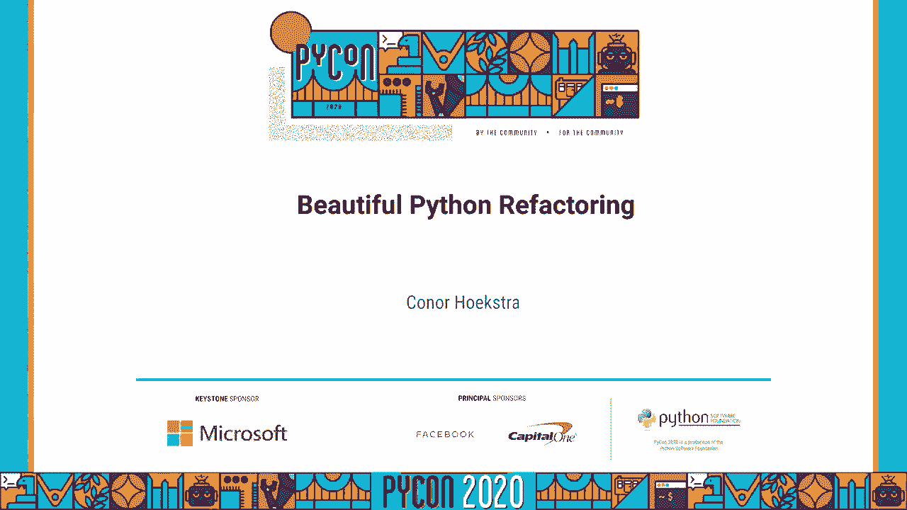

欢迎来到我的pycon 20 20演讲题目是"美丽的蟒蛇"，重构，我叫康纳•霍克斯特拉，关于我的一点，在我们开始谈话之前，我是一名高级图书馆软件工程师 在急流上为英伟达工作，AI团队。

我们的团队正在开发一个在 gpu上运行的端到端的数据科学管道，如果你有兴趣查一下，看看我们在急流艾，我是个编程语言爱好者，所以我在c++和python的大部分经验。

我的团队主要使用c+14和python 3，我喜欢算法和漂亮的代码，COM斜杠代码报告，在那里我解决各种不同语言的竞争性编程问题，所以如果你有兴趣，检查出来，正如我之前提到的。

我的化名在线是代码下划线报告，所以如果你想搜我的身，有时候这比搜索我的名字容易，所以我为什么要在半年前或者更晚的时候做这个演讲呢，取决于你什么时候在网上看这个演讲，我加入了英伟达激流队，具体地说。

我在库德图书馆工作，所以在急流组织中存在着多个库，或者急流组织正在研究，我在库德图书馆工作，所以这些图书馆的妙招都来自库达，它是并行编程平台和编程模型，或者至少网上是这么说的。

我喜欢把Cuda看作是一种编程语言，你可以用它来，呃，做 gpu计算嗯，df和 cudf代表数据帧，我所知道的通常有两个数据帧，显然库德图书馆，因为那是我工作的地方，或者我工作的团队开发，灵活易用。

基于 python编程语言的开源数据分析和操作工具，像 API，数据工程师和数据科学家所熟悉的，在没有详细说明 CUDA程序的情况下，会发现很容易过渡到 cudf或 rapids数据帧库。

当我十月份开始工作的时候，所以我决定做一个小玩具项目，嗯，所以我决定我要做的是分析数据，在一个竞争激烈的编程网站上，我偶尔会在上面竞争，那是代码力量，他们会告诉你投稿数量的数据，不管他们成功还是失败。

我最好奇的是，你提交的语言是什么，所以我想出的问题是，像代码强制这样的网站上使用的最流行的编程语言是什么，所以这次谈话，我基本上要展示我所经历的步骤，嗯，让代码工作，在整个过程中，最后我重构了很多代码。

我从一个网站和一个博客上找到的，尤其是，我觉得这很能说明问题，希望你会发现这很有教育意义，提高你每天编写的代码的质量，那么我们该怎么做呢，其实只有两步，第一步是从代码强制网站刮取 html数据。

一旦我们完成了这些步骤，我们在这次谈话期间就这样做了，其中90%将发生在第一步，因为我做的所有重构都是在那里完成的，但我也花了最后10%的时间向你展示，只是为了激励，我不知道。

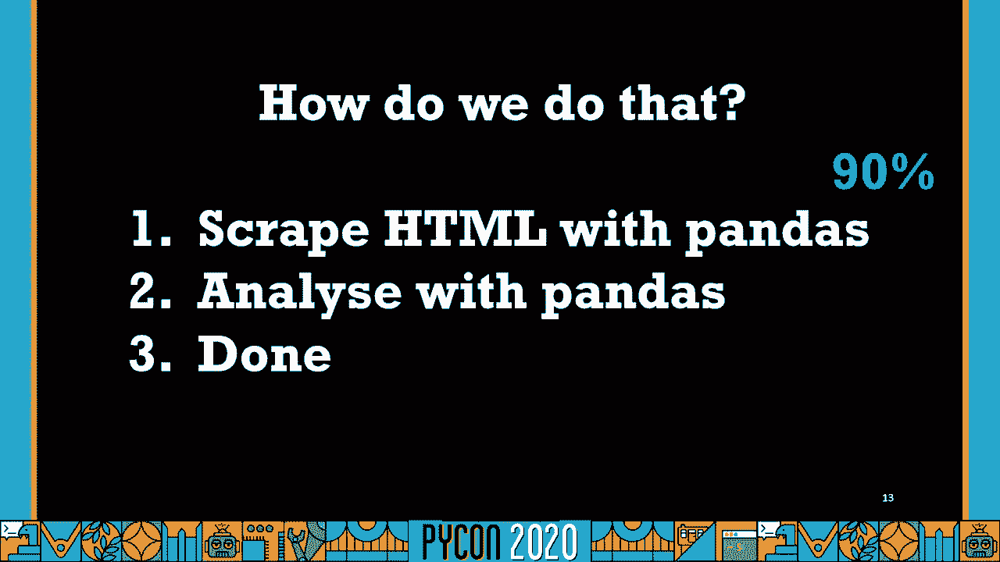

如果工程师不知道，他们去谷歌，输入他们想做的事情，是我干的，在第二个结果中，我发现网页用python刮html表，其中的数据框架，所以我打开了它，我看到了下面的博客，这个博客带你一步一步地。

如何设置一段代码，这将基本上从你想要的信息和 html表，所以我经历了这些，最后，大约有60多行代码，取决于你如何看待它，我们很快就会通过，把代码的每个部分都突出显示出来。

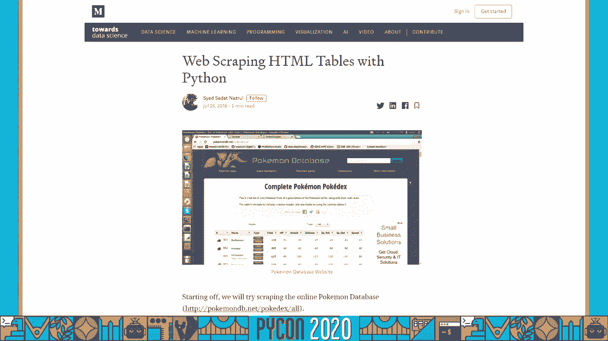

他们在博客中分崩离析，第一部分是导入 很简单，我们没什么好谈的，请求是为了得到 html，l lxml表示能够解析和读取 html，最后，第二部分是初始化页面，我们要用到的 doc和 tr元素。

在那之后，我们有我们的第一个循环，它用于从我们表中的每一列中提取标题，这是在代码部队的网站上，涉及到循环的第二段代码是两个嵌套的循环，用来提取 HTMHTML表的内容，在表格的每一列中。

最后我们从字典中构建了一个数据框架，使用字典理解，所以我们要看的第一段代码，会是我们给你看的第一个循环，这里我们有一个空列表库和一个索引 i的初始化，然后我们有一个循环，通过每一个。

从 tr元素数据结构的每个元素中读取一些东西，然后它在最后结束了，所以我们要删除这里的评论，一个主要是为了让文本更大，但是两个因为这些评论有点多余，嗯，我们真的不需要评论来告诉我们 我们正在建造。

或者在这里初始化一个空列表，关于这段代码，我们首先注意到的是以下模式，我们正在初始化一个索引 i，然后遍历 tr元素第一行中的每个元素，在那之后，我们对我们的索引做了一个增量，嗯。

如果你有过这样的模式 在一个循环之外初始化一个索引，然后在你的循环中增加它，在python中有一个函数或算法，叫做枚举，所以使用枚举，我们基本上可以删除索引的初始化，我们的指数的增长。

将 tr元素第一行传递给枚举，再用破坏法，我们可以解构现在压缩的索引，把我们的每一个元素，所以我会是我们的索引，T是我们最初从 tr元素第一行得到的元素，所以这是一种算法。

在不同的语言中有几个不同的名字，如果你发现自己在这段视频中不是一个蟒蛇程序员。

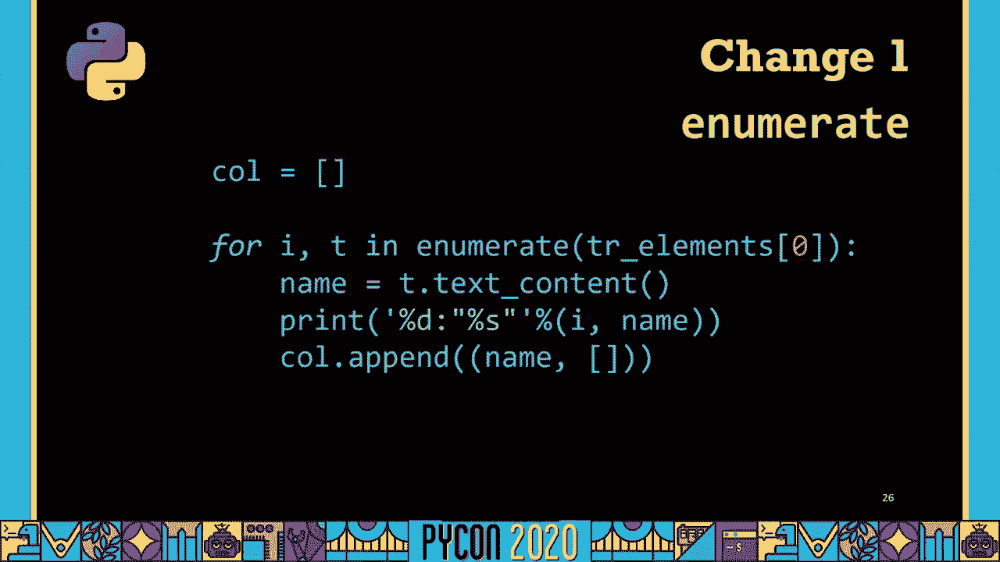

所以它主要被称为语言中的枚举，比如python，锈蚀，但在其他语言中，它也被称为红宝石索引，科特林和长生不老药，在拉科特和哈斯克尔的索引中也是如此，所以这是一个非常非常有用的算法。

我见过很多次这样的模式，人们在范围之外初始化索引。

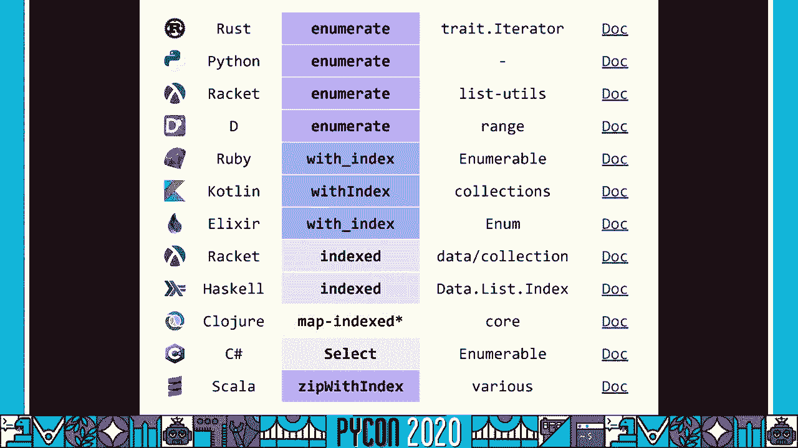

基于循环，它不会给你索引，然后他们在循环中增加它，如果可以的话，如果你的语言有它，而 python确实试图利用这个枚举，所以我注意到的第二件事是我们现在得到的索引，枚举实际上只在一个地方使用。

在这份声明中，嗯，我不太确定，这个 print语句的最初目的可能是为了调试目的，嗯，它应该是一个教学博客，所以我猜，这是为了让个人更容易理解 把这些代码组合在一起的人，但在一天结束时。

你实际上不需要这个打印声明，所以我们能做的第二个重构就是删除指纹，然后我们刚刚添加的枚举，结果如下，在这一点上，我们可以开始看到，我们实际上可以把这个 for循环变成一个列表理解。

所以如果我们去掉名字变量，并将 t点文本内容直接放在追加调用中，嗯，你可以看到这真的是可行的列表理解，这将是我们的第三个改变，所以列表理解给了你基本构建列表的能力，无需违反，我把它叫做反模式。

这是我最不喜欢的反模式，我一直在代码中看到，嗯，所以再一次，这是一种反模式，你应该不惜一切代价避免，我断言，如果你能避免这种反模式，您的代码将变得更易读，更容易维护，总体上更好，所以 itm代表初始化。

然后修改，我们已经看过两次了，第一个例子是当我们有了可以被调用替换的代码，列举，这里，我们正在初始化索引，我和里面的形式循环，立即修改它，嗯，我们可以通过使用枚举来避免这种情况，在我看来。

这让代码更容易阅读，我们看到的第二个例子是在我们刚才看到的代码中，在这里我们初始化列，然后马上进入我们的循环，调用该列表中的 append方法，对于 for循环的每个迭代，我们可以避免这种情况。

就像我刚才说的，所以如果你能避免反模式，就像我说的，它通常会导致更好、更可读的代码，接下来是我们的第二套循环，我们要研究并重构，这是负责，基本上是从我们每个表的列提取数据。

所以我们要看看这个嵌套的循环 一点一点地，我们首先要看的是，如果语句是在第三行和第四行，所以这里说如果行的大小不是10，这意味着它不是从我们的桌子上，当我在这个博客最初附带的口袋妖怪数据集上运行这个时。

我没有碰到这个，我绝对不会有这个问题，与代码部队的数据，所以我们可以删除这个如果语句，在重构时，情况并不总是这样，但是对于你的用例来说，如果你发现是这样，你完全可以删除多余的代码，那什么也没做。

我们要做的第二个改变，嵌套循环是通过看看我们第一行的前两行，循环，所以这里我们有 j在范围1到 tr元素列表的长度，然后我们用 j，这将是一个索引，指定 t为 tr元素的第 j个元素。

所以这让我有点困惑，当我第一次看到它的时候，因为我想你为什么不，嗯，循环遍历 tr元素的倒数第二个元素，但我想那是因为我们又需要元素了，然而，当我看到tl tr元素在哪里被使用时，只在前两行。

所以很明显我们可以在这里使用一种叫做切片的方法，为了避免使用范围函数，计算指数，然后索引成 tr元素来设置 t，我们可以使用切片来立即设置在我们的循环中，所以看起来是这样的。

我们使用切片来删除 tr元素列表中的第一个元素，这将给我们列表中的第二个最后两个元素，所以这正是我们想要的，我们不仅可以避免第二行代码，同时也是对函数范围的调用，太棒了，接下来我们要看的是。

我们以前见过的，希望你能认出它，我们在设定一个索引，我在里面，然后在一个循环里，为 for循环的每个迭代增加这个索引，希望你还记得我们之前做了什么，这就是利用枚举函数，我以前说过，但我一直看到这种模式。

当你使用像蟒蛇这样的语言时，有这个算法或函数的，这是天赐的，在某些语言中 比如围棋，他们实际上把它内置到了他们的范围内，基于循环，对于语言来说 这是一个非常非常有趣的设计选择，嗯，但是是的。

当你可以的时候用这个，它使您的代码更具可读性，就像我说的，而且避免了 itm反模式，接下来我们要做的改变，在看另一个，如果再次声明，呃这个如果声明说检查，如果行是空的，我在口袋妖怪的数据集上做了这个。

从来没有遇到过这样的案子，而且这也不是一个问题，因为我的代码强制数据，所以这个可以移除 因为我们，就像我们移除之前的，if语句，我们要看的下一段代码，中间的四条线，这就是尝试和接受。

如果我们阅读这四行代码上面的注释，它说把任何数值转换成整数，我不认为这是我们能做的最好的方式，我尽量避免，如果可能的话，试着接受陈述，所以我们改进的方法。

这段代码在许多其他语言中使用一种叫做条件表达式的东西，嗯，你可以通过使用一种叫做三元运算符的东西来得到同样的效果，一般是问号加上冒号，但在蟒蛇身上，它看起来如下。

它基本上使您能够基于条件语句分配 do赋值，嗯，但是它结合了 if和 l，所以它变成了一种表达，所以它读取的方式基本上是值1，如果有条件，否则值2，所以如果条件为真，它使用值1，否则它使用值2。

所以在这里设置数据，我们基本上是把数据转换成整数，如果数据是数字的，否则只要用数据，所以我比之前的代码更喜欢这个代码，因为一条是单线，但是两个，它避免了尝试和接受，我觉得你应该尽量避免，如果可能的话。

再一次，我只是我真的很喜欢避免它的反模式，技术上来说 我们是在修改这里的数据，但在接下来的几个变化中，我们也将避免这种情况，所以下一个变化是删除多余的注释，所以如果我们看这两条评论，第一个是迭代。

遍历行的每个元素，我认为任何超过循环的评论，也就是说我们要遍历插入的每个元素，我们正在迭代的内容，这个，并没有增加任何价值，作为评论，与第二个评论相似，将数据附加到第1列的空列表中，这是相当不言自明的。

通过阅读我们有一个二维列表的事实，我们在第1列，所以我们可以移除这两个，就像我说的，删除对数据的第二个赋值，把代码放入我们在这里调用的 append方法中，现在我们要停下来看看我们已经走了多远。

如果我们回到最初的起点，我们大概有60多行代码，在这一点上，我们只剩下大约20个，所以我们已经消除了三分之二的代码，如果我们重新格式化前四行的注释，我们甚至可以把它弄得更紧凑一点，我更喜欢，在这一点上。

我们所有的代码都在一张幻灯片上，这使得整体推理变得更容易或更容易，我们开始注意到代码的结构，那就是我们初始化元组列表，最初是我们专栏的标题，作为列表中每个元组的第一个元素，第二个元素最初是空的。

然后在我们下面的嵌套循环中，我们用相应列的内容填充这些空列表的内容，嗯，我们可以用这个看到，你知道吗，呼叫支架，我支架，托架，一个支架，然 而，如果我们看一下这个元组列表，在这本字典里。

我们马上把它拆掉，嗯，这就引出了一个问题，为什么我们要把它们捆绑在一个元组列表中，为什么我们不能有两个单独的名单，因为要索引到我们的列中，然后追加到一个空列表，当我们只需要列数据的列表。

以及列标题的单一列表，所以这正是我们要做的，所以第一步基本上是去掉列表中的元组，打电话给它，把它重新命名为标题，一旦我们做到了，我们已经破解了这里的密码，名单是什么，所以我们可以构造这个呃列表。

我们把它叫做圆柱，将其初始化为我们需要的列数，现在不用在这个数据结构中做两个索引，我们可以只做一个，嗯，接下来我们可以做的改变是把这种转变，我们正在执行的数据是点文本内容，所以我们可以把它分解成。

在这一点上，我们可以很清楚地看到，我们可以将这个嵌套的 for循环转换为列表理解，因为我们又有了模式，我们在外面初始化名单，我们在里面呼唤，为嵌套循环的每个迭代追加，每当你看到这个，你应该考虑列表理解。

所以呃，等价的列表理解如下，这可能有点让人困惑，它并不比嵌套循环最初更难阅读，嗯，所以我们基本上是为 tr中的每个 t构造一个列表，从第二个元素到最后一个元素。

我们在每个 t点文本内容上调用 format函数，对于t's和t'dot极，孩子们注意 我们也在打电话，这对这个叫做 zip的函数来说有点棘手，我们还在开头用了星号。

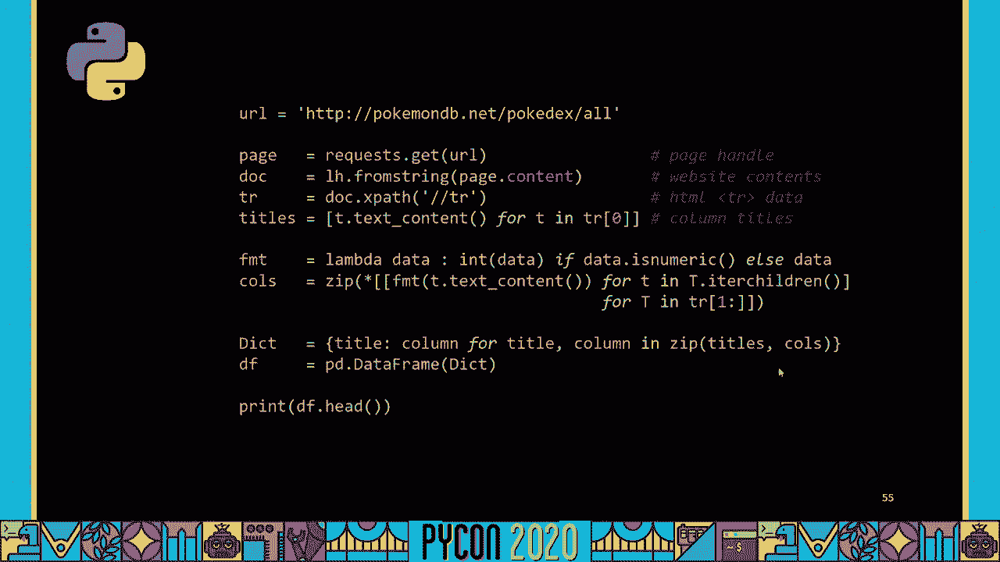

这相当于许多其他语言中的转置，所以如果我们看看我们的谷歌翻译功能或算法比较，您可以在几乎每一种语言和库中看到这一点，这只在一对夫妇中被称为转置，他们称之为稍微不同的东西吗，嗯所以是的，不幸的蟒蛇。

它们没有显式命名的变换转置函数，但是您可以通过调用 zip圆括号 asterix来得到相同的行为，然后你的二维收藏。

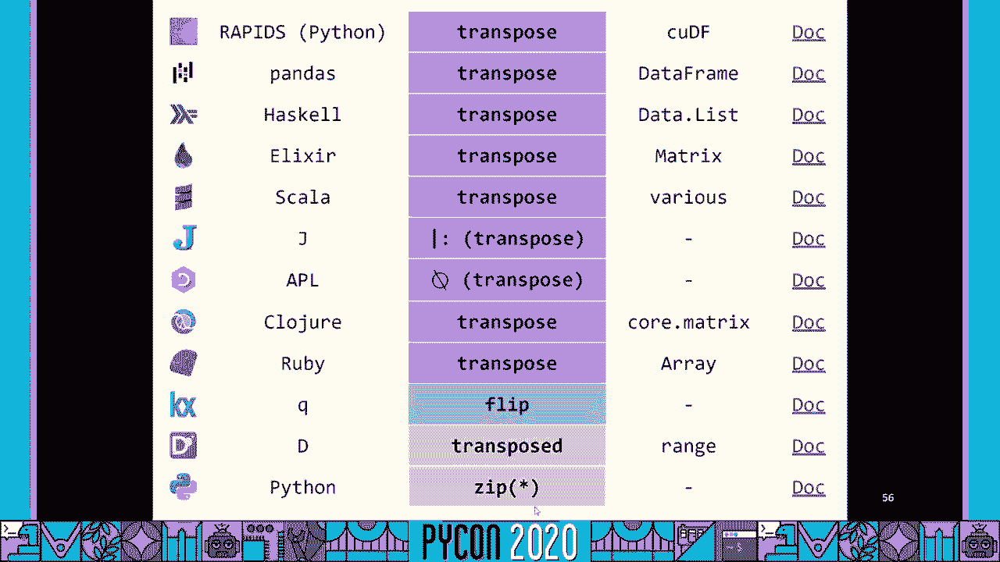

嗯，在括号里，在这一点上，我们做了，我们已经把代码从60多行减少到，取决于你如何看待它，你知道大约10行，很好，问题是，我们说完了吗，我们能做得更好吗。

你们中的一些人可能已经注意到我犯了一个非常非常大的错误，那个错误是我没有注意到。

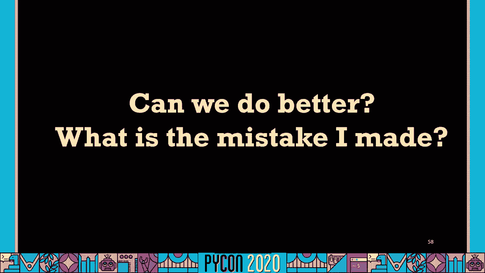

当我在谷歌上搜索的时候，嗯，你们中的一些人可能在想，直到我从字典中构建数据框架，最后的理解，如果我有更多的关注。

如果我们利用这个方法，把这十行代码，变成五三行代码，取决于你如何看待它，嗯，所以如果你看过我其他的演讲，关于算法，我赞同其他编程社区的其他几个人提出的观点，你应该知道你的算法，但你不仅要知道你的算法。

你应该知道你的收藏，你应该知道你的图书馆，也是，我想我做的所有重构工作，我研究的代码，嗯，很有用，希望它能，嗯，有用的，我在这次演讲中提到的一些事情，但我本可以避免这一切，呃好多了，我刚开始。

所以我不知道 所以，你知道吗，我们犯这些错误没关系，但随着时间的推移，我们应该尝试使用我们的库、我们的收藏和我们的算法，越多越好，为了避免编写所有这些不必要的代码，不管是十行还是六十行，理想情况下。

如果有一个具有单一方法的库。

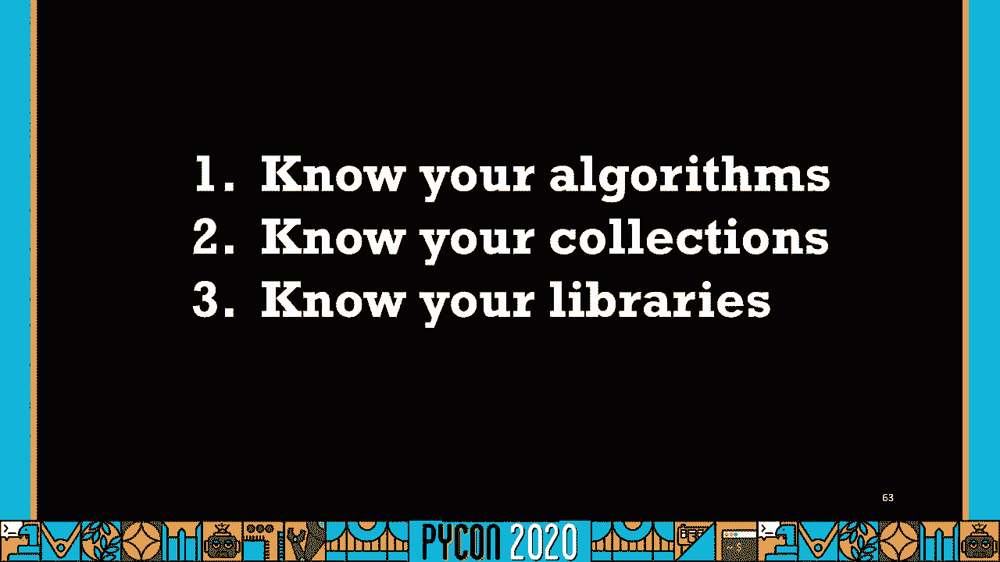

这正是你想要的，你应该用这个，所以如果你想看看所有的一步一步的变化，其中有九个我明确提到过，最后我含蓄地提到了其中的两个，你可以在我的 Github页面上查看演讲结束时的链接，我有个文件记录了。

所有这些明显的变化。

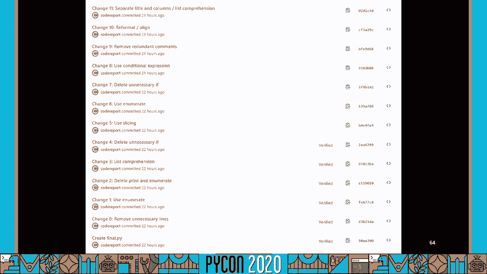

如果你想在 github文件 diff模式下看到它们，我们已经完成了第一步到第二步，这个比第一步短很多。

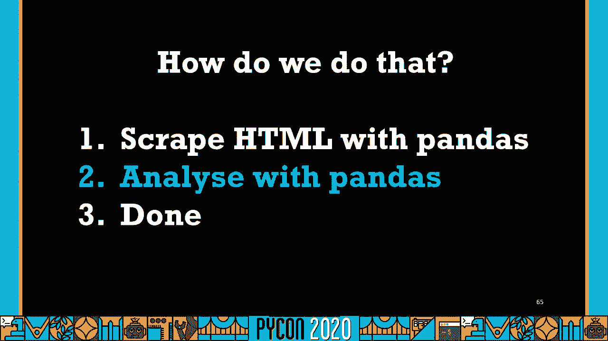

如我所说，这只会是谈话的10%，所以首先我们要看看，我一直提到的 html表，在代码部队的网站上是这样的，每场比赛，你可以进入每个提交的状态，它会向你展示所有的语言，不管他们通过了还是失败了，嗯。

哪一个问题，在竞赛中 他们被提名，所以我们主要感兴趣的是这篇题为"语言简写"的专栏，但有一件事你会注意到他们不仅仅有一个，提交选项，如果你提交的是c++，您可以选择几个不同的编译器，C++11。

蟒蛇1714，他们可以选择提交蟒蛇三号或蟒蛇二号，与语言相比，输入或提交方法有各种不同类型的映射。

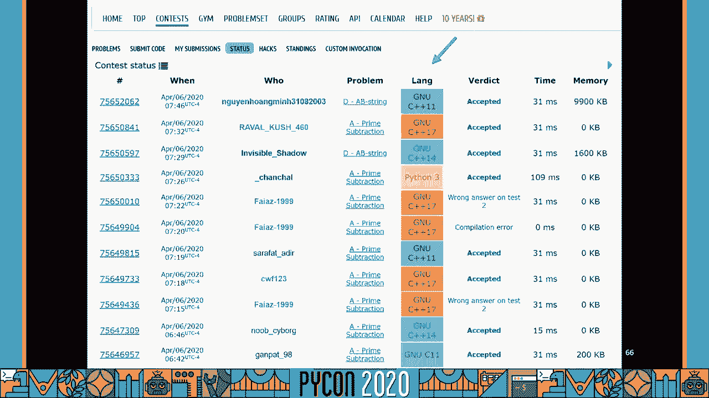

所以我们要做的第一件事就是创建一个字典，嗯，在地图上，所提交语言的所有不同提交选项，一旦我们做到了，我们有一个很短的代码，四条线路，我们正在初始化并声明我们的字典映射，嗯。

一旦我们执行了我们在第一步中创建的代码，把它储存在一个 csv里，我们可以把这个装进去，我这么做是为了代码，警队的教育守则竞赛74个 然后一旦我们有了我们的数据框架。

我们可以通过铺设来访问数据帧中的单个列，然后我们可以把算法或方法叫做替换，这基本上是要做的转变，将每个提交方法映射到相应的语言，然后我们对价值计数做最后的决定，所以如果你对收藏很熟悉。

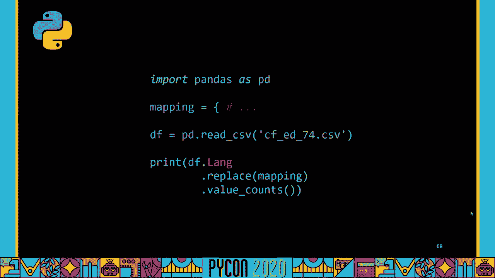

蟒蛇柜台，价值计数非常相似，它基本上会给你一个频率，存在于系列或列表中的唯一元素的计数，这在两种口齿不清的方言中被称为值计数，封闭与球拍，这叫做频率，就像之前提到的蟒蛇。

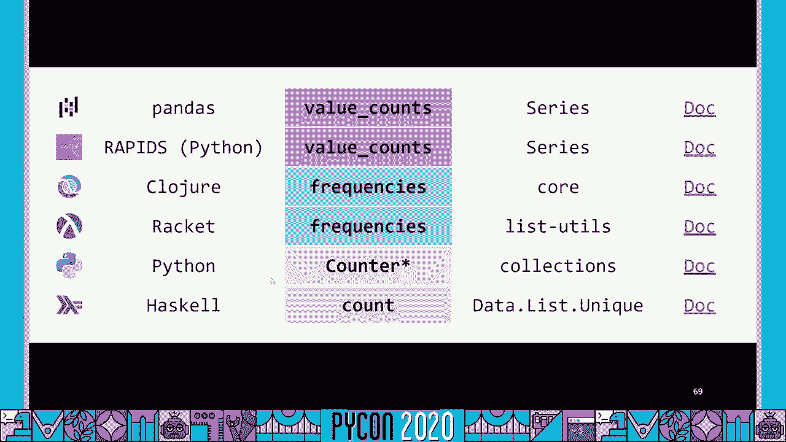

不是算法，但这是一个收藏，但它有一个非常相似的行为，这个叫柜台，所以一旦我们这样做了，我们得到以下的输出，嗯，所以你可以看到在c++中有4万1千份投稿，两千五百条蟒蛇，爪哇不到两千。

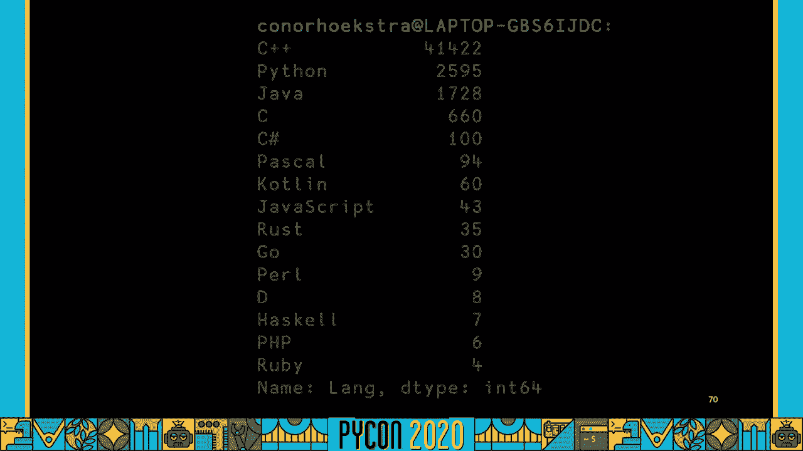

如果我们想象一下，如下所示，所以绝大多数选择的语言，至少在这次比赛中，但大多数比赛通常都是c++，八十岁，提交材料的9%，如果我们去掉c++，我们可以看到接下来的前三名，我们的蟒蛇有6%，爪哇4%。

c为1%，我称之为边缘语言，任何在提交的材料中占不到1%的语言，排名如下，C夏普帕斯卡，科特林，JavaScript，生锈，去珍珠，哈斯克尔，PHP和 Ruby。

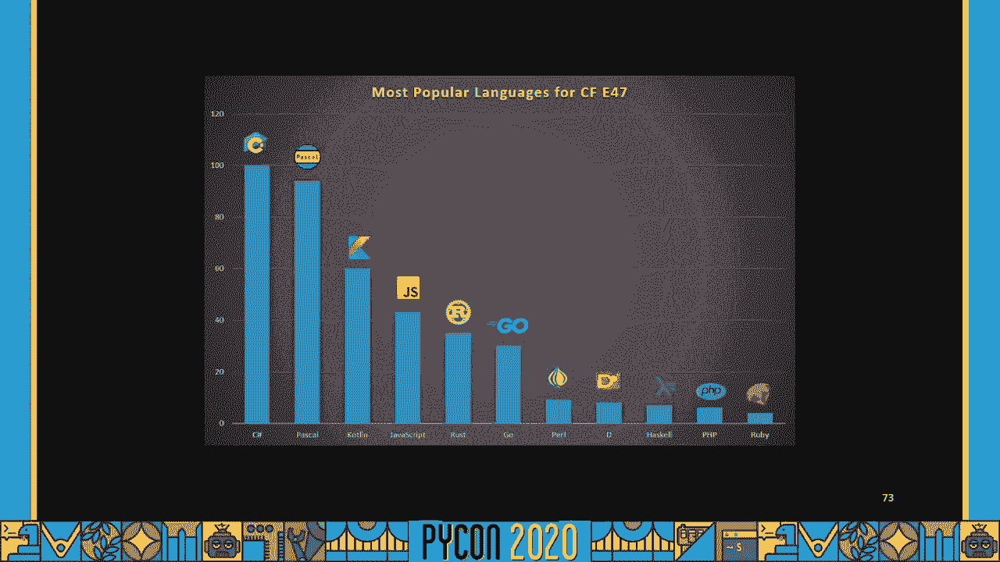

第二，最后我想说的是，你正在做的科学工作，你就会遇到瓶颈，在表演方面，你可以简单地放下并替换 Cudf，也就是英伟达的快速团队工作的图书馆，你的代码就会起作用，它在拥抱中工作，会更有表现力。

如果你要处理大量的数据，你有 GPU来运行这个，所以，如果你想知道，好吧，嗯，这是伟大的，但是如果你确实有一个性能瓶颈，CUDF可以是一个很好的选择，巧合的是，当我今天在跑步的时候，我通常喜欢听播客。

这是我听到的五个，我听过的其中一个节目是对一个人的采访，名叫凯尔·尼科尔森，很明显他们利用激流，他在播客中提到，他们使用代码库的代码，或者他们使用的训练模式，他们的成本大约降低了30倍。

以大约100倍的速度来训练他们的模型，所以它给人留下了深刻的印象，你能用这个 rapids qdf库做的事情，如果性能是你的瓶颈，如果你有兴趣，在急流看看这个，AI，我最后想说的是。

是播客中提到的一个博客叫做 python bytes，嗯，这个博客被命名为八个最酷的 python编程语言特性，我提到它的原因是8个特性中的5个，在这次演讲中直接或间接地提到了，我觉得有点巧合。

所以第一个是列表理解，我们多次使用它来重构循环，生成器表达式没有被直接提及，但它们与列表理解是齐头并进的，我们没有使用的切片分配，但我们确实使用了切片技术来移除，对范围函数的调用，可迭代，可迭代，开箱。

这就是我所说的破坏，嗯，在这里你需要一个元组或者一个列表，把它破坏成单独的部件，然后在最后使用字典理解来构建我们的字典，我们传递的数据帧，所以一篇伟大的文章，我绝对建议你去看看，是的。

希望你觉得这个有用，嗯，感谢收看，我知道这有点奇怪，在没有观众的情况下，我只是自己录制，嗯，不幸的是，有机会问现场问题，所以旁边有个星号，但如果你有问题，把它们留在下面的评论区，或者如果你想。

你可以在代码下划线报告上发推特给我，回答你的任何问题，但并非最不重要的是，我在演讲中展示的所有幻灯片和代码。

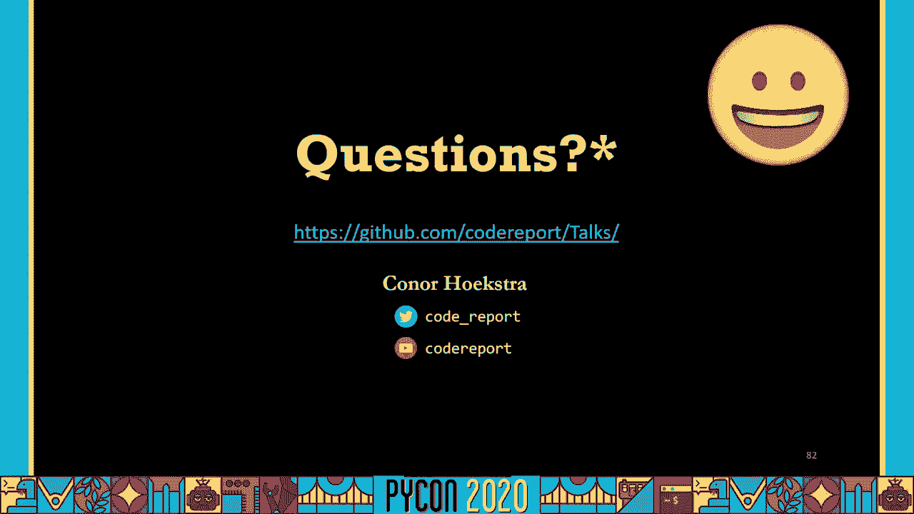

在我的 github页面上，所以如果你有兴趣。

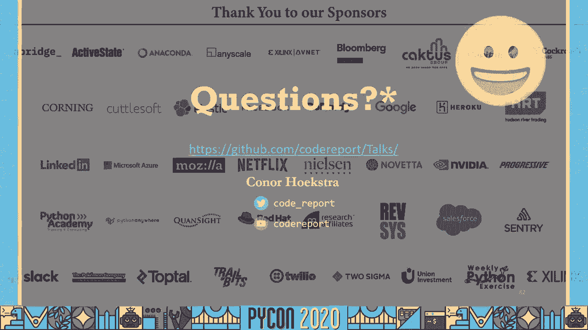