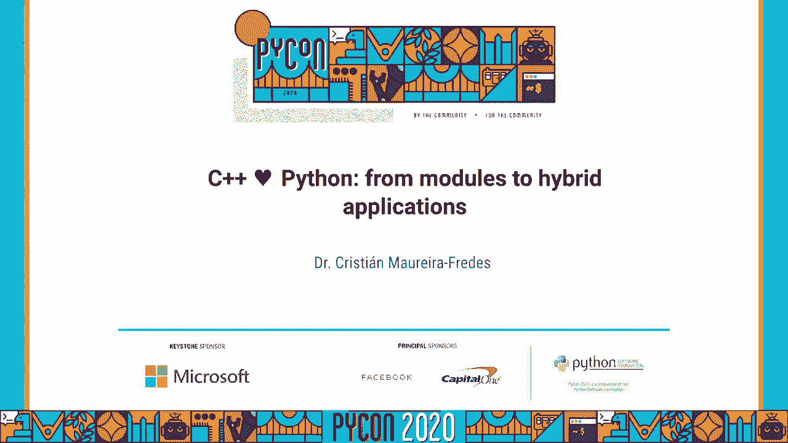
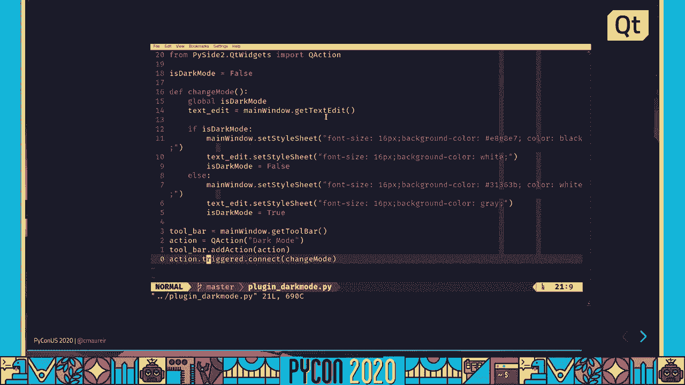
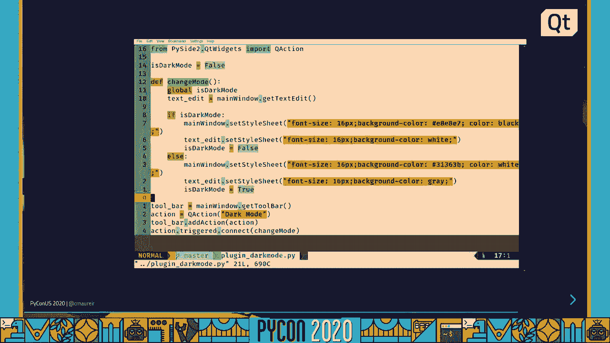
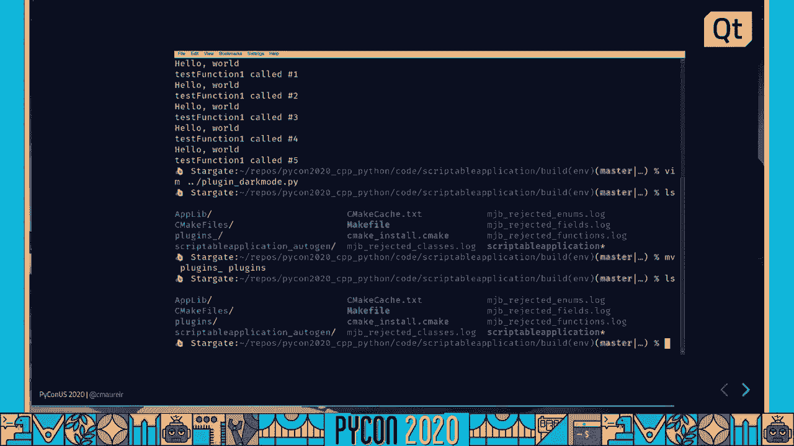
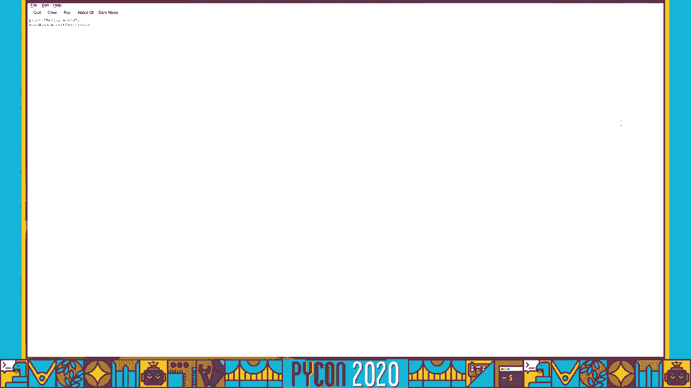
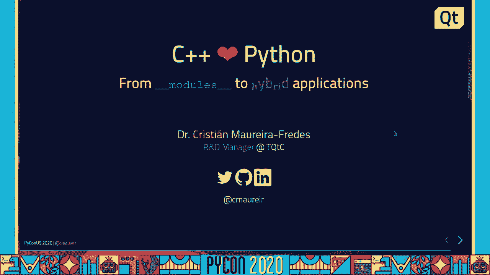
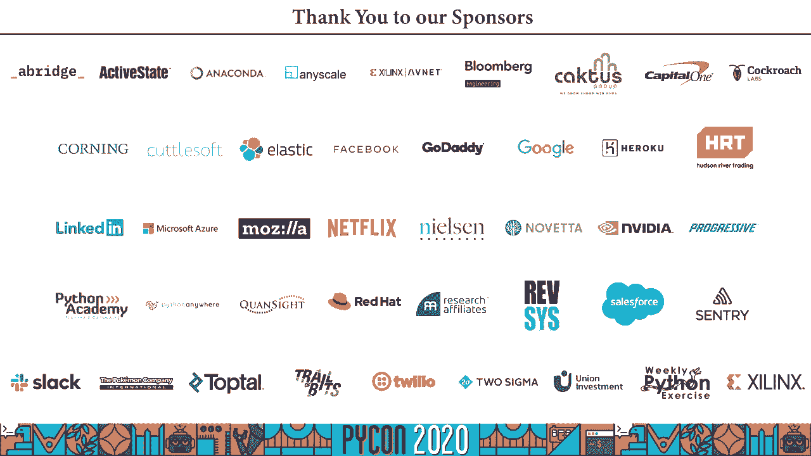

# PyCon US 2020 - P33：Talk Dr. Cristián Maureira-Fredes - C++ ♥ Python from modules to hybrid applicat - 程序员百科书 - BV1rW4y1v7YG

你好，各位，我叫克里斯蒂安 欢迎来到我的巅峰，从moto混合应用程序开始前的标题c++love python，我只想说，感谢 python和 psf给了我们一个扬声器，有机会和你分享我们的谈话。

所有这些都是新的在线格式，我真的希望你喜欢，我准备了很多小例子，我们将开始玩 c python编写我们自己的模块，开始在python模块中集成c++的一些特性，但更重要的是，这里有一个大型示例。

可以将真正的c++应用程序与一些python脚本集成在一起，我真的希望你喜欢这次谈话，之后你可以下载代码 然后自己尝试，你在错误的会议上谈论c++，我不这么认为。

我真的相信c++和python有很多共同点，当然还有一些不同的，所以在相似性方面，你知道两种语言都是通用的，它们是多范式的，当然，支持其功能编程，但也有一些不同，这些是最直接的。

当然在c++中你需要编译，一切都是静态类型的，所以在编译的时候，但与蟒蛇不同的是，它是一种动态语言，但我们通常会听到，C+太难了，好吧，好快啊，在另一边，蟒蛇太容易了，但是有点慢，所以我们选择哪一个。

那是件好事，我们不需要选择一个，我稍后会解释这件事，所以让我们后退一步，试着分析一下为什么蟒蛇现在如此神奇，我坚信蟒蛇是好的，因为两个主要原因，第一个原因是因为它深受 abc编程语言的启发。

如果你不熟悉，试着用你的蟒蛇知识来阅读代码，你不能理解 因为，如你所见，语法和我们现在使用的很相似，第二个方面是因为它是用 c写的，我知道，有一些模块是用 python本身编写的，python实现内部。

但它是用 c写的，所以使用这种古老的语言对某些人来说 就像，哦，太复杂了，我不知道，我真的不需要了解它，我们将有一个免费的通行证到其他语言，因为许多其他语言要么是用c写的，要么与c有很好的兼容性。

所以当我说用 c的时候，当然这种胶水的想法，对，您将会有一些想要添加到 python中的新功能，也许你有一些小的功能，你想暴露在蟒蛇身上，你也可以有表演的东西，我不知道，做一些疯狂的 gpu计算，例如。

连接一些我不知道的代码，能并行完成繁重的任务，处理文件等，或者你只是有一个用c或其他语言编写的库，它看起来很友好，你想让它暴露在数学中，当然，还有许多其他最疯狂的想法来做世界使用c，但如果你认为。

感觉有点奇怪，仍然用在蟒蛇身上，给你举几个例子，如果你不知道就会麻木，Numpy后端主要用 fortran和 c编写，所以效率才这么高，这就是为什么这么好，如果你去，而且大部分功能都在 python中。

在c里有一些东西，所以，例如，他们使用的解析器，当他们在处理，当你读书的时候，例如，CSV文件，所以才这么快，所以效率才这么高，你有更多的现代型号，比如皮拓切，例如，这只是暴露了这个巨大的c++库。

它是蟒蛇的火炬，另外在上面增加了一些新的功能，所以这些想法并不奇怪，我们可以看到最流行的蟒蛇模型，有时在那里放一些小文件夹，一些 c文件可以提供一些功能，所以i c++然后。

因为我真的相信加号和蟒蛇可以在很多方面互相帮助，我怎么知道我是，在过去的两年里做了一个叫做"可爱计划"的项目，如果你不熟悉的话 这是一个跨平台，C++框架，在哪里你可以有用户界面组件。

您可以为不同的系统构建用户界面 是增长平台，因为你可以用同样的代码在 windows上运行，麦克，Linux，当然你也可以和 iOS兼容，安卓等，等等，但更特别的是参与了一个名为"可爱蟒蛇"的项目。

也许你听说过圆周率，这个项目旨在向python展示这个巨大的c++框架，因为这是一个非常古老的框架，它们已经进化了很多年，可爱或多或少和蟒蛇同龄，所以有很多东西需要暴露 并适当地对待蟒蛇。

所以如果你不熟悉c++，我现在想给你们一张幻灯片，至少可以帮助你们理解c++代码，或者至少是右边的基本组件，您可以在左边看到 python代码，你要加注，加码，所以你有了，与评论有些不同。

主要的区别在于，你需要为c++中的每一行和变量指定类型，所以我们有 int浮子，弦乐，事件向量，类似于一个列表，同样的想法，用函数代替了c+中的大括号，再加上你有python中的颜色，但你有深度。

或者您需要指定返回类型，如果是整数，如果您熟悉类型注释，也许你，这对你来说并不复杂，当模仿python时，main的名字等于main，在c++中是强制性的，你需要有它，你可以在这里调用相同的函数。

奇怪的东西打印出来，结果是，X X X代表，额外的一步，当然，直接在c++中执行的python需要先编译然后执行二进制，原来如此，您现在已经准备好阅读任何c++代码了，最后这个，不是语言的全部特征。

但至少现在你对它更熟悉了，如果你以前不知道的话，你已经掌握了一些你将要接近的东西，我将在这里被展示，C++自从任何编程语言，在最新的版本中，所有这些都是每三年一次。

有很多特性一方面对c++开发者非常有用，另一方面，它们看起来也很像蟒蛇，或者至少他们遵循同样的哲学，或者让事情变得更简单，例如，C++11，你有自动类型，当你在编辑，它是次等的，他们说，好的。

第一个是彩车，第二个是绳子，这是一种方便的元组，当然，python字典是一个非常有用的结构，你也可以有任何一个c++是一个北方地图，我知道这更冗长，所以您需要指定更多的类型，但仍有可能，你就能得到。

当然使用不同的按键 还有另一个自动值和 lambdas，你现在也可以到处放羊羔了，使用这些空大括号和语法，你可以在这里和那里放置任何函数来改进你的代码，让我们再往前一点，c+14。

您现在可以使用自动作为返回类型，在这里你也可以定义一些变量模板，比如在这个例子中，我可以使用t作为int或者float或者double，而不是看我的 p值需要多少精度，您可以在这里使用下划线。

你可以用 c加17的单引号，您可以选择返回多个值，例如，在这里的酒吧和一对，和，这些值被 x和 y分开成两个，挺好的，在 python字典里也有这个词，就像我们需要阅读它们一样，这真的很方便。

类似于条目字典中的关键字值，您可以在这里使用类似的方法，最后一个标准是c++20有两个非常好的特性我非常喜欢，第一个是模块，你可以看到在左边，您要在文件中声明一个模块。

并在某些函数中导出这个名为simple和export的模块，在这种情况下，你好 使用模块，然后您需要导入简单，听起来很耳熟，这真的是一条蟒蛇，依我看，基本上你可以调用这个函数。

我想强调的第二个特性是范围，你可以先申报，积分范围，你知道简单的数列，两个 lambda函数来确定，如果数字是偶数，另一个是把一个数字提升到二的幂，你可以开始连接所有这些不同的函数到你的整数向量。

所以你可以在第四节看到，你在迭代，但是你说但是过滤这些数字，只有事件，然后用余数过滤器将其转换得到这些数字的平方，这真的很酷，我还没有使用这些功能 在，尚未生产，但我真的很期待能有一些项目，新运营商。

你看到了在蟒蛇贸易中引入的海象操作员 所有令人惊讶的事情，信不信由你也是 c加20，有新玩家，有点好笑，即使是太空操作员，这里我就不细说了，但这只是两个物体之间的比较，这是种很好的。

甚至两种语言都有相同的新的花哨操作符，好的，但足够放幻灯片了，我现在想跳入终端 向你们展示一些代码 首先我们会有两种不同的场景，第一个是c++帮助这个，我想给你看一些 python代码，只是为了熟悉它。

几个函数的两个小实现，其次，我还不会破坏它，所以让我们现在打开一个转弯，我把它放在这里，把它放在一边，您将可以访问这个存储库，当然，所以请下载并获取代码，然后自己尝试，我们要编码，激活我的环境。

让我们去c蟒蛇，因此，开始用c python编写自己的模型，你需要一对夫妇作为权利，为了让你知道你需要什么，别担心，它不会在这里写太多代码，你需要在车站做模特，在这之前，您需要有一个模块声明。

在这里你可以实现你的功能，假设你想实现一个函数，如果你不熟悉 c蟒蛇 就忘了吧，不用担心，把它放在那里的争论中，但你有一个功能，然后它就会像，例如，我有一个，一条信息，然后它就会回来，然后这个函数你好。

我把它放在这里，我会保持这个在一些变量，在模型声明中，我会说嘿，函数使用 ff，然后模型声明听起来很简单，它很简单，这就是为什么简单是好的，如你所见，你有调制，只需在pine模块中的一行，在这里创建。

您就有了模型定义，把这些结构当作需要填充不同值的盒子，你有名字，你想用的狗和方法，哦，什么是简单的，很简单很简单的事实，又一个用于填充函数名称的框，我需要在下面调用的 c函数是什么，在这种情况下。

一个简单的，你好，这个函数没有参数，以及一些文件，如果你看到这里，这是我们已经实施的同样的事情，这将是它，这将允许你创建，当然，您将需要两行设置，就像说嘿，这是扩展，您将能够运行，像这样的东西。

所以要安装，执行，你就知道了，在第一个 c函数中，写了 c函数，那也是蟒蛇，所以我想，好的，5。一旦我开始处理一些数据和许多文件，我还能做些什么呢？所以我做了典型的球形，所有的一切，但我是递归的。

我觉得花了很多时间，我想也许我可以有一些更快的东西来实现，所以我想，如果我不去看一个模块，用c++中的一个很好的特性来写我自己的c扩展，就会调用，所以这是一个非常酷的东西，来自标准库，你可以在这里看到。

我正在用这个，它的结构和你刚才看到的 moinitialization定义是一样的，功能也一样，在这里我有一个叫做快速手套，手套，这是函数，忘了这些台词吧，这些只是解析论点，因为。

当然我会收到一个表达式 然后是一个选项，如果它是递归的或不递归的，我将创建一个空列表，我将以递归的方式使用这个不错的迭代器，或者用普通的草书方式，我将开始在我的列表中添加值，就是这样，没别的了。

您甚至可以复制这个参数的类似实现，解析，你不用太担心，好吧很公平，然后他想，好的，我们只是想看看，你可以看到，对于非递归的，我觉得有一千个文件的目录，每个文件里都有一千个，所以你可以看到那里的值。

它们是非递归的，快速的爱情真的很快，以递归的方式，还很快，这真的不是一个公平的比较，当然可以，但Livar是用c或python写的，这个实现是用c+写的，所以有一些性能增益，只是为了改变语言。

但我只想用几句台词告诉你，这真的很酷，对，所以我想好吧，我们继续，这看起来不错，所以我想我会用数学函数做同样的事情，结构和以前一样，这对你来说应该没有什么不同，我以为可以，我将实现我自己的平方根函数。

在这里接受一个数字列表，我以为可以，只有一个 c实现，我创建了一个列表，然后我有一个主循环，在那里我从列表中获得项目，变身替身，把它列在我的单子上，就这么简单，但后来我想也许我可以使用c+功能。

有一个很好的函数叫做变换，变换将一个向量的元素绘制成图，并把它放入另一个向量中，在那里有一个特定的lambda函数，我用它来转换值，因为我说的是 c加向量，我需要复制蟒蛇，如你所见。

python列表先发送一个向量，然后再发送一个向量，我被允许威胁 得到一些，也许一些表演，好的，就这样，为了行刑，我以为可以，容易，我会得到最少的最后一个作为最好的函数，所以使用地图的平方根函数，好的。

三点六十四，然后你在这里，执行是1点75分，好的这个两点，你能看出为什么这个比另一个更好，没有c++你可以看到这里的问题是我把这个python对象转换为c++向量，所以花了很多时间，过程本身。

这种转换将此与此时在微段中的转换进行比较，好多了，但既然你也在复制周围的东西，真的是，不值得，所以在这种情况下，它没有像我们计划的那样工作，但至少我们知道复制东西有一些外部成本，好的。

别和那些结果打交道，我向你保证 现在有更酷的例子，所以，我们看到了第一个场景，我把所有的代码都写在蟒蛇身上，但这是唯一的办法吗，不是，有许多工具允许您运行，我很抱歉自我推销。

但是关于与c++和python的交互，在你的蟒蛇上做了一次演讲，回顾了许多这些工具，以及它们使用起来有多容易，你可以在材料里找到，就连那里也有涟漪，如何使用简单的库 以及如何使用现有的不同工具 公开它。

所以如果你对从c++c项目生成自动绑定感兴趣，我建议你看看，别再自我推销了，这是最内向的场景，我们还有时间，我这么着急是因为我真的想让你享受这最后一点，因为这些例子真的很酷，这是另一种情况。

现在不是c++帮助在蟒蛇，但是，Python帮助在c+中，我们将做两件事，第一个将是添加一个简单的示例，说明如何将python解释器嵌入到c++代码中，听起来真的很复杂，对，不是，第二个是图。

桌面应用程序中的一个功能，用c+和嵌入python编写的图形化应用程序，并试图看看我们是否可以从那里获得新的功能，从工具，对于嵌入，信不信由你，你只需要几样东西，在你的主要领域中排名第二，你会做的。

python的初始化，就像你会有一个，它是嵌入的，如果你想试试，我可以尝试简单的字符串 然后运行像 hello这样的东西，别相信我，这是我为你准备的火，有了这个想法，我正在设定这个项目的名字。

一旦我编译了这个，那我就有了，如果你不相信我的话，您可以看到 lift python是如何链接到这个名为 main的二进制文件的，除了所有的碳和碳加上建造的东西，这个项目不是这个改编的圆周率。

我用一个小的 cma文件，这也是一个相当简单的，你可以复制几行，但这只是增加链接过程的想法，蟒蛇库，将是它，所以考虑到这一点，然后您就知道，在任何c++现有的应用程序中嵌入python将非常非常酷。

而且很容易做到，所以，让我们进入 这个是一个，我认为我们在蟒蛇项目中最重要的例子之一，它将解释器嵌入到现有的c++应用程序中，所以这里我们有很多文件，别怕，我想先强调一下，这个可爱的东西是如何工作的。

所以我这里有一个空的窗口在样本中，只是为了向你展示，蟒蛇代码看起来怎么样，你们要进口一些东西，不管你要申报什么申请，创建窗口，在窗口中添加一些组件，显示窗口，并使用将一直运行的循环启动应用程序，很简单。

对，所以你有，这是我们的申请表，我们美丽的应用，打个招呼，那里的信息，就像你可以把，也许把所有的东西都放在一个班里，让一些更容易理解的东西，如你所见，同样的想法，我创建了一些精确的应用程序窗口，并显示。

在这种情况下，我使用一个类来做所有的事情，我加了个按钮，然后我把点击按钮的底部动作连接到一个打印，所以在这里，我有它或一个美丽的应用程序，每次我点击，我不得不点击这个，好的。

所以这是编写任何可爱的应用程序的常见结构，所以现在我们知道我们在这里有一个巨大的责任，我们会的，例如，这是c++的主键和你看到的很相似，好的，这对你来说不是什么新鲜事，现在我们精通 c加上你有你的主。

申请，一扇窗，您正在显示窗口并运行应用程序，到目前为止 一切都很好，又是主窗口类，别害怕这些宏，这将是一个类，他们将有一个构造函数，一些功能，更多的功能和一些属性，好吧，首先这东西是怎么工作的。

我会把之前想给你看的东西藏起来，所以你不是这样的，我执行这个应用程序，正如你在这里看到的，真正简单的应用，你首先注意到的是，在正确的运行中有一个错误的按钮，这将得到更新，我正在执行 python代码。

因此，有一个实现使这个选项能够写，执行这里的 python代码，你能看到的第一件事就是你什么都看不到，因为它有点小，所以我们去用蟒蛇密码，我们可以用不同的方式改变字体，我只是想让它更快。

我就用字体大小三十嘣，给你，我来自蟒蛇，我正在更改已经运行的c++应用程序的行为和状态，正在这样做，因为我们要公开c++对象，通往 pythland的主要窗口，我们可以访问它并与之互动，所以你可以认为。

嗯，如果我能拿到这个，我可以做很多其他有趣的事情，既然我们换了颜色 我想做的是，也许因为这在界面上有点难看，以某种方式创建一个界面的黑暗模式的想法，所以为了这个，我们可以，例如，使用相同的样式表。

让我们把字体保持在20，我们会说背景颜色是深灰色，例如，我们用一个七，假设颜色是黑色，在这种情况下，这不是我们现在这里的合适颜色，我们用这个颜色吧，所以三一三六，三对不起，我创造了一种光模式。

但无论如何，所以，在这种情况下，我们可以选择，希望能改变一些颜色，看看是谁，所以这已经是黑暗模式了，但问题是，我一直在运行它，我需要现在就把它移除好吧，然后我就回不去了，所以也许我们可以用更聪明的方法。

也许我们可以在这里加上一个底部，这就是所谓的黑暗模式，并添加一些功能，对吧，所以我也为你，一个遵循相同理念的插件，我们会做的，导入将在那里声明一个全局变量和一个函数，你知道吗。

看看是不是暗模式改变颜色什么的。

但最重要的是这部分。

我们得到的工具栏上有你从主窗口得到的按钮，我们增加了一个新的动作 叫做黑暗模式，创建一个我们要添加到工具栏中的，然后我们说每次有人点击或触发它，让我们调用这个函数，所以嗯，我实施了，为了你。

每次你有一个插件目录的时候，它会自动加载。

让我们看看插入负载暗模式 点圆周率。

好的，然后我们有我们的界面 我们有我们的按钮，很容易，所以想象一下你能有多少专横的读者，所以你可以，如果你知道一些需要改进的c++软件，也许你可以为现有的c++义务实现一个插件系统。

首先我希望在这次演讲之后你不再害怕c++了，有许多令人惊叹的特征，上面有一点蟒蛇的味道，我真的很高兴，也要关注其他语言正在发生的事情，即使你不懂那种语言，阅读更新，阅读新闻。

看看我们可以给蟒蛇带来哪些功能，因为，当然我们需要开始把所有这些新东西带到蟒蛇身上，使它成为更好的语言 不幸的是 你不需要在这里只选择一种语言，您可以开始在您的堆栈中组合您想要的任何东西。

希望在这次演讲之后，你能更多地意识到其他语言正在发生的事情，并帮助，因为我帮助每个人 甚至你自己来改善今天的蟒蛇，所以我真的希望你喜欢这个东西，你不太害怕c++，你知道我们可以用不同的方式与它互动。

所以如果你对这个话题感兴趣，给我发个信息，你可以在那里找到 我，我们可以改变一些电子邮件之类的东西，我真的很期待在这里，你对c++的实现有什么看法？也许最新的功能是不错的，你想尝试一下。

当然，如果你到了柏林，请让我知道我们可以喝啤酒，也是，我们这里有一个惊人的蟒蛇社区，有很多团体，也许你可以一边享受聚会 一边喝啤酒，或者柏林的许多团体，希望你能有一个美好的早晨，下午或晚上。

