# PyCon US 2020 - P36：Talk Emmanuelle Gouillart - Building interactive applications for image data - 程序员百科书 - BV1rW4y1v7YG

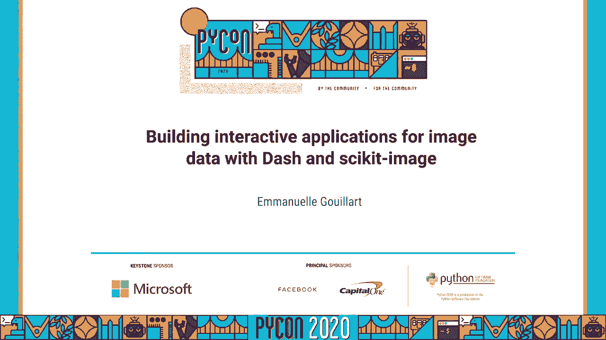

大家好，我叫伊曼纽尔•瓜尔，我是蒙特利尔 ploti的 python开发人员，同时也是灵媒形象开发小组的成员，所以这是我的第一个图标，我很兴奋能讲到交互式图像处理，我今天要展示的作品是，呃。

由陈曾伯格倡议资助，CCI和我要感谢cdi对科学的支持。在科学和商业上，图片是一个非常广泛的数据来源，并对这些图像进行精确测量，你想把这些测量转化为自动驾驶汽车的数字和科学知识。

你希望能够实时检测物体和距离，而且非常可靠，呃，你有其他类型的图像应用，如遥感，呃，卫星成像，例如，在所有这些应用程序中，您需要从您的图像中提取一些信息，如今，神经网络，算法和。

要将标签归属于整个图像的图像分类，那就是你在这个图像中有一些气球来更复杂的即时分割，但是这次你要给所有的像素贴上标签，对应于所有不同种类的物体，所以这里所有不同的气球。

你需要用所谓的训练集训练你的神经网络，那就是你需要对你的图像有一个基本的真理，为此你需要建立自己。

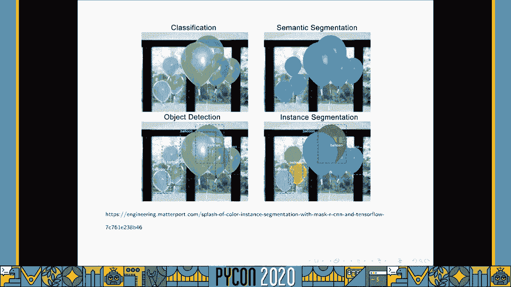

这套训练，呃，我做的注释是某种用户与图像的交互，例如，它可以在物体周围画边界盒，当你想训练你的目标检测算法时，但它也可以作为更经典的图像处理算法的注释，那就是，如果你想播种一个区域生长算法，呃。

使用属于给定对象的几个像素，或者如果你想测量，呃，长度，像边界盒这样的边界是不够的，你需要做一个非常精确的训练，所有物体的像素，这张遥感图像上的文字，那么我们如何构建一个好的图像注释。

这基本上就是我演讲的主题，首先让我向你们介绍，呃破折号，那么什么是破折号，它是一个网络框架，呃，它是麻省理工学院授权的开源软件。

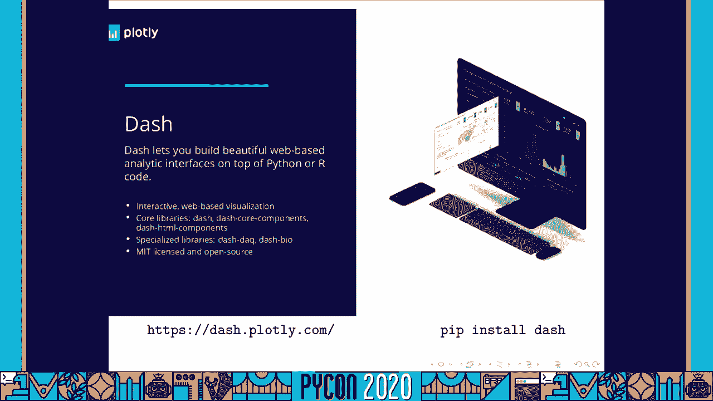

呃，dash的承诺是作为一个开发人员，呃，只有 python代码，你不需要知道任何 javascript，当然有很多 javascript在幕后运行 在代码中，但是作为一个开发者。

编写javascript的人不是你，所以这里有一个代码片段，它就像一个带有破折号的 hello world 网络应用程序，如你所见 这是条纯粹的蟒蛇，你定义了你的应用程序。

你用不同的组件来定义布局 这些组件会出现在你的应用程序中，在这里你有一个文本输入，这是一个反应组件，你可以在其中添加文本和一个深段落，所以这是为了定义一个布局，定义回调后。

回调是当一个输入被修改时执行的函数，在这种情况下，当你修改文本输入时，它将修改 div，如你所见 这是纯野牛，所以这个代码当然是一个非常好的世界小应用程序，但有了破折号 你可以建造一辆更先进更时尚的车。

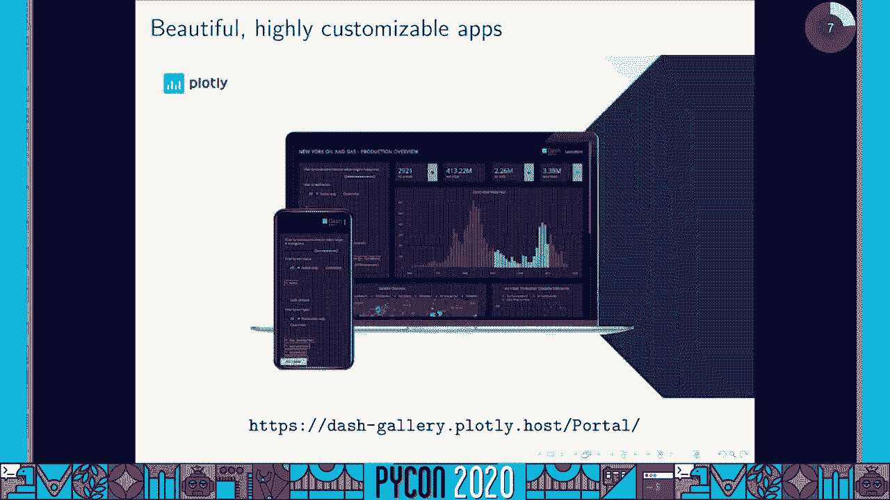

如果你去，到破折号图库的例子，你会看到很多不同的东西，这里有一个用破折号做的应用程序示例，你可以看到你有几个活性成分，比如这里的滑块，当你改变滑块的时候，它会更新你的图表，下降。

以及破折号应用程序的一个一流组件，反应图，所以这些图是用一个绘图库来绘制的，你也看到了 当我们修改组件时，我们可以修改图表，但是呃，图也是交互式的，从某种意义上说，它们能够发出像这里这样的事件。

当我选择这些县，这将触发一个回调，更新另一个图，所以呃，这里是另一个非常有风格的冲刺的例子，和，所以这个应用程序实际上是用破折号做的，但是用 r语言，因为呃，破折号用户最多，野牛节目。

但也有一个dash用户社区，用r编程，现在用julia编程。

所以说，关于破折号的更多信息 以及你可以用破折号构建哪种应用程序，你们有哪些可用的组件，它为你提供了所有常用的 html元素，组件，活性成分，那就是，呃，用户可以与这些组件交互，例如。

滑块与您的按钮一起下降，我在应用里告诉过你，反应图是破折号应用程序的一个非常重要的部分，我们以后再谈，您还拥有一个交互式数据表库，嗯，更专业的生物图书馆，例如。

dash使用的组件工厂是一个 reaction js框架，意思是如果你有 response javascript库，在 npm上有成千上万个，pi pi的 javascript的等价物。

然后你可以很容易地把它捆成破折号，这是破折号开发人员经常使用的东西，谁想发展，呃，快点，为了构建 dash的图像注释组件，我们用这个想法再利用，为图像标注做概念 快速证明。

所以我们使用反应草图 javascript库，它本身是基于织物 js库，我们建立了这个图像注释组件，我给你看一段视频，所以它给你的感觉是，一扇窗户让你可以，你可以画曲线，就像这里，长方形等等，当你按下。

有一个回调读取与您的注释相邻的字符串，您可以在回调中使用这些几何注释，同时也是麻省理工的执照，你可以用圆周率来安装，它有一个很简单的应用程序接口，如你所见，在这里。

它需要一个很好的名称或背景图像的图像摇摆，然后你可以控制按钮的种类，你想把它作为绘画工具，以及您希望注释看起来像什么，所以在这里你可以看到线条和矩形，还有写意的小路，您还拥有一些实用函数。

以便能够处理您的注释，你知道一个简单的方法，接下来我会说，呃，用于注解图像的破折号画布，我们缝的，我们能把这个图像注释功能放到绘图图库里吗，因为已经有，呃，使用 plotley的大量引信，所以露易丝。

事实上，基于 Web的 python库，下载次数最多，普洛特利已经很有互动性了，我这里有个小例子，嗯，当你在不同的维度上反省一组数据时，你可以选择一部分数据，你可以看到它也被选择在其他支线情节中。

你可以看看你的数据，感谢先进的悬停信息，但是我们以前没有注释工具，我们得到的是一个布局形状对象，例如线或矩形。

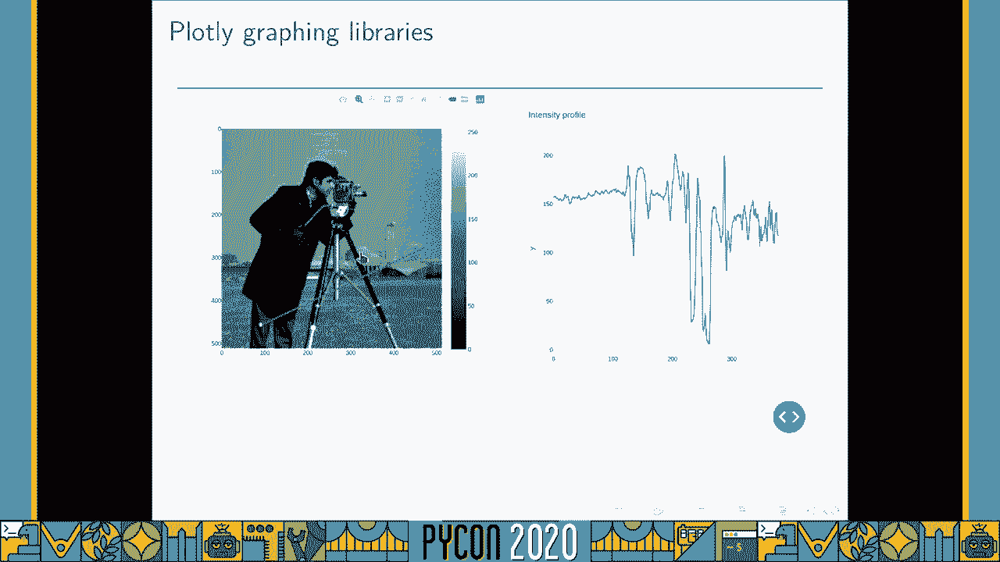

这是一个由洛特利制作的形状演示，所以这里你有一个线形覆盖在一个图像上，也有可能移动剃须，它是可编辑的，当你这么做的时候，你会得到更新的图像的强度轮廓，所以这是一种注释图像的方法。

但是这在当前版本的 Plotley中已经可以使用了，但是你不能用这个用户界面添加一个新的形状。

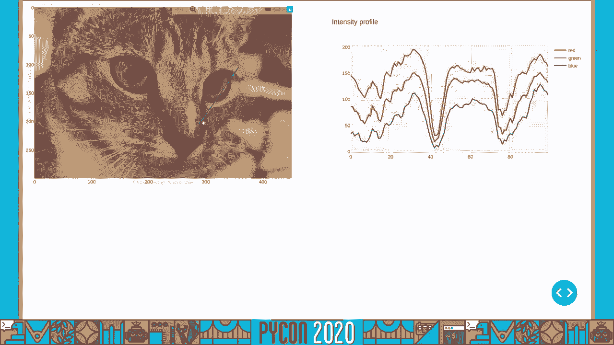

即将推出新版本的情节，这将给你一个模式栏 所有这些绘图工具，就像呃，开放和封闭的路径，长方形，圆圈，等等，所以，这个，当你画这些形状的时候，它也会释放出，我们为破折号应用程序布局数据事件。

您将能够捕捉到注释的几何学，所以应该会在一、两周内发布，但我无法抗拒。

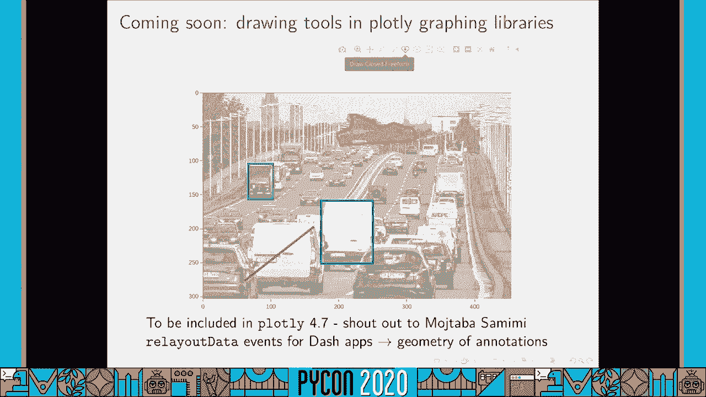

让我开始一个长方形，我想在上面做，等等，如果我回到我的形象，注释已保存，因为回调已经捕获了它们 并将它们存储在存储中。

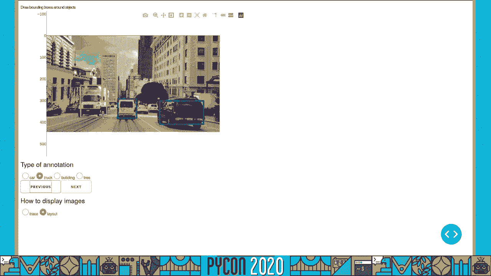

所以这就是一、两周后将要发生的事情，我们将有所有这些绘图工具可用在，所以现在我们将有，我们将如何处理注释，所以在某些情况下，和，不要太在意注释，但在很多情况下，你需要做一些预处理或者一些表格的处理。

为此我们很幸运 破折号是用蟒蛇写的，同时你也得到了所有的蟒蛇科学堆栈，我刚刚，呃，把一个破折号应用程序的截图，但在这里为了处理图像注释，我们将使用灵媒图像，但对于图像处理来说，所以什么是心灵意象。

是蟒蛇科学图像处理的工具箱，是个图书馆，意味着它不是一个终端用户应用程序，嗯所有，图像处理应用程序或新脚本，它更关注科学图像，广告或其他类型的图像，所以我们没有 Instagram滤镜，例如，嗯。

它可以同时处理二维和三维图像，因为在科学中 比如在 y或者你有很多三维图像模式，一个经常被问到的问题是，心灵意象和开放有什么区别，CV，文件，它在网站上有一个相当进步的文档，并有一个例子库。

还有一些初学者的教程，是你，是土生土长的蟒蛇，也是图书馆，所以如果你是 python用户，你可能会觉得从精神图像开始更舒服，而不是所有的图书馆都喜欢开放式简历，哪个有蟒蛇绑定，但写的是c++或c。

另一方面，公开简历是，呃，大多数时候比灵媒想象的要快，感谢非常优化的c++代码，但我们正在努力弥合这一差距，把灵媒专业越修越快，所以在贡献者方面，我们很幸运有一大群投稿者，非常感谢他们所有人。

而且核心维护的数量也少得多，但如果你有兴趣，我们非常欢迎你 我们正在积极寻找，尽可能多样化的人，向您展示一些第一步的小代码，另一个你好的世界，但这次用的是灵媒形象，导入子模块，然后你读了一个图像文件。

你把它作为帝国的方式打开，一旦你有了数字数组对象，然后你会在图像上调用一个来自精神图像的函数，它会给你一个图像，然后用这种新方法调用另一个函数，您将得到另一个数组，以此类推，以构建您的图像处理管道。

那么，您如何使用这个通灵的图像函数来进行图像注释呢？其实，很多人通常只把通灵图像用于少数几种功能，哪些对应用程序有用，不出所料，心灵意象最广泛使用的功能是，O。

dot在 read函数中从文件名中读取 mpy方法，但你也有一个白色的，也是几何变换，就像，假设，你在注释你的图像来纠正倾斜的地平线，从回调中的注释，在一个破折号应用程序中。

它将把其中一个称为精神图像功能，这将是旋转函数的变换，以纠正这个，这张幻灯片的最后一个例子是绘图和测量工具，在那里你想测量一些数量 从你的图像，这是我之前展示的应用程序的一部分代码。

你想测量线的强度分布，所以在破折号应用程序中，当你得到线的几何形状，你得到的是终点，如果你想知道整个侧写，然后您可以调用这个模式行函数，它会给你线上所有像素的坐标，所以这是一种效用函数。

所以多亏了这一切，呃，算法，破折号画布代码实际上很小，因为它使用精神图像来操纵图像，以及图像中物体的几何形状，但除了这些效用函数，我在这里放了一些例子，例如，如果您想消除图像中的一些噪声。

请进行恢复和过滤，特征提取分割，即标记对象的像素，或者一些先进的措施和图像，呃，主要是因为架构限制，但它是一个很好的预处理工具，呃，推出深度神经网络算法，或者做很多你想做的后期处理，计算物体的测量值。

例如，和一个通灵的形象，例如，在精神图像中有一种提取特征的可能性，这个特征提取器可以，嗯，根据兴趣点，比如你形象的角落，也可以是图像中的小斑块的特征。

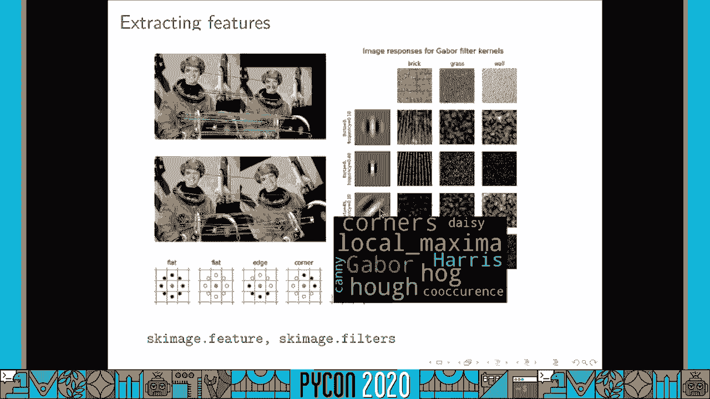

我有，呃，一个演示给你看，就在这里出现了这个画面，又来了，这个破折号画布，注释工具，我想提取这位女士，并删除背景，之后我会打电话给你，移除背景，你可以看到它很好地去除了背景，它的工作原理是。

通灵图像计算超级像素，把图像分割成小块，然后它计算特征，在注释和补丁下，远离注释，它调用了一个随机森林分类器，这就是分割的方式，嗯所以呃，我想给你看最后一个演示 给你看这个图像，我们正在开发的注释工具。

这一次绘图图库，所以这里有一幅图，但这是一个开发版本，所以你有这个画图按钮，你就可以画出，就像这里打开通道，所以我在这里追踪这个器官的一个非常粗略的轮廓，在医学图像中，我想是什么地理。

当我按下这个神奇的剪刀按钮，我叫破折号回调，哪个，你有这个紧凑的轮廓 对应于分割。

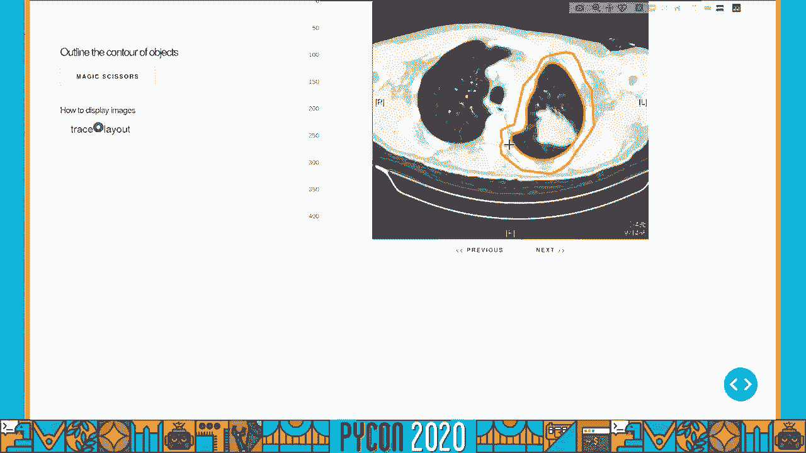

所以呃，为了结束这次演讲，我想说的是，破折号和通灵图像在文档上有很大的努力，它们都是基于例子，以下是通灵图像库的快照，所有这些缩略图，你可以点击一个缩略图，你有，呃，代码和结果，你也一样，呃，策略。

有很多例子可以开始，所以我希望你，呃现在希望呃两次作为工具，也许我会看到你在社区论坛上，我们有一个给普特利和达什的，另一个是通灵图像，我很想和你保持联系。

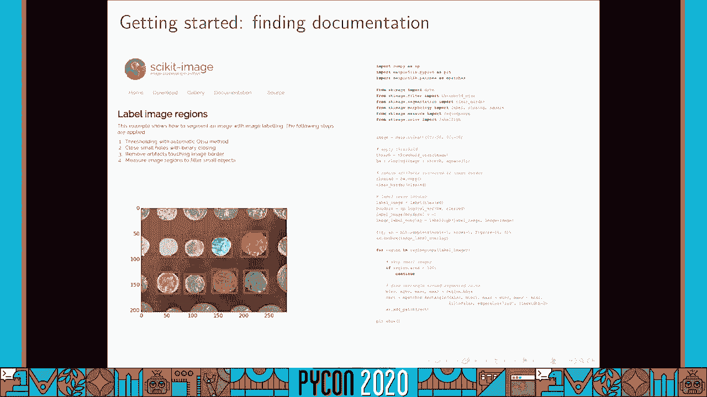

所以如果你想联系，我在推特上。

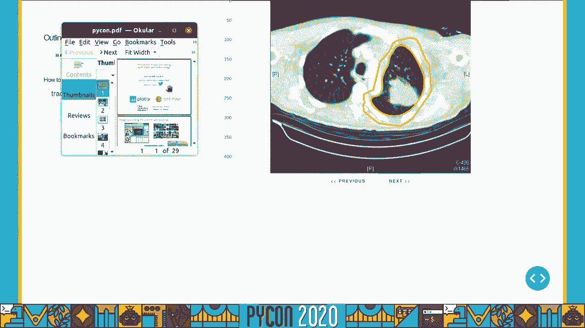

这又是我的推特手柄。

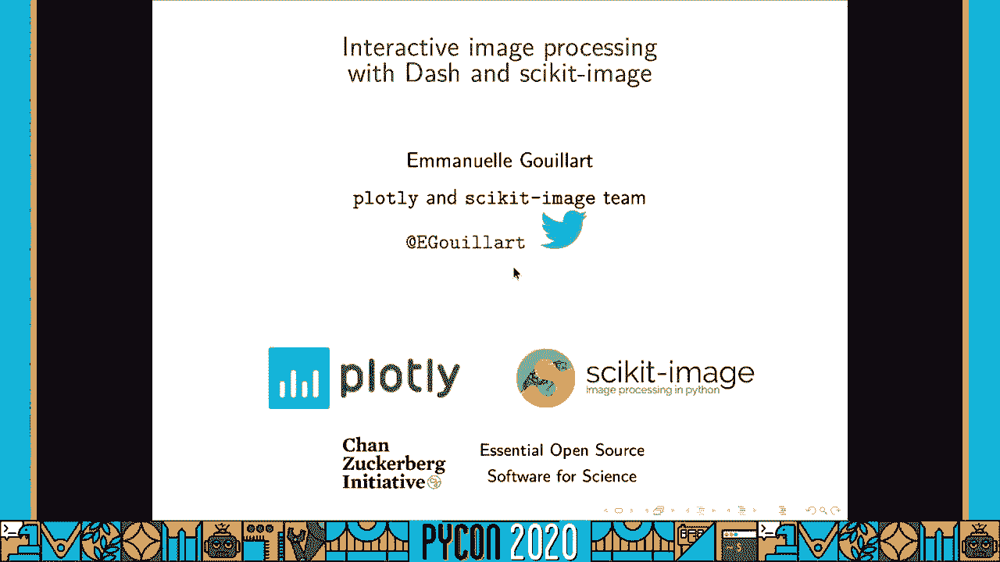

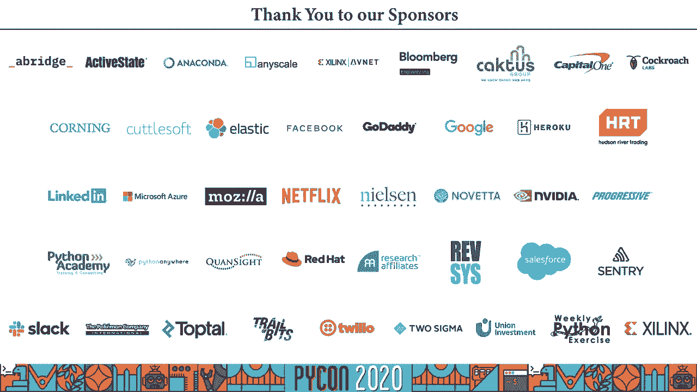