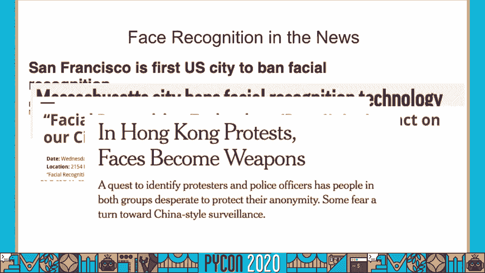
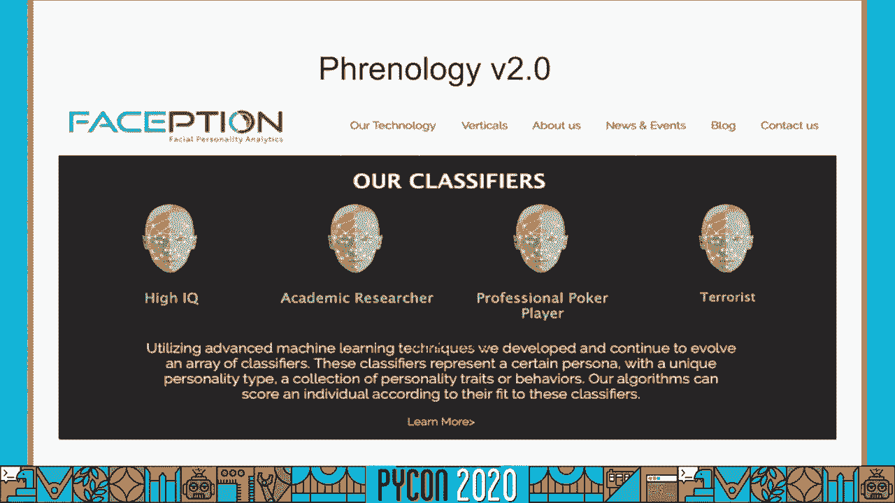
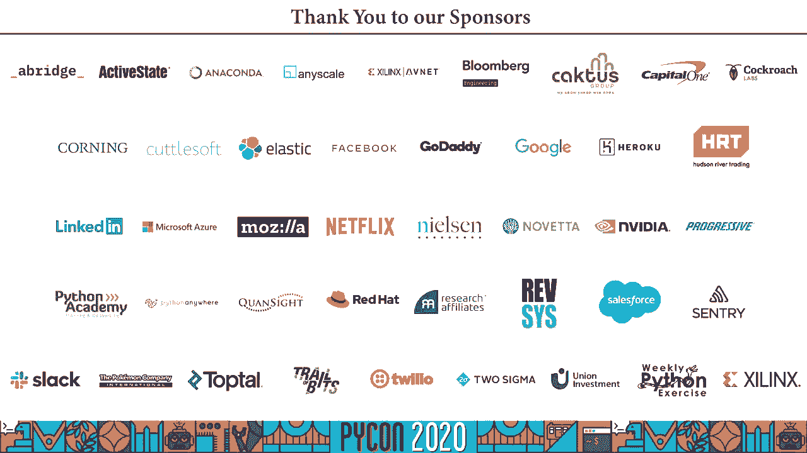

# PyCon US 2020 - P54：Talk Manojit Nandi - The Limitations and Danger of Facial Recognition - 程序员百科书 - BV1rW4y1v7YG

你好，我叫蒙诺吉诺伊，这是我的演讲，因为我要说的是关于面部识别技术的争议，一开始我需要这份免责声明，在这次演讲中所反映的所有观点和观点都是我自己的，别把我老板的想法，我创造了这个，我研究了这个演讲。

他们认为这个话题，创造了这个谈话，出于个人兴趣，2。这跟我的工作毫无关系，也不是为了我的雇主，所以我想出了这个演讲的概念 去年五月，蟒蛇二十九结束后不久，然而，从五月二十九到现在，第一。

我们开始看到某些城市，政府和执法人员，其他城市也开始效仿，之后，及其对公民自由的潜在影响，然后，在国际意义上。

然后某些国家如法国或印度，为了他们国家的所有公民，安全和隐私方面的担忧，而最近随着 COVID十九在全球大流行，一些国家已经开始讨论我们如何使用面部识别，以便查明违反家庭庇护程序的个人。

或者我们如何追踪 COVID检测呈阳性的患者，确保他们自我隔离 不在公共场合外出，可能会感染其他个体，不仅仅是监视，我们也开始看到面部分析技术的兴起，我们可以扫描你的脸，告诉你作为一个人是什么，IQ。

否则你会是个好员工，或者在一个，这是基于一种非常古老的伪科学 叫做颅相学，你可以，你大脑的结构和形状，决定了你是什么样的人，颅相学就像，看它在18世纪和19世纪初被推广，作为宣扬种族主义的一种方式。

那个，非洲个体的大脑是不同的，从白种人的大脑中，因此有一种基因决定论，如果你有这样的脸，或者如果你有其他类型的面部结构，你会成为一个非常成功的政治家或商人，这很可怕。

因为这在过去被用来宣扬种族主义和其他社会印象，但现在我们把它围绕在脸的技术神秘主义上，因此，现在我们正在延续种族主义和社会危害，通过科技手段，我觉得这很重要，因为当我们谈论人工智能的危险时。

我们说的不是终结者或九千哈尔，我们不是在谈论这种潜在的危险，在推翻人类的道路上，人工智能可以代表，当我们谈论算法和人工智能正在伤害的方式时，我们会谈论，今天的人们，有很多关于这个主题的书。

算法在某种程度上加剧了社会不平等，关键是，这里有很多像这样的，我展示了很多书，但这是一个已经研究了一段时间的话题，有一个领域叫做科学，技术与社会，致力于了解，呃，技术对整个社会的影响。

也是社会投入循环的另一面，使某些技术成为必然，所以现在我们讨论算法可以保护，助长偏见和伤害，所以这是一幅欢乐的画面，波拉伊尼·乔伊在参观研究生院，她对研究机器人技术很感兴趣，她在大学里去了这个学校。

她正在和这个机器人互动，它应该扫描命运，与之互动，所以她想爬上这个机器人，机器人无法识别她的脸，探测她的脸，它无法探测到她的脸，直到她戴上这个白色面具。

所以现在乔伊真的把她在麻省理工学院媒体实验室的研究生工作，所有这些类型的算法偏见，它在某种程度上强化了社会偏见，因此根据乔的经验 那个机器人无法探测到，探测器，探测她的脸。

她着手并创建了这项名为基因空间的研究，她设计了多种人脸分析系统，她做了交叉过程审计，对白人男性面部的检测，白人女性，黑人男性和黑人女性，我认为这是一个非常重要的，因为我们通常在算法中谈论公平性的方式。

算法公平性 文献中的算法公平性有点像，在这些不同的类别中，与世隔绝，我们需要谈谈种族问题，或者我们谈论性别，我们不谈论种族和性别的交叉，在她的书房里，她发现。

这些商业上可用的系统错误地识别了深色皮肤的女性，以更高的速度，与其他群体相比 百分之二十到三十五，所以深肤色女性的错误率要高出百分之二十到三十五，与浅色皮肤的男性相比，这是非常令人担忧的，因为如果你是。

一个数据科学家 你训练了一个模型，它有百分之六十七的准确率，你可能不被允许查看测试数据，你可能不被允许把它投入生产，然而，这些系统在商业上是可用的，所以乔伊和胆小的加布公布了他们的工作成果。

他们公布审计结果，我产生了很大的影响，所以接下来，呃，所以 IBM，看到结果了，他们看到了他们在深色皮肤上做得有多糟糕，呃，妇女，所以他们开始纠正这个错误，他们来设计这种多样性和面孔，数据集。

这组人脸数据，代表不同种族背景的人，他们还制作了这份关于他们对人工智能的承诺的相关白皮书，谷歌也制作了类似的东西 比如他们自己的人工智能原则，为了对深色皮肤的人也起作用，此外。

城市和州通过的一些立法禁令也代表了这项研究，去年在布鲁克林有一场非常大的法律斗争，纽约这个大西洋广场的塔楼，这主要是，呃，所以公寓的住户们做了调查，他们偶然发现了性别阴影研究，死亡兄弟，对我们没有好处。

这些女性很有可能被锁在公寓外面，并遵循性别阴影，比如我们怎么测试，我们将执行算法审计，这是好的和坏的，因为你如何得到一个多样化的数据集 是一个非常开放的问题，一些公司在做什么。

为了建立自己多样化的数据集 是非常不道德的，例如，IBM，通过爬行创建多样性和人脸数据集，度假相册中肤色较深的个人度假照片，在 flickr上，谷歌在支付更黑暗的费用时 也在做类似的事情。

黑人和棕色人种的自拍，或者他们用的是，呃，雇佣专家去亚特兰大给无家可归的人拍照，也就是说，你知道吗，超级可疑和高度不道德，所以黛比，拉吉，一些研究性别阴影的原作者做了这项后续研究。

所以他们所做的就是创建了这个数据集子集，这是一个数据集，顾名思义，用名人照片，你创建了一个白人男性名人的数据集，白人女性名人，呃，黑人男性名人和黑人女性名人，这样你就不会有隐私问题。

我们不用担心收集和爬行，和过度的爱，嗯，黑人和棕色人种，关于这篇论文的关键内容，他们谈论隐私和公平之间的一些紧张关系，但他们也为那些想做算法审计的研究人员提供了，需要考虑的一些问题，就像。

如何设计好的审计，你如何设计一个有意义的审计，你如何设计审计来鼓励目标公司，然后改进他们的软件，接下来我们将讨论情感识别或自动性别运动识别，所以这就是，就像，我们能根据你的面部照片来估计你的情绪状态吗。

这是一个非常贴近和亲爱的话题，我的心，因为当我开始做心理学研究员的时候，我非常感兴趣的是，就像，整体作用，情绪在人类决策中所起的作用，嗯，当你在科技行业工作时，这是一个非常有趣的话题，你得去见个人。

他毫不讽刺地相信人类没有情感会更好，所以我们来谈谈莫，有一位美国心理学家保罗艾克曼 他在20世纪60年代，二十世纪七十年代，他周游世界，研究不同文化中人们的情感，所以不同文化背景的人。

但同时也与土著居民合作，他发现它们是所有人类共有的六种情绪，不管他们的教养如何，这六种情绪就是幸福，悲伤，恐惧，愤怒，惊讶与厌恶，现在，如果你看过这部电影，迪士尼皮克斯电影由内而外。

这六种情绪中的五种听起来可能对你来说很熟悉，失踪的那个是个惊喜，此外，保罗·艾克曼也提出了微表情的概念，当我们体验到一种情绪，我们不由自主地本能地，呃，类似概念，但我们只是不由自主地创造了这个短。

情绪的面部表情，你的感觉，因此我们建议创建面部动作编码系统，这是一种定义情感的模式，从面部表情来看，以及面部动作编码系统是如何工作的，把脸分成不同的面部动作单元。

然后你可以把一种情绪描述为行动单位的总和，例如，我们说愤怒等于嘴唇缩小，双眼闪耀，眉毛皱起，这在2000年后期很流行，科学启发的犯罪剧欺骗了我，是关于一个心理学家使用面部动作编码系统。

比如情绪分析来识别罪犯是否撒谎，所以有了面部轴线编码系统，情感识别背后的想法就像，我们可以用这个分类法来描述基于情绪的人脸，使用计算机视觉算法来识别面部的动作单元，然后输出我们认为最有可能的运动。

根据发现的行动单位或确定的行动单位正确，应该工作良好，这是有问题的，去年，一组心理学家对一千多篇论文进行了广泛的审查，谈情绪，面部表情与情绪的关系，他们得出的结论是 面部表情并不能正确地代表情绪状态。

原因有三，这就是人们表达相同情感的方式，他们可以用不同的方式做到这一点，例如，你看这些照片就在这里，我们有两张女人的照片，我们都知道她们有这种愤怒的情绪，但他们表达的是愤怒，通过两种截然不同的面部情绪。

上图是一个闭着眼睛张着嘴的女人，第二张照片是一个闭着嘴的女人，眉头紧锁，所以这是用两种截然不同的面部表情表达的相同情绪，其次是缺乏具体性，所以面部构造和特定情绪之间没有唯一的映射。

一种情绪可以用许多不同的面部表情来表达，一个面部表情可以代表许多不同的情绪，这与有限泛化上下文的最后一个概念联系在一起，这个上下文是缺失的，我们只看到一张脸的照片，我们不知道为什么我们说。

我们不明白上下文，或者任何关于这个人正在经历的事情的一般背景，如果你看到有人哭的照片，他们因悲伤而哭泣，他们经历死亡或失去亲人，还是他们在幸福地哭泣，所以他们克服了一些艰难的理想。

接下来我们来谈谈计算机是如何看待性别的，尤其是当我谈到性别时，性别建议系统，我想谈谈这些系统对跨性别和非二元个体的影响，所以这里有一个非邪恶的小图片，为什么我们，我们如何使用性别识别系统，好吧。

这是出租车后座的平板电脑，扫描乘客的脸，它试图根据估计的性别来估计乘客的性别，然后向你展示最相关的广告，因为毕竟，如果你不想解决如何优化广告的问题，点击通过费率，你真的在做数据科学吗，所以在2018年。

OSkies对这些自动性别识别系统在人类领域中的应用进行了文献回顾。计算机交互，基思研究了性别在这些系统中是如何定义的，他们发现性别总是被定义为二元变量，性别总是被定义为男性或女性。

性别是由你的外表决定的，你是男的，如果你看起来像男性，如果你看起来像女性，你就是女性，他们认为这些系统本质上排除了跨性别和性别，非二元个体，通过使用与跨性别者本质上不一致的性别定义。

跨性别和非二元个体的存在，然后，这些系统将使对它们的伤害永久化，我们看到，呃，例如，两年前，优步在他们的司机验证软件中遇到了这个问题，验证系统基地的驱动程序，锁定跨性别非二进制驱动程序，基本上。

司机们每隔一段时间就会上传一张自己的自拍，到优步的数据库，只是为了让优步可以验证这一点，这个，和这个司机在一起的人 就是他们所说的那个人，会发生的事情是将变性司机拒之门外。

因为他们在激素替代疗法前后会有不同的面部结构，所以跟进奥斯特的工作，呃，科罗拉多大学的三名研究人员进行了，这些商业上可用的性别识别系统在培训和性别非二元个人方面的表现如何，所以我想，两者的关系在于。

oz的工作在某种程度上奠定了这个理论框架，自动性别识别系统在本质上是不一致的，与跨性别、跨性别和性别非二元个人，这项工作是一种经验结果，比如这些系统，所以他们打电话给，呃。

他们从 Instagram上收集了两千四百张图片，代表七种性别身份，所以他们用这七个不同性别的标签搜索图像，同性恋男人，非二元跨性别男性，跨性别，妇女和妇女，例如，这是报纸上的图像，它们所显示的是。

这是一张带有年龄性别标签的个人照片，但在性别识别系统中，它说这张照片中的个人是女性 或者这张照片中的个人，照片上是一位年轻的女士，因此产生的个体，因此，在他们对这些性别识别系统的审计中。

他们发现有跨性别者，男性或变性女性标签被错误性别的比例要高得多，与同型个体相比，错误率高10%至30%，这是非常重要的，因为这些系统是在没有个人同意的情况下工作的，他们会根据监控照片扫描你的脸。

再给你贴上性别标签，所以这些人可能会违背他们的意愿 被错误地对待，从而使他们在情感和身体上受到伤害，最后我们讨论了面部识别系统的局限性，我们谈到了面部识别是如何与种族斗争的，如何与情绪作斗争。

以及它如何与，呃，性别二元之外的性别定义，所以现在让我们来谈谈这些系统在实践中是如何使用的，因为我们无法将技术本身，坏用例中的坏技术，这是一个非常强大的行动 由凯特，艾诺研究所的克劳福德。

我们应该呼吁美国暂停使用面部识别技术，她有一个声明，这些工具当它们失败时是危险的，当它们工作的时候是有害的，所以去年出了个大丑闻，结果发现纽约警局的警官，为了不正当地，他们会做的是 如果犯罪发生。

有目击者说，哦嘿嘿，嫌疑犯看起来像名人伍迪·哈里森，去谷歌，拍张伍迪哈里森的照片，在这个面部匹配系统中进行比对，因为他产生了潜在的线索，系统会显示出潜在的匹配，他们会去逮捕那个人，所以这真的很糟糕。

因为系统不是设计用来，就像它不是设计用来，名人照片长相，它不是设计用来，警方的手绘草图 警方的草图进入系统生成线索，所以嗯，所以有点像，我们对这些技术是如何使用的 没有任何责任。

所以我们没有办法阻止这些技术的滥用，但除了滥用，然后是另一个问题，比如这些技术何时被正确地使用来造成伤害，例如，在中国，把他们围捕起来 关在集中营里，这是一个大问题，因为没有国际标准来规定我们如何。

不能使用面部识别和生物识别数据，没有任何责任，这一点很重要，因为技术是一种力量的概念，我们必须考虑技术的使用方式，我们作为软件开发人员，我们需要考虑的事实是。

我们的算法和我们构建的技术存在于人类系统的背景下，我认为这是我们的一部分 当我们设计新的工具时，我们不建造，强化压迫性社会政治 权力不平等的技术，例如，我做了很多工作，怎么会，我们能把面部识别技术。

更擅长识别黑人和棕色人种的脸，如果你消除你的技术 并使其更好地识别黑人和棕色人种，然后你把技术卖给洲际交易所，我认为这个机构的存在主要是为了残酷对待有色人种社区，你所做的就是给他们一个更好的工具。

骚扰和恐吓这些人口，技术和动力的关键是，制造这些工具的技术人员很少，那些经历伤害的人，他们才是真正受到科技负面影响的人，制造技术的主要是身体强壮的白人，嗯，谁是受这些技术伤害最大的人，身体不好的白人。

我认为这就是为什么科技的多样性和人工智能的多样性是非常重要的，因为是房间里的人决定如何使用技术，房间里决定用技术解决什么问题的人，如果房间里有不同的体验，或故意被滥用或故意使用，为了伤害或攻击，呃。

有着不同的人生经历，最后一件事是当我们谈论像面部识别这样的建筑技术时，在我们谈论我们如何构建这项技术和如何设计这项技术之前，在我们建造它之前，我们应该问自己这个非常重要的问题，我们是否应该建立这些系统。

我觉得这很重要，在这个伦理的未来，人工智能和负责任的人工智能空间是我们应该能够问自己，这项技术值得建设吗，我们认为，如果答案是否定的，我们不应该建立这种技术，因为我们相信它会伤害某些群体或某些个体。

那么我们根本就不应该建造它，我们现在开始看到这一点，软件工程师不认可的，所以，他们公司对气候的影响，为了促进，喜欢更多的气候，节能数据中心，向两个以上的人签署了承诺，我们身边的一千名学生。

大学签署了一份承诺书，称他们不会为公司工作，Palantir，他们不想制造用来伤害，嗯，伤害这些社区，所以现在出现了一个重要的话题，AI是我们如何赋能开发者。

我们如何赋予数据科学家和工程师这种拒绝的权利，我们如何让数据科学家和工程师集体组织起来，说不，我们不会建造这项技术，因为我们相信它会造成严重的伤害，因此，这项工作借鉴了政府法规的灵感。

所以想想京都议定书或者哥本哈根议定书，或者京都协议和哥本哈根协议，但也有管理策略，比如什么样的组织结构会让员工感到安全，从而提出担忧，不用担心失去工作，同时也是，如果你建立一个系统，你意识到，好吧。

如果你部署会造成伤害，你怎么能很容易地摧毁这个系统，在研究范围内，我们希望设计出通用的框架，让科技员工能够，为了，这就是我要说的，以下是我引用的所有作品。

