# PyCon US 2020 - P5：Charla Renne Silva Gomes de Oliveira Rocha - Si no está documentado, su proyecto - 程序员百科书 - BV1rW4y1v7YG

 (speaking in foreign language)。

 (speaking in foreign language)， (speaking in foreign language)。

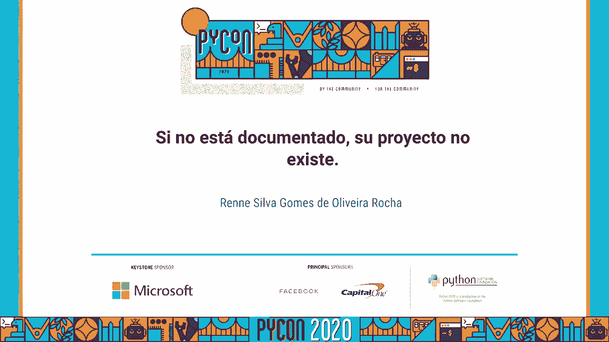

 (speaking in foreign language)， (speaking in foreign language)， (speaking in foreign language)。

 (speaking in foreign language)， (speaking in foreign language)， (speaking in foreign language)。

 (speaking in foreign language)， (speaking in foreign language)， (speaking in foreign language)。

 (speaking in foreign language)， (speaking in foreign language)， (speaking in foreign language)。

 (speaking in foreign language)， (speaking in foreign language)， (speaking in foreign language)。

 (speaking in foreign language)， (speaking in foreign language)， (speaking in foreign language)。

 (speaking in foreign language)， (speaking in foreign language)， (speaking in foreign language)。

 (speaking in foreign language)。

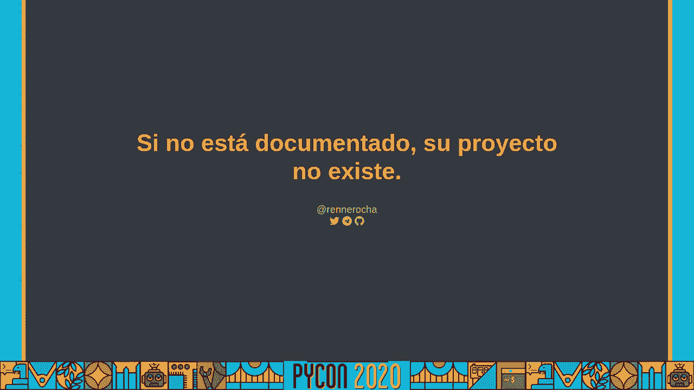

 (speaking in foreign language)， (speaking in foreign language)， (speaking in foreign language)。

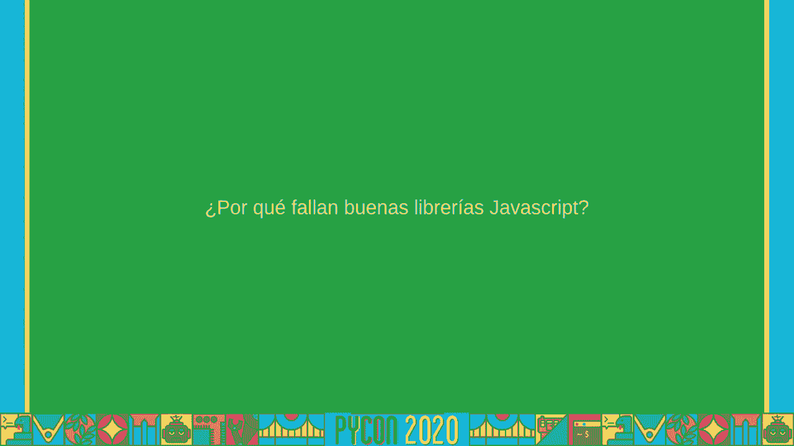

 (speaking in foreign language)， (speaking in foreign language)， (speaking in foreign language)。

 (speaking in foreign language)， (speaking in foreign language)， (speaking in foreign language)。

 (speaking in foreign language)， This one， uh， has been a big adaptation。

 but perhaps not only can we look at what we want， but want us to think that we want to see the way。

 I want to be grateful to all of you for your support。

 I want to be grateful to all of you for your support。

 I want to be grateful to all of you for your support。

 I want to be grateful to all of you for your support。

 I want to be grateful to all of you for your support。

 I want to be grateful to all of you for your support。

 I want to be grateful to all of you for your support。

 I want to be grateful to all of you for your support。

 I want to be grateful to all of you for your support。

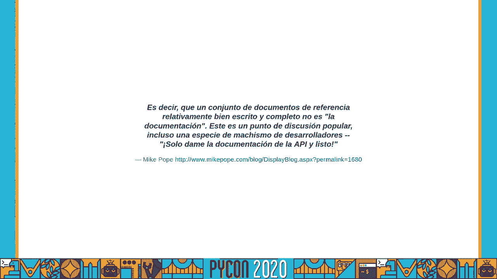

 I want to be grateful to all of you for your support。

 I want to be grateful to all of you for your support。

 I want to be grateful to all of you for your support。

 I want to be grateful to all of you for your support。

 I want to be grateful to all of you for your support。

 I want to be grateful to all of you for your support。

 I want to be grateful to all of you for your support。

 I want to be grateful to all of you for your support。

 I want to be grateful to all of you for your support。

 I want to be grateful to all of you for your support。

 I want to be grateful to all of you for your support。

 I want to be grateful to all of you for your support。

 I want to be grateful to all of you for your support。

 I want to be grateful to all of you for your support。

 I want to be grateful to all of you for your support。

 I want to be grateful to all of you for your support。

 I want to be grateful to all of you for your support。

 I want to be grateful to all of you for your support。

 I want to be grateful to all of you for your support。

 I want to be grateful to all of you for your support。

 I want to be grateful to all of you for your support。

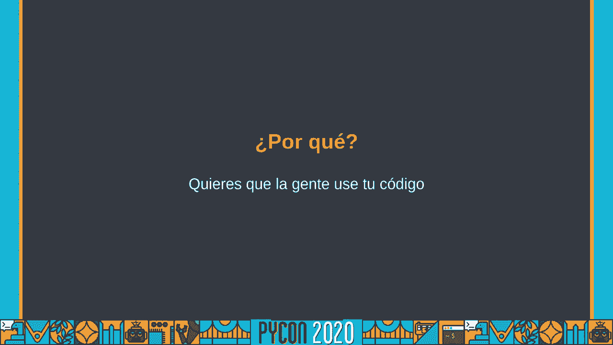

 I want to be grateful to all of you for your support。

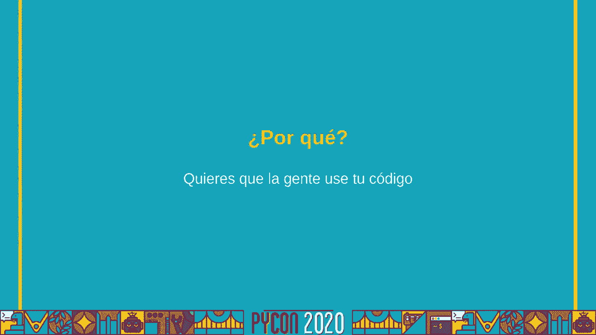

 I want to be grateful to all of you for your support。

 I want to be grateful to all of you for your support。

 I want to be grateful to all of you for your support。

 I want to be grateful to all of you for your support。

 I want to be grateful to all of you for your support。

 I want to be grateful to all of you for your support。

 I want to be grateful to all of you for your support。

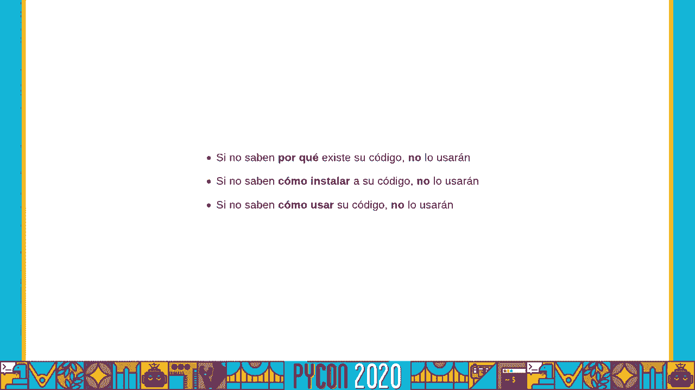

 I want to be grateful to all of you for your support。

 I want to be grateful to all of you for your support。

 I want to be grateful to all of you for your support。

 I want to be grateful to all of you for your support。

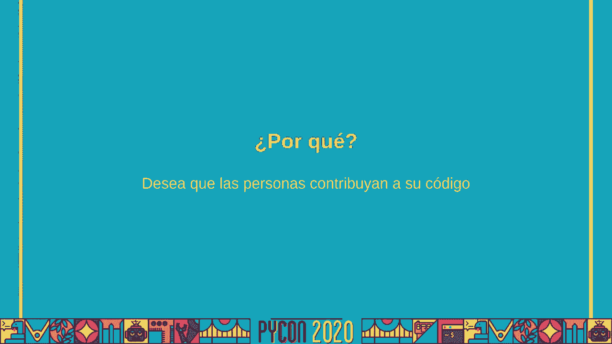

 I want to be grateful to all of you for your support。

 I want to be grateful to all of you for your support。

 I want to be grateful to all of you for your support。

 I want to be grateful to all of you for your support。

 I want to be grateful to all of you for your support。

 I want to be grateful to all of you for your support。

 I want to be grateful to all of you for your support。

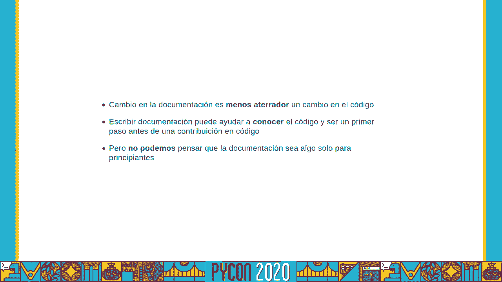

 I want to be grateful to all of you for your support。

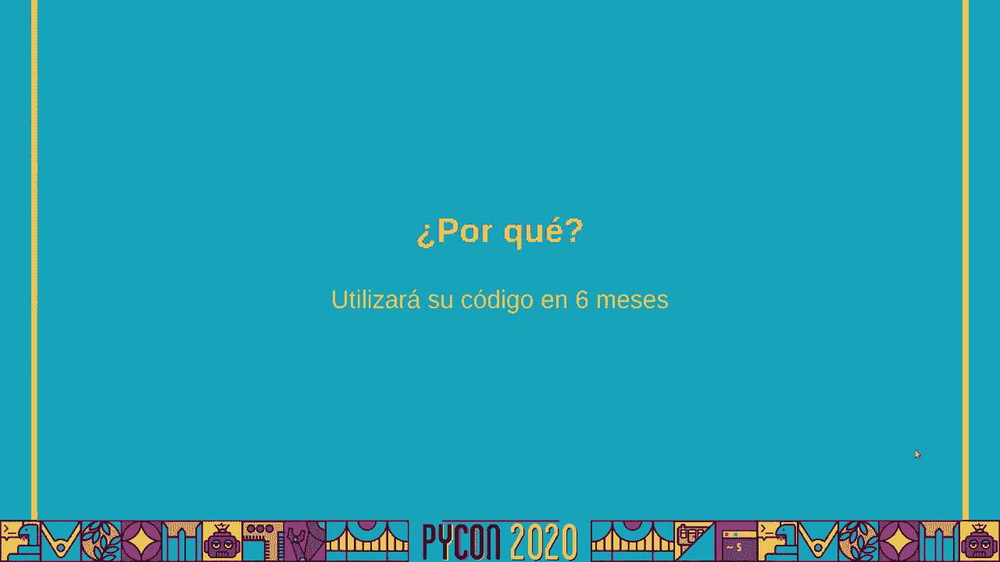

 I want to be grateful to all of you for your support。

 I want to be grateful to all of you for your support。

 I want to be grateful to all of you for your support。

 I want to be grateful to all of you for your support。

 I want to be grateful to all of you for your support。

 I want to be grateful to all of you for your support。

 I want to be grateful to all of you for your support。

 I want to be grateful to all of you for your support。

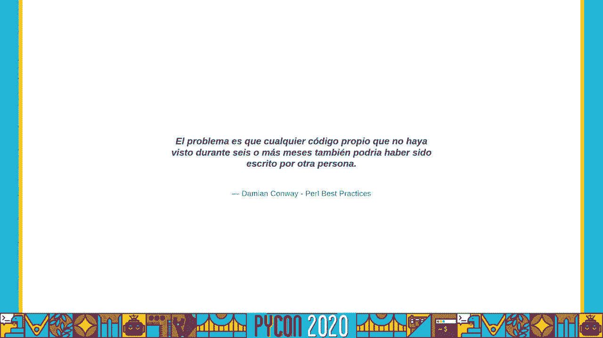

 I want to be grateful to all of you for your support。

 I want to be grateful to all of you for your support。

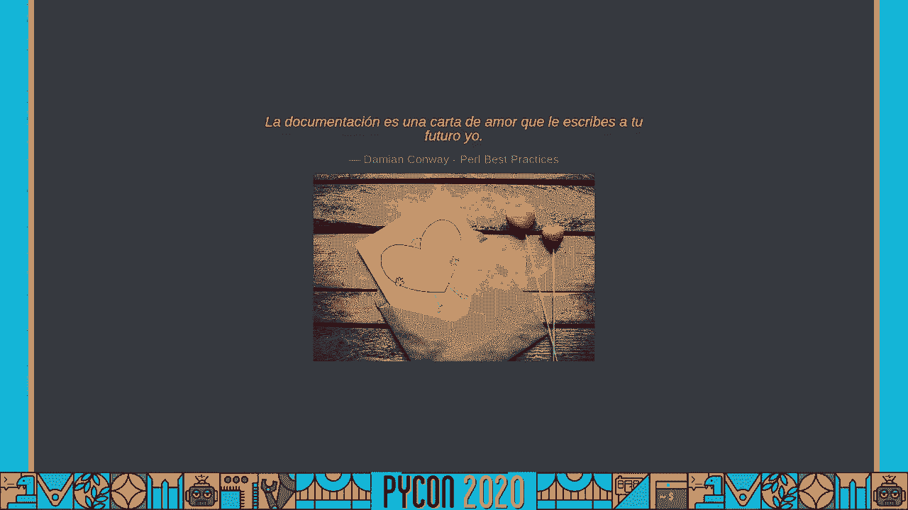

 I want to be grateful to all of you for your support。

 I want to be grateful to all of you for your support。

 I want to be grateful to all of you for your support。

 I want to be grateful to all of you for your support。

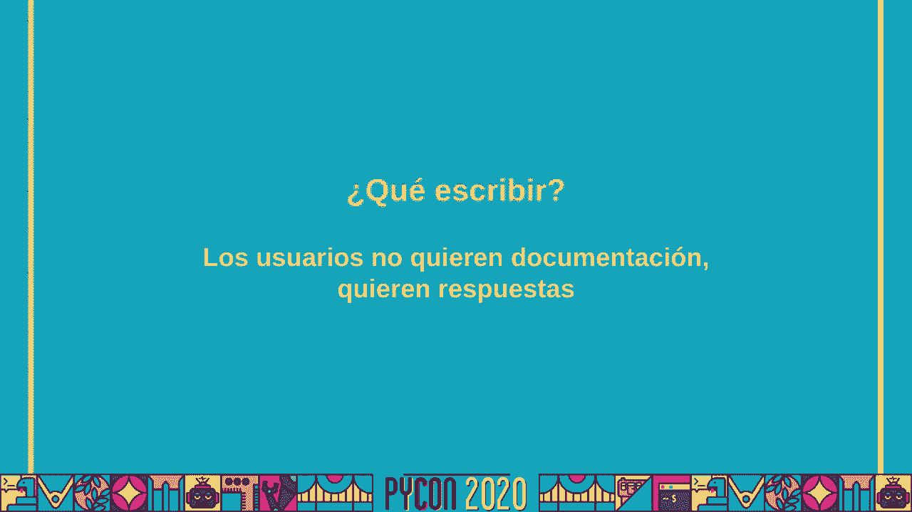

 I want to be grateful to all of you for your support。

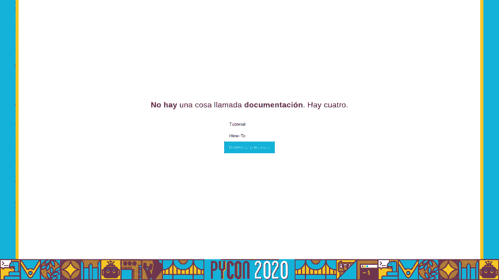

 I want to be grateful to all of you for your support。

 I want to be grateful to all of you for your support。

 I want to be grateful to all of you for your support。

 I want to be grateful to all of you for your support。

 I want to be grateful to all of you for your support。

 I want to be grateful to all of you for your support。

 I want to be grateful to all of you for your support。

 I want to be grateful to all of you for your support。

 I want to be grateful to all of you for your support。

 I want to be grateful to all of you for your support。

 I want to be grateful to all of you for your support。

 I want to be grateful to all of you for your support。

 I want to be grateful to all of you for your support。

 I want to be grateful to all of you for your support。

 I want to be grateful to all of you for your support。

 I want to be grateful to all of you for your support。

 I want to be grateful to all of you for your support。

 I want to be grateful to all of you for your support。

 I want to be grateful to all of you for your support。

 I want to be grateful to all of you for your support。

 I want to be grateful to all of you for your support。

 I want to be grateful to all of you for your support。

 I want to be grateful to all of you for your support。

 I want to be grateful to all of you for your support。

 I want to be grateful to all of you for your support。

 I want to be grateful to all of you for your support。

 I want to be grateful to all of you for your support。

 I want to be grateful to all of you for your support。

 I want to be grateful to all of you for your support。

 I want to be grateful to all of you for your support。

 I want to be grateful to all of you for your support。

 I want to be grateful to all of you for your support。

 I want to be grateful to all of you for your support。

 I want to be grateful to all of you for your support。

 I want to be grateful to all of you for your support。

 I want to be grateful to all of you for your support。

 I want to be grateful to all of you for your support。

 I want to be grateful to all of you for your support。

 I want to be grateful to all of you for your support。

 I want to be grateful to all of you for your support。

 I want to be grateful to all of you for your support。

 I want to be grateful to all of you for your support。

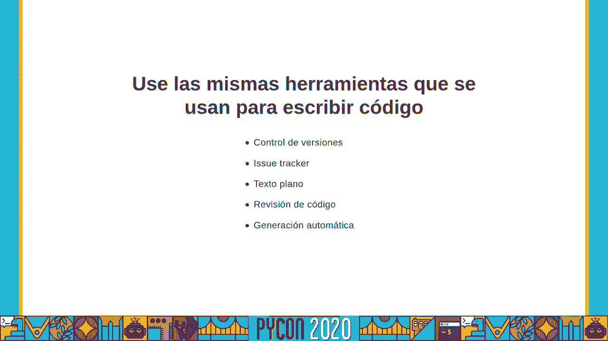

 I want to be grateful to all of you for your support。

 I want to be grateful to all of you for your support。

 I want to be grateful to all of you for your support。

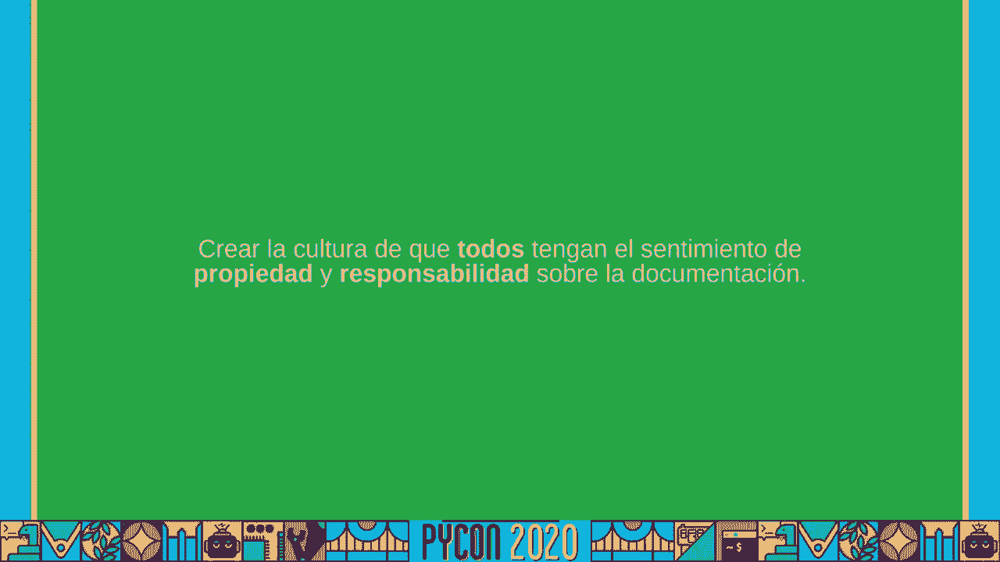

 I want to be grateful to all of you for your support。

 I want to be grateful to all of you for your support。

 I want to be grateful to all of you for your support。

 I want to be grateful to all of you for your support。

 I want to be grateful to all of you for your support。

 I want to be grateful to all of you for your support。

 I want to be grateful to all of you for your support。

 I want to be grateful to all of you for your support。

 I want to be grateful to all of you for your support。

 I want to be grateful to all of you for your support。

 I want to be grateful to all of you for your support。

 I want to be grateful to all of you for your support。

 I want to be grateful to all of you for your support。

 I want to be grateful to all of you for your support。

 I want to be grateful to all of you for your support。

 I want to be grateful to all of you for your support。

 I want to be grateful to all of you for your support。

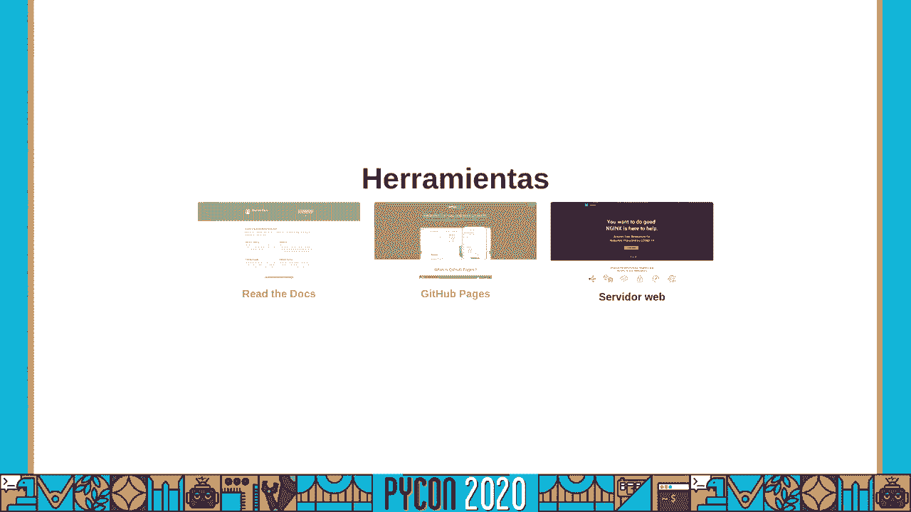

 I want to be grateful to all of you for your support。

 I want to be grateful to all of you for your support。

 I want to be grateful to all of you for your support。

 I want to be grateful to all of you for your support。

 I want to be grateful to all of you for your support。

 [BLANK_AUDIO]。

