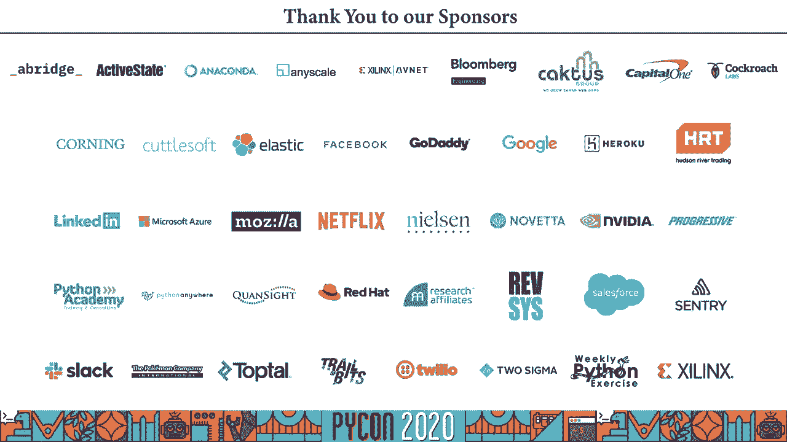

# PyCon US 2020 - P66：Talk Russell Keith-Magee - Snakes in a case Packaging Python apps for distributi - 程序员百科书 - BV1rW4y1v7YG

 Hi there， my name is Russell Keith McGearn。 I'm here today to talk to you about putting。

 your snakes into a briefcase for easy transportation。 I am speaking to you today from Wajuknunga。

 Puchar， otherwise known as Perth Western Australia and I would like to recognise the。

 Wajuknunga as the traditional owners of the land where I'm recording to recognise their。

 continuing connection to their land， waters and culture and to pay my respects to their。

 builders past， present and emerging。 So last year at PyConUS in Cleveland， I had the very。

 distinct honour of being the opening keynote and in that talk I spoke about the challenges。

 facing Python as a language and the gaps that exist in our communities' tools。 One of those。

 gaps relates to something that seems like it should have an obvious solution。 If you're。

 an author of some Python code and the time comes to give that code to somebody else so。

 that they can run it， how do you do that？ There isn't a single simple answer to this。

 problem and part of the reason is that distribution means different things to different people。

 If you are an author of a library of code that is a collection of Python code that has。

 a well-defined API that you want other people to embed into their own projects， Python does。

 have a reasonably good answer for you and it's built in。 A project like Requests for。

 example has a clear distribution story。 The project is configured with a set up。py and， a set up。

cfg file and when the maintainers want to publish a new version they build a。

 wheel for that new version and upload the wheel to ppy。 As an end user you can then。

 pip install requests and then import requests in your code and then start making requests。 Okay。

 Python's packaging ecosystem occasionally has some rough edges but for the most part。

 for most use cases thanks to the amazing efforts of the Python packaging authority tools like。

 ppy and pip and twine work really reliably。 A second use case for distribution is a Python， project。

 A project might have a version control repository or it might just be a collection。

 of code in a directory somewhere but it won't be uploaded to ppy。py。 You get the code from。

 the repository where you get a copy of the directory and you effectively run the repository。

 or the directory。 A website like the pike on us website would be the classic example here。

 but it's not a website specific phenomenon。 Other software can be distributed as a project。

 A lot of Jupyter notebooks are projects in this sense。 They are collections of code that。

 aren't designed for commodified reuse。 They serve a single purpose。 These projects are。

 distributed by copying and then deployed in some way。 The project isn't installed in。

 any conventional sense。 They don't have a single Python mandated configuration either。

 They may have some configuration in a requirements file but even that name is a little bit more。

 than a convention and the problem of how you set up your execution environment is left。

 as a documentation issue and usually presumes some degree of familiarity with the Python。

 development ecosystem。 Another use case for developer tools in the Python ecosystems tools。

 like a Python Python test。 Python test for example is distributed on a library。 You can。

 pip install in your development environment and you can import pip test to add fixtures。

 or parameterised test cases to your code base but because of metadata in the pip test。

 will pip will also install an entry point that will let you invoke pip test from the， command line。

 However it's not always as straightforward as this。 If you've used GitHub。

 pages you might have come across a static site generator called Jekyll。 Jekyll is written。

 in Ruby and the quick starting instructions on the Jekyll homepage say that you should。

 run gem install bundler jekyll。 Now I'm not a Ruby developer so what does that mean？ And。

 when I find another Ruby tool that tells me to bundle other tool have I already installed。

 bundle will the version that I have or be compatible with this new tool tells me that。

 I need to update my Ruby interpreter is Jekyll going to keep working。 Jekyll is written in。

 Ruby but this isn't a problem about Ruby。 Python tools have exactly the same problem。

 It's a distribution problem。 The language of implementation is of almost no significance。

 to the end user。 The authors of pip test can be reasonably sure that you know something。

 about the Python ecosystem because pip test users are pretty much all going to be Python。

 developers。 But what if your users aren't Python developers saying oh create a virtual。

 environment and run pip install my tool that makes no sense to anybody who isn't already。

 an experienced Python developer and to someone who is just starting with Python it's a consistent。

 source of confusion。 And frankly it's not even a good user experience if your users。

 are Python developers。 Take a tool like black for example with some exceptions you probably。

 just need one copy on your computer。 When an update comes out you probably want to use。

 that update everywhere。 But how do you install a Python tool like black globally if you install。

 it into your system Python then it won't be available or won't be reliable if you ever。

 activate a virtual environment。 And what about graphical applications？ Pick a random。

 user space application on your laptop say slack。 What languages are written in？ Who cares？

 I'm not looking to engage with slack as a library。 I'm not looking to import slack。 I。

 just want to use it。 I want to install it in a familiar way， click on an icon and have。

 the application start reliably every time。 And if I update another application say Firefox。

 I don't want my slack installed to break because Firefox updated a shared interpreter。 What。

 an end user of these applications these apps does care about is ease of installation， ease。

 of uninstallation， having the app appear in the start menu of the launchpad and potentially。

 having that app appear and be downloadable via an app store and having it regularly updated。

 via that channel。 Each of these types of tools has a different distribution requirement。 They。

 all need Python at a runtime but the only the first of these use cases really has a good。

 answer for the Python ecosystem。 And even then that development story essentially presumes。

 your Python developer who has a Python development environment and that you're comfortable manipulating。

 it。 The question of how you give Python code to an end user when that end user doesn't。

 care about Python or when they're not experts in setting up and configuring a Python environment。

 that's a bit of an open question。 But it's a really important question。 It affects how。

 users experience our code and it's great that we have a solution for the first use case。

 but we need reliable solutions for the other three。 Personally， I'm especially interested。

 in the last one and to a lesser extent， the third。 I'm the founder of the Bwe project。

 which is an attempt to make sure that Python remains relevant in a computing world that。

 is increasingly mobile focused。 If you are building applications for iPhone and Android。

 the only unit of distribution is the app。 You can't pip install on an iPhone。 You can't。

 install a system copy of Python on your Android device and tell users to create a virtual environment。

 If Python wants to remain relevant in a mobile world， we need a story that encompasses the。

 distribution of apps and increasingly， while my primary interest is mobile platforms， the。

 same story actually applies to desktop platforms to Mac。

 awesome windows have always had applications， but those platforms are increasingly encouraging distribution of apps as standalone sandbox。

 bundles by app stores。 What I'm going to do today is introduce you to the Bwe project solution。

 for this problem。 And that solution is briefcase。 Briefcase is a tool for packaging， Python。

 applications。 It takes your Python code， wraps it up as a standalone unit that can be given。

 to an end user with no Python experience so that they can install it on their platform。

 of choice without ever knowing that they're running Python code。 Briefcase is a PEP 518。

 compliant build tool。 If you don't know what that means， I recommend checking out this。

 blog post from Brett Cannon。 But the short version is that it means that it is a build。

 tool that uses PyProject。tonnel for configuration。 It produces MSI installers for Windows， DMG。

 or raw app bundles for MacOS， app images on Linux， and it produces iOS and Android projects。

 that can be uploaded to the Apple App Store or the Google Play Store。 It's also highly， extensible。

 If you wanted to add a flat pack or snap back in for Linux， you could， or if。

 you wanted to support an entirely new platform like a set top box or watches， you could do。

 that too。 Now， while it pairs well with Bwe's GUI framework toga， it doesn't require it。

 You can wrap PySide or TK interapps with Briefcase。 The caveat on that claim is that Briefcase's。

 capabilities are only as good as the frameworks themselves。 Briefcase is a packaging tool。 It。

 won't make your TK interapp work on mobile because TK hasn't been ported to mobile。

 Briefcase also isn't a good match for command line tools， at least not yet。 It could potentially。

 be adapted for command line use and I'm personally very interested in seeing that use case supported。

 but it's not obvious to me at the moment exactly what that support would look like。

 This is mostly a function of how Briefcase works under the hood。 The approach used by。

 Briefcase is essentially the dumbest thing that could possibly work for the problem of。

 app distribution。 A Briefcase application is a full copy of your Python code， a full copy。

 of all your code's dependencies， and a full copy of a full Python interpreter bundle in。

 a way that makes sense for the platform you are supporting。 And that's it。 Briefcase is。

 mostly a templating tool combined with wrappers around PIP to install your Python dependencies。

 and wrappers around whatever native platform tools are necessary to build DMG or MSI files。

 or sign applications for distribution。 Now， Briefcase isn't the only application packaging。

 tool that exists in Python， so why should you use Briefcase and not one of the other， options？ Well。

 firstly， it doesn't try to be clever。 Some alternatives to Briefcase like。

 Pyoxidizer or Py installer and some modes of operation can involve getting a working app。

 with making an executable。 And if the support， the aim of making the executable， they play。

 all sorts of trip trips with your code， bundling it into a zip archive， it's embedded into the。

 data block and then executable， it's unpacked into memory at runtime。 And when that works。

 it's great。 But it doesn't always work because fundamentally Python code is designed to be。

 run by passing an interpreter over a directory of code。 Okay， if you know enough about Python's。

 import system or you know， you know that that's not strictly true。 But if you've got enough。

 practical experience with Python in the real world， you know that it is close enough to。

 being true in practice and makes no difference。 If you don't believe me， all I have to say。

 is zip save X。 And on the other hand， Briefcase runs Python the way Python was designed to。

 be run an interpreter running over a directory of source code。 The only thing Briefcase does。

 is automate the process of getting that working interpreter to an end user in a way that doesn't。

 require them to know anything about Python。 Briefcase is also cross platform， which means。

 that you have a single configuration file that produces in stores for MacOS， Windows， Linux。

 iOS and Android。 And that means you don't have duplicated configurations for distributing， your app。

 removing a potential source of error。 Okay， so enough， Jack shaving， show me the， code。

 What I'm going to do today， we'll do now is walk you through the life cycle of。

 packaging a project with Briefcase。 If you want a more detailed walk through the be where。

 tutorial at docs。bwe。org has a fully walked work demo that gives a lot more explanation。

 that I'm going to be able to give you in 25 minutes。 So let's start a new project。 We。

 had a new virtual environment and we installed Briefcase。 I am giving the instructions here。

 with unique conventions， but Briefcase does also work on Windows。 The be where tutorial。

 gives the commands for both if you've got how to convert。 If you want to start a completely。

 new project， Briefcase has a wizard to help you run Briefcase new and you'll be presented。

 with a list of questions with some explanatory text。 And you'll be prompted for a bunch of， details。

 You'll be prompted for a formal name。 That's the name that you show to humans as。

 the name of your app and an app name， which is the Pythonized version of your name， something。

 you would pip install。 You'll be asked for a bundle。 Let's use for namesbasing to separate。

 my hello world from your hello world。 But the bundle ID is a common format used by app， stores。

 It's usually a reversed ordering of a domain name that you control。 That bundle。

 is then combined with an app name to make a full bundle ID for your app。 So org。bware。hello， world。

 for example。 You'll be asked for a project name。 A Briefcase project can include。

 multiple distributed apps。 So you can build multiple app bundles from a single code repository。

 But if you're only going to have one app， you can use the formal name as your project， name。

 You'll be asked for a one line description of the project。 You'll be asked for the author's。

 name and emails as used in help text and copyright labels。 A URL for the project。 A license because。

 of his derivative code。 You need a license。 And lastly， a GUI framework。 Briefcase provides。

 a template for toga。 Bewares own GUI framework。 But there's also a pie side template as well。

 as an empty app that you can fill with whatever framework you happen to want to use。 And what。

 you'll get at the end of the day is a complete stub project， including enough code to start， an app。

 application icons and a variety of formats and some project metadata。 You'll also。

 notice that the DASH， the application name here has been normalized and underscored。 So the app。

 name Hello Dash world has been converted into Hello Underscore world when it becomes a source code。

 directory。 You also get the same files， regardless of what GUI framework you pick。

 The only difference， with the contents of the app。py， the main。py。

 and some of the values in the PyProject。com。 The， metadata that is of particular interest here is in PyProject。

com。 That's the file that contains， all the details about your app。

 The contents of this file will match the answers that you gave， in the wizard。

 There's a build system section which is a requirement of PEP518 that declares。

 that this is a briefcase project。 And all the briefcase options are then defined in a tool。

briefcase， section。 The project level options are defined in that root level tool。briefcase。

 Individual， applications then have their own sections。

 So this configuration file defines Hello Dash world， as an app。

 That's the app name with a formal name of Hello world and so on。 The configuration。

 for the Hello world app is comprised or is composed out of the project settings overridden by the。

 application settings。 So the Hello world app will inherit the project level version definition。

 And if you wanted to have a different author name for this application。

 you could do so by adding an， author name into the app's configuration block。 And to be clear。

 this is a briefcase specific， behavior。 Not something you'll see and necessarily see anyway。

 Another PEP518 tools。 There are two， exceptions to this overriding behavior， source and requires。

 Sources defines the list of directories， of source code that you want to include in your application。

 So here we're saying that the source， Hello world directory is part of this application。

 That entire folder will be copied recursively， into our packaged application。

 The only requirement on this is that one of your source directories。

 needs to match the name of your application itself。 Requires defines the Python requirements for。

 your application。 Again， this is just as a list using the same format that you'd use as an argument。

 to pip install。 Sources and requires a cumulative setting。 So if you specify a sources definition。

 at the project level， any application level sources will be appended to that list defined。

 at the project level。 Icons also deserve a special mention here。

 You'll notice that the icon setting， doesn't include a file format extension。

 That's because briefcase uses the provided value as a。

 base name and appends the format depending upon the platform。 So 。ico for windows。png for the。

 next and so on。 Of some platforms， you have to provide multiple icons in multiple resolutions。

 and those size modifiers will be appended to the file name as well as the extension。

 You can also specify options that are platform specific by adding a configuration section for。

 that platform。 The generated pip project。tom will include a section for all of the supported platforms。

 MacOS， Linux， Windows， iOS and Android。 So here we've specified a pytool。briefcase。app。helloworld。

macos， section。 Those options will only apply to MacOS builds of this app。 Now again。

 sources and requires a cumulative or other settings will override an app level or project level。

 that values。 The content here is what you get if you pick toga in the wizard， but you'll get。

 different content if you pick PySide or no。 You can actually even go and lay it deep。 Still。

 if you define a tool。briefcase。app。helloworld。macos。dng， those settings will only apply to。

 dng builds on MacOS。 You might do this to specify an icon for the dng installer， for example。

 And if you wanted to add a second app to your project definition， you can define a tool。briefcase。

app。secondapp， section and then so on for platform and packaging formats and so on。

 Now this stub pyproject。pomel file has been generated for you by briefcase new， but you don't。

 have to use that wizard。 If you've got an existing project， you can roll your own py project。pomel。

 from scratch。 So however you've created it， you've now got a briefcase configuration file。

 How do we use it？ Well， the first thing you probably want to do is just see if your app runs。

 Briefcase includes a developer mode， which lets you rapidly iterate on your configuration。

 If you run briefcase dev， briefcase will use your pyproject。

pomel to work out how to run your project， and then run it in your local virtual environment。

 First time you do this， it will look at your， configuration file。

 install all of your declared requirements， and then it will install your app。 Now。

 keep in mind the design motivation for briefcase。 The dumbest thing that can possibly work。

 Briefcase dev is nothing more than shorthand for a pip install for a list of requirements for。

 your current platform， followed by Python minus M hello world running your application。

 On subsequent runs， the dependency step won't be executed by default。 Briefcase will only start。

 the project， just by itself。 If you add or modify dependency， you'll need to add it minus D flag to。

 force an updated dependencies。 And if you've used the wizard， what you'll get is a working。

 application。 It will be an empty window， but it'll be a working application。

 And you can now iterate， on the code in your app， adding features， fixing bugs。

 whatever you need to do。 Eventually， though， the time will come when you're ready to package your app for distribution。

 The first step， will be to create your app。 And to do this， you need to invoke briefcase create。

 This will do a， bunch of things。 First， it will look at the platform you're currently on and get an application template。

 for that platform。 So I'm running on MacOS， so it will use the MacOS DNG template。 Secondly。

 it will obtain a support package。 A support package is a version of Python that can be embedded into。

 your app。 For Windows， we use the officially distributed Python embedded package for every other platform。

 be where maintains a support package。 Whatever your platform， Briefcase will download the support。

 package， unpack it into the application template that was just created。

 Briefcase then downloads and， installs your app's dependencies。

 but it doesn't install them into your local virtual environment。

 installs them into the application template。 Briefcase then installs the application specific bits。

 all the source code for your app and all the application resources like icons。 And then it's， done。

 You've now got a complete application template。 Your project directory will now contain a platform。

 folder。 So a folder called MacOS in this case， inside that folder will be a folder for every app。

 in your project。 The next step is to build that app。 And I'm sure you'll be shocked to hear the。

 commander do this his briefcase build。 Now on MacOS。

 this actually does nothing because an application。

 or the application template that was generated is actually executable as is。 A MacOS app is nothing。

 more than a directory in a particular format with some metadata in a known location。 On other。

 platforms， there may be some compilation that needs to be done here。 Briefcase manages invoking。

 that compiler。 And at this point， there will be a folder in your project matching a platform and。

 that folder will be an application along with any files created as part of that build process。

 In this case， it's a MacOS app。 If you were to click on that icon， an application would start。

 Or you could keep it all console based and use briefcase。 You can run your app with， you missed it。

 briefcase run。 And what you should see is a running application。 Now。

 it is not a very interesting application， but it is a running application， whatever that means。

 on your platform of choice on MacOS。 That means an icon in your taskbar， an application menu。

 matching your application name。 The last step is to package your app with briefcase package。

 This does any final packaging that has to be done before distribution， so creating an installer。

 doing code signing and so on。 Code signing support is currently in the early stages of development。

 Only MacOS apps are currently signed and they're currently only signed， not not， notarized。

 If you know what that means， this is an area where more work is needed， but the pieces。

 are all in place。 But after packaging， the platform folder in your project will contain。

 an artifact that could be uploaded for distribution， a DNG file， an MSI。

 whatever is appropriate for， the platform of choice。

 So we have packaged our app and we discover a problem。 We need to update， our code。

 Do we need to go through this whole process again？ No， for that， there is briefcase， update。

 By default， this will reinstall just the code for the app。 If you want to update the。

 dependencies as well， you can specify -d。 If you want to update the application resources like。

 icons， you can specify -r。 Some other features of briefcase that are worthy of note。 Briefcase。

 create is a shorthand。 Your platform is implied from the platform where you are currently running。

 the code。 The output format is the default output format for that platform。 If you want a Mac。

 briefcase create is shorthand for briefcase create MacOS DNG。 Now。

 if you wanted to create a different， output format， say you wanted a raw app， not a DNG file。

 you can invoke briefcase create MacOS， app。 And if you wanted to target a completely different platform。

 briefcase create platform。 Now， in practice， that's not especially useful because you can't create a MacOS DNG or Windows。

 or a Windows MSI or Mac because the tools required are platform specific。

 But there is one important， use case for it and we'll come to that in a moment。

 Briefcase will also imply early steps if they are， needed。

 If you have a completely fresh project straight out of briefcase new and you run briefcase， run。

 briefcase will detect that there is an attempt late and create it and then build it and then run。

 it。 Briefcase run also allows for a -u-oxy that updates the app before execution。

 So your development， cycle could be as short as briefcase run -u over and over again。

 Briefcase also checks whether you've， got the necessary tools to compile and if possible。

 manages downloading those tools for you， accepting， any licenses and so on。

 If you can't install the tools for you， like it can't on MacOS， you've。

 got to get Xcode through the app store， it will at least tell you explicitly which tools you need。

 to get and where you go to get them。 And if you're ever unsure what your options are， you can add。

 -help and get a full rundown。 Now， the other thing that briefcase does that I haven't mentioned so far。

 deploying to mobile platforms。 This is the one place where specifying a platform does work and。

 is necessary。 If you want to create an iOS app， the steps are exactly the same as creating any。

 other app you just add iOS to all the commands to specify a different platform。 Briefcase create。

 iOS， briefcase build iOS and so on。 Similarly for Android， briefcase create Android。

 iOS builds only， work on MacOS because of the underlying tooling requirements but Android builds will work on。

 MacOS， Linux all in those。 The build and run steps are also slightly different。 When you compile an。

 application， you need to target a specific device。 If you run briefcase run iOS。

 briefcase will inspect， your system， find out what devices are available。

 ask you what device you want to target。 If you， shortcut that。

 if you want to shortcut that question， you can specify -d to give a device id or a device。

 description like an iPhone 11， iPhone 11 running iOS 11。3。 There's any ambiguity， say if you've got。

 multiple iPhone 11 simulators running， you'll be asked to resolve the discrepancy。 Android does the。

 same thing， creating Android simulators for you or emulator for you， starting as emulator as it。

 necessary。 Once your app is running， it is running as normal Python code running in the normal Python。

 way。 But it might be useful to get access to some of this packaging metadata at runtime and to support。

 this briefcase generates PEP 566 compliant packaging metadata。 If you've got a hello world app。

 you can， use importlib。medadata to access your briefcase metadata。 Importlib。

medadata was added in Python 3。8， but there is a backwards compatibility shim that you can use for older Python versions。

 The keys aren't exactly the same as they are in briefcase specification。 App name， for example。

 is named with capital N。 That's done for PEP 566 compatibility。 All right， so briefcase sounds。

 awesome， what's the catch？ Well， there are plenty of aspects of the individual platforms that could。

 definitely be improved。 Linux app images don't currently support desktop entries at present。

 Windows apps aren't currently code signed。 They currently report that the system inspector has。

 Python。exe。 iOS can't currently deploy to physical devices。 Android support doesn't do code signing。

 MacOS doesn't do notarization。 These are all solvable problems though。 They need time， attention。

 in some cases a little bit of expertise or at least a little bit of research to work out。

 what extra options we need to pass into our compile command。 The biggest downside， pun intended。

 is the size of the support package。 The default briefcase support package includes。

 a full Python install， which means a briefcase app for MacOS is about 200 megabytes。 Now。

 that's not unheard of when it comes to applications in the world。 Slack is 174 megabytes， but。

 they're doing it too isn't really a good excuse。 The good news though is that this can also be。

 fixed。 This Hello World app contains an entire Python standard library。 It includes bzip2 and。

 h2dplib and all of this due to and much more。 And they're never used in many most apps。

 So there is a lot that can be optimized here。 The immediate workaround is the briefcase will allow。

 you to specify your own support package。 So once you know that your app only needs a specific。

 subset on the standard library， you can build a hand-tuned version of a support package and use that。

 And with that approach， Hello World easily reduces to around 30 megabytes， as little as 15 if you。

 try really hard。 That does require hand tuning though。

 And the hand tuning process isn't very user-friendly， at present。

 There is a lot that could be done to improve that user experience。 There is also an。

 intermittent discussion on the Python core team about a kernel Python， the idea of an official。

 Python distribution that is the minimum viable Python with the rest of the standard library being。

 imported as needed。 That would be absolute gold for briefcase。 Briefcase isn't feature complete by。

 any stretch。 It works well， but there are lots of ways that it could be improved or enhanced。

 I've already flagged some of the obvious potential improvements for existing platforms。

 But we could also add support for new platforms like set up boxes and smartwatches or add support。

 for other packaging formats like flatpack or snap on Linux。 Adding these backends actually isn't。

 that much work。 It mostly requires a little expertise or research on how to drive the packaging。

 tools for those platforms。 I'd also like to be able to provide an answer for command line apps。

 That's mostly a design question at this point rather than a technical limitation。

 What does the briefcase model of app distribution mean for command line apps？

 Most of my testing has also been based on Toga， but one of the biggest areas of potential improvement。

 is testing that the support works for other GUI frameworks。 Personally， I am especially interested。

 in seeing tests of gaming libraries like Pi Game or Pursued Pi Bear because I think Python gaming。

 is one of the biggest areas where briefcase has potential， making it easy to distribute games to。

 gamers， not to developers and potentially to mobile app stores as well。 Lastly， app publication。

 Briefcase currently stops with the process of packaging your app。 However， app stores all have。

 APIs to support automated publications。 So potentially briefcase could manage that process too。

 Does a one-command publication process pushing to steam？ Does that interesting to anyone？

 Adding all those features though， that's dependent upon someone having the time to implement them。

 I would like to be able to spend a whole lot more time working on briefcase and。

 be where as a whole， but at the moment， this is something I do mostly in my spare time。

 If you'd like to support my work on briefcase and the be where project。

 you can join the project as a financial member。 You can also back me on GitHub sponsors。

 That income is currently enough to cover stickers， hosting and things like that。

 but it's nowhere near， enough to make this a full-time gig。

 If you've got ideas or experience that might help an open-source。

 project funders development or you'd like to know more about the project or get involved。

 please get in touch。 Thank you all very much and I hope I'll see you online then。

 hopefully in person next year。 [silence]。

