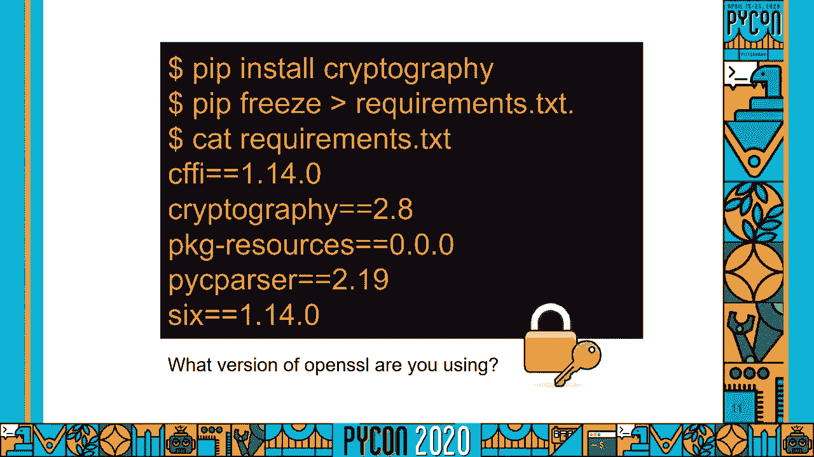
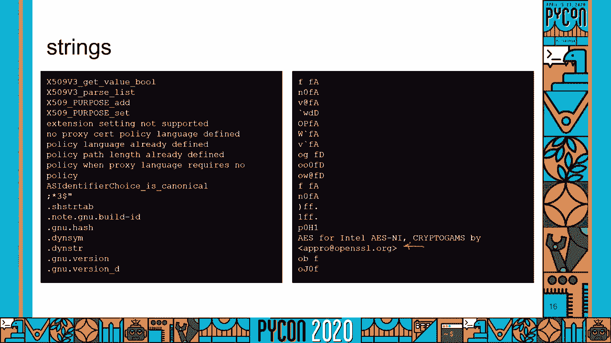
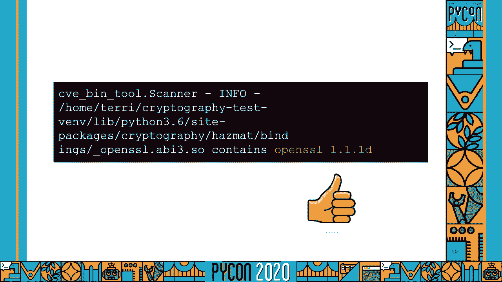
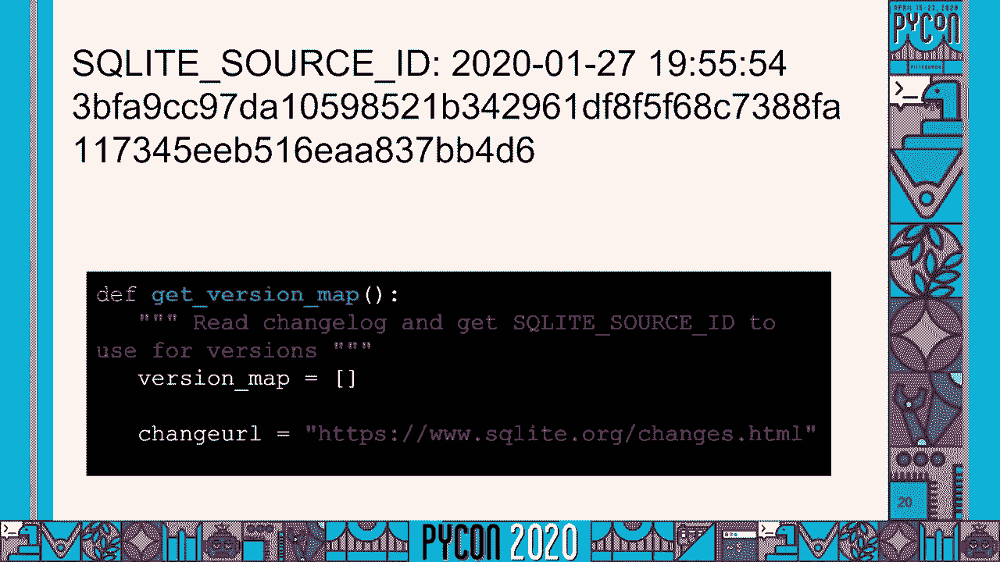
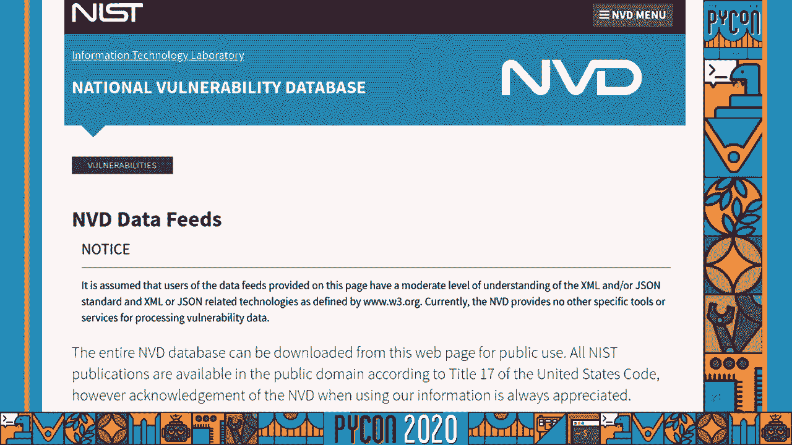
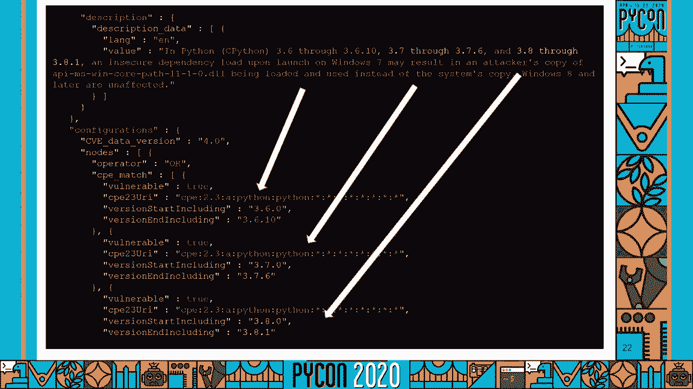
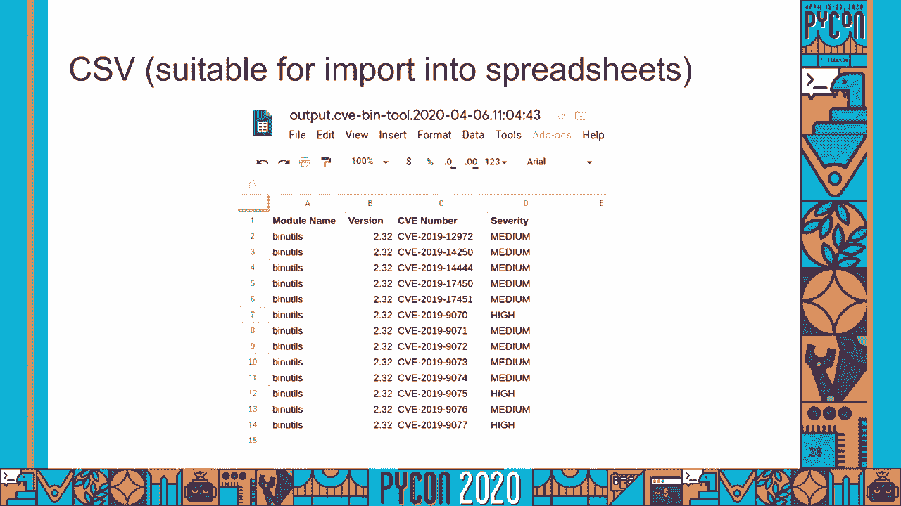
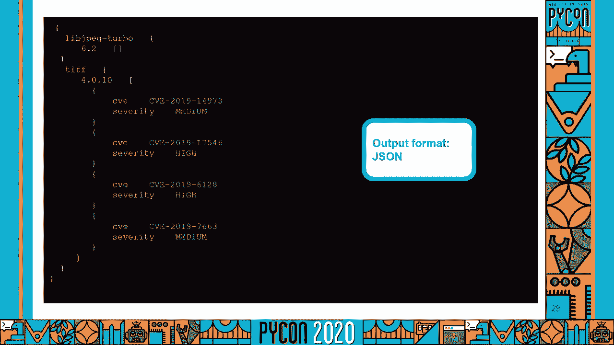
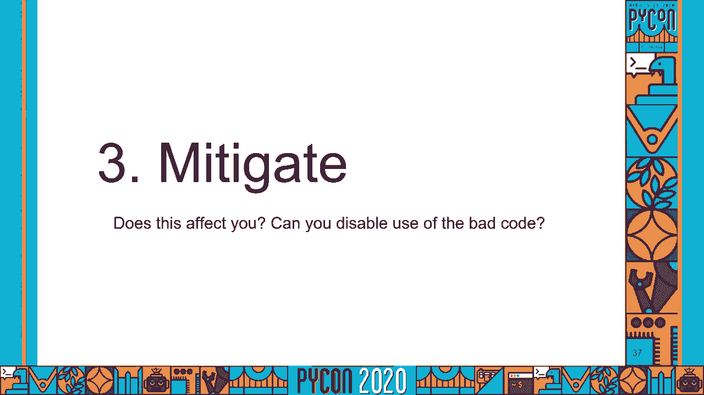
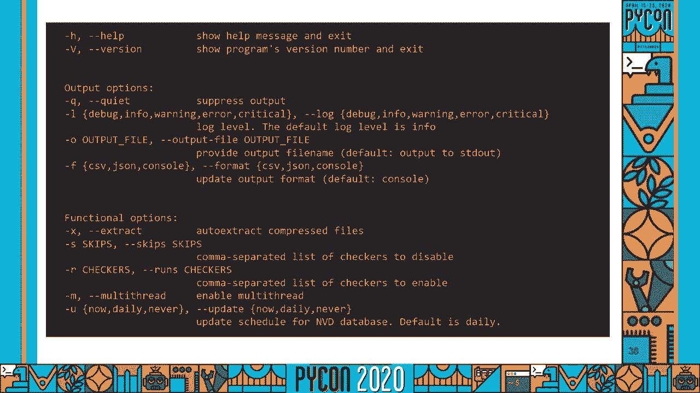

# PyCon US 2020 - P71：Talk Terri Oda - Using Python to Detect Vulnerabilities in Binaries - 程序员百科书 - BV1rW4y1v7YG

欢迎使用 python来检测漏洞和二进制文件，我叫特里，我有电脑安全的博士学位，你应该重视我的意见的真正原因，这里少谈谈我的学历，多谈谈我的经历，我在开源领域工作了20多年。

我现在在英特尔和开源安全公司工作，这意味着我帮助了英特尔的许多开源项目，在问题出门前发现并解决问题，还有，我评估了许多外部开源库，以了解它们如何处理，安全。

你很可能是通过我在 gnu邮递员上的工作认识我的，或者我为 python软件基金会协调学生指导，作为谷歌的一部分，代码之夏，这两者都给了我很多时间 直接与不同的开发人员社区合作。

所以让我们来谈谈这个问题，希望如此，如果你在听这个演讲，你只关心寻找软件中的安全漏洞，为什么二进制文件，为什么这是一个有趣的问题，让我们想象一个场景，你得到了一个软件，并被告知运行它。

你怎么知道这样做是否安全，如果你曾经从网站上下载过可执行文件，你可能做了以下一件或多件事情，你可能在你下载的文件上运行了病毒扫描，您可能已经验证了签名，看看您是否有正确的文件，可能它被完全下载了。

您可能已经检查了更新，确保你得到了最新的版本，如果你担心安全问题，你甚至可能读过那个软件附带的安全建议，如果你从应用商店或其他托管界面获得一些东西，你可能以为，管理它的人已经为你做了一些步骤。

也许你认为他们得到了最新的更新，或者你假设他们运行的病毒扫描仪并不总是正确的，但我们愿意相信，但如果你是负责任的成年人，你就是管理应用商店的人，你就是那个把软件，在我们继续之前 你会做什么。

让我们承认安全或安全，是一个非常大的，有时是模糊的问题空间，我有大量的开发清单，作为一个开发人员，你到底应该做什么，仍然是一个前沿研究的问题，所以你可能从标题中猜到了，我们专注于一件。

其中一个是已知的漏洞，那应该是最容易做好的一件事，他们知道我们应该能知道我们是否有他们，所以我们有一个稍微长一点的列表，我们必须关心他们所依赖的一切，如果我们想说，这个软件没有任何已知的漏洞。

所以你得到了一份名单，在你确认一些签名之前，你做了我们做的同样的事情，你检查，更新您阅读的安全建议，如果你在自己的软件里发现了什么，您可能会发布自己的安全建议，没有什么不同，但似乎很容易处理。

但实际上很多现代软件都有很多依赖关系，所以你可以从一个看起来相当短的列表开始，它可能会失控，你可能认为我夸大其词，当然，其中一些有安全问题，像蟒蛇一样，你现在可能有点自鸣得意，因为你知道你有一个工具。

这将帮助您获得需求列表和所有这些依赖项，所以你需要做的是创建一个全新的虚拟环境，你安装你需要的东西，然后你让它给出一个需求列表，你可能在某个时候做了这件事，让我们用蟒蛇的密码学来试试。

使我闪亮的新虚拟安装密码学，得到一些要求，它们看起来很不错，里面没有那么多，这看起来一点也不可怕，我碰巧知道密码学要求打开 ssl，我碰巧知道蟒蛇有这种奇特的东西，把它安装在你身上，你知道吗。

所有的电池，我刚刚安装了什么版本的 openssl，是啊，我真的不知道，如果我不知道它在那里。

我不认为我会有任何线索，即使语言有很好的工具，知道软件中有什么是令人惊讶的困难，我不打算教你其他语言，但我在开源安全领域工作，审查了很多软件，我可以告诉你 我们买了一些奇怪的箱子，如果你不相信我。

去问那些专事发牌的人，因为他们有很多相同的问题，弄清楚软件中到底有什么 对两个许可都很重要，遵守和安全，那为什么我们没有工具来帮助我们呢？答案是，当然了，但它们相当贵。

因为要准确地确定软件中的内容 需要付出很多努力，随着软件的变化，保持更新需要很大的努力，它们往往很慢 因为它们在扫描，但是很多不同的普通软件具有有趣的特性，对于一个非常关心安全的组织的人来说。

拥有一个昂贵而缓慢的工具，是一个合理的交易，要精准全面，有时候你不想要整个蛋糕，有时候你只想分一杯羹，所以如果我们构建一个只关心旧版本 openssl的工具。

也许我们可以把它扩展到其他一些具有有趣的安全影响的开源库，然后我们就有了一些不再那么昂贵的东西，不用跑得很慢，突然间，我们有一些完全适合与外部合作伙伴分享的东西，或开源项目。

我们得到了一些可能足够快的东西，作为你持续整合的一部分 给你提个醒，如果有一个新的漏洞 你应该知道，我们就是这么做的，它从一个小python脚本开始，用于检测旧版本的openssl。

我们慢慢地构建了一个更大的工具 我们现在称之为 cv二进制工具，免费的，它是开源的，告诉你你的弱点，所以让我们看看引擎盖下面。

我是一个小蟒蛇脚本，它根本不知道自己在看什么，我怎么知道那里有什么，所以我们决定像黑客或笔试员一样思考，变得非常简单，在二进制文件上运行的 unix实用程序字符串。

它给你它找到的每一个大于四个字符的字符串，正如你所看到的，其中一些是无用的，但它们中的一些会给你一些暗示，让你知道里面有什么，如果你看看这个，你可以看到。

好的，所以我很确定这将是开放的，SSL，但是我有什么版本的 openssl，好吧，我们可以使用我们喜欢的另一个 linux实用工具 grep，它是一个文本搜索工具来缩小范围，你看。

这里有一个清晰的版本字符串，这是开放的 ssl 一点一点一点一 d发布于九月二十九，如果我们想从那个到签名，然后我们需要再看几个版本的 openssl，开始寻找规律。

这是我们 openssl签名的一部分，很明显，打开一个数字 一个字母，会很脆的，如果你出于某种原因试图隐藏软件中的内容，但实际上，这个工具的目的是帮助你避免诚实，错误和更新，这已经足够好了。

如果你想知道里面有什么，它是开放的，一点一点一点，一点，一点，当我整理幻灯片的时候。

这是最新的版本，所以我们很好，我们在 OpenSSL中看到的模式是我们在很多软件中看到的，也许一些空白，版本号，也许更多的空白，也许一些额外的信息，呃，它并不适用于所有的软件。

我最喜欢的一个不寻常的是 sqlite，它没有我们可以直接解析的版本字符串，但它有一个很大的源身份串，这已经足够独特了，所以当你探测到一个关键的光，你在找这个大，然后将散列映射回版本，但这绝对是真的。

有一些我们无法轻易检测到的库，现在我们只是在记录他们，一旦你得到了一个版本号。

你是如何从这个列表到已知的漏洞列表的，所以我们可以为每个人的网站做花哨的网络刮擦，看了他们所有的安全报告，但那是很多体力活，我们不需要，列举的公共软件弱点，它被称为国家脆弱性数据库，有点用词不当。

它实际上是相当国际化的，但重要的是它是公共领域。

如果你看看里面的json，很容易就能找到，你可以看到，关于每个漏洞的一堆信息，他们称每一个都是简历或共同的弱点和暴露，它有一个唯一的号码分配给它，系统允许范围。

所以你可以在 c python中看到描述文本告诉你，但是有三种不同的版本，到了下面，它有一个合适的方法来在机器可读的代码中看到它们。

一旦你得到了寻找漏洞的范围信息，解析版本函数，以确定您找到的软件是否在该范围内，这很有效，但我们这里有个有趣的问题，因为解析版本假定，在openssl版本编号中，字母不是这样工作的。

所以我们实际上必须把最后一个字母转换成一个数字来解析版本，规矩点，如我们所料，这里要注意的另一件事是，虽然有这些美丽的机器寓言数据范围，我们的经验肯定是数据并不完美，最常见的。

我们看到的问题是由一个类型错误引起的，上面说八点四之前的所有版本都是易受攻击的，然后数据显示八点四版本不受其他版本的攻击，其实举报这些事情并不难，但你要记住，这是一个由人类填写的大型数据库。

有时人类也会犯错，现在你知道发生了什么，在引擎盖下让探测器工作，让我们来谈谈如何实际使用 cv二进制工具，所以你应该可以，安装 cv箱工具，然后在你想要的任何目录或文件上运行它，你需要蟒蛇三六。

一旦你这么做了，它会扫描你给它的任何文件或目录，如果它找到了需要理解的东西，所以它有一个检查器，他们会试着找到那个版本，如果它发现一个版本有任何已知的漏洞，它会给你他们的名单，感谢我们的学生。

我们正在改进工具的输出，所以可能很快就会有所不同，但这是当前控制台的输出，但我做安全工程师的经验是，当人们拿到一份简历，他们会对他们进行分类，也许跟踪您需要升级到哪些版本来修复它们，做笔记。

如果有任何缓解，弄清楚它是从哪里来的，我们没有一个分诊工具，进入 cb二进制工具，但是我们提供了一个逗号分隔的格式，适合人们输入到电子表格中，所以他们可以利用那里的数据。

最后我们有一个 json输出格式，这是一个机器寓言，也不应该，安装，从各种，但我们希望人们能找到其他有趣的方法来使用它，如果他们想把漏洞数据集成到他们的流程中。

有时对人们来说并不明显，但是工具中 cv的 bin部分指的是二进制文件，实际上只扫描二进制文件，如果你还记得签名有多简单，你可以看出我们为什么要这么做，如果你扫描了所有的文本，帮助和文档。

很容易得到一个假阳性的东西 说，另一件事是 如果你有源代码，您可能有其他可用的工具来帮助您了解构建中的内容，或者你可能已经知道了，您可能不应该仅仅使用启发式签名检测来解决这个问题，你还不如直接使用数据。

不过，既然我们已经有了这个漏洞解析数据库，我们不妨建立一个工具来帮助你，安装 cv二进制工具时，您还可以得到一个名为 csv to cve的实用程序，你可以用它来对付已知的组件列表。

csv部分指的是它们所期望的通用分隔符格式，这样你就可以跳过更多的启发式二进制匹配，潜在的错误，你不用担心，是否有检查程序，你关心它，只是给你一个已知的漏洞列表 从相同的数据库，因此。

您可以从需求列表或构建脚本中获取一些东西，只要得到一个列表，列出任何出于安全原因需要增加版本的东西，如果你最近没有负责软件的安全，你可能不知道，但令人惊讶的是，如果没有自动化，很容易错过这一点。

尤其是当你谈论的东西是几个依赖级别下的，这就是以前的输出，但我今天早上刚刚合并了一个补丁，这使得它看起来与主工具的输出完全相同，所以这样更容易操作，对这个工具的很大限制。

现在你需要得到 NVD供应商产品对的列表，把它放在你的简历里，通过快速搜索数据库，这些并不难找到，但由于名称重复，它们很难自动化，因为它从来没有，所以如果你想把你的要求，txt为您生成的pip。

并获得一个列表，它不会起作用的一点额外的帮助，我们有一些学生提出了一些关于如何改进这一点的好主意，基本上，在这种情况下 我们会给你一块蛋糕，不完全是整件事，所以你运行了工具 它发现了一些东西，呃，哦。

现在，什么，去看看，不管它发现了什么，你通常可以把那个 cb号码放进你自己选择的搜索引擎里，它会提供链接来找出问题出在哪里，关于如何减轻的信息，当它被修好的时候，就像我之前说的，数据并不完美。

所以有时你会发现它被错误地检测到，我们可以把它们修好，每隔一段时间，你要用的东西有背面移植的补丁，所以版本号与修复发生时不一致，然后你就不用太担心那个了，但大多数时候，你要继续第二步，因此，从长远来看。

更新到最新的可用信息通常需要更少的工作，或长期支持版本，如果有的话，如果你是负责任的成年人，如果你需要，那会帮助很多人，我不太喜欢这样，因为它很容易引入新的漏洞，但如果你这么做了，请注意。

cv二进制工具不够聪明，无法检测到它，所以即使你修好了它，你也会继续检测它，最后，如果不能立即升级，或者还没有解决办法，您可能想看看第三步缓解，因此，寻找你可以做的事情来降低你的风险。

这些通常是像禁用有效代码或更改配置以更安全的事情，如果没有缓解措施，所以你应该能够继续做这些事情，如果你是负责任的成年人，不要忘记告诉您的用户 您的代码的最佳实践应该是什么。

如果你不给他们，我报道了，我们认为 cv二进制工具最常见的用法是什么，但还有许多其他选择，比如提取压缩文件，您总是可以从手册中获得一个列表，或者使用帮助选项运行该工具，就像我说的。

我们现在有很多新的发展，所以应该经常会有新的事情发生。

这就是 cv二进制工具，你知道它是什么，它是如何工作的，你可能想知道我如何利用这些知识来帮助让世界更安全，第一，请使用工具，我们为世界做的，我们想让世界使用它，呃，如果你在看完这个演讲后做了一件事。

去吧，皮普，安装它，或者从Github上获取最新消息，并尝试在某些东西上运行它，呃，我最喜欢做的事情是运行它，slash bin或 user lib，看看它能找到什么，有点让人着迷，因为。

在任何一个相当大的操作系统中，总有一些东西在任何时候都知道其中的漏洞，所以能看到它们是什么 是很好的，还记得我一开始是怎么说的吗，我们无法证明，好吧，让事情变得更容易，请用，在你的持续整合中坚持下去。

告诉我们，如果对你有用，告诉我们，如果对你不起作用，我很想知道，第二次，如果你试用了一下 觉得可能有用，你可以为它做出贡献，呃，你想要一个特殊的检查器，那不在那里，然而，这是一个开源项目。

添加检查器有四个步骤，你需要选择你关心的软件，然后您需要找到与产品匹配的供应商 产品对，和 NVD，请注意，有时有不止一个供应商的产品对，通常是因为产品名称或所有者随着时间的推移而改变，不用担心。

我们有密码，要从那里处理这个问题，您需要查看字符串并找到一个版本签名，我们向您展示了如何使用开放 ssl来做到这一点，在很多情况下都会很相似，最后，您开发了一些针对真实二进制文件的测试。

为了证明这个检查器在现实世界中有效，如果你没有时间做所有这些步骤，做许多这样的事情仍然是非常有用的，尤其是选择申请发行，说这是个检查器 我觉得会很有趣，真的很有帮助，我们有源源不断的新贡献者。

他们总是在寻找新的漏洞来工作，我们有固定的新贡献者的原因之一是，我们参加了很多活动，旨在为开源项目带来新人，现在正在进行的是谷歌代码之夏，这是个很棒的活动，在那里我们提供指导。

谷歌支付学生在开源项目上的工作，正如我一开始提到的，我负责协调 python软件基金会的指导工作，但我也是导师，学生直接作为我在英特尔的日常工作的一部分 与 cbe二进制工具项目，所以学生们进来了。

他们对这个项目有了一点了解，他们修复了一些漏洞，然后他们提出三个月的想法，他们想做的事情，这是我们第二年做这件事了，我学到的是很多学生都需要帮助，了解人们实际上是如何使用这个工具的，哪些特性可能有用。

以及人们最想要的跳棋，这就引出了第三位导师，如果你很擅长代码审查，或爱，奇怪的虫子，或者知道如何帮助人们修理他们的树，或者只是说说，就像有一份软件开发和开源的工作，这是一件很有趣的事 情。

因为今年疫情大流行，蟒蛇有更多的学生申请人，他们渴望找到一份不需要在任何地方工作的工作，少得多的导师，因为我们的很多导师都忙于与流行病相关的事情，没有孩子照顾，就像这样，如果你是那种。

谁觉得自己在大流行中多了一点时间，我们将特别感谢您今年的帮助，如果你没有多余的时间，我希望你至少能对蟒蛇正在做的事情感到满意，我们今年可以为学生提供远程工作和指导，这就是 cv二进制工具的网址。

它可能是整个漏洞检测蛋糕中的一小部分，但我希望这足以对填充有用，请出去尝试一下，让我们知道如何，我们可以让它变得更好。

