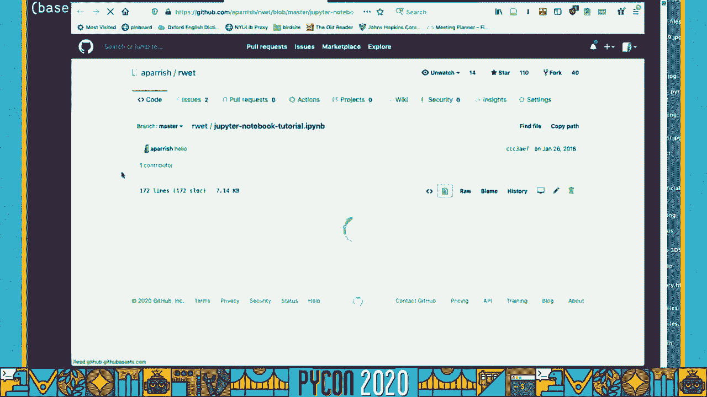
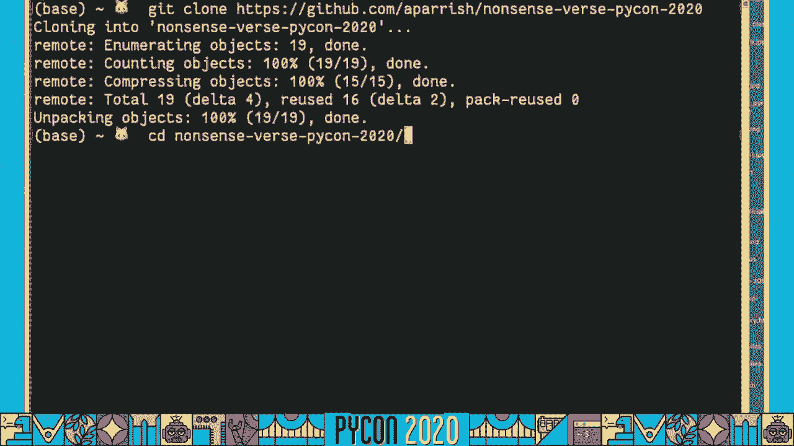

# PyCon US 2020 - P75：Tutorial Allison Parrish - Nonsense verse with Python and machine learning - 程序员百科书 - BV1rW4y1v7YG

 Oh， oh my God。

 So hi there。 This is the recording for the PyCon 2020 workshop on sound poetry and machine learning。

 models。 My name is Alison Parrish。 I'm a poet and computer programmer and an assistant arts professor at New York University。

 Just a sort of an introduction to the code material that we're going to go over later。

 I have a slide deck prepared that has some of the underlying artistic and aesthetic issues。

 that are at play in these models。 And it also has a little bit about the technical details of the implementation of the models。

 just as some background knowledge as we move ahead with the material。

 So this is a machine learning model that I made called Pinsulate that knows how to spell。

 and sound out words。 So I'm going to talk a bit about that。

 show some of the mischief that I've gotten up， to with the model。

 Mischief that you two can get up to。 But the first half of this is going to be about why I as a poet would need such a thing。

 such a thing as a machine learning model of spelling and how to sound words out。

 The second half gets a bit more into the technical and the gritty of how the model works。

 So starting off with phonesthetics， sound symbolism and sound poetry。

 So first off we should talk about the genre of nonsense first of which the best known。

 examples in English。 One of the best known examples is Lewis Carroll's Java Walkie and I have the first stand set。

 of that poem here。 Toes Brilig and the Slivy Tove's to Guyer and Gimbal in the Wave。

 all Mimsie where the， Boro goes and the Moam Raff's out grave。

 What's interesting to me about this poem is that the words like Brilig and Gimbal and。

 out grave was well invented for this poem。 But even though they're made up words and they're not in the dictionary。

 they still seem to， just meaning by virtue not just of the context they occur in。

 like this syntactic context， that they occur in in this poem， but also in the way that they sound。

 In other words， Alice says this in Through the Looking Glass about Java Walkie。

 Even though it doesn't make sense， it quote somehow seems to fill my head with ideas。

 This concept of sounds， the sound of words filling our heads with ideas shows up in a。

 bunch of interesting places， especially in psychology and anthropology。

 Studies in synesthesia have shown that people from all around the world that are native languages。

 of many different languages or native speakers of many different languages across different。

 age groups， across cutting across all kinds of demographics。

 They all have something in common which is that if you point them to these two shapes。

 and you ask them to label which one they think is kiki and which one they think is booba。

 they almost always point to the sharp pointy shape as being kiki and the round bulbous。

 shape as being booba。 This is what's called phonesthetics。

 phonesthetics meaning the study of what words feel like， the。

 emotional response that you get from words， the synesthetics sense that you get from words。

 A literary genre that offers just easy examples of sound symbolism is fantasy and science fiction。

 An example that I like to bring up with this is Sophia Samatar who's one of my favorite。

 fantasy authors。 In an interview she describes a process about inventing languages for fantasy novels。

 Stranger， and Elondria and the Link histories which are my two favorite fantasy novels by the way。

 She says the creation of the Elondrian language was closely tied to the development of names。

 to invent the names I choose small chunks of sound that seemed pretty to me and played。

 combining them。 It's that seemed pretty to me thing that is interesting to me and I imagine the process。

 works in similar ways for other fantasy authors。 Here again。

 structures of language are being composed not for their conventional meaning。

 but for the aesthetics of their acoustic and articulatory material， making up words based。

 on whether they sound pretty。 If you take that idea of inventing words for their phonetic properties to the logical extreme。

 you get a genre of poetry called sound poetry and that's a form of poetry that emphasizes。

 the sound of speech and dismisses the importance of conventional syntax and semantics as principles。

 to organize text。 As a representative example of Dada era sound poetry。

 I offered this excerpt from Duet， I， Gassing， Ryn Jalliment by the artist and Dada poet。

 Elsevan Frytak， Loringovin。 I learned this poem a lot。

 I haven't ever rehearsed it so I don't know if I want to read it but you can look at this。

 and get kind of a sense of it。 Another example of sound poetry。

 digging a bit deeper into the history of this， this， is a poem from Alexei Kruchanik's 1913 book。

 Palmaada。 Kruchanik was a member of the Russian avant-garde， called by Wikipedia， quote。

 "perhaps the most， radical poet of Russian futurism。"。

 He was proponent of a form of poetry called Zam， which takes the idea of foregrounding the。

 acoustic and articulatory materiality of language to the extreme。

 There's a great paper about the work of Kruchanik called "To Destroy Language" by Craig Dworkin。

 And in that paper he says， "Zam is a writing without vocabulary or grammar which include。

 complete neologisms and new modes of combining them so that some instruction and word formation。

 would generate new understandings。 This poetry hints that grammatical syntax does not actually exist except through a retrospective。

 analysis of utterances in which we impose artificial word boundaries that cannot actually。

 be heard in spoken language。 Zam， to paraphrase Wittgenstein。

 is a play of sounds without vocabulary or grammar。 And as a poet I find that idea really compelling。

 the idea of words having being the subject， to play outside of vocabulary and grammar。

 Just while I was researching this material， I sort of took a great interest in this process。

 that Kruchanik calls "Zam-nification。"， And this is a process where via a conventional poem can be dissolved and reconstructed into。

 a "Zam" poem， and playing "Elegian" and "Anagram-etization" following a sonic rather。

 than referential logic。 What's shown here is the process applied to a poem by one of Kruchanik's contemporaries。

 Alexander Chachikov， with the original poem there on the left and the "Zam-nified" poem。

 on the right。 According to Jorkin， none of these fragments。

 aside from the demonstrative pronouns "to"， and "etote" - I don't know actually - "to" and "etote" - I don't know how to pronounce。

 the Russian。 None of these words are actually recognizable Russian words。

 But there are what Jorkin calls "provocative echoes" that come through。

 Jorkin translates the word "chumir" as a potential portmanteau that could roughly。

 be translated as "tent earth。"， So what I like about this process is that it's - Kruchanik's process is almost automatic。

 It's not a computer program that's doing this， but he still seems to be applying this。

 sort of computational-ish logic to it， the logic of compression in order to bring out。

 some aspect of the text that can't be seen if the text actually makes sense。 As an aside。

 the word "zam" comes from the Russian pre-tech "zam" meaning "across"， and "um" which means "mind。"。

 A fair translation of this would be "trans-rational。

" which I think means we could call any conventional， non-zam poetry "sis-rational。"。

 So that's just a little neologism that you get for free with this workshop。 In any case。

 the point of phonesthetics， sound symbolism， which is another word for phonesthetics。

 and sound poetry is that they facilitate linguistic phenomena and forms of expression that are。

 impossible with other forms of writing。 Sound poetry scholar Steve McCaffrey states it like this。

 The acoustic poem bypasses the cortex and addresses itself to the central nervous system。

 Energy transmits as fragmented linguistic particles， sound vibration， and electrochemical forces。

 to the spinal column。 To sum that "up" sound poetry somehow seems to fill my head with ideas。

 but not just my， head， my entire body。 Sound is the part of language that activates the body both on the part of the speaker and。

 on the part of the listener。 So I want to write computer programs that make poetry like this。

 I love these poems， I love these poets， I love this idea of being able to write poetry that。

 bypasses parts of the brain to more directly address particular aesthetic emotional effects。

 So how do you write a computer program to deal with language like this？

 How do you write a computer program that generates words that elicit specific， synesthetic effects？

 To answer that question， it's worth talking about why should we write a computer program。

 to do this in the first place？ Also on Frightag， Blurring Urban did find without a computer program to write sound poetry。

 who try to find without one。 But for me， making programs that generate poetry is a way of investigating aesthetic。

 ideas。 It's a way of figuring out how a poem or a type of poem works。 As Emily Short puts it。

 "It's a subjective process of uncovering unarticulated aesthetic， preferences。"， And importantly。

 this is a process of understanding not of automation。 I'm not trying to replicate these sound poems。

 I'm trying to write a computer program that gives me the tools to write sound poems。

 I'm not trying to put poets out of a job。 I'm trying to be a poet。

 The problem with using conventional tools for doing work with language when meeting this。

 particular task is what you're seeing in the slide here， which is you can see the angry。

 red squiggly lines underneath these words in Jabberwocky。

 This is actually a screenshot of what Keynet shows me when I'm editing the slide， like the。

 previous slide in this presentation。 Those squiggles mean that these words have been misspelled according to Keynet's spell。

 check。 But they are actually spelled out， right？ Even though these words aren't in the dictionary。

 we still know how to pronounce them and we， still get a feeling from them。

 The spelling suggests a particular set of sounds。 And that's what concerns me with this machine learning model that we're going to talk about。

 That is， how did Lewis Carroll or Kuchenic or Sophia Samitar or a Baroness Elsa von Freitag。

 Loranghoven， how did they decide how to spell the words that they made up？ They had a phonetic idea。

 but then they put it on the page in a particular way。

 So how do you spell made up words and then how do you read them？ So if I'm going to do that。

 if I'm going to write a computer program that does those。

 two stops of taking a phonetic idea and turning it into the written word and taking the written。

 word and turning it into a phonetic idea， I need a program that can do two things。

 It needs to be able to convert sounds to letters and it needs to be able to convert letters to。

 sounds。 Another word for the sounds of language is its phonology。

 An individual sounds and language are called phonemes。

 The word for the writing system of language is orthography。

 So when I'm talking about letters and spelling， I'm talking about the language is orthography。

 So I need a phoneme to orthography program and an orthography to phoneme program。

 There is actually a resource that makes this process easier and that's the CMU pronouncing。

 dictionary。 This is an online freely available list of over 100，000 English words along with their。

 phonetic transcriptions。 The transcriptions are in a phonetic alphabet called arperbets。

 So for each individual word， you get the sounds of that word。

 And we're actually going to talk about how to use the CMU pronouncing dictionary to do。

 certain tasks。 That'll be the first thing that we cover in the workshop。

 But it doesn't quite get us to where we need to be。

 But you can easily imagine how this would help us solve some of this task。

 If I do want to know how a particular word is pronounced， I can just look it up。

 I can take the spelling of the word and get the sounds of the word from the CMU pronouncing。

 dictionary。 Likewise， if I have the sound of some word and I want to know what that word is。

 I could， do a reverse look up， like look up the word based on its pronunciation。

 One thing that I do want to note about this pronouncing dictionary is that it's based。

 on one particular variety of English， which is that sort of nameless Midwestern North American。

 variety of English。 So this isn't， you know， doesn't cover different varieties of English。

 different kinds of spelling， so different varieties and so forth。

 That's definitely a weakness of this data set。 On the other hand。

 that's the standard that informs the rules of spelling that are ingrained。

 in our brains by the US educational system at least。

 So if we are going to be making a system that works against the standard， like something。

 that allows us to make unusual words， we have to do that based on some original standard。

 and that's what this ends up doing。 But I want to note that I don't enjoy the idea or promote the idea that there is an。

 official way to spell a particular word or an official way to pronounce it and that is。

 definitely enforced by the existence of this dictionary。

 But the main problem with this dictionary is that it is fixed。

 It will allow us neither to spell nor sound out words that are not in that dictionary。

 So we couldn't use this dictionary to analyze also on Frightycloring Hoven's sound poetry。

 which I imagine mostly consists of words that aren't in the sea when pronouncing dictionary。

 like Aztax-Wass-Knox。 That's not in the sea when you pronounce a dictionary。

 So it can't tell us what the phonetic content of this word is。 So neural networks for the rescue。

 What we need is a statistical model of what letter will come next in a word conditioned。

 on some phonetic information or conversely what phoneme， what sound will come next in。

 a word's pronunciation， conditioned on some orthographic representation or its spelling。

 If we had that， it would make it possible to spell and to sound out made up or nonstandard， words。

 So towards that end， over the past actually couple of years at this point， I've been developing。

 a model and pipe on library called Pinsulate， which has a machine learning model that does。

 both of these things， converts sounds to text and text to sounds。

 So Pinsulate is free and open source。 It's Python 3。6 and later。

 You can install it using PIP and we'll do that a bit later in the workshop。

 This is the basic use of this and we're going to go through a bunch of more sophisticated。

 examples of the library， but just to give you a preview。

 Pinsulate's machine learning model gives you phonemes based on a spelling that you give， it。

 even if it isn't the senior pronounced dictionary， and it can produce plausible。

 spellings of arbitrary sequences of phonemes。 I'm not the first person to do this。 Obviously。

 your theory knows how to， has a rudimentary idea of how to spell out words。

 that aren't in its dictionary， like people's names and stuff， even if you say a name into， it。

 it'll take a pretty good guess。 There's a whole bunch of research that exists on this。

 The thing that's missing from this existing research is the thing that I'm actually focused。

 on in a poet， which is the internal phonetic representation of a word。

 A lot of the most recent research on spelling to speech， most of these applications are。

 in text to speech， is learning the actual audio waveform based on the spelling of the， word。

 and doesn't have that intermediate phonetic representation at all。 As a poet。

 that's not super useful to me because I'm interested in the printed word on the， page。

 so being able to spell out a nonsense word isn't actually something that's covered。

 by a lot of this existing research。 The model that I designed and implemented and trained is based on largely the curious。

 sequence-to-sequence example code， but it does have a very particular purpose， which。

 is for my particular poetic work。 An addition to just spelling and sounding words out。

 pencil aid makes possible some other， interesting techniques that we'll talk about for spelling words expressively that I've been。

 using in my own poetry， and I'm going to talk about a couple of those techniques in this。

 presentation and then later on in the workshop we'll see the code to actually make it happen。

 So just to give us some concrete vocabulary for discussing the model architecture， I'm。

 going to talk a bit about how sequence-to-sequence models work。

 This is an extremely high level explanation。 It's based on sequence-to-sequence models that use RNNs。

 a lot of the current work in， natural language processing is using a different species of a governmental network model called。

 a transformer， and I just haven't taken the time to learn how transformers work until。

 redevelop this model using that architecture。 So just take this with a grain of salt that is sort of over-simple-vide and also a little。

 bit or a little bit far away from the state of the art。

 But the overall structure is basically the same regardless of the architecture， which is。

 to say that sequence-to-sequence model consists of an encoder whose job is to take a sequence。

 of tokens from language A and encode it as a fixed-length feature vector。

 It does this with a recurrent neural network in the case of a pencil aid like an LSTM or， GRU。

 those are both kinds of recurrent neural network architectures。 And that feature vector。

 so you encode the sequence with recurrent neural network， it。

 gives you a feature vector that's sometimes called its hidden state。

 The role of the decoder is to look at the sequences in language B and predict the next。

 token in the sequence conditioned on the feature vector from the encoder。 So it takes two inputs。

 which is the sequence in language B and then the feature vector from。

 language A and then it tries to predict the next item in the sequence based on that。

 If this were an image captioning model， that feature vector would be like the features extracted。

 using a convolutional neural network is trained on a set of images。

 So actually those kinds of architectures have something in common in that it's a text token。

 prediction task that's conditioned on the same preexisting feature。

 The sequence-to-sequence model is what happens when you put these two elements together。

 You get something that looks like this。 You put language A in and you put language B in and then you get predictions about language。

 B out to condition on language A。 Now the most typical use of sequence-to-sequence networks is machine translation。

 If you have a bunch of paired sentences， you can train the model to make an automated system。

 that appears to translate from say English to Chinese。

 That's like the regular use of sequence-to-sequence models is in machine translation。 In my case。

 the languages that I'm translating between are the spelling of the word and the。

 phonemes in the word。 For one， sequence-to-sequence models and then a second sequence-to-sequence model that's。

 included in the insulate translates from phonemes to spelling。

 So those are the two languages involved in the sequence-to-sequence task。

 It's actually a bit more sophisticated than that and we'll get into that later。

 The phonemes are represented in an interesting way that gives us a bit more flexibility。

 Then just using the original phoneme data in the Seamium-Pronouncing Dictionary。

 But we will get to that。 So to do all the weird stuff with spelling that I want to do。

 actually the network of， this library， the way that these models are applied， forms a loop。

 In other words， you start with the spelling。 The spelling is translated into the phonemes and then the phonemes are translated back to。

 the spelling。 Basically， you put the text in， the model sounds it out and then it attempts to spell。

 it again based on how it sounded out。 That seems kind of useless on the surface。

 If you've already got the orthography， why do you need to sound it out just to get the。

 orthography again？ The architecture actually provides a great deal of flexibility。 In particular。

 I can use the feature vectors of the encoder as an intermediate representation。

 of the word sounds and I can manipulate those representations， resize them， blur them， randomize。

 them， add noise to them and then put them back into the network in order to translate。

 them back into regular spelling。 I can also write code to guide the decoding process at either point of decoding to boost。

 or attenuate the probabilities of certain letters or phoneme features being predictive。

 and this gives us the ability to do to create some interesting phonetic or orthographic， effects。

 This is a demo。 I'll actually see the code behind this later where I can reduce the probability。

 say， of， the letter E occurring or I can take down the probability of any vowel occurring。

 These sliders are attenuating the probabilities in the softmax prediction layer of the neural。

 network model for these features。 I can tell the model to spell out these words as though these letters do not exist。

 Likewise I can apply these same transformations to phonetic features。

 This is another example with orthography。 I forgot everything that was in this video。

 I can decrease the probability of the word ending at all and then the model just has to。

 keep on spelling the word as though the word doesn't end or I can increase the probability。

 of a particular letter happening。 Now it tends to pick H when it could pick some other letter which gives you this weird。

 effect。 Likewise with this model I can adjust the phonetic probabilities so I can increase the。

 particular phonetic features in the output。 This is making consonants more velar which is the flashy part at the back of your tongue。

 I can make them more nasal by picking sounds that tend to go through your nose。

 This is reducing the voiced property of consonants whether they are spoken with your vocal chord。

 vibrating and increasing the voiceless making it sort of sound like a weird German accent。

 or increasing the earnest of words using the rautosized feature turns it into a weird meme。

 I'm going to get a little more here。 Bilebial features are using more of the lips and then increasing I think I have this doing。

 More lips， more rounding。 By boosting these phonetic probabilities you can rewrite this text to make it seem as though。

 in this case it's like someone saying this phrase but with their mouth full or something。

 You can apply these transformations to entire texts。

 For example by subtracting nasalness but adding stop-iness and voice you can rewrite a text。

 to make it seem like someone has a head cold。 This is the first chapter of Genesis but with a head cold。

 It did be getting God created。 They'd have it add the earth and the earth was without for avoid。

 A darket was a pod。 The face of the deep。 You can denoise sequences of random characters by sounding them out。

 So these are just like sequences random sequences of English characters and then it tries to。

 sound them out and then writes out what how they should be pronounced。

 You can add random noise to feature vectors to create new magic words。

 This is taking the underlying predicted phonetic feature vector of the word abracadabra and。

 adding normally distributed random noise to it。 We'll see an example of how to do this in the code later。

 This is generating new words that combine phonetically the two words on either side。

 So it's basically taking the feature vector for both of the words on either side and adding。

 them together dividing by two finding essentially the midpoint between on the line that connects。

 these two feature vectors and then generating word from that point。

 So then you get the word that's halfway between those two words phonetically。 So you have paper。

 the seat， plastic， kitten， puppy， puppy， birthday， Arthur day anniversary， artificial。

 and teleficile intelligence。 Finally you can do a kind of auto-zoundification。

 So here I am taking the character sequences and turning them into phonetic feature vectors。

 with the phonetic decoder and then resampling that array with all of the resulting vectors。

 to have a different size。 So I'm then decoding the spelling from the resize vectors。

 This is essentially like taking the sound of these words and then resizing it to be half。

 as big the same way that you would do that with like an audio file or an image。

 Likewise this is taking that same file and or taking that same text and expanding it。

 making it half or making it double the length that it was before by taking the phonetic information。

 and stretching it out。 So it turns language into this。

 the sound of language into this kind of malleable material。

 that we can manipulate using actually the same algorithms that you would use to manipulate。

 sound or image data。 A piece that I made with this that I want to share here at the end of this presentation。

 is called compasses。 And this piece is a chapbook and Andreas Bullhoff's Sink series that generates new words。

 between other words。 The way that it works is like this it starts with four words that form a quartet and then。

 it finds the words that are between each one of those words and then averages them to put。

 the average of all of those words is put into the middle。 So you get a poem that's like north， east。

 south， west， west， west， and then a earth， in the middle。

 So I'm going to read like a couple of these using like an animated format so that it doesn't。

 reveal everything it was。 So here's another one， noon through three， this six， nick， nine， noon。

 nine。 Sian， Maylett， yellow， Balow， black， Bleeing， Nita， Google， Aglesen， Amazon。

 a Spound Facebook， as pool， apple， apple， as bowl。

 So this is some of the things that we're going to do with the phonetic model。

 Coming back to sound poetry and nonsense for a second， Cred d'Orcan has this to say about， Xam。

 owing to the way it challenges conventional interpretation， it shows the inadequacy of linguistic。

 models based on the language game of giving information that this use of language is just。

 one among many and that even in this use language still pursues its independent parallel formal。

 games and that those formal properties can themselves be used for aesthetic and rhetorical。

 purposes。 In the context of machine learning and natural language processing and just computational。

 analysis of text altogether， almost all of that work is focused on syntax and semantics。

 with the idea of being able to extract meaning from new texts。

 You have like sentiment analysis models， you have summarization models， you have things。

 like GPT-2 that are based on trying to find the next token in a sequence of text based。

 on a large purpose。 What this model is supposed to。

 what my intention of this model is to draw attention to this。

 other part of language that is equally as important， the sound of language and what the。

 sound of language can do to us emotionally when it does to us aesthetically。

 It contributes to the way that we experience language in a very embodied， material way。

 and yet hardly any attention is paid to it in formal academic research。

 The purpose of this model is to try to get these tools into the hands of people to show。

 that computation can give us access to this whole other aspect of language that requires。

 us to think about language in an embodied aesthetic way。

 We'll move on to the tutorial in just a second。 Let's get started with the code portion of this tutorial。

 All the materials for the workshop are at this GitHub repository。 It's github。

com/aparish/nonsense-pycon-2020。 If you go here， there's GitHub repository that has a number of Jupyter notebooks that have。

 the example code for the class。 The way that I'm going to recommend that you do this。

 the way that you follow along with， me is to clone the repository。

 make a Python virtual environment and then install the requirements。

 that are inside of the repository and requirements。

txt and then launch Jupyter notebook at the command， line with the Jupyter notebook command。

 If you're not familiar with any of those steps， I'm going to leave it up to you to seek out。

 the information to do that。 If you're not familiar with Jupyter notebooks。

 in the home page for the tutorial， I link， to my own little short tutorial notebook that has keystroke shortcuts and basic explanation。

 of what a Jupyter notebook is。

 If you look at the actual notebook， you can see that they have all of the code that I'm。

 going to go through already pre-written GitHub will actually render these。

 You can use these notebooks pre-written。 What I'm going to do in the tutorial though is I'm going to go through and I'm going to。

 re-type some of the example code while I'm going through it。

 Then occasionally I might just cut and paste a larger example directly from the notes when。

 it doesn't really make sense to type it off from scratch。 Just be aware of that。

 I'm going to be doing live coding this material and explaining it as I go through。

 But if you fall behind or don't want to type along with me， you can always refer back to。

 the original notebook。 Let's get started here。 The first thing I'm going to do is switch over to my terminal window。

 I'm just going to make a directory here in my home directory。

 I'm going to call it nonsense PyCon 2020。 Actually let's just clone it right here。

 I'm going to do get clone and then copy in the URL of the repository。

 That's going to clone it into a directory called nonsense verse PyCon 2020。

 You can see all the files there。 I'm going to create a PyCon virtual environment。

 I'm just going to call it n。 If you want to use anaconda or whatever other way of doing Python stuff。

 that's fine。 I just think that virtual environments are a nice way to do it。

 Plus we're going to have to install TensorFlow as part of this process。

 I find that the TensorFlow installation process is easiest through PIP。

 I'm going to activate that environment。 Source and vbin activate。

 Then I can do PIP install from requirements。txt。 This might take a little bit of time to install。

 I already have all of these packages cached。 Hopefully I don't need to do any building or anything like that。

 I should just be able to put them right into the directory。

 I'm going to go ahead and move my notes over to my second screen so I can follow them。

 The outline of what we're going to do today is first。

 I'm going to show you about the CMU Pronouncing Dictionary and how that works。

 To do that we're going to use a library that I wrote called Pronouncing which is a Python。

 library that gives you an easy computational or easy API to the CMU Pronouncing Dictionary。

 That's already going to be installed once you're done installing the packages over here。

 GitHub is being very reticent about actually previewing my notebooks。

 I might have to bring it up on my computer in a different window。 This will work。

 So this is still taking a bit of time to compile。 While we're waiting for that to happen。

 let's talk about the CMU Pronouncing Dictionary。 As you may know， if you are an English speaker。

 especially if you learned English as a second， language。

 I find that this tends to be more relevant or more salient。

 The way that it sounds are not related to each other in meaningful ways。 For that reason。

 if you want to have a computer program that knows how words are spelled based。

 on the way they sound， you need some kind of dictionary generally that gives you that correspondence。

 between the two things。 The CMU Pronouncing Dictionary is an online dictionary that is currently maintained by。

 CMU。 It was originally funded with the United States Defense Department funding。

 This is the homepage of the CMU Pronouncing Dictionary。 You can look up words inside of here。

 I could look up， for example， I don't know， water cress。 I don't know why that's on my mind。

 Then it gives you the word and the words pronunciation。

 These pronunciations are in a phonetic transcription system called the ARPABET。

 There's a guide to the ARPABET here。 This shows you the phoneme symbol and the sound that it corresponds to in English。

 It's important to remember for this entire workshop that there isn't a one-to-one correspondence。

 in English between a letter and a sound。 In some languages you get pretty close to that。

 but in English very famously about English， we don't have that。 We need to use。

 if you want to get the pronunciation for a word， the easiest way to do that is with。

 the CMU Pronouncing Dictionary。 Now a problem with the CMU Pronouncing Dictionary is that if I type in something like Pikachu。

 it says Pikachu is not in the dictionary。 The dictionary is very thorough and you can look at the full dictionary here。

 Here's all of the words that are inside of it。 There's 130，000 words in here。

 but there are a lot more words in English than 130，000 that。

 you might find yourself using that you might find in any given corpus。 It's not perfect。

 It doesn't give us all of the words that we want to be able to use。

 That's a limitation of the CMU Pronouncing Dictionary。 Just as a starting point。

 I think it's helpful to talk about this before we go on to methods。

 of coping with the fact that the CMU Pronouncing Dictionary doesn't cover all the words that。

 you might want。 My libraries are now installed， so I'm going to launch Jupyter Notebook and bring over。

 my Jupyter Notebook window。 I'll launch it on my other screen， so I'm going to pop it over here。

 Now you have Jupyter Notebook running and then these are the example notebooks that I am going。

 to go through。 Like I said， I'm going to do this instead of taking you through the notebooks。

 I'm going to live code some of the examples and take you through those examples。 But again。

 if you fall behind， if you don't know what I'm talking about or if you don't。

 want to do all the typing on your own， then you can always just open the notebook that。

 I'm working from， cut and paste the examples and it's going to be fine。

 So I'm going to make a new notebook here and we will just go through with that。

 So a question in these， I'm just going to make a header here， PyCon 2020 tutorial with， a listen。

 parish。 A question that I like to take people through when I'm doing workshops like this is to ask。

 I'll make this a little bit bigger， how many vowels are there in English？

 Most people in response to this question say， well， there are five， right？ A-e-i-o-u。

 And then sometimes， why？ So five， five or six， five and a half vowels in English。

 That actually isn't the case and I can prove it to you。

 There's something in linguistics called a minimal pair。

 A minimal pair is a way of knowing whether two words sound differently by the fact that。

 we can distinguish between the two of them。 So an example of a minimal pair might be like bat and pat。

 right？ These two words are the same except for their initial sound。

 So we know that ba and pa are separate sounds in English because these are different words， right？

 So for us to know how many vowels there are in English， we'd have to find some way to。

 make a minimal pair is for every possible vowel sound。

 A good example or a good way of doing that is with followed by， and see how many vowels。

 we can put in between those two consonants and see how many words we can make that way。

 So I can make a bunch of them。 We have tik。 We have tik。 We have tak。 There's the word tak。

 There's the word talk。 We have the word tok。 Where what am I looking for？ Tok like that。

 like toking from a smokable substance。 And then we have， this isn't in American English。

 but apparently you can have a tuk。 Maybe it's spelled like this as a word for like a woolen cap。

 We also have the word tak。 So that's already like one， two， three， four， five， six， seven， eight。

 nine separate vowel， sounds。 And then of course we have the word tuk。

 That's a different vowel sound altogether。 If we start counting diphthongs。

 then we end up with words like tik。 That's another one that can go in there。

 There isn't a word in English called that sounds like toik。 There could be。

 but there just doesn't happen to be a word tik。 But you can imagine， like。

 we can distinguish between the words tiki and the word word sequence， tiki。 So tiki， tiki。

 the only way that they differ is with that voice sound。 So again， depending on your accent。

 depending on， you know， how you count what a vowel is， in English， we have at least one， two， three。

 four， five， six， seven， eight， nine， ten， eleven， twelve different vowel sounds。

 This is actually a really large number of vowel sounds for a language。

 Most languages in the world have on average like four to six distinctive vowel sounds。

 And if you're a native speaker of a language like Spanish or Mandarin Chinese， that's about。

 how many vowels those languages have。 It's just English is a part of this group of northern Germanic languages that for some。

 reason have lots and lots of different vowel sounds。 This should demonstrate to you at least that。

 well， a couple of things。 One is that when we talk about vowels， when you say there are five vowels。

 what you mean， is that there are five letters， maybe six。

 that are used conventionally to represent vowel， sounds in English words。 Right？

 So English doesn't have five vowels。 There are five vowels in the writing system that are conventionally used to represent vowel。

 sounds。 The other thing to know is that， you know， these words， we don't actually。

 we can't actually， work out reliably the way that they're pronounced based on the way that they're spelled。

 Like， there just isn't enough information in any one of these words to know how they're。

 pronounced based on how they're spelled。 So this is just to show the necessity of something like the CMU pronouncing dictionary to give。

 us an idea of how a word is spelled。 Or how a word is sound。

 how a word sounds based on how it's spelled， or how a word is， spelled based on its sounds。

 on how it sounds。 So the library that we're going to be using to access the CMU pronouncing dictionary is。

 called pronouncing。 So this should already be installed if you installed from requirements。txt。

 So import pronouncing is the way to bring it in。 I'm actually going to do import pronouncing as PR just to make a bunch of these calls。

 shorter and easier to type。 So the first， like， the easiest thing to do with pronouncing is the function "phones"。

 for word。 And what you do is you pass to that a string。

 lowercase string that has an English word in， it and it returns when it loads different pronunciations for that string。

 So these are the phones or the phonemes， the sounds that are in this word that I passed， in here。

 You'll notice that this list that gets returned has two elements。

 That's because "phone for word" returns all possible pronunciations of a word。

 This is another thing to know about English is that a single word can have multiple pronunciations。

 and a single pronunciation can correspond to multiple words。 It's many to many relationships。

 This is telling us a bunch of different stuff about how this word is pronounced。

 So let's just take a look at the first one here。 You have the "sunt p" the vowel sound "er"。

 That's another one that we didn't actually put up in here。

 So if we did a word like "turk" in English， that's another distinctive vowel sound。

 So "p" or "m" "i" is "i" and then "t"。 So these are the list of the phonemes in that word according to the ARPABAT transcription。

 And again， you can see the ARPABAT， the values for these ARPABAT phone symbols on the C-new。

 pronouncing dictionary homepage。 And there's a second pronunciation。 "p" or "m" it。

 The only way that these two pronunciations differ actually is the stress。

 So English has what's known as lexical stress， which is words have their own stress patterns。

 And you have to memorize the stress patterns that go along with words。 In this case。

 this word here has two different pronunciations。 Permit with the stress on the second syllable and permit with the stress on the first syllable。

 The way that this differ is "permit" is a verb。 I permit you to program and "permit" is "down"。

 So I have a programming permit。 There are a couple of other words that follow the same pattern。

 So the number on the end of the vowel is telling you the stress of that syllable。 And weirdly。

 the stress has a strange pattern。 "0" means unstressed。 "2" means secondary stress。

 And "1" means primary stress。 So in English， we have three different values or three different levels of stress in that。

 other indicated in the C-new pronouncing dictionary。 So importantly。

 "2" is the second level of stress， not the highest level of stress。

 "1" is the highest level of stress， which is a neat even mind。 So with that。

 let's just do like a quick example。 So I'm going to do-- here is a-- we'll just make a text here。

 This will be what we use for the rest of the examples in this notebook。

 "April is the cruelest month， reading， lilacs out of the dead。"， Just a little phrase from T。S。

 Eliot's The Wasteland， The Modernist masterpiece。 So let's do some rudimentary analysis on this。

 So for example， let's count what are the most common sounds in this text。

 If we wanted to do the most common letters in the text， that would be fairly straightforward。

 We could do from collections import counter and then counter text is just going to count。

 up all of the letters in the text like that。 And then we could do most common。

 giving you like the most common five letters。 And those common five letters are space， E-T-I-L。

 This is sort of close to what you would expect for any， any reasonably long stretch of English。

 text， right？ If we wanted to find the most common sounds in this text， it's a little bit trickier。

 right？ You wouldn't be able to do that just by looking at the text normally。 So instead。

 what we'll do is I'm going to create a list of words， which is going to be text。split。

 And then I'm going to loop over that list of words。 But first I'm going to make like。

 we'll make a counter here， count equals counter。 And then say forward in words。

 pronunciation equals pronouncing your PR phones forward， passing in that word。

 That should return a list of all of the possible pronunciations for that word。

 And actually just as a first step， I'm just going to pronounceiations。

 Just print that out so you can see what that would look like。 Or word in words。

 So here you have April is the coolest month breeding lylax out of the dead， right？

 And some of these words have multiple pronunciations。

 We don't actually have any good criteria to use to decide which one of these pronunciations。

 we're going to use。 So I'm just going to pick the first one just arbitrarily when I'm doing the count。

 So then I'm going to say count。update， pronunciations zero dot split。 So these are。

 it's a list of strings where all of the phones have a space in between， them。

 So this dot split is just going to break that into a list。

 And then we update the count with that list。 And then here at the end。

 I'm going to do count most common。 Let's just do the most common five。

 So now we see that the most common sounds in this text are the sound here， which is this。

 is an unstressed schwa。 That's just like a vowel that's sort of right in the middle of your mouth。

 Extremely common vowel sound in English。 Basically anywhere you have an unstressed syllable。

 there's a good chance it's going， to be a schwa。 Or， and the th is the zest in the。

 So nothing super surprising here。 We have mostly， if we were to summarize this text phonetically。

 you would say or zv， which， actually kind of April is the coolest month reading。

 why it looks out of the dot。 Kind of sounds like that。 Right。

 So this is just like a rudimentary text analysis task that we can do only with the help of the。

 CME pronouncing dictionary。 The next thing that I want to show you is search。

 So what we might want to be able to do is look for words that have particular phonetic。

 patterns in them。 So for example， let's look for pronouncing phones for word size and just get the zeroth。

 response from that。 So phones is now going to have this size in it。

 If we wanted to find all of the words that have the sequence size in those words， like。

 all of the words that have size somewhere in them， you would do pronouncing dot search。

 And then pass in that string that has the phones that you're looking for。

 And this gives us all of the words that have size somewhere in them。 In size， in size， in size。

 or in size， or in size， or in size， or in size， or in size， make more size。

 the weird pronunciation of that word， but okay， over size， over size， and pint size， pint size。

 size， make size， blah， blah， blah， blah。 So search function returns a list of words that in any of their pronunciations has that。

 sequence of phonemes。 We can write these on our own。 So for example， if I wanted to find。

 let's find all of the words that have a e sound， a stressed e sound followed by a c sound， eek。

 everything that has eek in it。 This gives me that list and there's a whole bunch of them。

 Sometimes just so that I don't end up putting a whole bunch of like a big list in the notebook。

 I just summarize those results by grabbing the first 10 of them using Python list notation。

 And there's those right there。 This function also supports redjacks anchors。

 It actually supports any redjacks in talks that anchors are important。

 So if you only want to search at the beginning of the word， you can use carrot。

 If you only want to search at the end of the word， you can use a dollar sign like that。

 So if I just wanted to find all of the words that begin with eek， I don't actually know。

 if there are any of those， but here's how I'd write it。 E。 Oh yeah， there we go。

 A whole bunch of them actually。 E-commerce， ecosystem， eek and berry。

 I don't know about some of these words。 There's some strange words in some of these in the senior pronounced dictionary。

 Likewise， let's say that I wanted to find all of the words that end in it all。

 So like the word fiddle。 What are all the words that end in that？ I would do pr。search。

 It all looks like this。 Id all like that。 And this gives me all of the words that end in while this gives me all of the words that。

 contain it。 Sorry。 I have things like middle town。 If I want all the words that end it。

 then I put a dollar sign there and that terminates。

 that only searches for that pattern at the end of the sequence。

 Just one thing to know is that for convenience it does automatically put word boundary anchors。

 at the beginning and the ending of the phrase。 That's just so that you don't accidentally search for like in the middle of the phoneme。

 notation。 So that's search。 So it lets you look upwards according to particular sound patterns。

 Next thing， or like an example that we can use to take advantage of that， let's do a rewriting。

 exercise。 A lot of the examples in this tutorial are going to be about rewriting texts。

 So we rewrite by using the phones of particular words。 So for example， we'll take our text。

 which again looks like this。 And let's rewrite it so that we are only using or rewriting these texts。

 replacing words， with another word that has the beginning， the same first two phonemes。

 And the way that we would do that is I'm going to create a little empty list here。

 I'm going to import the Python random module。 And then just loop over the text for word in text。

split， which is going to give us all， of the tokens in that string。

 Get the pronouncing phones for word for that word and just get the zeroth one there。

 We're assuming that all of these are present inside of the text or inside of the pronouncing。

 dictionary for now。 And then the first two phonemes will grab by doing phones。

split and just grabbing the first， two of those。 Our search string is going to be the first two。

 just joining those back together。 And then we will do our candidates by going to be pr dot search and then looking for that。

 search string。 But we actually only want to look for words that have that search string at the beginning。

 So I'm going to put that anchor right there。 And before I put it all together。

 I'm just going to do print out the candidates。 Maybe just print out the first five candidates for each word。

 So just does a debug to see what this is doing before we finish with it。

 This is showing the word and the first five words begin with the same two syllables。

 So APACs begins with like April does。 One day begins with the same two sounds as month。

 So like bra begins with the same two phonemes as breeding and so forth。 So to rewrite this text。

 I'm just going to， for each one of these， do out dot append and。

 then pick one of these at random random dot choice candidates。 And then at the end。

 print joining that together。 So April is the cruelest month。 April is the cruelest month。

 Breeding lilac side of the dead becomes aplicism themselves crimes mugging broadest lights。

 allow patient ovens them to burr。 Let's maybe let's tweak this a little bit。

 If we imagine the first three sounds， we can still get it。

 So April might actually end up being one of only a handful of words that begin with a， aplur。

 April is a door of themselves。 Crewer， Munser， Rivest， Lyles， out date of the debtor。

 So you have this new sequence of words that sort of sounds like the original， not quite。

 but sort of。 Most of the applications that I've imagined for this library。

 I think that there's lots， of different things you could do with it， but I'm a poet。

 so I'm mainly thinking of poetic， applications。 When you're talking about poetry。

 one of the main things that you do in poetry is meter。 A meter is like using the sound of words。

 the rhythmic property of words and incorporating， that into the composition of the poem。

 One of the big parts of meter is syllable count， so how many syllables does a particular word， have？

 In the scheme of pronouncing dictionary， we have all of the information that we need to。

 count syllables。 And because it's just a common task。

 I built that into the pronouncing library as well。 So what you can do is get， again。

 a list of different pronunciations。 Say， "phones，" what's "phones" for word programming。

 And we'll just get the zeroth one there。 Here's what's in "phones。

" so this is the pronunciation of programming。 "Puh" or "o" or "guh" or "a" in。

 So programming with the stress on the first syllable。

 If we wanted to know how many syllables there are in that， you can actually look at this。

 string and you could deduce how to do this。 And the way that you're thinking of implementing this is actually probably pretty close to the。

 way that it's implemented in the library。 Basically all we're doing is we're counting how many vowels are there。

 That's a good way of determining how many syllables there are in an English word。

 So the function for that in pronouncing is syllable count。 And you pass in a string of "phones。"。

 So if I just pass in "phones" there， it tells us there are three words in that word。

 If we wanted to count how many syllables there are in an entire text， here we have our， text again。

 And then I'm going to do "phones equals pronouncing "phones forward" for "w" in text。splice。

 And again， I'm just going to grab the first pronunciation。

 And then to get this tells us this gives us a list of all of the pronunciations for every。

 word in this text， a list of strings。 And then we could do just sum them up。 So "pr。

syllable count item for item in "phones。"， Just using list comprehension to make it a little bit more compact。

 So summing here the syllable count for that particular item for all of the items in this。

 list of "phones" for each one of these words。 This tells us there are 15。

 We can try to count them ourselves。 "April" is the "crew list month" "breeding" "lie" "lax" out of that。

 That seems like 15 syllables to me。 Different pronunciations might have a different syllable count。

 so we don't actually know for， sure if that's the case， but it's a good starting point。

 So syllable counting is the first thing that you need to be able to do to simulate poetic， meter。

 And the other thing that you need to be able to do is know about word stresses， where the。

 stress falls in the word。 And English again is sort of unusual among the world's languages in that it has lexical。

 stress。 You have to memorize the stress， where the stress falls in each word。

 In other languages the stress is dictated by the language itself。

 Like the stress always falls in a particular syllable of the word， but in English you have。

 to memorize it。 So the stress is function， pr。stresses。

 It takes in a list of phones that you get from say the phone's word for word function。

 I'm just going to cut and paste this again。 So this is the pronunciation of programming。

 If you do pr。stresses and then pass in that string， it returns what I call a stress path， pattern。

 which is it tells you where the stress falls in the word。

 This is just all of the numbers for each one of those stresses in one string。

 So programming from this we can tell is a three syllable word with the stress on the first。

 syllable， secondary stress on the second syllable， and no stress on the third syllable programming。

 We could do this with any text。 So for example we could do something similar to what we did up here if we wanted to get。

 the stress pattern for that entire line of poetry。 We could get the phones for that and then do 。

or empty string。join pr。stresses item for， item in phones。

 And this shows you the stress pattern of that entire line of poetry。

 And actually you can see that it follows a fairly predictable stress pattern。

 April is the crew list month reading livex out of the dead。

 This isn't like the same thing as doing scansion on a text。

 If you have been in English class about poetry where you actually go through the work of figuring。

 out where the stresses fall。 Because for example we might。

 in actual scansion we might not count of and the as being stressed。

 syllables because they are sort of small words that get elided or distressed and usually。

 interreading。 But it's a good first approximation。 So this can help us in a number of ways。

 And later on in the workshop I'm going to show you some examples of using these stresses。

 to do things like recombine text， search text， compose poems based on the stress pattern。

 But for now we're just going to leave it here。 There's also a search stresses function。

 The search stress function does is it lets you look for words that have particular stress。

 patterns inside of them。 So if I do 0101 this is going to look for all of the words that have an unstressable。

 followed， by an unstressable， syllable， syllable， followed by a stressable。

 And there are a bunch of those。 Here's all of the words that have that particular property。

 I will say that the transcriptions in the scene you're pronouncing dictionary don't。

 really-- they aren't super consistent when it comes to stress。

 It's actually a little bit weird that there are words that have two primary stresses in， them。

 You wouldn't think that that's the case。 But that's just the data that we're working with here。

 If we wanted to find all of the words that begin and that only consist of this pattern， of stresses。

 again we can use the anchors just like we did for searching the phonemes before。

 And this shows us there's just one word that consists entirely of an unstressable， followed。

 by an unstressable， followed by a stressable。 Another helpful-- or a thing that I should mention is that this is actually just doing。

 a regular expression search behind the scenes。 So what you can do here is use regular expression syntax to expand your search。

 So let's say that we just wanted all of the words where there is an unstressable followed。

 by either a primary or a secondary stress syllable and two of those in a row。

 So now it's picking unstressable followed by either primary or secondary stress followed。

 by unstressable followed by either primary or secondary stress。 This list is actually much。

 much longer。 Once we increase that， once we open up new possibilities， there's more words that meet。

 those criteria。 So we have words like cholesterol， which is exactly four syllables， unstressable。

 by， stress， unstressable， by stress。 Comedian， commiserate， companion way， and so forth。

 And maybe we could use this to make a weird poem。 So we'll call this our corpus。

 And then let's just do like four ion range。 14， we'll make a little weird sonnet print join together random dot sample and we'll。

 sample。 In ion bic pentameter， there are five ions combined。

 So we won't do ion bic pentameter here because we have two ions here。

 Let's just do an ion bic hexameter maybe。 So sample three items from this corpus join them together。

 Just print that out。 The vaud missile to mystify evaluates enumerates associate per sariot， america。

 x-6-8， amalgamates， ejaculate， decaprio， confederate， cochio， parenthesis， reiterate， evaporate。

 delineate， propagate。 So you can make like a weird poem that has like a particular stress pattern that goes。

 along with it， which I think is pretty neat。 Another quick example。

 we can find all the words that have two an pests。 So I'm bringing up terms from metrical feet here。

 Like if that's a way of breaking up a line of poetry。 One that I just talked about is an IAM。

 which is an unstressed syllable followed by either， a stressed or followed by a stressed syllable。

 whether it's primary or secondary stress。 Another one is an anapest。

 which is two unstressed syllables followed by an a stressed or an unstressed。 Oops。

 I wanted to make that mark to unsolved。 If I wanted to find all of the words that consist of two anapests。

 what I would do is pr。search， stresses。 Begin with 0， 0， 1， 2， 0， 0， 1， 2， close it out。

 And then we see that there are only three such words。 Neopositivist， neopositivist。

 That seems like a weird scandron of that word， but okay。 Under capitalized and under capitalized。

 So under capitalized neopositivist is two or four anapests in a row。

 So let's do another example with this。 We'll say rewriting by stress。

 And what we're going to do in this example is rewrite our text again。 Here again。

 as far as we'll snip it of the wasteland。 I'm going to rewrite this so that replacing each word with another word that has the same。

 stress pattern。 So I'm going to say forward in text。split。 Scroll this up a little bit。

 Pronunciation。 Well， we'll just call this phones。 PR。phones。forward。

 looking up that word and getting the zeroth item from that list。

 The pattern that we're going to look for is pronouncing stresses， getting the stress。

 pattern for that word。 And then the replacements， our candidate replacements。

 are going to be search stresses。 All of the words for their stress pattern based on that pattern that we just found。

 And I want to anchor that to the beginning and the ending of the string。

 So we're finding words that only have that consist entirely of that pattern。

 And then here we will do the replacement is random。choice candidates。

 And then I'm just going to make a list up here for our recomposed poem， out。appentent。replacement。

 I'm just to help you understand this。 I'm going to do a little debug statement here where I print the word。

 the stress pattern， that we're looking for， and just like the first five candidates that found the words。

 that match that stress。 But I am down here just going to print out that replacement joining together list。

 Search stress dysfunction is a bit slower because it has to check every single word。 So April。

 stressed followed by unstressed is stressed。 The is unstressed crew list， one zero， month one。

 reading and so forth。 And you can see that with a lot of these you can tell there are lots of words that have。

 that particular stress pattern。 If we're seeing multiple words that all begin with two A's then probably there's a lot of。

 words that meet that。 Anyway， here's the output。 April is the coolest month。

 Reading lilacs out of the dead becomes tople grigs。

 It's around some most gain or Siegfried trick truths just seems。 So same stress pattern。

 Replacing it with different words。 Trying to think if there's anything we want to do there。

 Let's just leave it up。 An exercise that you might do is now find instead of just replacing instead of just replacing。

 it with the stress。 Find words that also begin with the same initial phonium before picking them。

 The last thing that I want to cover in pronouncing library is rhymes。 Let's bring that up。

 One of the main things that poets want to be able to do with the scene we're pronouncing。

 dictionary is find words that rhyme with a particular word。

 Rhyme of course is one of the main ways that poems maintain cohesion。

 Lots of forms of poetry have rhyme patterns that I have to correspond to。

 So one of the tasks that we need to be able to do if we want to do computer generated。

 poetry or even computer like poetry analysis is figure out where those rhymes are。

 Because it's so common there's a super easy way of doing it with pronouncing which is just。

 the rhymes method。 So if you pass in a word like failings it's going to return all of the words that rhyme。

 with failings。 The way that it does that is using something called the rhyming part。

 The way that you know two words rhyme there are different ways of figuring this out。

 I think that the naive way of thinking of it is like well do they have the same last sound。

 than they rhyme。 But it's actually not that simple。

 Lots of words have the same last sound but don't rhyme。

 Instead what you need to do is or at least as far as I can tell you need to do is look。

 back from the end of the string。 So again I'm going to do phones equals pr dot phones forward programming。

 This might not work。 We'll see if it works。 It's the word programming。

 You need to go back from the end of the word until you find the stressed syllable。

 Everything from that stressed syllable to the end is the part that needs to match in some。

 other word at the end of the word for those two words to rhyme。

 There's a function in pronouncing to figure that out which is the rhyming part。

 If you pass in a string of phonemes， I'm going to just grab the first element from that。

 It's actually looking for anything whether it's stressed or unstressed or whether it's。

 primary stress or secondary stress。 This is saying that in order for programming to rhyme with another word that other word has。

 to end in aiming。 Now if we do pr search and search for words that end in that rhyming part。

 I'm going to， call this r part。 So if we search for words that end in that r part plus the end anchor。

 we have these words， that it thinks rhymes with programming， diagramming。

 programming and reprogramming。 The rhymes function basically just bundles up that whole bit of text into one function。

 call for you。 And it also excludes the word that you pass。

 So it doesn't tell you the programming rhymes with programming which is fairly obvious。

 Another way to do this is if you just want to check if two words rhyme， so like does。

 we's rhyme with geese， who would say we's pronouncing or not pronouncing pr。 rhymes。 Geese。

 This tells you that we's does not rhyme with geese。 But if we did cheese in pr。 rhymes geese。

 that also doesn't rhyme。 What does rhyme with geese？ Okay， a whole bunch there。

 Just crease rhyme with geese。 Yes， it does。 So one final example with pronouncing librar。

 I will to rewriting with rhymes。 So again， we're going to start with our text。

 And then what I'm going to do is I'm going to rewrite this text， replacing every word。

 with another word that rhymes with this text。 So I'm going to do out is an empty list for word in text。

split。 Get all of the rhymes。 Well， let's just do it。 We'll do it in one。

 And we'll do it to establish pronouncing rhymes for that word。

 Our picked word is going to be random。choice from those rhymes， picking one of those， and。

 then do out。append。picked word and then print， joining together that out。 Oops。 Go to the string。

 Oh no。 Okay， so here we have an error。 And this error is going to come up a bunch of times when you're working with this library。

 It says， "Can't choose from an empty sequence。"， So let's try to figure out what's happening there。

 If I do， I'm just going to print the word along with its rhymes for each word。

 What you're going to see is that there are no words that rhyme with April。

 Like this is an empty list。 When I asked for the number of rhymes， it returns an empty list。

 And we can't choose random item from an empty list。 That's why it's saying。

 "Can't choose from an empty sequence。"， This will also come up if you do PR。pronouncing or sorry PR。

phones for word and you pass in， some word that is not in the scene you're pronouncing dictionary。

 It gives you back an empty list。 And then if you try to get the zero-th item from that list。

 you're going to get a list， index out of range error。

 I skipped over this detail and the examples up here， just because it's a bummer。

 You have to rewrite this error-checking code over and over again。

 But the way that you get around this， you just need to figure out， "Well， what are you。

 going to do in the case where you don't have the word that corresponds to the thing that， you want？

"， In this case， what I'm going to do is I'm going to say if there is at least one rhyme。

 then print out a rhyming word。 Otherwise I'm just going to append the original word and then print this out。

 I should have just printed out in our debug statement just like the first five， so it。

 doesn't take up too much space。 So here we go。 "April is the coolest month reading lilacs out of the dead。

 If we rewrite it by rhyme， we have April was the coolest month eating borax readout lay。

 bob the shed。"， Which again I think is a pretty neat output。

 I'm just showing you the use of that rhyme function to grab words from the CMU， pronouncing。

 dictionary that rhyme。 All right。 So now we know how to use the pronouncing library。

 I think that's helpful even though we're， you know， you may not want to use it for other。

 projects or whatever。 I think it's helpful to know the basics of how you might work with phonetic information。

 about words and it's helpful to have like， you know， if you're ever using the CMU pronouncing。

 dictionary there's just like certain code that you're going to end up writing over and。

 over and over again and the pronouncing library has a way to kind of get around that。

 But there's a pretty serious shortcoming to the CMU pronouncing dictionary which is。

 that it only knows about the words that are in the dictionary。

 And there's so many words and so many contacts that aren't in that dictionary and as we saw。

 in the opening presentation sometimes the things that we want to work with aren't words。

 that could be in a dictionary at all。 They're nonsense words or words from sound poetry。

 Like we want to be able to work with both spelling and sound， the phonetics of words。

 as like malleable entities that we can manipulate。

 To do that I need Pinsulate which is a machine learning model that translates from spelling。

 to sound and from sound to spelling。 And I'm just going to give you a tour of how that library works。

 Once I'm done showing you the basic overview of the functionality I'm going to show you。

 a couple of examples of how to do corpus driven poetic composition using a combination of。

 these two libraries pronouncing in Pinsulate。 So I started a new notebook here and I'm just going to call this Pinsulate stuff。

 To use Pinsulate you need to import it and again this should be already installed if。

 you follow the installation instructions from earlier。 It's a little bit tricky to install。

 If you've worked with machine learning in the past then you know that all of the libraries。

 for doing machine learning are like this weird house of cards where things like are deprecated。

 six months after they're released and the versions of X that work with versions of Y。

 are like this very tiny Venn diagram and Pinsulate is no different。

 It comes with a pre-trained model with a curious model and it comes with a pre-trained model。

 that will do all the stuff that you want it to do。

 So keeping the versions that are in that requirements file at the versions that they're。

 specified is actually important to make sure that it works。

 If you do spot a bug with some other version that you happen to be using or if there's。

 a version that you need to use the library with that isn't currently supported then let。

 me know open up a pull request or a bug report an issue on the GitHub repository and I'll。

 try to address it。 So to use Pinsulate first you need to import it。

 So from the Pinsulate library we're going to import capital P Pinsulate which is the class。

 that implements the model and then I'm going to instantiate that class。

 So if I do Pinsulate like that this gives us a variable， an object pin that has all of。

 the methods that we're going to use for working with words。

 So the simplest thing that you can do with Pinsulate is the sound out function。

 So if I do pin dot sound out and then pass it a string like say Allison then it returns。

 the phones in the word Allison and this comes from the machine learning model。

 The model is trained on the C&U pronouncing dictionary。

 It takes words as input and returns phonetic features as output。

 The sound out function turns those phonetic features into the corresponding phonemes that。

 are closest to the features that are that are predicted。

 So we get our pivot phones out from this pronunciation。

 This works even for things that could not possibly be in the not possibly but things。

 that don't happen to be in the C&U pronouncing dictionary。

 So this gives we put in Pikachu which as I've shown is not in the C&U pronouncing dictionary。

 It returns this pronunciation。 This is like a little bit weird。

 It's pikachu with this stress on the second syllable instead of on the first syllable so。

 you might expect but you know that's good enough。 If I do sound out the word MIMSI from Jabber Walkie which is also not in the C&U pronouncing。

 dictionary we get MIMSI。 That's actually how it's pronounced like it's actually doing MIMSI instead of MIMSI。

 But again close enough close enough for our purposes and there isn't really you know there。

 isn't enough information in the C&U pronouncing dictionary to get us 100% accuracy on this， task。

 So with made up words it's always going to be a little bit skiwampus but it's good enough。

 for our purposes generally。 The opposite of the sound out is pin。

spell and with spell what you do is you give it a， list of phonemes。

 So I'm going to say M-I-I-M-S-E like that and it returns a string that is spelled from。

 that word so we get MIMSI back from that。 This has a little bit of randomness in it so we get back we can potentially get back。

 different spellings。 We can play around with this a little bit if I put a Z in there instead of an S it actually。

 spells it the same way。 But importantly this works even for words that are you know again not in the C&U pronouncing。

 dictionary like even words that I just make up on the spot on the spot on the spot on， the spot。

 So I'm spelling out Blarf here which is a made up word I just made it up and it does。

 a pretty good job of spelling it back。 This task of spelling based on the sounds is much much more difficult than the other way。

 around the model and it's trained only gets to about 80% accuracy on this even when I push。

 all of the all of the things to maximum because it's actually a really difficult job to take。

 arbitrary sounds and then spell them because there's so many different ways of plausibly。

 spelling a given string of English words。 So it doesn't do like a 100% great job。

 This is well no this is perfect that's how you would spell Blarf right。

 But there are other you know another potential fine way to spell the word Blarf would be。

 like you know Bl you are pH right that could also be a good spelling of Blarf。

 Another plausible spelling of Mimsie might be like M-I-M-Z-E-E or something like that。

 So that that that task of doing the phoneme to graphing conversion is much more involves。

 a lot more guesswork。 So just remember that when you're working with that side of the model。

 Everything to remember is that because it is trained on the senior pronouncing dictionary。

 it only recognizes characters that are in the senior pronouncing dictionary。

 So if I try to spell something like a T-E which is a French word meaning like a small。

 What does a tween mean nobody knows what a tween is。 But it is it is a French word。

 You'll notice that we get an error here it says key error E with an accent that means。

 that that character is not inside of the vocabulary of the model。

 So just also remember that that it only deals with words that have lower case A through， Z periods。

 hyphens and apostrophes are also potential parts of words。

 So with that in mind let's do some phoneme frequency analysis。

 And we did this before with just a small snippet of the Wasteland by TS Eliot。

 And I sort of like doctored that snippet so it only had words that whose spellings or。

 whose particular spellings were in the senior pronouncing dictionary。

 But using pencil it we can actually do this on arbitrary English text。

 You don't have to like massage it first to make sure that all of the words are already。

 in the senior pronouncing dictionary。 In this repository if you clone the repository there is a copy of Jabberwocky by C。

S。 Lewis。 C。S。 Lewis that's not the person who wrote Jabberwocky。 It would be Lewis Carroll。

 It would be nice to see the version of Jabberwocky written by C。S。 Lewis with all of its weird。

 Christian iconography but no one is the actual extant version of this poem。

 So to load that in I'm going to and that's just included as Jabberwocky。txt。

 So to load that in I'm going to do text equals open Jabberwocky。txt。read。

 And then here's that text of Jabberwocky。 So the task that I want to set before us just as like a quick learning exercise is let's。

 find out what the most common phonemes are in this text。

 And again we did this with that small snippet of the wasteland but now we're going to do。

 it with this poem。 That's a large proportion of this R words that are not in C。M。U。

 pronouncing dictionary。 We have to guess what the pronunciation of these words is。

 So I'm going to just add a really really quick way of doing this。

 I'm going to get a list of words from the text like this。

 So using regular expressions I'm going to convert to lowercase。

 Finding all of the word boundaries followed by the word characters followed by word boundary。

 in the text。 This isn't perfect because you're skipping over words that have like apostrophes。

 And then if there are any in this text， I don't know。

 It's not like a perfect way of tokenizing a text but it's good enough for what we're going， to do。

 One thing that I like to do when I'm working with text is just do random。choice or random。sample。

 just as a way of checking my work and then just grab ten words and random。

 And this kind of shows us for sure that we're working with the data that we actually wanted。

 to work with。 So now we can。 For any one of these words I could do pin。sound out words。

 let's say 32。 That's to be the。 Clouse。 What is words？ 33。 Oh， claws。 Yeah， that's the word claws。

 For any one of these words I can just pass in the text of the word and get back the phonemes。

 The phonemes come back in a list。 This is unlike the pronouncing dictionary that returns them as a space delimited string with。

 pencil at we give them back as a list。 So doing the phonemes is super super easy。

 I'm going to do from collections import counter。 Phonemes is a new counter。

 And then that's actually just going to be forward and words phonemes。update sounding out。

 the word using pencil。 And out， not sound。 Takes a little bit because it's a neural network。

 And the next notebook we're going to work with the cache so that we don't have to wait。

 once the word has been looked up。 And now we can print out those phonemes counts。

 Let's get the most common 12 of those phonemes counts。 So this is interesting。

 I think this is unusual to have the most common sound。

 And I don't even know if you would get that impression looking at the text。

 It doesn't seem like there are that many does in there but there are。 It's the most common phonem。

 There are four more of them and the second one is common phonem。

 And that is actually like a sound that does seem like maybe it occurs a bit more frequently。

 in this text。 Maybe just because it's in jabber walk that happens all over the place。 Jabber walk。

 Band or snatch。 Yeah， I don't know。 Maybe that's unusual。 I don't know。

 If we wanted to know if it was unusual then what we could do is we could compare it to， a base text。

 So we actually have a base text available to us that would be great for doing this comparison。

 if we again import pronunciations as PR or not pronunciations。 So pronouncing。 And then if we do PR。

init CMU here then PR will have this big list called pronunciations。

 Let's grab the first hundreds of those。 It is actually a list that has the word as the first item in a tuple and then the pronunciation。

 of the second item in the tuple。 We can use this as a baseline purpose to see like， well。

 are these sounds actually unusual？ Is Jabber walk actually unusual in its sonic composition？

 The way we'll do that is just to make account of all of the words in the CMU and pronouncing。

 dictionary。 So we'll do CMU。 Count is another counter。 And I'm for wordphones in PR。pronunciations。

 CMU count dot update。 We actually have to split this because these are strings of phones and we want to count。

 individual phonemes。 And then we'll do CMU count the most common 12。 So this shows us that actually。

 yeah， it is unusual because if you take the entire CMU。

 pronouncing dictionary and count them as common phonemes is by far the most， well not， by far。

 It's at the top of the list of the most common phonemes。 There are 63，000 of them followed by mmm。

 old， irk。 So just like common consonant sounds。 And stressed I is the second most common vowel and er is the third most common vowel。

 So actually like Jabber walk is unusual because it is mostly like dat， like dat， and I and。

 I and sounds like that are much more common than they would be in this bass line corpus。

 Which I think is actually super interesting。 It helps you understand like what is Jabber walk actually doing？

 Like how is the poem？ How does the poem make us feel the way that we feel when we read it？

 And that's partially because it sounds unusual。 It doesn't sound like a regular English text。

 Another thing that we can do with the CMU pronouncing dictionary now that we have inside。

 of here is maybe spell words from random phonemes。

 So this is like a more elaborate example but let's see how it goes spell。

 What I'm going to do here is we actually just created a big， with this counter we created。

 a big list of all of the phonemes that are present in any CMU pronouncing dictionary word。

 So I'm going to get all of the phonemes by converting the CMU count keys into a list。 Like that。

 And now here are all of the possible phonemes。 If I wanted to get all of the frequencies or like if I wanted to get an idea of how common。

 are each one of these phonemes。 The thing that I might want to do is I'm going to get phonem frequencies just as a big list。

 of those CMU count values。 Now I have a big list that has the same indexes as the all phonemes of the phonem frequencies。

 So there's like the first ten of those。 This tells us how many times each one of those occur all phonemes。

 So these actually correspond。 The indices correspond。

 I'm going to convert that to a NumPy list or a NumPy array。 Phoneme frequencies equals。

 well I need to import NumPy before I can use it。 Import NumPy as NP。

 NumPy by the way is if you're not familiar with it is a Python library that has fast and。

 sort of more convenient math routines for working with long arrays or multidimensional。

 arrays of numbers。 And it gives us some interesting functionality that would be typical to you otherwise。

 So I'm going to convert that to a NumPy array， the phoneme frequencies。

 Make sure that we get it as a floating point array。

 And then turn those frequencies into probabilities by dividing it by the sum of the list。

 So now if we look at phoneme frequencies， the first ten， this is telling us what percentage。

 of all sounds in the same unit pronouncing dictionary is comprised by the corresponding， phoneme。

 So all phonemes。 If I look at the top ten， this is saying that B is a little more than 2% of all phonemes。

 T is a little more than 5% of all phonemes and so forth。 So what we have here is actually a model。

 a very simple statistical model of how English， words are formed phonetically。

 We know that certain sounds are rare and certain sounds are frequent。

 So if you wanted to generate a new English word phonetically， one way of going about it。

 would be to pick a sequence of letters or a sequence of sounds based on how frequent those。

 sounds are。 This is sort of like a unigram model， like a unigram Markov chain where we're not actually。

 taking into account any of the previous state。 We're just picking them one by one。 To do that pick。

 NumPy has this function called np。random。choice where you pass in the。

 thing that you want to choose from， which in this case is all of the phonemes。

 And then you have a parameter p which is the frequency or the weight that should be applied。

 to each one of those items based on their index in the list。 So if you do this。

 it's going to pick phonemes， but it will more frequently pick the ones that。

 are common based on the thing based on values that were in this phoneme frequencies array。

 So if we chain those together， let's say np。random。choice for i in range 5。

 that's going to give me a 5 phoneme word whose phonemes are selected。

 based on how frequent those underlying phonemes are in the scene we were pronouncing dictionary。

 Here we get a word that says less， which is kind of a fun word。 Here's a word kabayl kabayl。

 And here is moles。 So not necessarily great randomly generated words。

 but they contain English phonemes in， roughly the proportion that we expect from English words。

 I'm going to take this and I'm going to put it into a function called gen_neologism。

 I won't take a parameter and then we'll just do this， return this。

 I might want this instead of always doing 5， I want to return range。 So I do random。rand range。

 let's say from 3 up to but not including 10。 And then we'll just call this function。

 generate any eologism。 And we get a dust-titin。 Not bad。

 Not what we can do with the Pinsley library as we can spell that。 We get test-gen-dleble， ahiachula。

 latte check， a zompchabur， arightiote， viamia。 So now we're generating new spellings of words based on this very simple statistical model。

 of how English words sound。 I'm just to illustrate this。 I've created a lot of empty cells。

 I don't need all of those。 Maybe to illustrate this a little bit better。

 I'm going to make a loop here for i and range。 I'll just make 12 of them。 The phones。

 I'm going to say is the gen eologism。 Spell is going to be pin dot spell， the phones。

 And then we'll print both the spelled version and the phonemes that came from it。

 So you can see off to the right these are the phonemes that generated it。

 And then to the left is the word that came from that。 And sometimes these are going to be closed。

 Sometimes they're not。 The model， the language model in the decoder for the spelling model is sometimes when it。

 comes across a sequence of sounds that it just hasn't seen before。

 It's kind of just like muddles its way through it by picking more or less high frequency sequences。

 of letters。 But for the most part they're fairly plausible。

 This is ersninger and we get backstringe。 This is ereken and we get backring。 We get chlilotmo。

 So this is just kind of a way to use this library to create plausible randomly generated words。

 Plausible both in the sense that they contain sounds and about the same proportion as English。

 contains them and plausible in that they are spelled in a way that is close to how that。

 original sequence of sounds。 This is something that Pinsley can do that you wouldn't be able to do this with just the。

 seem you pronounce in dictionary。 Let's move on to a little bit of a technical detail about the Pinsley model and that is。

 phoneme features。 So far we've been treating the phoneme as the basic unit of English phonetics。

 But phonemes themselves can be decomposed which is to say we can actually analyze phonemes。

 and look at particular parts of the phoneme essentially。

 The way that linguists do this is that let's take a sound like ba for example。

 If you actually pronounce it with your mouth you can tell that it's doing a couple of things。

 and linguists have words for those things。 So ba is what's called a bilabial consonant which means that you make it with your lips。

 with your two lips touching together。 It's also a stop。

 And a stop is a kind of consonant where when you are pronouncing it all of the airflow。

 is stopped from homing out of your mouth。 So if you notice when you are saying ba you go up and no more sound comes out when you're。

 doing that。 I actually made like a glottalized stop when I was doing that to demonstrate but that's。

 what a stop does。 It stops the air from flowing momentarily。

 It also stops the air from flowing and some consonants don't do that。

 We'll look at some examples of that。 It's also voiced which means roughly and it's a bit more complicated in this in English。

 but this is a good first approximation of how to talk about it。

 Your vocal chords are vibrating when you're making that sound。

 So if you say ba you can see you're like that。 We can contrast this with a different sound。

 Let's say pa for example。 So pa and I'm probably like pa pa pa pa into the microphone when I'm saying this sorry。

 But pa is also bilabial。 You make it with your lips。 It also stops。

 However pa if you make the word pa you'll notice your vocal chords。

 You can feel your vocal chords when you're doing this。 They're not vibrating。

 This is what's called voiceless。 Vocal chords are not vibrating。

 Actually these two phonemes are similar in a lot of ways。 In fact they share two characteristics。

 They're both bilabial and they're both stops。 The only way that they differ at least according to this analysis is whether or not they're voiced。

 or voiceless。 So these two phonemes are actually similar to each other。

 You can contrast that with a different sound。 Let's say like is not a bilabial sound。

 You don't make it with your lips。 It doesn't really matter what your lips are doing。

 You can kind of like make a difference based on like moving your lips。 like you can go ssssssss。

 but that doesn't affect whether we think of that sound as /s/， Right？

 It's actually an alveolar constant。 If you feel where your tongue is when you're making that sound -- /s/ -- the way that your。

 tongue is sort of up at the front of your mouth。 That's an alveolar position for a consonant。

 It's also not a stop。 Air keeps flowing while you're making that sound。

 This is what's called a fricative。 The main thing that you're doing when you're making this consonant sound is you're making。

 noise by pushing the air against parts of your mouth with your tongue， and that's a， fricative。

 S is also voiceless。 The voiced counterpart is /z/。

 So the sound /z/ is the same as except its voiced。

 You can actually feel that if you switch between the two sounds very quickly。

 Feel how your head starts vibrating， basically， when you make the /z/ sound。

 Because your vocal chords are vibrating。 So there are a whole bunch of these are called phonetic features。

 We can break down phonemes into these component features。

 Pinsulate as a model is actually trained on not in virtual phonemes but on the phonetic， features。

 That becomes important for a number of different reasons that we'll see in a second。

 To see all of the possible features of all of the phonemes in the Pinsulate model， you。

 can do this from Pinsulate。featurephone。 Import phone feature map。

 And then we can look at that phone feature map。 It uses these abbreviations for each one of the features。

 These three letter abbreviations。 But this shows you what the features are that correspond to each possible phonemes。

 So /n/ is a bilabial nasal phonem。 It's just like /b/ actually except with the errors coming out of your nose。

 Whereas with /b/ no air comes out at all。 Another example might be with the vowels。

 It's a little bit more complicated。 There are a whole bunch of different features of vowels。

 The quality of a vowel depends on where the tongue is in your mouth when you're making。

 a vowel sound。 So for example， /i/ the vowel sound /i/ your tongue is in the front of your mouth and。

 it's high up in your mouth and your lips aren't rounded。

 So that's /i/ your mouth is spread open while you're making it and your tongue is really， far up。

 With this sound like /u/ for example， /u/ is a lot like /i/ except with two differences。

 The tongue is still high in the mouth but your tongue is now in the back of your mouth。

 So /i/ /u/ you can feel your tongue attracting when you say /u/。 /u/ is also a rounded sound。

 So when you make /u/ your lips are rounded versus /i/ they're unrounded。

 In English these are the two vowels that we have that are high vowels。

 In French there's another vowel that is high and rounded but also in the front that's /i/。

 which is one of my favorite vowel sounds。 So vowels are like they have their own。

 their own mischredals going here。 There are low vowels like /a/ is a low vowel because your tongue is low in the mouth。

 Their mid vowels like low mid vowels like /a/ or /a/ is this vowel where the tongue is。

 halfway between high and low。 So those are the different features of phonemes。

 In the notes for this I've given a list of what the， actually maybe I'll just paste them。

 to the notebook so we can look at them together。 So here's like all of the features along with their names。

 These aren't necessarily going to mean anything to you if you don't have a linguistics background。

 but I might refer to these later。 The most easy one。

 through and birthing is like bilabial is a consonant that's made with， your lips。

 A velour consonant is made with the soft palate， it's called the vellum also。

 So like /g/ and /k/ and /ung/ those are velour consonants。

 So I'll come back to this list later but that's the main thing to know is that in the Pinsulate。

 model phonemes are broken up into the constituent features。 And you can actually get back。

 this is where we get a little bit deeper into numpy。 What you can do is you can say pin。

phoneme features， let's say for a word like cat。 Oh before I go to this I should say there are two additional weird features。

 And those are be/g which means the beginning of a word and which means the end of a word。

 And just for basically implementation reasons of a neural network model we need to have a。

 separate like basically a marker that says like this is where the word ends。

 That's because it's a sequence to sequence model it's predicting a sequence and part of。

 it what it needs to predict is this is where the sequence ends。

 So this is also something that's going to pop up whenever we look at the phoneme features。

 The first phoneme is always going to be a single phoneme that just says it's the beginning。

 of the word with no other features。 And then the second the ending phoneme is always going to be a phoneme that has end with。

 no other features。 We can actually look at Pinsulate's guesses about what the phoneme features are using the。

 phoneme features function。 This returns this big scary looking numpy array。

 So I'm going to assign it we'll call this cat feeds。 Cat feeds dot shape。 So this is an array。

 It has five rows and 32 columns。 The five rows represent the five phonemes in this word including both the beginning and。

 the ending phoneme。 The sort of like virtual phonemes that represent the beginning and the end。

 And those phonemes are cut at right。 So what it's what it's actually predicting when the model predicts what it's actually。

 predicting is this is a velar voiceless stop。 And then when it predicts cat it's predicting that this is a low front。

 I forget what the rest of the features are for a low front unrounded vowel。

 And when it predicts tah it's predicting that this is an alveolar voiceless stop。

 Each one of these features， sorry， each one of these features， let's tap that over。

 Each one of these features corresponds to one of the columns。

 And the mapping between the columns isn't straightforward。 It's arbitrary。

 But basically what we can do is we can look at a single element of that。 So if we get the first row。

 this is the row that corresponds to cat。 And then we can look through these numbers and these numbers are not very easy to read。

 But we can actually let's do the numpy print。 Print options is that what it is？ I always forget。

 There's a way with numpy to get it to not use scientific notation。 Set print options。

 The press equals true。 Okay， so now this is a little bit more readable。 This is giving us。

 A number between zero and one that predicts whether the phoneme at this position has the。

 given feature。 And you can see that there are three right off the bat that are near 100% probability。

 So these three features here。 And we do expect these features to correspond to velar voiceless stop。

 Likewise if we were to look at cat feats。 Three。 And we would expect to be a velar voiceless stop。

 So because these two are shared by both。 And these are probably the voiceless stop features。

 And then this is probably all velar and this is probably velar。 In fact we can check this for sure。

 Let me go back to this。 There's a method called pin。feature index。

 And then if you pass in a feature like velar it tells you the index in this array that corresponds。

 to the given feature。 So if I did do cat feats one and then from the second dimension getting pin feature index。

 velar。 That's the probability that there is a velar feature in this particular phoneme。

 And then we can double check with the rest of these velar。 Is it a stop？ Yes stop。 Is it voiced？

 No it is not voiced。 This is a very small number。 Is it voiced less？ Yes it is voiceless。

 So as a quick example of this。 There are a couple of ways of using this and the examples I'm going to show you here are。

 not super practical but they are kind of fun。 So what we can do is actually manipulate the underlying feature array。

 So let's get the features for the word bug。 Or for the word bug。 Let's start with pug。

 So I'm going to do pin。 phoneme features for the word pug。 Like that。 And it looks like that。

 This is what pug looks like。 You can see here this is the beginning phoneme that happens to be index 0。

 1， 2， 3。 And then this is the ending phoneme。 That's the thing that indicates that it's the end。

 The model is never entirely sure about where it's going to end。

 So there's still some probability that some feature will follow but it is 99。8% sure that。

 it's going to stop here。 What I can do then is I can say set a value in this array。

 So I'm going to say pug at the first feature at the pin。feature index。 The voiced phoneme feature。

 Pug begins with a pug which is unvoiced。 I'm going to set that to 1。

 And I'm going to set the voice less feature to 0。 Now if I can spell from those features using the spell features function。

 which is the， opposite universe of the phoneme features function。 If I now spell out array。

 I get back bug because I've taken that first phoneme。

 I've taken away its voicelessness and I've added in voicelessness and I'm so I've morphed。

 the word into the word bug by changing those probabilities。 Which I think is pretty cool。

 You could do this and take any word and then randomly replace features and it with other。

 features in order to make changes to the way that it's spelled。

 Another thing that we could do is maybe something weird。 If NumPy we can do random。uniform。

 This returns a random number from a uniform distribution between 0 and 1。 If we give this a shape。

 size that is let's say 5 by 32。 This is going to give me an array of random numbers that is 5 rows and 32 columns。

 Essentially the same shape as the phoneme features that are returned from the model。

 Then I could use this to spell a new word based on this random number。 When we get this。

 every time I run this I get this random word that's essentially generated。

 from just a sequence of phonemes that don't actually make any sense。

 What I think is interesting about this and this wasn't the plan or I don't actually。

 think it means anything but if I just generate maybe 12 of these in a row and print them。

 I get these randomly generated words。 What's interesting to me is that it kind of sounds like white noise。

 It kind of sounds like somebody imitating the white noise from a detuned radio。

 This is a lot of like a lot of synonyms。 There's also a function called pin。vectorize features。

 What that takes is a list of lists of features。 If this we can construct a word from scratch。

 By labial stop voiced followed by a high front vowel followed by a followed by the end of， the word。

 Here I'm constructing a new word based on features based on phoneme features。

 We start with the beginning of the word。 We end with the end of the word。

 This is a high front vowel。 If I run that then it gives me the numpy array that corresponds to that。

 It has to be 32 ommons long。 That's part of the model that you can notice。

 That right there is the feature for not that one。 This one is the one for ending the sequence。

 If I assign this to a variable I'm going to call this B and then spell pin。spellfeatures。

 Again there's some randomness in the spell features function。

 It doesn't always return the same thing。 There's some temperature in the way that it samples from the end layer。

 This shows you an example of how you could potentially construct a word from scratch using。

 just those features。 Another fun thing that I'd like to do with these probability arrays is you'll notice。

 that if you're looking at the full cat features array again。 This is a numpy array。

 It's two-dimensional。 This has the same structure essentially as an audio file in the sense that it's basically。

 a series of samples。 These samples are all individual vowels that correspond to a point in time。

 It's like an audio file。 It's like an audio file。 It's even like an image。

 Image is also an array of values。 In an image there are three-dimensional values。 The red， green。

 and blue channel。 With Pinsulate there are 32-dimensional values where there's a feature。

 a value for each， phonetic feature。 But based on that intuition we can do super weird。

 interesting things potentially where， we treat this array as though it is an image or a sound file。

 Then we can use all of the same functions in the Python libraries or in the SciPy libraries。

 that deal with images or deal with sounds。 We can apply those with images or with audio。

 We can apply them to the phonetics of sound as well。

 One that I like to do is SciPy and D image interpolation。

 So zoom is a function that normally you use on images。

 But it actually takes data of any number of dimensions， not just image data。

 So if I get the phonetic feature array for what's say word alphabet， phoneme features， alphabet。

 This is what that looks like。 This big array looks like what we do expected to based on the explanation that I've just。

 given。 What we can do with this feature array is we can resize it。 So the zoom function。

 I can zoom out or zoom in to this array。 So if I zoom into this 0。

671 is going to give us a shorter array that actually interpolates， between the values in the array。

 So this gives me a new array that has fewer items in it。 I can then spell from that array。

 So I do pin spell features like that。 Then I get essentially a shorter version of the word alphabet。

 I can zoom， this is zooming out。 It's making it smaller。

 so we're getting a higher level viewer of it。 I can zoom in。

 let's say I can make this word twice as long by doing two there。

 And then we get basically the word alphabet if it had to be twice as long as it actually， is。

 So you get alphabestab or alphalbeat。 So we've stretched those phonemes across a longer array。

 And so the model has to now try to spell from that， which I think is kind of fun。

 And I'm not going to show this in the live typing here， but there's an example in the。

 pre-written notes that show how to make an interactive widget where you can type in arbitrary。

 sequences of sounds and then get back or arbitrary strings and then get back and then adjust it。

 with a slider。 And actually maybe I'll just like， I'm just going to pull that。

 I'm going to cut and paste that over here because I think it's cool and I want to show， it to you。

 So to make this work， I have to actually import from ipi widget import interact like that。

 So I just cut and pasted this from the full example notebook。

 So you can type anything you want to in here。 It shows you how the model would spell that。

 And again， it doesn't necessarily get these words correct。 But now I can re- spell it。

 stretching it out by dragging this slider。 So when this is twice as long。

 it says how to spell experscribalism。 If I make it， let's say four times as long。

 there's sort of a limit to how well it can， actually do this， but how becomes heow to becomes too。

 So spell becomes spepensel and expressively becomes all express divalism。

 This is a curious feature of the model， which is that towards the end of the sequence， it。

 sort of loses track and just starts to predict sequences that it thinks are high frequency。

 and kind of forgets what it was conditioned on to begin with。

 That's just a consequence of this variety of model。

 I can change this and so it's making it much smaller。

 So here's like zooming so it's halfway as long， basically trying to smush all about。

 phonetic information into a much shorter sequence。

 So that's phonetic features and there's other stuff that we're going to do with that a little。

 bit later。 But I want to show what I call round-trip spelling manipulation。

 And this is a function in pencilate called pin。minipulate。 And if you pass in a word。

 let's say spelling， what the manipulate function does， in most， cases， it's an identity function。

 You pass in the word and then you get the word back。

 What's actually happening with manipulate is you pass in the string。

 The string is going to the graph game to phoneme model。

 And then it's going from that to the phoneme to graph game model。

 And then it comes back to the original string。 So it's essentially internally sounding out the word and then spelling it from the sounded。

 out version to give you the original string。 What I think， how this is useful。

 that seems pointless on the surface， but how this is。

 useful is that this manipulate function has a number of parameters that you kind of poke。

 at those decoding processes on either side。 So if I do pin one is just manipulating the amount of randomness that goes into picking。

 those phonemes。 So there's a parameter temperature and also any function in pencilate that I should do。

 spelling has a temperature parameter that you can adjust。 If I give it a really low temperature。

 then I'm going to get a very predictable spelling。 As I increase this temperature value。

 if I said like 0。6， if I go up to 1。0， if I go， up to 1。5， maybe， as you increase the temperature。

 there's a little bit of randomness， a little， bit more randomness that's applied when it's picking the next letter and the sequence。

 So you can see in this case， it got through spelling and then it didn't actually end the。

 string here。 Instead it picked the letter Q and then it had to finish spelling the word based on that。

 sequence。 So you get spelling or a spell-yoon spalling。

 So it's picking with a little bit of randomness。 You get kind of like a glitchy version of the spelling。

 which I think is potentially interesting。 If you increase this all the way up to something like 4。

 then you essentially just start getting， random sequences of letters that have absolutely nothing to do with the original word。

 There's a sweet spot in there somewhere in the 1。75 range where you get what just seemed。

 to be sort of weird variations on the original word。 And to demonstrate that， again。

 I'm just going to cut and paste one of these examples from， the full notebook。

 This is an interactive widget that lets you adjust this temperature parameter dynamically。

 So as I take it down， it's producing more likely spallings。 Again， with the shorter words。

 it kind of doesn't do a great job of predicting them。 If I increase this temperature。

 there's a little bit of lag。 Then we start getting things that are kind of recognizable as that original string。

 But feel like they've been spoken by an alien who doesn't actually know how to speak English。

 doesn't have to write vocal operatus for speaking English。 When you see a carrot in there。

 by the way， it's because it's predicting that the word， begins there。

 which shows you how much randomness is actually being applied here， because the。

 beginning of word is obviously never going to come in the middle of the word。

 But the model nevertheless， with enough temperature， tends or sometimes predicts that。

 Another thing that you can do with this manipulate function is -- and we'll go back to the word。

 spelling -- is during the decoding process with this phoneme to graph-eam model， you can actually。

 adjust the probabilities of the possible next letter。 So with the sequence-to-sequence model。

 what it's doing is that each step in the spelling。

 it's making a guess about what the next letter is going to be based on the list of possible。

 letters。 Each letter is assigned probability。 What the manipulate function does is it lets you play without probability。

 And the way that you can do that， one is with letters。

 So the parameter letters that takes a dictionary with letters as keys and then a probability。

 modifier as a value。 The probability modifier as it goes up。

 it's actually using this to -- it's passing it， to the exponent function on the probability itself。

 So as the value goes up， it actually makes the probability exponentially smaller。

 As the value goes down， it's making the probability bigger， which is a little bit intuitive， but。

 that's just the way that I set it to do it。 So if I do this， this is essentially saying。

 "Telling the model， "Hey， whenever you're， picking the next letter。

 reduce the probability that E will be picked。"， And the end result of that is that it picks another letter instead。

 Like another letter that is sort of plausible in that position， the letter that had the。

 next highest probability。 So this is essentially telling it to spell without the letter E。

 I can keep doing that。 I can put like， "I" in there。

 "I" we might have to be a little bit more aggressive。 And now when it tries to spell spelling。

 it's just that with the letters "E" and the， letter "I" don't exist。

 so it has to spell it as spelling like that instead。 We could increase this to do like。

 just get rid of all of the vowels。 A-e-i-o and "u。"。

 And then what we get back is sometimes it doesn't do a great job。

 You can't really do its job without those vowels， so in some cases it just has to make like。

 completely wild guesses， but this one's pretty good。 So spelling without any vowels。

 filling like that。 The same way that we can manipulate the letters。

 we can also manipulate the sounds。 So if I do pin dot manipulate spelling。

 and then the features parameter instead of letters。

 this applies that same logic except it's happening in this part where it's predicting。

 the phoneme features， which is to say at every stop when it's predicting phoneme features。

 you can adjust the probability that any particular phoneme feature will be predicted。

 But this lets us do， for example， is I can take this word and then increase the probability。

 that it will come out as a nasal sound。 So nasal things will be predicted instead。

 So with that we go from spelling to smenking is how it guesses it when it has to put more。

 nasalness into it。 Or maybe we could take out all of the voicelessness and add in voiceless。

 So this is adding some voice to this， so we get spellings instead of spelling。

 Something that I find you have to do is boost the end probability a little bit。 That was too much。

 To get rid of this final is whenever you tell it to increase the voiced feature， it tends。

 to take that end feature off to the end of the word。

 Maybe there's an easy way to fix that with this example。

 So this lets you manipulate the sound of a word by adjusting the probability that the。

 particular phoneme features will be predicted。 An example that I have， well。

 that's the basics of this。 What I'm going to do now is I'm going to， again。

 cut and paste a big old example from， the demo notebook。 It's just like super elaborate。

 But this is a big interface that lets you。 I don't want to go into the details of how I Python widgets work。

 which is the reason， that I'm cutting and pasting it。

 But it's a big old interface that lets you type in a string down here， spelling words。

 of machine learning。 And then each one of these sliders corresponds to the probability adjustment for letters over。

 here on the left and sounds over here on the right。

 So I can do things like increase the rauticized probability and now we get like spurling for。

 herring worders， where's her mercier or herring。 Or I can reduce the probability or increase the probability of individual letters。

 I can get rid of the letter E here。 So getting rid of the letter E。

 increasing the rauticization gives us this weird bizarre， muffled version of this string。

 I could do something like if we had to do spelling words with machine learning， maybe。

 increasing the amount of time， subtly increasing the number of h's in here。

 Like what if you had to spell with just like a couple more h's and you usually do， you。

 can do that by increasing the probability of h's occurring。

 We could do weird stuff to the vowels here， like maybe round all of these vowels。

 So trying to make all of these vowels rounded in just that up a little bit。

 Make all of it sounds a little bit more bilabial， like using the lips a little bit more。

 We get spallum， wombers， womphum， plurm， or murmur。

 An example of what I did with this particular thing is I made a version of Moby Dick， where。

 the narrator has a head cold by basically removing all of the nasal features from the。

 text and a couple of other things。 Like if I get rid of all of the nasal。

 it doesn't really work with this one， sadly。 But you can use this to like do strange things with the sounds of the text。

 A couple more things that I want to talk about with the pencil a model。 The next is phoneme states。

 So if we go back to， this is my tiny little illustration of how the model works。

 I'll just copy and paste this down here。 The way that the model works again is that it starts with the string。

 The string is converted into phonemes into the phoneme features and then those phoneme。

 features are converted back to letters and then comes back to the string。

 Here in the middle there is a vector。 There's a representation in here。

 The graphing to phoneme model basically compresses the sounds of the word to this vector。

 The phoneme to graphing model conditioned on this vector produces the spelling of the word。

 from that list of phonemes。 The vector is called the hidden state of the RNN。

 That hidden state of the RNN is the thing that goes from the graphing to phoneme model。

 to the phoneme to graphing model。 It's essentially a compressed version。

 It's a compressed representation of the sounds of the word。

 There's lots of other tasks that you can do with this and I want to， with that value。

 It's so useful that I actually made a function called phoneme state。

 If I say pin phoneme state and then pass in a word， like say， allison， it returns the hidden。

 state of that RNN model。 It's a 256 dimensional vector。 I did like dot shape。

 You can see that it has 256 values。 From any given phoneme state， you can do pin dot spell state。

 I'm going to assign this your say， allison state。 Then I can spell the allison state from that original state。

 This is actually super interesting and useful。 One potential application of this is phonetic similarity because two words with similar sounds。

 will also have similar phonetic states。 I have a couple more poetic ideas in mind。

 One is interpolation。 If I have two words， let's say paper state， we'll just call this state A。

 is pin dot phoneme， state for paper。 Then I have state B。

 which is pin dot phoneme state for plastic。 If I do the midpoint in between those two values is state A plus state B divided by。

 two。 These are numpy arrays， by the way， which is the reason that I can add them and divide。

 them using the regular Python operators。 If you're not familiar with numpy。

 that's one of the main reasons to use it。 You can do this matrix math just using the regular operator。

 Now I can actually spell from that midpoint。 That gives me a word that is halfway between paper and plastic。

 If I run this again， we get a bunch of different variations on this。 Again。

 there's some randomness involved。 We get this word helper。

 which is kind of a plausible word that's halfway between paper， and plastic。

 I'm just going to copy in another example from the big notebook。

 Here I have a whole bunch of word pairs。 Paper plastic， kitten puppy， birthday anniversary。

 artificial intelligence， Allison parish， most of this middle-town day， January， December。

 This code does the same thing that we're doing up here， but iterating over all of these pairs。

 You can modify this and make a place to put in your own if you want to experiment with。

 other things。 It gets the midpoint between the two states， spells from that state。

 and then displays， results。 Allison， Eresh and Parrish， Moses， Middletown， Middletown， Day， Day。

 Day， Day， January， then Super， December。 The model can give you this halfway point between these two things because you can solve。

 from arbitrary points in that space。 It doesn't do so great。 You can do numpy。

 we've seen that random uniform function before。 That gives us a uniform random number。

 and if I say size equals 256， this gives us a， 256 dimension random number。

 You can try spelling from a random number。 That's actually not bad。 This is for i and range。

 Let's just make tall of these and then print these out。

 This is printing 12 randomly generated numbers or randomly generated words based on just picking。

 a uniformly distributed random number in the space。 It's not great。

 That's because the distribution of the values in the actual model's spelling space don't。

 follow a uniform distribution。 They don't actually follow any distribution that's explicitly modeled。

 A little bit of a better match would be a normal distribution。 I did normal instead of uniform here。

 We're going to get some more variation in these。 We're getting nice random words。

 There are also important parts of the distribution of this hidden state that fall outside of that。

 normal distribution。 But regardless， this is showing you here's how you can generate random words based on。

 picking a random number from a normal distribution。

 Another thing that we can do is if I were to do something like state for s in， if I did， like pin。

phoneum state for a word in， let's make a small text。

 Let's actually go back to April is the cruelest month reading lilacs out of the， this， that。

 how it goes。 I forgot。 Let's go back。 Where did I get that from？ The pronouncing tutorial。 Yeah。

 that's close enough。 I think that's exactly what I just did。 There's text。

 If we were to do something like this， this is grabbing the phoneme state for each one。

 of those words in the text， splitting it out。 We can make this whole thing into an umpire。

 Text state。 Text state。shape。 So now what we have is an array that has one row for each one of the words in the text。

 and then the columns or the 256 values of the phoneme state。 So again。

 we have the situation where we have an array that actually we can manipulate as。

 though it was an audio file or an image file or whatever。

 We could do something like zoom that text state array and now I want it to be half of， its size。

 The second value in the zoom by the way is the zooming on the second dimension。

 We want that to stay the same because the hidden state has to be 256 dimensions。

 This is going to give me a new array that is half as long as the original array but has。

 all of the same phonetic information compressed into it。 What I would do at that point is pin。

spellState item for item in that zoom。 This is going to give me basically a compressed representation of the sound in all of the text。

 So now the sounds from words that are next to each other are actually getting compressed。

 into each other。 So April is the cruelest month。 Being lilac out of the dead becomes April demon fly lack off dead。

 If we double the size then we're going to get a text that is twice as long。

 This actually works better if you use the interpolation order。

 So now we have a new text where the sound of words based on its phoneme state is getting。

 spread out across adjacent words。 So April is ish the cruelest， cruelest month reading。

 Breeding lilac slide。 Lacks out out of the dead。 So snearing the sound across a longer sequence of words。

 I'm going to paste an example from the notes。 Again。

 an interactive example just to show you what that looks like。

 Or you can type in a phrase and then resize it。 Compressing that whatever you type in here like alison。

 parish， picon， workshop。 Increasing that to be alison， alison， parish， parish， pecan， pecan， pixon。

 workshop， workshop， or smushing it all the way down to maybe half the size。

 Alison workshop is all it does。 Alison， parish， workshop， alison， parish， pecan， workshop。

 So you can do the same thing where you're smushing the values back and forth。

 The final example that I want to show you with a pencil aid is a phonetic variation。

 So I showed just a second ago that you can generate random words by sticking random values。

 into that feature vector。 And we can see that it doesn't produce very good results。

 And as good as results， I would want at least a way to make this work a little bit better。

 is adding a random number to the phoneme state for an existing word。

 So if we made something like a setter string to Python， and then we can get the state by。

 doing pin dot phoneme state for that string。 And then we can add a bit of noise to it by doing state plus NumPy random random n is。

 a normally distributed random number with the number of dimensions that you specify there。

 And then spell from that state， pin dot phoneme or spell state。 Noisey， noisy state。

 If I keep on running this， I get like essentially variations on the word Python adding random。

 values to it。 If I do this in a for loop for I and range 10 and then print this out。

 We get these like Python， but with like a little bit of noise applied to it， we can control。

 the amount of noise actually by like multiplying that randomness by a vowel。 So now with point one。

 we get sort of just like a couple of small variations。 I point to five。

 I get a bit more variation at six， six， seven， we begin to get like， path。

 in and Python and pithman and stuff like that。 If I take it all the way， obviously to like two。

 that nice or kidding things where you， can still kind of tell that maybe Python was in there to begin with。

 but like so much weirdness， has been added to it that you can't tell it anymore。

 The final example in the in the example notebook is this interactive example that has the same。

 code where we're adding the value to the string。 But now we can do it on multiple words and then also control the multiplier using the。

 slider。 So if you take it all the way down and just tries to spell it as well as it can from the。

 original string， we can move it all the way up to two and we get just like weirdness。

 We can change the seed， the random seed， which essentially picks the normal values that we。

 add to it， making sure that the same normal value is applied to everything in the string。

 to see what different variations look like inside of there。 Like that。

 So the goal of this again was， you know， have this model that allows us not just to work。

 with words in the pronouncing dictionary that aren't in the pronouncing dictionary， they're。

 outside of the vocabulary of the CMU pronouncing dictionary， but also be able to take all of。

 those rich representations that are inside of the machine learning model and see if we。

 can like push them around and manipulate them and do strange stuff to them to give us like。

 the ability to modify the way that words sound outside of the realm of like how words are。

 usually spelled。 Okay， so the last thing that I want to show you is some applications of both pronouncing。

 and pencil it using them both together to find and generate poetry based on existing corpora。

 of text。 So I'm calling this corpus driven approaches。

 This is in the code from this is in the third notebook in the GitHub repository。

 So to get started here， I'm just going to import a bunch of the libraries that we've been using。

 so far from pencil eight import to pencil eight。 We're also going to need NumPy import NumPy as NP。

 And we're going to need an LTK the natural language toolkit that should be installed with。

 the requirements。txt。 And we'll need a couple of things from the Python standard library。

 regular expressions， and randomness。 So I'm going to load up that pencil eight model first。

 So for this to work， but what I want to be able to do is actually a couple of things。

 I want to be able to look up the pronunciation of any given word。

 Now it's faster to do this with the pronouncing library because it just has to look it up in。

 a dictionary as opposed to pencil eight where it needs to actually go through the prediction。

 and inference process for any word。 So I'm going to write a function here that's sort of a hybrid between the two call those。

 quick phones。 But it's going to check first to see if the word is in-- thumbs for word。

 If that word is in pronouncing， if it's not in pronouncing， then we're going to look it。

 up in-- we're going to do the prediction process with pencil eight。

 So this is just going to save a little bit of time when we're doing that-- when we're。

 doing lookups or words。 So what I'm doing here is I'm just writing a little regular expression that's going to。

 strip out any characters that aren't in the pencil eight model from the word that's passed。

 in and then it's going to return the result of doing the pencil eight sounding out process。

 for that token。 Otherwise， it's just going to return the first pronunciation from that-- from pronouncing。

 So I'm just going to test this out really quick。 Quick phones should work with cheese。

 should be really quick。 Or it's-- it actually has to load the pronouncing data file first。

 So it's not quick on the first time。 But if I do quick phones pQ。

 then it's actually like doing that sounding out with pencil eight， so it takes a little bit longer。

 So this is just going to make it possible instead of like having to do this if else thing。

 and every single time we want to look up a word， this function just like collapses the。

 two of them into the same function。 So since we're working with pre-existing texts。

 one of the things we're going to have to do， is divide those texts up into meaningful units like sentences and words。

 In order to do that， we need something called a tokenization function。

 A tokenization function is you put a string in， it goes into the function， and then what。

 you get back is a list of tokens。 And those tokens might be words， they might be sentences。

 it might be words along with， punctuation， stuff like that。

 Splitting text up into words is more complicated than you might think it is， if you've never。

 done that task before in a way that's well-motivated。

 We can just split on whitespace but that keeps the punctuation attached to the words。

 We could split using regular expressions but that sometimes doesn't capture all the nuances。

 of what is a word and what is a word。 So just to give us a baseline for that we're going to use NLTK。

 NLTK has a two functions of use to us。 One is sent to tokenize where you pass in a string and it returns a list of sentences。

 the other is word tokenize where you pass in a string and it returns a list of words。

 So we're going to use those two things。 In order to use those though you have to download a particular corpus to use with the。

 NLTK library， you should just be able to run that line and it's going to download that。

 package and install it on your computer。 I've already done that so it doesn't actually do anything。

 Unfortunately there isn't really a good way to tell PIP to do this step when installing。

 a requirement。txt so you have to do it by hand。 But now we have this function。

 NLTK sent tokenize and I can write in some text here。 This is a test。 My mother， Mrs。

 Parish said that e days， I think these， I just want to show you that this， works。

 So it gives us these two sentences based on that text。

 Even though like a more naive sentence tokenizer might stop on these periods and think， oh。

 that's the end of the sentence。 NLTK is sentence tokenizer， notice how to do that。 Likewise， NLTK。

word tokenize， we pass in a text。 It was the best of times。 It was the worst of times。

 This returns all of the words in that text and it slits at the punctuation and separates。

 tokens as well。 So that's nice to have it。 It'll just let us work with these corpus in a way and just have like one single function。

 we can use to get stuff out of it。 So our first task is going to be finding haiku in an existing text。

 This in the notes I've linked to a paper from 1967 about computer generated haiku。

 The sense to be like a go to task for people in the classes that I teach about computer。

 generated poetry。 It's sort of a classic problem in computational poetry is how to generate haiku。

 The method that we're going to do is we're going to look through an existing text and。

 see if we can find sentences that are also haiku。 So we need to find sentences that are 17 syllables long。

 And those syllables have to break down in a particular pattern 5， 7， 5 without having。

 any word breaks in between。 That's the definition of haiku that we're going to use for this experiment。

 The traditional Western English language haiku is just a poem that consists of three lines。

 the first with five syllables， the second with seven syllables， the last with five syllables。

 Without those words， the syllables being spread across more than one line。 So we have two tasks。

 One is a syllable counting task， which is need to be able to count 17 syllables。

 The second is to check to make sure that those 17 syllables can be broken down across this， pattern。

 So I have a function that I put into the notes and this isn't really like a tutorial on writing。

 functions to break down lists into other lists。 So I'm just going to paste it in。 This is a。

 this is called partition haiku。 And basically what it does。

 you give it a list of works like this partition haiku。 You give it a list of syllable counts。

 So like three， two， four， three， one， one， three。 And then what it's going to do is it's going to check does this add up to 17。

 And if it does add up to 17， can these numbers be evenly spread across three lines consisting。

 of exactly five， seven and five lines？ And it does this basically by like continuing to take more syllables until it reaches the。

 needed count。 If it goes over and needed to count， then it， then it fails。 So this is a valid haiku。

 And what this is doing is it's telling you after which indices should you split this list。

 in order to end up with the， with the haiku itself。 So this， if we split after index one。

 that gives us the first line after index three， gives us the second line。

 And then after index six or the end of the list gives us the third line。

 As a famous haiku in English letters， is this I forget who wrote this exactly。

 I should probably find out the west wind， whisperge and touch。 The eyelids of spring， her eyes。

 premises。 So that's our haiku。 If we wanted this syllable count for each word in this haiku。

 we might do something like， pronouncing dot syllable count for quick phones of each individual word for word in haiku。

 dot split。 And this tells us the number of syllables in each word in that poem。

 We'll do this like breakdown， just like that。 And then partition haiku passing in that list should tell us where the line break should。

 go after which index the line break should go in order to form this haiku and this tells。

 us after index three zero one two three。 That's right。

 And then after index nine four five six seven eight nine。 That's right。

 And then after index twelve which of course would be the end of the haiku。

 If we pass in some list of numbers like you know five nine twelve four two two one。

 This returns an empty list because this cannot be partitioned into aiku。

 It has more than seventeen syllables。 But we also if we did something that does have seventeen syllables that wouldn't be neatly。

 partitioned。 So if we did like a one syllable word followed by a six syllable word followed by a five followed。

 by a five。 This is seventeen syllables but we can't break it up evenly into a haiku。

 This would the end of the first line would fall in the middle of this word。

 So this isn't a valid haiku according to our criteria。 Right。

 So this partition haiku is going to tell us where to put the line a where to put the line。

 breaks in B whether it can be a haiku at all。 The way we're going to get the syllable count is like this using the pronouncing syllable。

 count using the phonemes that come back from the quick phones model。

 So we're going to load in a source text。 This text is included in the repository if you cloned from there。

 You can do this with any text as long as it's in plain text format。

 This is the project Gutenberg version of Frankenstein by Mary Shelley if we just did like text。

 Let's look at the first two hundred characters of that。

 Project Gutenberg's Frankenstein by Mary Wilson craft Godwin Shelley。

 So we're going to try to find haiku inside of Frankenstein。

 And the way that we're going to do that is I'm going to get all of the sentences in the。

 text using an LTKA dot sent tokenize。 The text。 There are not an LKT but an LTKA。

 There are how many sentences。 There are almost 3200 sentences according to an LTKA in Frankenstein。

 Now what we're going to do is sift through these sentences。

 And I'm going to write like a simple example of doing this and we're going to build to the。

 haiku example。 But the first thing I'm going to do is this。 So for sent in sentences。

 I'm just going to see if we can find all of the sentences that， are 17s， a little walls long。

 That gets us most of the way to knowing if they're haiku not quite all the way but this。

 is just so we can see most of the parts working together。

 So the first thing I'm going to do is I'm going to convert this sentence to lowercase。

 and also the sent tokenize leaves all of the new line characters or of the plain text format。

 is going to leave all those new line characters in place。

 And sent tokenize doesn't get rid of them so I want to get rid of those。

 I'm just going to place every new line with the space。

 And then I'm going to get the pronunciations or I'm going to get all of the words in that， line。

 So word for a word in NLTK。word。tokenize in that sentence but only if the first character。

 in it is often numeric。 And this is just sort of my basic test to make sure that it's not punctuation。

 Again when we look at the word tokenize function it returns these punctuation as individual， tokens。

 I don't want to include those in our account。 Our haiku aren't going to take account of the intermediary punctuation so I'm just going。

 to leave them out altogether。 So this is going to be all of the words in all of the sentences。

 Now I'm going to get those syllable counts by doing pronouncing dot syllable count。 Count。

 I can spell。 Using that quickphones function for that word， for every word in words。

 And then I'm going to say if the sum of that syllable count， because again this is going。

 to be a list with the number of syllables in each word in that sentence。

 So we're going to say if that sum is equal to 17 then we'll just print out the sentence。

 and then see what happens。 So no， what did I do wrong？ Syllable counts。 What else did I do wrong？

 Key error 8。 What？ Why did that happen？ That's so weird。

 How did we end up with an 8 in one of these strings that doesn't make any sense at all？

 Let's just print out， let's do a little bit of debugging here。 Words， Project Gutenberg， UTF-8。

 if w is alpha。 I must have done something weird here because this works in my example notebook but it doesn't。

 work here。 Let's see what I can do to fix this up really quick。

 We'll say if the first character is alpha it's clearly getting messed up on UTF-8 right， here。

 So I want to say and then and re。search。 We'll just make sure that it's all A through Z。

 One or more of those characters to the end。 That's probably how I had it originally。

 So it's just going to exclude any word that has a number in it。

 That's not perfect either because we're going to leave out years and stuff like that。

 It should work。 We can test some of these as we're going。

 As I spoke a dark gloom spread over my lists and nerves， countenance。 Is that right？

 I might have gotten messed up on this bad quote。 That shouldn't even have been included。

 She was not her child but the daughter of a Milanese nobleman。 That's 19 syllables。

 No human being could have passed a happier childhood than myself。 That's 17。 This is mostly right。

 It's doing some weird stuff but this is mostly doing the thing that I wanted to do。

 I don't need to see the rest of them but you can get the idea。 So I'm interrupting that。

 To make sure that these are haiku， we need to do an additional step which is tokenize these。

 words and then get this a little count and see if we can partition it into a haiku。 If we can。

 then we'll print it out adding in line breaks after each of the lines and， then print them out。

 If we can't， then we'll just continue。 The thing that that's going to look like is for sentence in sentences。

 Again we're going to convert the sentence to lowercase。

 And then we're going to get our list of words。 I'm just going to copy and paste the thing to work to here。

 Do do do。 Sline right here to get us the words in the sentence。

 And then I'm going to do a little try except thing here and I'm going to try first of all。

 to get the syllable counts which I'm going to do the same way before pronouncing dot syllable。

 count。 Quickphones for the word for W in words。 And then I'm going to say line breaks equals partition haiku。

 I'm passing in those syllable counts。 Now if the length of the line breaks is greater than zero。

 then what I want to do is I want， to print out that haiku but I want to print it out as an actual haiku。

 I'm going to say out equals join together the result of printing either the word or the。

 word plus a line break。 If I is in the line breaks else。

 just an empty space between each word for I W in enumerate， words。

 So the line breaks gives us the indices in the array of words where the line break should， occur。

 So this is just sort of a tricky way of saying like look at each word in the line。

 If the index of that word that we get from using enumerate over here is in that line breaks。

 then append a new line to it otherwise don't append anything。

 I forget why I put this try except in here now even though it's in my notes。

 So in sub to index error， I continue。 So if any point in here。

 it can't get any of this stuff and it's just going to exit。

 So I'm going to run this now and we'll see what happens。

 Usually when it happens like this and I'm not sure it's working， I'll do this little trick。

 where I'm already using I down here。 So I'm going to do current sense in enumerate sentences。

 And just to print current。 And I could also bring in TQDM or something like that but let's just make sure that it。

 is in fact coming through these lines。 And I'll double check my code while I'm doing this。

 It's a little count， so we're going to do it for words because I feel like it should。

 have found one already。 Line Breaks is partitioned Iku with solable counts。

 Length of line Breaks is greater than zero。 Yeah， I feel like you definitely should have found one by now。

 So just I'm going to debug a little bit more here。 Print words。 That looks right。

 Print solable counts。 That also looks right。 And print line Breaks。 Ah boy。

 all this sometimes happens。 Yeah， that should have gone right there。 So what did I do wrong？ Oh。

 I forgot to print it。 All right。 So sorry， it's getting close to the end of the day here folks。

 All right， so here we have our Iku。 This expedition has been the favorite dream of my early years。

 Iku， remember me with affection。 Should you never hear from me again？

 No human being could have passed a happier childhood than myself。

 So it's going to go through Frankenstein and find all of those。 Iku。

 now we could develop this a little bit more from a number of different stand points。

 One is we threw out all of the punctuation and the uppercase and stuff like that when we did。

 it this way。 We could find a way to bring those back in by keeping track of the tokens along with the。

 punctuation that followed them and then using that to print it out instead。

 We could introduce some semantic constraints to the kind of Iku that we're looking for because。

 right now we're just doing it purely based on syllable counts which isn't really how。

 Iku work in Japanese literature。 But this is a good first time。

 It kind of helps us see this text in a little bit of a different light since we know that。

 there are all of these Iku hidden inside of it。 I'm going to interrupt that and move on to the next example。

 So the next thing I want to do is re-rime the sonnets。

 So a sonnet is a particular poetic form in English that has a particular rhyming scheme。

 William Shakespeare， the playwright also famously wrote a sequence of sonnets that are very well。

 known。 It's included in the repository a file called sonnets。txt that has all of the sonnets that。

 Shakespeare wrote in a plain text format with all of the formatting and like paratax removed。

 So what I'm going to do is I'm going to load in that those sonnets as a bunch of lines。

 So I'm going to do item for item in open sonnets。txt。 Read。

split on new line characters if the length of that line is greater than zero。

 And now if I do like sign lines， let's get the first 14 lines we see the first sonnet。

 from Paris creatures we desire increase that their bipedis rose might ever die。

 So you can see there's a rhyme pattern inside of here where we have an A， A， B， B。 So A。

 there's a gap between there。 Then we have C， D， C， D。

 We have another set of rhymes that are interleaved。

 And then another set of rhymes that are interleaved。

 And then a final couplet that has a single rhyme。 These all happen to be an iambic pentameter。

 All of these lines have 10 syllables。 We're not going to worry about syllable count in here。

 But if we were making a program that finds arbitrary sonnets， we would need to worry。

 about finding iambic pentameters。 But for now our task is just I want to generate new sonnets that follow the rhyme scheme of。

 the original sonnets。 We're not going to quite get there with this example。

 Basically what I wanted to do is sort of a simplified version of the problem is just。

 find random rhyming couplets inside of the sonnets that aren't necessarily from the same， sonnet。

 Just as an example of showing how to use the rhyming functionality from pronouncing along。

 with the ability for a pencil it to get pronunciation support in the scene you're pronouncing。

 So if you remember pronouncing has a function called rhyming part。

 And if you pass in some sequence of phonemes as a string， a quick phone， and I'll pass。

 in alphabetical。 It returns。 The part of word at the end has to be identical for these two word streams。

 So if we're drawing with alphabetical， it has to end in "edical"。

 So our task is to find random rhyming couplets from the sonnets。 So a quick way to do this would be。

 this is sort of like the simplistic way， is I'm going。

 to pick a random line from the sonnet's random dot choice sonnet lines。

 Then I'm going to get all of the words in that line， but actually just like the last word。

 in that line is the only one that's really important。 Well， let's just get all of them。

 So all of the words in that line is going to be word for word in MLTK dot word tokenize。

 That picked sonnet line。 If again， that word is not punctuation。

 And then the rhyming part for that sonnet is going to be the pronouncing rhyming part with。

 the getting the phonemes for that word。 Basically the word we want is all of those words。

 the very last one in that。 And now I'm just going to print the picked and then the picked rhyme。

 So this picks a random line and then gets the thing that another line has to have at the。

 end if it is going to rhyme with that line。 So I picked the line， the line。

 since my appeal says I did strive to prove for another sonnet， to rhyme with this。

 it has to end in oov。 So as I mentioned， sort of the naive first approximation way of doing this would be to。

 say for line in random dot sample sonnet lines and then the length of sonnet lines。

 This is a way of this is like random dot shuffle except it returns a copy of the array that's。

 been randomized or sampling from that array but sampling as many items as there are in， that array。

 I just like this better than using random dot shuffle because random dot shuffle modifies。

 the list in place。 We'll skip if the current line is equal to the one that we picked then we'll skip it。

 Otherwise we're going to get the words out so words equals and then our little thing。

 for getting words from a line。 If there aren't any words in this line that meet our criteria then we'll continue and。

 then we're going to do the meaty part of this which is if pronouncing the rhyming part。

 of this current line， quick phones word minus one is equal to the rhyme of the line we picked。

 then we're going to print the picked line and we're going to print the line that matched。

 and then we're just going to break because I just want to find one one mat we could find。

 all of the matches but this is one that's going to fit words I met here。

 Here we picked the other two slight error and perching fire。 Oh my god。 Why didn't that didn't work？

 Quick phones rhyming part。 The line picked equals line word rhyming part quick phones words minus one。

 This shouldn't be picked that should be line。 So now I search them through each line and seeing if that line ends in the same rhyming。

 part and these two do this is sort of a trivial case because it ends in the same word。

 Here's one that's a little bit better。 In love converted from the thing it was since why did love I can't allege no cause。

 So was cause don't quite rhyme but according to the way that this word was pronounced in。

 the senior pronouncing dictionary it does。 This is the open tenure of the ijealousy。

 I need to find another line that ends in LSE。 Let's see if any of them do。

 They don't so it doesn't there is nothing that rhymes jealousy in this corpus。

 If I'm in that course untainted to allow then do the high office means I teach the house。

 So now we found two lines that both end in。 Ow。 So there's this solution works fine for finding a couple。

 A problem with it is that it just descends through all of the lines of all of the sonnets。

 every time that we want to find a rhyme。 So this is an ON squared way to solve the problem which isn't ideal。

 So you might not notice how that it only takes a little bit of time to do this with a small。

 corpus like sonnets but ideally we could find a solution that's going to scale to millions。

 of lines of poetry and not just the handful of them that are in the sonnet。

 So a better way to do this is I'm going to use the default dict object， the default dictionary。

 object from collections import default dictionary。

 And then what I'm going to do is I'm going to make a dictionary that has as its values。

 other default dictionaries with a list as the keys。

 And basically what I wanted to do here is I want to build， I'm going to call this rhyming。

 part two index。 What I want to do is I want to build a data structure that basically looks like it has。

 every rhyming part like， I don't know， ease。 And then the value for that rhyming part is a dictionary that has a word like cheese along。

 with the indexes of the lines in the sonnet corpus that rhyme with that， with this rhyming。

 part that have this word of cheese。 What this data structure is going to allow me to do is a couple of things。

 One is it's going to let me look up a line by its rhyming part instead of having to loop。

 through all of the lines and find them。 I can just do an O1 look how to find that。

 By keeping track of which words rhyme with the particular end word， I can make sure that。

 I don't pick two lines that have the same end。 So when have the same word at the end。

 So I can look up the rhyming part of any random we chose in line。

 And then this presumably would have like， I don't think there are any keys or fleas in， this on it。

 But let's just use that as an example。 And then this would be like 10， 11， 12， 13。

 So if I wanted to generate a rhyming couplet where the last word was not repeated， I would。

 just pick two keys from this interdictionary at random and then pick rhymes from those。

 That would leave me with two lines that rhyme but don't repeat the end word。

 So to build this data structure， I'm going to go for I line in enumerate sonic lines。

 And then grab the words again， W for W in MLTK dot word， tokenize the line。

 And if it's not punctuation。 If we do in fact have some words on this line。

 Another little variation I'm going to do with this is I'm actually going to get the last。

 couple words。 The phonemes were the last few words because sometimes the rhyme of lines will spread across。

 more than one word。 I don't know if that's the case at any point in this on it。

 but I just thought it would， be a fun thing to try out here。

 So I'm going to get the phonemes for each one of these words for。

 And like the last three words assuming that the rhyming part of a line isn't going to go。

 back before the last three words of the line。 So this is going to give me the rhyming part that might include multiple words。

 And then I'll get the actual rhyming part pronouncing dot rhyming part for those concatenated last。

 few phonemes or the phonemes from the last few words of the line。

 And then update this rhyming part to index data structure setting dot rhyming part for。

 the last word in the line， appending the index of the current line。

 So this is taking this part or for the dictionary whose key is the rhyming part。

 I'm adding an item to the list for the key that to use or for the values key is the last。

 word of this line。 So this is going to take a little while to run here at the beginning。

 But all of the computation is being done up front in this case。

 We're putting in the state of structure that will make all of this up is going to look up。

 as much faster。 Now we can look at rhyming part two index。

 Just the keys of this are going to show me all of the rhyming parts in this on it。

 So here are all of the lines， all of the things that can go at the end of the line that indicate。

 where they could rhyme。 And we could get like we could poke into this a little bit like rhyming part two index。

 Let's say erring。 So this is saying line 2115 ends with swearing and line 2117 ends with bearing。

 So this is from the same song it almost certainly。 We could look at let's say errs。

 Terrs occurs twice in different places。 But there's only one rhyme with that。 What's one maybe ends。

 A man's and depends again almost certainly from the same song it。 Let's look at this is ing。

 So all of the lines that run and with ing as the rhyming part here we have a bit more variety。

 So like spring rhymes with sing rhymes with bring， king， wing， thing。

 So we have multiple words that can end these lines。 Each one of those has multiple lines。

 So a little just something that's going to help us later on is we saw when I was just。

 like poking through and exploring that in some cases the rhyming part didn't match up。

 with any other line。 Technically with this on it every line should have at least one other rhyme but just because。

 of the vagaries of the process of sounding them out with pronouncing and pencil eight。

 sometimes that doesn't end up being okay。 So just to make it so we don't have to do a track every time。

 What I'm going to do is just filter the dictionary to exclude anything that has fewer than two。

 possible rhyming words。 So now that rhyme map is only going to have and we'll look at the keys here。

 It's only going to have possible rhymes where there's more than one alternative and we can。

 test this out。 This would be other。 So rhyming map other。 Another mother， other smother。

 We have multiple options for each one of these keys。

 So now we can generate couplets and this is where we're going to end up here。

 I'm not going to go through making the ABAB rhyme scheme。

 I'm just going to generate a sequence of couplets and leave doing the ABAB rhyme scheme to do。

 as an exercise。 The way to do that is I'm going to loop。

 So we'll do seven so we end up generating 14 lines total， seven couplets。

 I'm going to get a random rhyming part， random dot choice。 The list of the rhyme map keys。

 So this is going to give me a not random show C random choice keys。

 This is going to give me a random rhyming part and then I'm going to call this A list。

 PList is going to be random dot sample from the keys of the dictionary that this points， to。

 So the list of rhyme map for the rhyming part that we just selected keys。

 So that's going to give me the -- and I want two of those because I want to get a pair。

 This is going to give me the keys to the list， to the dictionary that's going to return the。

 list of lines， the list of indices of the lines that contain potential random rhyming， couplets。

 The index of the first line in the couplet is going to be random dot choice， the rhyme map。

 at the rhyming part， at the A list。 This is going to give me again that list of indices。

 And then the B index is going to be the same thing except working with the B and the B。

 And then I'm going to print joining with a new line， the sonnet lines at that A index。

 and sonnet lines at that B index。 So this is like a big like de-referencing of this data structure grabbing out all of these。

 individual parts。 But hopefully you can see how this -- I'm grabbing first one of these dictionaries in。

 this line here， two of these dictionaries in this line here。

 And then here I'm grabbing a random one of these keys。

 And then here I'm grabbing another random one of these keys -- or， sorry， here I'm getting。

 two of these keys at random。 This grabs the dictionary。

 And then this grabs two of those keys at random， making sure we don't select the same one， twice。

 And then here I'm grabbing a single random line from the two keys that we selected at， random。

 And then I'm printing them out next to each other。

 And here we have something that looks like what we set out to do。

 With eager compounds we urge our -- we -- our pallet urge， we sicken to shun sickness when。

 we purge。 Yet in these thoughts， myself almost spising like to the lark at break of day arising。

 had having and in quest to have extreme。 The basis jewel will be well-esteemed。

 Why of the ice falsehood has that forged hooks whilst like willing patient？ I will drink -- or。

 sorry， if ice corrupt by over-partial looks。 Whilst like a willing patient。

 I will drink no bitterness that I will -- no bitterness， that I will bitter think。 The other。

 as your bounty doth appear， or if they sing to Zodol a cheer， to be diseased。

 ear that there was true needing to bitter sauces that I frame my feeding。

 So her -- we've achieved this goal of inside of Shakespeare's on it's being able to find。

 random ringing couplets that don't repeat the word in the rhyme。 Now with this technique。

 hopefully you can take this and apply it in a number of different， contexts。

 One would be to use a much larger corpus。 Another would be to do something like Ranjit Botanikar's pentametron where you search through。

 another corpus and actually find sequences of words that correspond to Iambic pentameter。

 and try to match those up with the rhymes。 Or you can apply this to， to say， finding a limerick。

 or something like that other forms， of poetry as well。

 You can combine this also with the stress's function in pronouncing to pay attention to。

 stress as well。 So with that， that is the end of the workshop。

 I am very happy to answer any questions you have about this material or to -- if there's。

 some application that you have in mind， I can help point you along the way with a little。

 bit of sample code。 Just send me an email。 Hope you enjoyed it。 Thank you and goodbye。 。 。 。

 [BLANK_AUDIO]。

