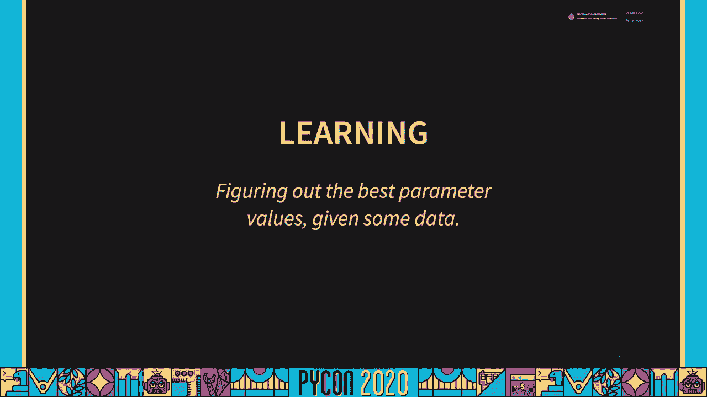
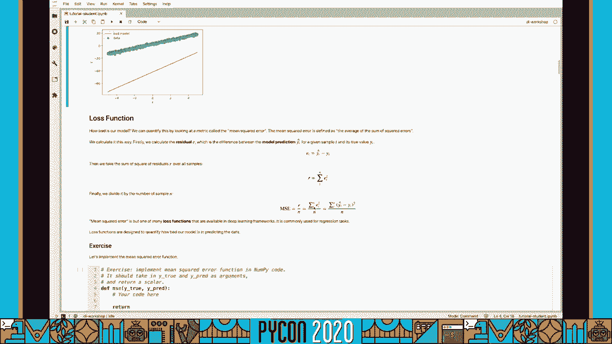
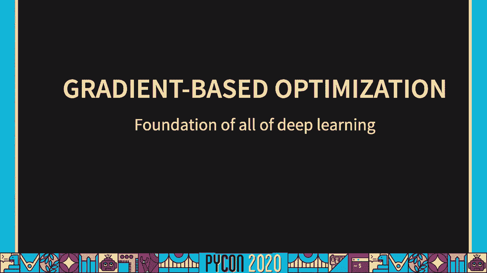
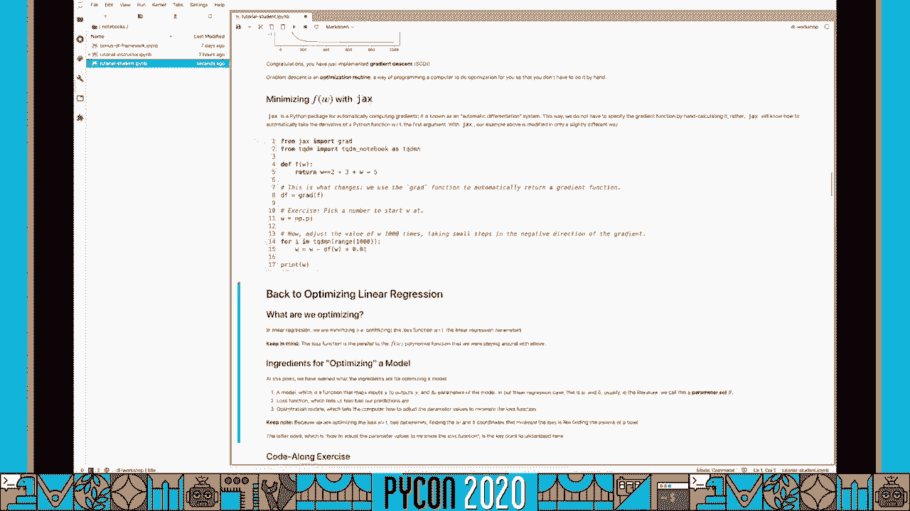
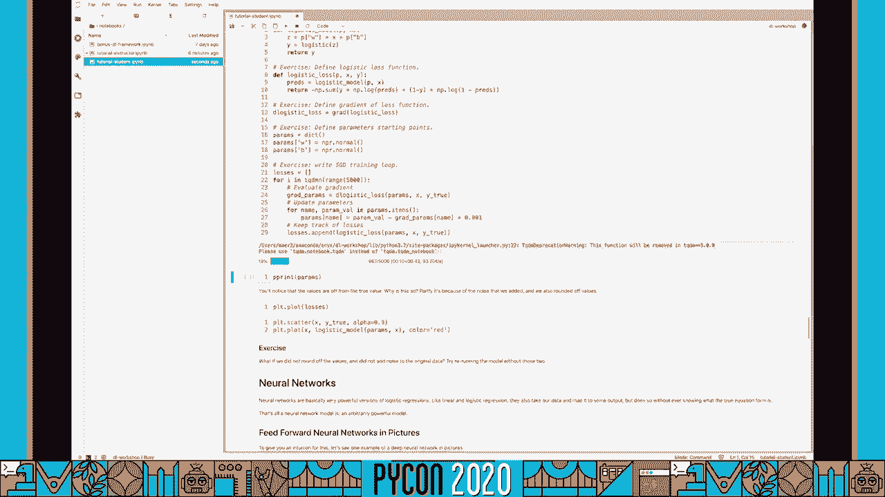
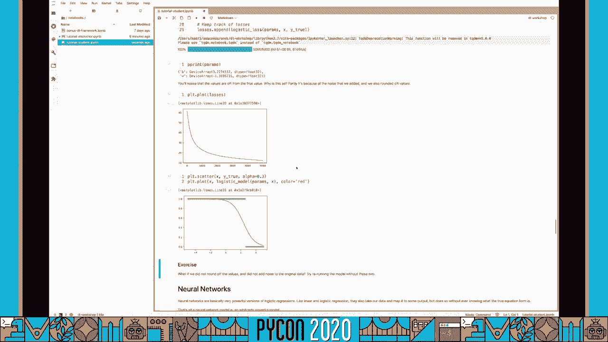
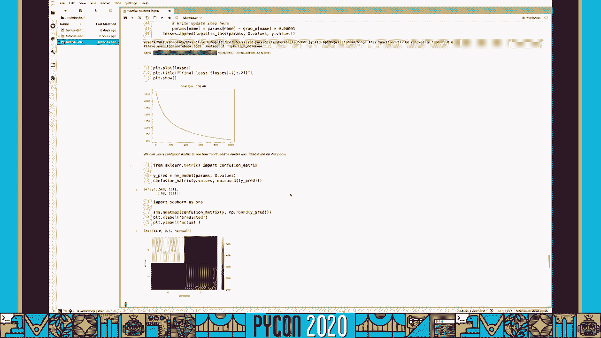

# PyCon US 2020 - P77：Tutorial Eric J. Ma - Demystifying Deep Learning for Data Scientists - 程序员百科书 - BV1rW4y1v7YG

我发现你们今天要学的东西，对你的职业发展非常重要。

非常荣幸能成为其中的一员。

在我们进入教程之前，我想先确认一下 你们都准备好了，首先，您应该能够访问教程存储库，它位于 github上。

github dot com slash eric mjl dl hyphen workshop，我们在下面的视频描述中链接了网址，一旦你去了那里，您应该看到在这个时间点设置的说明。

你会想做两件事中的一件，您可以按照 conda环境设置说明 在本地托管 jupiter服务器，这是下面的说明，或者你可以点击活页夹，就是这个小徽章 然后启动一个活页夹实例。

这将把您带到一个云托管的码头 工人，集装箱化环境，一切都为你准备好了，所以这真的是为那些，懒惰，我也要用活页夹来教学，所以你可以选择这样做，并跟随，走吧，一旦活页夹装好。

你会看到一个和我屏幕上一样的界面，这里最重要的目录是笔记本目录，继续点击那个，在笔记本目录里，你会发现我们在今天的教程中使用的主要笔记本，有两个版本，一个是教师版，另一个是学生版，当然你会用学生版。

所以如果你被困在某样东西上，不知道该怎么做，请随意翻开指导老师的笔记本，把答案参考在里面，我们继续打开学生笔记本。

现在对于那些使用活页夹的人，这里有一个小小的温柔提醒，宾德有15分钟的暂停时间，这意味着每隔一段时间，可能每一次，每隔十分钟，确保你在你的笔记本里执行一些东西，这可以确保你不会失去联系，因此。

失去了所有的进步，你已经有约会伟大的东西，现在我们在笔记本里，一切都安排好了，我们开始上课吧，我们先谈谈目标，先决条件，和课程结构，这样你就会知道你是否为此做好了准备，以及到最后对自己的期望。

损失与优化器，在课程结束前，您将能够提供这些的定义以及示例 来帮助我们理解这些想法，我们首先在线性回归的背景下探索它们，这将占用大约一半的课程，一旦我们完全停飞。

我们将进行 logistic回归 并最终前馈神经网络，到最后，你会看到所有的三个组成部分，模型丢失和行动中的优化器，对 numpy api的一些熟悉是完成本课程所必需的。

它建立在numpy api的基础上，并提供额外的功能，比如一个具有一些线性代数知识的自动微分引擎，主要是如何做网点产品，没有什么比这更有帮助的了，也就是说，如果你觉得生疏了。

numpy api是更新线性代数知识的绝佳方法，关于python数据结构和流控制的基础知识是必要的，因为我们将在课程中专门使用python。

现在你知道你的处境了，让我们从线性回归开始。

线性回归，这是我们在高中数学和物理中学到的第一个模型，你在屏幕上看到的这个等式 对你来说应该不会太陌生，y等于 mx加 c或 wx加 b，无论你的符号是，我想请你们写下一个问题，在这个问题中。

你可能使用了一个线性模型，在这个模型中加入了什么假设，你先想一想，把你的想法写下来，线性模型非常有用，因为它们编码了一个结构假设，即输出是加权的，现在加上偏置项的输入总和，世界的大部分不是线性的。

在许多应用中，线性模型是一种非常天真的假设，我以前听说过的一件事是，如果你足够用力地放大，所有的东西看起来都是线性的，现在，手里拿着一个线性模型，我们可以模拟这个模型产生的数据，另一方面。

如果我们翻转这个问题，并声明我们得到的数据是由一个未知参数值w和b的线性模型生成的，接下来有趣的任务是找出参数 w和 b能最好地解释数据，最好地解释给定模型的数据。

让我们通过显式地模拟数据来看看这一点，通过多种方法来恢复生成数据的参数 在你的笔记本里编码，首先，我们模拟一些由参数生成的数据来决定我的情况，我要做的事情是，w，true等于3，1。

4加b下划线2等于2。7，二，y等于 w真时间，x加 b真图，那些家伙，哎呀，确实需要运行上面的一切，所以你去那里，我们有一些生成的数据，一些基本的真相数据。

还有一件事我们应该做的是 我们应该在那里增加一点噪音，所以让我们去添加一些噪音，让我们开始 X的 len的噪音，所以我们有一个单一的噪声项 每 x每一个数据点，我们在那里，我们有它。

我们有我们的噪声生成的数据，接下来我们要做的是，我们要画出我们认为是非常糟糕的 w和 b的估计，我把三点一，四点二七二，所以让我们做一些像六点二，八减去四二，然后我们做y是w乘以x加上b。

让我们把这两个画在一起，你可以清楚地看到这个模型对生成的数据有多糟糕，从视觉上看，我们知道这个模型非常糟糕，我们如何量化 这个方法是通过设计一个误差函数或损失函数。

这告诉我们 这个模型与我们观察到的数据相比有多糟糕，我们可以使用的一个损失函数叫做均方误差。

它被定义为误差平方的平均值，视觉上的均方误差 在红色中看起来像这样。

我们有，我们的实际数据，其实，我要把这些都换成蓝色，为了与我们笔记本里的红色配色方案相匹配，我们有模型，均方误差是这样计算的，对不起，让我们倒退一点，我们还有 x轴和 y轴，均方误差是这样计算的。

以地面真相，只指向 y轴上的模型，嗯，因为我们有四个，在这个例子上，我们把它们标记为一二，三号，D四，定义为 d是残差或差值，模型和实际数据之间的差异，它的脚本是 i来指示每个数据点。

然后我们取所有数据点的平方，所有的不同，所以我们要关注的是这个小家伙，然后我们把它除以我们拥有的数据点的数量，所以设 n为数据点的个数，应该放在记号笔里，这里 n是数字，数据点。

现在你已经知道了 平均平方误差是什么，让我们继续在麻木中实施它，我们在这里定义了代码的骨架，函数名为 msc，它需要两个麻木的阵列，是真的，是真的，现在为了良好的编码实践。

让我们继续注释这两个函数参数的类型，这样我们就可以让函数更清晰地读了，Y true被认为是一个麻木的数组，为什么 preis也被认为是一个麻木的数组，最后我们将返回某种形式的标量。

但它仍然是一个麻木数组的形式，如果你记得步骤是什么，我们需要写出两个数组之间的差值或残差，所以 d等于 y真减去 y，然后我们需要把它们的正方形，所以差的平方是 d的 mp点幂的次方。

最后我们需要取平均值，所以我们把平均损失，平方 d的 NP点平均值，我们会把损失还回来，有更紧凑的方式，写这个，这对你很有用，想知道，所以返回平方 d的 p点平均值，是的，这正是我们想要的。

但我们也可以用它来代替平方 d，我们也可以把 d换成原来的，所以现在我们有了一条，完成了我们现在想做的事情，当然这本书更容易读懂，但如果你精通麻木，您可以随意编写这样的代码，它真的很强大，好吧。

所以对简洁的兴趣，我要在这里评论这篇文章，我们要用那边那个，如果你计算平均平方误差，你会注意到它现在给了我们一个数字，顶级测验，这个数字是正数还是负数，如果你说肯定，你说得对，因为 np的力量。

任何数的次方都是正数，这里是模型预测，y是数据，所以通过量化 y和 y之间的平均平方误差，我们已经量化了模型有多糟糕，这就打开了优化模型的大门，这意味着调整参数直到我们优化 通常意味着。

最小化误差或损失函数，让我们现在向下滚动，首先在行动中感受一下这一点，通过手动操作，继续执行下一个代码单元，这将为您提供一组交互式的小部件，您可以使用这些小部件来调整w和b的值，直到你找到最合适的模特。

当你这样做的时候，请注意损失是如何随着模型拟合的变化而变化的，当你在优化模型的时候，你注意到了什么，你注意到 当你接近最佳值的时候，就像我在屏幕上做的那样，损失减少，但一旦你在错误的方向上超调。

方向一致，损失又增加了，为了理解这一点，我们将绕道进入基于梯度的优化。

在你刚才所做的事情中 隐含的是我们以前所说的 基于梯度的优化，这一点很重要，如果你得到一个线性模型，你就会明白它是如何适用于更复杂的模型的，所以今天我们将进入一个小的速成班，关于梯度优化是什么。

让我们从渐变开始，梯度，梯度与导数有关，冒着诋毁数学家的风险，因为有一个草率的定义，我们只是想说 为了今天的目的，导数是当我们在非常小的步骤的限制下，在输入上迈出一小步时，我们的输出会发生多大的变化。

所以我们的产量有多大的变化，我们的投入有多大变化，三角洲 x到了它是零的地方，所以如果我们有一个特定的功能，我要定义一个任意的函数，假设我们有一个函数，例如这里我们有一个函数，f/w，是这样的。

W的平方等于对手，等于 w的平方加3 w减去5，从一年级微积分开始，我们可以知道这个函数的导数是多少，也被称为df乘以dw等于2加3，对吗？所以当我们讨论优化这个函数时，通常我们指的是找到。

Minima，是啊，是啊，最低，给这些涂上不同的颜色，所以这里强调的是，更重要的是，我们要找到 x的值，在我们的情况下，对于这个最大化的函数，所以我们现在知道当斜率等于零的时候，函数的最小值是存在的。

对，所以如果我们把 df乘以 dw设为0，然后我们可以解析地求解w的值是什么，使函数最小化，所以，f是最小的，所以我们可以解决这个问题，这就是我们的答案，现在我们从第一年的微积分中又知道了。

我们可以求二阶导数，再确认一下 这确实是最小值 所以二阶导数，告诉我们是最小值还是最大值，所以如果df乘以dw等于2 w+3，那么二阶导数就是等于2的导数，因此这一点是一个极小值，我们有一种形式。

你知道吗，这是一个与事实相反的笑脸，如果是负面的，零。

我们就知道这个功能是皱眉，皱着眉头，因此我们可以判断在这个例子中的点是一个极大值，你知道我们有一个最小的点，因为我们的功能是笑脸，因此我们通过分析找到了，现在，对于简单的函数可以这样做。

但是如果你要对复杂的函数做这个，对不起，如果你要对复杂的函数做这个，复杂是一个超载的词，如果你要为一个复杂的函数做这个，那就有点困难了，尤其是如果你想用手工操作。

或者如果你像我一样在一个草率的数学家 谁不能正确地复制方程，在这种情况下 我们该怎么做，好吧，那时我们就可以做计算最小化，这就是我们接下来要讲的，那么我们所说的计算最小化或，更一般地说，计算优化。

我们这里的意思是使用关于函数的导数的信息，我们要优化的是这个函数，执行此优化，让我们以图形的方式来看这个，以帮助我们获得直觉，如果我们在 w的数列上选一个点，假设我们在这里选一个点。

我们在这个点上计算函数，我们得到另一个值，现在，我们知道我们有可能计算和评估梯度的确切值，在这个特定的函数中，梯度会在图像上看起来像好的，这个坡度将有一个正的坡度，这意味着，这里的线总是小于零。

这告诉我们的是增加 f的 w，使得Δw小于零，那就是我们减去，我们需要负梯度，我们需要负向 w方向移动，我们需要往负方向移动，为了增加 f的 w，这就是梯度告诉我们的，事实证明，我们不想增加。

但这不是我们的重点，我们的重点是减小 w的 f，所以如果梯度告诉我们朝一个特定的方向移动，那么我们要做的就是向相反的方向移动 以达到最小值，换句话说，我们不想这么做，相反，我们想这样做。

如果我们在另一边，我们想这样做，好的，这就是我们所说的基于梯度的优化，现在我们要做的一件事是 我们想在负等级中迈出一小步，我们不想采取大的步骤，我们最终会站在对立面，如果我们在这边再迈出一大步。

我们会回到那里，我们永远不会达到最低限度，所以我们的目标是，真的，真的是一小步，就像我们在这里和这里展示的，好吧，现在让我们看看如何使用 python代码来完成这个基于梯度的小步优化。

让我们首先实现这个函数，我们一直使用这个w平方函数作为python函数，所以我们做这个返回到2+的幂，在这个代码单元里，我们不会用的，但这只是为了提醒我们，写 f关于 w的导数，这也不应该太难。

2乘以 w加3，现在，写完就开始，现在让我们选择另一个数字开始 w，我要从一些可笑的数字开始，三次圆周率 我们现在要做的是，我们在这段时间里通过一些小步骤调整值，在这种情况下 一千个小步。

我们要沿着梯度的负方向走一小步，好吧，那我们要怎么做呢？对于范围内的i，一千w等于w减去导数函数，以 w乘以一个小数的特定值计算，你要知道，零点，零一是任意的，大小拿去吧，我也会让你记录下，好吧。

所以我们去哪里就去哪里，历史等于一个空列表，对不起，键盘故障，然后我们要做历史点 然后我们首先要做的是 我们要退出，我们要处决整个牢房，所以让我们继续这样做，我们应该达到一些价值，它的价值非常接近。

这是这个函数的最小值，除了一些，你知道数字精度误差，所以你可以查一下，我们确实已经最小化了，我们知道我们已经改变了 w的值 并逐渐接近正确的终点，我们要绘制出，情节作为点点滴滴的情节 历史。

如果我们用那个手机，你会看到我们已经逐渐从三次开始，乘以圆周率的3倍到实际值负值现在是1。5，如果你认为这可以帮助你随意暂停视频，选择另一个 w的起点并重新运行代码，你只要确认一下 你的结局总是消极的。

一分，五个或者离那里很近的地方，恭喜你 刚刚手动实现了梯度下降，梯度下降是我们所说的优化程序，我希望这个简单的例子能让你明白，现在如何使用基于梯度的优化来优化任意数学函数。

如果您以前使用过 sci p的优化例程，在这个例子中，我们一直在使用，我们必须知道如何手工定义 python中的梯度函数，这是这里的函数，一切都很好，如果我们只处理简单的函数，比如我们在示例中使用的。

但如果我们有一个复杂的数学函数 我们需要导数，手工划分导数函数会很麻烦，谢天谢地，如果我们知道如何表达我们的数学函数，复杂的或不复杂的，用初等的麻木的数学函数，那么我们就有工具来自动生成导数函数，DF。

我们称这些工具为自动差分系统，在我看来，二十 年代，但只有一个是通用的，也明确地针对麻木的应用程序接口，JAX为我们用户提供了编写麻木代码的能力，然后自然地对它求导。

比 TensorFlow中的原始实现快一百倍，所以今天我们要用 jax，因为我相信知道如何使用它 将给你无限的灵活性，在考虑和实现深度神经网络模型时，让我们继续看看如何使用 jax来优化数学函数。

首先从 jax我们要导入 grad函数，然后我们要重新定义我们想要优化的数学函数，我们没必要，但这只是为了澄清，我又把它放在这里了，如果你看看第八行，这就是魔法发生的地方，而不是手动定义 df。

我们在这里就是这么做的，就在上面，在那里我们手动定义 df，所以现在不用手动定义 df，我们所做的就是，我们考上了研究生，它返回给我们的是另一个我们可以调用的函数，就像我们在上面计算梯度一样。

我想你现在，证明我们确实可以优化 f，像往常一样 使用 jax的 grad函数，我将和你一起编码，享受音乐。

现在让我们把基于梯度的优化和线性回归模型联系起来，在我们的例子中，我们优化的函数是 w平方多项式函数，我们为了求函数最小值而优化的参数是w，在线性回归中，我们优化的函数是损失函数 l。

我们定义为均方误差函数，这里，我们要优化的参数是 w和 b，这些参数，是的，它们确实出现在线性模型方程中，你看那边，但我希望你非常清楚，我们对线性模型参数 w和 b的损失函数 l进行了优化。

但我们没有优化线性模型函数，好的，这是其他人以前有过的困惑点，所以我想确保这一切都被清除了，在这一点上请随意暂停视频，好好思考并说服自己，如果你做了这么棒的东西。

你现在已经掌握了我想要传达的框架，它是模型丢失和优化器，所以让我们把它写下来，框架，由三部分组成，模型，这个模型只不过是一个数学函数，你可以用numpy来写，映射输入 x，一些产出，Y。

它还有一个参数集，西塔，它控制着映射的工作方式，在我们的线性模型中，例如，θ是参数 w和 b，第二，损失只不过是另一个数学函数，这告诉我们，相对于我们所拥有的数据，模型有多糟糕。

所以它必须有真实的输出以及模型和它的输入，在我们的例子中，用线性回归，我们用 msse作为损失函数，最后，优化器是一个基于梯度的优化器，它告诉我们如何找到使损失最小的参数，换句话说。

我们试图使l相对于θ最小化，这样你就可以，我们这里安全了，我从那里来，西塔就是这个人对吧，把所有的联系都说清楚，我们现在要把这个编码在一起，我们首先在模型函数中定义线性模型，所以让我们把它写出来。

返回 p的 w乘以 x加上 p的 b，我已经告诉你答案了，让我们在这里解释一些设计选择，我们希望 p是一个值的字典，我们需要 p的原因是这样 我们就可以成为一个字典，这样我们就可以在里面很好地索引。

并提取出我们感兴趣的特定值，对，所以 w的 p和 b的 p，嗯，x是我们的输入数据，x是输入的数字数组，所以我们把 p当作字典，作为一个麻木的人，麻木的阵列，如我所说，我们希望参数是一个字典。

所以我们可以很好地索引它，如果你还记得上面的话，我们随意挑选数字，这些就是我们想要改变的参数的起点，或者你知道，最小化我们的损失函数，所以我们现在要做的是，与其挑定点。

我们只需要从随机正态分布中抽取数字，所以在那边做 npr正常，只是想让你知道，我们在笔记本顶部输入了麻木的随机，所以现在我们完成了模型组件，我们现在有了模型和相关参数，我们来谈谈损失函数，对。

所以损失函数，让我们先编写 doc字符串，它将接收每一个，它是一个参数字典，它需要 x的输入数据，最后，它将理解为什么地面真相输出，从模型中我们得到了，我们得到的是 y对 y的估计的 msc值。

谢天谢地，我们已经在上面定义了理学硕士，这是可微损失函数，记住这里的一切都是用麻木和蟒蛇定义的，这里的一切也都被定义为麻木和蟒蛇，所以这意味着，我们可以通过调用grad。

得到msc损失函数的导数来定义msc损失的梯度，好的，所以如果我们继续，我们现在需要建立优化例程，您需要知道的事情如下，不管 msc丢失的函数签名是什么，在你通过研究生考试之后。

同样的函数签名也适用于梯度函数，不同的是返回声明，MSC的损失将返回MSC，所以一个数量为y的模型估计，但是DMSc丢失将返回参数的梯度，其数据结构与传递给它的参数完全相同，所以在这种情况下。

从 DMSc损失中扣除，在调用它并传递参数 x和 y之后，我们实际上得到了一个字典，它看起来和参数一模一样，我们可以利用这一点，所以每个点的梯度都是帕拉姆 x y的 msc损失，所以现在烫发。

让我们在这里给出更多信息的名字，婴儿车是字典对吧，所以 k是真正的名字，键实际上是参数的名称，p是参数值，我们会说烫发，我们现在要做更新，所以名字是，命名时间 P，零点，零，零，又是零，只是另一个号码。

我随便挑的，在这里，我们跟踪损失，MSC损失，呃，我们就会知道，我们会把它加到损失列表里，好的，所以让我们看看这个家伙，如果我们画出随着时间的推移 损失的分数，它将下降并趋向零。

如果我们最终打印出参数值，你会注意到的，我们已经接近了，不是最好的，嗯，够近了，所以现在，我们如何改进这口井？我们可以做一些事情，首先，如果我们想让损失下降得更快，我们可以采取更大的步幅。

所以我要这么做，另外，如果我们想更接近真实的价值，我们可以增加迭代次数，我不是，我不会那么做的，因为有点慢，所以我们先试试这个，这个修改首先，所以我们看到损失减少了，它是我们的中间参数的值。

更接近我们应该在的地方，最后确认一下，让我们做你问他的模型 parax plt dot sparter of y and y s，它们应该形成一条很好的直线，你知道吗，仍涉及噪音，好的。

你总是需要模型说明，这些方程可以帮助你把 x映射到 y，此外，模型有参数待优化，我们一般叫它们西塔，然后是损失函数，它告诉我们模型参数与数据的误差有多大。

最后是优化例程或者 for循环 我们这个 for循环迭代地修改我们的参数θ，使我们把损失降到最低，欢迎回来，我希望你们都休息好了，为下一阶段的课程做好准备，这里的逻辑回归。

我们将以你在前半部分学到的关于线性回归的知识为基础，并扩展到logistic回归，在模型稍微改变的地方，我们用不同的损失函数，让我们直接跳到笔记本上，首先，让我们看看图片中的 logistic回归。

以矩阵形式，线性回归组件对您来说应该很熟悉，我们用 logistic回归所做的是明确地添加一个激活函数，在这种情况下，把我们的线性输出压缩到0到1之间的逻辑函数，这就是图中的黄色函数 g。

这也反映在下面的神经图上，现在让我们用logistic回归函数做一个交互活动，执行下面的单元格，你就能了解 logistic曲线是如何随着 w和 b的变化而变化的，现在你有机会利用这个函数。

让我们来讨论一下 w和 b控制 w控制曲线的斜率，换句话说，0和1之间的转换有多尖锐，w的大小越大，过渡越陡峭，概念上，B控制从0到1的转变发生的点，所以 b越高，越往左边过渡点是，反之亦然。

我们现在将探索如何将逻辑回归曲线拟合到我们的数据中，使用同一套食材，即模型损失和优化器，所以现在执行这个单元格，同时选择性地调整参数，如果你愿意，我要做的是 w减去2，B是五。

您应该得到一些类似于逻辑回归的模拟数据，让我们看看使用的正则损失函数，交叉熵损失，以方程式形式，损失函数按以下方式建立，每个样本，我们将对我做一个预测，我们将把它与我的基本真理相比较。

所以当基真值类为1 并且预测值接近1时，我们会得到一小部分，同时，我们还需要比较1减去 y i和1减去π，这有助于我们处理基本真理类为零的问题，在这种情况下，这个项会归零。

因此我们剩下的是右边的另一个项，现在考虑一下损失函数大小是如何变化的，P的 i变化，即，当它向1或向零移动时，因为这会给你一个直观的感觉，告诉你如何将这个损失函数最小化，随着预测现在变得更好。

如果你盯着这个等式，你认为这看起来很像伯努利分布日志，2。很可能你是对的，这就是连接就在那里，如果你不清楚这个损失函数的行为，然后我鼓励你暂停视频，思考以下问题，每个条款都会发生什么。

当基本真理从1变成0，如果这两个条件，当 p接近零时，当 p接近1时，P是预测概率，一旦你准备好了，暂停视频继续，把我们目前所学到的知识结合在一起，尤其是。

我们将把 logistic回归放到模型损失的框架中，优化器，先从型号说明书说起，如果你还记得逻辑回归只不过是一个压扁的线性回归，因此我们有线性回归分量，压扁分量等于输出的 logistic。

我们现在还给你，如果我们先看看逻辑损失函数，牢记，我们需要把预测说出来，所以提前，我们返回的是，产出，地面真理班，所以我们返回 y乘以 np点的负值，一个减去王子的圆点日志，像往常一样，用千斤顶。

我们不需要在这里定义导数，我可能会纠结于这个函数的导数，相当复杂，所以我们可以用电脑代替，我们把后勤损失转移到毕业函数中，这给了我们另一个功能，D。后勤损失，我们还需要为我们的参数定义起点。

所以我们将使用通常的麻木，随机，我们会把正常的启动参数放在里面，正态分布绘制，最后我们编写训练循环，像往常一样，我们在参数值处计算梯度，然后我们开始更新参数，所以呃，让我们再次命名这些多一点。

更多的信息，所以名字，逗号，帕拉丹，副项目，名称参数等于，以那个名字乘以零点计算，零，零，一，我们会记录每个训练循环的损失，我哪里做错了，走吧。

对，我们把照片打印出来，否，我们有一些空值，好吧，可能发生的是在这次物流损失中，因此我们得到的结果是，所以当你取0的对数，好吧，宾果祝你好运，你得到一个空值，为了解决这个问题，顺便说一下。

这是当你处理神经网络时可能会出现的问题之一，你得到的是空值，突然间你就得弄清楚到底是在哪里发生的，因此，在我们的特殊情况下，我们将采取较小的步骤，这是解决这个空值问题的一个方法。

现在让我们看看我们是否做得更好，看起来比我们刚才得到的要好一些 更合理一些，您会注意到这些值与真值不一致，但我们的标志是正确的，我之前定义 w为负值，B是一个真正的正数，对此的主要解释是我们添加了噪音。

我们把价值四舍五入，所以如果我们计算出 随着时间的推移，你会注意到它往下走，这一切都很好，我们根据数据绘制模型预测图，还不错，不太寒酸，我们可以延长训练时间，我们匹配的迭代次数。

那么我们可能会得到一个更好的适合，如果我们用一些循环迭代来扩展纪元的数量，我们在训练模型时做了很大的工作。

现在您已经了解了线性回归和逻辑回归是如何工作的。

您可以看到神经网络如何适应模型丢失和优化器的框架，我们去看看，神经网络是文献中逻辑回归的逻辑和自然延伸，神经网络被称为一类通用函数逼近器，这意味着它们足够灵活和强大，可以近似任何我们可能自然想要的功能。

然而，这种说法有很多警告，但重点是他们现在是非常强大的模型，因为它们太强大了，我们使用它们的地方 本质上是我们不知道如何写 x和 y之间的映射，让你直观地知道神经网络模型中到底有什么，让我们看一个例子。

屏幕上的那个，这是一个我们称之为前馈神经网络的例子，下面的照片对你来说应该很熟悉，到目前为止，线性分量是用红色和蓝色矩阵着色的，这就是这些部分在这里，好吧，激活函数用橙色表示，这就是这些部分在这里。

现在在这里，如果你在想哇，这看起来就像堆叠的逻辑回归，好吧，那你绝对是在正确的轨道上，深度神经网络模型更多的是相同的，堆叠在一起，至少现在的前馈模型是这样的，从神经图来看，这对你来说应该不是太陌生。

当橙色激活函数在输出之间做一些事情时，不管是像 tach函数那样在边界之间压缩值，或者像 Relu函数那样 将负数设置为零，现在让我们通过从头开始建立一个神经网络 来看看一个神经网络的作用。

我们想预测一个分子是否可以生物降解，给出四个单一的化学描述符，数据已经为你准备好了，因此，继续执行下一个单元格来加载数据，让我们快速检查数据，顺便说一句，这是很好的做法。

所以我们今天要做一个快速的无效检查，只是为了确保一切都好，所以让我们确保所有的输出都不是空的，所以 pd是空的 y会使，会给你这个样子的东西，如果你加上一堆谎言，如果它们都不是空的，那么它应该和为零。

这正是我们得到的，对 x做同样的事情 x看起来像这样，我们会做一个 pd是空的，我们算算，注意所有的柱子，没有一列有空值，如果我们快速计算一下，是的，他们什么都没有，所以这很好，所以继续前进。

我们现在要写一个神经网络，它将接收四个一维数据，用张量函数将其线性变换成20维，最后将其线性变换为一维，使用逻辑激活函数来帮助建模这样一个事实，即我们现在有的数据是二进制的一和零。

如果你在这一点上对自己的技能感觉很好，然后请随意暂停视频 并填写以下代码单元格，否则请和我一起编写代码，所以我们的第一站在这里，称为噪声的辅助函数，你知道吗，容易，简单的方法来控制矩阵的形状，返回。

所以我们需要先初始化我们的参数，所以我们继续，我们将做 w的参数 1将是4的噪音1乘20，其中4个1对应于4个1输入节点，20个对应于我们感兴趣的20个隐藏节点，构建我们的模型，我们还需要里面的偏见项。

所以 b 1的参数是20个逗号形状的噪音，所以它是一个行向量，然后我们做 w的参数 2的噪声是20乘1，这帮助我们从20维输入到一维输出，最后，偏倚项总是，尺寸的输出数，现在让我们把神经网络写在一起。

首先我们要做的是返回第一个神经网络层的结果，所以我们要做这个动作，1等于，np的tan，np的dot，x的dot，and，p，参数字典遵循我们的约定，然后我们加 p的 b 1，我们称之为激活。

然后我们会进行第二次激活，基本上就是我们的输出 第二幕是第一幕的点的逻辑转换，呃，当 p为 w的时候，现在将返回第二幕，如果你想让你的神经网络模型得到很好的注释和记录。

我强烈建议做的一件事是在行上注释形状，對不起你的模特，所以呃，我看看，形状应该是，形状，尤其是对 x，应该是的，样品尺寸，I，E，行数，好的，所以第一幕，会是逗号20，结果是，点41乘20。

加上一个20逗号的东西，这种注释帮助我保持了张量维数的直线性，我的矩阵尺寸 直，因为有时候很难知道发生了什么，所以这是第一幕，这将是我的 x，这将是我的第一个，这是二对一 对不起。

然后我们在这里做同样的事情，是结果，二十逗号一加一逗号，这是第二幕，这家伙是二分之一，那边那个是吗？这是 b 2好的，现在我们有张量维数，所有的注释也都正确，对，让我们看看损失函数。

我们需要在这里定义的是普莱兹，所以 prez等于 nn下划线模型，我们把所有的东西都传递给模型 p逗号 x，把物流损失退回去，我们有物流损失，后勤损失的等级，如果你的笔记本上不见了，就把它填上。

最后我们将完成我们的训练循环，所以p的级数等于d的逻辑损失，通过对x值和y值，最后，我们将在这里执行更新步骤，乘以一小步，我们会追加损失，所以让我们看看真相 时刻，我错过了什么，否，对不起。

是坡道专业的研究生，好了，你看损失在减少，还不错，如果我们做一个混淆矩阵，这是混乱矩阵图，绘制成热图，基本上我们可以看到我们学到了，我们可以让训练再持续一段时间，如果你继续，我们预计损失会减少。

我们希望我们的混淆矩阵会变得更好一点。

你走了这么远 是个摇滚明星，谢谢你坚持完成课程，我希望在我们结束之前，这对你来说是有启发性和信息的，我想确认一下，我希望你带回家，首先，这里的总体框架是模型丢失和优化器。

该模型是一个从输入数据 x到输出数据 y的映射，它的形式是一个数学函数 f，我们可以写在麻木的代码，并有参数西塔，我们可以调整损失函数l只不过是另一个数学函数，它量化了我们的模型有多糟糕，最后。

优化器是一个编程例程，它迭代地更改theta以最小化损失函数l，我根据我们修改它们的频率 对它们进行了排序，你应该尝尝这个，在课程中，让我们谈谈这一点，一会儿，首先，模型是我们摆弄得最多的。

在这三个例子中的每一个，我们定义了一个新的模型函数，相比之下，我们没有经常改变损失函数，在课程中，我们还在前馈神经网络上停了下来，但对于其他类型的数据 也有所谓的规范模型，例如。

图像类型数据我们通常会使用卷积神经网络，对于序列类型数据 我们通常使用递归神经网络，我们来谈谈损失函数，当我们从回归问题切换到分类问题时，我们只改变了一次，如你所见，你的问题类基本上会定义损失函数。

所以对于回归问题，我们用均方误差来表示，针对分类问题，我们自然使用交叉熵损失函数，如有需要，我们可以定义任意的损失函数，或使用权重或添加额外条款 修改现有条款，最后让我们谈谈优化器。

优化器是我们通常不会改变的，在课程中我们编写了一个香草梯度下降优化器，但其他优化器也可以作为一个实用的民间传说 建议，从你的神经网络库的原子优化器开始是相当明智的，把零点零五的步长，这是一个民间传说。

你可以说在我手中有效，作品在很多人手中，那是商标声明，PI炬和张量流都有原子优化器，它们有一个可配置的步长，它们都被正确地实现了，在笔记本的底部是一个信息图，我希望你会发现有用的。

它展示了我们是如何从线性模型发展到深度神经网络的，这些功能矩阵和图表形式在我制作这个总结图时发现很有教育意义，我希望这对你也很有教育意义，最后，我想感谢你们今天的到来，我希望这将对你的日常工作非常有益。

我将推出一份每月的时事通讯，为您带来工具的策划，技巧和技巧，专门针对面向编程的个人，超越你在博客世界中可能找到的东西，目标是超越简单的粘贴，复制粘贴，密码，真正深入到想法中，如果你感兴趣，就来吧。

加入 tinyletter dot com的乐趣，Slash eric mjl，同时，你可以在https eric mjl找到我的在线存在。Github。

IO，再次感谢你今天抽出时间，我希望你喜欢剩下的虚拟蟒蛇。

