# PyCon US 2020 - P78：Tutorial Geir Arne Hjelle - Introduction to Decorators Power Up Your Python Code - 程序员百科书 - BV1rW4y1v7YG

 Hi everyone， I'm Gaed Arnalap and first of all I'm really sorry that we couldn't all。

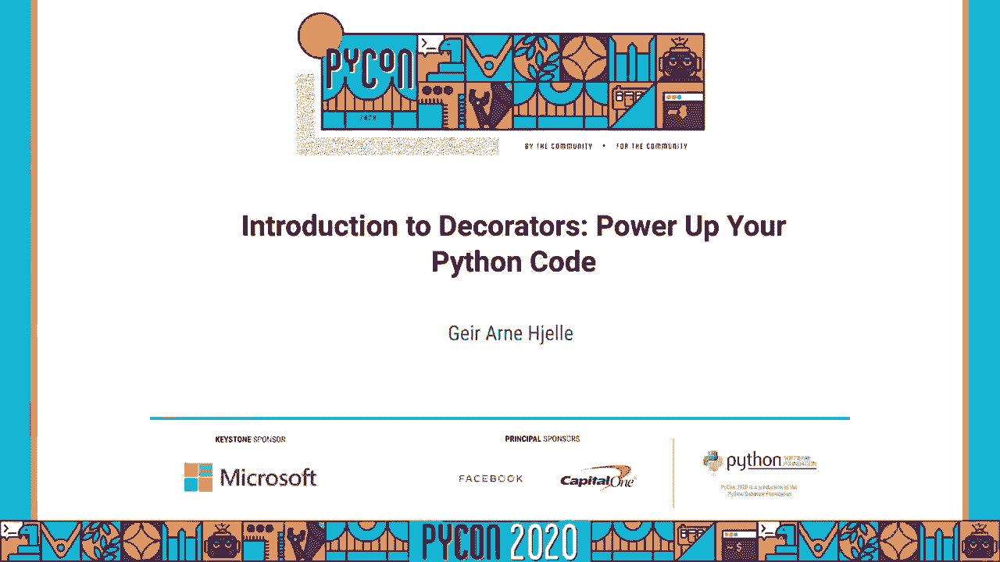

 meet in Pittsburgh。 I've really been looking forward to coming to PyCon to meet you all but I guess we couldn't。

 really get that one together。 I do want to thank the organizers for still giving me the chance to offer you this tutorial。

 on Decorators and I'm really looking forward to sharing all the cool stuff about Decorators。

 with you。 So what I'll do in this tutorial， it will be about Decorators and I'll kind of talk。

 through everything from kind of the background to get you started and hopefully take you all。

 the way until creating some really advanced Decorators。

 What I assume from starting out is that you're somewhat comfortable with Python but no knowledge。

 of Decorators from before is necessary。 During this tutorial I will be working in the terminal and I hope that you will all work。

 together with me。 After we kind of got the basics up and running most of the tutorial will kind of be exercise-driven。

 where I'll have some kind of tasks for you and we need to then figure out how can we。

 create Decorators to solve those tasks。 After you have given it a shot I will also work through one possible solution together。

 with you。 So what are Decorators？ That doesn't really tell as much。

 The concept is much more interesting。 Decorators are there in the language to add consistent behavior to many functions that。

 want typically。 These things can be stuff like label a function that you want to have time during code execution。

 or maybe profiled and even just compiled if that's necessary。

 It could be things like labeling your endpoints and a web server that these endpoints need。

 to be behind the authentication so the users need to be logged in to see these。

 Or it could be things like， and this is an example from the click package where they use。

 Decorators to convert regular function arguments into command line arguments and options。

 Of course we won't have time to implement all of these kind of behaviors ourselves but。

 the plan for the tutorial is that you'll learn all the concepts that are necessary to。

 work with these things。 What you'll see is that the Decorators are fairly small and easy concept once you get。

 the hang of it but there are several elements that are kind of flying around there。

 So it takes some time to kind of just land all the necessary things and put them together。

 So with that let's get started and see what this course will include。

 So let's go into a little bit more detail about what this tutorial will include。

 So first of all let me just say that I work as a data scientist in Norway with a company。

 called the MastenXbridge and then on my spare time I write some articles for real Python。

 and I did write an article with real Python that was published I guess almost two years。

 ago now about Decorators。 I'll offer you some links for that one later as well and you can kind of see more detail。

 about some of the things that we're covering here in that article as well if you'd like。

 to have things written down。 Okay so what we'll do today is that we'll first start with an introduction to Decorators。

 and during this introduction we'll kind of get all the pieces that are kind of necessary。

 to see how the craters work。 Once we kind of got that one up and running we'll start to do exercises and first we'll。

 have three exercises we're all kind of making somewhat basic decorators and just see how。

 we can make them run for us， kind of learn the basic templates how the decorators look。

 and things like this。 And then afterwards we'll do more advanced decorators where we'll have decorators that。

 can take arguments， decorators that can kind of work to keep state and all those kind of， things。

 And then at the end I'll kind of talk a little bit about some additional resources and how。

 to kind of continue working with decorators。 The first section， Introduction to Decorators。

 I want to cover first a couple of building， blocks。

 So first is this concept of functions being first-class objects。

 This is kind of fancy way of just saying that you can assign a name to your functions。

 You can have many names assigned to one function and you can pass them around。

 You can take a function， pass it as an argument into another function。

 You can have functions returned out of the function and things like this。

 So functions work exactly like any other object in Python and that's respect。

 And we also want to talk a little bit about inner functions。

 These are just functions that are defined inside of other functions。

 And again it might be something that you're completely used to but it's also something。

 that if you haven't seen it before it may look strange at first but it kind of has a。

 natural behavior。 And we'll see both why we want to know about these things and how it works in this section。

 And the third little thing that we want to have a look at is how we can manipulate functions。

 in different ways。 So for instance playing with their attributes and those kind of things。

 Putting all of this together will then come to the point where we can actually decorate。

 our functions。 So we can create decorators and that will kind of be more or less the end of this introduction。

 except that we'll also learn how to make these decorators play nice with us。

 So how can they play together with essentially any function that you can think of to decorate。

 and things like this。 So that's kind of just an overview of this first section。

 So now let's get started。 So I will be using IPython as my terminal。

 This is a very nice terminal that also kind of， but if you're familiar with Jupiter you'll。

 kind of recognize it from running there and it gives me a few things like command recall。

 and command completion and those kind of things。 So now to get started the first topic that we want to talk about is just that functions。

 are first class objects。 And as I briefly mentioned during the introduction this means that you can use functions wherever。

 you use other expressions like variables and those kind of things。

 And one thing that we'll be using a lot is that we can take functions and pass them into。

 other functions。 So just to kind of get us started and see what this means。

 Let's start with a very simple say hello function that will essentially be your good。

 old hello world。 But instead of adding or calling print explicitly I'll here add something I just call logger。

 which will be a function that will somehow log the hello statement。

 And then I'll take this logger that is now a function and I'll call it and then I'll call。

 it with something like hello。 So once we have this defined we could now essentially run our regular hello world by。

 saying say hello to the world and use print as our logger function。

 And you can see here that it now prints out a little world。

 So just to kind of recap what happened here is that I'm here saying that I want logger。

 to be the print function。 And then that is kind of picked up here and now it's calling this function and it tells。

 me where it runs print alone。 And just to point out that here we're kind of as usually using kind of the duck typing。

 up Python。 So if I would give things the wrong type here。

 so say say hello one comma two we will get， error because we are using the logger here as something that can be called typically a。

 function and you can't execute it too。 Okay but what other things can I do？

 So now for instance if I import the logging module I could also say hello to our logs。

 and now I can say that okay now I want to use a different function。

 So now instead of using print maybe I want to use logger wanting。

 And you can now see that it's and some stuff here and that's the way that the logging module。

 works by printing stuff out。 If I use this with a different logger info you'll see that nothing is printed out and this。

 is again part of the whole logging module which is set by default to only outputs things。

 that are at the warning level or higher as it's called。

 So we can kind of see that these functions are doing something in the background right？

 We could even do things on files。 So for instance say that we have a。

 first let's just look at a file， let's say hello。text。

 and you can see that I don't have that file on my computer at the moment。 So let's create it。

 So I say that I want to say hello。text for writing and call this one file for the moment。

 and now I can call my say hello function and let's say hello to files and this time I。

 want to use the logger which is file。write。 So that's a method on the file object that can write something to that file。

 So if we now run this nothing on the screen， now look inside we actually see that we have。

 created a file on the disk。 And then the final example I want to do with this is just that if we define now a different。

 function for instance a reversed print function， I'll have this one taking some text and I'll。

 have it just use your regular print function but then reverse the text。

 So I'll take the reverse of the text and let me also then throw in a capitalized on top， of it。

 So this is now just our regular version of course。 I can hide there。

 This one and you'll see that it's reversed the text。

 We can also send this one to the say hello function。

 So for instance let's say hello to let's see if we can do this one correctly something。

 like no zip and then call our logger reverse print。

 And you can now see that it prints out the hello message but it's used the logger reversed， print。

 So all of these examples you might start to see some of the power that is within this， concept。

 So what we have here is that we only have this one function right say hello。

 That was just this very simple definition。 And then we can kind of give it a lot of different behaviors based on the function that we're。

 passing in。 And this might be depending on the background I guess。

 either completely natural or truly， groundbreaking。

 And either way whether you're used to this or not it is a very powerful concept。

 And it's one of these things that kind of comes from the world of functional programming。

 of which Python has adopted a few principles without really taking it all the way。

 But it gives us the possibility to write code that can be really reusable and kind of applied。

 in many different contexts。 And the decorators is kind of a very important part of that。

 One thing I also want to just point out here is that， well let's look at print for instance， here。

 Is that when we pass in the function we pass it just with the name。 We don't send any parentheses。

 Right， we don't do this。 And the difference between these two things is that in this first case we are actually。

 looking at the print function object。 So we're just taking the print object itself and passing it in。

 Well in the other case if we actually call it what we end up passing in is the return。

 value from print。 In print case that is just none。

 So that explains why we get this error saying that the none type object is not callable。

 Because what we actually ended up doing in this output 16 there is really just the same。

 as if we had directly said logarithms。 So one important thing to just keep in mind when we're passing these functions around。

 is that you want to always pass them around without calling them so without using the， parentheses。

 Okay so that's kind of how functions as first class objects what that really means。

 We can pass functions around。 Then we have something called inner functions or this is just a concept that you are allowed。

 to define functions within other functions。 So let's just create a very simple example。

 So I'll just have a regular function that I'll call an outer function and have it print， up high。

 And then inside of here I'll define a new function that I'll call inner。

 And then from the inner one I'll say let's say hello from the inner function。

 And there's a definition of inner but then inside of outer so first it will print then。

 it will define inner and then finally I'll have it call the inner function。 Something like this。

 And now if we run outer you'll see that it both says hi from the outer function。

 That's just the print we have here。 And then it says hello from the inner function which happens when we call the inner function。

 right there。 One thing I'll point out is that inner is not defined outside of outer itself。

 So it's just defined within the local scope of the outer function。

 And again this is something that you are probably familiar with already but you may not have。

 thought of it that way。 So if we look a little bit at this definition of outer and let me now also just define a。

 new variable here。 So I'll just say variable equals one。

 It's slightly interesting and called the variable pi-con and I'll develop it 2020。

 Now if we run this you know that variables defined inside of functions are not available。

 outside of those functions right。 So if we do other it still runs as it used to but pi-con only defined inside of the outer。

 function itself。 So with the inner functions they behave exactly the same。

 So they are defined there and they're all only kind of bound to the local scope within。

 those functions。 So what you are kind of used to from using variables right is that if there is some variable or。

 value that is interesting for the outside world what you need to do is to return it。

 So if we return pi-con and then we call outer then we can get a hold of the value of pi-con， here。

 And we can do the same with the functions。 Instead of returning pi-con I can return inner and now if I call outer you'll see here。

 that it returns a function with the interesting name of outer。local。inner。

 And this inner function let's give a name to it。 I'll call it inside just to keep it different from the name inner that you've seen。

 This is now a regular function that we can call。 After it has kind of been returned I have access to it outside。

 Again this is just being able to do the same with functions that you're already able to。

 do with things like what you're used to doing with other objects。 So like integers in this case。

 And then one more thing though I want to point out with the inner functions is that they can。

 use information from their enclosing scope。 So this is again something that you might be familiar with from regular functions that。

 if you have something defined outside of the function you can refer to it inside the function。

 So that's kind of you're reaching out of your scope is okay。

 But just to show how that works also for the inner function here now we can say that the。

 Python is like this and this in the string。 Now when I run outer you'll see that it says here Python is 2020 where it has gone to the。

 enclosing scope to get the value of Python。 So that's a little bit just introduction to inner functions。

 And now let's try to see how we can use this to kind of play with functions。

 So now we want to manipulate our functions a little bit。

 And one thing that I'll just kind of start doing here is I'll just define a very simple。

 function that I'll call hello and it will take a function as its only argument here。

 And then I'll just here I'll print out the name of the function。

 So I say hello and then you can use the double underscore name double underscore so the under。

 name attribute to get the name of the function。 And yeah let's just start there。

 So now we have something that takes a function we define the outer function earlier。

 So let's try to say hello to it and you can see here that if I have I pass in my other。

 function object it can now say allow outer。 One thing just to show you we also have the inside function。

 So here I gave it the name inside but it was defined as inner。

 So what will be the name if we now say hello inside。

 In this case it's picking up the original name hello inner it's saying here。

 This is something for now just to note what happens there and this is something that will。

 come back with a little bit later。 Okay。 Now let's make our hello function slightly more advanced。

 I'll just also return。 So now I'm returning the exact same function I'm not doing any manipulation on it right。

 I get a function I return it。 So now if we say hello outer you can see it still print out hello outer but then it also。

 returns the function outer。 So the return value from this is a function object right。

 That means that we can just call it。 So I can add double parentheses to it and call it。

 And now you can see that okay we got the hello outer from the hello function and then we have。

 this output that you've seen before from the that is printed inside of outer。

 So this is starting to be a little bit of inception here and then finally we got the。

 return value that was this inner function that we returned from outer。

 That means that instead of calling it directly I could also assign it to a new name。

 So I can say that new outer is hello outer and first of all you can see here since we're。

 just sending this one through。 If I look at new outer it still is just the outer function and you can even check here。

 that new outer is regular outer and that's true。 Okay so that's kind of getting a little bit of playing with these functions。

 Now let's move closer to what we actually do when we are decorating functions。

 So what you really do when you decorate a function is that you create a wrapper around。

 the original function and then in that wrapper you add some functionality。

 So for now I'm going to play with a function that I'll call wrapper and this will be our。

 first real decorator in a sense。 And what we'll do here is that we'll start out just by doing something before we call。

 our function。 So just for now I'll just print out that I'll use I'll just print out the sentence before。

 Then we'll call our function and finally we'll also print out or we'll do something after。

 we have called the function and for now I'll just again print out。

 Okay I said this is our first decorator。 It's not really a decorator yet and I'll kind of show you just briefly how this one works。

 So if I now call this around outer you can see here that we have we're doing something。

 before we call it then these three lines are familiar that's from calling outer function。

 and then we do something after outer。 But in this case this wrapping happened exactly when we ran this line right and if I now just。

 run harder again you can see that this is still seems to be a regular function and if。

 you run it it doesn't have any nothing is happened to it in that sense。

 So this is kind of just wrapping the outer function just at runtime and we need to kind。

 of call wrapper outer every time we use it。 That's not really what we're after we're looking for something that's a little bit more。

 permanent。 So this is where our knowledge now inner functions come into play so I'll just create。

 an inner function here and just to kind of try to keep track of things I'll just name。

 it with the same name as the other function but with an underscore in front。

 And this inner function will now do what we did in wrapper earlier namely it will do something。

 before calling the function then it will call the function and then it will do something。

 after calling the function。 And now the kind of little magic that we'll do is that here now we'll return this new inner。

 function so that's something similar to what we already did with the other function right。

 And what can this do for us now？ So if I now say wrapper of outer remember that when we did this last time it ran outer。

 In this case it now just returns this inner wrapper function that we created。

 And what happens here is that we wrap this now at this stage only once and I'll now say。

 that we take a new outer and we'll make it wrapped outer。

 And what I can do now is that I'll do a new outer and call it and now you can see that。

 we have stuff happening before we run our function we have the stuff that was happening。

 in the outer function itself and we have stuff happening after the outer function。

 And this can now happen I can now call this several times but the wrapping of outer happened。

 only once so it only happened here on line 54。 The only time we actually did the wrapping itself and what we have been doing since then。

 is calling this actually new function underscore wrapper that then is doing something calling。

 the function doing something more。 Okay so now we're ready for one more very small stuff and that's that we will actually。

 just redefine the name outer so that it points to this new wrapped function。

 So I did say earlier new outer equals wrapper outer。

 The only change you'll do now is that instead of sending this to new name I'll just redefine。

 outer itself like this and this is now something that we call the outer has been decorated by。

 the decorator wrapper。 So wrapper is now a decorator and outer has been decorated and what we can see here is。

 that outer is no longer the outer function as it was defined and now every time I call。

 outer you can see that we have changed its behavior。

 So that's essentially how a decorators work and what you might be used to if you've seen。

 anything about the creators before you probably not seen this syntax because what we Python。

 introduced a long time ago I believe it was Python 2。3， Python 2。4 is something called。

 a decorator syntax and if we now just recall our other function I'll keep this version。

 I think and yeah let's first just run it one time and now you can see we have our regular。

 function back but if I not changed this definition and just on the line right before the definition。

 the outer line I'll write an add symbol and then the name wrapper and this is the usual。

 form the usual syntax that we use to decorate functions and if you run this and now I run。

 outer you can see that it has been decorated with this wrapper where it's doing something。

 before calling the function it's calling the function and then it's doing something afterwards。

 So this is the syntax that you'll usually see for decorators but kind of the main takeaway。

 that I want to make sure that you get here is that that syntax is purely syntactic sugar。

 for this syntax where you're doing outer equals the wrapper of outer。

 So just to kind of enforce that point a little bit just you take away that I hope you have。

 so far is that what we'll call decorators that's just any function that accepts a function。

 and returns a function。 So just to remind you if we define our wrapper function here as something that defines a。

 function or sorry it takes a function as an argument and then it returns some function。

 back this function could really be any function but it's for all useful purposes it should be。

 somewhat related to the the function that you get it。

 And the other takeaway is that this add wrapper syntax or add decorator is just syntactic。

 sugar for defining the function by itself and then running function equals wrapper out function。

 This is something that will be very useful to just keep in mind when you're trying to。

 figure out how do a decorator work when we get to the more advanced decorators will have。

 the creators that can take arguments for instance we'll be able to stack several decorators on。

 top of each other and then to figure out how those things work it's always useful to kind。

 of come back to what is really happening in the background so then having this in mind。

 is really useful。 Okay then before we leave this topic so here we have our wrapper function I just want to。

 point out that there's a few issues with our wrapper function and one is as follows if we。

 now go back to one hour say hello functions I'll just create a very simple hello world exercise。

 again say just hello name this and let's okay let's run it。

 So say hello world works right and now if I decorate this with my wrapper like this and。

 then we'll say hello world one more time we get a typo it says here that underscore wrapper。

 takes zero positional arguments but one was given so there's something wrong happening。

 with the argument here so the fact that say hello here takes an argument is causing us。

 some problems。 Okay we'll soon look into how to fix that but there's more problems so let's say that。

 we also have another function for this one I'll do a quick dice roll I think so let me。

 import random and then I'll define a small dice roll function that should just return。

 a random number and until you're between one and six so if we do a dice roll there's three。

 there's four so on and now what happens if we use our wrapper decorator on this one。

 In this case once I run dice roll you can see here that while it seems to run we got。

 the before dice roll we got the after dice roll but somehow we actually didn't get the。

 result of the dice roll so we can see here that the actual result that we saw appeared。

 three and four and so on is eaten up by a decorator so there's also something regarding。

 return values that doesn't quite work with our wrapper we'll also fix that one fairly。

 quick and then I'll just want to point out one more thing and yeah let's again function。

 and that's I've been talking about this double underscore name attribute that kind of shows。

 us the name of the functions so it's not dice it's dice roll but the dice roll here seems。

 to think that it's called wrapper so there's also something happened with the name here。

 you can probably see why this is happening because when we did the decoration we replaced。

 the dice roll function with this wrapper function so of course it has a different name for most。

 cases this isn't really important but it may have some subtle problems to it so we definitely。

 want to fix it and it also makes debugging much harder when you can't really trust what。

 your functions are telling you okay so let's see how we can solve these problems the first。

 one was that if we said hello world this thing completely crashed and so let's see what happens。

 here and so if you're looking now into what is happening remember that say hello has been。

 decorated with wrapper so that means that it has really been replaced by this wrapper。

 function so I'm now calling I'm really calling a wrapper here when I say hello world but you。

 can see that the wrapper doesn't take any arguments and that's of course we could now。

 do something like and just add the name argument here and then if we do redefine our say hello。

 let's see and then run hello world it works and the problem now is that if we have any。

 function that doesn't take exactly one argument here that function won't work so for instance。

 if I now apply this to the die-stroll function die-stroll won't work and so this is not really。

 a good solution let's see a better solution did I fix this we can use what's called the。

 star arcs and star star keyword arguments the quarks and what this medium does is that。

 it just collects or all the positional arguments that you give to a function so the ones where。

 you don't use a keyword and all the keyword arguments that you give to a function and。

 just collects them into a list in a dictionary or two-plan dictionary and then we don't need。

 to care about how many what they're called or anything and then we can just pass those。

 further on to our wrapped function weighted function so by doing this now I'm saying that。

 I'll just take whatever arguments you give to me and I'll pass them on to the to the。

 function I'm wrapping so let's try to run this wrapper around say hello and we can now。

 see that we can run say hello world and now it does what it should do it does something。

 before say hello it runs the hello world and it does something after say hello and if I。

 would now for instance call say hello without any arguments you can now see that it's actually。

 doing something before it's calling say hello and now it's say hello itself that's complaining。

 about the missing positional argument so now we the wrapper itself is just taking whatever。

 it's getting and passing it on。 Okay then we had some issue with our dice roll so let's see if we remember what was the problem。

 here it's just that when we have our dice roll it had some return value but that return。

 value is somehow eaten up by our decorator so let's see what happens then so you can。

 now see that once we call our function which will be the dice roll in this case we don't。

 collect the return value at all it's just lost when you get to this line so the first。

 thing we need to do is to definitely make sure that we save that return value to some。

 value and now to make this behave consistently and then return that value so you can see now。

 that I'm just saving the return value here so that I can do some more stuff after I've。

 called the function and then once I'm done doing that stuff I passed the return value。

 on so you can see this is kind of the same principle just in reverse so with the arcs。

 and quarks we need to just take whatever we get and pass it on to the function and for。

 the return value we take whatever we get is return from here and then return it further。

 out so let's see if this is enough now to fix our dice rolls and let's see where we have。

 it there we go so now if I call dice roll you can see that it does something before the。

 dice roll it does something after the dice roll and it returns out value some value of。

 the dice roll so that worked then the final issue that we looked at was that we have changed。

 the email dice roll and can we do with this well start kind of the via a naive approach。

 so here I have my inner function wrapper that I'm defining and then the issue is that it。

 has the wrong name right so one thing I could do is just to say okay let's just change it。

 so now I want to wrap your name to just equal okay so if we do this and then redefine our。

 dice roll first of all let's just check dice roll still works and now the name of dice roll。

 dice roll so we successfully have changed the name of dice roll and now this works but it's。

 not an ideal solution for instance now if I can I just say print out the function object。

 you'll see that it now in the in kind of the wrapper for the function object it still has。

 all these weird references to the underscore wrapper and the wrapper and things like this。

 so we changed name but we haven't changed other things that might be useful to to change as。

 well and it turns out that this is kind of important enough thing to look into so that。

 it exists a function in the in the standard library inside of the fun tools package and。

 called a wrapper and if you look at the help for this you'll see that the doctoring says。

 that this is used to update a wrapper function to look like the wrapped function so that's。

 essentially exactly what we want to do right and then it has some details here for it you。

 can see what which things it actually changes so here we have the name that we talked about。

 but it for instance also copies over the duck string and things like this and now there。

 we could use the fun tools update wrapper but there is actually an even a simpler thing。

 called wraps and this is a decorator factory so it's actually a decorator to apply update。

 wrapper to a wrapper function so this makes it even easier to use okay so how do you actually。

 use it well let's go back to our wrapper function and now I don't want to do this manually instead。

 what I'll do is that I'll apply the fun tools wraps and right over here and there's this is。

 something we haven't seen with decorators before but it takes an argument namely which。

 function it should copy information from so it should take our original function and。

 the wrapper function and we'll talk more about how to actually create decorators with taking。

 arguments later but with this wrapper and now we can have a look at our dice roll and。

 first of all see that let our name is dice roll so that was what we were kind of looking。

 for with our fix earlier but if I now look at the dice roll just a wrapper for it and。

 the function object it has a nice name and we can also yeah mention the duck string we're。

 playing a little bit hard fast by capturing here but let's add a string function and now。

 we can see that I can do help as far forward using here see that we have six sided dice。

 in the duck string so with all of these things now we have what I'll call actually a very。

 nice template for how you'll typically create your decorators so what you'll do is that。

 you'll have some kind of wrapper function so this will be the actual decorator it's a。

 function that takes a function as input and it returns some function as output usually。

 you'll define this function that it turned it up with as an inner function because that。

 gives you the possibility to both play with with the funk here and and change kind of。

 some of its behavior either by doing something before and after or one could even do some。

 weird things with arguments and those kind of things but often you'll end up having something。

 before calling the function and then you'll actually call the function recall here that。

 we pass in the RX and quirks and take we remember the return value and then you might be doing。

 something after calling function and finally usually you'll then return the return value。

 from the function so that that's kept but there might be decorators where you want to。

 change the the return value and things like this as well but this is kind of the most。

 typical template that we use so this kind of concludes our first part and we're now getting。

 ready to work work our way into these exercises and one thing that I'll just recommend is that。

 once you start working on the exercises start with this kind of wrapper template here and。

 then take it from there。 Okay so let's move on over and look at our first exercises。 So。

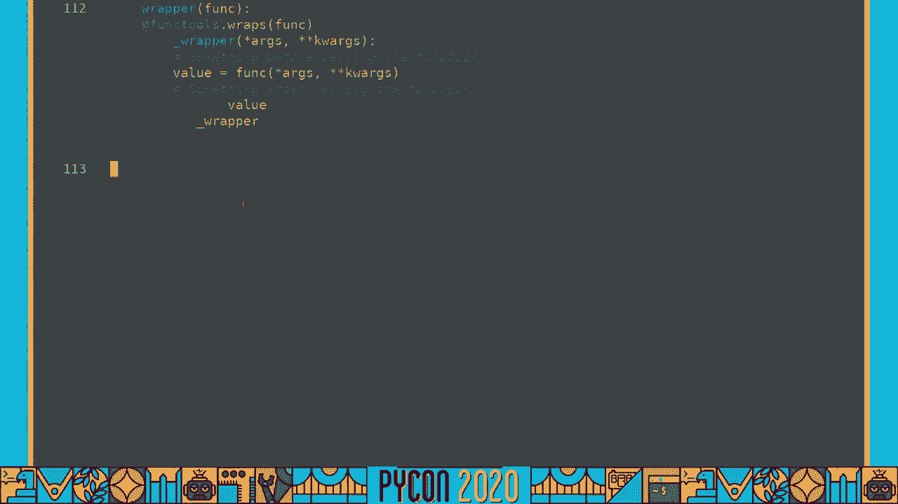

 let's start with the exercises so first of all just a little bit of logistics so the。

 exercises comes with a file where you can or several files that kind of help you get started。

 You can all download these from this repository and what you'll find inside of this repository。

 will be some task files that contain some code I'll show you those soon and then also the。

 template that we saw for the for the decorator so let's start here。 So if you look inside。

 a pike in decorators。py you'll see that it contains this template just a few small comments。

 added and this you can use as a starting point for your own decorators。 For most many cases。

 at least it will be a good starting point and then as we'll kind of get into more advanced。

 things you'll kind of figure out how to add stuff to it。 But then let's move over to the。

 first task so this is a timer task and what will happen here is that you can kind of this。

 function or this file you can run and it will probably then tell you that you don't have。

 timer implemented in pike on decorators。 So your task is to implement the timer decorator。

 so that it will behave properly。 So let me just show you an example of how we want this， to run。

 So what I'm doing here is that I'm just starting a pike Python but now I'm giving， it the task。

py file that we have here and then a -i flag。 So what this means is that。

 iPython runs test a pike as a usual script file but then once it's finished running it。

 stops in interactive mode。 So inside of here I now have waste time defined and strictly。

 enough I also have the timer decorator already implemented just to show you the behavior that。

 we're expecting and what you can first of all see here is that when you run the function。

 waste time it pops up a line saying a lapse time in this case zero seconds。 At this line。

 you can see it's not anywhere in source code instead that comes from the timer decorator。

 So that's the part you need to implement and what this decorator does is just measuring。

 how long time does it take for this function to run。 So what is this function for the task。

 it can it's not really that important but let's just have a quick look at it。 So it's just。

 something that's kind of set up to waste a little bit of time。 It takes in a number argument。

 and based on that number it sets up a for loop and so for it runs through the range of that。

 for that number and inside of that for loop is essentially another loop where it runs up。

 to the range of the running index there and then it somehow calculates some kind of sum。

 out of this。 In the case where number is 10 you can see that the result comes out that's， 120。

 Let's try to waste time with a slightly bigger number。 So here now you can see it at。

 least spent 300 of a second。 Since this kind of scales more or less like n squared with。

 a double loop let's try 10 times more than we should be at about 2， 3 seconds。 Yeah it's。

 like less than 2 seconds。 So your task then is to implement the time of the decorator so。

 that you can also run i Python task。py and see similar results to this。 Of course your。

 running times will probably be slightly different but the behavior should kind of be the same。

 And just a small hint I guess to get you started is that to actually view the measuring of time。

 you'll want to import the time module it's part of the standard library and it first comes。

 at a function called perf。com or perf。com。 You can see here that this is what they call。

 a counter for benchmarking。 What it returns is a seemingly random number。 But the importance。

 of this number is that during a session it is always increasing and the number here is essentially。

 if we can use it to measure time。 So for instance if I took here the time minus the previous result。

 and that was 8。8 seconds for that example。 So this is what you want to kind of base your time around。

 And yeah what you should do now is just pause the video and see if you can more or less recreate。

 this behavior。 Then once you start up the video again we'll walk through a solution together。

 Good luck。

 [silence]。

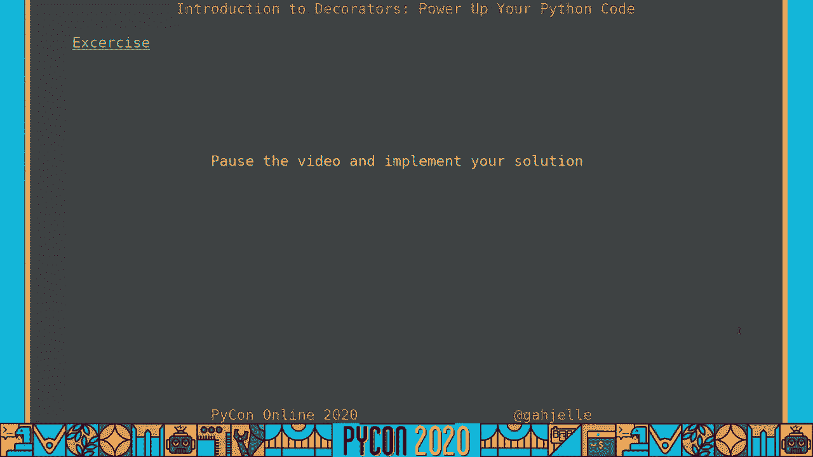

 Let's have a look then at how we can solve this timer decorated thing。 So first of all just to。

 do some testing I think I'll copy in when a couple of these examples into the script here so we can just。

 run it more easily。 I don't have to run it manually。 So if we， solve three of them。

 And so if we do this time with 10，000 like this and then just。

 and I'll show you so now I have a move in my solution。 So if I now run Python test。

 that's why I get the import error。 I can't import the name timer because it doesn't exist。

 And so now I have my， wrapper template example here and I'll just change this one， to timer quickly。

 Let's see like this。 And we have a template for decorators。 And now just to run my。

 example we can see here that it at least runs through the thing but it doesn't really do anything。

 yet。 So that's the next thing we need to fix。 I said that we could use， time standard library。

 So we can import that。 Now what should we be doing with this one？

 Well we saw that the perf counter was something that was kind of measuring relative time。

 So if we sort of implement the clock here so I'll say that I'm the。

 perf counter and I'll call that the tick。 And we call our function and then we calculate the。

 clock afterwards。 And now we have two measurements of the perf counter。

 And then let's see what should we print out something like elapsed time。

 And then we will find a stick。 And let's let ourselves do this mouse and say seconds there。

 Now I'm just using the template exactly as it was written right。 And I'll do here is that before。

 we start the function I'll take a note of what is the time right now。 I'll kind of record the tick。

 And then I call the function and then afterwards I want to record what's the time after we call。

 the function and then print out what's the difference of those times。 The rest is just。

 the template using the template。 I'll probably update this one as well。 Something like recording。

 running， or let's just say timing。 Let's see what this one works。

 So if you run this again we can now see that it prints out。

 elapsed time and it seems to be calculating this thing correctly。

 So this shows an example of how to， kind of get started。

 Hopefully this gives you some idea about how you can do something， before calling a function。

 How you can do things after calling a function。 And。

 just to remind you if we look at our task here we can also see that our template has taken care of。

 sure the number that we pass in and the total that is passed out are both handled correctly。

 Right so the clearly number has something to say here and we get the return values here。

 So this gives us at least one solution for the first exercise。

 Okay then it's time for the second one。 Let's move on。

 For the second exercise we're gonna do something called the trace decorator and this one is also。

 something that should fit to the pattern of the template that you've seen already fairly well。

 So let me first just do a demo to show you a little bit how this would work。 So again I just run my。

 IPython terminal and over this second task file and now I have the functions defined here。 So you。

 can for instance if we just look at the first one it's again essentially a hello world type of。

 function but we decorate it here with the decorated trace。

 So if I run this you can see that it returns， hello world and that's kind of what the function does but then the trace decorator adds this output。

 So what it does is that it's just kind of say more or less a debug output that you can get to kind。

 of follow how the flow of your program is。 So in this case it says that okay it's calling the。

 greet function with world and then this greet function returned hello world and now if we for。

 instance do something like a bit name equals world you can see here that it picks up that we're。

 using a keyword argument or if I'm also changing the reading so maybe it will end to be a Python。

 and say def world and you can kind of see these things kind of happening here and then to kind。

 of just make the example a little bit more interesting。

 We also have a couple more functions so here I， added a random greet function with this one does is that it just picks out the greeting at random。

 from this list that we have up here and then it calls a greet with that。 So as an example and now。

 since this is random let's actually set the random C so it's reproducible and now if I call random。

 greet let's see random greet yeah I'll just call it with the default arguments here then you can see。

 that you see random greet is called and then this one calls our greet function with the name Emily and。

 the greeting Nee and then this kind of returns all the way back to us and then to make this。

 even more I guess convoluted probably and there's also a greet many function that just calls random。

 greet several times so if I do a greet many let's say we do that three times。

 and you can now see that we first call greet many and then there are。

 one random greet loop here's a second one and a third one and then inside each。

 of these we call the greet function and then finally greet many returns with this list。

 So again it may not seem like an amazing kind of function but this can be useful to just follow。

 the structure of your program and mainly this is now just for testing so what we want to do here。

 is to write so your task is to write this trace decorator and mainly the big difference from。

 what you've done already is that we are here using the values of arcs and quarks the argument list and。

 the keyword argument list also inside of the function itself or inside of the decorator I guess the。

 creative function so that should hopefully work out well。 There's a little bit of。

 to kind of get this kind of formatting it's a little bit of play with。

 yeah F strings and joints and things like this if you can just print them out that's also perfectly。

 fine and then just remember when you want to get the name here you can get that from essentially the。

 name attribute right so greet underscore for instance and one little thing you might remember here or。

 can't try out as well is that the name of the function is something that you can。

 figure out already inside your decorator before the wrapper function if you want to do that。

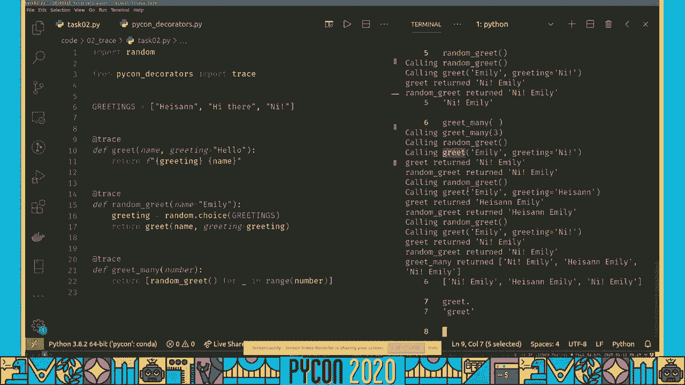

 okay so let's look at how we can solve the second task so the first thing we need to do is to add。

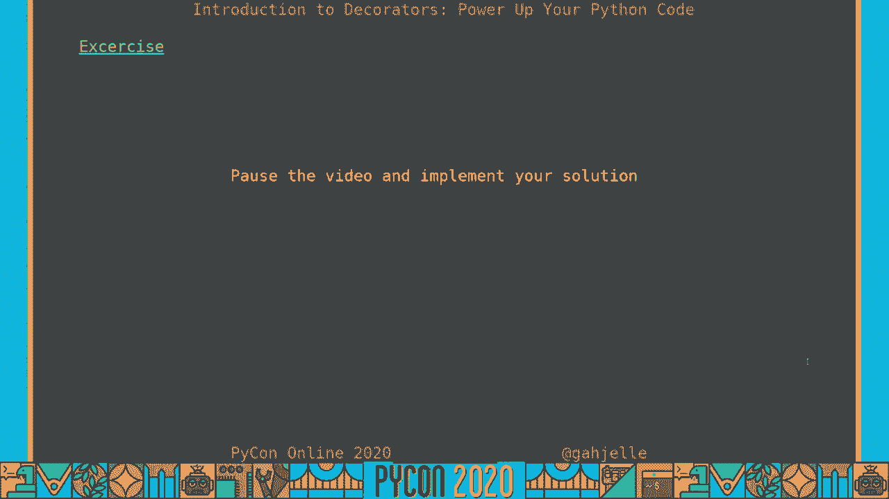

 a trace decorator to our Python decorators list and for this one yeah let's spell it out here。

 you could also just copy the timer decorators since we will be doing something quite similar。

 but I'll kind of do it step rest up here so show the trace of function calls I guess we can call this one。

 and one thing that we can just do right now is just define the name of the function because this。

 we're going to use a couple of times so I'm just defining this in a variable that I leave in the。

 decorator itself because it will not change from function call to function call so this will kind of。

 be a what's called a closure but it it will then be in the closing scope we define it once when we。

 find a when we kind of decorate the function and then we can use it afterwards inside of our wrapper。

 function and then we have the wrapper function and this one remember we need to take in all the。

 arguments and key where arguments and then we want to add the fun tools wraps on top of this。

 so that's the one that adds in kind of the correct naming of our wrapped function。

 and this will then be the yeah I'll call it the trace function that replaces the original function。

 and then remember okay how was the template we do something。

 before we call the function then we call the function， hold arguments and keyword arguments。

 and and make do something， and we're calling the function and finally we return value and then the final thing we need。

 for now is that the trace decorator here it needs to return a function and so we need a second return。

 bottom here where we return the different so what I've done so far is not really。

 implementing much of the functionality of trace that we're looking for the only thing is the name。

 thing there but more written out the template just to have that one here for me and now just to test。

 that this kind of runs I'll now run i thin and the task too and one thing I did was just that I added。

 a few test cases so the ones that we did manually earlier I added them to the bottom of the file just。

 to make it easier for us to test I used the same random seed here so we can kind of be consistent。

 so if i'm running this you can now see that as expected I guess it's not printing out any。

 other tracing information and the three lines that are here are just me separating the test cases。

 with some lines okay so that means that at least we have defined the decorated trace in the in the。

 correct place so now it's time to actually do the implementation and I was okay now we're going to。

 use the arcs and quarks here a little bit and so one thing we could then do would be something like。

 pulling and then now I can use my name variable but I pick up there。

 and if we know the arcs and quarks， something like this and then we want to say here。

 and name returned， so now I'm printing out what was the arguments and keyword arguments we got before calling the。

 function and then I'm printing a three turn value afterwards so if we now run this。

 now see okay here we started and that we actually get the trace here so now you can see that it's。

 calling greet greet returned hello world it's calling greet again which returned def world in this。

 case random greet which calls greet inside greet returns random greet returns and so on and so。

 here we have essentially solved the exercise one thing I'll just spend this short half minute on。

 is just we can make the output nicer it doesn't really change the functionality of the。

 of the decorator though so it's not really that important say to this exercise but。

 gonna just to show you so one thing we can do is that we can make。

 a representation of the keyword arguments and first I'm just gonna take all the。

 representations for each of the arguments for a in cards and this doesn't really。

 inch much the the only thing this part would do is that it will kind of print out。

 quotes around strings typically in our case here and then for the keyword arguments I want to。

 represent them like a string where it's showing the key equals the value for k and v in quarks。

 items let's see like this and then finally I can say that my signature so the signature of the。

 function I can get now by just joining together all of these things with a comma。

 and now if I print out here the signature， we can see how that looks so now you can see we get something that looks more like。

 the actual function called here and there's one little thing left that we might want to fix。

 so that's you can see here there's missing quotes around the strings and that's because here we're。

 just using the string representation and not the wrapper representation like we did there。

 so I could here just do a wrapper of v as well let's quickly see that that then adds in your。

 quotes there and there's also a shortcut to doing wrapper v in in F strings so if you just do a bang。

 and then R that means use the wrapper representation instead of string representation so we can do that。

 as well and I'll just do the same here for the value here since we're dealing with strings that。

 mostly just puts quotes around the actual string values to make them easier to see。

 let's do this one up so here for instance you can see that the return value also has string。

 okay so that gives us a nice trace decorator again it just follows the same pattern that we're using。

 doing something before we call the function and we're doing we're calling the function。

 and then we're doing something after calling the function so the main kind of takeaways。

 here we're that okay we can also use these arcs and quarks and we can use the function itself。

 if what we're taking out only depends on the function not on the arguments then you can even do。

 stuff up here in the so in the decorator function and the kind of convenience or the nice thing about。

 doing it here is that this only happens once when you actually decorate the function。

 while whatever you do down here needs to happen every time the decorator is called so if it's。

 something that takes a little bit of time it's great to be able to do it once if that's possible。

 okay then one more thing I want to show you before we move on is that it's also possible to stack。

 decorators so for instance if I now have the timer decorator defined right and so we could。

 use that together with the trace decorator so as an example let me just put it。

 well time run trace right here， and then to yeah to see the updates we can now run our function again。

 and you'll now see that every time a random greet is called we also get one of these elapsed time。

 outputs， and so what happens here is that we have put the timer around the trace random greet function。

 and this is kind of when one of the first times when it really starts messing a little bit with。

 okay what's actually happening here and so it might be useful then to just spell out。

 what's actually happening so this is now， essentially what it does is that it's calling it's defining random greet to be timer of trace。

 of our definition original definition of random greet。

 so this statement is essentially the same as what we're doing here and so so it。

 remember random greet is a function then trace returns a function and then timer takes in a function。

 and returns it again so what timer we'll do is just take how much time does it or measure how much。

 time does it take for this trace a random greet function to run so so it all kind of。

 builds together nicely one short little note that will do， is let's see if we can make。

 it's our source this okay here we go， so if we run this you can see here that the elapsed timeprints after。

 the tracing is done and that makes sense because we put timer on the outside of trace。

 it's also possible to move it below so just flip the order here。

 and what this means is that we're actually timing just random greet and then we're tracing。

 kind of the timer call and you won't see much difference but if you know it now。

 elapsed time is at least printed out before random greet returns because。

 the elapsed timeprint is now part of the function call if you remember down here。

 so when we call function here that's actually calling the timed function。

 so in this case this part is already printing out the elapsed time before we get to the print。

 statement down there yes so this is mainly just showing you that we can。

 indeed stack timers now stack decorators together。

 okay then for the third exercise we'll do something a bit different。

 so for this third exercise we're going to do something slightly different。

 so now we're looking at a decorator that we're again going to implement that we're called。

 register and this one will actually not change any functions instead it will just。

 register essentially the existence of a function and we now have this code here before I kind of。

 walk you through what this code does let me just run it and show you the effect of it。

 so again I'll run it with iPitan so that it first runs through the code and then it stops。

 afterwards so we can do some investigation as well so now you can see it actually there is。

 actually some a little bit of script here that it stops running so first it's actually an input here。

 asking me to input a text so let's say something like decorators are。

 now it says here that there are some parsers one called two or fourths one called reversed and。

 one called rubber language and it asks me to choose a parser and if you look over here on the。

 on the code you can see that the parsers come from something called registered that's also part of。

 the decorator that you're going to make and but you can kind of recognize here the names here are。

 from these functions so there's a registered true or false function there's a registered。

 reversed function and there's a registered rubber language function and we're going to look at what。

 these do as well but let's choose reversed that's an example and you can now see somehow prints out。

 nephirasarutarotz or something like this and if you look closely at this you can kind of see。

 that this is decorators are fun in reverse so this thing has reversed our text so you can kind of see。

 here okay what what does the script to it asks us to input a text then there's a there's a wild。

 true loop here the only thing it does is to make sure that the answer that we're giving here is one。

 of the registered parsers if it's not it just asks one more time once that's done it comes down here。

 and it says okay parser funk it goes into this registered dictionary and picks out the parser。

 from the dictionary and then it calls this parser funk with the text so let's have a closer look at。

 what this registered is and you can hear see that this is a dictionary and it has entries where you。

 have the name of a function and pointing to the function object itself and this is kind of。

 happened for all three of these and this is something that can be used in Python for instance to emulate。

 switch switch statements and things like this or it can be used like here to give the user some。

 some kind of dynamic choice between different available things for instance you could imagine that。

 this was part of a bigger plugin or hooking system where you can define hooks and just register。

 them like this even at even at runtime you could add registered new hooks so it kind of gives you。

 some extra flexibility in your code but one thing to note here is that yeah it's just these claims。

 to be the functions that we have defined right here and in this case we have actually not been。

 using fun tools reps so it actually is just the pure function and so for the register。

 decorated that you're going to make it will actually not need to to wrap the function itself it just。

 returns the same function so the only thing you need to do there is to the the registered。

 decorator takes in the function and then it just registers that function into the registered。

 dictionary that you have here and then it can return that function back again and before。

 having you run off and implement this and i'll just show you quickly what these。

 things do as well and so the true or false function so let me actually call it here so have a true or。

 false this so you can see this is now a function so we can call it and it does things like it。

 translates between few different say more human readable strings that has some true or false。

 connotation so for instance yes is true and no is false for example so that's one way to just parse。

 some text if we happen to write something here that's not。

 one of those words for instance if i actually write decorators here it just returns none。

 either there is no return statement so it just falls off the of the function and returns none。

 the next one is reversed so that was the one we saw already it's just reversing the string and。

 then using capitalized to put a capital letter in front。

 and then the final little parser just for fun here is something called the rubber language。

 parser and let's move there we go and and this is based on actually。

 children's book series by the Swedish author of the lingran where they， mean these similar。

 and just as an example if we do decorators for instance there。

 we can see that it translates decorators into， and and it's a fairly simple thing what it does here is that for each letter in the text string that。

 you give it if that letter is part of the consonants so if it's a consonant then it's written out as the。

 letter repeated and then within o between them so you can for instance see there we have the first。

 the other decorators there's the C and the decorators and so on and otherwise so if it's a well or any。

 other symbol it's just returned as is so that this was kind of then yeah used as a toy language for。

 kids in suite so these are just different functions to play with for different kind of。

 so it's text parsing and so not really important again for the for the implementation of the task。

 but the task that you have is to figure out how can you create this decorator so good luck。

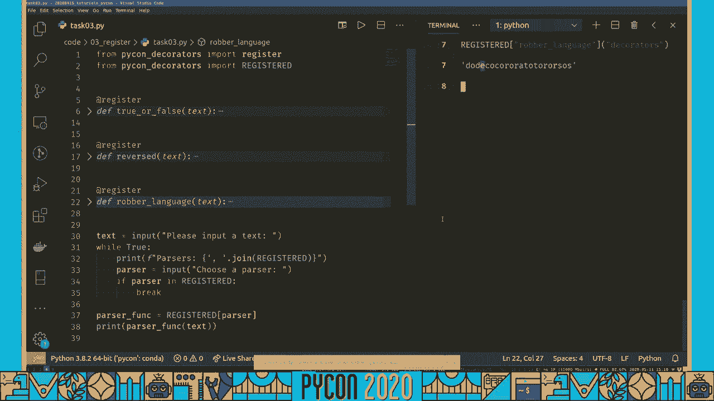

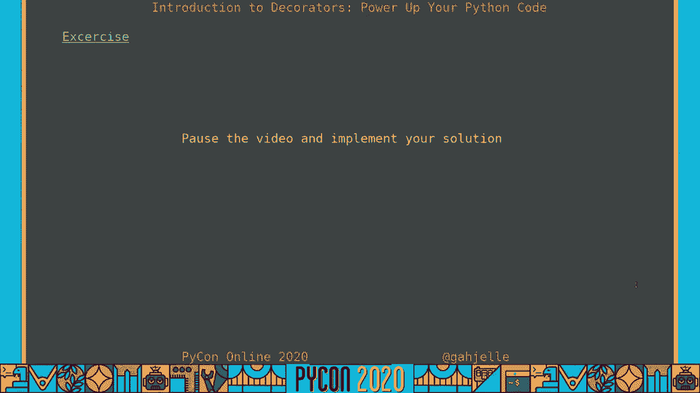

 okay so let's see how we can actually implement this register decorator and now i have。

 the decorators that we already created and let's just yeah let's。

 just give this one and now just to show you i moved the implementation of register so now again I。

 get the error saying that we don't have register defined so let's see what did we need here we wanted。

 if you look here we want to have the decorator register and we want to have the dictionary registered。

 so let's just start with the first one we'll just define this as a module level dictionary。

 and it can just be empty we don't need this to the moment that will instead be dynamically filled。

 in by the grader and we wanted to have a decorator called register and since it's a decorator it takes。

 in a function let's add in a quick buck string to it and some point at least this one will just。

 return the same function right that was one of the things one of the hints essentially we talked about。

 how this one should not wrap the function at all it should just return the same function。

 so you can see how that's different from how for instance the timer decorator works which takes。

 in a function and wraps it in a different function that is then returned so we can start with something。

 like this and now we can see that if we run this at least it starts running so the imports work。

 and if now the decorators are fun you can now see that okay my parsers here is empty so there。

 there is no parser to choose from maybe it works to just type reversed and choose one of them。

 so we just need to stop that so there's still a little bit lacking here in our registration。

 but it's not too much so what we said we want to do is that for every function we want to have。

 one item into our dictionary so that means that I want to do something like you registered and。

 I need the name of the function and this we've seen a few times we can pick out using the name。

 attribute and what do I want this to point to I just wanted to do the function itself so I can just do。

 something like this and let's see if this works better than so if we run again okay let's input。

 the decorators are fun and now you can see that we actually got our list of parsers here。

 true or false reversed and rubber language so let's try to choose the rubber language this time then。

 language and indeed it seems to work now we have， (speaking in foreign language)， and so this。

 fairly simple decorator here and you can see it's a decorator because it accepts a function。

 it returns a function in this case the same function and the only thing we've done is that。

 we've created a list at runtime our dictionary at runtime over which functions that are。

 registered by this decorator and just to show you finally here if we do。

 look at this interactively so let's just go through our false for this example。

 yes is true show you also that it's now the registered dictionary that we hear started just。

 as empty has been filled out by them with the different functions and this happens at the time。

 the function is defined so for instance we could just to show you we could read add another function。

 this case so just add the old trusted world example we've been doing a few times。

 something like this and now if I look in the understood。

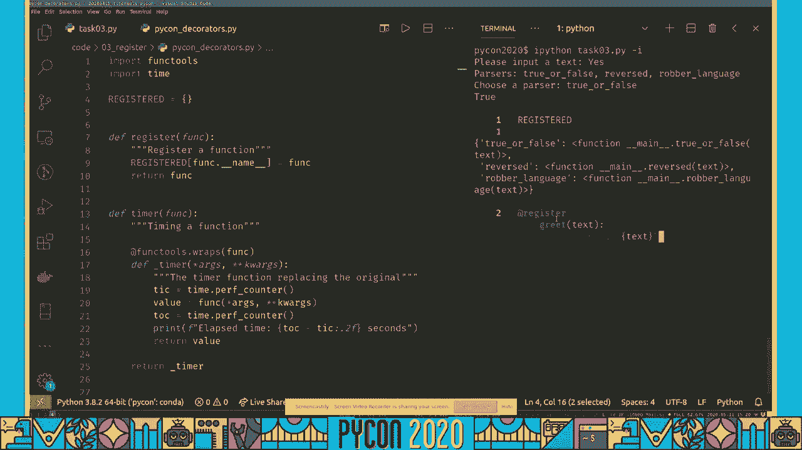

 or you can see that this has indeed been added here and we could now。

 use that to parse text in a similar manner so that's at least one solution for task three。

 and just to kind of do a quick summary of what you have seen so far as we've seen a couple of。

 decorators kind of following the this regular pattern where you define a decorator as a function。

 that accepts a function as an argument it then defines an inner function that is used to wrap。

 around that function and where you do something for this particular case the timer function。

 we just start the timer but you do something before calling the function then you call the function。

 and then you do something after calling the function and then finally inside of this。

 wrapper function you return the return value and then from the decorator itself you return that。

 wrapper function and so we saw one example with the timer for doing this we saw another fairly。

 similar example with the trace but how we could split out so we could do some of the。

 things that are related to the function itself we can kind of do outside of the wrapper function。

 while if you need to do any actions on the arguments you should do it inside of the wrapper。

 function but otherwise this kind of has the same structure and then finally we saw this simpler。

 register decorator that doesn't really change the function at all but just in this case registers。

 the existence of the function so that's half half the task we're going to do in this course。

 so this is a great time to just take a break your stretch your legs a little bit but then。

 once you're back which will on the video will be just in a few seconds we will continue with a few。

 more slightly advanced concepts so in this second part we'll talk a little bit about a few more。

 advanced concepts for decorators the first one would be looking at decorators that can keep some sort。

 of state so you can add some state to your functions essentially and somewhat related to keeping state。

 is how would you go about and decorate classes so classes is one kind of language construct。

 that's really good for keeping state so in this section we'll actually look a little bit on both。

 using classes as decorators so so far we've kind of been saying that a decorator is a function。

 it turns out it doesn't need to be a function it could for instance be a。

 eopia class and there's actually in python 3。9 we'll briefly touch on this as well。

 there's some new developments to decorators where a decorator doesn't even need to be a function or。

 class it's it might be some kind of expression so we'll briefly touch on that as well。

 and then so far we've been using just kind of decorators just something like timer but sometimes。

 you want to have arguments to your decorators as well so we'll look at how we can add arguments。

 to our the careers and then it turns out that there's also some use cases where you may want to use。

 arguments or maybe not so we'll have some how can you actually get away with using optional arguments。

 in our decorators so this will be the the next coming tasks that we're kind of looking to。

 so yeah we'll start working on task 4 in a second。

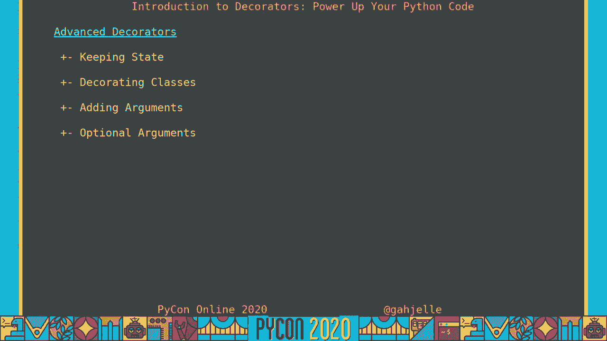

 so in this fourth task what we're going to do is look at decorators that can keep state。

 and how they can kind of remember information over time and as a。

 kind of the example of this that we want you to implement is this decorator here called count calls。

 and what it will just do is just count how many times a function has been called。

 so so again this may not be the most useful thing but it could help you out in in sort of like debugging。

 or profiling your your code and as an example of how it can work and I have here what this kind of。

 the classical bad implementation of a Fibonacci calculator so just for brief background for those。

 who are not familiar with Fibonacci numbers this is just a series of numbers that go something like。

 1 2 3 5 8 13 and so on and what you can kind of notice here is if you look at one Fibonacci number。

 it is always the sum of the two previous ones so 5 here is the sum of 2 plus 3 8 is the sum of 3。

 plus 5 and so on and so one way to write this out just using say more like a math notation is。

 saying something like fib n the nth Fibonacci number is just sum of fib n minus 1 so the previous Fibonacci。

 number and fib n minus 2 the number before that again and implementing this in code kind of using。

 exactly this notation that we have here we can implement this essentially as what's called a recursive。

 function so you have here to calculate Fibonacci I would give a number we just sum up Fibonacci of。

 the previous number number minus 1 and Fibonacci of number minus 2 and then one thing we need to。

 remember in a recursive function is that we need some kind of stop condition so in this case the。

 numbers will always be smaller so for instance if we start with 3 here we will be looking at Fibonacci。

 of 2 plus Fibonacci on 1 and so here we just stop whenever the number is less than 2 then。

 we should return 1 so you kind of want this the first Fibonacci number。

 and yeah let's just run this and see then what happens so again I'll just use my ipython。

 to run task 4 and I'll stop it in a directory mode and so we have here now。

 and this is called the creator so one thing it does is that it adds an attribute to the function。

 and so you can see here I'm able to say Fibonacci dotted number calls and so this is just a counter。

 that counts how many times have this function been called and then we can do something like Fibonacci。

 of say 1 and then I can ask again how many times has this been called and you can now see that okay。

 if first of all we got the first Fibonacci number is indeed 1 and Fibonacci has been called one time now。

 if I now call Fibonacci one more time you can now see that it remembers but it had called it once。

 before and now we call it one more time so now we are called it twice and now I mentioned that this。

 is a bad implementation of Fibonacci and just to demonstrate that let's for instance calculate the。

 seventh Fibonacci number and that's kind of what you can see here as well and now how many calls。

 would we need to calculate this and so if you now ask for the number of calls you can see that this。

 so grown up for some reason this code spent 41 calls to Fibonacci to calculate this number。

 and the reason for this is just that there is no say memory inside of here so that when we for。

 instance did Fibonacci of 7 that calls Fibonacci of 6 plus Fibonacci of 5 but then the call to Fibonacci。

 of 6 here also needs to call Fibonacci of 5 but it it calculates it all over again instead of using。

 the value that it has here so in this way this code ends up just doing a lot of。

 work that it already has done so a good implementation of Fibonacci would use something like either a。

 lookup table some caching or just a simple for loop where you kind of fill out an array as you move。

 through or something like this but this implementation it's really nice to just illustrate something that。

 ends up spending a lot of number of calls so for this one kind of L2N3 so I'm here just to show that。

 this is really bad so this 30 second Fibonacci number that should just take 30 something additions。

 right but you can see here it actually takes some time to calculate and if I now look at the number。

 of calls we can see that it spent over 7 million function calls to calculate this number and。

 okay so that's the Fibonacci code and now what the task is here as I said is to implement this。

 count calls decorator and this is in some sense it's it's fairly straightforward building on what。

 we've done before the new thing is that we have this Tottenham calls thing that we're using here。

 for state and just to show you a little bit of how those work we can I'll just show you here something。

 like an example of the hello world thing that we've seen but very implement a little bit of state。

 so I'll give my third greet name equals world and of course we need to。

 the clue in there and but now I want to assume that I have a list of seen names that I have added as a。

 as a little greet so I'll say something like this and the greet。scene will be a list directly a set。

 of the different names that I've already seen and then if I've already seen this name we can just。

 print a different message so just something like seeing you before name and then if we haven't seen。

 this before we'll just go back to our usual hello name。 And now for this to work probably we should。

 also now just note that we have a seen name so I'll add this to our set and then something like this。

 so now I mentioned that gray greets。scene I want this to be a set and the way to do this is actually。

 just to define it so I can say greet。scene should be an empty set like this and now if I look at。

 greet。scene it is an empty set I'll see if this actually works so if we now just run greet it says。

 hello world as we expected to if I then call greet again it says seen you before world so now。

 can actually use this greet。scene attribute that it's using here so we're keeping some state and。

 to do this we could have used some kind of global variable but by putting it as an attribute on。

 the function we kind of namespace it to where it belongs so this is something that's really。

 interesting for this for this function so we've named space it to that by putting it as an attribute。

 and for instance now if you instead greet icon we'll see the hello p icon and。

 p icon has entered the greet。scene set that we had so this was just an example to show you how you can。

 add a num calls and an attribute to a function so what the task is as mentioned is implement。

 the count calls to grader and so that it has a num calls attribute that counts the number of。

 calls the function has been invoked good luck。

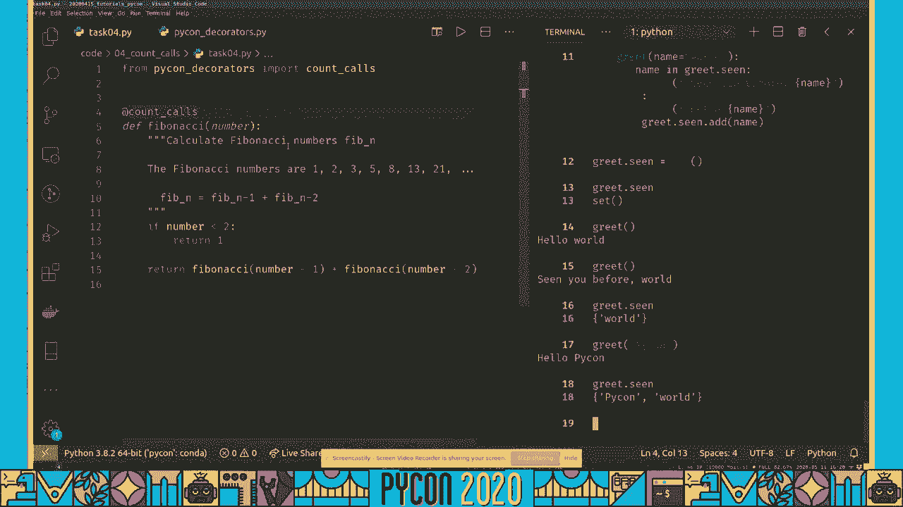

 okay so let's see how we can solve this so now again i've been flipped out my piking the creators。

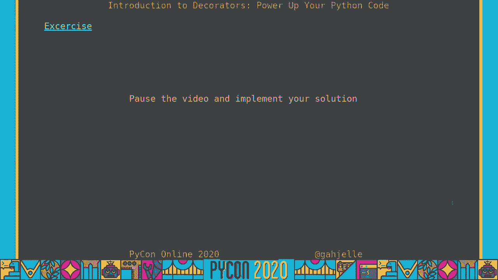

 and i've added some tests here so now just see how it's advanced if we now run python path。

 c04 we can see that i haven't implemented count calls yet。

 so let's start by doing that so we have our decorators here i have the old ones we have。

 registered timer and trace and now we want to implement a count calls takes in a function and。

 this one should do is essentially count the number of calls to function。

 and for now i just let's see what do we know about this yeah let's implement the basics that。

 we're used to so we'll add wraps like this i'll wrap so for this one we actually need。

 some kind of wrapper function because we need to do something when the function is called。

 so i'll just call this underscore count calls we have the arguments and keyword arguments that。

 will pass on and then we're going to do something here well that is and then let's see what else。

 yeah we want to return calls so this is kind of just a skeleton and then we'll implement this。

 and a little bit but let's just check that this works well we don't have the num calls attribute。

 right okay so let's start by just adding that one in so when we are just defining the function。

 we want count calls to be initialized to be zero so in this case i'll just say okay what i want。

 count calls to have and it calls zero so something like this so again you can just。

 even a function you can just define an attribute on that function simply by assigning to it。

 so if we do this now let's see if that one runs yes so now we have code running right。

 and if we look here at the tests we had we're printing up num calls and then i tried to calculate。

 seventh Fibonacci number for that when i got none so of course the code isn't doing what it should。

 yet but at least it's it's running through okay so let's see what do we actually need to do inside。

 of our decorator well essentially every time we call the function we just want to increase or。

 increment num calls so that can be done by input also and so say。

 equals equals this and then i want to add one to it so count calls and plus equals one。

 and that should help us at least get some numbers in here so well let's try。

 okay yeah now we can see that something happens but we're still getting the。

 none from here and that's because well we're taking the function in here but we're not calling。

 it right so now we need to actually call the function and since this time we're actually not。

 need to do anything we're doing anything after we call the function so i'll just return。

 function both way and bugs and like this so let's see if this one runs。

 and now you can see okay we got zero calls let's see what these numbers mean。

 zero calls before we do anything then the seventh Fibonacci number is 21。

 an article claiming that we spent 41 calls to do it then the 32nd Fibonacci number is something。

 like three and a half million and in total we've now spent seven million function calls。

 so that seems to work correctly so just a quick recap what we're doing here is that we have this。

 wrapper function and mainly what it does is just call the function itself but we need to wrap here。

 because every time we call the function we want to increment this camera so that's what we're doing。

 there so this is one way that you can keep state in your decorators。

 and it works fairly nicely although you might be thinking well if i'm going to keep state。

 typically i want to use a class if you're if you're used to classes。

 and using classes gives you much more flexibility and they're kind of built more for。

 we're doing this so let's see if we can actually implement the count calls decorator as a function。

 oh sorry as a class so earlier i kind of said that a decorator is a function but it turns out that。

 anything that you can kind of use to fulfill the pattern right so if you remember if we just。

 add our color like this so we said here that doing something like count calls， of some function。

 setting that thing up is essentially the same as just defining your function。

 and then afterwards assigning things so the main thing like this so the stop thing is the same as。

 defining the function independently and then decorating it manually afterwards。

 so this syntax is just translated to this one and usually what you want to have here is a function。

 but anything that kind of you can use that syntax for will more or less work。

 currently that's not completely true it will be more true in python 39 as we'll note a little bit。

 later but it will work for anything that's callable so if you have a class and that class is callable。

 you could do the same thing so what does it mean for a class to be callable。

 well let's just look at a basic class here so i'm going to make an adder class。

 and this adder will just when instantiate it it will will essentially be a factory of sorts。

 so when you instantiate it will take some number let's just score that number。

 and then what we want to do is that we want this adder class well let's look at an example。

 i want to be able to say something like adder three should be now essentially a callable that。

 can add three to a number so if i do this i now want to be able to say something like add three to five。

 and then want this thing to say eight here you can see i got the type error saying that the。

 adder object is not callable so that's the concept we were talking about and the idea is that we want。

 to make adder callable and then any cluster is callable we should be able to use also as a decorator。

 this kind of a goal we're looking for here so how do you make a class callable。

 it's actually by implementing one of the special methods called call or double underscore call。

 double underscore under call and i'm going to say here now that when i call it i want to have some。

 other number and then the result of calling this adder instance will be that i return。

 other number plus i or number plus so now by adding in the call method here we have made the。

 adder object callable so now we can do and add three again create this adder object。

 and if i now do add three of five let's see that's number three you can see that this turns out to be。

 eight surprisingly and if i add three to twelve i get fifteen and so on。

 so defining this call method here has made our adder object callable so let's see if we can。

 then do the same thing but plus that i want to call count calls。

 and what this count calls to be is something i can use as a decorator so what does that mean well。

 we just saw that then we need to be able to define a call method so we're going to have。

 call method here and as the the call method will now kind of replace our wrapped function up here。

 so i'm just going to define something like this and then we'll figure out what we need to put。

 into there then we're also saying that we want to have let's see for this to work as a decorator。

 i need to be able to essentially now say i want to say something like count calls。

 out some function， and then i'm well it's not defined yet but that's fine。

 this should then translate into something like， the f equals count calls of f so that means that when i do this what i'm doing then is instantiating。

 the class and so to get this to work we need to have the instantiation of the class to pick up the。

 f the function that we're working with so that means that we need to have an init method。

 here that takes in one parameter and that parameter will be a function。

 and seems like it's a good idea to store that function for later。

 so something like this is kind of the basic structure of our count calls。

 later that should work the same as the as the， now it's defined using a class instead so let's see there's of course still some details missing。

 here so we'll add in those shortly but i'm first just going to go here in the task。

 and flip this over and use count calls so let's see now if i can restart my terminal。

 on my ipython and this looks good now we can see that okay we're kind of back in the situation。

 we were earlier when we were running this task let me just run it with a regular python here。

 and see that we have no attribute name calls so let's start working on this one then so first of。

 all we again want to have the attribute name calls and so since this is a class we just define。

 calls now in a sense more naturally instead of adding it to a function like we do here。

 we just add it as a regular instance attributes in our init method。

 so this should at least help us a little bit and now we can see that yeah we're back to the situation。

 way so earlier where we have zero name calls and we get the non-returns when calling the function。

 so this now in a sense the logistics of this works but we don't have。

 the function kind of running properly yet i want to add one more test just to my。

 quick little set here as well and let's just remember that we used the functor tools reps。

 earlier and now to get for instance a good name and so on so just want to check that we are able。

 to do the same thing also with the function yeah and we can see that there is something wrong。

 there as well okay let's see then how should we continue working with this。

 well for to get rid of this one we want to do something with the functor tools and now it's not。

 completely clear to me where should i put the reps right probably here we had it on the。

 function that was kind of cold so maybe i should put it there or i should put it here。

 but then i need to refer to the function which is only fine there and so on so it's it's hard to。

 use the functor tools reps like we do it here and what we can do instead is to just use functor tools。

 remember that the functor tools reps is it's really just using something called update wrapper in the。

 background so we'll use that one instead and see that the functor tools update wrapper it takes。

 both the wrapper and a wrapped and where it updates a wrapper function to look like the wrapped function。

 and now what i want to wrap to make look like or what's the wrapper that's just the count class。

 thing so i'll just write self there and then what i want to wrap is the functor oh what's this in place。

 let's see how this runs and now we can see that it has gotten its name Fibonacci so we got that。

 one in place and we have the syracles but now we just need to work a little bit on call itself。

 and let's see what did we need to do with call well each time we call we want to increase the。

 number calls so i'll add one and then yeah let's just test it again make sure it works yes now we。

 can see that we got the ones and views and then we want to uh call the function so in this case i。

 want to return itself so now we call the function that we have in this sort of here or and we're just。

 gonna pass through the variables that we got in call so hargs and hargs so let's see then。

 so now if we run now it's starting to look better so now we we got something that actually。

 has decorated uh our Fibonacci function in a proper manner so let's look at these ones together。

 and so what we see here is that the count call function decorator and the count calls。

 class decorator they both work in the same way here and if we look at the code you can also see。

 that it's it's very much the same so essentially all the code that we had here in count calls the。

 wrapper function we now put into call so that's kind of what happens every time we call the。

 decorator function and then we had some of this other initialization function or methodology here。

 and that stuff we put in the init of the class， okay then what one more thing related to decorators and classes and so let's now。

 have a look at our let's see yes so let's let's go back to the trace decorator that we had here。

 and I'll just import it like this and now say that I want to use this not to decorate a function。

 but to decorate a class so we're kind of doing the opposite now so what you've seen。

 with the count calls was how to use a class to decorate a function now we're going to see can we。

 use a function to decorate a class so let's do something like just reusing the old trace。

 and we have some kind of class it doesn't really matter too much for this example so just gonna make。

 a quickly trivial class that was really weird but I decorated it with trace and now I'm able to say。

 thing equals thing like this and you can here see that the trace kicks in together so when I。

 decorated the class here it means that when I essentially call the class which means kind of。

 instantiates the class the trace thing starts working and I can then see that okay it's calling。

 thing and then it this thing returned an object which is now our thing now this seems to just work。

 out of the box but one thing has kind of changed here it seems like this is a thing right but now。

 if I want to pick I can say is instance little thing of the class thing and we'll get some weird。

 error here saying that this instance argument too must be a type or a two pull of types so it seems。

 like the thing here it's not the type anymore so let's have a look at see what it is oh thing has。

 turned into a function and if we think about this a little bit we might be able to realize what。

 has happened because how did we define thing well we use trace here around thing so that means that。

 thing there it comes in takes the name fun inside of here even though it's a class but then it's kind。

 of we create this inner function and then we return that inner function so that effectively replaces。

 thing right there with this inner function so that means that this class。

 even though the decorator might do its work the class has changed somewhat。

 in many applications that doesn't really matter too much but there are definitely applications。

 where you want to keep you want to both be able to decorate your class and keep its type intact。

 and so let's see how we can do that and first let me just point out also that one thing we could do。

 would be to move the trace decorator down to the init method and just decorate the init method。

 instead that wouldn't change the class here and we would kind of get the same effect of just showing。

 the trace of the init but that's more of an artifact of this being a very simple example that。

 there are definitely cases where you may want to decorate classes properly so let's look at the。

 principle and essentially what we need to take care of here is that we need to create a decorator。

 that just returns the same class so let's have a look at that so I'm just going to make a new。

 decorator I'm calling it hello it will be a simplified version of trace and essentially what。

 we want to do here is that we want to take in the class as our thing essentially and then we want to。

 do something see what better later and then at the end of this doing something I still just want。

 to return the class and just to point out that this now essentially does well it really does nothing。

 just do the example quickly so the thing is thing and now let's see that。

 thing is an actual instance of thing so this is kind of where we're what we want to happen。

 but we want this to actually be something useful so that we for instance got this trace saying that。

 this thing was instantiated okay so how can we do it let's have a look at our function here。

 so the the important kind of principle that we need to adhere to here is that we return。

 CLS at the end here so what can we actually play with then well what I want to do in this case I just。

 want to print out a message whenever the class is instantiated so that in practice means that I。

 just want to wrap the the init function of this particular class so there are it this will depend。

 very much on the decorator you're creating exactly what you want to do here it may be something that。

 is similar to what we did here with count calls that you want to add some attributes it might be。

 that you want to change around some return values it may be that you want to automatically define some。

 special methods and things like this in this case we're just kind of wrapped init method。

 so one way to do that would be to then create hello init wrapper。

 and kind of as usual this wrapper function will just take in lots loads of arguments and。

 group and and let's see what did I want to do first I just want to say that an instance。

 of the in now we have a class， that name here was created。

 and let's see let's spend a little bit more space on this I know and so that's my print and then I。

 essentially want to now turn my CLS init all the args and quarts。

 so now I'm kind of just wrapping the init but how do I now actually。

 make sure that this init thing is wrapped properly well what I usually do write this just to return。

 now we need to return class so what I instead is saying something like class init。

 is hello init let's see it should not be a call but that one it's an equal sign there。

 so what we're doing here is that I'm just replacing class init with my new wrapper function。

 and now one more thing we need to be a little bit careful with here is that I'm replacing it but。

 then I'm calling it again and this will actually create an infinite loop。

 where I'm just calling well myself so it turns into something recursive without an。

 in condition so we need to actually store also a reference to the old or original init。

 so let's just say something like original init that is the class init and then here what we're。

 actually calling is the original init method okay so let's see if this thing actually can work。

 so now I just created this trivial think class we're decorating it with hello which is this thing。

 and if I now say that thing it's a thing you can see that hello does its work and。

 tells us that the instance of thing was created so that comes from up here。

 so it seems like the hello thing works and have we now managed to actually preserve the type as well。

 so let's see is instance thing oh thing we have and so so this is just one example of。

 how you could potentially work if you need to decorate classes probably the most。

 say famous decorator that's used for decorating classes is the new data class decorator that was。

 introduced in python 3 7 okay so this has been a bit of a teacher in a sense from from the task。

 that we had at hand but remember what we did here we implemented a count calls decorator。

 so that we could keep state and we implemented both using function properties or attributes and。

 as a class and then we also took a small leader into looking into how we can decorate classes。

 then we're now ready for our fifth task so let's see what that turns out to be。

 okay so now we are ready for our fifth task and actually before we start with the task itself。

 i'm just going to do a short demonstration and the topic that we're going to talk about now is how。

 can we create decorators that can take arguments and what we're going to use this for is that we'll。

 create decorator called use units where we can specify that a given function。

 returns values with the given unit so， doing this we can then actually in a safe way calculate with numbers in different units and kind。

 of have them work out nicely what i'm going to do now first before we actually look at the details of。

 the task i'm just going to show you a few examples of how to calculate with these units。

 and this will both give you some ideas about kind of the unit part of this but it will also。

 build towards how can we create a decorators with arguments so let's just start with this。

 fairly straightforward decorator where i'm just going to say that they'll have a function or。

 a decorator called meters per second it will take in a function as usual and what i'm going to do here。

 is now i just add an attribute to the function which is just a string saying meters per second。

 this and then i'll return the function so you can see that this in structure it reminds us a little。

 bit called this register decorator that we did earlier where we had where rejects took in a function。

 and put essentially a reference to that function into a dictionary and then we return the function。

 itself so now again we're returning the same function but we're just adding an attribute on the。

 function instead of registering it somewhere else and now this will not really be super helpful。

 but let's have a look at how it works so if i have the decorator meters per second。

 and now i'm just going to define a fairly straightforward function again that's called。

 every bit and it just takes in a duration and yeah let's do the distance first to make it even。

 easier for us a distance and a duration this， there we go and then it returns the average speed so if we are given a distance and removing that。

 distance over a given duration then the average speed is the distance divided by that duration。

 and now the idea behind the meters per second decorator is just mainly just a reminder to ourselves。

 that this average speed will be calculated as meters per second of course this will actually。

 depend on the units of your incoming variables typically you want them to have a distance in。

 meters and the duration in seconds so this it's not really very helpful this is mainly it's a small。

 say one thing you can do here is just say average speed of unit and you can kind of。

 be okay this should be in meters per second and just to see a quick calculation let's have a look at。

 how fast was in bulk running when he set the 100 meter record at that time he ran 100 meters。

 and 98 seconds so this was during the world championships in 2009 and i can see here that。

 his average speed or those 100 meters was 10。4 meters per second as we can then see right here。

 okay so that's just some mainly using a decorator for bookkeeping maybe not that helpful。

 but let's see how we can actually build this out a little bit to work with units themselves。

 and to do this i'm going to use a very cool library that's called the pint and。

 your first year is just a pip install pint so the library itself。

 and i already have this library installed so you can see it's already satisfied but if you。

 doesn't don't have it you should install it for yourselves。

 and let's just have a quick look at how pint works so you import it import pint and then pint。

 has something called the unit registry and unit registry as you can see here is just something that。

 stores definitions and relationships between units so this will be sort of like a global。

 thing that you need to access to get to get the units so when you start using pint you want。

 initialize it by just making an instance of the unit registry。

 and then what you can do with the unit registry is that you can then just add strings or call it。

 with a string like this meters per second and you can see here that it then gives us a unit。

 like this and these units are able to calculate so we could for instance now say okay two meters。

 per second then we have two meters per second but then I can also multiply this with something like。

 say three seconds if I do this now I'm talking okay if I move at a speed of two meters per second。

 for three seconds how far can I move that and we can see here then let's okay that's six meters。

 so it's able to essentially just multiply two times three and it's able to multiply meters per。

 second times seconds and figure out that that's meters but we can also do other units so let's try。

 for instance to say oh by the way we weren't measuring the speed in meters per second we were。

 measuring it in miles per hour for instance and then if we move for two miles per hour for three。

 seconds how far do we move and now pint has also calculated well this might not be that。

 satisfactory but it's calculated okay in this case we calculated or removed six miles seconds per hour。

 that may not be that helpful how much is a miles second per hour that's not the distance I know。

 but actually we can have pint simplified as far as using something we call two base units。

 and this we can get out the result it will kind of simplify everything down to。

 the base units and we can see that okay we move 2。

7 meters more or less or we could also just specify。

 here what do we actually want to see this and so maybe we want to。

 okay so that's just the basics of pint so let's now combine our decorator with pint and see how。

 that works so let's go back to our meters per second decorator and what we need to do here now。

 is that I want to have this one return not the not just a function itself but I wanted to。

 actually multiply in the unit into the return value of the function so the first thing we need。

 to do right was to have the unit registry so I want to find unit registry and I want to instantiate it。

 and now we could do what we did earlier just have a global variable that kind of points to the。

 unit registry but to kind of keep our namespace and clean I'll add this one。

 kind of global unit registry just on the decorator here itself。

 and then yeah we can just keep the unit here and let's now。

 instead of saying unit there I'll just say that the unit this time is， I'm yours。

 and I'm sorry I will just keep it like this and then I'm gonna now we want to have the。

 so then I'll do my inverse per second underscore and this one takes in arcs and quarks as usual。

 and this and now I return the function called with the arcs and quarks and I multiply this。

 meters per second year eggs of the unit registry of the unit。

 and let's see then now we do not return the function itself but we're returning the rapid function。

 so now you can see this looks more like they are critical decorators where we have a rapid function。

 that we return back here okay and now let's just apply this one on the first function that we had。

 earlier and let's see what happens so now earlier we calculated the average speed。

 and now we're going to do a little bit more interesting stuff on this I'm just going to save this as。

 variable bolts like this and first of all we can now just look at this violation bolt and we can。

 see that it's still 10。4 and now we have the unit right here right so we can start playing with it。

 so first of all just to show we could say well what would happen if bolt ran twice as fast well in。

 that case he would run for second for instance but maybe more interesting to get the hold of how。

 fast did he actually run we can see here that we can convert this to kilometers per hour。

 oh 3738 kilometers per hour that's recently fast or we could also do。

 a minute hour something like this and that will give us a number and it's also possible to。

 pick out so if you now need to store this back as just a regular float number if you do。

 it and that will kind of give you a little， okay so now we have defined ourselves a decorator that can add in the unit meters per second。

 and now let's say that we have another function and that is not returning speed it's returning a。

 distance in that case we can't really decorate it with meters per second we need a new decorator。

 that has a distance unit and so then we just create meters decorator and we kind of go through。

 the same motions and we can see that that's not really working out too well for us so what we really。

 want to do here is to create ourselves a decorator but it we want to be able to use it。

 let's see so if you look at this one I want to be able to write something like use unit and then send。

 in the unit as a as an argument to the decorator that this way I can use the same decorator but。

 for many different types of units and essentially creating that decorator is our task number five。

 so how can we create a decorator that will be able to be used in this way and give us something。

 reasonable and let's see here this works so let's just。

 see this unit has not been defined but I haven't done the exercise but to have a look at our。

 our file I can see here now that we have we're importing something called use unit。

 and in this case the task here will be actually， comparing the speed of a runner and of a plane so just to show you how this can end up working。

 let's run this task file and now I can， as before I can find a bolt but now he's a runner that can run 100 meters in 9。

58 seconds， and then plane I'll pretend now that there's a plane that flies from the bird。

 there are no direct routes but if there were that plane would be flying something like 6，261。

 kilometers more or less in 9 hours so you can see here now I define two different things that can。

 move and now if you have a look over here in the task we see that the class runner takes in the。

 distance and duration and can calculate average speed in meters per second while the plane。

 also takes in distance and duration but calculates its average speed in kilometers per hour。

 so that means that now if I ask both for what's your average speed， I can see that that is 10。

4 meters per second as we have seen before and I can ask my plane。

 what's your average speed and it will be something like 696 almost 700 kilometers per hour。

 and now something possibly interesting would then would be to see how many times faster。

 I assume the plane is faster how many times faster is the plane then you say in bolt when it's running。

 so to do that we can take this and divide by both average speed and I'll get a better ratio in this。

 case and if you look now at the ratio it seems like the plane is something like 66。6 kilometers。

 seconds per hour meters faster than bolt again we get this completely crazy unit that doesn't really。

 tell as much so let's try to see by looking at the base units。

 and now we can see we've done something correctly because we end up with something that's dimensionless。

 and now it's easy to see that the plane is just a little bit actually less than 20 times faster than。

 bolt so I guess that means that bolt it feels like it's fairly faster。

 okay so this is kind of the calculation that we one end up being able to do at the end of this task。

 so how do you actually create this use unit decorator。

 so let's have a look and the idea as we briefly said was that we want to be able to do something。

 something like this it's kind of the idea here and if you remember so essentially when when trying。

 to figure out how a decorator work it's always useful to go back to what what does the notation。

 mean what does this thing appear mean and remember this would be something similar to if we first。

 define our average speed so I'm not going to write it out but just okay so we have defined it。

 and then we decorate it by saying something like okay average speed is the same as and then we look。

 at what is this here because it's the same as doing that and apply it to average。

 let's move this over a little bit so you can see and and then let's see if we now stare at this for a。

 while you can see that calling use unit with meters per second there that part should return。

 a decorator so the use unit will actually not be a decorator itself it will be a decorator factory。

 it will be something that can create decorators for us so it will be a different decorator depending。

 on the unit and so what that actually means is that you'll end up with something like。

 deaf use unit this thing should just take in a unit and then inside of here you're going to do。

 something and then essentially you want to hear define some kind of decorator that you will then。

 return from use unit so that they call use unit meters per second is a decorator so that's what。

 we need to return from use unit and then that decorator will be a function that can take a function。

 here and then wrap that function again so what we're doing here is kind of adding one more layer。

 of inner functions to what we already have been doing okay so then that's the task can we make it。

 run on the run run clean code here and i'm just gonna say good luck with that and then i'll be back。

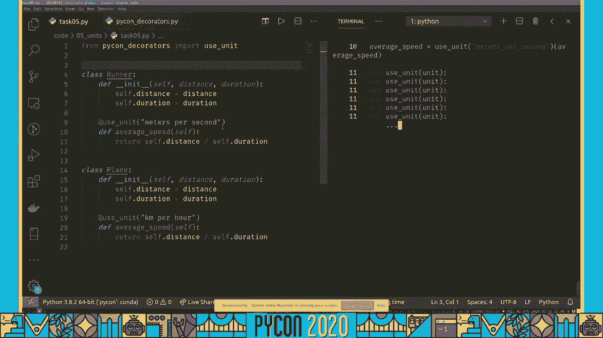

 shortly with with one solution for it， okay i hope you enjoyed that task so now let's see how can we make the use unit decorator。

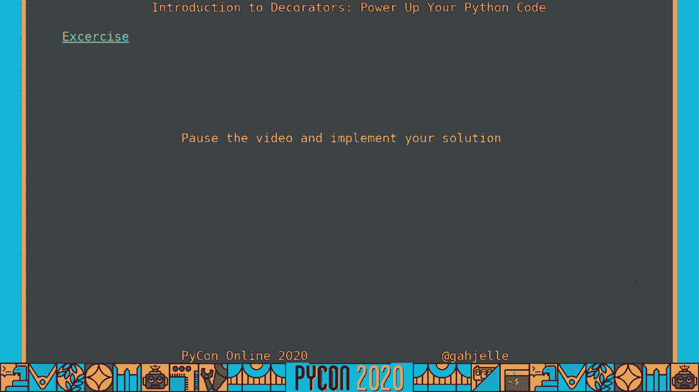

 and so that you can take in arguments and as before i've gone in here now and just added a。

 the test case to to our file here so that we can see where we're at just by running running this。

 task with python and first of all let's just see here that now we cannot even import use unit from。

 the decorators so we need to start off just by defining it and let's see then so if i now go to。

 my python decorators i'm just here all the way at the bottom and i'm gonna define。

 use unit decorator and in this case let's see this was now as we mentioned this will be a decorator。

 not really a decorator itself it will be a decorator factory something that will return。

 the craters and so does that really mean it means that for this one。

 let's first actually just say here that this decorator will register， or add units to return values。

 what i'm gonna do here is that i'm gonna define the use unit decorator that will be the thing that i。

 want to return and since this is a decorator it will take in a function and then it will。

 return some function i'm just gonna return the same function。

 and my decorator factory and then needs to return for the crater so if we do something like this。

 now we have created a i guess trivial decorator factory so whatever the value of unit here i just。

 return decorator that does nothing it just returns the function itself but this kind of just to check。

 the logistics of what we're doing so for now call our task we can see that it starts running。

 it's able now to calculate the average speed of our both it's able to calculate the average speed of our。

 plane but you can see there's no units here and then we get an error when we start to actually use。

 the units here by calling to base units but this is promising we are kind of getting somewhere。

 so now we want to actually build up our decorator factory so the first thing i'm gonna do now is like。

 we did earlier i need to instantiate this unit registry and i'm just gonna store it on my。

 function as an attribute so here we're gonna do unit registry and now we can see that。

 my flake 8 is hopefully pointing out that i haven't defined a point so let's just run up here and。

 and then we are linter happy and so now we have the unit registry so that means that we should be。

 able to start returning some functions here or adding in some units i guess so now we should kind。

 of focus on this part because on the outside we now have a decorator factory but so far we've。

 just been thinking about decorators so the factory is kind of just something that is partly just messing。

 with our heads so now we want to write this the way we usually write decorators kind of forget about。

 what's on the outside and so how do we write our decorators well we define an。

 a wrapper function so the wrapper function i'll just call use units with。

 for as usual and remember that these things usually then take in the harks and quarks of the function。

 that we can just pass through and at some point here we're gonna return the function of harks。

 and quarks and so that's more or less what we're doing there but then the decorator itself should。

 now return this rapid function so here we want to return use unit like this and now we should also。

 remember to apply the fun tools wraps of and so now we have something that's at least some kind of。

 the crater it corrects something that we can see now i'm still not doing what i promised i would be。

 doing which was actually multiplied by units so let's fix that part as well and so that means that。

 i need to take the unit unit registry and the unit from it。

 oh like this and let's see yeah so we can try to run this and see now it seems to actually work out。

 right we have our 10。4 we now got the label that is a meter per second we have this almost 700。

 kilometers an hour and now we see the ratio it's actually 18。

5 in dimensional units and one thing i'll， kind of just throw in here at the end it was not really part of the task but remember we had this。

 reminder that we could put on the function and so if i want to do this as well i could now say use unit。

 but unit so now i'm equals unit so now i'm just adding the reminder on the function that。

 reader is returning that this what's the unit of this this is really not necessary since we're。

 actually getting it out with you it's here the other way but let's just have a quick look at how that works。

 and so this means now that i should be able to for instance say let's see we have gold。

 it's a runner and his average speed function and unit is not there。

 i we forgot to save them let's see sorry about that let's do this one more time。

 now both average speed unit is meters per second and so just to remind you once more time that we can。

 come out in this unit the tricky part here is probably more of just keeping track of。

 at which level do we actually need to do this thing so so now we have just to repeat this we have here。

 we have the the wrapper function the one that actually replaces the the average speed method。

 when we do the decorator right here we have the decorator itself that is the thing that actually。

 decorates but then to use arguments we also have this factory that kind of takes care of。

 creating a different decorator for each argument that he created okay so now we're ready for our。

 last task in this tutorial and what we're going to do here is to kind of put together what we've。

 learned so far and you can see here in this task we have a decorator called super trace which is。

 really just the trace decorator more or less but it has some superpowers and what super trace can do。

 is that we can call it both as a regular decorator like you see here and we can call it as a decorator。

 with arguments like you see down there and what that allows us is both to kind of give something。

 that's super easy to use to the user but also give some flexibility so for instance in this case。

 the idea is that you can specify a logger to kind of change how the tracing is logged so。

 as usual i'll start out by just trying out this thing。

 so first of all let's just try to call the greet function so we build a low world and here you can。

 see the output that you're used to from from the old trace right so super trace without any arguments。

 works exactly like the old trace but what happens if we call random greet。

 so random greet you can now see that it also works similar to what we're used to but。

 note here that there's some warning output there and you can kind of see how the calling random greet here。

 has gotten the warning prefix and that comes from the logging。warning method so instead of actually。

 being printed to the screen here it's being logged by the logging。warning method so super trace。

 can both work as a decorator as you see there and as what we saw last time was we're decorator。

 factories so essentially your task for task number six will be how can you implement this。

 and again i'm just going to give a few small hints if you want to work completely without hints。

 just take a break now but one little hint that i'm kind of going to give and it's it's kind of hint。

 that you have i guess heard a few times now and let's let's try to look at what what does the notation。

 here really mean right so we have now both something that we can write as super trace。

 or we can write it with the with the arguments and if we remember what that means is that we have some。

 we have some function but we want to create and that really means that。

 either we're doing super trace， of like this or we're doing f equals super trace of logar equals let's do logging。

warning， of us and we need this super trace function to be able to handle both of these cases。

 and the trick there to kind of get you started is that it is in general it will be hard to be able。

 to support the creators with taking positional arguments so let me just drill that way now。

 right now so we will not be able to do this that will not work as expected so i'm going to say that。

 we want to only use keyword arguments here and the reason is just that we need to somehow recognize。

 that the argument we're getting is a function that we're going to decorate so in the easiest way to。

 do that is just to say okay the first positional argument if that's a function then we're gonna。

 um work with this but you can see here that if we would do this without the logger then logging。

 warning would be a callable it will be a function and it would be very hard to differentiate this。

 so we're gonna put this limitation on that we're gonna use a。

 the keyword arguments and that kind of gives you then some starting point so that means that first。

 of all okay it should be able to take in a function as their argument as usual it should also be able。

 to leave out that function right so what we're doing here relieving that function out so let's see。

 what that actually means then um so that means that when you define your super trace that's both。

 a clear and a decorative factory and the signature of this will be something like okay it could take a。

 function or it could take a logger right but either of these has to be optional so we need to specify。

 some default values for them for the sense to just say that if we're not giving a function we'll just。

 use none to say that and then i'm just also just gonna force or use the star here just means that。

 everything after this meets the keyword arguments it's not really necessary to put it in here but。

 it's kind of nice to just point it out that everything coming behind here we should regard as keyword。

 arguments and since we want super trace to work also with just the function we need logger here to be。

 optional as well so this should then take a also have an optional value and the value of this would be。

 what do we use for logging in the default case so i'm just gonna say that our default print is the。

 logger so this will be the signature of your decorator slash decorator function and now what you need to。

 do is to essentially have this one behave either like a decorator or a decorator factory depending on。

 the value of funk whether funk is none if funk is none then this will be a decorator factory and。

 it should create different decorators based on the logger here if funk is actually a function then。

 we're already at the decorate stage so then this should just work as a decorator and return a wrapped。

 function so that's a hint that hopefully is enough to get you started and then i'll just say good luck。

 on this last task and then i'll see you in a minute with a suggestion for a solution。

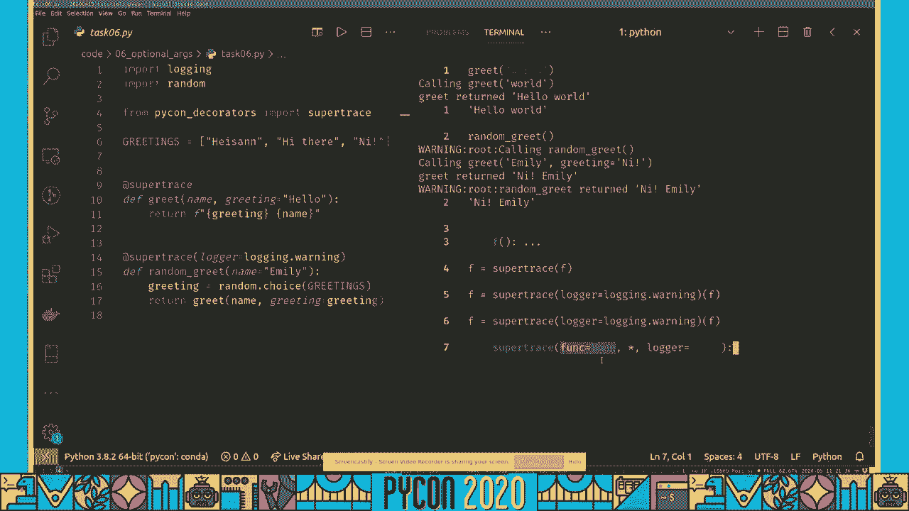

 okay i hope you enjoyed that little task so now let's see how we can solve this uh super trace。

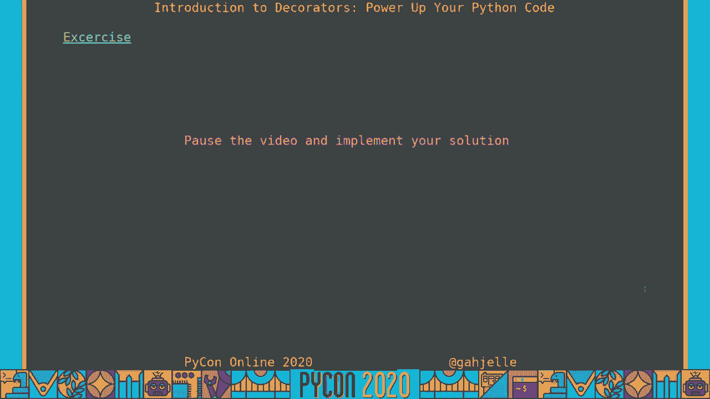

 the decorator and um what i've gone ahead and done here i'm more or less as usual is that i've。

 added a few just just cases down here uh some both printing out the greet printing along line and。

 then the random greet and i'll see if we can get the super greeter to work so remember we want this to。

 use print um here uh super trace sorry and the logging thing for the random great function。

 and um now let's just start out by testing this this thing uh work and see now that it's okay i can't。

 import super trace because i haven't defined it yet so let's start by doing that and um now one。

 one thing i'm gonna do here since as i mentioned this the super trace is basically just uh the trace。

 the crater so i'm gonna use my copy paste powers uh to include trace one more time here but then。

 we also so have we want to use the super trace decorator or the creator factory will have the。

 following signature so it will either take a function which will be known if the function is not given。

 or it will take a logger which has the default value of print so the default value is print。

 and otherwise will use uh whatever is given and then we have the actual trace down here and i'm just。

 gonna indent it so now this trace is just i mean let's define internally in um inside of here and。

 also just to kind of be consistent with the notation that we're usually using i'll call this the super trace。

 uh greater so let me give track of what's what and then this kind of inner。

 the wrap function i'll rename this one as well to be underscore super trace。

 and let's see that was actually the wrong one， let's see down here we have our super trace decorator and here we have our。

 super trace and let's see what else do we need to change now well we have now。

 this logger will be an option so let me change the function as we have here。

 using whatever is the value of logger so by default this will still be print but we may be able to change。

 it okay so that's essentially just what we need to do to reuse trace and so now comes the。

 i guess the tricky part of the of the of this task of this exercise and that is how what do we。

 need to do now to have super trace out here work both as a decorator and as a decorator factory。

 and i'm just for now i'm just going to hide the code for the decorator down there。

 to be able to focus on the logic here so what i have now is that i have defined my。

 decorator as kind of usual this is kind of the usual trace decorator and i somehow now want to use this。

 for my for my arguments so you can remember when we just had the regular arguments if this had just。

 been something like this what we need to do here would just be to return。

 super trace decorator like this then we would have。

 something that works fine as as a decorator that takes arguments the problem with this is that it。

 doesn't allow us to not give arguments we need to have the parentheses essentially。

 since this is an optional argument we would be allowed to use， let's see here something like， like。

 i we're calling things there but so we haven't implemented everything yet but。

 if we are if we would have this kind of definition we would be allowed to use super trace。

 like this with an empty empty braces there because that would just mean that we use the regular。

 the regular， okay let's run this you can see that this this will actually work。

 and what what happens here is that since we're not giving any arguments there it's just using。

 the default value of logger being print and then we could add in the。

 here kind of say that logger should be logging dot warning like this and then。

 or hello will work the warning and so this this is what we kind of saw in the last exercise where we。

 use arguments but what as you might have seen from some other。

 output we had what we will not be allowed to do is just use it without the arguments here。

 this will now throw an error at us and and the reason of course is that without the。

 braces there what actually happens is that the funk hello here is passed into。

 the super trace factory as the new logger and then it's somehow using this as a。

 logger and everything gets quite confusing so that's not what we want to happen。

 so let's see we had here funk equals now and then a star。

 and now what we have seen essentially now is that if funk is none。

 what does that actually mean well it means that there was no function that was passed in。

 instead we were given a logger argument or possibly even let's see where did we have it。

 up here or possibly even this case but in either way there was no function that was passed in。

 so that is actually the case that we have already solved so let's just like this。

 so we could do this and now if we just restart this。

 we heard some error message from calling greet and just to taking out of this we'll now see that。

 this super trace， in this this will still work while as we saw from the output above if we do it without any parentheses。

 I'm calling we're now getting this weird non-type object is not callable and that is because hello。

 there is no hello it seems if I actually print out hello you can see that this is none。

 and that is because we ran into here super trace is none if function is none we do this。

 but then we just fall off the end here so then if function is not none which happens in this case。

 then we haven't defined what happens so hello was actually just replaced by none in this case。

 that's clearly not good enough so instead what do we need to do well now what we really would love。

 to happen is to just go back to the old trace decorator right that's kind of what we。

 that's the behavior we're interested in here and what was the old trace decorator well that was。

 the one that we have copied over here the super trace decorator that I call it now and。

 what happened really there so it seems like again I want to take this thing but now I want to kind。

 of skip a step I want to just apply this directly to my function and for this to behave like for。

 for this super trace here to behave like it's a it's a decorator this one needs to just define。

 or return the wrapped function and that is actually exactly what super decorator does。

 if I send it funk right so that's funk into the super trace decorator it will。

 okay let's just open up everything here here again um so super trace decorator it starts up there。

 and it goes down here so if I send in super trace decorator and I send funk to it it will return me。

 super trace which is this wrapping function so this thing right here will actually help us out。

 and and take that necessary step that we're looking at and first let's actually run this to see if。

 that theory works so we'll just run over here and now you can see。

 let's just make it be enough and that if I run now the greet thing actually works so let's recall。

 what happens here and we print out greet world and that is just super trace without any arguments。

 so that part works and our random greet where you super trace with the logging that also works so now。

 the the things the the magical if else thing we we made here actually works and just to have。

 one more explanation on why this thing works and let's。

 and recall again I kind of repeat this so this is kind of the mantra that I hope you。

 you realize is kind of the key takeaway here is that to figure out how these decorators work。

 it's always useful to kind of unwrap temptation and see what actually happens here。

 so say that we have some function I'll just call it f again and that we apply super trace to it。

 so if I do like super trace of f this is really the same as。

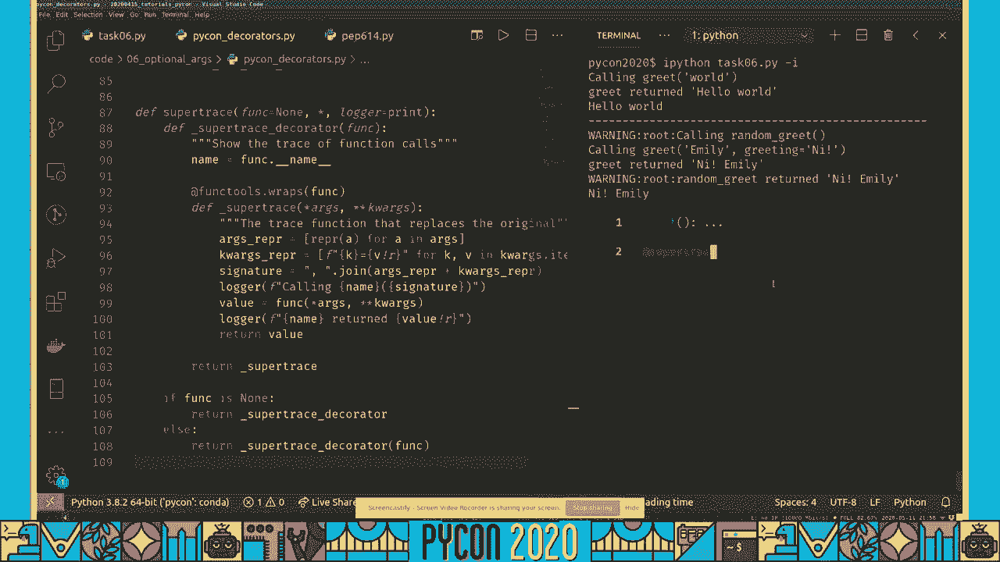

 if we instead just define f and then we say that f equals super trace of f right。

 and what are we now done over here is that okay if we do this then we're passing in f there so f。

 becomes a funk over here so funk is not none so that means that what we're doing is saying that f。

 equals underscore super trace creator of fun quote of。

 so this is what happens in the case where we have。

 we're passing in without any arguments or without any parentheses。

 what happens in the case where we use arguments so say that we're doing super trace parentheses。

 equals logging that warning， and then of this function so now if we spell this out well what we're doing now is that we're doing f。

 equals super trace of logger equals logging that warning of f。

 right this is kind of the translation of of this notation now what does that mean if we start looking。

 into here well in that case there is no funk that's defined right here right。

 now so that means that funk take its default value which is none so we're in this case。

 and in that case super trace is just essentially replaced by super trace decorator。

 so then we will end up with the notation f equals underscore super trace。

 decorator and that's just all of this has been replaced by super trace decorator。

 and then we have the parentheses f at the end so taking this function object that we're。

 returning here and applying it to f and as you can see now is that in both cases super trace。

 and super trace with this thing happening we end up at the exact same place where f has been decorated。

 by super trace decorator so that's exactly what we wanted right that's what we were aiming for。

 the only difference between these two cases is that the value of the logger has changed。

 so in the second case we are changing the value of logger and that logger is used inside of our trace。

 wrapper function to say how we are printing out the trace so this is definitely a mouthful but。

 if you wrap your head around this you really should know enough to understand。

 essentially any decorator that you can find in the python language so hopefully this has been。

 something that you have enjoyed and have learned something from now that actually。

 around the exercises that we're going to do so now i'm just gonna end with the small。

 kind of recap of what we have been learning so first of all in this advanced decorators section。

 what you we were talking about was first a little bit about how to keep state with decorators。

 and we saw how we can either use function attributes to remember things from。

 invocation to invocation or classes which are probably better fitted for this。

 then we saw a little bit on how do we decorate classes and especially how can we make sure that。

 we keep the type information because usually when you're decorating something you're。

 replacing the original function or class with your wrapper function but if you need to kind of。

 keep the type hierarchy that's not really possible you need to do some other tricks instead。

 then for our what was the fifth task we saw how we could use decorators with arguments。

 this was the exercise where we added units to our methods or functions and then now in the final。

 task we looked at how we can have optional arguments where we can call the decorator both。

 without the parentheses and with the parentheses just to kind of。

 one more time repeat the key takeaways and is that in general a decorator is any function that。

 accepts a function and returns a function what we have kind of seen here is that this is the。

 concept is actually more general than this decorators really any callable thing that accepts a callable。

 and returns a callable I guess and so it could be classes for instance。

 and then the one thing that I hope that you definitely take from this is just that this kind。

 of syntax that we're using for decorators is really just syntactic sugar for writing this thing out。

 and once it's more noted I'll just kind of point out to say we had if we go back here。

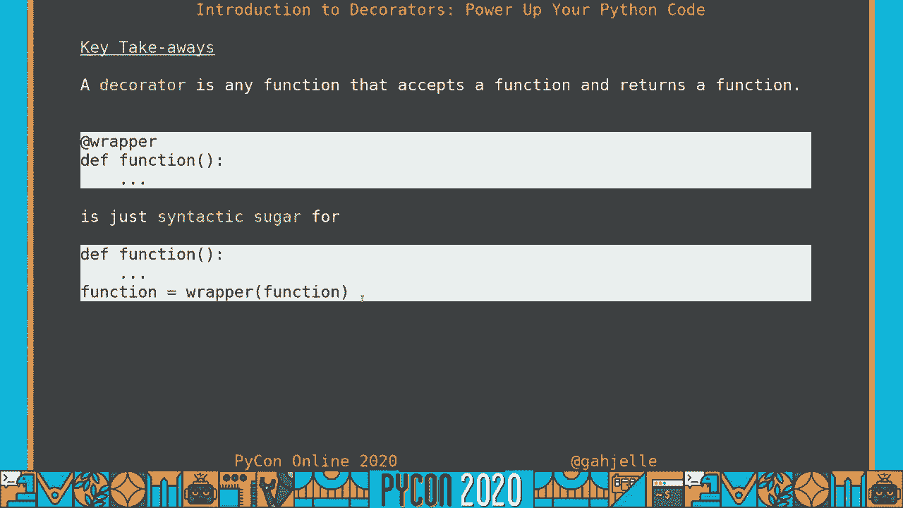

 so let's see if we first I'll just do from our Python decorators I'll import the count calls。

 now say that I want to for instance yeah we're not gonna do too much about this but say that for。

 instance we have a math factorial function for instance here we'll get some numbers and。

 we could for instance say that you can approximate the value of e。

 do something like this by taking the sum of the inverse of factorial numbers。

 so just to show you here first， so we can take math factorial of let's see zero that's one one still one two is two。

 so this doesn't seem too interesting with three we get six so the factorial number is actually。

 what you get if you just multiply all the numbers less than or equal to the number itself so three。

 factorial is six because one times two times three is six then four factorial will be 24 for instance。

 that's four times two times three times four and now there is a mathematical formula that says。

 that the number e which is approximately seven eighteen which also I guess happens to be the last。

 version of a python d and can be calculated using these factorial numbers so if I take the sum。

 of one divided by math factorial let's see of n for n in range of let's give ourselves a little。

 and if we let's see we should probably return， okay like this and now we can see that if I calculate this for instance with using five numbers。

 I get close to two point seven one eight right but not extremely close if I use more numbers I get。

 closer and now say that I was interested in figuring out how many calls do we do to math。

 pictorial during this method now I what I like to want to do is then something like cat calls。

 and then I want to do that at the definition of factorial but if I'm in the standard library。

 so that doesn't really help me so we do instead and in this case what you can do is to actually。

 just use your the non-sick tactic sugar version of decoration。

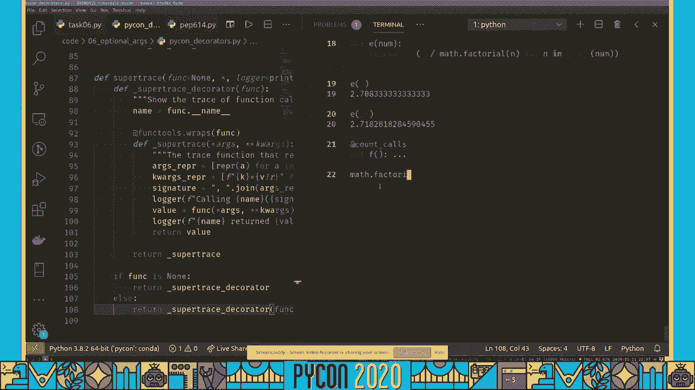

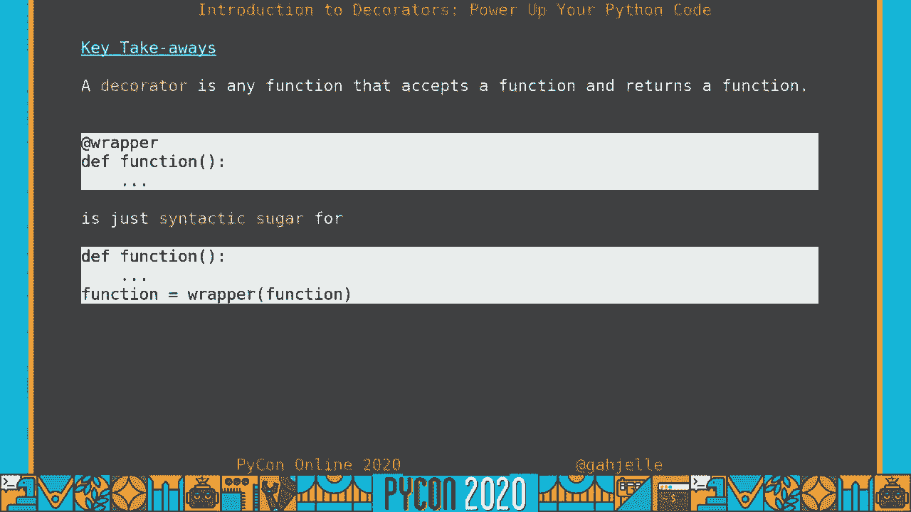

 and see the factorial is count calls of math。f pictorial like this and now if we do。

 math factorial factorial and then calls we can see that this has not been called yet but if we do。

 calculate this e of 25 we can see that factorial has indeed been called 25。 So this was just a。

 quick example showing that it is actually possible to decorate even functions that you are not defining。

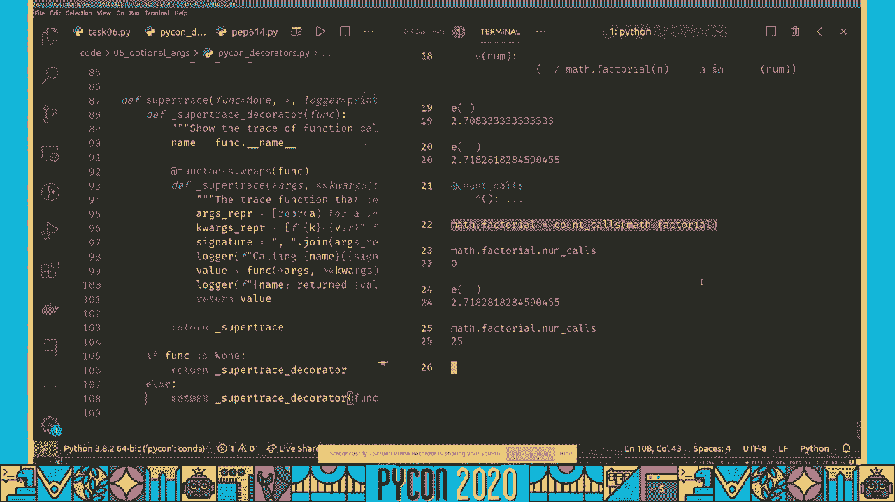

 yourself and so this will actually last time that I mentioned how these things are different。

 and this is kind of what you can actually think that we're doing if you need to figure out how。

 decoration actually works。 Then just a few notes that we saw from the previous section we can use。

 function attributes or classes to keep state。 Decorators can take arguments and to implement。

 this you will be using decorator factories which are just functions that create decorators and we。

 could also have decorators optionally use arguments and in that case your decorator factory。

 should return either a decorator or a wrapped function depending on how it's called。 That was。

 kind of the task 6 that we saw。 Just a quick list of some decorators that you may be familiar with。

 already。 So there's a few decorators in the standard library where probably the most well-knowns。

 at least if you use object-oriented programming would be property and class method probably。

 So what property does is that it can just convert a method on a class into a property as something。

 that you just get out with an attribute access instead of calling it。 The class method creates。

 class methods in your classes and static method can create static methods on your classes。

 The functor wraps decorator we have used heavily today so hopefully。

 you have a feeling for what that one does。 Then there was in Python 3。7 there was something you。

 call data classes and that is a new way of constructing classes。 It kind of simplifies。

 a lot of the boilerplate that you often want to use for classes and this is a decorator that you。

 apply directly to a class and it will work a little bit similar to what we did when we decorated。

 classes in that it kind of builds a class and it adds attributes to it。 And finally there's one in。

 the library called contextlib which is a library for working with context managers and there's a。

 decorator that can simplify the creation of new context managers which is actually quite cool。

 But the decorators are probably more common in different libraries and I'm not going to。

 even attempt to list all the different ways they can be used in kind of third-party packages。

 but just a few that you may be familiar with depending on the background。 So one is called number。

 which is a really cool project for speeding up especially computation heavy code and it has。

 a JIT decorator so that means just in time or where it does just in time compilation so。

 on the fly compilation essentially of your code which can really speed up your code if it's really。

 CPU heavy。 Then flask is a web framework which uses decorators to just designate。

 functions as handlers essentially or as an endpoints for your website using the app that。

 route is one of the decorators it's using and then click is a command line interface library。

 that you can use to create command line programs essentially from your Python scripts and it。

 uses decorators to just specify different commands inside of your command line program different。

 arguments different options and so on。 So all of these ease decorators in a very nice fashion。

 Then there are some further resources and as I mentioned at the beginning of the course。

 I have written an article for the website real Python which goes into a lot of the same detail。

 that we've done here and if you look at that article you'll kind of recognize some of the。

 examples we've done some examples that are new but it's a good resource to kind of look back to。

 if there's something you need to remember from this tutorial。 On real Python there's also a video。

 course that kind of covers mostly of the basic decorator part so it doesn't go into quite a。

 much depth as we've done here。 Then there's some other cool resources so there is a package on。

 pipi called decorator and if you're going to work with decorators this one kind of takes a lot of。

 the work that we have been putting into creating our decorators and I'm kind of abstracted away a。

 little bit so especially when we come to things like making decorators with optional arguments and。

 things like this it's easier to do using the decorator package so I'll recommend having a look at that one。

 The Python Cookbook it's a book that was published by Orile something like seven years ago I think now。

 and it's a fantastic book with many small recipes that kind of tell you how to do stuff and in chapter。

 nine of that on the Python Cookbook it's called something like meta programming there are many。

 different recipes using decorators so if you have access to that book I really recommend that you。

 check it out。 The source code so the kind of the recipes themselves are available on the David Beasley's。

 homepage so you could also just head over to this guitar batteries here and have a look at。

 some other ways that they're doing things there and then if I guess for the if you really want to。

 dive into the details decorators were added to the Python language using a Python enhancement proposal。

 and pep 318 was the one that was the one that kind of introduced the creators。

 quite a few years ago now but there's actually something happening in decorated land so for Python。

 three nine which is now very close to being in beta there is actually a new addition to。

 decorators and so that's introducing in something called pep 614 and what the pep 614 does is that it。

 actually allows it kind of relaxes a little bit on some of the restrictions that are on decorators。

 and let's have a look at how that actually works so let's see we'll use one and then we'll go over。

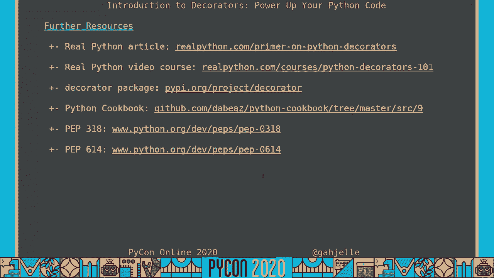

 here to them just a little piece of code that I prepared for for this example。

 and what we used to is that we have this is a decorator all right we have here the most trivial。

 decorator we can have it's a do nothing decorator that takes the function and just returns it straight。

 back again so decorating anything with do nothing changes nothing does nothing then we have a simplified。

 trace decorator here i'm just saying that we're calling the function not trying to say anything。

 about the arguments and return values and so on but it's another decorator right we have trace。

 funk returning the wrap function here and so how we would typically now use this is that we'll just。

 say something like add do nothing and if we're going to try this you can see here flake is complaining。

 about this syntax error happening here because here i'm not decorating with the function or。

 callable i actually put in some expression here and you can see here i've added just this if else。

 statement or if else expression i guess where i'm using the prod variable that we have appear。

 that i'm currently set to false and then i'm saying okay so if prod then do nothing so if we're in。

 production i don't want to do anything with this one but if we're not running in production then i。

 want to decorate my little hello world function here with the trace decorator and in um， python 3。

8 so the current python and this is a syntax error we can't really do this but then， what pep 6。

14 is saying is that there's really no reason not to allow this and。

 this is one example where this might be useful and that you can kind of easily turn on and off。

 some debugging flags when you're running outside of production and so essentially it。

 means that you can have any expression here that evaluates to a callable will be allowed as a decorator。

 so let's see how this actually runs so if i now run so first let me actually just show you that this。

 doesn't work at all right it's a syntax error if i just use my regular python but if i run this。

 with python 3。9 see here that okay and down here i'm printing the value prod which is false and then。

 i'm calling greet there which the trace tells me here that it's calling greet so we can see here。

 that in this case it decorated using trace and just a quick note here this was an enhanced syntax。

 for fstrings that was introduced in python 3。8 that you can use an equal sign like this。

 together with a variable and it will print out both the name of the variable and the value of the。

 variable so that was an enhancement in python 3。8 okay so this seems to work it was able to figure。

 out that it could use trace in this case so let's try just to change this one then to run run in。

 production so now we're setting some flag and we're running in production instead。

 and from this now we can see okay prod equals true which i assumed and it's still called greet。

 i believe let's actually test that as well so we'll add a print statement there。

 but it has it's calling greet but it's not tracing anything so in this case it's using the do nothing。

 decorator that's only calls the function as usual。

 so that's somewhat exciting at least and it of course。

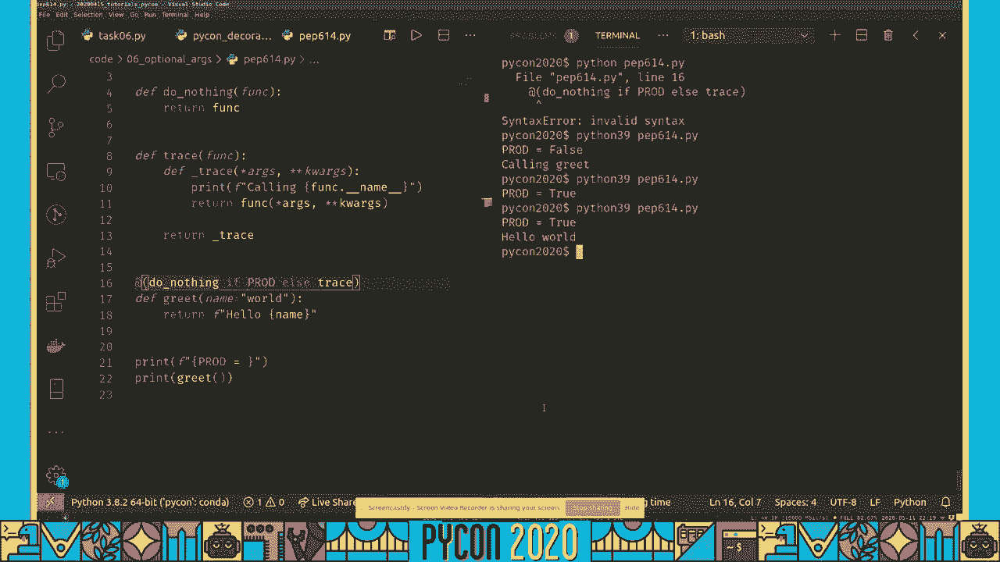

 gives you many opportunities to probably abuse this so use it twice but it's i guess fun to see that。

 something is happening also to decorators they've kind of been。

 fairly solid means they in the language for a long time now。

 so with that i yeah i'd recommend you to check out these extra resources。

 and then i'm just gonna end here by thanking you so much for your attention hopefully。

 this was useful and if you have any questions do please contact me so you could。

 reach me either at yeah yeah at twitter you can find some information on github。

 and you can see some more information about this article and real python and so on。

 so yeah thank you so much bye bye。

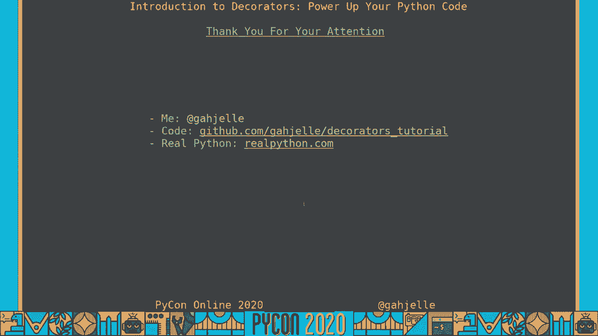

 you， you， (buzzing)， You。

