# PyCon US 2020 - P7：Education Summit 2020 - 程序员百科书 - BV1rW4y1v7YG

 Hi， everyone。

 It is 11 o'clock。 Welcome to the Python Education Summit for 2020。

 I am here with our wonderful committee that we're going to be introducing as well。

 And with the virtual applause to the committee members who cannot attend， thank you all so。

 much for coming。 I know this is a hard time and it's hard to extract lengthy amounts of time for yourself。

 during the day。 So we so so appreciate you assigning into this event and attending。

 It's going to be sort of a different format。 The virtual was no one's plan。

 but here we are and I'm glad we can have some version of， the summit this year。

 This is always a really important event for me personally and professionally。

 And so I'm glad that we can have some some moment of connection in our year and looking。

 forward to staying home right now so we can all be together again next year。

 I'm going to let Jackie pop in for a moment and do some housekeeping。

 Tom or if you can go to the next slide。 Hello everybody。 I'm Jackie Augustine。

 PSF staff member that will be sitting in as monitor for code of， conduct。 So this is my reminder。

 First of all， I'd like to welcome everybody and glad you can join the education summit。

 today as part of Python online。 Hope everyone is healthy and safe where they're at。

 So as the guidelines state， we ask everybody to abide by the PSF's code of conduct， not， just today。

 but all the time。 And we want to create an environment where folks feel safe to contribute and speak up。

 So I appreciate you doing that for the duration of this event。

 There are links there for the code of conduct， which is on the Python website under about。

 Python and also an email address if you want to report anything。 And just as a note。

 this is being recorded。 Names unless you're speaking are not shown on a recording。

 just so you're aware of that。 Thank you。 Wonderful。 Thank you so much。 So the next slide， please。

 Whoa， sorry， my son is building a castle behind me right now。 So welcome to Zoom。

 Please for a band with purposes and for recording purposes， only the speakers should have their。

 video on to keep that off， please， if you are not speaking。 Peace also keep yourself muted。

 We have pretty loose permissions for this session。

 It ran pretty cleanly yesterday at the trainer summit。

 I will be monitoring the chat and monitoring participants and doing muting as necessary。

 So if you accidentally become unmuted， can't figure it out， I will be there to take care。

 of it for you。 Please keep the conversations in the chat。

 So right now everyone is welcome to say hi and where you're logging in from right now。

 But once we actually get into the speakers going on right now， my video is not on， baby。

 So don't try to show them twice。 Thank you。 So hey， coral。 Awesome。

 I love seeing some of the names I know and names I don't。

 I'm super excited to hear from everyone as well。 Once the speakers get going and start presenting。

 please keep the chat to just really talk specific。

 things and please try to avoid commentary or other discussions happening while the speaker。

 is presenting。 Some speakers try to monitor the chat while they're talking and it can get kind of distracting。

 if there's a lot of chat going on。 So you're more than welcome to throw a question in the chat and we'll work on that in the。

 queue。 Once the questions start， we should have like five to ten minutes of question time after。

 each talk。 So please go ahead and put that in there。 If you have a question and then you need。

 but you need to bail before the speaker is done， go ahead and throw it in and we'll address it and everything will show up in the recording。

 So with that said， thank you so much。 Again， I will monitor from you and keep discussions down when the speakers are going。

 And then now I will give it over to Minal to start sort of the other welcoming remarks。

 Education summit since last summer。 I was involved with the committee the previous few years as well。

 So I'm glad that we are able to do this in an online fashion or virtual summit this year。

 I'd like to introduce you to some of the committee members who have been involved in the planning。

 of the summit。 So my name is out there first。 I've been involved with education summit for as long as I can remember。

 I think it's around 2013。 I started doing pike on then and I just got involved with the education summit。

 Being a teacher myself， I teach middle and high school students。 I teach them coding。

 And in my full time job， I'm at Google。 I'd like to introduce Chama Lowe who is one of our longest running members of the education。

 summit。 He's the founding member。 Chama will be talking to you very soon。

 And he works a lot in Python data science and currently he's at the， news。

 Elizabeth here was a wonderful host。 She has been involved in the education summit last few years。

 She is at the University of Illinois and she's an educator。 Working heavily with Python。

 Meg Ray is another one of our committee members。 Many of you may have heard of her。

 She has written a book a code in game。 And she is a teacher in residence in Cornell Tech。

 And she has started their coding program or computer science education program there。

 Laura joined us this year in the committee and she helped us a lot with the outreach。

 work that I'm going to talk about in just a few minutes。 So shout out to this committee。

 They've worked very hard over the past year and I'm glad that we are able to present our。

 work in this format to you today。 So the next slide please。 So we had a few main goals for 2020。

 One of our goals was to increase participation。 We are looking to engage with educators， students。

 technical community to understand how Python， is used， how it can be used in teaching environments。

 We would love to hear about how Python is being taught in the school environment by。

 teachers and the college environment， what kind of tools there are。

 And that is what we like to look for in our talks and in our lightning talks and in our。

 sprint sessions。 Those are some things we'll cover very soon。

 I just wanted to point out some data points。 So in 2020。

 I just found out from Elizabeth we have 104 signups for the virtual summit。 We had 53 submissions。

 We had eight mini sprints， 18 lightning talks and 27 talk submissions this year。 In 2019。

 we had a 135 number of signups。 We had 58 submissions where we had 17 mini sprints and 41 talks。

 And then we had in 2018， we had around 135 signups again and 40 talk submissions。

 We have 160 submissions in person every year。 So I'd really encourage folks to sign up for education summit。

 come up there， meet us， there and see how we can grow this channel in the Python community。

 For our outreach this year， we planned a student showcase with local schools。

 This is where Laura was very helpful and she took the lead on this。

 So we had actually planned with six local schools in Pittsburgh。

 We had planned poster presentations and breakout sessions。

 I hope that we can continue this in 2021 and you will get to see some of our schools participating。

 in the education summit as well。 This year we also introduced new sessions。

 We experimented with that a little bit last year but now we have defined categories of。

 the new sessions。 Apart from the talks， we now have lightning talks and we have mini sprint sessions。

 Lightning talks are five minute talks that allow you to present an interesting tool， your。

 experience， anything that is fun and small which would not make up matter for a full talk。

 And mini sprints are these breakout sessions which are moderated sessions where you can。

 take any topic and discuss that at length and come up with some meaningful action items。

 So with that， I will hand off back to Elizabeth for the next slide。 Great。 So again。

 the virtual summit was not our plan and thank you so much to our wonderful speakers。

 who were able to pull together a version of their talk that they had the bandwidth for。

 Being in the education community we are particularly impacted because nearly everyone of us had。

 to do a ton of work to get their materials online。

 I know I spent three solid weeks getting everything prepped。 My spring break was not a vacation。

 My spring break was doing a lot of video editing。 And thank you so much to we have a couple of talks that are going to be recorded and。

 we will go up in the YouTube channel as well。 So we have a couple of awesome talks this morning。

 After we are done with the welcome session we have， we will do a meta talk which is going。

 to cover a little bit more about the education summit and looking at future directions。

 We can take this in。 Then we have Zoe with engaging in digital learners and data science practices。

 We have Jeffrey who will talk about how food and bar must die。 I'm excited for that one。

 I'm excited for all of these。 Then Piper will come in and talk about building an API specifically for teaching。

 We have a couple of lightning talks at the end and we have a couple of speakers who weren't。

 able to pull together something for a live session or were able to attend the live session。

 because we all have commitments we can't really change right now。

 So there's a strong chance we will be ending earlier about an hour earlier。

 I'm free to stay a little bit longer and if there's discussions， if there's collective。

 screaming we all need to do about how hard this is right now， we can handle that。

 It depends on how many people want to stick around。

 But certainly if there's anyone who wants to talk about live coding online， etc。

 I'm a librarian and I teach Python， I'm here to help。 So plan on sticking around if you're able。

 if you're not， everything's going to be recorded。 Next slide please。

 I do also really want to specifically highlight these talks that are going to be in the process。

 of being recorded and uploaded。 We have using Python to improve physics curriculum。

 We have a talk from a Steel City Codes lab which is a Pittsburgh specific talk and then。

 writing unit tests as an initial part of learning as well。 So there's a couple people who are still。

 I'm not sure if they can put together in a recording， yet。

 So I'm doing my best to work with all of the speakers to get them going。

 So as everyone should be forgiving of themselves right now， please be understanding of our speakers。

 that they're taking out and carving out hard portions of their time to get these talks going。

 So I'm looking forward to everything。 Please keep monitoring both Twitter and the PyCon 2020 YouTube channel for these upcoming。

 recorded talks。 And then I think we're over to Chalmer now。 Excellent。 Thank you， Minnall。

 Thank you， Elizabeth。 Super excited to be here。 It's a little odd to be doing it this way。

 but we'll make the best of it， see what we can， come up with。

 As we on the committee that runs the Education Summit and we're kind of thinking about things。

 and looking at how we can shape the direction that the community goes， we had an idea of。

 potentially doing a meta talk， a talk maybe about the summit and kind of what goes into， the summit。

 And I volunteered to tackle that。 I wanted to share some ideas with some folks about what do we do to execute the summit。

 what goes into making the secret sauce， if you will， and how folks can help with future， summits。

 the types of things that we need assistance with and maybe some of the places。

 where we can continue to grow and shape the summit so it serves the audience more effectively。

 and more efficiently。 So with that in mind， dive in。 In terms of committee roles， I'm large。

 We've typically labeled ourselves as a chairperson for the committee and then a whole selection。

 of co-chairs who assist， right？ But that doesn't really point to what kinds of things we do。

 When you sit down and look at the committee and you look at the types of roles that we've。

 had over the course of time， we have mini sprint organizers， we have lightning talk organizers。

 On the day of， we have folks who serve in various MC roles， especially when we're in， a venue。

 we have kind of a gopher type who runs around and makes sure that the wheels， stay on the bus。

 Throughout the course of the year， we have public relations roles that need to be filled。

 folks to write blog articles and/or to publish social media postings， folks who need to reach。

 out to try and ensure that we are reaching an audience that can provide us speakers， right？

 Reaching underrepresented groups to help them be aware that， hey， this is a speaking opportunity。

 and we're looking to hear from them and see how they're influencing and affecting their。

 teaching environments where they are。 And then of course， we need talk reviewers。

 People provide proposals and the committee has to go through and review those。

 And that's a heavy lift。 That's probably the biggest consumer of our time。 All right。

 I'm going to talk a little bit more about these roles in just a bit。 But by and large。

 that's what we end up doing。 At various points during the education summit this year and in previous years。

 we've talked， a little bit about our goals。 And I wanted to touch on that just a little bit， right？

 When I envision an education summit and I think about the mission of an education summit。

 and the mission of a committee that helps to run such a summit， my thought is generally。

 focused on how can we leave you the attendee with something that's going to improve your。

 ability to teach and how can we leave you with something that will enable your students。

 to succeed in applying Python to their problems。 And so as the committee makes decisions about what to do。

 who to reach out to to try and， encourage speakers to submit talks， which talks we want to select。

 what types of things， we want to include in the summit。

 It is kind of this overarching philosophy that helps me make decisions and I think it。

 probably drives a number of the other folks on the committee as well。

 I will tell you though that I've got one real goal kind of hidden behind the scenes。

 Chalmers real goal is to not say the word pedagogy more than one time in this entire， talk。

 So we'll see how well that works。 Now when folks show up for something like this， right。

 they arrive at an education summit。 Typically there's a couple of things that they're really expecting。

 They like to see some good talks。 Things that will leave them with something actionable that they can go home with and。

 to try to implement to apply。 And they hope to have good experiences。

 I think that was part of the emphasis， right？ To have things like mini sprints where folks can get together。

 they can sit face to face， and they can talk about problems and they can talk about solutions to those problems。

 Right now in the middle of a global pandemic， right， some of our ideas about hey， how do。

 we get folks to talk face to face。 Got thrown for a loop a little bit， right？ But nonetheless。

 we hope that through delivering this education summit， there'll be mechanisms。

 and we'll share some of those mechanisms in a little bit that will help us to continue。

 to grow our networks and find folks that we can commune with and we can work with over。

 the course of time。 Having said these things， what do you want or what do attendees typically want？

 Let's talk a little bit about what you get。 We've tried a number of things in the past eight years since the Naomi Cedar first started。

 the original education summit。 We've always had talks。 We've tried lightning talks at various times。

 Last year we kicked off mini sprints。 In the past we've done some unconference sessions。

 For those who are not familiar with unconference sessions， those are where the actual attendees。

 sit down and propose ideas on the fly in the room and then they vote on them and they decide。

 what are we going to cover for the next 45 minutes or next hour and then we have group discussions。

 Again， that was focused on trying to get an engagement where people are talking to each， other。

 In the education committees focused ourselves on trying to find amongst all of this mix， how。

 can we find good topics that will resonate with the attendees？ We've covered the internet。

 Everything from first year to 12th year types of curriculum， collegiate education， content。

 for folks who are teaching in say a commercial environment， maybe with corporate clients。

 The big ticket item in the Python world is data science。

 We've looked at how do you teach data science？ We've looked at talks that are focused on the beginner。

 I use beginner to mean two things。 Maybe a beginner instructor。

 Where did they start to teach someone as well as beginner students？

 What are the types of things that a beginner student needs to see or hear？

 We've also looked at talks geared toward the advanced practitioners。

 Some of my favorite talks were ones that were geared toward hardware。

 How do you take hardware and bend it to your will？

 We've looked at the tools and libraries that you can use to teach more efficiently or so。

 that your students can do their work of learning without all of the cumbersome headaches of dealing。

 with complications。 We've looked at what types of techniques work and what types of techniques don't。

 Another one of my favorite topics is how do we teach on a shoestring budget？

 There are places in the world where folks quite literally are working in impoverished conditions。

 and trying to educate folks。 That's what you've gotten from us。 In some cases。

 we've done a good job and in some cases we've been able to deliver what， folks want。

 Once in a while， we get a little bit of feedback。 Time to our attention to them。

 we can't really please everyone。 But nonetheless， we do the best we can。

 Some of the feedback that we've gotten has been focused on things like， "I really wish。

 that we had more time to discuss topic X。"， Or， "Man。

 I was really wishing that you would have covered topic Y。"， Once in a while。

 we get some comments to the effect of who thought it was a good idea to。

 put that Shomer guy in the room， but I generally don't take that too personally。

 You want to talk a little bit about how do we make the choices as a committee of which。

 talks we want to put before you？ It is a little bit harder than one might think。

 We start off with a variety of criteria that we try and look at。

 A lot of times we'll look at a topic and we ask ourselves， "Is this new to our audience？

 Is this something that we've covered before？ Can we have a talk about this last year？"， We look at。

 and sometimes we'll get repeat visits， right？ Somebody will say， "Hey。

 I talked last year and my project has advanced and I'd like to， give you an update。"。

 Sometimes we are interested in seeing those updates， but we will weigh the merits of maybe。

 looking at an incremental update to a tool or a library that our friends and family have。

 already seen versus showing them something new that we haven't seen before。

 We have to make those value judgments。 We also look at whether or not something we're seeing is innovative。

 Maybe it's an innovative approach。 Maybe it's a new tool or different techniques that haven't been tried before or we haven't。

 had a chance to talk about before。 We got a number of folks on the committee who are really focused on education and the principles。

 associated and the methods associated with teaching。

 We try and make as best we can based on the limited information we have in a proposal。

 on whether or not folks are applying valid principles and methods for teaching。

 As opposed to somebody saying， "Well， I thought this might be a good idea。"。

 We try and look for things that essentially model proven techniques for teaching people。

 complicated technical talks。 We also look at whether or not topics are universally applicable or whether they're。

 hyper specialized。 As much as possible， we want to try and get talks that are going to be broadly applicable。

 to as many members of the audience as we can。 But then we also want to， on occasion。

 bring in some topics that may be a little more niche。

 because we often find that bringing together niche ideas or niche topics and putting them。

 together in ways that people didn't anticipate or think about tends to lead to innovation。

 and growth。 We have to kind of weigh that balance as well。 This item。

 it's last on the list and I put it there purposely because I wanted to talk。

 maybe a bit more about this to the topic and because it's very dear to my heart。

 From the very first days of the Education Summit， there has been a strong focus on trying。

 to ensure that when we make selections of talks that we do the very best that we can。

 to ensure that we're presenting talks that are diverse and inclusive。

 The PSF's focus on things like code of conduct and helping ensure that everyone feels included。

 in these conversations is a strong measure greatly needed in the tech community。

 I'm glad they do that。 When we look at talks， if we see talks that maybe are used terminology or things and say。

 the titles， et cetera， I'll talk more about that in a bit， that might be charged or whatever。

 we tend to try and get a sense of what's going on and how that might impact the audience。

 In terms of diversity， we're fully aware that we can't just expect that folks are going， to show up。

 When we're planning out talks， we start off with how do we ensure that folks from a wide。

 variety of backgrounds underrepresented and otherwise know that they can give talks。

 We start out with a public outreach to groups to know that their membership should feel confident。

 about submitting talk proposals。 We try and fill the pipeline as best we can from the beginning so that way we have a diverse。

 pipeline that we can then select from。 In many cases， as we're evaluating talks。

 we're looking at things like the quality of the， talk proposal。 I'll talk about that in a second。

 In many cases， we down select a little bit。 As we make the final choices from the down selected talks。

 we layer in this nuance of， are we able through this selection of folks or the selection of talks able to provide a。

 diverse set of ideas， topics and explanations to the audience？ I'm large。

 I feel like it's been pretty successful， but I definitely know that there's more work。

 that needs to be done。 I'm hoping that you folks are going to be able to help us with some of that。

 We'll talk about that in a second as well。 What are some of the things that get in the way of doing this talk selection？

 Well， the number of talks， proposals that we get is fairly limited。

 We would love to see even more people submit talks。 They could speak at the education summit。

 The submission quality varies pretty widely。 We get some talk submissions that are incredibly high quality。

 They're always amazing to read。 We all get really excited when we see those things。

 We also get some submission quality that's pretty much the bottom of the barrel。

 Maybe a sentence or two， like， "Here's my topic。 You should select me。"， Kind of a submission。

 Maybe an interesting sounding topic， but there's not enough detail there to help us feel confident。

 and comfortable that if we select this person to speak， they're going to deliver a talk。

 that is engaging and enjoyable to you， the audience。 The last barrier to doing this really。

 really effectively and really well is， to be honest。

 the criteria to the left on the slide is a little bit subjective， right？ They're value judgments。

 Our selection committee is a small group of folks。 We'll talk about that too。

 I'm going to shift gears for just a second。 I talked a little bit about how we're selecting talks and how we're trying to build a quality。

 education summit。 I want to highlight how the folks in the audience who want to speak at say a future summit can。

 submit an effective proposal， right？ How can you get it so that your talk is selected？

 I'm going to cover a couple of points pretty quickly。

 A lot of these things come out of a talk by Jesse Davis。

 I'll have a link to his talk here in the slides in just a couple of minutes。

 First thing that helps us when looking at a talk is getting a sense that this talk will。

 be educational， that it will be enjoyable， and will be broadly appealing to the audience。 If a talk。

 even in the written description， seems like boring or like， "Oh my gosh，" even。

 trudging through the written description didn't seem like I was going to enjoy this talk， right？

 That's hard for us to select that particular topic。 As you're writing up proposals。

 trying to figure out ways to ensure that you're presenting。

 it in a way that is appealing to both the reviewers and convincing to us that it will。

 be appealing to the audience that shows up。 Another concept， right？

 For helping to ensure that your talk gets selected， choosing a really good title。

 Your title is often the first thing that the reviewers sees。

 That's going to set almost this instantaneous bias about what the talk is going to be like。

 or how the talk might approach topics。 It's also going to be the first thing that an attendee sees。

 right？ Do I want to go listen to this talk？ We often recommend that folks avoid cliches。

 things like "Do X for fun and profit，" right？ That particular title has been used thousands of times。

 right？ Pick something new， something entertaining。 Things that are， say， hyper-politically charged。

 sometimes that alienates your audience before， they've even had a chance to meet you or to think about coming to your talk。

 like something， something or make something great again， right？ For a lot of folks around the world。

 very politically charged types of commentary， strike。

 them as disingenuous or cause reactions that bias them against the talk or even considering。

 going to the talk， right？ So choose titles that are welcoming。

 titles that are engaging and that will capture people's， intentions。 For us。

 the folks who are reviewing the talks， the things that help us to make some of our。

 big decisions are the abstract that you write and the outline of what you intend to， cover。

 Those should be very specific。 They should be realistic， well edited。 By specific， right？

 You want to cover the details。 I will look at A， B， C， and D。 I'll probably not cover F。

 This is geared toward the following， types of audiences。 You want to be realistic。

 You have 20 minutes。 You have 30 minutes。 Don't try and explain to us or don't try to imply that you're going to be able to cover。

 59 topics when you really only have the time to cover three or fours to be realistic about。

 what you can share。 Make sure it's well edited。 We get many。

 many submissions that are not very well edited。 They're hard to follow。 They're hard to understand。

 Difficult to parse。 And then help us understand that you really are what we'll call the expert on that particular。

 topic。 Give us some evidence that your bona fides are there。

 One of the ways you can do that is by being really clear in what you're going to cover。

 I intend to talk about this topic for about five minutes。

 I'll then cover this topic for four or five more minutes。 You know。

 kind of break it down so we have a sense like， okay， you know the topic。

 You know how long it's going to take to cover particular things。 In your outline。

 provide sub-bullet breakdowns so that we understand， okay， when you say。

 you're going to talk about this， this is what you really mean。

 And all those things help us to feel comfortable and confident that you're going to be able。

 to present and present well。 A lot of talks， Python and otherwise give you a chance to put a blurb in like a note to。

 the organizers。 I fully recommend that you take advantage of that。

 If you have previous speaking experience， share some of that with us。

 Maybe provide links to a YouTube video of a previous talk so that way we can have a sense。

 of how well you do。 Also be honest， if your brand new to speaking and you've never spoken before。

 let us know。 We are always looking for junior speakers or green speakers， right？

 Folks who've never done this before because we'd like to hear fresh voices and see fresh， ideas。

 So let us know。 That helps us to kind of again make decisions about diversity。

 Do you want to hear from the same old person who's been doing this for decades or would。

 we like to hear fresh voice this time around or maybe we'll choose， you know， someone who's。

 been around and somebody's new at this so we can kind of compare contrast， those types。

 of things help us make for a more engaging experience。 And lastly。

 and this is probably the most important thing， get some help。 Have somebody review your proposal？

 We occasionally get proposals and you can tell nobody looked at this besides the author。

 Find a friend who can help you with the technical editing。

 Somebody can help you ensure that your present or your proposal is compelling and will encourage。

 us to want to select your talk。 So that got two links on the page。

 The first one is Jesse Davis's talk where most of those tips and hints came from， but。

 also on PyCon's own speaker page。 When you go and submit a talk proposal right there on a speaker page。

 there's about four， or five different articles， very similar to Jesse's that walk you through tips。

 hints， suggestions on how you can really put forth a robust and vigorous proposal。 Every year。

 especially at the close of an education summit， we get feedback from folks。

 It falls into kind of two main categories。 How can I help and I want to help？

 As we talk about the roles and types of responsibilities that we have， you know， chairperson。

 people， who review talks， people who have organized the mini sprints or the lightning talks， etc。

 Certainly， there's enough work to go around and we would love， absolutely love to have。

 additional people assist us。 Most of the folks on the committee have kind of been doing this for a number of years。

 right？ So having some fresh blood to help us come with this from new perspectives and bring。

 different ideas to the table would be absolutely amazing。 You might say， well。

 why is it easier for people to help you folks？ And so I want to talk a little bit about that because I think if we can。

 as a committee， engage folks who want to help us， it will benefit the entire audience。

 And so the first thing that I'm going to throw out here as just an idea， right？

 If you have an inkling， like I would really love to be part of this education committee。

 and really help out the community。 If you're able to， if you already know some of your strengths。

 etc。 be specific about， what you'd like to help with。 That really makes it easier for us。

 If someone shows up and says， I want to help， that means we need to stop， we need to figure。

 out what are your strengths， what are your capabilities， where can we fit you in， what's。

 going to go on， right？ So we have to kind of stop doing what we're doing to come and assist。

 Not saying that we shouldn't do that。 It's just an additional burden or obstacle that decreases our ability to assist you in getting。

 involved， right？ So if you can， be as specific as possible。

 If you have some experiences that you can share with us to say， hey， I'd love to help。

 you with this thing like talk reviews。 I've been doing reviews for this other conference or I did reviews for a journal。

 etc。 etc。 If you can share with us some of your experience。

 that really helps us to feel a greater level， of competence and to welcome you in to do particular things。

 If you're really junior to all this and you're like， you know what？ Hey。

 I don't know what I'd like to do。 I don't have a whole lot of experience in certain things。

 That's okay。 I don't want to scare any of you folks off。

 Just let us know up front so that way we know that we can， or that we ought to take a。

 little special care to help guide and shape the direction of your participation。

 The more you can help us to set expectations， the easier it would be for us to engage you。

 and help you be in it。 I will also say be persistent in a gentle way。 We're all volunteers。

 None of us get paid to run the education summit。 This isn't our job。

 We're here because we're passionate about it。 If you send out a note to one of us and you're like。

 "Hey， I really want to help，" and for， whatever reason。

 maybe there's a global pandemic or something， and we fail to get back to you。 Don't panic。

 Don't think that we're not interested and we don't want your help。 Be persistent。 Ping us again。

 It might have slipped off the radar。 I talked to or I mentioned to the committee earlier today via email。

 Content here on this， essentially the last slide。 About something that I would really love for the committee to focus on over the course。

 of the next year。 I would really love to see the community at large assist us with so that when we get together。

 12 months from now， we can bring to the table an education summit that is even more diverse。

 that is bigger， better， and even more beneficial to the attendees。 What do we want to work on？

 I recommended to the committee that we look at codifying our best practices。

 Some of what we do right now is a little bit ad hoc。

 We've done this enough times that we know it in our heads， but it would be really great。

 if we could document a few of these things， especially so as we welcome in junior members。

 They already have an idea of where things are going to go and how things play out。

 We're going to look at some other types of committees and see what best practices they。

 have for how they execute things like talk selection， et cetera。

 Would love to see us document some of these roles， responsibilities， and the time commitments。

 that people can expect from them。 If somebody does show up at a door step and says， "Hey。

 how can I help？"， We can point them at， "Well， here's 12 different ways that you could help。

 This one's going to take a limited amount of time。

 This one's going to take a lot of time and effort。

 This one probably requires some healthy experience to get started on， but this one you could。

 do with no experience whatsoever。 It would be great if we can document those things。

 Then people can pick and choose from a buffet to say， "All right， well， with this in mind。

 I would love to do X。 I would love to help you with the following thing。"。

 I think it'd be really great if the committee， which has always worked under， again， these。

 timelines that are in our heads， if we can start to think a little bit more about how。

 do we break down the 12 months between one picon and the next to execute and make it so。

 that when we get to crunch time， crunch time goes a little more smoothly， streamlines some。

 of what we do。 I'm also excited to idea about cataloging some of our boilerplate messages。

 Every year we communicate out to folks， and sometimes we reuse some of the messages from。

 previous years where that makes sense， but I don't know that we've captured all of them。

 I don't know that we have a good collection， and the point behind something like this is。

 just save ourselves time and energy。 We send the same types of messages year after year。

 We should make it easier to deploy some of those。 I think it'd be really great to codify some of the guidelines。

 Again， when I talked about the talk review process， some of those things are a little， subjective。

 It'd be really nice if， especially following some best practices of other folks who do talk。

 selection， if we can codify a few more of those things， especially so as we bring in additional。

 talk reviewers， we're all working from the same sheet of music。 How does this apply to you folks？

 We would love to see greater community involvement in helping to execute each of the education。

 summits going forward。 We would love to see some community involvement to help streamline some of our processes。

 We would love to see an increase in some of the diversity of thought， et cetera， both。

 in the committee itself and amongst the speakers and amongst the presenters。 So with that。

 I'll wrap up and turn my time over to our next speaker。 I appreciate you sharing with me。

 There's a couple more slides in here。 I think we can cover really quickly。

 I wanted to talk a little bit about what has happened， what I've been able to see that's。

 happened in Python education in the past 12 months。 Next one up。

 I do want to highlight that the PSF awarded its first round of education grants in the， past year。

 There were three that went out。 I think one was not a funded grant， but they just wanted PR。

 The two funded ones were one with B-ware to improve Python on Android because as you've。

 seen in prior summits that having the mobile device ability to code on a mobile device。

 has been really impactful across many， many communities。 And then。

 Meg Ray also received a grant to help create the Python and education website。

 to collect resources about education and education information out there in a community。

 She's going to be giving an update about this project later on during our lightning talk， session。

 The third project was friendly tracebacks to make traceback easier to read。

 There's the blog post from the Python software foundation to read a little bit more about。

 each project。 They're awesome。 I would just please encourage all of you to consider as you're able to donate to the。

 PSF。 They've definitely lost a lot of revenue this year with not having the in-person event。

 And we were just starting to get the educational efforts spun up。

 So please consider donating a little bit of money to them。 Next slide， please。

 I also wanted to highlight the Python educators Slack group that was created last year as， well。

 I mentioned new subscriptions yesterday from the Python trainer summit。

 I will be posting the joining link in the chat here pretty soon。

 So this is a resource we have channels for K through 12。

 We have general discussion and announcements。 There's a job board。 There's resource recommendations。

 I have a little reference desk channel that I made as well。

 There's a group for industry trainers and many， many more and we're open to whatever you。

 need as well。 So please make that resource and stay connected。

 It's really hard to get our communities connected。 And this is not a perfect solution。

 but it's one that's been effective over the last， year to communicate with educators working in the Python space。

 And I think I'm going to end it at that。 And we are going to thank you to Choma for talking about what it's like to get the education。

 summit going and the difficulties we're presented with。

 And thank you everyone who submitted this year and everyone who's thinking about submitting。

 and helping out next year。 I want to go ahead and invite。 So Choma， we're done sharing the screen。

 Invite Zoe Wilkinson-Saldania to speak。 I'm going to go ahead and make you a co-host so you can take the mic and share your screen。

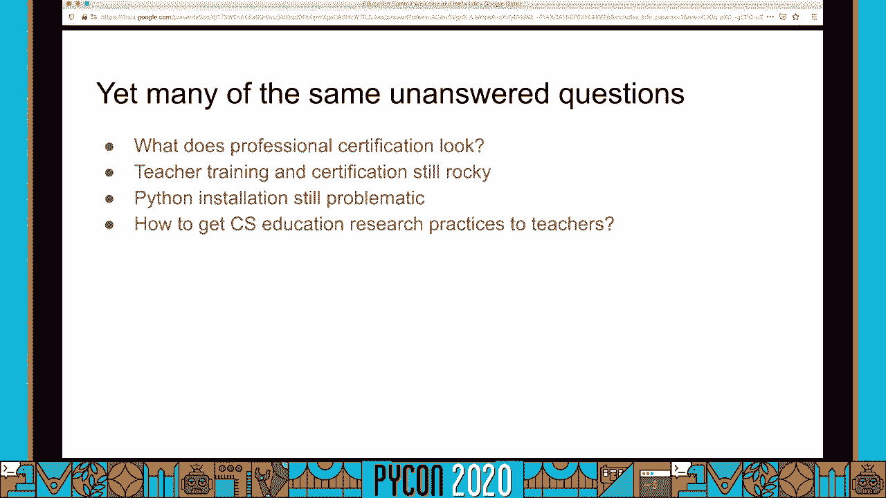

 And Zoe's going to be talking about， let me get the thing going。 Oof， where did my schedule go？

 I'm going to go ahead and talk about it。 I'm going to go ahead and talk about it。

 I'm going to go ahead and talk about it。 I'm going to go ahead and talk about it。

 I'm going to go ahead and talk about it。 I'm going to go ahead and talk about it。

 I'm going to go ahead and talk about it。 I'm going to go ahead and talk about it。

 I'm going to go ahead and talk about it。 I'm going to go ahead and talk about it。

 I'm going to go ahead and talk about it。 I'm going to go ahead and talk about it。

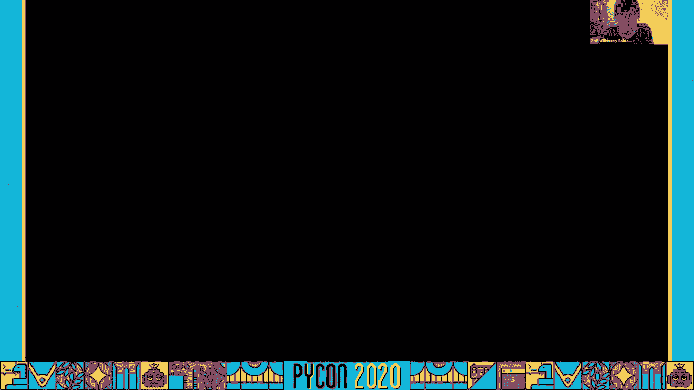

 I'm going to go ahead and talk about it。 I'm going to go ahead and talk about it。

 I'm going to go ahead and talk about it。 I'm going to go ahead and talk about it。

 I'm going to go ahead and talk about it。

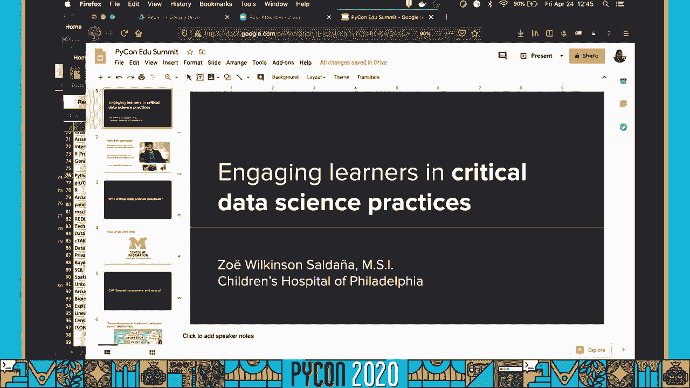

 I'm going to go ahead and talk about it。 I'm going to go ahead and talk about it。

 I'm going to go ahead and talk about it。 I'm going to go ahead and talk about it。

 I'm going to go ahead and talk about it。 I'm going to go ahead and talk about it。

 I'm going to go ahead and talk about it。 I'm going to go ahead and talk about it。

 I'm going to go ahead and talk about it。 I'm going to go ahead and talk about it。

 I'm going to go ahead and talk about it。 I'm going to go ahead and talk about it。

 I'm going to go ahead and talk about it。 I'm going to go ahead and talk about it。

 I'm going to go ahead and talk about it。 I'm going to go ahead and talk about it。

 I'm going to go ahead and talk about it。 I'm going to go ahead and talk about it。

 I'm going to go ahead and talk about it。 I'm going to go ahead and talk about it。

 I'm going to go ahead and talk about it。 I'm going to go ahead and talk about it。

 I'm going to go ahead and talk about it。 I'm going to go ahead and talk about it。

 I'm going to go ahead and talk about it。 I'm going to go ahead and talk about it。

 I'm going to go ahead and talk about it。 I'm going to go ahead and talk about it。

 I'm going to go ahead and talk about it。 I'm going to go ahead and talk about it。

 I'm going to go ahead and talk about it。 I'm going to go ahead and talk about it。

 I'm going to go ahead and talk about it。 I'm going to go ahead and talk about it。

 I'm going to go ahead and talk about it。 I'm going to go ahead and talk about it。

 I'm going to go ahead and talk about it。 I'm going to go ahead and talk about it。

 I'm going to go ahead and talk about it。 I'm going to go ahead and talk about it。

 I'm going to go ahead and talk about it。 I'm going to go ahead and talk about it。

 I'm going to go ahead and talk about it。 I'm going to go ahead and talk about it。

 I'm going to go ahead and talk about it。 I'm going to go ahead and talk about it。

 I'm going to go ahead and talk about it。 I'm going to go ahead and talk about it。

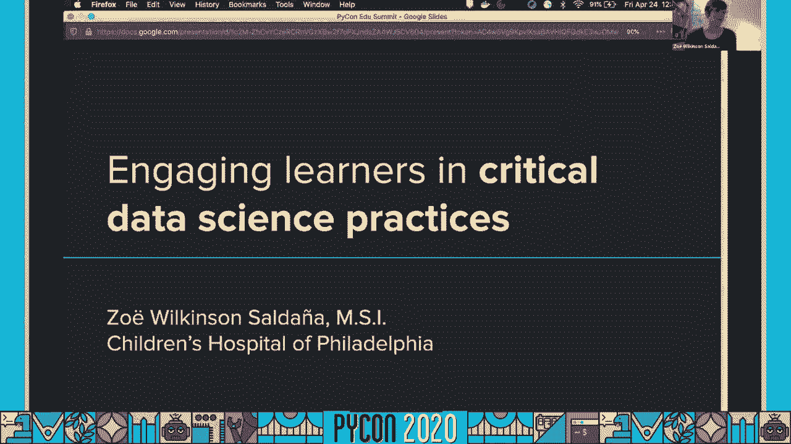

 I'm going to go ahead and talk about it。 I'm going to go ahead and talk about it。

 I'm going to go ahead and talk about it。 I'm going to go ahead and talk about it。

 I'm going to go ahead and talk about it。 I'm going to go ahead and talk about it。

 I'm going to go ahead and talk about it。 I'm going to go ahead and talk about it。

 I'm going to go ahead and talk about it。 I'm going to go ahead and talk about it。

 I'm going to go ahead and talk about it。 I'm going to go ahead and talk about it。

 I'm going to go ahead and talk about it。 I'm going to go ahead and talk about it。

 I'm going to go ahead and talk about it。 I'm going to go ahead and talk about it。

 I'm going to go ahead and talk about it。 I'm going to go ahead and talk about it。

 I'm going to go ahead and talk about it。 I'm going to go ahead and talk about it。

 I'm going to go ahead and talk about it。 I'm going to go ahead and talk about it。

 I'm going to go ahead and talk about it。 I'm going to go ahead and talk about it。

 I'm going to go ahead and talk about it。 I'm going to go ahead and talk about it。

 I'm going to go ahead and talk about it。 I'm going to go ahead and talk about it。

 I'm going to go ahead and talk about it。 I'm going to go ahead and talk about it。

 I'm going to go ahead and talk about it。 I'm going to go ahead and talk about it。

 I'm going to go ahead and talk about it。

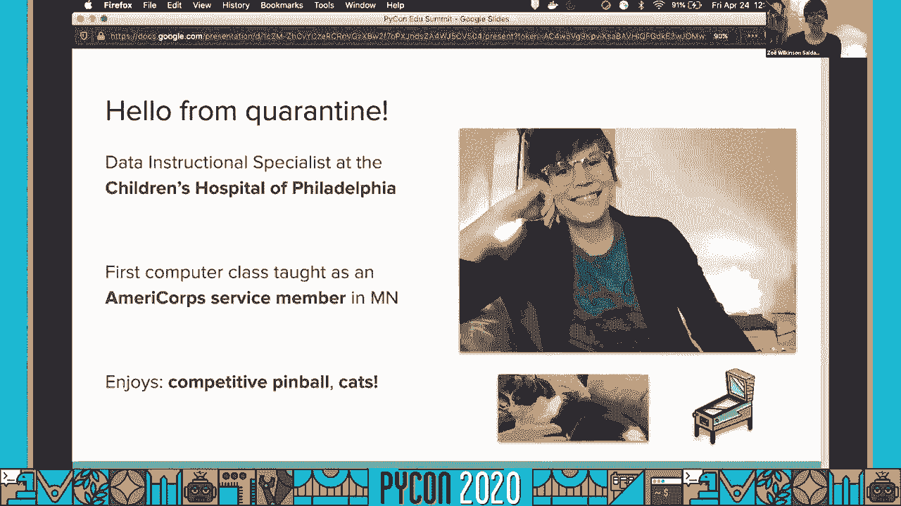

 I'm going to go ahead and talk about it。 I'm going to go ahead and talk about it。

 I'm going to go ahead and talk about it。 I'm going to go ahead and talk about it。

 I'm going to go ahead and talk about it。 I'm going to go ahead and talk about it。

 I'm going to go ahead and talk about it。 I'm going to go ahead and talk about it。

 I'm going to go ahead and talk about it。 I'm going to go ahead and talk about it。

 I'm going to go ahead and talk about it。 I'm going to go ahead and talk about it。

 I'm going to go ahead and talk about it。 I'm going to go ahead and talk about it。

 I'm going to go ahead and talk about it。 I'm going to go ahead and talk about it。

 I'm going to go ahead and talk about it。 I'm going to go ahead and talk about it。

 I'm going to go ahead and talk about it。 I'm going to go ahead and talk about it。

 I'm going to go ahead and talk about it。 I'm going to go ahead and talk about it。

 I'm going to go ahead and talk about it。 I'm going to go ahead and talk about it。

 I'm going to go ahead and talk about it。 I'm going to go ahead and talk about it。

 I'm going to go ahead and talk about it。 I'm going to go ahead and talk about it。

 I'm going to go ahead and talk about it。 I'm going to go ahead and talk about it。

 I'm going to go ahead and talk about it。

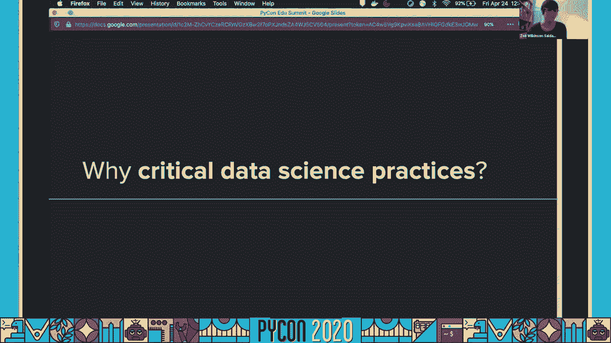

 I'm going to talk about it。 I'm going to talk about it。 I'm going to talk about it。

 I'm going to talk about it。 I'm going to talk about it。 I'm going to talk about it。

 I'm going to talk about it。 I'm going to talk about it。 I'm going to talk about it。

 I'm going to talk about it。 I'm going to talk about it。 I'm going to talk about it。

 I'm going to talk about it。

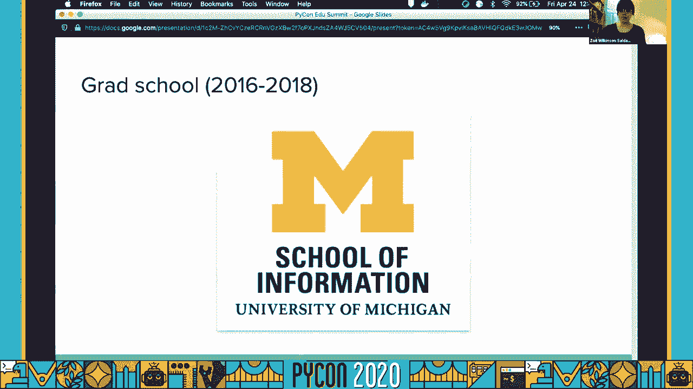

 I'm going to talk about it。 I'm going to talk about it。 I'm going to talk about it。

 I'm going to talk about it。 I'm going to talk about it。 I'm going to talk about it。

 I'm going to talk about it。 I'm going to talk about it。 I'm going to talk about it。

 I'm going to talk about it。

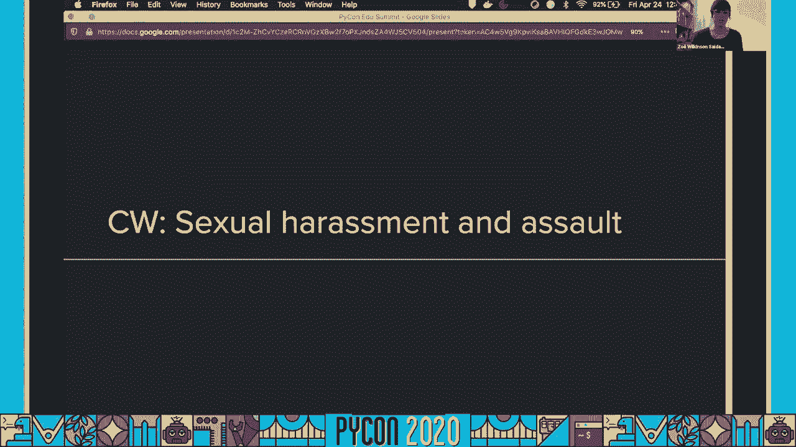

 I'm going to talk about it。 I'm going to talk about it。 I'm going to talk about it。

 I'm going to talk about it。 I'm going to talk about it。 I'm going to talk about it。

 I'm going to talk about it。 I'm going to talk about it。 I'm going to talk about it。

 I'm going to talk about it。 I'm going to talk about it。 I'm going to talk about it。

 I'm going to talk about it。 I'm going to talk about it。 I'm going to talk about it。

 I'm going to talk about it。 I'm going to talk about it。 I'm going to talk about it。

 I'm going to talk about it。 I'm going to talk about it。 I'm going to talk about it。

 I'm going to talk about it。 I'm going to talk about it。 I'm going to talk about it。

 I'm going to talk about it。 I'm going to talk about it。 I'm going to talk about it。

 I'm going to talk about it。 I'm going to talk about it。 I'm going to talk about it。

 I'm going to talk about it。 I'm going to talk about it。 I'm going to talk about it。

 I'm going to talk about it。 I'm going to talk about it。 I'm going to talk about it。

 I'm going to talk about it。 I'm going to talk about it。 I'm going to talk about it。

 I'm going to talk about it。 I'm going to talk about it。 I'm going to talk about it。

 I'm going to talk about it。 I'm going to talk about it。 I'm going to talk about it。

 I'm going to talk about it。 I'm going to talk about it。 I'm going to talk about it。

 I'm going to talk about it。 I'm going to talk about it。 I'm going to talk about it。

 I'm going to talk about it。 I'm going to talk about it。 I'm going to talk about it。

 I'm going to talk about it。 I'm going to talk about it。 I'm going to talk about it。

 I'm going to talk about it。 I'm going to talk about it。 I'm going to talk about it。

 I'm going to talk about it。 I'm going to talk about it。 I'm going to talk about it。

 I'm going to talk about it。 I'm going to talk about it。 I'm going to talk about it。

 I'm going to talk about it。 I'm going to talk about it。 I'm going to talk about it。

 I'm going to talk about it。 I'm going to talk about it。 I'm going to talk about it。

 I'm going to talk about it。 I'm going to talk about it。 I'm going to talk about it。

 I'm going to talk about it。 I'm going to talk about it。 I'm going to talk about it。

 I'm going to talk about it。 I'm going to talk about it。 I'm going to talk about it。

 I'm going to talk about it。 I'm going to talk about it。 I'm going to talk about it。

 I'm going to talk about it。 I'm going to talk about it。 I'm going to talk about it。

 I'm going to talk about it。 I'm going to talk about it。 I'm going to talk about it。

 I'm going to talk about it。 I'm going to talk about it。 I'm going to talk about it。

 I'm going to talk about it。 I'm going to talk about it。 I'm going to talk about it。

 I'm going to talk about it。 I'm going to talk about it。 I'm going to talk about it。

 I'm going to talk about it。 I'm going to talk about it。 I'm going to talk about it。

 I'm going to talk about it。 I'm going to talk about it。 I'm going to talk about it。

 I'm going to talk about it。 I'm going to talk about it。 I'm going to talk about it。

 I'm going to talk about it。 I'm going to talk about it。 I'm going to talk about it。

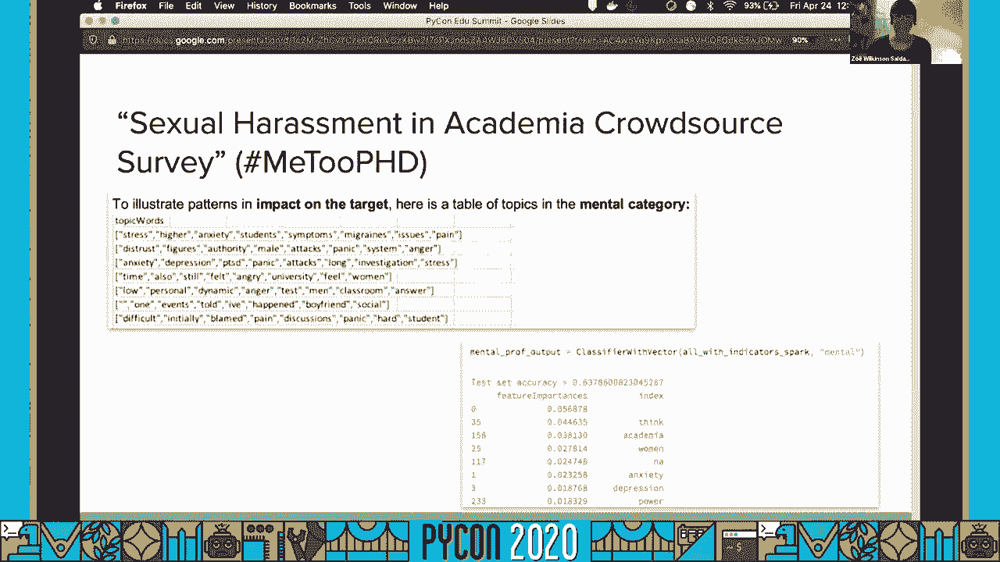

 I'm going to talk about it。 I'm going to talk about it。 I'm going to talk about it。

 I'm going to talk about it。 I'm going to talk about it。 I'm going to talk about it。

 I'm going to talk about it。 I'm going to talk about it。 I'm going to talk about it。

 I'm going to talk about it。 I'm going to talk about it。 I'm going to talk about it。

 I'm going to talk about it。 I'm going to talk about it。 I'm going to talk about it。

 I'm going to talk about it。 I'm going to talk about it。 I'm going to talk about it。

 I'm going to talk about it。 I'm going to talk about it。 I'm going to talk about it。

 I'm going to talk about it。 I'm going to talk about it。 I'm going to talk about it。

 I'm going to talk about it。 I'm going to talk about it。 I'm going to talk about it。

 I'm going to talk about it。 I'm going to talk about it。

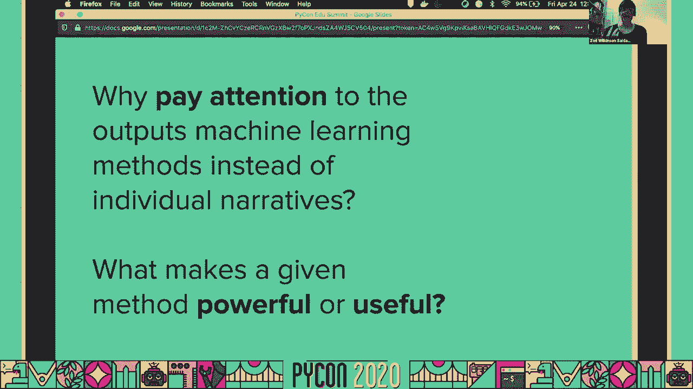

 I'm going to talk about it。 I'm going to talk about it。 I'm going to talk about it。

 I'm going to talk about it。 I'm going to talk about it。 I'm going to talk about it。

 I'm going to talk about it。 I'm going to talk about it。 I'm going to talk about it。

 I'm going to talk about it。 I'm going to talk about it。 I'm going to talk about it。

 I'm going to talk about it。 I'm going to talk about it。 I'm going to talk about it。

 I'm going to talk about it。 I'm going to talk about it。 I'm going to talk about it。

 I'm going to talk about it。 I'm going to talk about it。 I'm going to talk about it。

 I'm going to talk about it。 I'm going to talk about it。 I'm going to talk about it。

 I'm going to talk about it。 I'm going to talk about it。 I'm going to talk about it。

 I'm going to talk about it。 I'm going to talk about it。 I'm going to talk about it。

 I'm going to talk about it。 I'm going to talk about it。 I'm going to talk about it。

 I'm going to talk about it。 I'm going to talk about it。 I'm going to talk about it。

 I'm going to talk about it。 I'm going to talk about it。 I'm going to talk about it。

 I'm going to talk about it。 I'm going to talk about it。 I'm going to talk about it。

 I'm going to talk about it。

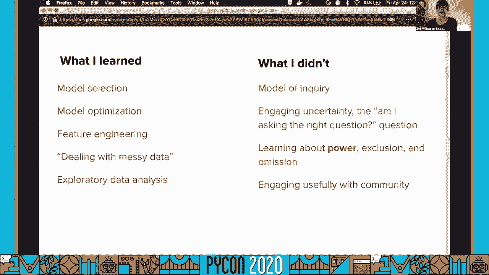

 I'm going to talk about it。 I'm going to talk about it。 I'm going to talk about it。

 I'm going to talk about it。 I'm going to talk about it。 I'm going to talk about it。

 I'm going to talk about it。 I'm going to talk about it。 I'm going to talk about it。

 I'm going to talk about it。 I'm going to talk about it。 I'm going to talk about it。

 I'm going to talk about it。 I'm going to talk about it。 I'm going to talk about it。

 I'm going to talk about it。 I'm going to talk about it。 I'm going to talk about it。

 I'm going to talk about it。 I'm going to talk about it。 I'm going to talk about it。

 I'm going to talk about it。 I'm going to talk about it。 I'm going to talk about it。

 I'm going to talk about it。 I'm going to talk about it。 I'm going to talk about it。

 I'm going to talk about it。 I'm going to talk about it。 I'm going to talk about it。

 I'm going to talk about it。 I'm going to talk about it。 I'm going to talk about it。

 I'm going to talk about it。 I'm going to talk about it。 I'm going to talk about it。

 I'm going to talk about it。 I'm going to talk about it。 I'm going to talk about it。

 I'm going to talk about it。 I'm going to talk about it。 I'm going to talk about it。

 I'm going to talk about it。 I'm going to talk about it。 I'm going to talk about it。

 I'm going to talk about it。 I'm going to talk about it。 I'm going to talk about it。

 I'm going to talk about it。 I'm going to talk about it。 I'm going to talk about it。

 I'm going to talk about it。 I'm going to talk about it。 I'm going to talk about it。

 I'm going to talk about it。 I'm going to talk about it。 I'm going to talk about it。

 I'm going to talk about it。 I'm going to talk about it。 I'm going to talk about it。

 I'm going to talk about it。 I'm going to talk about it。 I'm going to talk about it。

 I'm going to talk about it。 I'm going to talk about it。 I'm going to talk about it。

 I'm going to talk about it。 I'm going to talk about it。 I'm going to talk about it。

 I'm going to talk about it。 I'm going to talk about it。 I'm going to talk about it。

 I'm going to talk about it。 I'm going to talk about it。 I'm going to talk about it。

 I'm going to talk about it。 I'm going to talk about it。 I'm going to talk about it。

 I'm going to talk about it。 I'm going to talk about it。 I'm going to talk about it。

 I'm going to talk about it。 I'm going to talk about it。 I'm going to talk about it。

 I'm going to talk about it。 I'm going to talk about it。 I'm going to talk about it。

 I'm going to talk about it。 I'm going to talk about it。 I'm going to talk about it。

 I'm going to talk about it。 I'm going to talk about it。 I'm going to talk about it。

 I'm going to talk about it。 I'm going to talk about it。 I'm going to talk about it。

 I'm going to talk about it。 I'm going to talk about it。 I'm going to talk about it。

 I'm going to talk about it。

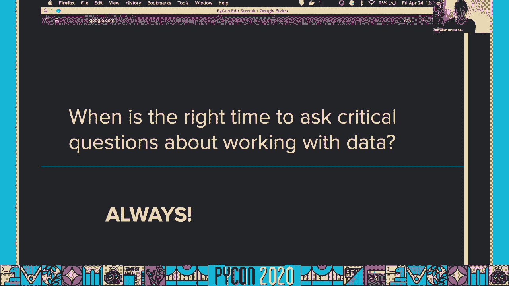

 I'm going to talk about it。 I'm going to talk about it。 I'm going to talk about it。

 I'm going to talk about it。 I'm going to talk about it。 I'm going to talk about it。

 I'm going to talk about it。 I'm going to talk about it。 I'm going to talk about it。

 I'm going to talk about it。 I'm going to talk about it。 I'm going to talk about it。

 I'm going to talk about it。 I'm going to talk about it。 I'm going to talk about it。

 I'm going to talk about it。 I'm going to talk about it。 I'm going to talk about it。

 I'm going to talk about it。 I'm going to talk about it。 I'm going to talk about it。

 I'm going to talk about it。 I'm going to talk about it。 I'm going to talk about it。

 I'm going to talk about it。 I'm going to talk about it。 I'm going to talk about it。

 I'm going to talk about it。 I'm going to talk about it。 I'm going to talk about it。

 I'm going to talk about it。 I'm going to talk about it。 I'm going to talk about it。

 I'm going to talk about it。 I'm going to talk about it。 I'm going to talk about it。

 I'm going to talk about it。 I'm going to talk about it。 I'm going to talk about it。

 I'm going to talk about it。 I'm going to talk about it。 I'm going to talk about it。

 I'm going to talk about it。 I'm going to talk about it。 I'm going to talk about it。

 I'm going to talk about it。 I'm going to talk about it。 I'm going to talk about it。

 I'm going to talk about it。 I'm going to talk about it。 I'm going to talk about it。

 I'm going to talk about it。 I'm going to talk about it。 I'm going to talk about it。

 I'm going to talk about it。 I'm going to talk about it。 I'm going to talk about it。

 I'm going to talk about it。 I'm going to talk about it。 I'm going to talk about it。

 I'm going to talk about it。 I'm going to talk about it。 I'm going to talk about it。

 I'm going to talk about it。 I'm going to talk about it。 I'm going to talk about it。

 I'm going to talk about it。 I'm going to talk about it。 I'm going to talk about it。

 I'm going to talk about it。 I'm going to talk about it。 I'm going to talk about it。

 I'm going to talk about it。 I'm going to talk about it。 I'm going to talk about it。

 I'm going to talk about it。 I'm going to talk about it。 I'm going to talk about it。

 I'm going to talk about it。 I'm going to talk about it。 I'm going to talk about it。

 I'm going to talk about it。 I'm going to talk about it。 I'm going to talk about it。

 I'm going to talk about it。 I'm going to talk about it。 I'm going to talk about it。

 I'm going to talk about it。 I'm going to talk about it。 I'm going to talk about it。

 I'm going to talk about it。 I'm going to talk about it。 I'm going to talk about it。

 I'm going to talk about it。 I'm going to talk about it。 I'm going to talk about it。

 I'm going to talk about it。 I'm going to talk about it。 I'm going to talk about it。

 I'm going to talk about it。 I'm going to talk about it。 I'm going to talk about it。

 I'm going to talk about it。 I'm going to talk about it。 I'm going to talk about it。

 I'm going to talk about it。 I'm going to talk about it。 I'm going to talk about it。

 I'm going to talk about it。 I'm going to talk about it。 I'm going to talk about it。

 I'm going to talk about it。 I'm going to talk about it。 I'm going to talk about it。

 I'm going to talk about it。 I'm going to talk about it。 I'm going to talk about it。

 I'm going to talk about it。 I'm going to talk about it。 I'm going to talk about it。

 I'm going to talk about it。 I'm going to talk about it。 I'm going to talk about it。

 I'm going to talk about it。 I'm going to talk about it。 I'm going to talk about it。

 I'm going to talk about it。 I'm going to talk about it。 I'm going to talk about it。

 I'm going to talk about it。 I'm going to talk about it。 I'm going to talk about it。

 I'm going to talk about it。 I'm going to talk about it。 I'm going to talk about it。

 I'm going to talk about it。 I'm going to talk about it。 I'm going to talk about it。

 I'm going to talk about it。 I'm going to talk about it。 I'm going to talk about it。

 I'm going to talk about it。 I'm going to talk about it。 I'm going to talk about it。

 I'm going to talk about it。 I'm going to talk about it。 I'm going to talk about it。

 I'm going to talk about it。 I'm going to talk about it。

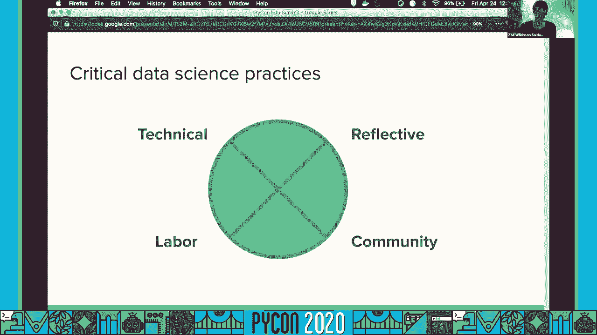

 I'm going to talk about it。 I'm going to talk about it。 I'm going to talk about it。

 I'm going to talk about it。 I'm going to talk about it。 I'm going to talk about it。

 I'm going to talk about it。 I'm going to talk about it。 I'm going to talk about it。

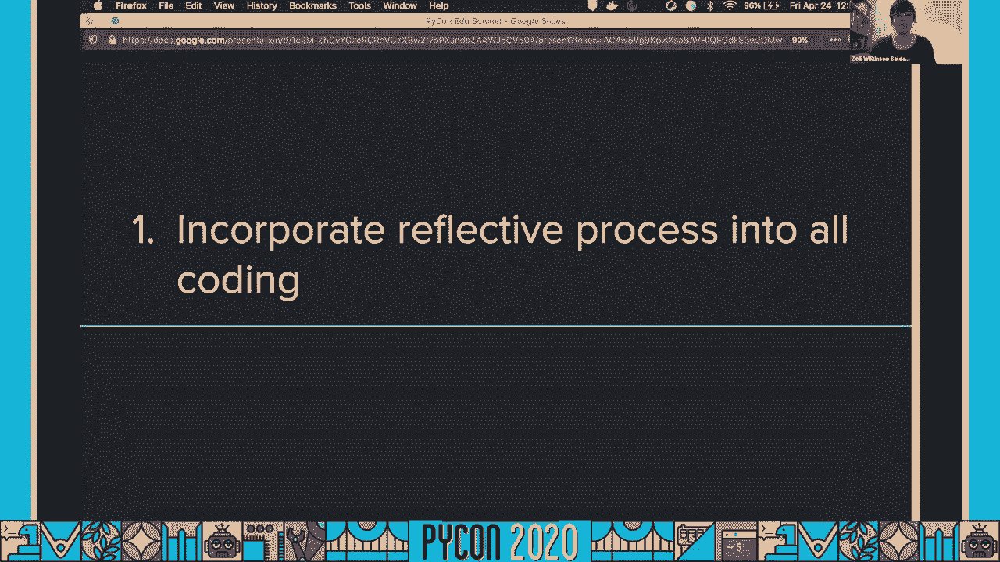

 I'm going to talk about it。 I'm going to talk about it。 I'm going to talk about it。

 I'm going to talk about it。 I'm going to talk about it。 I'm going to talk about it。

 I'm going to talk about it。 I'm going to talk about it。 I'm going to talk about it。

 I'm going to talk about it。 I'm going to talk about it。 I'm going to talk about it。

 I'm going to talk about it。 I'm going to talk about it。 I'm going to talk about it。

 I'm going to talk about it。 I'm going to talk about it。 I'm going to talk about it。

 I'm going to talk about it。 I'm going to talk about it。 I'm going to talk about it。

 I'm going to talk about it。 I'm going to talk about it。 I'm going to talk about it。

 I'm going to talk about it。 I'm going to talk about it。 I'm going to talk about it。

 I'm going to talk about it。 I'm going to talk about it。 I'm going to talk about it。

 I'm going to talk about it。 I'm going to talk about it。 I'm going to talk about it。

 I'm going to talk about it。 I'm going to talk about it。 I'm going to talk about it。

 I'm going to talk about it。 I'm going to talk about it。 I'm going to talk about it。

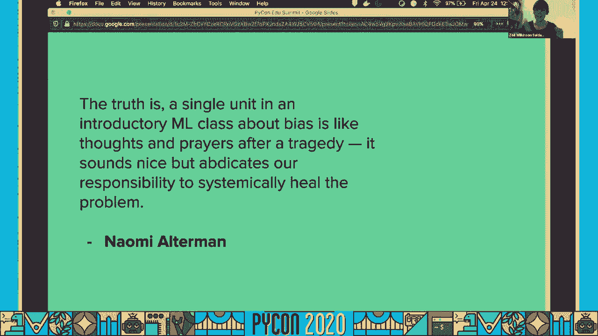

 I'm going to talk about it。 I'm going to talk about it。 I'm going to talk about it。

 I'm going to talk about it。 I'm going to talk about it。 I'm going to talk about it。

 I'm going to talk about it。 I'm going to talk about it。 I'm going to talk about it。

 I'm going to talk about it。 I'm going to talk about it。 I'm going to talk about it。

 I'm going to talk about it。 I'm going to talk about it。 I'm going to talk about it。

 I'm going to talk about it。 I'm going to talk about it。 I'm going to talk about it。

 I'm going to talk about it。 I'm going to talk about it。 I'm going to talk about it。

 I'm going to talk about it。 I'm going to talk about it。 I'm going to talk about it。

 I'm going to talk about it。 I'm going to talk about it。 I'm going to talk about it。

 I'm going to talk about it。 I'm going to talk about it。 I'm going to talk about it。

 I'm going to talk about it。 I'm going to talk about it。 I'm going to talk about it。

 I'm going to talk about it。 I'm going to talk about it。 I'm going to talk about it。

 I'm going to talk about it。 I'm going to talk about it。 I'm going to talk about it。

 I'm going to talk about it。 I'm going to talk about it。 I'm going to talk about it。

 I'm going to talk about it。 I'm going to talk about it。 I'm going to talk about it。

 I'm going to talk about it。 I'm going to talk about it。 I'm going to talk about it。

 I'm going to talk about it。 I'm going to talk about it。 I'm going to talk about it。

 I'm going to talk about it。 I'm going to talk about it。 I'm going to talk about it。

 I'm going to talk about it。 I'm going to talk about it。 I'm going to talk about it。

 I'm going to talk about it。 I'm going to talk about it。 I'm going to talk about it。

 I'm going to talk about it。 I'm going to talk about it。 I'm going to talk about it。

 I'm going to talk about it。 I'm going to talk about it。 I'm going to talk about it。

 I'm going to talk about it。 I'm going to talk about it。 I'm going to talk about it。

 I'm going to talk about it。 I'm going to talk about it。 I'm going to talk about it。

 I'm going to talk about it。 I'm going to talk about it。 I'm going to talk about it。

 I'm going to talk about it。 I'm going to talk about it。 I'm going to talk about it。

 I'm going to talk about it。 I'm going to talk about it。 I'm going to talk about it。

 I'm going to talk about it。 I'm going to talk about it。 I'm going to talk about it。

 I'm going to talk about it。 I'm going to talk about it。 I'm going to talk about it。

 I'm going to talk about it。 I'm going to talk about it。 I'm going to talk about it。

 I'm going to talk about it。 I'm going to talk about it。 I'm going to talk about it。

 I'm going to talk about it。 I'm going to talk about it。 I'm going to talk about it。

 I'm going to talk about it。 I'm going to talk about it。 I'm going to talk about it。

 I'm going to talk about it。 I'm going to talk about it。 I'm going to talk about it。

 I'm going to talk about it。 I'm going to talk about it。 I'm going to talk about it。

 I'm going to talk about it。 I'm going to talk about it。 I'm going to talk about it。

 I'm going to talk about it。 I'm going to talk about it。 I'm going to talk about it。

 I'm going to talk about it。 I'm going to talk about it。 I'm going to talk about it。

 I'm going to talk about it。 I'm going to talk about it。 I'm going to talk about it。

 I'm going to talk about it。 I'm going to talk about it。 I'm going to talk about it。

 I'm going to talk about it。 I'm going to talk about it。 I'm going to talk about it。

 I'm going to talk about it。 I'm going to talk about it。 I'm going to talk about it。

 I'm going to talk about it。 I'm going to talk about it。 I'm going to talk about it。

 I'm going to talk about it。 I'm going to talk about it。 I'm going to talk about it。

 I'm going to talk about it。 I'm going to talk about it。 I'm going to talk about it。

 I'm going to talk about it。 I'm going to talk about it。 I'm going to talk about it。

 I'm going to talk about it。 I'm going to talk about it。 I'm going to talk about it。

 I'm going to talk about it。 I'm going to talk about it。 I'm going to talk about it。

 I'm going to talk about it。 I'm going to talk about it。 I'm going to talk about it。

 I'm going to talk about it。 I'm going to talk about it。 I'm going to talk about it。

 I'm going to talk about it。 I'm going to talk about it。 I'm going to talk about it。

 I'm going to talk about it。 I'm going to talk about it。 I'm going to talk about it。

 I'm going to talk about it。 I'm going to talk about it。

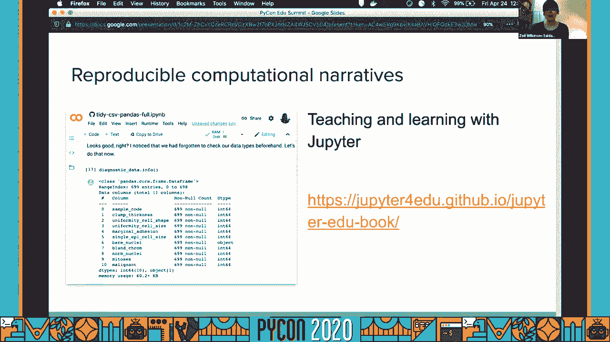

 I'm going to talk about it。 I'm going to talk about it。 I'm going to talk about it。

 I'm going to talk about it。 I'm going to talk about it。 I'm going to talk about it。

 I'm going to talk about it。 I'm going to talk about it。 I'm going to talk about it。

 I'm going to talk about it。 I'm going to talk about it。 I'm going to talk about it。

 I'm going to talk about it。 I'm going to talk about it。 I'm going to talk about it。

 I'm going to talk about it。 I'm going to talk about it。 I'm going to talk about it。

 I'm going to talk about it。

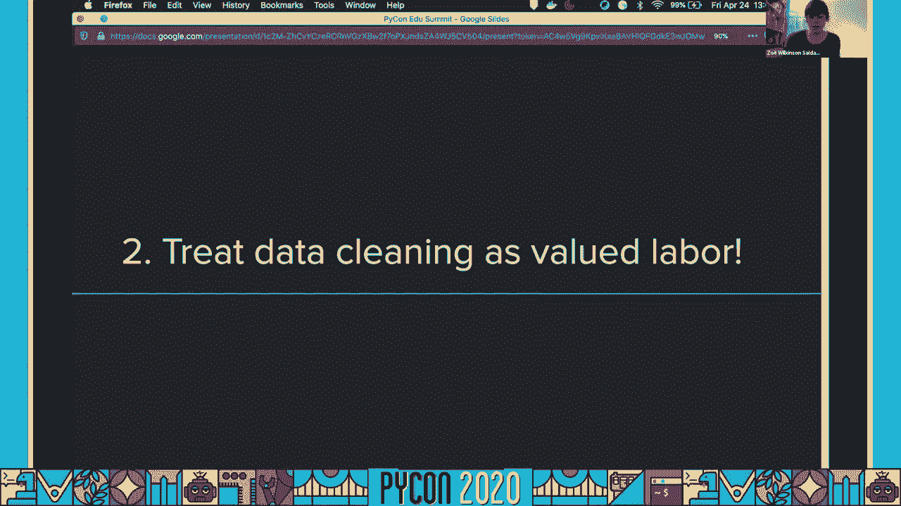

 I'm going to talk about it。 I'm going to talk about it。 I'm going to talk about it。

 I'm going to talk about it。 I'm going to talk about it。 I'm going to talk about it。

 I'm going to talk about it。 I'm going to talk about it。 I'm going to talk about it。

 I'm going to talk about it。

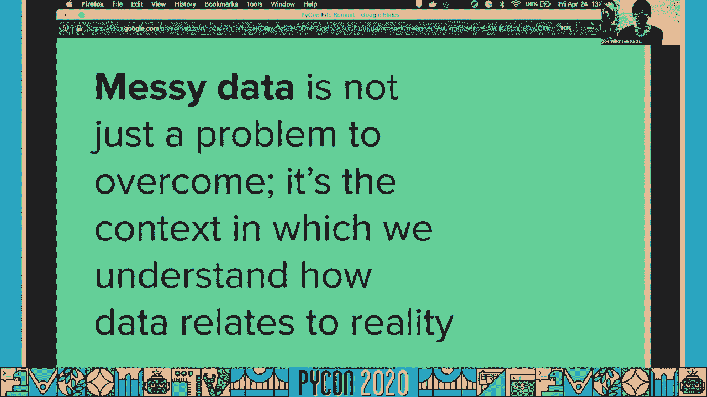

 I'm going to talk about it。 I'm going to talk about it。 I'm going to talk about it。

 I'm going to talk about it。 I'm going to talk about it。 I'm going to talk about it。

 I'm going to talk about it。 I'm going to talk about it。 I'm going to talk about it。

 I'm going to talk about it。 I'm going to talk about it。 I'm going to talk about it。

 I'm going to talk about it。 I'm going to talk about it。 I'm going to talk about it。

 I'm going to talk about it。 I was part of a group that planned， these summer fellowships for。

 humanities and social science， students who were basically trying， to build something in six weeks。

 like a digital project， and trying to kind of take their， own trajectory and try to take。

 their own data and try to create， something new， learn a new skill set。

 I bet many of you have worked， with students in this kind of case， before。 They're really excited。

 They have a vision of what they， want to do。 As educators， I'm going to talk about。

 what they want to do。 I'm going to talk about it。 I'm going to talk about it。

 I'm going to talk about it。 I'm going to talk about it。 I'm going to talk about it。

 I'm going to talk about it。 I'm going to talk about it。 I'm going to talk about it。

 I'm going to talk about it。 I'm going to talk about it。 I'm going to talk about it。

 I'm going to talk about it。 I'm going to talk about it。 I'm going to talk about it。

 I'm going to talk about it。 I'm going to talk about it。 I'm going to talk about it。

 I'm going to talk about it。 I'm going to talk about it。 I'm going to talk about it。

 I'm going to talk about it。 I'm going to talk about it。 I'm going to talk about it。

 I'm going to talk about it。 I'm going to talk about it。 I'm going to talk about it。

 I'm going to talk about it。 I'm going to talk about it。 I'm going to talk about it。

 I'm going to talk about it。 I'm going to talk about it。 I'm going to talk about it。

 I'm going to talk about it。 I'm going to talk about it。 I'm going to talk about it。

 I'm going to talk about it。 I'm going to talk about it。 I'm going to talk about it。

 I'm going to talk about it。 I'm going to talk about it。 I'm going to talk about it。

 I'm going to talk about it。 I'm going to talk about it。 I'm going to talk about it。

 I'm going to talk about it。 I'm going to talk about it。 I'm going to talk about it。

 I'm going to talk about it。 I'm going to talk about it。 I'm going to talk about it。

 I'm going to talk about it。 I'm going to talk about it。 I'm going to talk about it。

 I'm going to talk about it。 I'm going to talk about it。 I'm going to talk about it。

 I'm going to talk about it。 I'm going to talk about it。 I'm going to talk about it。

 I'm going to talk about it。 I'm going to talk about it。 I'm going to talk about it。

 I'm going to talk about it。 I'm going to talk about it。 I'm going to talk about it。

 I'm going to talk about it。 I'm going to talk about it。 I'm going to talk about it。

 I'm going to talk about it。 I'm going to talk about it。 I'm going to talk about it。

 I'm going to talk about it。 I'm going to talk about it。 I'm going to talk about it。

 I'm going to talk about it。 I'm going to talk about it。 I'm going to talk about it。

 I'm going to talk about it。 I'm going to talk about it。 I'm going to talk about it。

 I'm going to talk about it。 I'm going to talk about it。 I'm going to talk about it。

 I'm going to talk about it。 I'm going to talk about it。 I'm going to talk about it。

 I'm going to talk about it。 I'm going to talk about it。 I'm going to talk about it。

 I'm going to talk about it。 I'm going to talk about it。 I'm going to talk about it。

 I'm going to talk about it。 I'm going to talk about it。 I'm going to talk about it。

 I'm going to talk about it。 I'm going to talk about it。 I'm going to talk about it。

 I'm going to talk about it。 I'm going to talk about it。 I'm going to talk about it。

 I'm going to talk about it。 I'm going to talk about it。 I'm going to talk about it。

 I'm going to talk about it。 I'm going to talk about it。 I'm going to talk about it。

 I'm going to talk about it。 I'm going to talk about it。 I'm going to talk about it。

 I'm going to talk about it。 I'm going to talk about it。 I'm going to talk about it。

 I'm going to talk about it。 I'm going to talk about it。 I'm going to talk about it。

 I'm going to talk about it。 I'm going to talk about it。 I'm going to talk about it。

 I'm going to talk about it。 I'm going to talk about it。 I'm going to talk about it。

 I'm going to talk about it。 I'm going to talk about it。 I'm going to talk about it。

 I'm going to talk about it。 I'm going to talk about it。 I'm going to talk about it。

 I'm going to talk about it。 I'm going to talk about it。 I'm going to talk about it。

 I'm going to talk about it。

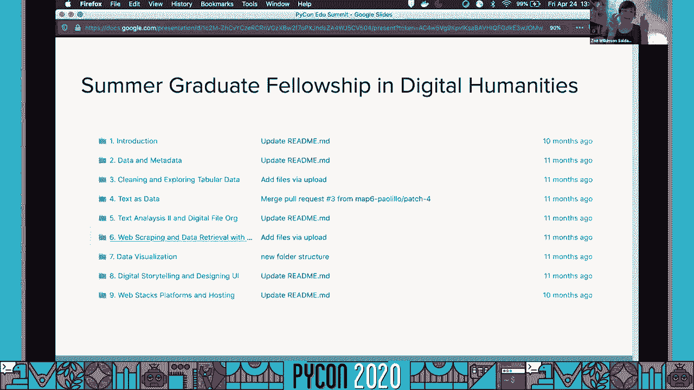

 I'm going to talk about it。 I'm going to talk about it。 I'm going to talk about it。

 I'm going to talk about it。 I'm going to talk about it。 I'm going to talk about it。

 I'm going to talk about it。 I'm going to talk about it。 I'm going to talk about it。

 I'm going to talk about it。 I'm going to talk about it。 I'm going to talk about it。

 I'm going to talk about it。 I'm going to talk about it。 I'm going to talk about it。

 I'm going to talk about it。 I'm going to talk about it。 I'm going to talk about it。

 I'm going to talk about it。

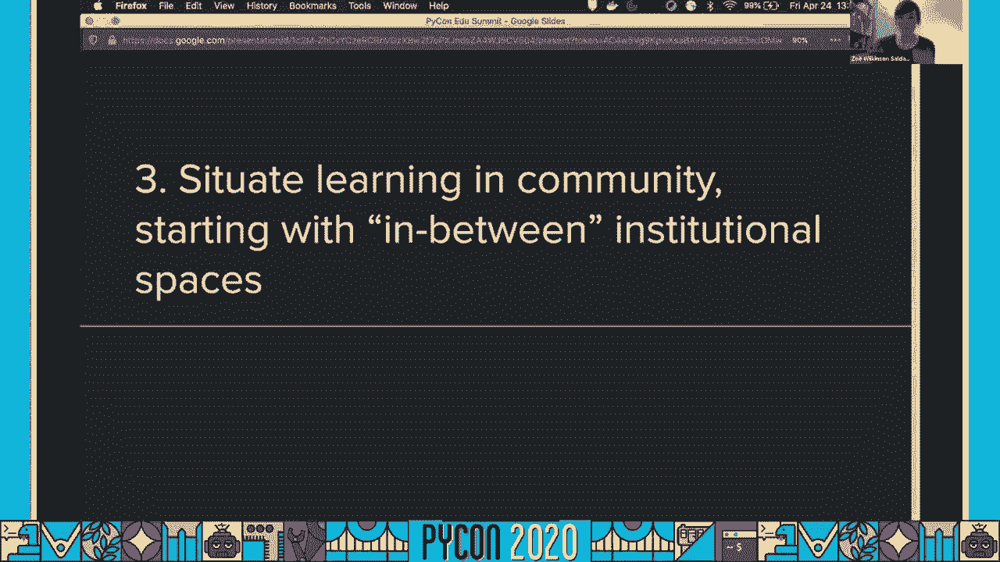

 I'm going to talk about it。 I'm going to talk about it。 I'm going to talk about it。

 I'm going to talk about it。 I'm going to talk about it。

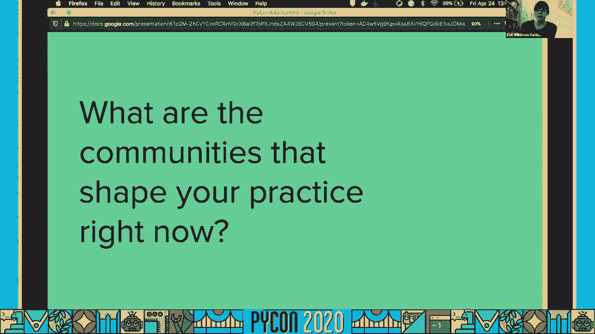

 I'm going to talk about it。 I'm going to talk about it。 I'm going to talk about it。

 I'm going to talk about it。 I'm going to talk about it。 I'm going to talk about it。

 I'm going to talk about it。 I'm going to talk about it。 I'm going to talk about it。

 I'm going to talk about it。 I'm going to talk about it。 I'm going to talk about it。

 I'm going to talk about it。 I'm going to talk about it。 I'm going to talk about it。

 I'm going to talk about it。 I'm going to talk about it。 I'm going to talk about it。

 I'm going to talk about it。 I'm going to talk about it。 I'm going to talk about it。

 I'm going to talk about it。 I'm going to talk about it。 I'm going to talk about it。

 I'm going to talk about it。 I'm going to talk about it。 I'm going to talk about it。

 I'm going to talk about it。 I'm going to talk about it。 I'm going to talk about it。

 I'm going to talk about it。 I'm going to talk about it。 I'm going to talk about it。

 I'm going to talk about it。 I'm going to talk about it。 I'm going to talk about it。

 I'm going to talk about it。 I'm going to talk about it。 I'm going to talk about it。

 I'm going to talk about it。 I'm going to talk about it。 I'm going to talk about it。

 I'm going to talk about it。 I'm going to talk about it。 I'm going to talk about it。

 I'm going to talk about it。 I'm going to talk about it。 I'm going to talk about it。

 I'm going to talk about it。 I'm going to talk about it。 I'm going to talk about it。

 I'm going to talk about it。 I'm going to talk about it。 I'm going to talk about it。

 I'm going to talk about it。 I'm going to talk about it。 I'm going to talk about it。

 I'm going to talk about it。 I'm going to talk about it。 I'm going to talk about it。

 I'm going to talk about it。 I'm going to talk about it。 I'm going to talk about it。

 I'm going to talk about it。 I'm going to talk about it。 I'm going to talk about it。

 I'm going to talk about it。 I'm going to talk about it。 I'm going to talk about it。

 I'm going to talk about it。 I'm going to talk about it。 I'm going to talk about it。

 I'm going to talk about it。 I'm going to talk about it。 I'm going to talk about it。

 I'm going to talk about it。 I'm going to talk about it。 I'm going to talk about it。

 I'm going to talk about it。 I'm going to talk about it。 I'm going to talk about it。

 I'm going to talk about it。 I'm going to talk about it。 I'm going to talk about it。

 I'm going to talk about it。 I'm going to talk about it。 I'm going to talk about it。

 I'm going to talk about it。 I'm going to talk about it。 I'm going to talk about it。

 I'm going to talk about it。 I'm going to talk about it。 I'm going to talk about it。

 I'm going to talk about it。 I'm going to talk about it。 I'm going to talk about it。

 I'm going to talk about it。 I'm going to talk about it。 I'm going to talk about it。

 I'm going to talk about it。 I'm going to talk about it。 I'm going to talk about it。

 I'm going to talk about it。 I'm going to talk about it。 I'm going to talk about it。

 I'm going to talk about it。 I'm going to talk about it。 I'm going to talk about it。

 I'm going to talk about it。 I'm going to talk about it。 I'm going to talk about it。

 I'm going to talk about it。 I'm going to talk about it。 I'm going to talk about it。

 I'm going to talk about it。 I'm going to talk about it。 I'm going to talk about it。

 I'm going to talk about it。 I'm going to talk about it。 I'm going to talk about it。

 I'm going to talk about it。 I'm going to talk about it。 I'm going to talk about it。

 I'm going to talk about it。 I'm going to talk about it。 I'm going to talk about it。

 I'm going to talk about it。 I'm going to talk about it。 I'm going to talk about it。

 I'm going to talk about it。 I'm going to talk about it。 I'm going to talk about it。

 I'm going to talk about it。 I'm going to talk about it。 I'm going to talk about it。

 I'm going to talk about it。 I'm going to talk about it。 I'm going to talk about it。

 I'm going to talk about it。 I'm going to talk about it。 I'm going to talk about it。

 I'm going to talk about it。 I'm going to talk about it。 I'm going to talk about it。

 I'm going to talk about it。 I'm going to talk about it。 I'm going to talk about it。

 I'm going to talk about it。 I'm going to talk about it。 I'm going to talk about it。

 I'm going to talk about it。 I'm going to talk about it。 I'm going to talk about it。

 I'm going to talk about it。 I'm going to talk about it。 I'm going to talk about it。

 I'm going to talk about it。 I'm going to talk about it。 I'm going to talk about it。

 I'm going to talk about it。 I'm going to talk about it。 I'm going to talk about it。

 I'm going to talk about it。 I'm going to talk about it。 I'm going to talk about it。

 I'm going to talk about it。 I'm going to talk about it。 I'm going to talk about it。

 I'm going to talk about it。 I'm going to talk about it。 I'm going to talk about it。

 I'm going to talk about it。

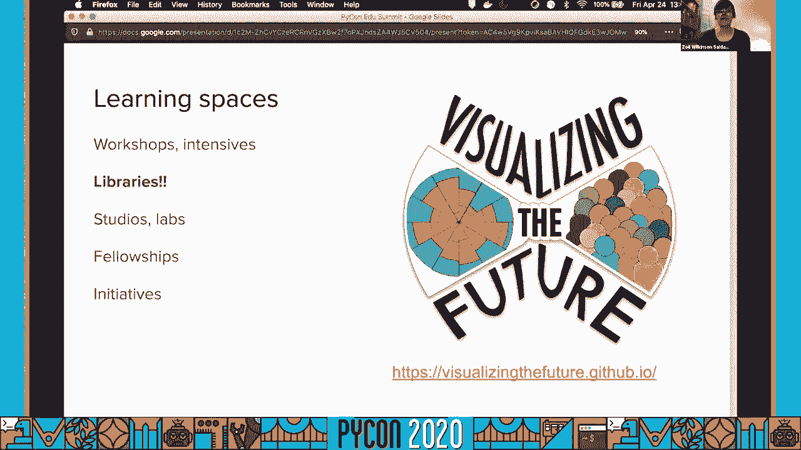

 I'm going to talk about it。 I'm going to talk about it。 I'm going to talk about it。

 I'm going to talk about it。 I'm going to talk about it。 I'm going to talk about it。

 I'm going to talk about it。 I'm going to talk about it。 I'm going to talk about it。

 I'm going to talk about it。 I'm going to talk about it。 I'm going to talk about it。

 I'm going to talk about it。 I'm going to talk about it。 I'm going to talk about it。

 I'm going to talk about it。 I'm going to talk about it。 I'm going to talk about it。

 I'm going to talk about it。 I'm going to talk about it。 I'm going to talk about it。

 I'm going to talk about it。 I'm going to talk about it。 I'm going to talk about it。

 I'm going to talk about it。 I'm going to talk about it。 I'm going to talk about it。

 I'm going to talk about it。

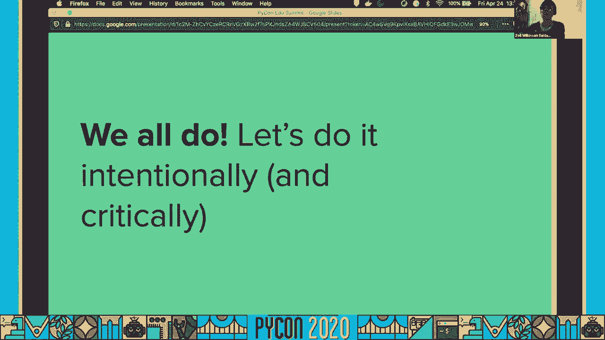

 I'm going to talk about it。 I'm going to talk about it。 I'm going to talk about it。

 I'm going to talk about it。 I'm going to talk about it。 I'm going to talk about it。

 I'm going to talk about it。 I'm going to talk about it。 I'm going to talk about it。

 I'm going to talk about it。 I'm going to talk about it。 I'm going to talk about it。

 I'm going to talk about it。 I'm going to talk about it。 I'm going to talk about it。

 I'm going to talk about it。 I'm going to talk about it。 I'm going to talk about it。

 I'm going to talk about it。 I'm going to talk about it。 I'm going to talk about it。

 I'm going to talk about it。 I'm going to talk about it。 I'm going to talk about it。

 I'm going to talk about it。 I'm going to talk about it。 I'm going to talk about it。

 I'm going to talk about it。 I'm going to talk about it。 I'm going to talk about it。

 I'm going to talk about it。 I'm going to talk about it。 I'm going to talk about it。

 I'm going to talk about it。 I'm going to talk about it。 I'm going to talk about it。

 I'm going to talk about it。 I'm going to talk about it。 I'm going to talk about it。

 I'm going to talk about it。 I'm going to talk about it。 I'm going to talk about it。

 I'm going to talk about it。 I'm going to talk about it。 I'm going to talk about it。

 I'm going to talk about it。 I'm going to talk about it。 I'm going to talk about it。

 I'm going to talk about it。 I'm going to talk about it。 I'm going to talk about it。

 I'm going to talk about it。 I'm going to talk about it。 I'm going to talk about it。

 I'm going to talk about it。 I'm going to talk about it。 I'm going to talk about it。

 I'm going to talk about it。 I'm going to talk about it。 I'm going to talk about it。

 I'm going to talk about it。 I'm going to talk about it。 I'm going to talk about it。

 I'm going to talk about it。 I'm going to talk about it。 I'm going to talk about it。

 I'm going to talk about it。 I'm going to talk about it。 I'm going to talk about it。

 I'm going to talk about it。 I'm going to talk about it。 I'm going to talk about it。

 I'm going to talk about it。 I'm going to talk about it。 I'm going to talk about it。

 I'm going to talk about it。 I'm going to talk about it。 I'm going to talk about it。

 I'm going to talk about it。 I'm going to talk about it。 I'm going to talk about it。

 I'm going to talk about it。 I'm going to talk about it。 I'm going to talk about it。

 I'm going to talk about it。 I'm going to talk about it。 I'm going to talk about it。

 I'm going to talk about it。 I'm going to talk about it。 I'm going to talk about it。

 I'm going to talk about it。 I'm going to talk about it。 I'm going to talk about it。

 I'm going to talk about it。 I'm going to talk about it。 I'm going to talk about it。

 I'm going to talk about it。 I'm going to talk about it。 I'm going to talk about it。

 I'm going to talk about it。 I'm going to talk about it。 I'm going to talk about it。

 I'm going to talk about it。 I'm going to talk about it。 I'm going to talk about it。

 I'm going to talk about it。 I'm going to talk about it。 I'm going to talk about it。

 I'm going to talk about it。 I'm going to talk about it。 I'm going to talk about it。

 I'm going to talk about it。 I'm going to talk about it。 I'm going to talk about it。

 I'm going to talk about it。 I'm going to talk about it。 I'm going to talk about it。

 I'm going to talk about it。 I'm going to talk about it。 I'm going to talk about it。

 I'm going to talk about it。 I'm going to talk about it。 I'm going to talk about it。

 I'm going to talk about it。 I'm going to talk about it。 I'm going to talk about it。

 I'm going to talk about it。 I'm going to talk about it。 I'm going to talk about it。

 I'm going to talk about it。 I'm going to talk about it。 I'm going to talk about it。

 I'm going to talk about it。 I'm going to talk about it。 I'm going to talk about it。

 I'm going to talk about it。 I'm going to talk about it。 I'm going to talk about it。

 I'm going to talk about it。 I'm going to talk about it。 I'm going to talk about it。

 I'm going to talk about it。 I'm going to talk about it。 I'm going to talk about it。

 I'm going to talk about it。 I'm going to talk about it。 I'm going to talk about it。

 I'm going to talk about it。 I'm going to talk about it。 I'm going to talk about it。

 I'm going to talk about it。 I'm going to talk about it。 I'm going to talk about it。

 I'm going to talk about it。 I'm going to talk about it。 I'm going to talk about it。

 I'm going to talk about it。 I'm going to talk about it。 I'm going to talk about it。

 I'm going to talk about it。 I'm going to talk about it。 I'm going to talk about it。

 I'm going to talk about it。 I'm going to talk about it。 I'm going to talk about it。

 I'm going to talk about it。 I'm going to talk about it。 I'm going to talk about it。

 I'm going to talk about it。 I'm going to talk about it。 I'm going to talk about it。

 I'm going to talk about it。 I'm going to talk about it。 I'm going to talk about it。

 I'm going to talk about it。 I'm going to talk about it。 I'm going to talk about it。

 I'm going to talk about it。 I'm going to talk about it。 I'm going to talk about it。

 I'm going to talk about it。 I'm going to talk about it。 I'm going to talk about it。

 I'm going to talk about it。 I'm going to talk about it。 I'm going to talk about it。

 I'm going to talk about it。 I'm going to talk about it。 I'm going to talk about it。

 I'm going to talk about it。 I'm going to talk about it。 I'm going to talk about it。

 I'm going to talk about it。 I'm going to talk about it。 I'm going to talk about it。

 I'm going to talk about it。 I'm going to talk about it。 I'm going to talk about it。

 I'm going to talk about it。 I'm going to talk about it。 I'm going to talk about it。

 I'm going to talk about it。 I'm going to talk about it。 I'm going to talk about it。

 I'm going to talk about it。 I'm going to talk about it。 I'm going to talk about it。

 I'm going to talk about it。 I'm going to talk about it。 I'm going to talk about it。

 I'm going to talk about it。 I'm going to talk about it。 I'm going to talk about it。

 I'm going to talk about it。 I'm going to talk about it。 I'm going to talk about it。

 I'm going to talk about it。 I'm going to talk about it。 I'm going to talk about it。

 I'm going to talk about it。 I'm going to talk about it。 I'm going to talk about it。

 I'm going to talk about it。 I'm going to talk about it。 I'm going to talk about it。

 I'm going to talk about it。 I'm going to talk about it。 I'm going to talk about it。

 I'm going to talk about it。 I'm going to talk about it。 I'm going to talk about it。

 I'm going to talk about it。 I'm going to talk about it。 I'm going to talk about it。

 I'm going to talk about it。 I'm going to talk about it。 I'm going to talk about it。

 I'm going to talk about it。 I'm going to talk about it。 I'm going to talk about it。

 I'm going to talk about it。 I'm going to talk about it。 I'm going to talk about it。

 I'm going to talk about it。 I'm going to talk about it。 I'm going to talk about it。

 I'm going to talk about it。 I'm going to talk about it。 I'm going to talk about it。

 I'm going to talk about it。 I'm going to talk about it。 I'm going to talk about it。

 I'm going to talk about it。 I'm going to talk about it。 I'm going to talk about it。

 I'm going to talk about it。 I'm going to talk about it。 I'm going to talk about it。

 I'm going to talk about it。 I'm going to talk about it。 I'm going to talk about it。

 I'm going to talk about it。 I'm going to talk about it。 I'm going to talk about it。

 I'm going to talk about it。 I'm going to talk about it。 I'm going to talk about it。

 I'm going to talk about it。 I'm going to talk about it。 I'm going to talk about it。

 I'm going to talk about it。 I'm going to talk about it。 I'm going to talk about it。

 I'm going to talk about it。 I'm going to talk about it。 I'm going to talk about it。

 I'm going to talk about it。 I'm going to talk about it。 I'm going to talk about it。

 I'm going to talk about it。 I'm going to talk about it。 I'm going to talk about it。

 I'm going to talk about it。 I'm going to talk about it。 I'm going to talk about it。

 I'm going to talk about it。 I'm going to talk about it。 I'm going to talk about it。

 I'm going to talk about it。 I'm going to talk about it。 I'm going to talk about it。

 I'm going to talk about it。 I'm going to talk about it。 I'm going to talk about it。

 I'm going to talk about it。 I'm going to talk about it。 I'm going to talk about it。

 I'm going to talk about it。 I'm going to talk about it。 I'm going to talk about it。

 I'm going to talk about it。 I'm going to talk about it。 I'm going to talk about it。

 I'm going to talk about it。 I'm going to talk about it。 I'm going to talk about it。

 I'm going to talk about it。 I'm going to talk about it。 I'm going to talk about it。

 I'm going to talk about it。 I'm going to talk about it。 I'm going to talk about it。

 I'm going to talk about it。 I'm going to talk about it。 I'm going to talk about it。

 I'm going to talk about it。 I'm going to talk about it。 I'm going to talk about it。

 I'm going to talk about it。 I'm going to talk about it。 I'm going to talk about it。

 I'm going to talk about it。 I'm going to talk about it。 I'm going to talk about it。

 I'm going to talk about it。 I'm going to talk about it。 I'm going to talk about it。

 I'm going to talk about it。 I'm going to talk about it。 I'm going to talk about it。

 I'm going to talk about it。 I'm going to talk about it。 I'm going to talk about it。

 I'm going to talk about it。 I'm going to talk about it。 I'm going to talk about it。

 I'm going to talk about it。 I'm going to talk about it。 I'm going to talk about it。

 I'm going to talk about it。 I'm going to talk about it。 I'm going to talk about it。

 I'm going to talk about it。 I'm going to talk about it。 I'm going to talk about it。

 I'm going to talk about it。 I'm going to talk about it。 I'm going to talk about it。

 I'm going to talk about it。 I'm going to talk about it。 I'm going to talk about it。

 I'm going to talk about it。 I'm going to talk about it。 I'm going to talk about it。

 I'm going to talk about it。 I'm going to talk about it。 I'm going to talk about it。

 I'm going to talk about it。 I'm going to talk about it。 I'm going to talk about it。

 I'm going to talk about it。 I'm going to talk about it。 I'm going to talk about it。

 I'm going to talk about it。 I'm going to talk about it。 I'm going to talk about it。

 I'm going to talk about it。 I'm going to talk about it。 I'm going to talk about it。

 I'm going to talk about it。 I'm going to talk about it。 I'm going to talk about it。

 I'm going to talk about it。 I'm going to talk about it。 I'm going to talk about it。

 I'm going to talk about it。 I'm going to talk about it。 I'm going to talk about it。

 I'm going to talk about it。 I'm going to talk about it。 I'm going to talk about it。

 I'm going to talk about it。 I'm going to talk about it。 I'm going to talk about it。

 I'm going to talk about it。 I'm going to talk about it。 I'm going to talk about it。

 I'm going to talk about it。 I'm going to talk about it。 I'm going to talk about it。

 I'm going to talk about it。 I'm going to talk about it。 I'm going to talk about it。

 I'm going to talk about it。 I'm going to talk about it。 I'm going to talk about it。

 I'm going to talk about it。 I'm going to talk about it。 I'm going to talk about it。

 I'm going to talk about it。 I'm going to talk about it。 I'm going to talk about it。

 I'm going to talk about it。 I'm going to talk about it。 I'm going to talk about it。

 I'm going to talk about it。 I'm going to talk about it。 I'm going to talk about it。

 I'm going to talk about it。 I'm going to talk about it。 I'm going to talk about it。

 I'm going to talk about it。 I'm going to talk about it。 I'm going to talk about it。

 I'm going to talk about it。 I'm going to talk about it。 I'm going to talk about it。

 I'm going to talk about it。 I'm going to talk about it。 I'm going to talk about it。

 I'm going to talk about it。 I'm going to talk about it。 I'm going to talk about it。

 I'm going to talk about it。 I'm going to talk about it。 I'm going to talk about it。

 I'm going to talk about it。 I'm going to talk about it。 I'm going to talk about it。

 I'm going to talk about it。 I'm going to talk about it。 I'm going to talk about it。

 I'm going to talk about it。 I'm going to talk about it。 I'm going to talk about it。

 I'm going to talk about it。 I'm going to talk about it。 I'm going to talk about it。

 I'm going to talk about it。 I'm going to talk about it。 I'm going to talk about it。

 I'm going to talk about it。 I'm going to talk about it。 I'm going to talk about it。

 I'm going to talk about it。 I'm going to talk about it。 I'm going to talk about it。

 I'm going to talk about it。 I'm going to talk about it。 I'm going to talk about it。

 I'm going to talk about it。 I'm going to talk about it。 I'm going to talk about it。

 I'm going to talk about it。 I'm going to talk about it。 I'm going to talk about it。

 I'm going to talk about it。 I'm going to talk about it。 I'm going to talk about it。

 I'm going to talk about it。 I'm going to talk about it。 I'm going to talk about it。

 I'm going to talk about it。 I'm going to talk about it。 I'm going to talk about it。

 I'm going to talk about it。 I'm going to talk about it。 I'm going to talk about it。

 I'm going to talk about it。 I'm going to talk about it。 I'm going to talk about it。

 I'm going to talk about it。 I'm going to talk about it。 I'm going to talk about it。

 I'm going to talk about it。 I'm going to talk about it。 I'm going to talk about it。

 I'm going to talk about it。 I'm going to talk about it。 I'm going to talk about it。

 I'm going to talk about it。 I'm going to talk about it。 I'm going to talk about it。

 I'm going to talk about it。 I'm going to talk about it。 I'm going to talk about it。

 I'm going to talk about it。 I'm going to talk about it。 I'm going to talk about it。

 I'm going to talk about it。 I'm going to talk about it。 I'm going to talk about it。

 I'm going to talk about it。 I'm going to talk about it。 I'm going to talk about it。

 I'm going to talk about it。 I'm going to talk about it。 I'm going to talk about it。

 I'm going to talk about it。 I'm going to talk about it。 I'm going to talk about it。

 I'm going to talk about it。 I'm going to talk about it。 I'm going to talk about it。

 I'm going to talk about it。 I'm going to talk about it。 I'm going to talk about it。

 I'm going to talk about it。 I'm going to talk about it。 I'm going to talk about it。

 I'm going to talk about it。 I'm going to talk about it。 I'm going to talk about it。

 I'm going to talk about it。 I'm going to talk about it。 I'm going to talk about it。

 I'm going to talk about it。 I'm going to talk about it。 I'm going to talk about it。

 I'm going to talk about it。 I'm going to talk about it。 I'm going to talk about it。

 I'm going to talk about it。 I'm going to talk about it。 I'm going to talk about it。

 I'm going to talk about it。 I'm going to talk about it。 I'm going to talk about it。

 I'm going to talk about it。 I'm going to talk about it。 I'm going to talk about it。

 I'm going to talk about it。 I'm going to talk about it。 I'm going to talk about it。

 I'm going to talk about it。 I'm going to talk about it。 I'm going to talk about it。

 I'm going to talk about it。 I'm going to talk about it。 I'm going to talk about it。

 I'm going to talk about it。 I'm going to talk about it。 I'm going to talk about it。

 I'm going to talk about it。 I'm going to talk about it。 I'm going to talk about it。

 I'm going to talk about it。 I'm going to talk about it。 I'm going to talk about it。

 I'm going to talk about it。 I'm going to talk about it。 I'm going to talk about it。

 I'm going to talk about it。 I'm going to talk about it。 I'm going to talk about it。

 I'm going to talk about it。 I'm going to talk about it。 I'm going to talk about it。

 I'm going to talk about it。 I'm going to talk about it。 I'm going to talk about it。

 I'm going to talk about it。 I'm going to talk about it。 I'm going to talk about it。

 I'm going to talk about it。

 I'm going to talk about it。 I'm going to talk about it。 I'm going to talk about it。

 I'm going to talk about it。 I'm going to talk about it。 I'm going to talk about it。

 I'm going to talk about it。 I'm going to talk about it。 I'm going to talk about it。

 I'm going to talk about it。 I'm going to talk about it。 I'm going to talk about it。

 I'm going to talk about it。 I'm going to talk about it。 I'm going to talk about it。

 I'm going to talk about it。 I'm going to talk about it。 I'm going to talk about it。

 I'm going to talk about it。 I'm going to talk about it。 I'm going to talk about it。

 I'm going to talk about it。 I'm going to talk about it。 I'm going to talk about it。

 I'm going to talk about it。 I'm going to talk about it。 I'm going to talk about it。

 I'm going to talk about it。 I'm going to talk about it。 I'm going to talk about it。

 I'm going to talk about it。 I'm going to talk about it。 I'm going to talk about it。

 I'm going to talk about it。 I'm going to talk about it。 I'm going to talk about it。

 I'm going to talk about it。 I'm going to talk about it。 I'm going to talk about it。

 I'm going to talk about it。 I'm going to talk about it。 I'm going to talk about it。

 I'm going to talk about it。 I'm going to talk about it。 I'm going to talk about it。

 I'm going to talk about it。 I'm going to talk about it。 I'm going to talk about it。

 I'm going to talk about it。 I'm going to talk about it。 I'm going to talk about it。

 I'm going to talk about it。 I'm going to talk about it。 I'm going to talk about it。

 I'm going to talk about it。 I'm going to talk about it。 I'm going to talk about it。

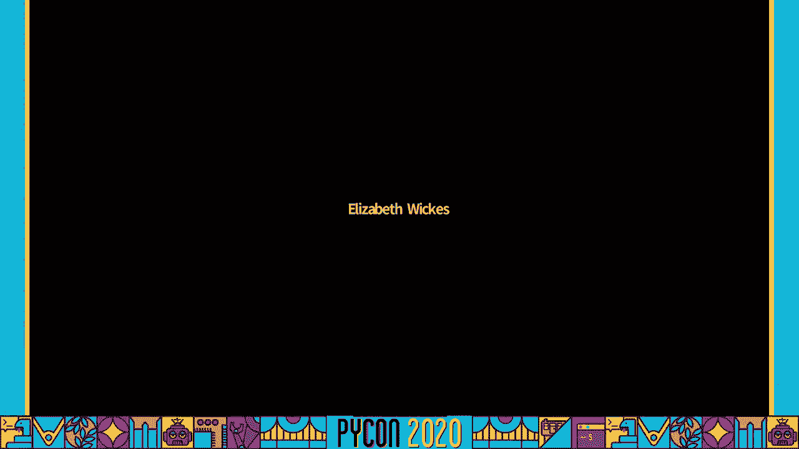

 I'm going to talk about it。 I'm going to talk about it。 I'm going to talk about it。

 I'm going to talk about it。 I'm going to talk about it。 I'm going to talk about it。

 I'm going to talk about it。 I'm going to talk about it。 I'm going to talk about it。

 I'm going to talk about it。 I'm going to talk about it。 I'm going to talk about it。

 I'm going to talk about it。 I'm going to talk about it。 I'm going to talk about it。

 I'm going to talk about it。 I'm going to talk about it。 I'm going to talk about it。

 I'm going to talk about it。

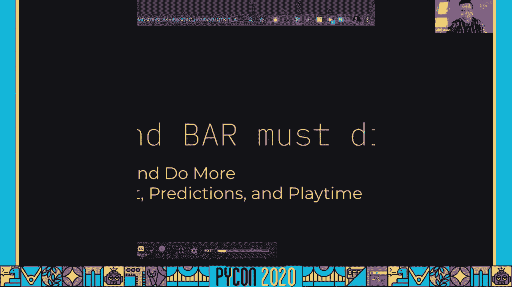

 I'm going to talk about it。 I'm going to talk about it。 I'm going to talk about it。

 I'm going to talk about it。 I'm going to talk about it。 I'm going to talk about it。

 I'm going to talk about it。 I'm going to talk about it。 I'm going to talk about it。

 I'm going to talk about it。 I'm going to talk about it。 I'm going to talk about it。

 I'm going to talk about it。 I'm going to talk about it。 I'm going to talk about it。

 I'm going to talk about it。 I'm going to talk about it。 I'm going to talk about it。

 I'm going to talk about it。 I'm going to talk about it。 I'm going to talk about it。

 I'm going to talk about it。 I'm going to talk about it。 I'm going to talk about it。

 I'm going to talk about it。 I'm going to talk about it。 I'm going to talk about it。

 I'm going to talk about it。 I'm going to talk about it。 I'm going to talk about it。

 I'm going to talk about it。 I'm going to talk about it。 I'm going to talk about it。

 I'm going to talk about it。 I'm going to talk about it。 I'm going to talk about it。

 I'm going to talk about it。 I'm going to talk about it。 I'm going to talk about it。

 I'm going to talk about it。 I'm going to talk about it。 I'm going to talk about it。

 I'm going to talk about it。 I'm going to talk about it。 I'm going to talk about it。

 I'm going to talk about it。 I'm going to talk about it。 I'm going to talk about it。

 I'm going to talk about it。 I'm going to talk about it。 I'm going to talk about it。

 I'm going to talk about it。 I'm going to talk about it。 I'm going to talk about it。

 I'm going to talk about it。 I'm going to talk about it。 I'm going to talk about it。

 I'm going to talk about it。 I'm going to talk about it。 I'm going to talk about it。

 I'm going to talk about it。 I'm going to talk about it。 I'm going to talk about it。

 I'm going to talk about it。 I'm going to talk about it。 I'm going to talk about it。

 I'm going to talk about it。 I'm going to talk about it。 I'm going to talk about it。

 I'm going to talk about it。 I'm going to talk about it。 I'm going to talk about it。

 I'm going to talk about it。 I'm going to talk about it。 I'm going to talk about it。

 I'm going to talk about it。 I'm going to talk about it。 I'm going to talk about it。

 I'm going to talk about it。 I'm going to talk about it。 I'm going to talk about it。

 I'm going to talk about it。 I'm going to talk about it。 I'm going to talk about it。

 I'm going to talk about it。 I'm going to talk about it。 I'm going to talk about it。

 I'm going to talk about it。 I'm going to talk about it。 I'm going to talk about it。

 I'm going to talk about it。 I'm going to talk about it。 I'm going to talk about it。

 I'm going to talk about it。 I'm going to talk about it。 I'm going to talk about it。

 I'm going to talk about it。 I'm going to talk about it。 I'm going to talk about it。

 I'm going to talk about it。 I'm going to talk about it。 I'm going to talk about it。

 I'm going to talk about it。 I'm going to talk about it。 I'm going to talk about it。

 I'm going to talk about it。 I'm going to talk about it。 I'm going to talk about it。

 I'm going to talk about it。 I'm going to talk about it。 I'm going to talk about it。

 I'm going to talk about it。 I'm going to talk about it。 I'm going to talk about it。

 I'm going to talk about it。 I'm going to talk about it。 I'm going to talk about it。

 I'm going to talk about it。 I'm going to talk about it。 I'm going to talk about it。

 I'm going to talk about it。 I'm going to talk about it。 I'm going to talk about it。

 I'm going to talk about it。 I'm going to talk about it。 I'm going to talk about it。

 I'm going to talk about it。 I'm going to talk about it。 I'm going to talk about it。

 I'm going to talk about it。 I'm going to talk about it。 I'm going to talk about it。

 I'm going to talk about it。 I'm going to talk about it。 I'm going to talk about it。

 I'm going to talk about it。 I'm going to talk about it。 I'm going to talk about it。

 I'm going to talk about it。 I'm going to talk about it。 I'm going to talk about it。

 I'm going to talk about it。 I'm going to talk about it。 I'm going to talk about it。

 I'm going to talk about it。 I'm going to talk about it。 I'm going to talk about it。

 I'm going to talk about it。 I'm going to talk about it。 I'm going to talk about it。

 I'm going to talk about it。 I'm going to talk about it。 I'm going to talk about it。

 I'm going to talk about it。 I'm going to talk about it。 I'm going to talk about it。

 I'm going to talk about it。 I'm going to talk about it。 I'm going to talk about it。

 I'm going to talk about it。 I'm going to talk about it。 I'm going to talk about it。

 I'm going to talk about it。 I'm going to talk about it。 I'm going to talk about it。

 I'm going to talk about it。 I'm going to talk about it。 I'm going to talk about it。

 I'm going to talk about it。 I'm going to talk about it。 I'm going to talk about it。

 I'm going to talk about it。 I'm going to talk about it。 I'm going to talk about it。

 I'm going to talk about it。 I'm going to talk about it。 I'm going to talk about it。

 I'm going to talk about it。 I'm going to talk about it。 I'm going to talk about it。

 I'm going to talk about it。 I'm going to talk about it。 I'm going to talk about it。

 I'm going to talk about it。 I'm going to talk about it。 I'm going to talk about it。

 I'm going to talk about it。 I'm going to talk about it。 I'm going to talk about it。

 I'm going to talk about it。 I'm going to talk about it。 I'm going to talk about it。

 I'm going to talk about it。 I'm going to talk about it。 I'm going to talk about it。

 I'm going to talk about it。 I'm going to talk about it。 I'm going to talk about it。

 I'm going to talk about it。 I'm going to talk about it。 I'm going to talk about it。

 I'm going to talk about it。 I'm going to talk about it。 I'm going to talk about it。

 I'm going to talk about it。 I'm going to talk about it。 I'm going to talk about it。

 I'm going to talk about it。 I'm going to talk about it。 I'm going to talk about it。

 I'm going to talk about it。 I'm going to talk about it。 I'm going to talk about it。

 I'm going to talk about it。 I'm going to talk about it。 I'm going to talk about it。

 I'm going to talk about it。 I'm going to talk about it。 I'm going to talk about it。

 I'm going to talk about it。 I'm going to talk about it。 I'm going to talk about it。

 I'm going to talk about it。 I'm going to talk about it。 I'm going to talk about it。

 I'm going to talk about it。 I'm going to talk about it。 I'm going to talk about it。

 I'm going to talk about it。 I'm going to talk about it。 I'm going to talk about it。

 I'm going to talk about it。 I'm going to talk about it。 I'm going to talk about it。

 I'm going to talk about it。 I'm going to talk about it。 I'm going to talk about it。

 I'm going to talk about it。 I'm going to talk about it。 I'm going to talk about it。

 I'm going to talk about it。 I'm going to talk about it。 I'm going to talk about it。

 I'm going to talk about it。 I'm going to talk about it。 I'm going to talk about it。

 I'm going to talk about it。 I'm going to talk about it。 I'm going to talk about it。

 I'm going to talk about it。 I'm going to talk about it。 I'm going to talk about it。

 I'm going to talk about it。 I'm going to talk about it。 I'm going to talk about it。

 I'm going to talk about it。 I'm going to talk about it。 I'm going to talk about it。

 I'm going to talk about it。 I'm going to talk about it。 I'm going to talk about it。

 I'm going to talk about it。 I'm going to talk about it。 I'm going to talk about it。

 I'm going to talk about it。 I'm going to talk about it。 I'm going to talk about it。

 I'm going to talk about it。 I'm going to talk about it。 I'm going to talk about it。

 I'm going to talk about it。 I'm going to talk about it。 I'm going to talk about it。

 I'm going to talk about it。 I'm going to talk about it。 I'm going to talk about it。

 I'm going to talk about it。 I'm going to talk about it。 I'm going to talk about it。

 I'm going to talk about it。 I'm going to talk about it。 I'm going to talk about it。

 I'm going to talk about it。 I'm going to talk about it。 I'm going to talk about it。

 I'm going to talk about it。 I'm going to talk about it。 I'm going to talk about it。

 I'm going to talk about it。 I'm going to talk about it。 I'm going to talk about it。

 I'm going to talk about it。 I'm going to talk about it。 I'm going to talk about it。

 I'm going to talk about it。 I'm going to talk about it。 I'm going to talk about it。

 I'm going to talk about it。 I'm going to talk about it。 I'm going to talk about it。

 I'm going to talk about it。 I'm going to talk about it。 I'm going to talk about it。

 I'm going to talk about it。 I'm going to talk about it。 I'm going to talk about it。

 I'm going to talk about it。 I'm going to talk about it。 I'm going to talk about it。

 I'm going to talk about it。 I'm going to talk about it。 I'm going to talk about it。

 I'm going to talk about it。 I'm going to talk about it。 I'm going to talk about it。

 I'm going to talk about it。 I'm going to talk about it。 I'm going to talk about it。

 I'm going to talk about it。 I'm going to talk about it。 I'm going to talk about it。

 I'm going to talk about it。 I'm going to talk about it。 I'm going to talk about it。

 I'm going to talk about it。 I'm going to talk about it。 I'm going to talk about it。

 I'm going to talk about it。 I'm going to talk about it。 I'm going to talk about it。

 I'm going to talk about it。 I'm going to talk about it。 I'm going to talk about it。

 I'm going to talk about it。 I'm going to talk about it。 I'm going to talk about it。

 I'm going to talk about it。 I'm going to talk about it。 I'm going to talk about it。

 I'm going to talk about it。 I'm going to talk about it。 I'm going to talk about it。

 I'm going to talk about it。 I'm going to talk about it。 I'm going to talk about it。

 I'm going to talk about it。 I'm going to talk about it。 I'm going to talk about it。

 I'm going to talk about it。 I'm going to talk about it。 I'm going to talk about it。

 I'm going to talk about it。 I'm going to talk about it。 I'm going to talk about it。

 I'm going to talk about it。 I'm going to talk about it。 I'm going to talk about it。

 I'm going to talk about it。 I'm going to talk about it。 I'm going to talk about it。

 I'm going to talk about it。 I'm going to talk about it。 I'm going to talk about it。

 I'm going to talk about it。 I'm going to talk about it。 I'm going to talk about it。

 I'm going to talk about it。 I'm going to talk about it。 I'm going to talk about it。

 I'm going to talk about it。 I'm going to talk about it。 I'm going to talk about it。

 I'm going to talk about it。 I'm going to talk about it。 I'm going to talk about it。

 I'm going to talk about it。 I'm going to talk about it。 I'm going to talk about it。

 I'm going to talk about it。 I'm going to talk about it。 I'm going to talk about it。

 I'm going to talk about it。 I'm going to talk about it。 I'm going to talk about it。

 I'm going to talk about it。 I'm going to talk about it。 I'm going to talk about it。

 I'm going to talk about it。 I'm going to talk about it。 I'm going to talk about it。

 I'm going to talk about it。 I'm going to talk about it。 I'm going to talk about it。

 I'm going to talk about it。 I'm going to talk about it。 I'm going to talk about it。

 I'm going to talk about it。 I'm going to talk about it。 I'm going to talk about it。

 I'm going to talk about it。 I'm going to talk about it。 I'm going to talk about it。

 I'm going to talk about it。 I'm going to talk about it。 I'm going to talk about it。

 I'm going to talk about it。 I'm going to talk about it。 I'm going to talk about it。

 I'm going to talk about it。 I'm going to talk about it。 I'm going to talk about it。

 I'm going to talk about it。 I'm going to talk about it。 I'm going to talk about it。

 I'm going to talk about it。 I'm going to talk about it。 I'm going to talk about it。

 I'm going to talk about it。 I'm going to talk about it。 I'm going to talk about it。

 I'm going to talk about it。 I'm going to talk about it。 I'm going to talk about it。

 I'm going to talk about it。 I'm going to talk about it。 I'm going to talk about it。

 I'm going to talk about it。 I'm going to talk about it。 I'm going to talk about it。

 I'm going to talk about it。 I'm going to talk about it。 I'm going to talk about it。

 I'm going to talk about it。 I'm going to talk about it。 I'm going to talk about it。

 I'm going to talk about it。 I'm going to talk about it。 I'm going to talk about it。

 I'm going to talk about it。 I'm going to talk about it。 I'm going to talk about it。

 I'm going to talk about it。 I'm going to talk about it。 I'm going to talk about it。

 I'm going to talk about it。 I'm going to talk about it。 I'm going to talk about it。

 I'm going to talk about it。 I'm going to talk about it。 I'm going to talk about it。

 I'm going to talk about it。 I'm going to talk about it。 I'm going to talk about it。

 I'm going to talk about it。 I'm going to talk about it。 I'm going to talk about it。

 I'm going to talk about it。 I'm going to talk about it。 I'm going to talk about it。

 I'm going to talk about it。 I'm going to talk about it。 I'm going to talk about it。

 I'm going to talk about it。 I'm going to talk about it。 I'm going to talk about it。

 I'm going to talk about it。 I'm going to talk about it。 I'm going to talk about it。

 I'm going to talk about it。 I'm going to talk about it。 I'm going to talk about it。

 I'm going to talk about it。 I'm going to talk about it。 I'm going to talk about it。

 I'm going to talk about it。 I'm going to talk about it。 I'm going to talk about it。

 I'm going to talk about it。 I'm going to talk about it。 I'm going to talk about it。

 I'm going to talk about it。 I'm going to talk about it。 I'm going to talk about it。

 I'm going to talk about it。 I'm going to talk about it。 I'm going to talk about it。

 I'm going to talk about it。 I'm going to talk about it。 I'm going to talk about it。

 I'm going to talk about it。 I'm going to talk about it。 I'm going to talk about it。

 I'm going to talk about it。 I'm going to talk about it。 I'm going to talk about it。

 I'm going to talk about it。 I'm going to talk about it。 I'm going to talk about it。

 I'm going to talk about it。 I'm going to talk about it。 I'm going to talk about it。

 I'm going to talk about it。 I'm going to talk about it。 I'm going to talk about it。

 I'm going to talk about it。 I'm going to talk about it。 I'm going to talk about it。

 I'm going to talk about it。 I'm going to talk about it。 I'm going to talk about it。

 I'm going to talk about it。 I'm going to talk about it。 I'm going to talk about it。

 I'm going to talk about it。 I'm going to talk about it。 I'm going to talk about it。

 I'm going to talk about it。 I'm going to talk about it。 I'm going to talk about it。

 I'm going to talk about it。 I'm going to talk about it。 I'm going to talk about it。

 I'm going to talk about it。 I'm going to talk about it。 I'm going to talk about it。

 I'm going to talk about it。 I'm going to talk about it。 I'm going to talk about it。

 I'm going to talk about it。 I'm going to talk about it。 I'm going to talk about it。

 I'm going to talk about it。 I'm going to talk about it。 I'm going to talk about it。

 I'm going to talk about it。 I'm going to talk about it。 I'm going to talk about it。

 I'm going to talk about it。 I'm going to talk about it。 I'm going to talk about it。

 I'm going to talk about it。 I'm going to talk about it。 I'm going to talk about it。

 I'm going to talk about it。 I'm going to talk about it。 I'm going to talk about it。

 I'm going to talk about it。 I'm going to talk about it。 I'm going to talk about it。

 I'm going to talk about it。 I'm going to talk about it。 I'm going to talk about it。

 I'm going to talk about it。 I'm going to talk about it。 I'm going to talk about it。

 I'm going to talk about it。 I'm going to talk about it。 I'm going to talk about it。

 I'm going to talk about it。 I'm going to talk about it。 I'm going to talk about it。

 I'm going to talk about it。 I'm going to talk about it。 I'm going to talk about it。

 I'm going to talk about it。 I'm going to talk about it。 I'm going to talk about it。

 I'm going to talk about it。

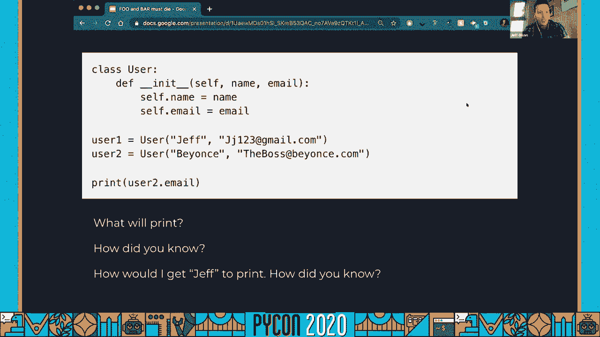

 I'm going to talk about it。 I'm going to talk about it。 I'm going to talk about it。

 I'm going to talk about it。 I'm going to talk about it。 I'm going to talk about it。

 I'm going to talk about it。 I'm going to talk about it。 I'm going to talk about it。

 I'm going to talk about it。 I'm going to talk about it。 I'm going to talk about it。

 I'm going to talk about it。 I'm going to talk about it。 I'm going to talk about it。

 I'm going to talk about it。 I'm going to talk about it。 I'm going to talk about it。

 I'm going to talk about it。 I'm going to talk about it。 I'm going to talk about it。

 I'm going to talk about it。 I'm going to talk about it。 I'm going to talk about it。

 I'm going to talk about it。 I'm going to talk about it。

 I'm hoping to share with you all a guide that I use to recognize missed opportunities for。

 context in my own examples。 In documentation。 I hate all of them。

 Here are my offerings for you to revise these things up。 I hate all of them。

 Here are my offerings for you to revise these things up。 I hate all of them。

 If you find yourself using names like my string or STR， you're definitely missing an opportunity。

 delay or context into your lesson。 Ask your students what their favorite song is at the moment and have the variable be lyrics。

 If you're not using the string for anything important anyway， why not？ The lists。

 Everyone introduces lists in documentation with a list of numbers which blows my mind because。

 you're about to use numbers because you're about to use numbers because you're about to。

 use numbers as the indices to look up those values。

 Seeing my list bracket zero and saying that four will come out is not nearly as intuitive。

 as seeing which one of these artists is my number one favorite artist。 You'll see in a second。

 Variables like X， unless you are literally talking about the X position， why not give it a name。

 for whatever value you're actually keeping track of？ Same with floats。

 When you ask students what's going to print when I do my list number two versus my artists。

 number one， students are far more able to wrap their head around and make good predictions。

 around an artist than they are around a my list。 That said。

 I also want to take a step back and recognize that not all context is created。

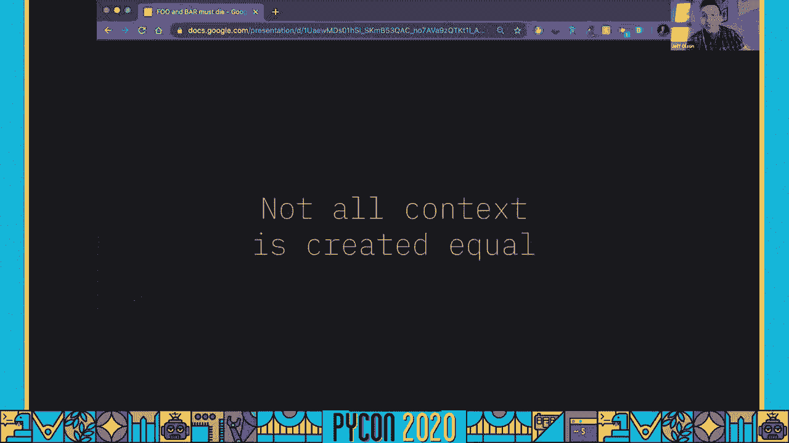

 equal。 Here is another example that I almost want to give credit to。

 I almost want to cheer for because they're definitely trying to let students use their。

 wraparound knowledge instead of checking it at the door。 In this case， we have a dog class。

 It has attribute one and attribute two。 It has a method that will let it describe itself， I suppose。

 But the core complaint I have is actually that just dogs aren't digital。

 The way that you make a dog is by giving two dogs time。

 You don't make a dog by running a class like this。

 I want something that is actually authentic in its real， real context。

 I also have lots of smaller complaints in gray underneath the words attribute one and。

 attribute two aren't inherently meaningful。 The fun method doesn't make a ton of sense。

 These variable names don't make a lot of sense。 We can dig into that later。

 The core piece that is missing is an understanding of why I might use a computer program to create。

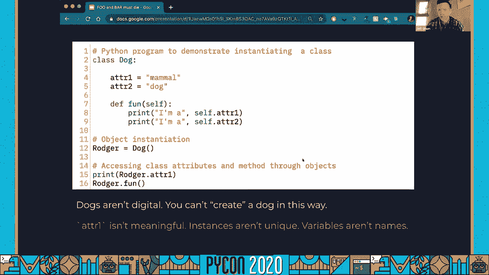

 a dog。 We will zoom out and talk about pseudo context。 For many of you， if you are an educator。

 especially in the math sphere， you definitely know this， word。 It is something that Dan Meyer。

 who is the founder of Desmos， uses to describe situations where。

 the task you are being asked to do or the tools you are being asked to use feel bad because。

 the context that they are layering onto it isn't real。 We will dig into this in just a second。

 But basically if you are asking an unnatural question， if you are asking students to do an。

 inauthentic task or if you are offering them an unhelpful tool to get that task done， you。

 may have offered them pseudo context。 I am going to give two examples。 Oh yeah， credit to Dan Meyer。

 Example one。 In January of the year 2000， I was one more than 11 times as old as my son， William。

 In January of 2009， I was seven more than three times as old as him。

 How old was my son in January of 2000？ I hate this problem。 For a couple of reasons。

 I will list them。 Why do we care about how old your son was in 2000？

 Why don't you know how old your son was in the year 2000？

 Who keeps track of ages in terms of multiples of other ages at certain points in time but。

 not the actual ages themselves？ Why is this the set of information you have？ And last but not least。

 I know because I am a math teacher that you want me to set up a， system of equations。

 I am not going to do that。 I am going to guess and check because that is the easiest way to get it done。

 Asking students to do something that isn't interesting to do and asking them to do it with。

 tools that are not well suited to the task is a good sign that in an attempt to dig up。

 a real world application you have found pseudo context。 Here is another one。

 I will go to chat for this one because I want to hear your answers。 I will go to the next one。

 I will go to the next one。 I will go to the next one。 I will go to the next one。

 I will go to the next one。 I will go to the next one。 I will go to the next one。

 I will go to the next one。 Logarithms， chaos theory。 These are great。 Yeah。 I love this。

 I love this。 These are amazing guesses。 I will let you keep going if you want but I will also review it to you。

 If you guessed area of a parallelogram you are correct。

 When you look at this problem one of the things you will notice is the map shows the。

 map of the state under a tornado warning。 Why would that be the question I would ask？

 I might ask is my house in this area but I will not ask how big is the area of the， warning。

 I am not at all sure if tornado warnings are issued in parallelogram shapes。

 That is a separate thing I have to look up。 I am not at all aware of this。 I am not aware of this。

 I am not aware of this。 Let's go back to object orientation to close out。

 That class I showed you led me to design a player class。 That felt more realistic to me。

 I thought maybe this will be relevant and meaningful。

 That assumes my students share my context and interests。

 It inherently is going to bias towards everyone who feels welcome in the field of， computer science。

 If I want to do my best to make a space that is welcoming and affirming for。

 individuals who have historically felt alienated or unwelcome in this space for， computer science。

 I need to be aware of the context I am layering on as I am trying to， make these predictions。

 I have three recommendations for real context that does not alienate some of your。

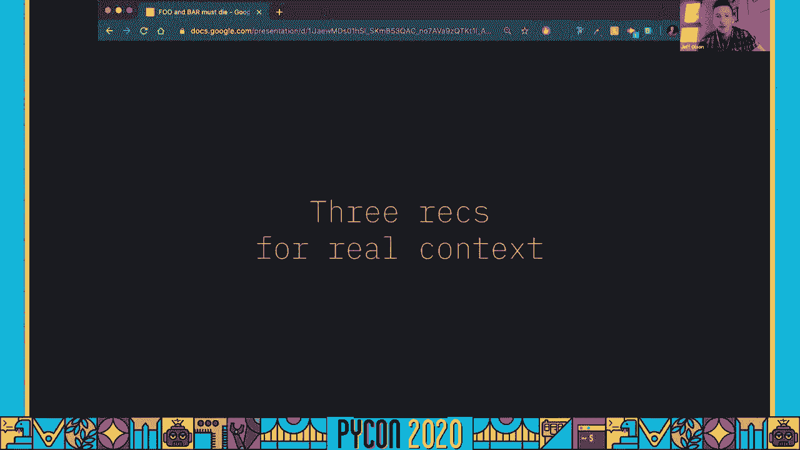

 students。 Number one， give them an authentic task。 In this case。

 the user class is concrete but not physical。 It scales way faster than individual variables and has a built-in exploration。

 of self。 Digging into all of these media pieces of object orientation while。

 knowing really concretely what each piece of this is probably supposed to do。

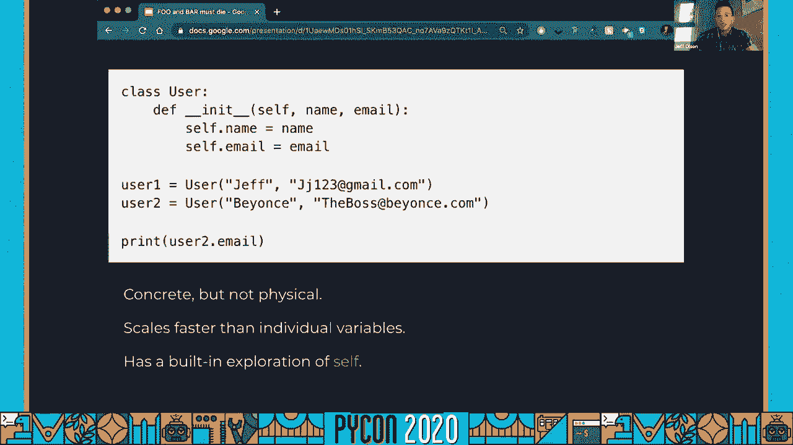

 You are ready to go。 This is the core of what I am hoping you walk away from this with is students don't。

 need simple examples。 They just need clear ones。 Next， please provide them authentic tools。

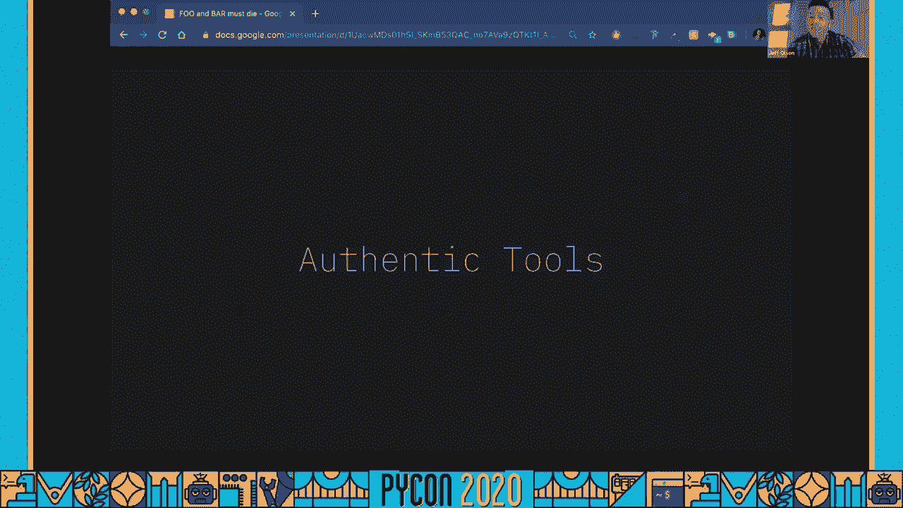

 This is an example of a visual I have in my mind。 The units are nonsense。

 This is just like an abstract representation of what I feel。

 Let's pretend the red line is just individual variables and the new concept is， object orientation。

 If you are trying to have them decide， wow， these object orientation pieces are going to be much better than。

 storing all of my information in individual variables， then you can't do that when you are asking。

 them to only work up to this first major line because the red。

 prior concept line is going to get them， to the right side of the line。

 You have to wait until you are asking them to do this level of task before introducing the concept on the blue line。

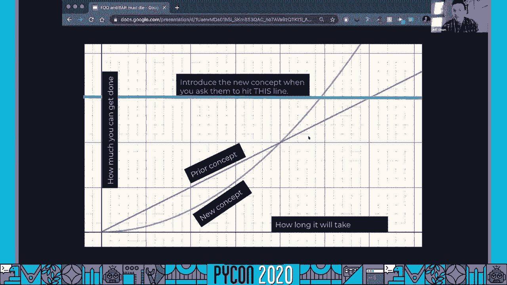

 You have to give it to them at a time when they can authentically make use of those tools。

 And then lastly， an authentic question。 The more and more I have worked on this。

 the more I realize that in computer science my go-to。

 predictions and justifications along those lines gets me so much mileage。 In particular。

 it also humbles me and gives me really good feedback when I presented the scenario that I thought would be really。

 obvious but isn't and actually doesn't make the case for why object orientation would be better。

 Y arrays are going to be better than individual variables。 So these are my conclusions。

 Ask students to study readable， intuitive code and then solicit predictions。

 Give them academic vocab only after they understand the utility of the thing that vocab is attached to。

 Every single word you choose， every string， every variable name。

 every integer is an opportunity to add context on to your examples。 Don't miss those opportunities。

 And last， not all context is real context。 So I have a few final thoughts。 One， this GIF。

 I know you probably can't see it over Zoom， but this is how coding feels。

 It's a lot of feelings compressed into a really short time on a loop over and over and over again。

 You will be excited and scared and overwhelmed and powerful。

 And so being aware that our students are in that whirlwind of emotions means that we can't change what's actually going to pop up when students Google something that's really hard。

 But we can teach our students in ways that affirm their outside expertise。

 And we can reassure them that when they see foo and bar in the wild and don't understand those examples。

 that that's the author's fault and not theirs。 Not every guide is made with beginners in mind。

 So thank you to the educators in this virtual room for reminding beginners that they do belong here。

 Thanks。 Awesome。 Thank you so much。 It touches on so many things that we've talked about before and then just have to keep hammering on because there's so much out there。

 And it's so hard to write these things。 We have plenty of time for questions。

 so please throw your questions in the chat and I'll read them out for you。 I'll just write it down。

 There's a very long question here。 I would try to do my justice in here。 I think they're actually。

 well， I for the recording， I need to read it。 So their computer science researcher。

 education researcher and how they teach programming involves representing real world objects as data and then operating on that data。

 They're thrown off by the dog example。 Can you explain a little bit better about how the dog example was bad。

 a bad or in thought， then take example。

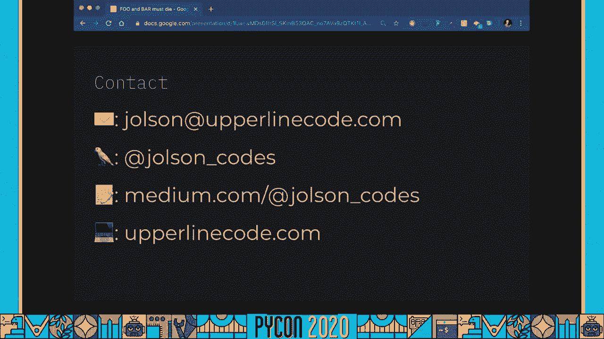

 And I'll talk a haunt。 I don't talk about my favorite singers in terms of list access in the real world。

 So why would I， why would a list of artists be better program and example than their presentation of the dog programmatically。

 Well， how do you， I use specifically operationalize authenticity authenticity with examples besides giving more meaningful variable names。

 Yeah。 That's a great question。 So I will， I will go back and I will lodge my complaints with the dog class just slightly more formally。

 I think that the dog is like halfway to context。 So to be clear。

 I don't think it is in atrocity in the same way that I think some of the earlier pieces that I showed like the my class。

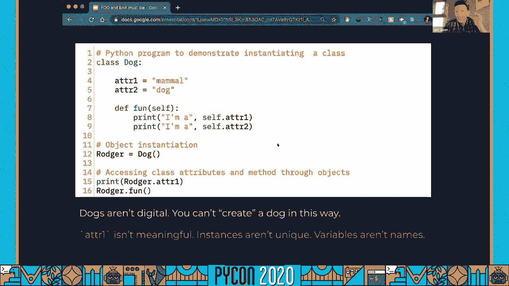

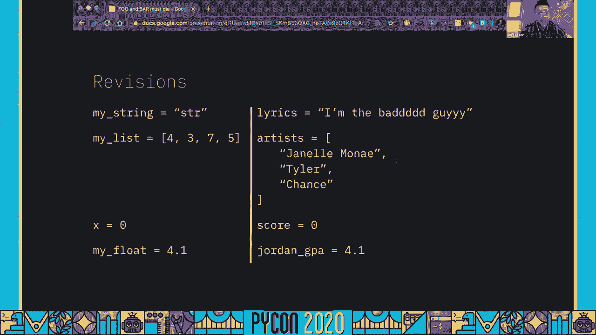

 It was， but in this situation， some of the frustrations or complaints I have are one， obviously。

 we need to name these better。 These attribute one and attribute two or just food and bar and disguise。

 And then to this fun piece。 It might be print profile is the name of this method that we're describing here or print description。

 And being aware of this， but then the reason that I actually think this is not useful is， is。

 is a little bit one step removed from that。 So one， like dogs don't exist in the digital world。

 But maybe if you wanted to make like a dating site for dogs and then dog profile would be an object that you might want to instantiate。

 And then the methods that would come along with it might include like ad dog friend。

 And so I'm seeing a lot of opportunities to take this like seedling of an idea and give it a lot more love and a lot more nourishment to。

 to seem way more authentic in terms of what we're creating。

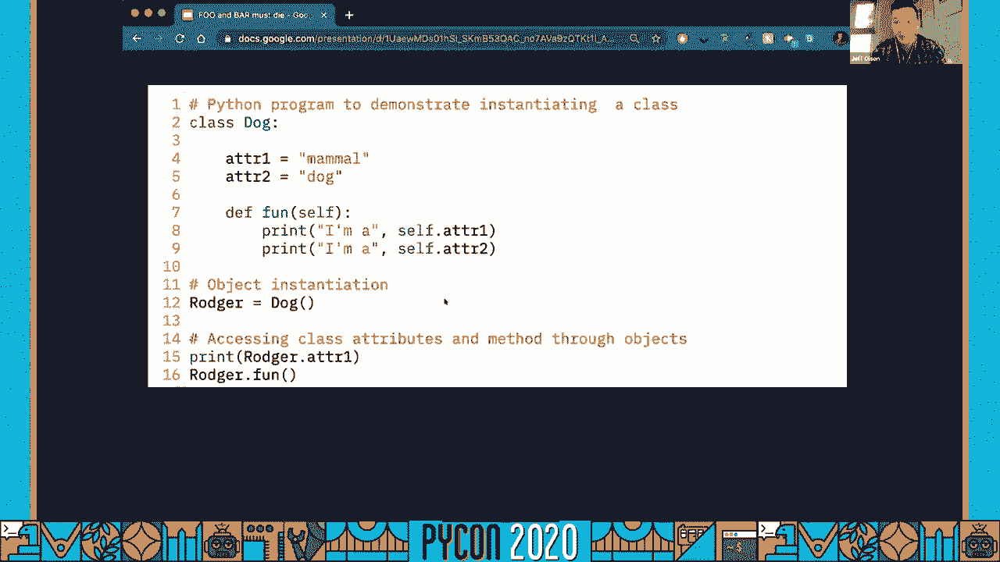

 In terms of comparing it to let's go to the list example because I thought that was a great question to。

 I don't think that necessarily the artists existing purely in a list of strings is the best representation。

 But if you're on day two of an immersive course。 And so far all they have are individual variables with individual dogs。

 And the idea that you might want to collect dogs， sorry， musicians。

 the idea that they might want to collect them all into one and have a list that you can then move up and down is really。

 really powerful。 So if I accidentally equated the list of artists as an alternative to the dog。

 I apologize， that wasn't what I was proposing。 I was more thinking about this as a step up from the collection of numbers。

 Thanks。 What's next。 Cool。 So it also depends on the context of the students as well， like。

 you know， K through 12 has varying different interests than scientific students as well。

 So question is， what， where do you suggest pulling concrete tangible examples from and if we should not。

 If you should not be using the natural context of what our computer systems may be。 Yeah。

 that's a great question。 I think the most common thing that I do as I go on is spend as much time as I can。

 querying my students every single day。 And the deeper I can immerse myself in at least an awareness of what their interests are and what they care about and what problems they're trying to solve。

 The better able I am to recognize what piece or what role code might play in that with students。

 And so if it becomes clear to me that my students are starting to latch on to environmental issues as like a core theme for a lot of them。

 then recognizing， Oh， I should find a way to layer on context that relates to that。

 I think that's the core of what I do。 Great， so the next question is。

 what do you tell your students when they see food and bar and examples online。 Find a new one。

 Almost always。 That's， that's kind of the core of it。 I tell them straight up。

 food and bar are examples for folks who already know several programming languages to not have to think very deeply about the programming。

 which they're learning right away。 That may be a little bit too dismissive。

 but I think for a beginner it's good to know that it's not their fault。 Yeah。

 sometimes the brute force things are important。 Yeah。

 someone reminds us that not everyone has a pet。 There's so many different contexts and situations that students can live inside of。

 It's， as you mentioned， like surveying students and having a conversation with them and making sure that the conversation lines of conversation and。

 communication are open to hear back what were I use laundry examples all the time。

 If for analogies and stuff because everyone has to laundry at some point。 So a question is what has。

 what has been useful in your own material development process towards making sure you have good examples and your content is accessible。

 What checks do you place on yourself。 Yeah， this is something that I learned from Danny Fenves。

 the founder and CEO of Upper Line where I work right now。

 which is at the end of every single interaction we have with students every single day no matter what。

 So if we're doing a 10 day course we'll do this 10 times in a row， we ask how was the day。

 Was it enjoyable， unenjoyable， just okay。 Was it easy， medium， hard。 What was the best part。

 What was the worst part。 And opening myself up to that feedback every single day is really scary。

 But it also gives me so much good， rich like feedback to dig into and recognize where I've made mistakes where I've made assumptions and so the first day that I did the player class for video games。

 And so to be honest it was better than the example that I was using before then it was a step in the right direction。

 but we also looked through and I realized， oh， this like very heavily skews along gender lines in a way that is not at all the type of teacher I want to be。

 So I need to reevaluate。 We have a couple of the few more minutes for questions。

 I just want to say that the carpentries which has been mentioned before has and I'm an extract or trainer for them as well has some really awesome feedback mechanisms as far as like leaving sticky notes for pros and cons and things。

 And some good strategies for helping using like your co teachers to help review those for you and provide an executive summary of feedback so you don't see it yourself。

 So one more comment that's come in， you can make a reasonable dog example。

 especially when it's a variety of meaningful context。

 Jeff's larger point of like who in bar die quickly is wonderful。

 But argue that goes for most experienced programmers as well as beginners。 Yeah。

 this reminds me of a talk I gave or last year towards the end。

 Some of a librarian by training and so I when I'm looking at the examples and how you search online for help especially from a kid beginners perspective。

 you have to keep in mind that there's different kinds of resources。 So there's， you know。

 for an experienced person who just needs to remember what was the name of that argument there or what's the order of arguments。

 They need a very different kind of example than a beginner and aiming to understand sort of not only what is the structure of a class and tax but why even do we do it and helping learners understand that there's different kinds of resources out there can help them give that permission to bail for something that isn't working for them。

 And can see another question is probably the last question we have time for。

 Can you elaborate on the simple example versus clear example。 Yeah。

 I so I won't have time to dig deep into it but one thing I did write a whole blog post on this so if you like really want to get deep into my thoughts。

 follow that medium link on the screen right now。 And then the quick summary and like where I realized that was when I taught functions because the first function I used to teach was one called say hello that printed hello and we thought of it as the hello world of functions。

 And what happened is students looked at that example and thought why you just taught me how to do in three lines what I used to be able to do in one。

 And so by typing print hello。 And when we actually moved it a step further to creating functions that are things like determine movie rating from age and then taking an age as a as an argument。

 And then students were much more able to understand why there might be utility here and so I used to think the harder a concept was the simpler it made sense to start and experiences taught me that students actually respond well to like pretty rigorous first examples as long as the context is clear。

 Awesome， thank you so much。 I'm thinking we get a nice emoji round of applause in the chat and we invite Piper to take the floor。

 I'm paper I made you co host so you can go ahead and so Jeff if you can turn off screen share。

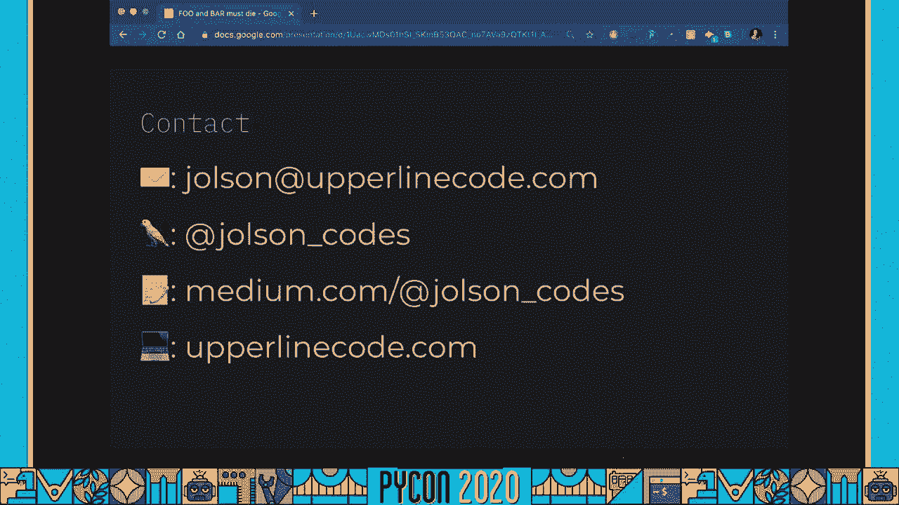

 I think you。 Okay， can everyone hear me。 Absolutely and we can see you too。

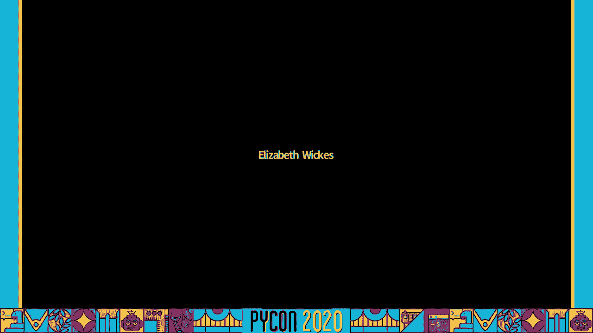

 Yay。 That is not screen one but we're going to go with it。

 Oh wait that is the wrong screen like I thought。

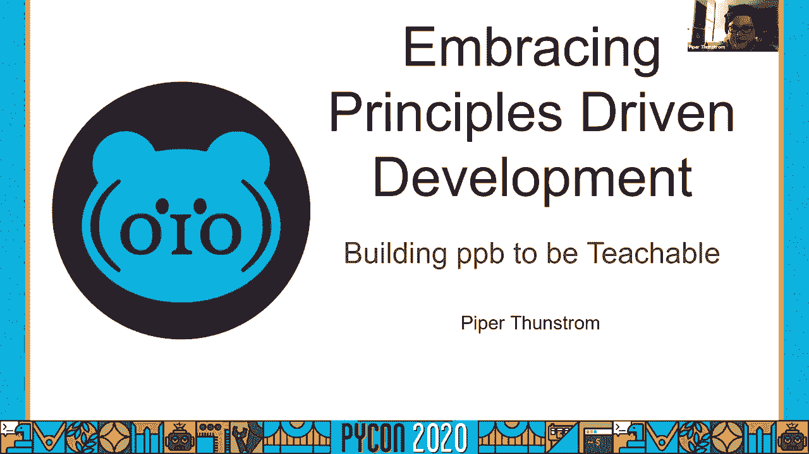

 All right， looks like your slide。 Oh， was on my side I was seeing my side of the thing chaired so let me try this one more time。

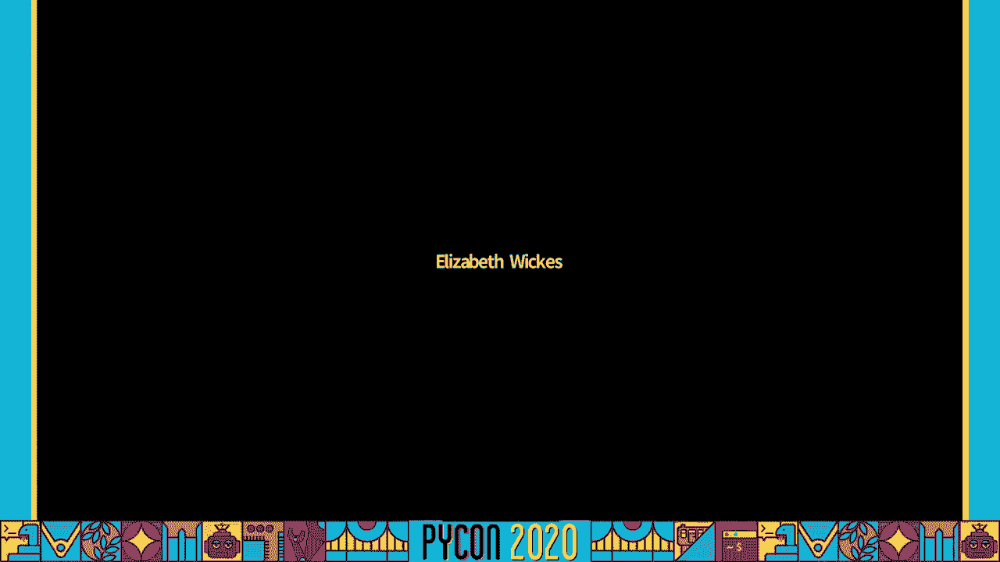

 Here we go。 All right， looks like a slide。

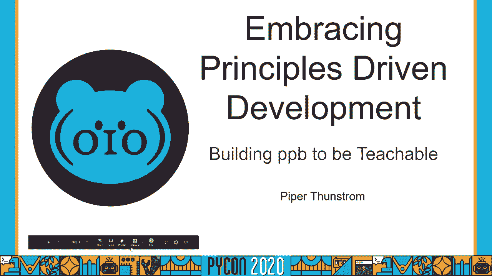

 I'm going to attempt to use the captioning let me know if that's working。

 It's working well worked well yesterday。 Okay， I'm going to use my talk so thank you for using it。

 All right， hi everybody。 I am extremely stressed about this talk since I have written it in a week。

 Have not practiced it nearly enough。 Thanks， thank you for inviting me to this Elizabeth and the rest of the organizers。

 This is actually my first education summit。 Talk this is my second time at the conference at the education summit。

 Really happy about that。 And I'm going to be talking about the fact that my project pursued by bear。

 Has embraced a principles driven development cycle where what I mean by that is that we are。

 The way we determine what we're going to work on what that should look like and who it's for is based on principles that we have defined。

 And how we got to this point， considering this started as a solo project about six years ago。

 So I am Piper， I am currently a software engineer at GLG。 I am the author。

 maintainer of the library。 If you want to tweet while you're here。 My Twitter handle is at PA。

 if you would like the notes to this talk， which I am。 Are available。 GitHub。com/PA， thunder。

 slash talk principles driven depth。 If you want to follow along that way。

 I tend to do this because it is easier for people to read sometimes so。

 And what I am talking about is pursuit by bear， which is an education focused game engine。

 We started this。 I started this as a solo project。 It was some time in 2016 actually。

 Mostly to reduce the amount of boiler pray。 I was writing for video games that I was writing for my own personal education。

 Primarily， I have used video games as a test bed。 In order to learn more advanced concepts as a software engineer。

 Which it was also one of the things I did as I started learning program。

 This was mostly as an adult， but after college， I started doing game development to learn how to program。

 I was actually a business major。 Actually part of that I wanted to cover as a software engineer and largely as a person。

 I am effectively self educated。 I was home schooled from about eighth grade。

 Did correspondence courses or something akin to unschooling。

 I taught myself whatever that I decided I wanted to learn。 I was do have a college education。

 but it is a business degree。 It's not an education or software degree。

 I mostly put that so that we have that context as I talk about all of this。

 I am self teaching myself how to reach these points as I go。 Since it was my personal library。

 the shift to an education focused library came through a number of things。

 Primarily it was a number of my close friends and one of my partners are educators themselves。

 I kept getting the question of like， "Hey， could you do this before education？"。

 After getting that question enough times， I started shifting my ideas and going， "Well。

 why couldn't I do that？"， I set out to develop this。 Sorry about this。

 Set out to solve that problem。 Mostly it was looking around at Python。

 which is the language I knew and the language that everyone was using。

 And figuring out how to make game development in Python easier was the goal one。

 Because for anyone who has tried teaching using Pi game。

 there is a lot of boilerplate to get to your first functioning game。

 And so that was the start of the thing。 But when I got to the point of realizing that I wanted to solve that problem。

 I also realized that it was important to at least keep in mind those goals because I have seen in my own projects like the thing I was shooting for shift a little bit just as I prototype。

 And I did not want that to happen to this project。 So the original principles existed。

 I actually wrote them in the read me when I shortly after I made the code public。 And the start。

 I'm going to admit that these， the original principles are flawed in a lot of ways。

 They are a mix of technical， cultural and aspirational principles。

 And they were basically a product of my perspective at the time they were written。

 And listed on my slide here， we can， I can talk through them。

 The principles were basically it had to be education friendly and that I didn't actually know what that mean meant when I started。

 I actually made the shift from education friendly to education focused as I started talking to more teachers and realized that lots of things can be friendly for education but very few tools try to focus on the educational use case。

 I also had to ask myself more than once like， what do I even mean by education friendly。

 I did know that from the start that PBB should be idiomatic Python all the way through。 Basically。

 if you write a game in PBB， it should look like other Python code。 It shouldn't look like。

 A good example， there is a game library out there called Ren pie。

 which is actually what we call a domain specific language。

 And it basically takes Python and reduces it even further to make the very。

 the thing they're solving much easier。 But it doesn't transfer to other Python code。

 And I didn't want that roadblock to be in my future。

 I focused around object orientation and event driven。

 This is one of my technically oriented principles。

 And it's been a huge place of conflict early on when it was just my project。

 I'd have game developers question why I would care about object orientation。

 And my big thing with this was more that because Python is object oriented at its core like understanding how Python works is one of those things。

 The event driven thing was partially because I find game programming easier with event driven stuff。

 And it was also a path to working with code on the web so transferring some Python skills to JavaScript and web event loops。

 I wanted it to be hardware library agnostic of fully aspirational at the time I was tightly bound to pie game。

 And even now the core project doesn't support anything but what our current backing is。

 Right now it's pie steel to it was previously pie game。

 And we are talking about going into the web in some time in the future and so we're not actually supporting all of those yet but like we are built to be able to do that kind of transfer。

 And the idea of fun was put on here。 It was actually added formally later when my eventual co maintainer made the comments。

 But it was。 I always wanted to have fun using my own library。

 And these were good for a solo project that mostly I had a handful of I'll call them consultants people that I talked to you like。

 okay， talk to me about the education case so that I don't make a bad decision now。

 It was good enough to keep me on track but honestly， I。

 these are not well defined and where they are well defined they're kind of。

 They're sources of conflict that I wanted to minimize。 So eventually， I met my co maintainer。

 We actually met at Python a couple of years ago。 She came on and built our the event system。

 the real event system before it was manually calling various things。 And one of the big questions I。

 Are existing principles and the design goals that we had set up for again divine mostly by teachers。

 Created conflict。 One of the big ones that I remember was the constraints that we had put on a certain feature I don't remember what the feature was。

 My co maintainer went the number of constraints we've put on this has made the engineering extremely hard。

 Nowadays， we understand that part of what we as the maintainers of this library are doing is doing all the hard work so that end users don't have to。

 But we didn't really have a way to say that before because we weren't。

 Our focus is we're not actually well put forward。 Then we would also have conflicts about trajectory because where I had been where I was mostly leading PPV as a focused thing。

 like aiming for education and being willing to make compromises to that end。

 Other engineers on the project weren't there for that they were there because they wanted to do the cool game thing or they were fixing our math libraries or things like that。

 They had different things that they wanted to see happen。

 And so choosing what to do next on the project was very hard to like define that in a way that was acceptable to all the stakeholders involved。

 And the last bit of conflict was that even as we were coming as a group to accept these principles as the things we did。

 We often would have to explain why we didn't want to discuss a specific potential solution。

 usually because it breaks one of the principles that we previously like that I was just discussing。

 And so that's where we were where we started。 Over time， these principles actually evolved。

 We didn't actually update the read me except for fun， mostly because the。

 the importance of making the API enjoyable was probably the first thing we identified as a true long term goal of PPV。

 It should always be fun to use。 It's one of our focuses。 Unfortunately。

 we didn't update the read me as these things were happening because really these conversations were happening in private in the maintainer only chat。

 or they were happening specifically between myself and other stakeholders。 And while I'm。

 I work really hard to try to keep like the things that I am synthesizing from multiple sources and putting them somewhere that still leaves a point of failure。

 And so this wasn't really acceptable long term to myself or to anyone else in the project。

 And as I said， we've made calls on these principles that were slowly modifying over time。

 without having a place to point like this is why we're doing it。

 And like making calls on unwritten things feels not great when you're a community driven project。

 And then really we decided it was time to synthesize all of these principles somewhere。

 And so I set out to write our new principles documentation。 PBB 0。8 came out last weekend。

 Part of that push was some better documentation and these principles documents that really define what we as a project care about。

 And so we're going to talk about those principles a little bit。

 I'm going to try to go quickly because really I want to show some examples of this。

 And so when we rearranged it。 The education focused idea。

 we realized really actually came down to an idea called students and learners first。

 This was that boiled down to its component part， the thing that we actually care about when designing our API。

 We want this suggests things like the discoverability of our API like how easy is it to like learn how to put different pieces of our system together。

 Part of it， we have gone out of our way to explicitly recognize that not all learners are necessarily students。

 I am self educated。 I didn't want to leave those kinds of people behind。

 And the other thing is that we're students and learners first but we're not actually exclusively focused on education anymore。

 Part of keeping PBB maintained and running long term we're going to need professional developers and hobbyist developers who are willing to work on it。

 And so input comes from learners teachers， those hobbyists and the core dev team on where our goals are going。

 So sometimes something we're going to work on is going to be a mostly internal API change that the core dev team needs to be able to continue working。

 but doesn't necessarily advance one of these other spaces。

 Another concept that we have nested under students and learners first is an idea called progressive revelation of complexity。

 We continually work on that first hour or two of working with PBB to make the step from the equivalent of our Hello World out to your first video game that you've designed yourself。

 We're trying to make that essentially a low grade curve is basically what I'm trying to say。

 We also have a concept that is mostly came from my co-maintainer that we refer to as no apologies。

 Mostly that is a we want our we don't want to have to like apologize for the way we designed the API。

 If we have to apologize we're going to go back and try it again。

 Our second idea is creativity without limits。 The only limitations we accept for PBB are the skill cap are the actual limitations of picking Python as our source language。

 If you can do it in Python you can probably do it in PBB。

 Whether it is performant is another question but that is all software。

 We are a code first game engine。 These are actually significantly rare。

 That is specifically because we care about learning PBB should be learning Python and vice versa。

 If PBB were a visual code editor first， you don't get that same progression from。

 oh I learned PBB and now I can read other code。 It's now I have to learn how to read normal code and then go back and that was one of the things we cared about。

 Additionally， we have we tried to support all of our users， which includes the teachers。

 the hobbyists and so on。 Fun。 Fun is still just a single word but it is actually a fairly complex idea。

 In the short term fun is the principle that guides our API design。

 We think that PBB should be delightful to use。 We are the maintainers especially our user experience developers first。

 We want our software to be pleasant to use。 We want to design it to be to encourage playful experimentation to be a test bed for trying out new things。

 And we want it community focused。 And radical acceptance is another one of those this is big and complex。

 I'm only going to go over it very quickly。 PBB is a living project change changes critical to this project。

 We have to be willing to go back and try again。 We want the input into PBB to be as diverse as possible。

 We I am actually really proud most of our contributors are women at the moment。

 This is not so much that this is what we focused on it's just we have done really well in allowing that。

 Diversity of gender of experience of。 You name it this is the kind of inputs we want to see in PBB。

 And we also include inclusion under that same heading with the like。

 People who are users are also part of our community and we don't want to。

 Push out new contributors the way some open source projects have been known to in the past。

 All right， so I'm going to go through three examples really quick。

 Mostly because I think principles are great but if you're not living your principles。

 They don't really matter in the long term。 And so these are basically a demonstration of how these principles I've just mentioned affect the way we code。

 So the first one is this is the hello world of PBB on the left is the old style。

 This is about as reduced as I could get it when we expose the game engine as the entry point。

 It was my co maintainer who suggested making it possible to do the thing on the right。

 The run function does a lot of magic for us it allows you to just throw things at the engine and it kind of works。

 But we because of this it is now two lines to hello world， which is。

 I'm not going to run the demo for you but this opens a window for you。 From there。

 We would actually。 Okay， without going too much farther here。

 Previous versions of PBB even before this old fashioned one that I show you here was much much harder hard enough that it was hard for me to keep the system in my head。

 which is why our new API even exists。 In general， this is kind of a sign of we've slowly identified the complexity in that first hour of a user's time and try to push it down through helper functions and sensible defaults。

 And these changes kind of took being unafraid to throw away code as I mentioned。

 even older than this old model there was another API。

 It was so bad I threw out the code base entirely and started over。

 Then we move on to a this is the minimum viable。 PBB game。 It is 12 lines of code。

 This has a object on screen chase the mouse。 And that's it。 That's all it does。

 To get from the previous example to here though you have to learn functions and how to define them you have to learn classes and how to define them。

 And you have to actually get an idea of what events do。 We're not totally happy with this step。

 We're it's missing a handful of defaults like there are things that we wish we could do to make this simpler and honestly having to write rewrite this same 15 lines of code。

 While it's a lot more than you would get for the same 12 to 15 lines of PPP or pie game code。

 It's still kind of tiring to do this over and over again for your early prototypes。

 So the living it part of this is we actually want to start including sprites that do some basic features like this out of the box。

 So you just add a sprite that it can follow an object you just tell it which object to follow。

 Move to a target you give it a position it'll move to that position mouse movement like this one where you just pass it you just add the class to the scene and you're done。

 Or you add an instance of the class to the scene and you're done。

 And this is about reduce that minimum functioning game to about four lines。

 which will be a step in the right direction。 Really again the goal is to provide that ramp from the most simple example to the next most simple example。

 And so on and so forth throughout the learning thing。

 And the last thing I want to talk about is project governance this is where a lot of the inclusion and community driven principles come into play。

 When I set out on PPP it was my project。 But shortly after it became a oh I'm doing something for a community。

 I knew I didn't want to be did BDF L。 When I created the PPP Python org。

 The PPP GitHub org excuse me。 I actually created a team that I called oversight a French essentially it is eventually going to be something equivalent to the Python languages Syrian committee。

 It's still just me we're changing that over time。 But even before the GitHub organization like。

 I didn't really make decisions in a vacuum I would build a prototype and put it in front of one of the teachers I knew and went look at this and tell me if this is the right track or here are a couple of alternatives I considered。

 I've always I've been a hobbyist games developer for。 Eight years。

 Felt their needs are kind of covered by the fact that there's a lot of them involved in the actual development。

 For me students are actually the hardest part to get feedback from。 I need help with that。

 We recently had our first advertise strategy meeting。

 In attendance there were two educators a grad student two core devs and a hobbyist game dev。

 This is small it was a last minute plan。 Mostly I want these meetings to continue to have that diverse first membership a mix of educators and students with the core development team。

 So that we can make our plans。 The results of that is we have just figured out the set of。

 Features that we want over the next couple of months。 We do about quarterly releases right now。

 Focusing on text rendering those default sprites I mentioned and some performance enhancements。

 I is a maintainer my new project is getting our tutorials up to snuff。

 And then we also got to talk about strategic projects。 Mostly this is around distribution。

 Things like a friend of the project is running a thing called the feet Python runner。

 Which they compared to the love 2d model if anyone is aware of that。

 We also have added PPP to the briefcase from be where cookie cutter so you can use briefcase to package PPP games will do further testing on that。

 And the other thing that is on our plate that we want to start in the next six months is getting pursued by bear on the web。

 That was a decision that was basically everyone at that meeting thought that was a thing we need to make happen。

 All right， so conclusions here。 Yeah， this is a solo project that became a community driven one。

 It's our principles that have helped us become what we are。

 I have made sure our principles doc is now a living document and not hidden in our heads。

 You can read it in the documentation。 And here's how you can reach me or the project。

 I don't know if we have time for questions Elizabeth。 We do have a couple minutes for questions。

 Okay。 I'm well willing to answer a few。 Yeah， so as usual if you have any questions go ahead and put them in chat and I'll read them out for the recording。

 While people are typing that up thank you so much that was really good。

 It was really fascinating to see all of the background and I love the like the principles of keeping the learners first and clarity is so important because we lose that and educators are so often just sort of fighting with whatever we can get and making it work。

 And you know developers are also doing the same sort of thing in the background and I love creating and fostering those connections between everyone here。

 So thank you so much for for showing and I love your minimum viable example is actually beautiful。

 I mean I don't know what the heck's going on but like I like oh okay I can make some sort of just sense of those functions in there。

 Yeah， just to go back on that。 In general because we're event driven。

 It was actually Meg Ray who made the final decision on what our event handlers look like。

 So on mouse motion on update like we have made it。

 All event handlers in PPP are on the name of an event and events are literally just classes so you can define your own in the system and figure out what the handler is going to look like just based on how you named it。

 Yeah， and it's super clear in the code and with your with your design perspective that you've had educators as part of this process。

 So there is a question in here are there any pool of resources that are off the shelf compatible to be used in PPT or PPP。

 Yeah。 So right now there are not that is my next six months to a year is making those exist。

 Unfortunately， I am not， I teach， I do， I am not an educator of that sense。

 I don't teach in classrooms I tend to do tutorials。

 So I want to get with some teachers who can give some input direction whatever I am willing to listen and try to build what is needed to make this something you can use off the shelf。

 Awesome。 Thank you。 So one more question。 I think this is the time we just have one more question。

 Is there， thank you for sharing the journey。 Is there a showcase page or a list of projects that have been built with this。

 Not yet。 Also on again the next six months to a year。

 We've been talking about a gallery of projects。 I do have a handful that I show people so if you want to reach out to me。

 I can link you directly to some of the projects I've been building。

 But we do have some hobbyist game devs like building some very cool things and we want to be able to show those off。

 Awesome。 Thank you so much。 Can we get in awesome chat show of applause for Piper for presenting。

 Thank you so much for my last minute invitation。 Thank you。 I know it's hard and you did great。

 Yeah， no problem。

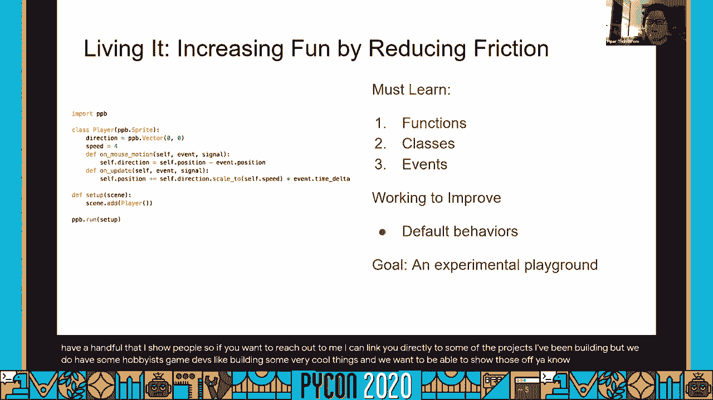

 Cool。 Okay。 Thank you so much。 I have so Matthew Jansen。

 I've gone ahead and made you a co host so you can go ahead and share your video audio and share your screen。

 We're going to be moving into our lightning talk around next so we have two lightning talks one from Matthew Jansen and one from Meg Ray。

 And then， either we have just open discussion for people or we have some breakout rooms we can actually use this time。

 So we might do that， but for now， let's get Matthew going and all right， take it away。 There we go。

 Can you hear me？ Yep， and I see your slides。 Awesome。 Great。 Great。 Great。

 I'm mute was hanging for a second。 So hi， I'm Matt Jansen。

 I'm the data analysis librarian at UNC Chapel Hill。

 First time attendee first time education summit and all that so I'm really happy to be here。

 And I've enjoyed all the talks so far。 And today I'm going to talk very briefly about a couple of the challenges we faced in our Python instruction the kind of situation we're in。

 And what we've done to to alleviate those challenges so far where we're headed。

 And I'm here to get feedback and thoughts from the attendees。 So first。 A bit of background。

 So I am part of digital research services。 We are a group inside the University of libraries UNC Chapel Hill。

 We are in a very kind of generic academic library setting where we have many librarians subject specialties in various areas。

 Our unit focuses on data。 So we're a group of data librarians。

 Most of us are librarians kind of by affiliation， but not by training。

 So I know there's been several other people with library backgrounds here so far today。

 And many people in a few people in our department are information science library science people。

 but we've also got geographers and American studies people and my backgrounds and stats。

 So we're a mixed department and we support data science across UNC。 So by that。

 I mean everything of data discovery through to communication results or visualization and all the things on the way。

 We have a pretty good strength in geospatial data。 So our big。

 our big tool sets are really Python and our GIS and tableau and of course some Excel be at backing all that up。

 So， as I said before， our audience is basically everybody at UNC and occasionally members of the general public。

 We are a public university so we don't close our doors to anybody。

 So we do occasionally get companies in from other parts of the area and stuff like that。

 And we keep our doors open to that， but it means we have a very。

 very broad audience for these workshops。 So a little bit about how we provide services to these groups。

 So we do workshops。 We do one-on-one consultations and we have walk-in services。

 We collaborate with a few other groups on campus to do this。 So we really kind of。

 we provide several different levels。 We think about it as a tier service setting of kind of a very broad instructional setting that's backed up by more in depth in person。

 and also scarce or resources for these one-on-one interactions。 So coming into our workshops。

 we really think about our attendees is falling into these three main groups that go on a screen。

 We always have a few people who kind of the extent of what they've done with data before is at the level of Excel functions。

 So they've done some sums， they've done some averages， they've done a VLOOKUP。

 And that's kind of where they are and they're looking to make that step over into something else that would be a little more powerful or give them new options。

 Then we get people from the two sides of the kind of stats and data versus program slash CS coin。

 So we get people who are coming over who know Java or something like that and want to use Python to do data science as it were。

 And we get people who know SAS or Stata and want to learn Python to get more of those computer science benefits。

 We get people from all over the place that come to these big open workshops。

 So now that I've said a little bit about our attendees， talk about our goals。 So as I said。

 we do these one-on-one consultations， so we really don't aim to have people come out of these with a full skill set。

 We really just want to get people to the phase where they can start to experiment a little on their own。

 And then we can serve them in that one-on-one setting and whatever they're doing。

 So that could be any variety of things。 I've seen more Python packages in this position that I ever thought I would。

 We really have a lot of little pockets of Python users in different departments。

 We have people doing psychological experiments with Python。 We have people doing genomic stuff。

 We have people doing various things with the web and， really just a lot of baseline， you know。

 pandas users and stuff like that。 And a lot of people are not well supported in their departments。

 So they're kind of isolated， the one or two people doing it in their department。

 and they need help from outside agency and we're kind of looking to fill that role。

 We're also hoping selfishly to replace some of the one-on-one meetings we've historically had to explain basic concepts。

 So somebody's in a class and they don't understand what， you know。

 what an object is or what loops are。 And we want to basically try to divert some of that flow into workshops。

 So that all impacts how we have structural workshops。 So into our challenges。

 So the first major challenge is this I've already harped on a fair amount variety。

 So we have so many different people， so many different backgrounds who show up to these。 We really。

 this isn't。 We don't currently have the capacity or ability to separate people into different groups based on their kind of use cases so we really want something that's going to hit a really wide variety of people。

 So to do that， we have over the years， strangulated towards multi-week workshops were kind of hidden in the friction of a full-time course。

 We're not， we're not there and these are all not for credit courses。 They're just workshops。

 But we need that multi-week structure to really let people digest things as they go on because this isn't one of their core course responsibilities。

 It's something that's extra for almost everybody's coming。

 So we have borrowed this open labs format from Columbia University。

 We first implemented this for R in 2017。 And we've been teaching that format in R since 2017 and in the past year and a half or so we've been implementing this into Python。

 So the basic model is that the first half of these workshops is the more kind of formal instruction time。

 The second half is open ended。 So we have will provide more kind of exercises and challenges for people in line with the content from the day will provide time for them to work on the project that made them come to these workshops in the first place。

 right？ The thing that's related to research or homework or also some extras。

 So we develop material around particular topics that are not of interest to everybody。

 but would be of interest to large subsets， things like geospatial data。

 text analysis stuff like that。 We don't have time for the main stuff。

 We've also in the recent past semester been angling towards what we're calling our Python zero redesign。

 So we're taking， we're taking a couple workshops at the beginning away from the open format to really focus on fundamentals。

 And we do that in more of a workshop format so that we can get those people。

 particularly the people coming from an Excel background or stats background。

 some of the basic just kind of computer concepts， things like file paths and stuff like that。

 and allow people who have more background and that。

 are in the open labs transition where we really focus in more on data。

 So the other challenge incumbent on all this is if we're going to do all this one on one help built into the workshops。

 we need more capacity。 So I've spent a fair amount of time in the past few years recruiting colleagues into this so many of my colleagues are our librarians。

 some have some experience with Python。 I'm generally the kind of I use Python the most of the people in my department but I'm not the only one using it。

 but I often get the but you're the expert pushback。 So we've fought that in a couple ways。 One， the。

 we've we've had a couple examples of staff who have really picked up Python and coming and taught one of whom is one of one of my colleagues who is a。

 who historically is very much traditional I brain among our department of helps people find data that is her primary role。

 And over the past couple years she has moved into helping with instructions she actually taught parts of the introduction to Python this past semester。

 And in that process she's really been very successful at connecting to the new learners right it gives a new perspective。

 And it adds diversity to the number of perspectives that we're coming from because we're getting more people of the people who are other people who work in the libraries who focus on different subject areas have these different different backgrounds to bring to the table。

 different perspective different examples that connects to our variety。

 The other argument is really the， the culture of growth idea so we as an organization are lucky that we have。

 we have communities of practice in the organization to allow us to use work time to build up skills and different areas。

 And within my department we actually have， we've devoted several hours each Monday to research and development time。

 So within that time， we， we have the flexibility to learn new things that's how some of my colleagues have been able to get involved in this。

 So that has really been crucial and something we've been advocating for at an organization level。

 So long story short。 I've been able to recruit several people into this。 So as of our previous。

 we started out maybe three years ago was the last time that I did this by myself。

 And we're now up to seven people who are teaching several people from within my department。

 We've also brought in people from outside the libraries and some graduate students who are either teaching or helping us develop materials or exercises。

 And it has really， really brought us a long way in terms of the diversity of perspectives that we're bringing and the impact we're able to have with these so that's it。

 Got my email up here。 If anybody has questions or feedback down the line。

 and I'm happy to answer questions。 Via chat， etc。 As well。 Excellent。 Thank you so much。

 Go ahead and throw your chat your questions in chat。 We have a couple minutes for questions。

 This is awesome。 Thank you。 I used to work in research data management， labor， and ship。

 I have a chapter on like how to build sustainability and data science education in libraries because it is hard。

 Yeah， yeah， so hard。 And there's so much need。 I know baby。 Okay。

 Several of our we've definitely had some other departments on campus that have fallen victim to poaching and stuff like that to sustainability angle。

 Didn't touch on your more chefs in the kitchen means that one chef disappearing doesn't doesn't really enterprise the unicorn chef has a problem with。

 As well。 All right。 Any。 I'll talk to you about unicorns after we're done。 Sorry。 All right。

 Any questions？ We have probably time for one or two questions。 Someone has to get the right。 So。

 I'm going to read the cut the questions just to have them on the recording。

 Even ever thought about streaming these streaming these workshops with slacker chat with remote participation。

 Yeah， so that that is definitely on our agenda at the moment we've we did a little bit of。

 Of our instruction remotely our Python series was done by the time everything shut down here。

 But I think we will very much be thinking about stream and remote participation for these things in the future。

 And I think in that direction it's it really kind of comes around to you can have a more global community of practice here and what bigger。

 bigger movements to tie into with that。 I think there's going to be a lot of interesting change on that in the next several months。

 We aren't sure if if we're going to be in person or anything in the in the fall。 So we may be。

 we may be doing that whether we like it or not。 But so far we've we haven't done it because it has been just an extra thing and we're trying to get things settled。

 And we like the in person thing of helping people troubleshoot just getting stuff installed。

 That's another big barrier to entry for a lot of people。 Right， thank you。

 I do want to refer to one throw up on YouTube the carpentries gave a presentation at the trainer some yesterday about their pilot program and guidelines for adapting their in person model to online。

 So there's a question here of how do you curious how you end up doing with learners who are interested in learning to code but have that six to eight week lead time before they can start seeing success。

 How's model been for keeping learners motivated and engaged building community， etc。 Mm hmm。 Yeah。

 So some of it is we really do push people towards towards having some sort of project where they can start to see something early on and we do。

 This is one of the places where we benefit with the ability to spin out one on one meetings。

 Many of the people who are coming here we we don't have we have a lot of people who who have an outside。

 You may have my pants I can fix this。 So they have an outside incentive and their professor says that their advisor says。

 Oh， you've got to learn this to do this and they're trying to do a specific problem。 The， um。

 it is a challenge though。 Retention is always a challenge to the semester we we try to we try to time this out so it's early enough in the semester that we don't。

 We always lose people at the end。 So we have to start these very early on。

 but not too early that people can't can't get in。 So that's that's definitely a challenge and I don't think we have a silver bullet answer for this。

 We've been trying to build community and that has been one of our big challenges here。

 And we've had some successes but we have some people who show up and you know。

 sit for the workshop and then leave。 We have some people who will talk to the neighbors。

 It's it's a particular challenge because we have faculty members and and undergrads and kind of sometimes getting those groups to intermix can be can be challenging。

 So I don't have a particular great answer for that。 Maybe else in the chat does。

 I think it's a universal problem and it depends on like the mechanisms and culture of each campus as well。

 Short course classes can help sometimes if it's available。

 So one last question is keep their GIS professional and can you please share some resources which can help develop a GIS data analytics application。

 So that's。 Yeah， that's a big question。 So I actually don't do as much with GIS as some of my colleagues。

 So one of the one of the people involved in our instruction is， is our specifically GIS librarian。

 So I often am kind of coming in on the edges。 I would say that one of the really neat places to get started for a lot of people coming in from a。

 From a general data use standpoint and Python is geo pandas。

 So it's just pandas kind of with some geographic stuff put on top of it so it kind of comes from a。

 Most people have used pandas before if you're working with data already and it makes things a little more familiar than going all the way into like looking at G doll or something like that。

 But there's， there's a lot of， unfortunately， there's a lot of different kind of ecosystems out there and GIS。

 So it can be a little challenging to know the right one or the easiest one for you or the best one to work with the ones that you're whatever system you guys are working in if you're a Q just shop or an Arc maps top or whatever so。

 Awesome。 Sorry。 Thank you so much for that。 And can we get a big chat round of applies and emoji show emoji。

 Thank you so much for that。

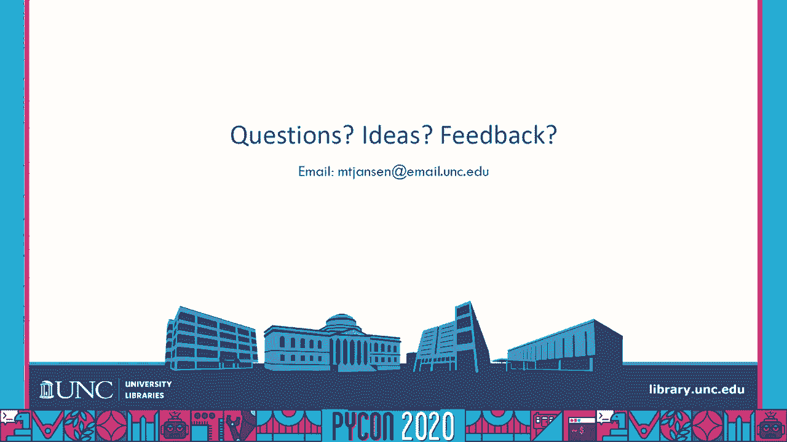

 And I will invite some Meg I've made you co host in here so you should be able to share your video audio and slides as needed。

 Excellent。 Thank you。 Hi everyone。 Hi。 Let me just get the slides called up。 There we go。

 Got it looks great。 Wonderful。 Okay。 I'm really excited to be joining today。 Unfortunately。

 I am only able to join for this lightning talks portion。

 But I'm excited to watch the recording and hear all the ideas that come out of this today。

 So today I'm going to talk about a new project that we're using hashtag Python EDU。 Last year。

 I was awarded one of the PSF Python and education grants to create a landing hub for education。

 As all of you know who are here， our education community is growing。

 We have a great sense of community。 And there are so many people asking for education resources。

 So this is a space。 How is by the PSF where we can continue that community throughout the year。 Oh。

 I got ahead of myself here announcing the Python education landing page。 So what will be on this？

 First of all， we want to incorporate what we're already doing。 Right。

 and make sure that that remains the foundation of our education community。 So like I said。

 this website， the projects founded by the PSF and it will be housed by the PSF。

 It will be an open source project。 So I am definitely looking for contributors。

 We'll talk about that a little bit more in a minute。 Oh， I didn't change this yet。

 So the timeline on this project has been changed with everything going on。

 The PSF and I have worked on a new timeline。 So there will be a teaser site that goes up in mid October。

 During the time between now and mid October， I'm going to be doing some preliminary setup。

 Basically， the old site is in Python too。 And it uses an open source library that I just I'm not sure how long it will be supported。

 So importing everything to Python three and using flask。

 And then I'll get a Dev server set up and we'll get the teaser site out and during that time。

 I'm hoping there will be people who are interested in that piece of it and want to jump on board to help with that in the summer。

 But then the next phase after that will be really about building out some of the fun tech features of the site and also building the content for the site。

 So hopefully we'll have a range of contributors on the tech site and on the education site to contribute to all of that。

 So what will be on the site， that edge Python education resources。 Everyone's like。

 why don't we have these in one place。 So we'll do that and we'll leverage some existing repositories that are being built in the wider CSF community。

 but of course focused on Python。 And we'll have some templates to help guide people who are creating open education resources。

 so that the resources are really usable by educators。

 We'll have some getting started guides for different types of trainers and educators。

 And we'll also have equity toolkit so that if you're training people from different populations who have been traditionally marginalized in computer science and in programs。

 or science and in programming， we'll have some toolkits to help widen our Python circle。

 which I'll talk about more in a moment。 And we want to use it as a space to really build community。

 keep this sense of community going year round。 So the new launch will be at PyCon 2021。

 And there is also a possible phase two， depending on how the。

 the popularity and reception of the site。 There are a number of additional features that we'd like to build out following the launch。

 Okay。 So this is really about keeping our circle wide。

 So who is the education site for everyone interested in Python education。 It's a global community。

 I am really in particular looking for contributors from around the world。

 so that it's not just me making it US centric。 This is a really important piece of it。

 This is for people who train in K 12 in higher ed and adults。

 It's for both formal like in classroom educators than informal educators。

 If you're a bootcamp or corporate trainer it's for you。

 If you do this as an independent contractor it's for you。

 It's for people who get paid for Python education and people who are volunteers。

 For people doing this informally you're a met you're mentoring someone at work。

 You're a parent and you want your child to learn。 It's also for people developing tools for ed check。

 especially coding education， Python education。 Product developers， programmers， et cetera。

 So I'm a filmmaker is for writers people writing books and tutorials and of course all types of learners。

 Okay， and then before I wrap up。 I'm going to work in K 12 education in New York City。

 And one thing I've been doing is supporting teachers and switching over to remote teaching。

 And in helping address equity issues in remote teaching。

 So because that's something that's been on my mind。

 I wanted to share with you some tips for keeping Python education accessible during this pandemic and beyond。

 So these are just some things I've learned over the last month in doing this work。

 So teachers more than ever are relying on free open education resources。

 And then a lot of companies who have paid curriculum and resources are making them available for free through this summer and that has made a huge difference。

 So if you have a product or curriculum， having it be free。

 If you have a cool thing that you're doing。 And you can turn it into an open education resource or you can throw it up online。

 That would help keep things accessible。 If you're doing any development of these types of tools focus on developing for coding in the browser。

 And for coding on tablets and phones。 I know that's not ideal。 No one wants to code on a phone。

 But that's some of our students， many of our students only link to their classes and their learning right now。

 And if you are somebody who posts open and did projects。 Hey。

 here's a cool thing that I did with the Raspberry Pi。

 If you can add any kind of what we call an education scaffolding rate any any kind of guidance for that project。

 That would really benefit learners and educators。 If you know any teachers。 And you can。

 especially at teachers who maybe aren't used to using as much technology。

 I've been telling people solve one problem that they have and teach them the technology that solves that one problem。

 So， baby steps。 Let's see if if you are able to donate technology。

 Donate it directly to a school or a community organization。

 There are still kids all over the country who don't have a remote access。

 And the local schools and local community are best equipped to know who those students are and get it to them。

 Right now we have a huge divide between kids who are learning online。

 In a very rich learning environment and kids who are receiving huge math packets that they have to work through on paper。

 And it's just really。 Increasing inequities。 And lastly。

 let's use this as an opportunity for all of us to be thought partners and think about how we want to change education in general for the better。

 Okay。 So， that's the end of my talk。 I would love it if everyone here wanted to join me as a contributor to the Python in education website hub。

 There are multiple ways that you can reach out to me and get involved。

 One is on the new mailing list。 Education at Python。org。

 This is specifically the mailing list for that website。 You can also reach me on Twitter。

 You can tweet about this with the hashtag。 And then you can also reach me directly by email。

 Just keep in mind there is some runway for us to recover a bit from current events。

 So things will be taking off slowly and then picking up mid summer。 All right。

 So I am happy to take any questions， comments， ideas， et cetera。 Wonderful。 Thank you so much。

 And thank you so much for putting that last slide in there about how to help right now。

 As I was debating about trying to run this virtually。

 I was thinking like this is the hardest time to run this。

 but the most we need this the most right now to make sure our community is coming together。

 helping each other share expertise and strategies and things。 So if you have a question。

 please go ahead and throw it in the chat and I'll read them out for the purposes of the recording。

 One thing I forgot to say is， if you are donating technology。

 laptops and Chromebooks are really needed because there may be kids who are connected by a cell phone or a shared tablet that could really benefit from an actual Chromebook or laptop。

 Excellent。 Thank you。 There's a couple of comments about Chromebooks in here。 So。

 as you're building this hub out， what is your greatest area of need。 So， two areas。

 One is the late summer， early fall port to Python three。 I've worked in flask before。

 but I haven't done a full port from two to three。 So anybody who has experience with that and is interested in that side。

 I really need the assistance。 And then the second one is the content。

 I really want the content to represent the entire range of our community and that's something that I can't do alone。

 So that's also a big need。 Super true。 Awesome。 Is it okay if I go ahead and make a slack channel about this project in the Python。

 edge of either slack。 Please do。 Yeah， we have gained about 20 people over the past two days。

 which in the trainer summit and between this。 So， and it's at least collecting people temporarily。

 And yes， and because that is so active， I definitely， we want to make sure that， you know。

 it works together and doesn't like replace that because it's such a positive active community now。

 Yeah。 And there's one comment from America as well that this。

 this is a topic that has come up in every education summit that I've seen。

 There is just this resource diaspora。 Little bit of pieces everywhere and it's so hard to understand audience and context and quality of the materials that are coming out。

 especially since there's like these big corporate actors coming into play。

 And I think the beauty of our community is we are so open access open source first。

 And I will post the Python educators slack invite back link back in the chat。 So。

 we still have time for more questions from that go ahead and three questions and will I get the slack invite。

 That was the wrong that thing did not copy。 There's the joint link there。 Yeah。

 And then Maggie and I had to discuss earlier like in the before times。

 Some some efforts to maybe start collecting things along the way and collecting them in a way that in six months time in the after after time。

 We can， we， although the metadata and the breadcrumbs will be there for us to like make sure everything is organized。

 And so， there's just another need I have some people contributors with database experience。

 Some of the more advanced features that we're hoping will be funded in the future。

 Need us to start with a foundation this year。 I don't know everything about that so I definitely need people who are doing that。

 My husband's I list is on board for that piece， but also needs other contributors。 So。

 right fully pointed out， I put the wrong slack invitation and so please do not join that slack that I just put in。

 Please join the one I'm about to put in。 No， no， no wants to hear the rankings of faculty。 Sorry。

 The home work collision。 So many slack groups now。 It all looks the same。

 I want to figure out how to boot people if I need to please don't join that slack group。

 I have also been super excited to see that this project it's you know it's grinding slowly because that's just the nature of these things but it is going and it is。

 Got。 It's got momentum and we need to keep the community connected and involved to sort of keep even small amounts of momentum going。

 Yeah， we have hope for the after times。 Yes， and so if you're interested now go ahead and sign up for the mailing list。

 reach out to me so I can put you on it。 Either by Twitter or email that way when things really do get up and running。

 I can one I can send you updates until that happens and two I can reach out to you and let you know as soon as things are moving。

 Great。 And right now I think those unfortunately the slack channel might be one of the easiest ways to that's great to do that to sense of face those things so yeah I don't know about getting a mailing list at some point but join them。

 It's imperfect。 But it's what we have so collect from all over and we'll do it。 Perfect。 Wonderful。

 All right。 I know all the questions for from mag。 I think we have a little bit more time and we still have some of our previous speakers。

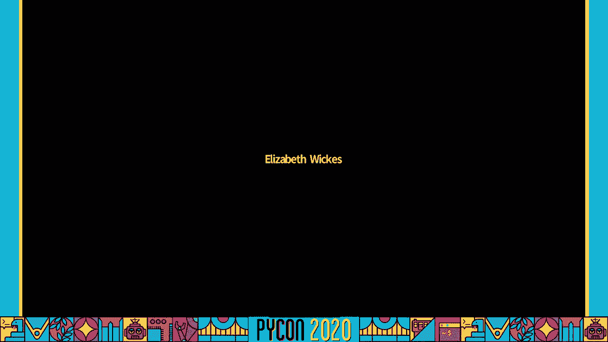

 Thank you。

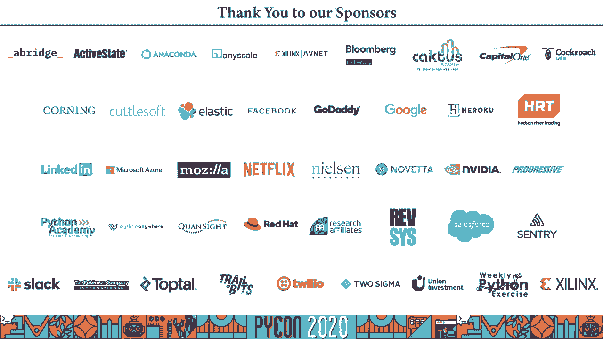