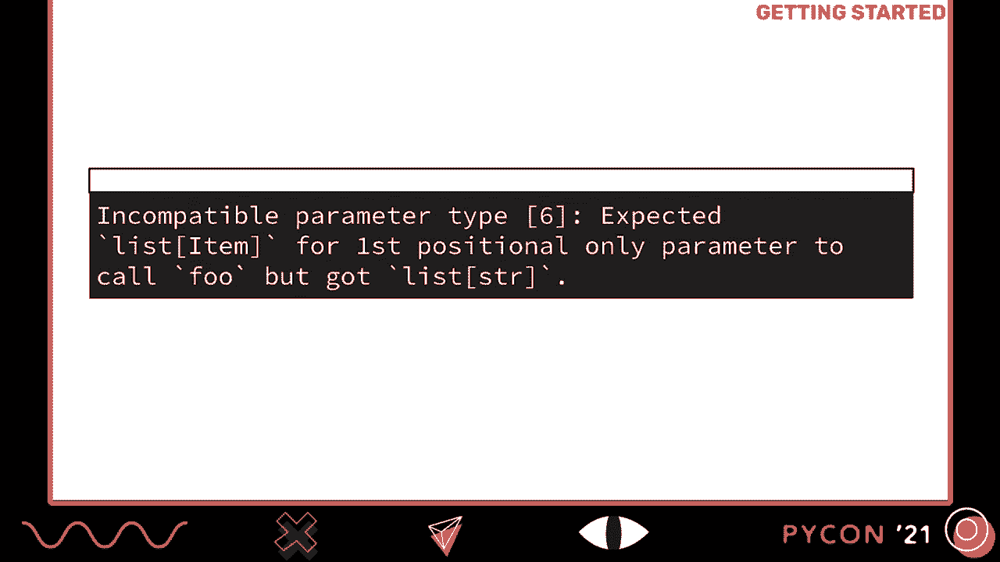
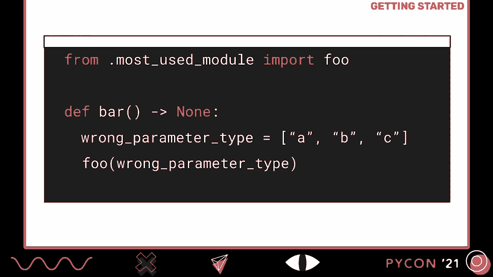
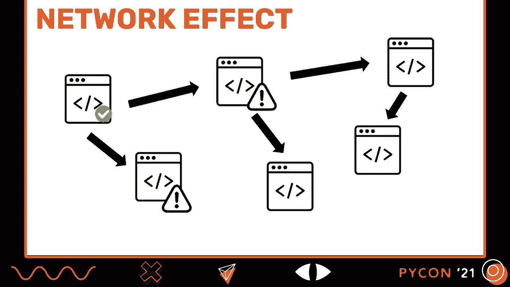
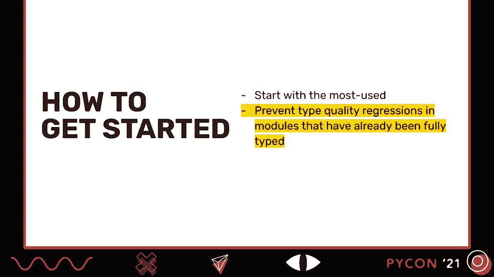
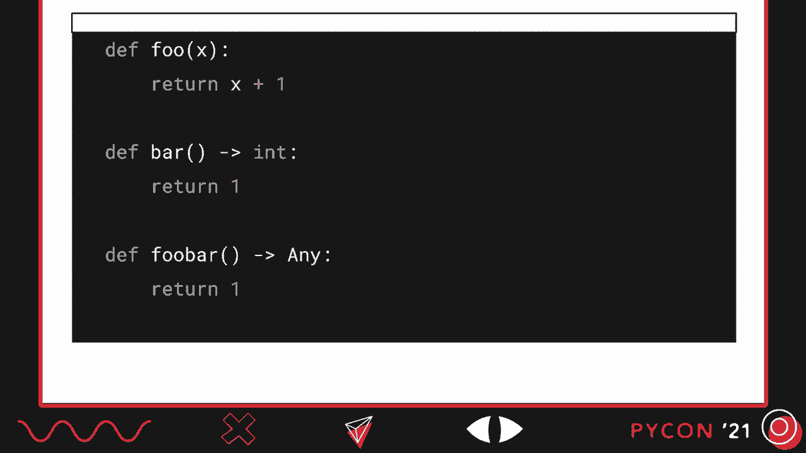
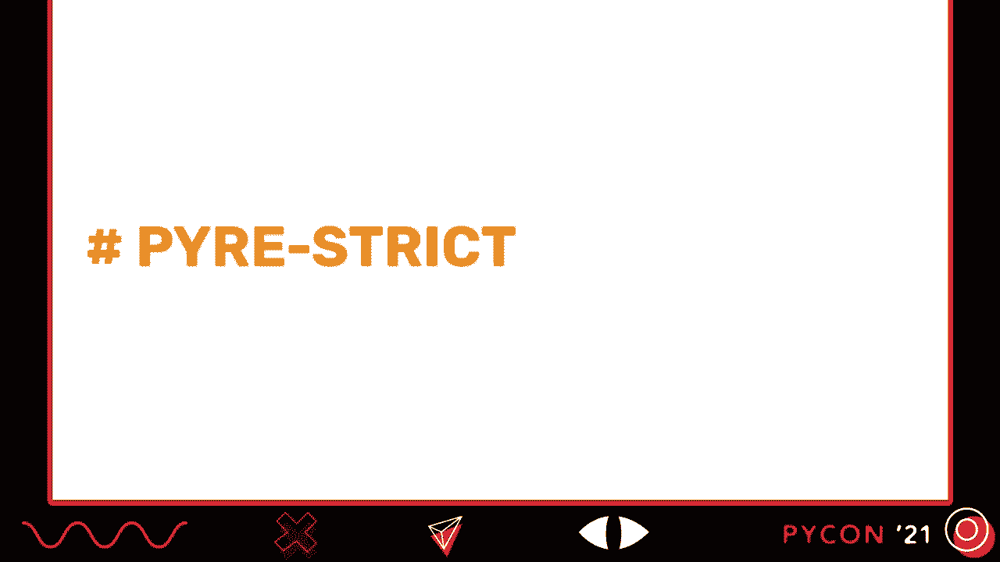
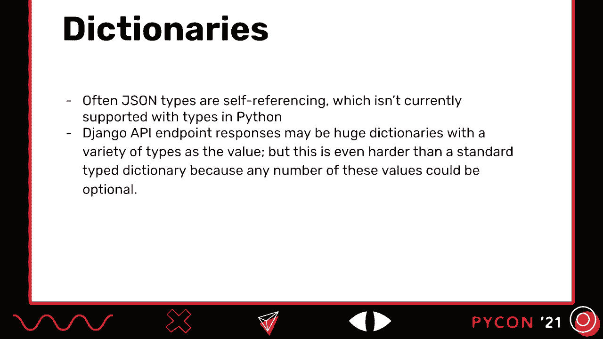
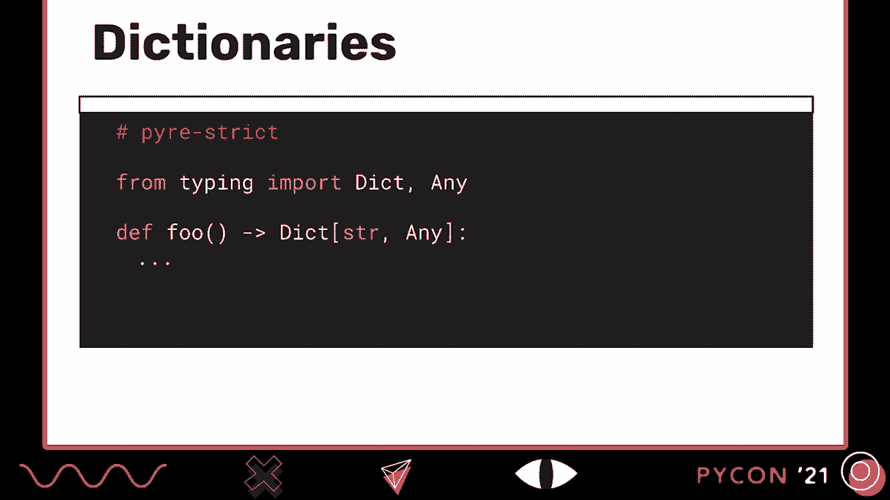
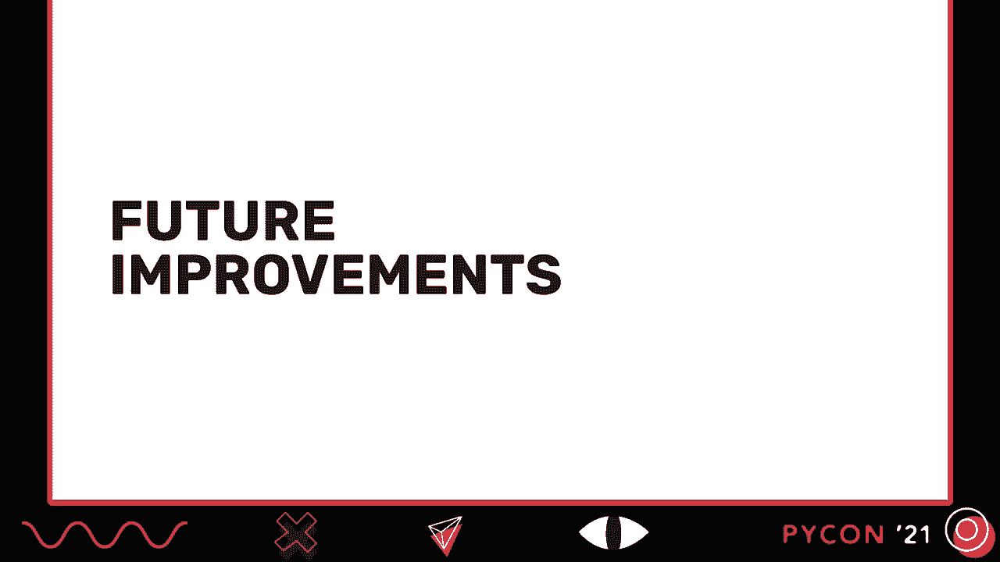
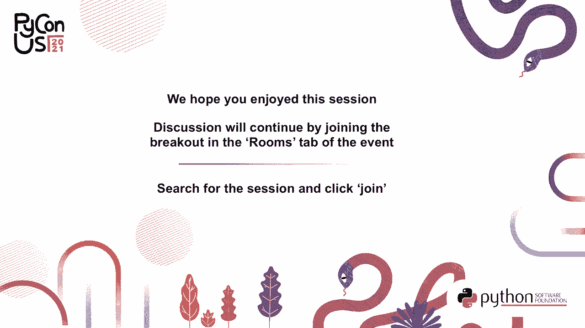

# P10：TALK _ Maggie Moss _ Gradual Typing in Practice - VikingDen7 - BV19Q4y197HM

 [Music]。

 Welcome to gradual typing and practice。

 My name is Maggie and I'm a software engineer at Facebook。 And for the past two years。

 I've been working on Pyre， which is a Python type checker。 Prior to that。

 I was working on the hack team。 I'm not familiar with hack， it's Facebook's version of typed PHP。

 So essentially， for the last three years， I've been working on adding types to dynamic programming languages。

 and building tools to help make that process smoother。

 And when I tell people that I work on adding types to dynamic programming languages。

 I get a very simple question and response。 Why would you do that？ And it's a fair question。

 I'm assuming that because you're here at PyCon， you know that there are many benefits。

 to building with a flexible dynamic programming language like Python。

 But the reality is that it does create room for bugs and errors that aren't possible。

 in a statically typed language like C or Java。 So no matter how many unit tests you write。

 you're probably still finding type errors in your logs。 And as your project grows。

 these issues can become amplified。 And it can be a frustrating spot to be in。

 You want the type safety of a static language without giving up all of the benefits from a language like Python。

 And one solution gets suggested at this point is， well， why don't we just rewrite our project。

 in an entirely different language， and that will solve all of our problems。

 And this is often an unrealistic solution for many reasons。

 Rewriting an entire code base requires a massive investment。

 Is there any way to get this without changing languages and rewriting an entire code base？

 So the answer is yes。 And Facebook has done this in the past。

 and we converted code from PHP to hack。 And then we've done it again by using a type checker for Python code。

 both at Facebook and at Instagram。 And having a typed code base has increased our productivity。

 We can make changes with more confidence， write more focused unit tests。

 and have fewer bugs reach production。 And we're not the only company that's done this。

 Stripe has built a type checker for Ruby， and if you've used TypeScript and Flow。

 they're designed to tackle this same problem in JavaScript。

 And the benefits of gradual types aren't limited to large projects with millions of lines of code and large development teams。

 Small projects can benefit from using a type checker too。

 So what we'll first go over today is what is gradual typing and what does it look like in Python specifically。

 We'll talk about why you should add types to your Python code and what benefits you'll get out of it。

 What tools and strategies did we use to get engineers to invest time in adding types？

 So what were the steps we actually took to get from almost no types to a fully typed Python code base？

 And finally， we'll go over some of the trickier code patterns that we've encountered。

 and what new features are coming to the Python type system。

 Before we get started with discussing strategies for typing your Python project。

 we first need to establish what gradual typing is。 So let's go back to basics for a second。

 In general， we can think of a type as something that describes a set of values that have a bunch of operations in common。

 For example， the type int describes a set of numbers that support operations like addition and subtraction。

 And a type error happens when we try to apply an operation to a value of the wrong type。

 Like if you try to subtract a dictionary from an int， for example。

 If you've written in languages like Java， C， or REST， you're familiar with static types。

 In statically typed languages， some or even all type errors are caught by a type checker prior to running the program。

 And usually this type checker is part of the compiler。

 and it's automatically run during compilation。 So in this example here。

 our variable x is defined as having a type integer。

 and we'd get an error if we tried to re-assign it to be a string。

 So not only would our variables need annotations， but so do parameters， return types。

 and attributes。 In Python， we're familiar with dynamic typing。

 where we don't have to add annotations to every single variable。 In this example。

 we can reassign food to be an integer or even a dictionary， and it just works。

 So the values have types， but the variables and the functions do not。

 In a dynamically typed language， type checking is performed during program execution。

 immediately before the application of each operation。

 And this makes it easy to deal with situations where the type of a value depends on runtime information。

 But the downside is that sometimes we get type errors that look like this， or maybe like this。

 And I'm sure you've had an experience where you've written some code， added a bunch of unit tests。

 confidently shipped it， only to find error messages that look like this in your logs。

 So what is a gradual type system？ The type system or not every expression is typed。

 It allows parts of a program to be dynamically typed and other parts to be statically typed。

 You can show which part is which by either leaving out type annotations or by adding them in。

 So does this look like in Python？ Un-typed expressions are assumed to be type "any"。

 which is defined as having every attribute and being a sub and super type of every other known type。

 And the key thing to remember with types in Python is that only annotated functions are type checked。

 So in this example， "fue" has a return annotation of type "int"。

 so the body of this function will be type checked。 In contrast， "bar" has no return annotation。

 so the body of it won't be type checked at all。 Un-annotated functions are assumed to take any and return any。

 What this means is that you can add static types where you can and where you need type checking。

 And as you add more annotations to your code， in other words， you increase type adoption。

 Python type checkers will surface more and more type errors。

 This means you can slowly add types to your code， but still get meaningful results as you go。

 There are several different Python type checkers that you can choose to use in your project。

 This is just a few of them。 In alt， type checkers implement the same typing specific peps。

 like "pep-484"， for example。 The general workflow is that you write some code and then you run your type checker。

 And this can be done via a command line tool， but often。

 Python type checkers will also surface errors in your IDE。

 And you'll want to set your type checker up in your CI job so that it's run on every pull request。

 This will help keep your project in a clean type checking state。

 and if it's in a clean type checking state， type errors that are surfaced are going to be high signal。

 I happen to work on PyRE， so parts of this talk will mention some PyRE specific features or tools。

 but most type checkers have implemented something similar。

 So the advice and approaches that we'll talk about can be implemented no matter what Python type checker you happen to be using。

 So why should you take time out of your busy development schedule to add types to your code base？

 To illustrate this， let's pretend that we're starting our first day on a new project。

 We're building a small online store。 Our task is to fix some bugs and some code that displays products on the home page。

 And as we're digging around in the code， we need to answer the question。

 "Does this function return none？"， And of course you could say， "Well。

 why don't we just check if it returns none when we call it and then we can handle this here？"。

 And this would work， but it does have the potential to get a little bit messy after a while。

 So let's go back to our function definition。 There are three return statements in our function。

 and we decide to use the process of elimination to try and answer this question。

 So we check out the function definition for get-latest products。

 and we're pretty confident that that one doesn't return none。

 But when we go to check out the function definitions for get-holiday products and get similar products。

 we find that those functions have multiple return statements。

 and then those methods have multiple return statements， and they're all kind of complex。

 and suddenly answering this question becomes time-consuming and tricky。

 We can go read all of these function bodies， but it becomes difficult to say for certain that no combination of states or inputs。

 will result in none being returned from this function。 So what happens if we add types？

 So here we've added two type annotations to our function。

 The first is for a parameter-shaped cart and the second for our return type。

 which is going to be a list of products。 And now all we have to do is run our type checker。

 And we might see an error that looks like this。 Incompatible return type。

 expected a list of products but got none。 So using a type checker。

 we were able to answer this question fairly quickly。 Yes， this function does return none。

 and now we know what return types need to handle when we're working with this function。

 So we've only really made two small changes to our code。 We've added two type annotations。

 and using a type checker allows us to be more confident about making changes and shipping code quickly。

 We have a guarantee in place about the inputs and return types that we need to handle。

 Whenever we add an annotation， we get the type checker to do the work of reading and understanding the code flow for us。

 We tell the type checker what we expect this function to do。

 and it guarantees that this doesn't come in conflict with our expectations for any other function or object。

 This means that when we go to write our unit tests。

 we can focus on the use cases that pass in these types without worrying about writing tests where this function would get something other than an art cart as an argument。

 The added benefit is that this works as built-in up-to-date documentation。

 One simply has to look at the function signature and know what types pass in and what types they'll get back。

 As we've said earlier， types function as built-in up-to-date documentation。

 They help you catch bugs before they reach production。

 and we can actually eliminate a whole category of bugs。

 maybe where the wrong type is passed in as an argument。

 which can make your unit test simpler and more focused。

 Most Python type checkers have an IDE integration。

 which means you can actually catch these type errors as you're writing code。

 and they often come with more powerful features， like autocomplete。

 A typed code base makes it easier to leverage development tools， like libcst and pisa。

 libcst is a code mod tool， and pisa can help you find security vulnerabilities in your code。

 So now that you understand the benefits of adding types to your Python projects。

 how do you actually get started？ Our advice is to start adding types to your most used modules first。

 and our second is that once you have types in your code base。

 you want to prevent against type quality regressions。 So let's pretend this is our most used module。

 It has one function， foo， takes in a list of items and returns a list of their IDs。

 So in order to type this， we only need two type annotations。 So this looks great。

 and we go to run our type checker， and we see a bunch of errors look like this。

 Incompatible parameter type， expected a list of items， but got a list of strings。

 And the first couple times that this happens， it's a bit confusing。

 because it's likely that these type errors are going to come from files that you haven't touched yet。

 So why is this happening？ Well， if we open up one of these files， we might see something like this。

 We're importing from our most used module， and bar has a return annotation。

 so this function has always been type checked。 But we do see that it's passing in a list of strings instead of a list of items。

 But why is this error only popping up now？ If you remember earlier。

 we said that any untyped expression in Python is assumed to be type "any"。

 which is compatible with a list of strings。 But now that we have our more specific type annotation on our parameter for foo。

 it's a list of items， that's not compatible with a list of strings。

 So our type checker is going to start raising error， which is good。

 We're going to catch more type errors。

 And this happens like a network effect。 So we have our modules， and they have their dependencies。

 and we add types to one of them。 And then we start to see type errors pop up all over the code base。

 And this is why you want to add annotations to your most used module first。

 because you're going to get the most type errors from the fewest annotations。

 Type coverage is nonlinear， and its benefits and guarantees。

 So typing these popular modules first is going to give you the most type coverage。

 It's probably more beneficial to spend time typing class that's imported all over your project than it would be to maybe type a script that you run once or twice a year。

 So now that we've added a few annotations to our most used module， we have a bunch of type errors。

 which is great。 We know where more of the type errors in our project are。

 But we may not have time to sit down and fix each one right away。

 So Python's type system allows you to suppress errors。

 And the way that you do this is just with a comment that says type ignore。

 and this will ignore any type error from the following line。

 The idea here is not to suppress every type error that your type checker surfaces。

 That would defeat the point of using a type checker。

 But it allows you to make incremental progress in annotating large code bases。

 So they're designed to be a temporary fix until you have time to come back and fix the underlying issue。

 In the meantime， the function is warnings to you and other engineers that， "Hey。

 there's an issue here。"。

 When you first get started and you turn on type checking in your project。

 you'll probably have a bunch of type errors even before you've added your first annotation。

 So we recommend that you set up your project and then suppress all of these initial errors that your project is in a clean type checking state。

 The new errors that you introduced will be high signal this way。

 We actually have a tool that will do this for you。

 so a pyre upgrade will suppress any type errors in your project。

 And it will also remove type ignores that are no longer needed。 So if you pip install pyre check。

 pyre upgrade comes with it。 Again， they're not meant to be there forever。

 and a part of getting to a fully typed code base is removing them。

 but they're a great tool to help you move from having no annotations to a fully typed code base。

 Our second piece of advice was to prevent type quality regressions in modules that have already been fully typed。

 So what do we mean by a type quality regression？ If you have a file where every function has a return annotation and every parameter is annotated。

 and so is every attribute and global， and someone comes along and removes some of these annotations or adds a bunch of code that has no annotations。

 we would call that a type quality regression。 So how do you prevent this？

 The most Python type checkers have options to configure various strictness settings。

 For this next section， I'm going to talk about how pyre has implemented this。

 but you could do something similar if you're using a different type checker。 Pyre has two modes。

 strict and default， and we've implemented this on a per file basis。

 So you're going to start with all of your files in default mode， and in default mode。

 functions that are missing， parameter， or return annotations are okay。 Just a reminder。

 functions without return annotations are not type checked in Python。

 If you do have a return annotation， the body of that function will be type checked as expected。

 and if you have an annotation that contains an explicit any， that's allowed。

 Once you get a file close to being fully typed， you'll want to flip the mode to pyre strict。

 In strict mode， functions that have a missing annotation will be an error， as will parameters。

 attributes， and globals that are missing annotations。

 Functions with return annotations are type checked as expected。

 but if those annotations happen to contain an explicit any， you'll also get an error there as well。

 So what you'll want to do is start with all of your files in default mode。

 and then as you get those files close to or completely typed。

 you'll want to protect that progress by switching them into strict mode。 In that way。

 engineers will get errors if they try and remove annotations or add an annotated code to them。

 Once you make progress typing your project， you can actually switch strict mode to be the default。

 and this means that if anyone adds a new file to your project。

 they'll have to add types to it as well。 This prevents regression after the initial types are added。

 as we've said。 You would see an error if you were to remove annotations or add an annotated code。

 And it also makes all changes required for a fully typed code base explicit。

 so you can look at your project and say 30% of our files in strict mode and 70% are in default mode。

 and know what you have to do to get to a fully typed project。 At Facebook and Instagram。

 we've converted several large projects from having almost no types to being nearly or completely typed。

 and in doing this， we found that some approaches are more effective than others。

 So the first thing that you'll want to do is get your teams and your engineers on board。

 and this involves explaining the benefits of a typed code base。

 So maybe you could start with its built-in up-to-date documentation。

 You'll have less errors reach production。 The list goes on。

 And the second part is to set and communicate type goals clearly。

 So we found that goals like we're going to type all of our Python projects。

 We didn't really have much success with， but if we said 50% of our functions are going to have a return annotation by May 15th。

 we were much more successful with those。 So setting clear goals that are actionable and time-based are essential。

 The second thing that we did was recognize contributions。

 So we actually have a dashboard that tracks individual contributions to type coverage。

 and it's been a good way to introduce a little bit of competition between engineers or between teams。

 and it resulted in more types in our code base。 We also ran what we called code love days。

 where we set aside time for engineers to add types to our code base。

 and in exchange we gave them Boba。 We also discovered that the Pyre team can be motivated with really anything involving Pokemon。

 So find what works for your team and then use it。 As well。

 we onboard new engineers with typing tasks。 Almost every engineer I've met at Facebook has done a typing task in their first few weeks at the company。

 They range from removing a type ignore or switching a file to strict mode。

 They're a really good way to get to know your way around a code base。

 and we've also had a lot of success with them。 I've mentioned that setting goals for type coverage is a key part of successfully typing a code base。

 and we have some recommendations for the order in which you tackle this。

 The first thing that you'll want to go on is reducing the number of functions without return annotations。

 and this often comes at the expense of adding type ignore comments to your code at first。

 but this is okay。 It can be accomplished two ways。 One。

 you add a bunch of return annotations to your code， or two， you delete a bunch of unannotated code。

 both will reduce the number of unannotated functions in your project。

 As you continue to increase type coverage， you'll want to then focus on strictifying as many files as possible。

 And as this continues to improve， you'll then want to set a goal to flip the default to strict。

 As you move closer to a fully typed code base， then you'll want to start setting goals on driving down the number of ignores in your code。

 And then finally， moving annotations or sources of any in your code。 So once you've set these goals。

 you'll also want to measure your progress。 And when working with teams to add type coverage to their projects。

 feedback we got is that it's difficult to push for type adoption without metrics。

 So if you pip install PyreCheck， you can then run Pyre Statistics。

 And this will give you information about how many return annotations， parameter annotations。

 attribute annotations， global annotations you have in your code。

 And it will also tell you how many files are in default versus strict mode。

 and how many type ignores in your project。 So we actually run this nightly at Facebook。

 and we log the data so that we can continuously track type coverage over time in our projects。

 And we can compare our goals， say if we wanted 50% of our functions to have a return annotation。

 we can then see if we're on track to meet it， if we're ahead or behind a schedule。

 We also use the output of Pyre Statistics for other things。

 So since it tells us which files are in default mode。

 we can use it to auto generate tasks to flip files in district mode。

 We can also do the same thing for removing type ignores。

 I would be lying if I said that every type annotation in a Python project at Facebook or Instagram was manually added by an engineer。

 We've also leveraged a few tools that will automatically apply types to our projects for us。

 So Pyre Infer is one of those， and it comes when you just install Pyre Check。

 It uses static type analysis to infer types in your project。

 and then automatically apply them to your code。 And we actually have a script that will run this daily on our Python projects on just one or two files and generate a small。

 easy to review pull request。 And it's a really great way to continuously move the needle on type coverage with minimal effort。

 We've also used monkey tape， which adds types based on what the value was at the runtime。

 So you can run monkey tape on your tests or runtime sampling。

 and then it will take those types and apply them back to your code。

 PyAnitate is another open source tool that you can use。

 and it inserts annotations into your code based on call arguments and return types observed at runtime。

 We've made a lot of progress typing our project Facebook， and it Instagram。 But like Python itself。

 types in Python are continually evolving， and there are several pups being written and proposals being made about how to make types easier to read and make Python code easier to type。

 There's a few code patterns that we've noticed cause friction when typing projects。

 and you might encounter these two as you get started in your own work。

 So empty containers can be a source of implicit any's。 So this is implicitly typed as list any。

 and the solution is just to always add a type annotation when you initialize an empty container。

 And some Python type checkers will actually error if you try and initialize without that annotation。

 Refining optional attributes can also pose a challenge。

 So here we can't blindly infer that the type of attribute is not optional after the check。

 since any interleaving column is at the attribute to none。

 So the solution would be to assign your attribute to a local variable and then do the check。

 However， this is a little bit verbose。 So in Python 3。9。

 you can use the walrus operator to help make this check a lot simpler。

 It's common to pass around dictionaries of data with an unclear structure in Python。

 But often JSON types are self-referencing， which isn't currently supported with types in Python。

 And Django endpoint responses can be huge dictionaries with a variety of types as the value。

 And this is harder than a standard type dictionary because any number of these values can be optional。

 So as a result， this is an exception to the rule that any's are not allowed in strict mode。

 So even though dict string， any contains an explicit any， it's a valid annotation in strict mode。

 As I said earlier， types in Python are continually evolving。

 There are currently a few proposals about how to simplify types in text and make annotations less verbose and easier to read。

 One of these is new syntax for union types。 Instead of having the import from typing。

 you can just use the pipe operator。 And this will be available in Python 3。10。

 There is also a proposal in a similar vein to improve this syntax for optional types。

 This one is still in the early stages and there's no guarantee that it will make it into the language。

 But it's a good example of some of the work that's currently being done to improve types in Python。

 There are also proposals about new syntax for callables and new features or keywords for type dictionaries。

 There's a lot of work being done to continually approve types in Python。

 So before we wrap up， let's recap some of the things we learned about gradual typing in practice。

 So gradual types can act as up-to-date documentation and reduce the amount of type errors that reach production。

 In order to type your project， you'll first want to get your teams on board and set clear time-based goals。

 As you get started， type your most used modules first and make sure that you measure your progress。

 If you're interested in learning more about types in Python， specifically at Facebook。

 several Facebook engineers have done talks about typed Python。 So Carl did type-checked Python。

 Peter has done types， deeper static analysis in you。

 And Shannon did leveraging the type system to write secure applications。

 I look forward to answering some of your questions。 Thanks。 [BLANK_AUDIO]， [BLANK_AUDIO]。

 [BLANK_AUDIO]， [BLANK_AUDIO]， [BLANK_AUDIO]， [BLANK_AUDIO]。

