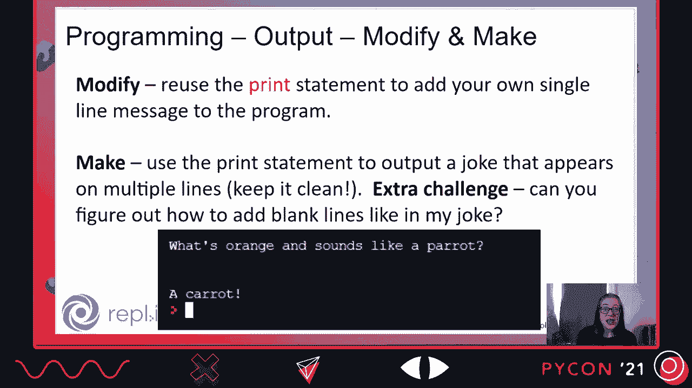
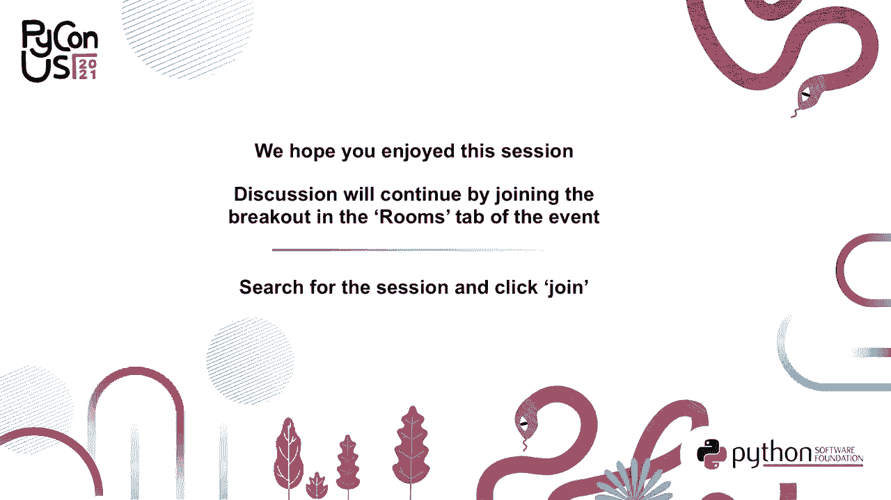

# P11：TALK _ Meg Ray _ Python_ The Next Generation - VikingDen7 - BV19Q4y197HM

 Welcome to Python， the next generation。

 Or as fans fondly refer to it， P， T， and G。 Hi everyone， I'm Meg Ray and you can find。 me an @teach_python on Twitter。 So I started out as a special education teacher and my experience learning to program for the。

 first time at a local Python meetup was the impetus to shift gears of my career into computer。 science education。 So now I teach computer science education， I research computer science education。

 I'm， an author， instructional designer， and educator。 I will be available in the chat for the whole presentation so please feel free to put any。

 questions there。 So today I'm going to go over some of the current trends in Python education efforts。 You'll be introduced to the brand new Python and education website， gain a few strategies。

 and resources for teaching， and connect with a whole community of Python educators。 So let's start with what's happening now in education。

 So let's take a look at some trends in general computer science education that are influencing。 how Python is used in education。 So the first is the increase in computer science for all initiatives。

 Now this can happen on a national level or if you're somewhere like the US it could。 be happening on a state and more local level。 But what these initiatives are is a requirement that every student receive computer science。

 instruction whether that's a dedicated class or whether it's integrated into another subject。 area but that every student received this instruction during the regular school day。

 And so this is a shift towards equity because it ensures that it's not just an elective。 where students can opt in or they have to choose between computer science and something。

 else but rather that every student receives a baseline of exposure and understanding to。 the field of computer science。 And then the other trend is that there are shifts in computer science 100 classes are。

 Intro to Computer Science at the college and university level。 So just briefly there's an increase in CS for non majors courses and some universities。

 are even starting to require CS as a general graduation requirement。 And then there's also some shifts in rethinking in Intro to CS for majors at some universities。

 as well。 So in both of these cases Python is being used itself as a tool for equity。 And what I mean by that is that selecting Python as the programming language to introduce。

 computer science is a deliberate choice to support equity for all learners。 So let's take a look at why that is。 So this trope might make you grow and the whole Python is the same thing as pseudocode thing。

 And we could get into a nuanced discussion about that。 But instead I just want to focus on how this feature is actually a strength of Python and。

 the driving force behind Python's popularity in education。 And it is popular。 As a matter of fact。 I had a teacher make a comment to me once about how establishment。

 Python is because it's just so ubiquitous in the secondary education space。 So let's take a closer look at why this is the case。

 The first piece that we've been talking about is readability。 So we know that reading and tracing code contributes to students understanding and programming。

 And Python is very readable for students and teachers。 There's also a lot of availability of educational resources that are out there online for teachers。

 to find。 Python is flexible。 Students can create projects from different domains。 Teachers can use different programming paradigms。 So there's a lot of flexibility in its use。

 Also because it is popular in industry， using industry， especially data science， students。 are very drawn to that。 They want practical skills。

 They want to feel like they're doing something real， which they are。 And teachers are also drawn to that because they feel like they're giving their students。

 valuable skill。 Next， it is highly compatible with another trend in education。 which is data literacy， entering to push data literacy。

 So teachers can teach programming with Python at the same time as they're increasing data， literacy。 And finally， there is a really strong and active community around Python。

 Now that is part of the reason that so many educational resources are available。 But it's also something that in the education world， it's not really， it's sort of below。

 the surface。 People aren't aware of it。 So we're getting a huge influx of Python users。 And they're coming from all different places in education。

 First we're getting students who are required to learn Python in school， right？

 So a whole bunch of secondary school students are six to 12th grade。 Also teachers。 So this isn't just computer science teachers。 So we need computer science teachers so quickly that we don't have time to wait for new CS。

 teachers to come up through the pre-service pipeline。 And a lot of times there's not even a pathway to train those teachers from pre-service。

 So many teachers of other subject areas are learning to program in Python。 Also because of all this。 after school programs， camps， things like that， are of course increasingly。

 more popular for programming。 So we're getting students from that。 We talked about the trends at the college university level。

 So getting people from all different majors now for that。 And then because of all this。 all of these things are driving the production of a lot， of online education resources。

 which is increasing the likelihood that an independent learner。 is going to come across Python materials online。 So these are some of the areas and this new generation of Python users is more diverse。

 in every sense of the word than ever before。 And as a community， we are also becoming more diverse。 And I would say that even the attendance of Python US 2021 does not reflect the same demographics。

 as this new generation of Python users。 So as a community。 we have many opportunities now and in the near future to engage this next， generation。

 And we want to move them from， yeah， I programmed in Python once to active and contributing members。 of the Python user community。 So considering everything that we've talked about。

 about this next generation of Python， users， as a community。 we have to think about how will we connect them？ How will we widen our circle？

 How will we welcome and engage this next generation？

 So I think that will require some community discussions and community thinking around。 what we want to stop doing as a community， what we want to start doing as a community。

 and what we should continue to do as a community。 And really examining what parts of our culture are essential to this community and we should。 help onboard people too。 And which parts are not as essential that we may want to dispense with going forward。

 So there's a lot of thinking and working out and working together to be done here。 All right。 so let's move on to within the Python community， what are the education related。

 things that are happening？ So let's take a look at a few of these current efforts。 The first is Python US always has an education summit and training summit。

 Other pikons may have that as well。 So for example。 Python UK has an education track that runs throughout the conference。

 The PSF is also supporting some educational programs。 So for example， in 2019。 they gave out education grants。 And this year they supported the hidden genius project and incorporating Python into their。

 curriculum。 And there are many， many open source projects related to education。 So just to name a few， there's B-ware which received one of the 2019 education grants。

 There's edu blocks which helps students transition from block based coding to Python。 And there's PPP which is an educational game development engine。

 And then we have some other projects within the community， for example， the Teaching Python。 Podcast。 And I am excited to announce a project that I've been working on which is a new landing。

 page for Python in education。 Before we get into the page。 I want to just acknowledge what a community effort this has， been。 First。

 this was funded by the PSF through a 2019 education grant。 Also。 Nick Tolarvie encouraged me to submit the proposal for the grant and also passed。

 on the work that he and other contributors did to the original Python in education page。 a few years ago。 I also want to thank Sumena Hariharswara。

 Sumena reminded me at a really vital point that I had community around me and was not， alone。 Finally， I want to thank Shana Gordon-McKeon。 Shana is the one who developed the site。

 So you can find it at education。python。org。 And I'll give a tour in just a moment。 But just an idea of what you can do at this site， one， you can find resources for teaching， Python。

 That's the number one question that I get。 What are the resources I can use to teach Python？ Well。 your answer is here。 You can also contribute resources that you've created or that you know of。

 You can learn all sorts of things about teaching Python， including inclusive teaching strategies。 You can connect with others who are interested in Python in education。

 And you can also contribute because this is an ongoing open source project。 So let's take a look。 So here's the landing page and we have several different options in the top menu bar。

 So if you have a specific problem of practice or you're new to education and aren't sure。 where to start， or even new to Python and not sure where to start， this page is full of。

 toolkits and guides for different audiences。 So one that we'll look at today。 what works in teaching Python that's evidence based strategies， for teaching。

 a toolkit on how to take action to advocate for CS instruction， a guide to， inclusive practices。 and a guide to choosing a platform for teaching Python。 Then we get to the resources。 You know。

 if you just want to say， "Fine， I need some lesson plans。 You know， I need a curriculum。"。 This is the place to go。 You can search by keyword。

 You can filter by some of the topics up here and hopefully find what you're looking for。 So let's take a look at Python's next。 So when you go here， you will see any information。

 I'm signed in， so you won't see edit this resource。 But you'll find information about who created this， about what it is。

 And you'll be able to link to go directly to that resource。 So here you can also contribute a resource。 These are all either open， open source projects。

 open education resources， or free resources。

 Next you can go to the forum to connect with others。 This is a great place to start。 You can ask questions of the community and connect with others。

 And then you can also find out other ways to get involved and connect with other people。 So through social media and different communities that exist online， you can see some of the。

 tweets happening that are related to Python and education。 And then also get information about how to contribute to the open source project。 And finally。

 of course， we abide by the PSF code of conduct。 So let's take a deeper dive into a couple of the features。 So let's take a sneak peek at a couple of the toolkits。 So these are common questions that I get。

 Where do I start？ Where could I find some fresh ideas？ Which resources are actually worth my time？

 And my students are stuck。 What can I do？ Well now you can go to the "What works in teaching Python toolkit？

"， Or as I like to call it， "Pydogogy。"， So some of the concepts or strategies in the toolkit include something called "prim。"， "concept before code，" "tell the story，" "subgoal labeling。"， Let's just look at one of those。

 So "prim，" that stands for "predict， run， investigate， modify， make。"。 This is a means of planning for programming instruction。

 And it's meant for learners at all different stages in the learning process。 So not just novices。 but also learners at intermediate and more advanced levels。 So in the toolkit。

 you will get a summary explaining what this is。 You'll get links to resources on how to implement it。 And you will also see a Python-related example for each one。

 So the example for this is the new Intro to Python teaching curriculum that Reppler offers。 And that was created by Andrew Collie， who you can find on Twitter。

 So let's take a look at what this looks like。 Predict and run。 So here you can see he has comments giving instructions。 So task one。

 add a comment on line seven to predict what the code in line eight will do。 So I would。 as a brand new novice coder， I would make a prediction about what this line。

 of code would do and then I would run it to see if I'm correct。 Next is the investigate phase。 So this is a guided investigation where I'm testing out different things about the code。

 So some of the questions he has here， what would the output of the code print quote。 I love computing being。 And then there are examples with this syntax slightly different for each。

 And students investigate and put their answers as comments。 Finally。 there's the modify and make phases。 So modify， you're going to actually reuse that same line of code。

 but change up the string， to make it your own。 And finally。 make your going to create your own part of the program。

 So this is just one example of an evidence based strategy that is featured in this toolkit。

 So let's take a peek at one of the other toolkits。 So this is from the take action toolkit。 Different toolkits have different primary audiences。

 So this is really a guide for tech companies and professionals， though many different people。 can benefit from it。 So it talks about ways that you can advocate。

 support and collaborate to advance computer， science education at the secondary level。 So and I just want to say that all of the resources are linked and currently available。

 on the website in the toolkit itself。 They're just removed here for simplicity。 So one of the first actions that you can take is advocating for computer science education。

 at the secondary level。 And in the toolkit it has resources like local policy guides or template letters to write。 a letter to a school principal。 Next in the toolkit you can find resources that companies can use to support computer。

 science education。 So things like resources for how to volunteer as a team to run an hour of code event。 how， to promote visibility of different developer related careers， information about hiring。

 and supporting first time interns， and information about donating either devices or software。 to schools。 And finally resources for individuals to collaborate with educators in CS education。

 So you'll see links to organizations where you can volunteer， ways to contribute to open。 source projects。 I want to just take a few minutes on these last two。 So one， be visible。

 If you are someone who is part of a group that is underrepresented or not visible in。 some way in the field of computer science or software engineering， I encourage you to。

 consider making yourself visible to students， especially younger students。 Our young students in primary and secondary school， they need to be able to see themselves。

 in this career instead of saying， "Oh， that's for somebody else。 That's not for someone like me。"。 So if they can see themselves in you， you know， you may make a big difference in what。

 they choose to study， what they think that they can study， and ultimately their career， choices。 And finally， find a way to be a mentor at work。 Whether I'm not talking about mentoring a young person。

 which is also important。 I'm talking about either formally or informally mentoring new colleagues。 mentoring people， who are new to the career， just coming in because it's not only important who we recruit。

 and hire， but it's important to retain people and mentoring can help do that。 So I encourage you to check out this site and participate in the community。

 You can find this site at education。python。org。 And if you're interested in contributing。 check out the GitHub， which is psf/python-in-edu。 And finally。

 you are all invited to join our mentor sprint， which is Sunday， May 16th， from 12 to 4 p。m。 And everyone is welcome here。 So if you want to make technical contributions to the website。

 you are welcome。 If you're interested in making content contributions about education。 you are welcome。 If you've never contributed to anything， please come join us。

 If you just want to hang out and talk about education， please come join us。 You are welcome here。 I will be available this whole time， as well as some of my colleagues to help mentor anyone。

 who would like it。

 And I'll just close with this thought。 Worldwide， we are literally inventing computing education in schools as we go along。 So that's a little bit of a scary statement， but it's also an awe-inspiring statement because。

 we have this one opportunity to start from the ground up with equity in mind， with inclusion。 in mind， to really shape what is computing education at the secondary level going to look， like。

 And now is our chance to seize that and influence it。 So thank you for your time today。 I would love to hear from you， so feel free to reach out。 Thanks。 Thank you。 for watching。

 for watching。 for watching。 for watching。 for watching。 for watching。 for watching。 for watching。 for watching。 the next。 for watching。 for watching。 for watching。 for watching。 the next。 the next。

 the next。 the next。 the next。 the next。 the next。 the next。 the next。 the next。 the next。 the next。 the next。 the next。 the next。 you， you， you， you， you， you， you， you， you， you， you， you， you， you。

 you， you， [ Silence ]。
