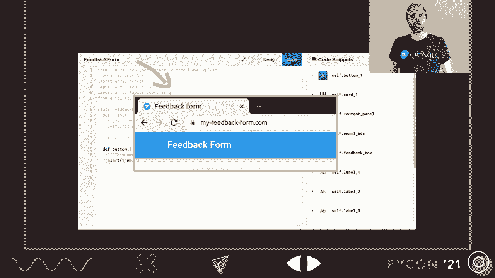
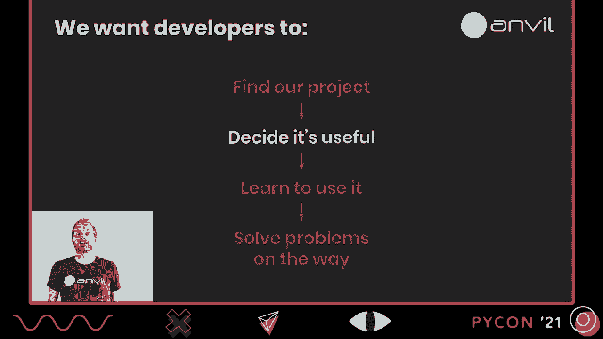
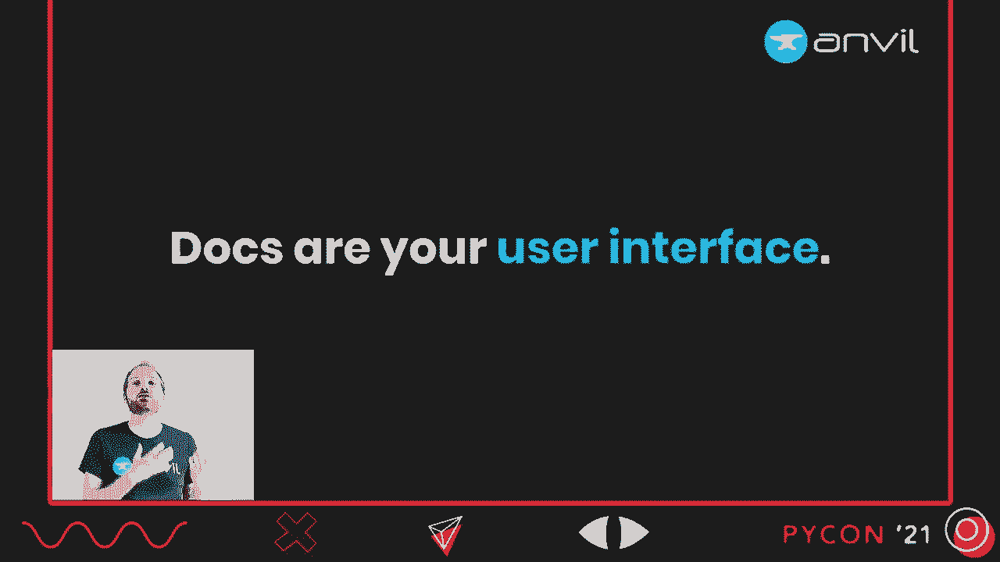
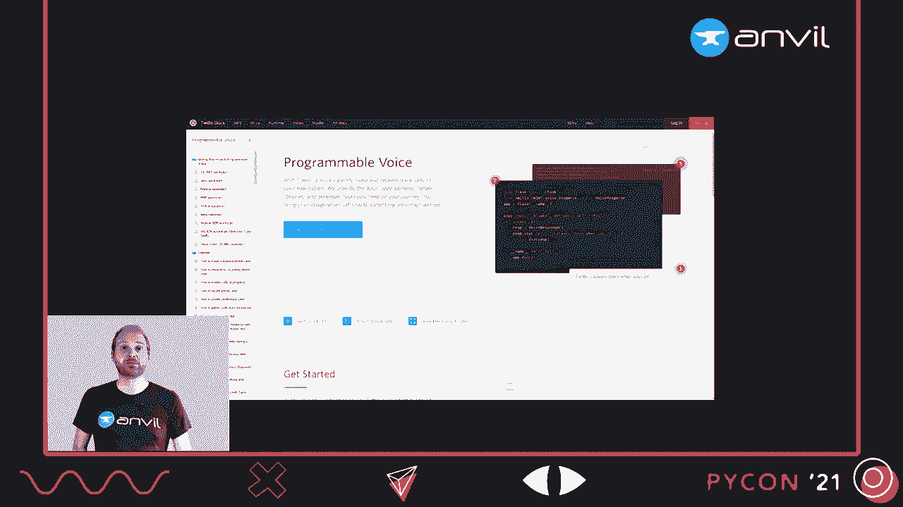
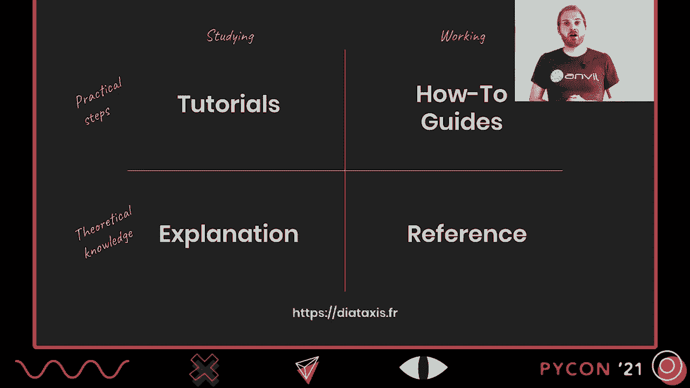
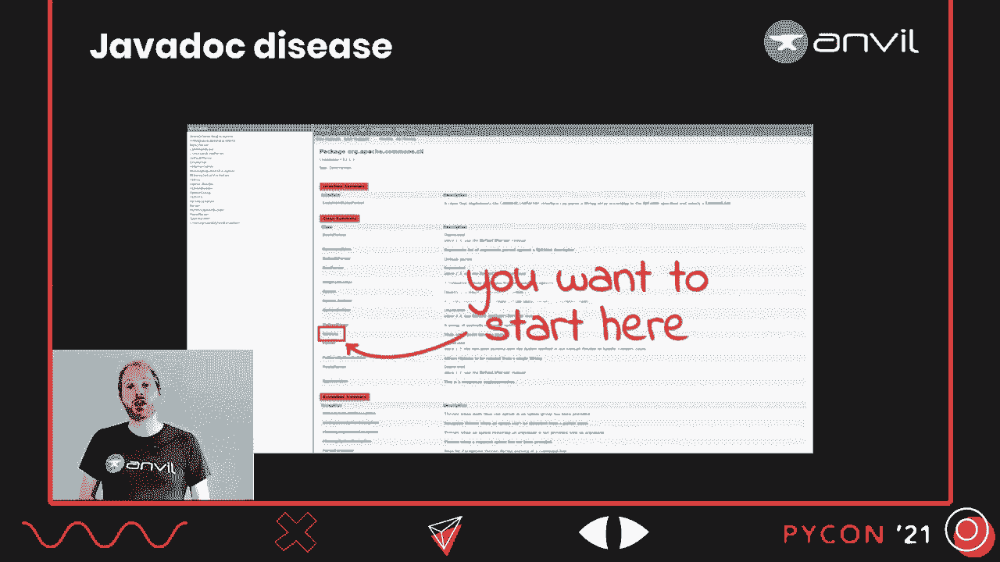

# P12：TALK _ Meredydd Luff _ Writing Good Documentation for Developers - VikingDen7 - BV19Q4y197HM

 [Music]。

 Hi， my name is Amareth and I'm here to talk about writing good documentation for developers。

 It's a huge subject， so I want to concentrate on why it's important。 and then what we should be writing， and then finish up by talking about how our users can help us improve it。

 But it's reasonable to start by asking why we care in the first place。

 Well， I care because I'm one of the original creators of Anvil。 a framework for building full stack where that's entirely in Python。

 so that's Python running in the web browser， Python on the server， a Python user interface toolkit。

 and we have a company that makes development tools。 So an online IDE with a drag-and-drop designer for applications built with this framework。

 and a hosting platform， so you don't need to know about DevOps or HTML or JavaScript。 You can build an interactive application and put it on the web， even if all you know is Python。

 So obviously， I'm pretty keen on developers having a good and productive time with the project I've built。

 and so should you be， because whether we are building developer tools。 or an API for a commercial product， or an open-source project we're sticking up on GitHub and PyPI。

 we're putting that effort in because we want it to get used。 and so we want developers to find our project， to discover that it exists。

 We want them to decide that it's useful， that it solves a problem they actually have。 We want them to be able to learn how to use it， and to be able to solve the inevitable problems they will have along the way。

 And we traditionally think of documentation in terms of these latter two。 But developer documentation is in fact vital to this whole journey。

 because your documentation is a lot more than just learning material。 Your documentation is content marketing。 If you're solving a real problem that people are having out in the world。

 then those people will be opening their magic search box and typing "How do I do？"。 specifically what your project does。 And your documentation is literally the answer to that question。

 and so they should be able to find it。 However they find your project。 the developer's next task is to decide， whether it's any use to them。

 and that means understanding what your project actually is。

 What can it do？ What is its sweet spot？ What are its other capabilities？ What are its limitations？

 And often the best way to find this out is to look at the documentation。

 Which means that for new users your documentation describes what your project is。 So it matters a lot whether a new user clicking onto your documentation。

 and scanning it or looking at the table of contents。 If they see a good summary of what your project does and where its sweet spot is。

 that's going to enable them to make a much better decision。 than if they see a paragraph of introduction， one code sample of the common case。

 because you've assumed everything else is obvious。 and then three pages of discussion of weird edge cases。

 This is the table of contents of the Anvil manual。 I actually think this one isn't bad。 It goes editor， user interface， client code， server code， storing data， deployment。

 But that's not a bad summary。 And of course I bring this up because we got this catastrophically wrong first time round。 Because the first version of our documentation was structured like our code base。

 And as it happens in the Anvil code base， database storage and sending and receiving email。 and user authentication and integration with Google and Facebook and Microsoft and Stripe and so on。

 They are all the same sort of plugin type object。 And so the documentation for all of those was stuck next to each other off in a folder to the side。 Which was very unhelpful for new users because if you're exploring this framework for the first time。

 does it store data is a much more important question than what third party services does it integrate with。 So lesson learned， we restructured our documentation so that the table of contents would provide an accurate summary of what it is and what it does。

 So now a developer has found your project described it's useful， decided that it's useful。

 They're settling down to learn it and solve problems。 And now of course your documentation is going to get a real work out。

 And this is where developer software differs from most software because for developers your documentation is your user interface。

 Most software is built kind of like a car。 The person using it spends all of their time staring at the dashboard and the manual is half forgotten in a glove box somewhere。 But for developer tools it's different。 If someone is developing code against your API then they will spend their time staring at their code and your documentation and that is it。

 So if you happen to have the skills or resources it's probably worth making it look decent。

 So here is the documentation index for Twilio which is an API for driving telephony so voice and SMS and that kind of thing。 And you can see it looks kind of like a second home page because they want to make it clear what it is and what it does。

 It is their user interface。

 Okay so we've talked about some of the roles of our documentation。 Let's move on to talking about what we should be writing because of course not all documentation is alike。

 And a tutorial is not the same thing as a reference doc。 A very clever man by the name of Daniele Pritida has actually come up with a framework for categorizing documentation。

 He puts documentation into four categories so you've got the tutorials which are the step by step guides to your project。 You've got the explanations which are the discursive discussions about how and why it works as it does。

 You've got the how to guides the step by step guides to getting a particular real world task done and then you've got the reference documentation。 The dry but comprehensive description of everything it does。

 And Daniele would actually make a pretty good management consultant I think because he's even got a 2x2 matrix going on。 You've got the tutorials and explanations you use when studying the project versus the how to guides and reference you use when you're trying to get something specific done。

 And then you've got the step by step tutorials and how to guides versus the more theoretical explanations and references。 And it's a handy framework you can read more about it at diataxis。

fr but I am inherently suspicious of anything that fits too neatly into a 2x2 matrix。

 And in this case I think the biggest problems down here in the reference documentation because this framework is trying to cram too many different things into that category。

 Let me explain。 So this according to this framework reference guides are technical descriptions of the machinery and how to operate it。 Well that sounds good， sounds like we want those。 But it also says reference guides describe the software itself。

 APIs， classes， functions and so on and how to use them。 Now we clearly want this as well but can one piece of documentation really fill both of these needs？

 I don't think so。 I'm going to call this stuff reference documentation and this stuff API documentation and they are not the same thing。 To illustrate why， let's use an example。 So let's say I have written a unit testing library and I want to document it。

 So like most unit testing libraries it has a concept of fixtures so code that runs before the test to set up the environment and then you run the tests and then you run some tear down code。 Now if we're going to describe the mechanism and how to the machinery and how to operate it then we need to describe this sequence。

 We need to tell the story of how these components work together。 By contrast API documentation describes code objects。 It describes classes， functions。

 commands and so everything you write in your API documentation is about a code object。 Now this doesn't leave much space for storytelling。

 If we were to document our unit testing library and all we had was API documentation where would we describe this setup test tear down sequence？

 Would we put it in the API docs for the setup decorator？ For the test functionality？

 For the tear down functions？ Would we try and copy and paste it into all of these places？

 There's just no good place in API documentation to tell the story。 And if we try to cram this reference documentation into the shape of API documentation we'll end up with what I call JavaDoc disease。

 Now this is slightly unfair because JavaDoc is awesome。 It is the badass great-grandma of every modern API documentation tool。

 JavaDoc came out in 1995 and the world has not been the same since。 It lets you write your documentation like this。 So what we have here is a function definition preceded by a block comment。

 And that comment contains some text and also some machine readable tags to describe the parameters and the return value and so on。 And a program called JavaDoc will crawl over your code base。

 pausing these comments and also the function definitions that follow them。 And generating clean。 consistent， easy to navigate HTML API documentation。 It really is great。

 It makes it so much easier to write documentation because you just comment your code in a slightly structured way。

 It makes it much easier to keep the documentation up to date because you can change those comments alongside the code。 And because of JavaDoc for a very long time the average Java library was much better documented than almost anything else。

 So it was a great success but the problem with this great success is that it crowded out other forms of documentation。 And even today if you look at a library written in Java。

 it's pretty likely that all or nearly all of its documentation will be created。 And so you end up with something like this。 This is the JavaDoc for a library that parses command line arguments。

 And it is perfectly good API documentation。 It lists the 15 classes in this package and you can click through on any one of them and find out its functions and their arguments and return values。 But how do these classes work together？ Which ones call which ones？ We don't know。

 This is API documentation。 There is nowhere to tell that story。 Actually。 this is a pretty well designed library and there is one class that you can instantiate and it does pretty much everything you need for you。

 It is this one。 Did you spot it？ Of course you didn't。 This is API documentation。 There was nowhere。 no good place to represent that important information。

 So API documentation and reference documentation are different things and they belong as different top level categories when you're thinking about your documentation。

 Reference documentation describes systems。 It describes the machinery。 API documentation describes code objects， a class， a function， a command。

 Reference docs tell a story。 Set up test， tear down。 API documentation describes one code object alone。

 So you can go and look up the API documentation for the setup decorator and find everything about how to call it and what it does in isolation because that's the point。 Reference documentation should be structured logically according to what your project does。

 API documentation is structured automatically because it should be generated from your code。 So I put them as two separate categories of your documentation and we have quite a few categories now and there's a lot of documentation to write。

 So let's think about how they can work together。 So it's very unlikely for a user to read your API documentation from beginning to end。 Users generally don't do that but it's actually pretty unlikely for a user to read all of your tutorials from beginning to end either。

 Your user is on a journey and that journey is going to take them through several different sorts of documentation。 most likely。

 Here's an example of such a journey。 So a user starts by wondering what they should use and they run across a blog post saying。 "Hey， this project's pretty good。"， So they go to your project and try to work out how they can use it for this task。

 There's a how to guide for that。 Now they're really digging in and they want to modify one of their function calls。 they want to know what arguments it takes， or that's clearly a job for the API documentation。

 And you can see they're sort of steadily zooming in to the more fine-grained and specific documentation here。 But here's another journey。 A user starts wondering how do I do such and such。

 So they plug that question into Google and land on a how-to guide。 Remember。 docs are content marketing。 This looks cool but the next question is how does that work？

 And of course that is the story that's told by your reference documentation。 They read a little bit of this and decide yes that this is something that's worth learning properly。

 And so they do a step-by-step overall tutorial。 And again， this is a perfectly legitimate journey。 But you can see they're not just zooming in， they're zooming out as well。

 And we want to let users take whatever journey they need to through our documentation。 The easiest way to do this， of course， is hyperlinks。

 Just link from any sort of documentation to any other sort of documentation that's covering the same subject。 So if you touch on a topic in a very didactic how-to guide。

 link to the reference documentation so they can find out how it works。 But when you're talking about a feature in the reference documentation。

 link to a related tutorial so they can zoom out if they need to。 Now。 links aren't the only way to do this。 It can be quite handy to put some of these types of documentation next to each other。

 So， Anvil has a built-in library for building applications that do user authentication。 And this is the section of the manual about that feature。

 And the first two pages here are actually mini tutorials。 And then the rest are reference about how this feature works。 Now， to be clear。

 none of these pages are trying to be tutorial and reference at once because that's just not going to work。 But by putting them next to each other， we can make it easy to zoom in and zoom out to follow whatever journey the user needs to take。

 So， we've got a few different forms of documentation。 And there's obviously a lot to do。 And it can be hard to work out what you should be working on next。 And so。

 I would like to finish up by talking about the best way to work that out。 which is a course to talk to your users。

 Because if you listen to your users， you will hear where your documentation most needs improvement。 They might not always say it in as many words， but if you're having a conversation with them。

 you will know。 Now， obviously the easiest way to do this is in person。 This is my colleague Bridget helping a user last time we could have Pike on in person。

 I desperately miss it。 I cannot wait to be back。 But even when conferences are running in person。 this is not very scalable。 So you'll want to do stuff online too。 We have a forum。

 A discourse is free。 It's open source。 And it's actually really easy to set up and host yourself。 So I would recommend it。 But if you don't want that hassle， then Stack Overflow works as well。

 Or you could set up a Slack or a Discord instance。 Actually， no。 Please don't use Slack。 The community is closed and the conversation is ephemeral。 And that is a problem。

 Because every time a developer asks how to use your project。 that is a bug report in your documentation。 And every time that question is answered in a public searchable place。

 that's a patch。 One answer can help any user who gets stuck on the same question。 Even better。 because this process is driven by questions from your users。

 these patches will naturally gravitate towards the holes in your existing documentation。

 And if you're using a platform that has voting， such as a discourse with its likes or Stack Overflow's up-voting。 then you'll even get some numerical idea of which of these patches are really。

 really urgent need to go upstream into your mainline documentation。 Of course。 not every question needs to go upstream like that。 Some questions are just too obscure。

 And some of them are too tangential to what your project is really about。 But that's okay。 Because if your Q&A is public and searchable， then it forms another pillar of your documentation。

 And your documentation becomes almost self-healing， as the patches gravitate to the right places。 And the long tail of obscure questions takes care of itself。

 But I have now made an absolute dog's breakfast of Daniele's beautiful diagram。 so I think it might be best if I stop here。 I want to leave you with the headlines。

 Your documentation is your user interface。 It is your marketing。 And it is the definition of your product for a new user who hasn't heard about you。

 which is of course almost everybody。 So please act like it。 especially if this is a commercial project。 It's worth thinking about the fact that developer documentation matters much closer to the top of the funnel than you might think。

 And when you are writing developer documentation， think about what type of dog you are writing。 Remember that API docs are not reference docs。 And talk to your users。

 Talk to them somewhere public and searchable， because they will help you fill in the gaps。

 Thank you very much for watching， and I very much look forward to meeting you in the question and answer session。 Thank you。

 [BLANK_AUDIO]， [BLANK_AUDIO]， [BLANK_AUDIO]， [BLANK_AUDIO]， [BLANK_AUDIO]， [BLANK_AUDIO]。 [BLANK_AUDIO]。

