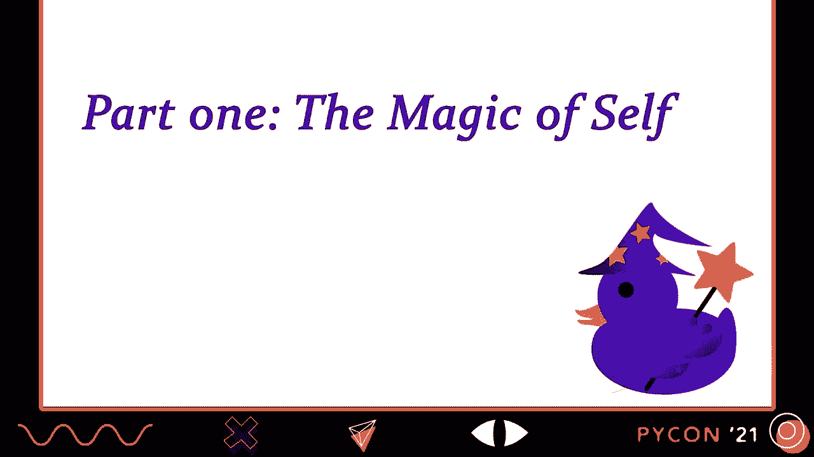
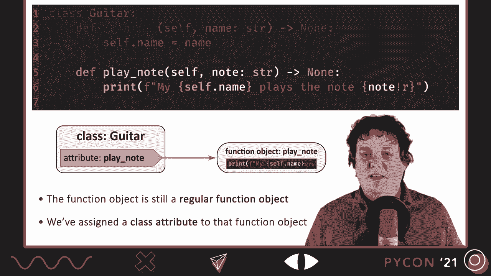
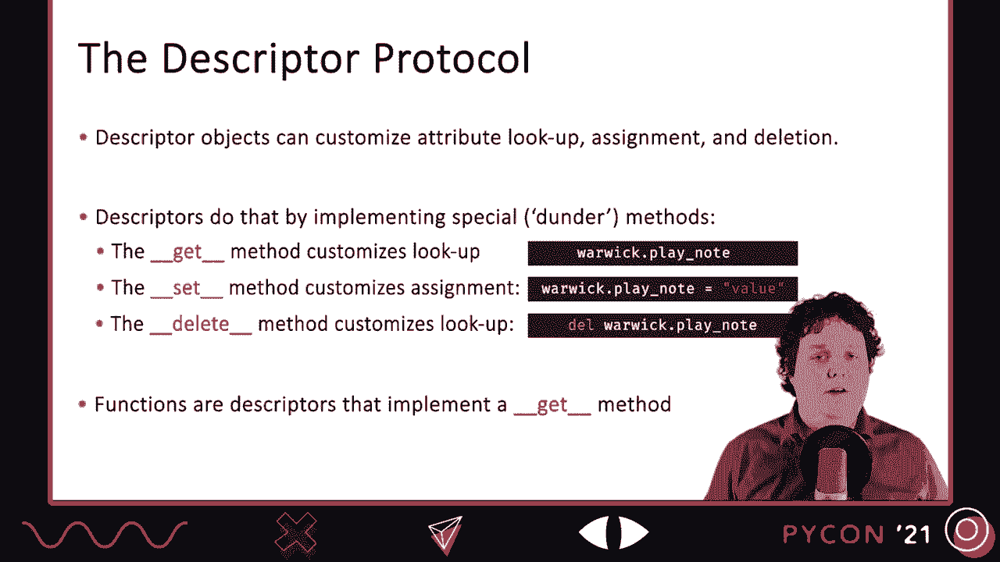
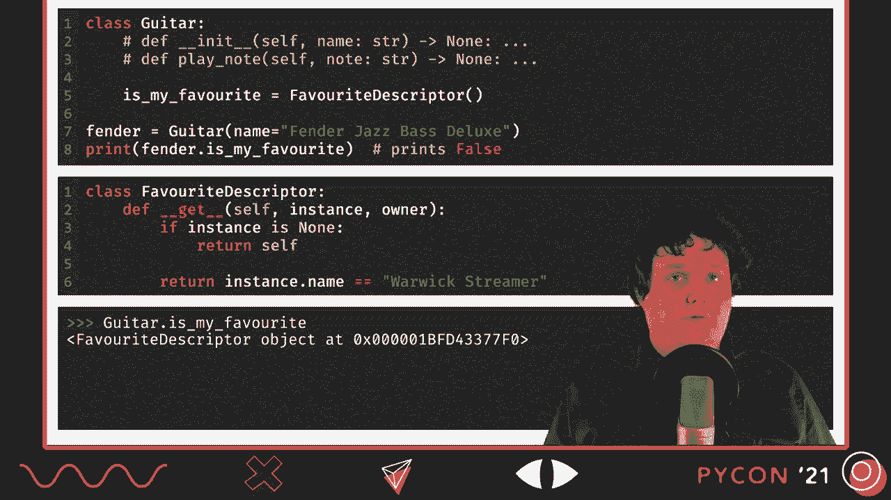
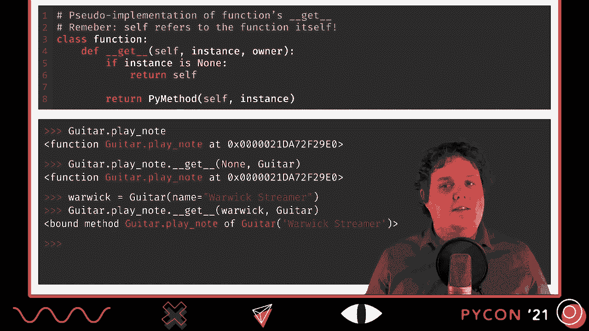

# P15：TALK _ Sebastiaan Zeeff _ The magic of _self__ How Python inserts _self_ into me - VikingDen7 - BV19Q4y197HM

 Hello， let's talk about magic in Python， because there's a lot of magic in Python。

 There are layers and layers of magical abstractions and functionality that make Python to the。

 high-level programming language that it is。 In fact。

 recently some people started complaining that too much magic was being added to the， language。

 To which Hido Verusum replied on Twitter that there's been a lot of magic in Python from。

 the beginning and that it's there to quietly help us， the users of Python。 And it's true。

 That magic is here to help you and me focus on the business logic of our code， on what。

 we actually want to do。 Instead of the lower-level details that we'd otherwise need to take care of。

 At the same time， using the word magic makes it sounds like that we have no hopes of ever。

 understanding the mechanisms behind this magic。 That we just have to get used to the fact that things are done for us without ever hoping。

 that we can truly understand how it happens or even how to make magic of our own。 In this talk。

 I hope to show you that that's not true。 A lot of the magic is the kind of magic that you and I can perform as well。

 To do that， we're going to look into what I feel is one of the most magical things in， Python。

 the insertion of self into methods。 To do that， we're going to encounter something called the descriptor protocol。

 But， before diving into self， I'd like to briefly introduce myself。 My name is Westian。

 I'm 35 years old and I live in the Netherlands。 I like playing guitar。

 which is something that you'll notice later in this talk， but。

 I also like playing board games or going for a walk with my girlfriend。

 I work as a Python developer for Ordina， which is a consultancy company in the Netherlands。

 I've not been working there for long。 I think it's about six months or so。

 but I really enjoy it so far。 They have a really strong Python unit and I always learn the most from working with other。

 great developers。 I'm also one of the three owners of Python Discord。

 an online community of Python enthusiasts。 We mainly focus on Python education and Python discussion。

 but we also organize Python related， events。 In addition。

 since we have a lot of motivated volunteers， we also try to help other organizations。

 in the Python ecosystem。 Think of organizations like the PSF or Pyweak or various Python conferences。

 The last thing that I'd like to mention about myself is that I'm also a volunteer for Europe。

 Python。 And the reason that I'd like to mention Europe Python specifically is because this year it。

 will be the 20th anniversary edition of Europe Python。

 Since it's being held online and we're trying to accommodate for different time zones， it。

 should be really easy to attend this anniversary edition。 So you may want to check it out。 Anyway。

 that's enough about me。 Let's talk about self。 When talking about self in Python。

 I think it's important to first go back to the basics。

 One of the reasons for that is that it's easy to get used to self。

 To not notice the magic that is going on anymore， especially if you've been programming in Python。

 for a while now。 I also want to go back to the basics to make sure that we're all on the same page。

 regardless， of the level of experience that we may have。

 I'm going to do that by creating a simple guitar class， one that I could use to keep track。

 of all the guitars that I've collected over the years。 As you can see， it's very simple。

 You can give a guitar a name and a dunder a knit method will assign the attribute name。

 to the name you gave it。 But that's about it。 For those of you who are unfamiliar with classes。

 this means that we can now create individual， instances of guitars。 In this case。

 I'm creating an instance for my favorite bass guitar， my Warwick streamer。

 After we created that instance， we can look up that name attribute and we can see that。

 it's really assigned to the name that I've given the guitar。

 This obviously isn't very interesting yet， so I'm going to add a method。 This new method， play note。

 expects an argument， the note that the guitar should play， and then， it will print a simple message。

 saying that the guitar is playing that note。 So when I call the method like this。

 giving it a musical note C# as an argument， Python， will print my Warwick streamer。

 play the note C#。 While this doesn't really look magical on its own。

 there is something interesting going， on here。 If you zoom in on the function definition of the play note method and the parameter list。

 in specific， you'll see that the function expects two arguments。 For two parameters， self and note。

 But if you then look at how I've called the method， you can see that I only gave it one， argument。

 the note C#。 It's obvious that the C# ended up with the parameter note， but where's the value of。

 herself coming from？ This is the magic of self。 When you call a method like this。

 Python will take care of inserting the instance for， you。 But Python has done。

 is that it has inserted Warwick， the specific guitar we've called the。

 method on as the first argument for the function。 To understand the special bit of magic。

 we'll have to look at what methods are and how they。

 relate to functions。

 To look at what methods are and how they relate to normal functions， we need to look。

 at what happens when you define a class with methods。

 And that's why I'm going to discuss what Python does when it reads the definition of。

 the guitar class。 Since everything in Python is an object， including classes。

 one thing we know is that， we're going to end up with a class object， an instance of type。

 to represent a guitar， class。 I've drawn this box to represent that class object。

 Now let's zoom in on what happens when Python reads the definition of the plain note method。

 Some people think that because this function definition statement， the death plain note and， so on。

 is located within the body of a class， this means that we're creating a special kind。

 of object here， a method object。 But this is not the case。

 This is just a regular function definition statement， just like the one you use outside， of classes。

 So when Python reads this function definition statement， it's going to create a regular function。

 object in memory。 There's nothing special going on here yet。

 But what is important is that a function definition statement also assigns a name to。

 the function object。 This obviously makes sense because we need a name to be able to refer to that object。

 later。 Since we're defining something within a class。

 that name will be assigned within the namespace， of that class。 More specifically。

 we're going to assign an attribute of the guitar class， plain note。

 to the function object in memory。 And this is an important first piece of the puzzle。

 We've assigned a class attribute to the function object。 So in short。

 by defining a function within a class， you're not creating a special kind， of object yet。

 You're just creating a regular function。 But what is important is that it assigns a class attribute to the function。

 We'll find out why this is important when we look at what happens when we try to get。

 that function using an attribute。 Alright， let me pull up my Python shell to demonstrate the magic that happens when you。

 access the function using attributes。 First， I'm going to access the function using the class attribute。

 guitar。plainnote。 When I hit enter， you can see that this just returns the function itself。

 There's no special magic going on yet。 But in Python。

 this isn't the only way that you can access class attributes。

 You can also access them using an instance of the class。

 So that's why I'm going to recreate my Warwick instance。 And then。

 I'm going to access the class attribute playnote as if it were an attribute of the， instance。 Now。

 if you think about it， this is a bit weird。 My Warwick instance doesn't even have an attribute called playnote。

 This is an attribute of the class。 But as we'll see in a moment， this just works。

 What roughly happens is that Python looks for the attribute playnote on the Warwick instance。

 and when it doesn't find it， it moves on to look at the class。

 The actual lookup sequence is a bit more complicated than that， but this is what roughly happens。

 and this is the kind of detail we need right now。 Alright， let's hit enter and see what it gets us。

 Alright， it worked。 But there's also something interesting going on here。

 Instead of getting the raw function object back， we now get something called a bound method。

 And this is very much where the magic happens。 When you look up attributes in Python。

 instead of just looking up those attributes directly， as if they were labels。

 you can actually hook into that lookup process by using something， called the descriptor protocol。

 And Python's functions use this descriptor protocol to bind an instance to a method whenever。

 you use the instance to access that function。 So in this case。

 since we accessed a method as an attribute of the Warwick instance， the。

 Warwick instance was bound to the function to create something called a bound method。

 During this bound method， Warwick is already inserted as the first positional argument。

 the one that will end up with the parameter self。 And this is why you don't have to insert the instance yourself anymore。

 Whenever you use a bound method， the instance has already been inserted for you。 Okay， now。

 since I'm not a magician， I'm going to reveal the trick behind this bit。

 of magic by introducing the descriptor protocol。 Mind you， this isn't going to be a thorough。

 in-depth discussion of the entire protocol， that should at least give you a taste of how it works。

 Alright， let's talk about the descriptors。 When I first heard that term。

 I thought it sounded quite difficult。 At least， it wasn't quite obvious to me what the term meant or what descriptors would do。

 Now that I've been using descriptors for a while， I still think they're not the easiest。

 thing to learn in Python。 There are just quite a few details to learn and Python design principles to master if。

 you want to use them effectively。 At the same time。

 I don't think it's that difficult to get a general understanding of， what descriptors are。

 And that's what I'm going to focus on here now。 I want to give you a rough idea of what descriptors are and only zoom in on the parts that we。

 need to understand self。 So， what are the descriptors？

 Descriptors are objects that modify what happens when we do something with an attribute， in Python。

 More specifically， descriptors can customize how we look up attributes， how we assign to。

 attributes and how we delete attributes。 Descriptors do this by implementing the descriptor protocol。

 There are three special or double underscore methods that descriptors can implement。

 The first is the dunder get method， which can be used to customize what happens when。

 you get or look up an attribute。 The second is the dunder set method。

 It allows you to modify what happens when you assign something to an attribute， like。

 we're assigning something to play note here。 And finally， there's the dunder delete method。

 Unless the name implies， it allows you to customize what happens when someone tries to。

 delete an attribute。 As you've probably already guessed。

 all functions in Python are such descriptors。 Now。

 descriptors don't have to implement all three methods。 And in fact。

 functions only implement one of them， the dunder get method。

 And that's why we're going to focus on a dunder get method in the remainder of this， talk。

 We'll start by implementing a descriptor with a dunder get method of our own。

 The descriptor that I want to implement is one that's going to help me identify my favorite， guitar。

 The goal is that I can create a class attribute called is my favorite that I assign to my。

 descriptor。 Let's call it favorite descriptor。 And then when I access that attribute on a guitar instance。

 it will tell me if that instance， is my favorite guitar or not。

 It's not going to do anything complicated。 It's just going to compare the name attribute of the guitar to Warick streamer。

 That's currently my favorite guitar。 So if I create a guitar instance with the name Warick streamer。

 like this， and I then， print Warick dot is my favorite， we should see true。 As a counter example。

 if I create an instance for my fender jazz base and then print fender， dot is my favorite。

 it should print balls。 And that's all。 It's not going to be configurable。

 It's not going to have options。 And it's just going to check against the static name Warick streamer。

 And this is to make it easy for demonstration。 Now some of you may be wondering why I'm not simply using a property。

 which is the normal， way to do this。 But the goal here is to implement a descriptor manually。

 Properties also use a descriptor protocol under the hood。

 But the point here is to show you how the get method works。

 Not to show you the best and most bithonic way to do this。

 And that's why we're going to do it manually here。 To write a descriptor。

 you simply write a class and implement the descriptor methods， that you need。 In our case。

 we only want to do something when we access the attribute， so we only need。

 to implement a done or get method。 We don't really need to do anything else here。

 A done or get method has three parameters， self， instance， and the owner。

 The instance parameter will receive the instance that you access the attribute on。

 In our example above， we access the attribute on the fender instance so instance would receive。

 the fender。 The owner parameter will receive the class that owns the attribute。 In our case。

 since it is my favorite， it is an attribute of the class guitar， we would。

 get guitar as a value for owner。 The first thing that we need to do within our done or get method is account for the possibility。

 that instance is none。 This can happen when you access the descriptor directly on the class。

 so like class。isMyFavorite。 And then there's obviously no instance yet， so instance will get none。

 One common way to handle this is by checking if the instance is none and then simply returning。

 the descriptor itself by returning self。 This is also what functions in Python 3 do。

 Once we make it past that if block， we know that we're dealing with an instance， we can。

 simply compare the name attribute of the instance to Warick's tremor and return the， result of that。

 Now， there are obviously several ways to improve the code here， like not just assuming。

 that the instance will always have a name attribute， but this is fine for our demonstration。

 The final thing that I'd like to do is to show the descriptor in action。 So first。

 I create an instance for my Warick's tremor and then when I access the isMyFavorite， attribute。

 you'll see that it returns true。 If I do the opposite， so if I create an instance for my Fender。

js base and I then access the， attribute， you'll see that it returns false。 Now。

 to test the first if block， we can also look at what happens when we access the attribute。

 directly on the class。 So guitar。isMyFavorite and we see that it just returns the descriptor itself。

 Right， now that we've seen an implementation of a descriptor， we've seen an implementation。

 of the done or get method， I think it's time to look at the implementation for functions。

 in Python。 So， this is the implementation of the get method of functions。

 or at least a Python version。

 of it， because the original was written in C。 Still， this Python version is roughly equivalent。

 C version just has to do something additional with the reference count because it operates。

 on a lower level。 What it does is fairly straightforward。

 It will first check if the instance is none。 If so， it will just return the function itself。

 It won't make a bound method。 Now， remember， this happens when you access the descriptor using a class attribute instead。

 of an instance attribute。 This means that if I do guitar。play node。

 I'm just getting the function itself back and， not a bound method。

 This obviously makes sense because there is no instance yet。 There's nothing to bind here yet。

 It's really hammer the point home。 We can also manually call the get method with none for the instance。

 If I do guitar。play node， which gets me the function， and then I add the call get none。 Guitar。

 I should get back the function。 And yes， we do。 So， if the instance is none。

 we just get the function back。 If the instance isn't none。

 we will make it past that if statement and that's when we。

 actually create a bound method and return it。 We can see there's an action by first creating a guitar instance。

 my Warwick here， and then， by manually calling the get method。

 now providing Warwick instead of none。 And as you can see。

 we now get a bound method instead of the function。 And this really is the magic of self。

 Functions are the scriptors that bind the instance whenever you get them as an attribute。

 of an instance。 There are also some other descriptors related to methods built into Python。

 You are probably already quite familiar with that。 A good example is the class method descriptor。

 It is typically used as a decorator decorating a method as an example below。

 What it does is wrap the function in a class method object to provide an alternative done。

 their get method。 This done their get method also creates a bound method but one that binds the function。

 to the class instead of the instance。 This happens both when your access is directly on the class as well as when you access it。

 on the instance。 You always get a method bound to the class。 Similarly。

 there's also the static method class which is typically also used as a decorator。

 See the example below。 It also wraps around the functions provide an alternative get method but this time one。

 that always returns the function as it is without binding anything to it。

 So regardless of whether you access a static method object directly on the class or on an。

 instance of the class， you always get the raw function back， not a bound method。

 The last decorator that I'd like to mention is the property class。

 This one is also typically used as a decorator but as is true for all the ones that I've mentioned。

 you don't have to use this decorator。 As mentioned earlier。

 properties allow you to very easily add getters， setters and the， leaders to attributes。

 One interesting aspect of properties is that they allow you to implement such getters and。

 setters later on in the lifetime of your project without changing the public interface。

 of the attribute。 This means that you can start out with exposing the attribute directly and you only have to。

 add the getters and setters when you actually need custom lookup and assignment logic。

 This is one big advantage of properties in Python， something that you don't see in other， languages。

 Alright， we're nearly at the end of this talk。 I hope you've enjoyed it。 To summarize。

 we've seen how the descriptor protocol allows you to customize how attributes， work in Python。

 They let you do cool things behind the scenes where you access a sign to or delete an attribute。

 Functions are such descriptors and this is the magic behind self。

 Whenever you access a function as a method， the descriptor magic kicks in to insert the。

 instance for you so you don't have to。 We've seen a few other cool descriptors in Python that allow you to influence how methods。

 behave。 Things like properties， class methods， and static methods， they wrap around to function。

 objects to provide a custom done-and-all-get method that behaves differently。

 These tools are all very powerful and allow you to focus on other things than worrying。

 about how it all works under the hood。 At the same time。

 there are also a lot of things related to descriptors that I've skipped， over。

 While I did mention them， I did not explain how the done-their-set and the done-their-delete。

 methods work and how they differ from the done-their-get method。 This is an interesting topic。

 but maybe something for another talk in the future。 Who knows？

 Then there's the difference between data and non-data descriptors。 Or as fluent Python calls them。

 overriding and non-overriding descriptors。 This has to do with the specific lookup order of instance versus class attributes。

 but it's， a thing that you need to wrap your head around。

 I think it's much better to learn a difference using a book or a good tutorial and your editor。

 on the side。 I can personally highly recommend the book full on Python for that。

 I think a new edition of that book will come out somewhere in the next few months， so be。

 sure to grab one。 Alternatively， there's a very good tutorial written by Raymond Hettinger in the Python。

 documentation， and real Python also has plenty of resources on the subject。 Finally。

 there's this handy method called "done-their-set name" that's often used。

 to gather with the descriptor methods。 It may be worth it for you to look it up sometime。

 I'd like to conclude this talk with a quote from Lee C。 Gell， a magician。

 "I'm writing a book of magic，" I explain。 And I'm asked "Real magic？"， By real magic。

 people mean miracles， thometurgical acts， and supernatural powers。 Now I answer conjuring tricks。

 not real magic。 Real magic， in other words， refers to the magic that is not real。

 while the magic that， is real， that can actually be done， is not real magic。 In Python。

 those "done-their-methods" we've seen are sometimes called "magic" methods。

 as if they allow you to do magical things。 Not everyone is happy with that name。

 They claim that Python is at first to magic。 That saying that something is magical is to say that we。

 mere mortals， would never be， able to harness that power。

 and that Python is specifically a language that does allow。

 you to do almost everything that the interpreter can do as well。

 So they say that calling it magic is wrong。 I like the term "magic。"。

 I think that there's a lot of magic in Python that typically allows us to focus on our business。

 logic， the higher-level abstractions。 And just like Leacy Cole。

 I think the real magic is the magic that we can touch， that， we can use。

 that we have the spell books for。 And in Python， we have those。

 So I hope this talk gave you a taste of the magic of Python。

 And I hope you'll now want to go out and learn more of it。 And that's it for me。

 Thank you for staying with me to the end。 Goodbye。 [BLANK_AUDIO]， [BLANK_AUDIO]， [BLANK_AUDIO]。

 [BLANK_AUDIO]， [BLANK_AUDIO]， [BLANK_AUDIO]， [BLANK_AUDIO]。

 [BLANK_AUDIO]。