# P18：TUTORIAL _ Geir Arne Hjelle _ Introduction to Decorators_ Power UP Your Python C - VikingDen7 - BV19Q4y197HM

 Hi everyone， my name is Gayed Anilah， and this is a tutorial to Decorators。 You'll learn。

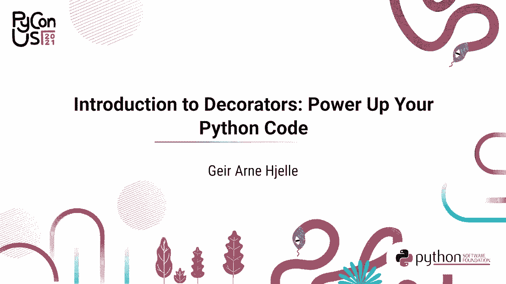

 how to use decorators to write more effective Python code。 And first off， let me just say。

 that we had a small mishap during the recording of this tutorial。 So the first 10 minutes。

 or so is a re-recording of the actual tutorial that was held at PyCon on May 12th。 But after。

 about 10 minutes， we'll be back in the original recording， so you'll see the full thing。 So。

 let me then just go to talk a little bit about who I am and what you can expect from this， tutorial。

 So my name is Gayed Anilah。 I live in Norway， in Oslo， where I work as a data scientist。

 I also do write some articles at realpython。com， including an article about decorators。

 What we're going to do today is essentially touch decorators ourselves， get to see how we can。

 write decorators， how they function， and more importantly， how you can use them in your own code。

 And the way that we kind of have structured this tutorial is that I'll be doing quite a bit of。

 coding live in a REPL。 And the idea is that to try to do this together so that you can follow along。

 in your own system。 And then in between， we'll take a few breaks and we'll do some exercises。

 So there'll be seven exercises where you'll have a couple of minutes to try things on your own。

 and then we'll kind of collect us all up together afterwards and discuss the solution for this。

 I also wanted to say that you're free to ask any questions you have during the tutorial。

 Use the chat， use unmute yourselves and join me if you want。

 And one final bookkeeping note is that there is also all of this material， the slides。

 and so on will be hosted on my GitHub page。 So you can go to github。com/gahela decorators tutorial。

 and get all of this code as well。 Okay， so let's dig into what are decorators。

 And I'll start with sort of like a motivating example just to show you how does a decorator look。

 So for this first example， there's not really any reason to code along with this。 This is just。

 to show you how， what the decorator looks like essentially to get an idea of what they are。

 And I'll do that first and then I'll talk a little bit more about what the creators can do。

 So this will be sort of like a small dummy example as well most of the examples that we do during。

 the tutorial， partly just because I want to make the points clear。

 But I'll try also to talk a little， bit about how this will work also in more real life decorators。

 So for this one， I just want to， define a function that is typically slow when it does some calculation。

 To keep it simple here， I'm just doing a very basic calculation。 I'm just squaring a number。

 But I'm also adding a time， sleep here just to make it slow just to show you to kind of simulate a long-running calculation。

 So say that we're sleeping for a number of seconds， something like this。

 And then we actually do the times that sleep here for the number of seconds。 And then we'll return。

 this number squared。 So here I have a function and if I call it， you should see that it's running。

 slowly。 I see I did a small typo there。 So let's just go up and fix that。

 This should be an F string。 Okay。 So then if we run the slow square function。

 we can see here that it's sleeping for three seconds， and then it returns the number。

 And even if I call it a second time， it's still a slow function。

 So one of the decorators that are in the standard library is one called an L。R。U。 cache。

 least recently， used cache。 And what that can do is to take calculations like this that could be long running。

 and just cache them。 So remember them for later if the result won't change。 So just to show you how。

 that one can be used， we can import that from the func tools library。 And then we can now。

 go here and let's see essentially redefine our or actually we don't need to change our function at all。

 We only add in on top of it what's called a decorator where I just reference the func tools， L。R。U。

 cache。 And so I didn't change the function at all， which is an important point here。

 But what happens now if I call my slow square three， you can see that it's again sleeping for。

 three seconds before it's returning the number。 But now if I call it a second time， you can see。

 that it immediately returns。 And you can also see that it doesn't print out anything， which means。

 that the function itself didn't actually run。 The only thing that happens was that this L。R。U。

 cache， somehow remembered the result， the output from last time and just gave that back just immediately。

 And to kind of finish up this example， notice that if I now ask for the square of a different number。

 it will again need to do the full calculation。 So it will be sleeping， but then once it's run once。

 it's again cached。 So if we're looking at this as a decorator， the important thing is kind of this。

 line。 So first of all， you can notice the syntax。 So how you use decorators is that you use this。

 at symbol and then the name of the decorator immediately preceding your function definition。

 And typically for most decorators， or possibly all， you don't need to change your function。

 That's kind of one of the big powers of the decorators is that it can be reused over many。

 different use cases。 So in this case， we had a slow square function， but you can see how the same。

 caching function can be used in many， many different functions that you want to have a cache of。

 So what this kind of helps you do is then reuse functions， but you can also see how this。

 makes our code much more readable。 So say that if we didn't use the decorator， but we still wanted。

 to cache our result， that would mean that we would need to kind of define code for doing the caching。

 inside of the function itself， probably。 So then we would kind of。

 litter our slow square function with extra stuff that just need to be there for caching。

 not because we need to do any calculations。 So by using the decorator， we kind of moving all of。

 that fluff out of the functions。 The function can focus on what it does best， and we kind of。

 increase the readability of our code。 And yeah， so together with this， we get readability， we get。

 more efficient to write code， essentially， because we can just reuse stuff all the time。

 And we don't need to repeat ourselves。 So if I wanted to cache a different function， I just reuse。

 the same decorator。 I don't need to include that code。 So in this way， we get very elegant， code。

 essentially。 Okay， so what are decorators？ And let me just show you here that if I just type。

 funke tools， LRU cache， you can notice here that our decorator is actually just a function。

 So that's kind of our first thing we probably should notice is that a decorator is really just a。

 function。 There's nothing magical you need to do when you're defining it and so on。 It does need。

 to follow certain conventions that we'll talk more about。 But in general， the creator is just。

 a function that we apply in a special way。 To really understand what these decorators do， though。

 we should talk about something。 We typically call functions our first class objects。

 And what this means is just that we can treat functions as any other kind of object in Python。

 So meaning that we can assign functions to variable names。

 we can pass them around and so on and so on。 So just to show you these things， it could。

 for instance， define a variable that I'll call， Skidivoot that also just takes the value of print。

 where print here is the print function。 And Skidivoot is Norwegian for print。 So essentially。

 this is just the start of translating Python into， Norwegian in some sense。 Now I can use this。

 First of all， we can see that this is my built-in。

 function print and I can now use this to actually print stuff。 So maybe not nothing revolutionary。

 here， but what I'm doing is that I'm using the fact that functions are first class objects。

 I can assign them to different variables in Python。 We can also pass functions around。

 So let me just create a very simple function。 We'll play with this function several times。

 throughout the tutorial。 But it's a greater function， which I'll use essentially just to say hi to。

 hi to a given name。 So something like this。 And the one thing you should notice here。

 is that I did something right there where I said that the argument printer。

 I gave the default value， of print， the print function。 And if I now just call greet Python。

 you can see that it against， prints out hi Python。 So what happens here is that with the greet。

 it calls printer， but printer， is just a different name for print。 So therefore。

 this ends up saying print hi Python。 But now that I have defined myself a parameter here for the printer function that I'm going to use。

 I can pass in different functions for this。 So say I could define now a function that I'll call nerp。

 So nerp is just print backwards。 So what this thing does is that it just takes a text and it prints。

 out the text backwards。 So I'll just reverse my text like this。 And now I have the nerp function。

 And you can see now that if I do greet Python， but I'll specify that I want to use the nerp as my printer。

 you can see here that it actually prints things backwards。 So what I've done here is that I've。

 been using a function as an argument to this。 And the whole functions are first-classed object in。

 Python thing is something that typically you'll have two reactions to this。 It's either yes。

 of course you can do this， or it is something that potentially blows your mind a little bit。

 And in the latter typically happens if you come from some languages where this is not allowed。 So。

 there are many languages for functions or very special objects that you can't do these kind of。

 things with。 But the power of doing this is that you can do a lot of type of meta programming。

 and those kind of things。 And we'll see that this is kind of what allows decorators to function。

 Before I move on， I also want to make sure that there's a very important distinction。

 When we're talking about functions that I just want to make sure that everybody， is aware of。

 So in Python， you can refer to a function just by typing out the name of the function。

 So here I just type print and you can see that this gives me a reference to the function print。

 I could also use parentheses with print and you can see that this seemingly doesn't give me anything。

 back。 And when you use parentheses after a function。

 you are not referring to the function but you're， calling the function and it gives your reference to the return value of that function。

 So in the， case of print， print returns none。 So it just gives your reference to none。

 which is typically， not very useful。 But this is important when we're passing things around。

 And if we just remember， here， when we last used the greet。

 notice that I passed in the nirp without the parentheses as my， printer。

 It's because I need a reference to the function。 If I had here done a function call with。

 parentheses， we would see that we get a an error message。 This first one is because I don't have。

 anything there。 Let me let me use print as a different example because nirp needs one argument。

 But if we do this with print， you can see here that we get a somewhat mysterious reference to。

 the nontype。 And what happens there is that our printer， let's just do the call right here。

 If I do this， then we can see， we need to force it out that printer becomes none。

 So this definition here just means essentially that I'm saying printer equals none and then it。

 tries to use none as a function later。 And that's when we get this nontype object。

 It's not callable。 So that's kind of where we get into trouble there。 But yeah。

 the important thing is just to remember， the distinction between print or any function without parentheses gives you the reference to。

 the function while with parentheses calls the function and gives you a reference to where。

 the reference to result of that function。 Okay， I see there's a question here too。

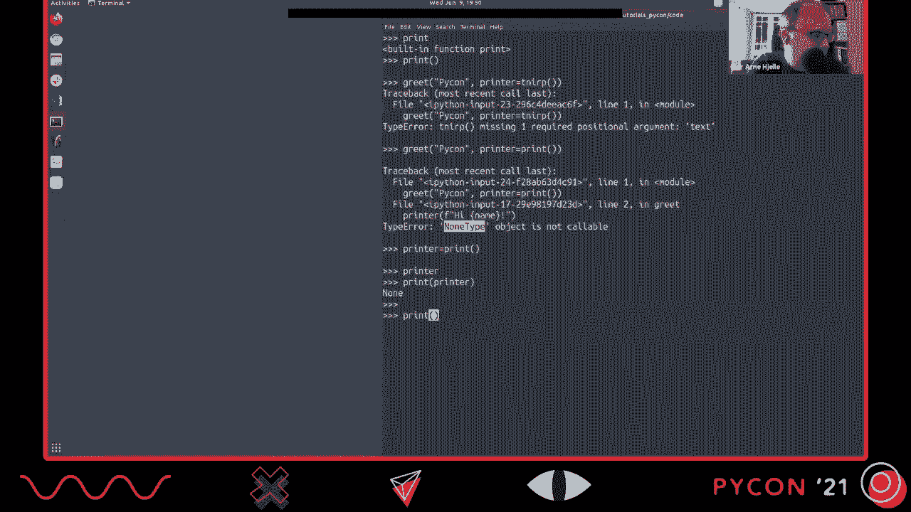

 There's a way to identify decorator methods available in Python libraries and the actual methods。

 So I don't think there's sort of a global way to identify decorator methods because。

 the creators are really just， as you'll see soon， they're just regular functions that kind of。

 follow certain conventions。 But there are， and I'll share a link with you afterwards。

 there are certain places online essentially that just collected all of the different decorators。

 in the standard library and in other libraries。 They're of course not complete， but at least they。

 give you something。 Okay， let's see。 Then we have， yes。

 I wanted to show this other example where we can create a function kind of dynamically。

 And this is often just called a function factory or something like this that you have。

 You have a function that creates another function， so therefore a factory。 And in this example。

 I'll kind of be similar to the greeting example in some sense。 But here you can see that I am。

 defining a function within the other function。 So this is also called an inner function。

 And I'm just defining here a function I call prefix printer。 Again， I'll just reuse a simple。

 print function here where I'll take a prefix and kind of print it in front of a text。

 Something like this。 And then my prefix factory is just returning this prefix printer function。

 And as I'll show an example first and I'll explain a little bit more how it works。

 So let's say that I'll do a prefix factory where I'll use debug。 And when I do this， this debug。

 you can see here is a function。 There's some more information here。

 that it is actually the prefix printer function that's a local function to prefix factory。

 But the important thing for us is that the debug is a function。 And if I use my debug to say hi。

 PyCon， you can see here that it essentially then adds in the debug prefix in front。

 And what is kind of interesting here is that the debug function only takes in the argument， text。

 And then the prefix argument comes from the outer function。 So this one is kind of passed into。

 or really it's available to the prefix printer to use。 And this is kind of something called that。

 it's getting the prefix from the enclosing scope that prefix doesn't exist inside of the。

 prefix printer function。 So then it kind of looks outside to see if it can find it。 And then it。

 finds it in the enclosing function。 And in this way， we can create many different prefix printer。

 functions where debug is just one of them。 So what we're doing here is kind of the opposite of what。

 we had in the previous example where this time we're returning an example。 Sorry。

 we're returning a function。 And then just to kind of complete the circle a little bit there。

 I can now call my， greet layer that we had earlier and send in my debug as the printer。

 And in this case， you can see， that the greet now is able to take in the debug and print things up out here。

 I realized that I， should also be copying a little bit just to make it easier for you to see that these functions that。

 we have been doing。 So I'll just copy this out。 So you can kind of see them in the background。

 Let's see。 I have the nirp。 I'll add in that one。 And let's see。

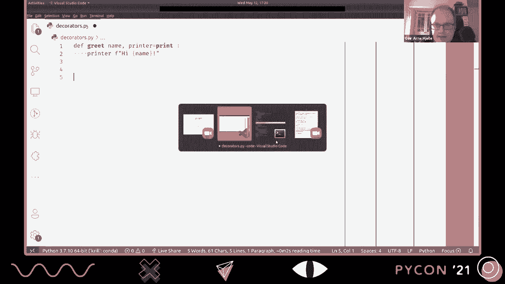

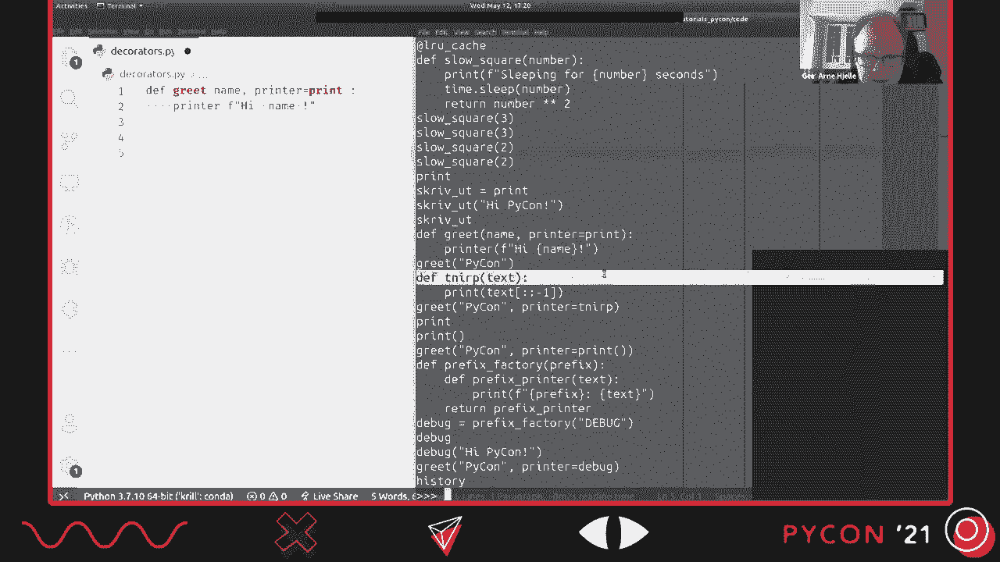

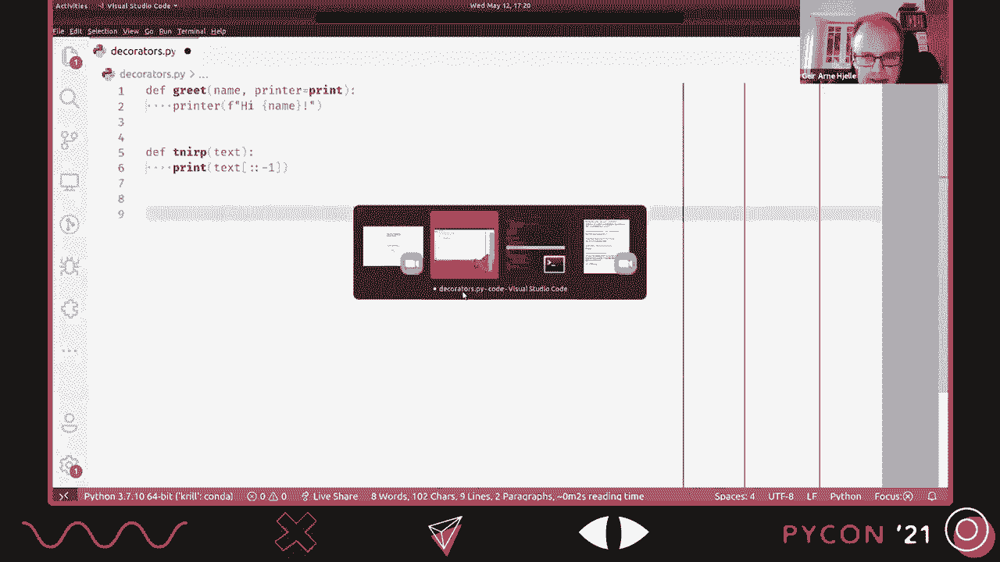

 There we go。 [pause]， So also one thing to just point out here is that every time。

 so the prefix printer。

 it was kind of a that function is only generated when the prefix factory is called。

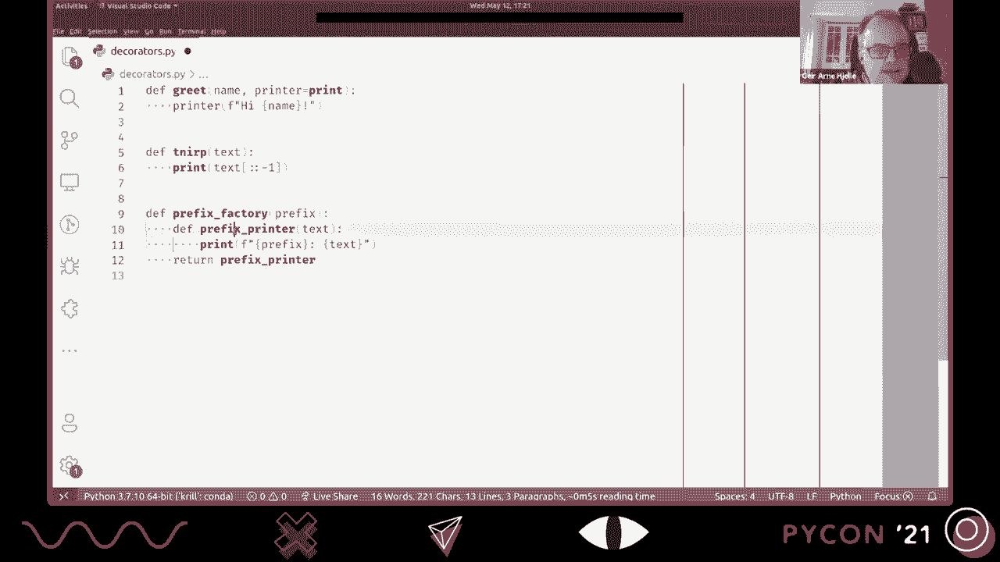

 So whenever you kind of call the prefix factory， a new function has been created。

 So there can be many prefix factory functions essentially， different versions of this。 So yeah。

 Let's see。 So what's next？ Now I want to just put these things that we've seen now together。

 and have some function where I can pass in a function and it will return a function to me。

 And that is really the definition of a decorator as well as CNC as well。

 So now I'll create a reversed， factory。 I'll call it， which can take a function。

 And then inside of here， I'll just define another， inner function that I'll call the reverse color。

 It takes some text。 And what it does then is that， it just calls the given function。

 So the one that we get in there。 But I'll pass in the reverse， text。

 So this is kind of a little bit like what we did here with the nirp function。 And it's kind。

 of mixing together。 And then my factory again should return this inner function。 So it's creating。

 a new function and returning it。 And then what can we do with this？ Well， I can for instance create。

 myself a reverse print function from using the reverse factory on print。 So let's see what that。

 ends up doing。 So if we say our usual high Python， you can see that this function is exactly like。

 the nirp function here did。 And if we kind of trace through here， we'll see that we are really。

 doing the same thing， right？ Because the reverse factory， I'm sending print in there as it's funk。

 It's defining a function here where it's calling in this case， then print of text reversed。

 And then， it's returning that function。 So reverse print is really at least functionally the same as the nirp function。

 That means that I should be able to also reverse my nirp function， by doing the following。

 And now what should we expect the reverse nirp to give us？ Well， that。

 will reverse something that's already reversed。 So that will just come back straight again。

 And then， as a final little thing， and I can see if this one becomes what you expect。

 So we can also reverse， our debug function。 And if we do then the reverse debug， high Python。

 So remember that debug was， essentially using this prefix factory。

 So what will happen when we run this？ If I was， I ended up slightly confused that it actually prints debug the correct way。

 But again， if we kind of trace our way through everything that happens here。

 we'll see that that kind of， makes sense because the only thing that is reversed。

 if we look here is the parameter text that we， pass in here。 So all the way through。

 we can kind of run this。 And in a sense， there's nothing。

 really new about what we have been doing here。 We're just kind of passing in the function similar。

 to these examples that we've done here。 But what we have actually done now is that we have created。

 ourselves a decorator。 So this reverse factory is a decorator in the sense that I can。

 just add it using the same syntax that you saw for the LRU cache。

 So let's here just I'll recreate the greet function， but just an even simpler one。

 So if we do something like this。 So I'll greet PyCon。

 And now if I just add in the reverse factory on top。 And then we greet PyCon again。

 you can see that it has actually done the application that we wanted。

 to do on the greet function here。 You can see this is actually not exactly the same as reverse prints。

 since again， we are just reversing the parameter。 So it's as high as correct， but then no， no， no。

 or PyCon is backwards。 So this reverse factory is actually our first decorator。 And I'll just。

 gonna copy it。 And then I will， let's see， there we got the code for it。 And let's see。 There we go。

 And then let's see if we can figure out what did this at reverse factory。

 actually do for us。 So when I'm doing this， this is really just some tactic sugar， as it's called。

 the at reverse factory。 That just means that whatever happens here is something that we could。

 also do without using this syntax。 It's just some extra that the language has created for us to。

 make things easier。 So how can we do the same thing without using the syntax？ So what the。

 at symbol does is really just the same as the following。 It takes a function to greet and applies。

 the function to it。 So this at reverse factory that we put on top of the function really just。

 performs this line of code for us after that the function has been defined。 And you can see that。

 this is not really a lot of work at all。 But it is a bit simplified in that if I were to do it this。

 second way， I would need to kind of spell out the function name three times here。

 So by including this， syntax， we were kind of just shaving off a little bit of typing for us。

 But it also gives things， much more visibility。 So it's easier to read essentially that we could hear we are reversing。

 I guess， typically in the credits you don't have the factory name there。

 But you would have something， like reverse the greeting。 And it's kind of clearly on top。 Well。

 if you would kind of do it this， second way around then the fact that your reversing is kind of hidden a little bit below。

 But， these are completely the same。 So for decorators。

 this is in some sense the only thing that you need， to remember。 And let's see。 Yeah。

 But typically in your code you want to have used this syntax。

 Sometimes when you're just trying to figure out what's happening it might be useful to kind of。

 enroll it back to this way。 There's a question here if there's any way to telefunction not to use。

 its decorator。 That's a little bit。 Yes and no， in a sense。 There's not directly。 So it's hard。

 in this case， to kind of figure out how to kind of unravel this again。 But we'll see a little bit。

 later。 I'll try to point it out。 That we'll kind of be cleaning up this a little bit where。

 things are a little bit more tidy and then it's possible to get the functions that are kind of hiding。

 below。 Okay。 So now I have been probably talking and writing things a bit too fast。 So I wanted。

 to slow down a little bit and show you kind of first exercise to just get your feet wet a little bit。

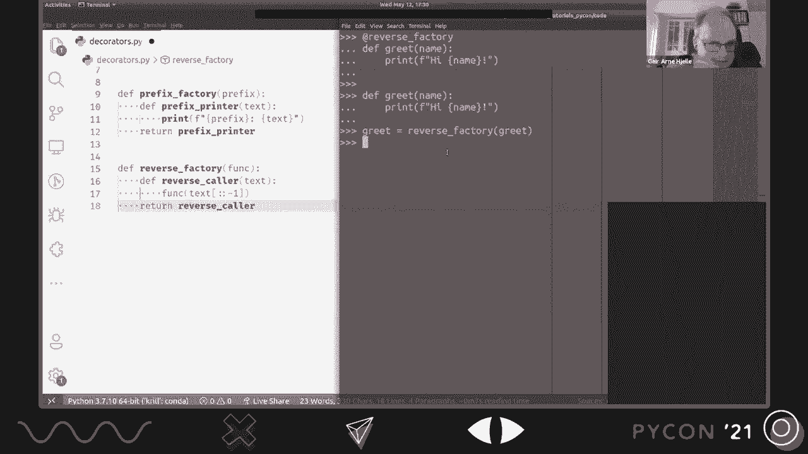

 So essentially the exercise just asks you to write a decorator that prints the word before。

 before calling the decorator function and afterwards。 So when we run it。

 we want it to look something， like this that if I define my grid function with before and after。

 then when I run grid icon， it should print before。 Sorry。

 it should print before and then it should print the， high icon。

 then it should print afterwards after。 I'll also。 I have just a small Google form where。

 if you want to， you can just post your suggested code to this one and I'll kind of try to pick one。

 of the solutions and kind of discuss it a little bit。 And then just before I let you lose on this。

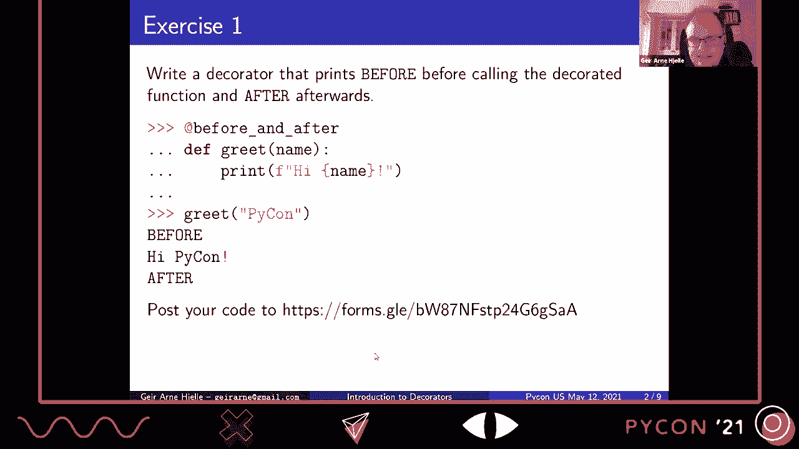

 I just want to point out again what actually made a reverse factory become a function。

 not sorry a decorator， what really happened there。 And the main or really the only thing that。

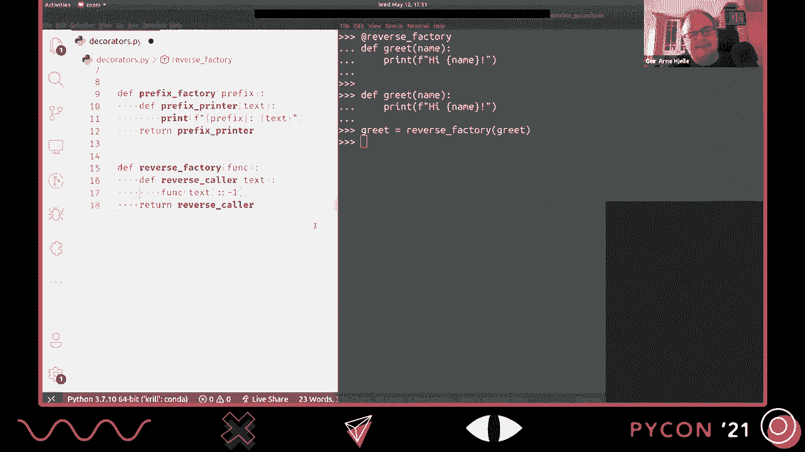

 it does is that it takes in a function， as you can see here。 So that should be the essentially。

 the only argument to your decorator should be a function and then it should return some function。

 again。 And what happens is that after you do the decoration， let's see here， so after you do this。

 at reverse factory， what has happened then is that the grid function right there has been replaced by。

 this wrapper function that we kind of have in the middle here。

 So that's kind of more explicit probably。 Here that the grid function has been replaced by whatever is returned from your decorator。

 So I'll leave this for enough for say about a couple of minutes， two， three minutes。 And once。

 you have your code example， just post it here， I'll put this link in the chat so you can find it in the chat。

 Let's see， I'll just copy it there I think。 So yeah。

 then good luck and looking forward to seeing your。

 examples。 So just put this in the chat in the middle and show the exercise again。

 And yeah， if you have any questions， feel free to post them in the chat or just unmute yourselves。

 Let's see if I should put this one up。

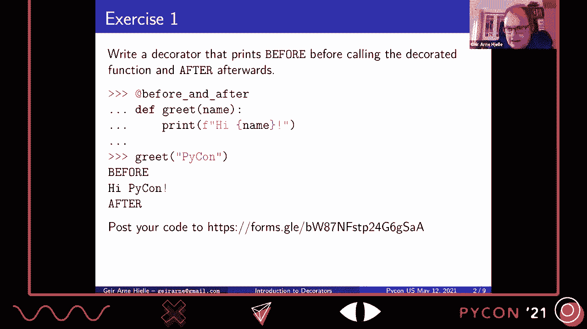

 [silence]。

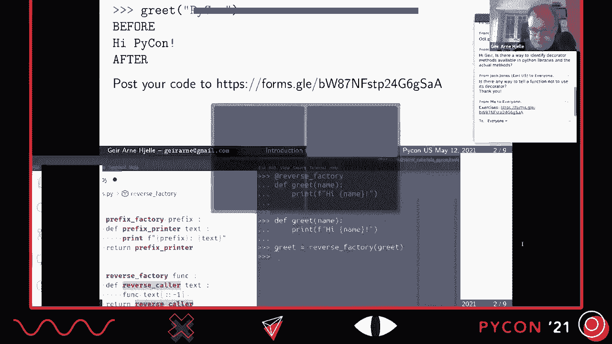

 [silence]， [silence]， [silence]， [silence]， [silence]， [silence]， [silence]， [silence]， [silence]。

 [silence]， [silence]， [silence]， [silence]。

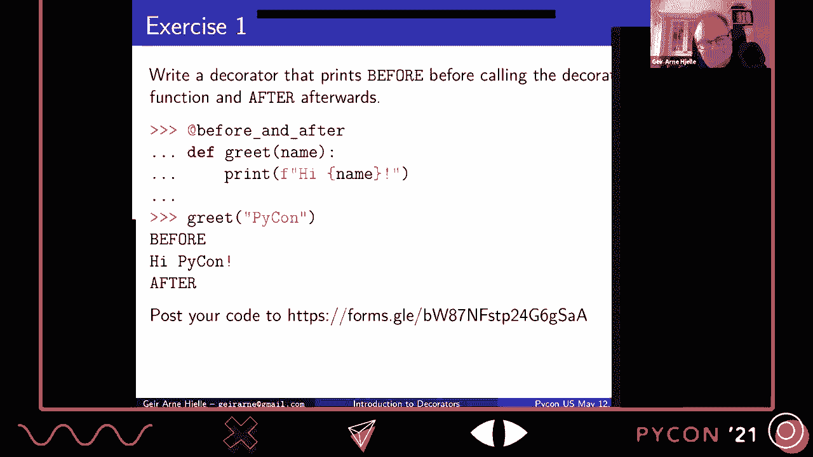

 Great， I see a couple of solutions are starting to roll in。 So that's great。

 And it seems like most of you have found， the way to do it essentially。

 So let me just show off a solution for this。 And what do we do？ As we said。

 we need the decorator to accept the function as its parameter。 And then。

 we have some kind of wrapper function inside。 I tend to just call it wrapper or you might want。

 to call it something more explicit like a wrapper before and after or something like this。 But for。

 now， I'll just call it wrapper。 That's the function that's actually being called。 So we wanted。

 to have this text argument。 And then I guess we just wanted to print before。 And let's see。

 then we wanted to call the function something like this。 And then we wanted to print after。

 And then finally， we just needed to return our wrapper。 Something like this。 So let's see if that。

 actually works。 So then we wanted to do， I want to apply this to my creature。

 where I'll just greet name like this。 And then if we do our usual greeting。

 we can see that it says before， I'll apply it on and after。 Now by itself。

 this is of course not a very interesting decorator。 But it does kind of show。

 off the flow of how the creators work。 And this is actually something that is a fairly typical。

 organization of your decorator。 So you'll have this inner wrapper function。 You'll do something。

 before you call the function。 You'll call the function， you'll do something after you call the。

 function。 So this kind of structure is something that you'll see repeated several times。

 So I'll just copy over this one。 Let's see。

 Okay。 So there you see that before and after as well。

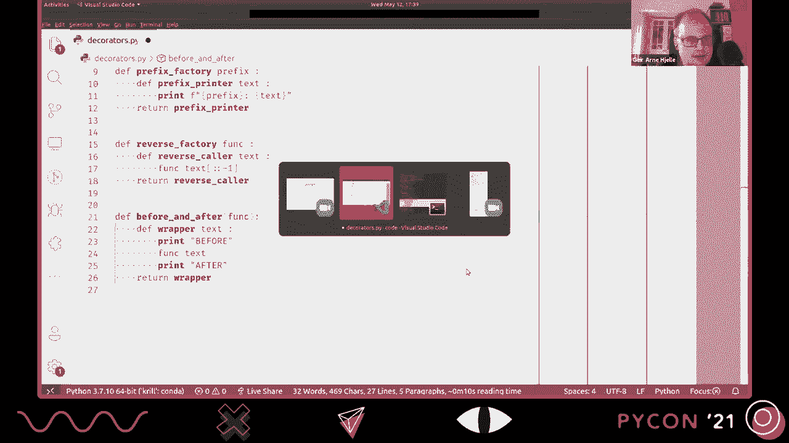

 And let's see。 What happens now if we use this decorator for some other function？

 So let's say that I have， I'll now create a very advanced function that I'll call， header。

 which can add two numbers。 So this one， is of course， I should just be using plots。

 But maybe I want my own header function for， some reason。

 And what happens if I try to decorate this one before and after？

 So if I now do before and after on top of this， that seems to work。 And let's say I now want to add。

 three and ten together。 Oops。 Then we actually get an error。 And what it says here is that the。

 wrapper。 So let's remember， let's see here， we have it over here， the before and after， the wrapper。

 that's the inner function。 So that's really what the other function is。 At the moment。

 it takes just one positional argument， but we gave it to。

 So the one positional argument that it talks about there is text as we have here。

 So what we actually did with this before and after was that we really tailored it very much to the。

 print function that we have been using in our examples。

 Or the grid function or any other that just takes in one string argument。

 Typically for your decorators， you want them to be much more general and。

 able to kind of handle most any function that makes sense。 So how can we do that？

 There is a concept in Python that is called unpacking of lists。

 and it's used to kind of have an optional number of parameters。 So typically it will look something。

 like。 As an example here， the usual name for the arguments that we use here is， arcs and quarks。

 I'll talk about what those are in a minute， but let me just show you how this thing works。

 So my perimeters function here is just printing out its parameters really。 So what I'm doing here。

 I'm just using a little bit of f-string magic that's available in 3/8 that。

 if you throw in an equal sign， you can use it for simple debugging text like this。

 So this prints out what's the value of arcs， what's the value of quarks that we define here。

 And you can see actually the special thing with these is not their names。

 So this arcs here could really be called anything。 The special thing is the star in front。

 And similarly， for the quarks， it's the two stars in front。 So what do these things do？

 So let's say that I have， something like this instead。

 So what it does is that it just eats up parameters that you pass， into the function。

 At the ones with the one star， so the arcs just takes any of the parameters here。

 that you have not named。 So they're just passed in positionally。 So you can see one and two。

 passed in here as a tuple。 And then anything that you passed in as name arguments or keyword arguments。

 is stored in the kw or quarks as a dictionary。 But what this does for us is just give us an opportunity to make our before and after。

 the creator much more general。 So let's see。 I'll just post this one also over here。

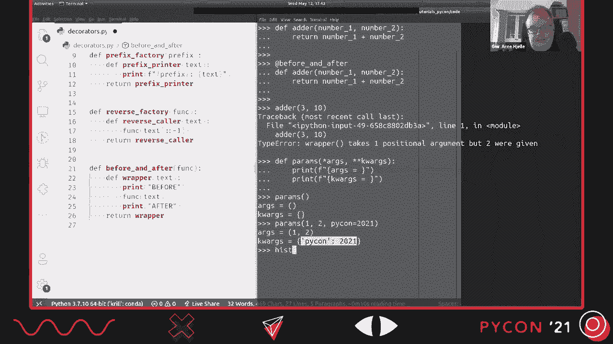

 And then let's see。 So if I now want to rewrite my before and after。

 and kind of make it accept any kind of argument， what I can do then is just change my wrapper。

 So I'll have arcs and the keyword arcs quarks for the wrapper。 And then when I call the function。

 I'll just call the function with the same arcs and quarks。 Again with the stars。

 And the meaning of the stars is slightly different in the two cases essentially。

 So this in the first， one when they're used when you define the function that's kind of collecting the arguments for you。

 And then down here it's exploding in the back essentially。

 But what this allows us to do now is that if I redecorate my adder with this new before and after。

 function， that means that I should now be able to actually call the adder without getting the error。

 that we had earlier。 Because now this three and 10 are passed into this arcs。 So that would be。

 a tuple that is then exploded there and then really passed down to our function。

 So that's definitely much better。 One thing is still missing though。 You can see here our adder。

 Did the before it did the after。 But the actual return value from adder is lost。

 And where did the return value go？ Well， again， let's see if we can figure this one out。 So adder。

 is really just this wrapper function。 And if we look closely at the wrapper function we have here。

 we can see that the wrapper doesn't return anything at all。

 So what happens then is that it implicitly， returns none。 So I guess if I were to print my adder。

 you can see here that it prints out none。 So， because wrapper returns none。

 that kind of becomes the return value of our decorated function。 So that's not good。

 So we also want to make sure that our decorator is usually at least return。

 the value from the function。 So the only thing we need to do then is just make sure that we。

 capture the return value from the function。 So I'll go in again and edit my before and after。

 And in this case， I'll， since we're doing something after recalling the function。

 I want to capture the return value of the function。 And then once we're done with our after stuff。

 I can just pass that return value out like this。 So then if I redecorate one more time and run our adder。

 you can see that it prints out， before it prints out after and then it returns 13。

 So the output here doesn't really show this， but let's say I do this instead。

 then it becomes clear what's happening。 You can see it prints out。

 before it prints out after and then the result has been returned from either。 So now we have。

 a decorator that can really handle most functions at least。 It will kind of take in any kind of。

 argument and it will return the value from the function。 It just does whatever it wants to do。

 Before and after it calls the function。 So I'll store our latest version of before and after just here out on the right。

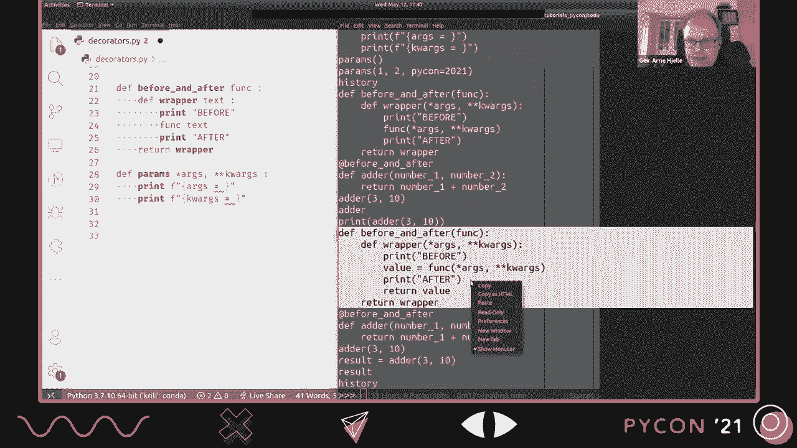

 And then we have a second exercise。

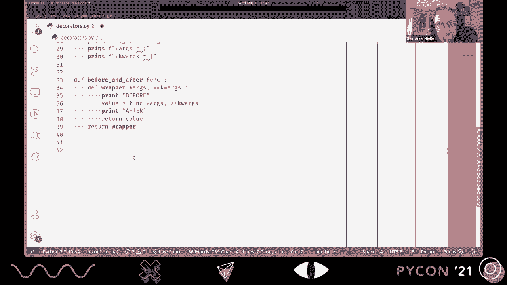

 And this is kind of just to see that we can。

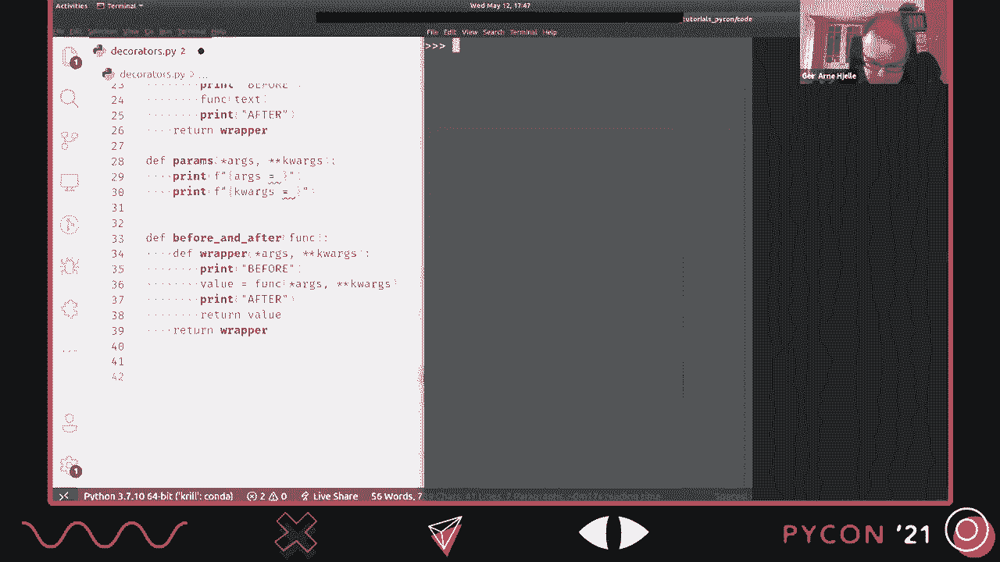

 handle the return values and those kind of things。 So essentially it's also quite straightforward。

 It's right the decorator that runs the decorated function twice。

 and then returns a two tuple with both the return values。 So in this example that's down here。

 I call the decorator do twice and I applied it to a function I'll just call roll dice。

 which just returns one random integer between one and six。 And then you can see if I actually。

 call roll dice now with decorated do twice， you can see that I actually get two random numbers。

 So that happens because the decorator runs my function twice and returns both values here。

 So that's exercise two。 I'll go with it then I'll give you a couple of minutes and if you find。

 a good answer just post it on the Google form that the same the same link is the previous one。

 [ Silence ]， [ Silence ]， [ Silence ]， [ Silence ]， [ Silence ]， [ Silence ]， [ Silence ]。

 [ Silence ]， [ Silence ]， [ Silence ]， [ Silence ]。

 [ Silence ]， [ Silence ]， [ Silence ]， [ Silence ]， [ Silence ]， [ Silence ]， [ Silence ]。

 [ Silence ]， [ Silence ]， [ Silence ]， [ Silence ]， [ Silence ]， [ Silence ]， [ Silence ]。

 [ Silence ]。

 [ Silence ]， [ Silence ]， [ Silence ]， [ Silence ]， [ Silence ]， [ Silence ]， [ Silence ]。

 [ Silence ]， [ Silence ]， [ Silence ]， [ Silence ]。

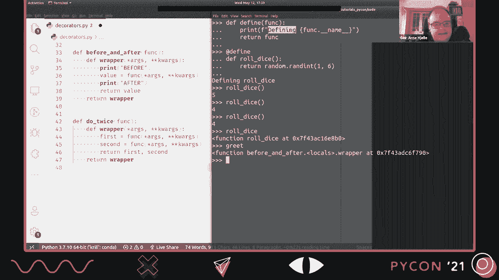

 [ Silence ]， [ Silence ]， [ Silence ]， [ Silence ]， [ Silence ]， [ Silence ]， [ Silence ]。

 [ Silence ]， [ Silence ]， [ Silence ]， [ Silence ]。

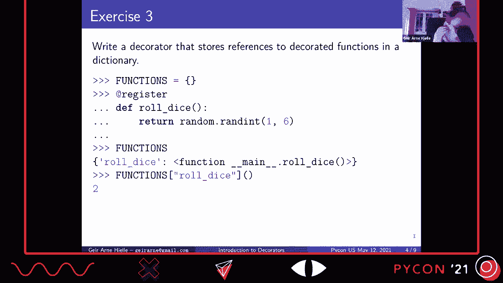

 [ Silence ]， [ Silence ]， [ Silence ]， [ Silence ]， [ Silence ]， [ Silence ]， [ Silence ]。

 [ Silence ]， [ Silence ]， [ Silence ]， [ Silence ]， [ Silence ]， [ Silence ]， [ Silence ]。

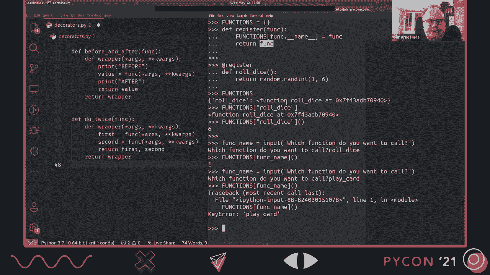

 [ Silence ]。

 [ Silence ]， [ Silence ]， [ Silence ]， [ Silence ]， [ Silence ]， [ Silence ]。

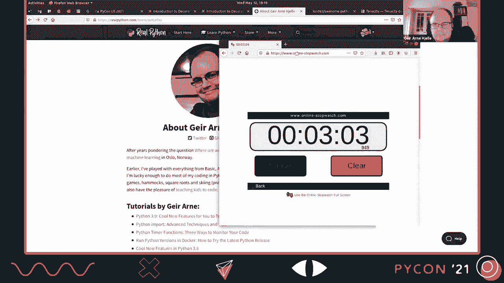

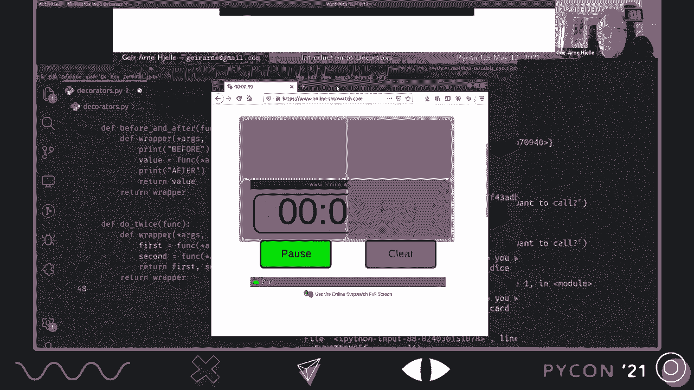

 [ Silence ]。

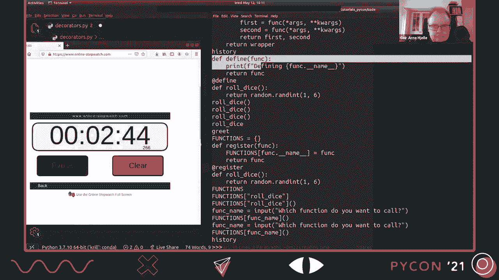

 [ Silence ]。

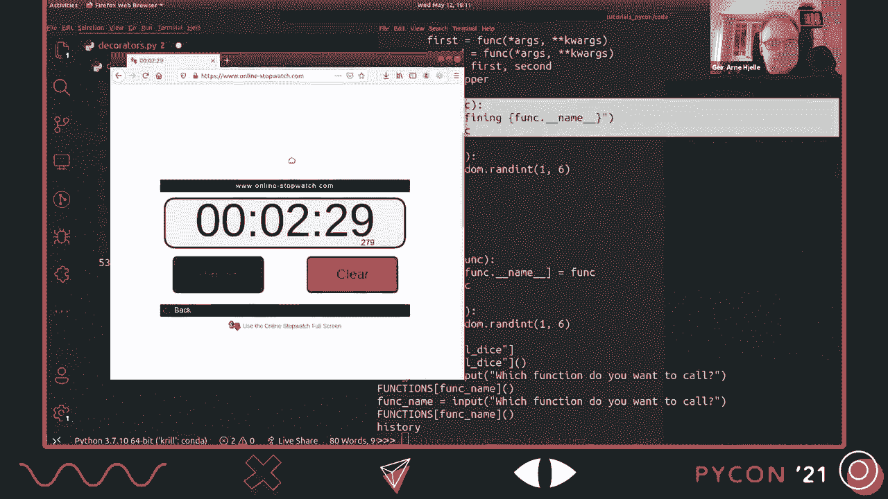

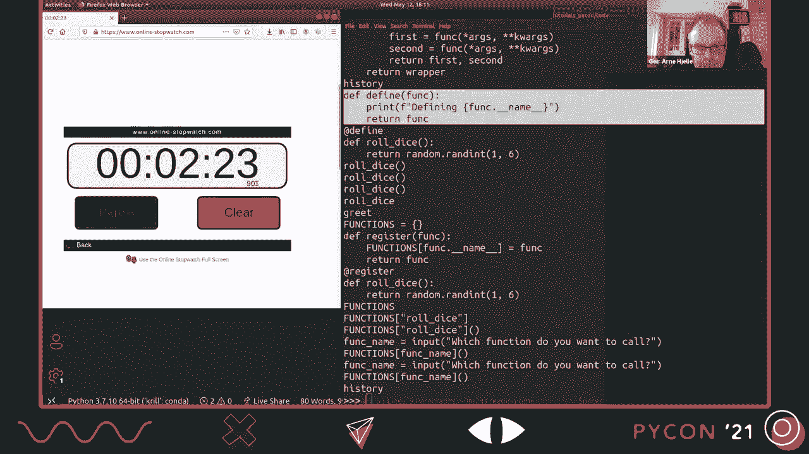

 [ Silence ]。

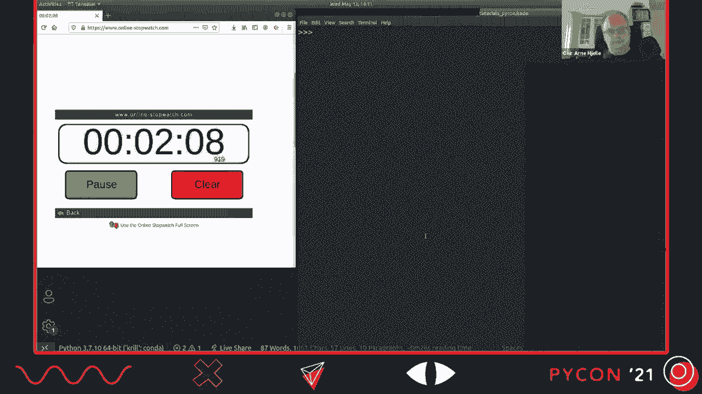

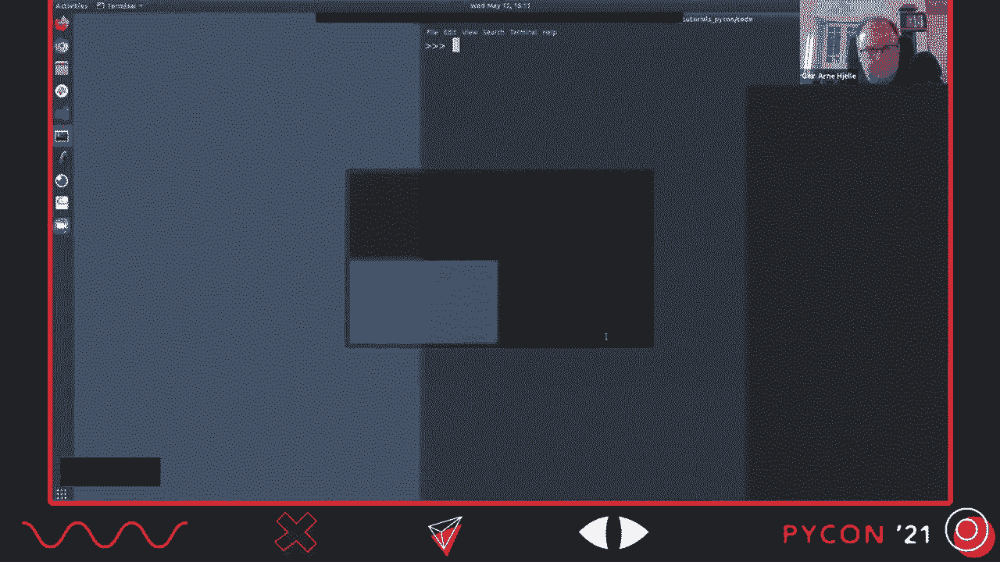

 [ Silence ]， [ Silence ]， [ Silence ]， [ Silence ]， [ Silence ]， [ Silence ]， [ Silence ]。

 [ Silence ]， [ Silence ]， [ Silence ]， [ Silence ]， [ Silence ]， [ Silence ]， [ Silence ]。

 [ Silence ]， [ Silence ]， [ Silence ]， [ Silence ]， [ Silence ]， [ Silence ]， [ Silence ]。

 [ Silence ]， [ Silence ]， [ Silence ]， [ Silence ]， [ Silence ]， [ Silence ]， [ Silence ]。

 [ Silence ]， [ Silence ]， [ Silence ]， [ Silence ]， [ Silence ]， [ Silence ]， [ Silence ]。

 [ Silence ]， [ Silence ]， [ Silence ]， [ Silence ]， [ Silence ]， [ Silence ]， [ Silence ]。

 [ Silence ]， [ Silence ]， [ Silence ]， [ Silence ]。

 [ Silence ]， [ Silence ]， [ Silence ]， [ Silence ]， [ Silence ]， [ Silence ]， [ Silence ]。

 [ Silence ]， [ Silence ]， [ Silence ]， [ Silence ]， [ Silence ]， [ Silence ]， [ Silence ]。

 [ Silence ]， [ Silence ]。

 [ Silence ]， [ Silence ]。

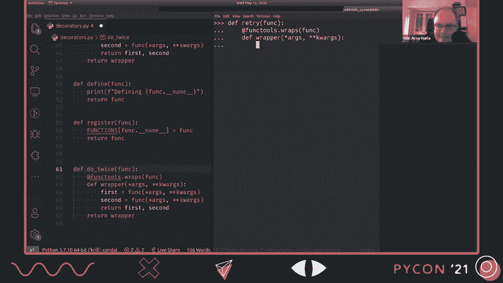

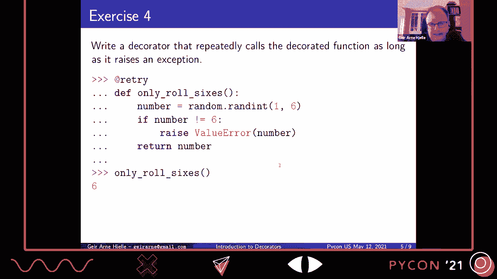

 [ Silence ]， [ Silence ]， [ Silence ]， [ Silence ]， [ Silence ]， [ Silence ]， [ Silence ]。

 [ Silence ]， [ Silence ]， [ Silence ]。

 [ Silence ]， [ Silence ]， [ Silence ]， [ Silence ]， [ Silence ]， [ Silence ]， [ Silence ]。

 [ Silence ]。

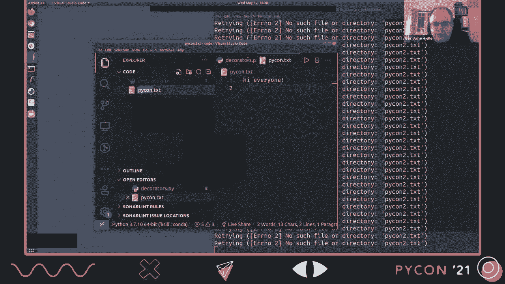

 [ Silence ]， [ Silence ]。

 [ Silence ]， [ Silence ]。

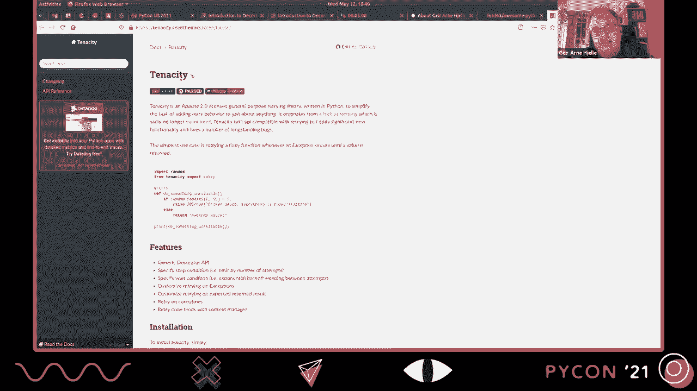

 [ Silence ]， [ Silence ]， [ Silence ]， [ Silence ]。

 [ Silence ]， [ Silence ]， [ Silence ]， [ Silence ]， [ Silence ]， [ Silence ]， [ Silence ]。

 [ Silence ]， [ Silence ]。

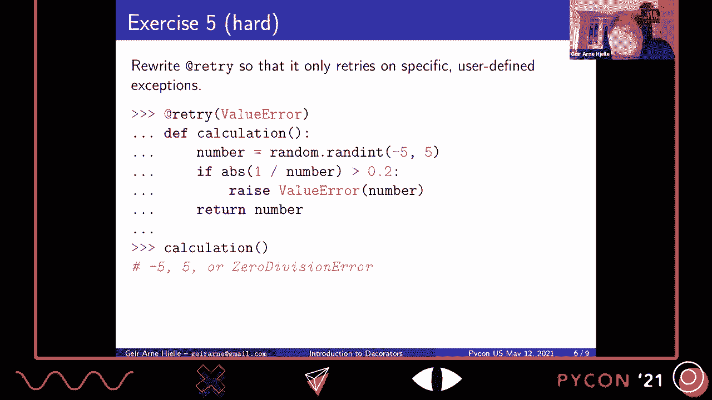

 [ Silence ]， [ Silence ]， [ Silence ]， [ Silence ]， [ Silence ]， [ Silence ]， [ Silence ]。

 [ Silence ]， [ Silence ]， [ Silence ]， [ Silence ]， [ Silence ]， [ Silence ]， [ Silence ]。

 [ Silence ]， [ Silence ]， [ Silence ]， [ Silence ]， [ Silence ]， [ Silence ]， [ Silence ]。

 [ Silence ]， [ Silence ]， [ Silence ]， [ Silence ]， [ Silence ]。

 [ Silence ]， [ Silence ]， [ Silence ]， [ Silence ]， [ Silence ]。

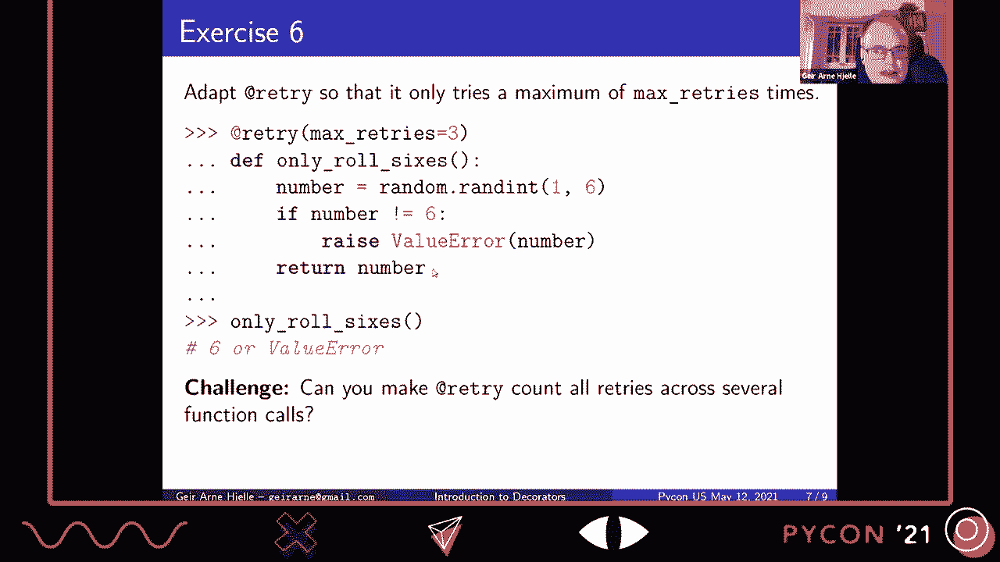

 [ Silence ]， [ Silence ]， [ Silence ]， [ Silence ]， [ Silence ]， [ Silence ]， [ Silence ]。

 [ Silence ]， [ Silence ]， [ Silence ]， [ Silence ]， [ Silence ]， [ Silence ]， [ Silence ]。

 [ Silence ]， [ Silence ]， [ Silence ]， [ Silence ]， [ Silence ]， [ Silence ]。

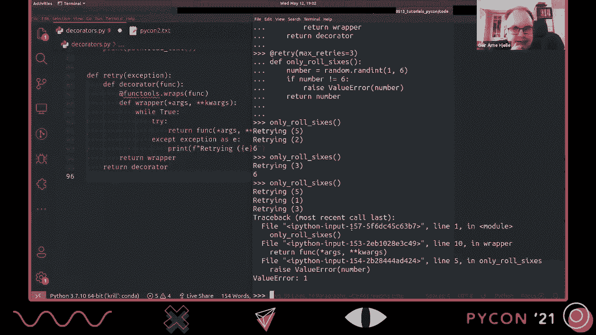

 [ Silence ]。

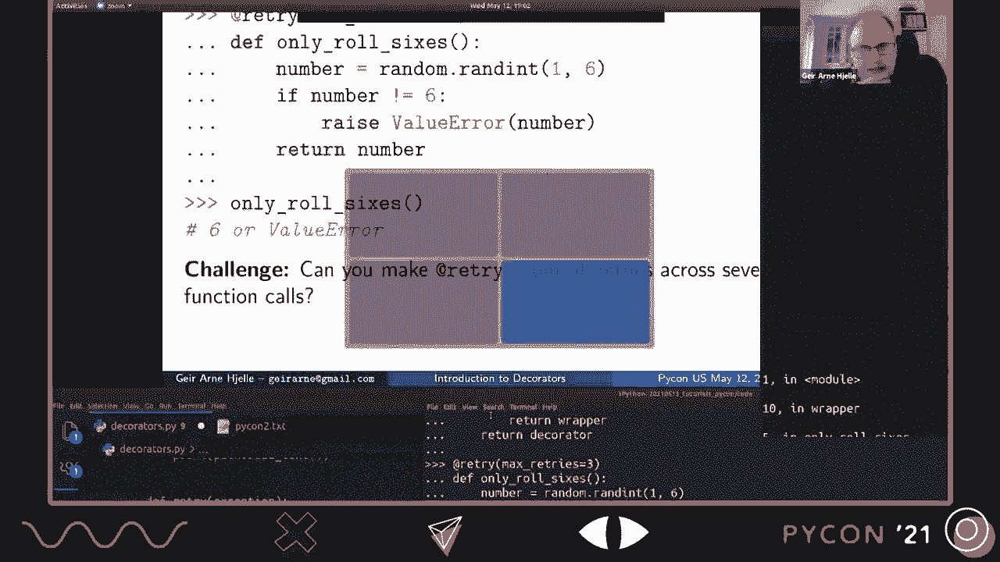

 [ Silence ]， [ Silence ]， [ Silence ]， [ Silence ]， [ Silence ]， [ Silence ]， [ Silence ]。

 [ Silence ]， [ Silence ]， [ Silence ]， [ Silence ]， [ Silence ]， [ Silence ]， [ Silence ]。

 [ Silence ]。

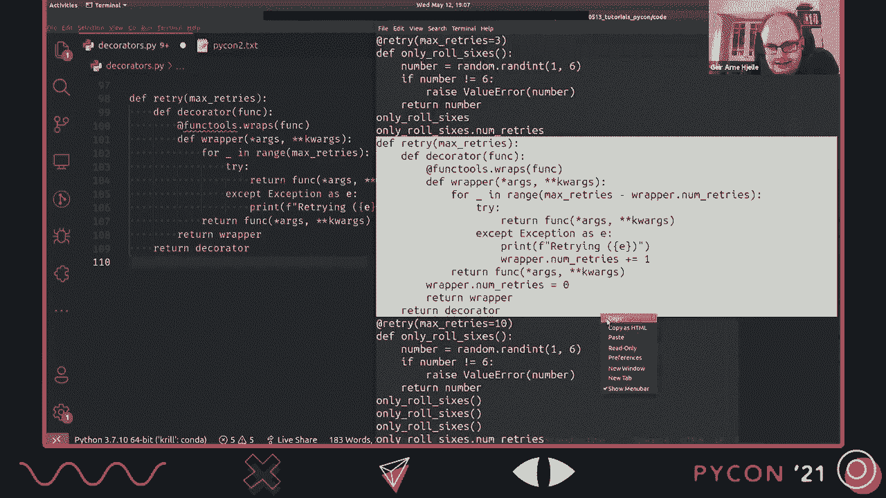

 [ Silence ]， [ Silence ]， [ Silence ]， [ Silence ]， [ Silence ]， [ Silence ]， [ Silence ]。

 [ Silence ]， [ Silence ]， [ Silence ]， [ Silence ]， [ Silence ]， [ Silence ]， [ Silence ]。

 [ Silence ]， [ Silence ]， [ Silence ]， [ Silence ]， [ Silence ]， [ Silence ]， [ Silence ]。

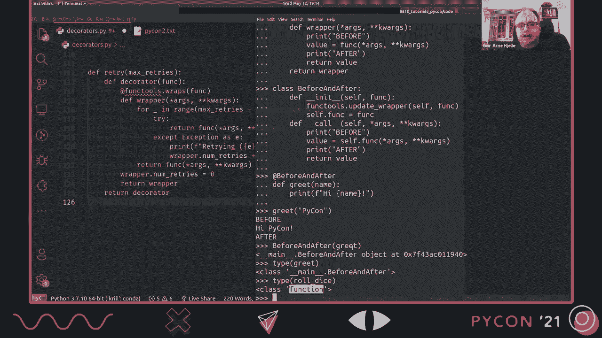

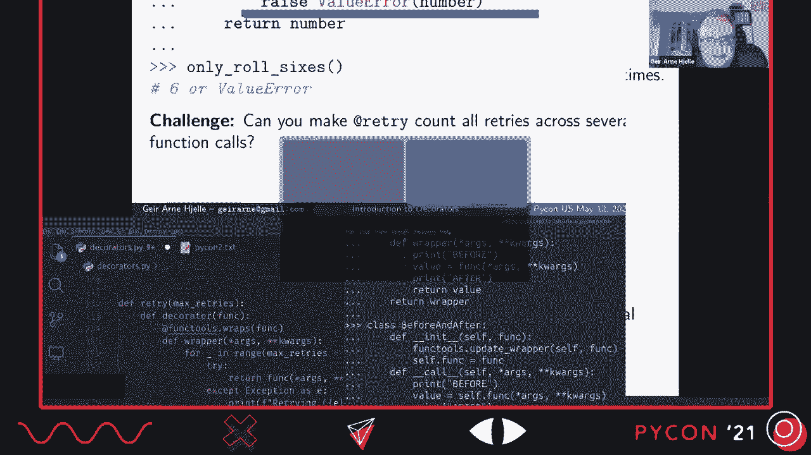

 [ Silence ]， [ Silence ]。

 [ Silence ]。

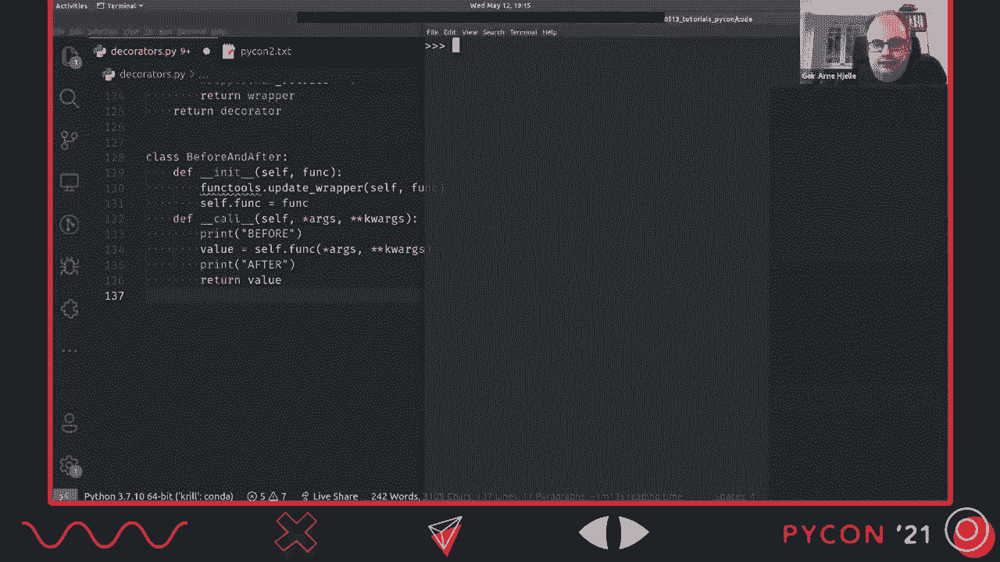

 [ Silence ]， [ Silence ]， [ Silence ]， [ Silence ]， [ Silence ]， [ Silence ]， [ Silence ]。

 [ Silence ]， [ Silence ]， [ Silence ]， [ Silence ]， [ Silence ]， [ Silence ]， [ Silence ]。

 [ Silence ]， [ Silence ]， [ Silence ]， [ Silence ]， [ Silence ]， [ Silence ]， [ Silence ]。

 [ Silence ]， [ Silence ]， [ Silence ]， [ Silence ]， [ Silence ]， [ Silence ]， [ Silence ]。

 [ Silence ]， [ Silence ]， [ Silence ]， [ Silence ]， [ Silence ]。

 [ Silence ]， [ Silence ]， [ Silence ]， [ Silence ]。

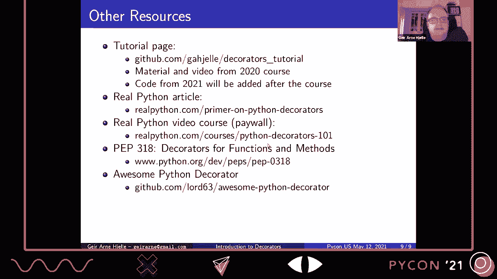

 [ Silence ]， [ Silence ]， [ Silence ]， [ Silence ]。

 [ Silence ]， [ Silence ]。

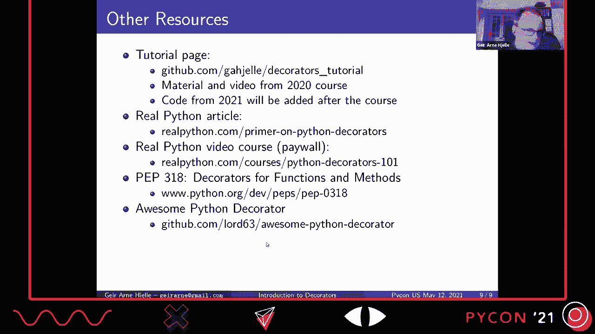

 [ Silence ]， [ Silence ]， [ Silence ]， [ Silence ]， [ Silence ]， [ Silence ]。

 [ Silence ]。

