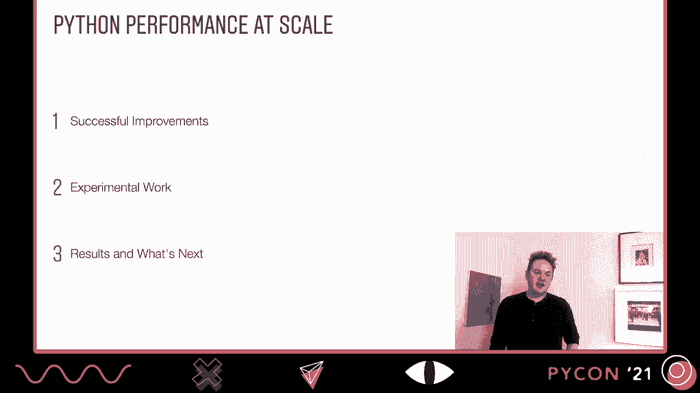
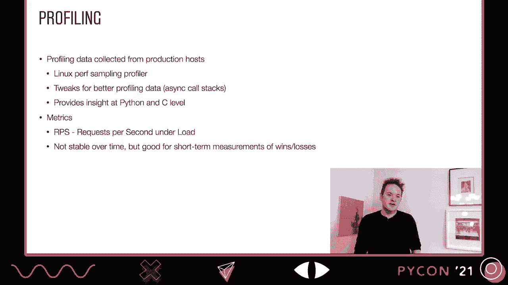
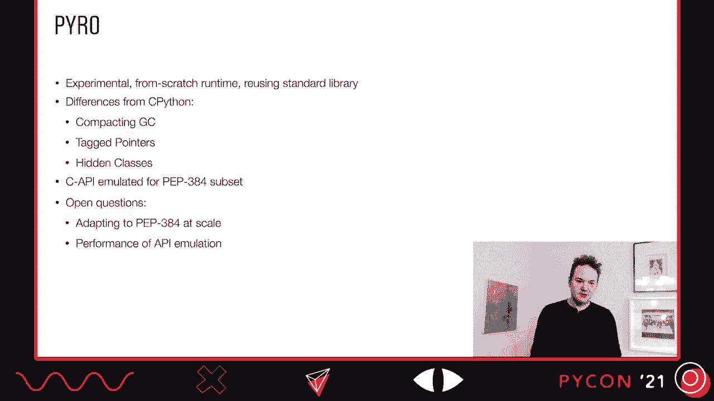
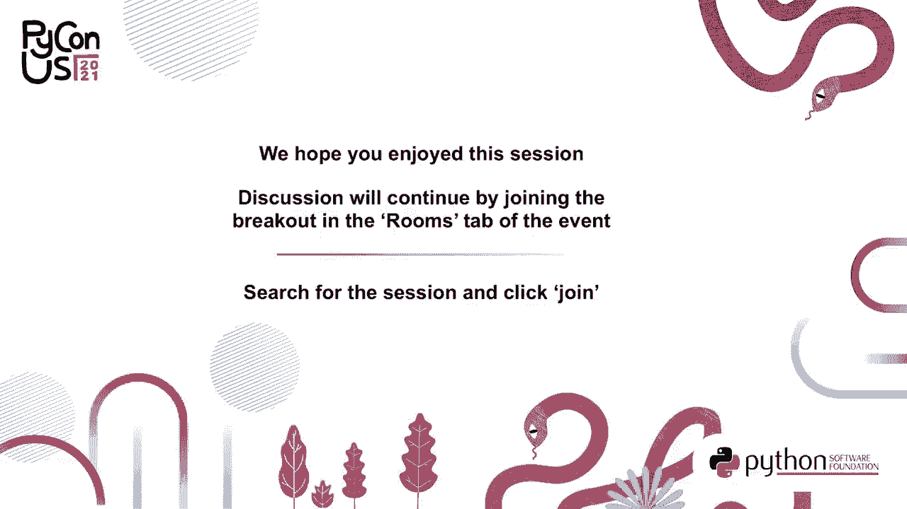

# P3：TALK _ Dino Viehland _ Python Performance at Scale - Making Python Faster at Ins - VikingDen7 - BV19Q4y197HM

 Hi， my name is Dena Veland and today I'll be talking to you about Python performance。

 at scale and how we make Python faster in Instagram。 We'll look at a few different things。

 First we're going to look at some of the successful improvements that we've made to。

 see Python and we have our own fork of it that we call sender。

 We'll look at some more experimental work both in sender and beyond。

 And finally we'll look at the results of our work and what's next for us。

 But before I get into that， let me first talk about Python and Instagram。

 This is going to be a super quick review for those of you who have seen other talks about。

 Instagram。 What is Instagram？ It's a monolithic web application that runs on Django， Python 3。8。

 and uses UWSGI as the， web server。 For those of you who aren't familiar with UWSGI。

 the way it works is that there's a parent， process and then several child processes get created。

 And these child processes are what serve the actual workload。

 These will spawn and respawn over the lifetime of the application and serve all the requests。

 We do a lot of profiling on our workload to understand what we need to make faster。

 And the way we do this is with the Linux Perf sampling profiler。

 We've done a few tweaks to the runtime to get a little bit of better data， especially around。

 async call stacks。 And we get really good insights both at the Python and the C level that we can drill into。

 and kind of mix and match those views and understand what's going on。

 We look at one main metric to improve our performance， which is requests per second under load。

 We drive our servers up to a 90% level of load and we see how many requests they're able。

 to serve at that level。 It's not really a metric that's stable over time。

 but it's good for just testing out the， win and loss of an individual change。

 As the application changes， different requests need to use more or less CPU。

 And so that's the reason why it's not good over a long period of time。

 So let's dive in and look at the successful improvements that we've made to our fork of， CPython。

 which is center。

 One big change that we've made is to leverage that relationship between the parent and child。

 processes that happens in the Uizgi server。 These processes end up sharing a bunch of memory and the more we can maximize that。

 the， more memory that we have for the children to actually serve the requests。

 The way shared memory works is when a child writes to one of these pages， it ends up no。

 longer being shared and the child process gets its own copy。

 So we want to avoid that as much as we can。 A large source of these writes is just from the reference counts。

 the objects that live， in the heap before we fork。

 So what we've done is we've modified the reference count to use a high bit in it that。

 marks objects as being immortal。 And this just means that they're never actually going to die inside of the child processes。

 This means that we have to update Pi in Gref and Pi Defref， the macros which alter the。

 reference count。 And every single time we do one of those。

 we need to avoid updating the reference count。 This actually adds a significant amount of overhead in the normal case of just running。

 normal code， not in this forked model， but the memory savings actually make it more than。

 worth it in our workload。 Pre fork， the heap is actually collected and it's traversed。

 And all those objects that are in the heap are marked as being immortal。

 And this actually gives us a 5% win in requests per second in our production workloads， which。

 is pretty amazing。 Another area that we've focused a lot of effort is on async IO。

 So one big change that we've made is just avoiding using stop iteration to send and receive values。

 into async functions。 This is creating an exception object， which is a major source of overhead。

 And on simple benchmarks we see improvements of it being 1。6 times faster。

 We actually upstream this work into Python， so it's available in Python 3。10 through a。

 couple of different patches that have improved it。 And this was yet another 5% win in production。

 which is really， really huge for us。 Another way that we've approved async IO is something that we call eager evaluation。

 Frequently you have something that would be like， we'll wait some call。

 And right now that needs to go off and schedule that function to run onto the event loop。

 But a lot of functions will just complete synchronously and you don't have to wait for them。

 So if it completes without blocking， we avoid the creation of the code routine。

 And instead what we do is we have a singleton wait handle that gets returned。

 And this actually has the value and it gets immediately consumed at the call site。

 There's only one in the entire process。 We also use this with async IO dot gather。

 And the way this is implemented is that there's a new vector call flag to indicate that something。

 is awaited。 And so functions recognizes flag as do does async IO dot gather。

 And this is a 3% win in production。 Another big optimization we've done is adding inline cache and support into the bytecode。

 The way this works is hot methods get a hidden copy of the bytecode。

 And you can see the data structure for that over on the right。

 This includes a copy of the bytecode as well as a bunch of inline caches as well。

 When we encounter an opcode that we can optimize， we replace the existing opcode with a more。

 specific one which can simply do a type check and do a fast dispatch that doesn't have to。

 go through the full normal dynamic lookup。 Overall this has been a 5% win in production for us which is again another really big win。

 So let's look at some of the bytecodes that we end up replacing and what we replace them， with。

 Load adder is one of the most common opcodes that we use because we look up a lot of attributes。

 Every Python program does。 And there's a lot of different variations of things that we can look up attributes against。

 A lot of time attributes are methods which are descriptors。

 A lot of time attributes are instance members stored in a dictionary。

 Python also has something called split dictionaries where the dictionary layout is shared between。

 multiple instances。 And of course we have things like types and modules and we have polymorphic call sites。

 as well where the attributes are being looked up against multiple objects。

 And the opposite of loading attributes is of course storing attributes。

 This doesn't happen quite as much and it doesn't happen quite with as many sort of variations。

 For example you don't do a lot of stores against types。

 So this one ends up being a lot simpler and we have a lot fewer replacements for it。

 Load global is of course a big big thing。 People look up the names of types and other things that they've imported all the time。

 And so we have a simple replacement for that which is load global cache and we'll see how。

 that works in a little bit more detail in the next slide。

 And then we have some other things that we've optimized as well like binary subscription。

 And this isn't all the outputs that we've replaced but it gives you a pretty good feel。

 of the surface area。 So the way we've optimized our global lookups is with something that's called dictionary。

 work watchers。 And watchers provide updates to global and built-ins when they're modified。

 So we start off with the built-ins dictionary which has all the built-ins that you're familiar。

 with。 Things like min， max， type， int and so on。 And then a module has its own dictionary where you've defined the things。

 And some of these things might just be top level things like x equals one。

 Other things might be shadowing things that are built-ins like max here has been shadowed。

 to return min。 I don't know why you want you to want to do that。 Let's say you did。

 And finally we have a function here which is actually using the global as they're defined。

 So it's calling max and passing xn and 42。 So we'll end up with three different caches for these all the globals that are inside of。

 this function。 Max will end up storing the value for the max function that's in the module。

 X will end up storing the value for x that's in the module and min will end up storing the。

 value that's min in the built-ins。 And if we were to go and mutate either the module or the built-ins。

 these little holders， would get updated when that mutation happens。

 So that all we have to do is retrieve a value from one address in memory and we know exactly。

 what the built-in is with no extra chunks。 The way we've implemented this is to reuse the existing version tag to mark watch dictionaries。

 And the way that works is dictionaries are marked with the low bit in the dictionary version， tag。

 Now whenever we're updating a dictionary version， we actually bump it by two instead of bumping。

 it by one。 And we can just check that low bit to know whether or not a dictionary is being watched。

 whenever a dictionary gets mutated。 So this gives us a really low overhead way to implement this feature。

 And when we integrate this in with shadow bytecode， because it was originally an optimization。

 that we used in the JIT， which I'll talk about soon， it ended up being an extra 5% when on。

 top of the existing shadow bytecode。 We've done a bunch of targeted optimizations as well。

 One of those is fixed dunder built-ins。 So dunder built-ins is an attribute that exists at the module level。

 And if you were to redefine it in CPython， you'll actually get a different set of built-ins。

 There's a caveat there， you only sometimes get those additional sets of built-ins。

 There's some weird CPython implementation details that kind of thwart that。

 But this is actually documented as a CPython implementation detail。

 And we just got rid of that implementation detail。

 So that ended up giving us about a 1% when on requests per second。

 We've done some micro optimization throughout the entire codebase。

 When that ended up being kind of significant on benchmarks， so it's a PyType lookup， and。

 we've upstream this so it'll be in Python 3。10。 And on some benchmarks， this is 1。19 times faster。

 So that's on InBody， but there are a couple of dozen benchmarks that showed improvement。

 with a minimum of 1。03x improvement。 So that was really kind of meaningful。

 At least as far as the micro benchmarks go。 Shockingly。

 this was really hard for us to measure in production because it is just a。

 really micro tweak to what's going on when we're doing a cache lookup。

 So we don't actually attribute anything there。 We've done a lot of work to avoid thread state lookup throughout the runtime。

 This is work that has been happening upstream as well。 So one nice thing is as we upgrade。

 we'll have less patches for these sorts of things。

 We've also done some work around prefatching where loading certain attributes， especially。

 around frame creation， ends up going off in reading memory。

 We can just prefetch that earlier and avoid some stalls。

 A huge amount of improvements have actually come from just build system improvements。 So normally。

 CPython is optimized using profile guided optimizations。

 And those optimizations go through and look at what code's running and optimize those specific。

 code paths， bring branches that are frequent closer together， in line things， things like， that。

 And by default， CPython just runs PGO against a set of tests。

 And that's what we were doing for a long time as well。 We also use something called bolt。

 which is an additional binary optimizer that improves， the layout of the binaries even more。

 And for both of these， we switch to actually using data from live production host rather。

 than using the test cases， which include many paths that we're not going to take and don't。

 necessarily include all the paths that we will take。

 Another big source of wins has been moving our UWSGI binary onto huge pages。

 This helps reduce the instruction translation look-aside buffer cache misses。

 And that was about a 3% win。

 So that's pretty awesome。 We've also done a whole bunch of other experimental changes。

 These are still things that we're working on and hope will pan out， but it's still a。

 little bit too early to test。 So one of the biggest changes to sender has been the development of a custom chat。

 This is a method at a time jit， and we have nearly full coverage of all of the opcodes， now。

 Most of the unsupported opcodes are things that are super rare or that we don't really， care about。

 Things like import star， which are only going to occur at the top level of the module， which。

 we're never going to jit。 The jit works with both the front end and the back end。

 The front end lowers to our HIR intermediate representation。

 This does things like single static assignment。 We have a ref count insertion pass that runs over the final code to actually insert our。

 in-croughs and deckrefs so that they can be as optimal as possible。

 And we do some other optimization passes in here as well。 So if we take a simple function。

 this is just assigning an attribute to a class， it ends， up turning into this HIR initially。

 And so this is pretty straightforward。 We're loading self。 We're loading the value one。

 We check to see if self is defined。 This is something that happens in the interpreter loop for every single load of a variable。

 We store the value one and we return none。 When we take this through all of the passes。

 we end up with this slightly different tree。 And so you can see here that we've managed to get rid of the variable check on self。

 It's a parameter。 It's never been deleted。 We know it's always going to be signed。

 And you can also see that we've inserted some in-croughs on the none in the return。

 That wasn't there before。 But the other interesting thing is there aren't actually any in-croughs on other things。

 Like we don't have to in-crough self or in-crough the value of one。

 We know that those are going to be a live-through lifetime of the function。 After going through HIR。

 we lower things to our lower intermediate representation。

 Here things like register allocation happen and we do some targeted optimizations while。

 lowering as well。 Things like direct dispatch to known functions。

 And this uses as in JED for its final X64 code generation。 So if we take that same function。

 this is what the LIR ends up looking like。 So you can see we start seeing actual registers in here where we're binding the argument to。

 RDI。 You can see that we load the constant。 The store is a complicated call to a helper。

 but it's a call。 And then we load the const for none and we do it in breath on it。

 And this bit test that you see in here is actually part of the immortalization that we。

 do that makes this a little bit more expensive。 And finally， return the value of none。

 Another experiment we've been working on is something that we call static Python。

 This provides you with the performance gains that you get from something like MyPys。C。 or， Sython。

 but you just use normal Python files and load them at runtime like normal。

 This all starts with a source loader which recognizes files that have been marked with。

 a import under static。 It supports cross module compilation and so we'll go off and analyze other modules that。

 the static module is importing as well。 There's a new set of byte codes for static features。

 things like invoke function and load， field。 And rather than taking simple parameters like what attribute to load。

 it takes a descriptor， which indicates the class and field that we're loading it from。

 And that can be bound more efficiently at runtime。 It just uses pet 44 annotations like MyPys。C。

 does， but we also added several new types， things like N64 which live in the DUNR static module。

 And these allow you to use primitive integer arithmetic in a very efficient way。

 Static Python code has to interrupt with normal Python code in a safe manner and therefore。

 we enforce type checks at boundaries。 So when you call in to statically type Python code from normal Python code。

 we'll validate， the arguments are correct on the function call。

 And we're using a new static compiler for this。 This is based upon the Python 2 compiler package which has been updated to Python 3 and we've。

 added support for emitting the static opcodes as well。

 So the compiler is entirely written in Python。 So let's take a look at what some static Python looks like。

 So it all starts with the import under static。 And this marks that the static loader should be used and that this should be statically。

 compiled。 We've got some things like from static import in 64。

 And so this is type annotation that can be used to indicate that some things are primitive。

 type and it will void a box integer and significantly increase the performance if you're doing simple。

 integer arithmetic。 We can do things like use final constants so final int is a normal type annotation and。

 this will allow us to treat this global as a constant and actually inline it into the。

 generated code。 So I mentioned that we do type checks at the boundaries and so that's actually done by。

 emitting a chat marks opcode when we call into functions。

 And we'll actually skip this opcode when we're calling from static Python to static Python。

 But here's what it looks like for this function。 We make sure that self is an instance of C and that next is an instance of C or none。

 We transform the initialized slots in Dunder in it， the initialized fields in Dunder in。

 it into slots。 And so that ends up with a Dunder slots assignment in the generated code for the class。

 And we've extended this to support slot types。 And so here we can actually say that length is a in 64。

 And that's just a normal struct member in the C Python parlance。

 And next ends up being typed to this optional C。 And we've added a new type descriptor that。

 also does type enforcement when you assign to it。 For our field stores。

 we end up generating something like this where we have a store field。

 opcode and we say what instance and what name we are assigning to。

 And when this turns into generated code， it's literally just a single move instruction that's。

 moving to the correct offset， which is much more efficient than having to go through a。

 whole set of system to figure out what attribute we're assigning to and where that lives。

 And then things like this primitive integer arithmetic actually turning the special op。

 codes as well。 And when we jit those， those turn into simple X64 instructions to load a simple integer and。

 to do the multiply。 Another big experiment we're working on is something that we call pyro。

 which is an experimental， from scratch runtime that reuses the C Python standard library。

 There's several significant differences from C Python。 It has a compacting GC。

 It uses type pointers that allows us to treat integers or floating point types as primitives。

 and uses hidden classes which give it a really efficient way to provide inline caching。

 We use the C API PEP 384 subset for support in C extensions。

 And there's several open questions about pyro。 There's the difficulty in adapting a PEP 384 at scale。

 Most modules are not written to PEP 384 and there's the performance of that API emulation。

 So what's next？ One thing we'd like to work on more is upstreaming some of our changes。

 We've seen from the previous slides that have been various things that we've already upstreamed。

 And there's a lot of things in here that are too big and experimental for us to upstream。

 like the JIT or static Python。 But there's a lot that the community could benefit from as well。

 And it helps us out too because it would be less for us to upgrade from version to version。

 Now let's go ahead and jump in and look at some performance results。

 Measuring our production improvements is kind of a little bit difficult。

 We've seen lots of additive things， you've seen all of the percentages as we've gone through。

 the slides， but you can't just add them up。 So we estimate that's probably around a 20% to 30% win。

 maybe closer to a 30% side in requests， per second。

 We can look at micro benchmarks or the PyPerformance Benchmark Suite and see kind of where our wins。

 are overall。 This isn't something that we usually do。

 We're really a lot more focused on looking at the performance in production。

 And so this is actually the first time that we've run the entire PyPerformance Benchmark。

 against Cinder and CPython to see how they compare。

 We do focus on a couple of random benchmarks and run those regularly。

 Those include Richards and Delta Blue and shockingly those are the two that we do the best on here。

 But these numbers are baseline to CPython。 So CPython is 1x over here on the right and a smaller bar represents a less run time for。

 that benchmark。 So you can see with Richards it's close to a 4x win and kind of as we go through the benchmarks。

 these are sorted by order of performance and something that we call the JitnoFrame mode。

 And this is a mode where the Jit runs but it doesn't use CPython frames at all。

 It doesn't create them。 We're not yet using this in production。 There's still a few issues with it。

 But this is ultimately the mode that we intend to run on long term。

 The green bars here are just the normal Cinder Jit and so those actually have frames。

 And then the blue bars are just Cinder。 So all the various optimizations excluding the Jit。

 These wins kind of continue through these other benchmarks。

 And you can see that generally speaking the Jit is a win。 Sometimes Cinder is a loss。

 We haven't really dug into these yet。 And then there's a set of things that in general Cinder is kind of losing out on。

 Startup time is a big one。 Two to three we end up spending a whole bunch of time in the Jit for some reason。

 And part of that may be that right now the Jit is really the way we Jit functions is tuned。

 for our workload heavily。 In that introduction we have a Jit list that enables the functions that we want to compile。

 and those get compiled in that master process。 But if we're not running in production we just Jit every single function the first time。

 it gets invoked。 And that isn't how you really want Jit to work in the real world。

 If you're only running a function once there's no reason to spend the overhead of Jit in it。

 So that would be an easy thing that would probably improve these numbers a lot。

 Another thing to dive into is just looking at a specific benchmark and in this case it's， Richards。

 So what we have here is the runtime on baseline CPython 3。8。 The runtime on normal Cinder。

 The runtime with the Jit。 The runtime with the Jit in no frame mode。

 And finally we have a version of Richards that has been annotated to run in static Python。

 And so you can see we end up with something like a 8x when from the baseline。

 So that is kind of quite a significant one overall。

 So I mentioned another large source of wins for us was just our build changes and this。

 slide kind of looks at that。 So initially we're just running the normal Python PGO and a few things were missing from。

 those runs。 One of those was running with our inline caching enabled and another was running with async。

 I/O and code routines。 So adding those in brought us up to a 3% win。

 And then we were also missing out the same sort of things。

 We would run the same training on the Uizki process and their CPython gets statically embedded。

 And so when we added inline caching and async I/O and code routines into the runs inside。

 of there that brought us up to almost a 6% win。 So that was really kind of awesome。

 As you can see this is a significant effort and it takes a lot of people to make it all。

 happen and come to life。 It's great working with all these people and it's great to be able to talk about all of。

 their hard work。

 If you want to check out Cinder it's now available and open source on GitHub。

 And of course we're hiring。 [BLANK_AUDIO]， [BLANK_AUDIO]， [BLANK_AUDIO]， [BLANK_AUDIO]。

 [BLANK_AUDIO]， [BLANK_AUDIO]， [BLANK_AUDIO]， [ Silence ]。

