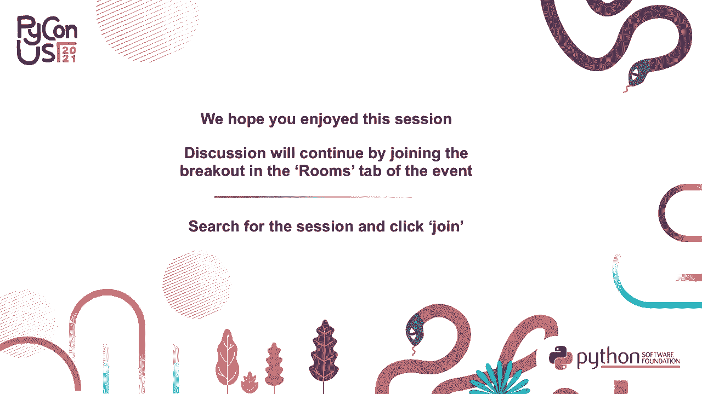

# P5：TALK _ Itamar Turner-Trauring _ 0 to production-ready_ a best-practices process - VikingDen7 - BV19Q4y197HM

 Hi， my name is Itamar Turner-Troning。 Today I'm going to be talking about best practices。

 process for taking your application， Python application， and packaging it for Docker。 using it for production。 You can find more on my website， pythonspeed。com。 The thing。

 about Docker packaging is that it's quite complicated。 And the first reason is history。 Docker builds on technologies that go back 50 years to the original Unix designs， for， examples。

 signals。 And then all these technologies that got built over the next 50 years， networking， Python。 and so on。 And in order to make your packaging work correctly， you need to deal。

 with all of these technologies intersecting in one place。 All of the design decisions。 that led into them， some of them have design mistakes， these things happen。 And so all。

 of these different things intersecting this one place。 And so that just makes it pretty。 complicated。 The other reason the Docker packaging is complicated is because it's an intersection。

 of multiple processes within your organization。 So when you're writing software， someone has。 to write the actual code， you're going to test your software。 Once it's packaged， it， gets deployed。

 it runs in production， you may have to upgrade your software with limited， downtime。 When things go wrong， you have bug reporting and your feedback and you want to。

 know what's going on in production。 And packaging interacts with all of these different processes。 And so that's another source of complexity。 Because instead of being this isolated thing， it。

 packaging interacts with almost everything you do with your software。 And so the result。 of this complexity is that I can't actually teach you how to do production grade， Docker。

 packaging within a 25 minute talk。 Just in terms of best practices， I have a personal。 list that grows over time right now， it's up to more than 70 best practices keeps growing。

 I teach this as a training class， it's day and a half and only covers some of these best， practices。 It is not feasible to cover all the details you need to know。 So instead， in this talk。

 what I'd like to cover and help you learn is the big picture。 And in particular。 when you're working on packaging， this is the case of anything you're doing with your， software。

 you only have a limited amount of time to do any particular task。 And at any， point。 you might get called away， you may get interrupted， maybe it's a critical bug。

 maybe something else you have to deliver。 And so it's not because there's a complex process。 you want to necessarily be able to finish it in one go。 And so what I'm going to talk。

 about today is a process for decorating， decorizing your application in a process that。 is iterative。 And so you're going to go through multiple steps and each step you're going。

 to come up with something that's basically working。 And it's prioritized， so you do the。 most important parts first。 And then each step builds on the previous steps。 And so the。

 idea is you go through this logical progression where each step you're improving your document。 is and you're improving your packaging process。 And if you're interrupted at any point， you're。

 at a good stopping point。 And so this is the sort of big picture process。 And this is how。 the rest of the talk is going to be structured going through each of these steps， explaining。

 why that is a next logical step to do。 I'll probably give an example of one of the best， practices。 Again， I'm not covering all the best practices。 At the end of the talk， I'll。

 give you links to some resources where you can learn a lot more about the details。 This。 is more about the big picture， what you should do first。 And this is a sort of generic order。

 which I've chosen that I think will work for most people。 And it may be that in your particular。 case， you might want to order it differently。 But for example， it is not uncommon for people。

 to look at their first pass a Docker image and say， Oh， no， this is a two gigabyte image。 It takes 20 minutes to build。 And so I'm going to spend a bunch of time making it faster。

 and making the image smaller。 And that's a fine thing to do。 And we'll get to that。 The。 problem is if you do that first， you might then run out of time and then have to go work。

 on something else and you've created an insecure image。 And so security in for most applications。 is probably more important than having a small image。 And so this is a prioritization order。

 And eventually you should try to get through everything。 But we do want to start with the。 most important things first。 And so this is my proposal that you can then think through， and say。

 what is the most important order for my particular application， my particular， circumstances。 And the first step when you're packaging your application for Docker is to。

 just get something working。 If your application doesn't run， then the whole exercise is pointless。 Like you can have a secure image and builds quickly and fast and it has all the， you know。

 configuration that you need。 But if it doesn't actually run your application， the whole exercise。 is a waste of time。 And so the first thing you have to do is figure out how to get your。

 application working。 And when you're doing that， you'll be thinking about things like。 how do you configure your application？ Docker encourages you to configure things via environment。

 variables。 But some， depending on your runtime environment， mounting configuration files。 maybe another thing you can do。 Kubernetes makes that easier。 You want to think about。

 which ports are going to be public， which ports are going to be private。 So you're going through。 this decision process of how your application is going to interact with Docker， but also you're。

 just making it work at all。 So installing the right dependencies and installing the packages。 making sure it starts up， that sort of thing。 So here's an example Docker file。 It's sort of。

 for a simple application， like this is the most basic Docker file you can write。 And it's not。 the best packaging ever。 But this is just step one， we have five more steps。 And by the time we're。

 done， we can do better than this。 And once you have something working， the next step is to work。 on security。 Before you can deploy your application anywhere， you really want it to be secure。

 And for， that matter， before you push your image to a public image registry。 before even leaves your， computer， you want it to be secure。 For example。

 if you have some secrets that you use to build， your image。 you don't want those secrets that you leaked in your image。 And so before you can。

 really do anything with your image， before you can actually make any use of it。 for most applications， security is the next step。 And here's an example。 Again。

 there are many best practices I can't cover， them all。 but I'll give you some links at the end of the talk。 So here's an example of one of the。

 best practices for security。 When you run a Docker image， by default， it's going to run as root。 And it， while it's true that containers provide a measure of isolation， and it's true that root。

 inside a container is typically more restricted than root on the host machine。 This is only true。 up to a point。 And running as root does make your container that much more powerful in terms of。

 what it could potentially do。 And so an attacker manages somehow to gain access to your container。 and take it over。 If they're， they've taken over a container running as root， they have a lot more。

 access and it'll be easier for them to then escape the container or take over the whole host machine。 So it's a good best practice not to run your container as root。 And so in this Docker file。

 what we're doing is we're creating a new user called app user。 And then we're using the user command， the Docker file to say all commands after this are going to run as that user。

 And so when you do， pip install， it's going to run as a user。 And when you eventually start the resulting image and start， up your process。

 it will run as the new user。 And so now you have an image that by default， it， doesn't run as root。 And so your image is just inherently safer。 And it doesn't take very much， work。

 but it's a good idea。 And so beyond just the right， right， configuring your application， files。 like a Docker file， your startup script and so on， part of packaging is also creating， processes。

 organizational processes。 For example， when it comes to security， a process you really。 need is a process for figuring out what to do about security updates。 And the issue is that a。

 Docker image is immutable。 Every time you start it up， the container starts with the exact same。 file system。 And so security updates require typically a new image。 And in some sense， you can。

 work around this， but like the immutable artifacts are actually one of the features of Docker， they。 make it easy to reason about in many ways。 And so when security updates come out， you need to A。

 know this hat is happening， like you need to know that there is a bug in open SSL that might。 allow someone to exploit your server。 And then you need to update your image that gets the latest。

 version of open SSL and rebuild the image， then you have to redeploy your application if it's a。 server of some sort。 And so this is not a sometimes the thing you can manage with just some configuration。

 but not always。 And it is not just about configuring your files。 This is an ongoing process。 is a thing you're going to have to continue doing， or even beyond the time where you're doing up。

 front packaging。 Like once you've committed to packaging， you're also committing to have a process。 for security updates。 And so it's the thing to keep in mind that you're not just going to。

 this is not a write some configuration files and you're done， you need ongoing processes。 or you're going to suffer in this case， lack of security。

 So once you've packaged your image securely， the next step is to try to automate builds。 integrate with your CI system。 And the reason is that you don't want at this point， you've been。

 building images manually， and that's fine for like testing。 But for real software development。 where you're continuously working on the software， and maybe you have a team of people working on。

 the software， you want to automate this。 So you don't have to teach your teammates how to build。 a Docker image and give all them the credentials of the image registry。

 You want it to just automatically， work。 And so next you want to integrate with the build system。 And so the simplest process， way you can do it is like the shell script。

 which you run automatically in every check into your， main branch， where you run the tests。 build the image， and then push the image to registry。

 So that's sort of the simplest possible automated build。 Beyond that， however。 you again need to think about how you're going to integrate with your organizational processes。

 Their packaging interacts with how your team develops their code。 For example， testing。 are you going to be using a Docker image to run integration tests， then you have to figure out。

 how that fits in CI。 If you have multiple branches， however。 multiple branches going to interact with， your Docker build。

 are you going to have images for all the branches or just your production branch。 you might want to start thinking about like， is it going to be a bottleneck in which case。

 performance we'll talk about later is going to be an issue。 And so as an example of a best practice。 it's quite common to have feature branches for particular features。 And then you open a pull。

 request and run the test and then merge that pull request into the main branch。 So imagine you're。 building an image for a feature branch 123 more cowbell for ticket number 123。

 And you want to build a Docker image for every pull request because you want to run integration。 tests using the Docker images。 You don't want your Docker image from the feature branch to overwrite。

 your Docker image from the main branch so that you really what you want to do is you want to have。 different names of different Docker images depending what branch of the code they're from。

 And so here's an example of how you might do that where in your build script， you figure out what。 the current get branches using this get command that got off of stack overflow。 And then when you。

 build your image， the part after the colon is the tag is taken from the name of the branch。 So if。 your branches main branch， it'll be your image colon main。 And if it's branch 123 for more cowbell。

 it'll be your image colon 123 more cowbell。 So just by looking at the Docker image。 now you'll know a branch you came from and moreover。

 Docker images from your feature branches won't break。 won't overwrite your Docker images for production。 Once you're building images automatically。

 you're going to start a queue with any more images as， you build them。 You may be running in production at this point。 So you can have more errors being。

 required from production。 So you want debugability。 You want your images to start up and shut down。 reasonably and maybe easier to monitor because they're running in production。 And so that's a good。

 next step operational correctness and debug ability， make things work well in production。 And make them easier to debug when things go wrong。 So here's an example。

 When you have a bug in your， Python code， you're going to get a trace back if it's not handled with any accession handler。 And that trace back will end up in your lungs or maybe you have some service to。

 collect all your trace backs and put them one place。 And so then you can look at your trace back。 and you can say， Oh， line 230 and the server module had a value error。

 And that gives you a really good， starting point for debugging bugs。 If you have a bug in C code。 and remember， Python itself is， written in C， a lot of extension modules are written in C or C++ or Python。

 If you have a bug in one of， those， often your programs is going to crash， just said faults。 And when it crashes， you're not， going to get a Python trace back， you're just going to get silence。

 And then you have no idea how to， debug it。 But Python has a feature that will fix this called fault handler。 And basically， all you have to do is set this environment variable Python fault handler。

 In this case， we're setting in the Docker file using the end of command。 And then just by setting the environment， variable， when you have a seg fault。

 you'll get a nice Python trace back that will show you， which package it came from。 So you might say， Oh， it's a matplotlib or it's your database adapter， or whatever。

 And that can be extremely useful in debugging crashes， because instead of silence。 you actually know exactly where to start。 And so just like a one line thing in your Docker file。

 it'll make your life much easier when things go wrong。 So another example， when you start up Python。 it loads in all the dot py files and turns them into pyc files。

 which are bytecode compilation steps。 It's not really like a C compiler。 because it's basically one to one， but basically， it's a necessary step。

 And then Python stores the pyc files。 And next time you start up the server。 it doesn't or the application， it doesn't have to do the compilation step and start up。

 to be faster。 The problem is with Docker images is that they're immutable。 The second time you run。 the run it and get a new container， that's the exact same file systems。 The first time you run it。

 So if your Docker image doesn't have pyc files， your startup will be slower。 And some applications。 it doesn't matter。 But in others， this can might be meaningful。

 You actually want to start up quickly。 And so in your Docker image。 if you care less about image size and more about startup time。

 you can use Python's compile all module and basically make sure that you've created pyc files for all。 your source code as part of creating the Docker image that will give you faster startup。

 So at this point， you're just secure。 It works well in operational environments。 And builds are automated。 This probably doesn't take very long to。

 do these initial steps if you're not distracted。 But so chances are there hasn't been， say， a new。 release of using Django， there hasn't been a major new release of Django during the week you're。

 working on your Docker image for a couple of days。 But if you wait six months， there might be a。 major release of Django。 And if you wait two years， it'll definitely be a major release of Django。

 And so you want to， if you're just always installing the latest version of Django。 in the short term， that's fine。 But in a long term， that's going to break your application。 Like。

 and then you'll rebuild your Docker image and suddenly it's using a different version of。 Django and things are going badly because incompatible。 So you want reproducible builds。

 You want to get the same image with the same packages， more or less whenever you rebuild it。 So that when you do upgrade， you can upgrade in a controlled manner rather than based on。

 Django's release schedule。 So part of having reproducible images is having the system packages。 you rely on。 So like the glibc and open SSL and so on， having those be stable。

 And the easiest way to do that is to use a Linux base image that guarantees backwards。 compatibility and stability， but also gives you security updates。 So it could be too long-term。

 support or CentOS， such as these days would be right ahead enterprise Linux。 And once you do that。 when you can rely on the easy thing to do， just install security updates。

 and then rely on the fact that the operating system has guaranteed backwards compatibility。 Problem with these is they have old versions of Python typically。 So the default I recommend is。

 the official Python base images created by Docker。 For example， Python colon 3。9 slim buster。 which means the latest mini release of Python 3。9 on Debian buster， which is a stable release。

 and give me slim means a smaller version。 If you use this version， you can rely on the base。 image not changing out from under you， like you're not going to get a completely different version。

 open SSL， but you can also get access to security updates。 And again。 reproducibility isn't just about the artifacts you're creating， it's also a process。

 So if you update your dependencies， this is mostly about your Python dependencies， but if you're。 really paranoid， it might also be your system dependencies， like your apps packages or RPMs。

 if you update your dependencies， the latest version of rebuilds， you don't have reproducibility。 You'll get a different version of Django without a new version of Django comes out。

 So you really want to pin or freeze all your dependencies using tools like PIP tools or poetry。 or contact。 And then whenever you rebuild your image， you'll be installing the same dependencies。

 Then you have a new problem。 If you don't update， over time。 eventually running all the dependencies。 And if you wait long enough， you're in the situation。

 we have to upgrade five major dependencies at， once。 And then you don't know what's breaking your code and it's a mess。 And so you need an。

 organizational process where like every three months， I say。 I'm going to upgrade to the latest version， dependencies。 And that way， in the short term。

 you have stability or those three months， you're， using the same version of Django。 But because you upgrade every three months， you're never really， lagging behind too much。

 And this is an organizational process。 It requires human intervention。 And you。 need to plan for it and do it regularly。 The final step in the process is to optimize your。

 packages so they are build faster。 And images are smaller packaging。 Packaging takes 30 minutes。 Every time you do a pull request， you have to wait 30 minutes for the Docker image build。

 That's going to slow your development down。 That gets expensive。 If you have a two-good-by， image。 it takes a long time to download。 Again， slow things down or just cost you in bandwidth。

 So next step and final step is to optimize your images。 For example， in terms of build time。 Alpine Linux is often recommended as a base image for， your Docker images。 But in Python context。

 it's quite problematic because it can't use the pre-compiled， wheels from PIPI。 What that means is all the things that are usually provided for you by the。

 package authors in the pre-compiled format， you have to compile from scratch。 For example。 if you want to install pandas in MacLalib， if you install a Debian-based Docker image like SlimBuster。

 it'll just download the pre-compiled package just takes 30 seconds。 On Alpine。 you're going to have to compile on yourself。 It's 1，500 seconds， 50 times slower。 It's just a pain。

 And there's a PEP 656， I think that will get around to fixing this。 And another。 year or two from now， there might actually be pre-compiled wheels for Alpine， and you can use。

 Alpine。 But at the moment， I recommend against using it if you want fast builds for your Docker。 image。 So that's the big picture process。 First， you get something working， then you make it secure。

 then you automate the builds， make it run in CI， then you do all the tuning and correctness you want。 for undibugability， you want for production， then you do reproducible builds， and then you optimize。

 your builds。 And in your particular case， you might want to order it differently。 In many。 applications， reproducibility is perhaps more important than you might want to do it earlier。

 And once you get good at this， you'll actually start into leaving this more。 But as a map of。 what you need to do and sort of a first pass prioritization， this is a good starting point。

 And I've been pointing this out as you go， but I want to reiterate it。 Dockerizing is not just about writing a Docker file， a build script， or Docker ignore file。

 It is also something that involves processes and interacts with your development processes。 You。 have to think about how it's going to work with things like branches and feature branches。

 And also requires you to create new processes for security updates or dependency updates。 And so as in much of software development， it is important not just to get the actual。

 artifacts right， it's also important to think about the overall processes and how they interact with。 your organization and your organizational goals。 So that's it。

 That's the process and that's my talk。 So on my website。 you can find a pros version of this talk and much more expanded at pythonspeed。com/products。

 or stacker process。 And so this sort of goes over the ideas in this in a longer form you can read。 And I also have a free guide to all the details you need to get right。 So security and image size。

 and builds and reproducibility。 It's at pythonspeed。com/dakard。 So a lot of articles， going。 it's a lot of detail about all these best practices。 And so you can learn a lot more about。

 what you need to do by going to these two URLs。 And if you have any questions， suggestions。 problems， anything you want to talk about， please do email me or tweet at me。 And I believe。

 there will also be a Q&A session after this。 Thank you。 [ Silence ]， [ Silence ]， [ Silence ]。 [ Silence ]， [ Silence ]， [BLANK_AUDIO]。

