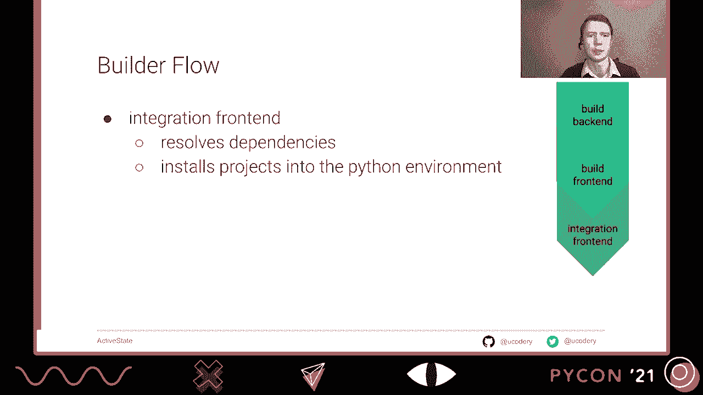
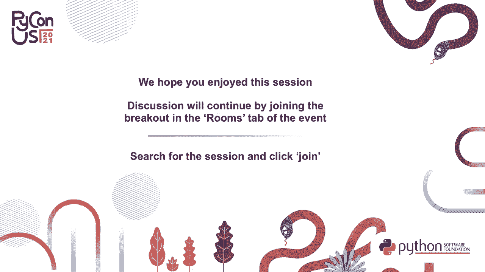

# P6：TALK _ Jeremy Paige _ Packaging Python in 2021 - VikingDen7 - BV19Q4y197HM

 [Music]。

 Good morning and welcome everyone。 I'm so excited to be here with you virtually at PyCon。

 This is packaging Python in 2021。 It's everything you need to know about the latest standards。

 and how you can write easily buildable projects。 I'll be detailing how to maintain explicit。

 predictable and readable build information。 This is information that can be used by both humans。

 and machines to better understand your project。

 Today I'll be focusing on how to use the new PyProject。toml configuration along with modern。

 build front-end back-end paradigm that comes with it。 The file was first introduced into。

 the ecosystem five years ago， but it's gone through some changes and has only recently been marked。

 as a final standard。 PyProject。toml is meant to hold core project metadata in a predictable。

 location。 It's not meant to be a blueprint that describes step-by-step exactly how to build。

 your project。 Instead， it's more of a sign that points the reader in the direction of some。

 specific tools and other environments that the project needs to prepare its own blueprint。

 Although it might not contain enough information to completely build your project， whatever。

 metadata is contained within should we treat as canonical for the project。

 Then the actual build tool specified by this file can come along and require additional。

 configuration， either in the same PyProject。toml or its own configuration files。

 If you weren't aware， Toml stands for Tom's Obvious Menmul Language。 It's a configuration。

 format that's similar to YAML or INI。 It's become popular choice for packaging systems。

 across many programming languages。 However， it's not only build metadata that ends up in PyProject。

toml。 Despite that being a singular goal when it was conceived， having a single configuration。

 file that's known to exist for all Python projects was just too attractive for many tool maintainers。

 to avoid。 And over time， space was made in the Toml layout for arbitrary Python tools to。

 share and not conflict with one another。 Some projects such as Black only allow authors。

 to specify configuration in PyProject。toml。 While other projects such as ISDOR allow the author to choose either write configuration。

 in PyProject。toml and consolidate with other tools or write it all out to its own tool specific。

 file。 It is legal for PyProject。toml to contain this sort of tool configuration but no build。

 system。 However， in this case， the project is created as legacy and to a build tool， it's。

 the same as if it didn't have a PyProject。toml file at all。

 Here's an example of what a Menmul PyProject。toml might look like。 Then， in the middle。

 the project table contains only static data that is required to be part， of any distribution。

 whatever its type， or whatever tool is used to create it。

 There are other possible project fields that can go in this table， but not all of them are。

 required to be filled out。 The project table is very new and not only supported by all， tools。

 but look here in the future for where all projects might contain their core metadata。

 You can see lower down that the black configuration is in a subtable under tool。 Within this space。

 black is free to define any interface it wants for its own options。 Back at the top。

 you'll see the build system configuration table where all the back end builder。

 requirements are listed out along with a single entry point into a specific build back end。

 A build back end might not be what you're used to selecting when defining how to build a project。

 but it actually gives you and your project's consumers more flexibility to choose the tools。

 that everyone wants to use。 What used to always be a single tool chain has now been formally separated into three categories。

 The old giant build tools would often lock downstream consumers such as packages， installers。

 or other maintainers to always choose the same tools that the author used when first。

 building the project。 But these new categories， which interconnectors have standard APIs that。

 are independent of any one project， allow each part to operate independently。 Even if in the。

 other case， they are all defined in some larger project。

 There are three main tool categories used in turning source code into something you can import。

 as a package。 The build back end is the first。 It turns source code into a distribution format。

 such as a wheel file。 A project build back end is chosen by the project author and recorded in PyProject。

Tomo。 It's the only one of these tools that actually gets recorded。 Next up is the build front end。

 which handles user interaction。 For instance， it might provide， a command line interface。

 display progress to the user， or show errors from either bad。

 metadata or problems on the build back end。 Build front ends also must execute the back end in an environment that's actually suitable。

 for building。 So this could involve installing dependencies for the build back end， creating。

 a virtual environment for it， setting its working directory， and other similar tasks。

 Although it's not very common， users wanting to build a project can select a different front。

 end than the author used， provided both that build front end and back end， respect these， new APIs。

 The integration front end is not actually involved in the build process per se， as by this point。

 there already exists a build distribution file。 But it does install this distribution。

 file into your Python environment。 And I think that's probably the most frequently any of。

 us actually interact with distributions， is by importing them。

 An integration front end is capable of not just installing distributions， but also resolving。

 that distribution dependencies， possibly going out and finding them locally or the internet。

 maybe downloading them， and then also installing those distributions。

 A project author has no control over what integration front end is actually used in。

 solid distribution。 In fact， probably all public projects right now are being installed。

 by multiple integration front ends。 For many of you。

 there's just one tool that's done all these tasks， and that's PIP。

 PIP often handles all of them for you at once， and hides the complexity of having to do。

 different jobs behind the scenes。 Yet PIP is not actually a packaging tool。 Even though it's great。

 I believe it's historic， use as the one command line tool that's used to fulfill any kind of requirement for Python。

 has blurred how Python needs to see these different categories。 And some cases may。

 harp them to see the needs of them existing at all。

 So to show why PIP was originally needed for Python， and why Python now needs to go beyond， PIP。

 we're going to take a brief look at how packaging has evolved alongside the Python， language。

 It all started with disk details。 Disk details was the original packaging library。

 It was released as part of the Python language in version 1。6。 It also gave us the current set of 。

py convention and the top level directory to build， projects。 The common set of 。

py script can act as either build front end or sort of， integration front end。

 As the CLI provided by importing disk details， allows for both building。

 from source and then installing that build into your environment。 However。

 disk details did not originally declare any way -- allow any way to declare， requirements。

 let alone go out and resolve those dependencies。 It goes beyond what a build front end is。

 but not quite so far to be an integration front， end in my opinion。 Disk details， therefore。

 is kind of like a build back end for which you as a project author。

 have to write your own build front end each time as you write a new setup。py for every， project。

 Also note that disk details has been marked deprecated in the latest version of Python。

 which definitely makes it not a good choice for new projects。

 After years of nothing but disk details， set of tools emerged on the scene as a popular。

 placement that exists outside of the standard library。 It continues to use the set of 。py。

 for all projects， meaning that project authors are still， to some degree， writing their own。

 components。 However， set of tools also came to the script called EasyInstall， which did act。

 as an integration front end， and definitely a better one than calling straight setup。py， scripts。

 It was capable of resolving dependencies and downloading distributions from PyPI。org， which。

 was originally brought online around the same time as set up tools first release。

 Those set up tools were originally released to duplicate and extend all the functionality。

 disk details had。 It's used as a front end of any kind right now as being actually moved， away from。

 Much of the original functionality at first gave the scripts that imported it， has been removed。

 Functionality， such as running tests or being able to declare requirements。

 for setting up your code or building your code using those special requirements are。

 no longer supported。 Soon setup tools projects will only be able to be built when using a build front end that。

 complies to the new front end specification。 However， it's used to the build back end is。

 still very important and not going away。 It's likely to remain at the core of Python。

 packaging just as a build back end。 After setup tools。

 it's still on a couple of years until PyCienistas finally get a。

 proper integration front end with PIP。 PIP makes using projects easier by。

 hiding the details of using many setup。py's directly in order to satisfy a set of。

 requirements for a project。 As a tool， it's definitely superior to easy install and。

 acted as a full replacement。 Even it will be a few more years until easy install was。

 officially marked deprecated。 PIP was also Python's first integration front end that。

 allowed dependencies to be installed directly from VCS addresses。 So you can。

 thank it for being able to install that project directly from a get hub link。 Still。

 PIP is not a build tool。 It originally only knew how to build projects from source。

 because it knew the special way to invoke a setup。py which was the build front end。

 After the build back end was formalized， PIP did then learn how to build call。

 build back ends directly which technically also makes it a build front end。

 I think it's a pretty poor one as it's missing some important functionality you。

 would want from a full build front end like the ability to create S-dist file， distributions。

 So PIP already worked as a front end and setup tools is still working。

 great as a back end and they work together pretty well to do your building， installing。

 You might wonder why we're asking you to add yet another file to your， project。

 Especially if you stop to consider that PyProject。toml isn't。

 actually placing any of the functionality of either of those tools。 Well， first start。

 you'll be following the new expectations of consumers of your， project。

 It's not just tools but humans that work with your project are all now。

 looking for that ubiquitous PyProject。toml when first getting to know your， project。

 By including one you as the project author are then free to change。

 how you build a project without disruption to your users。

 Another important build prompt that's solved only by the use of PyProject。toml。

 is declaring what packages your project needs to start its build。

 I think PIP's 518 best sums up the prompt when it talks about setup。py's short， coming。

 It's a catch 22 of a file not being runnable without knowing its own。

 contents which can't be known programmatically unless you run the file。

 Python has gone in a long way by simply assuming that setup tools and PIP are。

 almost universally available just like the math module。

 Both of these third-party packages have been deemed so important that they are。

 in fact available upon a fresh and solved Python or any time you create a new， VINs。

 But it doesn't help you packaging if you decide to use a different build。

 front end or if you use a different build back end or if you need anything more。

 than just setup tools and PIP to do your build like if you need Python or wheels。

 Making PIP and setup tools as available as they are has fixed a lot of Python's。

 build bootstrap problems。 At least it did until everyone decided that wheel was。

 the newest standard and everyone should follow it。 You see PIP doesn't really know。

 how to install a package from source。 It knows how to install a distribution。

 If it comes across from source it first turns that source into a wheel file。

 But the build back end that PIP uses most commonly just setup tools doesn't know。

 how to build a wheel file。 It knows how to build an S-dist file。

 So we need this extra package which， confusingly， is also called the wheel package。

 You'll notice this on this if you've ever tried to PIP install from source a。

 project that does not contain a PyProject。toddle file。

 You can see here what happens when we try this in a fresh virtual environment。

 When we try and PIP install， PIP gives us a less than helpful error message。

 noting something about B-dist wheel not being a legal command。

 Even though all PIP with S-dist is just installed in Python source code。

 If we look a little further at the stack trace we see some PIP secret magic。 It's called setup。

py behind the scenes for us。 But it's choosing to pass along this illegal B-dist wheel command it then。

 complained about later on。 If you've seen this error before you probably immediately recognize a solution。

 You need to download a package called "wheel" from PyPI。

 Just having this package around will magically fix the PIP command through the。

 system's special setup tools hooks during its installation。

 There's no change necessary to the setup。py file or the PIP command that was chosen to run。

 But all this is a pretty confusing conclusion from an error about an invalid command。

 that was not executed directly and which complained about something B-dist wheel command。

 Nothing about a wheel or a package's error message。

 This confusion and probable stack overflow searching could have been avoided。

 if this project just added a PyPI。TOMEL with a wheel requirement。

 Doing so saves its users a lot of pain and frustration。

 So let's take a look at how we can make this PyPI。TOMEL work for you in your projects。

 Using the modern configuration that is PyPI。TOMEL not only lets you shed some。

 outdated packaging practices， it gives you a lot of new advantages as well。

 Being explicit about your build backend will always get you the same build environment。

 always on your machine and in CI and even on your users machines。

 Use the Q-SYS to use a different front end than you did。

 It will also allow you to try out different backends and have to change very little or nothing at all about your code。

 And now that PyPI。TOMEL is a standard， some build related tools will only work on projects。

 that have this file in their project at all。 Similarly， more and more tools are adopting PyPI。

TOMEL as the location for their settings。 Even log tools that have nothing to do with building。

 This makes for a lot less files overall in your project's top level directory。

 So using your project is building just fine right now。

 It's only doing so based on a lot of assumptions。 And assumptions are no way to build dependable software。

 So go ahead and choose a build backend and let everyone know what you chose by putting it in PyPI。

TOMEL。 If you're sticking with the setup tools back end， that's great。

 But even after including a PyPI。TOMEL file， there's a few tasks you can do to even more modernize your packaging。

 First， stop using setup。py as a script for any of your tasks。

 It's no longer intended as any kind of front end。 And whatever capabilities it does still have will be going away。

 Another advantage PyPI。TOMEL can give is the ability to actually drop setup。py altogether。 Instead。

 PyPI。TOMEL and the setup。cfg files have static configuration can handle all of your build details for you。

 Then you don't have to have a build front end as part of your project with a setup。py script。

 A building tool outside of your project can handle all the building logic for you。 Finally。

 if you keep your setup。py file and it's important from disk utils。

 switch that to important from setup tools。 You want to get away from this library before it disappears entirely from the PyPI。

TOMEL language。 If you maintain a project that doesn't have a PyPI。

TOMEL file right now and you want to add one with the least amount of friction。

 just create it with these three lines。 The legacy build specified here is in fact the exact behavior that PyPI will give you。

 if it comes across a project that is missing a PyPI。TOMEL file。

 So adding this file will not change how your project actually gets built。 As a bonus。

 users of your project won't get confusing beat us wheel errors because they didn't have wheel ready to go for you on their machine。

 If you want to go further than just adding build information for what is essentially already happening。

 try moving to the standard setup tools back end entry points。

 Note that setup tools does not yet support project data in PyPI。TOMEL。

 So you will still have to use setup。cfg to specify metadata as configuration。

 You don't already have one try creating it and adding some core metadata there。

 Then try moving more metadata from setup。py into your setup。cfg。

 For long you may find that everything that originally needed setup。py for can be moved to setup。cfg。

 which means you set up py disappears entirely and leaves you and users of your project with only explicit。

 predictable， and readable build information。 In the end all users of this project will benefit from these changes。

 Packaging is a very rich landscape that is still evolving。

 So I encourage you to keep learning about it。 There's a lot of great resources out there。

 These are some that have been helpful to me in forming this talk。

 Thank you and have a great rest of the conference。

 [BLANK_AUDIO]， [BLANK_AUDIO]， [BLANK_AUDIO]， [BLANK_AUDIO]， [BLANK_AUDIO]， [BLANK_AUDIO]。

 [BLANK_AUDIO]。

