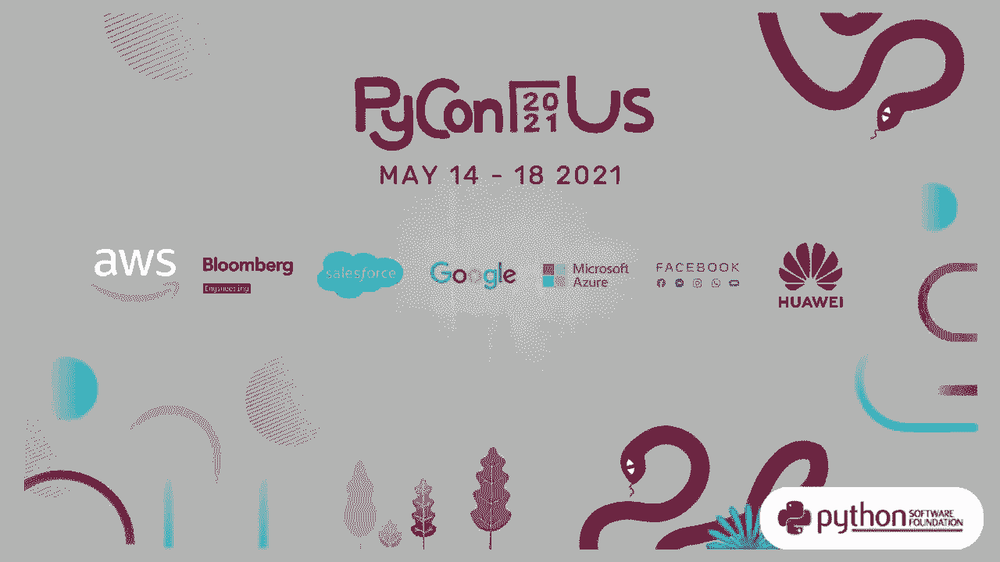
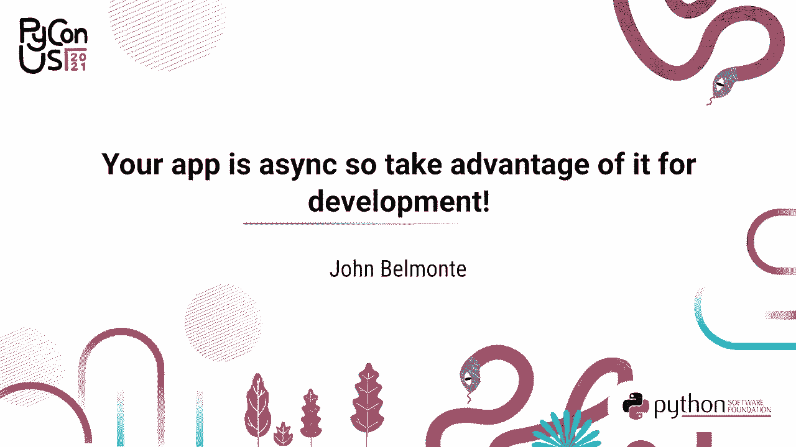
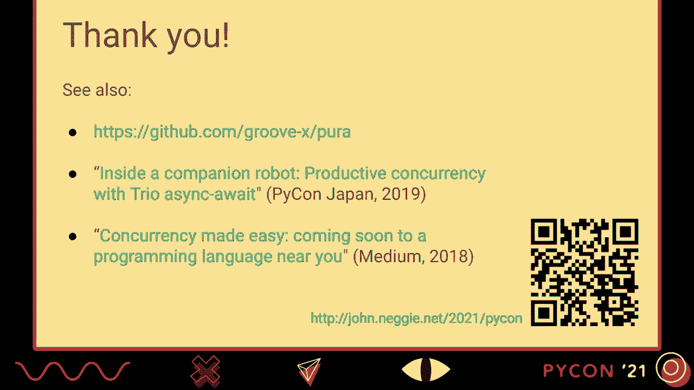

# P7：TALK _ John Belmonte _ Your app is async so take advantage of it for development - VikingDen7 - BV19Q4y197HM

 [MUSIC]。

 Wouldn't it be great if as developers we could， inspect and modify internal state without pausing our application？

 If your app is async， this kind of thing is already possible。 So let's take advantage of it for development。 It's an area that hasn't been explored much。

 Async in the context of Python means we're using cooperative multitasking。 and typically there's only one OS thread， and you're being careful not to block that thread for any length of time。

 So let's dive into the land of no pausing。 My name is John Belmanti。 and I'm happy to present that Python this year。 I'm someone who likes to talk with my hands。

 so I'll be waving this laser pointer around during the talk。 I'd also like to introduce Lubbot。 Lubbot's a companion robot， and that project has inspired a lot of。

 the tools and methods that I'll present in this talk。 It's been developed by a company called Groovex， and has been on the market in Japan for over a year now。

 Not only is Python running inside the robot， but it's at the top level of the software stack。 and it's in charge of managing all the concurrency going on in the robot。

 So all the sensor inputs and servo outputs， deciding what behaviors to run and things like that。 This is Oreo。 He's the development bot that lives at home with me working day-to-day。

 and he's got a nice gig because at the end of day of hard work。 he can relax and play with the family。 So most programs have interesting things going on inside。

 There's probably a lot of state machines， algorithms happening。 So for a developer。 it's important to understand that state， and it's used when you're trying to debug a problem。

 And also when you're just trying to iterate and enhance the program。 But we don't always want to pause the program in order to do that kind of inspection。

 So for example， the program might have a UI， that users are actively engaged with。 or it's connected to services that might have a bi-directional communication。

 So the services expecting a reply from the application。 Or especially for our robot。 the application might have a strong connection to the physical world。

 So the robot has all these light and sound sensors。 and it's got a physical body that has to deal with inertia and momentum。

 So it's not always convenient to just say stop the world， because we want to inspect our program。 And what we want isn't always available developer display。

 So how do we go about surfacing a display like that？ Here are a few approaches。 So you've got your incredible and awesome application。

 One obvious way is to do something with the console。 And the console can actually display some simple graphics， if you use a library like N-curses。

 So this works， but it's not always easy to get access to the console。 And the console might be used for other things like logging。 Well， if your application has a GUI。

 how about making kind of a hidden developer view as part of that GUI？ So this will work。 GUI APIs are often complex， however， and not all applications will have a GUI。

 Some embedded applications might not even have a display。 So we're starting to assemble kind of some desirable properties we're looking for。

 It'd be nice if we can do remote access， had a nice graphical display。 And if this developer view were decoupled from the normal operation， of the console and GUI。

 so basically decoupled from whatever else is going on in the program。 So let's explore some avenues in detail。 So we have a redeveloped print loop。

 which everyone is familiar with。 And this is nice。 Let's say I've got my robot and I want to。 check the IMU sensor to get a reading on the tilt of the robot。 So that works nicely。

 And I could use the REPL not only to inspect state， but also to modify the program。 So here I'm changing the mode of the eyelid blinking。

 Ripples are nice because you can just make these general queries。 It doesn't。 They don't require lots of upfront development and thought。

 for what you want to display and how you want to display it。 But again， really， we， in my case。 I don't want to stop the robot， to to execute these statements。 So all right。

 let's just wave our hand and say we can have a REPL like this， without pausing the program。 But there's still something missing。 We'd like to be able to connect to this REPL on demand。

 depending on the situation and say the robot is suddenly exhibiting a bug。 And now I want to go explore the program and see what's going on。 So one is a remote access。

 So let's say I'm going to use a web browser， connect to my local device。 and have access to this window。 One limitation of REPL is it's。

 it's not going to show us a customizer visual display。 So let's see what we can do as far as that。 The print function is actually something I use often to surface， internal state in real time。

 And I'll show an example of how I do this for a certain state machine， that's controlling the。 the servo for inserting and extracting the real real wheel。

 This happens kind of like landing gear on a plane。 And we do this so that when you pick up and hug or hug the robot， the wheels won't be in the way。

 So we want to decide when to have the servo on or off。 We don't want the servo on all the time because it will exhaust the battery。

 So we've got a leg state class。 And what I would do in this case is I would drop a print。 into the update call of the state machine。 So for example。

 I've got my state machine inputs and internal variables and output。 And this is what I would see on the console。 Now， if the update is called 30 times a second。

 this will be scrolling wildly。 So in that case， I'll use this trick of the end parameter of the print function。 And you can do some simple cursor control。 So here I'm doing a carriage return。

 And so after this print happens， we send the cursor back to the beginning of the line。 for the next print。 So then you get just one nice， continuously updating line on your console。

 So this works well enough。 Everyone knows how to use the current print function。 But this works well enough。 Everyone knows how to use print。

 It's quite informal because each developer is deciding on the display format they'd like to use。 Very importantly， it's localized。 So you're putting this print very near the code that you're trying to display。

 And it can be optional。 So often what I do is after I'm done developing this code。 I'll comment it out， and actually merge it into our code base because in the future。

 another developer might want， to re-enable the code and use this display to learn about the state machine。 So a few drawbacks。 Using print this way is not very composable because it assumes that it has complete control of the console。

 And again， observers need to get the terminal access somehow。 How did they do that？

 Now let's consider something more graphical。 So this is our leg visualization and it includes a lot of the same information I had in the print function。 So here's the output of the state machine， whether the servo is on or off。

 This white dotted line is the requested position of the leg and the blue line is the feedback position coming from the servo。 But we're able to show since this is a rich display， even more information。

 So this colored bar is telling us when the wheel is either kind of in the air and unloaded and when it's actually starting to push against the ground and dealing with the forces of gravity。 But we can take this even further and say， well， this can be interactive as well。

 So let's say I can have a manual control mode where I can drag this white dotted line and set the requested leg position and basically tinker with my state machine and see how it responds this way。 And in this case as well， ideally we'd like to have remote access so we can just pop up this display on demand。

 Let's take a look at this working in action。 So next I'm going to insert the leg again。 but put my hand in the way to interfere with the insertion。

 So the state machine enters a stuck mode。 And then eventually it will retry。 Next I'll put it into manual control mode and drag around the white dotted line。

 And then release the manual mode。 So this is great。 but there's something we have to consider there with this。

 How difficult is it to code visualizations like this？

 The people coding on our project include designers and animators and researchers。 And each person is bringing their own experience and insight to the project。

 So it's really important that we keep development accessible。 So how do we make coding these visualizations easy？ Well， we could do something like this。

 We've got our leg state class。 Let's have it derived from a mix-in that provides out one of these web views。 And as part of that contract， we have to implement a draw method that takes a graphical context。

 So now we're making graphic function calls。 And we're accessing some of the local attributes of our class instance。 So this checks out a lot of the same boxes we had with the print function。

 It's still fairly simple and it's informal。 So each developer decides how they want to display the information。 And importantly， again， it's localized。 So we've got our。

 we're using Python code to do the draw functions right next to the statements sheet implementation that we're trying to display。 And it's optional because whatever infrastructure is ultimately calling this draw method can decide if the visualization is actually being viewed or not。

 And so make the call conditionally。 And we get more because this is a rich display。 It can be interactive。 We can access it remotely。 There's a subtle T however。

 which is when is the draw method called because in the print example。 we just put print into the state machines updates method。 But with draw。

 we might not want to call it as frequently because it's， it might be a little bit heavier。 And so basically what this means is we would like to decouple this draw function from the normal operation of our program。

 And this is where async becomes important。 So how do we leverage async in our solution？

 It does provide a way to have an efficient HTTP server and such inside of our application。 And this is important for the remote aspect of things。

 But there's something much more important that cooperative multitasking provides。 So the nature of cooperative multitasking is that tasks only yield explicitly when they're at a good stopping point。

 So that means we've got a natural place to go and inspect the state of our program。 And in most cases， we'll get a coherent consistent view of things。 So as an example。

 let's say we've got a list of animals and we also want to maintain a count of the number of times each animal appears in the list。 And so an invariant of the program is that these two collections are always consistent。

 And when we add a zebra to the list， we also need to increment the zebra count by one。 So with cooperative multitasking， we're sure that basically these two operations are atomic。

 And it's only when an await statement is executed that there is a context switch。 So between any of the await statements， it's basically like an atomic section of code。

 And so we're taking advantage of this and we'll know that the repls eval would never see an inconsistent view of these two collections。 So on our project， we introduced the tool to do this kind of visualization about three years ago to our program。

 And it's worked out really well。 It's been widely adopted by our development team。 And I would say really importantly， it's a way for the developers to communicate what's going on and the components they create to other people on the team。

 And to newcomers to the team or say， sometimes we have guest developers。 They're able to go and learn about the real time operation of some of the pieces of the program。

 And we use this tool very heavily。 So I would say good portions of our development and quality assurance would literally just stop if we didn't have this tool。 And guest developers on our team have even contributed visualizations。

 And that speaks to having enough information。 Having enough simplicity there for doing that。 So our implementation is called Pura。 And it provides these remote campus visualizations as well as the REPL。

 It's liberally licensed so you can embed it into your program。 An important principle of Pura is if a visualization doesn't have an observer。

 there's no runtime overhead。 And that's very important。 You don't want to interfere with the normal production behavior of your application。

 So let's jump into a demo of Pura。 So I've got an example program running in the background and I'm just going to connect to it on Pura's main port。 So here's a hello example。 And this drop down lets me pick any of the other available visualizations。

 This is a faster than real time clock。 And a mini physics chain simulation。 So I'm going to go to another browser client and open another connection。

 So this is a connection to the same running program。 So now we're displaying two visualizations at once。 And then a third window。

 Now with this follow example， you'll see that the views are mirroring each other。 So the program only has one internal representation of the state of this chain。

 And I happen to be manipulating that state in one of the clients。 And it's just getting broadcast to the other。 So that's what's going on there。 Let's see。

 Let me open up a ruffle。 So I've got to have completion to explore what variables are available。 And there's a clock object， which is the object that's running the clock visualization。

 So this actually has a little 12 hour alarm that you can set。 And so we can inspect the current alarm time from the ruffle。 And we could set it to another time。

 There we go。 Note the thing I want to show is what happens if we stop the program。 So all of these status lights change from blue to red， showing that we lost our connection。

 And I'll start the program back up。 And what happens is each visualization reconnects to the server automatically。 So this is nice for a typical development flow。 And that is Pura。

 So just one interesting point about Pura's design。 So here's that hello example again。 A decision we made was not to be in the business of creating a graphics API。

 That's been done many times before。 So we actually borrowed the API from a framework called processing。 So processing is a graphics library and IDE that's popular with students and graphic artists and animators for just working with graphics and interactivity with mouse and keyboard and things。

 So by using the processing API， we're also able to take advantage of the existing docs and examples and expertise in that community such as forums and books。 And actually the follow example that we just saw was one of the official processing examples。

 And then a quick look at architecture。 All presentations need to have an architecture slide。 So the main thing is Pura will have this web view server component in your application and you'll register your visualizations with that component。

 And then I'll just skip ahead here。 And the interesting part is that it's not until one of the web clients makes a specific web socket to a visualization that the corresponding draw function will be called periodically say like 10 times a second。 And what happens with that draw function is doing as you're making calling those those Python functions。

 they're actually assembling some JavaScript HTML5 canvas code。 And then that eventually gets shipped back to the client in eval。 So we've got。

 we'll pull up a second visualization。 And then another instance of that visualization and an interesting point here is that each frame the follow draw method will only be called one time and then that JavaScript will be broadcast to all of the clients watching the visualization。

 And then there's the terminal。 The， the REPL is a little bit different because the client is running a terminal emulator。 And every， every connection to the， to the web view server gets its own REPL instance。

 So they're not shared。 I'd just like to conclude today with some ideas for future work。 As I said。 I think this is a pretty rich area to explore。 And I'm sure others have some ideas。

 I'd like to hear them。 So one is a debuggers typically have a variable display。 But again。 you have to pause your program to inspect the variables。

 What if we can just do that while the program's running and all these values would just be continuously updating。 Another thing we could do is have a way to explore the long running tasks in our program。

 And this is just， that would be a way to discover variables you're interested in and look at all the levels of the program stack。 So that too could be done in real time as your program's running。 Thank you very much for your time。

 If you're interested in trying the approach shown here， please check out the prayer library。 Also。 if you're interested in software concurrency， I've got a talk on productive concurrency from Python。

 Japan a few years ago， as well as an article about the notion of structured concurrency。 This talk has a web page that will have these links as well as addendum and other information。

 And finally， I would just like to give a big thank you to friends and colleagues who gave me feedback on early versions of this presentation。 And also thank you to my family for understanding my preoccupation in the past many weeks。

 Goodbye until next time。 Thank you。 Thank you。 Thank you。 Thank you。 Thank you。 Thank you。 Thank you。 Thank you。 Thank you。 Thank you。 Thank you。 Thank you。 Thank you。 Thank you。 Thank you。

 Thank you。 Thank you。 Thank you。 Thank you。 Thank you。 Thank you。 Thank you。 Thank you。 Thank you。 Thank you。 Thank you。 Thank you。 Thank you。 [BLANK_AUDIO]。

