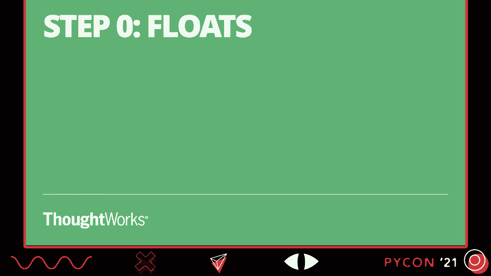
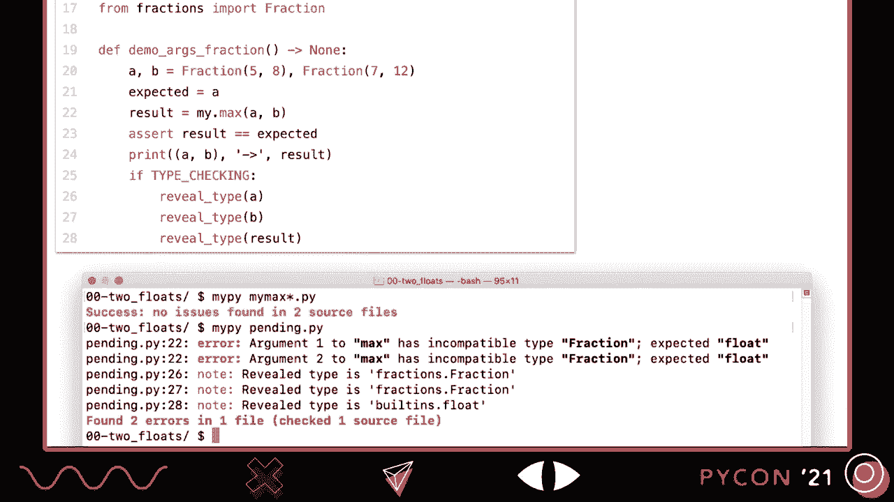
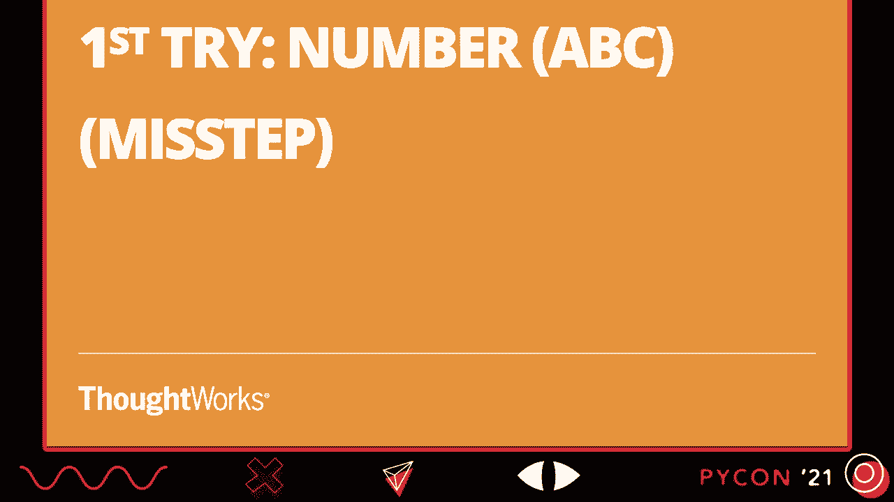
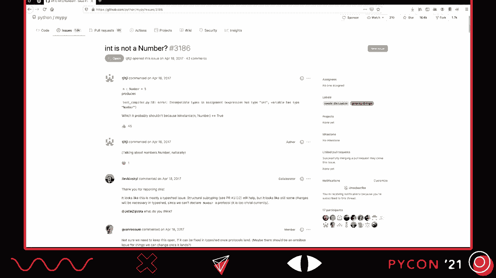
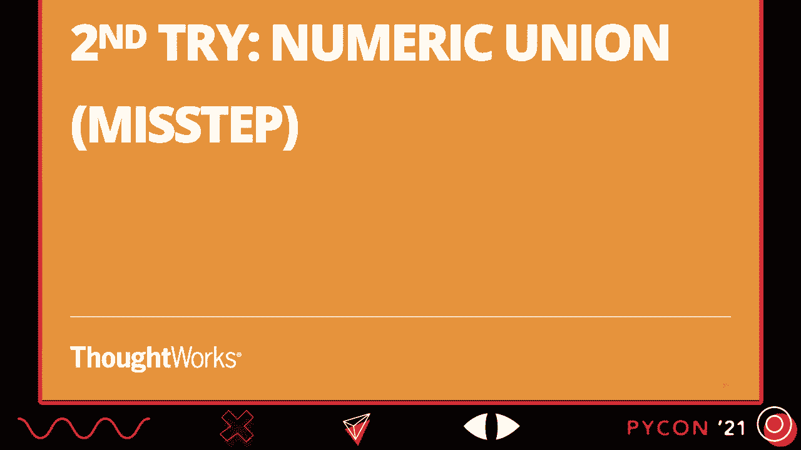
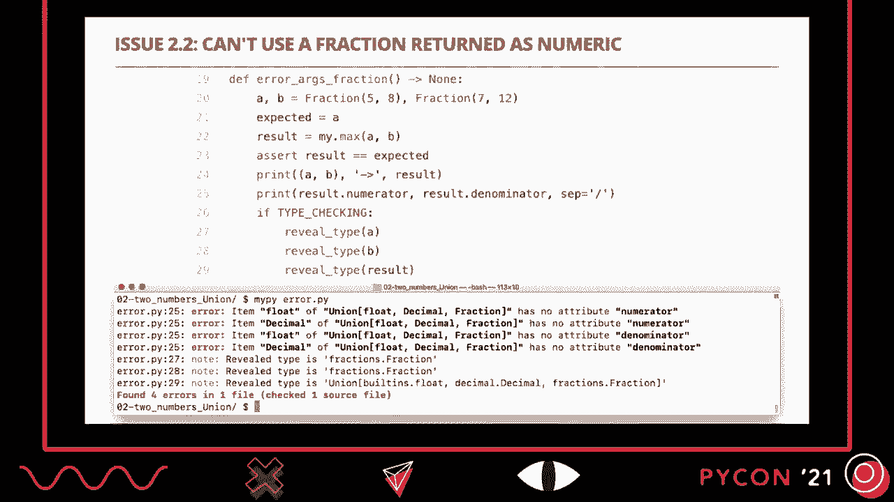
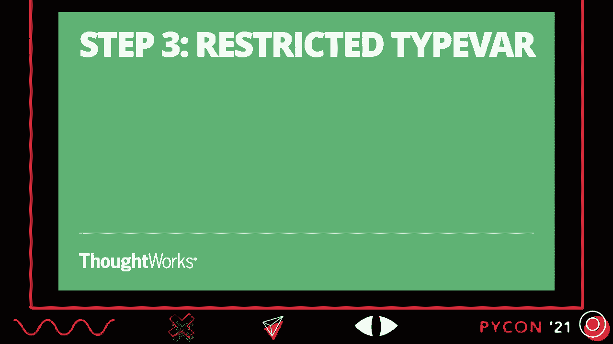
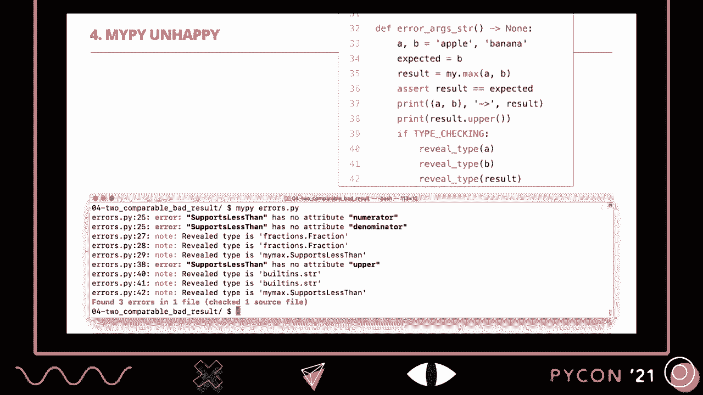
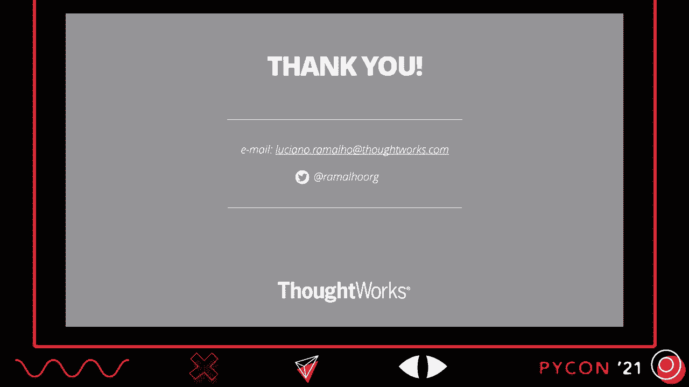
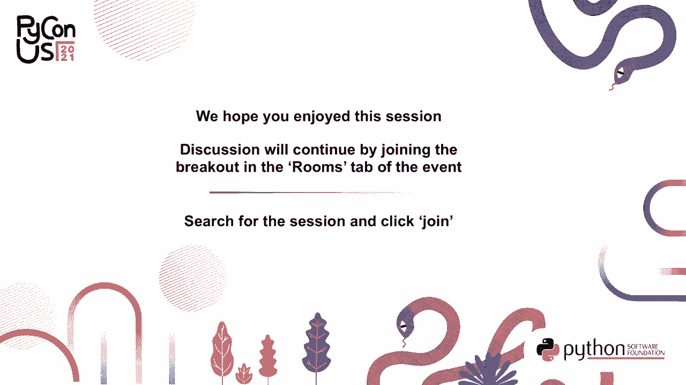

# P9：TALK _ Luciano Ramalho _ Protocol_ the keystone of type hints - VikingDen7 - BV19Q4y197HM

 Hello everyone， my name is Luciano Hamalio and I am here to present a typing protocol。

 the keystone of Python's static type system。 First of all， I want to thank you for watching this。 I want to thank the Python organizers for organizing this great conference and I also。 want to thank TalkWorks， my employer， who is sponsoring me as I prepare and deliver this， talk。 So you may know me as the author of Flint Python。 The first edition was published in nine languages。

 I am super happy about that and I am finishing， the second edition。 It has more than 100 pages about type hints， including lots of annotated examples。 About two thirds of the examples in the book are annotated。 There is New York's A Sync Await content。 The draft is already available in the O'Reilly Learning platform and the print book will。

 be available at the end of the year。 So in this talk we are going to be learning about protocols and also understanding Type。 Shed。 So Type Shed is a repository in the Python organization on GitHub that has stub files。 Stub files are files that have only type hints for functions that are defined elsewhere。 In the case of Type Shed， the main mission of Type Shed is to maintain the annotations。

 and the type hints for the functions in the Python standard library。 And as I was studying this subject to write chapter eight of my book， I found this bug。 which then I helped fix and while doing it I learned a lot about protocols and that's。 what I'm going to share with you。 But first let's talk about some principles。

 I guess you should all be familiar with the concepts of static typing and dynamic typing。 And this actually has to do with when type checks happen。 Static typing is designed to allow static checking。 That is a tool like a front end of a compiler or a linter or a standalone type checker like。

 mypike and look at the source code and find type errors without running the program。 So that's what static typing allows。 Dynamic typing on the other hand is when the type checking only happens at runtime。 So it has the downside that you want to catch bugs later but it also provides a lot of flexibility。 and it also makes languages easier to learn。 Another dimension is that issue of duck typing。

 So Wikipedia mentions this message by Alex Martelli in the Python mailing list in which。 he wrote in the year 2000 that you shouldn't check whether an object is a duck but whether。 it quacks like a duck or walks like a duck depending on what subset of duck like behavior， you need。 The subset here is key。 When you're doing duck typing you're only interested in that particular method or those。

 particular few methods that you need to operate on the object right now。 You don't care about the whole interface of the object only about the behaviors that are。 relevant to a particular piece of code。 So that's the idea of duck typing。 So this introduces another dimension to our graph which the vertical dimension the top。

 is structural types and the bottom is nominal type。 So structural types means the types are defined by specific methods that the objects provide。 No it doesn't matter what the class of the object is named， what is the class hierarchy。 Nothing of that is relevant。 What's relevant is the methods that the object provides。 Only that。

 And the opposite is nominal types which is when the type checker is looking at declared， types。 types that are explicitly declared or sometimes inferred but anyway there are。 appear in the source code explicitly somewhere。 If this was a map we could call the northeast。 Python land and the southwest is Java land。 However there is also the southeast which is goose typing a term also invented by Alex。

 Martelli and this is supported by abstract based classes in Python。 I don't have time to talk about this。 The focus of this talk is static duck typing which is when you have static checking of。 structural types。 When I didn't make up this name the term is actually used in PEP 544 the PEP that introduced。 the protocol feature in Python and is also used in the go community to talk about their。

 type system with interfaces which is very similar to what we now have in Python with， protocols。 So Python has a very powerful function called max a built in function probably everybody。 knows about it。 It accepts a single argument that can be a iterable and then it will return the largest。 member of the iterable or you can pass it several arguments and then it will give you。

 the largest of those arguments。 There are other optional arguments that you can pass but we don't have time to talk about。 that。 Let's consider a simplified max or a simplified usage of max where I only pass two arguments。 But even this is difficult to annotate with type hints because you have floats as the， arguments。 The second example is integers。 The third example is two fractions。

 The fourth example is two strings and then lists and then sets and each time the result。 has to do with how those objects of that type compare。 The issue that started this story for me was that somebody reported this issue on my pi。 and the issue was that this person declared a variable top in the middle of his code there。

 The variable top of type optional int which means that it could be either an int or none。 and then he assigned none to it and then he called print。 Print max 5 top will fail because Python cannot compare 5 with none。 So that fails at runtime。 But the issue was filed on my pi because the poster wanted would like for my pi to warn。

 about a problem like that。 Then Jean-Yeusztre who is one of the biggest contributors to Type Shed commented that this。 was not really a my pi problem but more a type type shed problem because on Type Shed。 the annotation for max was too open at the time。 It basically accepted arguments of type any which could be anything。 So I'm going to develop a solution to this problem。

 The solution that I eventually presented and I'm going to show you but we're going to start， simple。 Let's talk about numbers first。 And talk about numbers。 I have these three examples。 Flots。 integers or fractions。

 So how do we do with floats？

 This is the simplest thing that we could do is to add annotations to max。 Here's the thing。 max in the sender library is written in C。 I wrote a version in Python。 This is just the first iteration。 Then it has more code to deal with all the cases that max handles。 And I did that because it was easier for me to test and see the corner cases of the different。

 types of arguments。 But anyway， if I wanted to write a max function I would annotate that only with floats I would。 annotate it like that。 A is of type floats， B is of type floats and the return type is float。 And I wrote tests and the tests pass but there is a painting issue。 One is example here when I analyze it with my pi。 Here's the thing。

 My pi doesn't find problems with my implementations of my max。 See the first line of the console at the bottom。 I ran my pi on my max。py which is the package with my max function and also my max test。 But my pi didn't find any problems。 But it did find problems with this painting。

py because the problem here， you can see it's， complaining about line 22。 On line 22 you see over there I have result equals， it's where I call result equals my。 max a comma b。 And the problem is a and b are fractions。 And what my pi is saying is that a fraction is not compatible with float which is the type。

 that I declared in the function。 So that's a problem。 So what is a possible solution？

 So Python has a number ABC in the standard library since Python 3。 This is actually a misstep。 I included a few missteps here because I think they help you。 I hope they will help you understand a little bit better how the Python static type system。

 works。 So the implementation of this failed attempt is to use the number ABC from the numbers package。 in the standard library to annotate the parameters a， b and the return type。 And if I do that my pi immediately complains that I cannot use online 5。 That's where I do the comparison between a and b。 I cannot use that operand with number。

 And why not？ Because if you go look at the implementation or the declaration of the number ABC in the。 numbers package it has no methods。 So this is only useful for one time type checking using its instance or its subclass。 for objects in the standard library and for classes in the standard library that are。 registered as virtual subclasses of number。 But it doesn't work with static typing because static typing needs to know what operations。

 I can do with the object given its type。 If I give。 if I tell my pi that an object is of type number it can do anything with it。 This is a deep issue and if you want to understand the questions around it take a look at this。 issue on my pi with it。 So it's still open four years later。 Int is not a number。 Okay？

 Issue 3186 on my pi is a good read to understand the problems around using the numbers ABCs。

 A second attempt that also will not work would be to use an numeric union。 Let's see how that would be and why it doesn't work。

 So the idea is in this case on line 5 I declare my own type。 This is a type alias。 I am telling my pi that numeric is a name I'm going to give to the union of float decimal。 infraction。 Right？ So anything that's either a float decimal or a fraction will be considered numeric。 So on line 8 I use the numeric type alias that I just created and this satisfies my。

 pi you see because all three of those types implement the greater than or equal to operator。 So that's fine。 Now the problem is that the test doesn't work as expected。 In this example on line 19 I am passing A and B which are both floats and I know that。 the result will be a float because the result will be one of them。

 So that's how I declare it but then my pi tells me that the union of float decimal infraction。 is not compatible with floats。 So the problem is that the return type is too broad to be useful and additionally if for。 instance in this case I am passing two fractions and so I know that the result will be a fraction。 Right？ However if I try on line 25 to access the numerator my pi complains that some of those types in。

 the union don't implement numerator so it would be incorrect to access numerator or， denominator。 Right？ And then the second part here is if type checking。 Type checking is a constant that is only true when your program is not running。 It's funny it's something that was invented to support the static type checker so the。

 static type checker considered this as true when it's reading your program and then it。 will evaluate what's inside。 And inside is this review type function which is also something magical of static type checking。 that is a function that my pi knows about。 You don't import it anywhere and my pi you use it for debugging。 Basically what's doing there it's showing that the types of ABN results are see on the。

 console down。 The notes in purple the first one is a fraction the second one is a fraction the third design。 union。 Right？ So it tells you what the types are according to the analysis that my pi did of your code。

 Okay？ So a good solution actually to the numeric max would be using a restricted type bar。 So how does that work？

 So instead of a union I declare a type bar。 So type bar is a special class that you import from typing and then you declare type bar and。 then the name of the type bar which is in this case number T is a string and then afterwards。 you can list different arguments that are the types that will be acceptable for this type， bar。 Okay？ So what happens in this case is when I declare the arguments of max of as being of type number。

 T this is a convention to use the T at the end for type bars。 So when I say that ABN the result are number T and my pi is analyzing a specific call of， max。 Let's say I'm calling max with the decimal。 Then with the first argument is a decimal。 Then at that time my pi will decide that， okay， a decimal is acceptable because it's one。

 of the types listed in the type bar definition and from now on it's going to consider the。 other occurrences of the same variable in this call。 The same type variable in this call will be considered the same as the first one。 So B will have to be a decimal and the result will be assumed to be a decimal as well。

 So this works， the tests work， actually the tests have always worked。 The problem with this implementation has never been the runtime behavior but more the problem。 of type checking。 Now my pi satisfies and shows that it correctly infers the types of the three variables。 the， ABN the result， okay。 So how about deck typing？ All right。

 so what we did now was using a type bar we were able to solve the problem。 of max with different numeric types， at least those three numeric types。 There are more numeric types than that， for instance， NumPy has lots of other numeric。 types but in addition even in Python， extended library we often use max with strings and。

 with lists and sets and so how do we do that？ We need to use a protocol but my first attempt to use a protocol is also a misstep。 So the first attempt is this， but this is useful at least to show you the syntax of。 creating a protocol。 So on line four there you see that I import the class， I mean， I import。 when I import the， class protocol from typing and on line four I create a subclass of that and this subclasses。

 I write one or more methods。 Protocols usually should have few methods and often they have only one method。 In this case is the Dundee LT method which means the last then and there's this convention。 when a protocol implements or defines only one method that you call it supports that method。 supports that method name。 So what I'm saying here is the protocol supports less than is a type that is valid for every。

 object that supports that implements the Dundee LT method with that signature returning a Boolean。 Okay？ And so this is how you declare protocol。 You see those ellipses。 the three dots after the bool， that's where the body of the method。 would be but you don't specify the method。 This is kind of like an abstract method， right？

 So instead of using pass the convention in the static type system is to use three dots。 which is the ellipses construct of Python。 So that's syntactically valid and it means whatever。 It doesn't matter what the body is， the only thing that matters is the signature of the， method。 And so now I declare the function like that。 So A is anything that supports less than。

 B is anything that supports less than and the， result will be something that supports less than as well。 I have to do a change in the body of the function because before I was using if A greater than。 and greater than or equal to B but what I just said was that supports less than means。 to implement the less than operator。 And why did I pick that one？

 It was because I did some research and I discovered that in the Python standard library everything。 that does sorting or ordering or comparison of greater than less than or so on， they actually。 use less than as the core methods。 The others are variations of that。 So that's the one that matters。 But anyway， since I declare support length to implement only that。

 I have to only use， that inside the body of the max function， line nine。 And so now my pi。 the test pass and my pi also likes my tests and my package。 No problem。 The problem is when I use it。 So the problem when I use it and here the errors are about two different tests but if。 you look at the code on the top left here on the top right， what we have is online 38。

 I try to take the result and call upper on it。 I know it will have upper because I pass two strings so the result will be one of those。 strings。 But since I declared the result type as support less than， my pi doesn't accept that I use。 the upper method on the result。 Okay， so that's the problem。

 And now finally we come to the solution。 So the solution is to use a protocol plus a bound type var。 And that's why we had the detour to talk about type var before and we also had the detour。 to talk about protocol just now because the combination of those two things brings us the， solution。 The protocol definition is like before， the type var here is new。

 The type var here uses bound equals support less than。 So that's different from the other one。 The other one was the type var had several arguments。 It was called the restricted type var。 So it was restricted to be one of those types。 In this case， this is called a bounded type var。 A bounded type var can have any type that is that type or a subtype of that。

 And when my pi analyzes it， it keeps the original type。 So for instance， when。 let's say I pass two max here， the first argument is a string。 And then， so my pi will say， okay。 last t is defined like that。 A string is acceptable because it's a subtype of supports less than because strings do implement。 the， the， the， the， the， the， the， the， the， the， the， the， the， the variable is bound to， string。

 which means if we understand that B has to be a string and the result will be， a string as well。 And that means that the test pass， my pi is happy。 Everything works。 The actual solution of max is a bit more complicated because of all of the variations in the， in。 in the signatures， the combination of the different types and the different signatures force。

 force does to write six overloads。 They don't have the time to explain this。 but this is basically the alternative type hints， for the same function。 It turned out that supports less than was useful。 It's now used in the type hints for 14 functions in the standard library。 And to wrap up， so this is why I consider protocols， the keystone of Python's type hints。

 because as initially proposed， the type hints were okay， but limited Python to a Java style。 of programming， because they didn't allow us to annotate code that used deck typing。 Now with PEP4。 I think we have a solid and complete and useful type system。 Of course。 it's always possible to evolve it， but now I think it's very usable。 To finish。

 I'm going to quote Alan Kay who said that I'm not against types， but I don't。 know of any type of systems that aren't a complete pane， so I still like dynamic typing。 I don't think Python's type system is a complete pane， but it is painful sometimes， and there。 are things that are very complicated to annotate， and some things that are still impossible。

 to annotate because the language is more expressive than the type system。 So let's please embrace the fact that what we have in Python is gradual typing。 Python is not a statically typed language or a dynamic typed language only。 It's actually a gradually typed language， which means that we can use as much or as little。

 of static type hints as we like， or makes sense in the different contexts。 And so please let's embrace and celebrate the fact that Python is a gradually typed language。 and let's not try and make every code base 100% type check， because if we do that， we。 are not going to be leveraging all the power that Python has to offer。 Alright。

 so thank you very much。 Please get in touch， and we are going to go for Q&A now。

 Thank you。 [BLANK_AUDIO]， [BLANK_AUDIO]， [BLANK_AUDIO]， [BLANK_AUDIO]， [BLANK_AUDIO]， [BLANK_AUDIO]。
