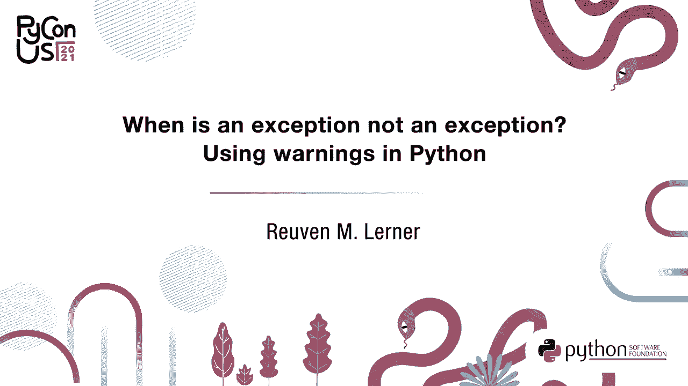
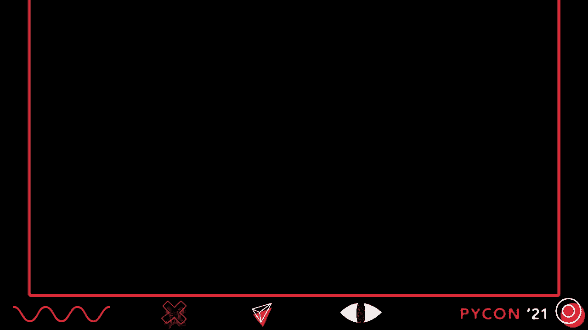
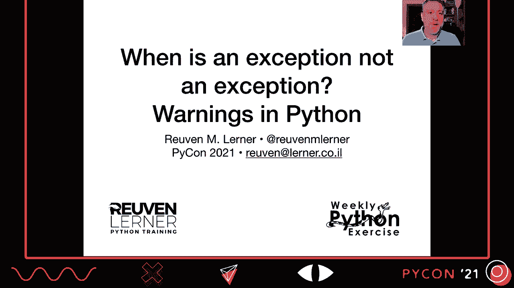
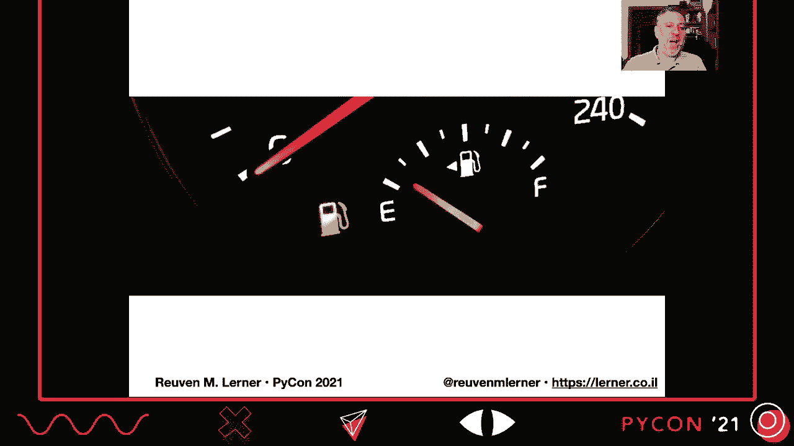
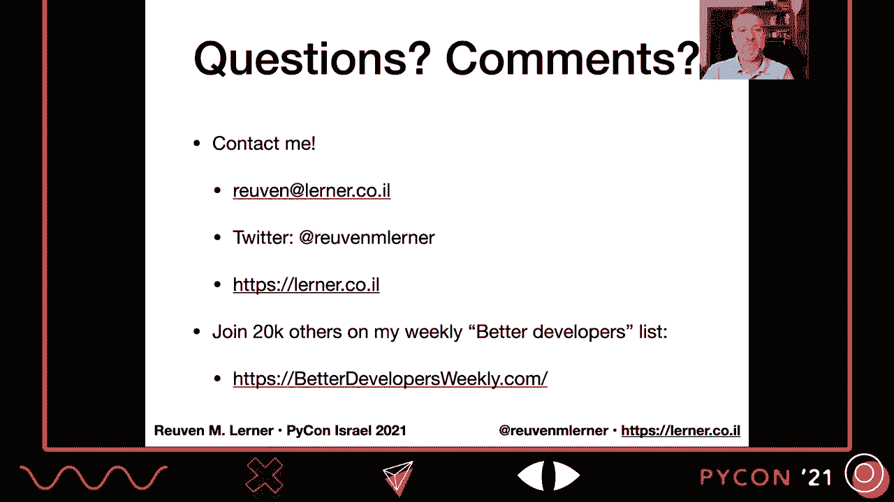

# PyCon US 2021 - P14：TALK _ Reuven M. Lerner _ When is an exception not an exception_ Using warnings - VikingDen7 - BV19Q4y197HM

 [MUSIC]。

 Hey there， this is Reuben Lerner and I want to welcome you to my talk for Python 2021。

 When is an exception， not an exception？ Warnings in Python。

 So let's start off with an example from real life。 Your car， your car needs gasoline。 Well。

 most of us in our cars we need gasoline。 And that gasoline can run out。

 And you really don't want to be stranded on the road without gasoline。

 So your car has a fuel gauge and the fuel gauge goes from empty to full。

 And you are supposed to go put gas in your car when it gets close to empty。 Because again。

 you don't want it to run out of gas。 What happens if your car is close to empty， not quite empty。

 and， you haven't put gas in？ Well， that's right， a yellow warning light goes on。 Now。

 the lights on the dashboard of the cars you might know are known as idiot lights sometimes。

 And this light is indeed saying， hey dummy， you really don't want to be stranded on。

 the side of the road without gas。 You really should put gas in the car now。

 Drop everything else you're doing， get gas。 Well， that's great because the car is trying to stop us from doing something that。

 couldn't be harmful before we actually caused harm to ourselves or even to the car。

 Well， think of how often in our code， our program encounters all sorts of really。

 dangerous situations or the user is going to do something potentially dangerous。

 They haven't done anything dangerous yet， but if they persist in their behavior， things can get bad。

 So what we need is some sort of low fuel light for our software and， idiot light as it were to say。

 hey dummy， if you don't change what you're doing soon， bad things will happen。

 And such a low fuel light， such a warning， needs to be annoying。

 It needs to be persistent enough to get us to change。 We need to say， not this again。

 I really should change what I'm doing。 But it shouldn't be fatal to the program。

 It should be annoying， but not stop us from running what we're doing。 Well。

 that's what I'm going to talk about here。 Warnings and warnings have been around in Python for an awfully long time。

 Since November of 2000， it was introduced in PEP 230 and， it was first in Python 2。1。

 And the original motivation was to annoy Python developers enough with bad behavior。

 that they would change how they do things so it would be compatible with Python 3。 At the time。

 the Python core developers were really worried that people were， not going to switch to Python 3。

 And quite frankly， there was good reason for them to be worried。

 given how things played out and how long people continued to use Python 2。

 And so what they wanted to do was say， don't do it this way， do it this other way。

 And you can get rid of the warnings of course， by adopting new best practices。

 Now you've probably seen some warnings already。 Here's one that's in Python 3。9。

 which is the latest version。 If you try to import mapping from collections， you get this message。

 Deprecation warning， using or importing the ABCs from collections。

 instead of from collections ABC is deprecated since Python 3。3。 And in 3。10 it will stop working。

 So it's basically saying， look dummy， change your behavior。

 It's also saying you should have noticed this before and。

 we're really trying to save you from yourself。 Because the next time we release a new version of Python。

 Python 310， what you're doing in your code will no longer work。 Don't run out of gas， pull over。

 put some gas in your car， or just change the import statement， which is actually quite easy。

 So doing really need warnings， aren't there other mechanisms in Python。

 that we could use instead of them？ Well， one is we could go with exceptions。

 And exceptions actually have a lot going for them。 There are separate communications channels。

 People don't really appreciate this enough。 Exceptions are not just different in that they're providing us with a way。

 to indicate something has gone wrong。 They are a separate way of communicating that doesn't get mixed up with assignments。

 doesn't get mixed up with anything else， and we can trap them。

 The way that I like to think of exceptions actually is sort of like a cell phone。

 If you're talking with a good friend， maybe not such a good friend after you hear my example。

 talking with a friend and your cell phone goes off。 You're going to say to your friend。

 hold on a second， let me just get this， right， right， on my right， we all do this， right？

 And you answer your cell phone。 And then when the cell phone is done， that conversation is done。

 you put down the mobile， phone and you continue speaking with your friend。

 assuming they are still friends with， you after such a rude behavior。 Well。

 basically you can think of your exceptions and your code as being like a cell phone。

 You have to take it。 You have to deal with it。 And then after you're done dealing with it。

 then you can go back to the program。 And so that's really good about exceptions。

 Also we can trap them by name。 We can distinguish between them。

 And then we can decide whether we want to ignore them。 Yeah。

 but exceptions aren't exactly what we want for this kind of warning because if。

 you don't catch an exception， the program ends。 And it's not a crash， right？

 It might as well be a crash because the program exiting with an unhandled exception doesn't。

 make anyone feel better about it。 It just means like we're using a different term for it exiting。

 Now in some other languages， you have to trap for any exceptions that might be raised。

 They have to be mentioned explicitly， but in Python， anyone can raise any exception at， any time。

 So in order to trap these sorts of warnings， you would have all sorts of equivalent of。

 accept clauses。 So that's not really going to work for us。 We can go sort of to the other extreme。

 We can try print， right？ Why not just print？ Hey， something's going wrong here。

 The thing is it's not serious or scary enough。 We want something that's really going to like shake people up and say。

 hey， you should， really change your behavior。 The other thing is that print。

 it might get mixed up with regular program output。 And yeah。

 we can start printing the standard error instead， but it's not really what we， want。

 The other thing is we can't really filter or trap print statements。 I guess print functions， right？

 You can't filter what's being printed on the screen。 And we really need something。

 some sort of mechanism like that。 And that's what warnings provides us with。

 It provides us with sort of an in-between thing， between exceptions and print， that， we can filter。

 we can trap， and we can even redirect to other places so that it doesn't。

 get interfered with or doesn't interfere with our code。 So how do we use warnings？ Well。

 let's assume that I maintain a module with a Python function hello。 So my module is called hello。

 my function is called hello， and it's pretty simple， right？

 So death hello name and return F hello and then F string curly braces name。

 Now I'm going to change this function。 I'm not to change the API on all of my users。

 which not the smartest thing to do， but fine。 And now I want to take a list of inputs rather than a single string。

 How can I notify my users they should start passing me a list of inputs rather than a single。

 string？ Well， I'm going to make this change and this change is going to be dramatic。

 So I better warn people about this。 So before it goes into effect。

 and it's a really crucial point about warnings， you want， to warn them。

 giving them enough time to do something like the low fuel light， right？

 If you told them 30 seconds before you're about to run out of fuel， they better be asked， up。

 That's not so helpful。 So what are we going to do？

 We're going to before this change goes into effect add a warning to the function。

 And here's what the warning looks like。 Well， first of all， I have to import warnings。

 It's not in built-ins。 In the pet， they actually say that this was considered。

 but they decided that developers， are， you know， we can deal with a little bit of importing。

 So import warnings。 And then I'm going to call the function warnings。warn。 That is how we。

 this is sort of the equivalent of rays。 That's how we indicate that something is going wrong。

 And we pass an argument there， a string indicating what message we want to show to the user。

 So how does this work？ Well， now in my program， I'm going to say from hello， import hello。

 I'm going to call print hello world。 And when I run it， that's what I get。

 This is the output that we see。 Now， the output is broken into a few different pieces。

 We see in what file did we get this warning and what line of that file as well。

 Then we see what kind of warning it was。 And you're going to see there are lots of different types of warnings or categories。

 of warnings that we can issue。 Then the message， the message that was passed as that second argument to warnings。

warn。 And then finally， we see that indeed this warning was raised by the function warnings。warn。

 That's not such a surprise。 We're going to talk about that more in a bit。

 Finally you see that our program does actually run。 We have not exited。 We have not， you know。

 crashed nothing like that。 The program still runs。

 The warning just sort of pops up and they're saying， hey， don't forget about me。

 Now it's true that the output from the warnings is sent to standard error not to standard， app。

 So that means that if you're redirecting standard app from the program， you'll still see the。

 warning on your screen。 And it'll go along with any other errors that are printed。

 So that's really good。 Now， of course， you redirect standard error。

 That's not a bad thing because it'll go， as I said， with all the other errors。

 So if I now say use hello。py and I redirect it to hello。txt， we're still going to see。

 the warning on the screen here， which is good。 So the thing to keep in mind is that warnings require you to plan ahead。

 You need to warn your users that in advance of what they are doing that's wrong and how。

 things are going to break。 And we see this in well maintained open source projects。

 They plan ahead enough that they can say， okay， in another two versions， this is no longer。

 going to work。 So this version， the next version， we're going to give them increasingly dire sounding。

 warnings saying， hey， dummy， you better keep saying dummy， right？ You want to respect our users。

 Yes。 Hey， user， we really want you to plan ahead and think about what's going on。

 You want to give your users time to transition。 So really think about if you need to make changes like this。

 how far in advance you can， make them and then how far in advance you can warn your users about it。

 So we saw before that user warning was what was being sent。 And as I said。

 user warning is a category similar to an exception class and it provides。

 us with two different benefits， one of which is the semantic power。 I as a person will read and say。

 oh， it's a user warning。 I understand what it means。

 I understand how to distinguish that from other kinds of warnings。

 But the other advantage is that by having this category， it's sort of like with exception， classes。

 I can detect it and filter it。 And the warning system actually does help us with that。 By the way。

 warning categories are exception classes。 How do I know this？ Well。

 if I go to user warning and I say， what is your dunder basis and dunder basis is how。

 a class in Python indicates what it inherits from and inherits from class warning。 All right。

 So warning is sort of the overall parent class for all warnings。 But then I go to warning and say。

 hey， warning， what are your bases？ It says， oh， I inherit from exception。

 So warnings are exceptions， at least in a typical sense， but they're handled separately。

 and differently。 You're not going to raise a warning typically。

 although we'll see how you can turn warnings， into exceptions if you really want。

 So built-in warning categories， there are a whole bunch of them， right？ There's regular warning。

 That's the parent class， as I said。 There's user warning， deprecation warning， syntax warning。

 runtime warning， and pending， deprecation warning。

 So deprecation warnings means you really should not be using this。

 Pending deprecation warning means， hey， soon you won't want to be able to use this。

 And so I can actually pass this as the second argument to warnings。warn。 So when I call warnings。

warn， I'm going to pass a message。 I'm going to say， what kind of warning I want to pass。

 Here's the deprecation warning， because that's sort of appropriate， right？

 The thing is if we actually run this code， suddenly our warnings don't appear anymore。

 It disappears。 And that's because deprecation warning is filtered out by default。

 So it won't appear。 You have to explicitly say that you wanted to appear。

 And we're going to talk about filtering in a little bit。 The thing is， as you might know， in Python。

 when you're just writing code and you want， to raise an exception to indicate that something has gone wrong。

 you should not raise the built-in， exceptions。 It seems so tempting， right？

 I'll raise a type error here。 I'll raise an index error there。

 But it's generally frowned upon to raise the built-in exceptions。

 You should create your own exception classes and raise those。 And once again。

 those give us extra semantic power and they allow us to do better filtering。 Similarly。

 it's a really good idea to create your own custom warning categories。 Now。

 your new warning should probably subclass one of the existing types， so it'll be filtered。

 appropriately。 But you can do what you want。 As long as you create a class that inherits from warning。

 you're good。 So let's see how that could work here。 Well， I'm going to create my class， as I said。

 Class are exchanging warning， which inherits from user warning。

 And then what is going to be the content-- what are the contents of my class？ Nothing。 Just paths。

 Why？ Well， because I don't really want to give any content， right？

 So warning is not useful as a class I'm going to instantiate and then call a method on。

 And I don't need to store any additional state。 I just want to be able to distinguish it from other warnings。

 And then what we can do-- in addition to paths， we can then pass， as it were， our exchanging。

 warning as our second argument to warnings。war。 So what happens when we're warned？ Well。

 we've already seen that a warning will be sent to standard error， like the message。

 would print it there。 But we can actually customize what happens to particular categories of warnings。

 And that's done with warnings filters or Python's warnings filter。

 We can specify what should be done with particular types of warnings， particularly categories。

 But we can specify not only based on category， we can filter based on the message contents。

 and the module in which it was raised and a whole bunch of other things。 Now， the default filter。

 what comes with Python by default if you don't do anything else。

 it prints warnings the first time they appear in a given file on a given line。

 So if you encounter the same call to warnings。war multiple times， then you're only going。

 to see one message。 But the same warning appears in multiple places of the code。

 you will see multiple messages。 Let's see how that would work。

 So I'm actually going to call now hello twice in my program， in my use hello。

 I'm going to say hello world one and hello world two。 And if I just say use hello。py， look。

 we're going to get our warning once， even though， you see we have output twice。

 So we did call the function twice， but because of the default behavior in Python for this。

 kind of warning is only going to warn us once。 Wait a second though， hello。py nine。 Okay。

 like I can see where the warning was raised。 And it was raised by warnings。

one is that kind of obvious？ Like don't we know that the warning was raised by warning that one that hasn't added any。

 useful information to us。 But when we call one is that one， we can actually pass a stack level。

 And that stack level is an integer indicating what function should be message。 So how far back。

 how many stack frames back should we go to pull out information about。

 the function and print it on standard out。 So by default stack level equals one。

 I mean the call the warnings that warn itself， meaning。

 you're going to see them on what line warnings that one was called。

 But it's pretty common to say stack level equals two。

 So you're going to see who called the thing that generated the warning。

 And indeed here we can see now if I call with our changing warning， comma two。

 Now we're going to see that the call to hello with is what triggered it， not the call to， warnings。

warning。 And sure enough， if I call use hello。py， we're going to see that now is a new solo。py。py。

 five of line five。 And it's going to say， hey， it happened here when you called hello。

 So many times it's going to be more useful。 All right， back to our filter。

 When Python counters are warning， it has actually six different actions it can take。

 We can choose which of these we want。 So we can say always and always means it doesn't matter how many times the warning is raised。

 from where we always want to print it out。 Another option is ignore。 I don't need this warning。

 I don't care about it。 Not important to me。 And another one sort of the other direction is error。

 meaning turn this into an exception。 And that's the advantage of having warnings as a sub-class of exception。

 the Python can， handle it then right away。 And so if you want to be really harsh。

 you can just say always raise an exception， make， an error for everything。 So for example。

 let's say we want our exchanging warning to be displayed every time it occurs， no matter what。

 So every time that the always action。 So how do I say this warning should be shown always no matter how often it's chosen？

 Well， if I want from the command line， it can pass the minus big W option and that switch。

 there takes an argument and that argument is the action we want。 So I can say minus big W always。

 By the way， each action begins with a different letter。

 So you can abbreviate to minus big W little a。 So if I now say Python 3 minus big W always for use hello 2。

py， right？ So what it's going to show now is both times， both times that we called hello world。

 It's going to show me， well， I only said it to be stack level one。

 So it's going to show us warnings that warn and the final which that's fine， which is fine。

 Now the thing is you can filter in a lot of different ways。

 We've already seen how you can filter based on the action， but you can filter based on。

 the message and there's a regular expression match of the case insensitive message start。

 I know that sounds complicated， but basically we can use reg X to match the beginning of。

 the message。 You can filter based on the category。

 You can filter based on the module name in which we have the warning。

 You can also do the line number。 So you can say I want to filter on。

 I want to give this action for this category for this message in this module with this line， number。

 The thing is if you want to pass multiple actions for multiple types of categories， you just。

 pass minus big W multiple times。 So for example， if I want to give deprecation warning。

 but nothing else and always action， and regardless of the message， I can say minus big W action。

 colon colon double colon。 That means I'm going to ignore the message deprecation warning。

 What if I want to make those deprecation warnings visible， but only if the message starts with。

 an A and I should add again， it's case insensitive。

 So then I'll put an A there between those two codes。 If I want to make Unicode warnings。

 anytime I make out the Unicode warning， turn that into， exception， I'll say minus big W error。

 colon colon Unicode warning。 By default， the warning system works like this。

 These are the filters that are set。 It says deprecation warning， main has the default。

 but we're going to ignore general deprecation， warnings and you can see them that you can set up the filters to work on the same warning。

 category， but you can do it with different actions for different matches。 Now。

 why would they have done this？ Aren't deprecation warnings important？

 Don't we want to know about them？ Well， the answer is of course， yes and no。

 We want to know about deprecation warnings in our own code and the programs that we're， running。

 But if I import a module and that module hasn't been updated and gives me a deprecation， warning。

 do I really want to see warnings for someone else's code？ Probably not。

 And if you've ever encountered that， where when if you import something， some of you're。

 flooded with warnings， you know how annoying that can be。

 Because like you're not going to go maintain that code that someone else's code。

 And yet you're suffering the consequences because they haven't maintained it。

 That's why deprecation warnings are traditionally ignored， except it doesn't remain because。

 then it's your fault。 We're also going to ignore pending deprecations and import warnings and resource warnings。

 Of course， you can change all this， but these are the defaults。 Now。

 there is another option where you can set the Python warnings environment variable。

 So we can say Python warnings equals e deprecation warning and d resource warning。

 So we can do all that stuff。 Now the thing is you can't use what we just saw。

 You can't use the minus big W switch or Python warnings that you've environment variable。

 You cannot do that for custom warning categories。 And that's because our custom warning categories are classes defined in our code。

 And because those warning switches are done before our code is loaded and run， it just。

 can't know about it。 The thing is we can do it from within Python and there are a few different functions we。

 can call。 There's warnings that filter warnings， which are less specified all five different filter。

 elements。 But a lot of times you're not going to want to do that。 So for people like us。

 like moral people， they're going to have simple filter and then， just specify the action。

 the category line number。 And then there's also reset warning。

 So if you have one portion of your code where you really want to be using warnings in a。

 certain way and you want to change the filter later on， just do reset filter， reset warnings。

 and they'll do that。 And here's an example of how you can do that in code。

 So I'm going to import warnings and then I'm going to import from hello， import hello。

 and are exchanging warning。 I'm going to import a custom category。

 Now I can actually set on the filter for my custom category。

 I'm going to say set the default for that。 And then when I call hello world one and low world two will be fine。

 There's even a context manager you can use catch warnings。

 If you want to temporarily change the filters just for one simple set of code。

 So we can turn off all warnings that I'm doing if I'm calling some poorly behaved function。 Right。

 I know it's going to cause warnings but I don't care。 So I'll just do a with warnings。

catch warnings and then I set the simple filter to ignore。 I'm going to ignore everything。

 Like I'll go around with yep。 Can't see any problems that there must not be problems call poorly behaved function。

 So where should we use warnings？ It's very nice to have all this， you know。

 technology around that we can use， but where， should we use it？ Well。

 one is if you have a module that is that that people are using and it's going。

 away or it's going to change its API。 If you're making sense of changes。

 you can put warnings that weren't at the top of the， module。 Remember。

 remember that modules are executed when they're imported。 Now。

 normally I'm not a big fan of putting executable code or at least like printing things。

 out in modules。 But this is an exception。 It's not an exception。 It's a warning。 All right。

 But I like it。 Remember that deprecation warning is ignored by default。

 So you might want to change that or you might want to understand that maybe you shouldn't。

 be turning on warnings for other people who are using your modules。

 You'll have to figure exactly how you want to do this。 But again。

 you want to inform people before it's too late。 Another great thing to do is if you're noticing common mistakes。

 so people are commonly causing， calling a function with the wrong arguments。

 use a warning to point them in the right direction。

 So if you have a function and people are constantly calling with an integer and you really expect。

 a string， you can warn them about that。 That might even be nice。 Now。

 the most famous warning in PANDAS is the setting with copy warning。

 And that basically happens when you are using， for lack of better term， double square brackets。

 You're trying to set data on a data frame。 The problem is that you're not actually setting on that data frame。

 You're setting it on the thing that you got back from the second set of square brackets。

 So a lot of people make this mistake。 And so PANDAS is constantly issuing these setting with copy warnings all over the world。

 Lots of people。 How do I know that happens a lot of times？ Because if you look on Stack Overflow。

 it's just full with people complaining about setting， with copy warning， what do we do？

 So rather than let people make these mistakes， PANDAS says， "Hey， this is a warning。"。

 And even in the warning text points you to the URL of the documentation for PANDAS where。

 you can fix it。 Scikit-learn used to warn you if you tried to run predict on a one-dimensional list or。

 array。 Now it's an exception。 So they were sort of trying to wean people off of bad behavior。

 And Python 2， which I hope you're not using， inside of a function， if you use the global。

 statement after you'd already signed to a variable， that variable， it would give you， a warning。

 Nowadays it raises an exception。 That's an example， I guess。

 sort of going back to the beginning of how Python 2 started。

 to try to warn us of bad behavior that would not work in Python 3。

 Speaking of going back to the beginning， remember our fuel gauge？ So you as the driver of the car。

 the owner of the car， you're supposed to notice when， you're low on fuel。 If you don't notice that。

 then you have the yellow light and that's like screaming you， "Hey， you should really do something。

"， But what if you ignore the yellow light？ Guess what？ There's another warning that kicks in。

 A lot of beeping。 A lot of beeping telling you， "Listen， you didn't notice the fuel gauge。

 It didn't notice the yellow light。 It's really time to get gasoline before you're stuck in the edge of the road。

"， Be nice to your users。 Give them warnings。 Suggest how they can improve and they will thank you for it。

 If there are any questions or comments， I would love to hear them。 If you want。

 you can always email me， you can catch me on Twitter， go to my website， load it about my courses。

 my books， my corporate training。 You can also sign up for my better developers free weekly list。

 Only about 20，000 other Python developers around the world get an article about Python。

 to help them improve their fluency every week。 Thanks so much for coming to my talk and I really。

 really hope to see you in person， next year in Salt Lake City and Python 2022。 Thanks so much。

 [ Silence ]。

 [ Silence ]， [ Silence ]， [ Silence ]， [ Silence ]， [ Silence ]， [ Silence ]， (silence)。

