# P1：Charlas - Ariel Ortiz_ Match case para principiantes - VikingDen7 - BV1f8411Y7cP

 (speaking in foreign language)， (speaking in foreign language)。

 (speaking in foreign language)， (speaking in foreign language)， (speaking in foreign language)。 (applause)， (speaking in foreign language)， (speaking in foreign language)。 (speaking in foreign language)， (speaking in foreign language)， (speaking in foreign language)。 (speaking in foreign language)， (speaking in foreign language)， (speaking in foreign language)。

 (speaking in foreign language)， (speaking in foreign language)， (speaking in foreign language)。 (speaking in foreign language)， (speaking in foreign language)， (speaking in foreign language)。 (speaking in foreign language)， (speaking in foreign language)， (speaking in foreign language)。 (speaking in foreign language)， (speaking in foreign language)， (speaking in foreign language)。

 (speaking in foreign language)， (speaking in foreign language)， (speaking in foreign language)。 (speaking in foreign language)， (speaking in foreign language)， (speaking in foreign language)。 (speaking in foreign language)， (speaking in foreign language)， (speaking in foreign language)。 (speaking in foreign language)， (speaking in foreign language)， (speaking in foreign language)。

 (speaking in foreign language)， (speaking in foreign language)， (speaking in foreign language)。 (speaking in foreign language)， (speaking in foreign language)， (speaking in foreign language)。 (speaking in foreign language)， (speaking in foreign language)， (speaking in foreign language)。 (speaking in foreign language)， (speaking in foreign language)， (speaking in foreign language)。

 (speaking in foreign language)， (speaking in foreign language)， (speaking in foreign language)。 (speaking in foreign language)， (speaking in foreign language)， (speaking in foreign language)。 (speaking in foreign language)。
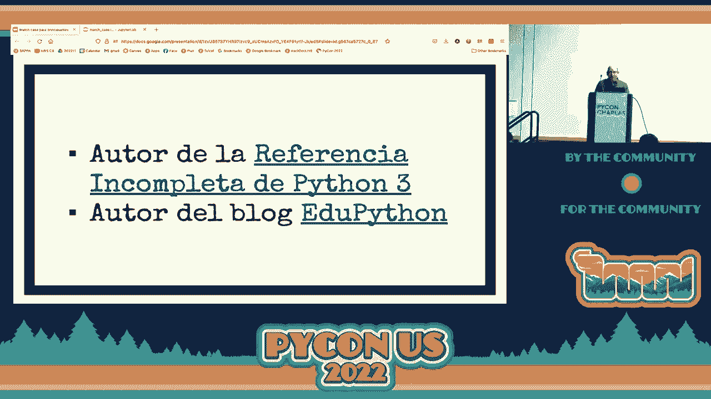

 (speaking in foreign language)， (speaking in foreign language)， (speaking in foreign language)。 (speaking in foreign language)， (speaking in foreign language)， (speaking in foreign language)。 (speaking in foreign language)， (speaking in foreign language)， (speaking in foreign language)。 (speaking in foreign language)， (speaking in foreign language)， (speaking in foreign language)。

 (speaking in foreign language)， (speaking in foreign language)， (speaking in foreign language)。 (speaking in foreign language)， (speaking in foreign language)， (speaking in foreign language)。 (speaking in foreign language)， (speaking in foreign language)， (speaking in foreign language)。 (speaking in foreign language)， (speaking in foreign language)， (speaking in foreign language)。

 (speaking in foreign language)， (speaking in foreign language)， (speaking in foreign language)。 (speaking in foreign language)， and they decided that it was not even possible。 but it was not hardly so break。 As many cases in y pronounced， there was no burden on the same。 It was not that we should have to have， a real worthwhile velocity or a long time。

 We couldn't have a real potential to do this， but it wasn't me。 So there were so many cases。 and I think it was a very difficult time to be able to do it。 I think that it was a very difficult time， because I think it was a very difficult time。 I think that it was a very difficult time。

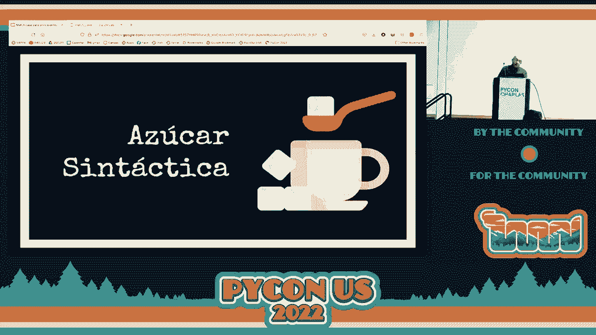

 The question was， what is the best way to do it？ I think that it was a very difficult time。 but I think that it was a very difficult time， because I think that it was a very difficult time。 I think that it was a very difficult time， but I think that it was a very difficult time。 because it was a very difficult time。 I think that it was a very difficult time。

 because I think that it was a very difficult time。 I think that it was a very difficult time。 because it was a very difficult time， because it was a very difficult time。 I think that it was a very difficult time， because I think that it was a very difficult time。 I think that it was a very difficult time， because I think that it was a very difficult time。

 because I think that it was a very difficult time。 because I think that it was a very difficult time。 because I think that it was a very difficult time。 I think that it was a very difficult time。 because I think that it was a very difficult time。 because I think that it was a very difficult time。 because I think that it was a very difficult time。 because I think that it was a very difficult time。 because I think that it was a very difficult time。

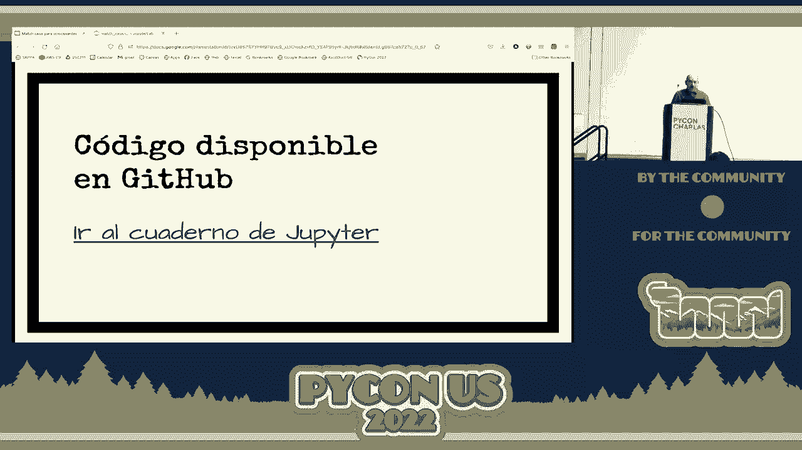

 because I think that it was a very difficult time。 because I think that it was a very difficult time。 because I think that it was a very difficult time。 because I think that it was a very difficult time。 because I think that it was a very difficult time。 I think that it was a very difficult time。 because I think that it was a very difficult time。 because I think that it was a very difficult time。 because I think that it was a very difficult time。

 because I think that it was a very difficult time。 because I think that it was a very difficult time。 because I think that it was a very difficult time。 because I think that it was a very difficult time。
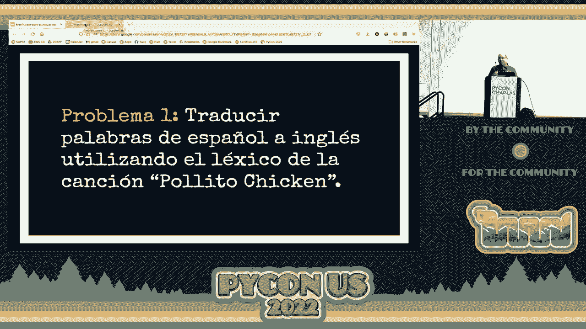

 because I think that it was a very difficult time。 because I think that it was a very difficult time。 because I think that it was a very difficult time。 because I think that it was a very difficult time。 because I think that it was a very difficult time。 because I think that it was a very difficult time。 because I think that it was a very difficult time。 because I think that it was a very difficult time。

 because I think that it was a very difficult time。 because I think that it was a very difficult time。 because I think that it was a very difficult time。 because I think that it was a very difficult time。 because I think that it was a very difficult time。 because I think that it was a very difficult time。 because I think that it was a very difficult time。 because I think that it was a very difficult time。

 because I think that it was a very difficult time。 because I think that it was a very difficult time。 because I think that it was a very difficult time。 because I think that it was a very difficult time。 because I think that it was a very difficult time。 because I think that it was a very difficult time。 because I think that it was a very difficult time。 because I think that it was a very difficult time。

 because I think that it was a very difficult time。 because I think that it was a very difficult time。 because I think that it was a very difficult time。 because I think that it was a very difficult time。 because I think that it was a very difficult time。 because I think that it was a very difficult time。 because I think that it was a very difficult time。 because I think that it was a very difficult time。

 because I think that it was a very difficult time。 because I think that it was a very difficult time。 because I think that it was a very difficult time。 because I think that it was a very difficult time。 because I think that it was a very difficult time。 because I think that it was a very difficult time。 because I think that it was a very difficult time。 because I think that it was a very difficult time。

 because I think that it was a very difficult time。 because I think that it was a very difficult time。 because I think that it was a very difficult time。 because I think that it was a very difficult time。 because I think that it was a very difficult time。 because I think that it was a very difficult time。 because I think that it was a very difficult time。 because I think that it was a very difficult time。

 because I think that it was a very difficult time。 because I think that it was a very difficult time。 because I think that it was a very difficult time。 because I think that it was a very difficult time。 because I think that it was a very difficult time。 because I think that it was a very difficult time。 because I think that it was a very difficult time。 because I think that it was a very difficult time。

 because I think that it was a very difficult time。 because I think that it was a very difficult time。 because I think that it was a very difficult time。 because I think that it was a very difficult time。 because I think that it was a very difficult time。 because I think that it was a very difficult time。 because I think that it was a very difficult time。 because I think that it was a very difficult time。

 because I think that it was a very difficult time。 because I think that it was a very difficult time。 because I think that it was a very difficult time。 because I think that it was a very difficult time。 because I think that it was a very difficult time。 because I think that it was a very difficult time。 because I think that it was a very difficult time。 because I think that it was a very difficult time。

 because I think that it was a very difficult time。 because I think that it was a very difficult time。 because I think that it was a very difficult time。 because I think that it was a very difficult time。 because I think that it was a very difficult time。 because I think that it was a very difficult time。 because I think that it was a very difficult time。 because I think that it was a very difficult time。

 because I think that it was a very difficult time。 because I think that it was a very difficult time。 because I think that it was a very difficult time。 because I think that it was a very difficult time。 because I think that it was a very difficult time。 because I think that it was a very difficult time。 because I think that it was a very difficult time。 because I think that it was a very difficult time。

 because I think that it was a very difficult time。 because I think that it was a very difficult time。 because I think that it was a very difficult time。 because I think that it was a very difficult time。 because I think that it was a very difficult time。 because I think that it was a very difficult time。 because I think that it was a very difficult time。 because I think that it was a very difficult time。

 because I think that it was a very difficult time。 because I think that it was a very difficult time。 because I think that it was a very difficult time。 because I think that it was a very difficult time。 because I think that it was a very difficult time。 because I think that it was a very difficult time。 because I think that it was a very difficult time。 because I think that it was a very difficult time。

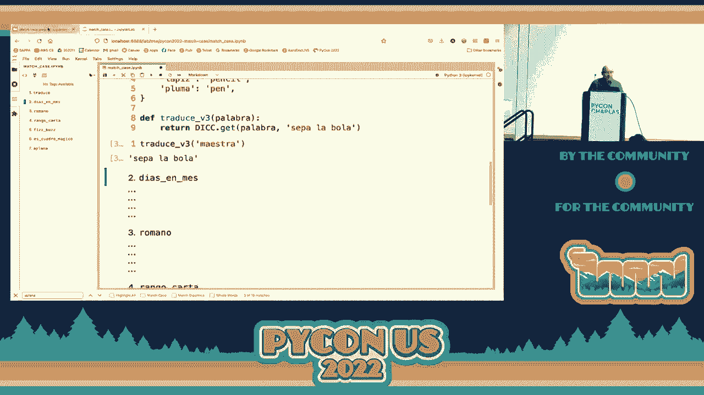

 because I think that it was a very difficult time。 because I think that it was a very difficult time。 because I think that it was a very difficult time。 because I think that it was a very difficult time。 because I think that it was a very difficult time。 because I think that it was a very difficult time。 because I think that it was a very difficult time。 because I think that it was a very difficult time。

 because I think that it was a very difficult time。 because I think that it was a very difficult time。 because I think that it was a very difficult time。 because I think that it was a very difficult time。 because I think that it was a very difficult time。 because I think that it was a very difficult time。 because I think that it was a very difficult time。 because I think that it was a very difficult time。

 because I think that it was a very difficult time。 because I think that it was a very difficult time。 because I think that it was a very difficult time。 because I think that it was a very difficult time。
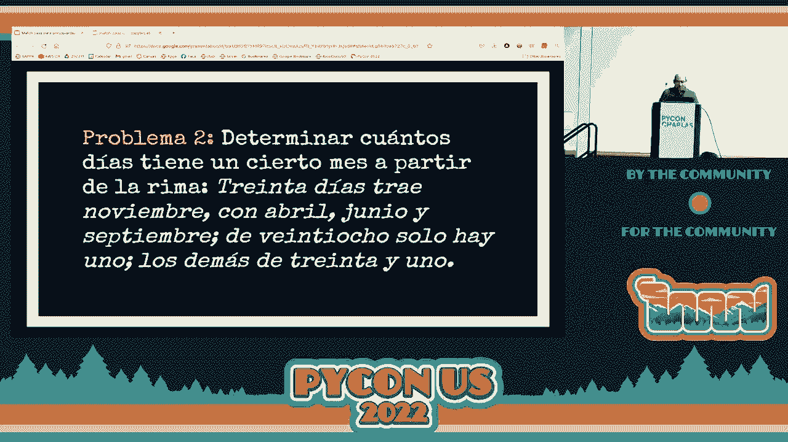

 because I think that it was a very difficult time。 because I think that it was a very difficult time。 because I think that it was a very difficult time。 because I think that it was a very difficult time。 because I think that it was a very difficult time。 because I think that it was a very difficult time。 because I think that it was a very difficult time。 because I think that it was a very difficult time。

 because I think that it was a very difficult time。 because I think that it was a very difficult time。 because I think that it was a very difficult time。 because I think that it was a very difficult time。 because I think that it was a very difficult time。 because I think that it was a very difficult time。 because I think that it was a very difficult time。 because I think that it was a very difficult time。

 because I think that it was a very difficult time。 because I think that it was a very difficult time。 because I think that it was a very difficult time。 because I think that it was a very difficult time。 because I think that it was a very difficult time。 because I think that it was a very difficult time。 because I think that it was a very difficult time。 because I think that it was a very difficult time。

 because I think that it was a very difficult time。 because I think that it was a very difficult time。 because I think that it was a very difficult time。 because I think that it was a very difficult time。 because I think that it was a very difficult time。 because I think that it was a very difficult time。 because I think that it was a very difficult time。 because I think that it was a very difficult time。

 because I think that it was a very difficult time。 because I think that it was a very difficult time。 because I think that it was a very difficult time。 because I think that it was a very difficult time。 because I think that it was a very difficult time。 because I think that it was a very difficult time。 because I think that it was a very difficult time。 because I think that it was a very difficult time。

 because I think that it was a very difficult time。 because I think that it was a very difficult time。 because I think that it was a very difficult time。 because I think that it was a very difficult time。 because I think that it was a very difficult time。 because I think that it was a very difficult time。 because I think that it was a very difficult time。 because I think that it was a very difficult time。

 because I think that it was a very difficult time。 because I think that it was a very difficult time。 because I think that it was a very difficult time。 because I think that it was a very difficult time。 because I think that it was a very difficult time。 because I think that it was a very difficult time。 because I think that it was a very difficult time。 because I think that it was a very difficult time。

 because I think that it was a very difficult time。 because I think that it was a very difficult time。 because I think that it was a very difficult time。 because I think that it was a very difficult time。 because I think that it was a very difficult time。 because I think that it was a very difficult time。 because I think that it was a very difficult time。 because I think that it was a very difficult time。

 because I think that it was a very difficult time。 because I think that it was a very difficult time。 because I think that it was a very difficult time。 because I think that it was a very difficult time。 because I think that it was a very difficult time。 because I think that it was a very difficult time。 because I think that it was a very difficult time。 because I think that it was a very difficult time。

 because I think that it was a very difficult time。 because I think that it was a very difficult time。 because I think that it was a very difficult time。 because I think that it was a very difficult time。 because I think that it was a very difficult time。 because I think that it was a very difficult time。 because I think that it was a very difficult time。 because I think that it was a very difficult time。

 because I think that it was a very difficult time。 because I think that it was a very difficult time。 because I think that it was a very difficult time。 because I think that it was a very difficult time。 because I think that it was a very difficult time。 because I think that it was a very difficult time。 because I think that it was a very difficult time。 because I think that it was a very difficult time。

 because I think that it was a very difficult time。 because I think that it was a very difficult time。 because I think that it was a very difficult time。 because I think that it was a very difficult time。 because I think that it was a very difficult time。 because I think that it was a very difficult time。 because I think that it was a very difficult time。 because I think that it was a very difficult time。

 because I think that it was a very difficult time。 because I think that it was a very difficult time。 because I think that it was a very difficult time。 because I think that it was a very difficult time。 because I think that it was a very difficult time。 because I think that it was a very difficult time。 because I think that it was a very difficult time。
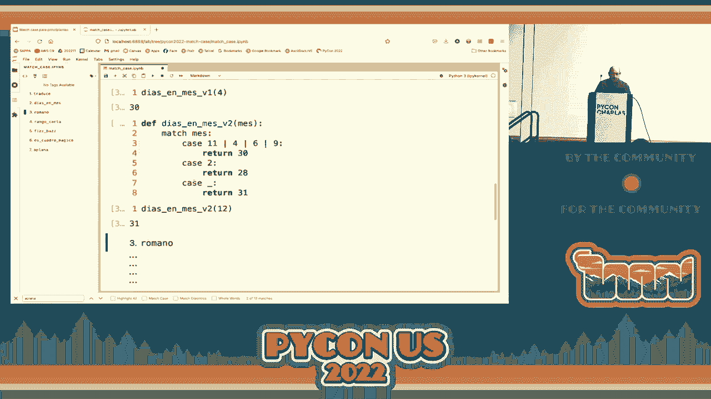

 because I think that it was a very difficult time。 because I think that it was a very difficult time。 because I think that it was a very difficult time。 because I think that it was a very difficult time。 because I think that it was a very difficult time。 because I think that it was a very difficult time。 because I think that it was a very difficult time。 because I think that it was a very difficult time。

 because I think that it was a very difficult time。 because I think that it was a very difficult time。 because I think that it was a very difficult time。 because I think that it was a very difficult time。 because I think that it was a very difficult time。 because I think that it was a very difficult time。 because I think that it was a very difficult time。 because I think that it was a very difficult time。

 because I think that it was a very difficult time。 because I think that it was a very difficult time。
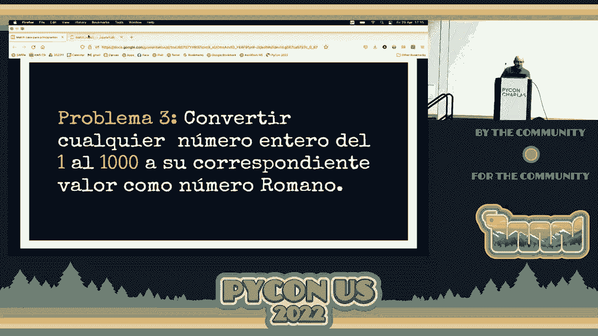

 because I think that it was a very difficult time。 because I think that it was a very difficult time。 because I think that it was a very difficult time。 because I think that it was a very difficult time。 because I think that it was a very difficult time。 because I think that it was a very difficult time。 because I think that it was a very difficult time。 because I think that it was a very difficult time。

 because I think that it was a very difficult time。 because I think that it was a very difficult time。 because I think that it was a very difficult time。 because I think that it was a very difficult time。 because I think that it was a very difficult time。 because I think that it was a very difficult time。 because I think that it was a very difficult time。 because I think that it was a very difficult time。

 because I think that it was a very difficult time。 because I think that it was a very difficult time。 because I think that it was a very difficult time。 because I think that it was a very difficult time。 because I think that it was a very difficult time。 because I think that it was a very difficult time。 because I think that it was a very difficult time。 because I think that it was a very difficult time。

 because I think that it was a very difficult time。 because I think that it was a very difficult time。 because I think that it was a very difficult time。 because I think that it was a very difficult time。 because I think that it was a very difficult time。 because I think that it was a very difficult time。 because I think that it was a very difficult time。 because I think that it was a very difficult time。

 because I think that it was a very difficult time。 because I think that it was a very difficult time。 because I think that it was a very difficult time。 because I think that it was a very difficult time。 because I think that it was a very difficult time。 because I think that it was a very difficult time。 because I think that it was a very difficult time。 because I think that it was a very difficult time。

 because I think that it was a very difficult time。 because I think that it was a very difficult time。 because I think that it was a very difficult time， because it was a very difficult time， okay？ Okay。 so I think that it was a very difficult time， because I think that it was a very difficult time。

 because I think that it was a very difficult time。 because I think that it was a very difficult time。 because I think that it was a very difficult time。 because I think that it was a very difficult time。 because I think that it was a very difficult time。 because I think that it was a very difficult time。 because I think that it was a very difficult time。 because I think that it was a very difficult time。

 because I think that it was a very difficult time。 because I think that it was a very difficult time。 because I think that it was a very difficult time。 because I think that it was a very difficult time。 because I think that it was a very difficult time。 because I think that it was a very difficult time。 because I think that it was a very difficult time。 because I think that it was a very difficult time。

 because I think that it was a very difficult time。 because I think that it was a very difficult time。 because I think that it was a very difficult time。 because I think that it was a very difficult time。 because I think that it was a very difficult time。 because I think that it was a very difficult time。 because I think that it was a very difficult time。 because I think that it was a very difficult time。

 because I think that it was a very difficult time。 because I think that it was a very difficult time。 because I think that it was a very difficult time。 because I think that it was a very difficult time。 because I think that it was a very difficult time。 because I think that it was a very difficult time。 because I think that it was a very difficult time。 because I think that it was a very difficult time。

 because I think that it was a very difficult time。 because I think that it was a very difficult time。 because I think that it was a very difficult time。 because I think that it was a very difficult time。 because I think that it was a very difficult time。 because I think that it was a very difficult time。 because I think that it was a very difficult time。 because I think that it was a very difficult time。

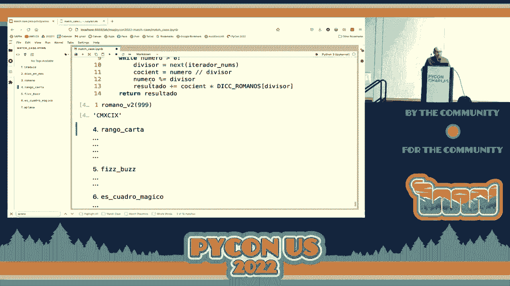

 because I think that it was a very difficult time。 because I think that it was a very difficult time。 because I think that it was a very difficult time。 because I think that it was a very difficult time。 because I think that it was a very difficult time。 because I think that it was a very difficult time。 because I think that it was a very difficult time。 because I think that it was a very difficult time。

 because I think that it was a very difficult time。 because I think that it was a very difficult time。 because I think that it was a very difficult time。 because I think that it was a very difficult time。 because I think that it was a very difficult time。 because I think that it was a very difficult time。 because I think that it was a very difficult time。 because I think that it was a very difficult time。

 because I think that it was a very difficult time。 because I think that it was a very difficult time。 because I think that it was a very difficult time。 because I think that it was a very difficult time。 because I think that it was a very difficult time。 because I think that it was a very difficult time。 because I think that it was a very difficult time。 because I think that it was a very difficult time。

 because I think that it was a very difficult time。 because I think that it was a very difficult time。 because I think that it was a very difficult time。 because I think that it was a very difficult time。 because I think that it was a very difficult time。 because I think that it was a very difficult time。 because I think that it was a very difficult time。 because I think that it was a very difficult time。

 because I think that it was a very difficult time。 because I think that it was a very difficult time。 because I think that it was a very difficult time。 because I think that it was a very difficult time。 because I think that it was a very difficult time。 because I think that it was a very difficult time。 because I think that it was a very difficult time。 because I think that it was a very difficult time。

 because I think that it was a very difficult time。 because I think that it was a very difficult time。 because I think that it was a very difficult time。 because I think that it was a very difficult time。 because I think that it was a very difficult time。 because I think that it was a very difficult time。 because I think that it was a very difficult time。 because I think that it was a very difficult time。

 because I think that it was a very difficult time。 because I think that it was a very difficult time。 because I think that it was a very difficult time。 because I think that it was a very difficult time。 because I think that it was a very difficult time。 because I think that it was a very difficult time。 because I think that it was a very difficult time。 because I think that it was a very difficult time。

 because I think that it was a very difficult time。 because I think that it was a very difficult time。 because I think that it was a very difficult time。 because I think that it was a very difficult time。 because I think that it was a very difficult time。 because I think that it was a very difficult time。 because I think that it was a very difficult time。 because I think that it was a very difficult time。

 because I think that it was a very difficult time。
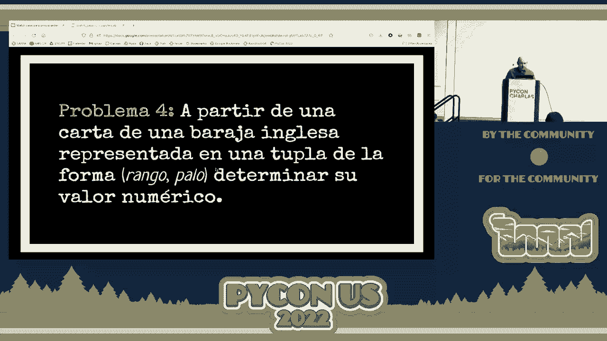

 because I think that it was a very difficult time。 because I think that it was a very difficult time。 because I think that it was a very difficult time。 because I think that it was a very difficult time。 because I think that it was a very difficult time。 because I think that it was a very difficult time。 because I think that it was a very difficult time。 because I think that it was a very difficult time。

 because I think that it was a very difficult time。 because I think that it was a very difficult time。 because I think that it was a very difficult time。 because I think that it was a very difficult time。 because I think that it was a very difficult time。 because I think that it was a very difficult time。 because I think that it was a very difficult time。 because I think that it was a very difficult time。

 because I think that it was a very difficult time。 because I think that it was a very difficult time。 because I think that it was a very difficult time。 because I think that it was a very difficult time。 because I think that it was a very difficult time。 because I think that it was a very difficult time。 because I think that it was a very difficult time。 because I think that it was a very difficult time。

 because I think that it was a very difficult time。 because I think that it was a very difficult time。 because I think that it was a very difficult time。 because I think that it was a very difficult time。 because I think that it was a very difficult time。 because I think that it was a very difficult time。 because I think that it was a very difficult time。 because I think that it was a very difficult time。

 because I think that it was a very difficult time。 because I think that it was a very difficult time。 because I think that it was a very difficult time。 because I think that it was a very difficult time。 because I think that it was a very difficult time。 because I think that it was a very difficult time。 because I think that it was a very difficult time。 because I think that it was a very difficult time。

 because I think that it was a very difficult time。 because I think that it was a very difficult time。 because I think that it was a very difficult time。 because I think that it was a very difficult time。 because I think that it was a very difficult time。 because I think that it was a very difficult time。 because I think that it was a very difficult time。 because I think that it was a very difficult time。

 because I think that it was a very difficult time。 because I think that it was a very difficult time。 because I think that it was a very difficult time。 because I think that it was a very difficult time。 because I think that it was a very difficult time。 because I think that it was a very difficult time。 because I think that it was a very difficult time。 because I think that it was a very difficult time。

 because I think that it was a very difficult time。 because I think that it was a very difficult time。 because I think that it was a very difficult time。 because I think that it was a very difficult time。 because I think that it was a very difficult time。 because I think that it was a very difficult time。 because I think that it was a very difficult time。 because I think that it was a very difficult time。

 because I think that it was a very difficult time。 because I think that it was a very difficult time。 because I think that it was a very difficult time。 because I think that it was a very difficult time。 because I think that it was a very difficult time。 because I think that it was a very difficult time。 because I think that it was a very difficult time。 because I think that it was a very difficult time。

 because I think that it was a very difficult time。 because I think that it was a very difficult time。 because I think that it was a very difficult time。 because I think that it was a very difficult time。 because I think that it was a very difficult time。 because I think that it was a very difficult time。 because I think that it was a very difficult time。 because I think that it was a very difficult time。

 because I think that it was a very difficult time。 because I think that it was a very difficult time。 because I think that it was a very difficult time。 because I think that it was a very difficult time。 because I think that it was a very difficult time。 because I think that it was a very difficult time。 because I think that it was a very difficult time。 because I think that it was a very difficult time。

 because I think that it was a very difficult time。 because I think that it was a very difficult time。 because I think that it was a very difficult time。 because I think that it was a very difficult time。 because I think that it was a very difficult time。 because I think that it was a very difficult time。 because I think that it was a very difficult time。 because I think that it was a very difficult time。

 because I think that it was a very difficult time。 because I think that it was a very difficult time。 because I think that it was a very difficult time。 because I think that it was a very difficult time。 because I think that it was a very difficult time。 because I think that it was a very difficult time。 because I think that it was a very difficult time。 because I think that it was a very difficult time。

 because I think that it was a very difficult time。 because I think that it was a very difficult time。 because I think that it was a very difficult time。 because I think that it was a very difficult time。 because I think that it was a very difficult time。 because I think that it was a very difficult time。 because I think that it was a very difficult time。 because I think that it was a very difficult time。

 because I think that it was a very difficult time。 because I think that it was a very difficult time。 because I think that it was a very difficult time。 because I think that it was a very difficult time。 because I think that it was a very difficult time。 because I think that it was a very difficult time。 because I think that it was a very difficult time。 because I think that it was a very difficult time。

 because I think that it was a very difficult time。 because I think that it was a very difficult time。 because I think that it was a very difficult time。 because I think that it was a very difficult time。 because I think that it was a very difficult time。 because I think that it was a very difficult time。 because I think that it was a very difficult time。 because I think that it was a very difficult time。

 because I think that it was a very difficult time。 because I think that it was a very difficult time。
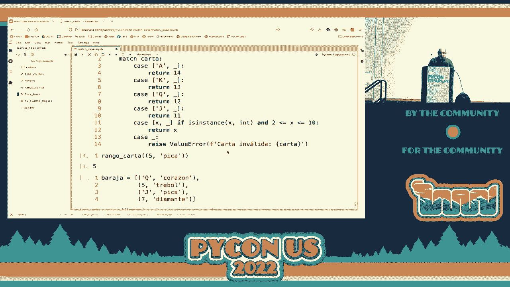

 because I think that it was a very difficult time。 because I think that it was a very difficult time。 because I think that it was a very difficult time。 because I think that it was a very difficult time。 because I think that it was a very difficult time。 because I think that it was a very difficult time。 because I think that it was a very difficult time。 because I think that it was a very difficult time。

 because I think that it was a very difficult time。 because I think that it was a very difficult time。 because I think that it was a very difficult time。 because I think that it was a very difficult time。 because I think that it was a very difficult time。 because I think that it was a very difficult time。 because I think that it was a very difficult time。 because I think that it was a very difficult time。

 because I think that it was a very difficult time。 because I think that it was a very difficult time。 because I think that it was a very difficult time。 because I think that it was a very difficult time。 because I think that it was a very difficult time。 because I think that it was a very difficult time。 because I think that it was a very difficult time。 because I think that it was a very difficult time。

 because I think that it was a very difficult time。 because I think that it was a very difficult time。 because I think that it was a very difficult time。 because I think that it was a very difficult time。 because I think that it was a very difficult time。 because I think that it was a very difficult time。 because I think that it was a very difficult time。 because I think that it was a very difficult time。

 because I think that it was a very difficult time。 because I think that it was a very difficult time。 because I think that it was a very difficult time。 because I think that it was a very difficult time。 because I think that it was a very difficult time。 because I think that it was a very difficult time。 because I think that it was a very difficult time。 because I think that it was a very difficult time。

 because I think that it was a very difficult time。 because I think that it was a very difficult time。 because I think that it was a very difficult time。 because I think that it was a very difficult time。 because I think that it was a very difficult time。 because I think that it was a very difficult time。 because I think that it was a very difficult time。 because I think that it was a very difficult time。

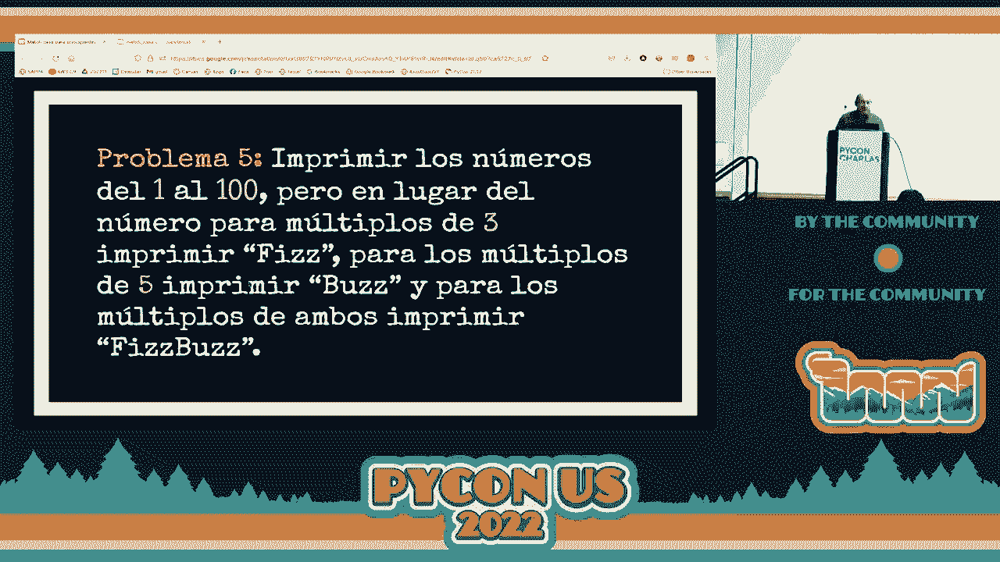

 because I think that it was a very difficult time。 because I think that it was a very difficult time。 because I think that it was a very difficult time。 because I think that it was a very difficult time。 because I think that it was a very difficult time。 because I think that it was a very difficult time。 because I think that it was a very difficult time。 because I think that it was a very difficult time。

 because I think that it was a very difficult time。 because I think that it was a very difficult time。 because I think that it was a very difficult time。 because I think that it was a very difficult time。 because I think that it was a very difficult time。 because I think that it was a very difficult time。 because I think that it was a very difficult time。 because I think that it was a very difficult time。

 because I think that it was a very difficult time。 because I think that it was a very difficult time。 because I think that it was a very difficult time。 because I think that it was a very difficult time。 because I think that it was a very difficult time。 because I think that it was a very difficult time。 because I think that it was a very difficult time。 because I think that it was a very difficult time。

 because I think that it was a very difficult time。 because I think that it was a very difficult time。 because I think that it was a very difficult time。 because I think that it was a very difficult time。 because I think that it was a very difficult time。 because I think that it was a very difficult time。 because I think that it was a very difficult time。 because I think that it was a very difficult time。

 because I think that it was a very difficult time。 because I think that it was a very difficult time。 because I think that it was a very difficult time。 because I think that it was a very difficult time。 because I think that it was a very difficult time。 because I think that it was a very difficult time。 because I think that it was a very difficult time。 because I think that it was a very difficult time。

 because I think that it was a very difficult time。 because I think that it was a very difficult time。 because I think that it was a very difficult time。 because I think that it was a very difficult time。 because I think that it was a very difficult time。 because I think that it was a very difficult time。 because I think that it was a very difficult time。 because I think that it was a very difficult time。

 because I think that it was a very difficult time。 because I think that it was a very difficult time。 because I think that it was a very difficult time。 because I think that it was a very difficult time。 because I think that it was a very difficult time。 because I think that it was a very difficult time。 because I think that it was a very difficult time。 because I think that it was a very difficult time。

 because I think that it was a very difficult time。 because I think that it was a very difficult time。 because I think that it was a very difficult time。 because I think that it was a very difficult time。 because I think that it was a very difficult time。 because I think that it was a very difficult time。 because I think that it was a very difficult time。 because I think that it was a very difficult time。

 because I think that it was a very difficult time。 because I think that it was a very difficult time。 because I think that it was a very difficult time。 because I think that it was a very difficult time。 because I think that it was a very difficult time。 because I think that it was a very difficult time。 because I think that it was a very difficult time。 because I think that it was a very difficult time。

 because I think that it was a very difficult time。 because I think that it was a very difficult time。 because I think that it was a very difficult time。 because I think that it was a very difficult time。 because I think that it was a very difficult time。 because I think that it was a very difficult time。 because I think that it was a very difficult time。 because I think that it was a very difficult time。

 because I think that it was a very difficult time。 because I think that it was a very difficult time。 because I think that it was a very difficult time。 because I think that it was a very difficult time。
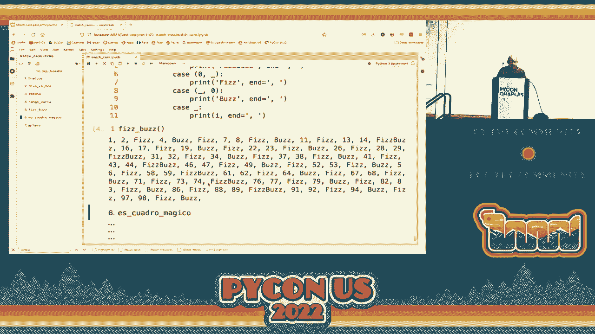

 because I think that it was a very difficult time。 because I think that it was a very difficult time。 because I think that it was a very difficult time。 because I think that it was a very difficult time。 because I think that it was a very difficult time。 because I think that it was a very difficult time。 because I think that it was a very difficult time。 because I think that it was a very difficult time。

 because I think that it was a very difficult time。 because I think that it was a very difficult time。 because I think that it was a very difficult time。 because I think that it was a very difficult time。 because I think that it was a very difficult time。 because I think that it was a very difficult time。 because I think that it was a very difficult time。 because I think that it was a very difficult time。

 because I think that it was a very difficult time。 because I think that it was a very difficult time。 because I think that it was a very difficult time。 because I think that it was a very difficult time。 because I think that it was a very difficult time。 because I think that it was a very difficult time。 because I think that it was a very difficult time。 because I think that it was a very difficult time。

 because I think that it was a very difficult time。
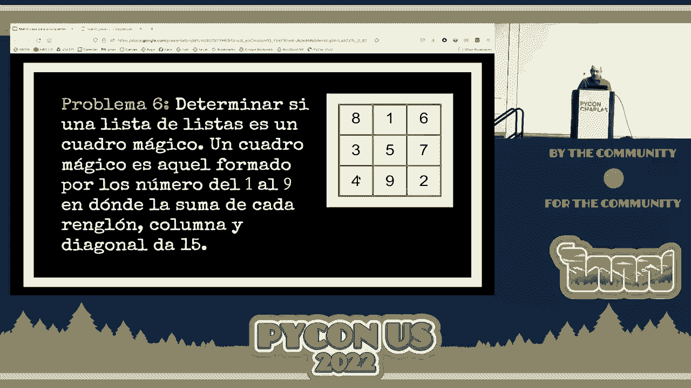

 because I think that it was a very difficult time。 because I think that it was a very difficult time。 because I think that it was a very difficult time。 because I think that it was a very difficult time。 because I think that it was a very difficult time。 because I think that it was a very difficult time。 because I think that it was a very difficult time。 because I think that it was a very difficult time。

 because I think that it was a very difficult time。 because I think that it was a very difficult time。 because I think that it was a very difficult time。 because I think that it was a very difficult time。 because I think that it was a very difficult time。 because I think that it was a very difficult time。 because I think that it was a very difficult time。 because I think that it was a very difficult time。

 because I think that it was a very difficult time。 because I think that it was a very difficult time。 because I think that it was a very difficult time。 because I think that it was a very difficult time。 because I think that it was a very difficult time。 because I think that it was a very difficult time。 because I think that it was a very difficult time。 because I think that it was a very difficult time。

 because I think that it was a very difficult time。 because I think that it was a very difficult time。 because I think that it was a very difficult time。 because I think that it was a very difficult time。 because I think that it was a very difficult time。 because I think that it was a very difficult time。 because I think that it was a very difficult time。 because I think that it was a very difficult time。

 because I think that it was a very difficult time。 because I think that it was a very difficult time。 because I think that it was a very difficult time。 because I think that it was a very difficult time。 because I think that it was a very difficult time。 because I think that it was a very difficult time。 because I think that it was a very difficult time。 because I think that it was a very difficult time。

 because I think that it was a very difficult time。 because I think that it was a very difficult time。 because I think that it was a very difficult time。 because I think that it was a very difficult time。 because I think that it was a very difficult time。 because I think that it was a very difficult time。 because I think that it was a very difficult time。 because I think that it was a very difficult time。

 because I think that it was a very difficult time。 because I think that it was a very difficult time。 because I think that it was a very difficult time。 because I think that it was a very difficult time。 because I think that it was a very difficult time。 because I think that it was a very difficult time。 because I think that it was a very difficult time。 because I think that it was a very difficult time。

 because I think that it was a very difficult time。 because I think that it was a very difficult time。 because I think that it was a very difficult time。 because I think that it was a very difficult time。 because I think that it was a very difficult time。 because I think that it was a very difficult time。 because I think that it was a very difficult time。 because I think that it was a very difficult time。

 because I think that it was a very difficult time。 because I think that it was a very difficult time。 because I think that it was a very difficult time。 because I think that it was a very difficult time。 because I think that it was a very difficult time。 because I think that it was a very difficult time。 because I think that it was a very difficult time。 because I think that it was a very difficult time。

 because I think that it was a very difficult time。 because I think that it was a very difficult time。 because I think that it was a very difficult time。 because I think that it was a very difficult time。 because I think that it was a very difficult time。 because I think that it was a very difficult time。 because I think that it was a very difficult time。 because I think that it was a very difficult time。

 because I think that it was a very difficult time。 because I think that it was a very difficult time。 because I think that it was a very difficult time。 because I think that it was a very difficult time。 because I think that it was a very difficult time。 because I think that it was a very difficult time。 because I think that it was a very difficult time。 because I think that it was a very difficult time。

 because I think that it was a very difficult time。 because I think that it was a very difficult time。 because I think that it was a very difficult time。 because I think that it was a very difficult time。 because I think that it was a very difficult time。 because I think that it was a very difficult time。 because I think that it was a very difficult time。 because I think that it was a very difficult time。

 because I think that it was a very difficult time。 because I think that it was a very difficult time。 because I think that it was a very difficult time。 because I think that it was a very difficult time。 because I think that it was a very difficult time。 because I think that it was a very difficult time。 because I think that it was a very difficult time。 because I think that it was a very difficult time。

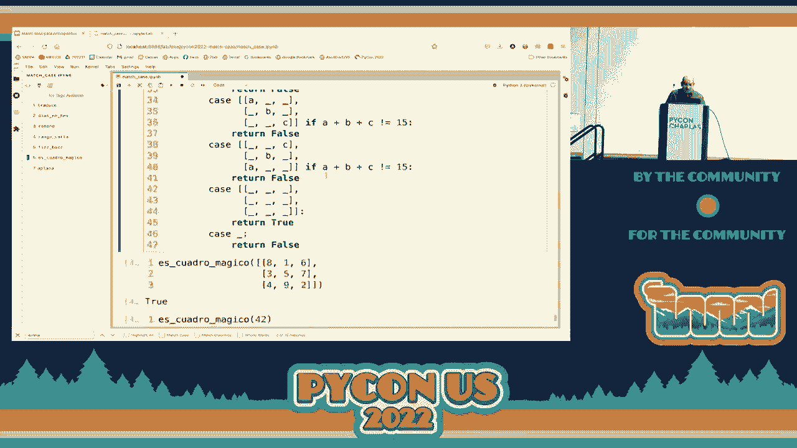

 because I think that it was a very difficult time。 because I think that it was a very difficult time。 because I think that it was a very difficult time。 because I think that it was a very difficult time。 because I think that it was a very difficult time。 because I think that it was a very difficult time。 because I think that it was a very difficult time。 because I think that it was a very difficult time。

 because I think that it was a very difficult time。 because I think that it was a very difficult time。 because I think that it was a very difficult time。 because I think that it was a very difficult time。
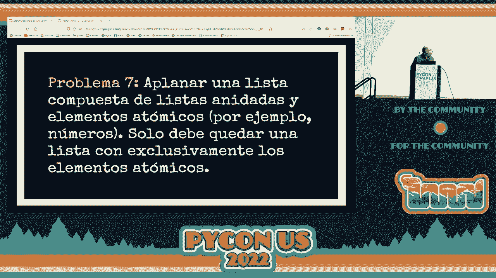

 because I think that it was a very difficult time。 because I think that it was a very difficult time。 because I think that it was a very difficult time。 because I think that it was a very difficult time。 because I think that it was a very difficult time。 because I think that it was a very difficult time。 because I think that it was a very difficult time。 because I think that it was a very difficult time。

 because I think that it was a very difficult time。 because I think that it was a very difficult time。 because I think that it was a very difficult time。 because I think that it was a very difficult time。 because I think that it was a very difficult time。 because I think that it was a very difficult time。 because I think that it was a very difficult time。 because I think that it was a very difficult time。

 because I think that it was a very difficult time。 because I think that it was a very difficult time。 because I think that it was a very difficult time。 because I think that it was a very difficult time。 because I think that it was a very difficult time。 because I think that it was a very difficult time。 because I think that it was a very difficult time。 because I think that it was a very difficult time。

 because I think that it was a very difficult time。 because I think that it was a very difficult time。 because I think that it was a very difficult time。 because I think that it was a very difficult time。 because I think that it was a very difficult time。 because I think that it was a very difficult time。 because I think that it was a very difficult time。 because I think that it was a very difficult time。

 because I think that it was a very difficult time。 because I think that it was a very difficult time。 because I think that it was a very difficult time。 because I think that it was a very difficult time。 because I think that it was a very difficult time。 because I think that it was a very difficult time。 because I think that it was a very difficult time。 because I think that it was a very difficult time。

 because I think that it was a very difficult time。 because I think that it was a very difficult time。 because I think that it was a very difficult time。 because I think that it was a very difficult time。 because I think that it was a very difficult time。 because I think that it was a very difficult time。 because I think that it was a very difficult time。 because I think that it was a very difficult time。

 because I think that it was a very difficult time。 because I think that it was a very difficult time。 because I think that it was a very difficult time。 because I think that it was a very difficult time。 because I think that it was a very difficult time。 because I think that it was a very difficult time。 because I think that it was a very difficult time。 because I think that it was a very difficult time。

 because I think that it was a very difficult time。 because I think that it was a very difficult time。
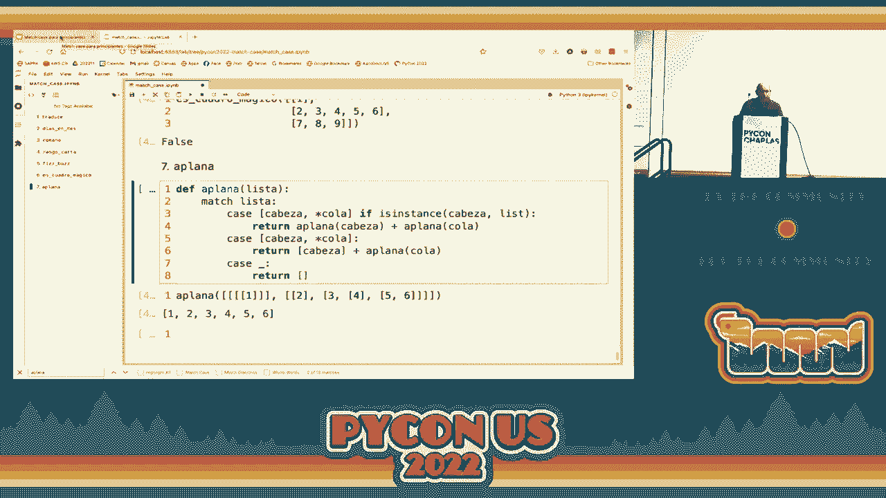

 because I think that it was a very difficult time。 because I think that it was a very difficult time。 because I think that it was a very difficult time。 because I think that it was a very difficult time。 because I think that it was a very difficult time。 because I think that it was a very difficult time。 because I think that it was a very difficult time。 because I think that it was a very difficult time。

 because I think that it was a very difficult time。 because I think that it was a very difficult time。 because I think that it was a very difficult time。 because I think that it was a very difficult time。 because I think that it was a very difficult time。 because I think that it was a very difficult time。 because I think that it was a very difficult time。 because I think that it was a very difficult time。

 because I think that it was a very difficult time。 because I think that it was a very difficult time。 because I think that it was a very difficult time。 because I think that it was a very difficult time。 because I think that it was a very difficult time。 because I think that it was a very difficult time。 because I think that it was a very difficult time。 because I think that it was a very difficult time。

 because I think that it was a very difficult time。 because I think that it was a very difficult time。 because I think that it was a very difficult time。 because I think that it was a very difficult time。 because I think that it was a very difficult time。 because I think that it was a very difficult time。 because I think that it was a very difficult time。 because I think that it was a very difficult time。

 because I think that it was a very difficult time。 because I think that it was a very difficult time。 because I think that it was a very difficult time。 because I think that it was a very difficult time。 because I think that it was a very difficult time。 because I think that it was a very difficult time。 because I think that it was a very difficult time。 because I think that it was a very difficult time。

 because I think that it was a very difficult time。 because I think that it was a very difficult time。 because I think that it was a very difficult time。 because I think that it was a very difficult time。 because I think that it was a very difficult time。 because I think that it was a very difficult time。 because I think that it was a very difficult time。 because I think that it was a very difficult time。

 because I think that it was a very difficult time。 because I think that it was a very difficult time。 because I think that it was a very difficult time。 because I think that it was a very difficult time。 because I think that it was a very difficult time。 because I think that it was a very difficult time。 because I think that it was a very difficult time。 because I think that it was a very difficult time。

 because I think that it was a very difficult time。 because I think that it was a very difficult time。 because I think that it was a very difficult time。 because I think that it was a very difficult time。 because I think that it was a very difficult time。 because I think that it was a very difficult time。 because I think that it was a very difficult time。 because I think that it was a very difficult time。

 because I think that it was a very difficult time。 because I think that it was a very difficult time。 because I think that it was a very difficult time。 because I think that it was a very difficult time。 because I think that it was a very difficult time。 because I think that it was a very difficult time。 because I think that it was a very difficult time。 because I think that it was a very difficult time。

 because I think that it was a very difficult time。 because I think that it was a very difficult time。 because I think that it was a very difficult time。 because I think that it was a very difficult time。 because I think that it was a very difficult time。 because I think that it was a very difficult time。 because I think that it was a very difficult time。 because I think that it was a very difficult time。

 because I think that it was a very difficult time。 because I think that it was a very difficult time。
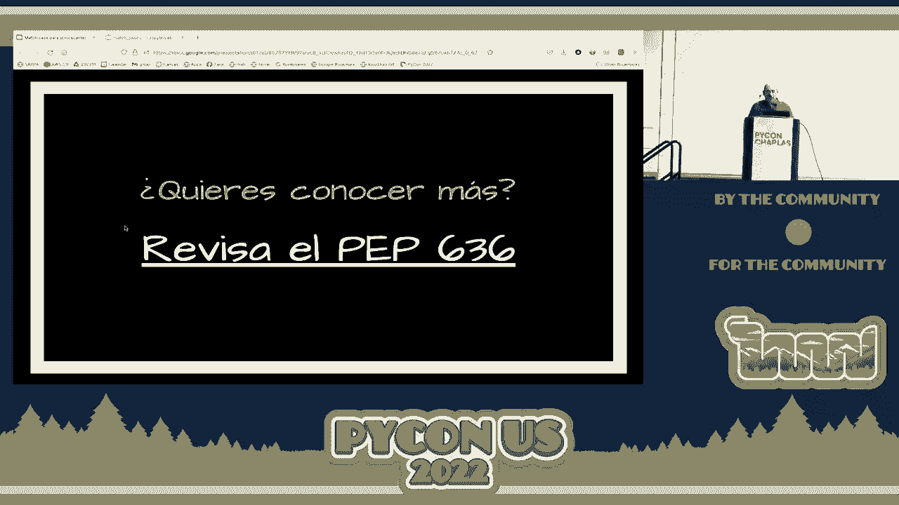

 because I think that it was a very difficult time。 because I think that it was a very difficult time。 because I think that it was a very difficult time。 because I think that it was a very difficult time。 because I think that it was a very difficult time。 because I think that it was a very difficult time。 because I think that it was a very difficult time。 because I think that it was a very difficult time。

 because I think that it was a very difficult time。 because I think that it was a very difficult time。 because I think that it was a very difficult time。 because I think that it was a very difficult time。 because I think that it was a very difficult time。 because I think that it was a very difficult time。 because I think that it was a very difficult time。 because I think that it was a very difficult time。

 because I think that it was a very difficult time。 because I think that it was a very difficult time。 because I think that it was a very difficult time。 because I think that it was a very difficult time。 because I think that it was a very difficult time。 because I think that it was a very difficult time。 because I think that it was a very difficult time。 because I think that it was a very difficult time。

 because I think that it was a very difficult time。 because I think that it was a very difficult time。 because I think that it was a very difficult time。 because I think that it was a very difficult time。 because I think that it was a very difficult time。 because I think that it was a very difficult time。 because I think that it was a very difficult time。 because I think that it was a very difficult time。

 because I think that it was a very difficult time。 because I think that it was a very difficult time。 because I think that it was a very difficult time。 because I think that it was a very difficult time。 because I think that it was a very difficult time。 because I think that it was a very difficult time。 because I think that it was a very difficult time。 because I think that it was a very difficult time。

 because I think that it was a very difficult time。 because I think that it was a very difficult time。 because I think that it was a very difficult time。 because I think that it was a very difficult time。 because I think that it was a very difficult time。 because I think that it was a very difficult time。 because I think that it was a very difficult time。 because I think that it was a very difficult time。

 because I think that it was a very difficult time。 because I think that it was a very difficult time。 because I think that it was a very difficult time。 because I think that it was a very difficult time。 because I think that it was a very difficult time。 because I think that it was a very difficult time。 because I think that it was a very difficult time。 because I think that it was a very difficult time。

 because I think that it was a very difficult time。 because I think that it was a very difficult time。 because I think that it was a very difficult time。 because I think that it was a very difficult time。 because I think that it was a very difficult time。 because I think that it was a very difficult time。 because I think that it was a very difficult time。 because I think that it was a very difficult time。

 because I think that it was a very difficult time。 because I think that it was a very difficult time。 because I think that it was a very difficult time。 because I think that it was a very difficult time。 because I think that it was a very difficult time。 because I think that it was a very difficult time。 because I think that it was a very difficult time。 because I think that it was a very difficult time。

 because I think that it was a very difficult time。 because I think that it was a very difficult time。 because I think that it was a very difficult time。 because I think that it was a very difficult time。 because I think that it was a very difficult time。 because I think that it was a very difficult time。 because I think that it was a very difficult time。 because I think that it was a very difficult time。

 because I think that it was a very difficult time。 because I think that it was a very difficult time。 because I think that it was a very difficult time。 because I think that it was a very difficult time。 because I think that it was a very difficult time。 because I think that it was a very difficult time。 because I think that it was a very difficult time。 because I think that it was a very difficult time。

 because I think that it was a very difficult time。 because I think that it was a very difficult time。 because I think that it was a very difficult time。 because I think that it was a very difficult time。 because I think that it was a very difficult time。 because I think that it was a very difficult time。 because I think that it was a very difficult time。 because I think that it was a very difficult time。

 because I think that it was a very difficult time。 because I think that it was a very difficult time。 because I think that it was a very difficult time。 because I think that it was a very difficult time。 because I think that it was a very difficult time。 because I think that it was a very difficult time。 because I think that it was a very difficult time。 because I think that it was a very difficult time。

 because I think that it was a very difficult time。 because I think that it was a very difficult time。 because I think that it was a very difficult time。 because I think that it was a very difficult time。 because I think that it was a very difficult time。 because I think that it was a very difficult time。 because I think that it was a very difficult time。 because I think that it was a very difficult time。

 because I think that it was a very difficult time。 because I think that it was a very difficult time。 because I think that it was a very difficult time。 because I think that it was a very difficult time。 because I think that it was a very difficult time。 because I think that it was a very difficult time。 because I think that it was a very difficult time。 because I think that it was a very difficult time。

 because I think that it was a very difficult time。 because I think that it was a very difficult time。 because I think that it was a very difficult time。 because I think that it was a very difficult time。 because I think that it was a very difficult time。 because I think that it was a very difficult time。 because I think that it was a very difficult time。 because I think that it was a very difficult time。

 because I think that it was a very difficult time。 because I think that it was a very difficult time。 because I think that it was a very difficult time。 because I think that it was a very difficult time。 because I think that it was a very difficult time。 because I think that it was a very difficult time。 because I think that it was a very difficult time。 because I think that it was a very difficult time。

 because I think that it was a very difficult time。 because I think that it was a very difficult time。 because I think that it was a very difficult time。 because I think that it was a very difficult time。 because I think that it was a very difficult time。 because I think that it was a very difficult time。 because I think that it was a very difficult time。 because I think that it was a very difficult time。

 because I think that it was a very difficult time。 because I think that it was a very difficult time。 because I think that it was a very difficult time。 because I think that it was a very difficult time。 because I think that it was a very difficult time。 because I think that it was a very difficult time。 because I think that it was a very difficult time。 because I think that it was a very difficult time。

 because I think that it was a very difficult time。 because I think that it was a very difficult time。 because I think that it was a very difficult time。 because I think that it was a very difficult time。 because I think that it was a very difficult time。 because I think that it was a very difficult time。 because I think that it was a very difficult time。 because I think that it was a very difficult time。

 because I think that it was a very difficult time。 because I think that it was a very difficult time。 because I think that it was a very difficult time。 because I think that it was a very difficult time。 because I think that it was a very difficult time。 because I think that it was a very difficult time。 because I think that it was a very difficult time。 because I think that it was a very difficult time。

 because I think that it was a very difficult time。 because I think that it was a very difficult time。 because I think that it was a very difficult time。 because I think that it was a very difficult time。 because I think that it was a very difficult time。 because I think that it was a very difficult time。 because I think that it was a very difficult time。 because I think that it was a very difficult time。

 because I think that it was a very difficult time。 because I think that it was a very difficult time。 because I think that it was a very difficult time。 because I think that it was a very difficult time。 because I think that it was a very difficult time。 because I think that it was a very difficult time。 because I think that it was a very difficult time。 because I think that it was a very difficult time。

 because I think that it was a very difficult time。 because I think that it was a very difficult time。 because I think that it was a very difficult time。 because I think that it was a very difficult time。 because I think that it was a very difficult time。 because I think that it was a very difficult time。 because I think that it was a very difficult time。 because I think that it was a very difficult time。

 because I think that it was a very difficult time。 because I think that it was a very difficult time。 because I think that it was a very difficult time。 because I think that it was a very difficult time。 because I think that it was a very difficult time。 because I think that it was a very difficult time。 because I think that it was a very difficult time。 because I think that it was a very difficult time。

 because I think that it was a very difficult time。 because I think that it was a very difficult time。 because I think that it was a very difficult time。 because I think that it was a very difficult time。 because I think that it was a very difficult time。 because I think that it was a very difficult time。 because I think that it was a very difficult time。 because I think that it was a very difficult time。

 because I think that it was a very difficult time。 because I think that it was a very difficult time。 because I think that it was a very difficult time。 because I think that it was a very difficult time。 because I think that it was a very difficult time。 because I think that it was a very difficult time。 because I think that it was a very difficult time。 because I think that it was a very difficult time。

 because I think that it was a very difficult time。 because I think that it was a very difficult time。 because I think that it was a very difficult time。 because I think that it was a very difficult time。 because I think that it was a very difficult time。 because I think that it was a very difficult time。 because I think that it was a very difficult time。 because I think that it was a very difficult time。

 because I think that it was a very difficult time。 because I think that it was a very difficult time。 because I think that it was a very difficult time。 because I think that it was a very difficult time。 because I think that it was a very difficult time。 because I think that it was a very difficult time。 because I think that it was a very difficult time。 because I think that it was a very difficult time。

 because I think that it was a very difficult time。 because I think that it was a very difficult time。 because I think that it was a very difficult time。 because I think that it was a very difficult time。 because I think that it was a very difficult time。 because I think that it was a very difficult time。 because I think that it was a very difficult time。 because I think that it was a very difficult time。

 because I think that it was a very difficult time。 because I think that it was a very difficult time。 because I think that it was a very difficult time。 because I think that it was a very difficult time。 because I think that it was a very difficult time。 because I think that it was a very difficult time。 because I think that it was a very difficult time。 because I think that it was a very difficult time。

 because I think that it was a very difficult time。 because I think that it was a very difficult time。 because I think that it was a very difficult time。 because I think that it was a very difficult time。 because I think that it was a very difficult time。 because I think that it was a very difficult time。 because I think that it was a very difficult time。
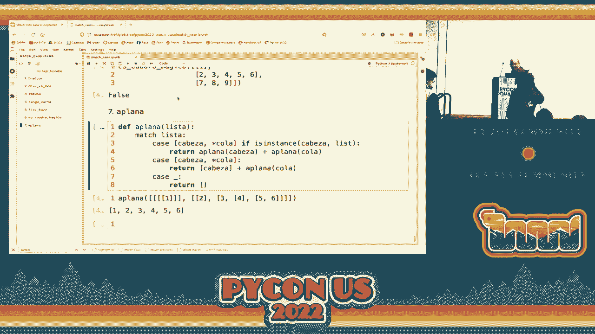

 because I think that it was a very difficult time。 because I think that it was a very difficult time。 because I think that it was a very difficult time。 So in that case we will be talking now about the other available websites。