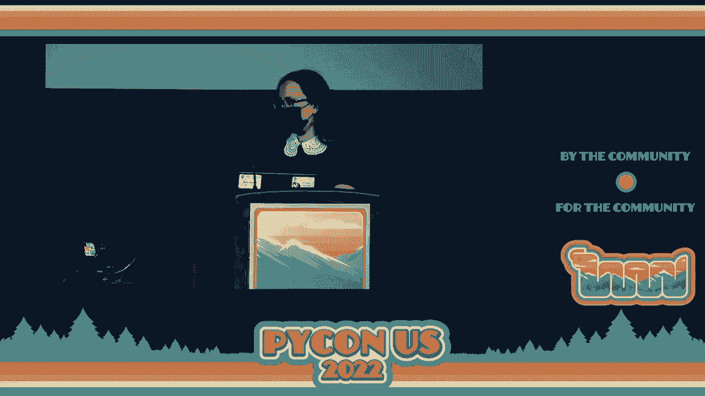
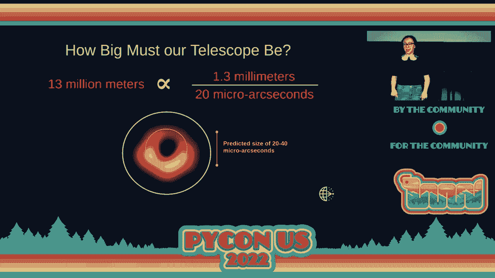
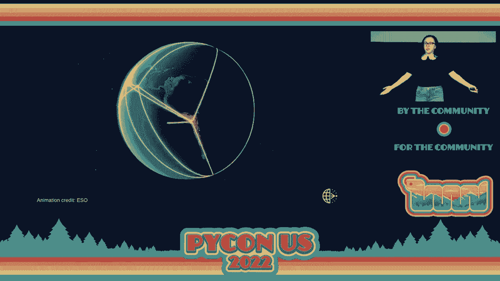
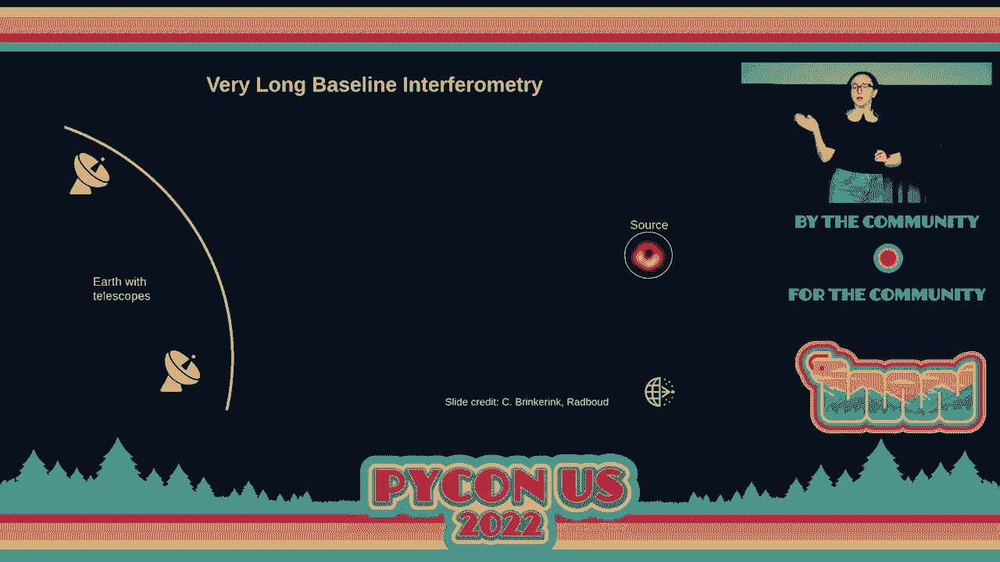
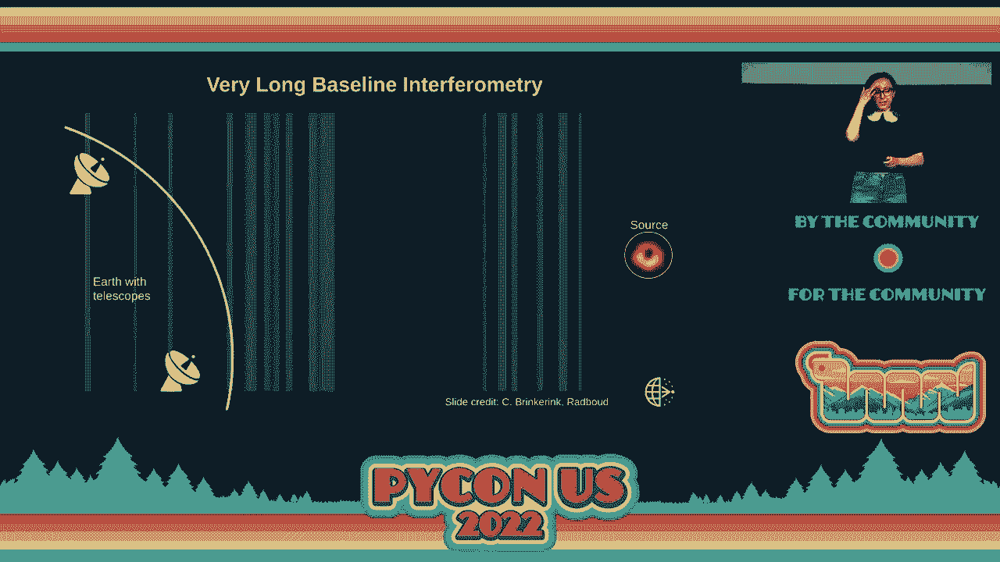
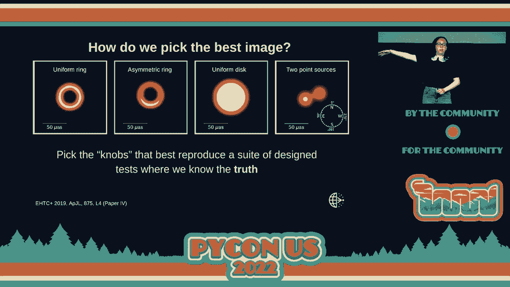
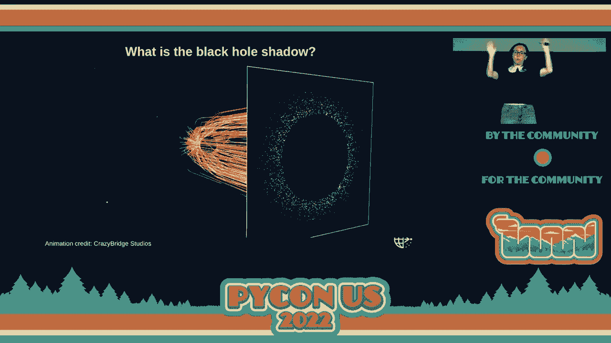
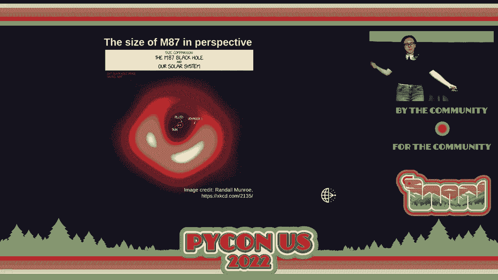
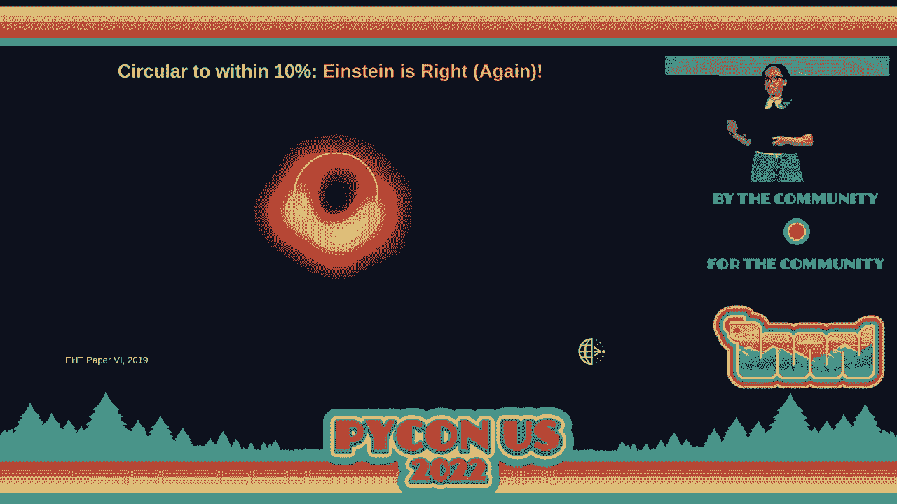
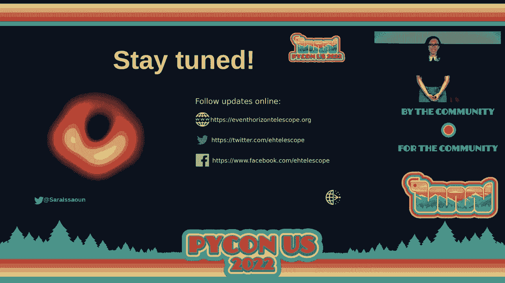

# P10：Keynote - Sara Issaoun - VikingDen7 - BV1f8411Y7cP

 And now， I am thrilled to introduce Sarah Yisayoon， member of the Event Horizon Telescope。

 Collaboration and Einstein Fellow。 Thank you。

 Hello。 I'm really nervous this is my first talk since before the pandemic， so in person。 So bear with me。 My name is Sarah。 I'm a member of the Event Horizon Telescope Collaboration。 I'm here to tell you about how we managed to make an image of a black hole。 You're probably familiar with our famous image from 2019。 This image here。

 this is the image of the black hole in the galaxy M87。 It's 55 million light years away from us。 And I want to tell you a little bit about our journey to get to this image。 What we've learned since then about this black hole， because we've had results last year。 that came out about this black hole。 And also the role that software development actually plays in big science like our project。

 So one thing that was really shocking when we released the image was that it actually。 went on front pages of newspapers around the world。 This is not something that happens to science results。 This is really not people don't like to talk about。 I mean。

 it's like a page 12 or something in a newspaper if it makes the news。 But to see it on front pages the day after we made this result really made us understand。 that we were giving the world something special， something that could be part of。 Something that shows that science is bigger than just one person。 It's about collaboration。

 It's about teamwork。 It's about overcoming differences in cultures， in countries， in career stages。 gender， age， et cetera， and actually come together for one goal and be able to be able to be part。 of this moment。 And this particular event， seeing it on front pages was really a shock to us。 We knew some people would be interested in this image but we didn't know really the。

 response that the public would have。 One thing we also did not know is that the public would come up with a lot of memes。 And this was really interesting because we were trending number one on Twitter。 Like that doesn't happen to science results。 So we actually understood that as a collaboration it was our job to make sure that you're all。 part of our story， that you understand that you're part of science， you're part of progress。

 you're part of this big community that makes the world a little bit better， a little bit， funnier。 a little bit more joyous。 Hopefully all of that。 So I'm just a member of the collaboration。 I only play a small part。 We all play a small part in this big story。 The event horizon telescope collaboration is 300 plus members。 We're across over 60 institutes。

 18 countries and regions in Europe， Asia， Africa， North， and South America。 We're a really diverse group of people。 We're not all astronomers。 They're software developers。 They're computer scientists。 They're engineers。 They're telescope operators， administrators。 All being part of this story。 All playing their important part in making this project happen。

 I only play a very small part and I get to represent all of these amazing people I get。 to work with today。 So hopefully this plays。 So if you go -- this is a little bit slow。 If you look up in the next sky， there's a constellation called the Virgo constellation。 In this constellation there's a bright dot that is the galaxy， a 。87。

 This galaxy is 55 million light years away from us。 That's very far。 And if you look at it with optical telescopes like the Hubble telescope， you'll see the。 streak of matter of gas that comes from it。 What is that？ If you actually chase this streak down。 you look at it in the radio waves because radio， waves allow you to peer through the entire galaxy。

 You follow it with better and better telescopes all the way down to its core。 You find what we found with the event horizon telescope， the supermassive black hole。 The streak of gas is emitted by this black hole。 This black hole is incredibly tiny compared to the size of the galaxy。 And yet it creates a jet of plasma that pierces through its entire galaxy and even its galactic。

 neighborhood。 This immense power is kind of incredible and it's something we don't quite understand。 This is the most powerful process in the universe， how black holes power their jets。 And we don't understand how these happen。 Seeing a black hole up close with the event horizon telescope allows us to make the connection。 between what happens near a black hole and what happens throughout its entire galaxy。

 So this is our goal with the EHT。 Understand how black holes look， how they feed。 how they eject these powerful jet of matters， and how these jets also affect their nearby galaxies。 So we want to see the M87 black hole。 It's very far away。 Its predicted size on the sky is about 20 to 40 microseconds。

 That's the size of about a donut on the surface of the moon as seen from here。 So telescope size is proportional to observing wavelengths， the wavelength at which we are。 looking with the telescope and angular resolution of the telescope， so the size of the telescope。 So the angular resolution we need to see M87 is 20 microseconds based on the predicted， size。

 The observing wavelengths we need to pierce through all of the gas between us and the galaxy。 is 1 millimeter wavelength。 This is what we call the Goldilocks wavelength to pierce through all of the gas but that we're。 able to observe using Earth telescopes。 And it's also in the radio and radio waves are not bothered by anything between us and。 the black hole。 So if we make this calculation， what is the telescope size we get to Cm87？

 It's actually 13 million meters。 Unfortunately we tried but no science agency wanted to fund building a telescope this big。 So we ended up with the next best thing which is actually right below our feet， the Earth。 The Earth's diameter is 13 million meters and we can use the Earth as our telescope。

 So how do we do that？ We use a technique called very long baseline interferometry。 We find telescopes around the Earth that would form fragments of our telescope mirror。 and then we synthesize a virtual telescope the size of the Earth。

 This is what we do。 Now in order to do that， it's actually quite a challenging technique that won the Nobel。 Prize in the 70s in physics and I'll try to explain briefly how we do that。 So we have the black hole and it emits radio waves that's very far away。

 The waves that it emits arrive as plane waves on Earth so they're flat。 Now the Earth is curved。 I hope you all know that。 Because of that， the telescopes that are large distances from each other。 they actually see， a signal at different times。 So if you look at this picture。 the telescope at the bottom actually sees one of the straight。

 lines earlier than the telescope at the top。 Now the Earth's curvature actually causes a problem because we need to see the signal。 from the black hole at the exact same time in each telescope in order to reconstruct， an image。 Each telescope has to see the same signal so that we can correlate the signal and make， an image。 Now how do we get by this problem？ So we have different telescopes at different sites。

 The distances between each telescope is what we call the baseline distance。 Each pair of telescopes gives us a part of the image。 So telescopes close together。 they tell us about large-scale structure in the image because， they see more signal in common。 Those further apart see less signal in common and they tell us about smaller-scale structure。

 So we need many telescopes at different distances and different orientations on the Earth to。 reconstruct all the information that is on the image。 Then we have this time difference that we have to deal with and this time difference。 needs to be taken into account。 So what we use is extremely accurate clocks。

 They're called Maesor clocks and they are so accurate they lose about a second every。 hundred million years。 That's how accurate these clocks are。 So these clocks at each telescope。 they're about the size of a mutant fridge， they're， expensive， but they work。 And so these clocks help us time tag the arrival of the signal at each telescope and then we。

 record that signal onto hard drives。 So essentially every piece of light that arrives at the telescope is time tagged and then frozen。 into hard drives。 And then we play it back at a separate time later when we combine all the signals from。 all the telescopes， all the hard drives。 So this is what very long base line interferometry is and this is how the EHT is made。 So the progress to getting the event horizon telescope was a really long one。

 The first dishes of the EHT started in 2007 and then we had more and more as the years， go by。 Some telescopes were lost unfortunately they were decommissioned and others joined until。 we reached 2017。 This is the year we finally had enough telescopes。 enough combinations of these different base， lines that we are able to reconstruct an image。

 We had six different locations， six single dish telescopes and two phasor rays。 Phasor rays are basically telescopes in one place that can be combined into the same way。 we do with the EHT into a bigger virtual telescope that gives us more sensitivity at that site。 So we had eight telescopes for our observations。 The south pole telescope did not take part in the M87 results because it's in the southern。

 hemisphere and M87 is actually a northern hemisphere source。 So the south pole cannot see it。 Now you'll notice all these telescopes look completely different from each other。 The reason for that is because we didn't build them。 We borrowed them。 We happen to just find telescopes that can observe at the wavelengths we need that happen。

 to be at high and dry enough sites such that the atmosphere and the water vapor in the。 atmosphere that can scramble and destroy or signal doesn't affect us as much。 So these telescopes all are in the most extreme locations on the planet。 The driest deserts。 the highest mountains and they were built for completely different， science。

 They were built for standalone science。 This is why they all have different designs。 different looks。 But they have one thing in common。 Actually two things in common。 The clock。 the mini-fridge that we have and this。 Wait one more thing。 I forgot I added this slide。 Another thing is we don't observe alone with the EHT。

 So we've told this story that we have all these telescopes on Earth that we combine。 We also observe together with other telescopes that observe at different wavelengths。 So there are lots of telescopes that combined with us can teach us a lot more about the， black hole。 Not only do we have the black hole image but we also know what the black hole is doing。

 across the electromagnetic spectrum at the same time。 And this is something incredible that goes beyond our collaboration because it also involves。 collaborating with multi-wvelength partners with other telescopes， other collaborations。 to come together at this exact time and all look at the same thing。 And this is really incredible。

 And one of the big results that came out last year is this。 This is what M87 looks like across the electromagnetic spectrum。 So you know our famous image which is down there。 In yellow there's kind of all what it looks like in the radio where we see this jet of。 plasma and then we have views of it in the X-ray。 In the optical you see the nice Hubble image which is HST。

 Or the bottom one of the middle row。 And then also what it looks like in the high energy and X-ray。 And this view of M87 during our 2017 campaign was really important in understanding the。 physics of the black hole。 How it ejects the static matter and how it varies with time。 Now as I mentioned all our telescopes are completely different。 They have two things in common。

 our mini fridge and this on the right here。 This is what we call our EHT back end。 It's a recording equipment。 This big block of things is what records our data。 So we have a telescope that has a receiver on it。 The receiver receives the signal。 It goes through some wires。 And then it gets down converted to a lower frequency so that we can measure it。

 We digitize it because we measure an analog signal。 It needs to be digitized into two bit sampling signal。 And then we record it onto our hard drives。 Each of these little boxes here is called a module。 Each module has about eight stacked hard drives。 We recorded on 736 hard drives during our entire campaign。

 We recorded about three and a half petabytes of data across our entire campaign。 About one petabyte of that is M87。 In our campaign we observe in April of March/April。 This is because weather is a big part of our observing。 As I mentioned water vapor。 atmospheric turbulence， destroys our signal。 So we need really good weather。

 And so how do we do that？ We try to find the best time window in which we have the most consistent。 decent weather， for half the planet， which is very hard to do。 And during the campaign we have a set window of days to observe about 12 days。 And we pay very close attention to the weather and technical operations with our VLBI monitor。

 to make sure we make the right decision。 On each day we make a go or no go decision。 And so mere hours before observing， that is when we decide to go on sky。 So our operations。 our telescope staff have to be on it at each time and be ready to observe， if we trigger。 And there are multitudes of reasons why we trigger on certain days。

 Parts of it also comes from our multi-wavlink partners。 For example if X-ray observatories are observing at the same time， like the Chandra Observatory。 then those are more likely days for us to observe。 And then of course the weather and telescope operations play a major part。

 So in our 2017 campaign across our 12 days， which regurgied 5 days of observation。 And 4 of those had M87。 So this is a nice picture of the 2017 observations。 All the different telescope staff and observers that were at the telescopes during the campaign。 You'll see everybody use happy faces。 They're normally not that happy。

 It's high altitude and we don't sleep much and they're retiring。 But we're happy for photo ops。 And so in the top right corner you'll notice there's a woman in that picture， that's me。 I was at the 7mm telescope in Arizona during the observations。 This is one of the central telescopes。 So I had sometimes 30 to 35 hours without sleep。

 So that's fun。 But it seems it was worth it。 So I think we're okay。 So after the observations we pack up our modules， our hard drives， and ship them to this guy。 This guy is Don Sosa。 He is our shipping expert for the EHT。 Every single package of EHT， data。 equipment， goes through him。 And he used to be a police officer for the state of Massachusetts。

 And now he's in charge of all our shipping。 And he's never lost a single package since he's been doing this job。 We had one mishap in which we thought we had south pole telescope， hard drives， but it。 ended up being a bunch of silk。 But everything was solved and we got our hard drives back and the silk went back to where。 it belonged。 Luckily。 On the left here are filled modules。 You'll notice they have green stickers。

 The ones in the big box I showed you had red stickers and the ones in the big box had green。 stickers。 Green stickers means modules are empty。 Red stickers means modules are filled。 So all of these modules have our precious data。 What happens to them？

 They get shipped half to one place and half to another。 So I want to talk a little bit about the data reduction process of the EHT。 So we measure petabytes of signal at the telescopes。 Part of that signal is what telescopes can see in common。 So at the correlation stage。

 where we correlate the signal between telescopes， we end up with， terabytes of data。 So we only keep the signal that the telescopes see in common。 Then we undergo a calibration stage in which we reduce the data by solving for a bunch of。 processes and atmospheric effects that scramble our data to unscramble it so that we can average。

 down。 Just like constructive or destructive interference。 If you have destructive interference。 you average it down， you destroy your signal。 If you have constructive interference。 you can build your signal。 So our goal is to have constructive interference。 build signal and get higher sensitivity in， our data。

 And this is what happens in the calibration stage and then we're left with megabytes of， data files。 These data files are what are used in imaging。 And then our final image is actually a few kilobytes。 You can send it on your phone。 And I always find this totally incredible that from the moment we measure the signal to the。 kilobytes of data you can send on your phone， we undergo 12 orders of magnitude in data， reduction。

 which is kind of amazing。 And this is the process that happens in the EHT。 And there isn't many experiments that go through this amount of data crunching。 Or their final result。 Now half the data go to Westford， Massachusetts， an MIT Haystack Observatory。 and the other， half go to Bonn， Germany at the Moxpunk Institute for Radio Astronomy。

 These are our correlation centers where they go onto these giant supercomputers that take。 into account the earth's curvature， realign the signals and make sure that they get every。 combination of common signal between each pair of telescopes。 So essentially the correlators then create our virtual telescope。

 Then there's a long process to understand the data。 So after correlation。 the data go to a dedicated team that builds pipelines。 These pipelines correct for the correlation errors。 They also correct for atmospheric effects and they help build the signal， like this constructive。

 averaging。 There are three pipelines that were built。 One is called hops。 One is called casa。 One is called apes。 Each of these pipelines are supported by many Python packages。 And again。 this step is one of the most important steps of the entire process。 Because it requires really understanding of the data， separating between what comes from。

 our instrument and the atmosphere and what is the true black hole signal。 Nothing， all the signs。 all the analysis after that really depends on this step。 And this step is Python supported。 Now then we go through a data validation by a dedicated team where we compare all these。 independent pipelines， their outputs， making sure that we understand that we're seeing the。

 true black hole signal。 And this data validation also involves a whole bunch of suites of data tests that are again。 supported by many Python packages。 This entire process was like a cycle of about four or five times that we did this from correlation。

 all the way to data validation。 And this took one and a half years。 So if people ask， you know。 why does it take so long for pictures of black holes？ We observed in 2017。 one and a half years was spent on this。 And then about half a year later， we released the image。 So it was a two year process。 And this part is incredibly important。

 Understanding the data is one thing。 The next step is understanding of the telescopes。 So we need to understand our telescopes with incredible detail， such as the atmosphere， how。 our telescopes move， how they behave。 And as I mentioned。 all our telescopes are different from each other。 So this is not a trivial thing。

 It requires really paying attention and understanding each part of our instrument。 And we don't really have a part that repeats。 So this was quite a lot of work。 Another thing we have to do is in order to make images of polarization， which I'll explain， later。 we have to also decouple leakage。 So we observe in two polarizations and we have signal that sometimes leaks into the other。

 Because of that， unfortunately， the Earth's rotation helps us again。 Because the Earth rotates。 the telescopes on the ground don't move， but the source on， the sky moves。 And so by decoupling the signal that changes over the sky compared to the one that stays， put。 we can actually separate between what is the instrument and what is the source signal。

 Then M87 is finally ready for analysis。 This is what our data looks like。 As a radio astronomer。 to me， this is the most beautiful figure I've ever seen。 And honestly。 I like it more than the image。 And not because it's matte plut lid。 So why is this so beautiful to me？ If you look at the data。

 all the different colors are different pairs of telescopes。 And the x-axis tells us about the baseline length。 So short baselines see more signal in common。 long baselines see less signal in common。 So notice we have this dashed curve on it that represents a uniform ring。 So if this was on the sky， we would see the dashed curve。 And to me， that's incredibly beautiful。

 Because a uniform ring is a beautiful mathematical concept。 It has an analytic solution。 It is a synch function。 And it looks like this beautiful bounce。 And to see this in the data。 to see the data also make this beautiful bounce， actually。 tells us that we're seeing probably one of the most beautiful and simple objects in the， universe。

 Just a ring。 And another interesting aspect is that at this baseline length， there are two pairs of。 telescopes that see different things。 And what this tells us by looking at these two pairs is that there is a brightness distribution。 that changes。 So one part of the ring is brighter than the other。 And this data tells us that it's brighter on the bottom。 So even without making an image。

 I already know what it looks like。 Isn't that amazing？ Just looking at this one plot。 we already know it's a ring brighter on the bottom。 But of course。 we have a lot of questions about whether we're seeing what we're truly， seeing。 And our data are publicly available。 So you can actually go and download it and download our imaging pipelines and make your。

 own M87 image。 The next step is what is imaging？ So we again use the Earth as our telescope。 So aperture synthesis is a process where the Earth's rotation helps us fill a virtual mirror。 in the middle there。 And we combine data on temporal and spatial scales。 So as the Earth rotates。 more and more telescopes see M87。 We have more and more pairs of telescopes。

 So the data kind of form in our virtual mirror。 And then we stack the data in time。 And then we see how our image improves as we add more and more data。 Now how do we decide what we're looking at？ So if we're looking at the data， OK。 we think there's a ring in there。 We think it looks a certain way， but does it really？

 Are there other combinations of images on the sky that could give us the same thing？

 So we're thinking maybe we should use machine learning or just let computers decide what。 we're looking at and not have a human component where because we have such an expectation to。 see what we want to see that maybe we're biased in that way。 So it turns out people have done tests of computers trying to decide what they're looking， at。

 For example， is it fried chicken or poodle？ Or is it blueberry muffin or chihuahua？

 Or is it a sloth or a chocolate croissant？ It turns out computers don't know the difference。 Which is surprising because as a human， at first you might be taken aback。 And see if similar images。 But if you take a closer look， you start thinking， you know。 critical thinking and actually making， up the difference between these。

 So if you take a little bit of time， you can tell the difference。 Computers can't。 And so we just said， oh， computer struggles。 So let's just have a human have a go。 But we structured the imaging process in a way that tried to minimize the human bias。 So this is our imaging process。 So we have a data calibration stage which I went through。

 Then it went through the first step which is blind imaging in independent teams。 Then we had a bunch of feedback on data quality in this process。 Then it went to step two which is pipeline building per independent software。 Again。 a lot of our pipelines are supported by Python packages in which we build synthetic。

 models where we have a truth image and then we validate our images based on how well they。 fit the data， how consistently they are with other sources we observe and how robust the。 structure is。 So in the first step， we divided the imaging group into four independent teams。 Two of them teams one and two were focused on newer forward modeling techniques and teams。

 three and four were focused on more traditional inverse modeling techniques。 Each team were asked to widely reconstruct images and this was in order to assess human， bias。 So we spent a period of seven weeks in our teams not talking to the others。 I was in team two and in this process we were kind of worried because in team two we saw。

 a ring pretty easily and we were thinking what if we're the only team that saw a ring？

 What if only the newer techniques saw a ring because our team was focused on newer techniques。 So what if us and team one saw a ring but team three and four didn't？

 How do we reconcile these differences？ How do we end up working together if we have opposing views of what we're seeing？

 So in the excitement of seeing the first image of a black hole we also had a lot of doubt。 and a lot of worry about what our scientific path was going forward。 So seven weeks in agony and then we met at a workshop in Cambridge， Massachusetts and。 we were asked to have one image per team to show。 And we all sat in this room all quiet and Katie Bauman who was leading the comparisons of。

 the images she put on the screen four images and there they were。 These are the first images of the '87 we saw as a collective in the collaboration。 These four images from the four teams as you can see you know they're a little bit rough。 on the edges。 They were the first try but they have huge similarities。

 Every image gets a ring of the same size and every image is brighter on the bottom。 So this was incredibly exciting and it led to one of the most exciting and probably one。 of my favorite days in the EHT。 We took a picture， we averaged all the images together。 we put it on the screen and we took， a group photo。

 This is everybody who was there at the workshop and there were many people also joining us。 remotely in the imaging teams and you know you can see everybody smiling。 We were so thrilled that we had finally captured the image of a black hole and this was in。 July 2018 so about a year before we revealed to the world。

 And in that evening of course we went drinking。 It was super fun。 We went to a bar。 we had some drinks with San Carioke。 You can see there in the bottom left。 In the middle there that's me and Katie Bauman and other members of the imaging team blasting。 and singing really loud Bohemian Rhapsody， Carioke Classic and it was a lot of fun and really。

 this is one of the most memorable days for me as part of this project。 It was incredible。 So the next step is how do we convince the rest of the world that we're seeing the right， thing。 So we have our imaging softwares。 All of these imaging softwares have knobs to tune to make a final image。 And two of these softwares are built for EHT are on GitHub and supported by Python packages。

 So we decided to create synthetic data， so fake data in which we know the truth， the underlying。 truth image。 So we wanted to pick the knobs that best reproduce all four of these images。 So these were designed such that they have similar data that looks like our bounce ring。 pattern but that the underlying image might not be a ring。

 So two of them are rings but two of them are not。

 So we tested thousands of imaging parameters systematically to decide which is a ring or。 how well they reproduce all four of these data and then the best ones that reproduce。 the best images were used on a midi7。 So these were the final images by the three softwares。 You'll notice that you can't tell by the differences。

 That's how well we were able to reconstruct them。 And in fact， the famous image that you've seen。 the first image of a black hole is actually， just the average of these three。 But as I mentioned。 we observed a midi7 for four days and this image is only the April， 11th day。 So here are the other three。 These are all independent observations of the black hole and they all give us a ring of。

 the same size brighter on the bottom。 No significant changes are observed。 And midi7 is the supermassive black hole and the image should change very， very slowly。 in this time period which is what we see。 We also have polarization images。 These were released last year about almost exactly a year ago。

 And these polarization images have these streaks added to it that show us the polarization， pattern。 So light around the black hole comes from electrons orbiting magnetic fields。 So there's magnetic fields that thread the disk where the black hole feeds。 And then these magnetic fields have electrons gyrating in them and then these electrons。

 produce light that is polarized which means it oscillates in a certain direction。 And what this oscillations tell us is that they can actually give us information about。 what the magnetic fields look like。 And what the magnetic fields look like tell us about how the black hole ejects this jet。 So what is the black hole？ So you all know about rockets escape velocities and objects escape velocity on Earth is independent。

 of its mouse。 Rocket has the same escape velocity as a balloon to leave Earth。 And Reverend John Mitchell in 1784 he asked this question， how small does an object need。 to be to have an escape velocity faster than the speed of light？

 So how compact would you need an object to be for a rocket to need the speed of light。 or higher to leave its surface？ And once the escape velocity exceeds the speed of light even photons。 even light is trapped， and the star becomes dark。 So this was first called the dark star and this concept evolved into the black hole。 So in 1915 Albert Einstein published his general theory of relativity。

 In this theory he predicts that light is effective by gravity。 So light bends around massive objects。 And then in 1916 Colsch-Weschield in the trenches of World War I he derived the first non-trivial。 solution to this equation which is the Schwarzschild black hole。 It predicts the singularity that depends on a certain radius and this radius creates the。

 event horizon in which light cannot escape。 Now a lot of decades of work have been put into understanding what would black holes look。 like if they existed？ What would it look like to an observer？ What would it look like from Earth？

 Then in 1979 Schampiel's name makes the first simulated image of a black hole。 His simulation looks like this which looks a lot like the interstellar image by the way。 so not so many progress since 1979。 And his simulation was run on punch cards。 You remember punch card computers and he painted the dots of the image by hand and took。

 the negative。 And to me this is just such an incredible story。 What is the effort that went into the first simulated image of a black hole？

 Since the black hole simulations have gotten a lot more complicated。 We in， you know。 this is all the components that go into a simulation of a black hole。 We have the black hole in the center， the gas around it。 We have the magnetic fields that thread them and these magnetic fields emit light and also。

 eject this jet of matter。 The black hole shadow is created by the gas illuminating this dark region where light cannot。 escape。 So the black hole actually lives inside this dark region。 And depending on the inclination。 the viewing angle that we see this black hole and the gas， around it。 the brightness distribution on the ring changes。 So some part is brighter than the other depending on how we're looking at it。

 This is because if we're inclined， the light that moves towards us appears boosted。 It appears brighter than the light moving away from us。 This is the Doppler effect。 So then the light around the black hole that comes from this gas gets deflected by the black。 hole's gravity。 So if you have a lot of light rays that get deflected by the black hole and then you look。

 at it from a camera far away， what you see is that the black hole deflects light rays。 further from the event horizon and it kind of puffs up into this shadow。 And you have this shadow of the black hole and then this bright ring around it。

 And this is the image of M87。 This is what we see。 Then a lot of work went from our theory teams at the EHT to simulate the black hole image。 So we make our simulation library based on lots and lots of different parameters of what。 it could be around the black hole。 These parameters change everything from how fast the black hole is spinning。

 what is the， gas like， what is the temperature of the gas， what are the magnetic fields， et cetera。 All of these processes are astrophysics related。 But you'll notice all of these look pretty similar。 They have a dark patches in the center and a bright ring around it。 This is because what we see in our image is the pure effect of gravity。

 No matter what fancy astrophysics you put around it， you will always see at the edge。 of a black hole what we see。 Dark patch in the center， bright ring around it。 Because fundamentally what makes this happen， what is dominating the image is gravity。 The Polarization Library also looked at the astrophysics of the gas。

 Here actually polarization helps us understand astrophysics in much more detail。 Because while our first image dependent on gravity mostly， the polarization is not gravity， related。 It's related to the magnetic fields。 And so our image last year taught us a whole lot more about M87 and the gas around it。 The next step is to measure the mass of a black hole。

 So we had two measurements for the black hole from other experiments。 They differed by a factor of two。 That's why we didn't know how big the black hole would be。 We measured this with three different techniques。 I'm running out of time。 so I'll just quickly go through this。 So we measured it directly from the image。

 We also measured it using simple shapes。 So just make a disc， make a hole in it， move it around。 and then kind of fit through all， of the different combinations of moving these discs and blurring them。 And then find the size of the black hole through that， which you can see how it converges。 to the solution。 And then we also fitted individual frames of our simulations to see which frames actually。

 taught us about the black hole。 In the EHD modeling software。 we used three different software libraries to model the mass， and the size。 All of them supported by Python packages。 One is an MCMC sampling framework。 One is a genetic algorithm， and one is a nested sampling。

 Then we measured the mass of the black hole。 So the ultimate question to life， the universe。 and everything。 What is the size of the M87 black hole shadow？

 Do you know the answers to this question？ It's 42。 It's 42 micro-arc seconds。 That is the size of the M87 black hole shadow。 And because the size of a black hole is proportional to its mass。 we could measure the mass of， the black hole， which is 6。5 billion times the mass of the sun。 This is one of the most massive， supermassive black holes in our universe。

 What more did we learn from the M87 black hole？ This is the polarization image。 The polarization pattern are these kind of streaks that form a spiral。 This spiral polarization tells us that the magnetic fields around the black hole are also。 spiral shaped。 And they tell us that the magnetic fields are actually strong enough and ordered enough。

 to be able to launch the jet。 And they also tell us that this process uses the black holes rotation。 The black hole is spinning。 And this black hole's rotation is powering the magnetic fields and powering the jet。 So that we learned last year。 The size of M87 in perspective， so there's the sun in the center。 the orbit of Pluto， Voyager 1， which is the furthest human-made object。

 is just reaching the edge of the shadow。 That's how big M87 is。

 So is Einstein right？ That's one of the questions we always get。 So Einstein predicts the black hole's shadow to be fairly circular。 There are other theories of gravity that predict deviations from circularity。 And so we found a circularity within 10%， which means Einstein is right yet again。

 So what's next for the event horizon telescope？ Just a quick overview about where we're going。 The other black hole we looked at is Sagittarius A star。 It is the supermassive black hole at the center of our own Milky Way。 And Sagittarius A star has these stars that orbit it， this dark region。

 These stars are bright in the infrared。 And in fact。 the orbits of these stars measured the mass of Sagittarius A star with great accuracy。 So we know exactly what Einstein's theory predicts for the size of this black hole shadow。 Because of this amazing research， which actually won the Nobel Prize in physics in 2020。

 Then we had， you know， we observed it in the radio， unfortunately， because it's in our。 galaxy we have this big cloud of matter of gas that blurs our image。 So at other frequencies。 we cannot see the shadow。 But the EHT can。 And actually on May 12th。 the event horizon telescope is going to reveal groundbreaking， new results about the Milky Way。

 So that's something to look forward to。 We're also growing with the EHT。 We've added new telescopes over the years at different locations。 More telescopes means we fill our mirror。 And we're hoping to add more and more telescopes to improve and make sharper and sharper images。 Another bigger project is the next generation EHT， where we want to put lots and lots of。

 smaller telescopes at different locations in the Earth to enhance the imaging capabilities。 that we have。 And eventually we want to go to space。 because we don't want to be limited by the Earth's， atmosphere。 We can go to higher observing frequencies where the atmosphere doesn't stop us。

 We can have a faster filling of our mirror with an orbiter going very fast around the， Earth。 We can also have higher resolution because we get the distances between the Earth and， space。 And that's much longer timescale。 Then finally， I just want to close off by saying that really the Python community。 software， developer community， open source community has been a pillar of modern science。

 Not just for the event horizon telescope， but for big science projects in general。 You save us a huge amount of time。 Because all our analysis packages。 everything I've presented today， all our different pipelines。 are a key process of the scientific method。 We need to cross-check each other。

 And in order to do that， we need to look for novel ideas to do the same thing。 And we need variety and packages， variety and techniques。 And we find that variety with you。 And so big science is not possible without open source software。 So this is where I end。 stay tuned for fun EHT results coming up。 And thank you very much。 (applause)。

