# P12：Lightning Talks - Day 1 - VikingDen7 - BV1f8411Y7cP

 Hey， Python。 Hey， everybody。 Welcome to Lightning Talks。

 Real quick， we're going to go over how Lightning Talks work， so everyone knows。 We're going to have a series of speakers。 They're each going to talk for five minutes or less。

 No more than five minutes。 You're going to talk on any topic that they suggested。 And real quick。 this is what we're going to do as they get close to their countdown。

 What you'll see is me doing this little one-finger clap。 Let's practice everyone's sort of one-finger clap quietly。 You can barely hear it。

 And then as they get closer， we'll do a two-finger clap。 They'll make a little more noise and they'll say， "Oh， I got to wrap up。"。

 And then once they get to five， we'll just do a full-on applause。 Thank you。 Get off the stage。 Next speaker， please。 All right， cool。 We're going to get started with Samir。

 who's going to talk to us about data science without data。 Let's give him a round of applause。 [applause]， Thank you。 Thank you， Justin。 Okay， good life。 Hi， I'm Samir。

 I'm the head of privacy at Deafron。 Let's take a moment to think about what is data science without data。 Like， can we actually do anything when we don't have data？ The answer is generally speaking， no。

 Like， that's the start of data science。 Then what does data science without data mean？ Like。 does it mean just science？ Well， I'm about to say that there is a lot more to this science than that means the eye。

 So if you have data access problems because of， like。 the emerging data privacy regulations and laws， or if your data is split into multiple different trust domains。

 or if you would like to retain ownership of your data but still like to make use of this data。 you would be interested in what we are doing at Deafron。

 If you are interested in knowing more what we do， like please come visit us at our booth in the startup row。 You can， we can show you a demo。 You can also look for a demo online。

 We are also hiring if you speak Python， like we are interested in you。 Thank you。
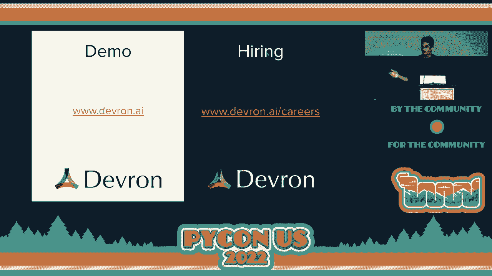

 [applause]。
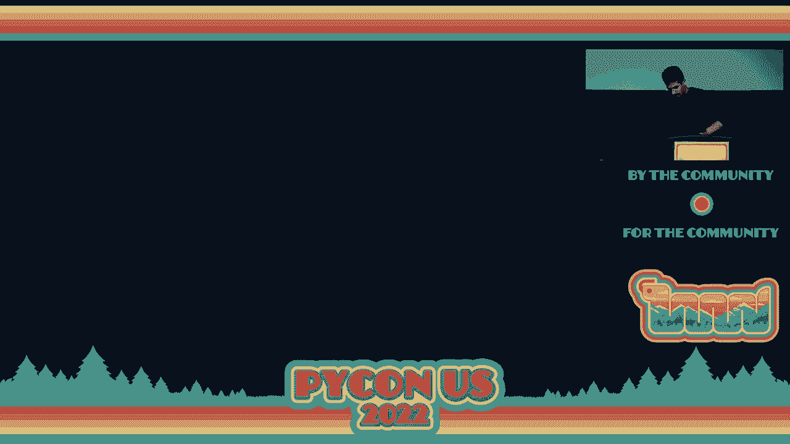

 That was a nice quick one。 All right， they're not all going to be that short， I promise。

 Chuk， come up on stage。 And Lorena， let's just hang out up here while people are talking。 I like it。 And， oh gosh。 I can mask off。 Mask off。 Yeah， go ahead。 Oh， hello。

 So here's Chuk to talk to us about cultural shock at my first Python US。
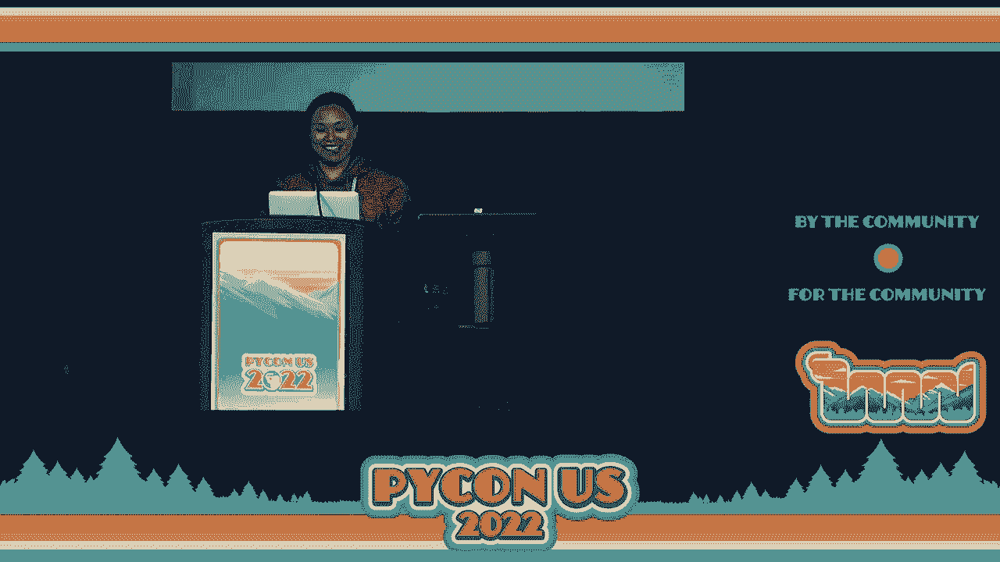

 Yes， absolutely。 Cultural shock。 I'm already shocked because this room is so vague。 It's my first time physically attending Python US， which is。 So， spoiler。

 I was lost in the venue the first day I went to lunch and I got lost。 So， I'm shocked。 Hit me up on Twitter if you want to。 I am living in London， UK。 So， this is what it。

 it's not what it looks like， but it's what people think it looks like。 And also， I。 so my company is based in Dublin， so I visit Dublin quite a lot as well。 So。

 I also have some tips about Dublin for you later。 So。 what I think here in the US is everything is so vague。 It's， it's perfect。 Like this room is so big。

 The venue is so big。 The roads are so big when I cross the road。 I always have to run because I feel like I don't have enough time to cross the road。 It's so big。

 The bed is so big in my hotel room。 This is my hotel room， by the way。 You can see that that's my teddy bear there。 It's very small。 So， yeah。 But。

 but the teddy bear here are so big as well。 So， yeah。 And anybody see this in the airport？ Like。 that's really shocked me。 Right？ Wow， the teddy bear is so big。 So， yeah。

 like it's really shocked me。 Another thing， hotel rooms， they have no cat toes。 So， you know， well。 I would say that I'm kind of British。 I live in UK for a while， you know， and then like we love tea。

 We need to have a cup of tea。 So， there's no tea。 No， no， there's tea in the hotel room。 but there's no kettle。 I was like， but I was prepared because I was told that there's no kettle here。

 So， I bring my own kettle。 I forgot to take a picture of it。 but I do have a travel kettle that can collapse， which is very good。

 For any of those of you who would love to buy one， talk to me， I can give you a tip。 But anyway， so。 also， I was scared。 Luckily， in this city， you don't necessarily need to drive because there's a tram。

 There are buses， but I was so scared because before I came here， I was like， oh my God。 do I have to drive because I'm horrible at driving。 I only drive maybe once or twice in my life。

 I'm a city girl， so I am super scared。 So， also， there's something。 there's called ice cream sprint that I do in all the pythons in Europe that we'll run for ice cream during lunchtime。

 So， I was worried that I would become a ice cream speeding ticket instead of ice cream sprint。 But luckily， it didn't happen。 So， I was shocked。 But I don't want you to be shocked in case you're going to this following conferences。

 But I did a London in June， a hero of heaven in July， and I'm high in UK in September。 I really want to see you there。 I really love seeing people coming to my country， my place。

 so that would be great。 So， I want to give you some tips。 So， you won't have cultural shot like me。 So， the weather is going to be a bit wet， you know， London， a bit wet。

 Bring some clothes that are waterproof or water resistant。 Also， getting around。 you don't need to drive， don't worry。 You can take trains， you can take buses。

 they're very convenient。 The underground train in London is called "Tubes"。 So。 if anybody telling you to take a trip， that's what you mean， like it's the underground， you know。

 transfer system。 So， eating out， definitely try efficient chips。 And there's something called Sunday Rose。 They're only available on Sunday in Pub， so。

 but usually they're yummy。 So， try that。 Also， tips are optional in Europe。 So。 don't worry about the tips。 If you don't want the tips， it's fine。 Also， show show。 You know。

 the breaks， the breaks， they love drink。 You know， they could be a big shine in the conference。 but after a few drinks in the pub， they can talk anything with you。

 They can introduce their family to you or something like that。 Also， Guinness， if you go to Ireland。 go to Dublin， Guinness must drink。 It tastes different there， so trust me。

 A commendation could be expensive， but， you know， look for something like Airbnb。 but be careful of the scammers。 Also， you know， student accommodation could be an option because somewhere nobody's going to be in this dirt accommodation。

 Or I have a small room。 So， be my friend。 Maybe host you。 I don't know。 So， people are there。 Just very nice， like people here。 So， don't worry about it。 Come to visit me。

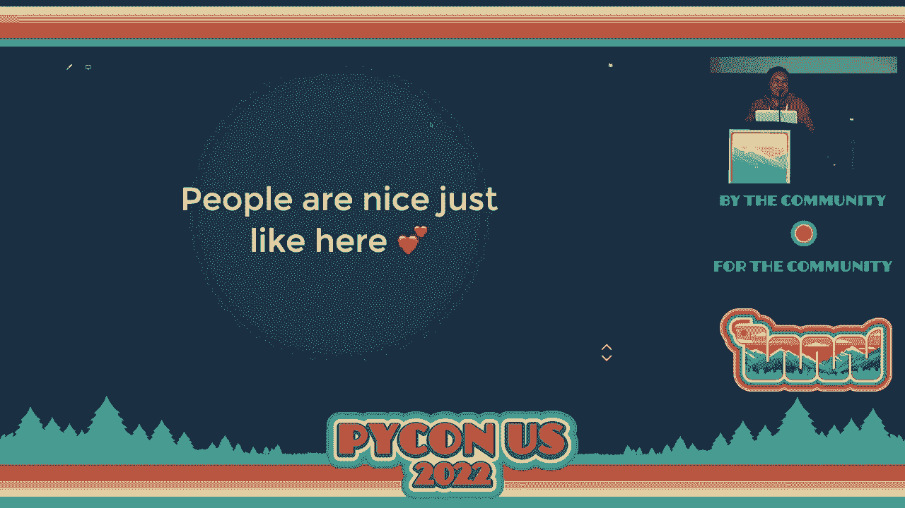

 Come to Pide。
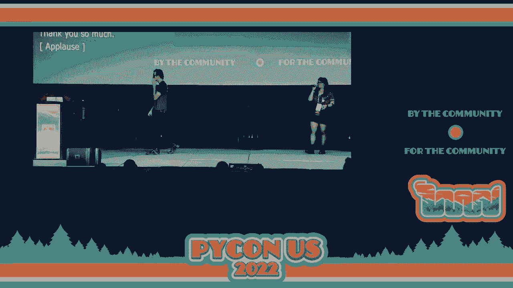

 Up next is a gentleman who， I don't think many of us need an introduction for Lukas。 Hi there。 We've seen each other already in the morning， so I'm just going to quickly make you a typing expert。

 This is a concept that many of us struggle with because we don't have nice examples。 And the property of nice examples is obviously to have cutie animals explaining them。

 And with that is everything is easier。 So， imagine some abstract animal and we have some subtypes of that abstract animal。 namely a dog， a cow， a cat， this sort of thing。 So， covariance。

 contravariance and invariance are concepts that explain us whether we can replace one of those with another and what will happen in that case。 So， covariance， the most kind of natural and intuitive of those means that whenever we have an animal accepted。

 we could put cow and it should work。 Like one example in Python is that if you have a function that prints an animal。 if you have a function that prints many animals by calling print animal。

 what you can do is you can define a function called print cats that just uses print animals and everything works fine。 So， this is in fact something that does work。 You can do that。 So。

 the property of the covariance here happens in the sequence of animal that can be replaced with sequence of cats。 The opposite happens for contravariance， which means in some contexts you can replace a cow with a generic animal。

 How does that work？ Well， this is the weirdest of the examples， but in fact it deals with callables。 So， if you have some print with implementation where we want to print a cat， I don't know。

 as Jason or whatever else， and we want to provide an implementation for it。 So。 we by default want prints cat because we know that this is something that can print cats。

 Can we put a function that can print any animal there？ Well， we can because it can print any animal。 So， this relationship between those callables， prints cat and prints animal is reverse to what you would think about with inheritance because you can in fact replace the more concrete thing with a more generic one。

 And finally， we have invariance where you cannot replace the cow with a generic animal and vice versa。 It's just impossible。 And in fact， this is something that very。

 very many users of typing fall into faster or later because of an example like this。 If you have a function that allows us to add animals to an existing list and we have a function that adds a cat。

 we would think that we should be able to just use this add animal function in the implementation of add cat。 And because it's natural， it doesn't do really much weirdness， it should work。

 But it doesn't because in general， if in the add animal function we did something funky。 This is just an example。 But the point being we would add an animal which is not a cat。

 then the function below add cat that takes a list of cats would suddenly change the type of those cats。 Into cats plus some other animal。 And what type is that？ Well， we don't really know。

 This is something that you might break in Python all the time because containers don't really limit you from putting incompatible types next to each other。 But with NumPy types or with other programming languages。

 the memory layout between different types might be different。 So this becomes more important then。 So in this particular case， that would not be possible to be done。

 And now you understand covariance， contravariance and invariance。 Thank you。
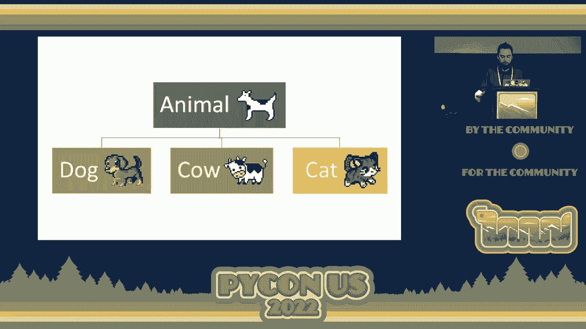

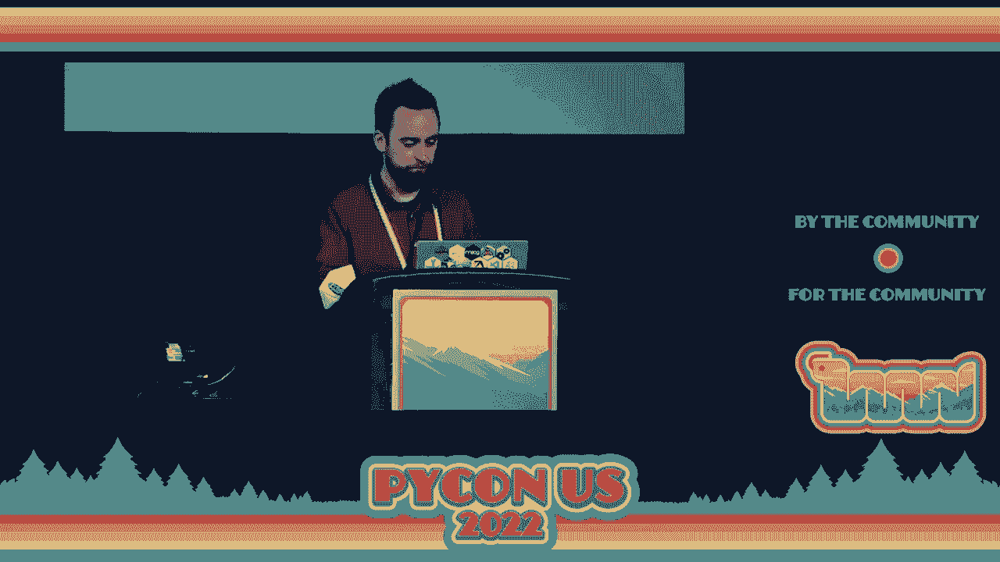

 Awesome。 Thanks， Lukas。 Next we have Seth who told me earlier that he never met another Pythonista until he came to this conference and met all the Pythonistas。 So， welcome， Seth。 Seth's going to give us a talk on the future of Trustors in Python。

 Give it away for Seth。 \>\> Hi， everybody。 So today I'm going to talk about Trustors and what that's going to look like in the future hopefully in Python。 So I'm Seth Larson。 I'm maintainer of your lib3 requests and some other packages。

 And a lot of the work that's done here is also done by David Glick。 So in the audience。 Okay。 show of hands。 Have you seen this error？ I've seen this error so many times。

 If you've worked at a corporate proxy environment， you've seen this error。 Usually you see this when there's no root certificate and you can't verify your search chain and you're trying to use TLS。

 Okay， so first off， what is a Trustor？ Trustor is a collection of certificates that your system uses when you're doing TLS handshake。 Server gives you certificates back。 You verify them against that Trustor。 And so in Python。

 because we're strongly tied to open SSL with our SSL APIs。 usually takes the form of a file or a directory of certs。 So today in Python。

 Trustors look kind of like this。 Linux distros， they ship things that are compatible for open SSL。 But Mac OS and Windows don't do that。 And Python is strongly tied to open SSL。

 So what do we do on Mac OS and Windows？ We use certify。 So certify is a Python package that basically takes the certificates that Mozilla bundles in their CA bundle and then repackages it。

 uploads it to the Python package index， and then you can use them。 But there are a couple of problems with using open SSL and certify。

 especially on Mac OS and Windows systems。 So certify。 you only get the certs that are bundled with certify。

 You don't get to follow some central policy on your system。 For example， in a corporate environment。 if your system administrator installs an additional certificate into your system trust store。

 certify has no idea what that even is。 And so that means you're going to end up with one trust store per application。 It's really tough to maintain。 You don't get any auto updates。

 And now the Python package index is a CA certificate distribution channel。 which is not what it's for。 And so here's why system trust stores are a lot better。

 You get one per system instead of per application。 So that means there's one place where all the certificates get updated。

 The system itself manages and updates everything， and you get a whole bunch of fancy features that the operating system usually gives you。 That open SSL wouldn't necessarily give you。 Or you'd have to configure additionally。

 So this is kind of that future that we're envisioning。 So there's this new experimental package that me and David have put together called Trust Store。

 This code is very new， so it's experimental。 Don't deploy it。 It's only been alive for about four months now。 You can get it on GitHub。 There's the URL there。

 But essentially what it is is it provides an SSL context API。 It works on all of the major platforms and does the native system trust store thing to make sure everything works。

 And we tested against a whole bunch of libraries。 The only kicker is it requires Python 310 because it uses some special private APIs that if you really are super interested in the system。 I wrote an entire article about it。 So go to the GitHub。 You'll find it。 Okay。

 And so then this exists。 What happens now？ Look at the project。 Be interested by it。 Like learn about it。 But do not deploy it yet， please。 It's very。

 very young code to be doing something that's super， super important。 So just wait for a little bit in that case。 But I think one of the future directions that this is going to go in is we would like to get this functionality added to Python so that all applications that use Python can immediately take advantage of it。

 And I think that there is an avenue for more incremental adoption by some libraries and tools of the specific library。 So that's kind of it。

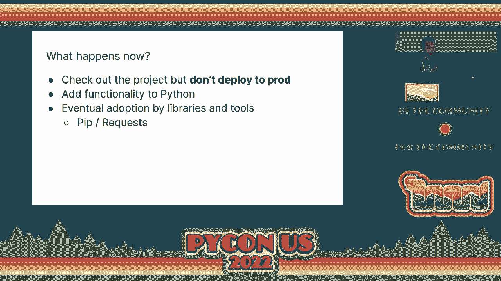

 [applause]， Fantastic。 Love hearing that there is a space for you to collaborate。 but do not yet deploy to prod。 Huge emphasis there。 Up next we have Pablo。

 Hey。 Hello， Python。 So I'm Pablo Calindo。 You may know me from my work on CPython。 But I'm here today to talk about something that we have released from the company that I work for。

 That is Bloomberg。 And this is Membray。 So Membray is a memory profiler that we have open source two weeks ago。 Many of you may know it because apparently it was quite popular on Twitter during a couple of days。

 But I hope to give you an overview over what it does and why it could be useful for you。 So the scope of memory profilers and profilers engineering in Python is a fantastic landscape because there's a lot of cool tools。

 But let me help you cover what memory does that many other profilers may not do or may do a bit worse。 So one of the things that happen is that， for example。

 in the standard library we sit with some memory profilers。 It's called trace malloc。 The problem with for instance， trace malloc and many other profilers is that they can see allocations that Python interpreter does。

 but not allocations that other things underneath do。 For instance， in this case。 we are allocating a huge amount of memory。 This is like 90 something megabytes using Memmup。

 But this could also be done in a C extension or NumPy or things that are not communicating with Python interpreter。 And the problem is that for instance， in this case。

 if you ask trace malloc how much memory was allocated， it tells you that it's only 80 bytes。 which is not great， right？ Because there is a huge amount of memory here。

 But if you do the same with memory， this is one of the example outputs that you will see。 In this case， it will tell you that we detected one allocation is 9 megabytes and it's because one allocator happened。

 So Membra can see not only a location that's happening in Python。 but also a lot of allocations that happen in C extensions。 Other profilers can do this。

 but something that many other profilers cannot do is that if you have one of the outputs of Membra。 which is this flangraff， for instance， in this case some memory is allocated in this Python code。

 Membra can also tell you what happens underneath that Python code。 And it can tell you all the C code that is executed underneath and what happened。

 And as you can see， you can go here and see that actually there is some NumPy cache that is the actual responsible to allocate the memory for that instruction。 which is super cool， especially if you are using data science libraries that you see extension or Python。

 But we have many other things。 For example， we dump all the information that we collect to a binary file and then you can produce a ton of reports。 depending on what you want。 You can get the statistical reports， you can get three reports。

 flangraffs， tables， and for instance you can even get live reports when you can see what your application is doing as it's running and you don't need to generate one。 You can see what's happening， which is very cool。 I know people like moving things， so here you go。

 But yeah， the idea is that we also have an API， so you can use the API to track just parts of your code。 You don't need to track the entire program because you may be using Gunico or other good things that make the whole thing very difficult。

 So you can just say， okay， track only what happens here。 And the cool thing I'll mention is that。 as opposed to other memory profiles， is that anything that happens outside this context manager has zero overhead because the activity is everything in a very special way that makes sure that any code that is known under this context manager has zero overhead。

 so it runs at full speed。 We have also a play test plan。 which you can use immediately by installing and that does memory to your educational play test。

 that after the test passes， it will show you a bunch of statistics。 So for instance。 it will tell you how much memory was allocated， how many locations happened。

 meaning the diagram of the locations that happened and the places in your code and your test when there were more allocations。 which is quite cool。 But you can use also this play test plan to say， okay， I have this test。

 but I don't want anything under this test to use more than 25 megabytes。 and memory will make sure that this test will fail， even if the test itself passes。

 if it uses more than 25 megabytes。 So you can use that your functions are limited by whatever you want。
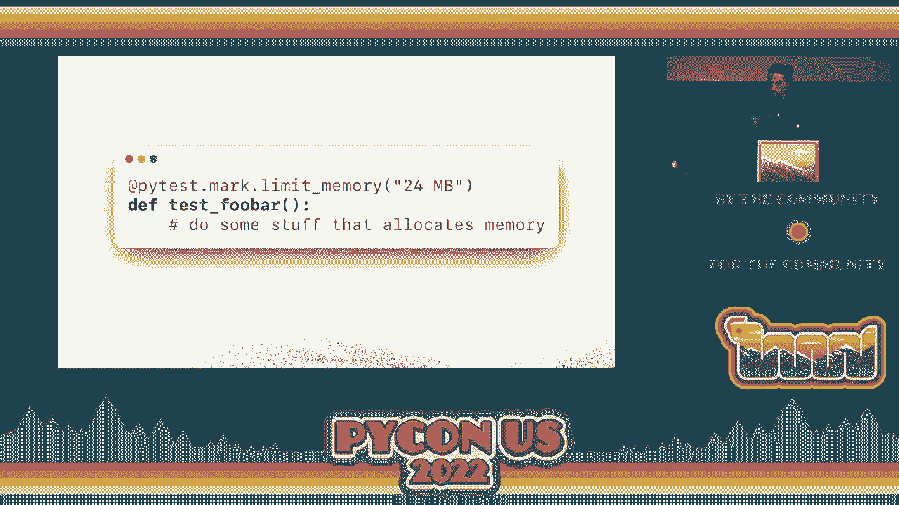

 So yeah， this is the profiler。 It's just one among many。 There is many， many other good profilers。 and this is just complementary to them。 But we think it's quite cool。

 We put a lot of effort to develop in this team and open source in it， and we hope that you like it。 You can check it in。 So give up。com/bloomer-memory。

 and I hope that you use it for finding why your programs are getting so big。 Thank you very much。 [applause]， Super cool。 Very excited about that。 Okay， next we have Graham， who has no slides。

 who's going to talk to us about the grief cycle， data security breaches。 and how we could code the future of America and the world。 Let's give it away for Graham。

 [applause]， First of all， I think that title is a little bit grandiose because coding the future of the world is a kind of big topic。 But can I get a show of hands？ Who here knows someone that has been hacked？ Okay。

 now who here has been hacked？ Now， raise your hand if you are proud that you got hacked。 I didn't think so。 One of the big things that I encountered when I was doing research in my master's program was a real issue with shame that came with being hacked。

 And it kind of built onto this grief cycle concept where you start -- people actually are going through a grief cycle because of the shame of the fact that。 oh， I'm compromised。 My data。 Myself， it's my fault。 And it may be reconsider how we as -- I mean。

 Python。 This is PyCon。 We should be the people to be helping people with this sort of thing。 And in the future， we're going to be building things that will shape the minds of everyone that uses the Internet。

 That was loud。 And for that reason， I think it's really important that we look at it from a holistic perspective because I think there are some parts of this grief cycle that people are going through in the workplace。 even on our teams or our friends or even our clients。

 That there's lots of people that we don't know they're in the anger phase and we try to sell them something。 And while in the anger phase， they're just not going to buy something because who would。

 And I think that there's a lot of potential -- there's a -- I don't think it。 I know there's a lot of potential in machine learning and specifically， I think。

 in reinforcement learning for the advancement of even our understanding of the way social dynamics work。 I'm kind of excited to see what the next couple years hold in terms of modeling social change。

 like figuring out how we can create models to maybe do conflict resolution with people that are in a grief cycle with maybe a chatbot that helps people to calm down before they talk to a human so that the poor customer service people don't have to deal with that。

 And this really came to my attention whenever I had to do cold calling。 And that was one of the hardest jobs I ever did。 It changed my perspective of that whole industry and it really made me appreciate those people and what they go through。

 And I think that's the kind of people that we serve with open source software。 And that's the kind of thing I'm excited to work on with all of you is this working on making machine learning without bias。

 working on building things that work and that can actually enact change。 And I really。 really appreciate being here this year and for everything that PyCon offers。 On that note。

 we appreciate all of you being here at the end of a long day or for many of you who've been here many days。 But up next we have Mason who's going to be talking to us about what is synthetic data。

 Can we get the podium？ There it is。 There we go。 Okay， we'll try that again。 Hello。 my name is Mason。 I will be talking about synthetic data today。 Usually， whenever I try to do。 Yeah。

 we'll do that。 How you know I speak with my hands。 Okay， we'll try this for the third time。 Synthetic data。 My name is Mason。 One of the first things that I do whenever I learn about a new topic is I usually try to find some sort of definition on the Internet that gives it some sort of explanation。

 So the definition that I've found is that synthetic data is artificially annotated information that is generated by a computer using algorithms or simulations。 And it's commonly used as an alternative to real world data。 After I read that definition。

 I was just as confused as I bet some of you are。 Let's look at a little bit a couple of examples and some of the problems that synthetic data solves。 So data is one of the biggest problems that developers face today。

 Getting access to usable testing data is usually pretty difficult。 The data could be in a production database or you don't have some sort of access to it。

 You're not on the right team。 The data may contain private information such as social security numbers。 credit card numbers， all of these kind of things where it's not safe for a company to allow every developer within the company to have access to this data。

 Another problem that developers have with data is the limited data sets。 35% of the time that goes into building a new ML model is spent just in the data gathering phase and it is the largest phase that happens in the ML thing。

 Trying to find relevant data that helps us is very difficult。 And also our data is biased。 We very often don't have a complete data set。 This can be intentional or unintentional。

 but very often the data has a really slanted view in one way or the other and it's a problem that we have to deal with。 Synthetic data comes to the rescue in almost all of these situations。

 So one thing synthetic data can do is it can make private data accessible and shareable。 So what you can do with your production data is you can take this production data and run it through a synthetic data generator and then generate an entirely new data set that is statistically equivalent to the approach of the data。

 To the production data set would give you the same things through any sort of testing。 any sort of machine learning algorithm， but it has now been completely anonymized and you would not be able to know that this came from a production data set。

 You could then in turn share this data and use it wherever you want it。 It also allows us to generate more samples if we have a limited data set。

 Say we have a data set of only 5，000 elements and we need a much larger data set because our model just will perform better if we have more data to train it on。 We can generate as much of this synthetic data as possible as we want。

 We can generate a million records， a trillion records， however much you want。 And we can with pretty good accuracy tell you that this data is still statistically equivalent to the original data set。

 We can even reduce bias in machine learning data sets through a combination of some of these techniques。 So a really good example that is in the slide and I'll give these slides and all these links after the presentation is reducing AI bias in predicting heart disease with synthetic data。

 This slide talks about a case study where they were looking at heart disease data from patients。 70% of the data which came from men because that was the data that they had 30% was from women and it was very biased towards the men side and it didn't perform very well。

 We were able to then take this data set， shrink down the men's size to a 50% and then take the 30% that we have for the women set and expand upon it using synthetic data。 generate it。 And then the model actually improved in accuracy from 88% to 96% because we were able to de-bias the data。

 But a lot of you may be going well isn't synthetic data just fake data？ And the answer is no。 there's actually a very big difference between synthetic data and fake data or mock data if you will。

 A lot of people think of fake data， they think of faker。 And one of the problems that I've had people tell me is that faker sometimes gives two perfect of results like all the data sets are always filled。

 they're always meaningful。 It's not how data comes into the real world and we all know that。 So fake or mock data has no accuracy。 It's purely random。

 Synthetic data on the other hand is nearly as accurate or in some cases as represented by this paper as well can be more accurate than the original data set when trained on a specific model。 So where can you use synthetic data？ The answer is everywhere。 Automotives， financial services。

 cybersecurity， healthcare and life sciences with genomics， all sorts of things。 How can you。 as the audience member， start using synthetic data？ Gretel。

 the company that I work for has open sourced our synthetic data model。 We have one right now。 there are more coming。 So if you have a really good GPU or using Google Cloud。

 you are more than welcome to try to use it。 You can use our cloud offering。 It has a free tier。 It also gives you all the synthetic data scores to tell you how far your data has drifted。

 differential privacy， a whole bunch of things。 You can check out this blog。 I'm doing a open space。 250 AB tomorrow at four on Saturday and that's all the time I have。 [applause]。

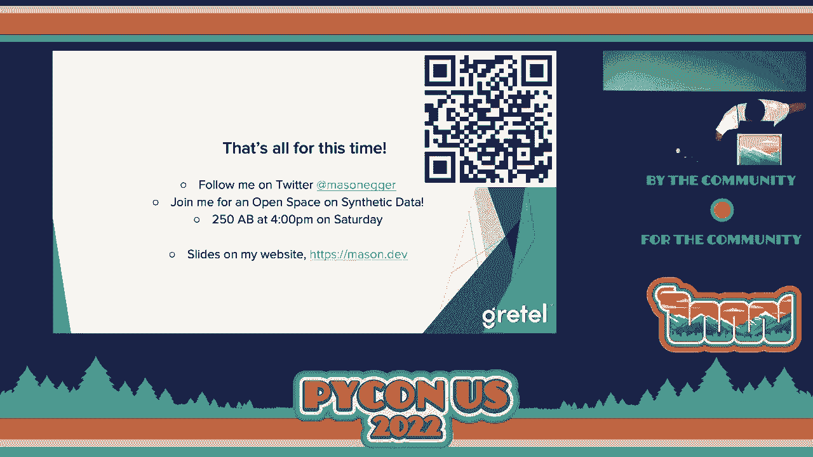

 Thank you， Mason。 [applause]。

 Love synthetic data。 All right。 Next up we have Sophia， who's going to talk to us about holo-vis。 Take it away。 [silence]， [inaudible]， Hello， everyone。 Hi。 My name is Sophia。

 I'm a data scientist from Anaconda。 Today I'd like to talk about holo-vis。 Holo-vis is my favorite Python visualization ecosystem， which comprises seven libraries， panel。

 HV plot， holo-views， geo-views， data shader， program， and color set。 With more than hundreds of thousands of downloads per month。

 it is one of the most popular Python libraries。 So my data visualization workflow usually starts with HV plot。 I use HV plot with panel to build dashboards， and I use HV plot with data shader to visualize big data。

 HV plot， it might be familiar with Pandas。plot， ABI。 HV plot just works and looks and feels just like Pandas。plot。 To the left here we have Pandas。

plot API， plotting x， x and y access with mapplotlib as the back end。 To the right we replace dotplot to dot HV plot， so you can see this is a HV plot plotting the same plot with bokeh as the back end。

 In the holo-vis ecosystem you can actually use different back ends from your preferred library like mapplotlib。 bokeh， bokeh， plali， and etc。 Next I want to show you an example of how to build a dashboard of using HV plot and panel。

 You might be familiar with Pandas。 We have a Pandas。peplai， we define Pandas。train method。 this is with the car dataset， we define the cylinder in manufacturer。

 and we group by some variables and calculating the horsepower。 What if we want to interact with the cylinder manufacturer and all that？

 So instead of using those defined values we can actually use panel wedges。 Here I define three panel wedges， cylinders， manufacturer and x access to define the variables we want to take the min off。

 And then the result is the interactive table or interactive data frame which you can plot。 interactive plot on。 So here is the final result with a few more lines of code。

 If you want to see full example of this full code of this example。 please go check out my GitHub page。 It is listening here。

 And then finally I want to show you a simple example of how to visualize big data using HV plot and data shader。 To the left here again we have Pandas。plot。api plotting 11 million data points of NYC taxi drop off locations。

 As you can see in this plot it is a blob and it's very hard to extract meaningful information from this。 With HV plot we can use a "restaurize = true" option which uses data shader under the hood to plot this data meaningfully and interactively really fast。

 If you want to learn more about Hallovis， please check out the documentation at Hallovis。org and also the documentation of HV plot panel and data shader。

 I have also written several blog posts， data visualizations and an account on the nucleus in account。cloud。 And account on the nucleus is a data science engagement content and community platform。

 Please go check it out。 It's pretty cool。 Thank you。 Please feel free to connect me at Twitter and LinkedIn。

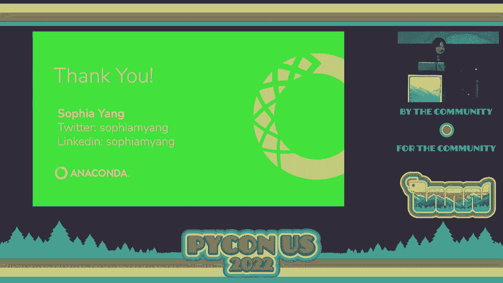

 [applause]， Thanks Sophia。 Excellent。 Thank you so much Sophia。 Up next we have Shavai and I'm really excited about this。 Go ahead without further ado。

 With a little ado because we need to put the dongle on the computer。 A small ado。 A dongle size to do。 Oh no。 We're going to do a comedy skit up here。 No， I don't think so we should。

 [laughter]， Alright， let's give him another round of applause。 One moment。 Hello。 First of all welcome everyone to the lightning talks。 I'm Shavai。

 I'm a contributor and sponsor for Robin。 Well， Robin is an async Python web framework with a Rust front time。 And today I'm going to be telling you all about it。

 So first of all let's get to know about how Robin actually started。 So well it's a pet project from one of my really close friends son， Scott。

 who is one of the original creators of this project。 So basically back in April of 2021 he was in his final year of college and。

 he was basically preparing for his final thesis。 Along that same time there was a huge wave of build with Rust or basically rewrite in Rust。 A lot of different softwares were being rewritten using Rust because Rust is such a popular language because of its performance。

 So at that point of time since Scott was also working on a side project that was being built with Flask。 He also was working a lot with Node。js and he wished that like you know Flask could actually get async support which it lacked at that point of time。

 So he decided that why not just create another framework that could actually become the next async Flask。 Well， I mean he was aware of fast API but he just wanted to create his own Rust based framework and that's how Robin actually came into play。

 Well one of the biggest benefits of Robin over other Python frameworks is that everyone should be knowing about the notoriousness of like the global interpreter lock that is there in Python which does not allow it for being truly concurrent。 And that's where like you know Rust because it natively implements like you know multi threading is much faster as compared to other Python frameworks that might have been built using Python or C Python。

 And Robin also comes with a basically with a coupled server。 So that means that it does not have to depend on an actual or an external ASGI。

 And if we just compare it against all the major frameworks as compared like you know sitas your Flask。 fast API， Django。 So this test that you see in this table was done over 10。

000 different requests for a simple HTTP request get request。 And you can see that Robin is actually the fastest as compared to all of them across different kind of strained workloads。

 Now quickly coming to the architecture right so essentially since it's a Rust based runtime so we are come like we are basically compiling the code of a Python into Rust is getting converted。 Now if you can see the worker event cycle this is sending requests to the router which basically contains various Python based code objects which basically are there for each and every separate。

 Route that is being generated。 Now once this basically the routers sends this code directly to a thread pool which then distributes it along the different threads based on the workload of the CPU。 And this sort of becomes really great if you want to scale it because each of these worker events can be distributed amongst various CPU cores。

 And if you really want to scale it further you can distribute this workload across very CPU cores and that makes it super impressive as you can see from the results that you saw from the comparison。 And of course if you want to get used to it like you can simply install the Python packets for Robin and you will be able to use it very simply as you might actually use something like Flask。

 Of course with the added benefit of being async。 And well if you want to get involved you can like you know if you like the project you can give it a star by going to github。com/sansrops/robin。 And you can also join the getter community for the Robin project and you can also follow the Robin project on Twitter。

 And of course if you want to connect with me you can connect with me on Twitter at the rate hard enough。 But thank you so much for attending today's lightning talk。 [Applause]， Alright。

 yet another web framework just that we need。 I'm just joking。 You can always make them faster right？

 I think you need a double check。 Oh you got one oh sorry I'm vamping because I thought we were moving one from the other side。 Alright so this is Chris。 Chris is going to give us a talk on elegant code in three steps。

 Is the first step just use Python maybe？ Yeah maybe so。 Okay give it away for Chris。 [Applause]。 I'm told in America they make things bigger。 Anyway my name is Chris May。

 I'm excited about talking to you how to make code elegant。 To make code elegant we need to refactor。

 And that is because it is practically impossible to make elegant code that you as well documented code that you can understand。 code that you can maintain the first go around。 And thankfully since people have been writing code for decades we have decades worth of tools that you can use to refactor such as code smells。

 People have categorized specific things they call code smells which are things that suggest opportunities for improvement。 In addition there are specific methods you can use to refactor code。

 Each of these have a list of specific steps you can follow to make sure that your code is always going to run and it's going to be more elegant when you're finished。 But there are a lot of them right？ How are you going to keep them straight especially when you don't have this list there or you don't know which one you need to follow？

 Wouldn't it be great if there is a way that you can just follow something simple to make a code more elegant？

 Well thanks to Heinrich telling me about this book 99 bottles of OOP。 I've been really impressed with Sandy， Metz and Katrina Owen。

 They spent two years trying to figure out how do you tell people how do you explain how to refactor。 They created this thing called the flocking rules。 These are the three rules。

 If I were to read them to you right now， you're not going to get it。 We need a little code to walk through。 In trying to learn the flocking rules I started creating code that would recite the 12 days of Christmas song。

 Here are two verses that I started working。 First thing we need to do is identify the things that are most alike。 In this case there are two verses。 That's easy。 We need to find the smallest difference between them。

 I'm going to focus on the first lines of each of these cases。 The only difference is the word first or the word second。

 Next we need to make simple changes that will remove the differences。 The first and second we need to come up with a concept that encapsulates this idea。

 When verses one this thing will be first。 I'm going to use the word day。 It makes sense to me。 We don't have to stick on this。 We can always refactor it later。 So day。

 So what we need to do is create new code that represents day。 With Python we just make a function。 Next we need to make this code ready to return the data that we want。

 I should say I made a test for this。 We should be running tests。 We ran the test。 The test passed。 That is good because we know we have valid code。 We now add what we need to return。 Run our tests。

 It passes again。 We know we are ready to incorporate it in。 Let's do that。 Pars execute and use the results。 So we insert that in into this first opportunity。 Run our tests。

 They pass。 We are doing good。 So technically you can say we can go to the next one to delete unused code but we have all。 unused code that we can use so we can go back through the flocking rules。

 Or we can focus in and say let's just stick here and refactor this whole through。 Next thing we need to do is incorporate the second。 So we can return second。

 So day needs information。 Let's give it to it。 We pass in something we know we can delete later because we want to make sure it passes at this。 point which they do。 So let's do that。 Let's add code to return second。

 Let's incorporate it into the code。 Now let's make the two pieces of code the same。 Just like that。 And hey look at that。 They are identical now so we can delete unused code which is this little extra code that I。

 put in here。 And we now have code that's more elegant。 And at this point you can go back through the flocking rules again。

 And the thing I love about the flocking rules is that it's always kind of fractal in nature。 So no matter where you are you can just jump back into them and make your code better。

 If you get pulled away while you're in the middle of refactoring and you don't know where。 you are you're going to have working code that works obviously and you can always jump。

 back in and make it better。
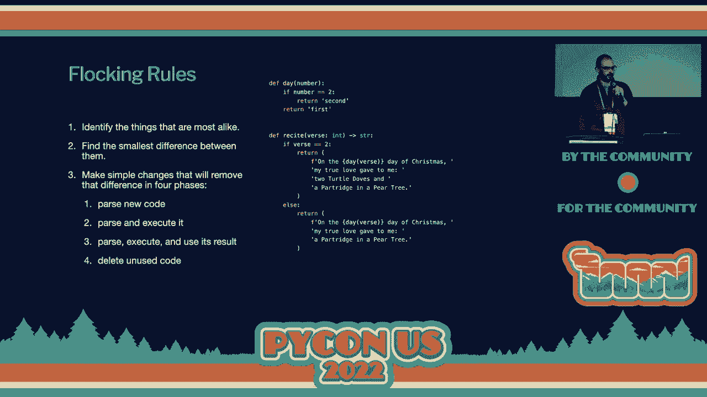

 Well thank you。 If you want more tips like this check me out at everyday superpowers at div where I want。 to give you the superpowers you can use every day and on twitter at underscore chris may。

 Thank you very much。 [applause]， Thank you so much chris。 And up next we have chris。 Who's going to be talking to us about getting to 100% coverage and why it matters。

 Check one check two。 Thank you。 Thank you all for staying for the last lightning talk of the day。 So I'm going to talk to you about 100% test coverage。

 100% test coverage is when we have all lines of our code covered by test。 I want to talk about is it worth it is it worth getting to 100% and how can we get there。

 So this comes out of my two year journey to achieve 100% test coverage on an open source。 project called static frame。 I achieved that goal and I got that 100% banner there。

 It was really hard but I made it and it's very satisfying。 Initially I was very skeptical about this goal because 100% test coverage does not mean。

 100% behavior coverage and aren't all those new features you want more important than 100%。 test coverage。 I believe 100% test coverage is worth the effort。

 At least we have exercise all lines of our code and we have 100% test coverage and this。 is critical in Python where un-exercise codes will not be evaluated。

 It does not guarantee correctness but it does offer many additional benefits。 So this is my journey through the code curve timeline of my coverage and you can see in。

 January of 2020 I set out to get to 100%。 I didn't make it。 I got to about 98%。 And then you can see my coverage wander and start to slip away。

 And then I realized one day my coverage was slipping。 So I tried again and then I got distracted and my coverage drifted and you see this pattern。

 repeat over and over again until finally in January of 2022 I got to 100%。 And it's much easier to stay at 100% once you're at 100%。

 So that's really one of the important takeaways here。 So what is it in that last 2% that was so hard？ Well one of the things is non-trivial unreachable code。

 This is not the unreachable code that Pilent tells you about。 This is the unreachable code that is due to a logic problem that you haven't evaluated， correctly。

 So that's one of the things that I found。 But overwhelmingly what you find is hard to test code。 There's a reason that's the last 2% is because it's hard and that often leads to valuable。

 refactoring of your code and improving your designs。 But is less than 100% good enough if you have like 93 can you say well I tried。

 So many popular open source packages do not make it to 100% and we can see one example， here。 So I argue that less than 100% is not good enough。 And there's a number of reasons。

 So the first is as I said the last 2% of lines is the hardest to test code and there。 are probably real bugs in that code。 It's also while you're working on your code hard to tell if you are growing or reducing。

 coverage if you're not at 100%。 I mean you can check your coverage every day but it's going to be harder to follow if you're。 not at 100%。 Furthermore without 100% coverage you have less confidence that any refactoring you do。

 is not going to break things。 Without 100% coverage it's hard to tell if pull requests are adding enough coverage and。 this helps make test expectations really explicit for your contributors。

 So for example here in a GitHub PR using the code cover report tool we can see that I added。 10 lines of code in this PR and I added 10 lines of test。

 And if you merge all your code through your PRs and you have code coverage looking at your。 coverage with each of these PR you can maintain 100% coverage in your project。

 So how do we get to 100% coverage？ Well the first step is building coverage into your continuous integration。 And I've used codecove。io for a number of years。 I've been very happy with it。

 There's probably alternatives out there but it's worked very well for me and it's free。 for open source projects。 You'll need a couple packages。

 The coverage package has been there for a long time and it's a great utility。 The PyTestCove plugin works with coverage to derive your coverage in your PyTest runs。

 Now you need to get this in your continuous integration。 So I use GitHub Actions。 other continuous integrations you can probably do the same thing。

 You can see here I just run PyTest with the Cove plugin and I tell it to give me an XML， report。 And then I use the codecove action tool to upload that to codecove and that's all we need， to do。

 So you can set this up with your continuous integration and you'll get constant coverage， updates。 So a couple practical tips。 So not every line needs coverage。

 You can use the pragma no cover declaration to skip immaterial lines。 Now you don't want to just skip stuff because it's hard。

 You want to skip stuff that really doesn't need coverage。 And a good example is unimplemented abstract base class methods。

 Like that's code that should never be called。 We don't want to， we don't want to coverage on that。 In addition， while you're studying your coverage， I recommend putting comments in your code when。

 you identify lines that do not have coverage。 It's a good idea to put a comment in your code right away to tell you coverage is missing。 there。 So later on when you're not looking at your coverage and you're maybe working on your， test。

 you can find what's missing and work on getting that coverage。 Finally， you can debug when you're。 when you're test writing test to get coverage， it's useful。

 to debug on that line because you might think you're getting coverage there but you're not。 So I implore all of you， stop adding new features and chase down that remaining coverage。

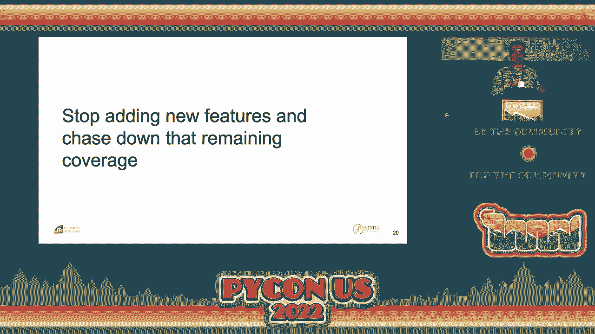

 Thank you。 [applause]。
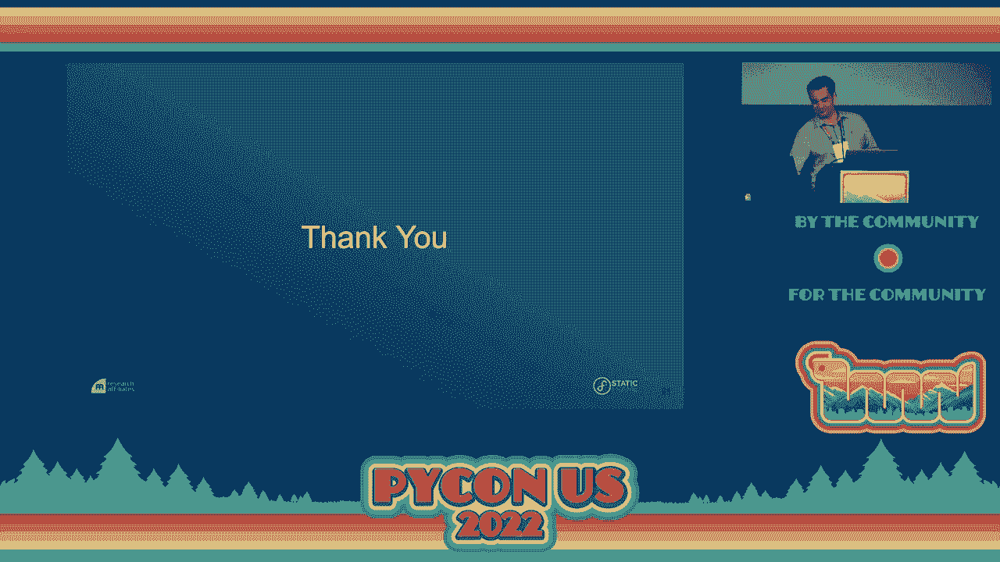

 Right down to the wire。 All right。 Next talk is by Indra。 Is your mic working？

 I think it's probably on。 Yep。 Thank you。 All right。 Let's give it away for Indra。 Hi everyone。 Thank you so much。 Really excited to be here。 My name is Indra。

 I'm a Python developer and I'm a big fan of frameworks。 So I worked extensively with Django and GraphQL and SQL alchemy and more recently with Keros。

 and TensorFlow。 I was part of bank pipers in Bangalore and attended PyCon in India but this is my first。 time attending PyCon in the US。 So really excited to be here and talking to you all。

 Today I wanted to talk to you about a medium article that I wrote called Pandas to production。 and as I said I'm a fan of frameworks and I'm becoming a fan of frameworks that help。

 data scientists very quickly take their models from a Jupyter notebook and make an API service。 out of it。 There are many sort of frameworks that do this today。 There's fast API。

 There's a cube flow ML flow。 I have used Bento ML which is one of the open source projects that also aims to do this。 So what's the problem with solving？ Machine learning models are easy to build and prototype iteratively on a Jupyter notebook。

 but then we don't like typically data scientists have to hand this off to a DevOps team or a。 MLOps team more likely these days because someone needs to understand the machine learning side。

 of it， the DevOps side of it， writing APIs and not everyone can hire an API engineer and。 a infrastructure engineer to do these things。 So here's a very quick tutorial on how you can do all of that if you sort of work with。

 one of these frameworks。 So step one is sort of the easy bit which is the model。 I guess not easy。 It's the bit that's easy for the data scientists。 So I'll skip over this。

 I'll just tell you that I'm using a pre-trained sentiment analysis model that I pulled from， Kaggle。 And so what step two， step two is defining the API service contract。

 So what does your endpoint take as input？ What does it provide as output？

 How does it respond to queries？ And in this example。 I'm going to try and step through code live and this may or may。

 not work very well but you can see that I have imported BentoML and the framework itself。 has ways of interacting with model artifacts。 So in my case。

 my model is a SK Learn model so I'm importing that kind of artifact and。 also I'm telling Bento that I'm expecting adjacent input。

 And really all I'm doing is writing a very simple sort of flask API endpoint。 So you can see my class is a sentiment analysis class。

 It's a Bento service which means this is going to be exposed at a certain endpoint。 There's a couple of big packages that I'm declaring I need and this is important because。

 it gets packaged into the runtime environment and I'm defining that I expect a model artifact。 which will be pickled。 So it's going to be loading from a pickled file。

 And then I just have to implement a predict function。 All this does is says， okay。 I'm expecting some kind of JSON input and then here's all。

 the code that I have to write to make my model an API。 I'm saying， let me pass the JSON。 let me load the model artifact and run predict on that。

 This is going to load the SK Learn model run predict on my text and then for each prediction。 I'm just constructing a JSON response。 I'm saying， here's the sentiment score。

 Here's the sentiment score name and then here's the text that I predicted on。 Seems simple enough。 So from there， the next step is to package this model and serve it。

 So all I need to do is import that particular model， call Bento service and say， hey， this。 is the service I defined。 This is the model that you need to run on and then all it's going to do is it's going。

 to load those two together， load up a Docker environment， install the pip packages and。 declare and ready to serve。 So that exposes a flask endpoint which you can see right here。

 It comes with a bundled health metrics and other endpoints and I'm able to execute and。 get responses from this API。 With a couple of quick changes to that and I'm coming up on a minute so I'm going to。

 run through this， with a couple of quick changes to that we can instrument error tracking and。 performance metrics measurements。 So I will skip down to the end and show you how I've done that。

 So relying on our good friend's sentry here， so import sentry SDK， set up your sentry config。 and you're ready to go。 Sentry will start tracking errors as long as there is a try except block and you're doing。

 capture exception。 Bento ML comes bundled with Prometheus for performance metrics tracking。 So I have two metrics that I've defined here。 There's a request time metric which measures latency and there is a text length which is。

 more of a custom metric。 So I'm interested in how many queries am I being asked at any given time。 And with that you can see some zero division errors that I forced here and Prometheus。

 logs out of the box。 So this is part one hoping to do part two with A/B testing and more。
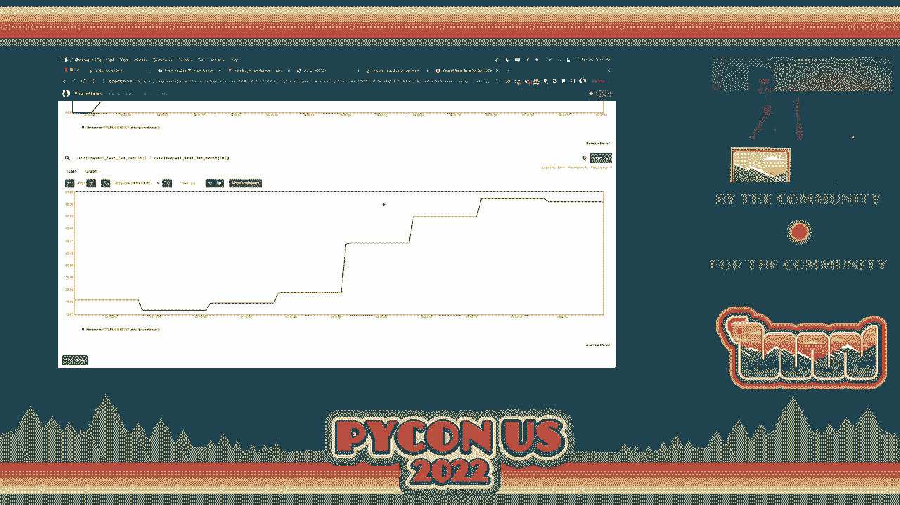

 Thank you。 All right。 Thank you， Indra。 And that does it for tonight's lightning talks but if you enjoyed these lightning talks。 you might also enjoy lightning talks tomorrow morning， tomorrow evening and Sunday morning。

 If you want to give a lightning talk like these fine folks that just gave talks today。 you can sign up for tomorrow evening and Sunday morning lightning talks in the boards。

 directly out that back door right next to the registration booth。 Anyone can sign up to give a five minute talk about whatever they want。

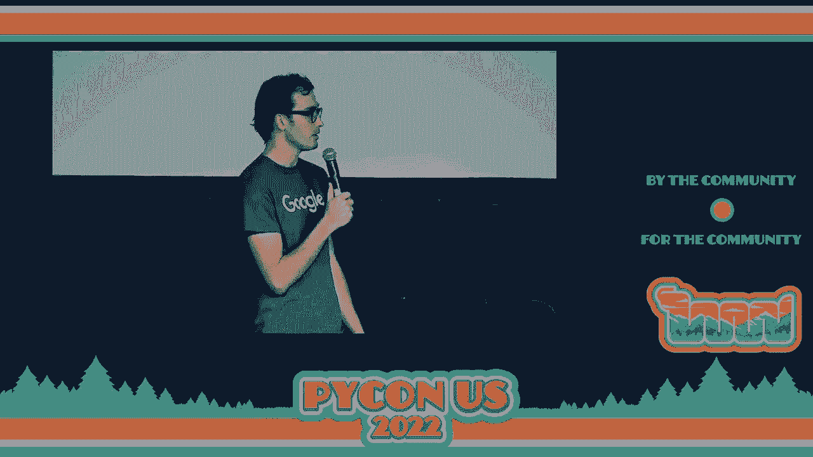

 And as a point of clarification， if you are selected you will be emailed。 Yeah。 And you're emailed really nicely on the board because if I can't read your email， I can't。

 email you to tell you that your talk is been accepted。 Right。 Exactly。 All right。 Thanks everyone。 Have a great night and see you all tomorrow。 [APPLAUSE]。

