# P15：Lightning Talks - Day 3 - VikingDen7 - BV1f8411Y7cP

 \>\> Hey， everybody。 Good morning。 It's 8 a。m。 And what does that mean？ Do you know what。

 that means？ \>\> I don't know。 What does it mean， Dustin？

 \>\> I think it means we should start lightning， dogs。 Okay。 So first up， we have Pandy。 Who's。
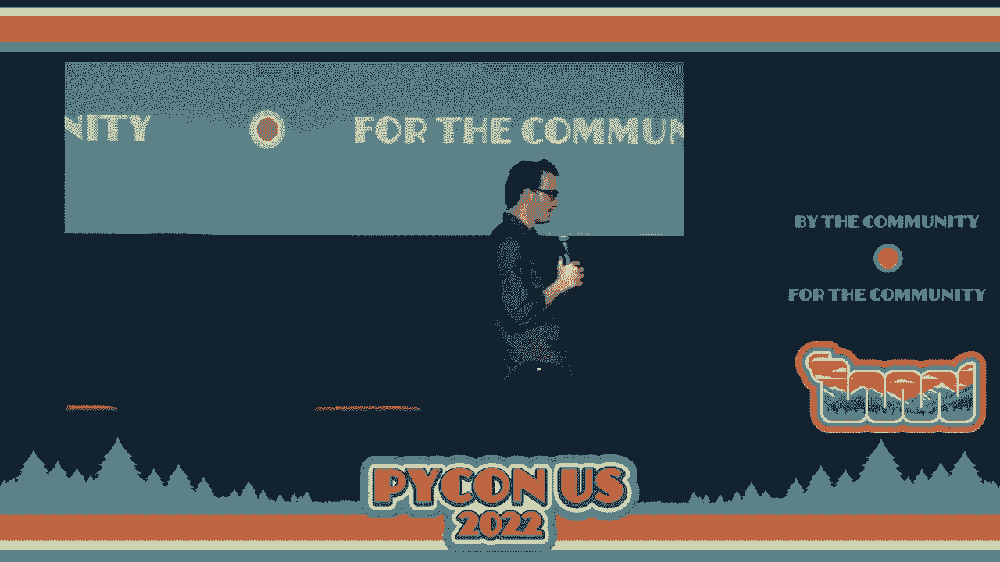

 going to talk to us about？ I can't see the slide。 How to write a test case， of course。 My name is Pandy Knight and I'm the automation panda。 I'm a developer advocate at Apple tools。

 and director of test automation university。 Today， I'm going to show you a simple but powerful。 technique for writing test cases like a pro。 First， let's define testing。 Testing is interaction。

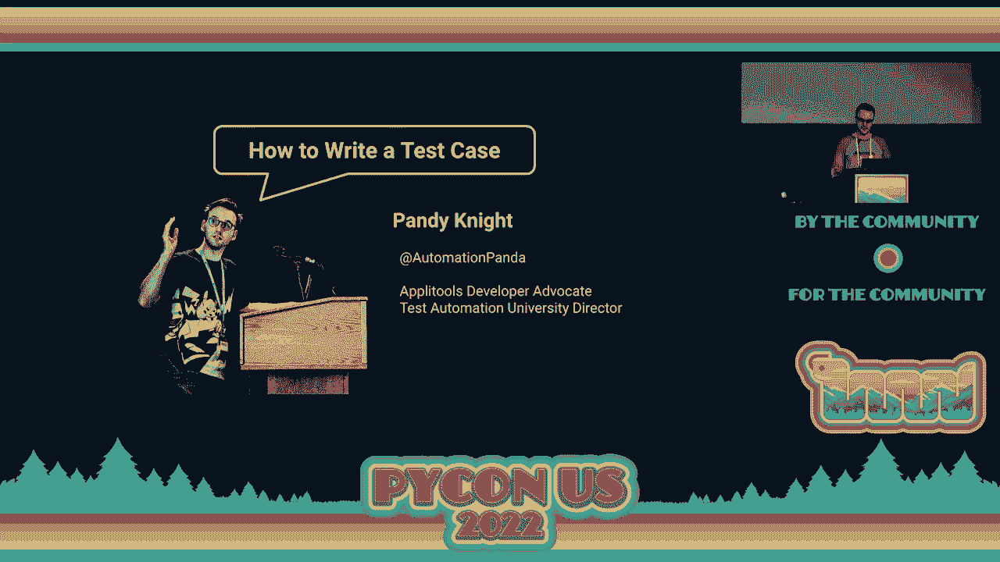

 plus verification。 That's it。 You do something and you make sure it works。 A test case is。 a procedure for making those interactions and verifications。 There are several kinds of。

 tests like unit tests， integration tests or end-to-end tests。 But all functional tests。 do the same basic thing。 They try something and report pass or fail。 That's how testing。

 keeps us safe。 Testing provides an empirical feedback loop for development。 With tests。 we know when things break。 Without tests， coding can be dangerous。 The last thing we want to。

 deploy are big old bugs。 So， if we intend to spend time writing tests， how can we write， good tests？

 There's a simple but powerful pattern I like to follow。 Arrange， act， assert。 Arrange， act。 assert is a great way to structure your test cases。 It prescribes an order of operations。 First。

 arrange inputs and targets。 Arrange steps should set up the test case。 Does the。 test require any objects or special settings？ Does it need to prep a database？ Does it need。

 to log into a web app？ Handle all these operations at the start of the test。 Second， act on the。 target behavior。 Act steps should cover the main thing to be tested。 This could be calling。

 a function or method， calling a REST API or interacting with a web page or anything else。 you need to do。 Keep actions focused on the target behavior。 Third， assert expected outcomes。

 Act steps should elicit some sort of response。 Assert steps verify the goodness or badness。 of that response。 Sometimes assertions are as simple as checking numbers or string values。

 but other times they may require checking multiple facets of a system or using something。 like visual snapshots。 Assertions will ultimately determine if the test passes or fails。 You。

 may have seen a range act assert in a different way。 Gherkins given when then format from。 BDD is the same thing as a range act assert just with different words。 So here's a basic。

 unit test for Python's absolute value function。 I wrote this using PyTest。 This test may seem。 trivial， but we can use it to illustrate our pattern。 The arrange step creates a variable。

 named negative for testing。 The act step calls the abs function using the negative variable。 and stores the return value in a variable named answer。 And the assert step verifies that。

 answer is a positive value。 I like to write comments to noting each phase of the test case， as well。 Let's kick it up a notch with a more complicated test。 The example test -- this。

 example test -- the DuckDuckGo instant answer API using the requests package that I'm sure。 many of you have used。 The arrange step forms an endpoint URL for searching for Python programming。

 Notice the base URL and query parameters。 The act steps call the API using the URL with requests。 and then parse the response body from JSON into a Python dictionary。 The assert steps。

 then verify the HTTP status code was 200， meaning okay or success。 And the word Python。 appears somewhere in the response's abstract text。 We can clearly see that a range act。

 to serve works for both unit tests and feature tests。 So why should we use a range act to， serve？

 It makes each test focus on an individual behavior independently。 If a test fails， you'll。 know the reason clearly。 Remember， simple is better than complex。 So thank you for listening。

 to my lightning talk。 Again， I'm the automation panda。 If you want to learn more about testing。 and automation， check out test automation university。 We've got about 70 courses for free。 And I'll。

 see you today at 145 for my talk managing the test data nightmare。 Thank you。
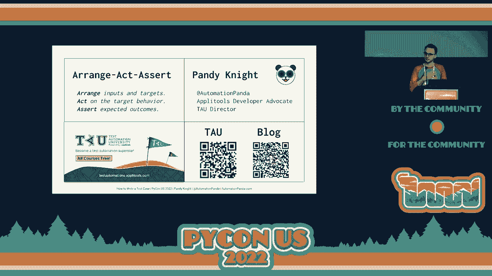

 [ Applause ]， \>\> Excellent。 Thank you so much。 Up next we have Shreya。

 \>\> Thank you。 Hi everyone。 I'm Shreya and I'm a product manager at Microsoft。 Today。 I'm going to talk to you all about computational thinking and the potential effects of incorporating。

 it into school curriculums。 So when I was in the fourth grade， I had to figure out what。 day it would be 100 days from Tuesday。 So to come up with my answer， I wrote on a page。

 the day's Sunday， Monday， Tuesday， Wednesday and so on until I filled a whole sheet of paper。 and then I counted from one to 100。 And I did this about three times because I really。

 really wanted to make sure that I got the right answer。 In contrast， today， if I find myself。 repeating the same task even once， I think to myself， you know， there must be a better， way。

 Like I could probably automate this or something could be different here to make。 this a more streamlined workflow。 But this kind of reasoning can also be classified as。

 pattern recognition and this reasoning should be taught to students in all disciplines across。 all curriculums because it can really change the way we solve and analyze problems。 So what。

 is computational thinking？ The way I like to think about computational thinking is that。 it's computer science concepts at their very core。 So it's the ideas behind inventing effective。

 solutions but with no regards to the syntax or the structure of writing the actual code。 So thinking contains four main components。 Decomposition， pattern recognition， abstraction。

 and algorithm design。 These concepts directly play a role in computer science but they also。 have a lot of value across all other disciplines as well as real world scenarios。 So when each。

 of you got here to this convention center at some point or another， it's probably likely。 that you had to go out of your way to find a room for a talk。 For me to find this room。

 I went through the following steps。 First， I looked around， are there any signs to the。 room and if so perfect， I found it。 And if not， I picked a random direction to walk in and。

 went back to stop one。 And I kept repeating this process over and over again until I found。 the room。 So what I want to explain here is that without even knowing it， without even。

 thinking about it， I was using decomposition for so many different scenarios this weekend。 by calling out my thought process， I can now optimize for better results and also carry。

 over this logic to other aspects of my life。 So you might be thinking now why focus on computational。 thinking， right？ Why don't we just teach everyone how to code especially because we've had really。

 good results with Python which is an excellent introductory language and we've seen how young。 students are able to successfully pick it up。 So I really want to emphasize that my proposition。

 is not that we replace teaching code with teaching computational thinking。 Rather， I feel that。 computational thinking is a really solid precursor before we teach coding。 And I feel like given。

 the educational resource constraints that do exist across the world and they do contribute。 to the barrier in entry when it comes to development， I think computational thinking is a great way。

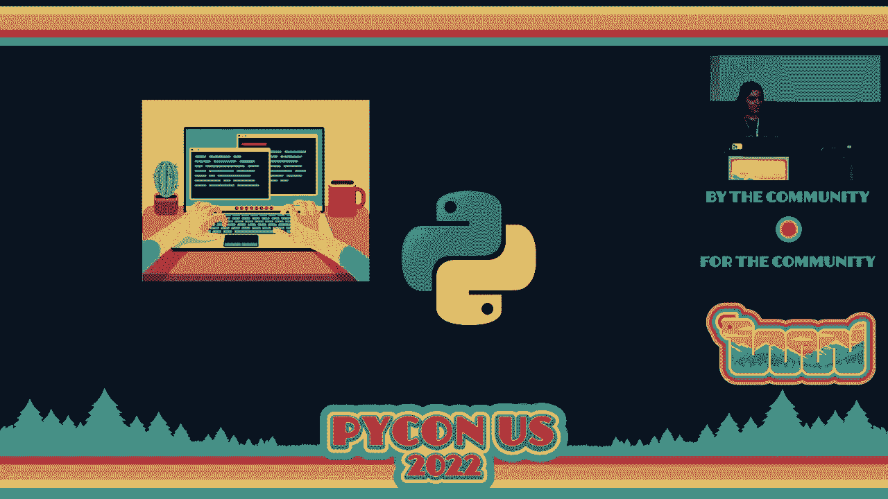

 to start。 Especially because we don't have to make a new class for computational thinking。 So it's not like you're adding a subject to coursework and nothing like that。 It's really。

 actually just adding material to existing curriculums and reframing different conversations。 to make them more computational thinking base。 So when I talked about finding the room earlier。

 this weekend or this week， all of you probably thought， well yeah， I did that too， right？

 I somehow found the rooms that I went to。 And my point is you didn't do anything new because。 I talked about that。 It's just that you looked at it in a different way。 You framed how maybe。

 you see that same problem。 So in that same theme， I feel that computational thinking should。 really lie beneath lesson plans and change the perspective in which the next generations。

 can solve and analyze problems。 As you go on for the rest of the day and perhaps the rest。 of the week， I encourage you to think about what medial tasks that you're completing and。

 what if any component of computational thinking they might fall into。 With that， thank you。
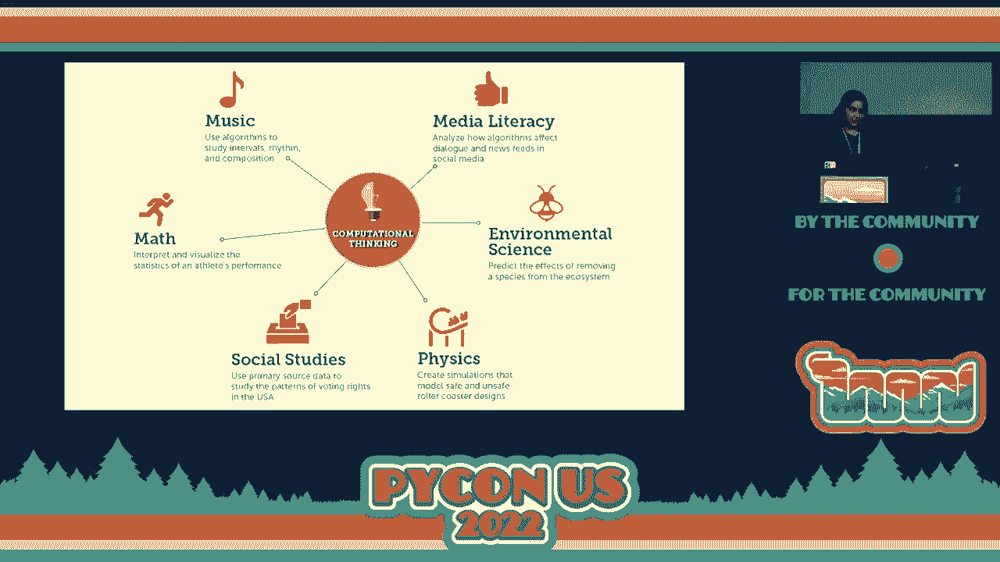

 all so much for listening。 If you want to discuss further or have any questions， please。 feel free to reach out to me。 Thank you。

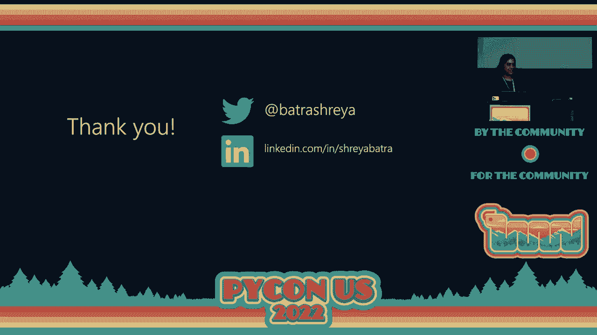

 All right。 Next up， we have Patrick who's going to talk to us about latest。cat。 Okay。

 let's see what it is。 Let's talk about getting around applause。 Hello， everyone。 Today I wanted to show you a tool that's been building for a couple of。

 weeks and I never showed anyone to be honest， but I think it's quite useful。 So my issue。 was that every time I wanted to install the latest version of Python or the latest version， of 3。7。

 I was having to go to Python。org， then try to find it maybe in the homepage， then。 you had to find a couple of steps to go and just find the version and then putting into。

 your favorite tool for installing Python。 So I built this tool that's called latest。cat。 where you can write the software name， which works with a couple of languages at the moment。

 but can improve。 So you type it and then it gives you the， basically a delete version。 for the Python that you want to check and it should work also for 3。6， but that works。

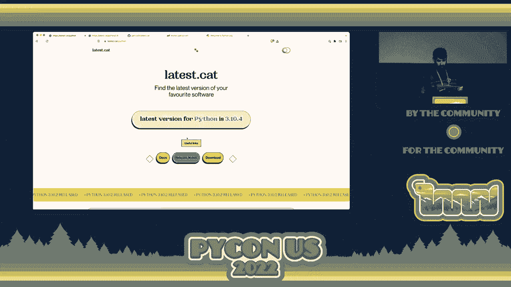

 on command line。 I'm going to show you an example now。 So， you know， make this quick。 demo here that you can use it using Kerbs。 So you can do Kerls-s Python and then it loads。

 the latest by the version。 Also works with other tools like Node。js and it also works。 for some reason with SSH， which I think is quite cool。 It was just fun to do。 There's。

 going to be a demo for that in a second。 This is probably useless， but it was fun to， do。 Yeah。 and hopefully it's going to be useful for any of you。 It's open source so you can。

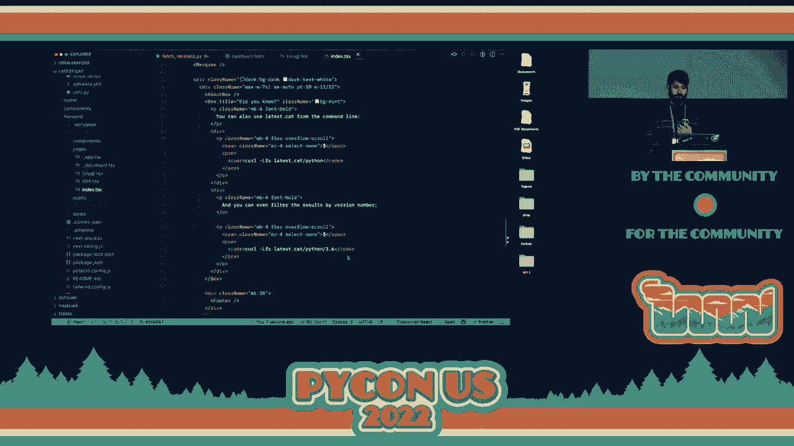

 add additional languages by going here。 Software， software， YAML， it works with Python， PHP， Rust。 and other things。 And yeah， if you need something like this， if you need other tools， you just。

 send a request and happy to merge it。 Yeah， and that's me。 That's not my cat， but this。

 is my cat。 Thank you。 [ Applause ]。

 I am a huge cat person， so that makes me very happy。 Up next we have Ray。

 Hi， I'm Ray from Data Science Rebalanced。 We make data science tutorials to help bridge。 the gap between academia and industry。 Today we'll talk about behavior-driven machine learning。

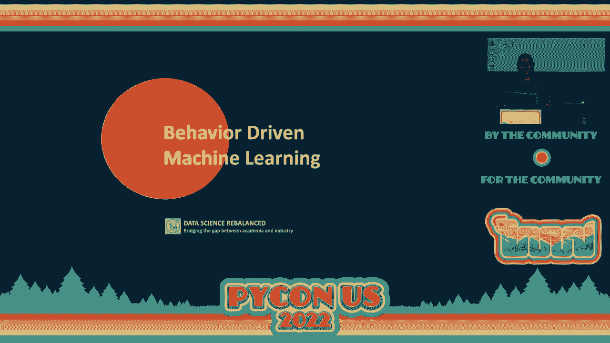

 So let's say you want to build a machine learning model。 You're going to need some data， push。 it through a training pipeline， and ultimately end up with model parameters。 So how was I。

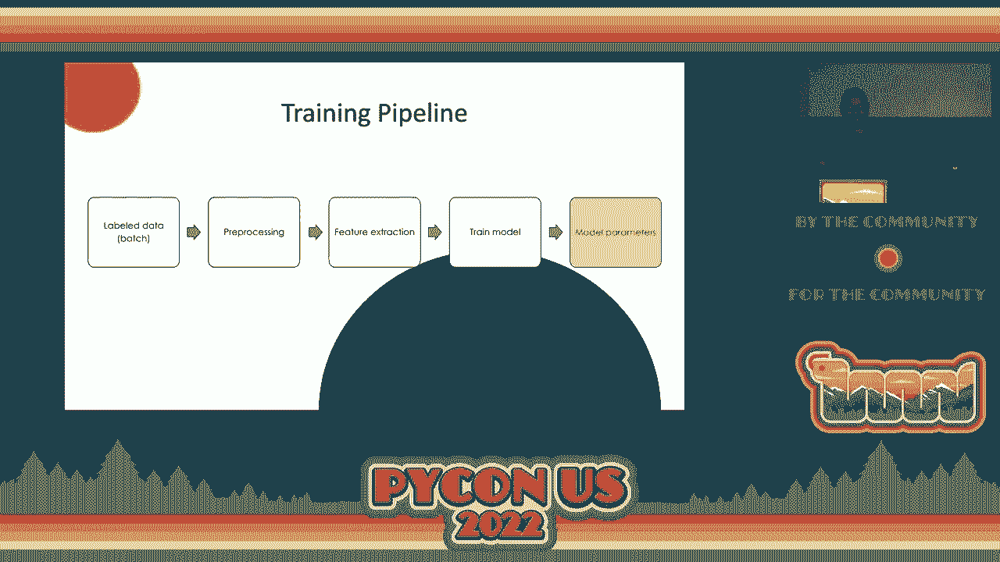

 taught to do this in school？ I was usually given a data set。 Let's call it a binary classification。 The two colors here represent the two classes。 And I would be taught to use all of the data。

 available。 Split it into a train test split。 But not all data is actually equal。 If I look。 at this data set， some of this data is more important than the rest。 This data in particular。

 So how would I do it now that I'm in an industry？ Well。 I would think of my data set as a collection， of behaviors。

 and I want to iteratively find all of the behaviors that are important from， my data set。 If I look at this data set， you might think， well， just take a random sample。

 but there's an issue with random sampling。 It actually can lead to increased bias。 For， example。 if I have a certain portion of my space where there's a dense amount of data， points。

 if I randomly sample， that portion of the space will be overrepresented， therefore， producing bias。 As such， I actually want to take a clustering approach and then randomly， sample， let's say。

 three data points from each one of my clusters。 Represented by the。 three green dots in each cluster here。 Those green dots represent my initial training set。

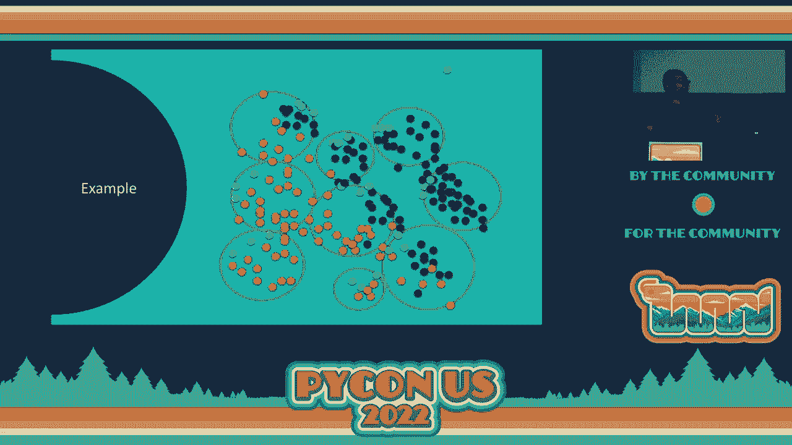

 that I build a model with。 Now， if my model is represented by this red line， my model。

 thinks everything above the line should be a blue dot and everything below it should。 be an orange dot。 But clearly， it's got a few things off。 So how do I correct this？ Well。

 that red line also happens to be the area where my model is confused。 In binary， classification。 this would be a 50% confidence score。 And so I want to select items that are。

 around that 50% confidence score and add them to my original green dot training set。 So。
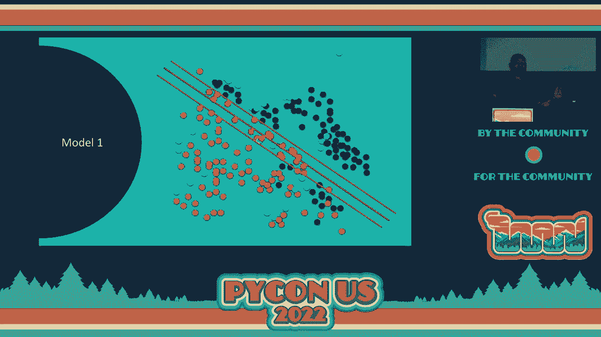

 now I have a larger data set， slightly larger， and I build a new model。 I go from my first。
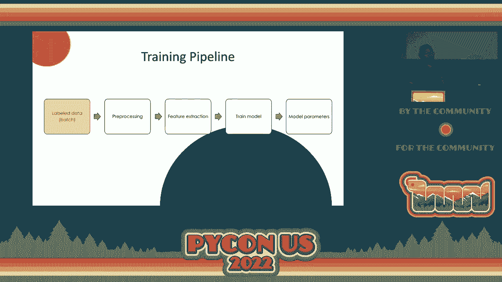

 model to my second model。 That's a little bit better。 But I can repeat this process again。 with my second model， grabbing data points near 50% confidence， slapping them into a training。

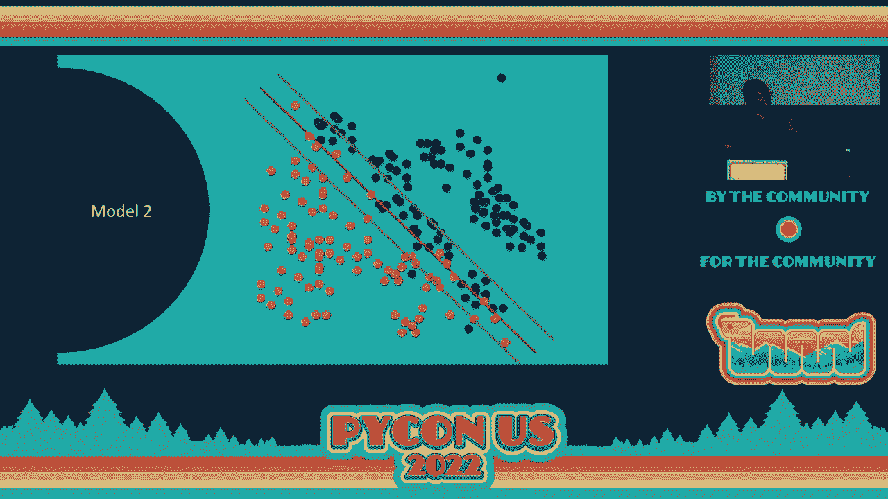

 set and going ahead and going from my second model onto a third model。 But what does this。 actually mean in the real world？ I'm probably going to actually run this process about 100。

 times every time adding extra data onto my data set。 And what each dot represents is。 a newly trained model。 So my performance metric will improve。 And at some point， it。

 will actually top out。 And after that， as I add more data， I'm actually going to get。 worse performing models。 So what does this end up buying us？ A few things。 First， if I。

 have a labeled data set， I can actually build the best model possible， which probably isn't。 the one that uses all of my data。 If I have an unlabeled data set， I can save a lot of。

 time in labeling because I don't need to label the entire data set。 And as we discussed， already。 I can reduce the bias in the model with this approach。 If you're interested in， this topic。

 in academia， it's often referred to as active learning。 There's a wonderful。 book called Human in the Loop Machine Learning by Robert Monarch。 And if you're interested。

 in any other data science content， please reach out to Data Science Rebalanced。 We have。 a link tree。 We teach all kinds of courses on Skillshare and provide medium articles。

 So reach out at any time。 Thank you so much for your time。
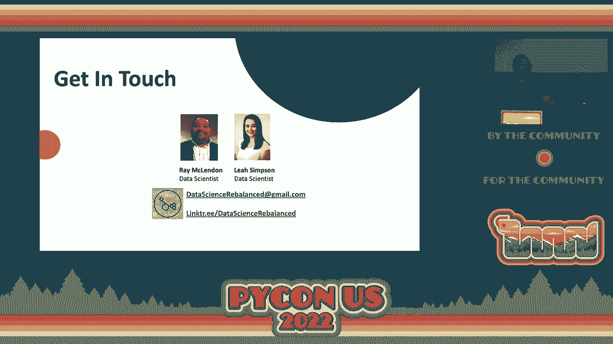

 Awesome。 Thank you， Ray。 And next up， we have a gear who's going to talk to us about reading。

 peps， right？ Oh， I see it now。 Reading peps。 Let's give him a round of applause。 Yeah。 Thank you so much。 And my name is Geir Ani。 I work with real Python， creating content， there。

 And now I want to talk to you about the joy of reading peps。 So I suppose one of。 the things you hear quite early in your Python journey is the PEP8 document。 But the PEP。

 part of this is often not really explained。 So what are these peps？ They are Python enhancement。 proposals。 And these are actually fairly technical documents that are specifications for how。

 Python should work， new features of Python， and also how the process is the governance。 of Python is implemented。 Really technical stuff that really needs to go into the details to。

 show off all kind of edge cases that you have with them。 One of the things I really like。 about reading peps is that they're also historical notes that they show how the language has。

 evolved over time。 They often capture some of the discussions that were made before introducing。 a feature and also some of the decisions and especially also which things were left out。

 of the peps。 It's been available online essentially all the time and it's also on GitHub。 And that's， a nice place to go back and look at history of this。 But in February this year。

 they redesigned， the web page and now launched peps。python。org。 And we can have a quick look at this。 So it's， this very nice page。 And if you just go to peps。

python。org， it comes to the index of all the peps。 And we can kind of scroll down and see that there's a lot of documentation here。 The pep， 8 that you may have heard about is here， the style guide for Python guide。 And this is。

 definitely one of the more readable peps that really goes into some of the more ways that。 we read that we should write Python to make it Python-ic。 What I've also done since I've。

 been reading quite a lot of these when I'm creating tutorials， I've also created a small。 Python package called pep docs。 And this provides the pep command which makes it easier to just。

 download these peps。 So if I go into a terminal like this， I can also just type pep 8 and， we see。 okay， something happened here at least。 So let me just pipe this into less。 And we。

 can see that this is the same document that we saw。 So here we have the same introduction。 of these kind of things。 But now I have it in a terminal so I can start to play with things。

 in the terminal。 Additionally， there's a few more things I can do here。 So if I look at， the help。 we can see that I can also actually open this webpage quite easily just by typing。

 minus w with peps up。 So if I don't want to go to the browser and actually play around， with this。 I can also convert this to markdown。 So the format of peps is that they're in rest， format。

 restricted text。 But sometimes markdown is easier to work with for many tools。 So for， instance。 now I open a different pep。 This is pep 13 about how the language is governed。

 It talks about the steering console which we'll also get to see afterwards。 But I can。 now also then save this to a file。 Now I have it here。 And I can for instance use the nice。

 rich project to just look at this。 Let's see， page usually。 And we have a much more nicely。 formatted markdown here。 So yeah。 Thank you， Rich。 And also I can then use something like。

 let's say pen。 Let's see， we need the markdown。 Pen doc to convert this directly to PDF。 So。 if I now do pep 657， PDF。 I now have， let's see， PDF file of this。 So I can read this nicely。

 like this。 And one of the cool things with the peps is that they have， as I mentioned。 this discussion about how the features are implemented。 So if I go to the motivation。

 I can see why was this feature included。 And some of the more interesting discussions are。 within the rejected ideas what things were not included and why were they rejected from， the peps。

 Okay。 So just to sum up a little bit， peps， they're fantastic to read。 If you。 want to figure out why some features are designed as they are， peps are not tutorials。

 That there are a few exceptions to this。 Peps 636 is a great tutorial on the pattern matching。 thing。 But there are usually better ways if you're looking to learn how to use a feature。

 Then you should go out and look for the tutorials。 But in general， peps are fun to read。 So， yeah。 thank you so much。 And this is me。 Thanks。

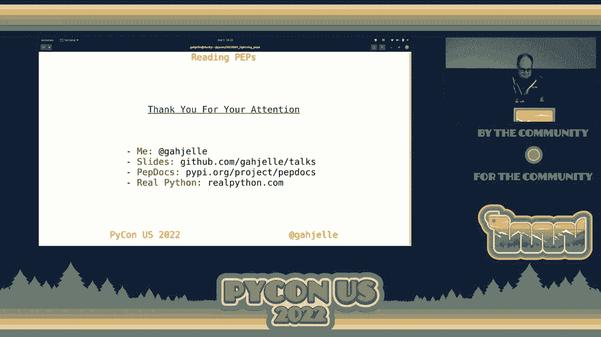

 Awesome。 Thank you so much for that。 Up next we have Jonathan。

 Hello。 So I'm Jonathan。 I like to build fun things。 Not all of those things are useful。 This talk will be about a fun thing。 I don't know if it's going to be useful。 So many of。

 us use pip。 I don't know if everyone knows， but apparently pip is also a back-on-em for。 pip installs packages。 Which got me thinking what exactly is a package？ I mean， we know。

 of source distributions。 We know of wheels。 If we've been around a while， maybe we've。 heard of eggs。 But I was out of talk yesterday， I think。 And they mentioned that you can put。

 a command line tool inside of a package。 And it was a compiled binary。 It was clang format。 So we can put command line tools。 So I thought， well， how about C Python？ Could we put that。

 in a package？ Specifically， could we put that in a wheel？ In which case then pip wouldn't。 be pip install packages。 It would be pip install Python。 So we're going to do a demo。 I want。

 to say that there's no shenanigans here。 This is actually like， okay， there's a little shenanigans。 But only because I didn't want to rely on the conference Wi-Fi。 And nobody wanted to see。

 something download for two minutes。 But you can follow along。 You have to be on Linux。
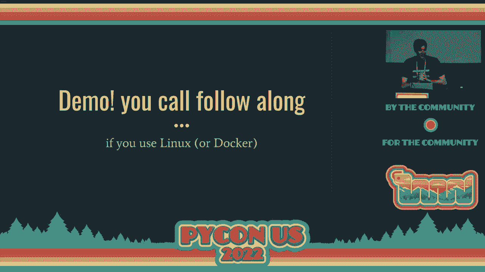

 I just thought of this yesterday， so I didn't have time to build everything。 So let's go。 to a terminal。 So this is the Python 3。7 slim image。 So we have Python。 It's an older version。

 We can't use the walrus operator。 So let's just pip install。 Unfortunately， someone's already。 taken the name C Python。 And Python is like locked。 You can't give it。 So I said， give， me Python。

 give me Python。 And we're going to want a version that is， let's say， compatible， with 3。9。0。 So this is going to be used to cache wheel。 It would download， but it takes。

 like two minutes to download。 So nobody wants to see that。 This is a real wheel。 It's many。 Linux 2014。 It actually passes the many Linux 14 standard。 It's run through audit wheel。 That said。

 it does vendor a whole bunch of shared libraries。 And this could be done for。 other operating systems。 Unfortunately， this is the boring part。 What do we all sit and wait。

 for pip to unzip things and install a whole lot of files？ And we also see that I'm running。 this route。 I'm sorry。 YOLO。 So now， of course， we have Python now 3912。 But we're not going。

 to call it Python 39 because that might shadow your system Python。 So it's going to be gm。 for give me Python 39。 It works。 You can do things it has shared libraries。 So what？ So。

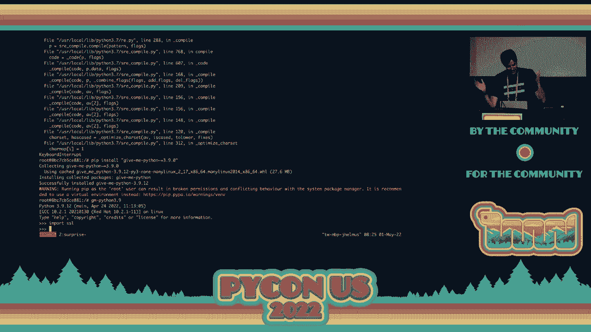

 we installed C Python by pip。 Of course， could we install packages in that pip as well？ Like。 could we do Python inside Python？ So that's right。 So we need to do gm Python。 We're going。

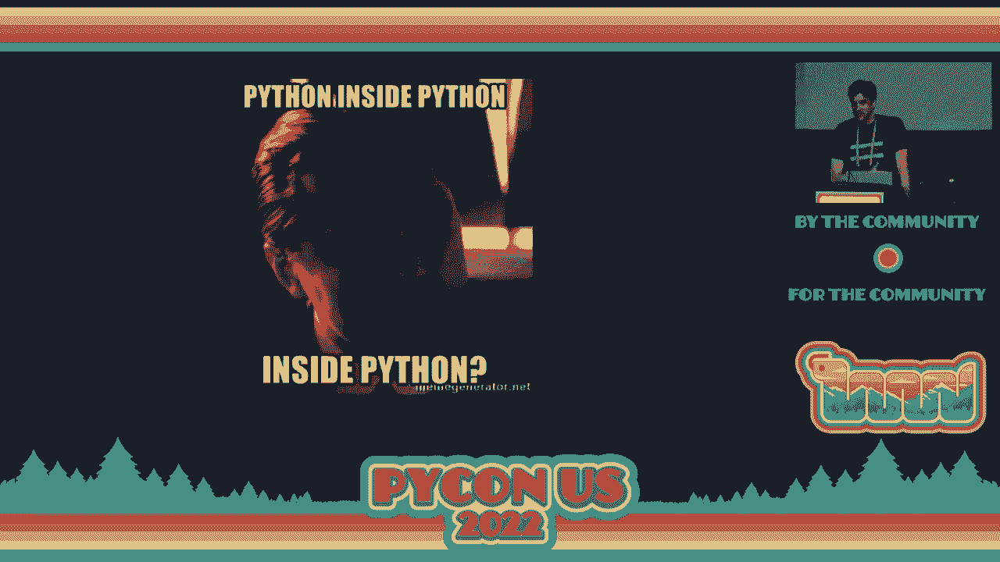

 to run pip and we're going to install give me Python。 So this will work。 It takes a while。 And oh。 I need to say install。 Yes， that would be helpful。 So this will go in fetch Python， 310。

 It's going to take a while。 So I'm going to skip over to this one that already has， this installed。 Unfortunately， you don't get a command line shell。 Because this is inside， another Python。

 it doesn't work。 But we can just run the module。 And now we have free， time。 Thank you。 Oh。 that's it。 All right。 That is awesome。 I'm waiting for the inevitable。

 future when just everything is on pipe。 Yeah， it's going to be great。 All right。 Next up。
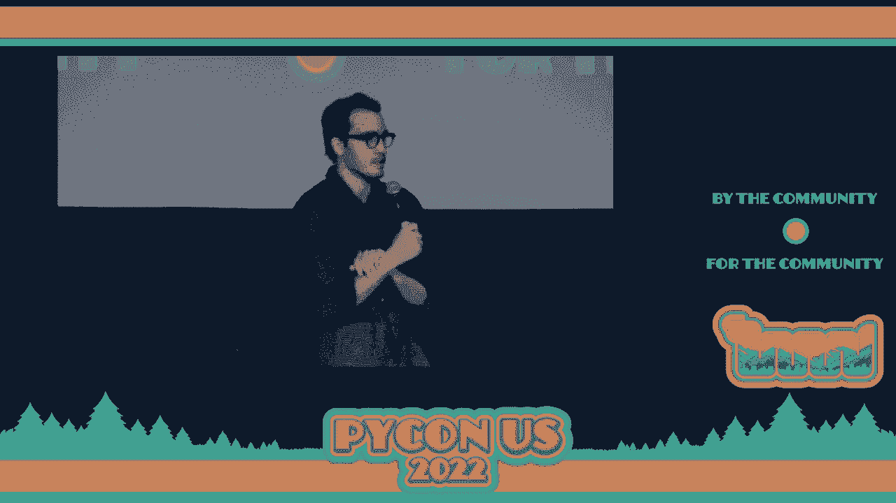

 we have Yella talking to us about PEP 688。 Let's give them a round of applause。 Good morning。 I'm Yella Selsda。 I'm the Python core developer interested in static typing。 And I'm here today。

 to talk about the buffer protocol。 The buffer protocol is a way for type in C to allow access。 to the raw bytes inside the representation。 Like you can use the bytes objects and not， by array。

 but not for example string， which isn't a raw array of bytes under the hood。 But I told you I'm interested in typing。 So when I write a function like this， I want。

 to put type annotations。 And the problem here is I don't have anything to put in this question， box。 There's no way in Python right now to say any buffer type。 So I want to fix that。

 And I wrote a PEP for it， PEP 688。 And the first version that I wrote， which is now up。 on the PEP's website， adds this new buffer type that you can -- that's implemented in， C。

 It has a subclass implementation that just checks whether the buffer protocol is implemented。 So you can check that the bytes are where the object is a buffer。 A non-py array is a buffer。

 A string object is not a buffer。 And it works fine for the function that I showed。 But there's。 a problem。 What if I want something more than just the buffer protocol？ Like I want to also。

 have a buffer that provides a length， which is a pretty common thing to have for a buffer。 because inherently it's a collection of bytes。 So it has a length。 But in a type system， there's。

 no way to say you want both a concrete class like buffer is right now， but also a protocol。 like sized。 So I have another problem。 I still can't write the types that I want to write。

 And I don't know how to fix that yet。 So I'm going to show some ideas。 And I would like。 to hear from people who have feedback on these what they think the right solution is。 The。

 one thing I thought of is to actually make it possible to implement a buffer protocol。 in Python by adding a dunder buffer methods that you could just implement in your own， types too。

 The next thing about is that PyPy actually has the same thing already。 I guess。 they need that because in PyPy everything is Python。 So you have to implement this in， Python。

 Those are nice that it's useful outside of static typing potentially。 But it's also。 a lot more complicated than adding support for typing because it changes the runtime。

 representation of buffer types。 And in the C protocol， there's this slot for releasing， a buffer。 And I don't know how I would represent that in Python。 So it's also a simpler idea。

 You could just add a dunder buffer for these types。 You set it to true if it's a buffer。 And if it's not a buffer， it's not there。 It's a lot simpler。 But it doesn't really feel。

 like other dunder attributes because there's nothing else that really works this way。 It。 also makes it pretty easy for types to rely about being buffers， which I don't like。 So， yeah。

 if you have any feedback on which of those approaches would work well， I'd love， to hear about it。 Come thank me during the rest of the conference or talk about the。

 discussion of Python or just email me。 Thank you。
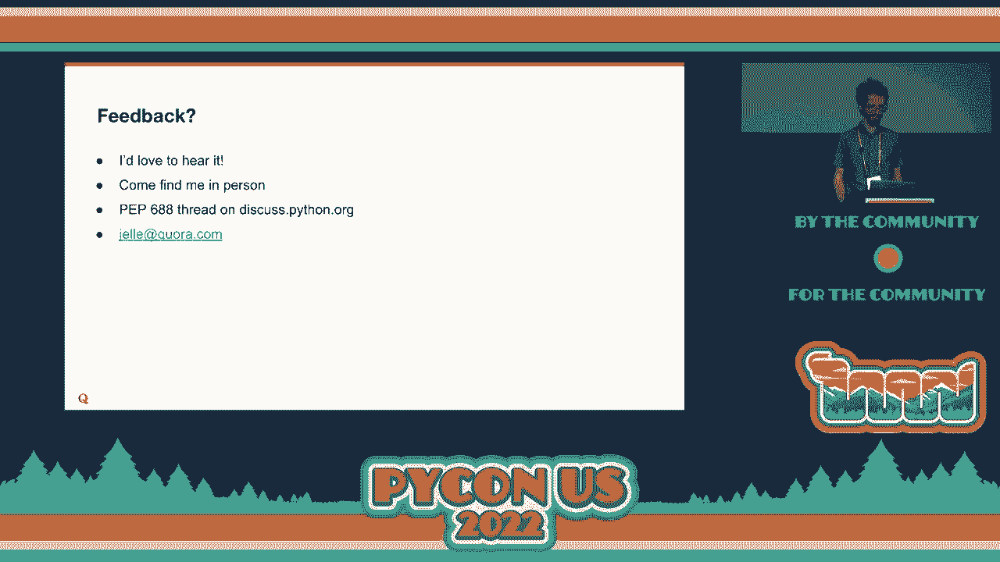

 Excellent。 And up next we have Nick。

 All right。 Good morning， PyCon。 So today I'm going to be talking about post-pandemic meetup。 and an organizer's dilemma。 So my name is Nick Mo。 I am the Clypy meetup organizer。 So that's。

 a Cleveland fight。 Yes， thank you。 Cleveland Python meetup group。 And I work as a data scientist。 at Trimble Transportation。 You can see my little logo at the top left corner。 All right。

 So the last Clypy meetup was two years ago， March 9， 2020。 I have a little picture here。 It was an amazing day， full with pizza， laughs， and so the occasional doesn't really have。

 a dongle here。 That was the occasional thing。 But as you all will know， the pandemic has。 changed everything。 So what has happened since then？ We had to go virtual， right？ And everybody。

 was like virtual meetings。 Oh， yay。 So there was a lot of uncertainty about that。 So how。 did this affect us？ As I said， once we shared the news with the community， they were like， yes。

 meetings， no one said that。 So there was this dilemma of how can we get them engaged， with them？

 So as I said， there was a lot of uncertainty。 Clypy seemed to last people think。 about the pandemic was going on。 There are so many things going。 There was so much uncertainty。

 about what was going on in the world。 Figuring out a way to engage with the community was， tricky。 How did the best way to get them excited about going back to virtual meetings。

 after being in countless meetings at work all day？ Finding people to give talks you would。 think would be easier。 It's a virtual meeting。 Less pressure in person。 No， it's not as easy。

 And overall， personally， for me as one of the core organizers， it was pretty taxing having。 to deal with my life work and worrying about how to get our community back together。 It's。

 still strong。 So how did Clypy fare throughout the pandemic？ Well， I think we crushed it， right？

 We've had 21 very successful virtual meetups since our last in-person meeting。 What。 does it mean for the last two years， 2020， 2021， we've had a virtual meetup every second。

 Monday of the month。 Nonstop。 The community has been amazing and the turnout has been super。 encouraging。 Honestly， there are days where I felt like we had to cancel it because I。

 don't know what to do。 But you can see here a couple of pictures we have here about all。 our virtual meetups。 So it was really encouraging and really wonderful。 I loved it。 So what's the。

 goal for 2022？ In-person Clypy meetups again。 That's the goal for 2022。 And thanks to my， company。 Trimble， they are going to be sponsoring us and giving us a venue and feeding us too。

 So we're really excited about that。 So if you're in Cleveland， please come to Clypy every。 second Monday of the month。 You can see our next one is on May 9th。 So if you're in the。

 Cleveland area， please come by。 You can see that that's our Twitter handle and that's。 my Twitter handle at Spirix on Twitter。 Thank you so much。 Thank you， Clypy。 If you guys。

 are watching this， I love you guys so much。 Thank you， PyCon。 All right。 Have a nice day。
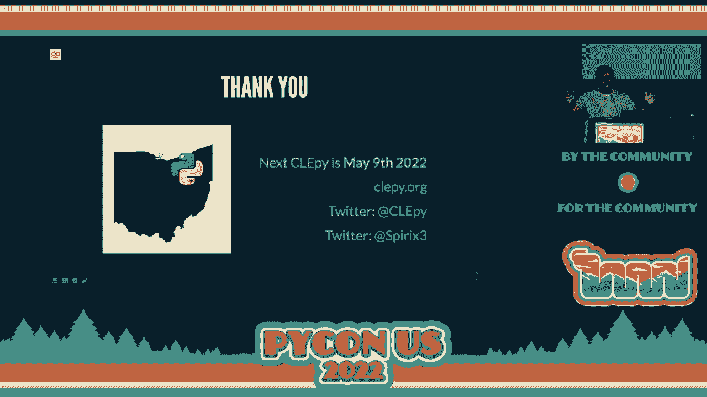

 Awesome。 And next up， we're going to hear from Dustin about what is it going to be about？

 Next up， we have Parade of Regional Conferences。 So I'm going to ask the organizers to come。 over here by the side。 So we're going to go through just some excitingly upcoming recent。

 and regional conferences that are going to be happening in the next year。 So if you like， PyCon。 maybe there's a conference happening near you。 And let's see where's Chuk？ All right。

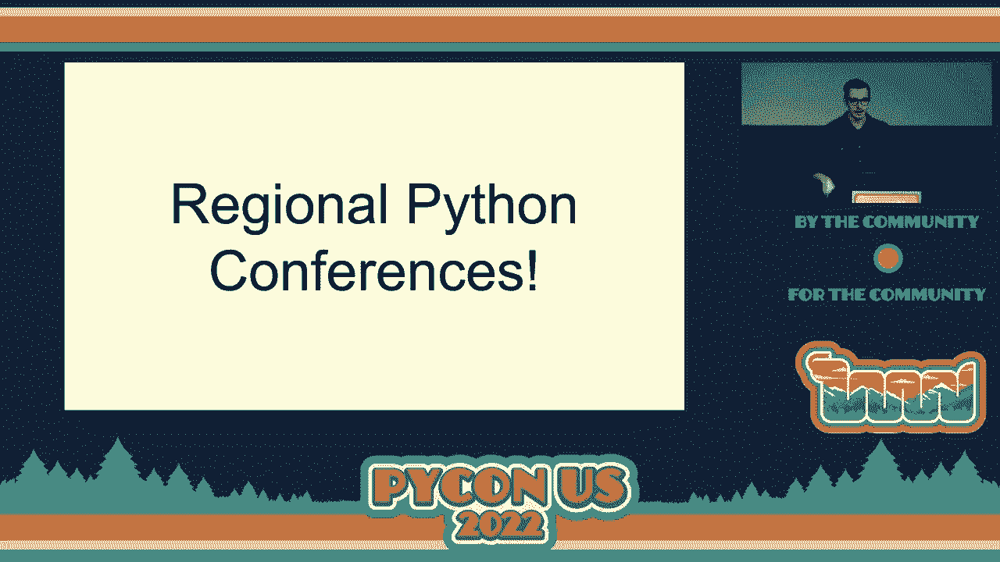

 Let's give all the regional conferences a round of applause and they're going to tell。 you why you should come。 You know， Europe Python。 So yeah， Europe Python is in July。

 I would say that the best PyCon， in Europe will be Europe Python。 The second one will be maybe Python Italy。 So yeah， so。

 it's like very similar format who really enjoy PyCon here this week。 So yeah， first seminar。 we also have tutorial， we have conference talk for three days and then we will have， sprint。

 So also we have Pieday the track for those data folks。 You would find something。 that you like there。 And also we have a lot of Guinness。 I think that would be the main， difference。

 So if you really like PyCon， you really want to have another week-long conference。 at maybe somewhere closer or further， I don't know。 Then yeah， please come。 So yeah。 I think。

 that's it。

 Hi。 My name is Phoebe Polk and I'm here to invite you to join me and many other Python。 people in beautiful Mission Bay， San Francisco on Saturday， September 10th。 It is a one day。

 outdoor Python conference in the park。 Tickets are on sale now at our website， Pieday。com。 Call for proposals are open。 Please submit a talk before June 3rd and I hope to see you。

 again very soon at Pieday。 Thank you。 [Applause]， Hi。 I'm Yoshida。 And I'm Pieday。 We are co-vastier of PyCon JP 2022 from Japan。 PyCon JP is our largest， conference in Japan。

 This year， PyCon JP will be hearing mid-ox over。 SFP application will， be start next Monday。 9th of May。 You can also make a talk online。 The sponsor application， will be start also this month。

 You can appeal to some users with the largest PyCon in Japan。 We will inform you of the latest。 information on our world。 Twitter and Facebook。 Home or information， please visit 2022。pycon。JP。

 Please join us。 [Applause]， Thanks， Dan。 I'm the only one from Taiwan as far as I know in this conference。 If you're， by chance also from Taiwan， please contact me in this last night's conference。 Taiwan。

 is hosting the PyCon JP this year， 2022， September， 3rd and 4th。 It's unfortunately。 a virtual conference because we still have very strict travel restrictions。 Comfort proposal。

 unfortunately has ended。 If you have a road proposal， I hope you get selected。 I don't。 make that decision， so good luck。 Also call for sponsors。 Obviously。

 we are representing the talent group in Asia and， APEC area。 so you have access to the best talent in the world。 Takes a long time。 Now。

 right now it's early bird。 I think there are some late bird and， some corporate selections。 Please come join us online。 Thank you。 [Applause]。

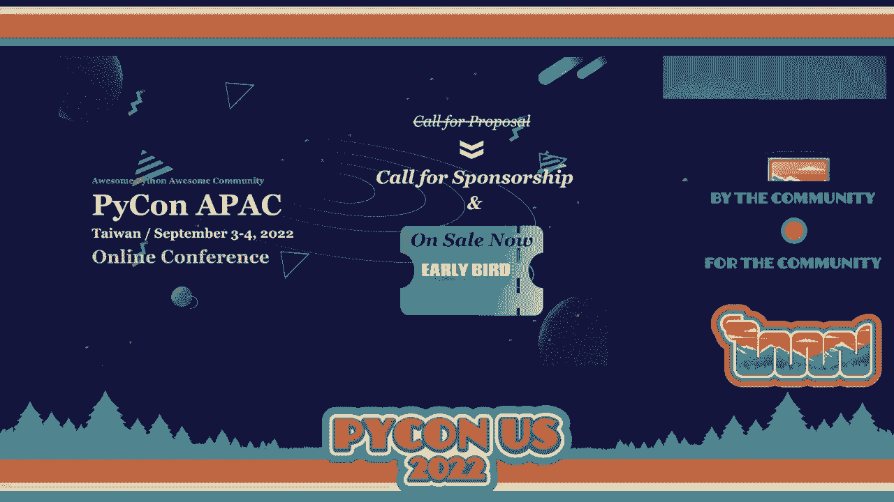

 Hello everyone。 I'm Patrick。 I just wanted to invite you to PyCon JP this is going to be。 next month in Florence。 It's going to be really nice。 We have also key noters。 We have a。

 Python track。 We have a web track and lots of interesting social events。 If you cannot， join。 I know it's in a month， we also have an online version which is going to be free。

 which is probably announced out soon。 Thank you。 Hope to see you。 [Applause]， Good morning。 We are here to invite you to go to Python Brazil this year。 It will be between。

 2017 and 23 October in my house in Amazon， first zone。 We will see talks in Portuguese， and Spanish。 round tables， sprints， tutorial， lightning talks， open space， job fairs。 All。

 activities have signal language during -- have signal language。 It will be online in personal。 events and they use a key space。 We are also going to have the Brazil conference。

 We always have every year during the Python， Brazil。 I would like to invite every pilot to go to。 I hope I can see you there this， year。 Thank you。 [Applause]， [ Applause ]。

