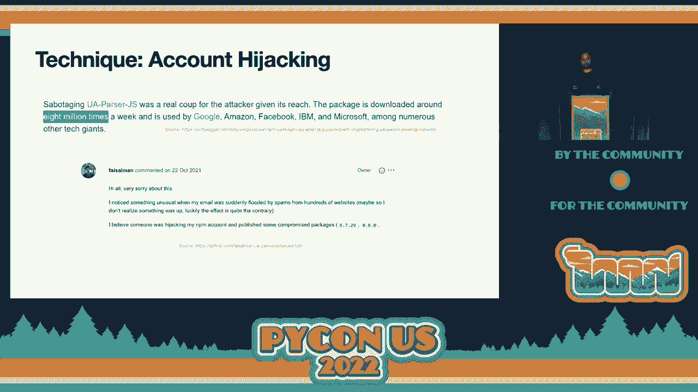
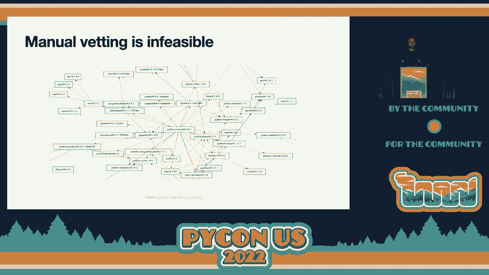
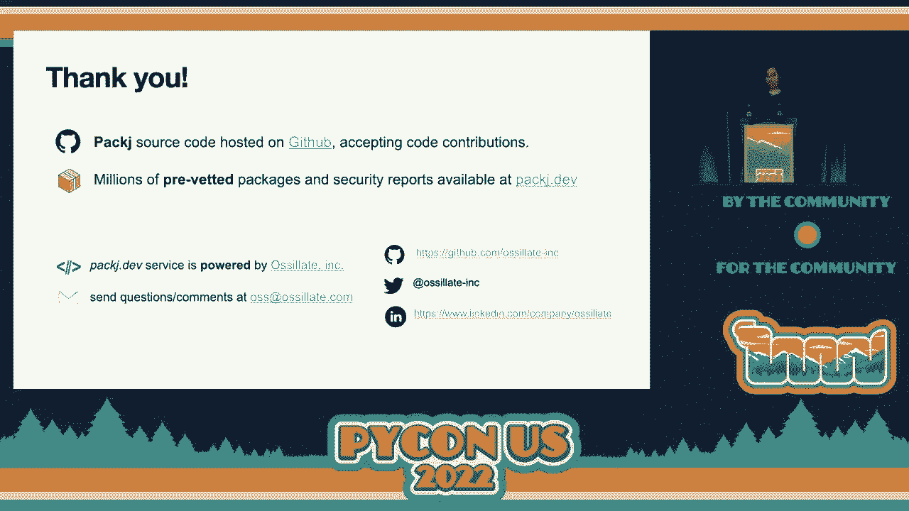

# P18：Talk - Ajinkya Rajput_Ashish Bijlani_Bad actors vs our community_ detecting soft - VikingDen7 - BV1f8411Y7cP

 \>\> Hello， everyone。 Welcome to our next talk， Bad Actors versus our community， detecting。

 software supply chain attacks on the Python ecosystem。 Please welcome Ajish Bizlani。 [Applause] Thank you and welcome。 Thank you for attending my talk。 This is on supply chain， attacks。 So let's get started。 I'm Ajish。 I hold a PhD from Georgia Tech in cybersecurity。 And this is where you can reach me。 I work at Oscillate。 I'm a research scientist and。

 we are developing tools to detect software supply chain attacks。 So open source software。 is the de facto standard way of building digital apps and services today。 Modern open source。 software is distributed as packages on package managers。 Examples of package managers include。 NPM and PIPI。 For example， PIPI hosts over 300，000 Python packages and they receive millions。

 of daily downloads。 So anybody can publish their package on these package managers。 They make。 it super easy。 They ship a command line tool that you can use to publish your package。 Frictionless。 single command publishing。 However， this limited security betting。 What does that mean？ That。 means the software that we use on our server， desktops， laptops， other devices is written。

 by unknown volunteers which we blindly trust。 And bad actors exploit exactly this trust。 And this is evident from several past incidents。 According to recent study， the supply chain。 attacks have tripled in 2021 alone。 And these attacks have been carried out on all ecosystems。 NPM。 PIPI， no ecosystem has been spared。 So what are these supply chain attacks？ So attackers。

 target less secure packages or the weak links in your supply chain and they inject malware。 in the supply chain by publishing malicious packages。 Unlike vulnerabilities， malware is。 intentionally harmful。 It's not an accidental programming bug in a benign code。 It is purposefully。 harmful。 For example， a back door that is installed immediately upon package installation and that。

 steals your SSH keys or Bitcoin wallet addresses。 Such attacks pose direct and dangerous threats。 because the same malware can be adopted by millions of devices。 And yeah， like I said， it has a。 big blast radius。 So what are these techniques？ So attackers used to publish malware。 So one。 such technique is typo squatting。 So under typo squatting， attackers publish packages with similar。

 names to existing popular packages and exploit inexperienced or carelessness of developers to。 supply malware。 For example， a name typo during a package installation can end up in malware。 In the slide here， we have shown a couple of examples。 For example， a color rammer impersonates。 a popular package called rammer。 And if you make a typo， then you can end up installing。

 malware on your machine。 So let's take a case study and let's dive deeper into what these。 malicious packages are。 So let's take MITM proxy to as an example。 It personates a popular。 package called MITM proxy。 As you can see， the project description is exactly the same。 And。 some of the stats are the same as the original package。 So an inexperienced developer may mistake。

 this package as an upgraded version of MITM proxy and download it。 But if you look at the， code。 what this package does is it removes some of the safeguards。 So anyone on the same。 network can execute code on your machine with a single HTTP request。 Social engineering。 is another technique that attackers use to do maintainers and inject malware。 NPM package。

 event stream is a good example。 Here the attacker first gained trust by posing as a benign contributor。 and contributing useful features。 And later he asked to maintain the package event stream。 And after gaining the contributor privileges， the attacker published malicious code that。 searched for bitcoin addresses。 The developer of the package in maintenance mode actually。

 trusted because the attacker was supposedly benign and he contributed popular or good features。 So this package is a good example because it receives millions of weekly downloads。 Another。 technique that attackers use is dependency confusion。 So enterprises use internal mirrors。 of package managers。 For example， there will be an internal mirror of pipeline that is synced。

 with the external package managers as needed。 And the technique exploits the default behavior。 of this artifact to always use the higher version of the package is available externally。 So what can attacker do？ An attacker can go through manifest file available publicly， find。 out what packages are being used for example at Microsoft or other enterprise。 And they can。

 publish higher malicious versions of the same package。 And as a result the artifact will。 now install the external malicious package and the malware will be in their apps and services。 There have also been cases of account hijacking to inject malware in open source packages。

 A popular example is UAParser。js。 It's a JavaScript package with 8 million weekly downloads。 The。

 package is actually used in apps and websites to discover the type of device or browser。 the person is using from user agent data。 The attacker here hijacked the account and published。 malicious version of this popular package。 Let's look at another case study。 So this。 is a Python package that we found and we reported to the pipeline admins in January。 We found。

 that this package downloads a malicious payload from the URL and executes the code by spawning。 subprocesses。 And we saw that the email address on this package was invalid and that's why。 we looked into this and also we analyzed the APIs。 So I'll get to that briefly。 So how。 do we defend against such attacks？ Well security is a shared responsibility and as a community。

 we must all do our part。 For example， maintainers and package managers can adopt two-factor。 authentication to protect against account hijacking。 Package names coping can also reduce the risk。 of type of squatting attacks。 However， these measures fall short because as we have seen。 with the recent protest where a disk-controlled developer can sabotage their own package and。

 inject malware。 So developers must use a zero-trust approach。 They must thoroughly。 vet code and behavior of every package， every dependency they use。 Easier said than done。 This is because manual vetting is infeasible as packages may have hundreds of dependencies。 include direct and transitive。 This slide shows dependency of PyTorch， popular Python package。

 By the way， this graph only shows transitive dependencies that are at a distance of two。 or less from PyTorch。 So as seen from this graph， PyTorch includes several dependencies。

 and manually analyzing each one would be tedious and error-prone。 We can use tools。 However。

 existing tools only report known CVs， publicly known CVs in NVD or other public database。 For example， sneak advisor reports no vulnerability with clearingly malicious packages here。 So this， is an example package， maybe uploaded by a security researcher that says this is an example。 package to demonstrate a malicious code inside and sneak advisor reports no security risks。

 If you delve deeper， you'll see that this package generates and executes malicious code。 at runtime that reads your SSH keys。 How about stats？ Can we rely on stats like GitHub。 downloads or stars or forks？ Well， such stats are attacker-controlled。 Attacker bot can easily。 manipulate downloads or forks。 And more important， there's no verification of package proven。

 and source proven and so it may point to a popular package on GitHub。 For example， this。 slide shows starjacking where an attacker can easily track users by pointing to a popular。 source on GitHub。 So this points to a sample Python project。 It has over 4000 stars and。 over 1500 forks。 No verification， like I said， no verification is done for the source super。

 by package managers。 Therefore， blindly trusting such a vanity stats would be naive。 So package is our solution。 We are developing an automated tool to vet packages that you， adopt。 So we take a zero trust approach。 We vet every API， we vet multiple attributes， of packages。 multiple risky code， as well as metadata attributes。 And we provide actionable， security insights。

 For example， we test for weak links by checking is the package old， or abandoned。 The abandoned packages or old packages may not receive security fixes。 So， they must be avoided。 Does the package read or send your data over the network？ As we have， seen from the example malware。 malicious packages， usually they read files， they try to steal， your sensitive data。

 which will be in file， and they send this to a remote server。 So a。 package that's reading and sending data or remote server is phishing， must be thoroughly， checked。 And finally， is the source repo publicly available？ Because if it is available， we can。 go and check the source code and we be sure that the package indeed contains the code。

 that is displayed on public source repo。 So package is a command line tool。 And you can。 customize it to a threat model。 For example， if you think that two factor authentication。 may not be risky for you， if you perceive as lack of two factor authentication is not risky。 you can turn off that alert and minimize noise。 So how does it work？ We use static analysis。

 Specifically， we look at APIs that are being used by packages。 These APIs are provided。 by the language ecosystem or the operating system。 And malware has to go through these。 APIs if they want to execute any sensitive functionality or get access to any sensitive， data。 For example， if they want to read files， they'll have to call open read/write file system， APIs。

 If they want to send data， they need to call these socket APIs and if they want。 to generate code at runtime， downloading malicious package or malicious payload at runtime and。 execute them， they have to use exact or eval or for。 So we track these APIs and depending。 on your threat model， we provide alerts to you。 We also look at metadata analysis。 For， example。

 we look at a mentor email。 Is it valid or not？ Involent email suggests no factor， authentication。 We check for abandoned packages because they don't receive security fixes。 We check for public source repo for code verification。 And we do some type of scoring。 detection based on name similarity。 So time for some action。 All right。 Let me demo the tool to you。

 So this is the source code。 It's hosted on GitHub， and we'll get to that。 Let's try to get a package here。 Does anybody have a popular， package that they want to get？

 Twisted。 Pwist。 Is that correct？ All right。 Some errors。 Work in front of us。 We are fixing it。 But it did analyze the version。 It found version， 2240。 It checked the author。 It checked the email。 It checked the read me。 The version， is only 19 days old。 The repo is found。 It looks good。 Home page is also found。 It looks， like it's reachable。 No CV is found。 It's good。

 And it downloads the package and it， carried out API analysis by fail。 We can try with some other package。 This will be fixed。 But it did say that one risk found。 So the home page is non-existent。 It looks like。 And， we can check that later。 Let me -- What's that？ \>\> Pip audit。 \>\> Pip audit。 All right。 \>\> Pip audit。 \>\> Okay。 \>\> One page。

 \>\> Pip。 \>\> All right。 So the author is a trail of bits。 32 days old。 Read me。 \>\> Repos found。 Home page also points to the same repo。 No CV is found。 And three risks。 So it generates new code at one time。 Perhaps it's supposed to。 But you can check that by。 going to these -- so no line number was provided for this。 This will be fixed in new versions。

 But it also reads directories and files。 And you can go to these files at these line number。 and test。 And you can see a lot of this is in test suite。 So that can be ignored。 But it's。 good to know what the package is doing。 All right。 So the source code of package is hosted on GitHub under oscillate ink。 And as you can， see。

 it's a standalone command tool to open source software packages for risky attributes。 that make them vulnerable to supply chain attacks。 And like you saw， it takes two arguments。 The name of the registry package manager and the name of the package。 And we have already。 seen the output。 But this only supports Python 2。7 and only tested on Linux。 So it will download。

 package metadata from registry using these APIs。 And also download the package itself。 the tarball from registry using APIs。 And it performs API analysis using static code analysis。 It checks for vulnerabilities using OSB database。 And how do you customize this？ So suppose you。 okay， so we flag inactive or unmaintained packages that no longer receive security fixes。

 But if that's not a problem for you， what you can do is you can go to this file threads。csv。 And you can see that we categorize these attributes in four classes， malicious， suspicious， which。 is potentially malicious， vulnerable to code exploit， includes CVs and a lot of undesirable。 attributes。 So if you don't want alert， some alert because of some attribute， you can comment。

 that out。 For example， undesirable， old package would be undesirable。 And even if that's desirable。 to you， you can comment this out。 And then it will not provide all of them。 All right。 Let's continue。 So with this tool， you can write individual packages by yourself。 But we actually are building a large-scale waiting infrastructure for detecting supply。

 chain attacks on open-source package managers。 And the service that we have created is package。dev。 It's a software service。 It offers better accuracy because we have large data set。 The package。 command line tool will operate only on one package。 We can download millions of packages。 and test them for any supply chain attacks。 So it provides more accuracy。

 So a lot of free reports are available on pre-waded package on the website。 There's also a command。 line。 It's also a CI/CD plugin to audit pull requests。 That's also free。 You'll have to。 create an account for that。 And you can review security reports。 You can endorse and share。 reports as well。 Let me show that to you。 Quickly。 Yeah。 So this is where it's hosted。

 If you go to your own GitHub， it will point， to package。 There's a CI/CD plugin that you can use and audit pull requests。 You can upload， your requirements。txt。 You can search for packages。 And there's a CI/CD。 All right。 Let's， see some of the reports。 So this is a popular Python package。 2。6 million download weekly， download。 As you can see。

 we provide some stats on this。 So we provide code related stats。 Watch the size number of files。 Permissions。 These are important。 So the package would read， files and spawn processes。 These are only two are shown here。 But if you go to code behavior， you'll see a lot of details。 So it will read files。 It will spawn processes。 It will write， the files。

 It generates code dynamically。 And as you can see， this is being done at installation， time。 which is risky。 So you can go to setup。py and you can see that it's reading files。 What's reading read me？ So this is OK。 All right。 What is -- so it has a package in， out to me。 It will mention a number of files that this package has。 And provide some popularity， graph。

 And you can see -- okay。 This feature is coming soon。 But you can see this by 5。30， packages。 Just good。 And this last release was more than 12 months。 So you may want to， check that。 All right。 Let's look at BS4。 This is a type of guard package。 This is installed。 by the developer of BeautifulSoup so that you don't accidentally install a malicious， package。

 So if you go to pipy， you can see that this is a dummy package。 And it's just， a placeholder。 And if you look at code behavior， it uses beautiful so which is the correct。 package is the dependency。 So if you download BS4 by mistake because of -- because of inexperienced。 or you thought that was the correct name， you would get beautiful so for package as dependencies。

 So you are good。 But this is how an attacker can publish a name -- a package with the name。 similar to a popular package name。 And you would end up downloading。 So if you look at。 the number of downloads， this has a huge number of downloads for a dummy package。 And how do。 we know this is a dummy package？ It just took KB。 And there are only three files。 Only one。

 function。 Right？ And one dependency。 So these stats are useful。 PyTorch is another one。 This is also a dummy or placeholder package。 You try to install PyTorch。 All right？ And。 you know that this is a dummy package because just 8。40 bytes。 Three files， seven functions。 All right。 Looks like it provides some good stats。 Let's continue。

 So we did find over 35 malicious packages in January and we reported that to pipy。 This。 is -- these are some of the examples that we found。 Let's look at them。 So if you go to， pipy。net。 you'll see these malicious packages。 Example malicious packages that we reported。 And I think some of them have been taken down now。 So let's inspect this particular package。

 Chris Kean。 So this was uploaded in 2031 September。 And our static analysis module flagged this。 as suspicious because it's trying to -- it's trying to spawn processes。 It's trying to。 download data from network and read file and all at installation time， which is pretty， risky。 So we looked into this and we found that this package is indeed malicious。 I think。

 if you scroll down， you'll see what this package does。 This package will do different things。 for different operating systems。 On Windows， it's -- I think it's trying to override explorer。exe。 On Linux does the same thing。 It doesn't overwrite explorer。exe because there's no -- but it will。 download the payload from this URL。 And it will execute this payload using subprocess。 So。

 we detected this。 All right。 We saw some of the findings。 And this was it。 Thank you so。 much for attending the talk。 The source code of the package is hosted on GitHub and we have。 millions of pre-voted packages， reports available for free at package。f。 And this is powered。 by Ocelight。 Thank you。 [ Applause ]， [ Silence ]。

