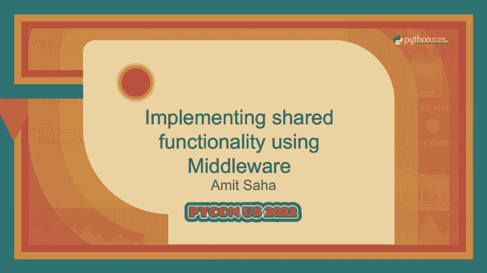
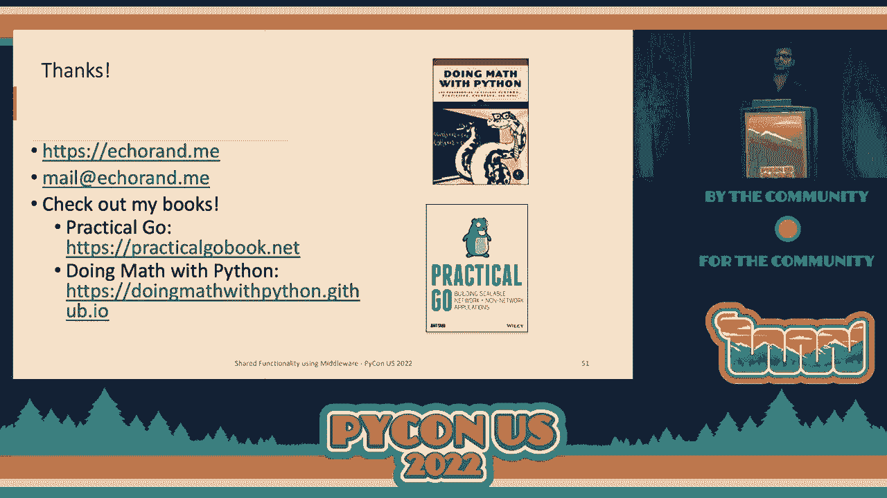

# P19：Talk - Amit Saha_ Implementing shared functionality using Middleware - VikingDen7 - BV1f8411Y7cP

 The previous slide is quite different from what we are going to discuss today。

 Some of the key ideas that I found from back then that really resonated with me and that。

 expresses the essence of what middleware is are terms like glue。

 It's an interface between hardware found above the transport layer but below the application。

 environment。 I can't really express why but somewhere those terms gives me the essence of what we。

 truly use middleware for today。 Of course we are not talking about hardware but generally just as a glue between different。

 parts of our application。 Now for today consider a web application which consists of one or more API endpoints。

 or views。 Where is code you write to implement functionality that is common across one or more of your。

 endpoints or views。 Examples count of page views， centralized error handling。

 caching and many others。 The whiskey specification PEP333 describes middleware as a way to provide extended APIs。

 content transformation， navigation and other useful functions。

 This leads us to our second topic of the talk， middleware for whiskey applications。

 I will start off with discussing flask applications。

 Consider a very simple flask application where we create a blueprint and define a single。

 route which handles all the requests and let's refer to that as the view function。

 Now of course I have omitted bunch of stuff from here because they are not relevant in。

 this context。 To define middleware in flask we use decorators。

 One example for decorators that we use is the before request decorator。

 When you create a function or define a function and decorate it with the before request decorator。

 that function always gets called before your view function gets called when a request has。

 been made to the application。 Similarly， if you want a function to be called after the request has been processed and the。

 response has been generated， you decorate it with the decorator after request。

 Now of course here I have shown the example of blueprint but this equally applies to non-blue。

 print applications as well just to be clear。 A typical example is shown here as a use case for where you might want to use this。

 So let's say you want to print or not necessarily print perhaps record the latency of your page。

 rendering。 So what you do is you would use the flask g global variable to start a timer in the before。

 request function or the function where you decorated with before request and then in the。

 function you decorated with after request you would find the difference between the time。

 now and the time that you recorded at the beginning of the request and that gives you。

 the latency of your page rendering。 So that's marked as an optional because I may not have time for it。

 So if you do check out the slides I think that might give you more insights into how。

 this before request and after request are implemented within flask itself。

 Now it's very common to define not one but multiple such before request sorry not defined。

 Let's let's let's rehouse that。 It's very common to define multiple functions which you declared with before request as well。

 as after request。 Now the ordering matters for the before request functions which I have specified here as before。

 request underscore F1 before request underscore F2 the order in which they are defined is the。

 order in which they are called。 For the after request functions they are called in the reverse order。

 So when the response is generated from the view function the function you defined last。

 gets called first and then subsequently the other functions in a lasting first hour planner。

 Let's consider a Django application now。 This is a simplified view function which I have called index it takes a single parameter。

 request which represents the current request that is being handled。

 Please give this in mind this is going to be our key for the next couple of slides。

 So in Django you can define middleware using two approaches you can define a class or you。

 can define a function。 Now the first example I have here is a class based approach you define a class you define。

 a constructor which takes in a single parameter get response。

 This parameter represents either the next view function or the next middleware to be， called。

 The magic really happens here in the magic method call。

 So what happens here is the first thing notier is the parameter that call takes。

 It takes a parameter request which represents the current request that is being handled and。

 this is exactly what the view function also took in as a parameter。

 Now in the call method is where we implement our middleware。

 Now in this case the middleware we are implementing handles exceptions。

 The desired behavior here is if there is no exception we return the response as it is。

 If however we got an exception we want to return a custom response。

 I have omitted that from here for brevity。 Code is really hard to put on slides in a way that actually it's legible。

 So I have omitted that from here and that's your middleware which is using a class based。

 approach in Django。 A function based middleware looks as shown。 We define a function called。

 you know， of course you can call it exactly what your middleware， does。

 In this case I am calling it as latency_reporter and because I am measuring latency of a request。

 using this middleware。 Now the key here is the latency_reporter function takes in a parameter get response which points。

 to the next middleware or the view function that will be called for the request。

 Now this function returns a closure。 That closure is again taking that parameter request which represents the current request。

 being handled and that is returned and the Django middleware machinery invokes this function。

 whenever a request is being handled。 Now inside the closure what we do is we again start a timer with an assign it to a variable。

 request_begin。 And then we go through， sorry and then we call the view function or the next middleware which。

 is get response and then after we have got the response from that function we can print。

 the latency here in a more practical use case you push the latency to your monitoring system。

 and then return the response from here。 Now once you define your middleware this is how you activate those middleware in Django。

 You update your settings。py and you update the middleware list which is a module level。

 variable to the middleware you want to activate。 The ordering here matters once again。

 So consider that we have a middleware A， B and then we have your application handler or。

 your view function whatever you want to call it has。

 So when a request is being processed like basically when the request is coming into your application。

 first the middleware A is called then your middleware B is called and then finally your。

 view function is called。 Once the response has been generated the response first goes into middleware B and then goes up。

 to middleware A and then finally the client。 One key difference between flask and Django middleware is that in flask your middleware。

 can may not be invoked for both parts of your request that is when for the request as well。

 as response because you control that with the decorators before request and after request。

 In Django it's different。 Your every middleware that you define gets both the request as well as response。

 It depends on your middleware whether you want you can ignore the request or you can ignore。

 the response。 It really depends on what your middleware is trying to do。 To recap。

 using middleware you define custom code to run before and after request processing。

 and how the middleware works is a framework specific detail which you usually can find。

 out by looking at the framework source code。 I did it myself but I have omitted it from today's talk because I will not be able to。

 cut it in the time。 I thought I had a 45 minutes slot initially。

 And yeah and vis-a-vis frameworks define the own mechanism to define the middleware。

 So let's pause a bit。 So as we have seen we write a middleware for Django application and we write a middleware。

 for flask applications and the way we do it is quite different and the reason it's different。

 is because each framework implements their own mechanism。

 Now my question is could you write middleware in a framework independent way？ It turns out we can。

 These are after all vis-a-vis frameworks which means they define vis-a-vis applications and。

 there lies the answer as we shall see next。 So I will take a step back and define what is a function which instantly is a vis-a-vis。

 application。 I knew something like this is how you define a vis-a-vis application but before I did this。

 talk I had no idea。 But this is how a vis-a-vis application looks like and that is it。

 You don't have to do anything else。 So it takes two parameters of a dictionary called envirin and a function start response。

 The dictionary environment contains key value pairs describing the current request and start。

 response is a function which you use to send back the response to the client。

 So the commented lines are where you do your processing in your handler and then when you。

 are ready to send the response you first call the start response with two arguments。

 The first is a string containing the HTTP status and the second is a list of headers that you。

 want to add to the response and then you send back the response itself。

 The response needs to be attribute。 So here it just contains a single byte hello world。

 Let's look at how we can write a vis-gimid layer。 So it looks very similar to the Django middle with certain differences。

 In fact let me go back to this。 If you look at the call method we will ignore the init because it's not relevant here。

 I mean it's quite clear。 I hope what it's doing。 The call method signature and the vis-gimid application signature is exactly the same。

 And what we do here is once again one of my favorite examples it seems like to handle， exceptions。

 So what I do in the call method is I call the self。wisgap attribute which points to the original。

 wisgab application。 If there is no exception the response is returned as returned by the wisgab application。

 itself。 If however there is an exception I call the start response with a 500 status with some。

 custom headers and then I return a custom response which is an error occurred。

 And that's really useful because you hide your internal exception details from your， client。

 You should have a logit which I haven't shown here。

 And how do you integrate the wisgab application with the middleware？ It looks like this。

 You create an object of my exception processor type which is the middleware we defined and。

 you pass in the wisgab application itself and that's your wisgab and you can use a server。

 like junicon app to run it。 And there you go you have your wisgab application running with wisgab。

 I'm going to refer to this as the wrapping technique of defining middleware for wisgab。

 applications。 So let's pause again。 So frameworks implement their own mechanisms to define middleware as we have seen。

 Now wisgab is another wisgab application。 So that means if we implement a functionality using wisgab middleware they are framework。

 independent。 Let's see how they work。 So this is the open telemetry wisgab middleware。

 It's an open source middleware that's available from the open telemetry project。

 It doesn't quite matter so I'm not getting to what open telemetry itself is but this。

 is an example I was familiar with of a wisgab middleware。

 So this is the source code of the middleware and you can see the similarity with the middleware。

 we define here。 It's pretty much the same if you ignore the specific functionality。

 So that's the open telemetry wisgab middleware which is available as a third party package。

 And how can we use that with Flask？ So when you define a Flask app there is an attribute wisgab_app which points to the wisgab application。

 And what you can do here is we set the attribute to an object of the open telemetry middleware。

 type which we create by passing the original wisgab as an argument。

 So this results in the open telemetry middleware wrapping our original wisgab application。

 And that basically gives you the functionality that the open telemetry middleware provides。

 for your Flask application。 Now for Django if you look at the file wisg。

py in your project you will find this code where， there is a top level variable called application and that gets set to the return value of the。

 function get wisgab application and that points to your underlying wisgab application。

 Remember when I said that this framework abstract a lot of these things but somewhere in there。

 there is a wisgab application so this is the wisgab application。

 And the way we use the open telemetry middleware it looks similar to Flask。

 We create an open telemetry middleware object， we pass the original wisgab application and。

 then we update the value of the application which is the module level variable to that。

 object and that's all you need to use wisgab middleware。 So this sounds like a win， right？

 You can write a wisgab middleware and you can use it in a framework independent way。

 Now I'm not sure if there are any pitfalls doing that though I haven't explored it enough。

 but maybe that's something for you to go and explore back home。

 Alright so let's see one last example of how we can use a middleware。

 Consider that you have a Django application and you're moving some of your backends to， Flask。

 What you can do is you can define a middleware which embeds the Flask application within your。

 Django application。 If it sounds like magic that's how it seemed like to me when I actually implemented it。

 So you define a class called， you know you can call it anything really but I have called。

 it Flask app wrapper。 The key again is the special call method。

 So here I call the Flask apps wisgab method first。

 You know I pass the environment and start response exactly how I found it here and I。

 pass it to the Flask app。 If I get a non-404 response I return the data as it is and that indicates to me that request。

 was handled correctly。 If however I get a 404 response I fall back to the Django application and that's one way。

 you can use middleware to help you in migrations perhaps in your project。

 And this is how you use it。 It looks very similar to how you use the open-to-mill to middleware。

 So the result is when you make a request to the polls v2 path the Flask application gets。

 called but when you make a request to the polls path the Django application gets called。

 So to recap Flask and Django implement custom mechanisms to allow users to define middleware。

 However， as you have seen when we define a wiskin middleware they become， they are framework。

 agnostic。 And we use， and we can use the wrapping technique to use this wiskin middleware。 Okay。

 how much are about？ Seven or eight？ So this is going to be like a turbo section I think but let's see。

 So this is an ASCII issue re-application。 And it's similar to what we saw for the wiskin application。

 You define an async function。 It takes three parameters， a scope。

 a function receive and a function send。 So essentially describes the current request like you can think of it as the lifetime of。

 the current request。 The receive function is used to get any request data and then you use the send function to。

 send back any response。 So remember the signature。 That's all that's needed for this section。

 And I'm going to skip over this because we'll cover it here。 Okay。

 Now let's consider a fast API application。 This is how we define a very simple fast API application。

 You create a top level object of fast API type。 We define a root， expensive。

 And it's a super expensive root where we sleep for 10 seconds and then return a response。

 Now let's say I want to write a middleware as a， you know， caching。

 Like I want to cache these expensive results。 I don't want to calculate a result every time。

 So what I do， I define a middleware。 I define a init method。 It takes in two parameters。

 The first parameter is the as the application itself and have a second parameter。 Excluded parts。

 Now this is any custom arguments that your middleware needs to take。

 And we can specify as many as you want here。 I just have one。

 The key here again is the special column method。 It should be an async function。

 It takes in three parameters， scope receives send， exactly like our asgip function here。

 And in this function， we define the logic for the middleware。 If there's a cache it。

 we return the cache response。 If however， we did not get a cache it。

 we call the original app using the original arguments。 Scope receive。

 Cache and send is a wrapper that I created which caches the response and then sends back。

 the response。 You can find these examples in the resources I have shared in my website。

 And so again， you have defined the middleware。 How do you add it？ In fast API。

 it provides a helper method， add middleware。 And you first define the class of the middleware that you want to add。

 And then you specify any additional parameters。 In this case。

 I have got a parameter called excluded parts which is a list of parts I， don't want to cache。

 So chat actually is a WebSocket backend which I have implemented。

 And that brings me nicely to my next slide。 So this middleware actually works very well， you know。

 as for HTTP applications as well， as WebSocket applications。

 And the key to that is because the scope lasts as long as WebSocket connection remains open。

 So when you call this await serve。app， that function doesn't return as long as WebSocket。

 connection remains open。 So I have got some logs down below where you can see that the request lasted for 30 seconds。

 which is how long the WebSocket connection was open for。 I will skip over this。

 You can look at the slides。 So now if you notice， if you compare what the default behavior of the WISG framework。

 and the ASCII framework is， I quite like the default behavior of fast API。

 Because it allows you to define ASCII middleware directly。 In fact。

 that is the first thing they recommend in their documentation。

 They talk about a more specific approach later on in the documentation。

 But I quite like the fact that they allow you to， they ask you to just write a generic。

 ASCII middleware。 Which means if there are other ASCII frameworks。

 you could use the middleware with those as， well。 I quite like that about fast API。

 So the last middleware example you are going to see is how can you embed a WISG application。

 in certain ASCII application。 This is as magical as it gets。

 So what you can do is you define a fast API app and then fast API provides a special middleware。

 called WISG middleware。 You call the mount method and any parts starting with V1 will be passed on to the WISG middleware。

 and hence to the WISG application。 And the result is， I've got a brief example。

 So when you call anything with V1， you get hello world from Flask because that's been processed。

 by Flask。 On the other hand， when you call anything with V2， you get a response from a fast API。

 The WISG middleware implementation， if you look in the starlet source code， looks like， this。

 I'm sure you're beginning to see that pattern now。 So you look at the call method。

 it takes in three parameters and then there's the special。

 WISG responder class which if you go into it defines a WISG method which takes in two。

 parameters which is an environment and start response。 So your WISG application essentially。

 I will skip that。 So key takeaways， middleware can be defined generally as an WISG or as G application or。

 B framework specific。 Middleware is code that's acting as both a client and a server。

 A client for your other middleware or for your views and the server for other middleware。

 or for your original client。 And middleware enables decoupling and sharing of non-functional requirements。

 And it also helps us in migration between application frameworks as well as WISG and， ASG。

 So I have an exercise for you。 Go back， not today， maybe after you've recovered。

 check out the source code for the built-in， middleware and the community-contributed middleware。

 You will easily be able to see the pattern and hopefully the talk has given you enough。

 to really dig deep into those and understand how they work。 So thank you。

 Thanks for choosing my talk over some of the other excellent options and I hope you have。

 gained insights into the internals of the middleware as they apply to WISG and ASG applications。

 and go away with a few new neural pathways formed in your brain。 I have written a few books。

 Those two are my books most proud of， I guess。 Go。 Yes。

 I know it's a Python conference but I'm a Python as well as a Go guy。

 So please check out that book if you're taking your first steps into Go and looking for something。

 practical and doing math at Python I wrote that few years ago but I think it's too relevant。

 So please check it out。 Feel free to contact me with anything related to this talk or anything else really。

 Yeah。 Thank you。

 [applause]， [APPLAUSE]。