# P23：Talk - Benjamin Bariteau_ How We Migrated 3.8 Million Lines of Python 2 Without - VikingDen7 - BV1f8411Y7cP

 All right， excellent。

 All right， and thank you for attending this last presentation of the session。

 We have Benjamin Barretow， Benjamin Barretow giving us a presentation on how he， not we， migrated 3。

8 million lines of Python 2 without interrupting development。 All yours， Benjamin。 Cool， hi。

 I'm Ben Barretow， I'm a software engineer at Yelp。

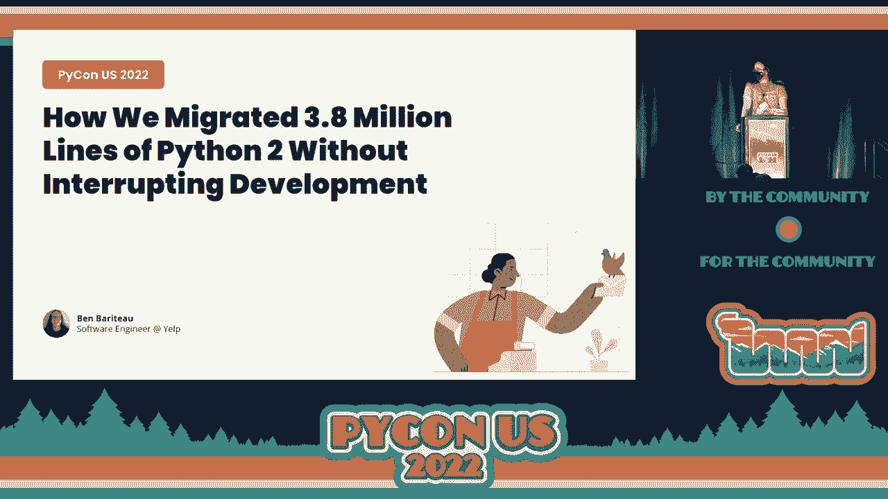

 And we're going to get right into it。 So first a little bit about me。 I grew up in Louisville。

 Kentucky， or Louisville if you're not from there。 And I went to Georgia Tech。

 I was the class of 2014。 I got a Bachelor of Science in Computer Science。

 And I've worked at Yelp since graduating for almost eight years now。

 I work on the core services team， which we do a lot of back-end infrastructure， things。

 like tooling， just test runners， stuff like that。 And we also are specifically on a lot of the Python infrastructure at Yelp。

 That's things like our PI PI servers， a lot of base libraries for doing stuff in Python。

 If you want to contact me， my Twitter is @benbarretow and my github is github。com/benbarretow。

 So first of all， I'm from Yelp and at Yelp， we're all about connecting people to great。

 local businesses。

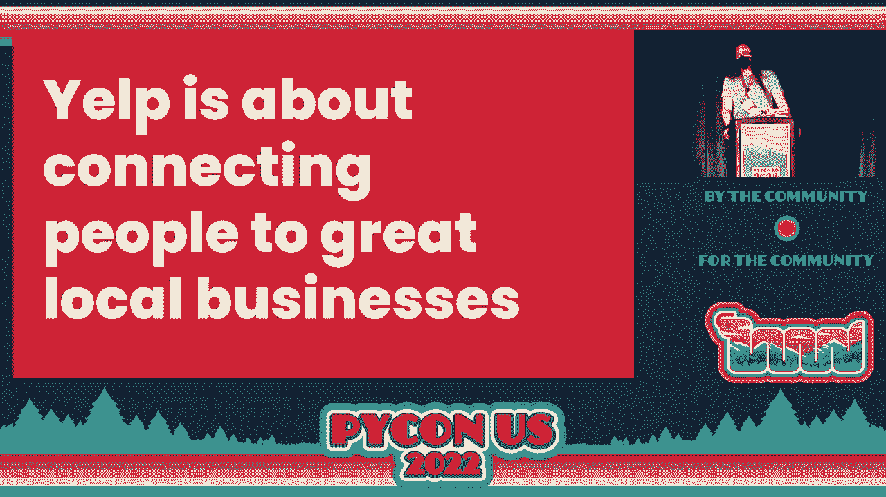

 And to that end， our code needs to work。 So let's talk about Yelp main。

 That's the name of the repo that we're concerned with today。 It's our monolith。

 It was sort of the original code base at Yelp。 We've since moved to a service-oriented architecture。

 but it still exists and still has a ton of， code in it that's really important。

 So where does Yelp main exist in our ecosystem？ This is sort of important to understanding why we need to do this and what it looks like。

 when we're doing this migration。 So this is sort of a flow over request。

 And there's basically two basic ways that it works。 First is we get a request from a user。

 It goes into what we call the routing service， which is a reverse proxy layer。

 That goes into Yelp main。 And Yelp main is responsible then for creating an HTML page。

 It'll get data from its own database。 And maybe it'll call into some independent services。

 things we call back-end services。 And then it will render a full HTML page that will end up being shown to the user。

 And the alternative way， and this is the sort of more modern way that things happen， is。

 request will have the routing service and instead it'll go to what we call front-end， service。

 which is a different service than Yelp main that is responsible for creating， that HTML。

 And then front-end service will call into some back-end services to get data。

 And then it'll probably also call into internal API， which is the part of Yelp main that exposes。

 a RESTful JSON API in order to get the data that's in its database。 So either way you slice it。

 Yelp main is really important to when a user is actually getting， you know web pages from us。

 So let's go a little deeper on to how it's structured。 So first Yelp main has a web server。

 This web server is responsible for serving all of the web traffic that it's responsible， for。

 which is six different sites as we call them。 And so we have www。yelp。com。

 That's sort of our consumer facing website。 If you've ever used Yelp。

 that's probably what you've been looking at。 Biz。yelp。com。

 which is our business owner facing website。 And then as I mentioned， internal API。 And in total。

 these are over 2，000 endpoints。 So it's a ton of logic and code。 In addition to the web server。

 there's also things that we call batches。 These are just background processes。

 They're called batches for kind of historical reasons， but that's the terminology that we， use。

 And we have over 800 individual batches。 And these all run as independent processes。

 So the web server is a single process and then each batch is an individual process。

 And it's used for all sorts of things， but anything that we don't want to do during。

 our web request， things like time intensive reports， date of backfills， maybe things like， billing。

 really anything that you wouldn't be able to complete during the course of a， normal web request。

 So in terms of how we actually develop on Yelp main， we have about 20 to 30 changes per day。

 And it changes just a branch。 So a branch can be huge， it can be small。

 but that's sort of how we measure it。 And we batch up these changes into what we call pushes。

 And so that push or deploy takes about two hours on average。

 That's part of the reason why we batch it is because it takes so long。 So otherwise。

 there just wouldn't be enough hours in the day to push out all the code。

 And about 800 developers are simultaneously working on this。

 And this is part of the reason why there's a lot of techniques in here that you might。

 not necessarily use on a smaller code base。 It really prevents this sort of one big branch type migration。

 And we also have about 700 Python package dependencies in here， which is not definitely。

 not the biggest that you could get， but it's definitely a lot more than your typical Python。

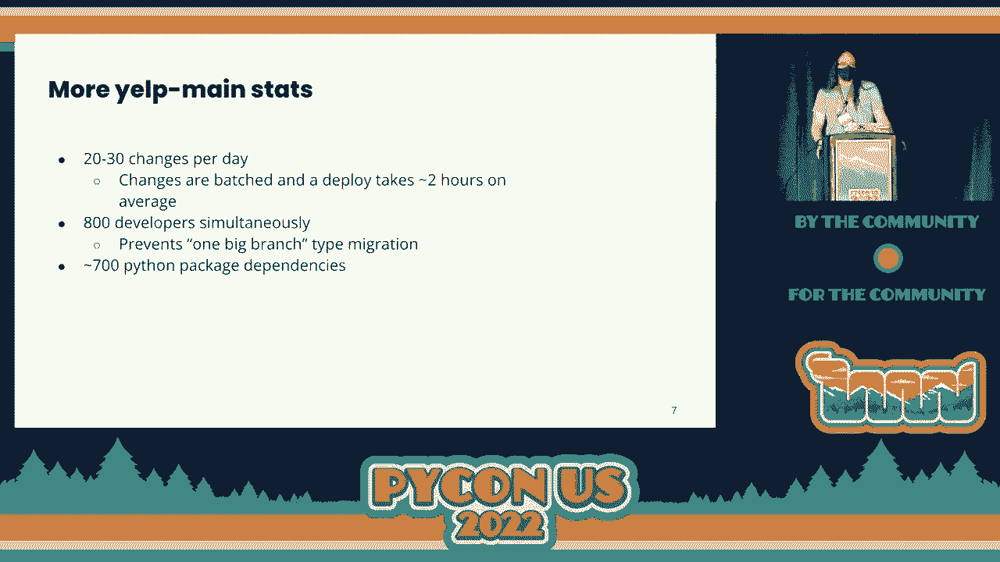

 app。 Also， it's pretty old。 The first commit was in 2004。 And you may or may not remember， hey。

 y'all， was still topping the charts。 It came out in 2003， but it was still out。

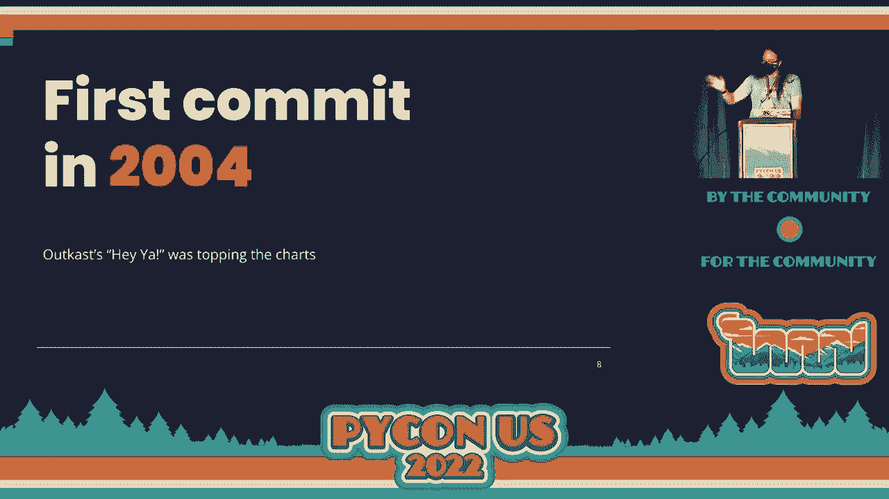

 And as I mentioned in the title， it's 3。8 million Python lines of code。

 There's more of other stuff like JavaScript and CSS， which if you printed that out would。

 be about as long as 63 copies of War and Peace， which is a famously long historical fiction。

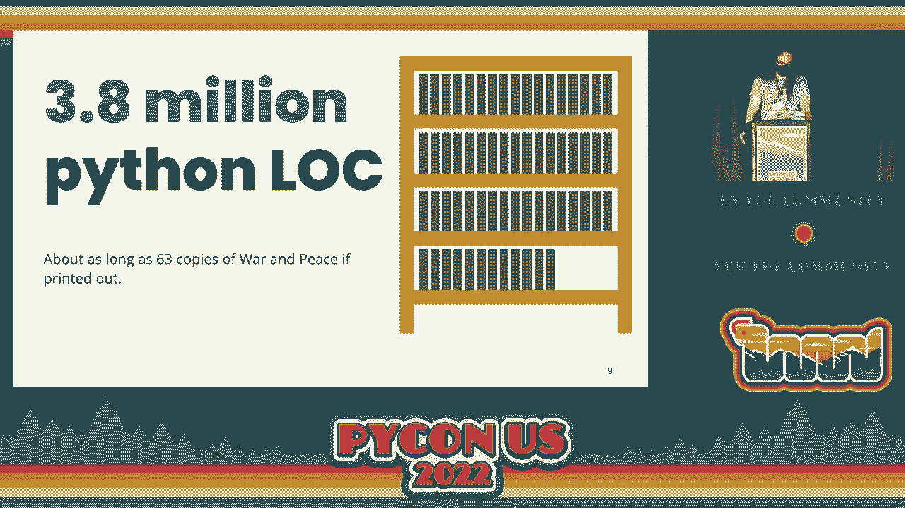

 novel。 And it has about 100，000 tests， which is just kind of an unfathomable number。

 So I figured out， OK， how long does that take to run end to end？ And it takes about 35 hours。

 We don't actually do that。 We have a parallel test runner。

 But that 35 hours in total is about a little over three watches of the extended Lord of。

 the Rings trilogy， which I'm sure some of you have done that before。

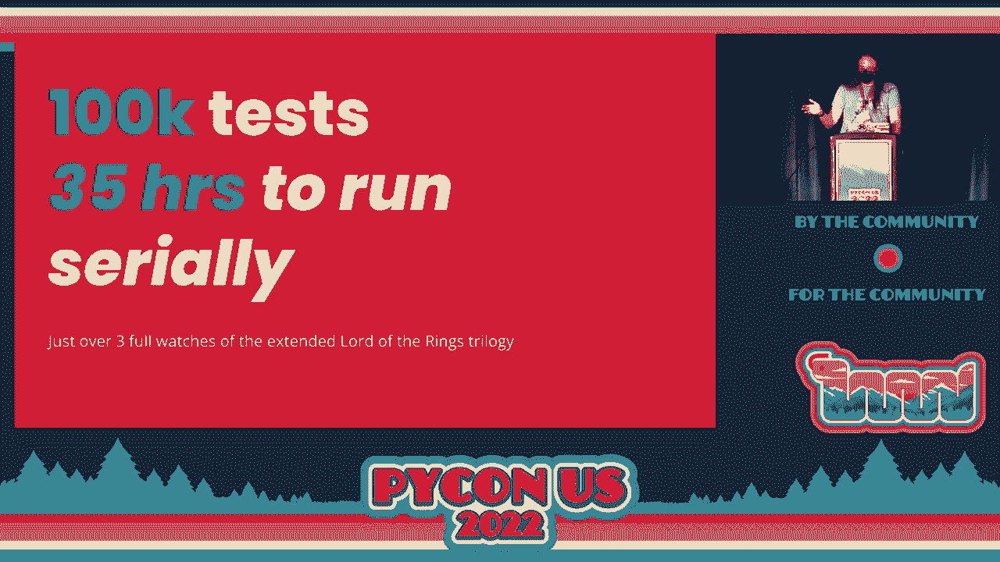

 So definitely a marathon。 You can do that three times。 But this is all really important。

 We have lots of users。 We have lots of people who use this stuff。

 We get about 33 million monthly after users， which is about the total population of Peru。

 So let's talk about the actual migration and sort of what we need to do in order to make。

 this happen。 So why do we do it， first of all？ It's kind of obvious。

 I think to most people why you'd want to do this， but it's worth saying anyway， which。

 is that we knew that important libraries that we used were going to drop Python 2 support。

 things like PyTest and PIP， have already dropped Python 2 support right now。 And also。

 it's really nice to just be able to use the newer language features。

 It's a sort of developer productivity thing。 In terms of what we needed to do in order to make this happen。

 we knew that we couldn't， have normal development stop during this project。 We couldn't just say。

 hey， we're not going to ship any new features。 We're not going to increase revenue。

 That was just not an option。 And also， importantly， in order to make sure this was safe。

 we needed to make sure that， all the changes were rolled back safe。 So we couldn't be like， OK。

 we're going to make this big change。 And if it breaks something， we can't go back。

 We don't want to give them that position。 So let's talk about the different phases of this and what that timeline looked like。

 So first was basically making sure that the code parsed under Python 3。

 That was a really simple task， actually。 There were very few actual changes in that space。

 So it took us about two weeks。 Importability was next。

 This was basically making sure that we could actually import the code under Python 3。

 That seems kind of trivial， but it's actually a good amount of work。

 And it took us about two months。 But the biggest one， by far， is the third phase。

 which is what I call functional parity， which took us about a year。

 And this is basically just making sure that the code works the same。

 I'll go into a lot of details about that later。 And then finally。

 once we actually were confident that our code was working the same under Python， 2 and 3。

 we went to the rollout phase， where we actually rolled it out to production。

 And that took us about two months。 So in terms of actually tracking this work。

 you have to understand what needs to be done， and making sure that people are coordinating and all that stuff。

 So this is sort of what we did for each of those。 This is the parsability， as I mentioned。

 this was a really small part of the task。 And so it was literally like。

 you just try and parse all the files。 You just kind of run Python 3 on it。 Did it parse OK？

 If it didn't make a ticket， that was like a single pass。 For importability。

 what we did is we just imported all the files and then inspected the。

 import error stack trace and looked at what was the last file that's actually in our repo。

 that caused this import error。 And then just sort of pipe that to unique-c and then sort-n。

 And then you get here are your top files that are causing import errors。

 And you just kind of run that script every week or something， file tickets， and then。

 pick up the tickets and fix them。 For the functional parity， most of it was about running tests。

 So we have a test runner already， which groups all of the test failures by traceback。

 And so we basically ran the test periodically。 We basically run it every day。

 And then we would file the tickets of like what was at the top in terms of issues and。

 then pick stuff off of that pool。 So an important tool in this。

 which some of you may or may not be familiar with， is Python， modernize。

 So Python modernize is a great tool。 It's an open source tool that we used。

 which converts Python 2 only code to Python 2 and， 3 compatible code。

 Since we wanted to make sure that this rollout was rollback safe， we needed to make sure that。

 it was compatible。 We couldn't just use 2 to 3。 Even though Python modernize actually uses lib2 to 3。

 It uses a lot of the functionality in lib2 to 3 to get you to that state。

 Some of the 2 to 3 fixes are actually just totally compatible。

 But some of them use 6 as a compatibility layer。 There's actually a similar tool called Python Futurize。

 which uses future。 We were already using 6， so we decided to use modernize instead。

 There's not really a particular reason to use one or the other other than your particular， setup。

 In terms of what it actually does is it fixes some of the syntax changes， it fixes some。

 of the standard lib import changes， and also some of the behavior changes。

 So I'll go through this example that I have on the right in terms of each of the changes。

 So first is in Python 2， you imported the Q object， the Q class from the Q module where。

 it was capital case。 But in Python 3， you import it from the lower case， module name。

 And so you can't really import it from both at the same time， so use this 6 shim to import。

 that class。 The other one is that the values， methods， and the items method and the keys method。

 those， all return iterators instead of lists in Python 3。 So in order to be compatible。

 you have to wrap those in a list， and it does that automatically。 Similarly。

 there was the iter items method， iter values and iter keys， which were removed。

 in Python 3 because they were now redundant。 And so now there's a shim for 6 and automatically replaces the regular method call with that shim。

 And then finally， there's a syntax change which is that you used to be able to raise。

 exceptions like this where you would give the exception class， comma， and then arguments。

 But you can't do that anymore。 So now it just constructs the exception for you。

 So let's talk a little bit about some of the tooling that we used during this migration。

 So one of the things is that we use pre-commit。 Python modernized is actually a pre-commit hook。

 And pre-commit's really nice because it allows us to run all these linters and code mods。

 and make sure that they get run for new branches。 So we made sure that any new code checked in would be run through these code mods so。

 that they were as compatible as possible with Python 3。

 And one of the things that was kind of cool is that we actually added black to this repo。

 during the work on this migration。 And it didn't require any extra dev time。

 It just sort of happened。 And we didn't really think about it。 And it just worked。

 So let's sort of take this piece of code。 I made up this silly piece of code which allows us to sort of go through the phases of this。

 migration and what those look like at each stage。 So first is parsability， as I mentioned。

 So this in this case you basically just run-- we ran Python modernized。

 And this fixed a couple of syntax errors。 As I mentioned， there's the change to the raised syntax。

 There's also a change to the accept syntax。 You used to be able to say accept exception comma and then a variable name that you bind。

 the exception to。 That was removed in Python 3。 So you now have to say as。

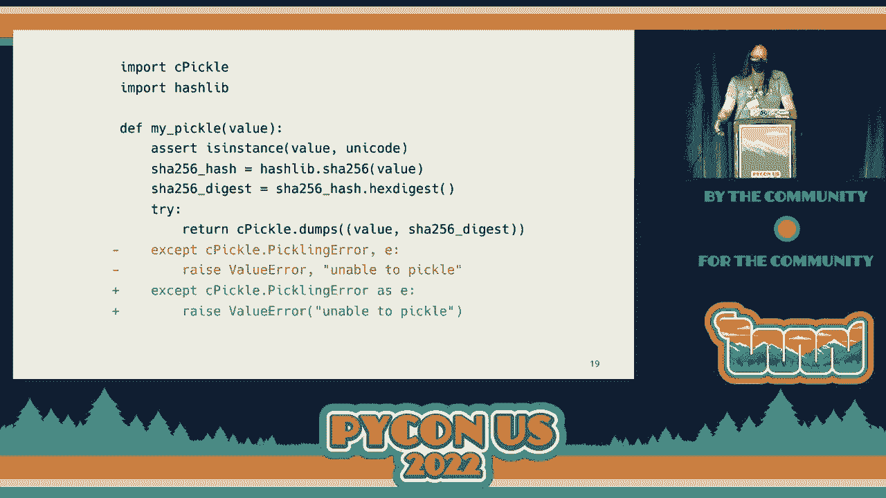

 And Python modernized just fixes this for you。

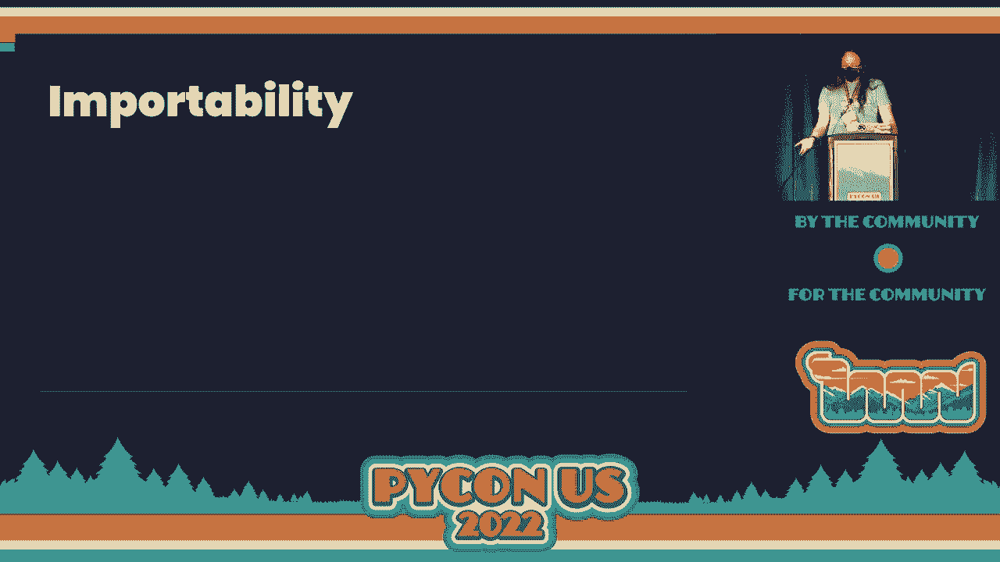

 And that's it。 That's parsability。 So importability is basically-- again， using Python modernized。

 And we did it in chunks mostly for rollback safety。

 We wanted to make sure that our changes were relatively small。

 And then we also had to fix our package importability。

 So a lot of that was sort of upgrading those packages to versions that now had Python 3， support。

 Some of them we had to replace because they never got Python 3 support。

 We usually use some sort of fork or something like that。

 And some of them we just kind of had to refactor away。 They never got Python 3 support。

 And we were like， well， we don't really need these that bad。 We can just refactor it。

 And then we also had our internal packages。 So some of them didn't have Python 3 support yet。

 They just had-- they were too old。 And so we had to upgrade them to have Python 3 support。

 and then bump them in Yalt main。 And mostly that was just running Python modernized on them。

 So now we get this piece of code importable。 And one of the things is that C pickle is removed in Python 3。

 in favor of being merged into the pickle module。 So there's a section for that。

 And Python modernized just fixes that。 And all of the import and all of the references。

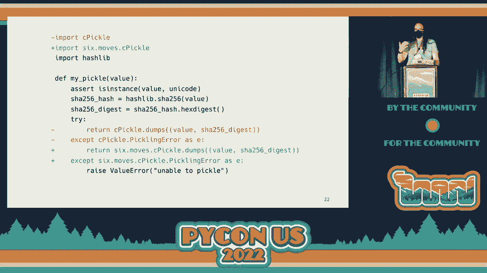

 So functional parity is the next thing。

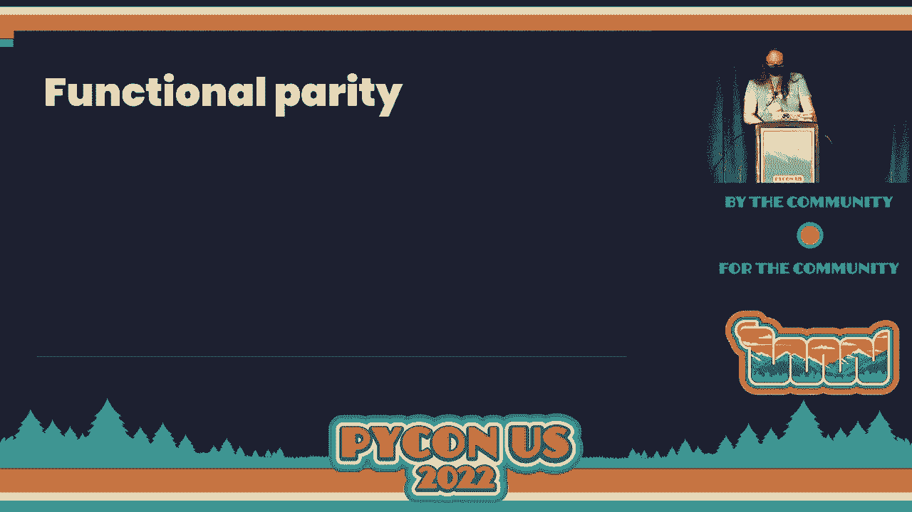

 Functional parity for this was mostly that--， so first of all is we built this parallel virtual amp。

 So we just kind of made a second virtual amp that。

 was Python 3 based that used most of the same packages。

 We have to filter out a few things that were mostly backwards， that you can install in Python 3。

 Things like typing and features were things that we just， didn't need in Python 3。

 And this also led us due development against Python 3。

 So people could use Python 3 to verify their code， was-- would work once we flipped。

 Next we wanted to get our test pass。 As I mentioned， we needed to fix 100，000 tests， which is a ton。

 We still used a lot of Python modernized stuff。 Some of that was automatable。

 As you can see on the right， this is our code again。 And one of the things is that we're。

 using the Unicode built-in in Python 2， which， doesn't exist in Python 3。

 So we used a 6-shim in order to get around that。 And so that was nice。

 But the elephant in the room is always going to be text and bytes。

 And mixing those up was really easy in Python 2。 So we had to fix those in Python 3。

 And mostly that was relying on tests。 There were some other tricky things， things like double。

 under bool versus double under non-zero。 These were in Python 3， double under bool。

 is used for if statement truthiness。 That's how you customize if statement truthiness。

 And in Python 2， it's double under non-zero。 So there were some classes， some custom classes。

 that had double under non-zero defined， but not double under bool。

 And the thing about that is it's confusing， because it just sort of passes the if statement。

 or doesn't pass the if statement when you expect。 So you have to make sure that that you sort of figure out。

 where the actual error is。 And the fix is simple， but actually figuring out。

 where the error is is more difficult。 Similar with meta classes， with meta classes。

 this is actually fixable by Python modernize。 It's just like any time you're using a meta class。

 that uses a shim to make sure that it's working in both Python 2， and Python 3。

 But the behaviors can be confusing。 But our goal was always to have behavior consistency。

 between Python 2 and Python 3， so that we could make sure。

 that everything worked when we rolled forward。 One of the other things we had to deal with。

 was the fact that we had these caches that used pickle。 And if you've ever had to deal with pickle。

 across Python 2 and 3， it doesn't really work super great。 There's a lot of weird gotchas。

 So we just decided that we were just， going to get rid of pickle entirely。

 So what we did is we decided to switch to JSON。 But we didn't want to just completely bust our caches。

 because these caches are important for the performance， of our website。

 So what I did is basically started， logging these JSON encoded values。

 And then we would check the equality of the values， once they were encoded。

 So we basically make sure that the pickle and the JSON。

 encoded cache values ended up being the same。 And once we got those to a working state。

 we would basically switch to what we call the mixed mode。

 where we would try to read the JSON values。 And if that didn't work， we would fall back to pickle。

 read the pickle value， and then we would write back JSON。

 And then any time we were writing a new value， write JSON。 Eventually over time。

 if you wait long enough， you end up with mostly JSON， and you can flip to doing just， JSON only。

 And there were a few things that were really complex， weird， setups that we just couldn't fix。

 And so we ended up just using a cache prefix。 So those things just were different on Python 2 and Python。

 3。 Another thing we had to deal with was context lib nested， which was removed in Python 3。

 This was relatively easy to fix。 It just didn't have an automated fix， which is basically。

 we wrote a function， which used exit stack， to replicate the interface。

 And we used a little bit of said to replace the imports， and the usages。

 Another thing is that you can actually end up--， you may or may not be familiar with--。

 the CMP function that used to be in Python 2's sorted， and list。sort。

 So that was mostly-- that was the key function was added in--。

 I can't remember what version of Python 2， but eventually the CMP function was removed。

 And these just were slightly different ways， of dealing with sorting， deciding how to sort things。

 But it turns out you can actually use both。 There's a shim function for converting a CMP function。

 to a key function in functools， functools CMP， to key， which is really useful。

 But it turns out that sometimes you can use both。 And that wasn't really supported。

 So we wrote this function， which takes both of those functions。

 and converts it into a new key function。 And all it really does is it just calls the CMP to key。

 on the CMP function。 And that calls the key function on the value that's passed in。

 and passes that new value to the CMP to key created function。 Sorry， I should just--。

 So that's-- and that was really useful。

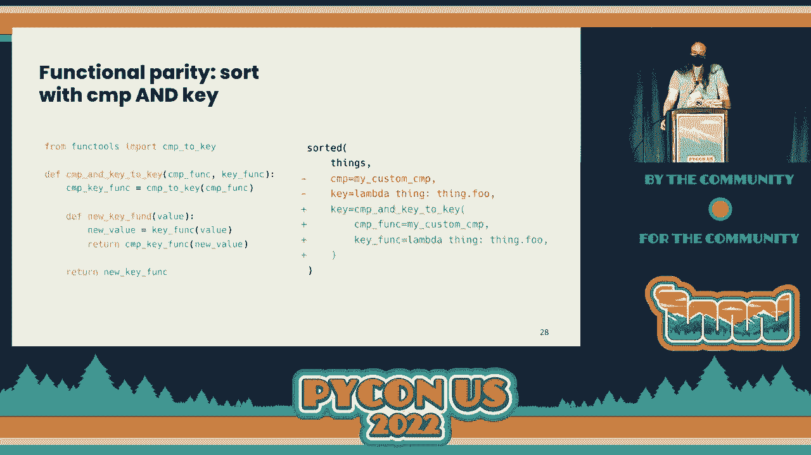

 because there are some situations where that was just really， hard to re-factor。

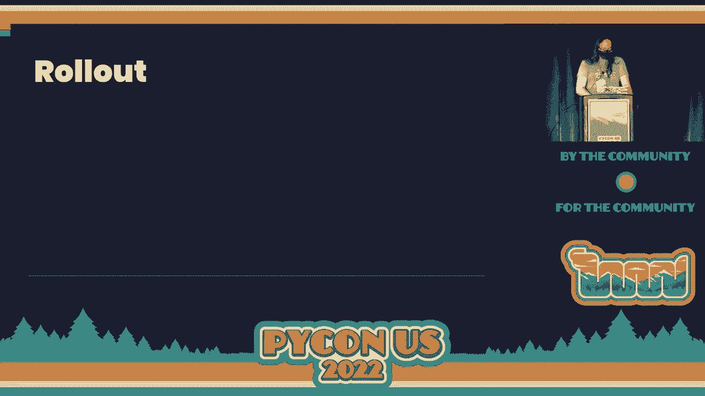

 So roll out。 This is， I think， the coolest part。 This is the part that I found was the most difficult。

 But we came up with us a way of dealing with the situation， that I think is really interesting。

 which is that since we， had these parallel Python 2 and 3 virtual ends。

 we were able to actually run separate instances， some， under Python 2 and under Python 3。

 but running the same code otherwise。 And we would use the reverse proxy layer。

 that we have to basically look at the URL prefix， and go to the Python 3 instance or the Python 2 instance。

 And this allowed us to granularly roll out， individual URL prefixes。

 And it was really great because if we were having errors， with a particular prefix。

 we didn't have to roll back， everything。 We just had to say， oh， that prefix is bad。

 Let's roll it back。 Let's fix the issue and then roll it back forward。

 This was really valuable because some of the errors， were just not caught by tests。

 Our test coverage is OK， but you're， just never going to be 100% perfect in that way。

 So it was really valuable that we were able to do this。

 And we coordinated it using an ownership spreadsheet。

 There were about 800 endpoint prefixes across the six sites。

 And then we did a similar thing for batches。 Since they were individual processes。

 we could actually just flip them to Python 3 independently。

 And we did a similar ownership spreadsheet。 So in terms of the outcomes。

 it was very much a very long tail， especially during the functional parity page。 This is-- or sorry。

 phase。 This is a graph of our test failures over time。 So we started out really high test failure。

 or sort of passing percentage。 We started out really low passing percentage。

 but we quickly got up to very， very high。 But the last few percentage points took a lot longer。

 because we were doing less impactful fixes each time。

 Type annotations would have been really useful。 We thought about adding type annotations。

 before this project， but we decided， that was a huge project in itself。 So we didn't do it。

 But it would have been exceptionally useful， especially for the text and bytes issues。

 The rollout did take longer than expected。 We were originally scoping for a month。

 Part of that was that we were blocked by teams， doing verification。

 And that was kind of our fault for not really， notifying them earlier。

 Because of this sort of-- this curve， we didn't really know exactly when we'd be done。

 So we just kind of like were like， oh， we're close to done。

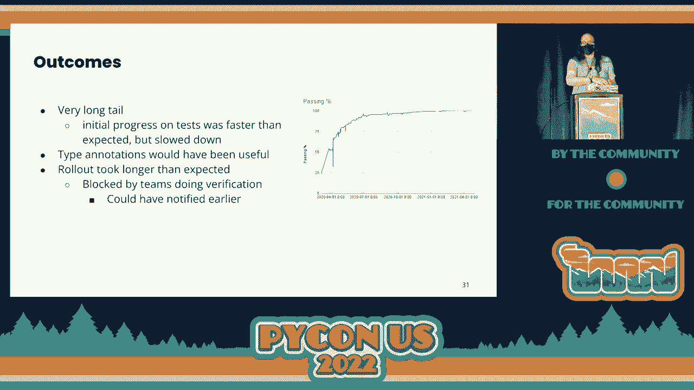

 Let's let people know。 But that was a little bit too late。 In the end。

 we ended up with about a 15% to 20% speedup， which is great。 We were not going for that at all。

 We just wanted to get our code working on a newer version， of Python， but it was faster。

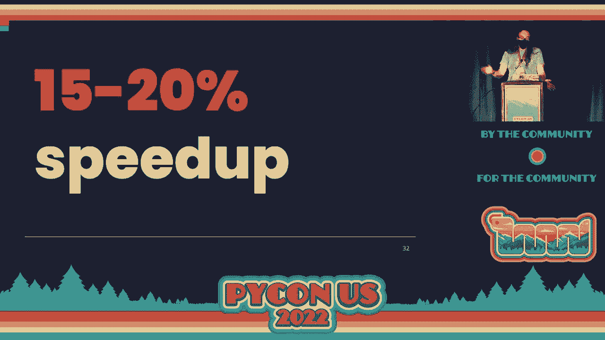

 It was great。 Plus， we used about 26% less memory。

 I think both of these really show that this type of basic sort。

 of maintenance can really have an effect on your bottom line。

 And it's really valuable to do it for reasons like this。 In terms of the future。

 what we're doing right now， is we're automating minor Python version bumps。

 We're trying to leverage the existing tool that we already， have， which is used to bump packages。

 We basically use PIP tools to do targeted upgrades， and then run tests to ensure functional parity。

 And this is actually running--， it's one of our internal tools。 And it's actually running right now。

 And we can do these upgrades where， we go from to newer minor Python versions。 It's really great。

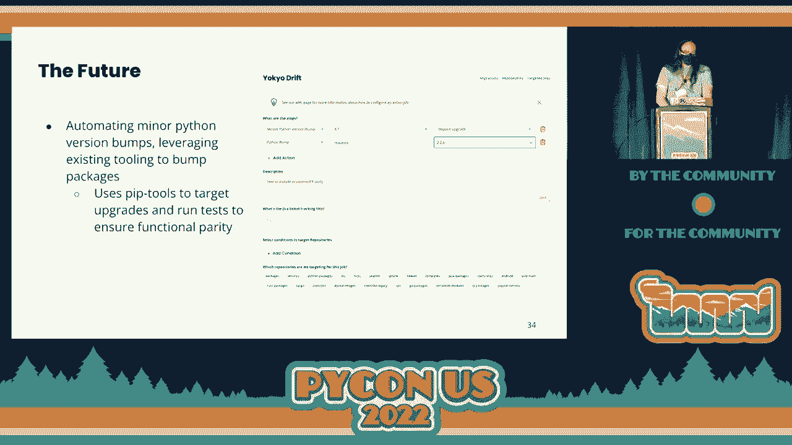

 So that's it。 I know that there's no official Q&A， but I'm not doing anything after this。

 So if you want to ask me any questions， I'm happy to do it in the hallway。 [APPLAUSE]。

