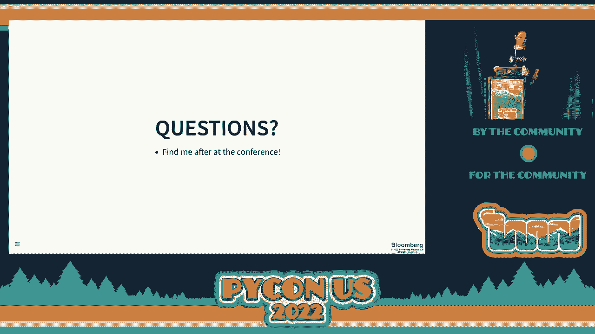

# P24：Talk - Bernát Gábor_ How we standardized editable installs   PEP 660 vs  PEP 662 - VikingDen7 - BV1f8411Y7cP

 Okay， up next we have Bernat Gabor with how we standardize editable installs， PEP660 versus。

 PEP662。 [applause]， \>\> Thank you， thank you all。 Let me start with saying that I appreciate your presence here。

 I know that this is not a light topic for anyone as Peter put it this morning。

 This is probably the place where everyone gets upset eventually。

 I'm here today to hopefully help you a bit with that。

 My goal here is today for you to actually have a better insight on how some of the packaging， works。

 Hopefully if you run in some of those annoyance that you understand enough of how the system。

 works that you can figure out what the problem and hopefully fix it with less annoyance at。

 the end of the day。 Let me start with introducing myself。 Who am I？

 I'm a software engineer at Bloomberg。 I work in a team that primarily focuses on quality control inside data ingestion pipelines。

 But more importantly for this talk， I'm an open source contributor。

 Primarily I'm a member of the Python package and go through it。

 I maintain the virtual and build PPCS and talks projects which are more popular ones。

 Also I'm the parent of two York charteriors and I'll employ their presence at least in。

 the style virtually to hopefully give you a bit of relief for the dense subject of packaging。

 Now let's start with what is the end of the installation。

 But before we can actually understand how we did standard at it installations， we have。

 to understand how things work in the past， then where we ended up today only then to realize。

 what we proposed and where the future is heading。 I hope you're all eager to find out more about how edit the blin cells works in the past。

 And for that we first need a very quick demo project。

 Here is a quick demo project for your amusement。 You can see it very simple。

 It doesn't do very much。 It literally just had a simple say hi method or function and you can call that and call。

 it you're going to say hey， it works or not。 Now if you just create this source directory and start up your Python interpreter and pass。

 in your testing code basically calling the method， you'll see that it's not working and。

 the reason for that it's not working is to actually test the library you first need to， install it。

 So let's do that quickly。 Hopefully you're using virtual environment for this and not installing in your global。

 Python interpreter because that's the surest way to eventually have a bad day。

 And as we know packaging is already a bad experience you want to avoid getting there， quicker。

 Now so usually what you're going to do it if you have a virtual environment you're going。

 to use PIP to actually install your packaging to it and I know that I'm not sure how much。

 they show up especially in the back but in the first slide there was a link to it so you。

 can check it out later what not。 I'm going to highlight the part that are more important。

 Here basically the only thing you really need to know that I installed the project after。

 I installed the project now if I run the interpreter again with my test code you can see that hey。

 it's work now I can test my code greatly。 But you can see I kind of like made a bit of a mistake here because I said hello and I。

 actually didn't put an exclamation mark and if you're one of these grammar nets you're。

 probably screaming at me already。 But let me figure that quickly I'm going to quickly put an exclamation mark in it。

 I run again my test code and nothing changed it the same thing and you might be aware of。

 the reason for details that whenever you change a code to actually test your library you have。

 to install it again and only then you're going to see that hey now you have the new change。

 Obviously installing your project or reinstalling your project after every change is not a good。

 day for anyone so there must be a better solution than basically whenever you change。

 the code install the project again and the solution that we're looking for is editable。

 installations。 Editable installations are basically a way of installation which allows you to install。

 your project which allows you to test your project without needing to reinstall your。

 project between code changes。 Now you still need to restart your interpreter to pick up code changes however importantly。

 you don't have to reinstall it。 Now the way this is strictly used to go it was PIP exposes an editable installation mode。

 and it was exposed during this dash E flag。 So if you pass to PIP this dash E flag it's not a special type of installation in which。

 once you run it you don't have to reinstall it after every code change it automatically。

 picks up the new information that you put in your business。 Now let's dive dripper。

 Let's check out how actually those editable installation works in the past what happened。

 a year ago or potentially even today if you're using setup tools when you actually type dash。

 E to PIP。 And what happens is basically it inherits a solution that was introduced back in like。

 2003 or what not by these two tiers and then iterated by setup tools and the solution is。

 essentially calling the Python setup。py develop comment that magically makes your project。

 source directory be present inside the Python interpreters import resolution system。

 Let's check out what it means to install your project let's find out how a normal installation。

 works so we can kind of like identify what are the differences from an editable installation。

 point of view。 And the way a normal installation works is that PIP will take a look at your source directory。

 will build the wheel from it and then if we install that wheel into your site packages。

 in your Python interpreter。 Now when it builds this wheel this will have two kind of information it will have the actual。

 business logic for example here you can still like the demo need that by your business logic。

 and then it's going to also have generate some kind of package metadata and this is。

 basically information that before building your wheel was stored inside like your pipe。

 project or something like that。 Now if you look further the next step as I said after it creates a wheel it will actually。

 extract that wheel into your Python interpreter and that extraction basically means that it's。

 going to take your wheel and extract the content of the wheel first inside the Python site packages。

 folder and also generates the binary completions for those files that it is extracted for the。

 Python files but also enrich a bit the metadata that was available in the wheel basically just。

 provide additional information that's useful for the installer in this case PIP to find。

 out how it can uninstall the project and all that kind of stuff or even just for example。

 the installer is there just to point out that if you have another installer then PIP can kind。

 of like get to know hey I shouldn't touch this because it's not my package I don't know。

 how to handle it。 Now the difference whenever we're talking about editable installation is that what actually。

 happened in the past as you can see here basically I'm doing highlighted on the output of the。

 PIP install it doesn't do any of this wheel building magic what not it just run setup type。

 I develop onto your project source directory and then that invocation somehow makes the magic。

 happen and when I say it makes the magic happen what the magic is actually it generates。

 your project metadata in line inside your source directory so that's why if you install。

 a project in editable install or you use to install it there was this magical egg info。

 folder in your folder because it still needs the project metadata and this project metadata。

 now is stored within your project's directory and then it uses a system called pth files。

 and it adds this pth file your site packages and what you need to do know about the pth。

 files that whenever you add a pth file to your site packages folder that basically just gets。

 picked up at the interpreter start up and gets added to the still。pad if it's a pad if。

 it's Python code in it it will actually run the Python code。

 So for example in this case you can see once I run setup by develop it generates that egg。

 info folder but also takes the source my project source directory and inject it via。

 the pth file onto the still。pad with them from there the Python in for system takes it。

 away and makes things work。 So you can see this was the old solution and you might ask why isn't this enough this。

 all we need do we need anything more complicated like maybe you already saw this problem and。

 I'm here to tell you that no this is actually not the full solution this is a partial solution。

 problem one of the problems is that it still require the setup。py file and the setup。py。

 file is basically some set of these two tiers are correct thing and for example we have。

 a lot of fancy new back end like fleet poetry or a hatchling and all this still need to。

 generally set up the pipe they want to develop and edit the installation mode。

 It is not a good so we should have a better solution also another problem is that and。

 it's kind of like it's raised back what actually we want to solve here the key we as a community。

 never really got together and agreed what is an edit the installation other than the broad。

 definition I gave it earlier on or like where are the boundaries for what an extent we should。

 be able to do and shouldn't be able to do。 And also furthermore as I said this thing that I presented until now is basically an implementation。

 detail of set up to from the earlier ages you might ask hey burn up 2022 why still a problem。

 I mean Python runs for 30 years I thought we should have sold this 15 years ago and I'm。

 here to tell you that it's not that because we did not try oh boy no we did try more than。

 once we at least first initially came back then when we started to standardize the normal。

 installations in 2015 and it was so controversial back then at that point that the writers of。

 the platform and especially stated that someone else someone later gonna solve it we don't。

 want to deal with this because otherwise we'll never get anything accepted。

 Then it came 2019 we tried again part of the packaging summit at the previous in person。

 conference we even agreed on a solution and we all walked away that hey just we need to。

 implement it ship it then after the conference there was more follow-up discussion not many。

 concerns for race until 2020 April when someone opened up again a topic that hey we agreed。

 that we're gonna do it but we didn't do actually anything like can we like start the work on。

 it so there were that degenerated whole new work only the proof that actually whatever。

 we agreed at the packaging summit we didn't agree like many people had concerns to it so。

 fast forward another year so this is like the fifth try when we go at it we someone I can。

 pick up like okay can we actually solve this and we then again it and then we even had two。

 main threats each of these threats I warned you are probably like 500 the common each。

 threat basically discussing various back and forth on the subject and I'm happy to say。

 that after that 2021 April May edition we actually did agree mostly but not really I'll。

 let you know later on that but first in order to actually understand why we had so many back。

 and forth I need to tell you about what were the drawbacks of the pre-r are basically what。

 were the problems that the previous solution did not actually handle and many people felt。

 that we should handle as a language one of the problem that the previous decision didn't。

 handle handle is that imagine you have a project and you want to basically include some files。

 in your project and for example set up tools have these packages thing where you can specify。

 one by one what package you want to include now in case of an individual install once you。

 did this this only this exposed every package even if you choose some of the packages to not。

 include the editable install still installed all your packages we made it available all。

 your packages in your edit of installation basically driving the divide have an editable。

 installation and normal installation was working also the reverse is true if you wanted for example。

 to exclude your test files in an end-to-be installation it wasn't possible if you put it between your。

 project source directory it automatically picked up because the previous solution basically。

 lied on the fact that you put the your source directory and put it as it is as a whole onto。

 the site packages folder so there's no let me add this or let me not add this type of extrusion。

 logic possible to happen there another problem that we don't have an extra solution is like。

 for example generated con imagine you have some kind of scheme of like a game of file in which。

 your service is defined and you want to generate some Python classes for example using Python。

 thing class by using this data model code generator you can set up a build where you generate this。

 file during the build of your package but this will not be running during your editable installation。

 and it's not clearly defined how it should be even for an installation basically including。

 basically including a generated code as part of editable installation not just static code that。

 lives on your disk and also another problem is editable installation work as previously were。

 defined mostly for Python file pure Python file but for example in an ideal world it should be。

 possible to also work for like C extension for example if you have a site on package it should。

 be possible to whenever you update your site on code you don't have to like rerun again the。

 entire installation just to pick up that site on code change ideally it should that also translate。

 automatically again for this we don't have any support the way historically it worked that during。

 the installation this extension were injected into your project source directory and it was up to。

 your responsibility whenever you do change the CX extension just really install the package to。

 pick up the changes but then we brainstormed throughout all those back and forth sessions that。

 can we even solve some business problem or are they even worth solving and we did come off with a。

 few new solutions or also have some of the system prior to solve it basically how can we have a。

 life without the PTH files that we had something that's more more powerful one obvious solution or。

 someone came up why won't we instead of just using PTH file to kind of like inject the source。

 directory inside the site packages why don't we use Sim links to basically take the source directory。

 and Sim link it into site packages and this also has the advantages that now from the port of。

 interpreter that files actually physically leave inside your site packages rather than then kind。

 of like leaving it inside your source directory and you can have like that difference between the。

 installation and the installation now this also has some benefits like there are no startup。

 performance impact you can also basically install the middle or the normal installation mode there。

 is one downside if you Sim link your entire folder remember from the previous bullet list。

 right say that you wanted to support the addition exclusion code generation and let's say CX。

 extensions there's a this solves you the addition problem but doesn't solve you the extension because。

 what you seem link for there everything in that folder is available so it's not the full solution。

 but potentially can be better than the PTH file you can also choose to simply the file individually。

 this has the advantage that now you can support exclusion but that's not mean that whenever you。

 add new files to your project you need to read on the installation to update the。

 same links basically to your site packages so this is also not necessarily a perfect solution but。

 sometimes can be better than the normal PTH file another great solution or great improvement that。

 has been added through the last 15 years the language or import to the import to the。

 report they were working at the end of the day if you think about it in Python we import。

 modules not files let's use that like why do we even try to solve the file problem if we had the。

 day what you want to solve is the fact that an installation load the correct module rather than。

 we don't really care where that file lives and we could for example with this thought we can extend。

 the import system to manifest the module at import time and manifest it from the correct。

 location wherever it lives it lives inside the site packages cool if it lived in your code cool。

 or if it lives maybe in memory because it's generated cool it can manifest it from there and。

 doesn't have to actually exist on the disk it basically offers you full dynamic thing we brinched。

 or I myself with Paul Moore Brinstrom run this in 2020 and he even made a library that basically。

 allows any backend to kind of like provide this kind of functionality okay and the way it works it。

 still uses some import hooks because they still need to read it needs to still needs to have some。

 kind of system to register the import to get the start of the importer so some code needs to run。

 and the interpreter startup time but that does a lot less because not just registered to import。

 to and then dynamically at import time it kind of like can support both execution code generation or。

 for example here you can see what we actually do we map our demo module to a given in it that file。

 and then the import system will take care of to load it from the correct location yeah so this is。

 mostly a great solution so those are our problems I hope I didn't put you left to sleep though and。

 let's have a look first now the Python build system so in order to understand the solution we proposed。

 there's one more thing that you have about and that's the Python build system in order to build。

 the wheel what actually happens to build the wheel and two distinct components need to work。

 together first the build backend this is like setup tools hatchling fleet whatever else you。

 have which basically actually builds the wheel and there is the build front end which creates an。

 isolated build environment for your build backend in which it can run basically something that。

 makes sure that you have the correct version of the setup tools all that kind of stuff and this。

 also installs additional dependencies needed that is really small the text there but yeah and then。

 we can call the build backend the build front end is the one that actually communicates with the。

 backend to the in API defined in PEPile one seven and the two main important methods kind of like。

 it's a Python API or the get project for build wheel which basically give me what additional。

 dependencies you need to actually build the wheel and the other one actually build the wheel so。

 these are the two main Python interfaces that need to exist in order to build the wheel you can。

 actually see this if you use the canonical project project that build to build your project for。

 example AI demonstrated the virtual and you can see when I say hey build me a wheel of this the。

 version that happens it's created virtual environment then it's gonna actually installing that。

 environment your projects build backend in this case like setup tools and setup tools SCM and。

 then it has the backend hey what other dependencies do you need and the backend comes back I need。

 the wheel so the front end will now install that dependency inside your isolated build environment。

 and then it just calls that build will method which actually builds the wheel and you can see at the。

 end of it you end up with the wheel okay so these are kind of like the main steps how will get built。

 and with that now we know enough to actually solve the problem yeah and this is the port where I。

 the point where I have to say that after 12 years of arguing back and forth on how to solve the problem。

 we actually managed to not agree on how to solve the problem so we had two solutions so we decided。

 to propose both solutions and pick the winner basically at the end of the day now the reason for。

 this one that we kind of like as a community feel to agree who should actually do the most of the。

 heavy groundwork should it be the build backend or the build front end who should actually。

 responsible of making that itable effect happen or work and we have a path for each of them we have。

 the traditional wheelbase and we have for the virtual the wheelbase which is one of the inputs。

 I mean the build front end I'm gonna leave the build backend now at this point I should probably。

 address that generally the way the Python enhancement works is that people propose a solution and that。

 the solution gets debated and the solution should be something that the community agreed on now。

 obviously doesn't we're not always gonna agree on and that's fine sometimes we can agree to disagree。

 and also it's not actually a bad thing that we had a community could not agree in a single。

 solution because if we have two solutions we can kind of like compare them against each other and。

 make the least solution because it's not always possible to find a solution that fixes all your。

 problems at each everyone's problem and oftentimes it's even more important to pick a solution rather。

 than instead of being afraid of picking the wrong solution do not pick at your solution just because。

 as a community we could not agree but with that being said let me tell you a bit about the first。

 installation so the first installation mode that we came up is the path 6060 and for those of you。

 wondering yeah this is the one that actually got accepted so the way this works this puts most of。

 the heavy lifting onto the build back end and it adds two methods to the communication channel。

 between the build back end and the front end it defines this that now the editable installations。

 also have their own isolated build environment and this additive build environment can have。

 additional dependencies for example if you want to build an editable wheel or a normal wheel you。

 may be able to specify different dependencies in order to actually build those wheels so that's why。

 we have another endpoint that basically provides hey back end get me the requirement for your building。

 an editable wheel and then we have a build editable method that actually hey back end provide that。

 wheel that you build and the editable installation this is basically all this actual path actually。

 contained because now from this one you'll define the editable installation works by first the build。

 front end will create a custom isolated build environment it will install into that isolated。

 and build environment your projects build back end after the build back end it has the order front。

 and there's the back end hey what our additional dependencies needed to build an editable installation。

 and after the editable installation it installs that it basically just adds the back end build。

 media to build install and the entire installation from this on and on installation works the same way。

 it works for the normal wheels so there's no change needed on the installer side or anything。

 of that it basically delegates all the responsibility on the back end and the back end should generate。

 appropriate files inside your wheel that makes the editable effect happen okay now this has some。

 benefit like for example the back end can choose to put an import hook there instead of actually。

 putting your source files it can put a pth file so basically whatever was working until now can。

 continue working and also the back end the whenever about making which one should you actually use。

 the pep kind of like say that well the back end should probably allow the user to choose whichever。

 they want and yeah now there's one solution out of the previous kind of like semi solutions i presented。

 that this doesn't support you can see that we proposed that you could use sim links to achieve。

 the editable check sim links is not achievable today because the real standard doesn't support sim link。

 like there's no point to define it and the yeah and the kind of like the conclusion was that if anyone。

 wants sim links in the editable installations they should propose an additional pep that extends。

 the current pep standard to support sim links and the big benefit is as i said before and for the。

 installers or installers there's no change they use the existing mechanism now here's 662 and this。

 is the pep that actually i wrote and proposed so this was like my solution even if it wasn't accepted。

 the idea with this one is that instead of making all this work be handled by the back end why doesn't。

 the back end just provide some kind of metadata file like json file which is basically at least。

 what modules need to be put from what files and then the front end is the one that actually need。

 to make it happen somehow now and the front end can from there on this side to use sim links pth。

 via side custom sim portoque all that kind of stuff this has potential the benefit that it doesn't。

 require at least extending existing standards because the front end is not bound either。

 existing front end so it can choose for example to use sim links or it can choose to use side。

 customized pies any of that now ultimately choosing a winner uh the decision was primarily made by。

 paul more who's kind of like our bdf file for packaging and after a week when none of the。

 proposals received any significant feedback he made the decision that he picked the pep 6060 as。

 the winner and this happened the last year in june and his primary reason why he preferred the。

 sext or the 662 is that he felt that the pep 6060 by just basically imposing on the back end to。

 enlist what type of files needs to be or modules need to be exposed and from which locations。

 it's a bit too big and it doesn't really specify for the front and what it needs to do and it does。

 not really like that kind of like full control on the front and side while if you consider the。

 pep 6060 that is much more constrained because both the back end and the front end knows exactly。

 what files they need to produce even though the back end still needs to solve all the problems how。

 actually makes that it's a real situation in fact happen okay so some lessons we learned uh after。

 adopting the new standard a lot of the back end happily jumped on so from that and it was a。

 resounding success I suppose for example hecheling PDM is conflict poetry within a few months implemented。

 the standard and now you can use that the pulling straws without set up by the pie for this project。

 you may notice one significant omission from here and that's setup tools so basically the one that's。

 90% of us use doesn't actually and the problem here is a bit difficult like one setup tools doesn't。

 necessarily want to take pth file and just add support for pth file basically a direct migration。

 they would like to improve the listing system but improving the listing system and kind of like。

 kind of like adding support for like more smart editable installation it's hard because setup。

 tools is very much pulled down a lot of technical depth a code base that basically goes back 25。

 years and adding changes like collecting all the files that are actually going to be installed or。

 modules that are going to be installed it's a hard problem within the system of that project。

 because of its architecture so not not all great and what's not not there's one more。

 black one we did not see coming and this was kind of like well when I some of this project。

 and I started using it and this also proved that even with 10 years of disagreement we still can。

 miss things we turned out that we missed with the import to solution that imports are great because。

 they allow you to solve all the problems and they allow you to dynamically make any kind of logic。

 happen the problem is they're really bad for any idea or static checker because any idea or static。

 checker doesn't know doesn't execute any Python code so if they don't take you the Python code they。

 don't know what type of import to do what kind of modules does make happen and I'm not sure that。

 this is an easy problem to solve because if you think about it if you go from a concern that you。

 never can execute any Python code anything other than explicitly stating what file additional files。

 you want to expose inside the Python interpreter will not work and this can like suggest that the。

 proposal that the pep 6062 was that basically proposed exactly this to provide a file to the。

 front end that can basically list hey these are additional files that I want you to make available。

 now this kind of like point that maybe we will not have pep 6062 but if you want users to actually。

 use our edit installations because not having auto complete on your id is going to be a major。

 painting point we will actually need to extend pep 60 to still require the backend to generate。

 these additional files so that the static checkers and the ideas can actually know about them and。

 index them as they did beforehand in the meantime we can still using the pep h file but that's kind。

 of like we did not really so much but made maybe available some of the things to the people。

 do the newber backend made them work without needing to generate this custom set of that py file。

 yeah that's that's mostly i'm not going to take questions right here but if you have any questions。

 find me after the conference or right here and right now and i'm happy to answer any of your questions。

 and in that i would like to thank you very much。